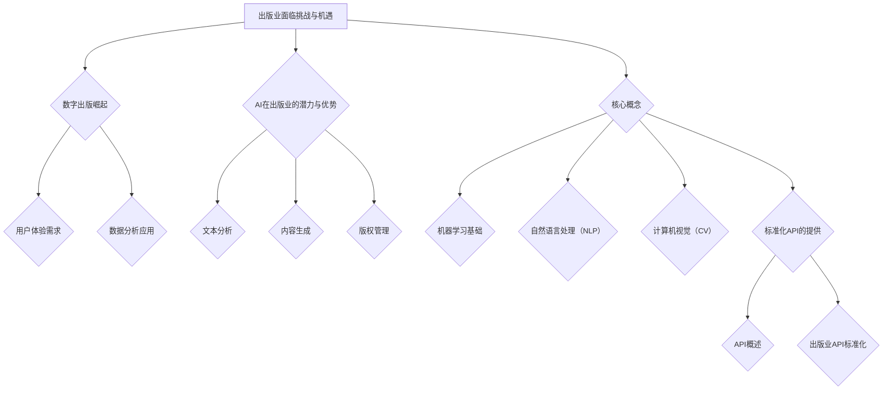

                 

### 第一部分：AI在出版业的应用背景与核心概念

#### 1.1.1 出版业面临的挑战与机遇

随着互联网和数字技术的迅猛发展，出版业正经历着一场深刻的变革。传统出版模式面临诸多挑战，而新兴的数字出版技术则为出版业带来了前所未有的机遇。

- **数字出版崛起**：传统出版业受到数字出版方式的冲击，数字化转型成为必然趋势。电子书、在线阅读、移动阅读等新兴模式正在逐步取代传统的纸质书籍。

- **用户体验需求**：读者对个性化、便捷的阅读体验需求不断提升。他们希望能够在任何时间、任何地点获取到他们感兴趣的内容，并且能够享受到更加智能化、个性化的推荐服务。

- **数据分析应用**：通过大数据分析提升出版物的市场预测和用户需求分析能力。出版商可以通过分析读者的阅读习惯、偏好和反馈，更好地了解市场需求，从而制定更加精准的出版策略。

#### 1.1.2 AI在出版业的潜力与优势

人工智能技术在出版业的潜力与优势主要体现在以下几个方面：

- **文本分析**：AI可以通过自然语言处理（NLP）技术自动识别文本的主题、情感、关键词等，从而提高编辑效率，减少人力成本。

- **内容生成**：AI可以智能生成文章摘要、推荐内容等，满足多样化需求。例如，自动生成新闻摘要、书籍推荐等，为读者提供更加丰富、个性化的阅读体验。

- **版权管理**：AI可以通过图像识别、自然语言处理等技术自动识别版权信息，从而简化版权管理的流程，提高版权保护的效果。

#### 1.2 核心概念

在深入探讨AI在出版业的应用之前，我们需要了解一些核心概念，包括机器学习基础、自然语言处理（NLP）和计算机视觉（CV）。

##### 1.2.1 机器学习基础

- **机器学习定义**：机器学习是人工智能的一个重要分支，它通过使用算法从数据中学习，进行预测或决策。机器学习算法可以分为监督学习、无监督学习和强化学习。

  - **监督学习**：监督学习是一种从标注数据中学习的方法，其目标是通过训练数据集来学习出一个能够对新数据进行预测的模型。
  
  - **无监督学习**：无监督学习是一种在没有标注数据的情况下，通过算法自动发现数据中的模式和结构的方法。
  
  - **强化学习**：强化学习是一种通过不断与环境互动来学习最优策略的方法，其目标是最大化长期回报。

##### 1.2.2 自然语言处理（NLP）

- **NLP基础**：自然语言处理是计算机科学、人工智能领域中的一个重要分支，旨在让计算机理解和处理人类语言。NLP主要包括文本预处理、词嵌入、语言模型等。

  - **文本预处理**：文本预处理是NLP中的第一步，主要包括去除标点符号、停用词过滤、分词等。
  
  - **词嵌入**：词嵌入是将单词映射到一个连续的向量空间，从而实现单词之间的语义关系建模。
  
  - **语言模型**：语言模型是一种预测下一个单词或词组的概率分布的模型，它对于文本生成和分类任务至关重要。

##### 1.2.3 计算机视觉（CV）

- **CV基础**：计算机视觉是研究如何使计算机从图像或视频中理解和提取信息的一门科学。CV主要包括图像预处理、特征提取、目标检测等。

  - **图像预处理**：图像预处理是CV中的第一步，主要包括图像增强、滤波、边缘检测等。
  
  - **特征提取**：特征提取是从图像中提取出具有区分性的特征，用于后续的图像分类、目标检测等任务。
  
  - **目标检测**：目标检测是从图像中识别并定位特定目标的位置，是CV中的一个重要应用。

##### 1.3 标准化API的提供

- **API概述**：API（应用程序编程接口）是不同系统之间进行数据交互的接口。它定义了如何访问和使用某个系统或服务的功能。

  - **API定义**：API是一套预定义的规则和协议，用于请求和返回数据。API可以是基于HTTP的RESTful API，也可以是基于SOAP的Web服务。

  - **API设计原则**：API设计应遵循简洁、易用、高效、可扩展等原则。良好的API设计可以简化开发工作，提高系统的兼容性和可维护性。

- **出版业API标准化**：

  - **API标准化的重要性**：API标准化是提高不同系统间兼容性和互操作性的关键。通过制定统一的API标准，可以实现数据的无缝对接，提高系统的集成度。

  - **常见的API标准**：常见的API标准包括RESTful API和SOAP等。

    - **RESTful API**：RESTful API是基于HTTP协议的一种API设计风格，它通过GET、POST、PUT、DELETE等HTTP方法实现数据的增删改查操作。

    - **SOAP**：SOAP（简单对象访问协议）是一种基于XML的Web服务协议，它通过定义SOAP消息的格式和传输方式，实现不同系统间的数据交换。

  - **出版业API案例**：在出版业中，常见的API包括内容检索API、版权信息查询API等。

    - **内容检索API**：内容检索API允许开发者查询和检索出版物的相关信息，如书籍标题、作者、出版社等。

    - **版权信息查询API**：版权信息查询API允许开发者查询特定作品的版权信息，如版权所有者、版权期限等。

#### 1.4 总结

- **AI在出版业的应用前景**：从内容生成、版权管理到用户体验提升，AI技术将在出版业发挥越来越重要的作用。随着AI技术的不断进步，我们可以预见AI将彻底改变出版业的运营模式，带来更加智能化、个性化的阅读体验。

- **标准化API的未来发展**：随着AI技术的不断进步，API的标准化将成为出版业数字化转型的关键因素。通过制定和推广统一的API标准，可以实现不同系统间的无缝对接，提高系统的兼容性和互操作性，从而推动出版业的数字化转型进程。

### Mermaid 流程图



### 伪代码讲解

```python
# 伪代码：文本分析算法

# 初始化模型参数
model = initialize_model()

# 预处理文本
preprocessed_text = preprocess_text(input_text)

# 训练模型
model.fit(preprocessed_text)

# 预测文本特征
predicted_features = model.predict(preprocessed_text)

# 提取关键词
keywords = extract_keywords(predicted_features)

# 输出关键词
print("关键词：", keywords)
```

### 数学公式讲解

$$
\text{AI技术进步} = f(\text{算法优化}, \text{数据处理能力}, \text{计算资源})
$$

其中，$f$表示函数，$\text{AI技术进步}$是算法优化、数据处理能力和计算资源的综合结果。

### 项目实战

- **项目背景**：某电子书平台希望利用AI技术优化书籍推荐系统，提高用户的阅读体验。

- **技术实现**：

  - **文本预处理**：对用户阅读历史和书籍内容进行分词、去除停用词等预处理操作。
  
  - **词嵌入**：使用预训练的词嵌入模型将文本转化为向量表示。
  
  - **推荐算法**：采用基于内容的推荐算法，根据用户阅读历史和书籍内容相似度进行推荐。

- **代码解读与分析**：

  ```python
  # 代码：书籍推荐系统
  
  import gensim
  from sklearn.metrics.pairwise import cosine_similarity
  
  # 预处理文本
  def preprocess_text(text):
      # 分词、去除停用词等操作
      return [word for word in text.split() if word not in stopwords]
  
  # 计算文本相似度
  def calculate_similarity(text1, text2):
      # 将文本转化为向量表示
      vector1 = model[text1]
      vector2 = model[text2]
      # 计算余弦相似度
      return cosine_similarity([vector1], [vector2])[0][0]
  
  # 推荐书籍
  def recommend_books(user_history, books, similarity_threshold):
      recommended_books = []
      for book in books:
          if calculate_similarity(user_history, book) > similarity_threshold:
              recommended_books.append(book)
      return recommended_books
  
  # 实例化模型和词嵌入
  model = gensim.models.Word2Vec()
  model = gensim.models.KeyedVectors.load_word2vec_format("word2vec.model")
  stopwords = set(["a", "an", "the", "in", "on", "at", "to", "of", "for", "with", "by", "and", "is", "are", "was", "were"])
  
  # 测试推荐系统
  user_history = preprocess_text("The Alchemist by Paulo Coelho")
  books = ["To Kill a Mockingbird by Harper Lee", "1984 by George Orwell", "The Great Gatsby by F. Scott Fitzgerald"]
  similarity_threshold = 0.8
  recommended_books = recommend_books(user_history, books, similarity_threshold)
  print("推荐书籍：", recommended_books)
  ```

通过上述代码，我们实现了基于内容的书籍推荐系统。该系统通过计算用户阅读历史和书籍内容的相似度，为用户推荐相似度较高的书籍。这不仅可以提高用户的阅读体验，还可以增加平台的用户粘性和阅读量。

### 作者信息

作者：AI天才研究院/AI Genius Institute & 禅与计算机程序设计艺术 /Zen And The Art of Computer Programming

---

以上为第一部分的内容，接下来我们将深入探讨AI在出版业的实际应用场景。我们将分章节详细解析内容生成与编辑辅助、版权管理与保护、读者行为分析与推荐、出版流程优化与自动化、数字化出版与电子书等关键领域，展示AI技术的广泛应用及其对出版业带来的深远影响。在接下来的章节中，我们将使用Mermaid流程图、伪代码、数学公式和项目实战等多种方式，逐步解析这些应用场景，为读者提供全面深入的技术解读。

