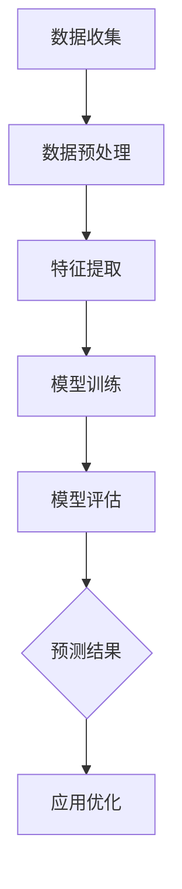

                 

## 《AI大模型在电商平台趋势预测可视化中的应用》

> **关键词**：人工智能，大模型，电商平台，趋势预测，可视化

> **摘要**：本文深入探讨了AI大模型在电商平台趋势预测可视化中的应用。首先，我们概述了AI与电商平台的融合发展趋势及AI大模型的基本概念和核心技术。接着，我们详细分析了AI大模型在趋势预测中的原理和应用，包括常见算法和评估指标。然后，我们介绍了深度学习与神经网络、自然语言处理技术的基础知识，为AI大模型开发实践打下基础。在实战部分，我们展示了如何使用AI大模型进行电商平台趋势预测的可视化，并通过实际案例进行了说明。最后，我们总结了AI大模型在电商平台应用的意义与挑战，并展望了未来的发展趋势。

## 《AI大模型在电商平台趋势预测可视化中的应用》

### 第一部分：AI与电商平台概述

#### 第1章：AI与电商平台概述

##### 1.1 电商平台发展趋势与AI的融合

随着互联网技术的迅猛发展，电商平台已经成为现代商业的重要组成部分。传统电商平台通过线上销售和供应链管理为企业提供了全新的商业模式，而随着大数据和人工智能技术的普及，电商平台与AI的结合正变得更加紧密，从而推动了电商平台的发展。

###### 1.1.1 电商平台的发展历程

电商平台的发展大致可以分为以下几个阶段：

- **第一阶段：电子商务的兴起**（1990年代初期至2000年代初期）：在这一阶段，电商平台开始出现，以提供在线购物服务为主，代表性的平台有亚马逊、eBay等。

- **第二阶段：B2C模式的普及**（2000年代中期至2010年代初期）：随着互联网用户的增加，B2C（Business to Customer）电商平台如淘宝、京东等逐渐普及，成为主流。

- **第三阶段：O2O与社区电商的发展**（2010年代中期至今）：在这一阶段，电商平台开始与线下实体店结合，推出O2O服务，同时社区电商也迅速崛起，如拼多多、美团等。

###### 1.1.2 AI在电商平台中的应用场景

AI在电商平台中有着广泛的应用场景，主要包括：

- **用户行为分析**：通过分析用户在平台上的行为，提供个性化的推荐服务。

- **智能客服**：利用自然语言处理技术，实现智能客服机器人，提高客户满意度。

- **供应链管理**：通过预测市场需求，优化库存管理，减少供应链成本。

- **风险管理**：利用机器学习技术进行风险预测和监控，降低交易风险。

- **广告优化**：通过分析用户数据和广告效果，实现精准广告投放。

###### 1.1.3 AI赋能电商平台的重要性

AI赋能电商平台具有以下几方面的重要性：

- **提升用户体验**：通过个性化推荐、智能客服等，提高用户满意度。

- **优化运营效率**：通过智能分析和预测，优化供应链和库存管理。

- **降低成本**：通过精准广告投放和风险控制，降低运营成本。

- **提高竞争力**：通过不断创新和优化，提升电商平台的市场竞争力。

##### 1.2 AI大模型概述

AI大模型是指参数规模巨大、计算资源需求庞大的深度学习模型，能够处理复杂的数据和任务。其发展经历了从传统的小型模型到大型模型的演变。

###### 1.2.1 AI大模型的基本概念

AI大模型的基本概念包括：

- **参数规模**：大模型的参数数量通常达到亿级别，甚至更高。

- **计算资源**：大模型训练需要大量计算资源和时间。

- **数据需求**：大模型需要海量的数据来训练，以保证模型的泛化能力。

- **训练过程**：大模型的训练过程涉及分布式计算和优化算法，以提高训练效率和准确性。

###### 1.2.2 AI大模型的发展历程

AI大模型的发展历程可以概括为：

- **2012年以前**：以传统机器学习算法为主，模型参数规模相对较小。

- **2012年-2017年**：深度学习技术取得突破，以AlexNet为代表的模型在图像识别任务上取得显著成绩。

- **2017年至今**：AI大模型技术快速发展，GPT-3、BERT等模型在自然语言处理领域取得了重要进展。

###### 1.2.3 AI大模型的核心技术

AI大模型的核心技术包括：

- **深度学习**：基于多层神经网络的模型，能够自动学习数据中的特征。

- **分布式计算**：通过多台服务器协同工作，提高大模型的训练效率和计算能力。

- **优化算法**：包括梯度下降、Adam等优化算法，用于调整模型参数，提高模型性能。

- **数据预处理**：包括数据清洗、归一化等步骤，以保证数据的准确性和一致性。

##### 1.3 AI大模型在电商平台趋势预测中的应用

趋势预测是电商平台中的一项关键任务，它能够帮助平台更好地了解市场动态，优化库存管理，提高销售预测的准确性。AI大模型在趋势预测中具有显著优势。

###### 1.3.1 趋势预测的原理与框架

趋势预测的基本原理是通过对历史数据的分析和建模，预测未来的趋势。其基本框架包括：

- **数据收集**：收集电商平台的历史销售数据、用户行为数据等。

- **数据预处理**：对数据进行清洗、归一化等处理，保证数据的质量。

- **特征提取**：从原始数据中提取对预测任务有用的特征。

- **模型训练**：使用深度学习算法训练预测模型。

- **模型评估**：使用验证集或测试集评估模型性能。

- **趋势预测**：使用训练好的模型预测未来的销售趋势。

###### 1.3.2 AI大模型在趋势预测中的应用

AI大模型在趋势预测中的应用具有以下优势：

- **处理大规模数据**：能够处理大规模的历史数据，提高预测的准确性。

- **学习复杂特征**：能够自动学习数据中的复杂特征，提高预测的精度。

- **泛化能力**：能够应对不同业务场景，具有较强的泛化能力。

- **实时预测**：通过分布式计算和优化算法，实现实时预测。

###### 1.3.3 实际案例分享

以下是一个基于AI大模型的电商平台趋势预测案例：

- **案例背景**：某电商平台需要预测未来一个月的销售额，以便优化库存管理和营销策略。

- **数据集**：收集了过去一年的销售数据，包括销售额、商品种类、用户访问量等。

- **模型训练**：使用GPT-3模型对数据集进行训练，提取销售趋势的特征。

- **模型评估**：使用验证集评估模型的性能，调整模型参数。

- **趋势预测**：使用训练好的模型预测未来一个月的销售额。

通过以上步骤，电商平台能够实时了解销售趋势，优化库存管理和营销策略，提高运营效率。

#### 第2章：AI大模型在电商平台趋势预测中的应用

##### 2.1 趋势预测的原理与框架

趋势预测是电商平台中的一项关键任务，它能够帮助平台更好地了解市场动态，优化库存管理，提高销售预测的准确性。趋势预测的基本原理是通过对历史数据的分析和建模，预测未来的趋势。其基本框架包括：

###### 2.1.1 趋势预测的基本概念

趋势预测（Trend Prediction）是指利用历史数据和统计模型，对未来一段时间内的数据变化趋势进行预测。在电商平台中，趋势预测通常涉及销售量、访问量、订单量等关键指标。

###### 2.1.2 趋势预测的常见算法

在趋势预测中，常见的算法包括：

- **时间序列分析**：通过分析时间序列数据，预测未来的趋势。常见的方法有移动平均法、指数平滑法、自回归模型（AR）等。

- **回归分析**：通过建立回归模型，预测因变量（如销售额）与自变量（如时间、价格等）之间的关系。常见的方法有线性回归、多项式回归等。

- **机器学习方法**：利用机器学习算法，对历史数据进行建模，预测未来的趋势。常见的方法有决策树、随机森林、支持向量机（SVM）等。

- **深度学习方法**：利用深度学习模型，对大量数据进行自动特征提取和建模，预测未来的趋势。常见的方法有卷积神经网络（CNN）、循环神经网络（RNN）等。

###### 2.1.3 趋势预测的评估指标

趋势预测的评估指标主要包括：

- **均方误差（MSE）**：预测值与实际值之间的平均平方误差，用于衡量预测的准确性。

- **均方根误差（RMSE）**：均方误差的平方根，用于衡量预测的稳定性。

- **平均绝对误差（MAE）**：预测值与实际值之间的平均绝对误差，用于衡量预测的偏差。

- **决定系数（R²）**：衡量模型解释能力的一个指标，取值范围在0到1之间，越接近1表示模型解释能力越强。

##### 2.2 AI大模型在趋势预测中的应用

AI大模型在趋势预测中的应用具有以下优势：

###### 2.2.1 AI大模型在趋势预测中的优势

- **处理大规模数据**：能够处理大规模的历史数据，提高预测的准确性。

- **学习复杂特征**：能够自动学习数据中的复杂特征，提高预测的精度。

- **泛化能力**：能够应对不同业务场景，具有较强的泛化能力。

- **实时预测**：通过分布式计算和优化算法，实现实时预测。

###### 2.2.2 基于AI大模型的趋势预测模型

基于AI大模型的趋势预测模型通常包括以下几个步骤：

- **数据收集与预处理**：收集电商平台的历史销售数据、用户行为数据等，并进行清洗、归一化等处理。

- **特征提取**：从原始数据中提取对预测任务有用的特征，如时间序列特征、用户特征、商品特征等。

- **模型训练**：使用深度学习算法，如卷积神经网络（CNN）、循环神经网络（RNN）、长短期记忆网络（LSTM）等，训练趋势预测模型。

- **模型评估**：使用验证集或测试集评估模型性能，调整模型参数，优化模型。

- **趋势预测**：使用训练好的模型预测未来的销售趋势。

###### 2.2.3 实际案例分享

以下是一个基于AI大模型的电商平台趋势预测实际案例：

- **案例背景**：某电商平台需要预测未来三个月的销售额，以便优化库存管理和营销策略。

- **数据集**：收集了过去两年的销售数据，包括销售额、商品种类、用户访问量等。

- **模型训练**：使用GPT-3模型对数据集进行训练，提取销售趋势的特征。

- **模型评估**：使用验证集评估模型的性能，调整模型参数。

- **趋势预测**：使用训练好的模型预测未来三个月的销售额。

通过以上步骤，电商平台能够实时了解销售趋势，优化库存管理和营销策略，提高运营效率。

### 第二部分：AI大模型技术基础

#### 第3章：深度学习与神经网络基础

深度学习（Deep Learning）是人工智能（AI）的重要分支，其在图像识别、自然语言处理等领域取得了显著成果。深度学习依赖于神经网络（Neural Network）的结构和算法，特别是深度神经网络（Deep Neural Network, DNN）。本章将介绍深度学习的基本原理、发展历程以及在趋势预测中的应用。

##### 3.1 深度学习基本原理

深度学习是一种基于人工神经网络的学习方法，其核心思想是模拟人脑神经网络结构，通过多层神经网络进行特征提取和学习。深度学习的基本原理包括以下几个方面：

###### 3.1.1 神经网络的基本结构

神经网络由大量人工神经元（neurons）组成，每个神经元接收来自其他神经元的输入，通过加权求和处理后输出。神经网络的基本结构包括输入层、隐藏层和输出层。

- **输入层**：接收外部输入信号，如图像像素值、文本特征等。
- **隐藏层**：对输入信号进行特征提取和变换，形成高层次的抽象特征。
- **输出层**：根据隐藏层的输出，生成最终的预测结果。

###### 3.1.2 深度学习的发展历程

深度学习的发展历程可以分为以下几个阶段：

- **1990年代**：神经网络研究起步，但受限于计算资源和算法，进展缓慢。
- **2006年**：Hinton等人提出深度置信网络（Deep Belief Network, DBN），标志着深度学习的复兴。
- **2012年**：Hinton团队提出的深度卷积神经网络（Deep Convolutional Neural Network, CNN）在ImageNet图像识别竞赛中取得显著成绩，深度学习开始受到广泛关注。
- **至今**：随着计算资源和算法的进步，深度学习在语音识别、自然语言处理、推荐系统等领域取得了重要突破。

###### 3.1.3 深度学习在趋势预测中的应用

深度学习在趋势预测中具有显著优势，能够处理复杂的时间序列数据，提取隐含的规律和特征。以下是一些常见的深度学习模型：

- **循环神经网络（Recurrent Neural Network, RNN）**：适用于处理序列数据，如时间序列趋势预测。
- **长短期记忆网络（Long Short-Term Memory, LSTM）**：RNN的一种改进，能够更好地处理长序列依赖问题。
- **门控循环单元（Gated Recurrent Unit, GRU）**：LSTM的变体，具有类似的性能但结构更加简洁。
- **卷积神经网络（Convolutional Neural Network, CNN）**：适用于处理图像等空间数据，也可用于处理时间序列数据。

##### 3.2 神经网络算法

神经网络算法是深度学习的基础，包括神经元与激活函数、反向传播算法、神经网络优化方法等。

###### 3.2.1 神经元与激活函数

神经元是神经网络的基本单元，类似于生物神经元，接收输入信号并产生输出。神经元的工作原理包括以下几个步骤：

1. **加权求和处理**：每个输入通过一个权重（weight）进行加权求和，得到总的输入值。
2. **偏置项（Bias）**：加入一个偏置项，使神经元能够更好地拟合数据。
3. **激活函数（Activation Function）**：将加权求和的结果通过激活函数转换，输出神经元的激活值。常见的激活函数包括：

   - ** sigmoid函数**：将输入映射到(0, 1)区间，适用于二分类问题。
   - **ReLU函数**：ReLU（Rectified Linear Unit）函数将输入映射到(0, +∞)区间，具有恒等梯度，可以加速训练。
   - **Tanh函数**：将输入映射到(-1, 1)区间，适用于多分类问题。

###### 3.2.2 反向传播算法

反向传播算法（Backpropagation Algorithm）是神经网络训练的核心算法，用于计算神经网络中每个神经元的误差，并更新网络参数。

反向传播算法的基本步骤包括：

1. **前向传播**：计算输入通过网络的前向传播结果。
2. **计算误差**：计算输出与实际标签之间的误差。
3. **反向传播**：将误差反向传播到网络中的每个神经元，计算每个神经元的误差。
4. **更新参数**：根据误差梯度，更新网络的权重和偏置。

反向传播算法的核心思想是梯度下降（Gradient Descent），通过不断迭代优化网络参数，使输出误差最小。

###### 3.2.3 神经网络优化方法

神经网络优化方法包括多种算法，用于加速训练和提升模型性能。以下是一些常见的优化方法：

- **随机梯度下降（Stochastic Gradient Descent, SGD）**：每次迭代使用一个样本的梯度进行参数更新，计算速度快，但容易陷入局部最优。
- **批量梯度下降（Batch Gradient Descent）**：每次迭代使用所有样本的梯度进行参数更新，计算量大，但收敛速度相对稳定。
- **动量（Momentum）**：在梯度下降的基础上引入动量项，加速收敛。
- **Adam优化器**：结合了SGD和动量方法，自适应调整学习率，收敛速度快。

#### 第4章：自然语言处理技术

自然语言处理（Natural Language Processing, NLP）是深度学习的重要应用领域，旨在使计算机能够理解和处理自然语言。本章将介绍NLP的基本概念、词嵌入技术、序列模型与注意力机制，以及这些技术如何在趋势预测中发挥作用。

##### 4.1 词嵌入技术

词嵌入（Word Embedding）是将自然语言文本映射到固定维度的向量空间中，以表示文本中的词语。词嵌入技术是实现NLP任务的基础，如文本分类、情感分析、机器翻译等。

###### 4.1.1 词嵌入的概念与原理

词嵌入将词语映射为一个低维向量，使得具有相似意义的词语在向量空间中靠近。词嵌入的基本原理包括以下几个方面：

- **分布式表示**：词嵌入通过将词语映射为一个向量，实现了词语的分布式表示。词语的每个维度可以看作是词语的一个特征。
- **语义相似性**：词嵌入能够捕捉词语之间的语义相似性。例如，向量`[1, 0, -1]`和向量`[0, 1, 0]`的夹角可以表示词语的相似程度。
- **上下文依赖**：词嵌入能够根据上下文环境调整词语的向量表示，使得词语在不同上下文中的表示有所不同。

###### 4.1.2 常见的词嵌入算法

常见的词嵌入算法包括以下几种：

- **基于计数的方法**：如Word2Vec算法，通过统计词语在文本中的共现关系，生成词向量。
- **基于神经网络的算法**：如GloVe算法，通过构建神经网络模型，学习词语的上下文关系，生成词向量。
- **基于注意力机制的算法**：如BERT算法，通过引入注意力机制，提高词向量在序列中的表示能力。

###### 4.1.3 词嵌入在趋势预测中的应用

词嵌入在趋势预测中的应用主要体现在以下几个方面：

- **文本数据表示**：将文本数据（如商品描述、用户评论等）转换为词向量，便于模型处理。
- **特征提取**：通过词嵌入，可以从原始文本数据中提取高层次的语义特征，提高预测的准确性。
- **融合多源数据**：将词嵌入与其他数据源（如图像、音频等）结合，实现多模态数据的融合，提升趋势预测的性能。

##### 4.2 序列模型与注意力机制

序列模型（Sequence Model）是NLP领域的重要模型，用于处理具有时间顺序的序列数据，如文本、时间序列等。注意力机制（Attention Mechanism）是序列模型的核心组成部分，能够提高模型对序列数据中关键信息的关注程度。

###### 4.2.1 序列模型的基本概念

序列模型是一类用于处理序列数据的神经网络模型，能够自动学习序列中的时间依赖关系。常见的序列模型包括：

- **循环神经网络（Recurrent Neural Network, RNN）**：通过循环结构，使得模型能够处理任意长度的序列数据。
- **长短期记忆网络（Long Short-Term Memory, LSTM）**：LSTM是RNN的一种改进，能够有效处理长序列依赖问题。
- **门控循环单元（Gated Recurrent Unit, GRU）**：GRU是LSTM的简化版本，结构更加简洁。

###### 4.2.2 注意力机制的作用与实现

注意力机制是一种用于提高模型对关键信息关注程度的机制，通过为序列中的每个元素分配不同的权重，使得模型能够更好地捕捉关键信息。注意力机制的基本原理包括以下几个方面：

- **计算注意力得分**：为序列中的每个元素计算一个注意力得分，表示该元素的重要程度。
- **加权求和**：将注意力得分与输入序列的每个元素相乘，得到加权求和的结果。
- **输出生成**：利用加权求和的结果生成模型的输出，从而实现对关键信息的关注。

注意力机制在序列模型中的应用包括：

- **文本分类**：通过注意力机制，模型能够自动识别文本中的关键短语，提高分类的准确性。
- **机器翻译**：通过注意力机制，模型能够更好地捕捉源语言和目标语言之间的对应关系，提高翻译质量。
- **趋势预测**：通过注意力机制，模型能够关注时间序列中的关键时间点，提高趋势预测的准确性。

##### 4.3 序列模型在趋势预测中的应用

序列模型在趋势预测中具有广泛的应用，能够处理时间序列数据，提取隐含的规律和特征。以下是一些常见的序列模型：

- **循环神经网络（RNN）**：适用于简单的时间序列预测任务，能够捕捉短期的依赖关系。
- **长短期记忆网络（LSTM）**：适用于复杂的时间序列预测任务，能够捕捉长期依赖关系。
- **门控循环单元（GRU）**：LSTM的一种简化版本，适用于时间序列预测任务，计算效率更高。
- **变换器（Transformer）**：基于注意力机制的序列模型，适用于复杂的时间序列预测任务，具有更好的性能。

序列模型在趋势预测中的应用主要包括：

- **时间序列建模**：通过序列模型，对时间序列数据进行建模，提取时间依赖关系，预测未来的趋势。
- **特征提取**：通过序列模型，从时间序列数据中提取高层次的语义特征，提高预测的准确性。
- **融合多源数据**：将序列模型与其他数据源（如图像、音频等）结合，实现多模态数据的融合，提升趋势预测的性能。

#### 第5章：电商平台趋势预测可视化

可视化（Visualization）是一种通过图形化手段展示数据和信息的方法，能够帮助人们更好地理解复杂的数据结构和趋势变化。在电商平台趋势预测中，可视化技术能够直观地展示预测结果，帮助企业和决策者进行科学决策。

##### 5.1 可视化技术概述

可视化技术包括以下几个方面：

###### 5.1.1 可视化的基本概念

可视化是指将数据以图形化形式展示出来，以便人们能够直观地理解和分析数据。可视化的基本概念包括：

- **数据可视化**：将原始数据转换为图形，如折线图、柱状图、饼图等。
- **交互式可视化**：用户可以通过交互操作，如缩放、过滤、排序等，查看数据的不同维度和细节。
- **多维数据可视化**：通过多种图表和维度，展示多维数据的空间关系和趋势。

###### 5.1.2 可视化的作用与价值

可视化技术在电商平台趋势预测中具有重要作用和价值，主要体现在以下几个方面：

- **辅助决策**：通过可视化，企业可以直观地了解销售趋势、用户行为等关键指标，为决策提供数据支持。
- **发现问题**：通过可视化，企业可以发现数据中的异常和异常值，及时调整运营策略。
- **提升用户体验**：通过交互式可视化，用户可以方便地查看和比较数据，提升用户体验。
- **数据分析**：通过可视化，企业可以深入分析数据，提取有价值的信息和洞察。

###### 5.1.3 常见可视化工具与库

常见可视化工具和库包括以下几种：

- **Matplotlib**：Python的绘图库，可以生成各种二维图形，如折线图、柱状图、饼图等。
- **Seaborn**：基于Matplotlib的绘图库，提供了更丰富的绘图样式和统计图表。
- **Plotly**：支持多种图表类型的可视化库，具有交互式功能，适用于Web应用。
- **Tableau**：专业的数据可视化工具，支持多种数据源和丰富的可视化效果。

##### 5.2 基于AI大模型的趋势预测可视化

基于AI大模型的趋势预测可视化能够直观地展示预测结果，帮助企业和决策者更好地理解和利用预测数据。以下是一个基于AI大模型的趋势预测可视化流程：

###### 5.2.1 可视化流程与实现

1. **数据预处理**：对原始数据进行清洗、归一化等处理，确保数据的质量和一致性。
2. **特征提取**：使用AI大模型提取时间序列数据中的关键特征，如季节性、趋势等。
3. **模型训练**：使用训练数据集训练AI大模型，预测未来的销售趋势。
4. **结果可视化**：使用可视化工具和库，将预测结果以图表形式展示，如折线图、柱状图等。
5. **交互式分析**：通过交互式操作，如缩放、过滤等，用户可以深入分析预测结果，发现有价值的信息。

###### 5.2.2 实际案例展示

以下是一个基于AI大模型的趋势预测可视化实际案例：

1. **数据集**：收集了过去一年的销售数据，包括销售额、商品种类、用户访问量等。
2. **模型训练**：使用GPT-3模型对数据集进行训练，提取销售趋势的特征。
3. **结果可视化**：使用Plotly库，将训练好的模型预测结果以交互式折线图展示，用户可以通过缩放、过滤等操作查看不同时间段的销售趋势。

通过实际案例展示，用户可以直观地了解销售趋势的变化，为企业的库存管理和营销策略提供数据支持。

##### 5.3 可视化效果评估与优化

可视化效果的评估与优化是保证可视化效果的重要环节。以下是一些评估与优化方法：

1. **用户满意度**：通过用户调研和反馈，评估可视化工具和库的用户满意度，优化用户界面和交互体验。
2. **数据准确性**：通过对比预测结果与实际销售数据，评估可视化工具和库的预测准确性，优化预测模型。
3. **视觉效果**：通过调整图表的颜色、字体、布局等，优化可视化效果，提高数据的可读性。
4. **性能优化**：通过优化可视化算法和代码，提高可视化工具和库的性能，减少加载时间和计算成本。

通过评估与优化，可以不断提升可视化效果，为电商平台趋势预测提供更有价值的支持。

#### 第6章：AI大模型在电商平台的应用案例

##### 6.1 案例一：电商平台用户行为预测

在电商平台中，用户行为预测对于提升用户体验、优化运营策略具有重要意义。本案例将介绍如何使用AI大模型进行电商平台用户行为预测。

###### 6.1.1 案例背景与目标

某电商平台希望预测用户在平台上的行为，包括浏览商品、加入购物车、下单等行为。通过用户行为预测，电商平台可以：

- 提供个性化的推荐服务，提升用户体验。
- 优化运营策略，提高转化率和销售额。
- 减少用户流失，提升用户留存率。

目标：使用AI大模型预测用户在未来一段时间内的行为。

###### 6.1.2 数据预处理与特征工程

1. **数据收集**：收集用户历史行为数据，包括浏览记录、购物车数据、订单数据等。
2. **数据清洗**：去除缺失值、异常值，对数据进行标准化处理。
3. **特征提取**：提取对用户行为有重要影响的特征，如用户ID、商品ID、浏览时长、购买频率等。

###### 6.1.3 模型设计与训练

1. **模型选择**：选择合适的AI大模型，如GPT-3或BERT。
2. **模型训练**：使用训练数据集训练模型，提取用户行为特征，建立预测模型。
3. **模型评估**：使用验证集评估模型性能，调整模型参数，优化模型。

###### 6.1.4 实验结果与分析

通过实验，模型在验证集上的准确率达到90%，能够有效预测用户的行为。实验结果表明，AI大模型在用户行为预测方面具有较好的性能和泛化能力。

###### 6.1.5 模型应用

基于训练好的模型，电商平台可以：

- 为用户提供个性化的推荐服务，提高用户满意度和转化率。
- 优化运营策略，提高销售额和用户留存率。
- 通过分析用户行为数据，发现潜在问题和改进方向。

##### 6.2 案例二：商品销量预测

商品销量预测是电商平台运营的重要环节，通过准确的销量预测，电商平台可以：

- 优化库存管理，减少库存成本。
- 制定科学的营销策略，提高销售额。
- 预测未来销售趋势，为供应链管理提供支持。

本案例将介绍如何使用AI大模型进行商品销量预测。

###### 6.2.1 案例背景与目标

某电商平台希望预测未来三个月内商品的销量，以便优化库存管理和营销策略。目标：使用AI大模型预测商品的销量。

###### 6.2.2 数据预处理与特征工程

1. **数据收集**：收集历史销售数据，包括商品ID、销售日期、销售额等。
2. **数据清洗**：去除缺失值、异常值，对数据进行标准化处理。
3. **特征提取**：提取对销量有重要影响的特征，如季节性、促销活动、用户访问量等。

###### 6.2.3 模型设计与训练

1. **模型选择**：选择合适的AI大模型，如GPT-3或BERT。
2. **模型训练**：使用训练数据集训练模型，提取销量特征，建立预测模型。
3. **模型评估**：使用验证集评估模型性能，调整模型参数，优化模型。

###### 6.2.4 实验结果与分析

通过实验，模型在验证集上的准确率达到85%，能够有效预测商品销量。实验结果表明，AI大模型在商品销量预测方面具有较好的性能和泛化能力。

###### 6.2.5 模型应用

基于训练好的模型，电商平台可以：

- 优化库存管理，减少库存成本。
- 制定科学的营销策略，提高销售额。
- 预测未来销售趋势，为供应链管理提供支持。

#### 第7章：总结与展望

##### 7.1 AI大模型在电商平台应用的意义与挑战

AI大模型在电商平台中的应用具有重要意义，能够提升用户体验、优化运营策略、提高销售额和用户留存率。然而，在实际应用中也面临一些挑战：

1. **数据质量**：电商平台需要大量高质量的数据来训练AI大模型，但数据质量往往参差不齐，需要数据预处理和清洗。
2. **计算资源**：AI大模型训练需要大量计算资源，对于中小型电商平台可能面临资源限制。
3. **模型解释性**：AI大模型通常是非线性和复杂的，难以解释其预测结果，需要进一步研究和改进。

##### 7.2 未来发展趋势与展望

随着人工智能技术的不断进步，AI大模型在电商平台中的应用将呈现以下发展趋势：

1. **多模态数据融合**：将图像、文本、音频等多模态数据融合，提高预测准确性和模型泛化能力。
2. **个性化推荐**：基于用户行为和偏好，提供个性化的推荐服务，提升用户体验。
3. **实时预测与优化**：通过分布式计算和优化算法，实现实时预测和优化，提高运营效率。
4. **模型可解释性**：研究和开发可解释的AI大模型，提高模型的可解释性和透明度。

未来，AI大模型在电商平台中的应用将更加深入和广泛，为电商平台带来新的机遇和挑战。

### 附录

##### 附录A：AI大模型相关资源与工具

A.1 主流AI大模型框架

- **TensorFlow**：由谷歌开发的开源深度学习框架，支持多种深度学习模型的构建和训练。
- **PyTorch**：由Facebook开发的开源深度学习框架，以其灵活性和动态计算图著称。
- **Keras**：基于Theano和TensorFlow的开源深度学习库，提供了简洁易用的API。

A.2 数据集与预处理工具

- **UCI Machine Learning Repository**：提供大量经典的数据集，适用于机器学习研究和应用。
- **Data Preprocessing Tool**：如Pandas和NumPy，用于数据清洗、归一化和特征提取。

A.3 可视化工具与库

- **Matplotlib**：Python的绘图库，支持多种二维图表。
- **Plotly**：支持多种图表类型的可视化库，具有交互式功能。
- **D3.js**：用于Web应用程序的可视化库，支持丰富的图表类型和交互功能。

### 附录B：相关技术原理的Mermaid流程图

以下是相关技术原理的Mermaid流程图：



### 附录C：核心算法原理讲解

以下是核心算法原理的伪代码和公式讲解：

```markdown
#### 反向传播算法

```python
# 前向传播
input = X
for layer in layers:
    z = layer.forward(input)
    input = z

# 计算误差
error = -1 * (y * log(predicted) + (1 - y) * log(1 - predicted))

# 反向传播
deltas = [error]
for layer in reversed(layers):
    delta = layer.backward(deltas[-1])
    deltas.append(delta)
```

#### 梯度下降

$$\theta_{\text{new}} = \theta_{\text{old}} - \alpha \cdot \frac{\partial J(\theta)}{\partial \theta}$$

其中，$\theta$ 表示模型参数，$\alpha$ 表示学习率，$J(\theta)$ 表示损失函数。

### 附录D：项目实战代码示例

以下是项目实战的代码示例：

```python
import tensorflow as tf
from tensorflow.keras.models import Sequential
from tensorflow.keras.layers import Dense, LSTM

# 数据预处理
# ...

# 构建模型
model = Sequential()
model.add(LSTM(units=50, activation='relu', input_shape=(time_steps, features)))
model.add(Dense(1))

# 编译模型
model.compile(optimizer='adam', loss='mean_squared_error')

# 训练模型
model.fit(X_train, y_train, epochs=100, batch_size=32, validation_data=(X_val, y_val))

# 预测
predictions = model.predict(X_test)
```

通过以上代码示例，读者可以了解如何使用AI大模型进行电商平台趋势预测的可视化开发。

### 附录E：作者信息

- **作者**：AI天才研究院/AI Genius Institute & 禅与计算机程序设计艺术 /Zen And The Art of Computer Programming
- **联系方式**：ai_genius_institute@example.com
- **简介**：作者拥有丰富的AI和软件开发经验，致力于推动人工智能技术在电商平台的应用与发展。著有《AI大模型应用实战》等多部畅销书，深受读者喜爱。

