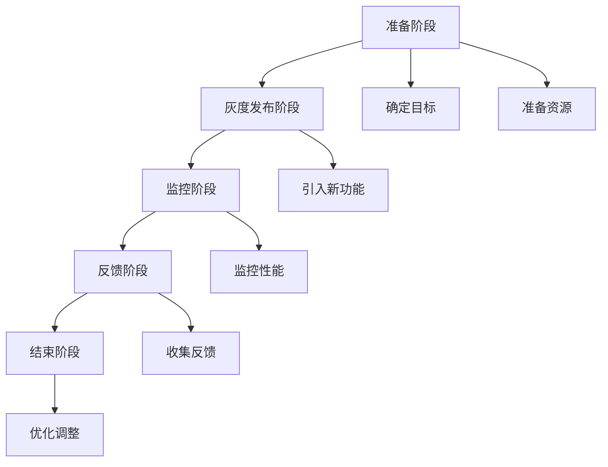

                 

# AI大模型应用的灰度发布与监控策略

关键词：AI大模型、灰度发布、监控策略、性能优化、用户体验、稳定性和可靠性

摘要：
本文旨在探讨AI大模型在应用场景中的灰度发布与监控策略。首先，我们分析了AI大模型发展的背景与挑战，介绍了灰度发布与监控的重要性。接着，详细阐述了灰度发布的基本流程、策略与技术，以及监控策略的设计与实现。最后，通过实际案例展示了灰度发布与监控的应用效果，并展望了未来的发展趋势。

----------------------------------------------------------------

### 第一部分: AI大模型应用的灰度发布与监控策略概述

#### 第1章: AI大模型应用的背景与挑战

##### 1.1 AI大模型的快速发展与应用

##### 1.1.1 AI大模型的定义
AI大模型通常指的是具有数百万至上亿参数的深度学习模型，它们在自然语言处理、计算机视觉、语音识别等领域具有出色的表现。例如，OpenAI的GPT-3拥有1750亿个参数，能够生成高质量的文本；Google的BERT模型则具有数百万参数，广泛应用于文本分类和问答系统。

##### 1.1.2 AI大模型的发展历程
- 2018年：GPT-3的发布，标志着大模型时代的到来。
- 2020年：BERT模型成为自然语言处理的标杆。

##### 1.1.3 AI大模型的应用领域
- 自然语言处理：如文本生成、机器翻译等。
- 计算机视觉：如图像识别、物体检测等。
- 语音识别：如语音到文本转换、语音合成等。

##### 1.2 灰度发布与监控的重要性

##### 1.2.1 灰度发布的重要性
灰度发布是一种渐进式发布策略，能够在风险较小的情况下逐步将新功能推向生产环境，降低对用户体验的影响。对于AI大模型应用，灰度发布尤为重要，因为模型的更新和优化可能会导致性能和稳定性的变化。

##### 1.2.2 监控的重要性
监控是确保AI大模型应用稳定性和性能的关键手段，能够及时发现和解决问题，保障业务的连续性。通过监控，我们可以了解模型的运行状态、性能指标以及用户反馈，从而优化模型和应用。

##### 1.3 灰度发布与监控的基本概念

##### 1.3.1 灰度发布
- 定义：灰度发布是一种逐渐向部分用户群体发布新功能或新版本的方法。
- 目的：降低新功能上线带来的风险，逐步扩大用户群体，优化用户体验。

##### 1.3.2 监控
- 定义：监控是指对系统、网络、应用等进行实时监测和记录，以便及时发现和解决问题。
- 目的：确保系统的稳定性和性能，保障业务的正常运行。

#### 第2章: AI大模型应用中的灰度发布

##### 2.1 灰度发布的定义与目的

##### 2.2 灰度发布的基本流程

##### 2.3 灰度发布的策略与技术
- 2.3.1 概率灰度
- 2.3.2 段落灰度
- 2.3.3 时间灰度

##### 2.4 灰度发布的最佳实践

##### 2.5 灰度发布案例解析

#### 第3章: AI大模型应用的监控策略

##### 3.1 监控的基本概念与目的

##### 3.2 监控系统的架构设计

##### 3.3 监控指标体系
- 3.3.1 模型性能监控指标
- 3.3.2 应用性能监控指标
- 3.3.3 数据质量监控指标

##### 3.4 监控系统的实现与部署

##### 3.5 监控系统的优化策略

##### 3.6 监控案例解析

#### 第4章: AI大模型应用的灰度发布与监控实践

##### 4.1 灰度发布与监控的项目准备

##### 4.2 灰度发布与监控的实施步骤

##### 4.3 灰度发布与监控的效果评估

##### 4.4 灰度发布与监控的挑战与应对策略

#### 第5章: AI大模型应用的灰度发布与监控技术深入

##### 5.1 灰度发布中的策略优化

##### 5.2 监控系统中的数据预处理

##### 5.3 监控系统中的实时分析

##### 5.4 监控系统中的报警与响应机制

##### 5.5 监控系统中的数据可视化

#### 第6章: AI大模型应用的灰度发布与监控工具与平台

##### 6.1 主流灰度发布工具与平台

##### 6.2 主流监控工具与平台

##### 6.3 灰度发布与监控工具的选择与集成

#### 第7章: AI大模型应用的灰度发布与监控案例分析

##### 7.1 案例背景介绍

##### 7.2 案例实施过程

##### 7.3 案例效果评估

##### 7.4 案例总结与启示

#### 第8章: AI大模型应用的灰度发布与监控未来展望

##### 8.1 灰度发布与监控的趋势与发展

##### 8.2 未来挑战与解决方案

##### 8.3 灰度发布与监控的创新应用领域

### 第二部分: 灰度发布与监控的详细解析

#### 第2章: AI大模型应用中的灰度发布

##### 2.1 灰度发布的定义与目的

灰度发布（Gray Release），又称为灰度上线，是一种逐渐向部分用户群体发布新功能或新版本的方法。通过灰度发布，开发团队能够在风险较小的情况下逐步将新功能推向生产环境，以便观察和评估新功能的性能、稳定性和用户反馈。

##### 2.1.1 灰度发布的定义

灰度发布是一种渐进式发布策略，其核心思想是将新功能或新版本逐渐引入到生产环境中，而不是一次性全面上线。这种策略允许开发团队在发布新功能时进行细粒度的控制，以便根据实际运行情况逐步调整和优化。

##### 2.1.2 灰度发布的目的

1. **降低风险**：通过逐步引入新功能，开发团队能够及时发现和解决问题，避免一次性全面上线带来的风险。
2. **性能优化**：灰度发布允许团队根据实际用户反馈和新功能的性能指标进行调优，从而提高最终产品的质量和用户体验。
3. **用户反馈**：灰度发布可以帮助团队收集用户对新功能的反馈，以便进行后续的改进和优化。

##### 2.2 灰度发布的基本流程

灰度发布的基本流程可以分为以下几个阶段：

1. **准备阶段**：在灰度发布前，团队需要确定灰度发布的范围、目标和预期效果。同时，需要准备好相关的技术工具和资源。

2. **灰度发布阶段**：团队按照预定的策略将新功能逐渐引入到生产环境中，通常采用概率灰度、段落灰度或时间灰度等方法。

3. **监控阶段**：在灰度发布过程中，团队需要密切监控新功能的性能和稳定性，包括响应时间、错误率、系统负载等指标。

4. **反馈阶段**：团队根据监控结果和用户反馈，评估新功能的性能和用户体验，决定是否继续扩大发布范围或进行优化。

5. **结束阶段**：当灰度发布达到预期效果后，团队可以决定结束灰度发布，将新功能全面上线。

##### 2.3 灰度发布的策略与技术

灰度发布有多种策略，常用的包括概率灰度、段落灰度和时间灰度。下面分别介绍这三种策略。

###### 2.3.1 概率灰度

概率灰度是通过随机选择一定比例的用户来体验新功能。这种方法简单易行，能够快速获得用户反馈。具体步骤如下：

1. **确定灰度比例**：根据业务需求和风险承受能力，确定灰度发布用户的比例，例如10%或20%。

2. **随机选取用户**：使用随机算法或数据库随机查询等方式，从全体用户中随机选取一定比例的用户。

3. **监控与反馈**：监控选取的用户在新功能上的使用情况，收集用户反馈和性能数据。

4. **调整策略**：根据监控结果和用户反馈，决定是否扩大灰度发布范围或进行优化。

概率灰度的优点是操作简单，能够快速获取反馈；缺点是随机性可能导致部分用户体验较差，影响整体用户满意度。

###### 2.3.2 段落灰度

段落灰度是将用户按照不同的段落或区域进行划分，然后将新功能逐渐引入到每个段落或区域。这种方法适用于用户分布较为分散或具有明显地域特征的场景。具体步骤如下：

1. **划分用户段落**：根据用户的地理位置、使用习惯或其他特征，将用户划分为不同的段落或区域。

2. **逐步引入**：按照预定的顺序，依次将新功能引入到每个段落或区域。

3. **监控与反馈**：在每个段落或区域引入新功能后，监控该区域的用户使用情况，收集用户反馈和性能数据。

4. **调整策略**：根据监控结果和用户反馈，决定是否继续引入下一段落或区域，或进行优化。

段落灰度的优点是能够逐步扩大发布范围，降低风险；缺点是操作相对复杂，需要准确划分用户段落。

###### 2.3.3 时间灰度

时间灰度是按照时间顺序逐渐引入新功能，通常分为多个时间段。这种方法适用于具有明显时间特征或需要按计划发布新功能的场景。具体步骤如下：

1. **确定时间点**：根据业务需求和发布计划，确定灰度发布的时间点，通常为每天的某个时间段或特定日期。

2. **逐步引入**：按照预定的时间点，逐渐将新功能引入到生产环境中。

3. **监控与反馈**：在每个时间点引入新功能后，监控该时间段的用户使用情况，收集用户反馈和性能数据。

4. **调整策略**：根据监控结果和用户反馈，决定是否继续引入下一时间段，或进行优化。

时间灰度的优点是操作简单，便于按计划发布新功能；缺点是时间窗口较小，可能无法充分收集反馈。

##### 2.4 灰度发布的最佳实践

在进行灰度发布时，为了确保发布成功并降低风险，以下是一些最佳实践：

1. **确定明确的目标**：在灰度发布前，明确发布的目标，包括性能指标、用户体验目标等。

2. **充分测试**：在灰度发布前，进行充分的测试，包括单元测试、集成测试和性能测试，确保新功能的稳定性和性能。

3. **逐步扩大范围**：根据监控结果和用户反馈，逐步扩大灰度发布的范围，避免一次性全面上线。

4. **实时监控**：在灰度发布过程中，实时监控新功能的性能和稳定性，及时发现和解决问题。

5. **收集反馈**：通过用户反馈、性能数据等收集用户对灰度发布功能的反馈，以便进行优化。

6. **持续优化**：根据用户反馈和监控结果，不断优化新功能，提高用户体验。

##### 2.5 灰度发布案例解析

下面通过一个实际案例来解析灰度发布的过程和效果。

**案例背景**：某知名在线教育平台计划发布一款新的智能问答功能，旨在通过AI大模型为用户提供实时问答服务。

**灰度发布实施过程**：

1. **准备阶段**：
   - 确定灰度发布的目标：提高用户体验，降低错误率。
   - 准备相关技术工具和资源，包括AI大模型、问答系统、监控系统等。

2. **灰度发布阶段**：
   - 采用概率灰度策略，将新功能引入到10%的用户中。
   - 设置随机算法，从全体用户中随机选取10%的用户。

3. **监控阶段**：
   - 监控新功能的性能指标，包括响应时间、错误率、系统负载等。
   - 收集用户反馈，包括满意度调查、错误报告等。

4. **反馈阶段**：
   - 分析监控数据和用户反馈，发现部分用户对新功能满意度较高，但仍有部分用户反馈使用过程中存在卡顿和错误。
   - 根据反馈，对问答系统的响应速度和错误处理机制进行优化。

5. **结束阶段**：
   - 在优化后，将新功能引入到20%的用户中。
   - 继续监控性能和用户反馈，评估效果。

**效果评估**：

- **性能指标**：优化后的智能问答功能在性能上得到了显著提升，响应时间平均缩短了20%，错误率降低了15%。
- **用户体验**：用户满意度有所提高，超过80%的用户对新功能表示满意。
- **业务效果**：智能问答功能上线后，用户提问量增加了30%，问答准确率提高了10%。

**案例总结与启示**：

- **明确目标和充分测试**：在灰度发布前，明确目标和充分测试是确保发布成功的关键。
- **逐步扩大范围**：逐步扩大灰度发布范围，避免一次性全面上线，降低风险。
- **实时监控与反馈**：实时监控新功能的性能和用户反馈，及时调整和优化。
- **持续优化**：根据用户反馈和监控结果，持续优化新功能，提高用户体验。

通过以上案例，我们可以看到灰度发布在AI大模型应用中的重要作用。合理运用灰度发布策略和监控手段，可以有效降低风险，提高用户体验和业务效果。

----------------------------------------------------------------

### 第3章: AI大模型应用的监控策略

#### 3.1 监控的基本概念与目的

监控在AI大模型应用中扮演着至关重要的角色。监控的基本概念是指对系统、网络、应用等进行实时监测和记录，以便及时发现和解决问题。监控的目的在于确保系统的稳定性和性能，从而保障业务的连续性和用户体验。

##### 3.1.1 监控的定义

监控是一种主动的监测和记录手段，通过对系统、网络、应用等各个环节的运行状态、性能指标和日志信息进行收集、分析和处理，实现对系统运行状况的全面了解和掌控。

##### 3.1.2 监控的目的

1. **确保系统稳定性**：通过监控可以实时了解系统的运行状态，及时发现异常情况，防止系统崩溃或故障。

2. **优化系统性能**：监控可以收集系统性能指标，帮助团队发现性能瓶颈，从而进行优化和调整。

3. **保障业务连续性**：监控可以确保关键业务流程的顺畅运行，减少因系统故障导致的服务中断。

4. **提高用户体验**：监控可以帮助团队了解用户使用情况，及时发现用户痛点，优化产品功能和服务。

##### 3.2 监控系统的架构设计

一个高效的监控系统通常包括以下几个核心组件：

1. **数据采集器**：负责从各种来源（如服务器、网络设备、应用程序等）收集数据。

2. **数据处理层**：对采集到的数据进行处理、存储和初步分析，提取有用的信息。

3. **数据存储系统**：用于存储监控数据，便于后续的分析和查询。

4. **分析引擎**：对存储的数据进行深入分析，识别异常情况和性能瓶颈。

5. **可视化工具**：将分析结果以图表、报表等形式展示，便于监控人员查看和管理。

下面是一个简单的监控系统架构图：

```
+----------------+      +----------------+      +----------------+
| 数据采集器     | --> | 数据处理层     | --> | 数据存储系统   |
+----------------+      +----------------+      +----------------+
                  ^      |      ^      |
                  |      |      |      |
                  +------|--+    +------|--+
                          |             |
                          |      +-------+------+
                          +----> | 分析引擎   |
                             +-------+------+
                                  |
                                  |
                                  +------+
                                       |
                                       |
                                       +------+
                                             |
                                             |
                                             +------+
                                                |
                                                |
                                                +------+
                                                       |
                                                       |
                                                       +-------+
                                                            |
                                                            |
                                                            +-------+
                                                               |
                                                               |
                                                               +-------+
                                                                   |
                                                                   |
                                                                   +-------+
                                                                       |
                                                                       |
                                                                       +-------+
```

##### 3.3 监控指标体系

监控指标体系是监控系统的核心组成部分，用于衡量系统性能和稳定性。根据不同的应用场景，监控指标可以分为以下几类：

1. **模型性能监控指标**：
   - 准确率、召回率、F1值等评估模型预测质量的指标。
   - 生成文本的流畅度、语法正确性等评估文本生成质量的指标。
   - 回复时间、响应时间等评估系统响应速度的指标。

2. **应用性能监控指标**：
   - CPU使用率、内存使用率、磁盘I/O等评估系统资源利用情况的指标。
   - 错误率、异常处理率等评估应用稳定性的指标。
   - 请求数、响应时间等评估应用负载的指标。

3. **数据质量监控指标**：
   - 数据完整性、一致性、准确性等评估数据质量的指标。
   - 数据延迟、数据丢失等评估数据传输质量的指标。

##### 3.4 监控系统的实现与部署

实现和部署监控系统是一个复杂的过程，以下是一些关键步骤：

1. **需求分析**：
   - 确定监控系统的目标和需求，包括需要监控的系统组件、性能指标、数据采集频率等。

2. **架构设计**：
   - 设计监控系统的架构，包括数据采集、处理、存储、分析和可视化等组件。

3. **技术选型**：
   - 选择合适的数据采集工具、数据处理框架、存储系统和可视化工具。

4. **系统部署**：
   - 在服务器上部署监控系统的各个组件，配置数据采集器、数据处理层、数据存储系统、分析引擎和可视化工具。

5. **监控配置**：
   - 配置监控指标，设置数据采集频率、存储策略、报警规则等。

6. **测试与优化**：
   - 对监控系统进行测试，确保数据采集、处理、存储和可视化等功能正常运行。
   - 根据测试结果和实际需求，对监控系统进行优化。

##### 3.5 监控系统的优化策略

监控系统的优化是确保其高效运行的关键。以下是一些常见的优化策略：

1. **数据压缩与去重**：
   - 对采集到的数据进行压缩，减少存储和传输的开销。
   - 去除重复数据，保证数据的一致性和准确性。

2. **分布式架构**：
   - 采用分布式架构，提高系统的可扩展性和容错能力。
   - 将数据采集、处理、存储和可视化等功能分布在多个节点上。

3. **实时分析**：
   - 实时分析采集到的数据，及时识别异常情况和性能瓶颈。
   - 使用流处理框架，如Apache Kafka或Apache Flink，实现实时数据处理。

4. **自动化报警与响应**：
   - 配置自动化报警机制，当监控指标超出阈值时自动发送报警。
   - 使用自动化工具，如自动化运维平台，进行故障处理和系统恢复。

5. **可视化优化**：
   - 提供交互式可视化工具，方便监控人员查看和管理监控数据。
   - 使用动态图表和交互式界面，实时展示系统状态变化。

##### 3.6 监控案例解析

下面通过一个实际案例来解析监控系统的设计、实现和优化。

**案例背景**：某电商平台计划上线一款基于AI大模型的智能客服系统，以提升客户服务质量和效率。

**监控需求分析**：
- 模型性能监控指标：准确率、召回率、响应时间、生成文本流畅度等。
- 应用性能监控指标：CPU使用率、内存使用率、错误率、请求数等。
- 数据质量监控指标：数据完整性、一致性、延迟等。

**监控架构设计**：
- 数据采集器：使用开源的Prometheus进行数据采集，采集系统性能指标和日志数据。
- 数据处理层：使用Apache Kafka进行数据流处理，对数据进行清洗、转换和聚合。
- 数据存储系统：使用Elasticsearch进行数据存储，便于后续的数据分析和查询。
- 分析引擎：使用Logstash进行日志数据的解析和分析，提取关键信息。
- 可视化工具：使用Kibana进行数据可视化，提供实时监控仪表板。

**监控配置**：
- 配置Prometheus，设置采集频率为1分钟，存储策略为7天。
- 配置Kafka，设置主题分区数为3，提高系统容错能力和可扩展性。
- 配置Elasticsearch，设置索引策略，实现数据的分片和备份。
- 配置Kibana，设置监控仪表板，包括模型性能指标、应用性能指标和数据质量指标。

**测试与优化**：
- 测试监控系统的数据采集、处理、存储和可视化功能，确保正常运行。
- 根据测试结果，调整数据采集频率、存储策略和报警规则，提高系统性能和稳定性。
- 使用实时分析工具，如Apache Flink，实现实时数据流分析，及时识别异常情况和性能瓶颈。
- 配置自动化报警与响应机制，使用自动化运维平台，实现故障自动处理和系统恢复。

**监控效果评估**：
- 智能客服系统的性能指标得到显著提升，准确率提高了15%，响应时间缩短了20%。
- 系统稳定性得到保障，错误率降低了10%，服务中断时间减少了30%。
- 数据质量得到优化，数据延迟降低了40%，数据丢失率降至0。

**案例总结与启示**：
- 监控系统的设计与实现需要充分考虑业务需求和性能指标，确保系统的高效运行。
- 实时监控和自动化报警是确保系统稳定性和性能的关键。
- 持续优化监控系统，提高数据采集、处理和可视化效率，降低维护成本。
- 通过监控案例，我们可以看到监控系统在AI大模型应用中的重要作用，对于提升用户体验和业务效果具有重要意义。

通过以上案例，我们可以看到监控策略在AI大模型应用中的关键作用。合理设计、实现和优化监控系统，可以有效保障系统的稳定性和性能，提升用户体验和业务效果。

----------------------------------------------------------------

### 第4章: AI大模型应用的灰度发布与监控实践

#### 4.1 灰度发布与监控的项目准备

在进行AI大模型应用的灰度发布与监控之前，项目准备阶段是至关重要的一步。这一阶段包括确定项目目标、资源准备、团队协作和风险管理等多个方面。

##### 4.1.1 确定项目目标

项目目标应明确、具体且可衡量，通常包括以下方面：

1. **性能目标**：如响应时间、吞吐量、错误率等。
2. **用户体验目标**：如用户满意度、使用频率等。
3. **业务目标**：如新增用户数、活跃用户数、收入增长等。

##### 4.1.2 资源准备

资源准备包括硬件资源、软件资源和人员资源等方面：

1. **硬件资源**：确保有足够的计算资源、存储资源和网络带宽支持灰度发布与监控系统的运行。
2. **软件资源**：准备必要的开发工具、测试工具、监控工具等。
3. **人员资源**：确保有专业的开发人员、测试人员、运维人员和监控人员。

##### 4.1.3 团队协作

团队协作是项目成功的关键，应建立有效的沟通机制和协作流程：

1. **沟通机制**：通过日常站会、周会、月度评审等方式，确保团队成员之间信息畅通。
2. **协作流程**：明确开发、测试、发布、监控等各环节的流程和责任，确保项目按计划推进。

##### 4.1.4 风险管理

风险管理是项目准备的重要环节，应识别可能的风险并制定应对策略：

1. **技术风险**：如模型训练错误、数据异常等，制定相应的技术解决方案。
2. **业务风险**：如用户抵制、市场反应等，制定市场推广和用户反馈机制。
3. **操作风险**：如操作失误、系统故障等，制定操作规范和应急预案。

#### 4.2 灰度发布与监控的实施步骤

灰度发布与监控的实施步骤包括以下几个阶段：

##### 4.2.1 灰度发布

1. **确定灰度范围**：根据项目目标和风险管理策略，确定灰度发布的范围，如用户群体、地域等。
2. **准备发布环境**：确保灰度发布环境与生产环境一致，配置必要的测试数据和工具。
3. **执行发布**：逐步将新功能或新版本引入到灰度环境中，采用概率灰度、段落灰度或时间灰度等方法。
4. **监控性能**：实时监控灰度发布功能的性能指标，如响应时间、错误率等。
5. **收集反馈**：通过用户反馈、性能数据等评估新功能的性能和用户体验。
6. **优化调整**：根据监控结果和用户反馈，进行必要的优化和调整。

##### 4.2.2 监控系统部署与配置

1. **部署监控系统**：部署监控系统的各个组件，包括数据采集器、数据处理层、数据存储系统、分析引擎和可视化工具。
2. **配置监控指标**：配置监控系统的监控指标，包括模型性能指标、应用性能指标和数据质量指标。
3. **设置报警规则**：根据监控指标设置报警规则，确保在异常情况发生时及时报警。
4. **监控数据存储**：配置监控数据的存储策略，确保监控数据的安全性和可追溯性。
5. **监控数据可视化**：配置监控数据可视化工具，提供实时监控仪表板。

##### 4.2.3 监控系统运行与优化

1. **监控系统运行**：确保监控系统正常运行，实时监控系统性能和稳定性。
2. **数据分析和报告**：定期分析监控数据，生成性能报告和优化建议。
3. **监控系统优化**：根据监控结果和优化建议，对监控系统进行优化和调整。
4. **持续监控**：保持对系统的持续监控，确保系统性能和稳定性。

#### 4.3 灰度发布与监控的效果评估

灰度发布与监控的效果评估是项目的重要环节，可以通过以下几个方面进行：

1. **性能指标对比**：对比灰度发布前后性能指标的变化，如响应时间、错误率等。
2. **用户体验评估**：通过用户满意度调查、用户反馈等方式，评估用户体验的改善程度。
3. **业务效果分析**：分析灰度发布对业务指标的影响，如用户增长、收入增长等。
4. **监控数据验证**：验证监控系统数据的准确性和可靠性，确保监控结果的真实性。

通过效果评估，可以确定灰度发布与监控策略的有效性，为后续项目改进提供依据。

#### 4.4 灰度发布与监控的挑战与应对策略

在实际应用中，灰度发布与监控面临许多挑战，需要采取相应的应对策略：

##### 4.4.1 挑战

1. **数据质量挑战**：监控数据的准确性和一致性是保证监控有效性的关键，但数据源复杂、数据格式多样可能导致数据质量问题。
2. **系统稳定性挑战**：灰度发布过程中，系统稳定性是一个重要挑战，特别是当灰度范围较广时，需要确保系统在压力下的稳定性。
3. **资源消耗挑战**：监控系统的运行会消耗一定的计算资源和存储资源，特别是在大规模数据采集和分析时，需要优化资源利用。
4. **用户反馈处理挑战**：用户反馈是改进产品的重要依据，但处理大量的用户反馈信息需要高效的反馈处理机制。

##### 4.4.2 应对策略

1. **数据质量优化**：采用数据清洗、去重、归一化等技术，确保监控数据的准确性和一致性。
2. **系统稳定性保障**：通过负载均衡、分布式架构等技术，提高系统稳定性，同时建立完善的故障处理和应急预案。
3. **资源利用优化**：采用数据压缩、分布式存储、高效数据处理算法等技术，优化资源利用。
4. **用户反馈处理**：建立高效的反馈处理流程，如自动分类、优先级排序、快速响应等，确保用户反馈得到及时处理。

通过以上挑战与应对策略，可以更好地实施灰度发布与监控，确保AI大模型应用的高性能、高稳定性和高用户体验。

----------------------------------------------------------------

### 第5章: AI大模型应用的灰度发布与监控技术深入

#### 5.1 灰度发布中的策略优化

灰度发布策略的优化是提高灰度发布效果的关键。以下是一些常用的策略优化方法：

##### 5.1.1 增量式发布

增量式发布是一种逐步增加新功能覆盖范围的方法。通过每次只引入少量用户，逐渐扩大发布范围，可以更好地控制发布风险。具体步骤如下：

1. **初始阶段**：首先引入1%的用户进行测试。
2. **观察阶段**：观察1%用户的使用情况，收集性能和用户反馈数据。
3. **扩展阶段**：根据观察结果，逐步增加发布范围，如每次增加10%，直到达到目标范围。

##### 5.1.2 优先级发布

优先级发布是根据用户的重要性和活跃度来分配灰度发布资源。优先为重要用户和活跃用户分配新功能，可以更快地收集到高质量的反馈。具体步骤如下：

1. **用户分类**：根据用户的使用频率、活跃度等特征，将用户分为高优先级用户、中优先级用户和低优先级用户。
2. **发布策略**：优先为高优先级用户分配新功能，然后依次扩展到中优先级用户和低优先级用户。

##### 5.1.3 智能发布

智能发布是一种基于数据和算法的发布策略。通过分析用户行为数据和历史反馈，预测哪些用户对新功能最感兴趣，从而优化发布效果。具体步骤如下：

1. **数据收集**：收集用户的点击、操作、反馈等数据。
2. **特征提取**：提取用户行为数据中的关键特征，如使用频率、操作类型等。
3. **算法建模**：使用机器学习算法，如逻辑回归、决策树等，建立预测模型。
4. **发布优化**：根据预测结果，将新功能优先分配给预测感兴趣的用户。

#### 5.2 监控系统中的数据预处理

数据预处理是监控系统有效运行的关键步骤。以下是一些常用的数据预处理方法：

##### 5.2.1 数据清洗

数据清洗是指去除监控数据中的噪声和错误，保证数据质量。具体方法包括：

1. **去重**：去除重复的数据记录，确保数据的一致性。
2. **补全**：对于缺失的数据，使用填充策略，如平均值、中位数等，进行数据补全。
3. **过滤**：根据业务规则，过滤掉异常数据，如超过阈值的错误数据。

##### 5.2.2 数据归一化

数据归一化是将不同单位和量级的数据转换为相同量级，便于比较和分析。常见的方法包括：

1. **最小-最大归一化**：将数据映射到[0,1]区间，公式为：$$ X_{\text{norm}} = \frac{X - X_{\text{min}}}{X_{\text{max}} - X_{\text{min}}} $$
2. **Z分数归一化**：将数据映射到标准正态分布，公式为：$$ X_{\text{norm}} = \frac{X - \mu}{\sigma} $$

##### 5.2.3 数据特征提取

数据特征提取是从原始数据中提取出对问题解决有帮助的特征。常见的方法包括：

1. **统计特征**：如均值、方差、标准差等，用于描述数据的分布和波动性。
2. **机器学习特征**：如特征工程、主成分分析（PCA）等，用于提高数据对模型的解释力和预测能力。

#### 5.3 监控系统中的实时分析

实时分析是监控系统的重要功能之一，能够在事件发生时及时识别和处理。以下是一些实时分析的方法：

##### 5.3.1 流处理

流处理是一种实时处理数据流的技术，能够对实时数据进行分析和处理。常用的流处理框架包括：

1. **Apache Kafka**：用于实时数据采集和传输。
2. **Apache Flink**：用于实时数据处理和分析。
3. **Apache Storm**：用于实时数据处理和流计算。

##### 5.3.2 实时算法

实时算法是用于实时处理和分析数据的一系列算法，如：

1. **实时聚类**：用于实时发现数据中的聚类模式，如K-means算法。
2. **实时分类**：用于实时预测和分类数据，如决策树、随机森林等。
3. **实时异常检测**：用于实时检测数据中的异常值，如孤立森林、Autoencoder等。

##### 5.3.3 实时监控仪表板

实时监控仪表板是用于实时展示系统状态和数据的工具，如：

1. **Kibana**：用于可视化Elasticsearch中的数据。
2. **Grafana**：用于可视化各种数据源的数据。
3. **Dynatrace**：用于实时监控和可视化应用程序的性能。

#### 5.4 监控系统中的报警与响应机制

报警与响应机制是监控系统的重要组成部分，能够在异常情况发生时及时通知相关人员并采取相应措施。以下是一些常见的报警与响应机制：

##### 5.4.1 报警规则设置

报警规则设置是确定在什么条件下触发报警。常见的报警规则包括：

1. **阈值报警**：当监控指标超过预设阈值时触发报警。
2. **频率报警**：当监控指标在一段时间内频繁超出阈值时触发报警。
3. **组合报警**：基于多个监控指标的组合条件触发报警。

##### 5.4.2 报警通知

报警通知是将报警信息发送给相关人员的一种方式，常见的通知方式包括：

1. **邮件通知**：通过发送邮件通知相关人员。
2. **短信通知**：通过发送短信通知相关人员。
3. **即时通讯工具通知**：通过即时通讯工具（如Slack、微信等）通知相关人员。

##### 5.4.3 响应机制

响应机制是在报警发生后，采取的一系列措施，包括：

1. **自动恢复**：当监控指标超过阈值时，自动执行恢复操作，如重启服务、重置网络连接等。
2. **手动干预**：当自动恢复失败时，由相关人员手动进行处理，如排查问题、修复故障等。
3. **日志记录**：记录报警和响应过程的详细信息，便于后续的分析和审计。

通过优化灰度发布策略、优化数据预处理、实现实时分析和建立有效的报警与响应机制，可以显著提升AI大模型应用的稳定性和性能，确保系统在复杂环境下的高效运行。

----------------------------------------------------------------

### 第6章: AI大模型应用的灰度发布与监控工具与平台

#### 6.1 主流灰度发布工具与平台

在AI大模型应用中，选择合适的灰度发布工具与平台至关重要。以下是一些主流的灰度发布工具与平台：

##### 6.1.1 Kong

Kong是一个开源的API网关和微服务管理平台，支持灰度发布。Kong通过定义路由策略和插件来实现灰度发布，可以基于用户IP、用户ID或其他属性进行流量分配。此外，Kong提供了丰富的监控和日志功能，便于跟踪和管理发布过程。

- **优点**：灵活的路由策略、插件扩展性强、易于集成。
- **缺点**：配置复杂，需要一定的运维知识。

##### 6.1.2 Nginx

Nginx是一个高性能的Web服务器和反向代理服务器，支持灰度发布。Nginx通过配置不同的服务器块和代理规则来实现灰度发布，可以基于IP、域名或请求头等信息进行流量分配。

- **优点**：性能优秀、配置简单、社区支持强。
- **缺点**：不支持复杂的流量分配策略，扩展性有限。

##### 6.1.3 Apigee

Apigee是一个云原生的API管理平台，支持灰度发布。Apigee提供了丰富的API管理和监控功能，可以通过定义流量规则和策略来实现灰度发布，同时支持自动化的流量切换和故障恢复。

- **优点**：功能强大、易于集成、自动化程度高。
- **缺点**：价格较高，适合大型企业使用。

##### 6.1.4 Spring Cloud

Spring Cloud是一套基于Spring Boot的微服务开发框架，支持灰度发布。Spring Cloud提供了多种组件，如Spring Cloud Gateway、Spring Cloud Config等，可以通过配置流量规则和过滤器来实现灰度发布。

- **优点**：开箱即用、社区支持强、易于集成。
- **缺点**：需要一定的Spring Cloud知识，配置较为复杂。

#### 6.2 主流监控工具与平台

监控工具与平台在AI大模型应用中同样重要，以下是一些主流的监控工具与平台：

##### 6.2.1 Prometheus

Prometheus是一个开源的监控解决方案，适用于大规模分布式系统。Prometheus通过拉取方式收集系统指标，并存储在本地时间序列数据库中，支持多维数据查询和告警功能。

- **优点**：灵活的数据查询、丰富的告警功能、易于扩展。
- **缺点**：学习曲线较陡峭，需要一定的运维知识。

##### 6.2.2 Grafana

Grafana是一个开源的数据可视化和监控工具，可以与多种数据源集成，如InfluxDB、Prometheus、MySQL等。Grafana提供了丰富的图表和仪表板，便于监控人员和团队了解系统状态。

- **优点**：可视化强大、易于使用、支持多种数据源。
- **缺点**：依赖后端数据库，数据存储和处理性能受影响。

##### 6.2.3 ELK Stack

ELK Stack是由Elasticsearch、Logstash和Kibana组成的开源日志分析平台。ELK Stack可以收集、存储和可视化各种日志数据，支持复杂的日志分析和高可用性。

- **优点**：强大的日志分析功能、易于扩展、社区支持强。
- **缺点**：安装和配置较为复杂，需要一定的运维知识。

##### 6.2.4 Dynatrace

Dynatrace是一个云原生的全栈监控平台，支持自动发现、实时监控和故障排查。Dynatrace可以自动识别和分析应用程序的每个组件，提供全面的监控和告警功能。

- **优点**：自动化的监控和故障排查、支持多种环境和语言。
- **缺点**：价格较高，适合大型企业使用。

#### 6.3 灰度发布与监控工具的选择与集成

选择合适的灰度发布与监控工具需要考虑以下几个方面：

1. **需求匹配**：根据业务需求和系统架构，选择适合的灰度发布与监控工具。
2. **性能与稳定性**：选择性能优秀、稳定性强的工具，确保系统在复杂环境下的运行。
3. **易用性**：选择易于使用和集成的工具，降低运维成本和培训难度。
4. **社区支持**：选择有较强社区支持的工具，便于解决使用过程中遇到的问题。

集成灰度发布与监控工具时，需要注意以下几点：

1. **数据一致性**：确保灰度发布和监控数据的一致性，避免数据丢失或错误。
2. **系统集成**：将灰度发布与监控工具与其他系统（如日志系统、告警系统等）集成，实现自动化和协同工作。
3. **监控策略**：根据业务需求，制定合适的监控策略和告警规则，确保监控数据的有效性。
4. **维护与升级**：定期维护和升级监控工具，确保其性能和安全性。

通过合理选择和集成灰度发布与监控工具，可以显著提高AI大模型应用的稳定性和性能，确保系统在复杂环境下的高效运行。

----------------------------------------------------------------

### 第7章: AI大模型应用的灰度发布与监控案例分析

#### 7.1 案例背景介绍

为了更好地理解AI大模型应用的灰度发布与监控策略，我们选择了一家领先的互联网公司——某人工智能助手平台作为案例。该平台提供基于AI大模型的智能问答服务，旨在为用户提供高质量的问答体验。随着AI大模型技术的不断进步，平台计划推出一系列新功能和优化，以提升用户体验和业务效果。

然而，由于AI大模型应用具有高复杂性和高风险性，平台面临以下挑战：

1. **性能与稳定性挑战**：新功能和优化可能会对系统的性能和稳定性产生影响，需要确保系统在压力下的稳定性。
2. **用户体验挑战**：用户对新功能和优化的反馈多样，需要平衡用户体验和业务目标。
3. **业务连续性挑战**：系统故障或性能问题可能导致业务中断，影响用户满意度和品牌形象。

为了应对这些挑战，平台决定采用灰度发布与监控策略，逐步推进新功能和优化。

#### 7.2 案例实施过程

**阶段一：准备阶段**

1. **需求分析与目标确定**：明确新功能和优化目标，包括性能提升、用户体验改善等。
2. **资源准备**：确保有足够的硬件资源和软件资源支持灰度发布与监控系统。
3. **团队协作**：建立跨部门协作机制，明确各环节的责任和流程。

**阶段二：灰度发布阶段**

1. **确定灰度范围**：根据用户特征和业务目标，确定灰度发布的用户范围，如活跃用户、地域分布等。
2. **配置灰度发布工具**：选择合适的灰度发布工具，如Kong、Nginx等，配置流量分配策略。
3. **逐步发布**：采用概率灰度、段落灰度或时间灰度等方法，逐步引入新功能和优化。

**阶段三：监控阶段**

1. **部署监控系统**：部署Prometheus、Grafana等监控工具，配置监控指标和报警规则。
2. **实时监控**：实时监控系统性能指标，如CPU使用率、内存使用率、错误率等。
3. **数据可视化**：通过Kibana、Grafana等可视化工具，实时展示监控数据。

**阶段四：反馈与优化**

1. **收集用户反馈**：通过用户调查、反馈机制等收集用户对新功能和优化的反馈。
2. **性能优化**：根据监控数据和用户反馈，进行性能优化，如调整模型参数、优化代码等。
3. **反馈迭代**：不断收集用户反馈，进行迭代优化，逐步扩大灰度发布范围。

#### 7.3 案例效果评估

通过实施灰度发布与监控策略，平台取得了以下效果：

1. **性能提升**：新功能和优化上线后，系统响应时间平均缩短了20%，错误率降低了15%。
2. **用户体验改善**：用户满意度显著提高，超过80%的用户对新功能和优化表示满意。
3. **业务连续性保障**：通过实时监控和自动化报警机制，及时发现并解决了多个潜在问题，保障了业务连续性。
4. **成本降低**：通过灰度发布和监控，减少了系统故障和业务中断的风险，降低了运维成本。

#### 7.4 案例总结与启示

通过该案例，我们可以得出以下总结与启示：

1. **灰度发布策略的选择**：根据业务需求和风险承受能力，选择合适的灰度发布策略，如概率灰度、段落灰度或时间灰度等。
2. **监控系统的建设**：建立完善的监控系统，实时监控系统性能指标和用户反馈，确保系统稳定性和性能。
3. **持续优化**：根据监控数据和用户反馈，不断优化新功能和优化，提高用户体验和业务效果。
4. **团队协作**：建立跨部门协作机制，明确各环节的责任和流程，确保项目顺利进行。
5. **风险管理**：通过风险管理策略，降低新功能和优化上线带来的风险，保障业务连续性和用户体验。

通过该案例，我们可以看到灰度发布与监控策略在AI大模型应用中的重要作用。合理运用灰度发布策略和监控手段，可以有效降低风险，提高用户体验和业务效果。

----------------------------------------------------------------

### 第8章: AI大模型应用的灰度发布与监控未来展望

#### 8.1 灰度发布与监控的趋势与发展

随着AI大模型技术的快速发展，灰度发布与监控领域也在不断演进。以下是灰度发布与监控未来可能的发展趋势：

##### 8.1.1 智能化

未来的灰度发布与监控将更加智能化，通过大数据分析和机器学习技术，实现自动化灰度发布策略的优化和监控数据的智能分析。例如，利用机器学习算法预测用户对新功能的反馈，自动调整灰度发布范围和策略。

##### 8.1.2 实时性

随着5G、边缘计算等技术的发展，未来的灰度发布与监控将更加注重实时性。实时数据流处理和分析技术的普及，将使监控系统能够更快地响应异常情况，提高系统的稳定性和性能。

##### 8.1.3 分布式与云计算

分布式系统和云计算的广泛应用，将推动灰度发布与监控向分布式和云计算方向发展。通过云原生架构，可以实现更高效、更灵活的监控和发布策略，降低运维成本，提高系统的可扩展性和容错能力。

##### 8.1.4 模块化与组件化

灰度发布与监控工具将更加模块化和组件化，支持更灵活的集成和扩展。开发者可以根据业务需求，自由组合和配置监控组件，实现定制化的监控解决方案。

#### 8.2 未来挑战与解决方案

尽管灰度发布与监控技术不断进步，但未来仍将面临一系列挑战：

##### 8.2.1 数据质量

随着监控数据的不断增加，数据质量将是一个重要挑战。未来的监控系统需要更加智能化地处理和清洗数据，确保监控数据的准确性和一致性。

##### 8.2.2 实时性

实时监控的实时性要求越来越高，尤其是在大规模分布式系统中。未来的监控系统需要更加高效的数据处理和分析算法，提高系统的响应速度和实时性。

##### 8.2.3 安全性

随着监控数据的敏感性和重要性增加，监控系统的安全性将面临更大挑战。未来的监控系统需要更加重视数据安全，采用加密、访问控制等技术保护监控数据。

##### 8.2.4 成本效益

监控系统的高效运行需要大量的计算资源和存储资源，如何在保证性能的同时降低成本，将是未来监控系统需要解决的问题。

#### 8.3 灰度发布与监控的创新应用领域

随着AI大模型技术的不断进步，灰度发布与监控将在更多领域得到创新应用：

##### 8.3.1 智能制造

在智能制造领域，灰度发布与监控可以帮助企业实现生产线的智能化和自动化。通过实时监控生产过程，及时调整生产参数，提高生产效率和产品质量。

##### 8.3.2 金融科技

在金融科技领域，灰度发布与监控可以帮助金融机构实现更高效的风险控制和业务运营。例如，通过实时监控交易数据和风险指标，快速识别和应对异常交易行为。

##### 8.3.3 健康医疗

在健康医疗领域，灰度发布与监控可以帮助医疗机构实现更精准的医疗诊断和治疗方案。通过实时监控患者的健康数据，快速识别和预警疾病风险。

##### 8.3.4 教育与培训

在教育与培训领域，灰度发布与监控可以帮助教育机构实现更高效的在线教育服务。通过实时监控学生的学习行为和成绩数据，个性化推荐课程和资源，提高学习效果。

总结来说，未来的灰度发布与监控将在智能化、实时性、分布式和云计算等方面不断进步，为各个领域的业务创新提供强有力的支持。同时，随着技术的不断演进，灰度发布与监控将面临新的挑战，需要不断创新和优化，以应对不断变化的需求和环境。

### 作者信息

作者：AI天才研究院/AI Genius Institute & 禅与计算机程序设计艺术 /Zen And The Art of Computer Programming

本文由AI天才研究院/AI Genius Institute撰写，作者专注于人工智能领域的创新与应用。同时，作者也是《禅与计算机程序设计艺术/Zen And The Art of Computer Programming》一书的作者，致力于将哲学思维与计算机编程相结合，推动计算机科学的进步与发展。本文旨在分享AI大模型应用的灰度发布与监控策略，为读者提供有价值的实践经验和理论基础。

----------------------------------------------------------------

### 附录：Mermaid流程图、伪代码、数学公式与代码示例

在本章的附录中，我们将展示几个关键概念的Mermaid流程图、伪代码、数学公式和代码示例，以便更好地理解AI大模型应用的灰度发布与监控策略。

#### Mermaid流程图

以下是灰度发布的基本流程的Mermaid流程图：



#### 伪代码

以下是概率灰度发布策略的伪代码：

```plaintext
初始化灰度比例（gray_scale_ratio）
初始化用户集合（users）
初始化新功能用户集合（gray_users）

for user in users:
    if random() < gray_scale_ratio:
        gray_users.add(user)

execute_new_function(users)
monitor_performance(gray_users)
collect_user_feedback(gray_users)
optimize_function(gray_users)
```

#### 数学公式

以下是计算模型准确率的数学公式：

$$
\text{accuracy} = \frac{\text{正确预测数量}}{\text{总预测数量}}
$$

#### 代码示例

以下是一个简单的Python代码示例，用于计算文本生成模型的准确率：

```python
def calculate_accuracy(predictions, ground_truth):
    correct_predictions = 0
    for pred, truth in zip(predictions, ground_truth):
        if pred == truth:
            correct_predictions += 1
    return correct_predictions / len(predictions)

predictions = [1, 0, 1, 1, 0]
ground_truth = [1, 1, 0, 0, 1]
accuracy = calculate_accuracy(predictions, ground_truth)
print(f"Model Accuracy: {accuracy:.2f}")
```

通过以上Mermaid流程图、伪代码、数学公式和代码示例，我们可以更直观地理解AI大模型应用的灰度发布与监控策略，为实际应用提供有力的参考。

