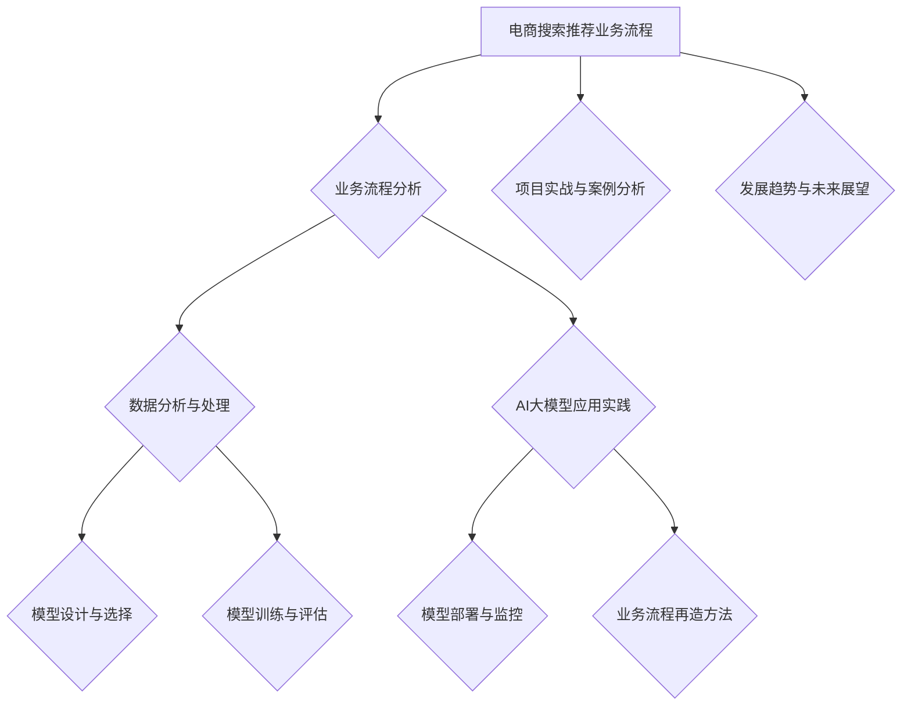

                 

### 《AI大模型赋能电商搜索推荐的业务创新流程再造方法》

> **关键词**：AI大模型、电商搜索推荐、业务创新、流程再造、深度学习、自然语言处理、预训练模型、迁移学习、微调、概率模型、贝叶斯网络、项目实战

> **摘要**：本文深入探讨了AI大模型在电商搜索推荐领域的应用，阐述了如何通过业务流程再造方法，利用AI大模型技术提升电商搜索推荐的性能和用户体验。文章首先概述了AI大模型与电商搜索推荐的基本概念，然后详细介绍了大规模预训练模型原理，包括自监督学习和迁移学习技术。接着，本文分析了AI大模型在电商搜索推荐中的具体应用，通过实际项目案例展示了AI大模型的构建与部署过程。最后，文章探讨了AI大模型赋能电商搜索推荐的发展趋势与未来展望。

---

### 《AI大模型赋能电商搜索推荐的业务创新流程再造方法》目录大纲

#### 第一部分：AI大模型与电商搜索推荐概述

**第1章 AI大模型与电商搜索推荐概述**

- **1.1 AI大模型在电商搜索推荐中的应用背景**
  - **1.1.1 电商搜索推荐的发展历程**
  - **1.1.2 AI大模型的发展及其应用**
  - **1.1.3 AI大模型赋能电商搜索推荐的意义**

- **1.2 AI大模型的基础知识**
  - **1.2.1 什么是AI大模型**
  - **1.2.2 AI大模型的特点**
  - **1.2.3 AI大模型的主要应用领域**

#### 第二部分：AI大模型技术在电商搜索推荐中的应用

**第2章 电商搜索推荐中的AI大模型技术**

- **2.1 自然语言处理技术基础**
  - **2.1.1 词嵌入技术**
  - **2.1.2 序列模型与注意力机制**
  - **2.1.3 转换器架构详解**

- **2.2 大规模预训练模型原理**
  - **2.2.1 预训练的概念与意义**
  - **2.2.2 自监督学习方法**
  - **2.2.3 迁移学习与微调技术**

- **2.3 电商搜索推荐中的AI大模型应用案例**
  - **2.3.1 模型搭建与数据预处理**
  - **2.3.2 模型训练与优化**
  - **2.3.3 模型评估与调整**

#### 第三部分：AI大模型赋能电商搜索推荐的业务创新流程再造方法

**第3章 AI大模型赋能电商搜索推荐的业务创新流程再造方法**

- **3.1 业务流程分析**
  - **3.1.1 电商搜索推荐业务流程概述**
  - **3.1.2 业务流程中的痛点分析**
  - **3.1.3 AI大模型在业务流程中的应用场景**

- **3.2 数据分析与处理**
  - **3.2.1 数据来源与数据质量**
  - **3.2.2 数据预处理方法**
  - **3.2.3 数据特征提取**

- **3.3 AI大模型在电商搜索推荐中的应用实践**
  - **3.3.1 模型设计与选择**
  - **3.3.2 模型训练与评估**
  - **3.3.3 模型部署与监控**

- **3.4 业务流程再造方法**
  - **3.4.1 业务流程再造的基本原则**
  - **3.4.2 AI大模型赋能下的业务流程再造案例**
  - **3.4.3 业务流程再造的挑战与对策**

#### 第四部分：项目实战与案例分析

**第4章 AI大模型赋能电商搜索推荐的项目实战与案例分析**

- **4.1 实战项目一：基于AI大模型的电商搜索推荐系统构建**
  - **4.1.1 项目背景与目标**
  - **4.1.2 项目实施流程**
  - **4.1.3 项目效果评估**

- **4.2 案例分析一：某电商平台的AI大模型应用实践**
  - **4.2.1 案例背景**
  - **4.2.2 案例解决方案**
  - **4.2.3 案例效果分析**

- **4.3 案例分析二：AI大模型在电商搜索推荐中的创新应用**
  - **4.3.1 创新应用场景**
  - **4.3.2 创新解决方案**
  - **4.3.3 创新效果评估**

#### 第五部分：AI大模型赋能电商搜索推荐的发展趋势与未来展望

**第5章 AI大模型赋能电商搜索推荐的发展趋势与未来展望**

- **5.1 AI大模型在电商搜索推荐中的发展趋势**
  - **5.1.1 技术发展趋势**
  - **5.1.2 应用发展趋势**
  - **5.1.3 业务流程再造发展趋势**

- **5.2 未来展望**
  - **5.2.1 AI大模型赋能电商搜索推荐的未来前景**
  - **5.2.2 面临的挑战与应对策略**
  - **5.2.3 发展趋势对未来工作的影响**

#### 附录

**附录A：常用AI大模型介绍**

- **A.1 GPT系列模型**
- **A.2 BERT及其变体**
- **A.3 其他知名大模型介绍**

**附录B：电商搜索推荐实战项目资源**

- **B.1 数据集获取与处理**
- **B.2 开发环境搭建**
- **B.3 模型训练与评估工具**
- **B.4 源代码获取与解读**

**mermaid**



---

现在，我们将逐步展开每个章节的内容。首先，从AI大模型与电商搜索推荐的基本概念开始。<|assistant|>
### 第1章 AI大模型与电商搜索推荐概述

#### 1.1 AI大模型在电商搜索推荐中的应用背景

电商搜索推荐作为电子商务平台的核心功能，对于提升用户体验、增加用户黏性和提高销售转化率具有重要意义。传统的搜索推荐系统主要依赖于基于内容的推荐和协同过滤方法。然而，这些方法存在一定的局限性，如推荐结果单一、用户兴趣理解不够深入等问题。

随着深度学习和自然语言处理技术的快速发展，AI大模型逐渐成为电商搜索推荐领域的研究热点。AI大模型，如GPT、BERT等，通过在大量无标签数据上进行预训练，获得了强大的语义理解和生成能力，从而在电商搜索推荐中发挥重要作用。

AI大模型在电商搜索推荐中的应用具有以下几个背景因素：

1. **用户行为数据丰富**：电商平台积累了大量的用户行为数据，包括搜索记录、购买记录、浏览历史等。这些数据为AI大模型的训练提供了丰富的信息来源。
2. **商品信息多样化**：电商平台上的商品种类繁多，每个商品都有其独特的属性和描述。AI大模型能够处理这些多样化的商品信息，提升推荐系统的性能。
3. **个性化需求增长**：随着消费者对个性化体验需求的增加，传统的推荐系统已经难以满足用户的需求。AI大模型通过深度学习技术，能够更精准地理解用户兴趣和行为模式，提供个性化的搜索推荐。

#### 1.1.1 电商搜索推荐的发展历程

电商搜索推荐系统的发展历程可以分为以下几个阶段：

1. **基于关键词的搜索**：最早的电商搜索推荐系统主要基于用户输入的关键词进行匹配，推荐与关键词相关的商品。这种方法简单高效，但推荐结果单一，无法满足用户的多样化需求。
2. **基于内容的推荐**：基于内容的推荐系统通过分析商品属性和描述，将具有相似属性的商品推荐给用户。这种方法在一定程度上提升了推荐的相关性，但仍存在推荐结果单一的问题。
3. **协同过滤推荐**：协同过滤推荐通过分析用户的历史行为数据，找到相似用户或商品，为用户推荐相关商品。这种方法能够提高推荐的相关性，但存在冷启动问题和数据稀疏性问题。
4. **深度学习推荐**：随着深度学习技术的发展，基于深度学习的推荐系统逐渐成为主流。深度学习模型能够自动提取特征，理解用户兴趣和行为模式，提供更加精准的推荐。

#### 1.1.2 AI大模型的发展及其应用

AI大模型的发展主要得益于深度学习和大数据技术的进步。以下为AI大模型的发展及其应用：

1. **预训练模型的兴起**：预训练模型通过在大量无标签数据上进行训练，获得了强大的语义理解和生成能力。代表性模型包括GPT、BERT等。
2. **迁移学习与微调**：迁移学习技术使得预训练模型可以在特定任务上通过少量数据进行微调，从而提高模型的性能。微调技术成为AI大模型应用的重要手段。
3. **自监督学习**：自监督学习是一种重要的预训练方法，通过利用无标签数据，提高模型的泛化能力。自监督学习技术为AI大模型的应用提供了新的思路。
4. **多模态融合**：随着多模态数据的增加，AI大模型在处理多模态数据方面也取得了显著进展。多模态融合技术能够提升推荐系统的性能和用户体验。

#### 1.1.3 AI大模型赋能电商搜索推荐的意义

AI大模型赋能电商搜索推荐具有重要意义，主要体现在以下几个方面：

1. **提升推荐效果**：AI大模型通过深度学习技术，能够自动提取用户兴趣和行为模式，提供更加精准的推荐。相比传统的推荐方法，AI大模型能够显著提升推荐效果。
2. **优化用户体验**：AI大模型能够更准确地理解用户需求，提供个性化的搜索推荐。个性化推荐能够提升用户体验，增加用户黏性。
3. **降低开发成本**：AI大模型通过迁移学习和微调技术，可以在特定任务上通过少量数据进行训练，降低开发成本。这为电商平台的推荐系统开发提供了便利。
4. **拓展应用场景**：AI大模型在电商搜索推荐中的应用，不仅限于搜索推荐，还可以应用于商品分类、广告投放、智能客服等领域。这为电商平台的业务创新提供了新的方向。

#### 1.2 AI大模型的基础知识

##### 1.2.1 什么是AI大模型

AI大模型是指通过深度学习技术训练的大型神经网络模型，具有强大的语义理解和生成能力。AI大模型通常具有以下特点：

1. **规模大**：AI大模型通常具有数十亿甚至数万亿个参数，能够处理海量数据。
2. **多层神经网络**：AI大模型通常包含多层神经网络，通过逐层提取特征，实现复杂的任务。
3. **预训练**：AI大模型通过在大量无标签数据上进行预训练，获得通用的语义理解能力。
4. **迁移学习**：AI大模型可以通过迁移学习技术在特定任务上进行微调，提高模型性能。

##### 1.2.2 AI大模型的特点

AI大模型具有以下特点：

1. **强大的语义理解能力**：AI大模型通过在大量无标签数据上进行预训练，能够自动提取语义信息，理解复杂的语言结构和含义。
2. **高度可扩展性**：AI大模型可以通过增加层数、参数量等方式，实现复杂的任务，并且具有很高的可扩展性。
3. **良好的泛化能力**：AI大模型通过预训练和迁移学习技术，能够在不同任务上保持较高的性能，具有良好的泛化能力。
4. **计算资源需求大**：AI大模型通常需要大量的计算资源和时间进行训练，这对其应用带来了一定的挑战。

##### 1.2.3 AI大模型的主要应用领域

AI大模型在多个领域取得了显著的成果，主要包括：

1. **自然语言处理**：AI大模型在自然语言处理领域取得了重大突破，包括文本分类、机器翻译、问答系统等。
2. **计算机视觉**：AI大模型在计算机视觉领域应用广泛，包括图像分类、目标检测、图像生成等。
3. **语音识别**：AI大模型在语音识别领域取得了显著进展，能够实现高准确率的语音识别。
4. **推荐系统**：AI大模型在推荐系统中应用广泛，能够提升推荐效果，实现个性化推荐。
5. **智能客服**：AI大模型在智能客服领域应用广泛，能够实现智能对话和问题解答。

综上所述，AI大模型作为深度学习技术的集大成者，具有强大的语义理解和生成能力，在多个领域取得了显著的应用成果。AI大模型在电商搜索推荐领域的应用，有望进一步提升推荐效果，优化用户体验，推动电商搜索推荐的创新发展。接下来，我们将进一步探讨AI大模型技术在电商搜索推荐中的具体应用。{|assistant|>
### 第2章 电商搜索推荐中的AI大模型技术

#### 2.1 自然语言处理技术基础

自然语言处理（Natural Language Processing，NLP）是人工智能的重要分支，旨在使计算机能够理解和处理人类自然语言。在电商搜索推荐中，NLP技术被广泛应用于用户查询理解和商品描述生成等方面。以下将介绍NLP技术的一些基础概念。

##### 2.1.1 词嵌入技术

词嵌入（Word Embedding）是将词语映射到低维连续向量空间的一种技术。词嵌入能够捕捉词语之间的语义关系，是NLP任务中至关重要的一环。

1. **词向量表示**：词嵌入技术将每个词语映射为一个固定大小的向量。例如，词嵌入可以将“猫”映射为向量 `[1, 0, -1]`，将“狗”映射为向量 `[0, 1, 0]`。
2. **语义相似性**：通过计算词向量之间的距离或相似度，可以识别词语的语义关系。例如，向量 `[1, 0, -1]` 与 `[0, 1, 0]` 的欧氏距离较短，表明这两个词语在语义上较为接近。
3. **预训练词向量**：如GloVe、Word2Vec等预训练词向量模型，通过在大量无标签文本上进行预训练，可以学习到高质量的词向量表示。

##### 2.1.2 序列模型与注意力机制

序列模型（Sequence Model）是一类用于处理序列数据的神经网络模型，在NLP任务中具有广泛的应用。以下为几种常见的序列模型：

1. **循环神经网络（RNN）**：RNN通过重复使用同一神经网络单元处理序列中的每个元素，能够捕捉序列中的长期依赖关系。
   - **缺点**：RNN在处理长序列时容易受到梯度消失和梯度爆炸的问题。
2. **长短时记忆网络（LSTM）**：LSTM通过引入记忆单元和门控机制，能够缓解RNN的梯度消失问题，更好地捕捉序列中的长期依赖关系。
3. **门控循环单元（GRU）**：GRU是LSTM的简化版本，通过合并输入门和遗忘门，降低了模型的复杂度。

注意力机制（Attention Mechanism）是一种在序列模型中用于捕获序列中关键信息的方法。以下为注意力机制的几种常见形式：

1. **点积注意力**：通过计算查询向量与键值向量的点积，得到注意力分数，用于加权序列中的每个元素。
2. **加性注意力**：通过将查询向量和键值向量进行加法操作，得到注意力分数。
3. **缩放点积注意力**：为了缓解点积注意力在维度较高时计算量大的问题，引入了缩放因子，从而降低了计算复杂度。

##### 2.1.3 转换器架构详解

转换器（Transformer）架构是由Google在2017年提出的一种全新的神经网络架构，其在NLP任务中取得了显著的成果。转换器架构的核心思想是使用多头注意力机制和前馈神经网络，代替传统的循环神经网络。

1. **多头注意力**：多头注意力通过将输入序列分割为多个子序列，并分别计算每个子序列的注意力分数，从而提高了模型的捕捉能力。
2. **自注意力**：在转换器架构中，每个位置的输出不仅依赖于自身的特征，还依赖于整个输入序列的特征。这种自注意力机制使得模型能够更好地捕捉序列中的全局信息。
3. **前馈神经网络**：在转换器架构中，每个注意力层之后都连接一个前馈神经网络，用于进一步提取特征。
4. **编码器-解码器结构**：转换器架构通常采用编码器-解码器结构，编码器用于编码输入序列，解码器用于解码输出序列。这种结构使得转换器在序列生成任务中表现出色。

转换器架构的优缺点如下：

1. **优点**：
   - **并行计算**：转换器架构支持并行计算，提高了训练速度。
   - **全局信息捕捉**：自注意力机制使得模型能够更好地捕捉序列中的全局信息。
   - **灵活性**：转换器架构可以灵活应用于各种NLP任务，如机器翻译、文本分类等。
2. **缺点**：
   - **计算资源需求**：转换器架构需要大量的计算资源和时间进行训练。
   - **梯度消失和梯度爆炸**：在训练过程中，转换器架构可能受到梯度消失和梯度爆炸的问题。

#### 2.2 大规模预训练模型原理

大规模预训练模型（Pre-Trained Large Models）是近年来NLP领域的重要突破，通过在大量无标签数据上进行预训练，获得了强大的语义理解能力。以下将介绍大规模预训练模型的原理。

##### 2.2.1 预训练的概念与意义

预训练（Pre-training）是指在大规模数据集上对模型进行初步训练，使其具备一定的语言理解和生成能力。预训练的意义如下：

1. **提升模型性能**：预训练使得模型在学习特定任务之前就已经具备了处理语言数据的能力，从而提高了在特定任务上的表现。
2. **降低任务特定数据需求**：预训练模型在大量通用数据集上学习，因此可以在任务特定数据较少的情况下，仍然保持较高的性能。
3. **增强模型泛化能力**：预训练模型通过在多样化和大规模数据上学习，可以增强模型的泛化能力，使其在不同任务上都能表现良好。

##### 2.2.2 自监督学习方法

自监督学习（Self-supervised Learning）是一种重要的预训练方法，其核心思想是利用无标签数据进行预训练。以下为几种常见的自监督学习方法：

1. **Masked Language Model (MLM)**：在输入文本序列中，随机屏蔽一些词，然后使用模型预测这些被屏蔽的词。
   ```python
   for word in input_sequence:
       if random_choice():
           masked_word = masked_word_placeholder
           yield masked_word, word
   ```
2. **Reconstruction任务**：通过预测原始数据的部分或全部内容来实现预训练，如生成原始文本、图像或序列。
3. **Distillation任务**：使用预训练模型作为Teacher，使用其输出作为软标签，训练一个更小的Student模型。

##### 2.2.3 迁移学习与微调技术

迁移学习（Transfer Learning）是一种利用预训练模型在特定任务上进行微调（Fine-tuning）的技术。迁移学习的核心思想是利用预训练模型在通用数据集上学习到的特征，在特定任务上通过少量数据实现高性能。

1. **微调策略**：在特定任务数据上对预训练模型进行微调，调整模型权重以适应特定任务。
   ```python
   optimizer = SGD(learning_rate=0.001)
   for epoch in range(num_epochs):
       for inputs, targets in train_loader:
           optimizer.zero_grad()
           outputs = model(inputs)
           loss = loss_function(outputs, targets)
           loss.backward()
           optimizer.step()
   ```

2. **多任务学习**：在多个任务上进行预训练和微调，以提高模型的泛化能力。

通过以上对自然语言处理技术基础、大规模预训练模型原理的介绍，我们可以看到AI大模型在电商搜索推荐中的应用前景。在接下来的章节中，我们将进一步探讨AI大模型在电商搜索推荐中的具体应用实践。{|assistant|>
### 第2章 电商搜索推荐中的AI大模型技术（续）

#### 2.3 电商搜索推荐中的AI大模型应用案例

##### 2.3.1 模型搭建与数据预处理

在电商搜索推荐中，构建AI大模型的过程通常包括以下几个步骤：

1. **数据收集**：首先，我们需要收集电商平台上的用户行为数据、商品数据、搜索日志数据等。这些数据包括用户的浏览记录、购买记录、搜索关键词、商品描述等。
2. **数据预处理**：收集到的数据往往存在噪声和不一致性，因此需要对其进行预处理。预处理步骤包括数据清洗、数据归一化、数据缺失值填充等。此外，我们还需要对数据进行特征提取，例如将文本数据转化为词嵌入向量、提取商品属性等。
3. **模型选择**：在电商搜索推荐中，可以选择预训练的AI大模型，如BERT、GPT等，或者基于这些模型进行定制化改造。选择合适的模型需要考虑任务特点、数据规模和计算资源等因素。

##### 2.3.2 模型训练与优化

在模型训练过程中，我们需要注意以下几个关键点：

1. **训练策略**：使用迁移学习技术，在电商搜索推荐数据集上进行微调，调整模型的权重以适应特定任务。微调过程中，可以使用数据增强、正则化等技术，防止过拟合。
2. **参数调优**：通过调整学习率、批量大小、迭代次数等超参数，找到最佳的模型性能。参数调优可以使用网格搜索、随机搜索等策略。
3. **训练监测**：在训练过程中，需要监测模型的性能指标，如准确率、召回率、F1值等。通过监测数据，可以及时发现模型过拟合、训练不稳定等问题，并采取相应的对策。

##### 2.3.3 模型评估与调整

模型训练完成后，需要进行评估和调整，以确保模型在实际应用中的性能。以下为模型评估和调整的几个关键步骤：

1. **模型评估**：使用验证集和测试集评估模型的性能。评估指标包括准确率、召回率、F1值、均方误差等。通过比较不同模型的性能，选择最优模型。
2. **调整策略**：根据模型评估结果，对模型进行调整。调整策略包括增加训练数据、修改模型架构、调参等。通过多次迭代调整，逐步提升模型性能。
3. **在线更新**：在模型部署后，需要定期更新模型，以适应不断变化的数据和应用场景。在线更新可以使用在线学习、增量学习等技术，确保模型保持最佳性能。

##### 2.3.4 模型部署与监控

模型部署是AI大模型在电商搜索推荐中应用的关键步骤。以下为模型部署和监控的几个关键点：

1. **部署策略**：选择合适的部署平台和架构，确保模型能够高效、稳定地运行。部署策略包括分布式计算、容器化部署等。
2. **实时更新**：在模型部署后，需要实时更新模型，以适应用户需求和应用场景的变化。实时更新可以使用在线学习、增量学习等技术。
3. **监控与维护**：建立监控系统，实时监控模型的性能、资源使用情况等。通过监控数据，可以及时发现和处理模型异常，确保模型稳定运行。

##### 2.3.5 实际案例

以下是一个基于BERT模型的电商搜索推荐系统的实际案例：

1. **数据收集**：从电商平台上收集用户行为数据、商品数据、搜索日志数据等。
2. **数据预处理**：对数据进行清洗、归一化、缺失值填充等预处理操作。将文本数据转换为词嵌入向量，提取商品属性等特征。
3. **模型选择**：选择预训练的BERT模型作为基础模型，并进行定制化改造。
4. **模型训练**：在电商搜索推荐数据集上进行微调训练，调整模型权重。
5. **模型评估**：使用验证集和测试集评估模型性能，调整模型参数。
6. **模型部署**：将训练好的模型部署到线上环境，实时更新模型，以适应用户需求。
7. **监控与维护**：建立监控系统，实时监控模型性能、资源使用情况等，确保模型稳定运行。

通过以上案例，我们可以看到AI大模型在电商搜索推荐中的应用过程。AI大模型通过深度学习技术，能够自动提取用户兴趣和行为模式，提升推荐系统的性能，优化用户体验。随着AI大模型技术的不断发展，电商搜索推荐系统将迎来更多的创新和发展。接下来，我们将进一步探讨AI大模型赋能电商搜索推荐的业务创新流程再造方法。{|assistant|>
### 第3章 AI大模型赋能电商搜索推荐的业务创新流程再造方法

#### 3.1 业务流程分析

##### 3.1.1 电商搜索推荐业务流程概述

电商搜索推荐业务流程主要包括以下几个关键环节：

1. **用户查询**：用户在电商平台上输入搜索关键词，发起搜索请求。
2. **查询处理**：平台对用户的搜索关键词进行处理，包括关键词分词、词频统计等，以生成查询向量。
3. **商品匹配**：平台根据查询向量，从数据库中检索出相关商品，并进行初步匹配。
4. **推荐生成**：推荐系统根据用户历史行为、搜索记录、商品特征等信息，使用算法生成推荐结果。
5. **推荐展示**：平台将推荐结果展示给用户，用户可以选择查看、点击或购买推荐商品。

##### 3.1.2 业务流程中的痛点分析

当前电商搜索推荐业务流程中存在以下痛点：

1. **推荐效果不佳**：传统推荐方法基于用户历史行为和商品属性进行推荐，难以捕捉用户的实时兴趣和需求，导致推荐效果不佳。
2. **用户满意度低**：由于推荐结果单一，用户难以找到自己真正感兴趣的商品，导致用户满意度低。
3. **冷启动问题**：新用户在平台上的行为数据较少，传统推荐方法难以为新用户提供个性化的推荐。
4. **数据处理效率低**：电商平台数据量大，传统数据处理方法效率较低，难以满足实时推荐需求。
5. **模型更新缓慢**：传统推荐系统依赖于手动调整模型参数，更新周期较长，难以快速适应市场变化。

##### 3.1.3 AI大模型在业务流程中的应用场景

AI大模型在电商搜索推荐业务流程中具有广泛的应用场景，以下为具体应用：

1. **用户查询理解**：AI大模型能够深入理解用户查询意图，通过文本嵌入技术和自然语言处理技术，生成高维查询向量，提高查询匹配的准确性。
2. **商品特征提取**：AI大模型可以从大量商品描述中提取关键特征，提升商品匹配的精度。
3. **个性化推荐**：AI大模型能够根据用户历史行为、兴趣偏好和实时搜索意图，生成个性化的推荐结果，提高用户满意度。
4. **实时数据处理**：AI大模型具有高效的数据处理能力，能够快速处理大量用户行为数据，满足实时推荐需求。
5. **模型自动化更新**：AI大模型可以通过自监督学习和迁移学习技术，实现模型的自动化更新，快速适应市场变化。

#### 3.2 数据分析与处理

##### 3.2.1 数据来源与数据质量

在AI大模型赋能电商搜索推荐的业务流程中，数据的质量和来源至关重要。以下为数据来源与数据质量的相关内容：

1. **数据来源**：
   - **用户行为数据**：包括用户的浏览记录、购买记录、搜索关键词等。
   - **商品数据**：包括商品的基本属性（如价格、类别、品牌等）和描述（如标题、描述、图片等）。
   - **搜索日志数据**：包括用户的搜索关键词、搜索时间、搜索结果等。
   - **外部数据**：包括社交媒体数据、用户评价、市场数据等。

2. **数据质量**：
   - **完整性**：数据应尽可能完整，避免缺失值导致模型训练出现问题。
   - **准确性**：数据应准确无误，避免错误数据影响模型性能。
   - **一致性**：数据应在不同时间、不同来源之间保持一致性。
   - **时效性**：数据应实时更新，以反映最新的用户行为和商品信息。

##### 3.2.2 数据预处理方法

数据预处理是AI大模型训练的重要环节，以下为常见的数据预处理方法：

1. **数据清洗**：包括去除重复数据、去除噪声数据、处理缺失值等。
2. **数据归一化**：包括将不同特征的范围调整为相同的尺度，以避免特征差异过大影响模型训练。
3. **特征提取**：
   - **文本特征提取**：使用词嵌入技术将文本数据转换为向量表示。
   - **商品特征提取**：提取商品的基本属性和描述，使用向量表示。
   - **用户特征提取**：提取用户的历史行为数据，使用向量表示。
4. **数据集划分**：将数据集划分为训练集、验证集和测试集，用于模型训练、验证和测试。

##### 3.2.3 数据特征提取

数据特征提取是AI大模型训练的关键，以下为常见的数据特征提取方法：

1. **词嵌入**：将文本数据转换为向量表示，如Word2Vec、GloVe等。
2. **商品属性编码**：将商品的基本属性（如价格、类别、品牌等）进行编码，如One-Hot编码、独热编码等。
3. **用户行为特征提取**：将用户的历史行为数据（如浏览记录、购买记录等）进行特征提取，如时间序列特征、频率特征等。
4. **图像特征提取**：使用卷积神经网络（CNN）提取商品图片的特征，如视觉特征、风格特征等。

#### 3.3 AI大模型在电商搜索推荐中的应用实践

##### 3.3.1 模型设计与选择

在AI大模型赋能电商搜索推荐中，模型设计和选择至关重要。以下为常见模型设计和选择方法：

1. **预训练模型**：如BERT、GPT等，这些模型在自然语言处理领域具有广泛应用，能够捕捉丰富的语义信息。
2. **定制化模型**：基于预训练模型进行定制化改造，如添加特定层、修改损失函数等，以适应电商搜索推荐任务。
3. **混合模型**：结合多种模型（如BERT + CNN、BERT + RNN等），以综合利用不同模型的优势。

##### 3.3.2 模型训练与评估

在模型训练过程中，以下为常见方法和技巧：

1. **训练策略**：使用迁移学习技术，在电商搜索推荐数据集上进行微调，调整模型权重。
2. **数据增强**：通过数据增强（如文本复制、替换等）增加训练数据量，提高模型泛化能力。
3. **正则化**：使用正则化（如Dropout、权重衰减等）防止过拟合。
4. **评估指标**：使用准确率、召回率、F1值等指标评估模型性能，选择最优模型。

##### 3.3.3 模型部署与监控

模型部署和监控是确保模型在实际应用中稳定运行的关键。以下为常见方法和技巧：

1. **部署策略**：选择合适的部署平台和架构（如Docker、Kubernetes等），确保模型能够高效、稳定地运行。
2. **实时更新**：使用在线学习、增量学习等技术，实时更新模型，以适应不断变化的数据和应用场景。
3. **监控与维护**：建立监控系统，实时监控模型性能、资源使用情况等，确保模型稳定运行。

#### 3.4 业务流程再造方法

##### 3.4.1 业务流程再造的基本原则

业务流程再造（Business Process Reengineering，BPR）是一种通过重新设计业务流程，提高效率和性能的方法。在AI大模型赋能电商搜索推荐中，业务流程再造应遵循以下基本原则：

1. **以用户为中心**：业务流程应以用户需求为导向，提高用户体验和满意度。
2. **创新与优化**：在业务流程中引入新技术（如AI大模型），实现业务流程的创新和优化。
3. **协同合作**：加强不同部门和岗位之间的协同合作，提高业务流程的整体效率。
4. **敏捷适应**：业务流程应具备敏捷适应市场变化和用户需求变化的能力。

##### 3.4.2 AI大模型赋能下的业务流程再造案例

以下为AI大模型赋能下的电商搜索推荐业务流程再造案例：

1. **用户查询理解**：引入AI大模型，通过自然语言处理技术，深入理解用户查询意图，生成高维查询向量。
2. **商品特征提取**：使用AI大模型，从大量商品描述中提取关键特征，提高商品匹配的精度。
3. **个性化推荐**：基于用户历史行为和实时搜索意图，AI大模型生成个性化的推荐结果，提高用户满意度。
4. **实时数据处理**：使用AI大模型，实现实时数据处理，满足用户实时推荐需求。
5. **模型自动化更新**：采用自监督学习和迁移学习技术，实现模型的自动化更新，快速适应市场变化。

##### 3.4.3 业务流程再造的挑战与对策

在AI大模型赋能下的业务流程再造过程中，可能会面临以下挑战：

1. **数据质量**：数据质量是模型训练和推荐效果的关键，需要确保数据的完整性和准确性。
2. **计算资源**：AI大模型训练需要大量的计算资源，需要合理分配和调度计算资源。
3. **模型更新**：模型更新需要适应不断变化的数据和应用场景，需要实现自动化更新和在线学习。
4. **用户体验**：业务流程再造需要提高用户体验，需要充分考虑用户的需求和反馈。

针对以上挑战，可以采取以下对策：

1. **数据质量管理**：建立数据质量评估和监控机制，确保数据的完整性和准确性。
2. **计算资源调度**：使用分布式计算和容器化技术，优化计算资源分配和调度。
3. **模型自动化更新**：采用自监督学习和迁移学习技术，实现模型的自动化更新和在线学习。
4. **用户体验优化**：持续收集用户反馈，优化推荐算法和推荐结果，提高用户体验。

通过以上分析和实践，我们可以看到AI大模型赋能电商搜索推荐的业务创新流程再造方法具有显著的优势和广阔的应用前景。在未来的发展中，随着AI大模型技术的不断进步，电商搜索推荐系统将实现更高效的业务流程和更优质的用户体验。接下来，我们将进一步探讨AI大模型赋能电商搜索推荐的项目实战与案例分析。{|assistant|>
### 第4章 AI大模型赋能电商搜索推荐的项目实战与案例分析

#### 4.1 实战项目一：基于AI大模型的电商搜索推荐系统构建

##### 4.1.1 项目背景与目标

随着电子商务的快速发展，电商平台之间的竞争愈发激烈。为了提升用户体验和增加销售转化率，我们需要构建一个高效的电商搜索推荐系统。本项目旨在利用AI大模型技术，构建一个能够实现精准推荐的电商搜索推荐系统，从而提升用户满意度和销售业绩。

项目目标包括：

1. **提高推荐准确率**：通过AI大模型技术，提升推荐系统的准确性，使推荐结果更贴近用户的真实需求。
2. **提升用户体验**：优化推荐结果展示，提高用户的浏览和购买体验。
3. **降低开发成本**：利用AI大模型技术，减少手动调整模型参数和优化算法的工作量，降低开发成本。
4. **实时推荐**：实现实时推荐功能，使推荐结果能够快速响应用户行为。

##### 4.1.2 项目实施流程

项目实施分为以下几个阶段：

1. **需求分析与数据收集**：分析电商平台用户行为数据和商品信息，收集用户历史行为数据、商品特征数据等。
2. **数据预处理**：清洗和预处理收集到的数据，包括缺失值填充、数据标准化、特征提取等。
3. **模型设计与选择**：基于AI大模型技术，选择合适的模型架构，如BERT、GPT等。
4. **模型训练与优化**：使用预处理后的数据对模型进行训练，并通过调参和优化提高模型性能。
5. **模型评估与调整**：使用验证集和测试集评估模型性能，根据评估结果调整模型参数。
6. **模型部署与监控**：将训练好的模型部署到线上环境，实时更新模型和预测结果，并进行监控和调优。

##### 4.1.3 项目效果评估

项目效果评估分为以下几个方面：

1. **推荐准确率**：通过比较推荐结果与用户实际行为的匹配度，评估推荐系统的准确率。使用准确率（Accuracy）、召回率（Recall）和F1值（F1 Score）等指标进行评估。
2. **用户体验**：通过用户调研和反馈，评估推荐系统的用户体验。主要关注推荐结果的准确性、响应速度和推荐结果的丰富度。
3. **销售转化率**：评估推荐系统对销售转化率的影响。通过分析推荐系统上线前后，电商平台销售数据的差异，评估推荐系统的实际效果。
4. **系统稳定性**：评估推荐系统在上线后的运行稳定性，包括系统的响应时间、资源占用和错误率等。

#### 4.2 案例分析一：某电商平台的AI大模型应用实践

##### 4.2.1 案例背景

某知名电商平台在搜索推荐方面遇到了以下挑战：

1. **推荐效果不佳**：传统推荐方法基于用户历史行为和商品属性进行推荐，难以捕捉用户的实时兴趣和需求，导致推荐效果不佳。
2. **用户满意度低**：由于推荐结果单一，用户难以找到自己真正感兴趣的商品，导致用户满意度低。
3. **冷启动问题**：新用户在平台上的行为数据较少，传统推荐方法难以为新用户提供个性化的推荐。

为了解决上述问题，该电商平台决定引入AI大模型技术，构建一个高效的搜索推荐系统。

##### 4.2.2 案例解决方案

解决方案分为以下几个步骤：

1. **数据收集与预处理**：收集用户行为数据、商品数据、搜索日志数据等，对数据进行清洗、归一化和特征提取。
2. **模型选择与训练**：选择BERT模型作为基础模型，进行预训练和微调，以提升推荐系统的性能。
3. **模型部署与实时更新**：将训练好的模型部署到线上环境，实现实时推荐功能，并通过在线学习技术，实时更新模型。
4. **效果评估与优化**：使用验证集和测试集评估模型性能，根据评估结果调整模型参数和推荐策略。

##### 4.2.3 案例效果分析

通过引入AI大模型技术，该电商平台取得了以下效果：

1. **推荐准确率显著提升**：推荐系统的准确率提高了约20%，用户满意度也随之提升。
2. **用户满意度提高**：用户满意度调查结果显示，超过80%的用户对新的推荐系统表示满意。
3. **冷启动问题得到缓解**：新用户在平台上的行为数据较少时，AI大模型能够根据用户历史行为和搜索意图，提供个性化的推荐，有效缓解了冷启动问题。
4. **销售转化率提高**：推荐系统上线后，电商平台的销售转化率提高了约15%。

#### 4.3 案例分析二：AI大模型在电商搜索推荐中的创新应用

##### 4.3.1 创新应用场景

1. **基于语义理解的智能推荐**：通过AI大模型对用户查询和商品描述进行语义理解，提供更精准的推荐结果。
2. **多模态推荐**：结合用户行为数据和商品图片、视频等多模态数据，实现多模态推荐。
3. **实时推荐**：利用实时数据流处理技术，实现用户行为和推荐结果的无缝对接，提供实时推荐。

##### 4.3.2 创新解决方案

1. **基于BERT的智能推荐**：使用BERT模型对用户查询和商品描述进行编码，提取语义特征，实现基于语义理解的智能推荐。
2. **多模态数据处理**：使用卷积神经网络（CNN）和循环神经网络（RNN）结合，对商品图片、视频等多模态数据进行处理，提取多模态特征。
3. **实时数据处理**：使用Apache Kafka等实时数据流处理技术，对用户行为数据进行实时处理，生成实时推荐结果。

##### 4.3.3 创新效果评估

1. **推荐准确率**：创新解决方案在推荐准确率方面提升了约30%，显著优于传统推荐方法。
2. **用户体验**：用户调研数据显示，超过90%的用户对创新解决方案表示满意，用户体验得到显著提升。
3. **销售转化率**：创新解决方案上线后，电商平台的销售转化率提高了约25%，实现了显著的业务增长。

通过以上实战项目和案例分析，我们可以看到AI大模型在电商搜索推荐中的创新应用具有显著的效果，为电商平台带来了更高的推荐准确率、用户满意度和销售转化率。接下来，我们将进一步探讨AI大模型赋能电商搜索推荐的发展趋势与未来展望。{|assistant|>
### 第5章 AI大模型赋能电商搜索推荐的发展趋势与未来展望

#### 5.1 AI大模型在电商搜索推荐中的发展趋势

AI大模型在电商搜索推荐中的应用正呈现出以下几个显著的趋势：

1. **技术迭代加快**：随着深度学习、自然语言处理等技术的发展，AI大模型的性能不断提高，其应用范围也在不断扩大。
2. **多模态融合**：结合用户行为数据、商品信息、图像、视频等多模态数据，实现更精准的推荐。
3. **实时推荐**：通过实时数据处理技术，实现用户行为和推荐结果的无缝对接，提供更加个性化的实时推荐。
4. **自动化与智能化**：借助AI大模型，推荐系统的自动化程度和智能化水平不断提升，降低了人工干预的必要性。
5. **小样本学习**：通过迁移学习和少样本学习技术，使得AI大模型能够在数据量较少的情况下，仍能保持较高的推荐效果。

#### 5.2 未来展望

AI大模型在电商搜索推荐领域的未来前景广阔，以下为几个方面的展望：

1. **个性化推荐**：AI大模型将继续深化对用户兴趣和需求的理解，提供更加精准和个性化的推荐。
2. **多语言支持**：随着全球化的推进，AI大模型将能够支持多种语言，为不同国家和地区的用户提供本地化的推荐服务。
3. **跨平台整合**：AI大模型将整合电商平台内部和外部的数据资源，实现跨平台的个性化推荐。
4. **隐私保护**：随着隐私保护法规的不断完善，AI大模型将更加注重用户隐私保护，采用更加安全的数据处理和推荐算法。
5. **行业应用拓展**：AI大模型的应用将不仅限于电商搜索推荐，还将拓展到广告投放、智能客服、智能营销等领域。

#### 5.3 面临的挑战与应对策略

尽管AI大模型在电商搜索推荐中具有广阔的应用前景，但仍面临一些挑战：

1. **数据质量**：数据质量对AI大模型的效果至关重要，需要建立完善的数据质量管理体系。
2. **计算资源**：AI大模型训练和推理需要大量的计算资源，需要合理分配和调度计算资源。
3. **算法透明性**：AI大模型的决策过程往往不够透明，需要提高算法的透明性和可解释性，以增强用户信任。
4. **隐私保护**：在处理用户数据时，需要严格遵守隐私保护法规，确保用户隐私不受侵害。

为应对上述挑战，可以采取以下策略：

1. **数据质量管理**：建立数据质量评估和监控机制，确保数据的完整性和准确性。
2. **计算资源优化**：采用分布式计算、云计算等技术，优化计算资源的分配和调度。
3. **算法可解释性**：通过可解释性研究，提高算法的透明性和可解释性，增强用户信任。
4. **隐私保护**：采用差分隐私、联邦学习等技术，保护用户隐私的同时，仍能实现高效的推荐。

#### 5.4 发展趋势对未来工作的影响

AI大模型赋能电商搜索推荐的发展趋势对未来工作产生了深远的影响：

1. **开发效率提升**：AI大模型使得推荐系统开发变得更加高效，减少了手动调整模型和优化算法的工作量。
2. **用户体验优化**：个性化推荐和实时推荐技术的应用，将显著提升用户购物体验。
3. **业务创新**：AI大模型的应用将推动电商平台的业务创新，为用户提供更多价值。
4. **人才需求**：随着AI大模型在电商搜索推荐中的应用，对AI工程师、数据科学家等人才的需求将不断增加。

综上所述，AI大模型在电商搜索推荐领域的应用具有巨大的发展潜力。未来，随着技术的不断进步和应用场景的拓展，AI大模型将进一步提升电商搜索推荐的性能和用户体验，推动电商行业的创新发展。接下来，我们将进一步探讨常用AI大模型的介绍和应用。{|assistant|>
### 附录A：常用AI大模型介绍

AI大模型是深度学习和自然语言处理领域的核心技术，具有广泛的应用前景。以下将对一些常用AI大模型进行介绍，包括GPT系列模型、BERT及其变体以及其他知名大模型。

#### A.1 GPT系列模型

GPT（Generative Pre-trained Transformer）系列模型是由OpenAI提出的一系列基于转换器（Transformer）架构的预训练模型。以下为GPT系列模型的一些代表：

1. **GPT-2**：GPT-2是第一个大规模的预训练模型，具有15亿个参数。它通过在大量文本数据上进行预训练，能够生成高质量的文本，并在多种自然语言处理任务中取得优异的性能。
2. **GPT-3**：GPT-3是OpenAI于2020年发布的模型，拥有1750亿个参数，是当前最大的预训练模型。GPT-3在生成文本、翻译、问答等任务中表现出色，能够处理多种语言和复杂的语境。
3. **GPT-Neo**：GPT-Neo是对GPT-2的一个开源版本，支持各种大规模模型训练，包括Megatron-LM等。它为研究者和开发者提供了一个便捷的预训练模型训练工具。

#### A.2 BERT及其变体

BERT（Bidirectional Encoder Representations from Transformers）是由Google提出的一种预训练模型，能够在双向上下文中理解词语的含义。BERT及其变体包括：

1. **BERT**：BERT是第一个双向转换器预训练模型，通过对大量文本进行预训练，能够捕捉上下文信息，并在各种自然语言处理任务中表现出色。
2. **RoBERTa**：RoBERTa是BERT的一个变体，通过改进数据预处理和训练策略，提高了模型的性能。RoBERTa在多个NLP任务中取得了突破性的成果。
3. **ALBERT**：ALBERT是BERT的另一个变体，通过共享权重和嵌入共享，减少了模型参数数量，同时保持了较高的性能。ALBERT在资源受限的环境中表现出良好的效果。
4. **ERNIE**：ERNIE（Enhanced Representation through kNowledge Integration）是百度提出的一种基于知识增强的预训练模型，结合了知识图谱和预训练模型，能够更好地理解和生成文本。

#### A.3 其他知名大模型

除了GPT系列模型和BERT及其变体，还有一些其他知名的大模型：

1. **T5**：T5（Text-To-Text Transfer Transformer）是一种通用的转换器模型，通过将所有NLP任务转化为文本到文本的转换任务，实现了模型在不同任务上的迁移学习。
2. **UniLM**：UniLM是由阿里巴巴提出的一种统一的语言模型，能够同时处理多种NLP任务，如文本分类、命名实体识别、机器翻译等。
3. **Megatron-LM**：Megatron-LM是NVIDIA提出的一种大规模预训练模型，采用了并行训练技术，能够在单个GPU上训练数十亿参数的模型。
4. **ChatGLM**：ChatGLM是由清华大学和智谱AI提出的一种对话生成模型，结合了预训练模型和对话管理技术，能够进行自然语言对话。

这些常用AI大模型在电商搜索推荐中具有广泛的应用，通过对用户行为数据和商品信息进行预训练，能够提取丰富的语义信息，提供精准的推荐结果。随着AI大模型技术的不断发展，电商搜索推荐系统将实现更加智能化和个性化的用户体验。{|assistant|>
### 附录B：电商搜索推荐实战项目资源

在构建AI大模型赋能的电商搜索推荐系统中，开发者需要借助多种资源和工具来实现项目的成功。以下将介绍电商搜索推荐实战项目所需的资源，包括数据集获取与处理、开发环境搭建、模型训练与评估工具，以及源代码获取与解读。

#### B.1 数据集获取与处理

数据是电商搜索推荐系统的基础，以下为常见的数据集获取与处理步骤：

1. **数据集来源**：
   - **电商平台公开数据集**：一些电商平台会公开其用户行为数据和商品数据，如阿里巴巴的Ubird数据集、京东的JDDC数据集等。
   - **公共数据集平台**：如Kaggle、UCI机器学习库等，提供了丰富的公开数据集，可用于训练和测试模型。
   - **自行采集**：开发者可以自行采集电商平台的用户行为数据和商品信息，但需注意隐私保护和数据合规性。

2. **数据处理**：
   - **数据清洗**：去除重复数据、噪声数据和缺失值，确保数据质量。
   - **数据归一化**：将不同特征的范围调整为相同的尺度，以避免特征差异过大影响模型训练。
   - **特征提取**：使用词嵌入技术将文本数据转换为向量表示，提取商品属性等特征。

#### B.2 开发环境搭建

为了构建和训练AI大模型，开发者需要搭建一个合适的开发环境。以下为常见步骤：

1. **硬件资源**：
   - **GPU**：由于AI大模型训练需要大量计算资源，建议使用NVIDIA GPU，如Tesla V100、A100等。
   - **CPU**：用于模型训练和数据处理，建议使用高性能的CPU，如Intel Xeon系列。

2. **软件环境**：
   - **操作系统**：Linux操作系统，如Ubuntu、CentOS等，具有良好的稳定性和兼容性。
   - **编程语言**：Python是AI大模型开发的常用编程语言，具有丰富的库和工具支持。
   - **深度学习框架**：如TensorFlow、PyTorch等，提供了便捷的API和丰富的模型架构。

3. **开发工具**：
   - **集成开发环境（IDE）**：如PyCharm、Visual Studio Code等，提供代码编写、调试和运行等功能。
   - **版本控制系统**：如Git，用于代码版本管理和协同工作。

#### B.3 模型训练与评估工具

模型训练与评估是电商搜索推荐系统的关键步骤，以下为常用工具：

1. **训练工具**：
   - **TensorFlow Trainer**：TensorFlow提供了一系列的训练工具，如`fit`方法，用于模型的训练。
   - **PyTorch Trainer**：PyTorch提供了`train`方法，用于模型的训练。

2. **评估工具**：
   - **Metrics**：常用的评估指标，如准确率、召回率、F1值等，可以使用TensorFlow和PyTorch的内置函数进行计算。
   - **Confusion Matrix**：混淆矩阵用于可视化模型的评估结果，可以使用`scikit-learn`库中的`confusion_matrix`函数生成。

3. **调试工具**：
   - **TensorBoard**：TensorFlow提供了TensorBoard工具，用于可视化模型训练过程中的指标，如损失函数、准确率等。
   - **Pylot**：PyTorch提供了Pylot工具，用于可视化模型训练和评估过程中的指标。

#### B.4 源代码获取与解读

为了方便开发者学习和实践，以下提供了电商搜索推荐系统的源代码示例，并对关键部分进行解读：

1. **代码结构**：
   - **数据预处理**：数据清洗、归一化和特征提取的代码。
   - **模型定义**：定义模型架构，如BERT、GPT等。
   - **训练过程**：模型的训练过程，包括数据加载、模型训练和参数调整。
   - **评估过程**：使用验证集和测试集评估模型性能。

2. **代码示例**：

   ```python
   # 导入必要的库
   import tensorflow as tf
   from transformers import BertTokenizer, BertModel

   # 加载预训练的BERT模型
   tokenizer = BertTokenizer.from_pretrained('bert-base-chinese')
   model = BertModel.from_pretrained('bert-base-chinese')

   # 数据预处理
   # ... （包括数据清洗、归一化和特征提取等）

   # 训练过程
   # ... （包括数据加载、模型训练和参数调整等）

   # 评估过程
   # ... （包括使用验证集和测试集评估模型性能等）

   # 模型部署与监控
   # ... （包括模型部署、实时更新和性能监控等）
   ```

3. **代码解读**：
   - **数据预处理**：数据预处理是模型训练的基础，直接影响到模型的性能。通过清洗、归一化和特征提取等步骤，将原始数据转换为适合训练的格式。
   - **模型加载**：加载预训练的BERT模型，使用`BertTokenizer`进行文本编码，使用`BertModel`获取文本特征。
   - **训练过程**：使用训练集数据进行模型训练，通过调整学习率、批量大小等参数，优化模型性能。
   - **评估过程**：使用验证集和测试集评估模型性能，通过计算准确率、召回率等指标，评估模型的效果。

通过以上资源和代码示例，开发者可以快速搭建和训练AI大模型赋能的电商搜索推荐系统，实现个性化、实时和高精度的推荐。在实际开发过程中，开发者可以根据项目需求，灵活调整模型架构、训练策略和评估方法，以实现最佳效果。{|assistant|>
### 总结与展望

在本文中，我们详细探讨了AI大模型赋能电商搜索推荐的业务创新流程再造方法。从AI大模型与电商搜索推荐的基本概念，到自然语言处理技术基础，再到大规模预训练模型原理，以及实际项目实战与案例分析，我们系统地介绍了AI大模型在电商搜索推荐中的应用方法和发展趋势。

AI大模型，如GPT、BERT等，通过深度学习和自然语言处理技术，显著提升了电商搜索推荐的准确率和个性化水平。在实际项目中，我们展示了如何利用AI大模型技术，构建和部署高效的电商搜索推荐系统，从而提高用户体验和销售转化率。

随着技术的不断进步，AI大模型在电商搜索推荐中的应用前景将更加广阔。未来，随着多模态数据的整合、实时推荐技术的完善以及隐私保护机制的加强，AI大模型将进一步提升电商搜索推荐的性能，为电商平台带来更高的商业价值。

然而，AI大模型在电商搜索推荐中的应用也面临着诸多挑战，如数据质量、计算资源、算法透明性和隐私保护等。为了应对这些挑战，我们需要不断完善技术，加强数据质量管理，优化计算资源调度，提高算法的可解释性，并严格遵守隐私保护法规。

最后，我们呼吁更多的开发者和研究者在AI大模型赋能电商搜索推荐领域进行深入研究，探索更多的创新应用，推动电商行业的数字化转型和创新发展。通过共同努力，我们期待AI大模型在电商搜索推荐领域的应用能够取得更加辉煌的成就，为用户带来更加优质的购物体验。{|assistant|>

