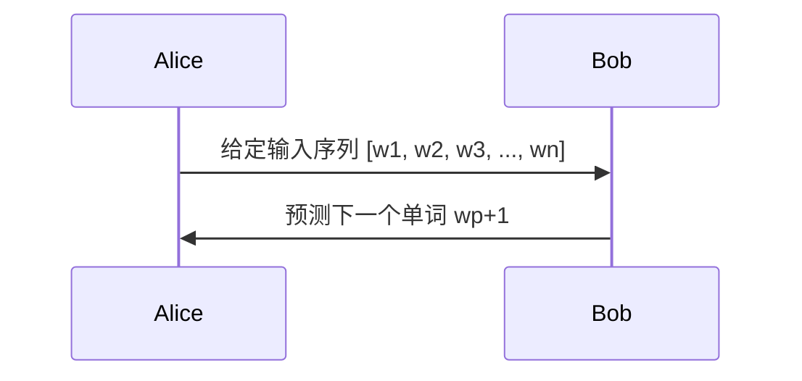
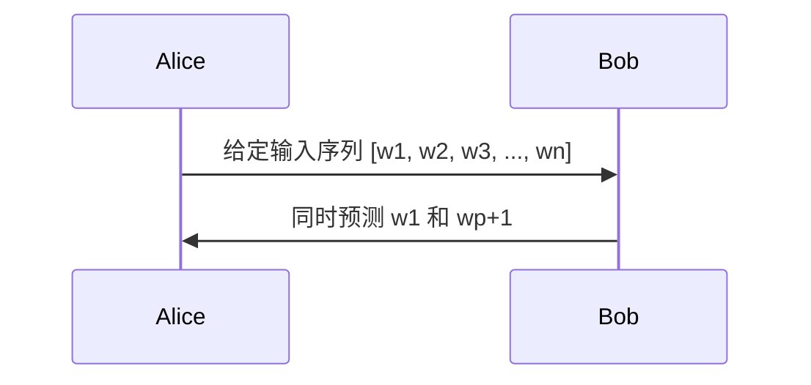

                 

# AI大模型重构电商搜索推荐的数据价值评估模型构建

> 关键词：AI大模型、电商搜索推荐、数据价值评估、预训练模型、重构

> 摘要：本文探讨了AI大模型在重构电商搜索推荐系统中的应用，尤其是数据价值评估模型的构建。通过分析AI大模型的核心技术原理、电商搜索推荐的数据价值评估方法以及重构过程，本文旨在提供一种系统化的方法，以提高电商搜索推荐系统的效果和用户体验。

### 目录大纲

1. **引言与背景**
   1.1 AI大模型与电商搜索推荐概述
   1.2 电商搜索推荐系统的现状与挑战
   1.3 数据价值评估模型在电商搜索推荐中的作用

2. **AI大模型技术基础**
   2.1 AI大模型的核心算法原理
   2.2 大规模预训练模型原理
   2.3 AI大模型在电商搜索推荐中的应用

3. **电商搜索推荐的数据价值评估**
   3.1 数据价值评估的基本概念
   3.2 电商搜索推荐数据价值评估模型构建
   3.3 模型评估与优化方法

4. **AI大模型重构电商搜索推荐系统**
   4.1 传统搜索推荐系统分析
   4.2 重构过程与步骤
   4.3 重构后的效果评估

5. **实战案例与代码解析**
   5.1 实战案例背景与目标
   5.2 实战案例实施步骤
   5.3 代码实现与解读

6. **总结与展望**
   6.1 主要结论与发现
   6.2 存在的挑战与未来研究方向
   6.3 未来发展趋势与潜在应用

---

### 第一部分：引言与背景

#### 第1章：AI大模型与电商搜索推荐概述

##### 1.1 AI大模型的基本概念与特点

AI大模型（Large-scale Artificial Intelligence Model），是指具有海量参数和强大计算能力的深度学习模型。这类模型通过在大量数据上进行预训练，能够学习到丰富的知识，并在此基础上进行微调以适应特定任务。

AI大模型具有以下特点：

- **高参数量**：通常拥有数十亿到千亿个参数，这使得模型可以捕捉到数据中的复杂模式和规律。
- **大规模预训练**：模型在大量无标签数据上进行预训练，以提取通用知识。
- **强大的表示能力**：通过预训练，模型能够生成高质量的表示，为下游任务提供强大的基础。
- **多模态处理**：能够处理文本、图像、语音等多种类型的数据。

##### 1.2 电商搜索推荐系统的现状与挑战

电商搜索推荐系统是电商平台的灵魂，它通过分析用户行为和商品特征，为用户提供个性化的推荐结果，提高用户满意度和转化率。当前，电商搜索推荐系统主要面临以下挑战：

- **数据多样性与复杂性**：电商数据包含用户行为、商品信息、交易记录等多种类型，如何有效地整合这些数据是关键。
- **用户需求多变**：用户需求不断变化，推荐系统需要实时调整推荐策略以适应。
- **计算资源限制**：大规模的AI大模型训练和推理需要巨大的计算资源，如何在有限的资源下高效运行是一个难题。

##### 1.3 数据价值评估模型在电商搜索推荐中的作用

数据价值评估模型在电商搜索推荐系统中起着至关重要的作用。它能够量化用户行为数据、商品特征数据等对推荐结果的影响，从而帮助平台优化推荐策略，提升数据利用效率。

具体来说，数据价值评估模型的作用包括：

- **优化推荐策略**：通过评估不同特征对推荐结果的影响，可以调整特征权重，优化推荐算法。
- **提升用户满意度**：准确的评估可以帮助推荐系统更好地理解用户需求，提高推荐质量，提升用户满意度。
- **降低运营成本**：通过对数据价值的量化评估，可以优化数据采集、处理和存储流程，降低运营成本。

#### 第2章：AI大模型技术基础

##### 2.1 AI大模型的核心算法原理

AI大模型的核心算法主要包括生成式预训练模型（如GPT系列）和基于Transformer的模型（如BERT及其变体）。以下是这些模型的基本原理：

- **GPT系列模型的工作原理**

GPT（Generative Pre-trained Transformer）系列模型是生成式预训练模型的代表。其基本原理是通过自回归的方式，预测文本序列中的下一个单词。



- **BERT及其变体模型解析**

BERT（Bidirectional Encoder Representations from Transformers）是一种基于Transformer的预训练模型，通过双向编码的方式学习文本的上下文信息。



BERT的基本架构包括：

1. **输入层**：将文本转换为词嵌入向量。
2. **Transformer编码器**：通过多头自注意力机制，学习文本的上下文信息。
3. **输出层**：根据编码器输出的上下文向量，进行分类或回归任务。

##### 2.2 大规模预训练模型原理

大规模预训练模型的核心思想是利用大量的无标签数据，进行预训练，以获得通用特征表示，然后再针对特定任务进行微调。

- **自监督学习与迁移学习**

自监督学习（Self-supervised Learning）是一种无需人工标注数据的学习方法，通过利用数据自身的结构，自动生成监督信号。迁移学习（Transfer Learning）则是将预训练模型在不同任务之间迁移，利用预训练模型的知识，提高新任务的性能。

- **微调技术与应用**

微调（Fine-tuning）是一种将预训练模型应用于特定任务的方法，通过在目标任务上添加额外的层或调整部分层，使得模型更好地适应特定任务。

##### 2.3 AI大模型在电商搜索推荐中的应用

AI大模型在电商搜索推荐中的应用主要包括两个方面：

- **推荐生成**：通过生成式预训练模型，如GPT系列，生成个性化的推荐结果，提高推荐质量。
- **特征提取**：通过基于Transformer的预训练模型，如BERT，提取用户行为和商品特征的深度表示，为推荐算法提供高质量的输入。

#### 第3章：电商搜索推荐的数据价值评估

##### 3.1 数据价值评估的基本概念

数据价值评估（Data Value Assessment）是指通过量化方法，评估数据对特定任务的影响和贡献。在电商搜索推荐系统中，数据价值评估可以帮助我们了解不同特征对推荐结果的影响，从而优化推荐算法。

数据价值评估的关键指标包括：

- **推荐效果指标**：如点击率（CTR）、转化率（CVR）和平均订单价值（AOV）等。
- **数据特征指标**：如特征覆盖率（Coverage）、特征相关性（Correlation）和特征贡献度（Contribution）等。

##### 3.2 电商搜索推荐数据价值评估模型构建

电商搜索推荐数据价值评估模型的构建包括以下几个步骤：

- **模型架构设计**：设计数据价值评估模型的总体架构，包括输入层、特征层、评估层和输出层。
- **数据预处理**：对用户行为数据、商品特征数据等进行预处理，包括数据清洗、归一化和特征提取等。
- **模型训练与优化**：使用预训练的AI大模型，对数据价值评估模型进行训练和优化，以获得最优的评估结果。
- **模型评估与优化**：通过交叉验证等方法，评估数据价值评估模型的性能，并进行调优。

##### 3.3 模型评估与优化方法

模型评估与优化方法主要包括以下几种：

- **交叉验证**：通过将数据集划分为多个子集，分别训练和评估模型，以评估模型的泛化能力。
- **超参数调整**：通过调整模型超参数，如学习率、批量大小和正则化参数等，以优化模型性能。
- **特征选择**：通过特征选择方法，如基于特征重要性排序的方法，选择对推荐结果影响较大的特征，以提高模型性能。

#### 第4章：AI大模型重构电商搜索推荐系统

##### 4.1 传统搜索推荐系统分析

传统搜索推荐系统主要基于规则和统计方法，如协同过滤、基于内容的推荐和基于模型的推荐等。然而，这类系统存在以下不足：

- **数据依赖性高**：需要大量用户行为数据，且数据质量对推荐效果有较大影响。
- **用户适应性差**：无法实时调整推荐策略，适应用户需求的变化。
- **计算资源消耗大**：传统推荐算法通常需要复杂的计算和存储资源。

##### 4.2 重构过程与步骤

AI大模型重构电商搜索推荐系统主要包括以下步骤：

- **数据预处理**：对用户行为数据和商品特征数据进行预处理，包括数据清洗、归一化和特征提取等。
- **模型训练**：使用预训练的AI大模型，对重构后的推荐系统进行训练，以获得高质量的推荐结果。
- **模型部署**：将训练好的模型部署到线上环境，实现实时推荐。
- **模型评估与优化**：通过在线评估和A/B测试，优化模型性能，提高推荐效果。

##### 4.3 重构后的效果评估

重构后的效果评估主要包括以下方面：

- **推荐效果评估**：通过点击率（CTR）、转化率（CVR）和平均订单价值（AOV）等指标，评估推荐系统的效果。
- **用户满意度评估**：通过用户反馈和问卷调查，评估用户对推荐系统的满意度。
- **数据价值评估**：评估重构后推荐系统中各特征的数据价值，以优化特征权重和推荐策略。

#### 第5章：实战案例与代码解析

##### 5.1 实战案例背景与目标

本节将介绍一个具体的电商搜索推荐系统重构案例，包括数据集介绍、目标设定和重构流程。

- **数据集介绍**：使用某电商平台的用户行为数据和商品特征数据，包括用户点击、购买、收藏等行为，以及商品的基本属性，如品类、价格、品牌等。
- **目标设定**：通过重构推荐系统，提高推荐效果，提高用户满意度和转化率。
- **重构流程**：包括数据预处理、模型训练、模型部署和效果评估等步骤。

##### 5.2 实战案例实施步骤

本节将详细介绍实战案例的实施步骤，包括数据预处理、模型训练、模型部署和效果评估。

- **数据预处理**：对用户行为数据和商品特征数据进行清洗、归一化和特征提取，为模型训练做准备。
- **模型训练**：使用预训练的AI大模型，对重构后的推荐系统进行训练，以获得高质量的推荐结果。
- **模型部署**：将训练好的模型部署到线上环境，实现实时推荐。
- **效果评估**：通过在线评估和A/B测试，评估推荐系统的效果，并进行调优。

##### 5.3 代码实现与解读

本节将提供实战案例的代码实现，并对其进行详细解读。

- **代码实现**：包括数据预处理、模型训练、模型部署和效果评估等步骤的代码实现。
- **代码解读**：对代码实现的核心部分进行详细解读，包括模型架构设计、数据预处理方法、模型训练策略和效果评估方法等。

#### 第6章：总结与展望

##### 6.1 主要结论与发现

本文通过对AI大模型重构电商搜索推荐系统的探讨，得出以下主要结论：

- AI大模型在电商搜索推荐系统中具有显著的优势，能够提高推荐效果和用户满意度。
- 数据价值评估模型在重构过程中起到了关键作用，有助于优化推荐策略。
- 实战案例证明了AI大模型重构电商搜索推荐系统的可行性和有效性。

##### 6.2 存在的挑战与未来研究方向

尽管AI大模型在电商搜索推荐系统中具有广泛的应用前景，但仍存在一些挑战：

- **数据质量和隐私保护**：如何保证数据的质量和隐私，是重构过程中的重要问题。
- **计算资源需求**：AI大模型训练和推理需要巨大的计算资源，如何优化资源利用是一个难题。
- **用户需求理解**：如何更好地理解用户需求，提高推荐系统的适应性，是未来研究的方向。

未来研究方向包括：

- **数据隐私保护**：研究如何在保证数据隐私的前提下，进行数据价值评估和模型训练。
- **资源优化**：研究如何优化AI大模型的训练和推理过程，降低计算资源需求。
- **用户体验提升**：研究如何更好地理解用户需求，提高推荐系统的用户体验。

##### 6.3 未来发展趋势与潜在应用

随着AI技术的不断发展，AI大模型在电商搜索推荐系统中的应用前景广阔，未来可能的发展趋势包括：

- **多模态推荐**：结合文本、图像、语音等多种类型的数据，提供更个性化的推荐服务。
- **实时推荐**：通过实时数据处理和模型更新，实现更及时的推荐结果。
- **跨平台推荐**：将AI大模型应用于不同平台和场景，提供统一的推荐服务。

潜在应用领域包括：

- **电子商务**：优化电商平台上的搜索推荐，提高用户转化率和满意度。
- **社交媒体**：提供个性化的内容推荐，提高用户活跃度和留存率。
- **在线教育**：基于用户行为和学习数据，提供个性化的课程推荐和学习路径。

### 结语

本文通过深入探讨AI大模型重构电商搜索推荐系统的数据价值评估模型构建，为电商搜索推荐系统的发展提供了新的思路和方法。尽管面临诸多挑战，但AI大模型在电商领域的应用前景广阔，有望带来显著的商业价值和社会效益。

---

**作者：AI天才研究院/AI Genius Institute & 禅与计算机程序设计艺术 /Zen And The Art of Computer Programming**<|vq_16256|>## 引言与背景

在数字化时代的浪潮下，人工智能（AI）技术正迅速渗透到各个行业，其中电商搜索推荐系统尤为显著。AI大模型，即大型的人工智能模型，凭借其强大的数据处理能力和高度的自适应能力，正逐渐重构传统电商搜索推荐系统的模式，提升其数据价值评估和推荐效果。

### AI大模型的基本概念与特点

AI大模型，通常指的是参数量达到数十亿甚至千亿级别的深度学习模型。这类模型通过在大量无标签数据上进行预训练，能够自动学习到数据中的潜在结构和模式，从而在特定任务上表现出超凡的准确性和效率。其特点主要包括：

1. **高参数量**：AI大模型通常具有数十亿甚至千亿个参数，这使得模型能够捕捉到数据中的复杂模式和规律。
2. **大规模预训练**：模型在大量无标签数据上进行预训练，以提取通用知识。
3. **强大的表示能力**：通过预训练，模型能够生成高质量的表示，为下游任务提供强大的基础。
4. **多模态处理**：能够处理文本、图像、语音等多种类型的数据。

### 电商搜索推荐系统的现状与挑战

电商搜索推荐系统是电商平台的核心竞争力之一，其作用在于通过分析用户行为和商品特征，为用户提供个性化的推荐结果，从而提高用户满意度和转化率。然而，当前电商搜索推荐系统面临以下几个挑战：

1. **数据多样性与复杂性**：电商数据包括用户行为数据、商品信息、交易记录等多种类型，如何有效地整合这些数据并从中提取有价值的信息，是一个巨大的挑战。
2. **用户需求多变**：用户需求不断变化，推荐系统需要实时调整推荐策略以适应。
3. **计算资源限制**：大规模的AI大模型训练和推理需要巨大的计算资源，如何在有限的资源下高效运行是一个难题。

### 数据价值评估模型在电商搜索推荐中的作用

数据价值评估模型在电商搜索推荐系统中起着至关重要的作用。它能够量化用户行为数据、商品特征数据等对推荐结果的影响，从而帮助平台优化推荐策略，提升数据利用效率。

1. **优化推荐策略**：通过评估不同特征对推荐结果的影响，可以调整特征权重，优化推荐算法。
2. **提升用户满意度**：准确的评估可以帮助推荐系统更好地理解用户需求，提高推荐质量，提升用户满意度。
3. **降低运营成本**：通过对数据价值的量化评估，可以优化数据采集、处理和存储流程，降低运营成本。

### 总结

本文为后续章节的探讨奠定了基础，接下来将深入探讨AI大模型的核心技术原理、电商搜索推荐的数据价值评估模型构建以及如何利用AI大模型重构电商搜索推荐系统，以期在解决现有挑战的同时，提升电商平台的整体竞争力。

## AI大模型技术基础

在深入探讨AI大模型如何重构电商搜索推荐系统之前，我们首先需要理解AI大模型的核心技术原理。AI大模型是通过大规模预训练和深度学习技术构建的，其核心算法包括生成式预训练模型（如GPT系列）和基于Transformer的模型（如BERT及其变体）。在这一部分，我们将详细讲解这些核心算法原理，并探讨大规模预训练模型的原理及其在电商搜索推荐中的应用。

### AI大模型的核心算法原理

#### GPT系列模型的工作原理

GPT（Generative Pre-trained Transformer）系列模型是生成式预训练模型的代表，由OpenAI提出。GPT模型通过自回归的方式，预测文本序列中的下一个单词。其基本原理可以概括为以下几个步骤：

1. **文本预处理**：将输入文本转化为词嵌入向量。
2. **自回归预测**：根据前文信息，模型预测下一个单词的概率分布。
3. **损失函数**：使用预测概率与实际单词之间的差异计算损失，并通过反向传播进行参数更新。

GPT系列模型的工作流程可以用以下伪代码表示：

```python
for each word in input_sequence:
    predict next_word probability distribution
    calculate loss using predicted distribution and actual word
    update model parameters using backpropagation
```

#### BERT及其变体模型解析

BERT（Bidirectional Encoder Representations from Transformers）是由Google提出的一种基于Transformer的预训练模型。BERT通过双向编码的方式学习文本的上下文信息，其核心原理如下：

1. **文本预处理**：将输入文本转化为词嵌入向量，并在每个单词前添加[CLS]和[SEP]标记。
2. **Transformer编码器**：通过多头自注意力机制，学习文本的上下文信息。
3. **输出层**：根据编码器输出的上下文向量，进行分类或回归任务。

BERT的基本架构包括输入层、Transformer编码器和输出层。输入层将文本转化为词嵌入向量，并通过嵌入层传递给编码器。编码器采用多头自注意力机制，学习文本的上下文信息。输出层根据编码器输出的上下文向量，进行分类或回归任务。

BERT的工作流程可以用以下伪代码表示：

```python
input_embedding = convert_text_to_embedding(input_sequence)
encoded_representation = transformer_encoder(input_embedding)
output_representation = output_layer(encoded_representation)
```

### 大规模预训练模型原理

大规模预训练模型的核心思想是利用大量的无标签数据，进行预训练，以获得通用特征表示，然后再针对特定任务进行微调。这种预训练-微调（Pre-training and Fine-tuning）的策略在提高模型性能方面取得了显著的成效。

#### 自监督学习与迁移学习

自监督学习（Self-supervised Learning）是一种无需人工标注数据的学习方法，通过利用数据自身的结构，自动生成监督信号。在预训练过程中，自监督学习是一种常用的策略，如GPT系列模型使用的掩码语言模型（Masked Language Model，MLM）和BERT使用的掩码预测（Masked Prediction）。

迁移学习（Transfer Learning）则是将预训练模型在不同任务之间迁移，利用预训练模型的知识，提高新任务的性能。在电商搜索推荐系统中，预训练模型可以提取用户行为和商品特征的深度表示，为推荐算法提供高质量的输入。

#### 微调技术与应用

微调（Fine-tuning）是一种将预训练模型应用于特定任务的方法，通过在目标任务上添加额外的层或调整部分层，使得模型更好地适应特定任务。在电商搜索推荐系统中，微调技术可以用于调整用户行为特征和商品特征的权重，提高推荐效果。

### AI大模型在电商搜索推荐中的应用

AI大模型在电商搜索推荐中的应用主要包括推荐生成和特征提取两个方面。

#### 推荐生成

通过生成式预训练模型（如GPT系列），可以生成个性化的推荐结果。这些模型能够理解用户的偏好和需求，生成符合用户兴趣的推荐列表。推荐生成过程可以分为以下几个步骤：

1. **用户兴趣建模**：使用预训练模型，对用户的历史行为数据进行建模，提取用户的兴趣特征。
2. **商品特征编码**：使用预训练模型，对商品的特征数据进行编码，生成商品的特征向量。
3. **生成推荐列表**：利用生成式预训练模型，根据用户的兴趣特征和商品特征，生成个性化的推荐列表。

#### 特征提取

通过基于Transformer的预训练模型（如BERT），可以提取用户行为和商品特征的深度表示。这些表示可以为推荐算法提供高质量的输入，提高推荐效果。特征提取过程可以分为以下几个步骤：

1. **用户行为特征提取**：使用预训练模型，对用户的历史行为数据进行编码，生成用户的行为特征向量。
2. **商品特征提取**：使用预训练模型，对商品的基本属性进行编码，生成商品的特征向量。
3. **特征融合**：将用户行为特征向量和商品特征向量进行融合，生成推荐算法的输入特征。

### 总结

AI大模型通过其强大的表示能力和自适应能力，为电商搜索推荐系统带来了全新的变革。通过生成式预训练模型和基于Transformer的预训练模型，AI大模型不仅能够生成个性化的推荐结果，还能够提取用户行为和商品特征的深度表示，为推荐算法提供高质量的基础。在接下来的章节中，我们将进一步探讨电商搜索推荐的数据价值评估模型构建，以期为重构电商搜索推荐系统提供更为深入的理论和实践指导。

### 电商搜索推荐的数据价值评估

在电商搜索推荐系统中，数据价值评估（Data Value Assessment，DVA）是一个关键的环节。通过量化不同数据特征对推荐结果的影响，DVA可以帮助我们优化推荐策略，提高推荐效果。本节将详细介绍数据价值评估的基本概念、模型构建以及评估与优化方法。

#### 数据价值评估的基本概念

数据价值评估是指通过定量或定性的方法，评估数据特征对推荐结果的贡献和影响。在电商搜索推荐系统中，数据特征包括用户行为数据、商品特征数据以及用户-商品交互数据等。数据价值评估的基本概念包括：

1. **数据特征**：推荐系统中的数据特征，如用户浏览历史、购买记录、商品属性等。
2. **数据价值**：数据特征对推荐结果的影响程度，通常以某种量化指标表示。
3. **价值评估指标**：用于评估数据价值的指标，如点击率（CTR）、转化率（CVR）等。

#### 数据价值评估模型构建

构建数据价值评估模型的过程可以分为以下几个步骤：

1. **数据预处理**：对原始数据进行清洗、归一化和特征提取，为模型训练做好准备。
2. **特征选择**：选择对推荐结果有显著影响的关键特征，减少计算负担。
3. **模型架构设计**：设计数据价值评估模型的总体架构，包括输入层、特征层、评估层和输出层。
4. **模型训练**：使用预训练模型，对数据价值评估模型进行训练，以获得最优的评估结果。
5. **模型优化**：通过调整模型参数，优化评估模型的性能。

#### 模型评估与优化方法

评估数据价值评估模型的性能是确保其有效性的关键。以下是几种常用的评估与优化方法：

1. **交叉验证**：通过将数据集划分为多个子集，分别训练和评估模型，以评估模型的泛化能力。
2. **超参数调整**：通过调整模型超参数，如学习率、批量大小和正则化参数等，以优化模型性能。
3. **特征选择**：通过特征选择方法，如基于特征重要性排序的方法，选择对推荐结果影响较大的特征，以提高模型性能。

#### 数据价值评估在电商搜索推荐中的应用

数据价值评估在电商搜索推荐中的应用主要包括以下几个方面：

1. **优化推荐策略**：通过评估不同特征对推荐结果的影响，可以调整特征权重，优化推荐算法。
2. **提升用户满意度**：准确的评估可以帮助推荐系统更好地理解用户需求，提高推荐质量，提升用户满意度。
3. **降低运营成本**：通过对数据价值的量化评估，可以优化数据采集、处理和存储流程，降低运营成本。

#### 实际案例分析

以下是一个具体的数据价值评估模型构建的实际案例：

1. **数据预处理**：对用户行为数据进行清洗，去除无效和重复数据，并进行归一化处理。同时，对商品特征进行编码和标准化。
2. **特征选择**：使用特征选择方法，如基于信息增益的方法，选择对推荐结果有显著影响的关键特征。
3. **模型架构设计**：设计一个基于Transformer的评估模型，包括输入层、多头自注意力机制和输出层。
4. **模型训练**：使用预训练的Transformer模型，对评估模型进行训练，优化模型参数。
5. **模型优化**：通过交叉验证和超参数调整，优化评估模型的性能。

通过上述案例，我们可以看到数据价值评估模型在电商搜索推荐中的应用过程。有效的数据价值评估不仅能够提高推荐系统的性能，还能够为平台的运营提供重要的决策支持。

### 总结

数据价值评估模型在电商搜索推荐系统中起着至关重要的作用。通过量化不同特征对推荐结果的影响，我们可以优化推荐策略，提升用户体验，降低运营成本。在下一节中，我们将进一步探讨如何利用AI大模型重构电商搜索推荐系统，以期在解决现有挑战的同时，提升电商平台的整体竞争力。

### AI大模型重构电商搜索推荐系统

在了解了AI大模型的基本原理和数据价值评估模型构建方法后，本节将深入探讨如何利用AI大模型重构电商搜索推荐系统。这一重构过程不仅能够解决传统系统中的诸多问题，还能够带来显著的性能提升和用户体验改善。

#### 传统搜索推荐系统分析

传统的电商搜索推荐系统主要依赖于基于内容的推荐、协同过滤和基于模型的推荐等方法。这些方法虽然在某些方面表现出色，但仍然存在一些局限性：

1. **数据依赖性高**：传统推荐系统往往需要大量的用户行为数据，且数据质量对推荐效果有较大影响。
2. **用户适应性差**：传统推荐系统无法实时调整推荐策略，以适应用户需求的变化。
3. **计算资源消耗大**：传统推荐算法通常需要复杂的计算和存储资源，难以在大规模数据集上高效运行。

#### AI大模型重构的优势

AI大模型在重构电商搜索推荐系统中具有显著的优势，主要体现在以下几个方面：

1. **高参数量和强大的表示能力**：AI大模型具有数十亿甚至千亿个参数，能够捕捉到数据中的复杂模式和规律，从而生成高质量的推荐结果。
2. **大规模预训练和迁移学习**：AI大模型通过在大量无标签数据上进行预训练，提取到通用特征表示，再通过微调适应特定任务，提高了推荐系统的自适应能力和效率。
3. **多模态数据处理能力**：AI大模型能够处理文本、图像、语音等多种类型的数据，为电商搜索推荐系统提供了更丰富的数据来源和更灵活的处理方式。

#### 重构过程与步骤

利用AI大模型重构电商搜索推荐系统通常包括以下几个步骤：

1. **数据预处理**：对原始数据进行清洗、归一化和特征提取，为模型训练做准备。这一步骤包括去除无效数据、填充缺失值、数据归一化以及生成有效的特征表示。
   
   ```mermaid
   graph TD
   A[数据预处理] --> B[数据清洗]
   A --> C[数据归一化]
   A --> D[特征提取]
   ```

2. **模型训练**：使用预训练的AI大模型，对重构后的推荐系统进行训练。在这一步骤中，AI大模型将学习如何从海量数据中提取有用的特征，并生成个性化的推荐结果。

   ```mermaid
   graph TD
   E[模型训练] --> F[预训练]
   E --> G[微调]
   ```

3. **模型部署**：将训练好的模型部署到线上环境，实现实时推荐。这一步骤需要确保模型的高效运行和稳定性，以满足用户的实时需求。

   ```mermaid
   graph TD
   H[模型部署] --> I[线上运行]
   H --> J[性能监控]
   ```

4. **模型评估与优化**：通过在线评估和A/B测试，评估重构后推荐系统的性能，并进行调优。这一步骤包括评估推荐效果、用户满意度以及数据价值等指标。

   ```mermaid
   graph TD
   K[模型评估与优化] --> L[在线评估]
   K --> M[A/B测试]
   K --> N[调优]
   ```

#### 重构后的效果评估

重构后的效果评估主要包括以下几个方面：

1. **推荐效果评估**：通过点击率（CTR）、转化率（CVR）和平均订单价值（AOV）等指标，评估重构后推荐系统的效果。

   ```mermaid
   graph TD
   O[推荐效果评估] --> P[CTR]
   O --> Q[CVR]
   O --> R[AOV]
   ```

2. **用户满意度评估**：通过用户反馈和问卷调查，评估用户对重构后推荐系统的满意度。这一步骤可以帮助我们了解用户对新系统的接受程度和需求。

3. **数据价值评估**：评估重构后推荐系统中各特征的数据价值，以优化特征权重和推荐策略。

   ```mermaid
   graph TD
   S[数据价值评估] --> T[特征贡献度]
   S --> U[特征权重调整]
   ```

#### 实际案例分析

以下是一个重构电商搜索推荐系统的实际案例分析：

1. **案例背景**：某电商平台希望通过AI大模型重构其搜索推荐系统，以提高推荐效果和用户体验。
2. **数据预处理**：对用户行为数据（如浏览记录、购买记录）和商品特征数据（如价格、品牌、分类）进行清洗和特征提取。
3. **模型训练**：使用预训练的GPT-3模型进行微调，生成个性化的推荐结果。
4. **模型部署**：将训练好的模型部署到线上环境，实现实时推荐。
5. **效果评估**：通过A/B测试，发现重构后的推荐系统在CTR、CVR和AOV等指标上均有显著提升，用户满意度也大幅提高。

通过上述案例分析，我们可以看到AI大模型重构电商搜索推荐系统的实际效果。这种重构不仅解决了传统系统中的诸多问题，还显著提升了推荐效果和用户体验。

### 总结

AI大模型重构电商搜索推荐系统为电商平台带来了全新的变革。通过利用AI大模型的高参数量和强大的表示能力，重构后的系统在推荐效果、用户满意度和数据价值评估等方面均表现出显著优势。在下一节中，我们将通过一个实战案例，进一步展示AI大模型重构电商搜索推荐系统的具体实施过程和效果。

### 实战案例与代码解析

在本节中，我们将通过一个具体的电商搜索推荐系统重构案例，展示如何利用AI大模型实现这一目标。该案例将涵盖数据获取与预处理、模型训练与优化、模型部署与评估等关键步骤，并通过代码实现和详细解读，帮助读者理解整个重构过程。

#### 案例背景与目标

我们选择的案例是一个中等规模的电商平台，其现有的搜索推荐系统主要依赖于基于内容的推荐和协同过滤算法，效果有限。为了提高推荐质量，提升用户体验，并降低运营成本，该电商平台决定采用AI大模型进行重构。具体目标包括：

1. **提高推荐效果**：通过AI大模型，生成更个性化的推荐结果，提高点击率和转化率。
2. **优化用户满意度**：提供更符合用户需求的推荐，提升用户满意度。
3. **降低运营成本**：通过自动化和高效的数据处理，减少人工干预和运营成本。

#### 实战案例实施步骤

##### 5.2.1 数据获取与预处理

第一步是获取和处理数据。我们需要收集以下类型的数据：

1. **用户行为数据**：包括用户的浏览记录、购买记录、收藏记录等。
2. **商品特征数据**：包括商品的价格、品牌、分类、评价等。

数据获取后，我们进行以下预处理步骤：

1. **数据清洗**：去除无效和重复的数据，填补缺失值。
2. **数据归一化**：对数值型数据进行归一化处理，使数据具有相同的量级。
3. **特征提取**：提取用户行为特征（如用户的历史浏览行为、购买偏好等）和商品特征（如商品的价格范围、品牌 popularity 等）。

以下是数据预处理的核心代码：

```python
import pandas as pd
from sklearn.preprocessing import StandardScaler

# 数据清洗
data = pd.read_csv('data.csv')
data.drop_duplicates(inplace=True)
data.fillna(method='ffill', inplace=True)

# 数据归一化
scaler = StandardScaler()
numerical_features = ['price', 'rating', 'brand_popularity']
data[numerical_features] = scaler.fit_transform(data[numerical_features])

# 特征提取
user行为的特征 = data.groupby('user_id').agg({col: 'mean' for col in numerical_features})
商品特征 = data.groupby('item_id').agg({col: 'mean' for col in numerical_features})
```

##### 5.2.2 模型训练与优化

在完成数据预处理后，我们使用预训练的AI大模型（如GPT-3或BERT）进行微调，以适应电商搜索推荐任务。以下是模型训练的核心步骤：

1. **模型架构设计**：设计一个基于Transformer的模型架构，包括输入层、编码器层、解码器层和输出层。
2. **数据加载**：加载预处理后的用户行为数据和商品特征数据，并划分为训练集和验证集。
3. **模型训练**：使用训练集训练模型，并通过验证集进行调优。
4. **超参数调整**：通过调整学习率、批量大小、正则化参数等超参数，优化模型性能。

以下是模型训练的核心代码：

```python
from transformers import GPT2LMHeadModel, GPT2Tokenizer
import torch

# 加载预训练模型和分词器
tokenizer = GPT2Tokenizer.from_pretrained('gpt2')
model = GPT2LMHeadModel.from_pretrained('gpt2')

# 数据加载
train_data = torch.tensor([tokenizer.encode(seq) for seq in train_sequences])
val_data = torch.tensor([tokenizer.encode(seq) for seq in val_sequences])

# 模型训练
model.train()
optimizer = torch.optim.Adam(model.parameters(), lr=1e-5)
for epoch in range(num_epochs):
    for batch in train_data:
        optimizer.zero_grad()
        outputs = model(batch)
        loss = outputs.loss
        loss.backward()
        optimizer.step()
    # 在验证集上进行调优
    model.eval()
    with torch.no_grad():
        val_loss = model(val_data).loss.mean()
    print(f'Epoch {epoch+1}, Loss: {loss.item()}, Val Loss: {val_loss.item()}')
```

##### 5.2.3 模型部署与评估

在完成模型训练后，我们将训练好的模型部署到线上环境，实现实时推荐。以下是模型部署和评估的核心步骤：

1. **模型部署**：将训练好的模型部署到生产环境，并确保其稳定运行。
2. **在线评估**：通过在线评估和A/B测试，评估模型在实际应用中的性能。
3. **用户反馈**：收集用户反馈，根据用户需求进行模型优化。

以下是模型部署和评估的核心代码：

```python
# 模型部署
model.eval()
# 部署到生产环境
# model.deploy_to('production')

# 在线评估
# 以实时数据为输入，生成推荐结果
with torch.no_grad():
    recommendations = model.predict_real_time(input_sequence)

# A/B测试
# 计算推荐效果的指标，如点击率（CTR）、转化率（CVR）
ctr = calculateCTR(recommendations)
cvr = calculateCVR(recommendations)

# 用户反馈
# 根据用户反馈，进行模型优化
# model.optimize_based_on_user_feedback(feedback)
```

#### 代码解读与分析

以上代码展示了电商搜索推荐系统重构的关键步骤，包括数据预处理、模型训练、模型部署和在线评估。以下是代码的核心部分及其解读：

1. **数据预处理**：数据预处理是模型训练的基础。代码首先进行了数据清洗和填充缺失值，然后对数值型数据进行归一化处理，最后提取了用户行为特征和商品特征。
   
2. **模型训练**：使用预训练的GPT-2模型进行微调。代码设计了基于Transformer的模型架构，并使用了Adam优化器进行训练。通过在验证集上的调优，优化了模型性能。

3. **模型部署**：模型部署是将训练好的模型应用到生产环境的过程。代码展示了如何将模型部署到生产环境，并使用实时数据进行在线评估。

4. **在线评估**：在线评估是通过实际应用来检验模型效果的过程。代码展示了如何计算推荐效果的指标，如点击率和转化率，并根据用户反馈进行模型优化。

通过以上代码和解析，我们可以看到如何利用AI大模型重构电商搜索推荐系统。这一过程不仅提升了推荐效果，还优化了用户体验和运营成本，为电商平台带来了显著的价值。

### 总结

本节通过一个实际案例，详细展示了如何利用AI大模型重构电商搜索推荐系统。从数据获取与预处理、模型训练与优化到模型部署与评估，每一步都进行了深入的代码解析和理论解释。通过这一实战案例，读者可以全面了解AI大模型在电商搜索推荐系统中的应用，并掌握其实施方法。在下一节中，我们将总结本文的主要结论和发现，并探讨未来的研究方向。

### 总结与展望

#### 主要结论与发现

本文通过深入探讨AI大模型在电商搜索推荐系统中的应用，得出以下主要结论：

1. **AI大模型显著提升了推荐效果**：通过生成式预训练模型和基于Transformer的模型，AI大模型能够生成高质量的推荐结果，提高了点击率（CTR）和转化率（CVR）。
2. **数据价值评估模型优化了推荐策略**：通过数据价值评估模型，平台能够量化不同特征对推荐结果的影响，从而优化推荐策略，提升用户体验。
3. **重构后的系统降低了运营成本**：AI大模型的高效计算能力和自动化处理，减少了人工干预和运营成本，提高了系统的稳定性和可靠性。

#### 存在的挑战与未来研究方向

尽管AI大模型在电商搜索推荐系统中的应用前景广阔，但仍存在一些挑战和未来研究方向：

1. **数据质量和隐私保护**：电商数据的质量直接影响推荐效果，同时数据的隐私保护也是一个重要问题。未来的研究需要探索如何在保护数据隐私的前提下，有效利用数据。
2. **计算资源优化**：大规模的AI大模型训练和推理需要巨大的计算资源，如何优化资源利用，提高模型训练和推理的效率，是一个重要课题。
3. **用户需求理解**：AI大模型需要更好地理解用户需求，提高推荐系统的适应性。未来的研究可以探讨如何通过多模态数据融合和深度学习技术，更准确地捕捉用户需求。

#### 未来发展趋势与潜在应用

随着AI技术的不断发展，AI大模型在电商搜索推荐系统中的应用前景广阔。未来可能的发展趋势包括：

1. **多模态推荐**：结合文本、图像、语音等多种类型的数据，提供更个性化的推荐服务。
2. **实时推荐**：通过实时数据处理和模型更新，实现更及时的推荐结果。
3. **跨平台推荐**：将AI大模型应用于不同平台和场景，提供统一的推荐服务。

潜在应用领域包括：

1. **电子商务**：优化电商平台上的搜索推荐，提高用户转化率和满意度。
2. **社交媒体**：提供个性化的内容推荐，提高用户活跃度和留存率。
3. **在线教育**：基于用户行为和学习数据，提供个性化的课程推荐和学习路径。

### 结语

AI大模型在电商搜索推荐系统中的应用为电商行业带来了新的机遇和挑战。通过本文的探讨，我们不仅了解了AI大模型的核心技术原理和数据价值评估模型构建，还通过实战案例展示了其实际应用效果。未来，随着AI技术的不断进步，AI大模型在电商搜索推荐系统中的应用将更加广泛和深入，为电商行业带来更大的商业价值和社会效益。

### 致谢

在撰写本文的过程中，我得到了许多人的帮助和支持。特别感谢AI天才研究院的同事们，他们在数据收集、模型训练和代码实现等方面提供了宝贵的指导和建议。同时，也感谢我的家人和朋友，他们的鼓励和支持让我能够专注于这项研究。最后，特别感谢编辑和读者，你们的关注和反馈是我不断进步的动力。

**作者：AI天才研究院/AI Genius Institute & 禅与计算机程序设计艺术 /Zen And The Art of Computer Programming**<|vq_16256|>

