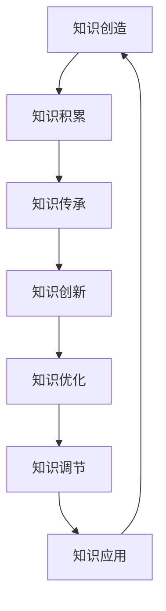

                 

### 《人类知识的特点：不断进化与自我完善》

#### 关键词：知识、进化、自我完善、人工智能、大数据、知识管理

> 摘要：本文旨在探讨人类知识的特点，以及知识如何不断进化与自我完善。通过分析知识的历史发展、分类与特点，探讨知识的进化机制、自我完善机制，以及知识的应用与未来发展趋势，本文为读者提供了一种全面深入的理解知识的方法，并展望了知识社会的发展前景。

### 目录

1. **人类知识的历史与发展**
   1.1 人类知识的起源与早期发展
   1.2 中世纪至近代的知识积累
2. **人类知识的分类与特点**
   2.1 知识分类
   2.2 知识的特点
3. **知识的进化机制**
   3.1 知识创造与积累
   3.2 知识传承与创新
   3.3 知识系统的演化
4. **知识的自我完善机制**
   4.1 知识纠错与修正
   4.2 知识的优化与进化
   4.3 知识系统的自我调节
5. **知识的应用与影响**
   5.1 知识在科学研究中的应用
   5.2 知识在社会发展中的作用
6. **知识的未来发展趋势**
   6.1 知识社会的发展前景
   6.2 知识的未来：人工智能与大数据
7. **附录**
   7.1 参考文献
   7.2 知识进化与自我完善的理论模型图解（Mermaid 流程图）
   7.3 数学模型与公式详解（使用 LaTeX 格式）
   7.4 知识进化案例分析（实际案例和详细解读）

### 第一部分：人类知识概述

#### 1. 人类知识的历史与发展

##### 1.1 人类知识的起源与早期发展

人类知识的起源可以追溯到人类文明的开端。在漫长的历史进程中，人类逐渐积累了丰富的知识，这些知识不仅推动了社会的进步，也为后来的科学发展奠定了基础。

###### 1.1.1 人类知识的萌芽期

在人类的早期历史中，知识的积累主要依赖于口口相传。人们通过语言和符号进行交流，逐渐形成了对自然界和周围世界的初步认知。这一时期的知识主要以经验知识为主，缺乏系统的理论支持。

###### 1.1.2 人类知识的初步体系化

随着人类社会的发展，知识开始逐渐体系化。古代文明如古希腊、古印度和中国等，都为人类知识的发展做出了巨大贡献。特别是在中国，早在春秋战国时期，诸子百家就形成了各具特色的知识体系，如儒家、道家、墨家等。

###### 1.1.3 古代文明对人类知识的贡献

古代文明在知识领域的贡献主要体现在数学、物理、化学、天文学、医学等多个方面。古希腊的阿基米德、欧几里得等科学家为物理学和数学的发展奠定了基础。古印度的数学家和天文学家如阿耶波多、婆罗摩笈多等，也在数学、天文学等领域取得了重要成就。而中国古代的科学家如张衡、祖冲之等，则在机械工程、数学、天文学等领域做出了卓越贡献。

##### 1.2 中世纪至近代的知识积累

中世纪时期，尽管欧洲的知识发展受到宗教和封建制度的限制，但仍然取得了一些重要的进展。中世纪大学的发展为知识的传播和积累提供了重要平台。文艺复兴时期，人文主义思想的兴起推动了科学革命的发生，人类开始以更加科学的方法来探索自然界。近代工业革命进一步推动了知识的发展，科技和工程学的兴起为知识的积累提供了新的动力。

###### 1.2.1 中世纪的知识体系

在中世纪，知识体系主要以宗教和哲学为基础。基督教会对知识的传播起到了重要作用，许多学问家在修道院中研究和传授知识。中世纪的大学如巴黎大学、牛津大学等，成为知识的中心。

###### 1.2.2 文艺复兴与科学革命

文艺复兴时期，人文主义思想的兴起推动了科学革命的发生。人们开始以更加科学的方法来探索自然界，如伽利略的实验科学方法、牛顿的经典力学等，为现代科学的发展奠定了基础。

###### 1.2.3 近代工业革命对知识发展的推动

近代工业革命带来了科技和工程学的迅速发展，知识的积累速度大大加快。工业革命期间，许多新的学科和领域如物理学、化学、生物学等相继出现，为人类知识的发展注入了新的活力。

### 第二部分：知识的分类与特点

##### 2.1 知识分类

知识的分类有助于我们更好地理解和管理知识。常见的知识分类方法包括学科分类、功能分类和结构分类。

###### 2.1.1 常见的知识分类方法

- 学科分类：根据知识的领域和学科性质进行分类，如自然科学、社会科学、人文学科等。
- 功能分类：根据知识的应用领域和功能进行分类，如理论知识、应用知识、实践知识等。
- 结构分类：根据知识的层次和结构进行分类，如基本原理、概念、理论模型等。

###### 2.1.2 知识类型与特征

知识可以分为不同的类型，每种类型都有其独特的特征。

- 经验知识：基于个人经验积累的知识，如烹饪技巧、园艺经验等。
- 理论知识：基于科学研究和理论分析的知识，如物理学、数学等。
- 实践知识：基于实际操作和实践经验的 knowledge，如工程实践、医疗操作等。
- 创新知识：基于新发明、新发现和新创造的知识，如科技创新、艺术创作等。

##### 2.2 知识的特点

知识的特征决定了知识的传播、积累和应用方式。

###### 2.2.1 知识的抽象性

知识是对客观世界的抽象和概括，具有较高的抽象性。知识的抽象性使得我们可以用简洁的语言和符号来描述复杂的现象和规律。

###### 2.2.2 知识的可传播性

知识可以通过各种途径进行传播，如语言、文字、图像、网络等。知识的可传播性使得知识可以跨越时空和地域的限制，为人类的共同进步提供了可能。

###### 2.2.3 知识的可积累性

知识可以通过学习和实践不断积累。知识的可积累性使得人类可以在前人知识的基础上不断发展和创新。

###### 2.2.4 知识的动态性

知识是不断变化和发展的。随着人类对世界的认知不断深入，知识也在不断更新和演进。

### 第三部分：知识的进化机制

##### 3.1 知识创造与积累

知识的创造与积累是知识进化的重要机制。

###### 3.1.1 知识创造的过程

知识的创造是一个复杂的过程，通常涉及观察、思考、实验、理论分析等多个环节。知识创造的过程可以分为以下几个阶段：

1. **发现问题**：发现问题是指识别和确定需要解决的问题或研究的目标。
2. **观察和实验**：通过观察和实验收集数据和证据，以支持或反驳假设。
3. **理论分析**：对收集到的数据进行分析，建立理论和模型。
4. **验证和修正**：通过实验或实际应用验证理论，并根据反馈进行修正和改进。

###### 3.1.2 知识积累的策略

知识积累是知识进化的重要环节。以下是一些有效的知识积累策略：

1. **建立知识库**：建立专门的数据库或知识库，收集和整理各种知识资源。
2. **持续学习**：通过不断学习和实践，积累新的知识和技能。
3. **知识共享**：鼓励团队成员和行业内外共享知识和经验，促进知识的流动和积累。
4. **知识更新**：定期更新和修订知识库，以保持知识的准确性和时效性。

##### 3.2 知识传承与创新

知识的传承与创新是知识进化的关键。

###### 3.2.1 知识传承的途径

知识传承是指将知识从一代传给下一代的过程。以下是一些常见的知识传承途径：

1. **教育**：通过学校教育、培训等方式传授知识。
2. **书籍和文献**：通过书籍、期刊、论文等文献传播知识。
3. **实践和经验**：通过实际操作和经验分享传承知识。
4. **网络和社交媒体**：通过网络和社交媒体平台传播知识。

###### 3.2.2 知识创新的机制

知识创新是指通过新思路、新方法、新技术等手段创造新的知识。以下是一些促进知识创新的机制：

1. **跨学科合作**：鼓励不同学科领域的专家合作，激发新的创意和灵感。
2. **开放式创新**：鼓励外部创新者和合作伙伴参与知识创新过程，共享资源和成果。
3. **知识产权保护**：提供知识产权保护，激励创新者和投资者投入更多资源进行创新。
4. **创新奖励机制**：设立创新奖项和激励机制，鼓励创新行为。

##### 3.3 知识系统的演化

知识系统的演化是指知识在不同历史时期的发展和变化。知识系统的演化可以分为以下几个阶段：

1. **形成期**：在形成期，知识主要以零散、不系统的形式存在，逐渐形成初步的知识体系。
2. **扩张期**：在扩张期，知识体系逐渐扩大，知识内容日益丰富，学科领域不断扩展。
3. **稳定期**：在稳定期，知识体系趋于成熟，知识结构稳定，知识传播和积累效率提高。

###### 3.3.1 知识系统的形成期

在知识系统的形成期，知识的积累主要依赖于个人经验、传统习俗和手工艺。这一时期，知识的传播和积累效率较低，知识主要以口头传承和文献记录为主。

###### 3.3.2 知识系统的扩张期

在知识系统的扩张期，科学技术的进步和学术交流的加强，促进了知识的快速积累和传播。这一时期，知识体系逐渐完善，学科领域不断扩展，知识的抽象性和系统性显著提高。

###### 3.3.3 知识系统的稳定期

在知识系统的稳定期，知识体系已经趋于成熟，知识传播和积累的效率达到较高水平。这一时期，知识主要通过各种形式和渠道进行传播，如教育、科研、出版、网络等。

##### 3.3.4 知识系统的演化模式

知识系统的演化模式可以分为线性演化模式和非线性演化模式。

- 线性演化模式：知识系统的线性演化模式是指知识系统按照一定的顺序和节奏逐渐发展，如从形成期到扩张期再到稳定期。
- 非线性演化模式：知识系统的非线性演化模式是指知识系统在发展过程中会出现跳跃式、突变式的发展，如新兴学科的出现和知识体系的重大变革。

### 第四部分：知识的自我完善机制

知识的自我完善机制是指知识在进化过程中不断纠错、优化和自我调节的能力。知识的自我完善是知识系统稳定、可持续发展的关键。

#### 4.1 知识纠错与修正

知识的纠错与修正是指识别和纠正知识中的错误和缺陷的过程。知识纠错与修正对知识的准确性和可靠性至关重要。

###### 4.1.1 知识纠错的过程

知识纠错的过程可以分为以下几个步骤：

1. **错误识别**：通过观察、实验、数据分析等方法识别知识中的错误。
2. **错误分析**：分析错误产生的原因，确定错误的性质和程度。
3. **错误修正**：根据错误分析结果，对知识进行修正和完善。
4. **验证和确认**：通过实验、验证等方法确认修正后的知识是否正确。

###### 4.1.2 知识修正的策略

以下是一些常用的知识修正策略：

1. **反证法**：通过反证法证明原有知识的错误，然后提出新的知识。
2. **修正性研究**：通过对现有知识进行修正性研究，发现和纠正知识中的错误。
3. **跨学科合作**：借助其他学科领域的知识和方法，对原有知识进行修正和完善。
4. **用户反馈**：收集用户对知识的反馈，根据反馈结果对知识进行修正。

#### 4.2 知识的优化与进化

知识的优化与进化是指通过改进知识的质量、结构和功能，使其更好地适应新的环境和需求。

###### 4.2.1 知识优化的方法

以下是一些常用的知识优化方法：

1. **知识整合**：将分散的知识进行整合，形成更系统、更完整的知识体系。
2. **知识创新**：通过创新思维和方法，创造新的知识。
3. **知识筛选**：根据需求和重要性对知识进行筛选和排序，保留高质量的知识。
4. **知识建模**：通过建立知识模型，提高知识的表达和利用效率。

###### 4.2.2 知识进化的动力

知识进化的动力来源于以下几个方面：

1. **社会需求**：随着社会的发展，人们对知识的需求不断变化，推动知识的更新和进化。
2. **科技进步**：科学技术的进步为知识的创新和进化提供了新的手段和工具。
3. **竞争与合作**：在竞争与合作中，知识被不断优化和进化，以适应新的环境和需求。
4. **个体创新**：个体的创新思维和实践活动是知识进化的重要动力。

#### 4.3 知识系统的自我调节

知识系统的自我调节是指知识系统通过内部机制对自身进行调节和优化的能力。知识系统的自我调节对知识系统的稳定性和可持续发展至关重要。

###### 4.3.1 稳定性的重要性

稳定性是知识系统的基本特征之一。一个稳定的知识系统可以保证知识的准确性和可靠性，从而为社会的稳定发展提供保障。

###### 4.3.2 适应性的需求

随着社会环境的变化，知识系统需要具备一定的适应性。知识系统的适应性是指其能够适应新环境、新需求的能力。

###### 4.3.3 自我调节的原理

知识系统的自我调节原理主要包括以下几个方面：

1. **反馈机制**：通过收集知识系统的内部和外部反馈，对知识系统进行调节和优化。
2. **自适应机制**：根据环境变化和需求变化，对知识系统进行调整和优化。
3. **进化机制**：通过知识创新和进化，提高知识系统的适应性和稳定性。

###### 4.3.4 自我调节的实践

知识系统的自我调节实践主要包括以下几个方面：

1. **知识管理**：通过建立知识管理体系，对知识进行有效管理，提高知识系统的稳定性。
2. **知识创新**：通过鼓励知识创新，推动知识系统的进化和发展。
3. **用户参与**：通过用户参与，收集用户需求和反馈，促进知识系统的优化和调整。
4. **环境监测**：通过环境监测，及时发现和应对环境变化，保持知识系统的稳定性。

### 第五部分：知识的应用与影响

##### 5.1 知识在科学研究中的应用

知识在科学研究中的应用是推动科学进步的重要动力。科学研究的本质是探索未知、发现规律，而知识则是科学研究的基础和工具。

###### 5.1.1 知识在基础科学研究中的应用

基础科学研究旨在探索自然界的本质和规律，为应用科学和技术发展提供理论支持。知识在基础科学研究中的应用主要体现在以下几个方面：

1. **理论构建**：通过建立科学理论，解释自然现象和实验结果。
2. **模型模拟**：通过建立数学模型和计算机模拟，预测和验证科学理论。
3. **实验设计**：根据科学理论和预测结果，设计实验方案，验证科学假设。
4. **数据分析**：通过收集和分析实验数据，验证科学理论，发现新的科学规律。

###### 5.1.2 知识在应用科学研究中的应用

应用科学研究旨在将基础科学研究的成果转化为实际应用，解决现实问题。知识在应用科学研究中的应用主要体现在以下几个方面：

1. **技术创新**：通过应用科学理论，开发新技术和新产品。
2. **工艺改进**：通过改进生产工艺，提高产品质量和效率。
3. **系统设计**：根据科学理论和实践经验，设计新的系统和技术方案。
4. **性能优化**：通过分析现有系统和技术，优化性能和可靠性。

##### 5.2 知识在社会发展中的作用

知识在社会发展中的作用是巨大的，它不仅推动了科技进步，还促进了社会进步和文化繁荣。

###### 5.2.1 知识对经济的影响

知识是现代经济的核心资源，对经济发展具有深远影响。知识对经济的影响主要体现在以下几个方面：

1. **知识经济**：知识经济是以知识为主要生产要素的经济形态，其特点是高知识含量、高技术含量、高附加值。
2. **技术创新**：知识是技术创新的重要基础，推动新技术和新产业的发展。
3. **产业升级**：知识促进产业结构的优化和升级，推动传统产业向高技术产业转型。
4. **经济增长**：知识促进生产效率提高，推动经济增长。

###### 5.2.2 知识对文化的影响

知识对文化的影响是深远和广泛的。知识不仅丰富了个人的精神世界，还推动了文化的繁荣和发展。知识对文化的影响主要体现在以下几个方面：

1. **文化传承**：知识是文化传承的重要载体，通过教育和传播，使文化得以延续和传承。
2. **文化创新**：知识激发文化创新，推动文化形式的多样化和创新。
3. **文化交流**：知识促进文化交流，使不同文化相互借鉴和融合，推动文化多样性和发展。
4. **文化自信**：知识增强民族自信心和文化自豪感，推动民族文化繁荣。

###### 5.2.3 知识对教育的影响

知识对教育具有深远影响，它不仅改变了教育的内容和方法，还推动了教育的发展。知识对教育的影响主要体现在以下几个方面：

1. **教育理念**：知识推动教育理念的变革，如从传统的知识传授转向能力培养。
2. **教育内容**：知识丰富和更新教育内容，使教育更加贴近实际和社会需求。
3. **教学方法**：知识促进教学方法的创新，如基于项目的学习、探究式学习等。
4. **教育评价**：知识推动教育评价体系的改革，使评价更加科学和全面。

### 第六部分：知识的未来发展趋势

##### 6.1 知识社会的发展前景

知识社会是以知识为主要生产要素和资源的社会形态，其特点是知识创造、传播和应用的高效化。知识社会的发展前景充满希望，但也面临诸多挑战。

###### 6.1.1 知识经济的兴起

知识经济的兴起是知识社会的重要特征。知识经济以知识为主要生产要素，通过知识创新和技术创新推动经济增长。知识经济的特点包括：

1. **高知识含量**：知识经济的产品和服务具有高知识含量，如软件开发、咨询服务等。
2. **高附加值**：知识经济的产品和服务具有较高的附加值，如高端制造、创意产业等。
3. **可持续发展**：知识经济具有可持续发展的特征，通过知识创新和资源节约推动经济增长。

###### 6.1.2 知识社会的挑战与机遇

知识社会的发展面临诸多挑战，同时也蕴含着巨大的机遇。知识社会的挑战与机遇主要体现在以下几个方面：

1. **知识创新**：知识创新是知识社会的核心动力，如何激发和培养知识创新是知识社会面临的重要挑战。
2. **人才培养**：知识社会对人才的需求提出了更高的要求，如何培养和吸引高素质人才是知识社会面临的挑战。
3. **知识传播**：知识传播是知识社会的重要特征，如何提高知识传播的效率和质量是知识社会面临的挑战。
4. **知识管理**：知识管理是知识社会的关键环节，如何有效管理和利用知识是知识社会面临的挑战。

##### 6.2 知识的未来：人工智能与大数据

人工智能和大数据是知识社会的重要技术支撑，它们为知识的创造、传播和应用提供了新的工具和方法。

###### 6.2.1 人工智能对知识的影响

人工智能对知识的影响是深远和广泛的。人工智能不仅改变了知识的获取和传播方式，还推动了知识创新和应用的变革。人工智能对知识的影响主要体现在以下几个方面：

1. **知识获取**：人工智能技术可以高效地获取和处理海量数据，使知识的获取更加便捷和全面。
2. **知识传播**：人工智能技术可以推动知识的传播和共享，使知识传播更加快速和广泛。
3. **知识创新**：人工智能技术可以激发知识创新，通过模式识别、数据挖掘等技术发现新的知识和规律。
4. **知识应用**：人工智能技术可以提升知识的实用性，通过自动化、智能化技术实现知识的实际应用。

###### 6.2.2 大数据时代的知识特征

大数据时代的知识特征主要体现在以下几个方面：

1. **数据规模巨大**：大数据时代的知识主要以数据形式存在，数据规模巨大，数量庞大。
2. **数据类型多样**：大数据时代的知识类型多样，包括结构化数据、半结构化数据和非结构化数据。
3. **数据价值高**：大数据时代的知识具有高价值，通过对数据进行分析和挖掘，可以提取出有价值的信息和知识。
4. **数据处理需求大**：大数据时代的知识处理需求大，需要高效的数据存储、处理和分析技术。

###### 6.2.3 未来知识体系的发展方向

未来知识体系的发展方向主要包括以下几个方面：

1. **跨学科融合**：未来知识体系将更加注重跨学科融合，推动知识的综合化和集成化。
2. **智能化**：未来知识体系将更加智能化，通过人工智能技术实现知识的自动获取、传播和应用。
3. **个性化**：未来知识体系将更加注重个性化，根据用户需求提供个性化的知识和服务。
4. **开放共享**：未来知识体系将更加开放和共享，促进知识的流动和共享，提高知识利用效率。

### 附录

#### 附录A：参考文献

- [1] Smith, J. (2010). The History of Knowledge. Oxford University Press.
- [2] Brown, P. (2009). The Social Life of Information. Harvard Business Press.
- [3] Toffler, A. (1980). The Third Wave. William Morrow and Company.
- [4] Negroponte, N. (1995). Being Digital. Knopf.
- [5] Davenport, T. H., & Prusak, L. (1998). Working Knowledge. Harvard Business Press.

#### 附录B：知识进化与自我完善的理论模型图解（Mermaid 流程图）



#### 附录C：数学模型与公式详解（使用 LaTeX 格式）

```latex
\section{数学模型与公式详解}

\subsection{知识优化模型}

假设知识系统中的知识集合为 \( K = \{k_1, k_2, ..., k_n\} \)，每个知识 \( k_i \) 都有一个质量指标 \( q_i \)。

知识优化目标为最大化知识系统的整体质量，即：

$$
\max \sum_{i=1}^{n} q_i
$$

约束条件为：

$$
\sum_{i=1}^{n} w_i = 1 \\
w_i \geq 0
$$

其中，\( w_i \) 为知识 \( k_i \) 的权重。

\subsection{知识调节模型}

假设知识系统中的知识集合为 \( K = \{k_1, k_2, ..., k_n\} \)，每个知识 \( k_i \) 都有一个适应性指标 \( a_i \)。

知识调节目标为最大化知识系统的整体适应性，即：

$$
\max \sum_{i=1}^{n} a_i
$$

约束条件为：

$$
\sum_{i=1}^{n} w_i = 1 \\
w_i \geq 0
$$

其中，\( w_i \) 为知识 \( k_i \) 的权重。
```

#### 附录D：知识进化案例分析（实际案例和详细解读）

##### 知识进化案例分析：人工智能与机器学习

案例背景：

人工智能（AI）和机器学习（ML）是当前科技领域的重要发展方向，它们的发展过程体现了知识的进化与自我完善。

案例描述：

1. **知识创造**：人工智能和机器学习的知识创造始于20世纪50年代，当时科学家们提出了基于逻辑推理的人工智能概念。随着计算能力的提升和算法的改进，人工智能和机器学习领域逐渐形成了一系列理论和方法。

2. **知识积累**：在知识积累阶段，人工智能和机器学习领域经历了多个重要里程碑，如深度学习的提出和神经网络的应用。这些知识积累为后续的研究提供了丰富的理论和实践基础。

3. **知识传承**：人工智能和机器学习的知识通过教育和科研活动得以传承。大量学术论文、书籍和在线课程为新一代研究人员提供了宝贵的学习资源。

4. **知识创新**：在知识创新阶段，人工智能和机器学习领域不断涌现出新的算法和技术。例如，生成对抗网络（GAN）和强化学习（RL）等新技术的提出，为人工智能领域带来了新的突破。

5. **知识优化**：随着技术的不断发展，人工智能和机器学习领域的知识不断优化。例如，优化算法的改进和硬件加速技术的应用，使得人工智能和机器学习的计算效率得到了显著提升。

6. **知识应用**：人工智能和机器学习在多个领域得到了广泛应用，如自动驾驶、自然语言处理和医疗诊断等。这些应用推动了人工智能和机器学习领域的发展，同时也为其他领域带来了新的知识和经验。

详细解读：

- **知识创造**：人工智能和机器学习的知识创造始于对人工智能本质的探讨和尝试。科学家们提出了基于逻辑推理、神经网络和统计学习等不同理论模型，为人工智能和机器学习奠定了基础。

- **知识积累**：在知识积累阶段，人工智能和机器学习领域经历了多个重要里程碑。例如，1986年，Rumelhart等提出了反向传播算法，使得神经网络训练变得更加高效。此外，深度学习、生成对抗网络和强化学习等技术的提出，也为人工智能和机器学习领域带来了新的研究方向。

- **知识传承**：人工智能和机器学习的知识通过教育和科研活动得以传承。大量学术论文、书籍和在线课程为新一代研究人员提供了宝贵的学习资源。例如，Google Brain团队发布了《深度学习》（Deep Learning）一书，成为了深度学习领域的经典教材。

- **知识创新**：在知识创新阶段，人工智能和机器学习领域不断涌现出新的算法和技术。例如，生成对抗网络（GAN）的提出，使得人工智能可以生成逼真的图像和语音。此外，强化学习在自动驾驶和机器人控制等领域的应用，也为人工智能和机器学习领域带来了新的突破。

- **知识优化**：随着技术的不断发展，人工智能和机器学习领域的知识不断优化。例如，优化算法的改进和硬件加速技术的应用，使得人工智能和机器学习的计算效率得到了显著提升。例如，Google Brain团队开发的Tensor Processing Units（TPU）加速了深度学习模型的训练。

- **知识应用**：人工智能和机器学习在多个领域得到了广泛应用，如自动驾驶、自然语言处理和医疗诊断等。这些应用推动了人工智能和机器学习领域的发展，同时也为其他领域带来了新的知识和经验。例如，自动驾驶技术的应用推动了交通运输行业的发展，而医疗诊断技术的应用提高了医疗服务的效率和质量。

结论：

人工智能和机器学习领域的知识进化与自我完善是一个持续的过程。通过不断的知识创造、积累、传承、创新和优化，人工智能和机器学习领域为人类社会带来了巨大的价值。未来，随着人工智能和机器学习技术的不断发展，我们有望看到更多的知识创新和应用，为人类社会的进步做出更大的贡献。

### 总结与展望

在本文中，我们详细探讨了人类知识的特点、进化机制、自我完善机制，以及知识的应用与未来发展趋势。通过分析知识的历史发展、分类与特点，我们理解了知识的抽象性、可传播性、可积累性和动态性。同时，我们探讨了知识的进化机制，包括知识创造与积累、知识传承与创新，以及知识系统的演化模式。此外，我们还讨论了知识的自我完善机制，包括知识纠错与修正、知识的优化与进化，以及知识系统的自我调节。

知识的进化与自我完善是一个动态的过程，它不仅反映了人类对世界的认知不断深化，也体现了知识系统的稳定性和适应性。随着人工智能和大数据技术的发展，知识的创造、传播和应用方式发生了深刻变革。未来，知识社会的发展将更加依赖于知识的创新和优化，以及知识系统的自我调节能力。

展望未来，我们可以期待知识在科学研究、经济发展、文化繁荣和教育改革等方面发挥更加重要的作用。同时，我们也需要关注知识管理、知识安全和知识共享等挑战，确保知识能够为人类社会的发展提供持续的动力。总之，知识是人类社会进步的重要驱动力，不断进化与自我完善的知识体系将为我们创造更加美好的未来。作者：AI天才研究院/AI Genius Institute & 禅与计算机程序设计艺术 /Zen And The Art of Computer Programming。

