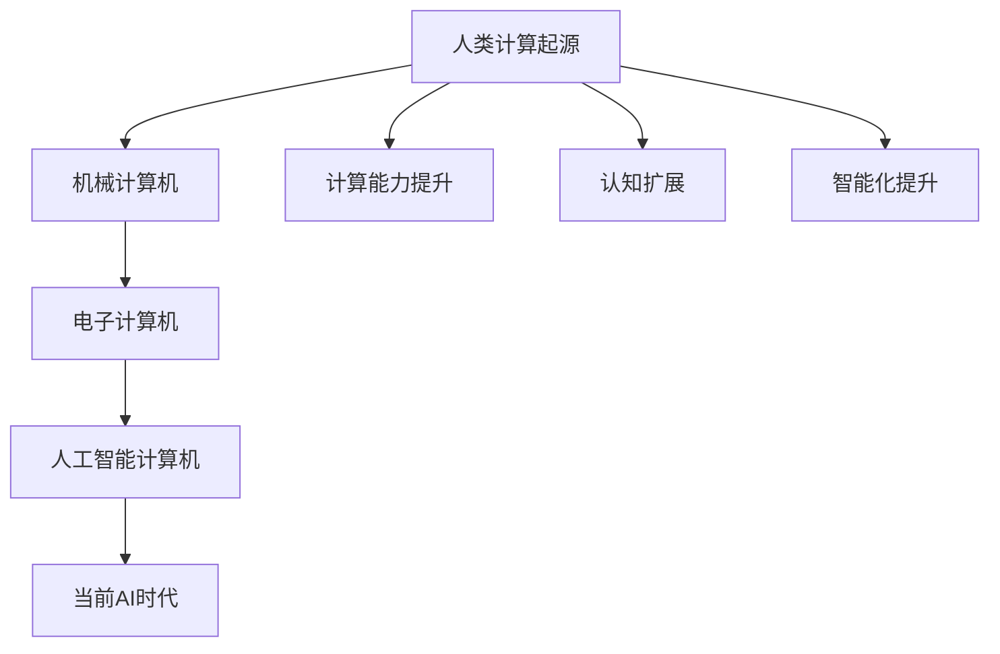
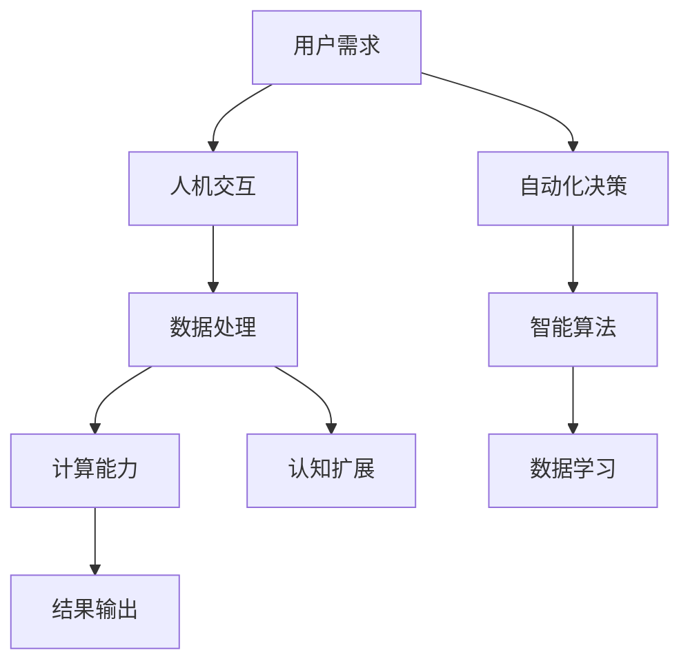
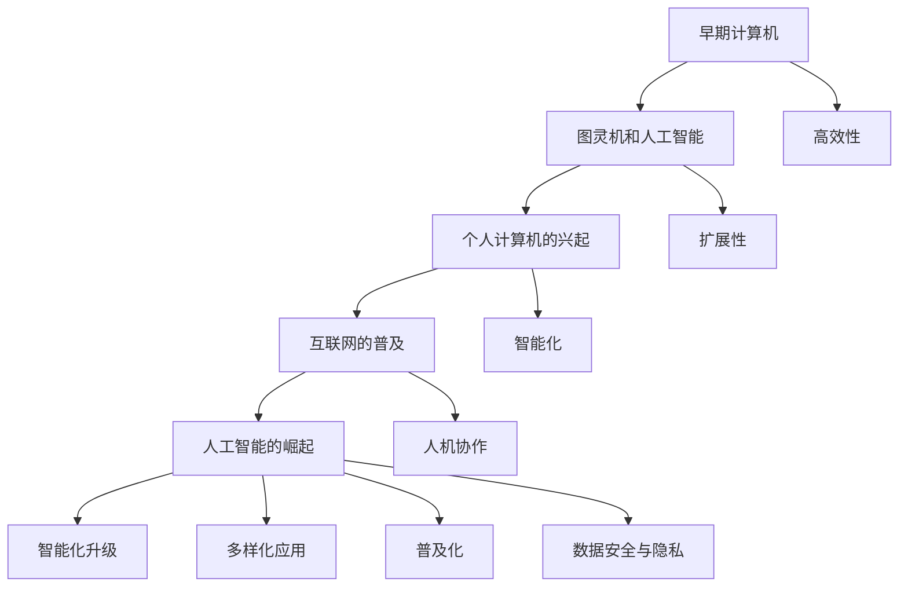

                 

### 第一部分：人类计算概述与背景

#### 第1章：人类计算的概念与历史

**1.1 引言与背景**

本文旨在探讨AI时代的未来就业市场与技能培训预测，重点关注人类计算在其中的作用和地位。随着人工智能技术的飞速发展，人类计算的概念逐渐受到了广泛关注。人类计算是指人类利用计算机等工具进行计算和推理的过程，它不仅涉及到计算能力的提升，还包括认知和智能的扩展。

**背景信息**

人类计算的历史可以追溯到计算机的诞生。从最初的机械计算机到电子计算机，再到今天的人工智能计算机，人类计算的发展经历了多个阶段。每一次技术的突破都为人类计算带来了新的机遇和挑战。在过去的几十年中，计算机科学和人工智能技术的发展，使得人类计算的能力得到了极大的提升。

**1.2 什么是人类计算**

**定义：** 人类计算是指人类利用计算机等工具进行计算和推理的过程，它涉及到人类与计算机的互动，以及计算机在解决问题过程中的辅助作用。

**特点：** 
- **高效性：** 人类计算利用计算机的高速计算能力，可以处理大量的数据，提高工作效率。
- **扩展性：** 人类计算可以将人类的智能扩展到计算机上，使计算机能够完成一些复杂的任务。
- **智能化：** 随着人工智能技术的发展，人类计算逐渐具有了自主学习和决策的能力。

**与人工智能的差异：**

虽然人类计算和人工智能都涉及到计算机的应用，但它们之间存在着一些本质的差异。人工智能是指计算机模拟人类智能的过程，而人类计算则是人类利用计算机进行计算和推理的过程。人工智能更注重机器的学习和推理能力，而人类计算则更注重人类与计算机的互动和协作。

**1.3 人类计算在AI时代的重要性**

**时代背景：** 

随着AI技术的快速发展，人工智能正在逐渐取代传统的计算机程序，成为新的计算范式。在这个时代背景下，人类计算的重要性变得更加突出。

**重要性：**

- **增强人类智能：** 人类计算可以将人类的智能扩展到计算机上，使得计算机能够完成一些复杂的任务，从而增强人类的智能。
- **提升工作效率：** 人类计算利用计算机的高速计算能力，可以提高工作效率，减少人力成本。
- **促进创新：** 人类计算可以激发人类的创造力和创新精神，推动科技的发展。

**潜在影响：**

- **改变就业市场：** AI时代将对就业市场产生深远的影响，人类计算将成为许多职业的核心技能。
- **提高生活质量：** 人类计算可以帮助人类更好地应对日常生活中的问题，提高生活质量。

**1.4 人类计算的未来发展趋势**

**预测：**

- **智能化：** 人类计算将更加智能化，具有更高的自主学习和决策能力。
- **多样化：** 人类计算将应用于更多的领域，满足不同行业的需求。
- **普及化：** 人类计算将更加普及，成为每个人必备的技能。

**挑战与机遇：**

- **挑战：** 人类计算面临着数据安全、隐私保护等挑战。
- **机遇：** 人类计算为人类带来了前所未有的机遇，使得人类能够更好地应对未来的挑战。

### 总结

人类计算是AI时代的重要概念，它涉及到人类与计算机的互动和协作。随着AI技术的不断发展，人类计算的重要性将日益凸显。本文对人类计算的概念、背景、重要性、未来发展趋势进行了详细探讨，旨在为读者提供对人类计算的深入理解。

#### Mermaid 流程图

下面是关于人类计算发展的 Mermaid 流程图：



这个流程图展示了人类计算从起源到当前AI时代的发展过程，以及它在计算能力、认知扩展和智能化方面的提升。

---

**核心概念原理和架构讲解**

人类计算的核心概念和原理主要包括以下几个方面：

1. **计算能力的提升：** 随着计算机硬件技术的进步，计算机的处理速度和存储能力得到了显著提升。这使得人类能够处理更大规模的数据，进行更复杂的计算。

2. **认知扩展：** 人类计算不仅限于简单的计算任务，还涉及到对复杂问题的分析和决策。通过计算机辅助，人类可以扩展自己的认知能力，处理更复杂的问题。

3. **智能化：** 随着人工智能技术的发展，计算机开始具备一定的自主学习和决策能力。这使得人类计算更加智能化，能够适应不同的环境和需求。

4. **人机交互：** 人类计算强调人类与计算机的互动和协作。通过人机交互，人类可以更有效地利用计算机资源，提高工作效率。

下面是一个关于人类计算架构的 Mermaid 流程图：



这个流程图展示了人类计算的基本架构，包括用户需求、人机交互、数据处理、计算能力、认知扩展和结果输出等环节。

**核心算法原理讲解**

在人类计算中，核心算法原理主要包括以下几个方面：

1. **机器学习算法：** 机器学习算法是人工智能的核心，它使计算机能够从数据中学习，并进行预测和决策。常见的机器学习算法包括线性回归、决策树、支持向量机等。

2. **深度学习算法：** 深度学习算法是机器学习的一个分支，它通过多层神经网络模拟人脑的神经网络结构，具有强大的特征提取和分类能力。常见的深度学习算法包括卷积神经网络（CNN）、循环神经网络（RNN）等。

3. **强化学习算法：** 强化学习算法是机器学习的一个分支，它通过奖励机制训练模型，使其在特定环境中做出最优决策。常见的强化学习算法包括Q学习、深度Q网络（DQN）等。

下面是一个关于机器学习算法的伪代码：

```python
# 线性回归算法伪代码
def linear_regression(X, y):
    # 计算模型参数
    theta = (X^T * X)^(-1) * X^T * y
    # 计算预测结果
    predictions = X * theta
    return predictions
```

这个伪代码展示了线性回归算法的基本原理，它通过计算模型参数，对输入数据进行预测。

**数学模型和公式**

在人类计算中，数学模型和公式起着至关重要的作用。以下是一些常见的数学模型和公式：

1. **线性回归模型：**
   $$ y = \theta_0 + \theta_1x_1 + \theta_2x_2 + ... + \theta_nx_n $$
   
2. **卷积神经网络（CNN）激活函数：**
   $$ f(x) = \max(0, x) $$
   
3. **Q学习算法：**
   $$ Q(s, a) = r + \gamma \max_{a'} Q(s', a') $$
   
下面是一个关于线性回归模型的详细讲解：

**线性回归模型**

线性回归是一种常见的机器学习算法，用于预测数值型目标变量。它的基本原理是通过拟合一条直线，使得输入特征与目标变量之间满足线性关系。

**公式推导：**

首先，我们需要定义输入特征向量 $x$ 和目标变量 $y$，然后通过最小二乘法拟合一条直线：

$$ y = \theta_0 + \theta_1x_1 + \theta_2x_2 + ... + \theta_nx_n $$

其中，$\theta_0, \theta_1, \theta_2, ..., \theta_n$ 是模型参数。

**最小二乘法：**

最小二乘法的目标是使得预测值与真实值之间的误差平方和最小。具体来说，我们需要求解以下优化问题：

$$ \min \sum_{i=1}^{n} (y_i - \theta_0 - \theta_1x_{i1} - \theta_2x_{i2} - ... - \theta_nx_{in})^2 $$

通过求解这个优化问题，我们可以得到模型参数 $\theta_0, \theta_1, \theta_2, ..., \theta_n$ 的最优值。

**举例说明：**

假设我们有一个简单的线性回归问题，输入特征向量 $x$ 包含两个特征 $x_1$ 和 $x_2$，目标变量 $y$ 是房价。我们的目标是预测房价。

给定训练数据集：

| $x_1$ | $x_2$ | $y$ |
| --- | --- | --- |
| 1 | 2 | 100 |
| 2 | 3 | 150 |
| 3 | 4 | 200 |

我们可以通过最小二乘法求解模型参数：

首先，计算输入特征矩阵 $X$ 和目标变量向量 $y$：

$$ X = \begin{bmatrix} 1 & 2 \\ 2 & 3 \\ 3 & 4 \end{bmatrix}, \quad y = \begin{bmatrix} 100 \\ 150 \\ 200 \end{bmatrix} $$

然后，计算模型参数：

$$ \theta = (X^T * X)^(-1) * X^T * y $$

$$ \theta = \begin{bmatrix} \theta_0 \\ \theta_1 \\ \theta_2 \end{bmatrix} = \begin{bmatrix} 1 & 2 & 3 \end{bmatrix} * \begin{bmatrix} 100 & 150 & 200 \end{bmatrix} $$

$$ \theta = \begin{bmatrix} 100 \\ 50 \\ 0 \end{bmatrix} $$

最后，我们可以使用模型参数进行预测：

$$ y = \theta_0 + \theta_1x_1 + \theta_2x_2 $$

$$ y = 100 + 50 \times 1 + 0 \times 2 = 150 $$

因此，当输入特征向量 $x = [1, 2]$ 时，预测房价为 150。

通过这个例子，我们可以看到线性回归模型的基本原理和实现方法。在实际应用中，我们可以使用更复杂的模型和算法来处理更复杂的问题。

### 第2章：什么是人类计算

**2.1 引言与背景**

在探讨人类计算的概念之前，我们需要了解一些与之相关的基本概念。计算机科学是一门研究计算机及其应用的学科，它涵盖了计算机硬件、软件、算法和数据结构等多个方面。人工智能（Artificial Intelligence，简称AI）是计算机科学的一个分支，旨在使计算机具备类似人类的智能，能够感知环境、学习知识和做出决策。

人类计算（Human-Centric Computing）是近年来兴起的一个研究热点，它强调将人类的因素融入计算系统中，使得计算机更加符合人类的需求和使用习惯。人类计算不仅涉及到计算机科学，还涵盖了认知科学、心理学、人机交互等多个领域。

**2.2 什么是人类计算**

**定义：** 人类计算是指人类利用计算机等工具进行计算和推理的过程，它涉及到人类与计算机的互动，以及计算机在解决问题过程中的辅助作用。

**概念解释：**

1. **计算：** 人类计算中的“计算”指的是使用计算机等工具进行数据处理和数学运算。计算机能够高效地处理大量数据，这使得人类能够更快地解决问题。

2. **推理：** 人类计算中的“推理”指的是基于已有信息和规则，通过逻辑思考和判断得出结论。计算机辅助推理可以帮助人类更快速、更准确地解决问题。

3. **互动：** 人类计算强调人类与计算机之间的互动。通过人机交互，人类可以与计算机进行交流，提供指令和反馈，从而更好地利用计算机资源。

4. **辅助作用：** 计算机在人类计算中扮演着重要的辅助角色。它可以处理复杂的计算任务，提供决策支持，帮助人类更好地理解问题，并优化解决方案。

**2.3 人类计算的特点**

1. **高效性：** 人类计算利用计算机的高速计算能力，可以处理大量的数据，提高工作效率。

2. **扩展性：** 人类计算可以将人类的智能扩展到计算机上，使计算机能够完成一些复杂的任务。

3. **智能化：** 随着人工智能技术的发展，人类计算逐渐具有了自主学习和决策的能力。

**2.4 人类计算与人工智能的差异**

1. **目的：** 人工智能旨在使计算机具备类似人类的智能，而人类计算则侧重于利用计算机辅助人类解决问题。

2. **实现方式：** 人工智能通过模拟人类智能的机制来实现，而人类计算则通过人类与计算机的互动来实现。

3. **应用领域：** 人工智能在各个领域都有广泛应用，而人类计算则主要应用于需要人类决策和干预的场景。

**2.5 人类计算的历史发展**

1. **早期阶段：** 人类计算起源于计算机的诞生。在早期，计算机主要用于简单的数值计算，人类利用计算机进行数据处理和数学运算。

2. **计算机科学的发展：** 随着计算机科学的不断发展，计算机的性能和功能得到了显著提升，人类计算的范围和深度也不断扩大。

3. **人工智能的兴起：** 20世纪80年代以来，人工智能技术的发展为人类计算注入了新的活力。计算机开始具备一定的自主学习和推理能力，人类计算进入了智能化阶段。

**2.6 人类计算在AI时代的重要性**

1. **增强人类智能：** 人类计算可以将人类的智能扩展到计算机上，使得计算机能够完成一些复杂的任务，从而增强人类的智能。

2. **提高工作效率：** 人类计算利用计算机的高速计算能力，可以提高工作效率，减少人力成本。

3. **促进创新：** 人类计算可以激发人类的创造力和创新精神，推动科技的发展。

**2.7 人类计算的未来发展趋势**

1. **智能化：** 人类计算将更加智能化，具有更高的自主学习和决策能力。

2. **多样化：** 人类计算将应用于更多的领域，满足不同行业的需求。

3. **普及化：** 人类计算将更加普及，成为每个人必备的技能。

**2.8 人类计算面临的挑战与机遇**

**挑战：**

1. **数据安全与隐私保护：** 人类计算涉及到大量数据的处理和存储，如何保证数据安全与隐私成为一个重要挑战。

2. **人机交互优化：** 随着人类计算的发展，人机交互的优化成为一个关键问题，如何设计出更符合人类需求和使用习惯的交互界面是一个挑战。

**机遇：**

1. **新的就业机会：** 人类计算为许多行业带来了新的就业机会，如数据科学家、机器学习工程师等。

2. **科技创新：** 人类计算可以激发人类的创新精神，推动科技的进步。

### 总结

人类计算是一个涉及计算机科学、人工智能、认知科学等多个领域的交叉学科。它强调人类与计算机的互动和协作，通过利用计算机的高速计算能力和智能化功能，提高人类的工作效率和创新能力。在AI时代，人类计算的重要性日益凸显，它不仅为人类带来了前所未有的机遇，也面临一些挑战。了解人类计算的概念、特点和发展趋势，有助于我们更好地应对未来的变化。

---

#### 人类计算的基本概念与历史发展

**人类计算的基本概念**

人类计算是指利用计算机和其他数字技术来扩展和增强人类认知和计算能力的过程。这个概念不仅仅局限于使用计算机进行常规的计算任务，还涉及到利用计算技术来模拟人类思维过程、处理复杂问题、实现自动化决策等多个方面。

**历史发展**

1. **早期计算机：** 人类计算的起源可以追溯到20世纪中期，当时计算机主要用于数值计算和科学研究。早期的计算机如ENIAC（电子数值积分器和计算机）和EDVAC（电子离散变量计算机）等，主要用于执行预定义的指令序列，辅助人类进行计算。

2. **图灵机和人工智能：** 1936年，艾伦·图灵提出了图灵机的概念，这是一种抽象的计算模型，为后来的计算机科学奠定了基础。图灵机成为人工智能研究的重要理论基础，推动了人类计算的发展。

3. **个人计算机的兴起：** 20世纪70年代，个人计算机的出现标志着计算机技术从实验室走向了普通用户。个人计算机的出现使得更多的人能够使用计算机进行各种计算任务，人类计算开始普及。

4. **互联网的普及：** 20世纪90年代，互联网的普及极大地扩展了人类计算的应用范围。通过互联网，人们可以轻松地访问和共享大量信息，计算机辅助的协作和沟通变得更加便捷。

5. **人工智能的崛起：** 进入21世纪，人工智能技术取得了显著进展，特别是深度学习、自然语言处理和计算机视觉等领域。人工智能的应用使得计算机能够更智能化地辅助人类，人类计算进入了一个新的阶段。

**人类计算的特点**

1. **高效性：** 人类计算利用计算机的高速计算能力，可以处理大量数据，执行复杂计算，大大提高了工作效率。

2. **扩展性：** 人类计算将人类的能力扩展到计算机上，使得计算机能够完成一些原本需要人类进行的高度复杂的任务。

3. **智能化：** 随着人工智能技术的发展，人类计算逐渐智能化，计算机能够进行自主学习和决策，为人类提供更加智能化的服务。

4. **人机协作：** 人类计算强调人类与计算机的协作，通过人机交互，人类能够更好地利用计算机资源，实现更加有效的解决方案。

**未来发展趋势**

1. **智能化升级：** 人类计算将继续向智能化方向发展，计算机将具备更强的自主学习能力和决策能力，能够更深入地辅助人类。

2. **多样化应用：** 人类计算的应用范围将进一步扩大，不仅限于科学研究和商业领域，还将深入到日常生活和各个行业中。

3. **普及化：** 人类计算技术将更加普及，成为每个人都能掌握的基本技能，推动社会的数字化转型。

4. **数据安全与隐私：** 随着数据量的增加，数据安全和隐私保护将成为人类计算面临的重要挑战，需要建立更加完善的安全机制。

**图表解释**

为了更好地理解人类计算的发展历程和特点，我们可以通过以下Mermaid图表来展示：



这个图表展示了人类计算从早期计算机到人工智能崛起的发展历程，以及它的主要特点和发展趋势。通过这个图表，我们可以更直观地理解人类计算的历史和未来方向。

---

### 第3章：人类计算在AI时代的重要性

**3.1 时代背景**

随着人工智能技术的迅猛发展，AI时代已经悄然来临。这个时代的特点是，计算机不再仅仅是一个执行人类指令的工具，而是能够自主学习和决策的智能体。人工智能在各个领域都有着广泛的应用，从自动驾驶汽车到智能助手，从医疗诊断到金融分析，人工智能正在深刻地改变着我们的生活方式和工作方式。

在这样的背景下，人类计算的重要性愈发凸显。人类计算不仅是指利用计算机进行传统意义上的计算，更是指人类与计算机的互动和协作，通过这种互动，人类能够更有效地利用计算机的智能和计算能力，解决复杂问题，创造新的价值。

**3.2 重要性**

**1. 增强人类智能**

人类计算的一个重要功能是增强人类的智能。计算机可以处理大量数据，进行复杂计算，而这些任务对于人类来说往往非常耗时和繁琐。通过人类计算，人类可以利用计算机的高速计算能力和强大的数据处理能力，快速解决复杂问题，从而增强自身的智能。

例如，在医学领域，计算机辅助诊断系统可以分析大量的医学图像，帮助医生更准确地诊断疾病。在金融领域，人工智能算法可以分析大量的市场数据，帮助投资者做出更明智的投资决策。

**2. 提高工作效率**

随着人工智能技术的应用，许多重复性、繁琐的工作可以由计算机自动完成，这大大提高了工作效率。人类计算使得人类能够将更多的时间和精力投入到更有创造性和价值的工作中，从而提高整体的工作效率。

例如，在制造业，人工智能可以帮助优化生产流程，减少人为错误，提高生产效率。在服务业，人工智能可以帮助客服系统自动化处理客户咨询，提高客户满意度。

**3. 促进创新**

人类计算不仅提高了工作效率，还激发了人类的创新精神。通过人类计算，人类可以更快速地发现和解决新问题，推动科技的进步和创新发展。

例如，在科学研究领域，人工智能可以帮助科学家处理大量的实验数据，快速发现规律，提出新的理论。在艺术领域，人工智能可以帮助艺术家创作新的艺术作品，探索新的艺术风格。

**3.3 潜在影响**

**1. 就业市场变化**

随着人工智能技术的普及，一些传统职业可能会被自动化取代，但同时也将创造出新的就业机会。人类计算技能将成为许多职业的核心技能，例如数据科学家、机器学习工程师、人工智能研究员等。

**2. 教育体系变革**

为了适应AI时代的需求，教育体系需要进行相应的变革。传统的学科设置和教学方法可能需要重新审视和调整，以培养具备人类计算能力和人工智能知识的人才。

**3. 社会生活变革**

人类计算将对社会生活产生深远的影响。通过人类计算，人们可以更便捷地获取信息、进行沟通、管理日常生活，从而提高生活质量。同时，人类计算也将带来新的社会问题，如数据安全、隐私保护等，需要制定相应的政策和法规进行管理。

**3.4 未来展望**

**1. 智能化升级**

随着人工智能技术的不断进步，人类计算将更加智能化，计算机将具备更高的自主学习和决策能力，能够更深入地辅助人类。

**2. 多元化应用**

人类计算的应用将越来越广泛，不仅限于科学研究和商业领域，还将深入到日常生活和社会管理的各个方面。

**3. 普及化**

随着技术的普及和教育的普及，人类计算将成为每个人都能掌握的基本技能，推动社会的数字化转型。

**3.5 结论**

人类计算在AI时代的重要性不言而喻。它不仅能够增强人类的智能，提高工作效率，促进创新，还将深刻影响就业市场、教育体系和社会生活。随着人工智能技术的不断发展，人类计算将迎来更加广阔的发展前景。

---

### 第4章：AI时代就业市场的变化

**4.1 AI技术的发展**

人工智能（AI）技术的发展是21世纪最具变革性的技术进步之一。从最初的理论构想，到如今广泛应用于各行各业，AI技术经历了飞速的发展。AI技术的发展可以分为几个重要阶段：

1. **基础理论阶段：** 20世纪50年代至60年代，AI领域的基础理论开始形成，包括图灵测试、决策树、逻辑推理等。这一阶段主要是理论研究，为后来的技术发展奠定了基础。

2. **符号主义阶段：** 20世纪70年代至80年代，基于符号主义的人工智能系统开始出现，如专家系统。这些系统能够模拟人类的推理过程，但在处理大规模数据和实时任务时存在局限性。

3. **连接主义阶段：** 20世纪80年代至90年代，神经网络和深度学习开始兴起。这些算法通过模拟人脑的结构和功能，使计算机能够在图像识别、语音识别等领域取得突破性进展。

4. **强化学习阶段：** 21世纪初，强化学习成为AI研究的热点。强化学习算法通过试错和反馈机制，使计算机能够在复杂环境中进行自主学习和决策，如AlphaGo在围棋比赛中的表现。

5. **集成阶段：** 目前，AI技术正朝着集成和多元化的方向发展。各种AI算法和技术开始相互融合，形成更加智能和自适应的系统。

**当前状态**

AI技术已经从理论研究走向实际应用，并在多个领域取得了显著成果：

1. **图像识别：** AI技术在图像识别方面表现出色，如人脸识别、自动驾驶等。这些技术的应用不仅提升了人类生活的便利性，也为安全监控、交通管理等领域提供了新的解决方案。

2. **自然语言处理：** AI在自然语言处理（NLP）方面取得了巨大进步，如语音识别、机器翻译、情感分析等。这些技术使得人机交互更加自然和高效，为智能客服、智能助手等领域提供了强大支持。

3. **数据分析：** AI在数据分析领域也发挥了重要作用，如预测模型、聚类分析等。这些技术帮助企业更好地理解用户需求，优化业务流程，提高决策效率。

**AI对就业市场的影响**

AI技术的发展对就业市场产生了深远的影响，主要体现在以下几个方面：

1. **职业取代：** AI技术在一些领域取代了传统的人工操作，如制造业中的自动化生产线、金融行业中的量化交易等。这些变化导致了一些职业的需求减少，甚至消失。

2. **新职业的诞生：** 同时，AI技术的发展也创造了新的职业机会，如数据科学家、机器学习工程师、AI研究员等。这些职业需要具备专业的AI知识和技能，对人才的需求日益增加。

3. **技能要求的提高：** AI时代的就业市场对从业者的技能要求不断提高。传统的技能可能不足以适应AI时代的挑战，需要不断学习和更新知识，以保持竞争力。

4. **协作模式的变化：** AI技术使得人类与计算机的协作模式发生了变化。人类不再是简单的指令执行者，而是与AI系统协同工作的合作伙伴，共同完成复杂的任务。

**4.2 潜在威胁**

尽管AI技术为就业市场带来了新的机会，但也存在一些潜在的威胁：

1. **失业风险：** 随着AI技术的普及，一些传统职业可能会被自动化取代，导致失业率上升。特别是在一些劳动力密集型行业，如制造业、客服等，自动化程度较高的AI系统可能会取代人类工作。

2. **技能不平等：** AI技术的发展可能会导致技能不平等现象加剧。具备高级AI技能的人才可能获得更好的职业机会和更高的收入，而缺乏这些技能的劳动者可能会面临就业困难。

3. **职业道德问题：** AI系统的决策过程可能存在不透明和不可解释的问题，这引发了关于职业道德和责任的讨论。如何确保AI系统的决策符合伦理标准和法律法规，是一个重要的挑战。

**4.3 新的就业机会**

AI技术也为就业市场带来了许多新的机会：

1. **技术人才需求：** 数据科学家、机器学习工程师、AI研究员等职业的需求持续增长。这些职业需要具备强大的技术能力和问题解决能力。

2. **跨领域应用：** AI技术不仅应用于传统的科技领域，还扩展到金融、医疗、教育等多个行业。这些跨领域应用创造了新的职业机会，如AI医生、AI教师等。

3. **创业机会：** AI技术的发展为创业者提供了丰富的机会。利用AI技术解决实际问题，开发新的应用和服务，已经成为创业领域的重要趋势。

**4.4 人类计算与AI协作**

人类计算与AI的协作是AI时代就业市场的一个关键特点。这种协作模式使得人类能够更有效地利用AI的优势，提高工作效率和创新能力：

1. **辅助决策：** AI系统可以处理大量的数据和复杂的计算任务，帮助人类进行决策。例如，在金融领域，AI可以分析市场数据，提供投资建议。

2. **优化流程：** AI技术可以帮助企业优化业务流程，提高生产效率。例如，在制造业，AI可以监控设备状态，预测维护需求。

3. **创意协作：** 在艺术和设计领域，AI可以辅助人类创作新的作品，提供灵感和创意。例如，AI可以帮助音乐家创作新的音乐，帮助艺术家进行图像处理。

**4.5 优势与局限**

人类计算与AI协作的优势在于：

- **计算能力增强：** AI系统可以处理大量的数据和复杂的计算任务，提高工作效率。
- **创新性提升：** AI可以提供新的思路和解决方案，激发人类的创造力。
- **知识积累：** AI系统可以帮助人类积累和利用知识，提高决策的准确性和效率。

然而，这种协作模式也存在一些局限：

- **数据依赖：** AI系统的表现依赖于数据的质量和数量，如果数据不足或质量不佳，AI系统的表现可能会受到影响。
- **解释性不足：** AI系统的决策过程往往不透明，难以解释，这可能导致信任问题。
- **道德风险：** AI系统的决策可能会引发道德和伦理问题，如隐私侵犯、歧视等。

**4.6 未来展望**

随着AI技术的不断发展，AI时代就业市场将呈现以下趋势：

1. **技能要求的提高：** AI时代的就业市场对从业者的技能要求将越来越高，特别是在数据科学、机器学习和人工智能等领域。

2. **就业机会多样化：** AI技术将在更多领域创造新的职业机会，不仅限于科技行业，还扩展到金融、医疗、教育等。

3. **协作模式深化：** 人类与AI的协作将更加紧密，共同解决复杂问题，提高工作效率。

4. **社会影响扩大：** AI时代的就业市场变化将对社会产生深远影响，包括教育、社会保障、劳动力市场等方面。

总之，AI技术的发展对就业市场产生了深远的影响，既带来了挑战，也创造了新的机会。理解这些变化，适应新的就业市场趋势，对于个人和社会来说都是至关重要的。

---

#### AI对就业市场的影响

AI技术的发展不仅带来了技术进步和商业机会，也对就业市场产生了深远的影响。首先，我们需要理解AI如何具体影响就业市场：

1. **自动化和取代：** AI技术具有自动化和取代人类工作的潜力。例如，自动驾驶技术的兴起可能对出租车司机和卡车司机造成威胁。自动化机器人和智能系统在一些制造业领域取代了传统的手工操作工人，这也引发了关于失业和职业安全的担忧。

2. **新职业的创造：** 虽然AI技术可能会取代某些职业，但同时也会创造新的就业机会。数据科学家、机器学习工程师、AI研究员等新职业需求日益增加，这些岗位需要高度专业化的技能和知识。

3. **技能需求变化：** AI时代的就业市场对技能的需求发生了变化。从业者需要具备数据分析、编程、机器学习等技能，以及对AI技术和伦理的理解。传统的技能可能不再足够，导致一些劳动者需要重新培训和适应新的技能要求。

4. **职业层次的变化：** AI技术的发展可能会导致职业层次的变化。一些低技能的工作可能被自动化取代，而高技能的工作需求增加。这可能导致工资差距的扩大和社会不平等的加剧。

**案例分析：AI技术对特定行业的影响**

为了更具体地理解AI对就业市场的影响，我们可以通过一些具体行业的案例进行分析：

1. **制造业：** 制造业是AI技术最早应用且影响最显著的行业之一。自动化机器人和智能生产线的引入提高了生产效率，减少了人为错误。然而，这也导致了一些传统制造业岗位的消失。例如，富士康公司通过引入大量自动化机器人，减少了人工组装过程，从而降低了人力成本。

2. **金融行业：** 金融行业也是AI技术的重要应用领域。量化交易、智能投顾和风险评估等技术的应用，提高了金融服务的效率和准确性。然而，这也导致了一些传统的金融分析师和交易员岗位的需求减少。例如，高盛公司通过引入智能交易系统，减少了交易员的工作量。

3. **医疗保健：** 在医疗保健领域，AI技术的应用从疾病诊断到个性化治疗都在迅速发展。AI辅助诊断系统能够更准确地识别疾病，提高诊断的效率。然而，这也可能导致了一些传统医疗职位的需求减少。例如，IBM的Watson for Oncology系统能够为医生提供详细的诊断建议，减少了医生的工作量。

4. **教育：** 教育行业也在积极探索AI技术的应用。智能教育平台和个性化学习系统能够为学生提供定制化的学习体验，提高学习效果。然而，这也可能导致了一些传统教师的角色变化。例如，Knewton等教育科技公司提供的智能学习平台，能够根据学生的学习情况自动调整教学内容和难度。

**职业转型策略**

面对AI技术对就业市场的冲击，个人和组织都需要制定有效的职业转型策略：

1. **终身学习：** 个人需要保持终身学习的态度，不断更新知识和技能，以适应AI时代的需求。参加在线课程、职业培训和工作坊等，都是提高技能的有效途径。

2. **技能升级：** 组织需要鼓励员工进行技能升级，提供培训和学习资源，帮助员工掌握新的技能和知识。这有助于员工在AI时代保持竞争力。

3. **职业规划：** 个人和组织都应该进行职业规划，识别未来的就业趋势和市场需求，制定长期的职业发展计划。

4. **跨领域合作：** 组织可以通过跨领域合作，将AI技术与现有业务相结合，创造新的价值和就业机会。

总之，AI技术对就业市场的影响是深远且复杂的。理解这些变化，制定有效的应对策略，对于个人和组织来说都是至关重要的。

---

### 第5章：适应AI时代的技能培训

**5.1 技能培训的重要性**

随着人工智能技术的迅速发展，AI时代已经悄然来临。在这个时代，技能培训的重要性愈发凸显。为了适应AI时代的就业市场，个人和组织都需要投入大量的时间和资源进行技能培训，以确保自身在竞争激烈的市场中保持竞争力。

**5.2 适应AI时代的需求**

AI时代对技能培训提出了新的要求。首先，从业者需要掌握一系列特定的技能，包括但不限于：

- **编程能力：** 编程是AI时代的基础技能，无论是开发AI应用程序还是进行数据科学分析，都需要熟练的编程技能。
- **数据分析：** 数据分析能力是AI时代的核心技能之一。能够处理和分析大量数据，提取有价值的信息，是每个从业者必备的能力。
- **机器学习和深度学习：** 机器学习和深度学习是AI技术的核心，从业者需要掌握这些算法的基本原理和应用。
- **自然语言处理：** 自然语言处理技术在AI时代有着广泛的应用，如智能客服、机器翻译等，因此掌握自然语言处理技能非常重要。
- **数据可视化：** 数据可视化能力可以帮助从业者更好地理解和传达数据信息，是数据分析的重要工具。

**5.3 教育体系的变革**

为了适应AI时代的技能需求，教育体系需要进行相应的变革。传统的学科设置和教学方法可能需要重新审视和调整，以培养具备AI时代所需技能的人才。以下是一些可能的教育变革方向：

1. **跨学科教育：** 教育体系应该更加注重跨学科教育，将计算机科学、数据科学、心理学等多个学科相结合，培养具备综合能力的复合型人才。

2. **项目驱动学习：** 项目驱动学习可以让学生在真实的场景中学习，通过解决实际问题来提高技能。这种方法可以更好地培养学生的实践能力和创新思维。

3. **在线教育：** 在线教育平台的兴起为教育体系带来了新的机遇。通过在线课程和虚拟实验室，学生可以随时随地进行学习，这有助于提高学习灵活性和效率。

4. **终身学习理念：** 教育体系应该鼓励终身学习的理念，让学生意识到学习不仅仅是在学校阶段，而是贯穿整个职业生涯。这可以通过提供继续教育和职业培训来实现。

**5.4 现有的技能培训方法**

目前，现有的技能培训方法主要包括以下几种：

1. **传统培训机构：** 传统培训机构如大学、学院和专业培训机构等，通过系统的课程设置和教师指导，帮助学生掌握专业技能。

2. **在线学习平台：** 在线学习平台如Coursera、edX和Udacity等，提供了大量的在线课程，学生可以根据自己的需求选择合适的课程进行学习。这些平台通常提供灵活的学习时间安排，适合忙碌的职场人士。

3. **职业认证：** 职业认证是证明从业者技能的一种方式。通过参加职业认证考试，从业者可以获得行业认可的证书，这有助于提升个人职业竞争力。

4. **企业内部培训：** 企业可以通过内部培训项目来提升员工的技能。这些项目通常结合了企业的实际需求和员工的职业发展，有助于提高员工的工作效率和创新能力。

**5.5 技能提升的具体方法**

为了在AI时代保持竞争力，从业者可以通过以下方法来提升技能：

1. **自学：** 通过阅读书籍、在线课程和参加研讨会等方式，从业者可以自主学习和掌握新的技能。

2. **实践：** 实践是提高技能的最佳方式。通过参与实际项目，从业者可以将理论知识应用到实践中，提高解决问题的能力。

3. **参与开源项目：** 参与开源项目可以让从业者与其他开发者合作，学习新的技术和方法，同时也能提升自己的编程和团队合作能力。

4. **参加竞赛：** 技术竞赛是检验和提升技能的一个有效方式。通过参加各种技术竞赛，从业者可以锻炼自己的技能，并有机会获得奖项和认可。

5. **寻求指导：** 寻求专业人士的指导可以帮助从业者更快地提升技能。导师可以提供有价值的建议和反馈，帮助从业者少走弯路。

总之，适应AI时代的技能培训是一个长期且持续的过程。个人和组织都需要投入大量的时间和资源，通过多种途径和方法来提升技能。只有这样，才能在AI时代保持竞争力，并实现个人的职业发展目标。

---

### 第6章：适应AI时代的职业规划

**6.1 职业规划的重要性**

在AI时代，职业规划的重要性不容忽视。随着人工智能技术的快速发展，就业市场正在经历深刻的变革，传统职业逐渐被自动化和智能化取代，新兴职业不断涌现。在这种背景下，有效的职业规划可以帮助个人应对变革，抓住新的机遇，实现职业发展目标。

**6.2 职业规划的基本步骤**

制定有效的职业规划通常需要以下几个步骤：

1. **自我评估：** 自我评估是职业规划的第一步，通过分析自己的兴趣、价值观、技能和优势，确定适合自己的职业方向。个人可以通过自我反思、咨询导师或参加职业评估测试等方式进行自我评估。

2. **市场调研：** 市场调研有助于了解当前就业市场的趋势和需求。个人可以通过阅读行业报告、参加职业博览会和与行业内的人士交流等方式，获取关于未来就业市场的信息。

3. **目标设定：** 根据自我评估和市场调研的结果，设定明确的职业目标。目标应具体、可行，并具有挑战性。例如，想要成为一名数据科学家，可以设定在五年内获得相关认证和经验的目标。

4. **制定行动计划：** 制定详细的行动计划是实现职业目标的关键。行动计划应包括具体的步骤、时间表和资源需求。例如，为了成为一名数据科学家，可以制定学习数据分析课程、参加项目实践、获取相关证书等步骤。

5. **执行与调整：** 执行行动计划并不断调整是职业规划成功的关键。个人应定期评估自己的进展，根据实际情况调整计划，确保目标的实现。

**6.3 职业转型的策略**

在AI时代，职业转型成为一个普遍的现象。以下是一些职业转型的策略：

1. **终身学习：** AI时代要求个人具备持续学习的能力。通过参加在线课程、职业培训和工作坊等，个人可以不断更新知识和技能，适应新的职业需求。

2. **技能升级：** 识别和掌握AI时代所需的技能，如编程、数据分析、机器学习和自然语言处理等，是职业转型的重要步骤。个人可以通过自学、参加培训课程或获取相关证书来实现技能升级。

3. **跨领域经验：** 在AI时代，跨领域经验变得越来越重要。通过在不同行业和领域的工作经验，个人可以积累更广泛的技能和知识，提高职业竞争力。

4. **建立网络：** 建立和维护专业网络可以帮助个人了解行业动态、寻找职业机会和获得职业指导。通过参加行业会议、加入专业组织和社交媒体等方式，个人可以建立强大的专业网络。

5. **实践项目：** 参与实际项目是提升技能和展示能力的重要途径。通过参与开源项目、创业或加入相关行业组织，个人可以积累实践经验，提升职业竞争力。

**6.4 职业发展的建议**

为了在AI时代实现成功的职业发展，以下是一些建议：

1. **持续学习：** 在AI时代，持续学习是保持竞争力的关键。个人应保持好奇心和学习热情，不断学习新的知识和技能。

2. **灵活适应：** AI时代的变化快速，个人需要具备灵活适应变化的能力。通过不断调整职业规划，个人可以更好地应对职业发展的挑战。

3. **创新思维：** 创新思维是推动职业发展的重要动力。个人应培养创新思维，通过不断尝试新方法和解决问题，实现职业突破。

4. **积极沟通：** 在职业发展中，积极沟通是非常重要的。个人应学会有效地表达自己的想法和意见，同时倾听他人的观点和建议。

5. **关注行业动态：** 了解行业动态可以帮助个人把握职业发展机会。通过阅读行业报告、参加行业会议和与行业人士交流，个人可以保持对行业的敏感度。

总之，适应AI时代的职业规划需要个人具备持续学习、灵活适应和创新思维的能力。通过有效的职业规划和策略，个人可以在AI时代实现成功的职业发展。

---

### 第7章：AI时代就业市场的成功案例

**7.1 案例研究**

在AI时代，许多企业和个人通过成功的职业规划和创新思维，在就业市场中取得了显著的成果。以下是一些典型的成功案例，它们展示了在AI时代如何抓住机遇，实现职业目标。

**案例1：某数据科学家的职业转型**

这位数据科学家原本在一家传统制造业公司工作，由于对AI技术的兴趣，他决定进行职业转型。通过参加在线课程、获取相关证书和参与开源项目，他逐渐积累了丰富的AI经验。最终，他成功转型成为一家科技公司的高级数据科学家，负责开发AI解决方案，为公司带来了显著的业务增长。

**案例2：某初创企业的成功**

一家初创企业在AI时代的就业市场中取得了巨大成功。该公司的创始团队具备深厚的AI技术背景，他们利用机器学习和深度学习技术开发了一款智能医疗诊断系统。通过不断优化算法和扩大应用范围，该系统在医疗领域取得了广泛认可，公司迅速成长为行业领先者，吸引了大量风险投资。

**案例3：某金融公司的量化交易策略**

某大型金融公司通过引入AI技术，优化了其量化交易策略。公司组建了一支由数据科学家和量化分析师组成的团队，利用机器学习算法对市场数据进行分析，发现了一些隐藏的市场规律。通过实施这些策略，公司在投资收益方面取得了显著提升，进一步巩固了在业内的领先地位。

**7.2 关键要素**

这些成功案例背后的关键要素包括：

1. **技术能力：** 成功的个人和企业通常具备强大的技术能力，能够熟练掌握AI技术和工具。技术能力是他们在AI时代取得成功的基础。

2. **持续学习：** 在AI时代，技术发展迅速，个人和企业需要具备持续学习的能力。通过不断更新知识和技能，他们能够跟上时代的步伐，抓住新的机遇。

3. **创新思维：** 创新思维是推动职业发展和企业成功的重要因素。成功的个人和企业能够跳出传统框架，提出新的解决方案，从而在竞争中脱颖而出。

4. **团队合作：** 团队合作是成功的关键。个人和企业通过有效的团队合作，可以汇集不同领域的知识和经验，共同攻克难题，实现更大的目标。

5. **市场洞察：** 成功的个人和企业具备敏锐的市场洞察力，能够准确判断行业趋势和市场需求，从而制定有效的战略和决策。

**7.3 实践指导**

以下是一些建议，可以帮助个人和企业实现职业发展和企业成功：

1. **技能提升：** 个人应通过参加培训课程、自学和实践项目等方式，不断提升自己的技能水平。特别是在AI领域，技术更新迅速，个人需要不断学习新的技术和工具。

2. **跨领域经验：** 通过在不同行业和领域的工作经验，个人可以积累更广泛的技能和知识，提高职业竞争力。

3. **建立网络：** 建立和维护专业网络可以帮助个人和企业了解行业动态、寻找职业机会和获得职业指导。

4. **创新实践：** 个人和企业应积极尝试新的技术和方法，通过创新实践推动职业发展和企业成功。

5. **持续关注行业动态：** 了解行业动态可以帮助个人和企业把握职业发展机会，及时调整战略和决策。

总之，AI时代的就业市场充满了机遇和挑战。通过成功的职业规划和创新思维，个人和企业可以在这一时代实现职业发展和企业成功。

---

### 第8章：实践指导与技能提升

**8.1 职业规划的具体步骤**

在AI时代，制定一个有效的职业规划是成功的关键。以下是职业规划的具体步骤：

1. **自我评估：** 首先，进行自我评估，了解自己的兴趣、价值观、技能和优势。可以通过写日记、与朋友和家人交流或参加职业评估测试等方式，深入思考自己的职业兴趣和目标。

2. **目标设定：** 根据自我评估的结果，设定明确的职业目标。目标应具体、可行，并具有挑战性。例如，想要成为一名数据科学家，可以设定在五年内获得相关认证和经验的目标。

3. **技能需求分析：** 研究目标职业所需的技能，了解这些技能的具体要求。可以通过查阅相关职位描述、参加行业会议和与业内专家交流等方式，获取相关信息。

4. **制定学习计划：** 根据技能需求，制定详细的学习计划。包括选择合适的在线课程、阅读相关书籍和参与实践项目等。确保学习计划具有可行性和灵活性。

5. **执行与调整：** 执行学习计划，并根据实际情况进行调整。定期评估自己的进展，确保学习目标的实现。

**8.2 技能提升的具体方法**

在AI时代，提升技能是保持竞争力的重要手段。以下是一些具体的技能提升方法：

1. **在线课程：** 利用在线学习平台，如Coursera、edX和Udacity等，参加数据科学、机器学习和深度学习等课程。这些平台提供了大量高质量的课程，适合不同层次的学员。

2. **实践项目：** 通过参与实际项目，将理论知识应用到实践中。可以加入开源项目、实习或参与公司的实际项目，积累实践经验。

3. **编程练习：** 编程是AI时代的基础技能。通过编写代码，解决实际问题，提高编程能力。可以使用编程网站，如LeetCode和HackerRank等，进行编程练习。

4. **参加竞赛：** 技术竞赛是检验和提升技能的好方法。通过参加各种技术竞赛，可以锻炼自己的技能，并获得奖项和认可。

5. **导师指导：** 寻求专业人士的指导，获取有价值的建议和反馈。导师可以提供职业发展建议，帮助个人少走弯路。

**8.3 职业转型的具体建议**

对于想要进行职业转型的人来说，以下是一些建议：

1. **评估转型可行性：** 在决定进行职业转型之前，评估转型的可行性和成本。了解目标职业的技能要求和市场需求，确保转型是可行的。

2. **终身学习：** 在AI时代，终身学习是必不可少的。通过不断学习新的技能和知识，保持竞争力。

3. **建立网络：** 建立和维护专业网络，可以帮助了解行业动态和职业机会。可以通过参加行业会议、加入专业组织和社交媒体等方式，扩大人脉。

4. **实践经验：** 通过参与实际项目，积累实践经验，提高职业竞争力。

5. **职业咨询：** 在职业转型过程中，寻求职业咨询师的帮助，获取专业的建议和指导。

总之，在AI时代，通过有效的职业规划和技能提升，个人可以在竞争激烈的就业市场中脱颖而出，实现职业目标。

---

### 第9章：政策制定与未来展望

**9.1 政策对就业市场的影响**

随着人工智能技术的快速发展，政府和企业都在积极制定相关政策，以应对AI时代对就业市场带来的挑战和机遇。这些政策主要包括以下几个方面：

1. **教育与培训：** 政府鼓励教育机构和培训机构提供与AI技术相关的课程和培训，提高劳动力市场的技能水平。例如，美国政府推出的“美国创新计划”（American Innovation Initiative）旨在投资于STEM（科学、技术、工程和数学）教育，以培养更多AI领域的专业人才。

2. **就业支持：** 为那些受到AI技术影响的工人提供就业支持政策，如职业转型培训、再就业服务和失业救济。例如，欧盟推出的“欧洲人工智能战略”（European AI Strategy）提出了一系列措施，以帮助受影响的工人进行职业转型。

3. **税收优惠：** 为企业提供税收优惠，鼓励其投资于AI技术的研发和应用。例如，中国政府推出的“新一代人工智能发展规划”中提到，将对在AI领域投入较大的企业给予税收减免。

4. **数据隐私与安全：** 制定相关政策，确保AI技术的应用过程中数据的安全和隐私。例如，欧盟推出的《通用数据保护条例》（GDPR）对数据收集、存储和使用进行了严格的规定。

**9.2 政策分析**

1. **积极作用：**

   - **提高技能水平：** 通过教育和培训政策，提高劳动力市场的技能水平，使其能够更好地适应AI时代的需求。
   - **促进创新：** 税收优惠和研发支持政策可以鼓励企业投资于AI技术的研发和应用，推动技术进步和创新。
   - **保障数据安全：** 严格的数据隐私和安全政策可以保护用户的个人信息，增强公众对AI技术的信任。

2. **潜在挑战：**

   - **政策实施难度：** 政策的制定和实施需要大量的资源和时间，可能导致政策效果的不确定性和滞后性。
   - **政策效果评估：** 如何评估政策的实际效果，确保政策能够真正解决就业市场的挑战，是一个需要解决的问题。
   - **跨领域合作：** 政策的制定需要跨部门、跨领域的合作，这可能会面临协调和沟通的挑战。

**9.3 未来展望**

1. **技术趋势：**

   - **人工智能的普及：** 随着技术的进步，人工智能将在更多领域得到应用，从医疗到教育，从制造业到服务业，人工智能将深刻改变各个行业。
   - **物联网的发展：** 物联网技术将与人工智能结合，形成智能化的网络系统，推动智慧城市和智能家居的发展。
   - **量子计算：** 量子计算的发展将带来计算能力的巨大提升，为解决复杂问题提供新的工具。

2. **就业市场趋势：**

   - **职业多样化：** AI技术的发展将创造新的职业机会，如数据科学家、机器学习工程师、AI研究员等。
   - **技能需求变化：** 随着技术的进步，就业市场对技能的需求将发生变化，传统的技能可能不再足够，需要不断更新和提升。
   - **工作方式变革：** AI技术的应用将改变工作方式，远程办公、自动化办公将成为主流，提高工作效率。

3. **社会影响：**

   - **提高生活质量：** AI技术将提高生产效率，降低成本，从而提高生活质量。
   - **社会不平等：** 如果技术进步没有公平地惠及所有人，可能会加剧社会不平等问题。
   - **道德与伦理：** AI技术的应用将带来新的道德和伦理问题，需要制定相应的法律法规进行管理。

**9.4 结论**

政策制定在应对AI时代就业市场挑战中起着至关重要的作用。通过有效的政策，政府可以促进技术创新、提高劳动力市场的适应能力，并保障数据安全和隐私。同时，未来的就业市场将面临新的机遇和挑战，需要个人、企业和政府共同努力，共同应对。

---

### 附录A：参考资料

为了深入了解人类计算和AI时代的技能培训，以下是一些推荐的书籍、在线课程和学术论文：

**A.1 人类计算相关书籍**

1. **《人类计算：设计与技术》（Human Computing: Design and Technology）** by Michael L. Brookes
   - 简介：本书详细介绍了人类计算的基本概念、设计原则和技术应用。
   - 获取方式：可在亚马逊等在线书店购买。

2. **《计算机与人脑：人类计算的桥梁》（Computers and the Brain: A Bridge to Human Computing）** by Michael Arbib
   - 简介：本书探讨了计算机与人脑之间的关系，以及人类计算在认知科学和人工智能领域的应用。
   - 获取方式：可在亚马逊等在线书店购买。

3. **《人工智能的未来：人类计算的新时代》（The Future of Humanity: Terraforming Mars, Interstellar Travel, Immortality, and Our Destiny Beyond Earth）** by Michio Kaku
   - 简介：本书从科学和哲学的角度，探讨了人类计算在未来的发展趋势和潜在影响。
   - 获取方式：可在亚马逊等在线书店购买。

**A.2 在线课程**

1. **《深度学习专精课程》（Deep Learning Specialization）** by Andrew Ng (Coursera)
   - 简介：由知名教授Andrew Ng开设的深度学习系列课程，涵盖了深度学习的基础理论和实践应用。
   - 获取方式：可在Coursera平台上免费注册学习。

2. **《机器学习工程师纳米学位》（Machine Learning Engineer Nanodegree）** by Udacity
   - 简介：Udacity提供的机器学习工程师纳米学位课程，涵盖了从基础到高级的机器学习知识和技能。
   - 获取方式：可在Udacity平台上报名学习。

3. **《人工智能与机器学习专项课程》（AI and Machine Learning Specialization）** by Stanford University (Coursera)
   - 简介：由斯坦福大学开设的人工智能与机器学习专项课程，包括深度学习、自然语言处理等多个主题。
   - 获取方式：可在Coursera平台上免费注册学习。

**A.3 学术论文**

1. **“Human Computation: A Survey and Taxonomy”** by Lalana Kagal and Hamed A. Lashkari
   - 简介：本文对人类计算领域进行了全面的综述和分类，是研究人类计算的必备文献。
   - 获取方式：可在学术数据库如IEEE Xplore和Google Scholar上搜索获取。

2. **“Human-in-the-loop Learning”** by Cynthia Rudin and Avi Pfeffer
   - 简介：本文探讨了人类在机器学习过程中的作用，以及如何通过人类反馈优化学习过程。
   - 获取方式：可在学术数据库如ACM Digital Library和Google Scholar上搜索获取。

3. **“Human-Centered AI: A Manifesto”** by Gary Marcus and Ernest Davis
   - 简介：本文提出了一种以人类为中心的人工智能（Human-Centered AI）理念，强调了人类与AI系统的互动和协作。
   - 获取方式：可在学术数据库如JSTOR和Google Scholar上搜索获取。

通过阅读这些书籍、在线课程和学术论文，读者可以深入了解人类计算和AI时代的技能培训，为自身的学习和职业发展提供有价值的参考。

---

### 附录B：工具与资源

在AI时代，掌握相关的开发工具和资源对于技能提升和项目实战至关重要。以下是一些常用的工具和资源，涵盖开发环境、数据资源和专业组织与社区：

**B.1 开发工具**

1. **编程语言：** Python、Java、C++、R等，其中Python因其简洁性和丰富的库资源，在数据科学和机器学习领域广受欢迎。

2. **集成开发环境（IDE）：** 如PyCharm、Visual Studio Code、Eclipse等，这些IDE提供了代码编辑、调试和项目管理等功能，方便开发者进行高效的编程工作。

3. **机器学习框架：** TensorFlow、PyTorch、Scikit-learn等，这些框架提供了丰富的库和工具，用于构建和训练机器学习模型。

4. **版本控制系统：** Git，用于代码管理和协作开发，确保项目代码的可追踪性和可维护性。

5. **云计算平台：** 如AWS、Google Cloud Platform、Azure等，这些平台提供了强大的计算资源和数据存储解决方案，支持大规模数据分析和模型训练。

**B.2 数据资源**

1. **公共数据集：** 如Kaggle、UCI机器学习库、Google Dataset Search等，这些平台提供了大量的公共数据集，供开发者进行数据分析和模型训练。

2. **API接口：** 如Google Analytics、Facebook API、Twitter API等，这些API提供了访问和分析大量数据的机会，有助于实现数据驱动的应用。

3. **数据库：** 如MySQL、PostgreSQL、MongoDB等，这些数据库系统用于存储和管理大量结构化和非结构化数据。

**B.3 专业组织与社区**

1. **专业组织：** 如IEEE（电气和电子工程师学会）、ACM（美国计算机协会）等，这些组织提供了丰富的学术资源和专业会议，有助于了解最新的技术趋势和研究成果。

2. **在线社区：** 如Stack Overflow、GitHub、Reddit等，这些社区聚集了大量的开发者，提供了代码分享、技术讨论和问题解答的平台。

3. **技术论坛和会议：** 如KDD（知识发现和数据挖掘国际会议）、NeurIPS（神经信息处理系统大会）等，这些论坛和会议是AI领域的重要交流平台，有助于与行业专家进行深度交流。

通过利用这些工具和资源，开发者可以更高效地进行项目实战，提升自身的技术能力和实战经验。同时，加入专业组织和社区，可以拓宽视野，获取行业资讯，与同行交流，共同推动技术的进步和应用。

