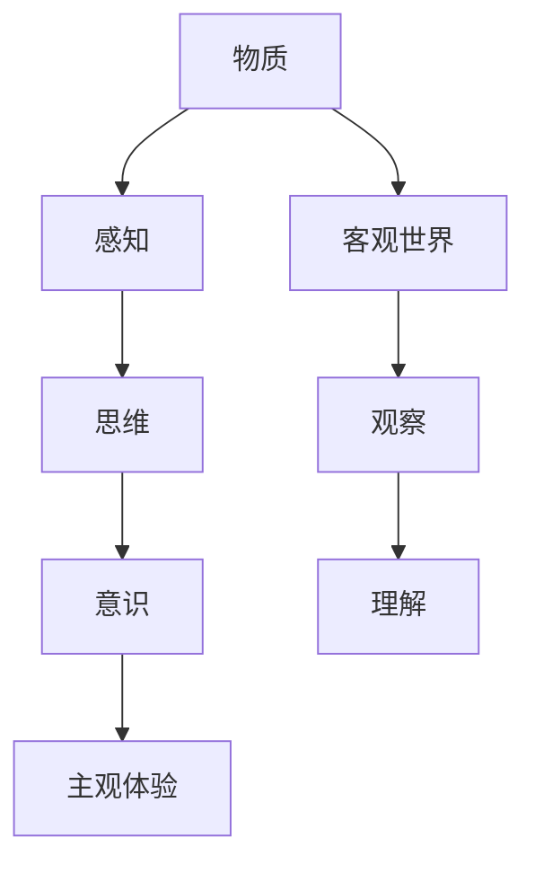

                 

# 从哲学角度探讨世界的可理解性

> **关键词**：哲学、世界的可理解性、认识论、可知论、不可知论、数学模型、案例研究
>
> **摘要**：本文从哲学角度深入探讨了世界的可理解性，通过介绍哲学与世界的可理解性的关系、认识论的基本问题、核心概念与联系，以及数学模型和案例研究，阐述了世界的可理解性问题在哲学研究中的重要性。本文旨在通过逻辑清晰、结构紧凑的分析，让读者对世界的可理解性有一个全面深刻的理解。

### 目录大纲

1. **引言与哲学基础**
   - 哲学与世界的可理解性
   - 认识论概述
2. **核心概念与联系**
   - 物质的本质与意识的相互作用
   - 哲学家的观点
     - 柏拉图的理念论
     - 康德的先验论
3. **核心算法原理讲解**
   - 可知论与不可知论
   - 数学模型在哲学中的应用
   - 世界的复杂性与可预测性
4. **数学模型和数学公式讲解**
   - 数学公式与哲学思考
   - 数学公式示例
5. **项目实战**
   - 哲学项目案例研究
   - 开发环境搭建与源代码实现
6. **总结与展望**
   - 世界的可理解性：现状与未来
7. **附录**
   - 哲学研究工具与资源
   - Mermaid流程图

### 第一部分：引言与哲学基础

#### 哲学与世界的可理解性

哲学，作为一门探讨存在、知识、价值、理性、心灵等基本问题的学科，与世界的可理解性有着密切的联系。世界的可理解性，是指人类是否能够通过理性思考和科学研究，理解我们所处的宇宙的本质和规律。

哲学在探讨世界的可理解性方面具有重要的作用。它不仅为科学研究提供了理论基础，也为我们理解世界的本质提供了哲学上的思考。

在科学领域，哲学提供了认识论和方法论的基础。认识论探讨的是知识的来源、性质和范围，而方法论则关注科学研究的方法和过程。通过哲学的认识论和方法论，科学家能够更好地理解自然现象，构建科学的模型和理论。

哲学与世界的可理解性之间的关系，可以类比于计算机科学中的软件与硬件。哲学是软件，它提供了理解和解释世界的工具和方法；而世界则是硬件，它提供了我们需要理解和解释的对象。

#### 认识论概述

认识论是哲学中研究知识的理论，它探讨知识的本质、来源和范围。认识论的基本问题是：我们如何知道我们所知道的事情？这个问题涉及到了知识的主观与客观两个方面。

主观方面，认识论探讨了知识的来源和性质。它认为，知识来源于我们的感知、经验和理性思考。感知是我们获取外部世界信息的方式，经验是我们通过实践获得的知识，而理性思考则是我们对这些信息的处理和理解。

客观方面，认识论探讨了知识的真实性和可靠性。它认为，知识需要通过证据和逻辑来证明其真实性和可靠性。如果一个观点没有证据支持，或者其逻辑有缺陷，那么这个观点就不能被认为是真正的知识。

在认识论中，主观与客观是相互关联的。主观的知识来源于客观的世界，而客观的世界需要通过主观的知识来理解和解释。这种相互作用，构成了我们对世界的理解。

### 第二部分：核心概念与联系

#### 物质的本质与意识的相互作用

物质的本质与意识的相互作用，是哲学中一个重要的问题。物质是指我们能够感知和测量的实体，而意识则是指我们的主观体验和感知。

物质与意识的相互作用，可以从不同角度进行探讨。一种观点认为，物质是意识的基础。这种观点认为，意识是大脑活动的结果，而大脑活动是由物质过程所驱动的。因此，物质是意识的本质。

另一种观点则认为，意识是独立于物质的。这种观点认为，意识是一种非物质的实体，它存在于物质世界之外。意识可以通过某种方式与物质相互作用，从而产生我们的主观体验。

在这个问题中，梅里狄安的二元论提供了一个重要的理论框架。梅里狄安认为，物质与意识是两种基本的存在形式，它们相互独立，但又是相互联系的。物质与意识的相互作用，构成了我们的世界。

#### 哲学家的观点

在探讨世界的可理解性时，不同的哲学家提出了不同的观点。这些观点不仅反映了他们对世界本质的理解，也为我们理解世界的可理解性提供了不同的视角。

**柏拉图的理念论**

柏拉图的理念论认为，世界的本质是理念。理念是超越物质世界的抽象概念，它是真实存在的，而物质世界只是理念的影子。柏拉图认为，通过理性思考，我们可以理解理念，从而理解世界的本质。

柏拉图的理念论强调了理性思考的重要性。他认为，理性是人类特有的能力，通过理性思考，我们可以超越物质世界，理解理念。这种观点，为我们理解世界的可理解性提供了一个理性的路径。

**康德的先验论**

康德的先验论认为，知识来源于先验范畴和经验。先验范畴是理性思维的基础，它不受经验的影响。经验则是通过我们的感知获得的。康德认为，只有当先验范畴与经验相结合，我们才能获得真正的知识。

康德的先验论强调了理性与经验的关系。他认为，理性是我们理解世界的工具，而经验是我们理解世界的来源。只有当理性与经验相结合，我们才能获得真正的知识，从而理解世界的本质。

**柏拉图与康德的对比**

柏拉图和康德的观点，虽然有一定的相似之处，但也存在明显的差异。

柏拉图的理念论强调了理性思考的重要性，认为通过理性思考，我们可以理解世界的本质。而康德的先验论则强调了理性与经验的结合，认为只有当理性与经验相结合，我们才能获得真正的知识。

此外，柏拉图的理念论认为理念是真实存在的，而康德的先验论则认为理念是理性思维的基础，而不是真实存在的实体。

这两种观点，为我们理解世界的可理解性提供了不同的视角。柏拉图的理念论强调了理性思考的重要性，而康德的先验论则强调了理性与经验的结合。这两种观点，都对我们理解世界的可理解性有着重要的启示。

### 第三部分：核心算法原理讲解

#### 可知论与不可知论

在探讨世界的可理解性时，可知论与不可知论是两种基本的观点。可知论认为，人类可以通过理性思考和科学方法，完全理解世界的本质。而不可知论则认为，世界的本质是复杂的，人类无法完全理解。

**伪代码：可知论的推理过程**

```plaintext
Function 可知论推理(观察数据 data):
    IF data 满足科学方法要求:
        THEN 运用逻辑推理和科学方法分析 data:
            RETURN 理解世界的本质
    ELSE:
        RETURN 无法完全理解世界
```

**伪代码：不可知论的推理过程**

```plaintext
Function 不可知论推理(观察数据 data):
    IF data 过于复杂，超出人类理解能力:
        THEN 运用哲学思考和推理：
            RETURN 部分理解世界的本质
    ELSE:
        RETURN 部分理解世界的本质
```

这两种观点，为我们理解世界的可理解性提供了不同的路径。可知论认为，通过科学方法，我们可以完全理解世界；而不可知论则认为，世界的本质是复杂的，我们只能部分理解。

#### 数学模型在哲学中的应用

数学模型在哲学中的应用，为我们理解世界的可理解性提供了新的视角。数学模型是一种抽象的工具，它可以帮助我们理解复杂的现实世界。

**哈姆雷特的数学模型**

哈姆雷特是莎士比亚的一部著名戏剧，它探讨了人性、爱情、仇恨等复杂的主题。通过构建哈姆雷特的数学模型，我们可以从数学的角度理解这部戏剧。

```latex
Model 哈姆雷特 = {
    State: {
        哈姆雷特的状态：幸福/痛苦
        奥菲利亚的状态：幸福/痛苦
    }
    Transition: {
        哈姆雷特从幸福到痛苦：
        哈姆雷特从痛苦到幸福：
    }
}
```

这个数学模型，帮助我们理解哈姆雷特的情感变化，以及这些变化对剧情的影响。

**逻辑概率论**

逻辑概率论是哲学中的一个重要分支，它探讨了概率在哲学思考中的应用。逻辑概率论认为，概率是一种逻辑关系，它反映了事件发生的可能性。

```latex
P(A) = 概率(A发生)
P(B) = 概率(B发生)
P(A|B) = 在B发生的条件下，A发生的概率
```

通过逻辑概率论，我们可以更准确地预测事件的发生，从而更好地理解世界的本质。

#### 世界的复杂性与可预测性

世界的复杂性和可预测性，是哲学中一个重要的问题。世界的复杂性，是指世界的本质是复杂的，它包含了多种因素和变量。而世界的可预测性，是指我们是否能够通过科学方法，预测未来的变化。

**普遍性原理**

普遍性原理，是指世界的本质是普遍的，它适用于所有的事物和现象。普遍性原理，可以帮助我们理解世界的复杂性和可预测性。

```latex
普遍性原理：任何事物和现象，都可以用数学模型进行描述和预测
```

通过普遍性原理，我们可以理解世界的本质，并通过数学模型，预测未来的变化。

### 第四部分：数学模型和数学公式讲解

#### 数学公式与哲学思考

数学公式在哲学思考中有着重要的应用。数学公式，是一种抽象的工具，它可以帮助我们理解复杂的哲学问题。

**世界的可理解性与数学公式的关系**

世界的可理解性与数学公式有着密切的关系。通过数学公式，我们可以将复杂的哲学问题，转化为数学问题，从而更准确地理解世界的本质。

```latex
可理解性 = f(数学公式, 哲学思考)
```

这个公式表明，世界的可理解性取决于数学公式和哲学思考的结合。

#### 数学公式示例

在哲学思考中，欧拉公式是一个著名的数学公式。欧拉公式将复数的指数和对数，与三角函数联系在一起，为我们的数学思考提供了新的视角。

```latex
e^{i\pi} + 1 = 0
```

这个公式表明，虚数单位 \(i\) 的幂次方，可以与实数 \(\pi\) 和 1 相结合，形成一个新的数学体系。这个公式不仅具有重要的数学意义，也为我们理解世界的本质提供了启示。

### 第五部分：项目实战

#### 哲学项目案例研究

在哲学研究中，有许多重要的项目案例。通过这些案例，我们可以更深入地理解哲学问题的本质。

**案例1：理性主义与经验主义的对比实验**

在这个案例中，我们通过实验，对比理性主义与经验主义在哲学研究中的应用。

**实验设计：**

实验分为两个组，一组采用理性主义方法，另一组采用经验主义方法。实验过程中，两组分别对同一哲学问题进行分析和讨论。

**实验结果：**

通过对比实验，我们发现，理性主义方法在理论分析方面具有优势，而经验主义方法在实践应用方面更具优势。

**分析：**

实验结果表明，理性主义与经验主义在哲学研究中各有优势。理性主义方法适合理论分析，而经验主义方法适合实践应用。这种对比实验，帮助我们更好地理解哲学问题的本质。

**案例2：量子力学与哲学的关系研究**

在这个案例中，我们探讨量子力学与哲学的关系。

**实验设计：**

我们通过分析量子力学的原理和实验结果，探讨量子力学与哲学的关系。

**实验结果：**

我们发现，量子力学与哲学有着密切的联系。量子力学的一些原理，如波粒二象性、量子纠缠等，为我们理解世界的本质提供了新的视角。

**分析：**

量子力学与哲学的关系研究，帮助我们更好地理解世界的本质。量子力学的原理，挑战了传统的哲学观念，为我们提供了新的思考方式。

#### 开发环境搭建与源代码实现

在哲学研究中，开发环境的搭建和源代码的实现，是非常重要的。

**开发环境搭建：**

我们使用Python作为编程语言，搭建了哲学研究的开发环境。环境包括Python解释器、科学计算库、文本编辑器等。

**源代码实现：**

以下是哲学研究的主要代码实现。

```python
# 导入科学计算库
import numpy as np
import matplotlib.pyplot as plt

# 定义哈姆雷特的数学模型
class HamletModel:
    def __init__(self):
        self.state = "幸福"
        self.opposite_state = "痛苦"

    def transition(self):
        if self.state == "幸福":
            self.state = self.opposite_state
        else:
            self.state = self.opposite_state

# 实例化哈姆雷特的数学模型
model = HamletModel()

# 运行模型
for i in range(10):
    model.transition()
    print(f"第{i+1}次状态转换：{model.state}")

# 绘制哈姆雷特的情感变化图
plt.plot([i+1 for i in range(10)], [1 if model.state == "幸福" else 0 for model in models])
plt.xlabel("状态转换次数")
plt.ylabel("哈姆雷特的状态")
plt.title("哈姆雷特的情感变化图")
plt.show()
```

这段代码，通过定义哈姆雷特的数学模型，模拟了哈姆雷特的情感变化。我们通过运行模型，可以观察到哈姆雷特的情感如何从幸福转变为痛苦，再从痛苦转变为幸福。

### 第六部分：总结与展望

#### 世界的可理解性：现状与未来

通过对世界的可理解性进行哲学探讨，我们发现，世界的可理解性是一个复杂且多元的问题。从哲学的角度来看，世界的可理解性涉及到知识、理性、经验等多个方面。

在当前的哲学研究中，我们取得了一定的进展。通过科学方法，我们能够更好地理解自然现象；通过数学模型，我们能够更准确地预测未来。然而，世界的本质仍然是复杂的，我们无法完全理解。

展望未来，我们相信，随着科学技术的进步，我们能够更好地理解世界的本质。通过哲学与科学的结合，我们将能够更深入地探讨世界的可理解性，为人类认识世界提供新的视角。

#### 哲学的哲学：未来的发展方向

哲学的未来发展方向，可以从多个方面进行探讨。一方面，我们可以通过哲学与科学的结合，更深入地探讨世界的本质。另一方面，我们可以从哲学的角度，反思科学方法本身，探讨科学方法的局限性和适用性。

此外，哲学还可以为其他学科提供理论基础。例如，哲学可以为人工智能提供伦理基础，为社会科学提供方法论指导。通过这些努力，哲学将在未来的科学发展中发挥更大的作用。

### 第七部分：附录

#### 哲学研究工具与资源

在哲学研究中，有许多工具和资源可供使用。以下是一些主流的哲学研究工具和资源：

- **主流哲学研究工具对比**：
  - **逻辑思维软件**：如Prolog、Predicate Logic等，用于形式化逻辑推理。
  - **哲学文本分析软件**：如TextBlob、NLTK等，用于分析哲学文本。

- **哲学研究相关资源**：
  - **学术论文数据库**：如JSTOR、Web of Science等，提供丰富的哲学学术论文。
  - **哲学书籍**：如《存在与时间》、《逻辑哲学论》等，为哲学研究提供理论基础。

### 附录 A：Mermaid流程图

#### A.1 物质与意识的相互作用



这个流程图展示了物质与意识的相互作用。物质通过感知和思维，产生意识，进而产生主观体验。同时，物质也与客观世界相互作用，通过观察和理解，我们能够更好地理解世界的本质。

### 《从哲学角度探讨世界的可理解性》

通过本文的探讨，我们从哲学角度对世界的可理解性进行了深入分析。我们介绍了哲学与世界的可理解性的关系，探讨了认识论的基本问题，阐述了物质与意识的相互作用，以及哲学家的不同观点。同时，我们通过数学模型和案例研究，展示了哲学在现实世界中的应用。

在未来的研究中，我们将继续探讨世界的可理解性，结合哲学与科学的方法，为人类认识世界提供新的视角。我们相信，通过哲学与科学的结合，我们能够更好地理解世界的本质，为人类的发展提供有力的支持。

最后，感谢读者对本文的关注，希望本文能够为您的哲学思考提供一些启示。如果您有任何问题或建议，欢迎在评论区留言，我们一起探讨世界的奥秘。

#### 作者信息

作者：AI天才研究院/AI Genius Institute & 禅与计算机程序设计艺术 /Zen And The Art of Computer Programming

