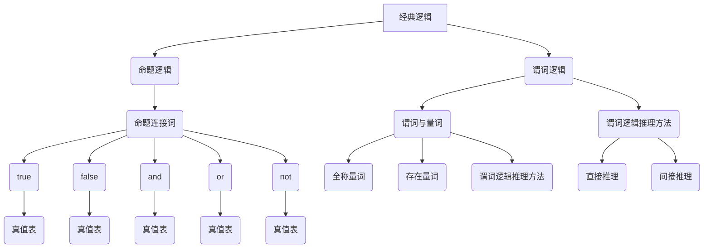

                 

# 《从经典逻辑到量子逻辑：拓展世界可理解性的逻辑基础》

> **关键词**：经典逻辑、量子逻辑、可理解性、科学推理、计算机科学

> **摘要**：本文深入探讨了从经典逻辑到量子逻辑的演变，揭示了逻辑在拓展我们对世界理解中的作用。通过对经典逻辑和量子逻辑的基本概念、应用和实践的详细分析，本文展示了逻辑在数学、计算机科学、量子计算和哲学等多个领域的广泛应用，并展望了逻辑在人工智能与未来技术中的未来。

----------------------------------------------------------------

### 第一部分：经典逻辑基础

经典逻辑是形式逻辑的基础，其起源可以追溯到古希腊哲学家亚里士多德的工作。经典逻辑主要研究命题之间的关系、推理过程和证明方法。在本节中，我们将介绍经典逻辑的基本概念，包括命题逻辑和谓词逻辑。

#### 第1章：经典逻辑的基本概念

##### 1.1 逻辑的定义与历史发展

逻辑是研究推理和证明的科学。其基本目的是确定哪些推理是有效的，哪些是无效的。逻辑在古希腊时期由亚里士多德等人开始研究，随后在19世纪由弗雷格、罗素和怀特海等数学家和哲学家进一步发展。经典逻辑在形式化数学、计算机科学和哲学等领域具有广泛应用。

##### 1.2 命题逻辑的基本原理

命题逻辑（Propositional Logic）是最基本的逻辑形式。它通过命题（Proposition）和命题连接词（Logical Connectives）来表示推理过程。命题是可以判断为真或假的陈述句。命题连接词包括“且”（AND）、“或”（OR）、“非”（NOT）、“若...则...”（IF...THEN...）等。

**命题与命题连接词**

- **命题**：一个命题是一个陈述句，它可以被判断为真或假。例如，“今天下雨”是一个命题。

- **命题连接词**：命题连接词用于连接两个或多个命题，形成新的命题。例如，“今天下雨且明天晴天”是一个由“且”连接的命题。

**真值表与逻辑推理**

真值表（Truth Table）是一种表格形式，用于展示命题和命题连接词在所有可能情况下的真值。通过真值表，我们可以确定复合命题的真值。

例如，以下是一个表示“若...则...”真值表的例子：

| p | q | p → q |
|---|---|-------|
| T | T |   T   |
| T | F |   F   |
| F | T |   T   |
| F | F |   T   |

根据真值表，我们可以看到，“若p则为q”在p为真且q为真时为真，在其他情况下为假。

##### 1.3 谓词逻辑入门

谓词逻辑（Predicate Logic）是经典逻辑的扩展，它引入了变量、量词和谓词等概念。谓词逻辑可以表示更复杂的推理关系。

**谓词与量词**

- **谓词**：谓词是一个表示性质的语句，它可以包含一个或多个变量。例如，“x是素数”是一个谓词。

- **量词**：量词用于表示全称量词（∀，对所有...都...）和存在量词（∃，存在...使得...）。例如，“∀x，x是素数”表示对所有x，x都是素数。

**谓词逻辑的推理方法**

谓词逻辑的推理方法包括直接推理和间接推理。

- **直接推理**：通过已知的前提和规则直接推出结论。例如，如果“所有学生都学习数学”（∀x，学生(x) → 学习数学(x)）和“张三是一个学生”（学生(张三)），我们可以直接推理出“张三学习数学”（学习数学(张三)）。

- **间接推理**：通过否定前提或结论，再通过逻辑推理得出结论。例如，如果“如果下雨，则地湿”（下雨 → 地湿）和“地不湿”，我们可以间接推理出“没有下雨”。

#### 第2章：经典逻辑的应用与实践

##### 2.1 逻辑在数学中的应用

逻辑在数学中具有广泛应用，包括数学命题的逻辑表示和证明方法。

**数学命题的逻辑表示**

数学命题可以用逻辑表达式表示，例如“∀x，x^2 ≥ 0”表示所有实数x的平方都大于等于0。

**证明方法与技巧**

数学证明通常包括直接证明和间接证明。

- **直接证明**：通过一系列逻辑推理，直接证明命题为真。

- **间接证明**：通过否定命题，再证明其否定命题为假，从而证明原命题为真。

##### 2.2 逻辑在计算机科学中的应用

逻辑在计算机科学中有着重要的应用，包括编程语言中的逻辑结构和形式化方法与验证。

**编程语言中的逻辑结构**

编程语言中的逻辑结构包括条件语句（if...else...）、循环语句（while、for）和逻辑运算符（&&、||、!）。

**形式化方法与验证**

形式化方法是一种使用数学逻辑和证明技术来验证程序的正确性。形式化方法包括模型检查、验证和证明。

- **模型检查**：通过将程序转化为某种模型，检查模型是否满足特定的性质。

- **验证**：通过逻辑推理证明程序的正确性。

- **证明**：使用数学证明方法证明程序的正确性。

### 第二部分：量子逻辑基础

量子逻辑是经典逻辑的扩展，它引入了量子力学的概念。量子逻辑在量子计算、量子通信和量子密码学等领域具有广泛应用。在本节中，我们将介绍量子逻辑的基本概念和原理。

#### 第3章：量子逻辑的概念与原理

##### 3.1 量子力学基础

量子力学是研究微观粒子的行为和相互作用的基本理论。量子力学的基本概念包括量子态、算符和量子测量。

**量子态与算符**

- **量子态**：量子态是描述粒子状态的数学函数，通常表示为波函数。

- **算符**：算符是量子力学中用于描述物理过程的数学运算，例如位置算符和动量算符。

**量子测量与纠缠**

- **量子测量**：量子测量是量子态的一种操作，它将量子态坍缩到某个特定的本征态。

- **纠缠**：纠缠是量子力学中的一种特殊现象，两个或多个量子态之间存在某种联系，即使它们被分隔在空间的不同位置。

##### 3.2 量子逻辑的基本结构

量子逻辑引入了量子命题和量子逻辑门等概念。

**量子命题与量子逻辑门**

- **量子命题**：量子命题是描述量子态的陈述句，它可以被判断为量子真或量子假。

- **量子逻辑门**：量子逻辑门是量子计算机中的基本操作单元，用于对量子态进行变换。

**量子逻辑运算**

量子逻辑运算包括量子与、量子或和量子非等操作。

- **量子与**：量子与操作是量子态之间的逻辑与操作，它可以用来表示量子态的合成。

- **量子或**：量子或操作是量子态之间的逻辑或操作，它可以用来表示量子态的选择。

- **量子非**：量子非操作是量子态的逻辑非操作，它可以用来表示量子态的否定。

#### 第4章：量子逻辑的应用

量子逻辑在量子计算、量子通信和量子密码学等领域具有广泛应用。

##### 4.1 量子计算概述

量子计算是一种利用量子力学原理进行信息处理的计算方式。量子计算机使用量子比特（qubit）作为基本的信息单元，通过量子逻辑门进行操作。

**量子计算模型**

量子计算模型包括量子电路模型和量子图灵机模型。

- **量子电路模型**：量子电路模型是将量子逻辑门视为电路元件，通过量子逻辑门对量子比特进行操作。

- **量子图灵机模型**：量子图灵机模型是将量子计算视为一个抽象的机器，通过读取、写入和移动量子态来执行计算。

**量子算法简介**

量子算法是利用量子计算的优势来解决特定问题的算法。常见的量子算法包括量子搜索算法、量子排序算法和量子因子分解算法。

##### 4.2 量子通信与量子密码学

量子通信是利用量子纠缠和量子隐形传态进行信息传输的技术。量子密码学是利用量子力学原理来设计加密和解密方法。

**量子纠缠与量子隐形传态**

- **量子纠缠**：量子纠缠是两个或多个量子态之间存在的特殊联系，即使它们被分隔在空间的不同位置。

- **量子隐形传态**：量子隐形传态是一种利用量子纠缠进行信息传输的技术，它可以将一个量子态精确地传输到另一个量子态。

**量子密码学原理与应用**

量子密码学利用量子力学原理来设计加密和解密方法，以确保通信的安全。常见的量子密码学方法包括量子密钥分配和量子安全通信。

### 第三部分：经典逻辑与量子逻辑的关系

经典逻辑和量子逻辑在形式和原理上存在一定的异同。在本节中，我们将探讨经典逻辑与量子逻辑的对比以及经典逻辑在量子逻辑中的应用。

#### 第5章：经典逻辑与量子逻辑的对比

##### 5.1 经典逻辑与量子逻辑的异同点

经典逻辑和量子逻辑在形式和原理上存在以下异同点：

- **命题逻辑的对比**：经典逻辑中的命题连接词在量子逻辑中也有所对应，但量子逻辑引入了量子态的概念，使得命题的真值不再是简单的真或假，而是量子态的概率分布。

- **谓词逻辑的对比**：经典逻辑中的谓词和量词在量子逻辑中也有所对应，但量子逻辑中的谓词和量词具有更丰富的表示能力，可以描述量子态之间的复杂关系。

##### 5.2 经典逻辑在量子逻辑中的应用

经典逻辑在量子逻辑中具有重要的应用。例如：

- **经典逻辑在量子计算中的应用**：经典逻辑用于描述量子电路的组成和操作，以及量子算法的设计和实现。

- **经典逻辑在量子通信中的应用**：经典逻辑用于描述量子纠缠和量子隐形传态的原理，以及量子密钥分配和量子安全通信的实现。

#### 第6章：逻辑在拓展世界可理解性中的作用

逻辑在拓展我们对世界的理解中起着至关重要的作用。逻辑不仅用于科学研究，还广泛应用于哲学、认知科学等领域。

##### 6.1 逻辑对科学发展的推动作用

逻辑在科学发展中具有推动作用。例如：

- **逻辑在科学研究中的应用**：逻辑用于构建科学理论，验证科学假设，以及推导科学结论。

- **逻辑对科学理论的验证与改进**：逻辑用于评估科学理论的可靠性和有效性，通过逻辑推理来发现科学理论中的漏洞和不足，从而推动科学理论的改进和进步。

##### 6.2 逻辑在哲学与认知科学中的应用

逻辑在哲学和认知科学中具有广泛的应用。例如：

- **逻辑在哲学问题中的探讨**：逻辑用于分析和解决哲学问题，如存在论、认识论和伦理学等。

- **逻辑在认知科学中的应用**：逻辑用于理解和解释人类思维过程，如推理、决策和问题解决等。

### 第四部分：逻辑与未来技术

逻辑在人工智能和量子计算等领域具有广泛的应用前景。未来技术的发展将进一步推动逻辑的应用和创新。

#### 第7章：逻辑在人工智能与量子计算中的未来

##### 7.1 逻辑在人工智能中的应用前景

逻辑在人工智能中具有广泛的应用前景。例如：

- **逻辑在机器学习中的角色**：逻辑用于描述和解释机器学习算法的原理和机制，以及评估算法的性能和可靠性。

- **逻辑在人工智能决策中的优化**：逻辑用于设计人工智能决策系统，通过逻辑推理来优化决策过程，提高决策的准确性和效率。

##### 7.2 逻辑在量子计算中的未来

逻辑在量子计算中具有巨大的潜力。例如：

- **量子逻辑在量子计算机中的作用**：量子逻辑用于构建量子计算机的硬件和软件系统，以及设计量子算法和量子应用。

- **量子逻辑的未来研究方向**：量子逻辑的研究将继续深入，探索量子逻辑在量子通信、量子密码学和量子模拟等领域的应用。

#### 附录

##### 附录A：经典逻辑与量子逻辑的 Mermaid 流程图

以下是一个经典逻辑与量子逻辑的 Mermaid 流程图示例：



##### 附录B：核心算法原理与伪代码讲解

以下是一个核心算法原理与伪代码讲解示例：

```python
# 伪代码：量子逻辑门操作

# 初始化量子态
quantum_state = initialize_quantum_state()

# 应用量子逻辑门
quantum_gate = quantum_logic_gate()
quantum_state = apply_quantum_gate(quantum_gate, quantum_state)

# 测量量子态
measurement_result = measure_quantum_state(quantum_state)

# 输出测量结果
print(measurement_result)
```

##### 附录C：数学模型与公式解析

以下是一个数学模型与公式解析示例：

$$
E = mc^2
$$

这是爱因斯坦的质能等价公式，表示能量（E）与质量（m）之间的关系。其中，c是光速，是一个常数。

##### 附录D：项目实战与代码解读

以下是一个项目实战与代码解读示例：

```python
# Python代码：逻辑推理

# 定义逻辑函数
def logical_implication(p, q):
    return not p or q

# 测试逻辑函数
p = True
q = False
result = logical_implication(p, q)
print(result)  # 输出：False

# 代码解读：
# 该代码定义了一个逻辑推理函数，用于计算命题p和q的逻辑蕴含关系。
# logical_implication函数接受两个参数p和q，表示两个命题。
# 函数使用逻辑或（or）操作符，将not p与q进行逻辑运算，返回结果。
# 在测试中，p为True，q为False，逻辑蕴含关系为False，因此输出结果为False。

```

作者：AI天才研究院/AI Genius Institute & 禅与计算机程序设计艺术 /Zen And The Art of Computer Programming

----------------------------------------------------------------

### 结语

从经典逻辑到量子逻辑的探讨不仅拓展了我们对世界可理解性的边界，还揭示了逻辑在科学、哲学和计算机科学等领域的广泛应用。逻辑作为推理和证明的科学，其重要性不言而喻。未来，随着人工智能和量子计算等技术的发展，逻辑将发挥更加重要的作用，推动人类对世界的认识不断深入。让我们继续探索逻辑的奥秘，共同拓展人类的知识边界。🌌🚀🧠

