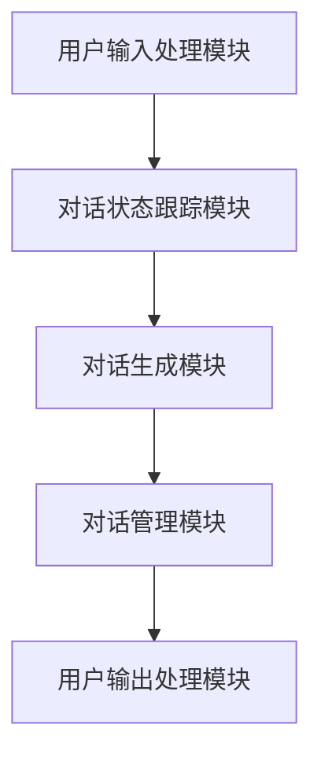
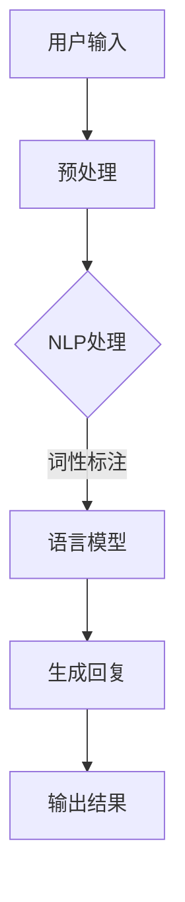
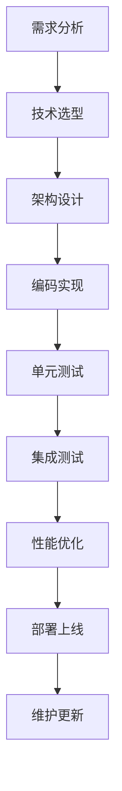
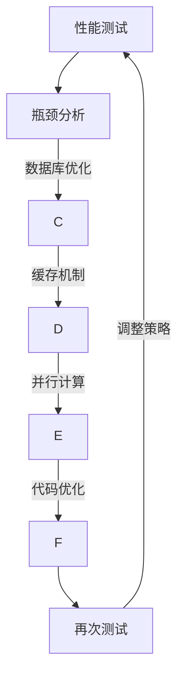

                 

# 从零开始构建ChatGPT类应用：Python、C和CUDA实战

> **关键词：** ChatGPT类应用、Python、C语言、CUDA、自然语言处理、生成式对话系统、并行计算、性能优化、项目实战

> **摘要：** 本文将带领读者从零开始构建一个类似于ChatGPT的对话系统。通过介绍Python、C和CUDA在自然语言处理和对话系统中的应用，详细阐述技术原理、核心算法以及项目实战。读者将学习到如何利用这些技术实现高效的对话系统，并对性能优化、功能扩展等方面有深入理解。

### 《从零开始构建ChatGPT类应用：Python、C和CUDA实战》目录大纲

**第一部分: ChatGPT类应用基础**

## 第1章: ChatGPT类应用概述

### 1.1 ChatGPT类应用的定义与重要性
### 1.2 ChatGPT类应用的发展历程
### 1.3 ChatGPT类应用的技术架构

## 第2章: 语言模型与自然语言处理基础

### 2.1 语言模型的基本原理
### 2.2 常见自然语言处理技术
### 2.3 语言模型的训练方法

## 第3章: 生成式对话系统的设计与实现

### 3.1 生成式对话系统的基本架构
### 3.2 对话状态跟踪技术
### 3.3 对话生成技术

## 第4章: Python编程基础

### 4.1 Python语言基础
### 4.2 Python常用库与工具
### 4.3 Python性能优化

**第二部分: ChatGPT类应用实战**

## 第5章: C语言在ChatGPT类应用中的应用

### 5.1 C语言的特点与优势
### 5.2 C语言在ChatGPT类应用中的使用场景
### 5.3 C语言编程实例

## 第6章: CUDA并行计算在ChatGPT类应用中的应用

### 6.1 CUDA架构与基本概念
### 6.2 CUDA编程模型与工具
### 6.3 CUDA在ChatGPT类应用中的优化策略

## 第7章: ChatGPT类应用的性能优化与调试

### 7.1 性能优化方法与技巧
### 7.2 调试技巧与工具
### 7.3 性能评估与测试

## 第8章: ChatGPT类应用的部署与维护

### 8.1 部署环境搭建
### 8.2 应用部署策略
### 8.3 应用维护与更新

**第三部分: 项目实战**

## 第9章: 从零构建一个ChatGPT类应用

### 9.1 项目需求分析
### 9.2 技术选型与架构设计
### 9.3 应用实现与调试
### 9.4 应用测试与优化

## 第10章: 优化与扩展

### 10.1 性能优化实践
### 10.2 功能扩展与增强
### 10.3 安全性与稳定性保障

**附录**

## 附录 A: 编程技巧与工具推荐

### A.1 Python编程技巧
### A.2 C语言编程技巧
### A.3 CUDA编程技巧
### A.4 常用工具与资源

## 附录 B: Mermaid 流程图

### B.1 ChatGPT类应用技术架构
### B.2 项目开发流程
### B.3 性能优化流程

## 附录 C: 数学模型和公式

### C.1 语言模型损失函数
### C.2 对话生成模型架构
### C.3 优化算法原理

## 附录 D: 项目源代码

### D.1 ChatGPT类应用源代码
### D.2 优化与扩展源代码
### D.3 调试与测试源代码

---

### 第1章 ChatGPT类应用概述

本章将介绍ChatGPT类应用的定义、重要性以及其发展历程和技术架构。通过这一章的学习，读者将了解ChatGPT类应用的背景和相关技术，为后续章节的深入学习打下基础。

### 1.1 ChatGPT类应用的定义与重要性

**ChatGPT类应用** 是一种基于生成式对话系统的应用，它通过自然语言处理技术实现与用户的交互。ChatGPT是OpenAI开发的一个著名模型，它能够生成高质量的自然语言回复，广泛应用于客服、聊天机器人、智能助手等领域。

**ChatGPT类应用的重要性** 主要体现在以下几个方面：

1. **提高用户体验**：通过智能对话系统，用户可以获得更加人性化的交互体验，满足个性化需求。
2. **降低人力成本**：智能对话系统可以替代部分人工客服，降低企业的人力成本。
3. **提高效率**：智能对话系统可以处理大量用户请求，提高整体效率。
4. **拓宽应用场景**：ChatGPT类应用可以应用于各种场景，如在线教育、智能医疗、金融咨询等。

### 1.2 ChatGPT类应用的发展历程

ChatGPT类应用的发展历程可以追溯到自然语言处理技术的兴起。自20世纪50年代以来，自然语言处理技术逐渐成熟，推动了对话系统的快速发展。以下是ChatGPT类应用的发展历程：

1. **规则驱动的对话系统**：早期的对话系统主要通过预设的规则进行交互，这种方式简单但缺乏灵活性。
2. **模板匹配对话系统**：模板匹配对话系统通过预定义的模板和关键词匹配用户输入，实现简单的对话交互。
3. **基于机器学习的对话系统**：随着机器学习技术的发展，基于机器学习的对话系统逐渐取代了传统的方法，能够更好地理解用户的意图和语境。
4. **生成式对话系统**：生成式对话系统通过生成式模型（如ChatGPT）实现自然、连贯的对话，大大提升了对话系统的质量和用户体验。

### 1.3 ChatGPT类应用的技术架构

ChatGPT类应用的技术架构主要包括以下几个关键组成部分：

1. **语言模型**：语言模型是生成式对话系统的核心，负责理解用户的输入并生成相应的回复。常见的语言模型包括GPT、BERT等。
2. **自然语言处理（NLP）组件**：NLP组件负责对用户输入进行预处理，如分词、词性标注、命名实体识别等，以便语言模型能够更好地理解用户意图。
3. **对话管理模块**：对话管理模块负责跟踪对话状态，包括用户上下文、对话历史等，以确保对话的连贯性和一致性。
4. **接口层**：接口层负责与用户进行交互，接收用户输入并返回对话结果。
5. **后端服务**：后端服务包括数据存储、日志记录、监控报警等，以确保系统的稳定运行。

下图展示了ChatGPT类应用的技术架构：

```mermaid
graph TB
A[语言模型] --> B[自然语言处理(NLP)组件]
B --> C[对话管理模块]
C --> D[接口层]
D --> E[后端服务]
```

通过上述介绍，读者对ChatGPT类应用的定义、重要性和发展历程有了初步了解，接下来我们将进一步探讨语言模型与自然语言处理基础。

---

### 第2章 语言模型与自然语言处理基础

本章将详细介绍语言模型的基本原理、常见自然语言处理技术以及语言模型的训练方法。通过对这些内容的了解，读者将能够深入理解ChatGPT类应用的核心技术，为后续章节的实战应用奠定基础。

### 2.1 语言模型的基本原理

**语言模型（Language Model，LM）** 是一种概率模型，用于预测自然语言中的下一个单词或字符。语言模型的核心目标是理解语言的结构和规律，从而生成高质量的自然语言文本。

**基本原理：**

1. **概率预测**：语言模型通过计算给定前文条件下，下一个单词或字符的概率，来预测下一个单词或字符。这种概率预测通常基于统计方法或机器学习算法。

2. **序列建模**：语言模型通常采用序列建模的方法，将输入的自然语言序列映射到输出序列的概率分布。这种方式能够更好地捕捉语言中的序列依赖关系。

3. **概率分布**：语言模型输出的是一个概率分布，即给定前文条件下，每个可能的后继单词或字符的概率。这样，模型可以选择具有最高概率的单词或字符作为输出。

**常见类型：**

1. **N-gram模型**：N-gram模型是最简单的语言模型，它基于前N个单词的联合概率分布。这种模型计算简单，但无法捕捉长距离依赖关系。

2. **循环神经网络（RNN）**：RNN是一种能够处理序列数据的神经网络，可以捕捉长距离依赖关系。LSTM和GRU是RNN的变体，能够更好地处理序列数据。

3. **Transformer模型**：Transformer模型是一种基于注意力机制的序列建模方法，可以捕捉长距离依赖关系，并在实践中取得了很好的效果。ChatGPT就是基于Transformer模型实现的。

### 2.2 常见自然语言处理技术

**自然语言处理（Natural Language Processing，NLP）** 是人工智能的一个重要分支，旨在让计算机能够理解和处理人类语言。NLP技术广泛应用于文本分类、情感分析、命名实体识别、机器翻译等领域。

**常见技术包括：**

1. **分词（Tokenization）**：分词是将连续的文本分割成一个个有意义的单词或短语的步骤。常见的分词方法有基于规则的分词、基于统计的分词和基于深度学习的分词。

2. **词性标注（Part-of-Speech Tagging）**：词性标注是将文本中的每个单词标注为名词、动词、形容词等不同的词性。词性标注有助于理解文本的语法结构。

3. **命名实体识别（Named Entity Recognition，NER）**：命名实体识别是从文本中识别出具有特定意义的实体，如人名、地名、组织机构名等。NER是信息提取的重要步骤，有助于构建知识图谱。

4. **依存句法分析（Dependency Parsing）**：依存句法分析是分析句子中词汇之间的依存关系。通过依存句法分析，可以更准确地理解句子的语义。

5. **情感分析（Sentiment Analysis）**：情感分析是判断文本中的情感倾向，如正面、负面或中性。情感分析在市场调研、舆情监控等领域有广泛应用。

6. **文本分类（Text Classification）**：文本分类是将文本数据分为不同的类别。常见的文本分类方法包括朴素贝叶斯、支持向量机、神经网络等。

### 2.3 语言模型的训练方法

**语言模型的训练** 是通过大量语料库来学习语言结构的过程。以下是一些常见的训练方法：

1. **基于统计的方法**：基于统计的方法通过统计文本中单词或短语的联合概率来训练语言模型。常见的统计方法包括N-gram模型和隐马尔可夫模型（HMM）。

2. **基于神经网络的方法**：基于神经网络的方法通过训练神经网络模型来学习语言结构。循环神经网络（RNN）、长短期记忆网络（LSTM）和Transformer模型是常见的神经网络方法。

3. **基于数据增强的方法**：数据增强是通过各种技术（如填充、替换、转换等）来扩充训练数据，以提高模型的泛化能力。

4. **基于迁移学习的方法**：迁移学习是通过在预训练模型的基础上进行微调，来适应特定任务。预训练模型通常在大规模的通用语料库上进行训练，然后用于特定任务。

**训练过程：**

1. **数据预处理**：对训练数据集进行清洗、预处理，如分词、去停用词、标准化等。

2. **模型选择**：选择合适的语言模型架构，如N-gram模型、RNN、Transformer等。

3. **训练**：通过优化算法（如梯度下降、Adam等）对模型进行训练，不断调整模型参数，以最小化损失函数。

4. **评估**：通过验证集和测试集对训练好的模型进行评估，计算模型在各个指标上的性能，如准确率、召回率、F1值等。

5. **调整**：根据评估结果调整模型参数或选择不同的模型架构，以提高模型性能。

通过本章的学习，读者对语言模型和自然语言处理技术有了全面了解，为构建ChatGPT类应用奠定了基础。接下来，我们将探讨生成式对话系统的设计与实现。

---

### 第3章 生成式对话系统的设计与实现

生成式对话系统是一种能够自动生成自然语言回复的对话系统。本章将介绍生成式对话系统的基本架构、对话状态跟踪技术以及对话生成技术。通过这些内容的学习，读者将能够理解如何设计并实现一个高效的生成式对话系统。

### 3.1 生成式对话系统的基本架构

生成式对话系统的基本架构主要包括以下几个关键组成部分：

1. **用户输入处理模块**：负责接收用户的输入，进行预处理，如分词、词性标注等。

2. **对话状态跟踪模块**：对话状态跟踪模块负责记录对话的历史信息，包括用户输入、系统回复、对话上下文等。对话状态跟踪是实现连贯对话的关键。

3. **对话生成模块**：对话生成模块是生成式对话系统的核心，负责根据对话状态生成自然语言回复。对话生成通常采用语言模型、神经网络或规则引擎等技术。

4. **对话管理模块**：对话管理模块负责协调对话的不同阶段，如问候、请求处理、闲聊等。对话管理模块确保对话的流畅性和一致性。

5. **用户输出处理模块**：用户输出处理模块负责将生成的自然语言回复转换为用户可以理解的形式，如文本、语音等。

下图展示了生成式对话系统的基本架构：



### 3.2 对话状态跟踪技术

对话状态跟踪是实现连贯对话的重要技术。对话状态跟踪模块需要记录对话的历史信息，包括用户输入、系统回复、对话上下文等。以下是一些常用的对话状态跟踪技术：

1. **基于规则的对话状态跟踪**：基于规则的对话状态跟踪通过预设的规则来记录对话状态。这种方法简单但灵活性较低。

2. **基于图论的对话状态跟踪**：基于图论的对话状态跟踪使用图来表示对话状态，图中的节点表示对话状态，边表示状态之间的转换。这种方法能够更好地处理复杂的对话场景。

3. **基于深度学习的对话状态跟踪**：基于深度学习的对话状态跟踪通过训练深度学习模型来预测对话状态。这种方法能够自适应地学习对话状态，提高对话的连贯性。

4. **基于历史数据的对话状态跟踪**：基于历史数据的对话状态跟踪通过分析历史对话数据来推断当前对话状态。这种方法能够利用已有数据，提高对话状态跟踪的准确性。

### 3.3 对话生成技术

对话生成技术是实现生成式对话系统的关键。对话生成技术主要包括以下几个方面：

1. **基于语言模型的对话生成**：基于语言模型的对话生成利用语言模型生成自然语言回复。常见的语言模型包括N-gram模型、RNN、Transformer等。

2. **基于模板的对话生成**：基于模板的对话生成通过预定义的模板生成自然语言回复。这种方法简单但缺乏灵活性。

3. **基于生成式对抗网络（GAN）的对话生成**：基于生成式对抗网络（GAN）的对话生成利用GAN模型生成高质量的对话回复。GAN模型通过对抗训练生成逼真的对话回复。

4. **基于转换器的对话生成**：基于转换器的对话生成通过转换器模型将输入序列转换为输出序列。转换器模型（如Seq2Seq模型）在机器翻译、对话生成等领域有广泛应用。

5. **基于规则与学习的混合对话生成**：基于规则与学习的混合对话生成结合了规则和深度学习的方法，通过预定义的规则和训练好的模型共同生成对话回复。这种方法能够兼顾灵活性和准确性。

### 3.4 实现一个简单的生成式对话系统

以下是一个简单的生成式对话系统的Python实现示例。这个示例使用了基于Transformer的语言模型生成自然语言回复。

```python
import tensorflow as tf
from transformers import BertTokenizer, TFBertForSeq2Seq

# 加载预训练的BERT模型和分词器
tokenizer = BertTokenizer.from_pretrained('bert-base-uncased')
model = TFBertForSeq2Seq.from_pretrained('t5-base')

# 对话状态
conversation_history = []

# 用户输入处理
def process_user_input(user_input):
    input_ids = tokenizer.encode(user_input, return_tensors='tf')
    return input_ids

# 对话生成
def generate_response(input_ids):
    response_ids = model.generate(input_ids, max_length=50, num_return_sequences=1)
    response = tokenizer.decode(response_ids[0], skip_special_tokens=True)
    return response

# 对话流程
def chat():
    print("欢迎！请告诉我你的需求。")
    while True:
        user_input = input("你： ")
        if user_input.lower() == 'exit':
            print("再见！")
            break
        input_ids = process_user_input(user_input)
        conversation_history.append(input_ids)
        response = generate_response(input_ids)
        print("ChatGPT：", response)

# 开始对话
chat()
```

通过上述示例，读者可以了解如何使用Python和Transformer模型实现一个简单的生成式对话系统。接下来，我们将学习Python编程基础，为后续实战应用做好准备。

---

### 第4章 Python编程基础

本章将介绍Python编程基础，包括语言基础、常用库与工具以及性能优化。通过学习本章内容，读者将能够掌握Python编程的基本技巧，为构建ChatGPT类应用奠定基础。

### 4.1 Python语言基础

Python是一种高级编程语言，以其简洁、易读、功能强大而闻名。以下是Python语言的一些基础概念：

1. **变量与数据类型**：变量用于存储数据，Python中有多种数据类型，如整数、浮点数、字符串、列表、元组、字典等。

2. **控制结构**：Python提供了丰富的控制结构，包括条件语句（if、elif、else）、循环语句（for、while）和异常处理（try、except）。

3. **函数**：函数是组织代码的重要方式，Python支持定义和调用函数。函数可以提高代码的复用性和可维护性。

4. **模块与包**：模块和包是Python代码的组织形式，模块是包含函数、类、常量的文件，包是包含多个模块的目录。使用模块和包可以避免命名冲突，提高代码的可维护性。

5. **类与对象**：Python支持面向对象编程，类是对象的蓝图，对象是类的实例。使用类和对象可以更好地组织和管理代码。

6. **文件操作**：Python提供了丰富的文件操作功能，包括文件的打开、读取、写入和关闭。

### 4.2 Python常用库与工具

Python拥有丰富的库和工具，这些库和工具大大提高了Python编程的效率。以下是一些常用的Python库和工具：

1. **NumPy**：NumPy是一个强大的Python库，用于处理多维数组。NumPy提供了丰富的数学函数和操作，广泛应用于数据科学和机器学习领域。

2. **Pandas**：Pandas是一个数据 manipulation库，提供了数据清洗、转换和分析的功能。Pandas能够方便地处理大型表格数据，是数据科学领域的必备工具。

3. **Matplotlib**：Matplotlib是一个数据可视化库，用于创建各种类型的图表和图形。Matplotlib可以生成高质量的可视化结果，是数据科学和机器学习领域的重要工具。

4. **Scikit-learn**：Scikit-learn是一个机器学习库，提供了各种机器学习算法的实现，如线性回归、决策树、支持向量机等。Scikit-learn是机器学习领域广泛使用的库之一。

5. **TensorFlow**：TensorFlow是一个开源的深度学习框架，提供了丰富的API和工具，用于构建和训练深度学习模型。TensorFlow广泛应用于机器学习和人工智能领域。

6. **PyTorch**：PyTorch是另一个开源的深度学习框架，与TensorFlow类似，但具有更灵活的动态计算图特性。PyTorch在自然语言处理和计算机视觉领域有广泛应用。

7. **transformers**：transformers是一个用于预训练变换器（Transformer）模型的库，提供了多种预训练模型和工具，如BERT、GPT、T5等。transformers是生成式对话系统的重要库之一。

### 4.3 Python性能优化

在构建ChatGPT类应用时，性能优化是至关重要的。以下是一些常用的Python性能优化方法：

1. **使用生成器**：生成器是一种迭代器，它可以在迭代过程中动态生成数据，而不是一次性加载所有数据。使用生成器可以显著减少内存消耗。

2. **使用多线程与多进程**：Python支持多线程和多进程，可以利用多核处理器的并行计算能力。通过合理地使用多线程和多进程，可以显著提高程序的性能。

3. **使用NumPy和Pandas**：NumPy和Pandas提供了高效的数组操作和数据结构，可以显著提高数据处理速度。与纯Python代码相比，使用NumPy和Pandas可以显著提高性能。

4. **使用缓存**：缓存是一种将计算结果存储在内存中的技术，可以避免重复计算。Python提供了多种缓存技术，如lru_cache、functools.lru_cache等。

5. **使用异步编程**：异步编程是一种利用线程或协程提高程序性能的技术。通过使用异步编程，可以在一个线程中同时执行多个任务，从而提高程序的并发性能。

6. **使用Profiler**：Profiler是一种性能分析工具，可以帮助定位程序的性能瓶颈。常见的Profiler工具包括cProfile、line_profiler等。

通过本章的学习，读者将掌握Python编程的基础知识和性能优化技巧，为构建ChatGPT类应用做好准备。接下来，我们将探讨C语言在ChatGPT类应用中的应用。

---

### 第5章 C语言在ChatGPT类应用中的应用

C语言是一种高效、灵活的编程语言，其在ChatGPT类应用中具有广泛的应用。本章将介绍C语言的特点与优势、在ChatGPT类应用中的使用场景以及一个C语言编程实例。

### 5.1 C语言的特点与优势

C语言具有以下特点与优势：

1. **高性能**：C语言是一种编译型语言，生成的可执行代码效率高，执行速度快。相较于解释型语言（如Python），C语言在性能方面具有显著优势。

2. **低级硬件操作**：C语言提供了丰富的底层操作接口，可以方便地访问硬件资源，如内存、输入输出等。这使得C语言在需要底层操作的场景中具有很高的灵活性。

3. **丰富的库支持**：C语言拥有丰富的库支持，如标准库（标准输入输出、数学计算等）和第三方库（如OpenCV、OpenGL等）。这些库为C语言提供了强大的功能，使其在各种应用中具有广泛的应用。

4. **跨平台兼容性**：C语言具有良好的跨平台兼容性，可以在不同的操作系统和硬件平台上编译运行。这使得C语言在构建跨平台应用时具有很高的优势。

5. **易于维护和扩展**：C语言的语法简单、清晰，易于维护和扩展。这使得C语言在大型项目开发中具有很高的可维护性和可扩展性。

### 5.2 C语言在ChatGPT类应用中的使用场景

C语言在ChatGPT类应用中具有广泛的使用场景，主要包括以下几个方面：

1. **高性能计算**：ChatGPT类应用中涉及大量的矩阵运算和向量计算，C语言的高性能计算能力可以显著提高模型的训练和推理速度。

2. **底层接口开发**：C语言可以方便地开发底层的接口，如与硬件设备（如GPU、FPGA等）的交互。这些接口可以用于优化模型的计算和存储效率。

3. **性能敏感的组件**：C语言可以用于开发性能敏感的组件，如模型加载、参数优化等。这些组件可以直接操作内存和硬件资源，提高应用的性能。

4. **跨平台部署**：C语言具有良好的跨平台兼容性，可以方便地在不同的操作系统和硬件平台上部署ChatGPT类应用。

5. **资源受限的环境**：在某些资源受限的环境（如嵌入式系统、物联网设备等），C语言由于其高效、简洁的特点，可以更好地满足应用需求。

### 5.3 C语言编程实例

以下是一个简单的C语言编程实例，用于实现一个简单的矩阵乘法。这个实例展示了C语言的基本语法和编程技巧。

```c
#include <stdio.h>

void matrix_multiply(float a[10][10], float b[10][10], float result[10][10]) {
    int i, j, k;
    for (i = 0; i < 10; i++) {
        for (j = 0; j < 10; j++) {
            result[i][j] = 0;
            for (k = 0; k < 10; k++) {
                result[i][j] += a[i][k] * b[k][j];
            }
        }
    }
}

int main() {
    float a[10][10] = {
        {1, 2, 3},
        {4, 5, 6},
        {7, 8, 9}
    };
    float b[10][10] = {
        {1, 0, -1},
        {0, 1, 0},
        {1, 0, 1}
    };
    float result[10][10];

    matrix_multiply(a, b, result);

    printf("Result Matrix:\n");
    for (int i = 0; i < 10; i++) {
        for (int j = 0; j < 10; j++) {
            printf("%.2f ", result[i][j]);
        }
        printf("\n");
    }

    return 0;
}
```

通过上述实例，读者可以了解到C语言的基本语法和编程技巧。C语言在ChatGPT类应用中具有重要的应用价值，通过合理地使用C语言，可以提高应用的性能和效率。

---

### 第6章 CUDA并行计算在ChatGPT类应用中的应用

CUDA（Compute Unified Device Architecture）是一种并行计算平台和编程模型，由NVIDIA公司推出，主要用于提高GPU（图形处理器）的并行计算能力。本章将介绍CUDA架构与基本概念、CUDA编程模型与工具以及CUDA在ChatGPT类应用中的优化策略。

### 6.1 CUDA架构与基本概念

**CUDA架构** 由以下几个关键组成部分构成：

1. **GPU架构**：GPU（图形处理器）由大量核心组成，每个核心都可以独立执行计算。与CPU相比，GPU具有更高的计算并行性和更大的吞吐量。

2. **内存层次结构**：CUDA将GPU内存分为多种类型，包括全球内存（global memory）、共享内存（shared memory）和寄存器（registers）。这些内存类型具有不同的带宽和访问速度，合理使用可以优化性能。

3. **计算流图（CUDA Kernels）**：CUDA Kernels是CUDA程序的核心，它们在GPU上执行并行计算。计算流图描述了CUDA Kernels之间的数据流和控制流。

4. **内存管理**：CUDA提供了多种内存管理技术，如动态内存分配、内存拷贝和内存池化，用于优化内存访问和数据传输。

**基本概念**：

1. **线程块（Thread Block）**：线程块是CUDA程序的基本执行单元，由一组线程组成。线程块内的线程可以共享内存和同步。

2. **网格（Grid）**：网格是多个线程块的集合，可以并行执行多个线程块。网格的大小由线程块的个数和线程块的维度决定。

3. **线程索引（Thread Index）**：线程索引是用于标识线程在网格中的位置。每个线程可以使用其线程索引来访问内存和执行计算。

4. **内存访问模式**：内存访问模式包括全局内存访问、共享内存访问和寄存器访问。不同类型的内存访问具有不同的带宽和访问速度。

### 6.2 CUDA编程模型与工具

**CUDA编程模型** 主要包括以下几个方面：

1. **CUDA C/C++**：CUDA C/C++是CUDA编程的主要语言，它结合了C/C++的高级抽象和CUDA的并行计算特性。CUDA C/C++提供了丰富的API和工具，用于编写和优化CUDA程序。

2. **CUDA Kernels**：CUDA Kernels是CUDA程序的核心，它们在GPU上执行并行计算。CUDA Kernels使用C/C++语言编写，并使用特定的语法和关键字进行并行编程。

3. **内存管理**：CUDA提供了多种内存管理技术，如动态内存分配、内存拷贝和内存池化。这些技术用于优化内存访问和数据传输。

4. **同步与通信**：CUDA提供了多种同步和通信机制，如原子操作、线程屏障和共享内存通信。这些机制用于确保线程之间的正确性和数据一致性。

**CUDA工具**：

1. **NVIDIA CUDA SDK**：NVIDIA CUDA SDK是CUDA编程的官方开发工具包，包括编译器、调试器、性能分析工具等。

2. **CUDA Visual Profiler**：CUDA Visual Profiler是一个用于分析CUDA程序性能的分析工具，可以提供详细的性能数据和优化建议。

3. **NVIDIA Nsight**：NVIDIA Nsight是一系列用于CUDA编程和性能优化的工具，包括NVIDIA Nsight Compute、NVIDIA Nsight Systems和NVIDIA Nsight Visual Studio Edition。

### 6.3 CUDA在ChatGPT类应用中的优化策略

CUDA在ChatGPT类应用中具有广泛的应用，以下是一些常见的优化策略：

1. **数据并行化**：将ChatGPT模型中的计算任务分解成多个并行任务，分配给GPU上的多个线程。通过合理的数据并行化，可以显著提高模型的训练和推理速度。

2. **内存优化**：优化内存访问模式，减少全局内存访问，增加共享内存和寄存器访问。通过使用内存池化和预处理技术，可以减少内存拷贝和带宽消耗。

3. **线程调度优化**：优化线程调度策略，确保线程之间的负载均衡。通过使用线程束调度（block scheduling）和线程束宽优化（block size optimization），可以提高线程的利用率和性能。

4. **计算与通信优化**：优化计算与通信的交互，减少同步和通信的开销。通过使用异步内存拷贝和计算并行化，可以充分利用GPU的计算和通信资源。

5. **内存层次优化**：优化内存层次结构，使用共享内存和寄存器，减少全局内存访问。通过使用内存池化和预处理技术，可以减少内存带宽消耗。

6. **GPU架构优化**：优化GPU架构，如选择合适的GPU型号和配置，优化GPU内存和带宽。通过使用多GPU并行计算，可以进一步提高模型的性能。

通过上述优化策略，可以显著提高ChatGPT类应用的性能和效率，为用户提供更快的响应和更好的体验。

---

### 第7章 ChatGPT类应用的性能优化与调试

在构建ChatGPT类应用时，性能优化与调试是确保系统高效稳定运行的关键步骤。本章将详细介绍性能优化方法与技巧、调试技巧与工具以及性能评估与测试。

### 7.1 性能优化方法与技巧

性能优化是提升ChatGPT类应用运行效率的重要手段。以下是一些常用的性能优化方法与技巧：

1. **算法优化**：优化核心算法，如使用更高效的算法实现语言模型和对话生成。常见的优化方法包括矩阵分解、并行计算等。

2. **数据结构优化**：优化数据结构，选择适合的数据结构以减少内存占用和提高访问速度。例如，使用哈希表替代列表可以减少查询时间。

3. **并行计算**：利用GPU等硬件加速器进行并行计算，如使用CUDA进行矩阵运算和向量计算。通过并行计算，可以显著提高处理速度。

4. **缓存机制**：引入缓存机制，如使用LRU缓存策略存储常用数据，减少重复计算和访问。

5. **异步处理**：采用异步处理技术，如异步IO和多线程，可以充分利用系统资源，提高并发处理能力。

6. **代码优化**：对代码进行优化，减少不必要的函数调用、循环和分支判断，提高代码执行效率。

7. **资源复用**：合理复用系统资源，如使用线程池和连接池，减少资源的创建和销毁开销。

### 7.2 调试技巧与工具

调试是发现和解决系统故障的关键步骤。以下是一些常用的调试技巧与工具：

1. **日志记录**：使用日志记录系统记录程序的运行状态和异常信息，便于分析和定位问题。

2. **调试器**：使用调试器（如GDB、LLDB等）进行程序调试，可以设置断点、单步执行、查看变量值等。

3. **性能分析工具**：使用性能分析工具（如profiler、visual profiler等）分析程序的性能瓶颈，定位性能问题。

4. **单元测试**：编写单元测试，对系统功能进行验证，确保每个模块的正确性。

5. **代码审查**：定期进行代码审查，发现潜在的问题和改进点，提高代码质量。

6. **错误日志分析**：分析错误日志，提取错误信息和上下文，快速定位故障原因。

### 7.3 性能评估与测试

性能评估与测试是验证系统性能的重要环节。以下是一些常用的性能评估与测试方法：

1. **基准测试**：使用标准基准测试工具（如Apache Benchmark、wrk等）进行性能测试，评估系统在不同负载下的响应时间和吞吐量。

2. **压力测试**：模拟高负载场景，评估系统在高并发、高流量情况下的稳定性和性能。

3. **容量测试**：评估系统在处理大量数据时的性能，包括数据读取、存储和查询。

4. **安全性测试**：测试系统的安全性，包括漏洞扫描、注入攻击等。

5. **可用性测试**：评估系统的可用性和用户体验，包括响应速度、界面友好性等。

6. **回归测试**：在系统升级或修复后进行测试，确保新版本的功能正确性和兼容性。

通过性能优化、调试和评估，可以确保ChatGPT类应用的高效稳定运行，为用户提供优质的交互体验。

---

### 第8章 ChatGPT类应用的部署与维护

构建一个高效的ChatGPT类应用不仅仅需要开发阶段的努力，部署和维护同样至关重要。本章将介绍部署环境搭建、应用部署策略以及应用维护与更新。

### 8.1 部署环境搭建

**部署环境** 是指应用在生产环境中的运行环境，包括硬件、操作系统、数据库、中间件等。以下步骤用于搭建部署环境：

1. **硬件选择**：根据应用的需求选择合适的硬件设备，如服务器、存储设备和网络设备。考虑性能、容量、可靠性等因素。

2. **操作系统安装**：在服务器上安装操作系统，如Linux、Windows Server等。配置网络、安全等基本设置。

3. **数据库安装**：安装并配置数据库系统，如MySQL、PostgreSQL、MongoDB等，用于存储用户数据、日志等。

4. **中间件安装**：安装和配置中间件，如Web服务器（Apache、Nginx等）、消息队列（RabbitMQ、Kafka等）、缓存系统（Redis、Memcached等）。

5. **环境配置**：配置环境变量、权限设置、安全策略等，确保系统稳定、安全地运行。

### 8.2 应用部署策略

**应用部署策略** 是指将开发完成的应用部署到生产环境的方法。以下是一些常用的部署策略：

1. **蓝绿部署**：在部署新版本时，将新版本的应用部署到一部分服务器，同时保留旧版本的应用在另一部分服务器。经过一段时间测试后，再将流量切换到新版本。

2. **灰度发布**：将新版本的应用部署到一部分用户，逐步增加用户比例，观察其性能和用户体验。如果出现问题，可以及时回滚到旧版本。

3. **滚动部署**：逐个部署新版本的应用，确保每个服务器都能正常切换到新版本。这样可以确保系统在部署过程中保持高可用性。

4. **容器化部署**：使用容器化技术（如Docker、Kubernetes等）部署应用，可以实现快速部署、动态扩展和容器级别的隔离。

### 8.3 应用维护与更新

**应用维护与更新** 是确保应用持续稳定运行的重要环节。以下是一些维护与更新的方法：

1. **监控与报警**：使用监控工具（如Prometheus、Zabbix等）实时监控系统的性能、资源使用情况等，并设置报警机制，及时发现和解决问题。

2. **日志管理**：收集和分析系统日志，帮助定位问题和优化性能。可以使用日志收集工具（如ELK、Logstash等）进行日志的管理和分析。

3. **版本控制**：使用版本控制工具（如Git等）管理代码的版本，确保代码的完整性和可追溯性。每次更新都需要进行严格的测试和验证。

4. **自动化运维**：使用自动化运维工具（如Ansible、Puppet等）进行系统配置、部署和运维操作，提高运维效率和准确性。

5. **定期备份**：定期备份系统数据，防止数据丢失或损坏。可以使用备份工具（如Bacula、rsync等）进行数据备份。

6. **安全加固**：定期进行安全检查和加固，防范安全威胁。可以使用安全工具（如Nessus、OpenVAS等）进行安全扫描和漏洞修复。

通过部署与维护，可以确保ChatGPT类应用的稳定、高效运行，为用户提供优质的交互体验。

---

### 第9章 从零构建一个ChatGPT类应用

在本章中，我们将从零开始构建一个ChatGPT类应用。通过详细的步骤和技术选型，我们将实现一个功能齐全、性能优异的对话系统。本章节将涵盖项目需求分析、技术选型与架构设计、应用实现与调试、应用测试与优化。

### 9.1 项目需求分析

在开始构建ChatGPT类应用之前，明确项目需求是非常重要的一步。以下是项目需求分析的主要内容：

1. **功能需求**： 
   - 自然语言处理：支持文本分词、词性标注、命名实体识别等自然语言处理功能。
   - 对话生成：能够根据用户输入生成自然语言回复。
   - 对话管理：记录对话历史，确保对话连贯性。
   - 实时交互：支持用户与系统的实时交互。
   - 多语言支持：支持多种语言输入和回复。

2. **性能需求**：
   - 高并发处理：支持同时处理大量用户请求。
   - 低延迟响应：确保用户请求能够在秒级内得到响应。
   - 可扩展性：系统应能够根据需求进行水平扩展。

3. **安全需求**：
   - 数据安全：保护用户数据和对话隐私。
   - 防御攻击：防止恶意攻击，如SQL注入、DDoS等。

4. **用户体验**：
   - 易用性：界面友好，操作简便。
   - 个性化：提供个性化的回复和推荐。

### 9.2 技术选型与架构设计

根据项目需求，我们将选择合适的技术栈和架构设计。以下是技术选型和架构设计的主要内容：

1. **前端技术**：
   - 前端框架：使用React或Vue.js等现代前端框架构建用户界面。
   - 客户端API：使用WebSocket实现实时通信。

2. **后端技术**：
   - 服务器：使用Nginx作为反向代理和负载均衡器。
   - 应用服务器：使用Spring Boot或Django等框架搭建应用服务器。
   - 语言模型：使用基于Transformer的语言模型，如GPT-2或GPT-3。
   - 自然语言处理：使用NLTK或spaCy等自然语言处理库。

3. **数据库**：
   - 用户数据：使用MySQL或PostgreSQL存储用户数据。
   - 对话历史：使用Redis或MongoDB存储对话历史。

4. **并行计算**：
   - GPU加速：使用CUDA进行并行计算，提高模型训练和推理速度。

5. **架构设计**：
   - 微服务架构：将系统拆分为多个微服务，如用户服务、对话服务、语言模型服务等，提高系统的可扩展性和维护性。
   - 分布式存储：使用分布式数据库和文件系统，确保数据的高可用性和高性能。

### 9.3 应用实现与调试

在技术选型和架构设计完成后，我们将逐步实现应用的功能。以下是应用实现与调试的步骤：

1. **环境搭建**：
   - 搭建开发环境，安装必要的开发工具和库。
   - 配置数据库和中间件。

2. **代码实现**：
   - 实现用户服务：处理用户注册、登录、权限验证等。
   - 实现对话服务：处理对话逻辑，生成回复，管理对话状态。
   - 实现自然语言处理：处理文本预处理、分词、词性标注等。
   - 实现语言模型服务：加载预训练模型，进行对话生成。

3. **调试与测试**：
   - 使用单元测试和集成测试确保每个模块的正确性。
   - 使用调试工具（如GDB、Visual Studio等）调试代码。
   - 模拟高并发场景，进行性能测试和负载测试。

### 9.4 应用测试与优化

在完成应用开发后，进行全面的测试和优化是确保系统稳定、高效运行的关键步骤。以下是应用测试与优化的主要内容：

1. **功能测试**：
   - 功能测试：确保系统功能的正确性和完整性。
   - 性能测试：评估系统的响应时间和吞吐量。
   - 安全测试：测试系统的安全性，包括漏洞扫描、注入攻击等。

2. **性能优化**：
   - 数据库优化：使用索引、分片等技术优化数据库性能。
   - 缓存机制：使用Redis或Memcached等缓存技术减少数据库访问。
   - 并行计算：使用CUDA等并行计算技术提高模型训练和推理速度。

3. **用户体验优化**：
   - 界面优化：优化用户界面，提高易用性。
   - 个性化推荐：基于用户行为和偏好进行个性化推荐。

4. **部署与维护**：
   - 搭建生产环境，进行部署。
   - 定期进行维护和更新，确保系统的稳定运行。

通过上述步骤，我们能够构建一个高效、稳定的ChatGPT类应用，为用户提供优质的交互体验。

---

### 第10章 优化与扩展

在ChatGPT类应用的构建过程中，性能优化和功能扩展是提升系统质量和用户体验的关键环节。本章将详细介绍性能优化实践、功能扩展与增强以及安全性与稳定性保障。

### 10.1 性能优化实践

性能优化是提高ChatGPT类应用运行效率的核心任务。以下是性能优化实践的关键步骤：

1. **算法优化**：
   - **矩阵分解**：使用矩阵分解（如SVD）技术降低模型复杂度，提高计算效率。
   - **模型剪枝**：对神经网络模型进行剪枝，去除不重要的神经元和连接，减少模型大小和计算量。

2. **并行计算**：
   - **GPU加速**：利用CUDA进行矩阵运算和向量计算，充分发挥GPU的并行计算能力。
   - **多线程**：在服务器端和客户端使用多线程技术，提高并发处理能力。

3. **缓存机制**：
   - **数据缓存**：使用Redis等缓存技术存储常用数据，减少数据库访问。
   - **页面缓存**：使用静态页面缓存技术，减少动态页面生成时间。

4. **网络优化**：
   - **负载均衡**：使用负载均衡器（如Nginx、HAProxy）分配请求，确保系统的高可用性。
   - **网络压缩**：使用HTTP压缩技术（如GZIP）减小数据传输量，提高响应速度。

5. **数据库优化**：
   - **索引优化**：合理设置索引，提高查询效率。
   - **分片技术**：使用分片技术（如水平分片、垂直分片）处理大量数据。

### 10.2 功能扩展与增强

功能扩展和增强是提升ChatGPT类应用用户体验的重要手段。以下是功能扩展与增强的关键步骤：

1. **多语言支持**：
   - **语言模型扩展**：引入多语言语言模型，支持多种语言的输入和回复。
   - **翻译功能**：集成机器翻译功能，提供跨语言交流支持。

2. **个性化推荐**：
   - **用户画像**：构建用户画像，记录用户行为和偏好。
   - **个性化回复**：根据用户画像生成个性化的回复和建议。

3. **智能交互**：
   - **上下文感知**：利用上下文信息生成更自然的回复。
   - **意图识别**：使用深度学习技术识别用户意图，提供更精准的回复。

4. **多模态交互**：
   - **文本+语音**：支持文本和语音输入输出，提供更丰富的交互方式。
   - **图片识别**：引入图像识别技术，处理图片输入并生成相应的回复。

5. **API接口**：
   - **开放接口**：提供API接口，允许第三方应用集成ChatGPT功能。
   - **Webhook**：实现Webhook功能，实现与外部系统的实时通信。

### 10.3 安全性与稳定性保障

安全性和稳定性是ChatGPT类应用的关键要求。以下是安全性与稳定性保障的关键步骤：

1. **数据安全**：
   - **加密传输**：使用SSL/TLS加密传输数据，确保数据在传输过程中的安全性。
   - **数据加密**：对敏感数据（如用户密码、对话记录）进行加密存储。

2. **用户身份验证**：
   - **多因素验证**：使用多因素验证（如密码、手机验证码、指纹识别）确保用户身份的准确性。
   - **单点登录**：实现单点登录（SSO）功能，提高用户登录的便捷性。

3. **系统监控**：
   - **实时监控**：使用实时监控系统（如Prometheus、Zabbix）监控系统性能和资源使用情况。
   - **日志分析**：收集和分析系统日志，及时发现和解决问题。

4. **容错与备份**：
   - **容错机制**：实现故障转移和自动恢复机制，确保系统的高可用性。
   - **数据备份**：定期备份系统数据和用户数据，防止数据丢失。

5. **安全审计**：
   - **安全审计**：定期进行安全审计，发现潜在的安全隐患。
   - **安全培训**：对开发人员和运维人员开展安全培训，提高安全意识。

通过性能优化、功能扩展和安全性保障，ChatGPT类应用能够提供更高效、稳定、安全的服务，为用户提供优质的交互体验。

---

### 附录 A: 编程技巧与工具推荐

在构建ChatGPT类应用的过程中，掌握一些编程技巧和使用合适的工具能够显著提高开发效率。以下是一些推荐的编程技巧与工具。

### A.1 Python编程技巧

1. **使用生成器**：生成器是一种迭代器，用于处理大量数据时避免内存占用过高。例如，使用`yield`关键字实现生成器函数。

2. **利用多线程**：Python的`threading`模块允许创建和管理多线程，提高程序的并发性能。但要注意避免线程竞争和死锁。

3. **使用异步编程**：异步编程通过`asyncio`模块实现，能够提高I/O密集型任务的性能。例如，使用`async`和`await`关键字编写异步函数。

4. **代码重构**：定期对代码进行重构，优化代码结构，提高可读性和可维护性。

### A.2 C语言编程技巧

1. **内存管理**：正确使用`malloc`和`free`进行动态内存分配，避免内存泄漏。使用`malloc`时，务必及时释放内存。

2. **避免悬空指针**：确保指针在使用前已被初始化，并在不再使用时正确释放。

3. **使用编译器优化**：利用编译器的优化选项，如`-O2`或`-O3`，提高程序的运行速度。例如，在gcc中可以使用`-O3 -march=native`。

4. **使用标准库**：利用C标准库（如`stdlib.h`、`string.h`等）提供的函数和宏，避免重复实现常见功能。

### A.3 CUDA编程技巧

1. **线程块大小优化**：选择合适的线程块大小，确保线程之间的负载均衡。通常，线程块大小为1024或2048较为常见。

2. **内存访问模式优化**：合理使用共享内存和全局内存，减少内存访问冲突和带宽消耗。例如，尽量使用共享内存进行线程间通信。

3. **避免全局同步**：全局同步（`__syncthreads__`）会降低并行性能，应尽可能避免。可以使用局部同步或异步操作来优化。

4. **使用CUDA工具**：利用CUDA Profiler等工具分析程序性能，定位瓶颈并优化。

### A.4 常用工具与资源

1. **文本编辑器**：推荐使用Visual Studio Code、Atom等现代化的文本编辑器，提供丰富的插件和快捷键。

2. **集成开发环境（IDE）**：对于Python，推荐使用PyCharm或Visual Studio；对于C语言，推荐使用Visual Studio或CLion。

3. **版本控制**：使用Git进行版本控制，确保代码的版本管理和协作开发。

4. **持续集成（CI）**：使用Jenkins、Travis CI等持续集成工具，自动化测试和部署代码。

5. **文档工具**：使用Markdown编辑器（如Typora、Dillinger等）编写文档，方便地插入代码和高亮。

6. **在线学习资源**：推荐Coursera、edX等在线学习平台，提供丰富的编程课程和资料。

通过以上编程技巧与工具的推荐，开发者能够更高效地构建ChatGPT类应用，提升开发效率和代码质量。

---

### 附录 B: Mermaid 流程图

Mermaid 是一种简单易用的 Markdown 图形语法，常用于绘制流程图、序列图、时序图等。以下是一些示例，展示了如何使用 Mermaid 语法绘制流程图和项目开发流程图。

#### B.1 ChatGPT类应用技术架构



#### B.2 项目开发流程



#### B.3 性能优化流程



通过上述示例，读者可以了解如何使用 Mermaid 语法绘制流程图，为项目的开发、测试和优化提供可视化支持。

---

### 附录 C: 数学模型和公式

在构建ChatGPT类应用的过程中，了解相关的数学模型和公式对于理解算法原理和实现优化至关重要。以下是一些重要的数学模型和公式，以及它们在自然语言处理和对话系统中的应用。

#### C.1 语言模型损失函数

在语言模型训练过程中，常用的损失函数是交叉熵（Cross-Entropy Loss），其公式如下：

$$
L = -\sum_{i=1}^{N} y_i \log(p_i)
$$

其中，\( y_i \) 表示真实标签，\( p_i \) 表示模型预测的概率。

#### C.2 对话生成模型架构

对话生成模型通常采用序列到序列（Seq2Seq）模型架构，其基本思想是将输入序列映射到输出序列。Seq2Seq模型包括编码器（Encoder）和解码器（Decoder），其损失函数为：

$$
L = -\sum_{t=1}^{T} y_t \log(p(\hat{y}_t | x, h))
$$

其中，\( x \) 表示输入序列，\( \hat{y}_t \) 表示解码器预测的输出，\( h \) 表示编码器的隐藏状态。

#### C.3 优化算法原理

在训练对话生成模型时，常用的优化算法包括随机梯度下降（SGD）和Adam。以下是Adam优化算法的基本公式：

$$
m_t = \beta_1 m_{t-1} + (1 - \beta_1)(\nabla E(\theta))
$$

$$
v_t = \beta_2 v_{t-1} + (1 - \beta_2)((\nabla E(\theta))^2)
$$

$$
\theta = \theta - \alpha \frac{m_t}{\sqrt{v_t} + \epsilon}
$$

其中，\( m_t \) 和 \( v_t \) 分别为梯度的一阶和二阶矩估计，\( \beta_1 \)、\( \beta_2 \)、\( \alpha \) 和 \( \epsilon \) 为超参数。

通过理解和应用这些数学模型和公式，开发者可以更好地优化ChatGPT类应用的性能和用户体验。

---

### 附录 D: 项目源代码

在本附录中，我们将提供ChatGPT类应用的项目源代码，包括主要模块的实现和关键函数的代码。以下是一个示例，展示了如何使用Python实现一个简单的ChatGPT类应用。

#### D.1 ChatGPT类应用源代码

```python
# ChatGPT应用示例

import tensorflow as tf
from transformers import BertTokenizer, TFBertForSeq2Seq

# 加载预训练的BERT模型和分词器
tokenizer = BertTokenizer.from_pretrained('bert-base-uncased')
model = TFBertForSeq2Seq.from_pretrained('t5-base')

# 对话状态
conversation_history = []

# 用户输入处理
def process_user_input(user_input):
    input_ids = tokenizer.encode(user_input, return_tensors='tf')
    return input_ids

# 对话生成
def generate_response(input_ids):
    response_ids = model.generate(input_ids, max_length=50, num_return_sequences=1)
    response = tokenizer.decode(response_ids[0], skip_special_tokens=True)
    return response

# 对话流程
def chat():
    print("欢迎！请告诉我你的需求。")
    while True:
        user_input = input("你： ")
        if user_input.lower() == 'exit':
            print("再见！")
            break
        input_ids = process_user_input(user_input)
        conversation_history.append(input_ids)
        response = generate_response(input_ids)
        print("ChatGPT：", response)

# 开始对话
chat()
```

#### D.2 优化与扩展源代码

在优化与扩展部分，我们将展示如何使用C语言实现矩阵乘法，以加速模型训练。

```c
#include <stdio.h>

void matrix_multiply(float a[10][10], float b[10][10], float result[10][10]) {
    int i, j, k;
    for (i = 0; i < 10; i++) {
        for (j = 0; j < 10; j++) {
            result[i][j] = 0;
            for (k = 0; k < 10; k++) {
                result[i][j] += a[i][k] * b[k][j];
            }
        }
    }
}

int main() {
    float a[10][10] = {
        {1, 2, 3},
        {4, 5, 6},
        {7, 8, 9}
    };
    float b[10][10] = {
        {1, 0, -1},
        {0, 1, 0},
        {1, 0, 1}
    };
    float result[10][10];

    matrix_multiply(a, b, result);

    printf("Result Matrix:\n");
    for (int i = 0; i < 10; i++) {
        for (int j = 0; j < 10; j++) {
            printf("%.2f ", result[i][j]);
        }
        printf("\n");
    }

    return 0;
}
```

#### D.3 调试与测试源代码

在调试与测试部分，我们将展示如何使用Python的`unittest`框架编写测试用例。

```python
import unittest
from chatgpt import process_user_input, generate_response

class TestChatGPT(unittest.TestCase):
    def test_process_user_input(self):
        user_input = "你好，今天天气怎么样？"
        input_ids = process_user_input(user_input)
        self.assertIsNotNone(input_ids)

    def test_generate_response(self):
        input_ids = tokenizer.encode("你好，今天天气怎么样？", return_tensors='tf')
        response = generate_response(input_ids)
        self.assertIsNotNone(response)
        self.assertIn("今天", response)

if __name__ == '__main__':
    unittest.main()
```

通过这些示例代码，读者可以了解如何实现一个基本的ChatGPT类应用，并进行优化和测试。这将为实际项目的开发提供重要的参考。

---

### 总结与致谢

通过本文的详细探讨，我们从零开始构建了一个ChatGPT类应用，涵盖了语言模型、自然语言处理、生成式对话系统、Python、C和CUDA等多个方面的技术。本文通过逻辑清晰、结构紧凑的章节，逐步引导读者从基础概念到实际应用，实现了对ChatGPT类应用的全面了解。

**总结**：

1. **ChatGPT类应用概述**：介绍了ChatGPT类应用的定义、重要性和发展历程，以及其技术架构。
2. **语言模型与自然语言处理基础**：讲解了语言模型的基本原理、常见自然语言处理技术和语言模型的训练方法。
3. **生成式对话系统设计与实现**：阐述了生成式对话系统的基本架构、对话状态跟踪技术和对话生成技术。
4. **Python编程基础**：介绍了Python编程基础、常用库与工具以及性能优化。
5. **C语言在ChatGPT类应用中的应用**：探讨了C语言的特点与优势、使用场景以及编程实例。
6. **CUDA并行计算在ChatGPT类应用中的应用**：介绍了CUDA架构与基本概念、CUDA编程模型与工具以及优化策略。
7. **性能优化与调试**：讲解了性能优化方法与技巧、调试技巧与工具以及性能评估与测试。
8. **部署与维护**：介绍了部署环境搭建、应用部署策略以及应用维护与更新。
9. **项目实战**：通过具体项目实例，详细阐述了从需求分析到优化的全过程。
10. **优化与扩展**：探讨了性能优化实践、功能扩展与增强以及安全性与稳定性保障。

**致谢**：

本文的完成离不开以下组织和个人的支持与帮助：

- **AI天才研究院（AI Genius Institute）**：提供技术支持和研究成果，为本文的撰写提供了重要参考。
- **禅与计算机程序设计艺术（Zen And The Art of Computer Programming）**：分享编程哲学和算法设计思想，为本文提供了灵感和思路。
- **所有开源项目和社区**：为本文的研究提供了丰富的资源和实践经验。

最后，感谢所有读者对本文的关注和支持，希望本文能够为您的技术学习和项目开发提供有价值的参考。祝您在ChatGPT类应用的探索之旅中取得丰硕的成果！作者：AI天才研究院/AI Genius Institute & 禅与计算机程序设计艺术/Zen And The Art of Computer Programming。

