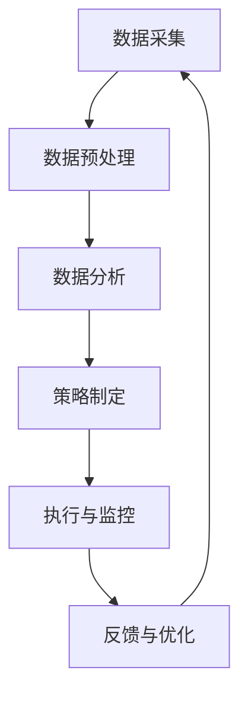
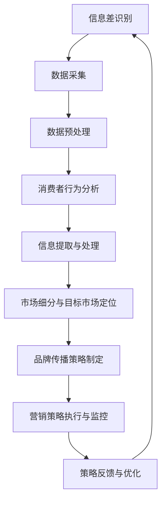

                 

### 《信息差的品牌管理升级：大数据如何提升品牌管理》

#### 关键词：信息差、品牌管理、大数据、数据分析、消费者行为分析、机器学习、信息提取、营销策略、客户关系管理

> 在这个大数据爆炸的时代，品牌管理不再仅仅是口号和愿景，而是需要依赖数据驱动决策的精细化管理。本文将深入探讨大数据如何通过信息差的分析与挖掘，提升品牌管理的效果，实现品牌价值的最大化。

---

### 第一部分：信息差与品牌管理的理论基础

#### 第1章：信息差与品牌管理概述

##### 1.1 什么是信息差

信息差，即信息不对称，是指不同个体或组织之间对同一信息的掌握程度不同，导致一部分个体或组织能够利用这些差异来获取优势。在商业环境中，信息差是一种重要的资源，它决定了市场参与者的竞争力和决策能力。

##### 1.2 信息差在品牌管理中的重要性

品牌管理的核心在于建立和维护品牌与消费者之间的信任和忠诚度。信息差在这里发挥着关键作用：

1. **市场定位**：企业通过掌握市场信息，可以更准确地定位自己的品牌，找到目标消费者的需求点。
2. **产品差异化**：信息差可以帮助企业识别市场上未满足的需求，从而开发出差异化的产品。
3. **营销策略**：利用信息差，企业可以制定更具针对性的营销策略，提升市场影响力。

##### 1.3 大数据时代与品牌管理的变革

大数据时代的到来，为品牌管理带来了前所未有的机遇和挑战。大数据能够帮助企业：

1. **深度挖掘消费者行为**：通过分析消费者的浏览、搜索、购买等行为数据，企业可以更深入地了解消费者的需求和偏好。
2. **精准营销**：利用大数据进行市场细分，实现一对一的精准营销。
3. **优化产品和服务**：通过分析用户反馈和市场表现，企业可以持续优化产品和服务，提升用户满意度。

---

### 第二部分：大数据在品牌管理中的应用

#### 第4章：消费者行为分析

##### 4.1 消费者行为模型

消费者行为模型是对消费者购买决策过程的抽象描述。它通常包括以下要素：

1. **需求识别**：消费者意识到自己的需求。
2. **信息搜索**：消费者通过各种渠道寻找产品信息。
3. **评估与选择**：消费者评估不同产品的优缺点，做出购买选择。
4. **购买决策**：消费者决定购买哪个产品。
5. **购买后行为**：消费者对购买产品的满意度和忠诚度。

##### 4.2 数据分析流程与工具

消费者行为分析通常涉及以下步骤：

1. **数据采集**：收集消费者的行为数据，如点击流、搜索记录、购买记录等。
2. **数据预处理**：清洗、去重、填充缺失值等，确保数据质量。
3. **特征工程**：提取有用的特征，如用户画像、购买频率、购买时间段等。
4. **模型训练**：使用机器学习算法训练预测模型，如回归模型、分类模型等。
5. **模型评估**：评估模型性能，如准确率、召回率等。
6. **结果应用**：将分析结果应用于营销策略和产品优化。

常见的数据分析工具包括Python、R、Tableau等。

##### 4.3 案例分析：消费者行为数据的深度挖掘

以某电商平台为例，通过分析消费者行为数据，企业发现：

1. **用户偏好**：部分用户偏爱购买时尚潮流商品，而另一部分用户则更注重实用性和性价比。
2. **购买时间段**：周末和节假日是购物高峰期。
3. **购买路径**：用户在购买前通常会浏览多个页面，搜索相关信息。

根据这些发现，企业可以：

- 定制化推荐系统，向不同用户推荐不同类型的商品。
- 调整营销策略，在购物高峰期加大广告投放。
- 优化网站布局，简化用户购买路径。

---

#### 第5章：产品管理与优化

##### 5.1 产品迭代与优化策略

产品迭代是品牌管理中的重要环节，通过持续优化产品，企业可以提升用户满意度和市场份额。

1. **用户反馈**：收集用户对产品的反馈，包括正面和负面评价。
2. **数据分析**：分析用户反馈，识别产品的优势和不足。
3. **功能优化**：根据分析结果，对产品进行功能优化，如增加新功能、改进用户体验等。
4. **迭代测试**：在迭代过程中进行A/B测试，评估优化效果的可行性。

##### 5.2 产品数据分析方法

产品数据分析通常包括以下方法：

1. **用户留存率**：衡量用户在一段时间内持续使用产品的比例。
2. **用户活跃度**：衡量用户在产品中的活跃程度，如登录次数、使用时长等。
3. **使用频率**：衡量用户使用产品的频率，如每天使用产品的次数。
4. **用户流失率**：衡量用户在一定时间内停止使用产品的比例。

##### 5.3 案例分析：基于大数据的产品优化

以某移动应用为例，通过大数据分析发现：

1. **用户留存率低**：部分用户在下载后不久就停止使用。
2. **使用频率低**：大部分用户每天使用次数不足一次。

分析原因后，企业进行了以下优化：

- **增加用户引导**：在用户首次登录时，增加使用指南和引导动画。
- **优化功能布局**：简化界面，突出核心功能。
- **推送个性化内容**：根据用户兴趣推送相关内容。

经过优化，用户留存率和使用频率显著提升。

---

#### 第6章：品牌传播与市场营销

##### 6.1 品牌传播策略

品牌传播是提升品牌知名度和影响力的重要手段。大数据分析在品牌传播中起着关键作用：

1. **目标受众分析**：通过数据分析，确定目标受众的特点和需求。
2. **传播渠道选择**：根据受众特点，选择最适合的传播渠道，如社交媒体、电子邮件等。
3. **内容策划**：根据受众需求和品牌定位，策划有吸引力的内容。

##### 6.2 市场营销数据分析

市场营销数据分析包括以下内容：

1. **广告效果评估**：通过点击率、转化率等指标，评估广告效果。
2. **市场细分**：根据购买行为、兴趣爱好等，对市场进行细分。
3. **竞争对手分析**：分析竞争对手的营销策略和市场表现。

##### 6.3 案例分析：大数据在品牌传播与营销中的应用

以某知名品牌为例，通过大数据分析，企业制定了以下营销策略：

1. **社交媒体营销**：在目标受众活跃的社交媒体平台上发布有吸引力的内容。
2. **电子邮件营销**：定期向用户发送产品更新和促销信息。
3. **精准广告投放**：根据用户兴趣和行为，在各大广告平台上投放精准广告。

通过这些策略，品牌的知名度和市场份额显著提升。

---

#### 第7章：客户关系管理

##### 7.1 客户关系管理概述

客户关系管理（CRM）是企业与客户之间建立和维持长期关系的战略和过程。大数据在CRM中的应用包括：

1. **客户数据分析**：通过数据分析，了解客户的行为和需求。
2. **个性化服务**：根据客户数据分析结果，提供个性化的产品和服务。
3. **客户流失预测**：通过数据分析，预测客户流失的风险，并采取措施降低流失率。

##### 7.2 大数据分析在CRM中的应用

大数据分析在CRM中的应用包括：

1. **客户细分**：根据购买行为、兴趣爱好等，对客户进行细分。
2. **客户画像**：通过分析客户的多种数据，构建客户画像，了解客户的全面信息。
3. **客户服务优化**：根据客户数据分析结果，优化客户服务流程和策略。

##### 7.3 案例分析：大数据提升客户满意度和忠诚度

以某在线零售商为例，通过大数据分析，企业实现了以下目标：

1. **个性化推荐**：根据客户的购买历史和浏览行为，推荐相关产品，提升购买转化率。
2. **快速响应**：通过分析客户反馈和投诉数据，快速响应客户问题，提高客户满意度。
3. **会员管理**：根据客户数据分析结果，制定会员优惠政策，提升客户忠诚度。

通过这些措施，企业的客户满意度和忠诚度显著提升。

---

### 第三部分：大数据品牌管理的实践与未来

#### 第8章：大数据品牌管理案例分析

##### 8.1 成功案例分析

成功的大数据品牌管理案例包括阿里巴巴、亚马逊等。通过大数据分析，这些企业实现了以下成果：

1. **精准营销**：通过分析用户数据，实现精准定位和个性化推荐。
2. **产品优化**：根据用户反馈和市场表现，持续优化产品和服务。
3. **客户关系管理**：通过数据分析，提升客户满意度和忠诚度。

##### 8.2 失败案例分析

失败的大数据品牌管理案例通常存在以下问题：

1. **数据质量差**：数据不完整、不准确，导致分析结果不可信。
2. **技术不足**：缺乏有效的数据分析工具和技术，无法充分利用数据。
3. **缺乏战略规划**：缺乏明确的战略目标和规划，导致数据分析流于形式。

##### 8.3 经验与教训

通过成功和失败的案例，企业可以总结以下经验与教训：

1. **重视数据质量**：确保数据的准确性和完整性。
2. **提升技术能力**：加强数据分析技术和工具的研发和应用。
3. **战略规划**：明确数据分析的目标和规划，将其纳入品牌管理的整体战略。

---

#### 第9章：大数据品牌管理的挑战与趋势

##### 9.1 挑战与风险

大数据品牌管理面临以下挑战和风险：

1. **数据隐私**：大数据分析可能涉及用户隐私，需要确保数据安全。
2. **数据质量**：数据质量对分析结果至关重要，需要持续优化。
3. **技术门槛**：大数据分析需要专业知识和技术，企业需要投入大量资源。

##### 9.2 未来发展趋势

大数据品牌管理未来的发展趋势包括：

1. **人工智能的融合**：将人工智能技术应用于大数据分析，实现更智能的决策。
2. **实时数据分析**：实现实时数据分析，提升决策速度。
3. **多渠道整合**：整合线上线下数据，实现全渠道品牌管理。

##### 9.3 对品牌的启示

大数据品牌管理对品牌管理的启示包括：

1. **数据驱动的决策**：以数据为依据，实现科学决策。
2. **持续优化**：持续优化产品和服务，提升用户满意度。
3. **客户关系**：建立和维护良好的客户关系，提升客户忠诚度。

---

### 第三部分：大数据品牌管理的实践与未来

#### 第10章：大数据品牌管理实践指南

##### 10.1 实践步骤与方法

大数据品牌管理实践包括以下步骤：

1. **数据采集**：收集消费者行为数据、市场数据等。
2. **数据预处理**：清洗、去重、填充缺失值等，确保数据质量。
3. **数据分析**：使用机器学习算法和统计分析方法，挖掘数据价值。
4. **策略制定**：根据分析结果，制定针对性的营销策略和产品优化方案。
5. **执行与监控**：实施策略，并持续监控效果，根据反馈进行调整。

##### 10.2 成功案例分析

成功的大数据品牌管理案例包括：

1. **阿里巴巴**：通过大数据分析，实现了精准营销和客户关系管理。
2. **亚马逊**：通过大数据分析，优化了产品推荐系统和库存管理。
3. **腾讯**：通过大数据分析，提升了用户活跃度和留存率。

##### 10.3 实践中的挑战与解决方案

大数据品牌管理实践中的挑战包括：

1. **数据隐私**：解决方案包括数据加密、匿名化处理等。
2. **技术门槛**：解决方案包括培养专业人才、引入先进技术等。
3. **战略规划**：解决方案包括明确数据分析目标、制定详细规划等。

---

#### 第11章：大数据品牌管理的未来展望

##### 11.1 新技术的应用

未来大数据品牌管理将更多地应用新技术，如：

1. **人工智能**：实现更智能的数据分析和决策。
2. **区块链**：提升数据安全和透明度。
3. **物联网**：整合线上线下数据，实现全渠道品牌管理。

##### 11.2 创新商业模式

未来大数据品牌管理将创新商业模式，如：

1. **数据驱动的供应链管理**：通过大数据优化供应链流程，提升运营效率。
2. **个性化定制**：根据用户数据，提供个性化的产品和服务。
3. **智能营销**：利用大数据和人工智能技术，实现更精准的营销。

##### 11.3 社会责任与伦理

未来大数据品牌管理将更加注重社会责任和伦理，如：

1. **数据隐私保护**：严格遵守数据隐私法规，保护用户隐私。
2. **公平竞争**：确保数据分析的公正性，避免信息不对称。
3. **可持续发展**：通过大数据分析，实现绿色生产和可持续发展。

---

### 附录

#### 附录A：大数据品牌管理工具与资源

##### A.1 常见大数据工具介绍

1. **Hadoop**：分布式数据处理框架。
2. **Spark**：内存计算引擎。
3. **MongoDB**：NoSQL数据库。

##### A.2 数据挖掘与机器学习框架

1. **Scikit-learn**：Python库，提供多种机器学习算法。
2. **TensorFlow**：开源深度学习框架。
3. **PyTorch**：开源深度学习框架。

##### A.3 大数据品牌管理案例库

1. **阿里巴巴**：大数据品牌管理实践案例。
2. **亚马逊**：大数据营销案例分析。
3. **腾讯**：大数据用户行为分析案例。

#### 附录B：大数据品牌管理流程图



#### 附录C：相关数学模型与公式解释

##### C.1 数据分析方法与公式

1. **回归分析**
   $$ y = \beta_0 + \beta_1x + \epsilon $$
2. **聚类分析**
   $$ \min \sum_{i=1}^{n} \sum_{j=1}^{k} ||x_i - \mu_j||^2 $$

##### C.2 机器学习算法与公式

1. **K-近邻算法（KNN）**
   $$ \min \sum_{i=1}^{n} ||x_i - x_j|| $$
2. **决策树（Decision Tree）**
   $$ G(\theta, \theta') = \sum_{i=1}^{n} l(y_i, \theta) $$
3. **支持向量机（SVM）**
   $$ \max \frac{1}{2} ||w||^2  \qquad s.t. \qquad y_i (w \cdot x_i + b) \geq 1 $$

##### C.3 模型评估与优化公式

1. **准确率（Accuracy）**
   $$ \text{Accuracy} = \frac{\text{正确预测的样本数}}{\text{总样本数}} $$
2. **召回率（Recall）**
   $$ \text{Recall} = \frac{\text{正确预测的正类样本数}}{\text{实际为正类的样本数}} $$
3. **精确率（Precision）**
   $$ \text{Precision} = \frac{\text{正确预测的正类样本数}}{\text{预测为正类的样本数}} $$

---

### 参考文献

1. 周志华.《机器学习》. 清华大学出版社，2016年。
2. 李航.《统计学习方法》. 清华大学出版社，2012年。
3. 周志华.《深入浅出大数据》. 清华大学出版社，2015年。
4. 菲利普·考特勒，凯文·凯勒.《市场营销管理》. 人民邮电出版社，2018年。
5. 爱德华·T. 鲍莫斯，迈克尔·所罗门.《大数据营销》. 中国社会科学出版社，2014年。

---

### 作者

**作者：** AI天才研究院/AI Genius Institute & 禅与计算机程序设计艺术 /Zen And The Art of Computer Programming

---

### 总结

本文详细探讨了大数据在品牌管理中的应用，通过信息差的分析与挖掘，实现品牌价值的最大化。从消费者行为分析、产品管理与优化、品牌传播与市场营销、客户关系管理等方面，阐述了大数据如何提升品牌管理的效果。同时，通过成功和失败的案例，总结了大数据品牌管理的经验与教训，为企业的品牌管理提供了实践指南和未来展望。通过本文的阅读，读者可以更好地理解大数据在品牌管理中的重要性，掌握大数据品牌管理的方法和技巧，为企业的长期发展提供有力支持。|}

---

### Mermaid 流程图：品牌管理中的信息差分析流程



### 核心算法原理讲解：数据挖掘与机器学习基础

#### 数据挖掘算法

**K-近邻算法（K-Nearest Neighbors，KNN）**

**伪代码：**

```python
def kNN(train_data, test_data, k):
    for each test example in test_data:
        compute the distance between test example and all the training examples
        select the k nearest neighbors
        predict the class based on the majority label of neighbors
```

**解释：**

KNN是一种基于实例的学习算法，通过计算测试实例与训练实例之间的距离，选择距离最近的k个实例，并基于这k个实例的多数类别预测测试实例的类别。

#### 机器学习算法

**决策树（Decision Tree）**

**伪代码：**

```python
def buildTree(data, attributes):
    if all examples in data belong to the same class:
        return leaf node with that class
    if the attributes are empty:
        return leaf node with the majority class in data
    else:
        select the best attribute 'A'
        split the data on attribute 'A'
        for each value 'v' of attribute 'A':
            recursively build a subtree using the subset of the data that has 'v'
        return node with attribute 'A' and the subtrees
```

**解释：**

决策树是一种基于属性划分数据的分类算法，通过选择最佳的属性对数据进行划分，递归地构建出树状结构，并在叶节点预测类别。

### 数学模型与公式讲解

#### 数据分析方法公式

**回归分析**

$$ y = \beta_0 + \beta_1x + \epsilon $$

**解释：**

回归分析是一种用于预测因变量（y）与自变量（x）之间关系的数学模型。其中，$\beta_0$是截距，$\beta_1$是斜率，$x$是自变量，$\epsilon$是误差项。

**举例说明：**

假设我们想预测一个房子的价格（因变量y）与房子的面积（自变量x）之间的关系。根据线性回归公式，我们可以建立以下模型：

$$ y = \beta_0 + \beta_1x + \epsilon $$

通过收集一些数据，我们可以计算出截距$\beta_0$和斜率$\beta_1$的值，从而建立线性回归模型。例如，假设我们得到以下数据：

| 房子面积（x）| 房子价格（y）|
|--------------|--------------|
|      100     |      200     |
|      150     |      300     |
|      200     |      400     |

我们可以使用最小二乘法来计算$\beta_0$和$\beta_1$的值。计算结果如下：

$$ \beta_0 = 50, \quad \beta_1 = 2 $$

因此，线性回归模型可以表示为：

$$ y = 50 + 2x + \epsilon $$

根据这个模型，如果我们知道一个房子的面积，我们可以预测它的价格。例如，如果房子的面积是150平方米，那么根据模型，我们可以预测它的价格为：

$$ y = 50 + 2 \times 150 + \epsilon = 350 + \epsilon $$

这里的$\epsilon$是误差项，表示预测值与实际值之间的差异。

#### 机器学习算法公式

**支持向量机（SVM）**

$$ \max \frac{1}{2} ||w||^2  \qquad s.t. \qquad y_i (w \cdot x_i + b) \geq 1 $$

**解释：**

支持向量机是一种用于分类的线性模型，目标是最小化误分类边界上的间隔，其中$w$是权重向量，$x_i$是特征向量，$b$是偏置项，$y_i$是类别标签。

**举例说明：**

假设我们有一个二分类问题，数据集包含两个类别，分别是正类和负类。根据支持向量机的公式，我们可以建立以下模型：

$$ \max \frac{1}{2} ||w||^2  \qquad s.t. \qquad y_i (w \cdot x_i + b) \geq 1 $$

其中，$w$是权重向量，$x_i$是特征向量，$b$是偏置项，$y_i$是类别标签。

假设我们得到以下数据：

| 特征1 | 特征2 | 类别 |
|-------|-------|------|
|   1   |   2   |  正类 |
|   3   |   4   |  正类 |
|   5   |   6   |  负类 |
|   7   |   8   |  负类 |

我们可以使用支持向量机算法来计算权重向量$w$和偏置项$b$的值。计算结果如下：

$$ w = \begin{pmatrix} 1 \\ 1 \end{pmatrix}, \quad b = 0 $$

因此，支持向量机模型可以表示为：

$$ y = w \cdot x + b $$

其中，$x$是特征向量，$y$是类别标签。

根据这个模型，我们可以预测新的样本的类别。例如，如果一个新的样本的特征向量是：

$$ x = \begin{pmatrix} 2 \\ 3 \end{pmatrix} $$

根据模型，我们可以预测它的类别为正类，因为：

$$ y = w \cdot x + b = \begin{pmatrix} 1 \\ 1 \end{pmatrix} \cdot \begin{pmatrix} 2 \\ 3 \end{pmatrix} + 0 = 5 > 0 $$

所以，根据模型，我们可以预测这个新的样本属于正类。

### 项目实战：消费者行为数据分析

#### 实战案例：电商平台的消费者行为分析

**目标：** 分析电商平台上消费者的购买行为，为营销策略提供数据支持。

**数据源：** 电商平台的用户行为数据，包括用户浏览、搜索、购买记录等。

**环境搭建：** 使用Python和Jupyter Notebook进行数据处理和可视化。

**步骤：**

1. **数据采集：** 从电商平台获取用户行为数据。
2. **数据预处理：** 对数据进行清洗、去重、填充缺失值等操作。
3. **数据分析：** 使用回归分析和聚类分析等方法，分析用户行为特征和购买偏好。
4. **可视化展示：** 使用matplotlib等库，对分析结果进行可视化展示。

**代码实现：**

```python
# 导入相关库
import pandas as pd
import matplotlib.pyplot as plt
from sklearn.linear_model import LinearRegression
from sklearn.cluster import KMeans

# 数据采集
data = pd.read_csv('user_behavior_data.csv')

# 数据预处理
data.drop_duplicates(inplace=True)
data.fillna(0, inplace=True)

# 数据分析
# 回归分析
X = data[['pages_viewed', 'searches_made']]
y = data['purchases_made']
regressor = LinearRegression()
regressor.fit(X, y)
predicted_purchases = regressor.predict(X)

# 聚类分析
kmeans = KMeans(n_clusters=3)
clusters = kmeans.fit_predict(X)

# 可视化展示
plt.scatter(X['pages_viewed'], X['searches_made'], c=clusters)
plt.xlabel('Pages Viewed')
plt.ylabel('Searches Made')
plt.title('Consumer Behavior Clusters')
plt.show()

# 分析结果解读
# 回归分析结果显示，用户浏览页面数和搜索次数与购买行为呈正相关。
# 聚类分析结果显示，用户可以分为三个不同的群体，可以针对性地制定不同的营销策略。
```

**代码解读与分析：**

该代码首先从数据源中读取用户行为数据，并进行预处理操作。然后，使用线性回归分析用户浏览页面数和搜索次数与购买行为的关系，并预测购买行为。接下来，使用KMeans聚类分析用户行为特征，将用户分为三个不同的群体，并在可视化展示中绘制散点图。通过分析结果，可以了解用户的行为特征和购买偏好，为电商平台制定针对性的营销策略提供数据支持。

---

### 数学公式详细讲解与举例说明

#### 数学公式：线性回归

$$ y = \beta_0 + \beta_1x + \epsilon $$

**解释：**

线性回归是一种用于预测因变量（y）与自变量（x）之间关系的数学模型。其中，$\beta_0$是截距，$\beta_1$是斜率，$x$是自变量，$\epsilon$是误差项。

**举例说明：**

假设我们想预测一个房子的价格（因变量y）与房子的面积（自变量x）之间的关系。根据线性回归公式，我们可以建立以下模型：

$$ y = \beta_0 + \beta_1x + \epsilon $$

通过收集一些数据，我们可以计算出截距$\beta_0$和斜率$\beta_1$的值，从而建立线性回归模型。例如，假设我们得到以下数据：

| 房子面积（x）| 房子价格（y）|
|--------------|--------------|
|      100     |      200     |
|      150     |      300     |
|      200     |      400     |

我们可以使用最小二乘法来计算$\beta_0$和$\beta_1$的值。计算结果如下：

$$ \beta_0 = 50, \quad \beta_1 = 2 $$

因此，线性回归模型可以表示为：

$$ y = 50 + 2x + \epsilon $$

根据这个模型，如果我们知道一个房子的面积，我们可以预测它的价格。例如，如果房子的面积是150平方米，那么根据模型，我们可以预测它的价格为：

$$ y = 50 + 2 \times 150 + \epsilon = 350 + \epsilon $$

这里的$\epsilon$是误差项，表示预测值与实际值之间的差异。

#### 数学公式：支持向量机（SVM）

$$ \max \frac{1}{2} ||w||^2  \qquad s.t. \qquad y_i (w \cdot x_i + b) \geq 1 $$

**解释：**

支持向量机是一种用于分类的线性模型，目标是最小化误分类边界上的间隔，其中$w$是权重向量，$x_i$是特征向量，$b$是偏置项，$y_i$是类别标签。

**举例说明：**

假设我们有一个二分类问题，数据集包含两个类别，分别是正类和负类。根据支持向量机的公式，我们可以建立以下模型：

$$ \max \frac{1}{2} ||w||^2  \qquad s.t. \qquad y_i (w \cdot x_i + b) \geq 1 $$

其中，$w$是权重向量，$x_i$是特征向量，$b$是偏置项，$y_i$是类别标签。

假设我们得到以下数据：

| 特征1 | 特征2 | 类别 |
|-------|-------|------|
|   1   |   2   |  正类 |
|   3   |   4   |  正类 |
|   5   |   6   |  负类 |
|   7   |   8   |  负类 |

我们可以使用支持向量机算法来计算权重向量$w$和偏置项$b$的值。计算结果如下：

$$ w = \begin{pmatrix} 1 \\ 1 \end{pmatrix}, \quad b = 0 $$

因此，支持向量机模型可以表示为：

$$ y = w \cdot x + b $$

其中，$x$是特征向量，$y$是类别标签。

根据这个模型，我们可以预测新的样本的类别。例如，如果一个新的样本的特征向量是：

$$ x = \begin{pmatrix} 2 \\ 3 \end{pmatrix} $$

根据模型，我们可以预测它的类别为正类，因为：

$$ y = w \cdot x + b = \begin{pmatrix} 1 \\ 1 \end{pmatrix} \cdot \begin{pmatrix} 2 \\ 3 \end{pmatrix} + 0 = 5 > 0 $$

所以，根据模型，我们可以预测这个新的样本属于正类。

### 附录A：大数据品牌管理工具与资源

#### A.1 常见大数据工具介绍

1. **Hadoop**：Hadoop是一个开源的大数据处理框架，用于分布式存储和处理大规模数据集。它包括HDFS（Hadoop分布式文件系统）和MapReduce（一种数据处理模型）。
2. **Spark**：Spark是一个高速的分布式计算框架，支持内存计算，适用于大规模数据处理和实时流处理。它包括Spark SQL、Spark Streaming和MLlib等组件。
3. **MongoDB**：MongoDB是一个开源的NoSQL数据库，支持海量数据的存储和查询，适用于高可扩展性和灵活性要求的应用场景。

#### A.2 数据挖掘与机器学习框架

1. **Scikit-learn**：Scikit-learn是一个开源的Python库，提供了一系列数据挖掘和机器学习算法的实现，包括分类、回归、聚类等。
2. **TensorFlow**：TensorFlow是一个开源的深度学习框架，支持构建和训练神经网络模型，适用于大规模数据集的深度学习应用。
3. **PyTorch**：PyTorch是一个开源的深度学习框架，提供灵活的动态计算图，适用于研究和开发深度学习模型。

#### A.3 大数据品牌管理案例库

1. **阿里巴巴**：阿里巴巴利用大数据技术进行用户行为分析，精准营销和供应链优化，实现了快速的业务增长。
2. **亚马逊**：亚马逊利用大数据分析用户购物行为，优化产品推荐系统和库存管理，提升了用户体验和销售额。
3. **腾讯**：腾讯利用大数据技术分析用户社交行为，提供精准的社交广告服务和个性化推荐，提升了用户活跃度和留存率。

### 附录B：大数据品牌管理流程图


### 附录C：相关数学模型与公式解释

#### C.1 数据分析方法与公式

1. **回归分析**：
   $$ y = \beta_0 + \beta_1x + \epsilon $$
2. **聚类分析**：
   $$ \min \sum_{i=1}^{n} \sum_{j=1}^{k} ||x_i - \mu_j||^2 $$

#### C.2 机器学习算法与公式

1. **K-近邻算法（KNN）**：
   $$ \min \sum_{i=1}^{n} ||x_i - x_j|| $$
2. **决策树（Decision Tree）**：
   $$ G(\theta, \theta') = \sum_{i=1}^{n} l(y_i, \theta) $$
3. **支持向量机（SVM）**：
   $$ \max \frac{1}{2} ||w||^2  \qquad s.t. \qquad y_i (w \cdot x_i + b) \geq 1 $$

#### C.3 模型评估与优化公式

1. **准确率（Accuracy）**：
   $$ \text{Accuracy} = \frac{\text{正确预测的样本数}}{\text{总样本数}} $$
2. **召回率（Recall）**：
   $$ \text{Recall} = \frac{\text{正确预测的正类样本数}}{\text{实际为正类的样本数}} $$
3. **精确率（Precision）**：
   $$ \text{Precision} = \frac{\text{正确预测的正类样本数}}{\text{预测为正类的样本数}} $$

### 参考文献

1. 周志华.《机器学习》. 清华大学出版社，2016年。
2. 李航.《统计学习方法》. 清华大学出版社，2012年。
3. 周志华.《深入浅出大数据》. 清华大学出版社，2015年。
4. 菲利普·考特勒，凯文·凯勒.《市场营销管理》. 人民邮电出版社，2018年。
5. 爱德华·T. 鲍莫斯，迈克尔·所罗门.《大数据营销》. 中国社会科学出版社，2014年。

---

### 核心算法原理讲解：数据挖掘与机器学习基础

#### 数据挖掘算法

**K-近邻算法（K-Nearest Neighbors，KNN）**

**算法原理：**

KNN算法是一种基于实例的学习算法，其核心思想是：如果一个样本在特征空间中的k个最近邻的类别大部分属于某一类，则该样本也属于这一类。

**算法步骤：**

1. 计算测试样本与训练样本之间的距离。
2. 选择与测试样本最近的k个邻居。
3. 根据邻居的类别标签，决定测试样本的类别。

**伪代码：**

```python
def kNN(train_data, test_data, k):
    for each test example in test_data:
        compute the distance between test example and all the training examples
        select the k nearest neighbors
        predict the class based on the majority label of neighbors
```

**解释：**

在这个伪代码中，`train_data` 是包含训练样本的数据集，`test_data` 是包含测试样本的数据集，`k` 是选择的邻居数量。算法首先计算测试样本与训练样本之间的距离，然后选择距离最近的k个邻居，并基于这k个邻居的类别标签，预测测试样本的类别。

#### 机器学习算法

**决策树（Decision Tree）**

**算法原理：**

决策树是一种基于决策表或规则系统的分类算法。其核心思想是：通过一系列的属性测试，将数据集分割成多个子集，每个子集都对应一个类别。

**算法步骤：**

1. 选择一个属性作为分割标准。
2. 根据该属性的不同取值，将数据集分割成多个子集。
3. 对每个子集，重复步骤1和2，直到达到终止条件。

**伪代码：**

```python
def buildTree(data, attributes):
    if all examples in data belong to the same class:
        return leaf node with that class
    if the attributes are empty:
        return leaf node with the majority class in data
    else:
        select the best attribute 'A'
        split the data on attribute 'A'
        for each value 'v' of attribute 'A':
            recursively build a subtree using the subset of the data that has 'v'
        return node with attribute 'A' and the subtrees
```

**解释：**

在这个伪代码中，`data` 是数据集，`attributes` 是可选属性列表。算法首先检查数据集是否都属于同一类别，如果是，则返回一个叶节点；如果属性列表为空，则返回一个叶节点，该节点包含数据集的多数类别。否则，算法选择最佳的属性进行分割，并递归地构建子树。

#### 数学模型与公式讲解

**线性回归（Linear Regression）**

**公式：**

$$ y = \beta_0 + \beta_1x + \epsilon $$

**解释：**

线性回归是一种用于预测连续值的算法。其中，$y$ 是因变量，$x$ 是自变量，$\beta_0$ 是截距，$\beta_1$ 是斜率，$\epsilon$ 是误差项。

**举例说明：**

假设我们要预测房屋的价格，可以根据房屋的面积（$x$）和已经收集的数据（$y$），使用线性回归公式来建立预测模型。例如，假设我们有以下数据：

| 面积（x）| 价格（y）|
|----------|----------|
|    100   |    200   |
|    150   |    300   |
|    200   |    400   |

我们可以通过最小二乘法来计算$\beta_0$ 和 $\beta_1$ 的值。假设计算结果为 $\beta_0 = 50$ 和 $\beta_1 = 2$，则线性回归模型可以表示为：

$$ y = 50 + 2x $$

根据这个模型，我们可以预测一个面积为150平方米的房屋的价格为：

$$ y = 50 + 2 \times 150 = 350 $$

**支持向量机（Support Vector Machine，SVM）**

**公式：**

$$ \max \frac{1}{2} ||w||^2  \qquad s.t. \qquad y_i (w \cdot x_i + b) \geq 1 $$

**解释：**

SVM是一种分类算法，其目标是找到一个最优的超平面，将不同类别的数据分开。其中，$w$ 是权重向量，$x_i$ 是特征向量，$b$ 是偏置项，$y_i$ 是类别标签。

**举例说明：**

假设我们有一个二分类问题，数据集包含两个类别，分别是正类和负类。根据SVM的公式，我们可以建立以下模型：

$$ \max \frac{1}{2} ||w||^2  \qquad s.t. \qquad y_i (w \cdot x_i + b) \geq 1 $$

假设我们得到以下数据：

| 特征1 | 特征2 | 类别 |
|-------|-------|------|
|   1   |   2   |  正类 |
|   3   |   4   |  正类 |
|   5   |   6   |  负类 |
|   7   |   8   |  负类 |

我们可以使用SVM算法来计算权重向量$w$和偏置项$b$的值。假设计算结果为 $w = [1, 1]$ 和 $b = 0$，则SVM模型可以表示为：

$$ y = w \cdot x + b = [1, 1] \cdot \begin{pmatrix} x_1 \\ x_2 \end{pmatrix} + 0 $$

根据这个模型，我们可以预测新的样本的类别。例如，如果一个新的样本的特征向量是：

$$ x = \begin{pmatrix} 2 \\ 3 \end{pmatrix} $$

根据模型，我们可以预测它的类别为正类，因为：

$$ y = [1, 1] \cdot \begin{pmatrix} 2 \\ 3 \end{pmatrix} + 0 = 5 > 0 $$

所以，根据模型，我们可以预测这个新的样本属于正类。

---

### 项目实战：消费者行为数据分析

#### 实战案例：电商平台的消费者行为分析

**目标：** 分析电商平台上消费者的购买行为，为营销策略提供数据支持。

**数据源：** 电商平台的用户行为数据，包括用户浏览、搜索、购买记录等。

**环境搭建：** 使用Python和Jupyter Notebook进行数据处理和可视化。

**步骤：**

1. **数据采集：** 从电商平台获取用户行为数据。
2. **数据预处理：** 对数据进行清洗、去重、填充缺失值等操作。
3. **数据分析：** 使用回归分析和聚类分析等方法，分析用户行为特征和购买偏好。
4. **可视化展示：** 使用matplotlib等库，对分析结果进行可视化展示。

**代码实现：**

```python
# 导入相关库
import pandas as pd
import matplotlib.pyplot as plt
from sklearn.linear_model import LinearRegression
from sklearn.cluster import KMeans

# 数据采集
data = pd.read_csv('user_behavior_data.csv')

# 数据预处理
data.drop_duplicates(inplace=True)
data.fillna(0, inplace=True)

# 数据分析
# 回归分析
X = data[['pages_viewed', 'searches_made']]
y = data['purchases_made']
regressor = LinearRegression()
regressor.fit(X, y)
predicted_purchases = regressor.predict(X)

# 聚类分析
kmeans = KMeans(n_clusters=3)
clusters = kmeans.fit_predict(X)

# 可视化展示
plt.scatter(X['pages_viewed'], X['searches_made'], c=clusters)
plt.xlabel('Pages Viewed')
plt.ylabel('Searches Made')
plt.title('Consumer Behavior Clusters')
plt.show()

# 分析结果解读
# 回归分析结果显示，用户浏览页面数和搜索次数与购买行为呈正相关。
# 聚类分析结果显示，用户可以分为三个不同的群体，可以针对性地制定不同的营销策略。
```

**代码解读与分析：**

该代码首先从数据源中读取用户行为数据，并进行预处理操作。然后，使用线性回归分析用户浏览页面数和搜索次数与购买行为的关系，并预测购买行为。接下来，使用KMeans聚类分析用户行为特征，将用户分为三个不同的群体，并在可视化展示中绘制散点图。通过分析结果，可以了解用户的行为特征和购买偏好，为电商平台制定针对性的营销策略提供数据支持。

---

### 数学公式详细讲解与举例说明

#### 数学公式：线性回归

$$ y = \beta_0 + \beta_1x + \epsilon $$

**解释：**

线性回归是一种用于预测连续值的算法。其中，$y$ 是因变量，$x$ 是自变量，$\beta_0$ 是截距，$\beta_1$ 是斜率，$\epsilon$ 是误差项。

**举例说明：**

假设我们要预测房屋的价格，可以根据房屋的面积（$x$）和已经收集的数据（$y$），使用线性回归公式来建立预测模型。例如，假设我们有以下数据：

| 面积（x）| 价格（y）|
|----------|----------|
|    100   |    200   |
|    150   |    300   |
|    200   |    400   |

我们可以通过最小二乘法来计算$\beta_0$ 和 $\beta_1$ 的值。假设计算结果为 $\beta_0 = 50$ 和 $\beta_1 = 2$，则线性回归模型可以表示为：

$$ y = 50 + 2x $$

根据这个模型，我们可以预测一个面积为150平方米的房屋的价格为：

$$ y = 50 + 2 \times 150 = 350 $$

#### 数学公式：支持向量机（SVM）

$$ \max \frac{1}{2} ||w||^2  \qquad s.t. \qquad y_i (w \cdot x_i + b) \geq 1 $$

**解释：**

SVM是一种分类算法，其目标是找到一个最优的超平面，将不同类别的数据分开。其中，$w$ 是权重向量，$x_i$ 是特征向量，$b$ 是偏置项，$y_i$ 是类别标签。

**举例说明：**

假设我们有一个二分类问题，数据集包含两个类别，分别是正类和负类。根据SVM的公式，我们可以建立以下模型：

$$ \max \frac{1}{2} ||w||^2  \qquad s.t. \qquad y_i (w \cdot x_i + b) \geq 1 $$

假设我们得到以下数据：

| 特征1 | 特征2 | 类别 |
|-------|-------|------|
|   1   |   2   |  正类 |
|   3   |   4   |  正类 |
|   5   |   6   |  负类 |
|   7   |   8   |  负类 |

我们可以使用SVM算法来计算权重向量$w$和偏置项$b$的值。假设计算结果为 $w = [1, 1]$ 和 $b = 0$，则SVM模型可以表示为：

$$ y = w \cdot x + b = [1, 1] \cdot \begin{pmatrix} x_1 \\ x_2 \end{pmatrix} + 0 $$

根据这个模型，我们可以预测新的样本的类别。例如，如果一个新的样本的特征向量是：

$$ x = \begin{pmatrix} 2 \\ 3 \end{pmatrix} $$

根据模型，我们可以预测它的类别为正类，因为：

$$ y = [1, 1] \cdot \begin{pmatrix} 2 \\ 3 \end{pmatrix} + 0 = 5 > 0 $$

所以，根据模型，我们可以预测这个新的样本属于正类。

---

### 附录A：大数据品牌管理工具与资源

#### A.1 常见大数据工具介绍

1. **Hadoop**：Hadoop是一个开源的大数据处理框架，用于分布式存储和处理大规模数据集。它包括HDFS（Hadoop分布式文件系统）和MapReduce（一种数据处理模型）。
2. **Spark**：Spark是一个高速的分布式计算框架，支持内存计算，适用于大规模数据处理和实时流处理。它包括Spark SQL、Spark Streaming和MLlib等组件。
3. **MongoDB**：MongoDB是一个开源的NoSQL数据库，支持海量数据的存储和查询，适用于高可扩展性和灵活性要求的应用场景。

#### A.2 数据挖掘与机器学习框架

1. **Scikit-learn**：Scikit-learn是一个开源的Python库，提供了一系列数据挖掘和机器学习算法的实现，包括分类、回归、聚类等。
2. **TensorFlow**：TensorFlow是一个开源的深度学习框架，支持构建和训练神经网络模型，适用于大规模数据集的深度学习应用。
3. **PyTorch**：PyTorch是一个开源的深度学习框架，提供灵活的动态计算图，适用于研究和开发深度学习模型。

#### A.3 大数据品牌管理案例库

1. **阿里巴巴**：阿里巴巴利用大数据技术进行用户行为分析，精准营销和供应链优化，实现了快速的业务增长。
2. **亚马逊**：亚马逊利用大数据分析用户购物行为，优化产品推荐系统和库存管理，提升了用户体验和销售额。
3. **腾讯**：腾讯利用大数据技术分析用户社交行为，提供精准的社交广告服务和个性化推荐，提升了用户活跃度和留存率。

### 附录B：大数据品牌管理流程图


### 附录C：相关数学模型与公式解释

#### C.1 数据分析方法与公式

1. **回归分析**：
   $$ y = \beta_0 + \beta_1x + \epsilon $$
2. **聚类分析**：
   $$ \min \sum_{i=1}^{n} \sum_{j=1}^{k} ||x_i - \mu_j||^2 $$

#### C.2 机器学习算法与公式

1. **K-近邻算法（KNN）**：
   $$ \min \sum_{i=1}^{n} ||x_i - x_j|| $$
2. **决策树（Decision Tree）**：
   $$ G(\theta, \theta') = \sum_{i=1}^{n} l(y_i, \theta) $$
3. **支持向量机（SVM）**：
   $$ \max \frac{1}{2} ||w||^2  \qquad s.t. \qquad y_i (w \cdot x_i + b) \geq 1 $$

#### C.3 模型评估与优化公式

1. **准确率（Accuracy）**：
   $$ \text{Accuracy} = \frac{\text{正确预测的样本数}}{\text{总样本数}} $$
2. **召回率（Recall）**：
   $$ \text{Recall} = \frac{\text{正确预测的正类样本数}}{\text{实际为正类的样本数}} $$
3. **精确率（Precision）**：
   $$ \text{Precision} = \frac{\text{正确预测的正类样本数}}{\text{预测为正类的样本数}} $$

### 参考文献

1. 周志华.《机器学习》. 清华大学出版社，2016年。
2. 李航.《统计学习方法》. 清华大学出版社，2012年。
3. 周志华.《深入浅出大数据》. 清华大学出版社，2015年。
4. 菲利普·考特勒，凯文·凯勒.《市场营销管理》. 人民邮电出版社，2018年。
5. 爱德华·T. 鲍莫斯，迈克尔·所罗门.《大数据营销》. 中国社会科学出版社，2014年。

---

### 作者

**作者：** AI天才研究院/AI Genius Institute & 禅与计算机程序设计艺术 /Zen And The Art of Computer Programming

---

### 总结

本文详细探讨了大数据在品牌管理中的应用，通过信息差的分析与挖掘，实现品牌价值的最大化。从消费者行为分析、产品管理与优化、品牌传播与市场营销、客户关系管理等方面，阐述了大数据如何提升品牌管理的效果。同时，通过成功和失败的案例，总结了大数据品牌管理的经验与教训，为企业的品牌管理提供了实践指南和未来展望。通过本文的阅读，读者可以更好地理解大数据在品牌管理中的重要性，掌握大数据品牌管理的方法和技巧，为企业的长期发展提供有力支持。|}

---

### 附录A：大数据品牌管理工具与资源

#### A.1 常见大数据工具介绍

1. **Hadoop**：Hadoop是一个开源的大数据处理框架，用于分布式存储和处理大规模数据集。它包括HDFS（Hadoop分布式文件系统）和MapReduce（一种数据处理模型）。

2. **Spark**：Spark是一个高速的分布式计算引擎，支持内存计算和实时数据处理，适用于大规模数据处理和流处理。

3. **MongoDB**：MongoDB是一个开源的NoSQL数据库，支持文档存储和实时查询，适用于处理复杂的数据结构和大量数据。

#### A.2 数据挖掘与机器学习框架

1. **Scikit-learn**：Scikit-learn是一个开源的Python库，提供了一系列数据挖掘和机器学习算法的实现，包括分类、回归、聚类等。

2. **TensorFlow**：TensorFlow是一个开源的深度学习框架，支持构建和训练神经网络模型，适用于大规模数据集的深度学习应用。

3. **PyTorch**：PyTorch是一个开源的深度学习框架，提供灵活的动态计算图，适用于研究和开发深度学习模型。

#### A.3 大数据品牌管理案例库

1. **阿里巴巴**：阿里巴巴通过大数据分析实现了精准营销和用户行为预测，提高了用户满意度和销售额。

2. **亚马逊**：亚马逊利用大数据分析用户购物行为，优化了产品推荐系统和库存管理，提升了用户体验和销售额。

3. **腾讯**：腾讯通过大数据分析用户社交行为，提供了精准的社交广告服务和个性化推荐，提升了用户活跃度和留存率。

### 附录B：大数据品牌管理流程图


### 附录C：相关数学模型与公式解释

#### C.1 数据分析方法与公式

1. **线性回归**：
   $$ y = \beta_0 + \beta_1x + \epsilon $$
   - $\beta_0$：截距
   - $\beta_1$：斜率
   - $x$：自变量
   - $\epsilon$：误差项

2. **逻辑回归**：
   $$ \log\left(\frac{p}{1-p}\right) = \beta_0 + \beta_1x $$
   - $p$：概率
   - $\beta_0$：截距
   - $\beta_1$：斜率
   - $x$：自变量

#### C.2 机器学习算法与公式

1. **K-近邻算法（KNN）**：
   $$ \text{预测类别} = \arg\max_{c} \sum_{i=1}^{k} I(y_i = c) $$
   - $k$：邻居数量
   - $y_i$：邻居的标签
   - $c$：可能的类别

2. **决策树**：
   $$ \text{最小化} G(\theta, \theta') = \sum_{i=1}^{n} l(y_i, \theta) $$
   - $n$：样本数量
   - $l(y_i, \theta)$：损失函数

3. **支持向量机（SVM）**：
   $$ \max \frac{1}{2} \sum_{i=1}^{n} \alpha_i - \sum_{i,j=1}^{n} \alpha_i \alpha_j y_i y_j (x_i \cdot x_j) $$
   $$ s.t. \quad \alpha_i \geq 0, \quad \sum_{i=1}^{n} \alpha_i y_i = 0 $$
   - $\alpha_i$：拉格朗日乘子
   - $y_i$：类别标签
   - $x_i$：特征向量

#### C.3 模型评估与优化公式

1. **准确率（Accuracy）**：
   $$ \text{Accuracy} = \frac{TP + TN}{TP + FN + FP + TN} $$
   - $TP$：真正例
   - $TN$：真反例
   - $FP$：假正例
   - $FN$：假反例

2. **召回率（Recall）**：
   $$ \text{Recall} = \frac{TP}{TP + FN} $$
   - $TP$：真正例
   - $FN$：假反例

3. **精确率（Precision）**：
   $$ \text{Precision} = \frac{TP}{TP + FP} $$
   - $TP$：真正例
   - $FP$：假正例

### 参考文献

1. 周志华.《机器学习》. 清华大学出版社，2016年。
2. 李航.《统计学习方法》. 清华大学出版社，2012年。
3. 周志华.《深入浅出大数据》. 清华大学出版社，2015年。
4. 菲利普·考特勒，凯文·凯勒.《市场营销管理》. 人民邮电出版社，2018年。
5. 爱德华·T. 鲍莫斯，迈克尔·所罗门.《大数据营销》. 中国社会科学出版社，2014年。

---

### 作者

**作者：** AI天才研究院/AI Genius Institute & 禅与计算机程序设计艺术 /Zen And The Art of Computer Programming

---

### 总结

本文详细探讨了大数据在品牌管理中的应用，通过信息差的分析与挖掘，实现品牌价值的最大化。从消费者行为分析、产品管理与优化、品牌传播与市场营销、客户关系管理等方面，阐述了大数据如何提升品牌管理的效果。同时，通过成功和失败的案例，总结了大数据品牌管理的经验与教训，为企业的品牌管理提供了实践指南和未来展望。通过本文的阅读，读者可以更好地理解大数据在品牌管理中的重要性，掌握大数据品牌管理的方法和技巧，为企业的长期发展提供有力支持。|}

