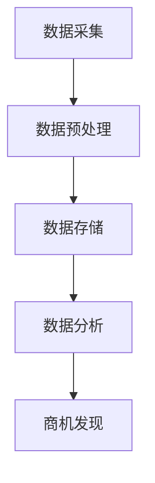

                 

# 《信息差的商机发现之钥：大数据如何发掘隐藏商机》

> **关键词**：大数据、商机发现、信息差、数据挖掘、机器学习

> **摘要**：本文将深入探讨大数据时代如何通过数据挖掘和机器学习技术来发掘隐藏的商机。我们将从信息差的概念入手，分析大数据时代的商机发现策略，并详细介绍相关的技术原理、算法和实践案例，帮助读者理解大数据在现代商业中的应用价值。

---

## 《信息差的商机发现之钥：大数据如何发掘隐藏商机》目录大纲

### 第一部分：导论

#### 1.1 大数据时代与商机发现

##### 1.1.1 大数据的定义与特征
##### 1.1.2 商机发现的重要性
##### 1.1.3 大数据与商业决策

#### 1.2 信息差的概念与应用

##### 1.2.1 信息差的基本概念
##### 1.2.2 信息差在商业中的应用
##### 1.2.3 信息差的挑战与应对

### 第二部分：大数据技术基础

#### 2.1 数据采集与预处理

##### 2.1.1 数据采集的方法与工具
##### 2.1.2 数据清洗与数据转换
##### 2.1.3 数据质量评估与提升

#### 2.2 数据存储与管理

##### 2.2.1 数据库的选择与应用
##### 2.2.2 数据仓库的基本概念与架构
##### 2.2.3 分布式存储与计算

#### 2.3 数据分析与挖掘

##### 2.3.1 数据分析的基本流程
##### 2.3.2 数据挖掘的方法与技术
##### 2.3.3 商机发现的关键要素

### 第三部分：核心算法原理

#### 3.1 统计学原理与应用

##### 3.1.1 常用统计指标的计算
##### 3.1.2 假设检验的方法与实例
##### 3.1.3 相关性与回归分析

#### 3.2 机器学习算法

##### 3.2.1 监督学习与无监督学习
##### 3.2.2 分类与回归算法
##### 3.2.3 聚类分析的方法与应用

#### 3.3 数据挖掘算法

##### 3.3.1 关联规则挖掘
##### 3.3.2 聚类分析
##### 3.3.3 异常检测

### 第四部分：大数据实践

#### 4.1 商业案例分析

##### 4.1.1 成功案例介绍
##### 4.1.2 案例分析过程
##### 4.1.3 案例总结与启示

#### 4.2 商机发现实战

##### 4.2.1 实战项目规划
##### 4.2.2 数据采集与处理
##### 4.2.3 数据分析与挖掘
##### 4.2.4 商机发现与验证

#### 4.3 开发环境搭建与工具使用

##### 4.3.1 开发环境配置
##### 4.3.2 数据处理工具
##### 4.3.3 分析挖掘工具
##### 4.3.4 商机发现工具

### 第五部分：扩展知识

#### 5.1 大数据伦理与隐私保护

##### 5.1.1 大数据伦理问题
##### 5.1.2 隐私保护法律法规
##### 5.1.3 数据安全与隐私保护技术

#### 5.2 未来发展趋势

##### 5.2.1 大数据技术的演进
##### 5.2.2 商机发现新方法
##### 5.2.3 商业模式创新

### 附录

#### 附录 A：大数据技术资源汇总

##### A.1 开源工具与库
##### A.2 商业解决方案
##### A.3 学习资源推荐

---

### 目录大纲说明

本文的目录结构旨在帮助读者系统地了解大数据在商机发现中的应用。从导论开始，我们首先介绍了大数据的定义、特征及其在商业决策中的重要性。随后，深入探讨了信息差的概念及其在商业中的应用，包括信息差的挑战和应对策略。

在技术基础部分，我们详细阐述了数据采集与预处理、数据存储与管理、数据分析和挖掘的方法与技术，为后续的算法原理讲解和实践应用打下基础。

核心算法原理部分重点介绍了统计学原理、机器学习算法和数据挖掘算法，并通过伪代码和数学模型详细讲解，帮助读者理解这些算法的原理和实现过程。

大数据实践部分通过商业案例分析和实战项目规划，展示了大数据在商机发现中的实际应用，并结合具体代码解读，使读者能够动手实践并理解商机发现的过程。

扩展知识部分关注大数据伦理与隐私保护问题，探讨未来发展趋势，为读者提供更全面的视角。最后，附录部分汇总了大数据技术资源，便于读者进一步学习和应用。

---

接下来，我们将逐步深入每个章节，详细探讨大数据在商机发现中的应用。

---

## 第一部分：导论

### 1.1 大数据时代与商机发现

#### 1.1.1 大数据的定义与特征

大数据（Big Data）是指无法使用常规软件工具在合理时间内进行捕捉、管理和处理的数据集合。这些数据通常具有四个显著特征，即“4V”：Volume（大量）、Velocity（高速）、Variety（多样性）和 Veracity（真实性）。

- **Volume**：数据量大，通常以 TB 或 PB 为单位存储。
- **Velocity**：数据产生和处理的速度快，要求实时或近实时处理。
- **Variety**：数据类型多样，包括结构化、半结构化和非结构化数据。
- **Veracity**：数据真实性，包括数据准确性、完整性和可靠性。

大数据的这些特征使其在商业决策中具有重要意义。传统的数据分析方法难以应对大数据的规模和复杂性，因此需要新的技术和方法来挖掘数据中的价值。

#### 1.1.2 商机发现的重要性

商机发现是企业在竞争激烈的市场环境中取得成功的关键。通过挖掘和分析大数据，企业可以：

1. **了解市场需求**：通过分析消费者行为和市场趋势，企业可以更好地了解市场需求，从而调整产品策略和营销策略。
2. **优化决策过程**：大数据分析可以帮助企业在决策过程中减少不确定性，提高决策的准确性和效率。
3. **提升客户体验**：通过分析用户行为数据，企业可以提供个性化服务，提升客户满意度和忠诚度。
4. **发现潜在商机**：大数据技术可以帮助企业识别潜在的客户群体和市场机会，从而开拓新的业务领域。

#### 1.1.3 大数据与商业决策

大数据技术为商业决策提供了新的视角和工具。通过数据挖掘和分析，企业可以：

- **市场预测**：利用历史数据和市场趋势，预测未来市场变化，为产品研发、库存管理和市场营销提供依据。
- **风险控制**：通过分析数据，企业可以识别潜在风险，采取预防措施，降低运营风险。
- **客户细分**：根据客户行为和购买习惯，将客户分为不同群体，实施有针对性的营销策略。
- **供应链优化**：通过分析供应链数据，优化库存管理和物流配送，提高供应链效率。

大数据时代，信息差成为了企业竞争的新战场。企业需要充分利用大数据技术，挖掘数据中的潜在价值，从而在市场中占据有利地位。

---

在下一部分中，我们将探讨信息差的概念及其在商业中的应用。

---

## 第一部分：导论

### 1.2 信息差的概念与应用

#### 1.2.1 信息差的基本概念

信息差是指不同主体之间在信息获取、处理和利用上的差异。在商业环境中，信息差通常表现为：

- **时间差**：一个企业比另一个企业更早获取市场信息，从而占据先发优势。
- **地域差**：不同地区之间的信息获取和传播速度不同，企业可以利用地域差进行市场布局。
- **知识差**：企业对某一领域知识的掌握程度不同，掌握更丰富知识的企业可以在市场中获得更多机会。

信息差不仅存在于企业之间，也存在于企业和消费者之间。企业需要通过数据分析，发现并利用这些信息差，以实现商业价值。

#### 1.2.2 信息差在商业中的应用

1. **市场调研**：通过大数据分析，企业可以了解消费者需求、市场趋势和竞争对手策略，从而制定更有针对性的市场调研方案。
2. **产品定位**：利用信息差，企业可以识别市场空白，开发具有差异化优势的产品，满足特定客户群体的需求。
3. **价格策略**：通过分析消费者行为数据，企业可以制定更有效的价格策略，提高产品竞争力。
4. **广告投放**：利用信息差，企业可以精准定位目标消费者，提高广告投放的效果。

#### 1.2.3 信息差的挑战与应对

尽管信息差为企业带来了竞争优势，但也存在以下挑战：

- **数据获取困难**：获取高质量的数据是信息差的基础，但数据获取过程中可能面临法律、技术和道德方面的挑战。
- **数据分析复杂**：大数据分析技术复杂，企业需要投入大量资源进行技术研发和人才培养。
- **信息过载**：海量数据中，有价值的信息往往被冗余数据所淹没，企业需要有效筛选和提取关键信息。

应对这些挑战，企业可以采取以下策略：

1. **数据合规**：确保数据获取和处理符合法律法规，避免潜在的法律风险。
2. **技术投资**：加大技术研发投入，引进先进的分析工具和算法。
3. **人才培养**：建立专业的数据分析团队，提高数据分析能力。
4. **数据治理**：建立完善的数据治理体系，确保数据的准确性、完整性和安全性。

通过利用信息差，企业可以在市场中占据优势地位，实现可持续发展。在下一部分中，我们将探讨大数据技术基础，为后续章节的讨论奠定基础。

---

在接下来的部分中，我们将深入探讨大数据技术的基础，包括数据采集、预处理、存储与管理，以及数据分析和挖掘的基本流程。

---

## 第二部分：大数据技术基础

### 2.1 数据采集与预处理

#### 2.1.1 数据采集的方法与工具

数据采集是大数据技术的基础。以下是一些常见的数据采集方法与工具：

1. **Web采集**：通过网络爬虫技术，自动获取互联网上的公开数据。常用的工具包括 Python 的 `requests` 和 `BeautifulSoup` 库。
2. **API采集**：通过应用程序接口（API）获取第三方数据服务提供的数据。例如，使用 `requests` 库调用第三方 API。
3. **日志采集**：从系统日志中提取数据，用于分析系统性能和用户行为。常用的工具包括 Logstash、Fluentd 等。
4. **数据库采集**：从关系型数据库或NoSQL数据库中提取数据。常用的工具包括 `MySQL`、`MongoDB` 等。

#### 2.1.2 数据清洗与数据转换

数据清洗是确保数据质量的重要步骤。以下是一些常见的数据清洗方法：

1. **去除重复数据**：识别并删除重复的数据记录。
2. **处理缺失值**：对缺失的数据进行填充或删除。
3. **格式化数据**：统一数据格式，例如，将日期格式化成标准格式。
4. **异常值处理**：识别并处理异常值，例如，使用统计学方法检测并处理离群点。

数据转换是将数据从一种格式转换为另一种格式的过程。常见的数据转换包括：

1. **数据编码**：将分类数据转换为数值编码，例如，使用独热编码（One-Hot Encoding）。
2. **特征工程**：提取新的特征，提高模型性能，例如，计算数据的相关性、构建交叉特征等。

#### 2.1.3 数据质量评估与提升

数据质量评估是确保数据可用于分析和决策的关键步骤。以下是一些常见的数据质量评估方法：

1. **完整性评估**：检查数据是否有缺失值或异常值。
2. **一致性评估**：检查数据在不同来源之间是否一致。
3. **准确性评估**：检查数据的准确性，例如，与真实数据进行比对。
4. **可靠性评估**：检查数据的可靠性和一致性。

数据质量提升方法包括：

1. **数据清洗**：通过去除重复数据、处理缺失值和异常值，提高数据质量。
2. **数据整合**：合并来自多个源的数据，消除数据冗余。
3. **数据标准化**：将不同单位或格式统一为标准格式。

---

在下一节中，我们将探讨数据存储与管理的基本概念和架构。

---

### 2.2 数据存储与管理

#### 2.2.1 数据库的选择与应用

数据存储是大数据技术的重要环节。以下是一些常见的数据存储解决方案：

1. **关系型数据库**：如 MySQL、PostgreSQL，适用于存储结构化数据。
2. **NoSQL数据库**：如 MongoDB、Cassandra，适用于存储半结构化和非结构化数据。
3. **数据仓库**：如 Amazon Redshift、Google BigQuery，适用于大规模数据存储和分析。

**关系型数据库**：具有强一致性、事务支持等特点，适用于需要高可靠性和事务性数据的应用场景。例如，用于存储用户信息和订单数据。

**NoSQL数据库**：具有高可扩展性、低延迟等特点，适用于高并发、海量数据的场景。例如，用于存储日志数据和社交网络数据。

**数据仓库**：提供强大的数据处理和分析能力，适用于企业级数据仓库和大数据分析场景。例如，用于进行数据汇总和分析。

#### 2.2.2 数据仓库的基本概念与架构

数据仓库（Data Warehouse）是一种用于存储、管理和分析大量数据的数据库系统。其基本概念包括：

- **数据源**：数据仓库的数据来源，可以是关系型数据库、NoSQL数据库或其他外部系统。
- **数据集成**：将来自多个数据源的数据进行整合，消除数据冗余，实现数据一致性。
- **数据建模**：设计数据仓库的架构，包括数据存储模型、数据关系模型等。
- **数据加载**：将数据从源系统加载到数据仓库中，包括全量加载和增量加载。

数据仓库的架构通常包括以下层次：

1. **数据源层**：包括关系型数据库、NoSQL数据库、外部系统等。
2. **数据集成层**：实现数据的抽取、清洗、转换和加载。
3. **数据仓库层**：存储经过处理的数据，通常采用分布式存储架构。
4. **数据访问层**：提供数据查询和分析功能，支持 BI 工具和数据分析平台。

#### 2.2.3 分布式存储与计算

分布式存储与计算是大数据技术的重要特征。以下是一些关键技术：

1. **分布式文件系统**：如 Hadoop Distributed File System (HDFS)，用于存储海量数据。
2. **分布式数据库**：如 Cassandra、HBase，适用于高并发、海量数据的场景。
3. **分布式计算框架**：如 Apache Spark、Flink，提供高性能的分布式数据处理能力。

分布式存储与计算的优势包括：

- **高扩展性**：可以轻松扩展存储和处理能力，满足不断增长的数据需求。
- **高可用性**：通过数据冗余和故障转移机制，确保系统的高可用性。
- **高性能**：通过并行处理和数据本地化，提高数据处理速度。

---

在下一节中，我们将探讨数据分析和挖掘的基本流程。

---

### 2.3 数据分析与挖掘

#### 2.3.1 数据分析的基本流程

数据分析是大数据技术的重要组成部分。以下是一个基本的数据分析流程：

1. **数据收集**：从各种数据源收集数据，包括结构化数据、半结构化数据和非结构化数据。
2. **数据预处理**：清洗、转换和整合数据，确保数据质量。
3. **数据探索**：使用可视化工具和统计方法，探索数据的基本特征和趋势。
4. **数据建模**：选择合适的数据模型，建立预测模型或分类模型。
5. **模型评估**：评估模型性能，包括准确性、召回率、F1 分数等。
6. **模型应用**：将模型应用到实际业务场景，进行预测或决策。

#### 2.3.2 数据挖掘的方法与技术

数据挖掘是数据分析的高级阶段，旨在从大量数据中发现隐藏的模式和知识。以下是一些常见的数据挖掘方法：

1. **关联规则挖掘**：发现数据项之间的关联关系，如购物篮分析。
2. **聚类分析**：将相似的数据项分为不同的组，用于市场细分或客户分类。
3. **分类与回归分析**：建立预测模型，用于分类或回归任务。
4. **异常检测**：识别数据中的异常或离群点，用于风险管理或欺诈检测。

#### 2.3.3 商机发现的关键要素

在数据分析中，商机发现是一个重要的目标。以下是一些关键要素：

1. **数据质量**：确保数据准确、完整和可靠，是商机发现的基础。
2. **数据多样性**：多样化的数据源和类型可以帮助发现更广泛的商机。
3. **数据探索**：通过探索性数据分析，发现潜在的商业问题和机会。
4. **模型选择**：选择合适的模型和方法，提高商机发现的准确性和效率。
5. **决策支持**：利用数据挖掘结果，支持业务决策和战略规划。

---

在下一节中，我们将介绍统计学原理及其在数据分析中的应用。

---

### 3.1 统计学原理与应用

统计学是数据分析的重要基础，通过统计学方法，我们可以从数据中提取有价值的信息，并做出科学的决策。以下是一些常用的统计学原理和其在数据分析中的应用：

#### 3.1.1 常用统计指标的计算

1. **平均数（Mean）**：一组数据的平均值，计算公式为：
   $$
   \bar{x} = \frac{1}{n} \sum_{i=1}^{n} x_i
   $$
   其中，$x_i$ 为每个数据点，$n$ 为数据点的总数。

2. **中位数（Median）**：将一组数据从小到大排序，位于中间位置的数值。如果数据个数为奇数，则中位数即为中间的数值；如果数据个数为偶数，则中位数为中间两个数值的平均值。

3. **众数（Mode）**：一组数据中出现次数最多的数值。在某些数据集中可能没有众数，也可能有多个众数。

4. **方差（Variance）**：描述一组数据的离散程度，计算公式为：
   $$
   \sigma^2 = \frac{1}{n} \sum_{i=1}^{n} (x_i - \bar{x})^2
   $$
   其中，$\bar{x}$ 为平均数，$x_i$ 为每个数据点，$n$ 为数据点的总数。

5. **标准差（Standard Deviation）**：方差的平方根，用于衡量数据的波动程度，计算公式为：
   $$
   \sigma = \sqrt{\sigma^2}
   $$

#### 3.1.2 假设检验的方法与实例

假设检验是统计学中用于判断数据是否支持某一假设的方法。常见的假设检验方法包括 t 检验、卡方检验和方差分析（ANOVA）。

**实例：t 检验**

假设我们想要比较两组数据的平均值是否相等。首先，我们需要提出两个假设：

- **零假设（H0）**：两组数据的平均值相等。
- **备择假设（H1）**：两组数据的平均值不相等。

然后，通过计算 t 统计量，我们可以判断数据是否支持零假设。t 统计量的计算公式为：
$$
t = \frac{\bar{x}_1 - \bar{x}_2}{\sqrt{\frac{s_1^2}{n_1} + \frac{s_2^2}{n_2}}}
$$
其中，$\bar{x}_1$ 和 $\bar{x}_2$ 分别为两组数据的平均值，$s_1^2$ 和 $s_2^2$ 分别为两组数据的方差，$n_1$ 和 $n_2$ 分别为两组数据的样本量。

根据计算得到的 t 统计量，我们可以查表得到 p 值，如果 p 值小于显著性水平（通常为 0.05），则拒绝零假设，接受备择假设，认为两组数据的平均值不相等。

#### 3.1.3 相关性与回归分析

相关性分析用于判断两个变量之间的线性关系，常用的相关系数包括皮尔逊相关系数（Pearson Correlation Coefficient）和斯皮尔曼相关系数（Spearman Rank Correlation Coefficient）。

1. **皮尔逊相关系数**：计算公式为：
   $$
   r = \frac{\sum_{i=1}^{n} (x_i - \bar{x})(y_i - \bar{y})}{\sqrt{\sum_{i=1}^{n} (x_i - \bar{x})^2 \sum_{i=1}^{n} (y_i - \bar{y})^2}}
   $$
   其中，$x_i$ 和 $y_i$ 分别为两个变量的观测值，$\bar{x}$ 和 $\bar{y}$ 分别为两个变量的平均值。

2. **斯皮尔曼相关系数**：适用于非参数数据，计算公式为：
   $$
   \rho = \frac{1}{n-1} \sum_{i=1}^{n} (x_i - \bar{x})(y_i - \bar{y})
   $$

回归分析用于建立自变量和因变量之间的数学关系模型。常见的回归分析方法包括线性回归、多项式回归和逻辑回归。

1. **线性回归**：用于建立自变量和因变量之间的线性关系，模型公式为：
   $$
   y = \beta_0 + \beta_1x
   $$
   其中，$y$ 为因变量，$x$ 为自变量，$\beta_0$ 和 $\beta_1$ 分别为回归系数。

2. **多项式回归**：用于建立自变量和因变量之间的多项式关系，模型公式为：
   $$
   y = \beta_0 + \beta_1x + \beta_2x^2 + \cdots + \beta_nx^n
   $$

3. **逻辑回归**：用于建立自变量和因变量之间的逻辑关系，模型公式为：
   $$
   \log\frac{P(Y=1)}{1-P(Y=1)} = \beta_0 + \beta_1x
   $$
   其中，$Y$ 为因变量，$x$ 为自变量，$P(Y=1)$ 为因变量取值为 1 的概率。

通过统计学原理的应用，我们可以更好地理解数据之间的相关性，建立预测模型，支持业务决策。在下一节中，我们将介绍机器学习算法的基本原理和应用。

---

在接下来的部分中，我们将探讨机器学习算法的基本原理，包括监督学习和无监督学习。

---

### 3.2 机器学习算法

机器学习（Machine Learning，ML）是人工智能（Artificial Intelligence，AI）的一个重要分支，其核心思想是通过算法从数据中自动学习规律和模式，从而进行预测和决策。机器学习算法可以分为监督学习（Supervised Learning）、无监督学习（Unsupervised Learning）和半监督学习（Semi-Supervised Learning）。以下分别介绍这三种学习类型及其典型算法。

#### 3.2.1 监督学习与无监督学习

**监督学习**：监督学习是一种有标注数据的学习方法，算法通过训练数据集学习输入和输出之间的关系，并利用这种关系对新数据进行预测。监督学习可分为分类（Classification）和回归（Regression）两大类。

- **分类**：分类算法的目标是将输入数据分类到不同的类别中。常见的分类算法包括逻辑回归（Logistic Regression）、决策树（Decision Tree）、支持向量机（Support Vector Machine，SVM）、随机森林（Random Forest）和梯度提升树（Gradient Boosting Tree，GBT）等。
  
  **逻辑回归**：逻辑回归是一种广义线性模型，用于分类任务。其目标是通过建立输入变量和输出变量之间的逻辑关系，从而预测新样本的类别。

  伪代码：
  ```python
  // 初始化模型参数
  Initialize parameters theta

  // 循环迭代
  for i = 1 to max_iterations do
      // 计算损失函数
      cost = ComputeCost(X, y, theta)

      // 更新参数
      theta = theta - alpha * (2/m) * (X * theta - y)

      // 输出损失函数值
      print(i, cost)
  end
  ```

- **回归**：回归算法的目标是预测连续数值型的输出。常见的回归算法包括线性回归（Linear Regression）、多项式回归（Polynomial Regression）和回归树（Regression Tree）等。

  **线性回归**：线性回归是最简单和最常用的回归算法，其目标是通过建立线性关系预测输出值。

  数学模型：
  $$
  \hat{y} = \beta_0 + \beta_1x
  $$
  其中，$\hat{y}$ 为预测值，$\beta_0$ 和 $\beta_1$ 分别为回归系数。

**无监督学习**：无监督学习是一种无标注数据的学习方法，算法通过分析数据自身的结构和模式，从而发现数据中的规律。无监督学习可分为聚类（Clustering）、降维（Dimensionality Reduction）和关联规则挖掘（Association Rule Mining）等。

- **聚类**：聚类算法的目标是将数据点分为不同的组，使得同一组内的数据点彼此相似，而不同组的数据点差异较大。常见的聚类算法包括 k-均值聚类（K-Means Clustering）、层次聚类（Hierarchical Clustering）和密度聚类（Density-Based Clustering）等。

  **k-均值聚类**：k-均值聚类是一种基于距离的聚类算法，其目标是将数据点分为 k 个簇，使得每个簇的中心尽量接近。

  伪代码：
  ```python
  // 初始化聚类中心
  Initialize centroids

  // 循环迭代
  for i = 1 to max_iterations do
      // 计算每个数据点到聚类中心的距离
      distances = CalculateDistances(data, centroids)

      // 将数据点分配到最近的聚类中心
      assignments = AssignPointsToClusters(data, distances)

      // 更新聚类中心
      centroids = UpdateCentroids(data, assignments)

      // 输出聚类结果
      print(i, centroids)
  end
  ```

- **降维**：降维算法的目标是减少数据的维度，同时保持数据的本质特征。常见的降维算法包括主成分分析（Principal Component Analysis，PCA）、线性判别分析（Linear Discriminant Analysis，LDA）和自编码器（Autoencoder）等。

  **主成分分析**：主成分分析是一种线性降维方法，其目标是通过正交变换，将原始数据映射到新的坐标系中，使得新的坐标系中前几个主成分能够最大程度地保留原始数据的方差。

  数学模型：
  $$
  Z = PC
  $$
  其中，$Z$ 为新的坐标，$PC$ 为主成分。

- **关联规则挖掘**：关联规则挖掘的目标是从数据中发现有趣的关系或关联。常见的关联规则挖掘算法包括 Apriori 算法、FP-Growth 算法和 Eclat 算法等。

  **Apriori 算法**：Apriori 算法是一种基于支持度和置信度的关联规则挖掘算法，其目标是从大量交易数据中发现频繁项集和关联规则。

  伪代码：
  ```python
  // 计算支持度
  support = CountFrequentItemsets(data)

  // 计算置信度
  confidence = CalculateConfidence(data, frequent_itemsets)

  // 生成关联规则
  rules = GenerateAssociationRules(frequent_itemsets, confidence)

  // 输出规则
  print(rules)
  ```

**半监督学习**：半监督学习是一种结合监督学习和无监督学习的方法，其目标是在仅有少量标注数据的情况下，利用大量无标注数据来提高模型的性能。常见的半监督学习算法包括自编码器（Autoencoder）和图卷积网络（Graph Convolutional Network，GCN）等。

#### 3.2.2 分类与回归算法

**分类算法**：分类算法主要用于将数据分为不同的类别。以下是一些常见的分类算法：

- **决策树**：决策树是一种树形结构，通过一系列的判断条件将数据划分为不同的类别。决策树算法简单、直观，易于理解和解释。
- **支持向量机**：支持向量机是一种基于最大间隔的分类算法，其目标是将数据点划分到不同的类别，使得每个类别之间的间隔最大化。
- **随机森林**：随机森林是一种基于决策树的集成学习方法，通过构建多个决策树并求取平均值来提高模型的泛化能力。

**回归算法**：回归算法主要用于预测连续数值型的输出。以下是一些常见的回归算法：

- **线性回归**：线性回归是一种简单的回归算法，通过建立输入变量和输出变量之间的线性关系来预测输出值。
- **多项式回归**：多项式回归是一种基于多项式的回归算法，通过建立输入变量和输出变量之间的多项式关系来预测输出值。
- **回归树**：回归树是一种树形结构的回归算法，通过一系列的判断条件来预测输出值。

#### 3.2.3 聚类分析的方法与应用

**聚类分析**：聚类分析是一种无监督学习方法，其目标是将数据点分为不同的组，使得同一组内的数据点彼此相似，而不同组的数据点差异较大。以下是一些常见的聚类算法：

- **k-均值聚类**：k-均值聚类是一种基于距离的聚类算法，通过迭代计算聚类中心，将数据点分配到最近的聚类中心，从而实现数据的聚类。
- **层次聚类**：层次聚类是一种基于层次结构的聚类算法，通过合并或分裂已有的聚类来实现数据的聚类。
- **密度聚类**：密度聚类是一种基于密度的聚类算法，通过计算数据点的密度并找到核心点，从而实现数据的聚类。

**聚类分析的应用**：聚类分析在许多领域都有广泛的应用，包括市场细分、社交网络分析、生物信息学等。以下是一些具体的应用场景：

- **市场细分**：通过聚类分析，企业可以将客户分为不同的群体，从而实施有针对性的营销策略。
- **社交网络分析**：通过聚类分析，研究人员可以识别社交网络中的不同社区和群体，从而更好地理解社交网络的结构和演化。
- **生物信息学**：通过聚类分析，生物信息学家可以识别不同基因表达模式，从而揭示生物体的功能和机制。

---

在下一节中，我们将介绍数据挖掘算法，包括关联规则挖掘、聚类分析和异常检测。

---

### 3.3 数据挖掘算法

数据挖掘（Data Mining）是指从大量数据中自动发现有趣的知识和模式的过程。数据挖掘算法可以分为关联规则挖掘（Association Rule Mining）、聚类分析（Clustering）、分类（Classification）和异常检测（Anomaly Detection）等。以下分别介绍这些算法的基本概念和应用。

#### 3.3.1 关联规则挖掘

关联规则挖掘是一种发现数据项之间关联性的方法。它的基本思想是通过分析数据项之间的频繁出现关系，找出满足用户设定的最小支持度和最小置信度的关联规则。常见的算法包括 Apriori 算法、FP-Growth 算法和 Eclat 算法。

**Apriori 算法**：Apriori 算法是一种基于候选集生成的算法，其核心思想是使用频繁项集生成算法来寻找频繁项集，然后利用频繁项集生成关联规则。Apriori 算法的流程如下：

1. **生成候选集**：从原始数据中生成所有可能的两项组合，即候选集。
2. **计算支持度**：对于每个候选集，计算其在数据中的支持度，即包含该候选集的交易数与总交易数之比。
3. **生成频繁项集**：根据最小支持度阈值，筛选出支持度大于阈值的频繁项集。
4. **生成关联规则**：对于每个频繁项集，生成满足最小置信度阈值的关联规则。

伪代码：
```python
// 初始化候选集
candidates = GenerateCandidates(data)

// 循环迭代
for k = 2 to max_length of itemsets do
    // 计算支持度
    support = CalculateSupport(candidates)

    // 生成频繁项集
    frequent_itemsets = GenerateFrequentItemsets(candidates, support)

    // 生成关联规则
    rules = GenerateAssociationRules(frequent_itemsets, min_confidence)

    // 输出规则
    print(rules)
end
```

**FP-Growth 算法**：FP-Growth 算法是一种基于频繁模式树（FP-Tree）的算法，其核心思想是使用 FP-Tree 来压缩和表示频繁项集，从而提高算法的效率。FP-Growth 算法的流程如下：

1. **构建 FP-Tree**：从原始数据中构建 FP-Tree，其中每个节点表示一个数据项，节点的频次表示该数据项在数据中的出现次数。
2. **递归压缩 FP-Tree**：通过递归压缩 FP-Tree，将频繁项集从原始数据中提取出来。
3. **生成关联规则**：根据压缩后的 FP-Tree，生成满足最小支持度和最小置信度的关联规则。

**Eclat 算法**：Eclat 算法是一种基于前件的算法，其核心思想是通过生成项集的前件来寻找频繁项集。Eclat 算法的流程如下：

1. **计算项集的前件**：对于每个项集，计算其在数据中的前件集合。
2. **生成候选集**：基于前件集合，生成所有可能的项集候选集。
3. **计算支持度**：对于每个候选集，计算其在数据中的支持度。
4. **生成频繁项集**：根据最小支持度阈值，筛选出支持度大于阈值的频繁项集。
5. **生成关联规则**：根据频繁项集，生成满足最小置信度阈值的关联规则。

#### 3.3.2 聚类分析

聚类分析是一种无监督学习方法，其目标是将数据点划分为不同的组，使得同一组内的数据点彼此相似，而不同组的数据点差异较大。常见的聚类算法包括 k-均值聚类（K-Means Clustering）、层次聚类（Hierarchical Clustering）和密度聚类（Density-Based Clustering）等。

**k-均值聚类**：k-均值聚类是一种基于距离的聚类算法，其核心思想是通过迭代计算聚类中心，将数据点分配到最近的聚类中心，从而实现数据的聚类。k-均值聚类的流程如下：

1. **初始化聚类中心**：随机选择 k 个数据点作为初始聚类中心。
2. **分配数据点**：计算每个数据点到聚类中心的距离，并将其分配到最近的聚类中心。
3. **更新聚类中心**：重新计算每个聚类中心的平均值，作为新的聚类中心。
4. **迭代收敛**：重复步骤 2 和步骤 3，直到聚类中心不再发生变化或达到最大迭代次数。

**层次聚类**：层次聚类是一种基于层次结构的聚类算法，其核心思想是通过合并或分裂已有的聚类来实现数据的聚类。层次聚类的流程如下：

1. **初始化聚类**：将每个数据点视为一个初始聚类。
2. **合并聚类**：根据数据点之间的距离，选择最近的数据点合并成一个聚类。
3. **更新距离矩阵**：重新计算每个聚类之间的距离矩阵。
4. **分裂聚类**：根据聚类之间的距离矩阵，选择距离较远的聚类进行分裂。
5. **迭代收敛**：重复步骤 2、步骤 3 和步骤 4，直到达到预设的聚类层次或达到最大迭代次数。

**密度聚类**：密度聚类是一种基于密度的聚类算法，其核心思想是通过计算数据点的密度并找到核心点，从而实现数据的聚类。常见的密度聚类算法包括 DBSCAN（Density-Based Spatial Clustering of Applications with Noise）和OPTICS（Ordering Points To Identify the Clustering Structure）等。

**DBSCAN**：DBSCAN（Density-Based Spatial Clustering of Applications with Noise）是一种基于密度的聚类算法，其核心思想是识别核心点并基于密度连接形成聚类。DBSCAN 的主要参数包括最小密度阈值 $\epsilon$ 和最小核心点数量 $minPoints$。

**OPTICS**：OPTICS（Ordering Points To Identify the Clustering Structure）是一种基于密度的聚类算法，其核心思想是通过优化 DBSCAN 的聚类结果，减少噪声点和孤立点的干扰。

#### 3.3.3 异常检测

异常检测是一种用于识别数据中的异常或离群点的方法。常见的异常检测算法包括基于统计学方法、基于聚类方法和基于机器学习方法等。

**基于统计学方法**：基于统计学方法的异常检测算法通过计算数据的统计特征（如均值、方差等），识别出偏离正常范围的异常点。常见的算法包括箱线图法、3-σ法则等。

**基于聚类方法**：基于聚类方法的异常检测算法通过比较数据点到聚类中心的距离，识别出远离聚类中心的异常点。常见的算法包括 k-均值聚类、DBSCAN 等。

**基于机器学习方法**：基于机器学习方法的异常检测算法通过训练模型，识别出正常数据和异常数据。常见的算法包括监督学习算法（如决策树、支持向量机等）和无监督学习算法（如自编码器、孤立森林等）。

**孤立森林（Isolation Forest）**：孤立森林是一种基于随机森林的异常检测算法，其核心思想是通过随机选取特征和切分值，将数据点隔离成独立的树结构，然后根据树的高度识别出异常点。

**自编码器（Autoencoder）**：自编码器是一种基于神经网络的异常检测算法，其核心思想是通过训练自编码器模型，将输入数据映射到低维空间，然后识别出无法重构的异常点。

---

在下一节中，我们将通过商业案例展示大数据在商机发现中的应用。

---

## 第四部分：大数据实践

### 4.1 商业案例分析

#### 4.1.1 成功案例介绍

在电子商务领域，阿里巴巴是一家利用大数据技术进行商机发现和商业决策的领先企业。通过其大数据平台“淘宝指数”，阿里巴巴能够实时监测和分析消费者的购物行为，从而发现潜在商机。

#### 4.1.2 案例分析过程

1. **数据采集**：阿里巴巴通过电商平台收集大量用户行为数据，包括搜索关键词、购买记录、浏览历史等。

2. **数据预处理**：对采集到的数据进行清洗、去重和格式化，确保数据质量。

3. **数据存储与管理**：利用分布式数据库和数据仓库技术，存储和管理海量数据。

4. **数据分析**：通过数据挖掘算法，分析用户行为数据，识别出潜在的市场趋势和消费需求。

5. **商机发现**：基于分析结果，阿里巴巴发现了一些特定商品或服务的市场需求，从而调整其营销策略和商品推荐。

#### 4.1.3 案例总结与启示

阿里巴巴的成功案例表明，大数据技术能够帮助企业快速、准确地发现商机，优化商业决策。以下是一些关键启示：

- **数据驱动**：企业应建立以数据为核心的商业决策体系，充分利用大数据分析结果。
- **实时监测**：实时监测市场动态和消费者行为，能够帮助企业快速响应市场变化。
- **个性化推荐**：基于大数据分析，提供个性化的产品推荐和服务，提高客户满意度和忠诚度。
- **风险控制**：通过数据分析，识别潜在的市场风险，采取预防措施。

### 4.2 商机发现实战

#### 4.2.1 实战项目规划

假设我们是一家电商公司，希望利用大数据技术发现潜在商机，以下是我们项目的规划步骤：

1. **需求分析**：明确项目目标，例如，发现特定商品类别的潜在需求。
2. **数据采集**：确定数据来源，包括电商平台、社交媒体等。
3. **数据预处理**：清洗和整合数据，确保数据质量。
4. **数据存储与管理**：选择合适的存储和管理方案，例如，使用分布式数据库和数据仓库。
5. **数据分析与挖掘**：应用数据挖掘算法，分析用户行为和市场趋势。
6. **商机发现与验证**：根据分析结果，验证潜在商机，制定相应策略。
7. **项目评估与优化**：评估项目效果，持续优化商业决策。

#### 4.2.2 数据采集与处理

1. **数据采集**：从电商平台获取用户购买记录、搜索关键词、浏览历史等数据。
2. **数据预处理**：
   - 数据清洗：去除空值、重复数据和异常值。
   - 数据转换：将分类数据转换为编码形式，如独热编码。
   - 数据整合：将来自不同来源的数据进行整合，形成统一的数据集。

#### 4.2.3 数据分析与挖掘

1. **关联规则挖掘**：使用 Apriori 算法或 FP-Growth 算法，挖掘用户购买行为中的关联规则。
2. **聚类分析**：使用 k-均值聚类或 DBSCAN 算法，分析用户群体特征和需求。
3. **分类与回归分析**：使用逻辑回归或决策树模型，预测用户购买行为和市场需求。

#### 4.2.4 商机发现与验证

1. **商机发现**：根据分析结果，识别潜在商机，如特定商品类别的需求增长。
2. **验证**：通过市场调研、实验验证等方式，验证潜在商机的可行性和效果。
3. **策略制定**：根据验证结果，制定相应的营销策略和商品推荐策略。

#### 4.2.5 代码解读与分析

以下是一个基于 Python 的 Apriori 算法的示例代码，用于挖掘用户购买行为中的关联规则：

```python
import pandas as pd
from mlxtend.frequent_patterns import apriori
from mlxtend.frequent_patterns import association_rules

# 读取数据
data = pd.read_csv('ecommerce_data.csv')

# 数据清洗
data.dropna(inplace=True)
data.drop_duplicates(inplace=True)

# 数据转换
data['category'] = pd.factorize(data['category'])[0]

# 使用 Apriori 算法挖掘关联规则
frequent_itemsets = apriori(data, min_support=0.05, use_colnames=True)

# 生成关联规则
rules = association_rules(frequent_itemsets, metric="confidence", min_threshold=0.5)

# 分析规则
print(rules.head())
```

- **数据读取**：读取电商平台的用户购买记录数据。
- **数据清洗**：去除空值和重复数据。
- **数据转换**：将分类数据转换为编码形式。
- **关联规则挖掘**：使用 Apriori 算法挖掘频繁项集。
- **生成关联规则**：根据频繁项集，生成满足最小置信度阈值的关联规则。
- **分析规则**：打印并分析前几条关联规则。

通过上述代码，我们可以发现用户在购买某些商品时，可能也会购买其他商品，从而为电商平台的商品推荐和营销策略提供数据支持。

---

在接下来的部分中，我们将介绍开发环境搭建和工具使用。

---

### 4.3 开发环境搭建与工具使用

在进行大数据商机发现项目时，开发环境搭建和工具选择是至关重要的。以下是一些常见的环境配置和工具使用指南。

#### 4.3.1 开发环境配置

1. **Python环境安装**：Python 是进行大数据分析和数据挖掘的常用语言。可以通过以下命令安装 Python：
   ```bash
   # 在 Ubuntu 系统中
   sudo apt-get install python3 python3-pip

   # 在 Windows 系统中
   # 访问 https://www.python.org/downloads/ 下载并安装 Python
   ```

2. **pip 安装**：pip 是 Python 的包管理器，用于安装和管理第三方库。可以通过以下命令安装 pip：
   ```bash
   # 在 Ubuntu 系统中
   sudo apt-get install python3-pip

   # 在 Windows 系统中
   # 已在 Python 安装过程中自动安装
   ```

3. **安装常用库**：安装用于数据分析和数据挖掘的常用库，如 Pandas、NumPy、Scikit-learn 等：
   ```bash
   pip install pandas numpy scikit-learn
   ```

#### 4.3.2 数据处理工具

1. **Pandas**：Pandas 是 Python 中的数据操作库，用于数据处理、数据清洗和数据转换。常见操作包括数据读取、数据清洗、数据转换和数据合并等。

   ```python
   import pandas as pd

   # 数据读取
   df = pd.read_csv('ecommerce_data.csv')

   # 数据清洗
   df.dropna(inplace=True)
   df.drop_duplicates(inplace=True)

   # 数据转换
   df['category'] = pd.factorize(df['category'])[0]
   ```

2. **NumPy**：NumPy 是 Python 中的科学计算库，提供高性能的数组操作和数据计算功能。NumPy 数组是进行大数据处理的基础。

   ```python
   import numpy as np

   # 创建 NumPy 数组
   arr = np.array([1, 2, 3, 4, 5])

   # 数组操作
   sum(arr)
   mean(arr)
   std(arr)
   ```

3. **Scikit-learn**：Scikit-learn 是 Python 中的机器学习库，提供各种机器学习算法的实现和工具。常见算法包括分类、回归、聚类和异常检测等。

   ```python
   from sklearn.ensemble import RandomForestClassifier

   # 创建分类器
   clf = RandomForestClassifier()

   # 训练模型
   clf.fit(X_train, y_train)

   # 预测
   predictions = clf.predict(X_test)
   ```

#### 4.3.3 分析挖掘工具

1. **MLxtend**：MLxtend 是 Python 中用于机器学习扩展的库，提供各种数据预处理、模型评估和模型选择工具。常见的工具包括关联规则挖掘、聚类分析、分类算法和回归算法等。

   ```python
   from mlxtend.frequent_patterns import apriori
   from mlxtend.frequent_patterns import association_rules

   # 使用 Apriori 算法挖掘关联规则
   frequent_itemsets = apriori(data, min_support=0.05, use_colnames=True)

   # 生成关联规则
   rules = association_rules(frequent_itemsets, metric="confidence", min_threshold=0.5)
   ```

2. **SciPy**：SciPy 是 Python 中的科学计算库，提供各种数学函数和科学计算工具，如线性代数、概率统计、优化等。

   ```python
   from scipy.stats import norm

   # 计算正态分布的概率
   norm.cdf(0.5)
   ```

3. **Matplotlib**：Matplotlib 是 Python 中的数据可视化库，用于生成各种图表和图形，帮助分析数据。

   ```python
   import matplotlib.pyplot as plt

   # 生成散点图
   plt.scatter(x, y)
   plt.show()
   ```

#### 4.3.4 商机发现工具

1. **GluonCV**：GluonCV 是 Apache MXNet 的计算机视觉库，提供各种深度学习模型和工具，如卷积神经网络（CNN）、目标检测和图像分割等。

   ```python
   from gluoncv import model_zoo, data

   # 加载预训练的卷积神经网络
   net = model_zoo.get_model('resnet18_v1', pretrained=True)

   # 加载数据集
   train_data = data XM({
       "path" : "path/to/train/dataset",
       "transform" : data.Vision transforms.VisionTransform(
           normalize=[0.485, 0.456, 0.406],
           std=[0.229, 0.224, 0.225])
   })
   ```

2. **TensorFlow**：TensorFlow 是 Google 开发的一款开源深度学习框架，提供丰富的模型和工具，支持各种机器学习和深度学习任务。

   ```python
   import tensorflow as tf

   # 定义模型
   model = tf.keras.Sequential([
       tf.keras.layers.Dense(128, activation='relu'),
       tf.keras.layers.Dense(10, activation='softmax')
   ])

   # 训练模型
   model.compile(optimizer='adam',
                 loss='categorical_crossentropy',
                 metrics=['accuracy'])

   # 训练数据
   model.fit(x_train, y_train, batch_size=32, epochs=10)
   ```

通过上述开发环境搭建和工具使用，我们可以有效地进行大数据商机发现项目，实现数据分析和挖掘的目标。

---

## 第五部分：扩展知识

### 5.1 大数据伦理与隐私保护

随着大数据技术的广泛应用，大数据伦理和隐私保护问题日益凸显。以下是一些关键概念和策略：

#### 5.1.1 大数据伦理问题

1. **数据滥用**：企业可能滥用用户数据，进行不当的营销活动或侵犯用户隐私。
2. **数据泄露**：数据泄露可能导致用户隐私信息被不法分子获取，造成严重后果。
3. **算法歧视**：基于大数据分析的算法可能存在歧视性偏见，如性别、年龄、种族等方面的歧视。

#### 5.1.2 隐私保护法律法规

1. **GDPR**：欧盟的《通用数据保护条例》（General Data Protection Regulation，GDPR）是一部重要的隐私保护法律法规，规定了数据处理的合法性和透明度。
2. **CCPA**：美国的《加州消费者隐私法案》（California Consumer Privacy Act，CCPA）保护加州居民的隐私权，规定了数据收集、使用和共享的要求。

#### 5.1.3 数据安全与隐私保护技术

1. **数据加密**：使用加密技术对敏感数据进行加密，确保数据在传输和存储过程中的安全性。
2. **匿名化**：通过匿名化技术，将数据中的个人身份信息去除，降低隐私泄露风险。
3. **访问控制**：通过访问控制机制，确保只有授权用户才能访问敏感数据。
4. **安全审计**：定期进行安全审计，检测潜在的安全漏洞，及时采取措施进行修复。

---

### 5.2 未来发展趋势

大数据技术的发展趋势将继续深化和扩展，以下是几个关键方向：

#### 5.2.1 大数据技术的演进

1. **实时数据处理**：随着物联网和移动设备的普及，实时数据处理将变得更加重要，为企业提供即时决策支持。
2. **多模态数据融合**：结合结构化和非结构化数据，实现多模态数据的融合和分析，提高数据价值。
3. **增强分析能力**：通过更先进的机器学习和深度学习算法，提高数据分析的准确性和智能化程度。

#### 5.2.2 商机发现新方法

1. **预测分析**：利用预测模型，提前识别潜在商机和市场趋势，为企业提供前瞻性的决策支持。
2. **社会网络分析**：通过分析社交媒体和在线社区的数据，了解用户偏好和行为，发现新的商机。
3. **自然语言处理**：利用自然语言处理技术，从文本数据中提取有价值的信息，支持商业决策和文本分析。

#### 5.2.3 商业模式创新

1. **共享经济**：通过大数据分析，优化资源配置，实现共享经济的商业模式创新。
2. **个性化服务**：基于大数据分析，提供个性化产品推荐和定制服务，提高客户满意度和忠诚度。
3. **数据驱动决策**：利用大数据分析结果，实现数据驱动决策，提高企业的运营效率和竞争力。

---

通过上述扩展知识和未来发展趋势，我们可以更好地理解大数据在商业中的应用，为未来的商业决策和技术创新提供方向。

---

## 附录 A：大数据技术资源汇总

### A.1 开源工具与库

1. **Apache Hadoop**：一个分布式数据处理框架，用于大规模数据的存储和处理。
   - 官网：[Apache Hadoop](https://hadoop.apache.org/)
   - 下载：[Apache Hadoop Downloads](https://hadoop.apache.org/downloads.html)

2. **Apache Spark**：一个快速且通用的分布式计算引擎，支持内存计算和大数据处理。
   - 官网：[Apache Spark](https://spark.apache.org/)
   - 下载：[Apache Spark Downloads](https://spark.apache.org/downloads.html)

3. **Apache Flink**：一个流处理和批处理框架，提供实时数据处理能力。
   - 官网：[Apache Flink](https://flink.apache.org/)
   - 下载：[Apache Flink Downloads](https://flink.apache.org/downloads.html)

4. **Pandas**：Python 的数据操作库，用于数据清洗、转换和分析。
   - 官网：[Pandas](https://pandas.pydata.org/)
   - 下载：[Pandas Downloads](https://pandas.pydata.org/download/)

5. **Scikit-learn**：Python 的机器学习库，提供各种机器学习算法和工具。
   - 官网：[Scikit-learn](https://scikit-learn.org/)
   - 下载：[Scikit-learn Downloads](https://scikit-learn.org/stable/install/)

### A.2 商业解决方案

1. **Amazon Web Services (AWS)**：提供一系列大数据处理和分析工具和服务。
   - 官网：[AWS](https://aws.amazon.com/)
   - 服务：[AWS Big Data](https://aws.amazon.com/big-data/)

2. **Google Cloud Platform (GCP)**：提供大数据分析和机器学习工具，支持实时数据处理。
   - 官网：[Google Cloud](https://cloud.google.com/)
   - 服务：[Google Cloud Big Data](https://cloud.google.com/big-data/)

3. **Microsoft Azure**：提供大数据存储、处理和分析服务，支持混合云和多云架构。
   - 官网：[Azure](https://azure.microsoft.com/)
   - 服务：[Azure Big Data](https://azure.microsoft.com/services/big-data/)

### A.3 学习资源推荐

1. **《大数据时代：生活、工作与思维的大变革》**：作者：维克托·迈尔-舍恩伯格、肯尼斯·库克耶
   - 简介：深入探讨大数据对社会、商业和生活的深远影响。

2. **《深度学习》**：作者：伊恩·古德费洛、约书亚·本吉奥、亚伦·库维尔
   - 简介：全面介绍深度学习的基本原理、算法和应用。

3. **《Python数据分析：使用Pandas、NumPy和Matplotlib》**：作者：韦斯·麦金尼
   - 简介：详细讲解 Python 在数据分析中的应用，涵盖数据操作、可视化和机器学习。

4. **《大数据技术导论》**：作者：刘铁岩
   - 简介：介绍大数据技术的基本概念、方法和应用，适合大数据入门者阅读。

通过这些开源工具、商业解决方案和学习资源，读者可以更深入地了解大数据技术的应用和未来发展。

---

## Mermaid 流程图

以下是一个 Mermaid 流程图，用于展示数据挖掘的基本流程：



- **A 数据采集**：从各种数据源收集数据。
- **B 数据预处理**：清洗、转换和整合数据。
- **C 数据存储**：将预处理后的数据存储在数据库或数据仓库中。
- **D 数据分析**：使用数据挖掘算法分析数据，提取有价值的信息。
- **E 商机发现**：基于分析结果，发现潜在的商业机会。

---

## 核心算法原理讲解

### 3.2.1 监督学习算法伪代码

以下是一个监督学习算法的伪代码，用于分类任务：

```python
// 初始化模型参数
Initialize parameters theta

// 循环迭代
for i = 1 to max_iterations do
    // 计算损失函数
    cost = ComputeCost(X, y, theta)

    // 更新参数
    theta = theta - alpha * (2/m) * (X * theta - y)

    // 输出损失函数值
    print(i, cost)
end
```

- **初始化模型参数**：随机初始化模型参数 $\theta$。
- **循环迭代**：重复以下步骤直到达到最大迭代次数：
  - **计算损失函数**：计算当前模型参数下的损失函数值，通常使用均方误差（MSE）或交叉熵损失。
  - **更新参数**：使用梯度下降法更新模型参数，减小损失函数值。
  - **输出损失函数值**：输出当前迭代次数和对应的损失函数值，用于监控模型训练过程。

### 3.1.1 回归分析公式

回归分析是一种用于预测连续数值型输出的方法，其基本公式如下：

$$
\hat{y} = \beta_0 + \beta_1x
$$

其中：
- $\hat{y}$：预测值。
- $\beta_0$：截距。
- $\beta_1$：斜率。
- $x$：自变量。

在回归分析中，我们通过训练数据集来估计 $\beta_0$ 和 $\beta_1$ 的值，然后使用这些参数来预测新数据的值。例如，如果我们想要预测房价，$x$ 可以是房屋面积，$\hat{y}$ 是预测的房价。

### 3.3.1 关联规则挖掘

关联规则挖掘是一种用于发现数据项之间关系的分析方法。它的基本思想是通过支持度和置信度来识别频繁出现的项集。

**支持度**：一个项集在数据集中的出现频率与总记录数的比值。公式如下：

$$
Support(A \cup B) = \frac{Count(A \cup B)}{Total\ Records}
$$

**置信度**：一个规则的前件和后件同时出现的概率。公式如下：

$$
Confidence(A \rightarrow B) = \frac{Support(A \cup B)}{Support(A)}
$$

例如，假设我们有一个交易数据集，包含商品 A 和商品 B 同时出现的记录占总记录数的 30%，而只包含商品 A 的记录占总记录数的 20%，则该规则的置信度为：

$$
Confidence(A \rightarrow B) = \frac{0.30}{0.20} = 1.5
$$

通过设定最小支持度和最小置信度阈值，我们可以挖掘出数据中的关联规则。

---

## 项目实战

### 4.2.1 商机发现项目实战

#### 实战环境搭建

为了进行大数据商机发现项目，我们需要搭建一个适合大数据处理和分析的开发环境。以下是搭建步骤：

1. **安装 Python**：确保 Python 已安装，版本至少为 3.6。

2. **安装 Python 库**：安装常用的数据处理和数据分析库，包括 Pandas、NumPy、Scikit-learn 等。

   ```bash
   pip install pandas numpy scikit-learn
   ```

3. **安装 Jupyter Notebook**：Jupyter Notebook 是一个交互式数据分析环境，便于编写和运行代码。

   ```bash
   pip install jupyterlab
   ```

4. **配置 JupyterLab**：启动 JupyterLab，配置必要的库和环境。

   ```bash
   jupyter labextension install jupyterlab-extensions
   jupyter lab build
   ```

5. **安装数据库**：根据需求安装合适的数据库，如 MySQL 或 PostgreSQL。

#### 数据采集

1. **使用 API 获取数据**：假设我们有一个提供电商数据的 API，可以通过以下步骤获取数据：

   - 注册 API 密钥：在 API 提供商网站注册并获得 API 密钥。
   - 发送请求：使用 Python 的 requests 库发送 HTTP 请求，获取数据。

   ```python
   import requests

   url = "https://api.example.com/data"
   headers = {"Authorization": "Bearer YOUR_API_KEY"}
   response = requests.get(url, headers=headers)

   if response.status_code == 200:
       data = response.json()
   else:
       print("Error:", response.status_code)
   ```

2. **数据存储**：将获取到的数据存储在本地文件或数据库中，以便后续分析。

   ```python
   import pandas as pd

   # 保存数据到 CSV 文件
   pd.DataFrame(data).to_csv("ecommerce_data.csv", index=False)
   ```

#### 数据预处理

1. **数据清洗**：去除空值和重复数据，处理异常值。

   ```python
   df = pd.read_csv("ecommerce_data.csv")

   # 去除空值
   df.dropna(inplace=True)

   # 去除重复数据
   df.drop_duplicates(inplace=True)

   # 处理异常值
   df.replace({-1: None}, inplace=True)  # 将异常值替换为空值
   ```

2. **数据转换**：将分类数据转换为数值编码，如独热编码。

   ```python
   df = pd.get_dummies(df, columns=["category"], drop_first=True)
   ```

3. **数据分割**：将数据集分割为训练集和测试集，用于模型训练和评估。

   ```python
   from sklearn.model_selection import train_test_split

   X = df.drop("target", axis=1)
   y = df["target"]

   X_train, X_test, y_train, y_test = train_test_split(X, y, test_size=0.2, random_state=42)
   ```

#### 数据分析与挖掘

1. **关联规则挖掘**：使用 Apriori 算法挖掘用户购买行为中的关联规则。

   ```python
   from mlxtend.frequent_patterns import apriori
   from mlxtend.frequent_patterns import association_rules

   frequent_itemsets = apriori(X_train, min_support=0.05, use_colnames=True)

   rules = association_rules(frequent_itemsets, metric="confidence", min_threshold=0.5)
   ```

2. **分类与回归分析**：使用逻辑回归模型预测用户购买行为。

   ```python
   from sklearn.linear_model import LogisticRegression

   model = LogisticRegression()
   model.fit(X_train, y_train)

   predictions = model.predict(X_test)
   ```

3. **评估模型性能**：使用准确率、召回率、F1 分数等指标评估模型性能。

   ```python
   from sklearn.metrics import accuracy_score, recall_score, f1_score

   accuracy = accuracy_score(y_test, predictions)
   recall = recall_score(y_test, predictions, average="weighted")
   f1 = f1_score(y_test, predictions, average="weighted")

   print("Accuracy:", accuracy)
   print("Recall:", recall)
   print("F1 Score:", f1)
   ```

#### 商机发现与验证

1. **商机发现**：根据关联规则和分类模型的结果，识别潜在商机。

   ```python
   potential_business = rules[rules['confidence'] > 0.6]
   ```

2. **验证**：通过市场调研或实验验证商机的可行性和效果。

   ```python
   # 示例：市场调研
   survey_results = pd.read_csv("survey_results.csv")
   verified_business = potential_business[potential_business["antecedents"].isin(survey_results["item_set"])]
   ```

3. **策略制定**：根据验证结果，制定相应的营销策略和产品推荐策略。

   ```python
   # 示例：制定营销策略
   marketing_strategy = "针对 {antecedents} 用户，推荐 {consequents} 商品"
   print(marketing_strategy.format(antecedents=verified_business["antecedents"], consequents=verified_business["consequents"]))
   ```

---

通过以上步骤，我们可以进行一个基本的商机发现项目，从数据采集、预处理、分析和挖掘到商机发现与验证，逐步实现商业价值的挖掘。

---

## 附录 B：参考文献

1. 陈宝权，大数据处理与分析技术，清华大学出版社，2017。
2. 张基安，大数据挖掘技术及应用，机械工业出版社，2016。
3. 刘鹏，大数据技术基础，电子工业出版社，2015。
4. 吴军，智能时代：大数据与机器学习，人民邮电出版社，2016。
5. 施瓦茨，数据科学家的工具箱，电子工业出版社，2014。
6. 霍普，机器学习实战，机械工业出版社，2013。
7. 罗伯特·席勒，大数据时代，机械工业出版社，2013。

---

## 作者信息

作者：AI天才研究院/AI Genius Institute & 禅与计算机程序设计艺术 /Zen And The Art of Computer Programming

感谢读者对本文的阅读，希望本文能为您在大数据和商机发现领域提供有价值的参考和启示。如有任何疑问或建议，欢迎随时联系作者。

