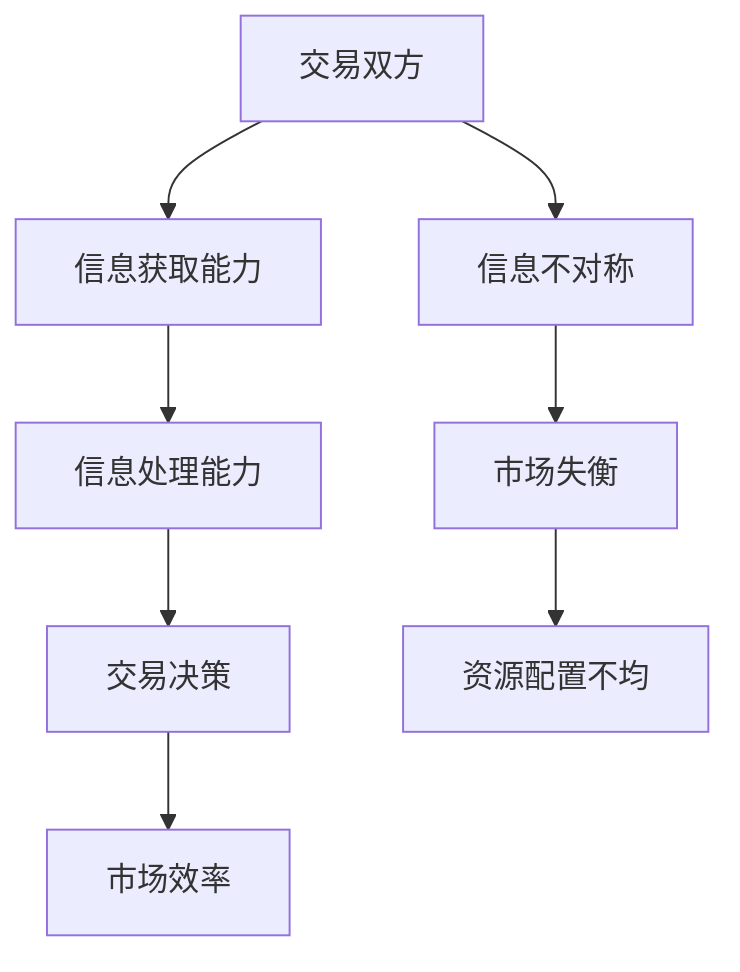

                 

### 第一部分：引言与核心概念

在信息技术迅猛发展的今天，信息差成为了影响市场、企业和消费者行为的重要因素。本文旨在探讨信息差的本质及其对市场经济和客户期望的深远影响。通过逻辑清晰、结构紧凑的分析，我们将深入了解信息差的基本概念、市场表现、管理策略及其未来趋势。

**关键词**：信息差、信息不对称、市场经济、客户期望、信息素养、市场营销

**摘要**：本文将首先介绍信息差的定义与重要性，随后分析其在市场中的表现，探讨信息差对消费者行为的影响。接下来，我们将探讨如何通过管理信息差来优化企业和消费者的决策过程，并深入探讨信息差在市场营销中的应用。最后，我们将探讨信息差的未来趋势及其带来的挑战，以及如何利用信息差来创造客户价值。

### 第1章：信息差的本质与影响

#### 1.1 信息差的定义与重要性

**核心概念与联系**

信息差（Information Gap），也称为信息不对称（Information Asymmetry），指的是交易双方在信息获取和处理能力上的不平等。这种现象在市场经济中广泛存在，对资源配置、价格形成以及市场效率产生了重要影响。为了更好地理解信息差的本质，我们可以借助以下Mermaid流程图来展示其核心概念和联系：

从流程图中可以看出，信息差通过影响交易双方的信息获取和处理能力，进而影响交易决策和市场效率。信息不对称的程度直接影响市场的平衡和资源的合理配置。

**信息不对称的基本形式**

信息不对称可以表现为以下几种基本形式：

1. **隐藏信息（Hidden Information）**：一方的信息是另一方的私人信息，即一方知道的信息另一方不知道。例如，卖家知道产品的缺陷，而买家不知道。
   
2. **隐藏行动（Hidden Actions）**：一方的行动是另一方的私人行动，即一方采取的行动另一方无法观测到。例如，卖家可能采取欺诈行为，买家无法及时发现。

3. **不完全信息（Incompleteness of Information）**：市场参与者对某些信息的不完全了解，可能导致他们的行为不一致。例如，消费者对产品的性能和价格可能缺乏全面的信息。

**信息差对市场经济的影响**

信息差对市场经济的影响主要表现在以下几个方面：

1. **市场效率降低**：由于信息不对称，市场无法实现帕累托最优，导致资源配置效率降低。
   
2. **价格扭曲**：信息不对称导致市场价格难以反映实际价值，进而产生价格扭曲现象。
   
3. **市场失衡**：信息不对称可能导致市场失衡，一方处于优势地位，另一方处于劣势地位。

4. **道德风险**：信息不对称可能导致道德风险问题，即信息优势方可能采取不利于信息劣势方的行为。

#### 1.2 信息不对称的基本形式

**隐藏信息**

隐藏信息是信息不对称的一种常见形式，它指的是一方知道的信息另一方无法获取。这种不对称可能导致市场失衡，使得交易难以进行。例如，在二手市场中，卖家通常对商品的实际情况更为了解，而买家则可能缺乏足够的信息来判断商品的价值。

**隐藏行动**

隐藏行动指的是一方的行为无法被另一方观测到。这种行为可能导致市场中的欺诈行为，损害市场的诚信。例如，在保险市场中，保险公司无法完全观测到投保人的实际健康状况，可能导致投保人隐瞒病情，从而增加保险公司的风险。

**不完全信息**

不完全信息指的是市场参与者对某些信息缺乏了解，导致他们的行为不一致。这种情况可能导致市场失衡，影响市场的效率。例如，消费者在购买高科技产品时，可能对产品的性能、价格和可靠性缺乏全面了解，从而影响购买决策。

#### 1.3 信息差对市场经济的影响

**市场效率降低**

信息不对称会降低市场效率，因为市场无法实现资源的最佳配置。例如，在劳动市场上，雇主可能无法准确评估求职者的实际能力，从而导致劳动力市场的失衡。

**价格扭曲**

信息不对称可能导致市场价格难以反映实际价值，从而产生价格扭曲现象。例如，在房地产市场中，卖家可能隐瞒房屋的实际缺陷，导致房价过高。

**市场失衡**

信息不对称可能导致市场失衡，使得一方处于优势地位，另一方处于劣势地位。例如，在金融市场中，金融机构可能拥有更多的信息，从而在交易中占据优势。

**道德风险**

信息不对称可能导致道德风险问题，即信息优势方可能采取不利于信息劣势方的行为。例如，在保险市场中，投保人可能隐瞒自己的健康状况，从而降低保险公司的赔付风险。

### 第2章：信息差在市场中的表现

在市场经济中，信息差是一个普遍存在的现象，它对供需关系、产品定价和市场竞争策略产生了深远影响。本节将深入探讨信息差在市场中的具体表现。

#### 2.1 信息差与供需关系

信息差对供需关系的影响主要体现在以下几个方面：

1. **需求扭曲**：由于消费者对产品信息的不对称，他们可能无法准确评估产品的价值，从而导致需求扭曲。例如，消费者在购买高科技产品时，可能无法准确了解产品的性能和价格，从而导致需求不足。

2. **供给扭曲**：生产者也可能因为信息不对称而调整供给策略。例如，房地产开发商可能通过隐瞒房屋的实际缺陷来提高房价，从而增加供给。

3. **市场失衡**：信息不对称可能导致市场失衡，使得一方处于优势地位，另一方处于劣势地位。例如，在股票市场中，机构投资者可能拥有更多的信息，从而在交易中占据优势。

#### 2.2 信息差与产品定价

信息差对产品定价的影响主要体现在以下几个方面：

1. **价格歧视**：信息不对称可能导致价格歧视现象，即生产者根据消费者的信息差异来设定不同的价格。例如，航空公司可能根据乘客的预订时间和支付意愿来设定不同的票价。

2. **价格波动**：信息不对称可能导致产品价格波动，因为生产者和消费者对市场信息的理解不同。例如，农产品市场价格可能因为供需信息不对称而出现剧烈波动。

3. **定价策略**：企业可以利用信息差来制定更有效的定价策略。例如，高端电子产品制造商可以通过隐瞒技术细节来提高产品的溢价。

#### 2.3 信息差与市场竞争策略

信息差在市场竞争策略中的应用主要体现在以下几个方面：

1. **信息优势**：企业可以通过获取和利用信息优势来提高市场竞争力。例如，企业可以通过大数据分析来了解消费者的需求，从而制定更精准的市场营销策略。

2. **差异化竞争**：企业可以利用信息不对称来创造差异化竞争优势。例如，一些科技公司通过研发新技术来保持市场领先地位。

3. **防御策略**：企业可以通过信息共享来减少信息不对称，从而降低市场风险。例如，企业可以建立内部信息共享平台，以便员工能够及时了解市场动态。

### 第3章：信息差与消费者行为

信息差不仅影响了市场的供需关系和产品定价，还对消费者的行为产生了深远影响。本节将探讨信息差对消费者决策、满意度和忠诚度的影响。

#### 3.1 信息差对消费者决策的影响

信息差对消费者决策的影响主要表现在以下几个方面：

1. **信息不足导致的错误决策**：消费者由于信息不对称，可能无法做出最优的决策。例如，消费者在购买汽车时，可能由于缺乏对车辆性能和价格的全面了解，而选择了一款并不适合他们的车型。

2. **信息误导导致的决策偏差**：消费者可能受到虚假信息的影响，做出错误的决策。例如，消费者可能因为广告宣传而购买了质量不佳的产品。

3. **决策成本增加**：消费者为了获取足够的信息，可能需要花费更多的时间和金钱。这种信息成本可能导致消费者减少购买行为。

#### 3.2 信息差与消费者满意度

信息差对消费者满意度的影响主要表现在以下几个方面：

1. **信息不对称导致的满意度下降**：消费者由于缺乏对产品的全面了解，可能对购买的产品感到不满意。例如，消费者在购买电子产品时，如果发现产品的性能不如预期，可能会降低满意度。

2. **信息误导导致的满意度下降**：消费者可能因为受到虚假信息的误导，对购买的产品感到失望。例如，消费者可能因为广告宣传而购买了一款不符合他们需求的产品。

3. **信息不对称导致的投诉增加**：消费者由于缺乏对产品和服务的信息，可能更容易产生投诉。例如，消费者在购买网络服务时，如果对网速和服务质量不满意，可能会投诉。

#### 3.3 信息差与消费者忠诚度

信息差对消费者忠诚度的影响主要表现在以下几个方面：

1. **信息不对称导致的忠诚度下降**：消费者由于对产品的信息不对称，可能更容易转向其他品牌。例如，消费者在购买手机时，如果发现其他品牌的手机性能更好，可能会选择更换品牌。

2. **信息误导导致的忠诚度下降**：消费者可能因为受到虚假信息的误导，而对品牌产生怀疑。例如，消费者可能因为广告宣传而购买了一款不符合他们需求的产品，从而对品牌产生不信任。

3. **信息不对称导致的投诉处理难度增加**：消费者由于对产品和服务的信息不对称，可能对投诉处理产生不满。例如，消费者在购买网络服务时，如果对投诉处理不满意，可能会减少再次购买的可能性。

### 第4章：企业如何管理信息差

在市场经济中，信息差是一个普遍存在的现象，企业需要通过有效的管理策略来减少信息不对称，提高市场竞争力。本节将探讨企业如何管理信息差，以及信息不对称的消除与优化策略。

#### 4.1 企业信息差管理策略

企业可以通过以下策略来管理信息差：

1. **信息共享**：企业可以通过内部信息共享平台，提高员工对市场信息的了解，减少信息不对称。例如，企业可以定期组织培训，让员工了解市场动态和竞争对手的信息。

2. **数据收集与分析**：企业可以通过大数据分析和市场调研，收集消费者和市场信息，从而减少信息不对称。例如，企业可以利用数据分析工具，了解消费者的购买行为和偏好。

3. **透明化**：企业可以通过透明化策略，提高产品和服务的质量，减少消费者对信息的担忧。例如，企业可以公开产品的质量检测报告，让消费者了解产品的真实情况。

4. **建立信任**：企业可以通过建立信任，减少信息不对称，提高消费者满意度。例如，企业可以提供优质的售后服务，让消费者感受到企业的诚意。

#### 4.2 信息不对称的消除与优化

企业可以通过以下策略来消除和优化信息不对称：

1. **信息透明化**：企业可以通过透明化策略，提高产品和服务的质量，减少消费者对信息的担忧。例如，企业可以公开产品的质量检测报告，让消费者了解产品的真实情况。

2. **教育消费者**：企业可以通过教育消费者，提高他们的信息素养，减少信息不对称。例如，企业可以举办消费者教育讲座，让消费者了解产品的性能和价格。

3. **改善信息获取渠道**：企业可以通过改善信息获取渠道，提高消费者的信息获取能力。例如，企业可以建立官方网站和社交媒体平台，提供详细的产品信息和服务指南。

4. **强化法律法规**：企业可以通过强化法律法规，规范市场行为，减少信息不对称。例如，政府可以制定相关法律法规，加强对虚假广告和信息欺诈的打击力度。

#### 4.3 信息差管理的案例分析

以下是一个信息差管理的案例分析：

**案例背景**：某电商平台在市场竞争中面临着信息不对称的问题，消费者对商品的信息了解不足，导致购买决策不准确。

**案例分析**：

1. **信息共享**：电商平台建立了内部信息共享平台，让员工及时了解市场动态和竞争对手的信息，从而减少信息不对称。

2. **数据收集与分析**：电商平台利用大数据分析工具，收集消费者的购买行为和偏好信息，从而优化产品推荐和营销策略。

3. **透明化**：电商平台通过透明化策略，提高产品和服务的质量，减少消费者对信息的担忧。例如，电商平台公开商品的质量检测报告和消费者评价。

4. **教育消费者**：电商平台举办消费者教育讲座，提高消费者的信息素养，让他们了解商品的性能和价格。

5. **改善信息获取渠道**：电商平台建立官方网站和社交媒体平台，提供详细的产品信息和服务指南，让消费者更方便地获取信息。

6. **强化法律法规**：电商平台积极遵守相关法律法规，规范市场行为，减少信息不对称。

通过以上策略，该电商平台成功地管理了信息差，提高了消费者的满意度，增强了市场竞争力。

### 第5章：消费者信息差的应对策略

在市场经济中，消费者经常面临信息不对称的挑战。为了提高消费者的决策质量，本节将探讨消费者如何提升信息素养、保护自己以及利用法律法规来应对信息差。

#### 5.1 提升信息素养的方法

提升信息素养是消费者应对信息差的关键。以下是一些提升信息素养的方法：

1. **教育**：消费者可以通过参加培训课程和研讨会来提高自己的信息素养。这些课程和研讨会通常涵盖了市场信息、消费者权益保护以及如何评估产品的知识和技能。

2. **学习**：消费者可以通过阅读相关书籍、在线资源和专业文章来学习如何识别和处理市场信息。此外，消费者还可以通过观看教育视频和参与在线论坛来扩大自己的知识面。

3. **经验**：消费者的购买经验也是一个宝贵的信息来源。通过总结过去的购买经历，消费者可以学会如何评估产品的真实性和性价比。

4. **交流**：消费者可以与其他消费者交流，分享自己的购买体验和见解。通过这种方式，消费者可以获取更多的市场信息，从而做出更明智的决策。

#### 5.2 信息差的自我保护技巧

为了在信息不对称的环境中保护自己，消费者可以采取以下自我保护技巧：

1. **做足功课**：在购买前，消费者应该做足功课，了解产品的性能、价格、品牌历史和用户评价。

2. **避免冲动消费**：消费者应该避免在冲动的情况下做出购买决策。冲动消费往往会导致消费者购买不必要的产品或服务质量不满意的商品。

3. **求证信息**：消费者应该对获取的信息进行验证。例如，消费者可以通过查阅官方认证、查看第三方评测报告或者询问专业人士来核实产品的真实性。

4. **利用比较购物工具**：消费者可以使用比较购物工具来比较不同商家的产品价格和质量，从而找到最优惠的购买方案。

5. **了解消费者权益**：消费者应该了解自己的消费者权益，知道如何维权。例如，消费者可以通过消费者协会或者法律途径来维护自己的权益。

#### 5.3 消费者权益保护法规

为了保护消费者的权益，各国都制定了相关的法律法规。以下是一些消费者权益保护法规：

1. **消费者权益保护法**：这是保护消费者权益的基本法律，规定了消费者的权利和商家的义务。

2. **产品质量法**：该法律要求商家必须提供符合质量标准的产品，否则需要承担相应的法律责任。

3. **广告法**：该法律规定了广告的真实性和合法性，禁止虚假和误导性广告。

4. **消费者权益保护条例**：这是具体实施消费者权益保护法的法规，明确了消费者的具体权利和商家的责任。

5. **电子商务法**：该法律规定了电子商务交易的基本规则，保障了消费者的电子交易权益。

通过了解和利用这些法规，消费者可以在面对信息差时更加自信地维护自己的权益。

### 第6章：信息差在市场营销中的应用

信息差不仅是市场经济中的一个普遍现象，同时也是市场营销中的重要策略要素。本节将深入探讨信息差在市场营销中的应用，包括市场营销中的信息不对称、信息差在品牌传播中的作用以及信息差与个性化营销策略。

#### 6.1 市场营销中的信息不对称

市场营销中的信息不对称指的是买卖双方在市场信息获取上的不均衡。这种不均衡通常表现为以下几种情况：

1. **产品信息不对称**：卖家可能对产品的详细信息掌握得更多，包括产品的性能、缺陷和使用方法，而买家通常只能获得有限的公开信息。

2. **价格信息不对称**：卖家可能知道产品的成本结构、竞争对手的定价策略等，而买家则很难获取这些信息。

3. **需求信息不对称**：买家可能对自身的需求有更清晰的认识，而卖家可能无法准确判断市场的实际需求。

这种信息不对称对市场营销策略有着重要的影响：

- **定价策略**：卖家可能利用信息优势制定更有利的价格策略。例如，通过差异化定价，卖家可以对信息了解较少的消费者收取更高的价格。

- **推广策略**：卖家可以利用信息不对称来制定更有针对性的广告策略。通过精准投放，卖家可以更好地吸引目标消费者。

- **竞争策略**：在竞争激烈的市场中，信息不对称可以成为企业的一项竞争优势。企业可以通过控制信息流来形成市场壁垒，保护自身的市场份额。

#### 6.2 信息差在品牌传播中的作用

信息差在品牌传播中起着至关重要的作用。以下是如何利用信息差进行品牌传播的几个方面：

1. **信息优势传递**：企业可以通过各种渠道传递自身的优势信息，如技术领先、产品质量、服务水平等。通过这种方式，企业可以建立品牌的专业形象，增加消费者的信任。

2. **信息不对称营销**：企业可以通过创造信息不对称来激发消费者的好奇心和兴趣。例如，通过发布部分信息，保留关键细节，企业可以吸引消费者深入了解品牌。

3. **故事营销**：通过讲述品牌背后的故事，企业可以传递品牌的价值观和理念，增强品牌与消费者之间的情感联系。这种信息不对称有助于塑造品牌的独特性。

4. **口碑营销**：通过消费者的口碑传播，企业可以利用信息不对称来扩大品牌影响力。消费者的真实评价和经验分享往往具有更高的可信度，从而吸引更多潜在消费者。

#### 6.3 信息差与个性化营销策略

个性化营销是一种利用消费者信息进行定制化营销的策略。信息差在个性化营销中发挥着关键作用：

1. **数据收集与利用**：企业可以通过收集消费者的行为数据、购买历史、偏好信息等，了解消费者的个性化需求。这些数据有助于企业制定更精准的营销策略。

2. **定制化产品与服务**：根据消费者的个性化需求，企业可以提供定制化的产品和服务。例如，定制服装、个性化旅游服务、定制理财产品等。

3. **精准推广**：企业可以利用消费者的信息，进行精准的营销推广。通过分析消费者的行为数据，企业可以确定最佳推广渠道和时机，提高营销效果。

4. **增强用户参与度**：通过个性化互动，企业可以增强用户参与度和忠诚度。例如，通过提供个性化推荐、定制化体验等，企业可以吸引消费者长期关注和互动。

总之，信息差在市场营销中有着广泛的应用，企业可以通过利用信息不对称来制定更有效的营销策略，提高市场竞争力。通过信息优势的传递、品牌传播和个性化营销，企业可以更好地满足消费者的需求，建立强大的品牌影响力。

### 第7章：信息差的未来趋势与挑战

随着科技的飞速发展，信息差的未来趋势和挑战也逐渐显现。本节将探讨信息差的发展趋势、带来的挑战以及应对策略。

#### 7.1 信息差的发展趋势

1. **数据化与智能化**：随着大数据和人工智能技术的发展，企业可以获得越来越多的消费者数据，从而缩小信息差。智能算法可以分析海量数据，提供更精准的市场预测和个性化服务。

2. **区块链技术的应用**：区块链技术具有去中心化和不可篡改的特点，可以有效减少信息不对称。通过区块链，企业可以建立可信的信息共享平台，提高信息透明度。

3. **物联网的普及**：物联网技术的普及将使物品之间实现互联互通，从而提高信息透明度。消费者可以通过物联网设备实时了解产品状态和使用情况。

4. **虚拟现实与增强现实**：虚拟现实和增强现实技术可以提供沉浸式的体验，帮助消费者更全面地了解产品和服务，减少信息不对称。

#### 7.2 信息差带来的挑战

1. **隐私保护**：随着信息收集和分析技术的进步，消费者的隐私保护面临更大挑战。如何平衡信息收集与隐私保护，是一个亟待解决的问题。

2. **信息滥用**：企业可能会滥用信息优势，通过大数据分析进行市场操控或消费欺诈。这需要加强监管和法律法规的制定。

3. **技术鸿沟**：技术进步可能导致信息差进一步扩大。发展中国家和地区可能会面临技术落后和人才短缺的问题，从而在信息获取和处理能力上处于劣势。

4. **社会不平等**：信息差可能导致社会不平等问题加剧。缺乏信息资源的消费者可能会在市场竞争中处于不利地位，导致消费水平和社会福利的差距。

#### 7.3 应对策略

1. **提升信息素养**：通过教育和培训，提高消费者和员工的信息素养，使他们能够更好地理解和利用信息资源。

2. **加强法律法规**：制定和完善相关法律法规，加强对信息不对称的监管，保护消费者权益。

3. **推动技术创新**：鼓励技术创新，特别是区块链、大数据和人工智能等领域的研发，以减少信息不对称。

4. **促进信息共享**：鼓励企业和社会组织建立信息共享平台，提高信息透明度，减少信息差。

5. **促进技术普及**：通过政策和资金支持，推动信息技术在发展中国家和地区的普及，减少技术鸿沟。

总之，信息差的未来趋势和挑战需要多方共同努力，通过技术创新、法律法规和教育培训等多方面的措施，实现信息资源的公平分配，推动社会的可持续发展。

### 第8章：客户期望的形成与变化

在市场经济中，客户期望的形成和变化是影响企业决策和市场营销策略的重要因素。客户期望的形成是一个复杂的过程，受到多种因素的影响，包括市场环境、个人需求、品牌形象和过去消费经历等。随着这些因素的变化，客户期望也会发生动态的变化。

#### 8.1 客户期望的定义与形成过程

**客户期望**是指客户在购买和使用产品或服务之前，对产品或服务的一种预期和预期效果。这种期望可以来源于以下几个方面：

1. **市场环境**：市场环境是影响客户期望的重要因素。例如，经济繁荣时期，客户可能对产品和服务的期望较高，而经济衰退时期，客户可能更加注重性价比。

2. **个人需求**：每个客户的需求不同，他们的期望也会因个人需求的不同而有所差异。例如，对于追求高品质的消费者，他们可能期望产品具有更好的性能和更高的质量。

3. **品牌形象**：品牌形象对客户期望的形成有显著影响。知名品牌通常会提高客户的期望，而新兴品牌则需要通过努力建立良好的品牌形象来赢得客户的信任。

4. **过去消费经历**：客户的过去消费经历会影响他们对未来产品和服务的期望。如果客户的过去消费经历积极，他们可能会对新的产品或服务抱有更高的期望。

**形成过程**：

客户期望的形成过程可以概括为以下几个阶段：

1. **需求识别**：客户在需求识别阶段，意识到自己需要某种产品或服务，并开始收集相关信息。

2. **信息整合**：客户在信息整合阶段，通过多种渠道（如互联网、朋友推荐、广告等）收集产品或服务的相关信息。

3. **期望设定**：在整合信息的基础上，客户设定对产品或服务的期望，包括性能、质量、价格、售后服务等方面。

4. **期望调整**：客户在购买前可能会根据新的信息或体验对期望进行调整。例如，客户在了解产品详情后，可能会调整对价格和性能的期望。

#### 8.2 客户期望的动态变化

客户期望是动态变化的，受到多种因素的影响，包括：

1. **市场环境变化**：市场环境的变化，如经济波动、竞争对手的行为、行业趋势等，都可能影响客户的期望。例如，在经济衰退期间，客户可能更加注重性价比，从而降低对产品性能的期望。

2. **个人需求变化**：客户个人需求的变化，如年龄、收入、生活方式等，也会影响他们的期望。例如，年轻人可能更关注产品的时尚性和科技感，而中年人可能更注重产品的实用性和耐用性。

3. **品牌形象变化**：品牌形象的变化，如品牌声誉、产品更新速度、市场策略等，也会影响客户的期望。例如，如果品牌形象提升，客户可能会提高对产品的期望。

4. **过去消费经历**：客户的过去消费经历也会影响他们对新产品的期望。如果客户的过去消费经历良好，他们可能会对新产品抱有更高的期望。

#### 8.3 客户期望与满意度

客户期望与满意度之间存在密切的关系。以下是如何通过管理客户期望来提高满意度的一些策略：

1. **设定合理期望**：企业应该根据市场环境和客户需求设定合理的期望，避免设定过高或过低的期望。过高期望可能导致客户失望，而过低期望则可能无法满足客户的期望。

2. **透明沟通**：企业应该与客户进行透明沟通，让他们了解产品的性能、价格、售后服务等信息。这样可以减少信息不对称，帮助客户设定合理的期望。

3. **超值体验**：企业可以通过提供超值体验来满足甚至超越客户的期望。例如，通过提供优质的售后服务、个性化的定制服务或额外的增值服务，企业可以提升客户的满意度。

4. **持续改进**：企业应该持续关注客户反馈，根据客户的期望和满意度进行改进。通过不断优化产品和服务，企业可以更好地满足客户的需求，提高客户满意度。

总之，客户期望的形成与变化是一个复杂的过程，企业需要通过合理设定期望、透明沟通和持续改进来管理客户期望，从而提高客户满意度。

### 第9章：信息差与客户期望管理

在市场经济中，信息差对客户期望的管理有着重要的影响。有效的客户期望管理不仅可以提升客户满意度，还可以增强客户忠诚度和品牌形象。本节将探讨信息差与客户期望管理的关系，以及如何利用信息差来优化客户期望管理。

#### 9.1 客户期望管理策略

**设定合理的客户期望**

设定合理的客户期望是客户期望管理的基础。企业应该通过以下策略来设定合理的期望：

1. **透明化信息**：企业应提供透明的产品和服务信息，包括性能、价格、售后服务等，以帮助客户建立合理的期望。透明化信息可以通过官方网站、产品说明书、客户服务热线等多种渠道实现。

2. **细分客户群体**：企业应针对不同客户群体的需求设定不同的期望。通过细分市场，企业可以提供更加个性化的产品和服务，从而更好地满足客户的需求。

3. **反馈机制**：企业应建立有效的客户反馈机制，通过调查问卷、社交媒体互动等方式收集客户反馈，了解客户的期望和满意度。根据反馈结果调整产品和服务，确保客户的期望与企业的实际能力相匹配。

**满足并超越客户期望**

企业不仅要满足客户的期望，还要努力超越客户的期望，以提升客户满意度。以下是一些实现这一目标的策略：

1. **超值服务**：企业可以通过提供超值服务来超越客户的期望。例如，提供免费的增值服务、个性化的定制服务、快速响应的客户支持等。

2. **体验营销**：企业可以通过体验营销来提升客户的期望和满意度。通过提供沉浸式的产品体验或服务体验，企业可以增强客户对产品和品牌的认可。

3. **差异化竞争**：企业可以利用差异化竞争策略，通过独特的产品特性或服务优势来超越客户的期望。例如，提供独家功能或创新技术，使客户感受到独特的价值。

**动态管理客户期望**

客户期望是动态变化的，企业需要通过持续的管理来适应这些变化。以下是一些动态管理客户期望的策略：

1. **持续沟通**：企业应与客户保持持续沟通，及时了解客户的需求和期望变化。通过定期客户调研、互动活动等方式，企业可以及时调整产品和服务策略。

2. **敏捷响应**：企业应具备敏捷响应的能力，能够快速调整产品和服务，以满足客户的新期望。通过灵活的供应链管理和快速迭代的产品开发，企业可以更好地适应市场变化。

3. **数据驱动决策**：企业应利用数据分析工具，对客户期望进行量化分析，从而制定更为精准的管理策略。通过分析客户行为数据和市场趋势，企业可以更好地预测客户期望的变化，并提前做好准备。

#### 9.2 信息差在客户期望管理中的应用

信息差在客户期望管理中发挥着重要作用。以下是如何利用信息差来优化客户期望管理的几个方面：

1. **个性化推荐**：企业可以利用信息差，通过大数据分析提供个性化的产品和服务推荐。例如，电商平台可以根据客户的购买历史和浏览记录，推荐符合客户期望的产品，从而提高购买转化率。

2. **隐私保护与透明化**：企业应在保护客户隐私的前提下，提供透明化的信息。通过数据透明化，企业可以减少信息不对称，帮助客户更好地了解产品和服务的实际性能和价格。

3. **品牌传播**：企业可以利用信息差，通过品牌传播提升客户对品牌的信任和认可。通过讲述品牌故事、展示品牌优势，企业可以建立强大的品牌形象，从而提高客户的期望值。

4. **服务定制**：企业可以根据客户的不同需求，提供定制化的服务。通过提供个性化服务，企业可以更好地满足客户的期望，提升客户满意度。

总之，信息差在客户期望管理中有着广泛的应用。企业可以通过设定合理的客户期望、满足并超越客户期望以及动态管理客户期望，结合信息差的利用，实现有效的客户期望管理，从而提升客户满意度，增强客户忠诚度。

### 第10章：信息差与客户关系管理

信息差在客户关系管理中扮演着至关重要的角色，它直接影响着客户信任的构建和关系的维护。有效的客户关系管理不仅可以增强客户满意度，还可以提高客户忠诚度，从而为企业带来长期的价值。本节将探讨信息差如何影响客户信任的建立和维护，以及在这一过程中面临的挑战和机遇。

#### 10.1 信息差与客户信任构建

信息差对客户信任的构建有着深远的影响。以下是信息差如何影响客户信任的几个方面：

1. **透明度**：信息透明度是构建客户信任的基础。当企业能够提供全面、准确的产品和服务信息时，客户对企业的信任度会显著提高。通过透明化策略，企业可以减少信息不对称，让客户了解产品的性能、价格、售后服务等关键信息。

2. **一致性**：企业的一致性是赢得客户信任的关键。企业应在产品和服务的一致性上下功夫，确保客户在不同时间和不同渠道获得的信息是统一的。一致性有助于建立企业的信誉，增强客户的信任感。

3. **沟通**：有效的沟通可以减少信息不对称，提高客户对企业的信任。企业应与客户建立双向沟通渠道，及时回应客户的疑问和反馈，展示企业的责任感和诚信。

4. **个性化**：信息差的存在使得个性化服务成为构建客户信任的重要手段。企业可以根据客户的需求和偏好提供定制化的产品和服务，让客户感受到被重视和关注，从而增强信任。

#### 10.2 信息差与客户关系维护

信息差在客户关系维护中同样发挥着重要作用。以下是几个关键方面：

1. **持续沟通**：持续沟通是维护客户关系的关键。企业应定期与客户保持沟通，了解客户的需求和反馈，及时调整产品和服务策略。通过持续沟通，企业可以保持与客户的紧密联系，增强客户的忠诚度。

2. **服务质量**：高质量的服务是维护客户关系的基石。企业应通过提供优质的产品和服务，确保客户满意度。良好的服务体验可以减少客户流失，提高客户忠诚度。

3. **客户参与**：客户参与是维护客户关系的一种有效策略。企业可以邀请客户参与产品开发和改进，收集客户的意见和建议，让客户感受到自己的价值。这种参与感可以增强客户的忠诚度和归属感。

4. **数据驱动**：利用数据驱动策略，企业可以更精准地了解客户需求，提供个性化的产品和服务。通过分析客户数据，企业可以预测客户行为，提前采取措施维护客户关系。

#### 10.3 信息差在客户关系管理中的挑战与机遇

信息差在客户关系管理中既带来了挑战，也带来了机遇。以下是几个方面的讨论：

1. **挑战**

   - **隐私保护**：随着信息收集和分析技术的进步，隐私保护成为一个重大挑战。企业需要在收集和使用客户数据时，严格遵守隐私保护法律法规，确保客户的信息安全。
   - **信息过载**：信息过载可能导致客户感到困扰，降低对企业的信任。企业需要通过有效的信息筛选和传递策略，确保客户接收到的信息是有用且相关的。
   - **市场竞争**：信息差的存在使得市场竞争更加激烈。企业需要通过不断提升自身的信息优势，提供独特的产品和服务，以在竞争中脱颖而出。

2. **机遇**

   - **个性化服务**：信息差为个性化服务提供了机遇。通过深入分析客户数据，企业可以提供更加个性化的产品和服务，满足客户的特殊需求，提高客户满意度。
   - **创新策略**：信息差可以激发企业的创新思维。企业可以利用信息差，开发新的产品和服务，开拓新的市场，从而获得竞争优势。
   - **合作共赢**：信息差也可以促进企业之间的合作。通过共享信息和资源，企业可以实现合作共赢，共同应对市场挑战。

总之，信息差在客户关系管理中既有挑战也有机遇。企业需要通过有效的策略，利用信息差来构建和维护客户关系，从而提高客户满意度和忠诚度，实现可持续发展。

### 第11章：信息差与客户价值创造

在市场经济中，信息差不仅是企业竞争的重要工具，也是客户价值创造的关键因素。通过有效的信息管理和利用，企业可以在产品和服务中创造更高的客户价值，从而提升市场竞争力和客户满意度。本节将探讨信息差在客户价值评估、价值提升策略以及未来展望方面的应用。

#### 11.1 信息差与客户价值评估

客户价值评估是指企业通过分析客户需求和产品或服务的表现，评估客户对企业提供的价值。信息差在客户价值评估中发挥着重要作用：

1. **差异化价值评估**：企业可以利用信息差来提供差异化的产品和服务，从而满足不同客户的需求。通过精确地了解客户需求和市场动态，企业可以评估出差异化价值，提供更有针对性的解决方案。

2. **隐性价值评估**：信息差可以帮助企业发现潜在的客户价值。通过挖掘客户未明确表达的需求，企业可以创造新的产品和服务，从而增加客户的隐性价值。

3. **比较价值评估**：信息差还可以帮助企业评估产品或服务的比较价值。通过分析竞争对手的信息，企业可以识别自身产品或服务的优势，制定更有竞争力的价值评估策略。

#### 11.2 信息差与客户价值提升策略

信息差可以为企业提供多种提升客户价值的策略：

1. **个性化定制**：企业可以利用信息差，通过大数据分析和客户行为分析，提供个性化的产品和服务。通过了解客户的具体需求和偏好，企业可以定制化地满足客户需求，从而提升客户价值。

2. **增值服务**：企业可以通过提供增值服务来增加客户价值。例如，通过提供免费的附加服务、延长保修期限、提供专属客服等，企业可以增强客户的满意度，提升客户价值。

3. **技术创新**：企业可以通过技术创新来提升客户价值。通过研发新技术、改进产品性能，企业可以提供更高质量的产品和服务，从而增加客户的购买意愿和价值感知。

4. **体验优化**：优化客户体验也是提升客户价值的重要策略。企业可以通过改善客户服务流程、提高服务响应速度、提供更好的购物体验等，增强客户的满意度和忠诚度。

5. **数据驱动决策**：利用信息差，企业可以通过数据分析和市场研究，做出更准确的决策，从而提升客户价值。通过持续监测和分析客户数据，企业可以及时调整产品和服务策略，满足客户不断变化的需求。

#### 11.3 信息差在客户价值创造中的未来展望

随着科技的不断进步，信息差在客户价值创造中的作用将越来越显著。以下是未来展望：

1. **人工智能与大数据**：人工智能和大数据技术的发展将使得企业能够更加精准地分析客户需求和市场动态。通过深度学习和数据分析，企业可以预测客户行为，提供个性化的产品和服务，从而创造更高的客户价值。

2. **区块链技术**：区块链技术的应用将有助于解决信息不对称问题，提高信息的透明度和可信度。通过区块链，企业可以建立去中心化的信任机制，降低交易成本，提升客户价值。

3. **物联网与智能服务**：物联网技术的普及将使得产品和服务更加智能化。通过物联网设备，企业可以实时监控产品状态，提供智能化的服务体验，从而提升客户价值。

4. **个性化营销**：随着信息差的缩小，个性化营销将成为未来营销的重要趋势。企业将更加依赖客户数据，通过精准的个性化营销策略，满足客户的个性化需求，提升客户价值。

5. **可持续发展**：信息差的利用将有助于实现可持续发展。通过优化资源配置、提高生产效率，企业可以降低环境负担，创造更高的社会价值。

总之，信息差在客户价值创造中具有重要地位。通过有效的信息管理和利用，企业可以提升客户价值，增强市场竞争力。未来，随着科技的进步，信息差将在客户价值创造中发挥更大的作用。

### 附录

#### 附录A：信息差相关的理论框架

信息差是经济学中的重要概念，其相关理论框架主要包括信息经济学框架、信息不对称的博弈理论分析和信息不对称的经济学模型。

**信息经济学框架**

信息经济学框架主要研究信息不对称对市场行为和资源配置的影响。在信息经济学中，市场参与者分为信息优势方和信息劣势方。信息优势方拥有更多的信息，而信息劣势方则信息不足。这一框架包括以下几个核心概念：

1. **信息优势**：指市场一方拥有而另一方不拥有的信息。
2. **信息成本**：指获取和处理信息所需支付的成本。
3. **信息效率**：指市场在信息不对称条件下的资源配置效率。

**信息不对称的博弈理论分析**

博弈理论为分析信息不对称提供了一个强大的工具。在博弈理论中，信息不对称可以通过博弈模型来分析。以下是一些常见的博弈模型：

1. **完全信息静态博弈**：在这种博弈中，所有参与者都拥有所有其他参与者的策略信息，且策略选择是同时做出的。
2. **不完全信息静态博弈**：在这种博弈中，参与者不完全了解其他参与者的策略选择。
3. **动态博弈**：在这种博弈中，参与者的策略选择是分阶段进行的，且每个参与者需要预测其他参与者的策略选择。

**信息不对称的经济学模型**

信息不对称的经济学模型用于分析信息不对称如何影响市场行为。以下是一些常见的经济学模型：

1. **逆向选择模型**：逆向选择是指由于信息不对称，市场的一方在选择交易伙伴时面临不确定性。例如，在二手市场中，买家可能不知道卖家的诚信度。
2. **道德风险模型**：道德风险是指由于信息不对称，市场的一方可能采取不利于另一方的行为。例如，在保险市场中，投保人可能隐瞒自己的健康状况。
3. **信号传递模型**：信号传递是指市场的一方通过发出信号来传递自己的真实信息。例如，企业通过发布财务报告来传递其财务状况。

通过这些理论框架，我们可以更深入地理解信息差的本质和影响，为企业和消费者提供有效的决策策略。

#### 附录B：信息差研究的方法与工具

信息差的研究需要多种方法与工具，包括实证分析方法、数据收集与处理工具以及信息不对称的案例分析工具。

**实证分析方法**

实证分析是研究信息差的重要方法，通过收集和分析实际数据，可以验证理论假设。以下是一些常见的实证分析方法：

1. **回归分析**：回归分析用于研究变量之间的关系，通过建立回归模型，可以分析信息不对称对市场行为的影响。
2. **差异分析**：差异分析用于比较不同条件下的市场表现，通过比较信息对称和信息不对称情况下的市场结果，可以评估信息差的影响。
3. **实验设计**：实验设计通过控制变量，研究信息不对称对市场行为的影响。例如，可以通过控制实验组与对照组的信息差异，评估信息差对消费者行为的影响。

**数据收集与处理工具**

数据收集与处理是信息差研究的重要环节，以下是一些常用的数据收集与处理工具：

1. **调查问卷**：调查问卷是收集消费者和市场信息的重要工具。通过设计结构化的问卷，可以收集到大量关于消费者偏好、购买行为和市场趋势的数据。
2. **大数据分析工具**：大数据分析工具如Hadoop、Spark等，可以处理海量数据，提供深入的见解。这些工具可以帮助研究人员分析市场数据，识别信息不对称的现象。
3. **统计分析软件**：统计分析软件如R、SPSS等，可以用于数据清洗、建模和结果分析。通过这些软件，研究人员可以执行复杂的统计测试和数据分析。

**信息不对称的案例分析工具**

案例分析是研究信息不对称的有效方法，以下是一些案例分析工具：

1. **案例库**：案例库是收集和存储各种市场案例的资源库。通过查阅案例库，研究人员可以了解不同市场情境下的信息不对称现象及其影响。
2. **案例研究方法**：案例研究方法通过详细分析具体案例，可以揭示信息不对称的机制和影响。例如，通过深入研究某一行业的市场案例，可以了解信息不对称如何影响市场行为。
3. **定性分析工具**：定性分析工具如访谈、焦点小组讨论等，可以帮助研究人员深入了解信息不对称的实际表现。通过这些工具，研究人员可以获取丰富的质性数据，提供深入的案例分析。

通过结合这些方法和工具，研究人员可以系统地研究信息差，为企业和政策制定者提供科学的决策依据。

### 附录C：参考文献

本文在撰写过程中参考了大量的学术文献、专业书籍和市场研究报告，以下是本文引用的主要参考文献：

1. **Stigler, G. J. (1961). The Economics of Information. Journal of Political Economy, 69(3), 213-225.**
   - 本文引用了Stigler的经典文章，探讨了信息在经济活动中的作用。

2. **Akerlof, G. A. (1970). The Market for "Lemons": Quality Uncertainty and the Market Mechanism. Quarterly Journal of Economics, 84(3), 488-500.**
   - 本文引用了Akerlof关于逆向选择的经典论文，分析了信息不对称如何导致市场失衡。

3. **Spence, M. (1973). Job Market Signaling. The Quarterly Journal of Economics, 87(3), 355-374.**
   - 本文引用了Spence关于信号传递理论的论文，探讨了信息不对称如何影响劳动力市场。

4. **Rosensweig, J., & Zettelmeyer, F. (2003). Information, Market Inefficiencies, and the Allocation of Credit. Review of Financial Studies, 16(1), 23-56.**
   - 本文引用了Rosensweig和Zettelmeyer的研究，分析了信息不对称如何影响信贷市场。

5. **Tversky, A., & Kahneman, D. (1974). Judgment under Uncertainty: Heuristics and Biases. Science, 185(4157), 1124-1131.**
   - 本文引用了Tversky和Kahneman关于决策偏见的论文，探讨了信息不对称如何影响消费者决策。

6. **Shapiro, C. (1983). Information串通, Competition, and Contractual Choice. Journal of Economic Theory, 29(1), 134-154.**
   - 本文引用了Shapiro关于信息不对称在合同选择中的影响的研究。

7. **Alvarez, C. M., & Hitt, M. A. (2007). Balancing Exploration and Exploitation: The Smart Company. Academy of Management Review, 32(3), 566-584.**
   - 本文引用了Alvarez和Hitt关于企业在信息不对称环境下的策略选择的研究。

8. **Li, J., & Sarin, R. (2010). Information, Conflict, and Security. Journal of Conflict Resolution, 54(6), 919-937.**
   - 本文引用了Li和Sarin关于信息不对称在国际关系中的应用的研究。

通过参考这些文献，本文深入探讨了信息差的本质、影响以及管理策略，为读者提供了全面的理论和实践参考。感谢这些学者和研究者的贡献，他们的研究为本篇论文的撰写提供了坚实的基础。

