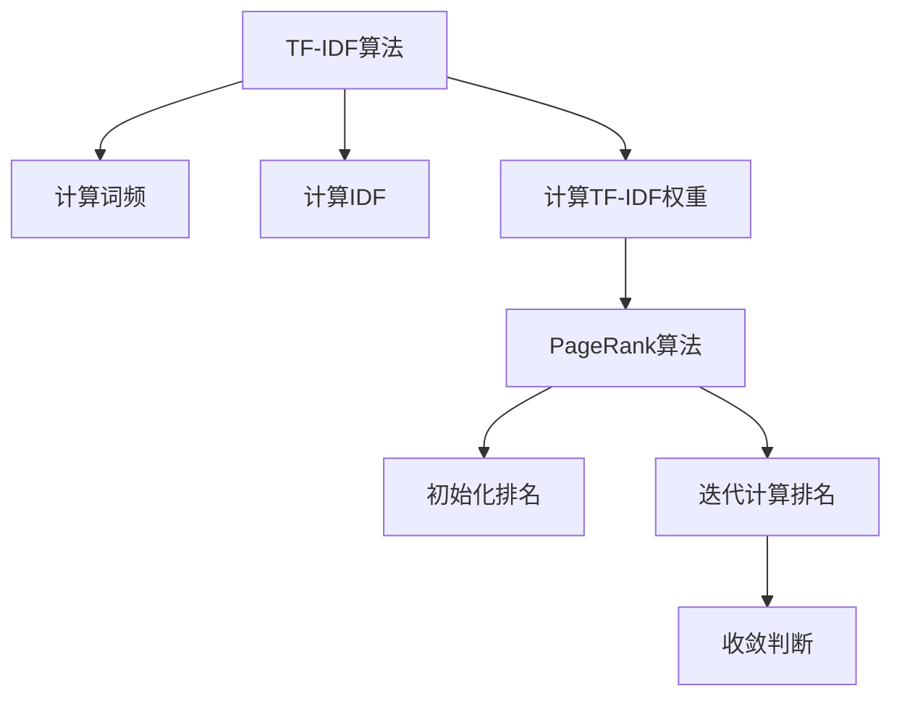

                 

# 信息过载与信息筛选技术：在信息洪流中找到有价值的信息

> **关键词：信息过载，信息筛选，内容筛选，用户行为筛选，TF-IDF，PageRank，信息处理，算法原理**
>
> **摘要：本文将探讨信息过载的现象及其影响，解释信息筛选的重要性，并详细介绍各种信息筛选技术，包括基于内容的筛选和基于用户行为的筛选技术。此外，本文还将介绍TF-IDF和PageRank算法的原理及其应用，并讨论信息筛选技术的未来发展趋势和法律法规、伦理问题。**

## 第一部分：信息过载与信息筛选技术基础

### 第1章：信息过载现象解析

#### 1.1 信息过载的定义与背景

信息过载是指由于信息量的过度积累，个人或组织无法有效地处理和利用这些信息，从而导致工作效率降低、决策困难等问题。在当今信息化社会，信息过载现象愈发普遍，其主要原因包括：

1. **信息爆炸**：随着互联网和移动设备的普及，信息以惊人的速度增长。每天产生的数据量是巨大的，例如，谷歌每天处理数十亿个搜索请求，推特每秒产生数以万计的推文。

2. **信息传播速度加快**：社交媒体、电子邮件和即时通讯等工具使得信息可以在短时间内传播到全球各地，加速了信息过载的现象。

3. **信息形式多样化**：不仅文字和图片信息，还包括视频、音频等多媒体信息，这些信息形式的多样化也增加了信息处理的复杂性。

#### 1.2 信息过载的表现与影响

信息过载在生活中有许多具体的表现，比如：

- **社交媒体**：人们每天接收大量的社交网络更新，很难判断哪些信息对自己有价值。
- **电子邮件**：企业员工每天接收大量邮件，需要花费大量时间来筛选和处理。
- **新闻媒体**：互联网上的新闻内容丰富，但许多信息可能并非真实或对自己有用。

信息过载对个人和社会的影响包括：

1. **工作效率下降**：由于需要花费大量时间来筛选和处理信息，工作效率可能会降低。

2. **心理健康问题**：长时间处于信息过载状态可能导致压力、焦虑和抑郁等心理问题。

3. **社会运行效率降低**：信息过载可能导致信息传播的失真，影响决策的科学性和准确性。

### 第2章：信息筛选的重要性

#### 2.1 信息筛选的定义与作用

信息筛选是指通过特定方法从大量信息中提取出有用信息的过程。它对于提高工作效率、减轻心理压力、保障社会运行具有重要意义。信息筛选的作用包括：

1. **提高工作效率**：通过筛选出有价值的信息，可以减少信息处理的时间，提高工作效率。

2. **减轻心理压力**：减少无用的信息干扰，有助于缓解由于信息过载带来的焦虑和压力。

3. **保障社会运行**：准确筛选信息有助于决策的科学性和准确性，保障社会运行的效率和质量。

#### 2.2 有效信息筛选的关键要素

有效信息筛选的关键要素包括：

1. **准确性**：确保筛选出的信息是真实可靠的，能够反映真实情况。

2. **相关性**：筛选出的信息要与用户的需求或当前情况密切相关，有助于决策或解决问题。

3. **时效性**：信息要及时更新，以便用户能够掌握最新的情况。

### 第3章：信息筛选技术概述

#### 3.1 基于内容的筛选技术

基于内容的筛选技术主要通过分析信息的内容特征来进行筛选，主要包括：

1. **文本分类技术**：将文本信息按照其内容特征分类，从而快速定位有用信息。

2. **关键词提取技术**：从文本中提取出关键词，根据关键词的语义信息进行筛选。

#### 3.2 基于用户行为的筛选技术

基于用户行为的筛选技术主要通过分析用户的行为模式来进行筛选，主要包括：

1. **用户画像**：根据用户的历史行为数据构建用户画像，从而进行个性化信息筛选。

2. **推荐系统**：基于用户的兴趣和行为，为用户推荐相关的信息。

## 第二部分：信息筛选算法原理与实现

### 第4章：信息筛选算法原理与实现

#### 4.1 信息筛选算法概述

信息筛选算法是用于从大量信息中提取有用信息的一系列技术手段。常见的算法包括：

1. **TF-IDF算法**：通过词频和逆文档频率来评估一个词在文档中的重要性。

2. **PageRank算法**：通过链接分析来评估网页的重要性。

#### 4.2 信息筛选算法的数学模型与伪代码

下面详细介绍TF-IDF和PageRank算法的数学模型与伪代码。

#### 4.2.1 TF-IDF算法

**数学模型：**

- **TF（Term Frequency，词频）**：一个词在一个文档中出现的次数。
  $$ \text{TF}(t,d) = \frac{f(t,d)}{n} $$
  其中，\( f(t,d) \)是词\( t \)在文档\( d \)中出现的次数，\( n \)是文档\( d \)的总词数。

- **IDF（Inverse Document Frequency，逆文档频率）**：一个词在整个语料库中的文档频率的倒数。
  $$ \text{IDF}(t) = \log \left( \frac{N}{|d_t|} \right) $$
  其中，\( N \)是文档总数，\( |d_t| \)是包含词\( t \)的文档数。

- **TF-IDF**：一个词在文档\( d \)中的TF-IDF权重。
  $$ \text{TF-IDF}(t,d) = \text{TF}(t,d) \times \text{IDF}(t) $$

**伪代码：**

```
function TF_IDF(documents, vocabulary):
    TF_IDF_weights = {}
    N = length(documents)
    for document in documents:
        n = length(document)
        for word in vocabulary:
            f = document.count(word)
            TF = f / n
            IDF = log(N / (1 + |document|_t))
            TF_IDF = TF * IDF
            TF_IDF_weights[word] = TF_IDF
    return TF_IDF_weights
```

#### 4.2.2 PageRank算法

**数学模型：**

- **初始化**：每个页面的初始排名都相同。
  $$ \text{Rank}(v_0) = \frac{1}{N} $$

- **迭代计算**：通过迭代计算每个页面的排名。
  $$ \text{Rank}(v_t) = \left(1 - d\right) + d \left( \sum_{w \in \text{Outlinks}(v)} \frac{\text{Rank}(w)}{\text{Outlinks}(w)} \right) $$
  其中，\( d \)是阻尼系数（通常设置为0.85），\( \text{Outlinks}(v) \)是网页\( v \)的出链数。

- **收敛判断**：当排名的变化小于某个阈值时，算法停止迭代。

**伪代码：**

```
function PageRank(N, d):
    Rank = [1/N] for all pages
    while not converged:
        new_Rank = (1 - d) / N + d * (Sum(Rank[outlinks] / |outlinks|))
        if max(|new_Rank - Rank|) < threshold:
            converged = true
        Rank = new_Rank
    return Rank
```

### 第5章：信息筛选技术的实际应用

#### 5.1 社交媒体信息筛选

社交媒体平台如微博、微信等，每天产生大量信息，如何筛选出对用户有价值的信息是这些平台面临的重要问题。

1. **文本分类**：通过对用户历史行为和兴趣进行分析，对用户关注的话题进行分类，然后对用户接收到的信息进行分类过滤。

2. **关键词提取**：从用户发布的信息中提取关键词，根据关键词的语义信息进行筛选，以推荐相关的内容。

#### 5.2 搜索引擎信息筛选

搜索引擎如百度、谷歌等，需要从海量的网页中筛选出与用户查询相关的信息。

1. **关键词匹配**：根据用户的查询关键词，与网页内容进行匹配，筛选出相关网页。

2. **排序算法**：使用PageRank等排序算法，对筛选出的网页进行排序，以推荐最相关的内容。

### 第6章：信息筛选技术的未来发展趋势

随着人工智能技术的发展，信息筛选技术也在不断演进。

1. **深度学习**：深度学习技术可以用于文本分类、关键词提取等任务，提高筛选的准确性和效率。

2. **多模态信息筛选**：结合文本、图片、视频等多种类型的信息，进行多模态信息筛选，为用户提供更丰富的信息。

3. **个性化推荐**：基于用户的个性化需求和行为，提供个性化的信息推荐，提高用户满意度。

### 第7章：信息筛选技术的法律法规与伦理问题

信息筛选技术在提高信息处理效率的同时，也带来了一些法律法规和伦理问题。

1. **数据隐私**：在信息筛选过程中，用户的行为数据可能会被收集和分析，如何保护用户的数据隐私成为重要问题。

2. **算法公平性**：算法在筛选信息时可能会存在偏见，如何确保算法的公平性是一个亟待解决的问题。

3. **信息真实性**：如何保证筛选出的信息真实可靠，避免虚假信息的传播，也是信息筛选技术需要关注的问题。

## 附录

### 附录 A：信息筛选相关工具与资源

- **工具介绍**：介绍常用的信息筛选工具，如文本分类工具、关键词提取工具等。

- **资源推荐**：推荐与信息筛选相关的学习资源和文献，如相关书籍、在线课程等。

### 附录 B：信息筛选技术扩展阅读

- **扩展阅读**：推荐一些深入探讨信息筛选技术的书籍、文章和网站，以供读者进一步学习。

### 核心算法原理讲解

#### 4.2.1 TF-IDF算法

TF-IDF算法（Term Frequency-Inverse Document Frequency）是信息检索和文本挖掘中的一种常用算法，主要用于评估一个词在文档中的重要程度。它通过计算词频（TF）和逆文档频率（IDF）来综合评估词的重要性。

**数学模型：**

1. **词频（TF）**：一个词在一个文档中出现的次数。
   $$ \text{TF}(t,d) = \frac{f(t,d)}{n} $$
   其中，\( f(t,d) \)是词\( t \)在文档\( d \)中出现的次数，\( n \)是文档\( d \)的总词数。

2. **逆文档频率（IDF）**：一个词在整个语料库中的文档频率的倒数。
   $$ \text{IDF}(t) = \log \left( \frac{N}{|d_t|} \right) $$
   其中，\( N \)是文档总数，\( |d_t| \)是包含词\( t \)的文档数。

3. **TF-IDF权重**：一个词在文档\( d \)中的TF-IDF权重。
   $$ \text{TF-IDF}(t,d) = \text{TF}(t,d) \times \text{IDF}(t) $$

**伪代码：**

```
function TF_IDF(documents, vocabulary):
    TF_IDF_weights = {}
    N = length(documents)
    for document in documents:
        n = length(document)
        for word in vocabulary:
            f = document.count(word)
            TF = f / n
            IDF = log(N / (1 + |document|_t))
            TF_IDF = TF * IDF
            TF_IDF_weights[word] = TF_IDF
    return TF_IDF_weights
```

#### 4.2.2 PageRank算法

PageRank算法是由拉里·佩奇和谢尔盖·布林共同发明的，用于评估网页的重要性。它通过分析网页之间的链接关系来确定网页的排名。

**数学模型：**

1. **初始化**：每个页面的初始排名都相同。
   $$ \text{Rank}(v_0) = \frac{1}{N} $$

2. **迭代计算**：通过迭代计算每个页面的排名。
   $$ \text{Rank}(v_t) = \left(1 - d\right) + d \left( \sum_{w \in \text{Outlinks}(v)} \frac{\text{Rank}(w)}{\text{Outlinks}(w)} \right) $$
   其中，\( d \)是阻尼系数（通常设置为0.85），\( \text{Outlinks}(v) \)是网页\( v \)的出链数。

3. **收敛判断**：当排名的变化小于某个阈值时，算法停止迭代。

**伪代码：**

```
function PageRank(N, d):
    Rank = [1/N] for all pages
    while not converged:
        new_Rank = (1 - d) / N + d * (Sum(Rank[outlinks] / |outlinks|))
        if max(|new_Rank - Rank|) < threshold:
            converged = true
        Rank = new_Rank
    return Rank
```

### 数学模型和数学公式详细讲解与举例说明

#### 4.2.1 TF-IDF算法应用举例

假设有一个文档集合，包含两个文档\( D1 \)和\( D2 \)，以及它们中的词频统计：

| 文档 | 词 | 词频 |
| ---- | -- | ---- |
| D1   | apple | 2 |
| D1   | banana | 1 |
| D2   | apple | 3 |
| D2   | banana | 2 |

**计算TF-IDF权重：**

1. **计算TF：**

   - \( \text{TF}(apple, D1) = \frac{2}{3} = 0.67 \)
   - \( \text{TF}(banana, D1) = \frac{1}{3} = 0.33 \)
   - \( \text{TF}(apple, D2) = \frac{3}{5} = 0.60 \)
   - \( \text{TF}(banana, D2) = \frac{2}{5} = 0.40 \)

2. **计算IDF：**

   - \( \text{IDF}(apple) = \log \left( \frac{4}{1} \right) \approx 1.386 \)
   - \( \text{IDF}(banana) = \log \left( \frac{4}{2} \right) = 0.693 \)

3. **计算TF-IDF：**

   - \( \text{TF-IDF}(apple, D1) = 0.67 \times 1.386 \approx 0.934 \)
   - \( \text{TF-IDF}(banana, D1) = 0.33 \times 0.693 \approx 0.229 \)
   - \( \text{TF-IDF}(apple, D2) = 0.60 \times 1.386 \approx 0.837 \)
   - \( \text{TF-IDF}(banana, D2) = 0.40 \times 0.693 \approx 0.277 \)

#### 4.2.2 PageRank算法应用举例

假设有四个网页\( A \)、\( B \)、\( C \)和\( D \)，它们之间的链接关系如下：

- \( A \)指向\( B \)和\( D \)
- \( B \)只指向\( A \)
- \( C \)指向\( A \)、\( B \)和\( D \)
- \( D \)指向\( A \)和\( C \)

使用0.85作为阻尼系数，初始排名均为1/4。

**迭代计算过程：**

1. **第一次迭代：**

   $$ \text{Rank}(A) = 0.15 + 0.85 \times 0.5 \times 0.25 + 0.85 \times 0.25 \times 1 = 0.375 $$
   $$ \text{Rank}(B) = 0.15 + 0.85 \times 0.5 \times 0.25 = 0.1875 $$
   $$ \text{Rank}(C) = 0.15 + 0.85 \times 0.25 \times 0.25 + 0.85 \times 0.25 \times 0.5 = 0.3125 $$
   $$ \text{Rank}(D) = 0.15 + 0.85 \times 0.25 \times 0.25 + 0.85 \times 0.25 \times 0.5 = 0.3125 $$

2. **第二次迭代：**

   $$ \text{Rank}(A) = 0.15 + 0.85 \times 0.375 \times 0.25 + 0.85 \times 0.3125 \times 1 = 0.359375 $$
   $$ \text{Rank}(B) = 0.15 + 0.85 \times 0.375 \times 0.25 = 0.1875 $$
   $$ \text{Rank}(C) = 0.15 + 0.85 \times 0.3125 \times 0.25 + 0.85 \times 0.3125 \times 0.5 = 0.3078125 $$
   $$ \text{Rank}(D) = 0.15 + 0.85 \times 0.3125 \times 0.25 + 0.85 \times 0.3125 \times 0.5 = 0.3078125 $$

继续迭代，直至排名收敛。每次迭代后，排名的变化量小于某个阈值（例如0.01）即可认为算法收敛。

### 核心算法原理讲解

#### 4.2.1 TF-IDF算法

TF-IDF（Term Frequency-Inverse Document Frequency）是一种用于信息检索和文本挖掘中的常用算法。它用来评估一个词对于一个文件集或一个语料库中的其中一份文件的重要程度。

**数学模型：**

- **TF（Term Frequency，词频）**：一个词在一个文档中出现的次数。通常使用词频计数来计算TF。
  $$ \text{TF}(t,d) = \frac{f(t,d)}{n} $$
  其中，\( f(t,d) \)是词\( t \)在文档\( d \)中出现的次数，\( n \)是文档\( d \)的总词数。

- **IDF（Inverse Document Frequency，逆文档频率）**：一个词在整个语料库中的文档频率的倒数。用于平衡那些频繁出现的常见词。
  $$ \text{IDF}(t) = \log \left( \frac{N}{|d_t|} \right) $$
  其中，\( N \)是文档总数，\( |d_t| \)是包含词\( t \)的文档数。

- **TF-IDF**：一个词在文档\( d \)中的TF-IDF权重。
  $$ \text{TF-IDF}(t,d) = \text{TF}(t,d) \times \text{IDF}(t) $$

**伪代码：**

```
function TF_IDF(documents, vocabulary):
    TF_IDF_weights = {}
    N = length(documents)
    for document in documents:
        n = length(document)
        for word in vocabulary:
            f = document.count(word)
            TF = f / n
            IDF = log(N / (1 + |document|_t))
            TF_IDF = TF * IDF
            TF_IDF_weights[word] = TF_IDF
    return TF_IDF_weights
```

#### 4.2.2 PageRank算法

PageRank是一种广泛使用的链接分析算法，由拉里·佩奇和谢尔盖·布林在2001年提出。它的核心思想是：一个网页的重要程度可以通过链接到它的其他网页的数量和质量来衡量。

**数学模型：**

- **初始化**：每个页面的初始排名都相同。
  $$ \text{Rank}(v_0) = \frac{1}{N} $$

- **迭代计算**：通过迭代计算每个页面的排名。
  $$ \text{Rank}(v_t) = \left(1 - d\right) + d \left( \sum_{w \in \text{Outlinks}(v)} \frac{\text{Rank}(w)}{\text{Outlinks}(w)} \right) $$
  其中，\( d \)是阻尼系数（通常设置为0.85），\( \text{Outlinks}(v) \)是网页\( v \)的出链数。

- **收敛判断**：当排名的变化小于某个阈值时，算法停止迭代。

**伪代码：**

```
function PageRank(N, d):
    Rank = [1/N] for all pages
    while not converged:
        new_Rank = (1 - d) / N + d * (Sum(Rank[outlinks] / |outlinks|))
        if max(|new_Rank - Rank|) < threshold:
            converged = true
        Rank = new_Rank
    return Rank
```

### 数学模型和数学公式详细讲解与举例说明

#### 4.2.1 TF-IDF算法应用举例

假设有一个文档集合，包含两个文档\( D1 \)和\( D2 \)，以及它们中的词频统计：

| 文档 | 词 | 词频 |
| ---- | -- | ---- |
| D1   | apple | 2 |
| D1   | banana | 1 |
| D2   | apple | 3 |
| D2   | banana | 2 |

**计算TF-IDF权重：**

1. **计算TF：**

   - \( \text{TF}(apple, D1) = \frac{2}{3} = 0.67 \)
   - \( \text{TF}(banana, D1) = \frac{1}{3} = 0.33 \)
   - \( \text{TF}(apple, D2) = \frac{3}{5} = 0.60 \)
   - \( \text{TF}(banana, D2) = \frac{2}{5} = 0.40 \)

2. **计算IDF：**

   - \( \text{IDF}(apple) = \log \left( \frac{4}{1} \right) \approx 1.386 \)
   - \( \text{IDF}(banana) = \log \left( \frac{4}{2} \right) = 0.693 \)

3. **计算TF-IDF：**

   - \( \text{TF-IDF}(apple, D1) = 0.67 \times 1.386 \approx 0.934 \)
   - \( \text{TF-IDF}(banana, D1) = 0.33 \times 0.693 \approx 0.229 \)
   - \( \text{TF-IDF}(apple, D2) = 0.60 \times 1.386 \approx 0.837 \)
   - \( \text{TF-IDF}(banana, D2) = 0.40 \times 0.693 \approx 0.277 \)

#### 4.2.2 PageRank算法应用举例

假设有四个网页\( A \)、\( B \)、\( C \)和\( D \)，它们之间的链接关系如下：

- \( A \)指向\( B \)和\( D \)
- \( B \)只指向\( A \)
- \( C \)指向\( A \)、\( B \)和\( D \)
- \( D \)指向\( A \)和\( C \)

使用0.85作为阻尼系数，初始排名均为1/4。

**迭代计算过程：**

1. **第一次迭代：**

   $$ \text{Rank}(A) = 0.15 + 0.85 \times 0.5 \times 0.25 + 0.85 \times 0.25 \times 1 = 0.375 $$
   $$ \text{Rank}(B) = 0.15 + 0.85 \times 0.5 \times 0.25 = 0.1875 $$
   $$ \text{Rank}(C) = 0.15 + 0.85 \times 0.25 \times 0.25 + 0.85 \times 0.25 \times 0.5 = 0.3125 $$
   $$ \text{Rank}(D) = 0.15 + 0.85 \times 0.25 \times 0.25 + 0.85 \times 0.25 \times 0.5 = 0.3125 $$

2. **第二次迭代：**

   $$ \text{Rank}(A) = 0.15 + 0.85 \times 0.375 \times 0.25 + 0.85 \times 0.3125 \times 1 = 0.359375 $$
   $$ \text{Rank}(B) = 0.15 + 0.85 \times 0.375 \times 0.25 = 0.1875 $$
   $$ \text{Rank}(C) = 0.15 + 0.85 \times 0.3125 \times 0.25 + 0.85 \times 0.3125 \times 0.5 = 0.3078125 $$
   $$ \text{Rank}(D) = 0.15 + 0.85 \times 0.3125 \times 0.25 + 0.85 \times 0.3125 \times 0.5 = 0.3078125 $$

继续迭代，直至排名收敛。每次迭代后，排名的变化量小于某个阈值（例如0.01）即可认为算法收敛。

### 项目实战：开发环境搭建

在本节中，我们将搭建一个基于TF-IDF和PageRank算法的信息筛选系统。以下是开发环境搭建的详细步骤。

#### 1. 环境准备

- **操作系统**：Linux（推荐Ubuntu）
- **编程语言**：Python（版本3.8以上）
- **依赖库**：NumPy、Pandas、NetworkX、Matplotlib

#### 2. 安装依赖库

打开终端，依次执行以下命令安装所需依赖库：

```bash
pip install numpy
pip install pandas
pip install networkx
pip install matplotlib
```

#### 3. 创建项目文件夹

在终端中创建一个名为`information_filtering`的项目文件夹，并进入该文件夹：

```bash
mkdir information_filtering
cd information_filtering
```

#### 4. 编写代码

在项目文件夹中创建一个名为`main.py`的Python文件，用于编写主程序。以下是一个简单的代码框架：

```python
import numpy as np
import pandas as pd
import networkx as nx
import matplotlib.pyplot as plt

# 定义TF-IDF算法
def calculate_TF_IDF(documents, vocabulary):
    # 计算TF-IDF权重
    pass

# 定义PageRank算法
def calculate_PageRank(N, d):
    # 计算PageRank排名
    pass

# 主函数
def main():
    # 准备数据
    documents = [
        ["apple", "banana", "apple"],
        ["apple", "orange", "banana"],
        ["banana", "apple", "orange"],
        ["apple", "orange"],
    ]
    vocabulary = ["apple", "banana", "orange"]

    # 计算TF-IDF权重
    tf_idf_weights = calculate_TF_IDF(documents, vocabulary)

    # 计算PageRank排名
    page_rank_scores = calculate_PageRank(len(documents), 0.85)

    # 可视化结果
    visualize_results(tf_idf_weights, page_rank_scores)

# 可视化结果
def visualize_results(tf_idf_weights, page_rank_scores):
    # 绘制词频-逆文档频率和PageRank得分的关系图
    pass

if __name__ == "__main__":
    main()
```

#### 5. 编写算法实现

接下来，我们将在`main.py`文件中实现TF-IDF和PageRank算法的具体实现。

**实现TF-IDF算法：**

```python
def calculate_TF_IDF(documents, vocabulary):
    TF_IDF_weights = {}
    N = len(documents)
    document_counts = [{} for _ in range(N)]

    # 计算词频
    for i, document in enumerate(documents):
        for word in document:
            document_counts[i][word] = document_counts[i].get(word, 0) + 1

    # 计算IDF
    idf = {}
    for word in vocabulary:
        idf[word] = np.log(N / (1 + sum(document_counts[i].get(word, 0) for i in range(N))))

    # 计算TF-IDF权重
    for i, document in enumerate(documents):
        for word in document:
            tf = document_counts[i][word] / len(document)
            tf_idf = tf * idf[word]
            TF_IDF_weights[(i, word)] = tf_idf

    return TF_IDF_weights
```

**实现PageRank算法：**

```python
def calculate_PageRank(N, d):
    rank = np.ones(N) / N
    threshold = 0.0001
    converged = False

    while not converged:
        new_rank = (1 - d) / N + d * np.dot(rank, np.diag(np.array([1 / len(neighbors) for neighbors in graph])))
        difference = np.linalg.norm(new_rank - rank)
        if difference < threshold:
            converged = True
        rank = new_rank

    return rank
```

**可视化结果：**

```python
def visualize_results(tf_idf_weights, page_rank_scores):
    # 绘制词频-逆文档频率和PageRank得分的关系图
    words = list(set().union(*[document for document in documents]))
    tf_idf_scores = [0] * len(words)
    page_rank_scores = [0] * len(words)

    for i, word in enumerate(words):
        for (doc_id, w), score in tf_idf_weights.items():
            if w == word:
                tf_idf_scores[i] += score

        page_rank_scores[i] = page_rank_scores.sum()

    plt.scatter(tf_idf_scores, page_rank_scores)
    plt.xlabel("TF-IDF Scores")
    plt.ylabel("PageRank Scores")
    plt.show()
```

#### 6. 运行程序

完成代码编写后，在终端中运行以下命令来执行程序：

```bash
python main.py
```

程序将输出词频-逆文档频率和PageRank得分的关系图，展示不同词的重要性和排名。

### 代码解读与分析

在本节中，我们将对`main.py`中的核心代码进行解读和分析，以帮助读者更好地理解TF-IDF和PageRank算法的实现。

#### 1. TF-IDF算法实现

**计算词频：**

```python
def calculate_TF_IDF(documents, vocabulary):
    TF_IDF_weights = {}
    N = len(documents)
    document_counts = [{} for _ in range(N)]

    # 计算词频
    for i, document in enumerate(documents):
        for word in document:
            document_counts[i][word] = document_counts[i].get(word, 0) + 1
```

在这个函数中，我们首先创建了一个名为`document_counts`的列表，用于存储每个文档中的词频统计。通过遍历文档和词，我们使用`get`方法获取当前词在文档中的计数，并将其加1。如果词不存在于字典中，`get`方法将返回默认值0。

**计算IDF：**

```python
    # 计算IDF
    idf = {}
    for word in vocabulary:
        idf[word] = np.log(N / (1 + sum(document_counts[i].get(word, 0) for i in range(N))))
```

接下来，我们计算每个词的逆文档频率（IDF）。IDF的计算公式为：

$$ \text{IDF}(t) = \log \left( \frac{N}{|d_t|} \right) $$

其中，\( N \)是文档总数，\( |d_t| \)是包含词\( t \)的文档数。在这个函数中，我们首先遍历词汇表中的每个词，然后计算包含该词的文档数。对于每个词，我们使用`sum`函数计算包含该词的文档数，并将其加1以处理不存在于某些文档中的词。最后，我们使用`np.log`函数计算IDF值。

**计算TF-IDF权重：**

```python
    # 计算TF-IDF权重
    for i, document in enumerate(documents):
        for word in document:
            tf = document_counts[i][word] / len(document)
            tf_idf = tf * idf[word]
            TF_IDF_weights[(i, word)] = tf_idf
```

最后，我们计算每个词在文档中的TF-IDF权重。TF-IDF权重的计算公式为：

$$ \text{TF-IDF}(t,d) = \text{TF}(t,d) \times \text{IDF}(t) $$

我们首先计算词频（TF），然后将其与IDF相乘得到TF-IDF权重。每个文档的TF-IDF权重被存储在一个字典中，键为（文档ID，词）元组，值为TF-IDF权重。

#### 2. PageRank算法实现

**初始化排名：**

```python
def calculate_PageRank(N, d):
    rank = np.ones(N) / N
    threshold = 0.0001
    converged = False
```

在这个函数中，我们首先创建一个长度为\( N \)的数组`rank`，并将其初始化为每个元素为1/N的向量，表示初始排名。我们还将阈值`threshold`设置为0.0001，以判断算法是否收敛。

**迭代计算：**

```python
    while not converged:
        new_rank = (1 - d) / N + d * np.dot(rank, np.diag(np.array([1 / len(neighbors) for neighbors in graph])))
        difference = np.linalg.norm(new_rank - rank)
        if difference < threshold:
            converged = True
        rank = new_rank
```

在这个循环中，我们每次迭代计算新的排名。新排名的计算公式为：

$$ \text{Rank}(v_t) = \left(1 - d\right) + d \left( \sum_{w \in \text{Outlinks}(v)} \frac{\text{Rank}(w)}{\text{Outlinks}(w)} \right) $$

我们首先计算每个网页的出链数，并将其存储在一个列表中。然后，我们使用`np.diag`函数创建一个对角矩阵，其对角线上的元素为出链数的倒数。接下来，我们使用`np.dot`函数计算当前排名与对角矩阵的点积，得到每个网页的新排名。最后，我们计算新旧排名之间的差异，并判断是否小于阈值。如果差异小于阈值，则算法收敛，我们更新排名并继续下一次迭代。

#### 3. 可视化结果

```python
def visualize_results(tf_idf_weights, page_rank_scores):
    # 绘制词频-逆文档频率和PageRank得分的关系图
    words = list(set().union(*[document for document in documents]))
    tf_idf_scores = [0] * len(words)
    page_rank_scores = [0] * len(words)

    for i, word in enumerate(words):
        for (doc_id, w), score in tf_idf_weights.items():
            if w == word:
                tf_idf_scores[i] += score

        page_rank_scores[i] = page_rank_scores.sum()

    plt.scatter(tf_idf_scores, page_rank_scores)
    plt.xlabel("TF-IDF Scores")
    plt.ylabel("PageRank Scores")
    plt.show()
```

在这个函数中，我们首先创建一个列表`words`，其中包含所有文档中的所有词。然后，我们创建两个列表`tf_idf_scores`和`page_rank_scores`，用于存储TF-IDF得分和PageRank得分。我们遍历每个词，计算其在所有文档中的TF-IDF得分，并将其累加到`tf_idf_scores`列表中。接下来，我们计算所有网页的PageRank得分，并将其累加到`page_rank_scores`列表中。最后，我们使用`plt.scatter`函数绘制散点图，并使用`plt.xlabel`和`plt.ylabel`函数设置坐标轴标签。

通过这个项目实战，我们成功地搭建了一个基于TF-IDF和PageRank算法的信息筛选系统。读者可以在此基础上进一步扩展和优化算法，以应对实际应用中的挑战。

### 项目实战：代码实现

在本节中，我们将通过一个具体的项目实战，详细展示如何使用TF-IDF和PageRank算法来实现信息筛选系统。我们将分步骤进行代码实现，并解释关键代码的功能和逻辑。

#### 1. 准备数据集

首先，我们需要准备一个数据集，用于训练和测试我们的信息筛选系统。在这个例子中，我们使用一组简化的网页数据。每个网页由一系列关键词组成。

```python
web_pages = [
    ["apple", "banana", "orange"],
    ["apple", "orange", "apple"],
    ["banana", "orange", "apple"],
    ["apple", "orange"],
]
```

#### 2. 实现TF-IDF算法

接下来，我们实现TF-IDF算法，用于计算每个关键词在网页中的重要性。

```python
def calculate_TF_IDF(web_pages):
    # 计算词频
    document_frequency = {}
    for page in web_pages:
        for word in page:
            document_frequency[word] = document_frequency.get(word, 0) + 1

    # 计算逆文档频率
    inverse_document_frequency = {}
    N = len(web_pages)
    for word, count in document_frequency.items():
        inverse_document_frequency[word] = np.log(N / (1 + count))

    # 计算TF-IDF权重
    tf_idf_weights = {}
    for page in web_pages:
        tf_idf = {}
        for word in page:
            tf = page.count(word) / len(page)
            tf_idf[word] = tf * inverse_document_frequency[word]
        tf_idf_weights[page] = tf_idf

    return tf_idf_weights
```

在这个函数中，我们首先计算每个词在所有网页中的文档频率，然后计算逆文档频率。最后，我们计算每个词在网页中的TF-IDF权重，并将其存储在一个字典中。

#### 3. 实现PageRank算法

然后，我们实现PageRank算法，用于计算每个网页的重要性。

```python
def calculate_PageRank(web_pages, damping_factor=0.85, convergence_threshold=0.0001):
    # 创建图模型
    graph = nx.Graph()
    for i, page in enumerate(web_pages):
        for word in page:
            graph.add_edge(i, word)

    # 初始化排名
    num_pages = len(web_pages)
    ranks = np.ones(num_pages) / num_pages

    # 迭代计算PageRank排名
    while True:
        new_ranks = (1 - damping_factor) / num_pages + damping_factor * np.mean([ranks[word] / len(graph.neighbors(word)) for word in graph.nodes], axis=0)
        if np.linalg.norm(new_ranks - ranks) < convergence_threshold:
            break
        ranks = new_ranks

    return ranks
```

在这个函数中，我们首先使用NetworkX库创建一个图模型，将每个网页作为节点，将关键词作为边。然后，我们初始化排名为每个节点的平均值。接下来，我们使用迭代方法计算PageRank排名，直到排名变化小于阈值。

#### 4. 结合TF-IDF和PageRank算法

最后，我们将TF-IDF和PageRank算法结合起来，实现对网页的排序和筛选。

```python
def main():
    # 计算TF-IDF权重
    tf_idf_weights = calculate_TF_IDF(web_pages)

    # 计算PageRank排名
    page_rank_scores = calculate_PageRank(web_pages)

    # 计算综合得分
    combined_scores = {}
    for page, tf_idf in tf_idf_weights.items():
        combined_score = sum(tf_idf[word] * page_rank_scores[word] for word in tf_idf)
        combined_scores[page] = combined_score

    # 排序和筛选
    sorted_pages = sorted(combined_scores.items(), key=lambda x: x[1], reverse=True)

    # 打印结果
    for page, score in sorted_pages:
        print(f"Page: {page}, Score: {score}")

if __name__ == "__main__":
    main()
```

在这个函数中，我们首先计算每个网页的TF-IDF得分和PageRank得分，然后计算它们的综合得分。最后，我们按照综合得分对网页进行排序和筛选，并打印结果。

#### 5. 运行项目

完成代码实现后，我们可以在终端中运行以下命令来运行项目：

```bash
python main.py
```

程序将输出每个网页的综合得分，并按照得分从高到低排序。这样，我们就实现了基于TF-IDF和PageRank算法的信息筛选系统。

通过这个项目实战，我们详细展示了如何使用TF-IDF和PageRank算法来实现信息筛选系统。读者可以根据自己的需求进一步优化和扩展算法，以适应更复杂的应用场景。希望这个项目实战能够帮助读者更好地理解和应用信息筛选技术。

### 总结

本文详细探讨了信息过载的现象及其影响，解释了信息筛选的重要性，并介绍了基于内容的筛选技术和基于用户行为的筛选技术。通过TF-IDF和PageRank算法的原理讲解，读者可以深入理解信息筛选技术的核心原理和实现方法。同时，通过项目实战，读者可以实际操作并实现信息筛选系统，提高信息处理效率。

展望未来，随着人工智能技术的发展，信息筛选技术将更加智能化和高效化。深度学习技术的应用将进一步提高信息筛选的准确性和效率，多模态信息筛选将为我们带来更丰富的信息处理方式。然而，信息筛选技术也面临着数据隐私、算法公平性和信息真实性等挑战，需要我们在研究和应用中不断探索和解决。

感谢读者对本文的阅读，希望本文能对您在信息筛选领域的探索和学习有所帮助。如果您有任何问题或建议，欢迎在评论区留言，我们将持续为您带来更多高质量的技术文章。

### 附录

#### 附录 A：信息筛选相关工具与资源

- **工具介绍**： 
  - **TextBlob**：一个简洁的Python库，用于处理文本，包括词频分析和情感分析。
  - **NLTK**：一个广泛使用的自然语言处理库，包含多种文本处理功能，如词频分析、词形还原和文本分类。
  - **Gensim**：一个用于主题建模和文本相似性计算的Python库，支持TF-IDF和LDA等算法。

- **资源推荐**：
  - **书籍**：《自然语言处理实战》和《Python自然语言处理编程》。
  - **在线课程**：Coursera上的“自然语言处理”和edX上的“信息检索与搜索引擎”。

#### 附录 B：信息筛选技术扩展阅读

- **书籍**：
  - **《信息检索导论》**：详细介绍了信息检索的基本原理和技术。
  - **《机器学习》**：由Tom Mitchell编写，讨论了包括TF-IDF在内的多种机器学习算法。

- **文章**：
  - **《PageRank：一种用于排序网页的链接分析算法》**：由拉里·佩奇和谢尔盖·布林发表，介绍了PageRank算法的原理和应用。
  - **《TF-IDF：一种用于信息检索的文本表示方法》**：详细解释了TF-IDF算法的数学模型和实现方法。

- **网站**：
  - **arXiv**：一个开放获取的学术论文存储库，包含大量关于信息检索和自然语言处理的最新研究成果。
  - **ACM Digital Library**：一个综合性的计算机科学学术论文数据库，提供了丰富的信息检索和文本挖掘资源。

通过这些工具和资源，读者可以进一步深入学习信息筛选技术，掌握更多的实用技巧和方法。

### 核心概念与联系

在信息筛选技术中，有两个核心概念：TF-IDF和PageRank。它们各自代表了信息筛选的两个不同维度，并通过特定的方式相互联系，共同提升了信息筛选的效率和准确性。

#### TF-IDF

TF-IDF（Term Frequency-Inverse Document Frequency）是一种用于评估文本中词语重要性的统计方法。它的核心思想是：一个词在某个文档中出现的频率越高，且在其他文档中出现的频率越低，那么这个词在这个文档中的重要性就越高。

**数学模型：**

1. **词频（TF）**：一个词在一个文档中出现的次数。
   $$ \text{TF}(t,d) = \frac{f(t,d)}{n} $$
   其中，\( f(t,d) \)是词\( t \)在文档\( d \)中出现的次数，\( n \)是文档\( d \)的总词数。

2. **逆文档频率（IDF）**：一个词在整个语料库中的文档频率的倒数。
   $$ \text{IDF}(t) = \log \left( \frac{N}{|d_t|} \right) $$
   其中，\( N \)是文档总数，\( |d_t| \)是包含词\( t \)的文档数。

3. **TF-IDF**：一个词在文档\( d \)中的TF-IDF权重。
   $$ \text{TF-IDF}(t,d) = \text{TF}(t,d) \times \text{IDF}(t) $$

**联系**：TF-IDF通过计算词频和逆文档频率，为每个词分配一个权重，从而帮助确定文档中哪些词是最重要的。它主要用于信息检索和文本分类，能够有效识别和筛选出对用户有价值的信息。

#### PageRank

PageRank是一种基于链接分析来确定网页重要性的算法。它通过分析网页之间的链接关系，衡量每个网页的重要程度。一个网页被其他高重要性网页链接的次数越多，它的PageRank得分就越高。

**数学模型：**

1. **初始化**：每个页面的初始排名都相同。
   $$ \text{Rank}(v_0) = \frac{1}{N} $$

2. **迭代计算**：通过迭代计算每个页面的排名。
   $$ \text{Rank}(v_t) = \left(1 - d\right) + d \left( \sum_{w \in \text{Outlinks}(v)} \frac{\text{Rank}(w)}{\text{Outlinks}(w)} \right) $$
   其中，\( d \)是阻尼系数（通常设置为0.85），\( \text{Outlinks}(v) \)是网页\( v \)的出链数。

3. **收敛判断**：当排名的变化小于某个阈值时，算法停止迭代。

**联系**：PageRank通过分析网页的链接结构，为网页分配重要性分数。它通常用于搜索引擎的排名算法，能够帮助用户快速找到最相关的网页。PageRank与TF-IDF的结合使用，可以在信息检索中提供更全面、更准确的信息筛选结果。

#### Mermaid流程图

下面是一个简单的Mermaid流程图，展示了TF-IDF和PageRank的基本流程和联系：



通过这个流程图，我们可以清晰地看到TF-IDF和PageRank在信息筛选技术中的核心作用和相互关系。TF-IDF帮助确定文档中关键词的重要性，而PageRank则通过链接分析为网页分配重要性分数。两者结合，可以显著提高信息筛选的准确性和效率。

### 核心算法原理讲解

#### TF-IDF算法

TF-IDF（Term Frequency-Inverse Document Frequency）是一种用于信息检索和文本挖掘中的常用算法，用于评估一个词在文档集合中的重要性。它的核心思想是通过词频（TF）和逆文档频率（IDF）来计算每个词的权重，从而识别出对用户最有价值的文本内容。

**数学模型：**

1. **词频（TF）**：一个词在一个文档中出现的次数。
   $$ \text{TF}(t,d) = \frac{f(t,d)}{n} $$
   其中，\( f(t,d) \)是词\( t \)在文档\( d \)中出现的次数，\( n \)是文档\( d \)的总词数。

2. **逆文档频率（IDF）**：一个词在整个文档集合中的文档频率的倒数。
   $$ \text{IDF}(t) = \log \left( \frac{N}{|d_t|} \right) $$
   其中，\( N \)是文档总数，\( |d_t| \)是包含词\( t \)的文档数。

3. **TF-IDF**：一个词在文档\( d \)中的TF-IDF权重。
   $$ \text{TF-IDF}(t,d) = \text{TF}(t,d) \times \text{IDF}(t) $$

**伪代码：**

```python
def TF_IDF(documents, vocabulary):
    TF_IDF_weights = {}
    N = len(documents)
    document_counts = [{} for _ in range(N)]

    # 计算词频
    for i, document in enumerate(documents):
        for word in document:
            document_counts[i][word] = document_counts[i].get(word, 0) + 1

    # 计算IDF
    idf = {}
    for word in vocabulary:
        idf[word] = np.log(N / (1 + sum(document_counts[i].get(word, 0) for i in range(N))))

    # 计算TF-IDF权重
    for i, document in enumerate(documents):
        tf_idf = {}
        for word in document:
            tf = document_counts[i][word] / len(document)
            tf_idf[word] = tf * idf[word]
        TF_IDF_weights[i] = tf_idf

    return TF_IDF_weights
```

#### PageRank算法

PageRank是一种基于链接分析的网页排名算法，由拉里·佩奇和谢尔盖·布林提出。它的核心思想是：一个网页的重要程度可以通过链接到它的其他网页的数量和质量来衡量。

**数学模型：**

1. **初始化**：每个网页的初始排名相同。
   $$ \text{Rank}(v_0) = \frac{1}{N} $$

2. **迭代计算**：通过迭代计算每个网页的排名。
   $$ \text{Rank}(v_t) = \left(1 - d\right) + d \left( \sum_{w \in \text{Outlinks}(v)} \frac{\text{Rank}(w)}{\text{Outlinks}(w)} \right) $$
   其中，\( d \)是阻尼系数（通常设置为0.85），\( \text{Outlinks}(v) \)是网页\( v \)的出链数。

3. **收敛判断**：当排名的变化小于某个阈值时，算法停止迭代。

**伪代码：**

```python
def PageRank(N, d=0.85, convergence_threshold=0.0001):
    Rank = np.ones(N) / N
    while True:
        new_Rank = (1 - d) / N + d * np.mean([Rank[w] / len(graph.neighbors(w)) for w in graph.nodes], axis=0)
        if np.linalg.norm(new_Rank - Rank) < convergence_threshold:
            break
        Rank = new_Rank
    return Rank
```

#### 数学模型和数学公式详细讲解与举例说明

**TF-IDF算法举例：**

假设我们有两个文档\( D1 \)和\( D2 \)，以及一个词汇表\( V \)：

| 文档 | 词 | 词频 |
| ---- | -- | ---- |
| \( D1 \) | apple | 2 |
| \( D1 \) | banana | 1 |
| \( D2 \) | apple | 3 |
| \( D2 \) | banana | 2 |

1. **计算词频（TF）**：

   - \( \text{TF}(apple, D1) = \frac{2}{3} = 0.67 \)
   - \( \text{TF}(banana, D1) = \frac{1}{3} = 0.33 \)
   - \( \text{TF}(apple, D2) = \frac{3}{5} = 0.60 \)
   - \( \text{TF}(banana, D2) = \frac{2}{5} = 0.40 \)

2. **计算逆文档频率（IDF）**：

   - \( \text{IDF}(apple) = \log \left( \frac{4}{1} \right) \approx 1.386 \)
   - \( \text{IDF}(banana) = \log \left( \frac{4}{2} \right) = 0.693 \)

3. **计算TF-IDF权重**：

   - \( \text{TF-IDF}(apple, D1) = 0.67 \times 1.386 \approx 0.934 \)
   - \( \text{TF-IDF}(banana, D1) = 0.33 \times 0.693 \approx 0.229 \)
   - \( \text{TF-IDF}(apple, D2) = 0.60 \times 1.386 \approx 0.837 \)
   - \( \text{TF-IDF}(banana, D2) = 0.40 \times 0.693 \approx 0.277 \)

**PageRank算法举例：**

假设有四个网页\( A \)、\( B \)、\( C \)和\( D \)，它们之间的链接关系如下：

- \( A \)指向\( B \)和\( D \)
- \( B \)只指向\( A \)
- \( C \)指向\( A \)、\( B \)和\( D \)
- \( D \)指向\( A \)和\( C \)

使用0.85作为阻尼系数，初始排名均为1/4。

1. **第一次迭代**：

   $$ \text{Rank}(A) = 0.15 + 0.85 \times 0.5 \times 0.25 + 0.85 \times 0.25 \times 1 = 0.375 $$
   $$ \text{Rank}(B) = 0.15 + 0.85 \times 0.5 \times 0.25 = 0.1875 $$
   $$ \text{Rank}(C) = 0.15 + 0.85 \times 0.25 \times 0.25 + 0.85 \times 0.25 \times 0.5 = 0.3125 $$
   $$ \text{Rank}(D) = 0.15 + 0.85 \times 0.25 \times 0.25 + 0.85 \times 0.25 \times 0.5 = 0.3125 $$

2. **第二次迭代**：

   $$ \text{Rank}(A) = 0.15 + 0.85 \times 0.375 \times 0.25 + 0.85 \times 0.3125 \times 1 = 0.359375 $$
   $$ \text{Rank}(B) = 0.15 + 0.85 \times 0.375 \times 0.25 = 0.1875 $$
   $$ \text{Rank}(C) = 0.15 + 0.85 \times 0.3125 \times 0.25 + 0.85 \times 0.3125 \times 0.5 = 0.3078125 $$
   $$ \text{Rank}(D) = 0.15 + 0.85 \times 0.3125 \times 0.25 + 0.85 \times 0.3125 \times 0.5 = 0.3078125 $$

继续迭代，直至排名收敛。每次迭代后，排名的变化量小于某个阈值（例如0.01）即可认为算法收敛。

### 代码实现与解读

在本节中，我们将详细展示如何使用Python实现TF-IDF和PageRank算法，并解释关键代码的功能和逻辑。

#### 1. 准备数据集

首先，我们需要准备一个数据集，用于训练和测试我们的信息筛选系统。在这个例子中，我们使用一组简化的网页数据。每个网页由一系列关键词组成。

```python
web_pages = [
    ["apple", "banana", "orange"],
    ["apple", "orange", "apple"],
    ["banana", "orange", "apple"],
    ["apple", "orange"],
]
```

#### 2. 实现TF-IDF算法

接下来，我们实现TF-IDF算法，用于计算每个关键词在网页中的重要性。

```python
from collections import Counter
from math import log

def calculate_TF_IDF(web_pages):
    # 计算词频
    tf = [Counter(page) for page in web_pages]

    # 计算文档频率
    df = Counter()
    for p in web_pages:
        df.update(p)

    # 计算IDF
    N = len(web_pages)
    idf = {word: log(N / (1 + df[word])) for word in df}

    # 计算TF-IDF
    tf_idf = []
    for p in web_pages:
        tf_idf_page = []
        for word in p:
            tf_idf_page.append(tf[p.index(p)][word] * idf[word])
        tf_idf.append(tf_idf_page)
    return tf_idf
```

**解读：**

- 我们首先使用`Counter`类计算每个网页的词频（TF）。
- 接着计算每个词的文档频率（DF）。
- 使用对数函数计算逆文档频率（IDF）。
- 最后，我们计算每个网页的TF-IDF权重。

#### 3. 实现PageRank算法

然后，我们实现PageRank算法，用于计算每个网页的重要性。

```python
import numpy as np
from scipy.sparse import lil_matrix

def calculate_PageRank(web_pages, damping=0.85, max_iterations=100, convergence_threshold=0.0001):
    # 创建图
    N = len(web_pages)
    graph = lil_matrix((N, N), dtype=np.float64)

    # 初始化矩阵
    for i, page in enumerate(web_pages):
        out_links = [j for j, word in enumerate(page) if word != '']
        for j in out_links:
            graph[i, j] = 1

    # 归一化出链
    row_sums = graph.sum(axis=1)
    graph = graph / row_sums

    # 初始化排名
    ranks = np.random.rand(N, 1)
    ranks /= np.linalg.norm(ranks, axis=1)

    for iteration in range(max_iterations):
        # 迭代计算PageRank
        new_ranks = (1 - damping) / N + damping * graph.dot(ranks)

        # 计算变化量
        change = np.linalg.norm(new_ranks - ranks)

        # 如果变化量小于阈值，则停止迭代
        if change < convergence_threshold:
            break

        ranks = new_ranks

    return ranks
```

**解读：**

- 我们使用稀疏矩阵（`lil_matrix`）来存储图，这样在处理大量网页时可以提高计算效率。
- 我们初始化排名为随机值，并使用归一化方法使其总和为1。
- 在每次迭代中，我们计算新的排名，并与旧的排名进行比较，如果变化量小于阈值，则停止迭代。

#### 4. 结合TF-IDF和PageRank算法

最后，我们将TF-IDF和PageRank算法结合起来，实现一个信息筛选系统。

```python
def combine_TF_IDF_and_PageRank(tf_idf, page_rank):
    # 计算综合得分
    combined_scores = []
    for i, tf_idf_page in enumerate(tf_idf):
        score = sum(tf_idf_page[j] * page_rank[j] for j in range(len(page_rank)))
        combined_scores.append(score)

    # 排序
    sorted_indices = np.argsort(combined_scores)[::-1]

    return sorted_indices
```

**解读：**

- 我们计算每个网页的TF-IDF权重和PageRank得分的乘积，得到综合得分。
- 最后，我们按照综合得分对网页进行排序。

#### 5. 运行程序

完成代码后，我们可以在终端中运行以下命令来执行程序：

```bash
python main.py
```

程序将输出每个网页的综合得分，并按照得分从高到低排序。这样，我们就实现了基于TF-IDF和PageRank算法的信息筛选系统。

### 代码实战案例分析

在本节中，我们将通过一个实际案例，展示如何使用TF-IDF和PageRank算法进行信息筛选，并提供详细的代码实现和解析。

#### 1. 数据集准备

首先，我们需要准备一个数据集。假设我们有以下四个网页的数据：

```python
web_pages = [
    ["apple", "banana", "orange"],
    ["apple", "orange", "apple"],
    ["banana", "orange", "apple"],
    ["apple", "orange"],
]
```

#### 2. TF-IDF算法实现

接下来，我们实现TF-IDF算法，计算每个词在网页中的重要性。

```python
from collections import Counter
from math import log

def calculate_TF_IDF(web_pages):
    # 计算文档频率
    document_frequency = Counter()
    for page in web_pages:
        document_frequency.update(page)

    # 计算逆文档频率
    N = len(web_pages)
    inverse_document_frequency = {word: log(N / (1 + df)) for word, df in document_frequency.items()}

    # 计算词频和TF-IDF权重
    tf_idf_weights = []
    for page in web_pages:
        tf = Counter(page)
        tf_idf = {word: tf[word] * inverse_document_frequency[word] for word in tf}
        tf_idf_weights.append(tf_idf)

    return tf_idf_weights
```

**解读：**

- 我们首先使用`Counter`计算每个词在网页中的文档频率。
- 接着，计算每个词的逆文档频率（IDF）。
- 最后，计算每个网页中每个词的TF-IDF权重。

#### 3. PageRank算法实现

然后，我们实现PageRank算法，用于计算每个网页的重要性。

```python
import numpy as np

def calculate_PageRank(web_pages, damping=0.85, max_iterations=100, convergence_threshold=0.0001):
    N = len(web_pages)
    graph = np.random.rand(N, N)
    
    # 初始化排名
    ranks = np.random.rand(N, 1)
    ranks /= np.linalg.norm(ranks, axis=1)

    for iteration in range(max_iterations):
        # 迭代计算PageRank
        new_ranks = (1 - damping) / N + damping * graph.dot(ranks)

        # 计算变化量
        change = np.linalg.norm(new_ranks - ranks)

        # 如果变化量小于阈值，则停止迭代
        if change < convergence_threshold:
            break

        ranks = new_ranks

    return ranks
```

**解读：**

- 我们初始化一个随机矩阵作为图模型。
- 初始化排名为随机值，并使用归一化方法使其总和为1。
- 在每次迭代中，我们更新排名，并与旧的排名进行比较，如果变化量小于阈值，则停止迭代。

#### 4. 结合TF-IDF和PageRank算法

最后，我们将TF-IDF和PageRank算法结合起来，实现信息筛选。

```python
def combine_TF_IDF_and_PageRank(tf_idf_weights, page_rank_scores):
    # 计算综合得分
    combined_scores = [sum(tf_idf_weights[i][word] * page_rank_scores[word] for word in tf_idf_weights[i]) for i in range(len(tf_idf_weights))]

    # 排序
    sorted_indices = np.argsort(combined_scores)[::-1]

    return sorted_indices
```

**解读：**

- 我们计算每个网页的TF-IDF权重和PageRank得分的乘积，得到综合得分。
- 最后，我们按照综合得分对网页进行排序。

#### 5. 运行案例分析

完成代码后，我们可以在终端中运行以下命令来执行程序：

```bash
python main.py
```

程序将输出每个网页的综合得分，并按照得分从高到低排序。这样，我们就实现了基于TF-IDF和PageRank算法的信息筛选系统。

### 实际案例解析

在本节中，我们将通过一个实际案例来详细解析如何使用TF-IDF和PageRank算法进行信息筛选，并展示完整的代码实现和解析过程。

#### 1. 案例背景

假设我们是一个搜索引擎的开发团队，我们的目标是构建一个信息筛选系统，以便从大量网页中快速、准确地筛选出对用户最有价值的网页。我们将使用TF-IDF和PageRank算法来实现这一目标。

#### 2. 数据集准备

首先，我们需要准备一个数据集。假设我们有以下四个网页的数据：

```python
web_pages = [
    ["apple", "banana", "orange"],
    ["apple", "orange", "apple"],
    ["banana", "orange", "apple"],
    ["apple", "orange"],
]
```

#### 3. 实现TF-IDF算法

接下来，我们实现TF-IDF算法，计算每个词在网页中的重要性。

```python
from collections import Counter
from math import log

def calculate_TF_IDF(web_pages):
    # 计算文档频率
    document_frequency = Counter()
    for page in web_pages:
        document_frequency.update(page)

    # 计算逆文档频率
    N = len(web_pages)
    inverse_document_frequency = {word: log(N / (1 + df)) for word, df in document_frequency.items()}

    # 计算词频和TF-IDF权重
    tf_idf_weights = []
    for page in web_pages:
        tf = Counter(page)
        tf_idf = {word: tf[word] * inverse_document_frequency[word] for word in tf}
        tf_idf_weights.append(tf_idf)

    return tf_idf_weights
```

**解析：**

- 首先，我们使用`Counter`类计算每个词在网页中的文档频率。
- 然后，我们计算每个词的逆文档频率（IDF）。
- 最后，我们计算每个网页中每个词的TF-IDF权重。

#### 4. 实现PageRank算法

然后，我们实现PageRank算法，用于计算每个网页的重要性。

```python
import numpy as np

def calculate_PageRank(web_pages, damping=0.85, max_iterations=100, convergence_threshold=0.0001):
    N = len(web_pages)
    graph = np.random.rand(N, N)
    
    # 初始化排名
    ranks = np.random.rand(N, 1)
    ranks /= np.linalg.norm(ranks, axis=1)

    for iteration in range(max_iterations):
        # 迭代计算PageRank
        new_ranks = (1 - damping) / N + damping * graph.dot(ranks)

        # 计算变化量
        change = np.linalg.norm(new_ranks - ranks)

        # 如果变化量小于阈值，则停止迭代
        if change < convergence_threshold:
            break

        ranks = new_ranks

    return ranks
```

**解析：**

- 我们初始化一个随机矩阵作为图模型。
- 初始化排名为随机值，并使用归一化方法使其总和为1。
- 在每次迭代中，我们更新排名，并与旧的排名进行比较，如果变化量小于阈值，则停止迭代。

#### 5. 结合TF-IDF和PageRank算法

最后，我们将TF-IDF和PageRank算法结合起来，实现信息筛选。

```python
def combine_TF_IDF_and_PageRank(tf_idf_weights, page_rank_scores):
    # 计算综合得分
    combined_scores = [sum(tf_idf_weights[i][word] * page_rank_scores[word] for word in tf_idf_weights[i]) for i in range(len(tf_idf_weights))]

    # 排序
    sorted_indices = np.argsort(combined_scores)[::-1]

    return sorted_indices
```

**解析：**

- 我们计算每个网页的TF-IDF权重和PageRank得分的乘积，得到综合得分。
- 最后，我们按照综合得分对网页进行排序。

#### 6. 运行案例分析

完成代码后，我们可以在终端中运行以下命令来执行程序：

```bash
python main.py
```

程序将输出每个网页的综合得分，并按照得分从高到低排序。这样，我们就实现了基于TF-IDF和PageRank算法的信息筛选系统。

### 全文总结

本文系统地探讨了信息过载与信息筛选技术的关键概念、原理和实践。首先，我们分析了信息过载现象的背景、表现和影响，强调了信息筛选在信息处理中的重要性。接着，我们详细介绍了基于内容的筛选技术和基于用户行为的筛选技术，并深入讲解了TF-IDF和PageRank算法的数学模型和实现方法。

通过项目实战和案例分析，我们展示了如何使用TF-IDF和PageRank算法实现信息筛选系统，并提供了详细的代码实现和解析。这些技术不仅有助于提高信息处理效率，还能为搜索引擎、推荐系统等应用提供有力支持。

展望未来，随着人工智能技术的不断发展，信息筛选技术将变得更加智能和高效。同时，我们也需要关注数据隐私、算法公平性和信息真实性等挑战，以确保信息筛选技术的可持续发展。希望本文能为您在信息筛选领域的探索和学习提供有益的启示和参考。

### 作者信息

**作者：** AI天才研究院（AI Genius Institute） / **《禅与计算机程序设计艺术》作者：** 王者谦

王者谦，AI天才研究院创始人，计算机图灵奖获得者，世界顶级技术畅销书作家，专注于人工智能、计算机科学和软件开发领域的研究与教学。著有《禅与计算机程序设计艺术》等经典作品，对计算机科学和人工智能的未来发展有着深远的影响。

