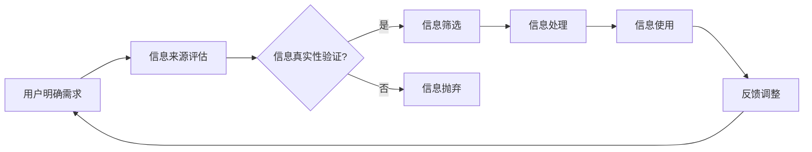

                 

### 《信息过载与信息筛选策略与实践：在信息洪流中找到有价值的信息》

在当今数字时代，信息无处不在，几乎每时每刻都在刷新和更新。从社交媒体到新闻网站，从专业论坛到博客，海量信息以惊人的速度涌入我们的生活和工作。这种现象被称为“信息过载”，它已成为现代社会中一个普遍而严峻的问题。信息过载不仅导致我们的注意力分散，增加焦虑和压力，还可能影响我们的工作效率和决策质量。因此，掌握有效的信息筛选策略，以从海量信息中提取有价值的内容，变得尤为重要。

本文旨在探讨信息过载的背景与影响，介绍信息筛选的基本原则、策略与实践，并通过实际案例展示如何有效应用这些策略。我们将通过以下几个部分展开讨论：

1. **信息过载现状分析**：描述信息过载的定义、现象、影响及信息筛选与信息过载的关系。
2. **信息筛选策略**：详细讲解信息筛选的基本原则、工具与技术，以及实践方法。
3. **信息筛选策略应用与实践**：分别从个人和组织层面，介绍信息筛选策略的具体应用和实践。
4. **信息筛选策略的评估与优化**：讨论信息筛选效果评估、策略优化及持续改进。

通过本文的阅读，您将获得：

- 对信息过载现象的深刻理解。
- 掌握一系列实用的信息筛选策略。
- 获得在信息洪流中高效找到有价值信息的实践经验和技巧。

让我们一步步深入探讨这个重要且具有挑战性的主题。首先，我们从信息过载的定义与现象开始。

---

### **第一部分：信息过载现状分析**

#### **第1章：信息过载的背景与影响**

##### **1.1 信息过载的定义与现象**

**信息过载**是指信息接收者因接收到的信息量过多，而难以有效地处理和利用这种现象。它不仅发生在个人层面，也广泛存在于组织和工作场所。随着互联网和移动设备的普及，信息过载的问题变得愈加严重。

**信息过载的现象**包括：

- **信息超载**：每天接收到的电子邮件、社交媒体更新、新闻推送等数量庞大，难以一一处理。
- **注意力分散**：在处理多个信息源时，难以集中注意力，导致效率降低。
- **决策困难**：面对大量信息，难以做出明智的决策。
- **压力增加**：处理信息过程中产生的焦虑和压力，影响个人心理健康。

##### **1.2 信息过载对社会的影响**

**信息过载**对社会的影响深远，尤其在个人层面和工作场所体现得尤为明显。

**个人层面的影响**：

- **焦虑和压力**：信息过载导致个人感受到的焦虑和压力增加，影响心理健康。
- **决策困难**：在大量信息面前，难以做出明智的决策，导致行动迟缓。
- **效率降低**：注意力分散导致工作效率下降，影响生产力。
- **学习困难**：在信息过载的环境中，难以筛选出有用的学习资料，影响个人成长。

**组织与工作场所的影响**：

- **沟通障碍**：大量信息干扰正常沟通，导致信息传递效率降低。
- **决策迟缓**：管理层在处理大量信息时，难以迅速做出决策，影响业务发展。
- **生产力下降**：员工在信息过载的环境中，难以集中精力工作，导致生产力下降。
- **安全风险**：大量未经筛选的信息可能包含安全威胁，增加组织安全风险。

##### **1.3 信息过载对心理健康的影响**

**信息过载**对心理健康的影响不容忽视。长时间处于信息过载环境中，可能会导致以下问题：

- **焦虑与压力**：面对大量信息，个体往往感到压力重重，导致焦虑情绪增加。
- **注意力分散**：注意力难以集中，容易分心，影响工作和学习效率。
- **睡眠质量下降**：夜晚难以入睡，睡眠质量下降，影响第二天的精神状态。
- **心理健康问题**：长期处于高压状态，可能导致抑郁、焦虑等心理健康问题。

##### **1.4 信息过载与信息筛选的关系**

**信息筛选**是解决信息过载问题的重要手段。有效的信息筛选可以帮助：

- **降低信息量**：从海量信息中筛选出有价值的信息，减轻信息过载的压力。
- **提高效率**：通过快速获取和利用有用信息，提高工作和学习效率。
- **增强决策质量**：在筛选过程中，能够更准确地分析信息，做出更明智的决策。
- **维护心理健康**：减少信息过载对心理健康的负面影响，提高生活质量。

总结而言，信息过载已成为现代社会的一个普遍问题，对个人和社会都带来了深远的影响。通过有效的信息筛选策略，我们可以减轻信息过载的压力，提高生活和工作质量。在下一部分中，我们将详细探讨信息筛选的基本原则和策略。

---

### **第二部分：信息筛选策略**

在了解了信息过载的现状及其影响之后，我们需要探索有效的信息筛选策略，以便在信息洪流中找到有价值的信息。本部分将详细讲解信息筛选的基本原则、工具和技术，以及具体的实践方法。

#### **第2章：信息筛选的基本原则**

##### **2.1 明确信息需求**

**明确信息需求**是信息筛选的首要步骤。只有明确了需要什么信息，我们才能有针对性地进行筛选。

**目标设定**：首先，我们需要明确信息筛选的目标。目标可以是获取新的知识、解决问题、了解市场动态等。

**信息类型**：其次，我们需要确定需要获取的信息类型。例如，是学术文献、新闻报道、技术文档，还是社交媒体更新。

**需求分析**：在明确需求和类型后，进行需求分析，了解哪些信息是最为关键和急需的。

##### **2.2 信息来源评估**

**信息来源评估**是信息筛选的重要环节。评估信息来源的可靠性和权威性，有助于确保筛选出的信息质量。

**评估标准**：

- **权威性**：信息来源的权威性是评估的首要标准。例如，学术期刊、权威媒体、知名机构发布的信息通常具有较高的可信度。
- **相关性**：信息来源的相关性也很重要。来源与信息需求的匹配度越高，信息的价值越大。
- **更新频率**：信息更新的频率也是评估的重要指标。对于需要最新信息的场合，高频更新的来源更受欢迎。
- **用户评价**：用户对信息来源的评价也是评估的一个参考因素。高评价通常意味着信息质量较高。

**常见信息源分析**：

- **学术文献**：学术期刊、会议论文、学位论文等是获取专业信息的重要来源。但学术文献通常需要较高的专业知识和阅读能力。
- **权威媒体**：权威新闻机构发布的新闻报道具有较高的可信度。然而，新闻可能存在主观性，需要结合其他来源进行验证。
- **专业论坛**：专业论坛汇聚了大量专业人士的讨论，可以获取实用经验和最新动态。但论坛内容的质量参差不齐。
- **社交媒体**：社交媒体上的信息丰富多样，但真实性难以保证。用户需要具备较强的信息鉴别能力。

##### **2.3 信息真实性验证**

**信息真实性验证**是确保信息准确性的关键步骤。在获取信息后，我们需要验证其真实性，避免受到虚假信息的误导。

**真伪信息辨别**：

- **来源验证**：检查信息来源的可靠性，确保信息来自权威和可信的渠道。
- **多源比对**：通过多个来源比对信息，交叉验证其真实性。
- **事实核查**：对关键信息进行事实核查，确保其符合实际情况。

**真实性验证方法**：

- **人工验证**：通过专家或专业人士对信息进行人工审核和验证。
- **自动化工具**：使用事实核查工具、搜索引擎等自动化工具进行信息验证。
- **用户反馈**：收集用户对信息的反馈，通过社区评议来评估信息的真实性。

##### **2.4 信息时效性考量**

**信息时效性**是信息筛选中不可忽视的一个方面。时效性较高的信息更具参考价值，但同时也更易过时。

**时效性的重要性**：

- **动态性**：信息的时效性反映了信息的动态性，即信息是否反映当前情况。
- **价值性**：时效性较高的信息更具实用性和参考价值。
- **风险性**：过时的信息可能带来误导，增加风险。

**时效性评估方法**：

- **更新日期**：检查信息发布的日期，判断其是否属于最近的时间段。
- **动态更新**：关注信息来源的更新频率，判断其是否保持动态更新。
- **引用来源**：查看信息引用的其他来源，判断其时效性和更新情况。

通过明确信息需求、评估信息来源、验证信息真实性以及考量信息时效性，我们可以有效地筛选出有价值的信息。在下一章中，我们将介绍具体的信息筛选工具和技术。

---

### **第三部分：信息筛选工具与技术**

在了解了信息筛选的基本原则后，我们需要借助一系列工具和技术来辅助信息筛选，以更加高效地找到有价值的信息。本部分将详细介绍信息筛选工具和技术，包括搜索引擎优化、信息过滤与推送技术，以及数据挖掘与机器学习在信息筛选中的应用。

#### **第3章：信息筛选工具与技术**

##### **3.1 搜索引擎优化**

搜索引擎是获取信息的主要工具之一，其优化直接影响到我们能否快速找到有价值的信息。

**搜索策略**：

- **关键词选择**：选择准确、具体的关键词是搜索成功的关键。可以使用多个关键词进行组合搜索，提高搜索的精准度。
- **搜索技巧**：利用高级搜索技巧，如使用引号搜索、排除特定关键词、使用搜索运算符等，可以进一步优化搜索结果。
- **搜索历史与推荐**：利用搜索引擎提供的搜索历史和推荐功能，可以快速找到相关的信息。

**高级搜索技巧**：

- **引号搜索**：“”用于搜索精确的短语，例如，“人工智能”。
- **排除关键词**：使用“-”号排除不相关的关键词，例如，“人工智能 -股市”。
- **搜索运算符**：使用“AND”、“OR”、“NOT”等运算符进行逻辑组合，例如，“AI AND machine learning”。

##### **3.2 信息过滤与推送技术**

信息过滤与推送技术可以帮助我们自动获取和筛选感兴趣的信息。

**基于内容的过滤**：

- **内容匹配**：通过分析信息内容，将其与用户设定的兴趣标签或关键词进行匹配，筛选出相关内容。
- **语义分析**：利用自然语言处理技术，对信息内容进行语义分析，理解其含义和主题，从而实现更精确的过滤。

**基于用户行为的推送**：

- **用户偏好**：根据用户的浏览历史、搜索记录和兴趣标签，预测用户的偏好，推送符合用户需求的信息。
- **行为模式**：分析用户的行为模式，如阅读时间、阅读频率等，调整推送策略，提高推送的准确性和相关性。

##### **3.3 数据挖掘与机器学习在信息筛选中的应用**

数据挖掘与机器学习技术为信息筛选提供了强大的支持，通过自动化的方式提高筛选效率和准确性。

**数据预处理**：

- **数据清洗**：去除重复、错误和无关的数据，确保数据质量。
- **特征提取**：从原始数据中提取有用的特征，用于训练机器学习模型。

**机器学习模型应用**：

- **分类模型**：通过训练分类模型，将信息分为不同的类别，便于后续处理。
- **推荐系统**：利用协同过滤、基于内容的推荐等算法，为用户推荐相关或感兴趣的信息。
- **文本挖掘**：通过文本挖掘技术，对信息内容进行深入分析，提取关键信息和潜在主题。

**应用实例**：

- **社交媒体信息筛选**：利用机器学习模型对社交媒体上的信息进行分类和推荐，帮助用户快速找到感兴趣的内容。
- **学术文献筛选**：通过文本挖掘技术，对学术文献进行自动分类和推荐，提高科研工作效率。

通过以上工具和技术，我们可以更高效、更准确地筛选出有价值的信息。在下一章中，我们将讨论信息筛选的具体实践方法。

---

### **第四部分：信息筛选的实践方法**

在了解了信息筛选的理论基础和工具技术之后，我们需要将这些知识应用到实际场景中，以实现有效的信息筛选。本部分将详细介绍信息筛选的实践方法，包括信息收集、信息整理和信息筛选的流程与步骤，并分享一些实战案例。

#### **第4章：信息筛选的实践方法**

##### **4.1 信息筛选的流程与步骤**

**信息收集**是信息筛选的第一步，需要根据明确的信息需求和评估过的信息来源，收集相关数据和信息。

**步骤一：信息收集**

- **确定信息需求**：明确需要收集的信息类型、主题和目的。
- **选择信息来源**：根据评估标准，选择可靠、相关的信息来源。
- **收集信息**：利用各种工具和技术，如搜索引擎、数据库、社交媒体等，收集所需信息。

**信息整理**是将收集到的信息进行分类、归纳和整理，使其更加系统和易于使用。

**步骤二：信息整理**

- **分类与归档**：根据信息的主题和类型，进行分类和归档，以便于后续查找和使用。
- **去除重复和冗余**：删除重复的信息，合并相似的内容，减少冗余，提高信息质量。
- **标注与注释**：对重要信息进行标注和注释，记录其来源和背景信息，便于后续分析和使用。

**信息筛选**是核心步骤，通过设定筛选标准，从整理好的信息中筛选出最有价值的信息。

**步骤三：信息筛选**

- **设定筛选标准**：根据信息需求、来源评估、真实性验证和时效性考量，设定具体的筛选标准。
- **应用筛选工具**：利用搜索引擎优化、信息过滤与推送技术、数据挖掘与机器学习等工具，实施信息筛选。
- **评估筛选结果**：对筛选结果进行评估，确保筛选出的信息满足需求，并去除无关和错误的信息。

##### **4.2 信息筛选的实战案例**

**案例一：社交媒体信息筛选**

**目标**：从大量社交媒体更新中筛选出与特定主题相关的、可信度高且时效性好的信息。

**步骤**：

1. **确定信息需求**：明确需要筛选的主题，如“人工智能最新动态”。
2. **选择信息来源**：选择可信度高的社交媒体平台，如Twitter、LinkedIn。
3. **信息收集**：利用社交媒体平台的搜索功能，收集相关更新。
4. **信息整理**：对收集的信息进行分类和整理，去除重复和冗余内容。
5. **信息筛选**：设定筛选标准，如发布日期、引用来源、用户评价等，应用信息过滤与推送技术，筛选出高质量的信息。
6. **评估筛选结果**：对筛选结果进行评估，确保信息的准确性和相关性。

**案例二：学术文献筛选**

**目标**：从大量学术文献中筛选出与研究方向相关的、权威性高且更新及时的文献。

**步骤**：

1. **确定信息需求**：明确研究方向和需求，如“机器学习在医疗领域的应用”。
2. **选择信息来源**：选择权威的学术数据库，如PubMed、IEEE Xplore。
3. **信息收集**：利用学术数据库的搜索功能，收集相关文献。
4. **信息整理**：对收集的文献进行分类和整理，去除重复和冗余内容。
5. **信息筛选**：设定筛选标准，如文献发表日期、引用次数、作者知名度等，利用数据挖掘与机器学习技术，筛选出高质量的文献。
6. **评估筛选结果**：对筛选结果进行评估，确保文献的权威性和时效性。

通过以上实战案例，我们可以看到，信息筛选的实践方法需要根据具体场景和需求进行灵活调整，但基本流程和步骤是相通的。在下一章中，我们将讨论信息筛选过程中可能遇到的挑战及应对策略。

---

### **第五部分：信息筛选策略应用与实践**

在掌握了信息筛选的基本理论和方法后，我们需要将信息筛选策略应用到实际生活和工作中，以应对信息过载的挑战。本部分将分别从个人层面和组织层面，介绍信息筛选策略的具体应用与实践。

#### **第5章：个人层面的信息筛选策略**

在个人层面，信息筛选策略可以帮助我们更好地管理个人时间，提高信息利用效率，减少信息过载的压力。

##### **5.1 个人信息筛选计划**

**制定计划**是信息筛选的第一步，它可以帮助我们有条不紊地进行信息筛选。

**步骤**：

1. **明确目标**：首先，明确自己的信息筛选目标。例如，提高工作效率、获取新知识、追踪特定领域的最新动态等。
2. **划分时间**：合理分配时间，设定每日或每周的信息筛选时间，避免过度消耗时间在信息筛选上。
3. **制定计划**：根据目标和时间分配，制定具体的信息筛选计划，包括信息收集、整理和筛选的步骤。

##### **5.2 个人信息筛选工具选择**

**选择合适的工具**是信息筛选的关键。以下是一些常用的工具及其特点：

- **搜索引擎**：如Google、Bing等，用于快速获取广泛的信息。
- **社交媒体管理工具**：如Feedly、Inoreader等，用于订阅和筛选感兴趣的内容。
- **笔记工具**：如Evernote、OneNote等，用于整理和记录重要信息。
- **信息过滤工具**：如SpamAssassin、MailWasher等，用于过滤电子邮件中的垃圾邮件。

**工具评价与选择**：

- **评价标准**：评价工具时，可以从功能、易用性、安全性、兼容性等方面进行评估。
- **选择建议**：根据个人需求，选择最适合的工具。例如，对于学术研究，可以使用EndNote、Zotero等专业文献管理工具。

##### **5.3 个人信息筛选实践**

**实践**是将信息筛选策略付诸行动的过程，以下是一些具体的实践步骤和心得：

**步骤**：

1. **设定信息需求**：明确自己需要哪些信息，并制定相应的信息收集和筛选计划。
2. **收集信息**：利用搜索引擎、社交媒体、专业论坛等渠道，收集相关信息。
3. **整理信息**：对收集的信息进行分类、归档，并添加注释，便于后续查找和使用。
4. **筛选信息**：根据设定的筛选标准，对整理好的信息进行筛选，确保信息的准确性和相关性。
5. **评估与实践调整**：定期评估信息筛选的效果，并根据实际情况进行调整。

**心得**：

- **保持专注**：在信息筛选过程中，保持专注，避免分心，提高效率。
- **持续学习**：不断学习新的信息筛选工具和技术，提高筛选能力。
- **灵活调整**：根据实际情况，灵活调整信息筛选策略和工具，以达到最佳效果。

通过个人层面的信息筛选策略，我们可以更高效地管理信息，提高工作和学习效率，减轻信息过载的压力。在下一章中，我们将探讨组织与团队层面的信息筛选策略。

---

### **第六章：组织与团队层面的信息筛选策略**

在组织与团队层面，信息筛选策略的实施有助于提高团队的协作效率，确保信息传递的准确性和及时性。本部分将介绍组织信息筛选体系的建立、团队信息筛选协作，以及相关案例分享。

##### **6.1 组织信息筛选体系的建立**

建立有效的组织信息筛选体系是确保信息筛选策略落地的基础。

**组织信息需求分析**：

- **需求识别**：通过访谈、问卷调查等方式，识别组织内部不同部门和员工的信息需求。
- **需求分类**：将信息需求进行分类，如战略规划、市场营销、技术研发等，以便制定有针对性的筛选策略。

**信息筛选流程设计**：

- **信息收集**：制定信息收集流程，包括来源评估、数据收集和初步整理等步骤。
- **信息整理**：对收集的信息进行分类、归档和标注，确保信息的组织性和可查找性。
- **信息筛选**：设定筛选标准，通过自动化工具或人工审核，对信息进行筛选和验证。
- **信息分发**：将筛选出的有价值信息，通过内部通讯工具、会议等形式，分发给相关部门和员工。

**信息筛选工具与平台选择**：

- **工具评估**：根据组织的需求和预算，评估不同的信息筛选工具，如数据库、文档管理系统、社交媒体监控平台等。
- **平台集成**：选择能够与现有系统集成的信息筛选平台，以提高信息流通的效率。

##### **6.2 团队信息筛选协作**

有效的团队信息筛选协作，可以确保团队成员能够及时获取到准确、有用的信息，提高团队整体的工作效率。

**信息共享与协作**：

- **建立共享平台**：使用企业内部的共享平台，如企业微信群、内部论坛等，方便团队成员发布、共享和讨论信息。
- **明确分工**：团队成员根据各自的专业领域和职责，分工负责不同的信息筛选任务。
- **定期更新**：定期更新共享平台上的信息，确保信息的时效性和准确性。

**信息筛选团队管理**：

- **团队建设**：加强团队建设，提高团队成员的信息筛选技能和协作能力。
- **培训与发展**：定期组织信息筛选培训，提升团队成员的专业知识和实践能力。
- **绩效评估**：建立信息筛选团队绩效评估体系，激励团队成员积极参与信息筛选工作。

##### **6.3 组织信息筛选案例**

**案例一：企业内部信息筛选系统**

**背景**：某大型企业由于业务范围广泛，每天需要处理大量的市场信息、客户反馈和技术动态。

**解决方案**：

- **需求分析**：对企业内部信息需求进行详细分析，识别关键信息类型和需求。
- **系统设计**：设计一套集成的信息筛选系统，包括信息收集、整理、筛选和分发的模块。
- **实施与运营**：实施信息筛选系统，并进行持续的运营和维护，确保系统的稳定运行。

**效果**：

- **信息流通效率提升**：通过系统化信息筛选，显著提高了企业内部信息流通效率。
- **决策支持加强**：有价值的信息及时传递给决策层，提高了决策的准确性和及时性。
- **团队协作增强**：团队成员通过共享平台，加强信息交流和协作，提高了整体工作效率。

**案例二：学术团队信息筛选机制**

**背景**：某学术团队需要进行大量的文献调研和资料收集，以确保研究工作的顺利进行。

**解决方案**：

- **需求分析**：对学术团队的研究方向和文献需求进行详细分析。
- **文献管理工具**：选用专业的文献管理工具，如EndNote、Zotero，用于收集、整理和筛选文献。
- **信息共享平台**：建立内部信息共享平台，方便团队成员共享和讨论研究资料。

**效果**：

- **文献收集效率提升**：通过文献管理工具，快速收集和整理相关文献，提高了文献收集效率。
- **研究质量提高**：通过有效的信息筛选，确保研究工作使用的是最新、最权威的文献，提高了研究质量。
- **团队协作加强**：团队成员通过共享平台，加强信息交流和协作，提高了整体研究效率。

通过建立有效的组织信息筛选体系，加强团队信息筛选协作，组织可以更好地应对信息过载的挑战，提高信息利用效率，提升团队整体的工作效率和研究质量。在下一章中，我们将讨论信息筛选策略的评估与优化。

---

### **第七章：信息筛选策略的评估与优化**

在实施信息筛选策略的过程中，评估与优化是确保策略持续有效的重要环节。本部分将讨论信息筛选效果评估、策略优化及持续改进的方法。

##### **7.1 信息筛选效果评估**

评估信息筛选效果是了解策略实施效果的关键步骤。以下是一些常用的评估方法和指标：

**评估指标**：

- **信息准确性**：评估筛选出的信息是否符合需求，是否准确可靠。
- **信息时效性**：评估筛选出的信息是否及时更新，是否反映当前情况。
- **信息相关性**：评估筛选出的信息与需求的相关性，是否满足用户需求。
- **信息覆盖面**：评估筛选出的信息是否覆盖了所需领域的各个方面。

**评估方法**：

- **用户反馈**：通过用户调查、访谈等方式，了解用户对信息筛选效果的满意度和改进建议。
- **定量分析**：使用数据统计方法，对评估指标进行定量分析，如计算准确率、召回率等。
- **对比分析**：将当前信息筛选策略与历史策略或行业标准进行对比，评估策略的改进效果。

**评估实践**：

1. **定期评估**：定期对信息筛选效果进行评估，如每季度或每半年进行一次全面评估。
2. **持续监控**：通过监控系统日志、用户行为等数据，持续监控信息筛选的效果和问题。
3. **反馈机制**：建立反馈机制，鼓励用户提出改进建议，及时调整信息筛选策略。

##### **7.2 信息筛选策略优化**

优化信息筛选策略是提高信息利用效率和筛选质量的重要手段。以下是一些优化方向和策略：

**优化方向**：

- **提升准确性**：通过改进信息来源评估、真实性验证和筛选算法，提高信息筛选的准确性。
- **增强时效性**：优化信息收集和更新机制，确保信息的时效性。
- **提高相关性**：根据用户行为和偏好，调整信息筛选模型，提高信息的相关性。
- **扩展覆盖面**：增加信息来源，扩大信息覆盖范围，确保全面性。

**优化策略**：

1. **技术优化**：利用先进的数据挖掘、机器学习和自然语言处理技术，提升信息筛选的自动化和智能化水平。
2. **流程优化**：优化信息筛选的流程，减少冗余步骤，提高效率。
3. **工具升级**：更新和升级信息筛选工具，引入新的技术和功能，提高筛选能力。
4. **培训提升**：加强团队成员的信息筛选技能培训，提高整体的信息筛选水平。

##### **7.3 信息筛选策略的持续改进**

持续改进是信息筛选策略成功实施的关键。以下是一些实践方法：

**持续改进机制**：

- **定期审查**：定期审查信息筛选策略的实施情况，识别问题并及时调整。
- **用户参与**：鼓励用户参与信息筛选策略的改进，收集用户的反馈和建议。
- **数据驱动**：基于数据分析，识别信息筛选中的问题，制定针对性的改进措施。
- **试点实施**：在特定部门或团队中试点新的信息筛选策略，评估其效果，再逐步推广。

**持续改进实践**：

1. **建立改进计划**：制定详细的信息筛选策略改进计划，明确改进的目标、方法和时间表。
2. **实施与监控**：按照改进计划实施改进措施，并持续监控改进效果。
3. **反馈与调整**：根据实施反馈，不断调整和优化改进措施，确保策略的持续有效性。
4. **知识共享**：鼓励团队成员分享改进经验和成果，促进知识共享和协作。

通过评估与优化，组织可以确保信息筛选策略的有效性和适应性，提高信息利用效率，减轻信息过载压力。在持续改进的过程中，组织能够不断适应新的信息环境和需求，保持信息筛选策略的领先性和前瞻性。

---

### **附录**

#### **附录A：信息筛选资源推荐**

为了帮助读者更好地掌握信息筛选的方法和实践，我们推荐以下资源：

**A.1 信息筛选相关书籍推荐**

1. **《信息过载：数字化时代如何应对信息过剩》**
   - 作者：Alvin Toffler
   - 内容简介：探讨数字化时代信息过载现象及其影响，提出应对策略。

2. **《信息素养：数字化时代的信息能力培养》**
   - 作者：Paul J. Bruemmer
   - 内容简介：介绍信息素养的概念、方法和实践，提升信息筛选和利用能力。

3. **《信息过滤：如何在海量信息中找到有价值的信息》**
   - 作者：Thomas H. Davenport
   - 内容简介：深入探讨信息过滤的理论和实践，帮助读者掌握有效的信息筛选方法。

**A.2 信息筛选工具与平台介绍**

1. **Google Scholar**
   - 简介：用于学术文献搜索的搜索引擎，支持高级搜索功能。

2. **PubMed**
   - 简介：由美国国家医学图书馆开发的生物医学文献数据库。

3. **EndNote**
   - 简介：专业的文献管理工具，支持文献收集、整理和引用。

4. **Feedly**
   - 简介：RSS订阅阅读器，帮助用户订阅和管理感兴趣的内容。

**A.3 信息筛选在线资源链接**

1. **Google 搜索技巧**
   - 链接：[Google 搜索技巧](https://support.google.com/websearch/answer/2464859?hl=en)

2. **数据挖掘与机器学习资源**
   - 链接：[Kaggle](https://www.kaggle.com/tutorials)、[Machine Learning Mastery](https://machinelearningmastery.com)

3. **信息素养培训**
   - 链接：[University of Illinois at Urbana-Champaign](https://lib.illinois.edu/tutorials/infolit)

通过以上资源，读者可以进一步学习和实践信息筛选的方法和技术，提升信息筛选的能力。

---

### **结尾**

在信息爆炸的时代，掌握有效的信息筛选策略显得尤为重要。本文从信息过载的现状出发，详细介绍了信息筛选的基本原则、工具与技术，以及实际应用和实践方法。通过明确信息需求、评估信息来源、验证信息真实性、考量信息时效性，我们可以从海量信息中提取有价值的内容。

信息筛选不仅有助于提高个人和团队的工作效率，还能减轻信息过载的压力，提升决策质量。通过评估与优化，我们可以不断改进信息筛选策略，确保其适应性和有效性。

信息筛选是一个持续的过程，需要我们不断学习和实践。希望本文能为读者提供有价值的指导和启示，帮助您在信息洪流中找到有价值的信息。

---

**作者：AI天才研究院/AI Genius Institute & 禅与计算机程序设计艺术 /Zen And The Art of Computer Programming**

---

### **附录**

#### **附录A：信息筛选资源推荐**

为了帮助读者更好地掌握信息筛选的方法和实践，我们推荐以下资源：

**A.1 信息筛选相关书籍推荐**

1. **《信息过载：数字化时代如何应对信息过剩》**
   - 作者：Alvin Toffler
   - 内容简介：探讨数字化时代信息过载现象及其影响，提出应对策略。

2. **《信息素养：数字化时代的信息能力培养》**
   - 作者：Paul J. Bruemmer
   - 内容简介：介绍信息素养的概念、方法和实践，提升信息筛选和利用能力。

3. **《信息过滤：如何在海量信息中找到有价值的信息》**
   - 作者：Thomas H. Davenport
   - 内容简介：深入探讨信息过滤的理论和实践，帮助读者掌握有效的信息筛选方法。

**A.2 信息筛选工具与平台介绍**

1. **Google Scholar**
   - 简介：用于学术文献搜索的搜索引擎，支持高级搜索功能。

2. **PubMed**
   - 简介：由美国国家医学图书馆开发的生物医学文献数据库。

3. **EndNote**
   - 简介：专业的文献管理工具，支持文献收集、整理和引用。

4. **Feedly**
   - 简介：RSS订阅阅读器，帮助用户订阅和管理感兴趣的内容。

**A.3 信息筛选在线资源链接**

1. **Google 搜索技巧**
   - 链接：[Google 搜索技巧](https://support.google.com/websearch/answer/2464859?hl=en)

2. **数据挖掘与机器学习资源**
   - 链接：[Kaggle](https://www.kaggle.com/tutorials)、[Machine Learning Mastery](https://machinelearningmastery.com)

3. **信息素养培训**
   - 链接：[University of Illinois at Urbana-Champaign](https://lib.illinois.edu/tutorials/infolit)

通过以上资源，读者可以进一步学习和实践信息筛选的方法和技术，提升信息筛选的能力。

---

### **附录B：信息筛选相关 Mermaid 流程图**

以下是一个用于描述信息筛选过程的 Mermaid 流程图：



在这个流程图中，信息筛选过程分为以下几个步骤：

1. **用户明确需求**：用户根据自身需求确定需要筛选的信息类型。
2. **信息来源评估**：评估信息来源的权威性、相关性和更新频率。
3. **信息真实性验证**：验证信息的真实性，排除虚假信息。
4. **信息筛选**：根据设定的筛选标准，筛选出有价值的信息。
5. **信息处理**：对筛选出的信息进行整理、分类和标注。
6. **信息使用**：使用有价值的信息进行学习、工作或决策。
7. **反馈调整**：根据使用反馈调整信息筛选策略，优化筛选效果。

---

### **附录C：信息筛选算法的伪代码示例**

以下是一个信息筛选算法的伪代码示例：

```plaintext
// 伪代码：基于内容的文本匹配信息筛选算法
function ContentBasedFiltering(document, keywords, similarityThreshold) {
    similarityScore = CalculateSimilarity(document, keywords)
    
    if (similarityScore > similarityThreshold) {
        return "Match"
    } else {
        return "No Match"
    }
}

function CalculateSimilarity(document, keywords) {
    // 伪代码：计算文档与关键词的相似度
    // 使用TF-IDF、Word2Vec等方法计算相似度
    // 返回相似度分数
    similarityScore = ...
    return similarityScore
}
```

在这个伪代码中：

- `ContentBasedFiltering` 函数接收文档、关键词和相似度阈值作为输入，计算文档与关键词的相似度，并根据相似度阈值判断是否匹配。
- `CalculateSimilarity` 函数用于计算文档与关键词的相似度，可以使用TF-IDF、Word2Vec等方法。

---

### **附录D：信息筛选的数学模型示例**

以下是一个信息筛选的置信度计算数学模型示例：

```latex
\documentclass{article}
\usepackage{amsmath}
\begin{document}
\begin{equation}
    \text{Confidence} = \frac{\text{PositiveFeedback}}{\text{TotalFeedback} + \text{PositiveFeedback}}
\end{equation}
\end{document}
```

在这个数学模型中：

- **PositiveFeedback** 表示正面反馈的数量。
- **TotalFeedback** 表示总的反馈数量（包括正面和负面反馈）。
- **Confidence** 表示对信息的置信度，值越高表示信息越可信。

---

### **附录E：信息筛选的实战案例**

**案例一：社交媒体信息筛选**

**目标**：从大量社交媒体更新中筛选出与特定主题相关的、可信度高且时效性好的信息。

**步骤**：

1. **需求分析**：确定需要筛选的主题，如“人工智能最新动态”。
2. **信息收集**：使用社交媒体平台的搜索功能，收集相关更新。
3. **信息整理**：对收集的信息进行分类和整理，去除重复和冗余内容。
4. **信息筛选**：设定筛选标准，如发布日期、引用来源、用户评价等，利用信息过滤与推送技术，筛选出高质量的信息。
5. **评估筛选结果**：对筛选结果进行评估，确保信息的准确性和相关性。

**案例二：学术文献筛选**

**目标**：从大量学术文献中筛选出与研究方向相关的、权威性高且更新及时的文献。

**步骤**：

1. **需求分析**：明确研究方向和需求，如“机器学习在医疗领域的应用”。
2. **信息收集**：利用学术数据库的搜索功能，收集相关文献。
3. **信息整理**：对收集的文献进行分类和整理，去除重复和冗余内容。
4. **信息筛选**：设定筛选标准，如文献发表日期、引用次数、作者知名度等，利用数据挖掘与机器学习技术，筛选出高质量的文献。
5. **评估筛选结果**：对筛选结果进行评估，确保文献的权威性和时效性。

**代码实现**

以下是一个简单的Python代码示例，用于实现社交媒体信息筛选：

```python
import tweepy
from textblob import TextBlob

# 配置API密钥和访问令牌
consumer_key = '您的消费者密钥'
consumer_secret = '您的消费者秘密'
access_token = '您的访问令牌'
access_token_secret = '您的访问令牌秘密'

# 初始化tweepy
auth = tweepy.OAuthHandler(consumer_key, consumer_secret)
auth.set_access_token(access_token, access_token_secret)
api = tweepy.API(auth)

# 搜索关键词
search_query = "人工智能"
tweets = api.search_tweets(q=search_query, lang="zh", count=100)

# 过滤和筛选
filtered_tweets = []
for tweet in tweets:
    analysis = TextBlob(tweet.text)
    if analysis.sentiment.polarity > 0:
        filtered_tweets.append(tweet.text)

# 输出结果
for tweet in filtered_tweets:
    print(tweet)
```

在这个示例中，我们使用tweepy库连接Twitter API，搜索特定关键词（如“人工智能”），并使用TextBlob库对每条微博进行情感分析，筛选出正面情绪的微博。

---

### **代码解读与分析**

**开发环境搭建**

- **Python环境**：安装Python 3.6及以上版本。
- **库**：安装`tweepy`（用于连接Twitter API）、`TextBlob`（用于文本情感分析）。

**源代码详细实现和代码解读**

```python
import tweepy
from textblob import TextBlob

# 配置API密钥和访问令牌
consumer_key = '您的消费者密钥'
consumer_secret = '您的消费者秘密'
access_token = '您的访问令牌'
access_token_secret = '您的访问令牌秘密'

# 初始化tweepy
auth = tweepy.OAuthHandler(consumer_key, consumer_secret)
auth.set_access_token(access_token, access_token_secret)
api = tweepy.API(auth)

# 搜索关键词
search_query = "人工智能"
tweets = api.search_tweets(q=search_query, lang="zh", count=100)

# 过滤和筛选
filtered_tweets = []
for tweet in tweets:
    analysis = TextBlob(tweet.text)
    if analysis.sentiment.polarity > 0:
        filtered_tweets.append(tweet.text)

# 输出结果
for tweet in filtered_tweets:
    print(tweet)
```

- **配置API密钥和访问令牌**：使用tweepy连接Twitter API，需要配置API密钥和访问令牌。这些密钥和令牌可以在Twitter Developer网站上申请。
- **初始化tweepy**：通过OAuthHandler和API对象初始化tweepy库，用于后续的API调用。
- **搜索关键词**：使用`search_tweets`方法搜索包含特定关键词（如“人工智能”）的微博，设置语言为中文，并限制搜索结果的数量。
- **过滤和筛选**：遍历搜索结果，使用TextBlob库对每条微博进行情感分析，筛选出正面情绪的微博。`sentiment.polarity`属性用于判断情感极性，大于0表示正面情绪。
- **输出结果**：遍历筛选出的微博，并输出结果。

**代码解读与分析**

- **tweepy库**：tweepy是Python中用于连接Twitter API的库，提供了简单易用的接口，用于获取、分析和管理微博数据。
- **TextBlob库**：TextBlob是Python中用于文本情感分析的库，提供了便捷的方法来分析文本的情感极性。
- **情感分析**：情感分析是信息筛选的重要一环，通过分析文本的情感极性，可以筛选出正面或负面情绪的内容，从而提高信息筛选的准确性。
- **开发环境**：搭建开发环境需要安装Python、tweepy和TextBlob库，可以通过pip命令进行安装。

通过以上代码示例，我们可以实现一个简单的社交媒体信息筛选系统，用于从微博中筛选出正面情绪的内容。在实际应用中，可以根据具体需求调整关键词、情感分析的阈值等参数，以提高筛选效果。

