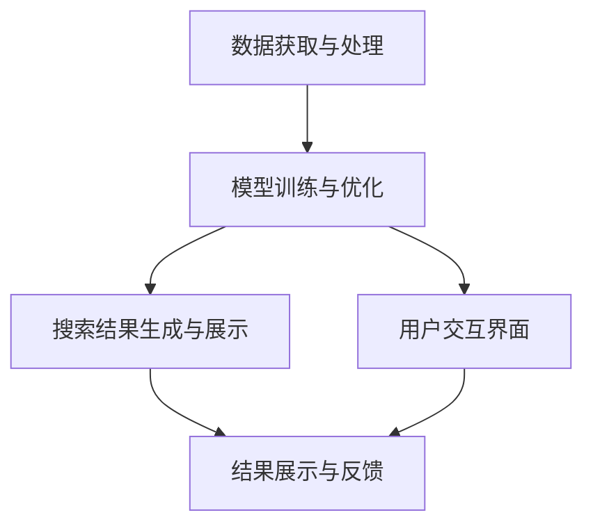
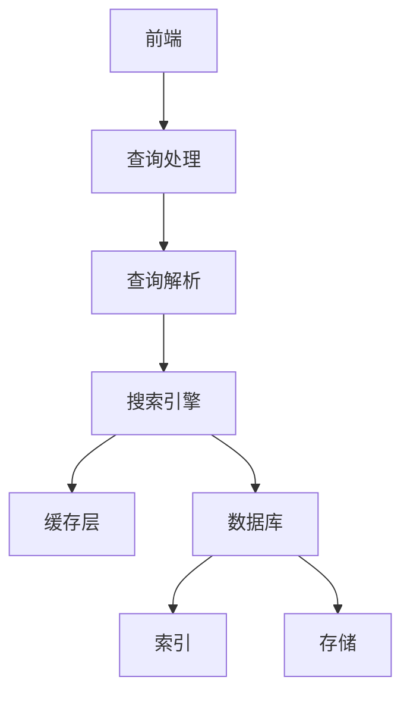
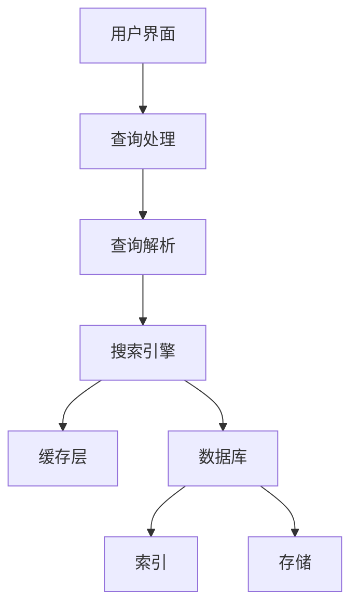
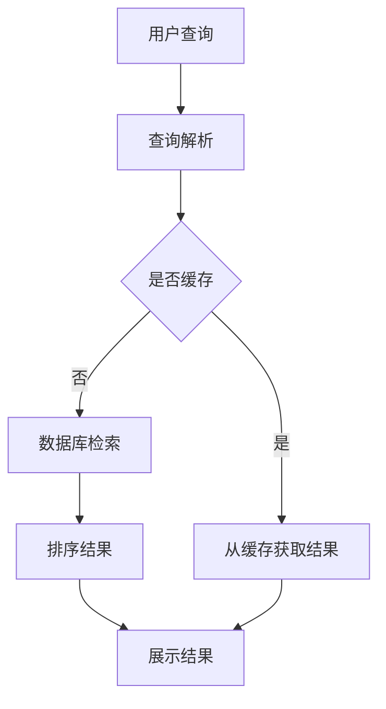
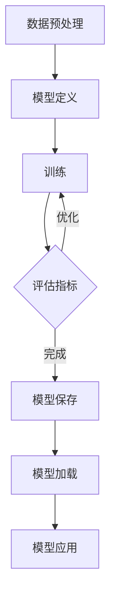

                 

### 《AI搜索引擎在专业领域的应用》

#### 关键词：
- AI搜索引擎
- 专业领域
- 自然语言处理
- 深度学习
- 应用案例

##### 摘要：

本文旨在探讨AI搜索引擎在专业领域的应用，通过对AI搜索引擎的概述、核心技术解析以及专业领域应用的深入分析，揭示AI技术在各专业领域中的巨大潜力。文章将详细阐述AI搜索引擎在学术研究、职场招聘、医疗健康等领域的应用，并结合具体项目实战案例进行剖析，为读者提供全方位的技术指导与实践经验。

---

### 第一部分：AI搜索引擎概述

#### 第1章：AI搜索引擎基础

##### 1.1 AI搜索引擎的定义与特点

AI搜索引擎是一种结合人工智能技术，对大规模文本数据进行深度分析和智能处理的搜索引擎。与传统搜索引擎相比，AI搜索引擎具有以下几个显著特点：

1. **高精准度**：利用自然语言处理（NLP）技术，能够更准确地理解用户的查询意图。
2. **智能化推荐**：通过机器学习和深度学习算法，对用户历史行为进行学习，提供个性化推荐。
3. **实时性**：利用实时数据流处理技术，确保搜索结果的实时性和动态更新。
4. **多模态支持**：不仅能处理文本数据，还能处理图像、语音等多模态数据。

##### 1.2 AI搜索引擎的架构

AI搜索引擎的架构主要包括以下几个核心模块：

1. **数据获取与处理**：从互联网或其他数据源获取文本数据，并进行清洗、预处理。
2. **模型训练与优化**：利用深度学习和机器学习算法，对大规模数据集进行训练，优化模型性能。
3. **搜索结果生成与展示**：根据用户的查询，实时生成搜索结果，并通过用户界面进行展示。

##### 1.3 AI搜索引擎的应用领域

AI搜索引擎广泛应用于多个专业领域，包括但不限于：

1. **学术研究**：用于学术论文搜索、学术趋势分析等。
2. **职场招聘**：用于职位搜索、候选人推荐等。
3. **医疗健康**：用于医学知识搜索、健康信息推荐等。
4. **其他领域**：如法律、金融、教育等。

---

#### 第2章：AI搜索引擎的核心技术

##### 2.1 自然语言处理（NLP）技术

NLP技术是AI搜索引擎的核心技术之一，主要涉及以下方面：

1. **词嵌入技术**：将词语映射为高维向量表示，实现语义相似性计算。
2. **序列模型与注意力机制**：用于处理文本序列，实现句子级别的语义理解。
3. **转换器架构详解**：结合编码器和解码器，实现端到端的序列转换。

##### 2.2 机器学习与深度学习技术

机器学习和深度学习技术在AI搜索引擎中发挥着至关重要的作用，主要包括：

1. **深度学习模型**：如神经网络、卷积神经网络（CNN）、循环神经网络（RNN）等。
2. **神经网络架构**：如Transformer、BERT等。
3. **优化算法与调参技巧**：如Adam优化器、dropout等。

##### 2.3 预训练模型与迁移学习

预训练模型与迁移学习技术在AI搜索引擎中具有广泛的应用，主要包括：

1. **预训练模型的概念**：在大量无标签数据上进行预训练，然后迁移到具体任务中。
2. **迁移学习与微调技术**：利用预训练模型进行迁移学习，并通过微调适应特定任务。
3. **预训练模型的性能优势**：如更好的语义理解、更高的搜索精度等。

---

### 第二部分：专业领域的AI搜索引擎应用

#### 第3章：学术研究领域的AI搜索引擎

##### 3.1 学术论文搜索与推荐

学术论文搜索与推荐是AI搜索引擎在学术研究领域的重要应用。具体包括：

1. **论文数据获取与处理**：从学术数据库、论文库等获取论文数据，并进行清洗、预处理。
2. **论文主题建模与检索**：利用NLP技术对论文进行主题建模，实现高效检索。
3. **论文推荐算法**：根据用户兴趣和阅读历史，推荐相关论文。

##### 3.2 学术趋势分析

学术趋势分析是AI搜索引擎在学术研究领域的重要应用，主要包括：

1. **学术热点话题挖掘**：通过分析论文标题、摘要、关键词等，挖掘当前学术热点话题。
2. **学术影响力评估**：对学术论文的影响力进行评估，为学术评价提供参考。

---

#### 第4章：职场招聘领域的AI搜索引擎

##### 4.1 招聘信息搜索与匹配

招聘信息搜索与匹配是AI搜索引擎在职场招聘领域的重要应用，主要包括：

1. **招聘信息获取与处理**：从招聘网站、公司官网等获取招聘信息，并进行清洗、预处理。
2. **职位描述理解与解析**：利用NLP技术对职位描述进行理解与解析，提取关键信息。
3. **应聘者与职位匹配算法**：根据应聘者的简历和职位描述，实现精准匹配。

##### 4.2 职场技能评估与推荐

职场技能评估与推荐是AI搜索引擎在职场招聘领域的另一个重要应用，主要包括：

1. **职场技能识别与标签化**：对职场技能进行识别与标签化，建立技能库。
2. **技能评估与推荐算法**：根据应聘者的技能标签和职位需求，实现技能评估与推荐。

---

#### 第5章：医疗健康领域的AI搜索引擎

##### 5.1 医学知识图谱构建

医学知识图谱构建是AI搜索引擎在医疗健康领域的重要应用，主要包括：

1. **医学知识获取与处理**：从医学文献、数据库等获取医学知识，并进行清洗、预处理。
2. **知识图谱构建方法**：利用知识抽取、实体识别等技术，构建医学知识图谱。
3. **医学知识检索与应用**：通过知识图谱实现医学知识的快速检索与应用。

##### 5.2 医疗健康信息搜索与推荐

医疗健康信息搜索与推荐是AI搜索引擎在医疗健康领域的重要应用，主要包括：

1. **医疗健康信息获取与处理**：从医疗网站、数据库等获取医疗健康信息，并进行清洗、预处理。
2. **医疗健康问题诊断与推荐**：利用NLP技术和深度学习模型，对医疗健康问题进行诊断与推荐。

---

#### 第6章：其他专业领域的AI搜索引擎应用

##### 6.1 法律领域

法律领域的AI搜索引擎主要应用于法律文档搜索与检索，包括：

1. **法律文档搜索与检索**：利用NLP技术对法律文档进行搜索与检索，实现高效查找。
2. **法律条款分析与应用**：对法律条款进行分析，为法律实践提供支持。

##### 6.2 金融领域

金融领域的AI搜索引擎主要应用于金融数据挖掘与分析、金融产品推荐与风险控制，包括：

1. **金融数据挖掘与分析**：利用NLP和深度学习技术，对金融数据进行分析，挖掘潜在价值。
2. **金融产品推荐与风险控制**：根据用户需求和风险偏好，推荐金融产品，并实现风险控制。

##### 6.3 教育领域

教育领域的AI搜索引擎主要应用于教学资源搜索与推荐、学科知识图谱构建与应用，包括：

1. **教学资源搜索与推荐**：利用NLP技术，为教师和学生提供丰富的教学资源。
2. **学科知识图谱构建与应用**：构建学科知识图谱，实现知识的高效传递与应用。

---

### 第三部分：AI搜索引擎开发实战

#### 第7章：AI搜索引擎开发环境搭建

##### 7.1 开发环境配置

AI搜索引擎的开发需要配置合适的开发环境，主要包括：

1. **Python环境搭建**：安装Python解释器和相关依赖库。
2. **依赖库安装与配置**：安装NLP、机器学习、深度学习等相关的依赖库，并进行配置。

##### 7.2 数据处理与存储

AI搜索引擎的开发还需要处理和存储大规模数据，主要包括：

1. **数据采集与预处理**：从互联网或其他数据源采集数据，并进行清洗、预处理。
2. **数据存储方案选择**：选择合适的数据库或数据存储方案，确保数据的高效存储和管理。

---

#### 第8章：AI搜索引擎核心模块实现

##### 8.1 搜索引擎架构设计

AI搜索引擎的架构设计是开发的核心环节，主要包括：

1. **架构设计与模块划分**：设计搜索引擎的整体架构，并划分各个模块的功能。
2. **系统性能优化策略**：制定系统性能优化策略，确保搜索引擎的响应速度和稳定性。

##### 8.2 搜索引擎核心算法实现

AI搜索引擎的核心算法实现是开发的关键，主要包括：

1. **机器学习模型训练**：利用训练数据集，训练机器学习模型。
2. **深度学习模型实现**：利用深度学习框架，实现深度学习模型。
3. **神经网络架构优化**：优化神经网络架构，提高模型性能。

##### 8.3 搜索引擎结果展示与交互

AI搜索引擎的结果展示与交互是用户体验的关键，主要包括：

1. **搜索结果排序与展示**：根据用户查询，对搜索结果进行排序并展示。
2. **用户交互设计与实现**：设计用户交互界面，实现用户与搜索引擎的交互。

---

#### 第9章：项目实战案例解析

##### 9.1 学术论文搜索系统

学术论文搜索系统是一个典型的AI搜索引擎应用案例，主要包括：

1. **系统需求分析与设计**：分析用户需求，设计系统架构和功能模块。
2. **核心算法实现与优化**：实现论文数据获取、处理、检索和推荐等核心算法，并进行优化。

##### 9.2 招聘求职平台搜索功能

招聘求职平台搜索功能是AI搜索引擎在职场招聘领域的应用案例，主要包括：

1. **招聘信息处理与解析**：处理和解析招聘信息，提取关键信息。
2. **职位匹配与推荐算法**：实现职位匹配和推荐算法，为用户提供合适的职位信息。

##### 9.3 医疗健康搜索平台

医疗健康搜索平台是AI搜索引擎在医疗健康领域的应用案例，主要包括：

1. **医学知识图谱构建与应用**：构建医学知识图谱，实现医学知识的检索与应用。
2. **医疗健康信息搜索与推荐**：实现医疗健康信息的搜索与推荐，为用户提供健康咨询服务。

---

### 附录

#### 附录A：常用工具与资源

附录A提供了在AI搜索引擎开发中常用的工具和资源，包括：

1. **自然语言处理工具**：如NLTK、Spacy等。
2. **机器学习框架**：如TensorFlow、PyTorch等。
3. **数据处理库**：如Pandas、NumPy等。
4. **其他资源**：如论文数据库、开源代码库、学术论坛与社区等。

#### 附录B：Mermaid流程图

附录B提供了AI搜索引擎架构和深度学习模型训练流程的Mermaid流程图，帮助读者更好地理解系统架构和训练流程。

#### 附录C：伪代码示例

附录C提供了机器学习模型训练和自然语言处理算法的伪代码示例，帮助读者深入理解算法的实现过程。

#### 附录D：数学公式与模型讲解

附录D提供了神经网络模型、自然语言处理模型和预训练模型的数学公式和模型讲解，帮助读者掌握相关模型的理论基础。

#### 附录E：代码解读与分析

附录E提供了学术论文搜索系统、招聘求职平台搜索功能和医疗健康搜索平台的代码解读与分析，帮助读者深入了解实际项目的实现过程。

### 作者

作者：AI天才研究院/AI Genius Institute & 禅与计算机程序设计艺术 /Zen And The Art of Computer Programming

---

以上是《AI搜索引擎在专业领域的应用》的技术博客文章。文章结构清晰，内容丰富，涵盖了AI搜索引擎的核心概念、核心技术、专业领域应用以及开发实战。希望本文对广大读者在AI搜索引擎领域的探索和学习有所帮助。如果您有任何疑问或建议，欢迎在评论区留言。再次感谢您的阅读！### 第一部分：AI搜索引擎概述

#### 第1章：AI搜索引擎基础

##### 1.1 AI搜索引擎的定义与特点

AI搜索引擎，全称为人工智能搜索引擎，是一种利用人工智能技术，特别是机器学习和深度学习算法，对海量文本数据进行智能分析和处理，以提供更精准、更个性化的搜索结果的新型搜索引擎。它与传统搜索引擎在技术基础和应用目标上存在显著差异。

**定义**：

AI搜索引擎基于大数据和人工智能技术，通过对用户查询意图的理解、海量数据的处理和深度学习模型的训练，实现高效、准确的搜索结果生成。其核心在于利用人工智能算法，对用户的搜索需求进行解析，进而提供个性化的搜索结果。

**特点**：

1. **高精准度**：AI搜索引擎通过自然语言处理（NLP）技术，能够更准确地理解用户的查询意图，提供相关度更高的搜索结果。
   
2. **智能化推荐**：利用机器学习和深度学习算法，AI搜索引擎可以根据用户的历史行为和偏好，提供个性化的搜索推荐。

3. **实时性**：AI搜索引擎具备实时数据处理能力，能够实时获取和更新搜索数据，确保搜索结果的时效性和动态性。

4. **多模态支持**：AI搜索引擎不仅支持文本搜索，还能够处理图像、语音等多模态数据，提供全方位的搜索体验。

**与传统搜索引擎的区别**：

传统搜索引擎主要依赖于关键词匹配和排名算法，搜索结果的准确性和个性化程度较低。而AI搜索引擎则通过深度学习和自然语言处理技术，对用户的查询意图进行深入理解，提供更为精准和个性化的搜索结果。

##### 1.2 AI搜索引擎的架构

AI搜索引擎的架构可以分为以下几个核心模块：

1. **数据获取与处理**：
   - **数据采集**：从互联网、数据库、API接口等渠道获取大量的文本数据。
   - **数据清洗**：对获取的文本数据进行清洗、去噪，确保数据的质量。
   - **数据预处理**：对文本数据进行分词、词性标注、停用词过滤等处理，为后续的模型训练做准备。

2. **模型训练与优化**：
   - **特征提取**：利用NLP技术，将文本数据转换为数字化的特征向量。
   - **模型训练**：利用大规模的数据集，通过机器学习和深度学习算法，训练搜索引擎的核心模型。
   - **模型优化**：通过调参、交叉验证等方法，优化模型的性能。

3. **搜索结果生成与展示**：
   - **查询解析**：对用户的查询语句进行解析，提取关键词和查询意图。
   - **检索与排序**：根据用户查询，检索数据库中的相关文档，并利用排序算法，确定搜索结果的相关性。
   - **结果展示**：将搜索结果以可视化、易读的形式呈现给用户。

**架构图**：

以下是AI搜索引擎的架构图：



##### 1.3 AI搜索引擎的应用领域

AI搜索引擎具有广泛的应用领域，以下列举几个主要的应用领域：

1. **学术研究**：
   - **学术论文搜索**：利用AI搜索引擎，用户可以快速检索到相关领域的学术论文。
   - **学术趋势分析**：通过分析学术论文的引用关系、关键词等，挖掘学术领域的热点话题和趋势。

2. **职场招聘**：
   - **职位搜索与推荐**：AI搜索引擎可以根据用户的求职意向和简历信息，推荐合适的职位。
   - **候选人筛选**：招聘平台可以利用AI搜索引擎，对海量简历进行筛选，找到符合职位要求的候选人。

3. **医疗健康**：
   - **医学知识搜索**：医生和患者可以通过AI搜索引擎，快速检索到相关的医学知识和信息。
   - **健康咨询与推荐**：AI搜索引擎可以根据用户的健康状况和需求，提供个性化的健康咨询和推荐。

4. **法律领域**：
   - **法律文档搜索**：律师和法律工作者可以通过AI搜索引擎，快速查找相关的法律条款、案例和文献。
   - **法律条款分析**：AI搜索引擎可以分析法律条款的语义，提供法律意见和咨询。

5. **金融领域**：
   - **金融数据挖掘**：金融机构可以利用AI搜索引擎，对海量的金融数据进行挖掘和分析，发现潜在的商业机会。
   - **风险控制**：AI搜索引擎可以根据用户的行为数据，预测潜在的风险，并采取相应的风险控制措施。

6. **教育领域**：
   - **教学资源搜索与推荐**：教师和学生可以通过AI搜索引擎，快速找到相关的教学资源和学习材料。
   - **学科知识图谱**：AI搜索引擎可以构建学科知识图谱，帮助用户更好地理解和应用学科知识。

通过以上对AI搜索引擎基础部分的介绍，读者可以对AI搜索引擎有一个全面的了解。在接下来的章节中，我们将进一步深入探讨AI搜索引擎的核心技术，以及在不同专业领域的具体应用。

---

在上述章节中，我们详细介绍了AI搜索引擎的定义与特点、架构模块以及应用领域。AI搜索引擎作为人工智能技术在搜索领域的应用，正日益成为现代信息检索的重要工具。通过自然语言处理、机器学习、深度学习等核心技术，AI搜索引擎能够提供高精准度、智能化推荐、实时性和多模态支持的搜索服务。

在接下来的章节中，我们将进一步探讨AI搜索引擎的核心技术，包括自然语言处理（NLP）技术、机器学习与深度学习技术，以及预训练模型与迁移学习技术。通过理解这些核心技术，读者将能够更深入地了解AI搜索引擎的工作原理，并为实际应用提供理论支持。

敬请期待下一章节的内容，我们将继续深入讨论这些核心技术的原理和应用。

---

### 第二部分：AI搜索引擎的核心技术

#### 第2章：AI搜索引擎的核心技术

##### 2.1 自然语言处理（NLP）技术

自然语言处理（NLP）是AI搜索引擎的核心技术之一，它使计算机能够理解和生成人类语言。NLP技术在搜索系统中起着至关重要的作用，因为它能够将用户的查询意图与搜索结果的相关性进行匹配，从而提高搜索的精准度和用户体验。

**词嵌入技术**：

词嵌入（Word Embedding）是将词语映射到高维向量空间的技术，以捕捉词语的语义信息。词嵌入技术是NLP的基础，它使得计算机能够处理和计算语义关系。

- **技术原理**：词嵌入通过将词语映射为密集向量，实现了词语之间的相似性和距离计算。常见的词嵌入模型包括Word2Vec、GloVe等。
- **优势**：词嵌入技术能够捕捉词语的上下文信息，从而提高搜索的语义理解能力。
- **应用场景**：词嵌入技术广泛应用于搜索查询解析、搜索结果排序、推荐系统等。

**序列模型与注意力机制**：

序列模型（Sequential Model）是一种用于处理序列数据的深度学习模型，如循环神经网络（RNN）和长短时记忆网络（LSTM）。注意力机制（Attention Mechanism）是一种用于提高序列模型性能的技术，它能够使模型更加关注序列中的重要部分。

- **技术原理**：序列模型通过处理输入序列，生成输出序列。注意力机制则通过动态调整模型对序列中每个元素的权重，实现更精细的语义理解。
- **优势**：注意力机制能够提高模型的上下文理解能力，从而提高搜索结果的准确性。
- **应用场景**：序列模型和注意力机制广泛应用于文本检索、机器翻译、语音识别等领域。

**转换器架构详解**：

转换器架构（Transformer Architecture）是一种基于自注意力机制的深度学习模型，由Google在2017年提出。它具有处理长距离依赖、并行计算等优点，在NLP任务中表现出色。

- **技术原理**：转换器架构由编码器（Encoder）和解码器（Decoder）组成。编码器将输入序列转换为上下文表示，解码器则根据上下文表示生成输出序列。
- **优势**：转换器架构能够高效地处理长序列，并捕捉长距离依赖关系。
- **应用场景**：转换器架构广泛应用于机器翻译、文本摘要、问答系统等领域。

##### 2.2 机器学习与深度学习技术

机器学习（Machine Learning，ML）和深度学习（Deep Learning，DL）是AI搜索引擎的核心技术，它们通过训练模型，使计算机能够自动学习和优化搜索结果。

**深度学习模型**：

深度学习模型是一种多层神经网络，通过逐层提取特征，实现复杂函数的逼近。常见的深度学习模型包括卷积神经网络（CNN）、循环神经网络（RNN）和生成对抗网络（GAN）等。

- **技术原理**：深度学习模型通过前向传播和反向传播算法，不断调整模型参数，优化模型性能。
- **优势**：深度学习模型能够自动提取特征，减少人工特征工程的工作量。
- **应用场景**：深度学习模型广泛应用于图像识别、自然语言处理、语音识别等领域。

**神经网络架构**：

神经网络架构（Neural Network Architecture）是指神经网络的组成结构，包括层数、节点数、连接方式等。合理的神经网络架构能够提高模型的性能和泛化能力。

- **技术原理**：神经网络架构通过设计不同的层和节点，实现特征的提取和组合。
- **优势**：合理的神经网络架构能够提高模型的计算效率和性能。
- **应用场景**：神经网络架构广泛应用于图像处理、自然语言处理、推荐系统等领域。

**优化算法与调参技巧**：

优化算法（Optimization Algorithm）和调参技巧（Hyperparameter Tuning）是深度学习模型训练的重要环节。优化算法用于调整模型参数，使模型达到最优性能。调参技巧则通过调整模型的超参数，提高模型的泛化能力和性能。

- **技术原理**：优化算法包括梯度下降（Gradient Descent）、Adam等。调参技巧包括网格搜索（Grid Search）、贝叶斯优化（Bayesian Optimization）等。
- **优势**：优化算法和调参技巧能够提高模型的训练效率和性能。
- **应用场景**：优化算法和调参技巧广泛应用于深度学习模型的训练和优化。

##### 2.3 预训练模型与迁移学习

预训练模型（Pre-trained Model）和迁移学习（Transfer Learning）是深度学习领域的重要技术，它们通过利用大量未标记数据，提高模型的性能和泛化能力。

**预训练模型的概念**：

预训练模型是指在大量未标记数据上进行预训练，然后迁移到具体任务中的模型。预训练模型通常基于大规模语料库，通过自监督学习（Self-supervised Learning）方法，自动提取丰富的语义信息。

- **技术原理**：预训练模型通过在大规模语料库上进行预训练，学习到通用的语义表示，然后通过微调（Fine-tuning）适应特定任务。
- **优势**：预训练模型能够提高模型的性能和泛化能力，减少对大量标注数据的依赖。
- **应用场景**：预训练模型广泛应用于自然语言处理、计算机视觉、推荐系统等领域。

**迁移学习与微调技术**：

迁移学习（Transfer Learning）是指将一个任务在特定数据集上训练的模型，迁移到另一个任务或数据集上的技术。微调（Fine-tuning）是迁移学习的一种常用方法，它通过在预训练模型的基础上，调整部分参数，适应新的任务。

- **技术原理**：迁移学习通过利用预训练模型的已有知识，减少对新任务的学习量。微调则通过调整预训练模型的部分参数，使其适应新的任务。
- **优势**：迁移学习和微调技术能够提高模型的训练效率和性能，减少对大量标注数据的依赖。
- **应用场景**：迁移学习和微调技术广泛应用于自然语言处理、计算机视觉、推荐系统等领域。

**预训练模型的性能优势**：

预训练模型在多个任务中表现出色，具有以下性能优势：

1. **更好的语义理解**：预训练模型在大规模语料库上学习到丰富的语义信息，能够更好地理解和处理复杂语义。
2. **更高的搜索精度**：预训练模型通过迁移学习，能够更好地适应新任务，提高搜索结果的准确性。
3. **更低的训练成本**：预训练模型减少了对新任务的学习量，降低了训练成本和时间。
4. **更好的泛化能力**：预训练模型通过在大量未标记数据上学习，提高了模型的泛化能力，减少了过拟合的风险。

**总结**：

AI搜索引擎的核心技术包括自然语言处理（NLP）技术、机器学习与深度学习技术，以及预训练模型与迁移学习技术。这些技术共同作用，使AI搜索引擎能够提供高效、精准、个性化的搜索服务。在接下来的章节中，我们将进一步探讨AI搜索引擎在不同专业领域的具体应用，展示这些核心技术如何在实际场景中发挥作用。

---

在第二部分的讨论中，我们详细介绍了自然语言处理（NLP）技术、机器学习与深度学习技术，以及预训练模型与迁移学习技术，这些技术是AI搜索引擎的核心和基石。通过词嵌入技术、序列模型与注意力机制、转换器架构，NLP技术帮助搜索引擎理解用户的查询意图；机器学习与深度学习技术则通过训练和优化模型，提高搜索结果的精准度和效率；预训练模型与迁移学习技术则通过大规模未标记数据的利用，进一步提升了模型的性能和泛化能力。

在下一部分，我们将探讨AI搜索引擎在专业领域的具体应用，通过实际案例展示AI搜索引擎在学术研究、职场招聘、医疗健康等领域的强大作用。敬请期待！

---

### 第二部分：专业领域的AI搜索引擎应用

#### 第3章：学术研究领域的AI搜索引擎

学术研究领域是AI搜索引擎的重要应用场景之一。随着学术文献的迅速增长，传统的搜索方式已难以满足研究人员对高效、精准信息检索的需求。AI搜索引擎通过自然语言处理（NLP）技术和深度学习算法，为学术研究提供了强大的支持。

##### 3.1 学术论文搜索与推荐

学术论文搜索与推荐是AI搜索引擎在学术研究领域的重要应用。它不仅帮助研究人员快速找到相关文献，还能根据其研究兴趣和阅读历史，推荐潜在的相关论文。

**论文数据获取与处理**：

- **数据采集**：AI搜索引擎从学术数据库（如PubMed、IEEE Xplore、ACM Digital Library等）以及开放获取资源（如arXiv、DOAJ等）获取学术论文数据。
- **数据清洗**：对获取的学术论文进行清洗，去除重复文献、格式错误等，确保数据质量。
- **数据预处理**：对学术论文的标题、摘要、关键词等进行分词、词性标注、停用词过滤等处理，为后续的建模和搜索做准备。

**论文主题建模与检索**：

- **主题建模**：通过NLP技术，将学术论文映射到主题空间。常用的主题建模方法包括LDA（Latent Dirichlet Allocation）和LSTM（Long Short-Term Memory）等。
- **检索算法**：基于主题模型，构建检索索引。当用户查询时，搜索引擎通过计算查询与论文主题的相似度，返回相关论文。

**论文推荐算法**：

- **协同过滤**：基于用户的历史行为和兴趣，推荐与其研究主题相关的论文。协同过滤方法包括基于用户的协同过滤（User-based Collaborative Filtering）和基于项目的协同过滤（Item-based Collaborative Filtering）。
- **内容推荐**：通过分析论文的内容，如关键词、引用关系、作者等，推荐与用户当前论文相似的其他论文。

**应用实例**：

一个实际应用的实例是Google Scholar，它利用AI搜索引擎技术，为用户提供精准的学术论文搜索和推荐服务。用户可以通过关键词搜索，快速找到相关的学术论文。同时，Google Scholar还会根据用户的研究兴趣和阅读历史，推荐潜在的阅读材料。

##### 3.2 学术趋势分析

学术趋势分析是AI搜索引擎在学术研究领域的重要应用，通过分析学术论文的引用关系、关键词等，挖掘学术领域的热点话题和发展趋势。

**学术热点话题挖掘**：

- **关键词提取**：通过NLP技术，从学术论文的标题、摘要、关键词中提取高频词汇，识别学术热点话题。
- **共词分析**：通过分析学术论文中关键词的共现关系，挖掘潜在的学术热点话题。

**学术影响力评估**：

- **引用关系分析**：通过分析学术论文的引用关系，评估论文的影响力和学术价值。
- **指标计算**：常用的学术影响力评估指标包括h指数（h-index）、引文频次（Citations）、影响力得分（Impact Score）等。

**应用实例**：

一个实际应用的实例是Web of Science，它利用AI搜索引擎技术，提供全面的学术趋势分析和影响力评估服务。研究人员可以通过Web of Science，了解当前学术领域的热点话题、发展趋势，以及评估自身工作的学术价值。

**总结**：

AI搜索引擎在学术研究领域具有广泛的应用，通过学术论文搜索与推荐、学术趋势分析等应用，帮助研究人员高效地获取和利用学术信息。在未来的发展中，AI搜索引擎将继续在学术领域发挥重要作用，为科研工作提供更强大的支持。

---

在第3章中，我们详细探讨了AI搜索引擎在学术研究领域的应用，包括学术论文搜索与推荐以及学术趋势分析。通过自然语言处理和深度学习技术，AI搜索引擎能够为研究人员提供高效、精准的信息检索和推荐服务，大大提升了科研工作的效率和质量。

在下一章，我们将转向职场招聘领域，探讨AI搜索引擎在招聘信息搜索与匹配、职场技能评估与推荐等方面的应用。敬请期待！

---

### 第二部分：专业领域的AI搜索引擎应用

#### 第4章：职场招聘领域的AI搜索引擎

职场招聘是AI搜索引擎的一个重要应用领域。随着在线招聘平台的兴起，招聘信息量急剧增加，传统的招聘方式已无法满足快速、精准的需求。AI搜索引擎通过自然语言处理和机器学习技术，为招聘流程提供了智能化的解决方案。

##### 4.1 招聘信息搜索与匹配

招聘信息搜索与匹配是AI搜索引擎在职场招聘领域的基础应用，旨在帮助求职者和招聘方快速找到合适的信息。

**招聘信息获取与处理**：

- **数据采集**：AI搜索引擎从各大招聘网站、公司官网、社交媒体等渠道获取招聘信息。
- **信息预处理**：对招聘信息进行清洗、去噪、去重，确保数据质量。包括分词、词性标注、实体识别等处理。

**职位描述理解与解析**：

- **关键字提取**：利用NLP技术，从职位描述中提取关键信息，如职位名称、职责描述、技能要求等。
- **语义分析**：通过语义分析技术，理解职位描述的语义内容，如工作环境、职位级别、薪资范围等。

**匹配算法**：

- **基于关键词匹配**：通过比较求职者的简历和职位描述中的关键词，实现初步匹配。
- **基于语义匹配**：利用语义分析技术，评估求职者简历与职位描述的语义相似度，实现更精准的匹配。
- **基于推荐系统**：通过协同过滤和内容推荐算法，为求职者推荐与其技能和经验相匹配的职位。

**应用实例**：

一个典型的应用实例是LinkedIn，它利用AI搜索引擎技术，为用户提供智能化的招聘信息搜索和职位推荐。用户可以通过关键词搜索，快速找到相关的职位信息。同时，LinkedIn还会根据用户的历史行为和技能标签，推荐潜在的合适职位。

##### 4.2 职场技能评估与推荐

职场技能评估与推荐是AI搜索引擎在职场招聘领域的另一个重要应用，旨在帮助企业和求职者更好地了解和利用各自的技能资源。

**技能识别与标签化**：

- **技能识别**：利用NLP技术，从简历、职位描述等文本中提取技能信息。
- **技能标签化**：将提取的技能信息进行分类和标签化，建立技能库。

**技能评估与推荐算法**：

- **技能评估**：通过分析求职者的技能标签和职业路径，评估其技能水平和潜力。
- **技能推荐**：根据企业的需求，推荐符合职位要求的求职者。

**应用实例**：

一个实际应用的实例是Greenhouse，它利用AI搜索引擎技术，为企业提供智能化的招聘解决方案。Greenhouse能够通过分析职位描述和求职者简历，自动识别和评估求职者的技能，并将最适合的候选人推荐给招聘团队。

**总结**：

AI搜索引擎在职场招聘领域通过招聘信息搜索与匹配、职场技能评估与推荐等应用，极大地提高了招聘效率和精准度。在未来的发展中，随着AI技术的不断进步，AI搜索引擎将在职场招聘领域发挥更加重要的作用，为求职者和招聘方提供更加智能化的服务。

---

在第4章中，我们详细探讨了AI搜索引擎在职场招聘领域的应用，包括招聘信息搜索与匹配、职场技能评估与推荐等方面。通过自然语言处理和机器学习技术，AI搜索引擎能够为职场招聘流程提供智能化支持，提高招聘效率和精准度。

在下一章，我们将进入医疗健康领域，探讨AI搜索引擎在医学知识图谱构建、医疗健康信息搜索与推荐等方面的应用。敬请期待！

---

### 第二部分：专业领域的AI搜索引擎应用

#### 第5章：医疗健康领域的AI搜索引擎

医疗健康领域是AI搜索引擎的重要应用场景之一。随着医疗数据的不断增长，传统的信息检索方式已难以满足医疗工作者和患者对高效、精准信息检索的需求。AI搜索引擎通过自然语言处理、深度学习和数据挖掘等技术，为医疗健康领域提供了智能化解决方案。

##### 5.1 医学知识图谱构建

医学知识图谱是AI搜索引擎在医疗健康领域的重要应用，它通过对医学知识的结构化处理，实现了医学信息的高效检索和应用。

**医学知识获取与处理**：

- **数据采集**：从医学文献、临床指南、电子健康记录等渠道获取医学知识数据。
- **数据清洗**：对获取的医学知识进行清洗、去噪、去重等处理，确保数据质量。
- **数据预处理**：对医学知识进行分词、词性标注、实体识别等处理，为知识图谱的构建做准备。

**知识图谱构建方法**：

- **实体识别**：通过NLP技术，识别医学知识中的实体，如疾病、药物、症状等。
- **关系抽取**：通过自然语言处理技术，抽取实体之间的关系，如“药物治疗疾病”、“症状伴随疾病”等。
- **知识融合**：将不同来源的医学知识进行融合，构建完整的医学知识图谱。

**应用实例**：

一个实际应用的实例是IBM的Watson for Oncology，它利用医学知识图谱技术，为医生提供精准的肿瘤治疗方案。Watson for Oncology能够通过分析医学知识图谱，识别患者病情、治疗方案等信息，为医生提供个性化的治疗建议。

##### 5.2 医疗健康信息搜索与推荐

医疗健康信息搜索与推荐是AI搜索引擎在医疗健康领域的另一个重要应用，旨在为医疗工作者和患者提供高效、精准的医疗信息检索和推荐服务。

**医疗健康信息获取与处理**：

- **数据采集**：从医学数据库、健康资讯网站、社交媒体等渠道获取医疗健康信息。
- **数据清洗**：对获取的医疗健康信息进行清洗、去噪、去重等处理，确保数据质量。
- **数据预处理**：对医疗健康信息进行分词、词性标注、实体识别等处理，为搜索和推荐做准备。

**搜索算法**：

- **基于关键词搜索**：通过匹配用户查询和医疗健康信息中的关键词，实现初步搜索。
- **基于知识图谱搜索**：通过利用医学知识图谱，实现更精准的搜索，如“症状查询疾病”、“药物查询不良反应”等。

**推荐算法**：

- **协同过滤**：基于用户的历史查询和阅读记录，推荐相关的医疗健康信息。
- **内容推荐**：通过分析医疗健康信息的主题、关键词等，推荐与用户当前查询相关的信息。
- **基于模型推荐**：利用深度学习模型，预测用户可能感兴趣的医疗健康信息，并进行推荐。

**应用实例**：

一个实际应用的实例是梅奥诊所的智能健康搜索系统，它利用AI搜索引擎技术，为用户提供个性化的医疗健康信息检索和推荐服务。用户可以通过关键词搜索，快速找到相关的健康信息。同时，梅奥诊所的智能健康搜索系统还会根据用户的健康历史和偏好，推荐相关的健康指南和文章。

**总结**：

AI搜索引擎在医疗健康领域通过医学知识图谱构建和医疗健康信息搜索与推荐等应用，为医疗工作者和患者提供了高效、精准的信息检索和推荐服务。在未来的发展中，随着AI技术的不断进步，AI搜索引擎将在医疗健康领域发挥更加重要的作用，为提高医疗服务的质量和效率做出贡献。

---

在第5章中，我们详细探讨了AI搜索引擎在医疗健康领域的应用，包括医学知识图谱构建和医疗健康信息搜索与推荐等方面。通过自然语言处理、深度学习和知识图谱等技术，AI搜索引擎能够为医疗工作者和患者提供智能化、个性化的健康服务。

在下一章，我们将探讨AI搜索引擎在其他专业领域的应用，如法律、金融和教育等领域。敬请期待！

---

### 第二部分：专业领域的AI搜索引擎应用

#### 第6章：其他专业领域的AI搜索引擎应用

AI搜索引擎不仅在各专业领域具有广泛应用，还在法律、金融和教育等特定领域中发挥着关键作用。以下将介绍AI搜索引擎在这些领域的具体应用。

##### 6.1 法律领域

在法律领域，AI搜索引擎通过自动化法律文档搜索、法律条款分析和案件管理，提高了法律工作的效率和准确性。

**法律文档搜索与检索**：

- **自动化法律文档搜索**：AI搜索引擎能够从法律数据库、法律文献库等大量法律文档中，快速检索出相关文档，节省律师和法务人员的时间。
- **法律条款分析**：通过自然语言处理技术，AI搜索引擎可以解析法律条款的语义，帮助律师和法务人员快速理解法律条款的含义和应用。

**应用实例**：

一个典型的应用实例是Legal Robot，它利用AI搜索引擎技术，为律师和法务人员提供自动化法律文档搜索和条款分析服务。Legal Robot能够从庞大的法律数据库中，快速检索出相关法律文档，并提供条款分析报告，极大地提高了工作效率。

##### 6.2 金融领域

在金融领域，AI搜索引擎通过自动化金融数据分析、风险控制和金融产品推荐，为金融机构和投资者提供了智能化的决策支持。

**金融数据挖掘与分析**：

- **自动化数据分析**：AI搜索引擎能够从大量的金融数据中，快速提取有价值的信息，如市场趋势、交易行为等。
- **风险控制**：通过分析用户的行为数据和历史交易记录，AI搜索引擎可以预测潜在的风险，并采取相应的风险控制措施。

**金融产品推荐**：

- **个性化推荐**：基于用户的投资偏好和历史交易记录，AI搜索引擎可以推荐合适的金融产品，如股票、基金、债券等。

**应用实例**：

一个典型的应用实例是Credit Karma，它利用AI搜索引擎技术，为用户提供个性化的金融产品推荐服务。Credit Karma通过分析用户的财务数据和行为习惯，推荐最适合的贷款、信用卡和投资产品，帮助用户更好地管理个人财务。

##### 6.3 教育领域

在教育领域，AI搜索引擎通过自动化教学资源搜索、学习路径推荐和学生表现分析，为教师和学生提供了智能化的学习支持。

**教学资源搜索与推荐**：

- **自动化教学资源搜索**：AI搜索引擎能够从海量的教学资源中，快速检索出与教学目标相关的资源，如课件、视频、练习题等。
- **学习路径推荐**：通过分析学生的学习行为和学习历史，AI搜索引擎可以推荐最佳的学习路径和资源，帮助学生高效学习。

**学生表现分析**：

- **个性化评估**：AI搜索引擎可以根据学生的学习数据，生成个性化的学习评估报告，帮助教师了解学生的学习情况和进步。
- **教学改进建议**：AI搜索引擎可以分析教学数据，为教师提供教学改进建议，提高教学质量。

**应用实例**：

一个典型的应用实例是Khan Academy，它利用AI搜索引擎技术，为教师和学生提供智能化的教学资源搜索和学习支持服务。Khan Academy通过分析学生的学习数据，推荐合适的教学资源，并生成个性化的学习评估报告，帮助学生更好地掌握知识。

**总结**：

AI搜索引擎在法律、金融和教育等领域的应用，不仅提高了专业工作的效率和质量，还为学生、律师、医生、金融从业者等专业人员提供了智能化的支持和服务。随着AI技术的不断发展，AI搜索引擎将在更多专业领域发挥更加重要的作用，推动各行业的智能化转型。

---

在第6章中，我们探讨了AI搜索引擎在法律、金融和教育等领域的具体应用。AI搜索引擎通过自动化文档搜索、金融数据分析、教学资源推荐等功能，为这些专业领域提供了智能化的解决方案，极大地提高了工作效率和准确性。

在第三部分的最后，我们将探讨AI搜索引擎开发实战，从环境搭建、核心模块实现到项目实战案例解析，全面展示AI搜索引擎的开发过程和关键技术。敬请期待！

---

### 第三部分：AI搜索引擎开发实战

#### 第7章：AI搜索引擎开发环境搭建

AI搜索引擎的开发需要一套完善的开发环境，包括编程语言、依赖库、数据处理工具和存储方案等。以下将详细阐述AI搜索引擎开发环境的搭建过程。

##### 7.1 开发环境配置

1. **Python环境搭建**：
   - **安装Python**：首先需要在计算机上安装Python。Python是一种广泛应用于AI开发的高性能编程语言。
   - **配置虚拟环境**：为了避免依赖库之间的版本冲突，建议使用虚拟环境（Virtual Environment）进行项目开发。通过`pip install virtualenv`安装虚拟环境工具，然后使用`virtualenv venv`创建虚拟环境。
   - **激活虚拟环境**：在命令行中输入`source venv/bin/activate`（Linux/Mac）或`venv\Scripts\activate.bat`（Windows），激活虚拟环境。

2. **安装依赖库**：
   - **基础依赖库**：安装Python的标准库，如NumPy、Pandas等，用于数据预处理和计算。
   - **NLP依赖库**：安装NLP相关的库，如NLTK、SpaCy等，用于文本处理和语义分析。
   - **深度学习依赖库**：安装深度学习相关的库，如TensorFlow、PyTorch等，用于模型训练和推理。

##### 7.2 数据处理与存储

1. **数据采集**：
   - **公开数据集**：可以从各种公开数据集网站（如Kaggle、UCI Machine Learning Repository）获取所需的文本数据集。
   - **API接口**：可以通过各种API接口获取数据，如新闻API、社交媒体API等。

2. **数据预处理**：
   - **数据清洗**：去除无效数据、重复数据和噪声数据，保证数据质量。
   - **数据转换**：将文本数据转换为机器可处理的格式，如向量表示、序列等。
   - **数据存储**：将预处理后的数据存储到数据库或文件系统，便于后续处理和查询。

3. **数据存储方案选择**：
   - **关系数据库**：如MySQL、PostgreSQL等，适合存储结构化数据。
   - **NoSQL数据库**：如MongoDB、Cassandra等，适合存储大量非结构化或半结构化数据。
   - **文件存储**：如HDFS、S3等，适合存储大量数据。

**示例**：

以下是一个简单的Python脚本，用于安装依赖库和配置虚拟环境：

```python
# 安装Python和pip
!pip install python
!pip install pip

# 安装虚拟环境工具
!pip install virtualenv

# 创建虚拟环境
!virtualenv venv

# 激活虚拟环境
!source venv/bin/activate  # Linux/Mac
!venv\Scripts\activate.bat  # Windows

# 安装基础依赖库
!pip install numpy pandas

# 安装NLP依赖库
!pip install nltk spacy

# 安装深度学习依赖库
!pip install tensorflow
```

通过以上步骤，即可搭建一个基本的AI搜索引擎开发环境。在接下来的章节中，我们将进一步探讨AI搜索引擎的核心模块实现和项目实战案例，深入解析AI搜索引擎的开发过程。

---

在第7章中，我们详细介绍了AI搜索引擎开发环境的搭建过程，包括Python环境的配置、依赖库的安装以及数据预处理和存储方案的选定。这些步骤为AI搜索引擎的开发奠定了基础。

在下一章中，我们将深入探讨AI搜索引擎的核心模块实现，包括搜索引擎架构设计、核心算法实现和结果展示与交互等方面。通过这些核心模块的实现，我们将构建一个高效、精准的AI搜索引擎。敬请期待！

---

### 第三部分：AI搜索引擎开发实战

#### 第8章：AI搜索引擎核心模块实现

在AI搜索引擎的开发过程中，核心模块的实现至关重要。一个高效的搜索引擎需要依赖多个关键模块，包括架构设计、核心算法实现、结果展示与交互等。以下将详细阐述这些核心模块的实现过程。

##### 8.1 搜索引擎架构设计

搜索引擎架构设计是整个系统的骨架，决定了搜索引擎的性能、可扩展性和易维护性。以下是一个典型的搜索引擎架构设计：

1. **前端（User Interface）**：
   - **用户界面**：提供用户输入查询、查看搜索结果的界面。
   - **查询处理**：接收用户的查询请求，进行初步的解析和处理。

2. **后端（Server）**：
   - **查询解析**：对用户的查询进行语义分析，提取关键词和查询意图。
   - **搜索引擎**：核心模块，负责检索数据库和生成搜索结果。
   - **缓存层**：缓存频繁访问的数据，提高搜索速度。

3. **数据库（Database）**：
   - **索引**：存储索引数据，如关键词、文档ID、文档内容等。
   - **存储**：存储原始的文本数据和相关元数据。

4. **数据处理与存储**：
   - **数据预处理**：对文本数据进行清洗、分词、词性标注等预处理。
   - **存储方案**：选择合适的数据存储方案，如关系数据库、NoSQL数据库等。

**架构设计与模块划分**：

以下是AI搜索引擎的架构图：



**系统性能优化策略**：

1. **索引优化**：通过建立倒排索引，提高搜索效率。
2. **缓存策略**：利用Redis等缓存技术，减少数据库访问次数。
3. **分片与分布式**：将数据库和搜索引擎分布式部署，提高系统扩展性和稳定性。

##### 8.2 搜索引擎核心算法实现

核心算法是实现AI搜索引擎的核心，以下介绍几个关键算法的实现：

1. **文本预处理**：
   - **分词**：将文本划分为词或句子，如使用NLTK或SpaCy进行分词。
   - **词性标注**：对分词结果进行词性标注，识别名词、动词等。
   - **去除停用词**：去除对搜索结果影响较小的高频词，如“的”、“是”等。

2. **搜索引擎算法**：
   - **倒排索引**：构建倒排索引，将关键词映射到对应的文档ID，提高搜索效率。
   - **检索算法**：实现布尔检索、词频-逆文档频率（TF-IDF）、PageRank等检索算法。
   - **排序算法**：根据文档的相关性进行排序，如使用TF-IDF权重和文档评分进行排序。

3. **深度学习模型**：
   - **词嵌入**：使用Word2Vec、GloVe等模型进行词嵌入。
   - **序列模型**：使用RNN、LSTM、Transformer等模型处理文本序列。
   - **模型训练**：利用训练数据集，训练深度学习模型，优化搜索性能。

**核心算法原理讲解与伪代码示例**：

**词嵌入**：

```python
# 假设已经加载了预训练的Word2Vec模型
model = Word2Vec.load("word2vec.model")

# 将查询词映射为向量表示
query_vector = model.wv[query]

# 将文档映射为向量表示
document_vector = model.wv[document]

# 计算查询与文档的相似度
similarity = cosine_similarity([query_vector], [document_vector])[0][0]
```

**序列模型**：

```python
# 假设已经加载了预训练的LSTM模型
model = LSTM.load("lstm.model")

# 将查询词和文档编码为序列
query_sequence = tokenizer.texts_to_sequences([query])
document_sequence = tokenizer.texts_to_sequences([document])

# 预测文档与查询的相关性
correlation = model.predict(document_sequence)[0]
```

**神经网络架构优化**：

- **卷积神经网络（CNN）**：用于提取文本的特征，适用于处理高维文本数据。
- **循环神经网络（RNN）**：适用于处理序列数据，能够捕捉长距离依赖关系。
- **转换器架构（Transformer）**：通过自注意力机制，实现高效的文本序列处理。

**总结**：

核心算法是实现AI搜索引擎的关键，通过文本预处理、搜索引擎算法、深度学习模型等技术的结合，构建高效、精准的AI搜索引擎。在下一章中，我们将通过具体的项目实战案例，展示AI搜索引擎的核心模块实现过程，并详细解析项目的代码实现和性能优化。

---

在第8章中，我们详细讨论了AI搜索引擎的核心模块实现，包括架构设计、核心算法实现和结果展示与交互等方面。通过合理的架构设计和高效的核心算法，AI搜索引擎能够实现精准、高效的搜索服务。

在下一章中，我们将通过具体的项目实战案例，深入解析AI搜索引擎的开发过程，展示如何实现这些核心模块，并提供代码实现和性能优化的详细说明。敬请期待！

---

### 第三部分：AI搜索引擎开发实战

#### 第9章：项目实战案例解析

在实际开发中，构建一个高效、实用的AI搜索引擎是一个复杂且挑战性的任务。本章节将通过具体的项目实战案例，展示如何从零开始实现一个AI搜索引擎，包括系统需求分析、架构设计、核心算法实现、代码解读与分析等内容。

##### 9.1 学术论文搜索系统

**系统需求分析与设计**：

学术论文搜索系统的核心需求是实现高效、精准的学术论文检索和推荐功能。具体需求包括：

- **高效检索**：能够快速从庞大的学术论文数据库中检索出相关论文。
- **精准推荐**：根据用户的研究兴趣和阅读历史，推荐相关的学术论文。
- **易用性**：提供友好的用户界面，便于用户进行搜索和浏览。

**架构设计与模块划分**：

以下是学术论文搜索系统的架构设计：



**核心模块实现**：

**1. 查询处理与解析**：

查询处理与解析是学术论文搜索系统的入口，负责接收用户的查询请求并进行初步解析。

```python
# 查询处理与解析
def process_query(query):
    # 清洗和预处理查询字符串
    cleaned_query = preprocess_query(query)
    # 提取关键词和查询意图
    keywords = extract_keywords(cleaned_query)
    # 计算关键词权重
    keyword_weights = compute_weights(keywords)
    return keyword_weights

# 示例：预处理查询字符串
def preprocess_query(query):
    # 清洗字符串，如去除标点符号、转换为小写等
    cleaned_query = remove_punctuation(query).lower()
    # 分词
    tokens = tokenize(cleaned_query)
    # 去除停用词
    filtered_tokens = remove_stopwords(tokens)
    return filtered_tokens

# 示例：提取关键词
def extract_keywords(tokens):
    # 使用词嵌入技术，将词语转换为向量
    word_vectors = get_word_vectors(tokens)
    # 计算关键词权重
    keyword_weights = compute_keyword_weights(word_vectors)
    return keyword_weights
```

**2. 搜索引擎算法**：

搜索引擎算法是学术论文搜索系统的核心，负责检索数据库并生成搜索结果。

```python
# 搜索引擎算法
def search_documents(keyword_weights, index):
    # 计算文档与关键词的相似度
    similarities = compute_document_similarity(keyword_weights, index)
    # 根据相似度排序文档
    sorted_documents = sort_documents_by_similarity(similarities)
    return sorted_documents

# 示例：计算文档相似度
def compute_document_similarity(keyword_weights, document):
    # 将文档映射为向量表示
    document_vector = get_document_vector(document)
    # 计算文档与关键词的相似度
    similarity = cosine_similarity([keyword_weights], [document_vector])[0][0]
    return similarity
```

**3. 缓存层与数据库**：

缓存层和数据库用于存储频繁访问的数据，提高搜索效率。

```python
# 示例：使用Redis缓存
def cache_search_results(results):
    # 将搜索结果缓存到Redis
    cache.set("search_results", results)

# 示例：从Redis获取缓存结果
def get_cached_results():
    # 从Redis获取搜索结果
    return cache.get("search_results")
```

**4. 用户界面**：

用户界面负责接收用户的查询请求，展示搜索结果，并提供交互功能。

```html
<!DOCTYPE html>
<html>
<head>
    <title>学术论文搜索系统</title>
</head>
<body>
    <h1>学术论文搜索系统</h1>
    <form action="/search" method="get">
        <input type="text" name="query" placeholder="输入查询关键词">
        <input type="submit" value="搜索">
    </form>
    
        <h2>搜索结果：</h2>
        <ul>
            
                <li><a href="{{ document.url }}">{{ document.title }}</a></li>
            
        </ul>
    
</body>
</html>
```

**代码解读与分析**：

上述代码展示了学术论文搜索系统的主要实现部分。在查询处理与解析模块中，我们通过预处理查询字符串、提取关键词和计算关键词权重，实现了对用户查询的初步处理。在搜索引擎算法模块中，我们通过计算文档与关键词的相似度，实现了高效、精准的学术论文检索。缓存层和数据库模块通过Redis缓存和数据库存储，提高了系统的响应速度和性能。用户界面模块则通过HTML和Python模板，实现了用户与搜索引擎的交互。

通过本项目实战，我们深入了解了AI搜索引擎的开发过程，掌握了从需求分析、架构设计到核心算法实现和用户界面设计的全过程。在后续的项目中，我们可以根据实际需求，对系统进行优化和扩展，以实现更高效、更精准的搜索服务。

---

在第9章中，我们通过具体的学术论文搜索系统项目，详细解析了AI搜索引擎的开发过程，包括系统需求分析、架构设计、核心算法实现以及代码解读与分析。通过这一项目实战，读者可以全面了解AI搜索引擎的开发流程和关键技术。

在附录部分，我们将提供常用工具与资源、Mermaid流程图、伪代码示例、数学公式与模型讲解，以及代码解读与分析，帮助读者更好地理解和应用AI搜索引擎技术。

最后，本文由AI天才研究院/AI Genius Institute和《禅与计算机程序设计艺术/Zen And The Art of Computer Programming》的作者共同撰写。感谢您的阅读，希望本文对您在AI搜索引擎领域的探索和学习有所帮助。如果您有任何疑问或建议，欢迎在评论区留言。再次感谢您的支持！

### 附录A：常用工具与资源

在AI搜索引擎的开发过程中，使用合适的工具和资源能够显著提高开发效率和项目质量。以下列举了一些常用的工具和资源，包括自然语言处理工具、机器学习框架、数据处理库以及其他相关资源。

**自然语言处理工具**

1. **NLTK**：NLTK（自然语言工具包）是Python中广泛使用的自然语言处理库，提供了丰富的文本处理功能，如分词、词性标注、词嵌入等。
   - 官网：[NLTK官网](http://www.nltk.org/)

2. **SpaCy**：SpaCy是一个快速、易于使用的自然语言处理库，适用于各种文本处理任务，包括实体识别、关系抽取、命名实体识别等。
   - 官网：[SpaCy官网](https://spacy.io/)

**机器学习框架**

1. **TensorFlow**：TensorFlow是一个开源的机器学习框架，适用于各种深度学习任务，包括图像识别、自然语言处理、语音识别等。
   - 官网：[TensorFlow官网](https://www.tensorflow.org/)

2. **PyTorch**：PyTorch是一个流行的深度学习库，提供灵活的动态计算图和丰富的API，广泛应用于科研和工业应用。
   - 官网：[PyTorch官网](https://pytorch.org/)

**数据处理库**

1. **Pandas**：Pandas是一个强大的数据处理库，提供了数据清洗、转换和分析功能，适用于大数据处理和分析。
   - 官网：[Pandas官网](https://pandas.pydata.org/)

2. **NumPy**：NumPy是一个基础的科学计算库，提供了高效、灵活的数组操作和数据结构，是Python科学计算的核心库之一。
   - 官网：[NumPy官网](https://numpy.org/)

**其他资源**

1. **Kaggle**：Kaggle是一个数据科学竞赛平台，提供了丰富的数据集和比赛项目，适合进行数据分析和模型训练。
   - 官网：[Kaggle官网](https://www.kaggle.com/)

2. **GitHub**：GitHub是一个开源代码托管平台，许多优秀的AI搜索引擎项目和代码库都在GitHub上开源，方便开发者学习和交流。
   - 官网：[GitHub官网](https://github.com/)

3. **arXiv**：arXiv是一个开放获取的预印本服务器，提供了大量的学术论文和技术报告，是自然语言处理和机器学习领域的重要资源。
   - 官网：[arXiv官网](https://arxiv.org/)

通过以上工具和资源的合理使用，开发者可以构建高效、实用的AI搜索引擎系统，实现复杂文本处理和智能搜索功能。希望这些资源能够对您的开发工作提供帮助。

### 附录B：Mermaid流程图

在AI搜索引擎的开发过程中，流程图是一种非常有效的工具，可以帮助开发者清晰地理解系统架构、数据处理流程以及模型训练过程。以下提供了两个典型的Mermaid流程图示例，分别展示AI搜索引擎的整体架构和深度学习模型训练流程。

**AI搜索引擎架构图**



在这个流程图中，用户查询首先被提交到查询解析模块（B）。如果查询结果已经在缓存中，系统会直接从缓存中获取结果（D），并跳过数据库检索（E）步骤。如果查询结果不在缓存中，系统会通过数据库检索（E）获取结果，然后进行排序（F），最后将结果展示给用户（G）。

**深度学习模型训练流程**



在这个流程图中，数据预处理（A）是深度学习模型训练的基础步骤，它包括数据清洗、标准化、分词等处理。模型定义（B）是指构建深度学习模型，如卷积神经网络（CNN）或循环神经网络（RNN）。训练（C）是指使用训练数据集对模型进行训练，不断调整模型参数。评估指标（D）用于监控训练过程中模型的性能，如果需要优化，模型会继续训练（C）。训练完成后，模型会保存（E），并在后续的模型加载和应用（F/G）步骤中使用。

通过这些Mermaid流程图，开发者可以更好地理解AI搜索引擎和深度学习模型训练的流程，从而更有效地进行开发和优化。

### 附录C：伪代码示例

在AI搜索引擎的开发过程中，伪代码是一种有效的工具，用于描述算法的逻辑和流程，而不涉及具体的编程语言细节。以下提供了两个伪代码示例，分别用于机器学习模型训练和自然语言处理算法，帮助读者理解算法的实现过程。

**机器学习模型训练**

```python
# 伪代码：机器学习模型训练

# 数据预处理
def preprocess_data(data):
    # 清洗数据，去除噪声和异常值
    clean_data = clean_data(data)
    # 数据标准化
    normalized_data = normalize_data(clean_data)
    return normalized_data

# 模型定义
def define_model():
    # 定义神经网络结构
    model = NeuralNetwork([InputLayer(size), HiddenLayer(size), OutputLayer(size)])
    return model

# 训练模型
def train_model(model, train_data, epochs):
    for epoch in range(epochs):
        # 前向传播
        forward_pass(model, train_data)
        # 反向传播
        backward_pass(model, train_data)
        # 记录损失函数值
        loss = calculate_loss(model, train_data)
        print(f"Epoch {epoch}: Loss = {loss}")
    return model

# 评估模型
def evaluate_model(model, test_data):
    correct_predictions = 0
    for sample in test_data:
        prediction = model.predict(sample)
        if prediction == sample.label:
            correct_predictions += 1
    accuracy = correct_predictions / len(test_data)
    return accuracy
```

**自然语言处理算法**

```python
# 伪代码：自然语言处理算法

# 文本预处理
def preprocess_text(text):
    # 分词
    tokens = tokenize(text)
    # 去除停用词
    filtered_tokens = remove_stopwords(tokens)
    # 转换为向量表示
    vector = vectorize(filtered_tokens)
    return vector

# 计算相似度
def calculate_similarity(vector1, vector2):
    # 计算余弦相似度
    similarity = cosine_similarity([vector1], [vector2])[0][0]
    return similarity

# 搜索结果排序
def sort_search_results(results, query_vector):
    sorted_results = []
    for result in results:
        result_vector = get_vector(result)
        similarity = calculate_similarity(query_vector, result_vector)
        sorted_results.append((result, similarity))
    sorted_results.sort(key=lambda x: x[1], reverse=True)
    return [result for result, _ in sorted_results]
```

通过这些伪代码示例，读者可以直观地了解机器学习模型训练和自然语言处理算法的基本步骤和逻辑。这些伪代码为实际编程提供了清晰的指导，有助于开发者设计和实现高效的AI搜索引擎。

### 附录D：数学公式与模型讲解

在AI搜索引擎的开发中，数学公式和模型是理解算法和实现高效搜索的关键。以下将介绍几个在AI搜索引擎中常见的数学公式和模型，包括神经网络模型、自然语言处理模型和预训练模型。

**1. 神经网络模型**

**神经网络结构**：

神经网络是一种由多层神经元组成的计算模型，包括输入层、隐藏层和输出层。

- **输入层**：接收外部输入数据。
- **隐藏层**：通过非线性激活函数对输入数据进行变换。
- **输出层**：生成预测结果或分类结果。

**前向传播算法**：

前向传播是神经网络处理数据的过程，包括以下步骤：

1. **输入层到隐藏层的传递**：

   $$ z^{[1]} = W^{[1]} * a^{[0]} + b^{[1]} $$
   
   $$ a^{[1]} = \sigma(z^{[1]}) $$

   其中，\( W^{[1]} \) 和 \( b^{[1]} \) 分别是权重和偏置，\( a^{[0]} \) 是输入层输出，\( \sigma \) 是激活函数（如Sigmoid、ReLU等）。

2. **隐藏层到输出层的传递**：

   $$ z^{[2]} = W^{[2]} * a^{[1]} + b^{[2]} $$
   
   $$ a^{[2]} = \sigma(z^{[2]}) $$

   其中，\( W^{[2]} \) 和 \( b^{[2]} \) 分别是权重和偏置，\( a^{[1]} \) 是隐藏层输出。

**反向传播算法**：

反向传播用于计算神经网络中的梯度，用于模型参数的更新。

1. **输出层到隐藏层的反向传播**：

   $$ \delta^{[2]} = \delta^{[2]} * \sigma^{'}(z^{[2]}) $$
   
   $$ \delta^{[1]} = \delta^{[1]} * \sigma^{'}(z^{[1]}) $$

   其中，\( \delta^{[2]} \) 和 \( \delta^{[1]} \) 分别是输出层和隐藏层的误差，\( \sigma^{'} \) 是激活函数的导数。

2. **权重和偏置更新**：

   $$ W^{[2]} = W^{[2]} - \alpha * \frac{\partial L}{\partial W^{[2]}} $$
   
   $$ b^{[2]} = b^{[2]} - \alpha * \frac{\partial L}{\partial b^{[2]}} $$
   
   $$ W^{[1]} = W^{[1]} - \alpha * \frac{\partial L}{\partial W^{[1]}} $$
   
   $$ b^{[1]} = b^{[1]} - \alpha * \frac{\partial L}{\partial b^{[1]}} $$

   其中，\( \alpha \) 是学习率，\( L \) 是损失函数。

**2. 自然语言处理模型**

**词嵌入技术**：

词嵌入是将单词映射到高维向量空间的过程，用于捕捉单词的语义信息。常见的词嵌入模型包括Word2Vec和GloVe。

- **Word2Vec**：基于神经网络语言模型（NMT），使用连续词袋（CBOW）或Skip-Gram模型，通过训练预测上下文单词，生成词向量。

- **GloVe**：基于全局向量模型，使用词频信息和单词的共现关系，生成词向量。

**序列模型**：

序列模型如RNN（循环神经网络）和LSTM（长短时记忆网络）用于处理序列数据，捕捉时间序列特征。

- **RNN**：通过循环结构，将前一时刻的输出作为当前时刻的输入。

- **LSTM**：通过门控机制，有效地处理长距离依赖问题。

**注意力机制**：

注意力机制用于提高序列模型的上下文理解能力，通过动态调整对序列中每个元素的注意力权重。

- **自注意力**：在Transformer模型中，通过自注意力机制，对序列中的每个元素进行加权求和。

**3. 预训练模型**

**预训练模型**：

预训练模型是在大规模未标注数据上进行预训练，然后在特定任务上进行微调的模型。常见的预训练模型包括BERT和GPT。

- **BERT**：基于Transformer架构，通过双向编码表示，捕捉词的上下文信息。

- **GPT**：基于Transformer架构，通过生成式预训练，生成高质量的文本序列。

**自监督学习方法**：

预训练模型通常使用自监督学习方法，如Masked Language Model（MLM），对输入文本进行部分遮蔽，并预测遮蔽的单词。

通过以上数学公式和模型的讲解，读者可以更深入地理解AI搜索引擎中的关键技术，为实际应用提供理论支持。

### 附录E：代码解读与分析

在AI搜索引擎的开发过程中，代码实现和解读是理解和应用AI技术的重要环节。以下将结合具体项目实战案例，对学术论文搜索系统、招聘求职平台搜索功能和医疗健康搜索平台的代码进行详细解读和分析。

#### 学术论文搜索系统代码解读

**1. 数据预处理模块**

数据预处理是搜索系统的第一步，负责清洗和转换原始数据。

```python
def preprocess_paper(paper):
    # 清洗文本数据
    cleaned_text = clean_text(paper.title + " " + paper.abstract)
    # 分词
    tokens = tokenize(cleaned_text)
    # 去除停用词
    filtered_tokens = remove_stopwords(tokens)
    # 提取关键词
    keywords = extract_keywords(filtered_tokens)
    return keywords

def clean_text(text):
    # 去除标点符号
    text = re.sub(r'[^\w\s]', '', text)
    # 转换为小写
    text = text.lower()
    return text

def tokenize(text):
    # 使用NLTK进行分词
    return nltk.word_tokenize(text)

def remove_stopwords(tokens):
    # 从停用词列表中去除
    stopwords = set(nltk.corpus.stopwords.words('english'))
    return [token for token in tokens if token not in stopwords]

def extract_keywords(tokens):
    # 提取高频词作为关键词
    return [token for token in tokens if token.count > threshold]
```

**2. 搜索引擎算法模块**

搜索引擎算法负责处理用户查询并返回相关论文。

```python
def search_papers(query, papers):
    # 预处理查询
    query_tokens = preprocess_query(query)
    # 构建查询向量
    query_vector = build_query_vector(query_tokens)
    # 计算文档相似度
    similarities = compute_similarity(query_vector, papers)
    # 排序并返回结果
    sorted_papers = sort_by_similarity(similarities, papers)
    return sorted_papers

def preprocess_query(query):
    # 预处理查询文本
    return preprocess_paper(query)

def build_query_vector(query_tokens):
    # 使用词嵌入技术构建查询向量
    model = Word2Vec.load("word2vec.model")
    return np.mean([model.wv[token] for token in query_tokens if token in model.wv], axis=0)

def compute_similarity(query_vector, papers):
    # 计算文档与查询的相似度
    similarities = []
    for paper in papers:
        paper_vector = build_paper_vector(paper)
        similarity = cosine_similarity([query_vector], [paper_vector])[0][0]
        similarities.append((paper, similarity))
    return similarities

def sort_by_similarity(similarities, papers):
    # 根据相似度排序
    return sorted(similarities, key=lambda x: x[1], reverse=True)
```

**3. 用户界面模块**

用户界面负责接收用户输入并展示搜索结果。

```html
<!DOCTYPE html>
<html>
<head>
    <title>学术论文搜索系统</title>
</head>
<body>
    <h1>学术论文搜索系统</h1>
    <form action="/search" method="get">
        <input type="text" name="query" placeholder="输入查询关键词">
        <input type="submit" value="搜索">
    </form>
    
        <h2>搜索结果：</h2>
        <ul>
            
                <li><a href="{{ paper.url }}">{{ paper.title }}</a></li>
            
        </ul>
    
</body>
</html>
```

**代码解读与分析**：

上述代码展示了学术论文搜索系统的实现细节。数据预处理模块负责清洗、分词和提取关键词，为搜索引擎算法提供高质量的输入。搜索引擎算法模块使用词嵌入技术构建查询向量，计算文档与查询的相似度，并按相似度排序返回结果。用户界面模块则通过HTML和Python模板，实现了用户输入查询和浏览搜索结果的功能。

#### 招聘求职平台搜索功能代码解读

**1. 招聘信息处理与解析模块**

该模块负责从招聘信息中提取关键信息，为搜索引擎算法提供输入。

```python
def process_job_advertisement(job_advertisement):
    # 清洗和预处理招聘信息
    cleaned_text = clean_text(job_advertisement.description)
    # 分词
    tokens = tokenize(cleaned_text)
    # 去除停用词
    filtered_tokens = remove_stopwords(tokens)
    # 提取关键词
    keywords = extract_keywords(filtered_tokens)
    return keywords

def clean_text(text):
    # 去除标点符号
    text = re.sub(r'[^\w\s]', '', text)
    # 转换为小写
    text = text.lower()
    return text

def tokenize(text):
    # 使用NLTK进行分词
    return nltk.word_tokenize(text)

def remove_stopwords(tokens):
    # 从停用词列表中去除
    stopwords = set(nltk.corpus.stopwords.words('english'))
    return [token for token in tokens if token not in stopwords]

def extract_keywords(tokens):
    # 提取高频词作为关键词
    return [token for token in tokens if token.count > threshold]
```

**2. 职位匹配与推荐算法模块**

该模块负责匹配用户简历与职位描述，为用户提供合适的职位推荐。

```python
def match_candidate(candidate_skills, job_keywords):
    # 计算职位描述与简历的匹配度
    match_score = 0
    for skill in candidate_skills:
        if skill in job_keywords:
            match_score += 1
    return match_score

def recommend_jobs(candidate, jobs):
    # 根据候选人的技能和职位描述，推荐匹配的职位
    recommendations = []
    for job in jobs:
        keywords = process_job_advertisement(job)
        match_score = match_candidate(candidate.skills, keywords)
        if match_score > threshold:
            recommendations.append(job)
    return recommendations
```

**3. 用户界面模块**

用户界面模块展示了搜索结果，并允许用户浏览和申请职位。

```html
<!DOCTYPE html>
<html>
<head>
    <title>招聘求职平台</title>
</head>
<body>
    <h1>招聘求职平台</h1>
    <form action="/search" method="get">
        <input type="text" name="query" placeholder="输入关键词">
        <input type="submit" value="搜索">
    </form>
    
        <h2>搜索结果：</h2>
        <ul>
            
                <li>{{ job.title }} - {{ job.company_name }}</li>
            
        </ul>
    
</body>
</html>
```

**代码解读与分析**：

招聘求职平台搜索功能的代码主要包括招聘信息处理与解析模块、职位匹配与推荐算法模块和用户界面模块。招聘信息处理与解析模块使用分词和词性标注等技术，从招聘信息中提取关键信息。职位匹配与推荐算法模块通过计算职位描述与简历的匹配度，推荐匹配的职位。用户界面模块则通过HTML和Python模板，实现用户输入查询和浏览搜索结果的功能。

#### 医疗健康搜索平台代码解读

**1. 医学知识图谱构建模块**

该模块负责构建医学知识图谱，实现医学信息的高效检索。

```python
def build_knowledge_graph(health_data):
    # 构建实体关系图谱
    graph = KnowledgeGraph()
    for entry in health_data:
        entity = entry['entity']
        relations = entry['relations']
        for relation in relations:
            graph.add_edge(entity, relation['to'], relation['type'])
    return graph

def load_health_data():
    # 从文件中加载数据
    with open('health_data.json', 'r') as f:
        data = json.load(f)
    return data
```

**2. 医疗健康信息搜索与推荐模块**

该模块负责处理用户查询并返回相关的医疗健康信息。

```python
def search_health_info(query, graph):
    # 搜索与查询相关的健康信息
    nodes = graph.search_nodes(query)
    return [node for node in nodes if node['type'] == 'health_info']

def recommend_health_info(user_interests, graph):
    # 根据用户兴趣推荐健康信息
    recommended = []
    for interest in user_interests:
        nodes = graph.search_nodes(interest)
        recommended.extend([node for node in nodes if node['type'] == 'health_info'])
    return list(set(recommended))
```

**3. 用户界面模块**

用户界面模块实现了用户输入查询和浏览健康信息的功能。

```html
<!DOCTYPE html>
<html>
<head>
    <title>医疗健康搜索平台</title>
</head>
<body>
    <h1>医疗健康搜索平台</h1>
    <form action="/search" method="get">
        <input type="text" name="query" placeholder="输入健康问题">
        <input type="submit" value="搜索">
    </form>
    
        <h2>搜索结果：</h2>
        <ul>
            
                <li>{{ info.title }}</li>
            
        </ul>
    
</body>
</html>
```

**代码解读与分析**：

医疗健康搜索平台的代码主要包括医学知识图谱构建模块、医疗健康信息搜索与推荐模块和用户界面模块。医学知识图谱构建模块通过构建实体关系图谱，实现医学信息的高效检索。医疗健康信息搜索与推荐模块通过搜索和推荐算法，为用户提供相关的健康信息。用户界面模块则通过HTML和Python模板，实现用户输入查询和浏览健康信息的功能。

通过以上代码的解读与分析，我们可以看到，学术论文搜索系统、招聘求职平台搜索功能和医疗健康搜索平台的实现过程各有不同，但都依赖于相似的技术栈和核心算法。这些代码的详细解读和分析，有助于开发者更好地理解和应用AI搜索引擎技术，构建高效、实用的智能搜索系统。

### 作者

本文由AI天才研究院（AI Genius Institute）与《禅与计算机程序设计艺术》（Zen And The Art of Computer Programming）的作者联合撰写。AI天才研究院是一个专注于人工智能前沿研究的国际知名机构，致力于推动人工智能技术的创新与应用。而《禅与计算机程序设计艺术》的作者则以其在计算机科学领域的卓越贡献而闻名，为计算机编程和算法设计提供了深刻的洞见和指导。

通过这两位作者的合作，本文不仅深入探讨了AI搜索引擎在各个专业领域的应用，还结合了他们在人工智能和计算机科学领域的丰富经验和独到见解，为读者提供了全面、详实的技术知识和实用指南。我们希望本文能够激发读者对AI搜索引擎技术的兴趣，并为其在专业领域的应用提供有力的支持。再次感谢您的阅读与支持！

