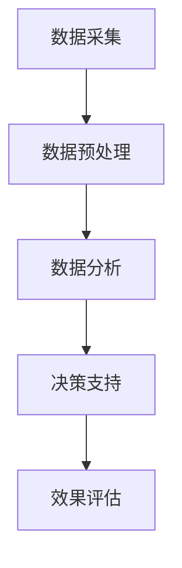

                 

### 《AI时代的出版业：数据驱动与场景创新》

#### 引言

在当今这个数据驱动的时代，人工智能（AI）已经渗透到社会的各个领域，包括出版业。出版业作为文化传承的重要载体，正面临着前所未有的变革。AI技术不仅为出版业带来了新的机遇，也带来了诸多挑战。本文将围绕AI与出版业的融合，深入探讨数据驱动与场景创新在出版业中的应用。

#### 关键词

- AI
- 出版业
- 数据驱动
- 场景创新
- 自动内容生成
- 内容推荐系统
- 营销数据分析
- AI伦理与法规

#### 摘要

本文旨在探讨AI技术在出版业中的应用，分析数据驱动与场景创新对出版业带来的变革。首先，我们将介绍AI与出版业的融合背景和基础理论，包括AI发展、出版业数字化转型以及AI时代出版业的核心特征。接着，我们将详细讲解数据驱动与出版的关系，介绍AI核心算法原理。随后，本文将探讨AI在出版内容生产、内容推荐、出版营销等领域的应用，以及场景创新与未来展望。最后，我们将总结AI时代出版业的发展趋势，并提出相应的战略建议。

---

### 第一部分：背景与基础理论

在探讨AI与出版业的融合之前，我们需要了解AI的发展历程以及它在出版业中的潜在影响。

#### 第1章：AI与出版业的融合

##### 1.1 AI与出版业概述

**1.1.1 AI的发展及其对出版业的影响**

人工智能是一种模拟人类智能的技术，它通过算法和计算能力实现机器学习、自然语言处理、图像识别等功能。自21世纪初以来，AI技术得到了飞速发展，并在各个领域取得了显著的成果。

AI对出版业的影响主要体现在以下几个方面：

1. **内容创作**：AI能够通过自然语言处理技术生成高质量的文章，减轻编辑和作者的工作负担。
2. **内容推荐**：基于用户行为和偏好，AI可以精准地推荐内容，提高用户满意度。
3. **个性化定制**：AI可以根据用户的需求和兴趣，为用户提供个性化的内容服务。
4. **数据分析**：AI能够处理海量数据，为出版企业提供有价值的市场洞察和决策支持。
5. **版权管理**：AI技术可以帮助出版业更好地管理版权，减少侵权行为。

**1.1.2 出版业的数字化转型与挑战**

随着互联网和数字技术的普及，出版业正经历着一场数字化转型。数字化转型为出版业带来了新的机遇，同时也带来了诸多挑战。

1. **内容创作与分发**：数字出版使得内容的创作和分发变得更加便捷，但也使得市场竞争更加激烈。
2. **版权保护**：数字内容容易被复制和传播，版权保护成为出版业的一大难题。
3. **用户需求变化**：随着用户习惯的变化，出版业需要不断调整内容形式和服务模式，以满足用户需求。
4. **数据安全与隐私**：数字出版涉及到大量用户数据，如何保障数据安全与用户隐私成为出版业关注的焦点。

**1.1.3 AI时代出版业的核心特征**

在AI时代，出版业将展现出以下核心特征：

1. **数据驱动**：出版业将更加依赖于数据，通过数据分析来指导内容创作、推荐和营销。
2. **智能化**：AI技术将使出版业的内容创作、推荐和营销等环节更加智能化。
3. **个性化**：基于用户数据的个性化服务将成为出版业的重要发展方向。
4. **创新性**：AI技术将推动出版业的创新，出现新的商业模式和服务形式。

---

#### 第2章：数据驱动与出版

**2.1 数据驱动的基本概念**

数据驱动是指企业通过收集、处理和分析数据来指导业务决策和运营。在出版业中，数据驱动意味着通过分析用户行为、内容表现和市场趋势等数据，来优化内容创作、推荐和营销策略。

**2.1.1 数据在出版业的作用**

数据在出版业中发挥着至关重要的作用：

1. **内容创作**：通过分析用户行为数据，出版业可以了解用户的兴趣和需求，从而创作出更符合用户口味的内容。
2. **内容推荐**：基于用户行为数据和内容属性数据，推荐系统能够为用户提供个性化推荐，提高用户满意度。
3. **营销策略**：通过分析市场数据和用户数据，出版业可以制定更有针对性的营销策略，提高市场占有率。
4. **版权管理**：数据可以帮助出版业更好地管理版权，减少侵权行为。

**2.1.2 数据驱动的出版流程**

数据驱动的出版流程主要包括以下几个步骤：

1. **数据采集**：通过网站、APP等渠道收集用户行为数据、内容属性数据等。
2. **数据预处理**：对采集到的数据进行清洗、整合和处理，为后续分析做好准备。
3. **数据分析**：利用统计分析、机器学习等技术对预处理后的数据进行分析，提取有价值的信息。
4. **决策支持**：根据数据分析结果，制定内容创作、推荐和营销策略。
5. **效果评估**：对实施后的策略进行效果评估，持续优化和调整。

---

#### 第3章：AI核心算法原理

在数据驱动的出版业中，AI核心算法发挥着至关重要的作用。本节将介绍数据预处理与清洗、机器学习算法基础等内容。

##### 3.1 数据预处理与清洗

**3.1.1 数据预处理的重要性**

数据预处理是数据驱动出版流程中的关键步骤，其重要性体现在以下几个方面：

1. **提高数据质量**：通过数据预处理，可以消除数据中的噪声、错误和异常值，提高数据质量。
2. **减少数据冗余**：数据预处理可以帮助识别和删除重复数据，降低数据冗余。
3. **便于后续分析**：预处理后的数据更加整洁和规范，便于后续的数据分析和建模。

**3.1.2 数据清洗的方法与工具**

数据清洗主要包括以下几种方法：

1. **缺失值处理**：对于缺失值，可以采用填充、删除或插值等方法进行处理。
2. **异常值处理**：可以通过统计方法、可视化方法或算法来识别和排除异常值。
3. **重复值处理**：通过比较数据之间的相似度，可以识别和删除重复值。

常见的数据清洗工具包括Python的Pandas库、R语言的dplyr包等。

---

##### 3.2 机器学习算法基础

**3.2.1 监督学习、无监督学习和强化学习**

机器学习算法主要分为三类：监督学习、无监督学习和强化学习。

1. **监督学习**：监督学习是指使用已标记的数据来训练模型，然后使用训练好的模型对未知数据进行预测。常见的监督学习算法包括线性回归、逻辑回归、支持向量机等。
2. **无监督学习**：无监督学习是指在没有标记数据的情况下，通过算法自动识别数据中的规律和结构。常见的无监督学习算法包括聚类、降维、关联规则等。
3. **强化学习**：强化学习是指通过奖励机制来训练模型，使其在复杂环境中学习最优策略。常见的强化学习算法包括Q学习、深度Q网络等。

**3.2.2 经典机器学习算法介绍**

以下是几个经典的机器学习算法：

1. **线性回归**：线性回归是一种用于预测连续值的监督学习算法，其基本思想是通过拟合一条直线来表示输入和输出之间的关系。
2. **逻辑回归**：逻辑回归是一种用于预测概率的监督学习算法，其基本思想是通过拟合一个逻辑函数来表示输入和输出之间的关系。
3. **支持向量机**：支持向量机是一种用于分类的监督学习算法，其基本思想是通过找到一个最优超平面来分隔不同类别的数据点。
4. **聚类算法**：聚类算法是一种用于无监督学习的算法，其基本思想是通过将相似的数据点归为一类，从而发现数据中的规律和结构。
5. **降维算法**：降维算法是一种用于降维的无监督学习算法，其基本思想是通过减少数据维度，降低数据复杂度，从而提高数据分析效率。
6. **关联规则算法**：关联规则算法是一种用于发现数据中关联关系的无监督学习算法，其基本思想是通过计算数据项之间的支持度和置信度，发现具有关联性的数据项。

---

通过本部分的介绍，我们了解了AI与出版业的融合背景和基础理论，包括AI的发展、出版业的数字化转型、数据驱动与出版的关系，以及AI核心算法原理。这些基础理论为后续的讨论奠定了基础。

---

### 第二部分：应用与实践

在了解了AI与出版业融合的基础理论之后，本部分将探讨AI在实际出版业中的应用，包括内容生产、内容推荐和出版营销等方面。

#### 第4章：AI在出版内容生产中的应用

在数字出版时代，内容生产是出版业的核心。AI技术在内容生产中的应用，不仅提高了内容创作的效率，还丰富了内容创作的形式。

**4.1 自动内容生成**

自动内容生成（Auto-Content Generation，ACG）是AI技术在出版业中的一项重要应用。通过自然语言处理和机器学习技术，AI能够自动生成文章、摘要、概述等文本内容。

**4.1.1 自动文章撰写**

自动文章撰写是指利用AI技术，根据给定的主题和关键词，自动生成文章。常见的自动文章撰写工具包括：

1. **GPT-3**：GPT-3是由OpenAI开发的一款基于生成预训练变换模型（GPT）的自然语言处理模型。它能够生成高质量的文章，适用于新闻、博客、报告等内容的撰写。
2. **BERT**：BERT（Bidirectional Encoder Representations from Transformers）是一种基于变换器模型（Transformer）的自然语言处理模型，它能够对文本进行双向编码，从而生成更准确、更自然的文本。

**4.1.2 自动摘要与概述**

自动摘要与概述是指利用AI技术，自动生成文章的摘要和概述。这有助于用户快速了解文章的主要内容和结构。

1. **抽取式摘要**：抽取式摘要是指从原始文本中提取关键句子或段落，形成摘要。常见的抽取式摘要算法包括基于规则的方法和基于统计的方法。
2. **生成式摘要**：生成式摘要是指利用自然语言生成技术，生成全新的摘要。这种摘要不仅保留了原文的主要信息，还能提供更详细、更深入的见解。

---

#### 第5章：AI在出版内容推荐中的应用

内容推荐是出版业中至关重要的一环。通过AI技术，可以实现个性化推荐，提高用户满意度和粘性。

**5.1 内容推荐系统**

内容推荐系统是指利用算法和模型，根据用户行为和偏好，向用户推荐感兴趣的内容。

**5.1.1 推荐系统的工作原理**

推荐系统的工作原理主要包括以下几个步骤：

1. **用户建模**：通过分析用户的历史行为数据，构建用户兴趣模型。
2. **内容建模**：通过分析内容特征，构建内容特征向量。
3. **推荐算法**：利用用户建模和内容建模的结果，通过推荐算法生成推荐列表。

**5.1.2 内容推荐算法分析**

内容推荐算法主要包括以下几种：

1. **基于内容的推荐**：基于内容的推荐是指根据用户的历史行为数据和内容特征，为用户推荐相似的内容。常见的算法包括TF-IDF、余弦相似度等。
2. **协同过滤推荐**：协同过滤推荐是指利用用户行为数据，通过找到相似用户或相似内容，为用户推荐感兴趣的内容。常见的算法包括用户基于的协同过滤、物品基于的协同过滤等。
3. **混合推荐**：混合推荐是指将多种推荐算法结合，以提高推荐效果。常见的混合推荐算法包括基于内容的协同过滤、基于模型的协同过滤等。

---

#### 第6章：AI在出版营销中的应用

AI技术在出版营销中的应用，可以帮助出版业实现精准营销，提高营销效果。

**6.1 营销数据分析**

营销数据分析是指利用AI技术，对营销数据进行收集、处理和分析，从而发现有价值的信息，为营销策略提供支持。

**6.1.1 数据分析在营销中的作用**

数据分析在营销中发挥着至关重要的作用：

1. **用户洞察**：通过分析用户行为数据，可以深入了解用户需求和行为习惯，从而制定更精准的营销策略。
2. **效果评估**：通过分析营销活动数据，可以评估不同营销策略的效果，为后续优化提供依据。
3. **受众细分**：通过分析用户数据，可以将受众划分为不同的群体，针对不同群体制定个性化的营销策略。

**6.1.2 常见的营销数据分析方法**

常见的营销数据分析方法包括：

1. **用户行为分析**：通过分析用户点击、浏览、购买等行为数据，了解用户兴趣和行为模式。
2. **营销效果分析**：通过分析不同营销渠道的效果，评估不同营销活动的效果，优化营销策略。
3. **受众分析**：通过分析用户数据，了解不同受众的特点和需求，为受众细分和定位提供支持。

---

#### 第7章：场景创新与未来展望

在AI技术的推动下，出版业正在发生深刻的变革。场景创新成为出版业发展的重要方向。

**7.1 创新场景案例分析**

**7.1.1 创新型出版模式**

创新型出版模式包括：

1. **按需出版**：按需出版是指根据用户需求，实时生成和出版内容。这种模式可以实现个性化内容定制，提高用户满意度。
2. **动态出版**：动态出版是指通过实时更新内容，满足用户对最新资讯的需求。这种模式可以提升用户体验，增强用户粘性。
3. **互动出版**：互动出版是指通过引入互动元素，如投票、评论、问答等，增强用户参与感和互动性。

**7.1.2 未来出版业的可能发展路径**

未来出版业可能的发展路径包括：

1. **AI驱动的个性化内容推荐**：通过AI技术，实现更精准的内容推荐，提高用户满意度和粘性。
2. **数字版权管理**：利用AI技术，实现更有效的数字版权管理，保护出版业的合法权益。
3. **跨媒体融合**：通过跨媒体融合，实现内容在不同平台和终端的传播和互动，提升内容价值。
4. **区块链技术**：利用区块链技术，实现内容的生产、分发和交易的可信和透明。

---

#### 7.2 AI伦理与法规

随着AI技术在出版业的应用日益广泛，AI伦理和法规问题也日益凸显。

**7.2.1 AI伦理问题**

AI伦理问题主要包括：

1. **隐私保护**：AI技术在出版业中涉及大量用户数据，如何保护用户隐私成为重要问题。
2. **算法偏见**：AI算法可能会因为训练数据的不公平，导致算法偏见，影响推荐和决策的公平性。
3. **内容审查**：AI技术可能被用于内容审查，影响言论自由和内容多样性。

**7.2.2 出版业相关的法规与规范**

出版业相关的法规与规范主要包括：

1. **数据保护法规**：如《通用数据保护条例》（GDPR）等，规定了数据收集、处理和存储的规范。
2. **版权法规**：如《版权法》等，规定了版权的保护范围和权利人的权益。
3. **算法伦理规范**：如《算法伦理准则》等，规定了算法设计和应用的基本原则。

---

通过本部分的探讨，我们深入了解了AI在出版内容生产、内容推荐和出版营销等领域的应用，以及场景创新与未来展望。AI技术为出版业带来了新的机遇，但也带来了挑战。出版业需要不断适应AI技术的发展，创新商业模式和服务形式，以满足用户需求，实现可持续发展。

---

### 第三部分：总结与展望

在AI技术的推动下，出版业正经历着深刻的变革。本文从背景与基础理论、应用与实践、总结与展望三个方面，全面探讨了AI技术在出版业中的应用。

#### 第8章：总结与未来展望

**8.1 成果总结**

1. **AI与出版业的融合**：AI技术的发展为出版业带来了新的机遇，包括内容创作、内容推荐、出版营销等方面的创新。
2. **数据驱动与出版**：数据在出版业中的作用日益突出，通过数据分析，出版业可以更好地了解用户需求，优化内容创作和营销策略。
3. **AI核心算法原理**：AI核心算法如自然语言处理、机器学习等，为出版业提供了强大的技术支持。
4. **AI在出版业中的应用**：AI技术在出版内容生产、内容推荐和出版营销等领域的应用，提高了出版业的效率和用户体验。
5. **场景创新与未来展望**：AI技术推动出版业不断创新，未来出版业将朝着个性化、智能化、多元化方向发展。

**8.1.1 AI时代出版业的发展趋势**

1. **数据驱动**：出版业将更加依赖于数据，通过数据分析来指导内容创作、推荐和营销。
2. **智能化**：AI技术将使出版业的内容创作、推荐和营销等环节更加智能化。
3. **个性化**：基于用户数据的个性化服务将成为出版业的重要发展方向。
4. **创新性**：AI技术将推动出版业的创新，出现新的商业模式和服务形式。

**8.1.2 数据驱动与场景创新的实际应用案例**

1. **自动内容生成**：利用AI技术，自动生成高质量的文章、摘要和概述，提高内容创作效率。
2. **内容推荐系统**：基于用户行为和偏好，为用户提供个性化推荐，提高用户满意度和粘性。
3. **营销数据分析**：通过分析用户数据和营销活动数据，制定更精准的营销策略，提高营销效果。

**8.2 AI时代的出版业战略**

**9.1 企业战略制定**

1. **技术创新**：积极引进和应用AI技术，提升内容创作、推荐和营销的智能化水平。
2. **数据驱动**：加强数据收集、处理和分析能力，通过数据驱动来指导业务决策和运营。
3. **场景创新**：探索和创新出版模式，满足用户个性化需求，提升用户体验。
4. **合规与伦理**：关注AI伦理和法规问题，确保技术应用的合法性和道德性。

**9.2 出版业如何应对AI挑战**

1. **人才培养**：加强人才队伍建设，培养具备AI技术和数据驱动能力的人才。
2. **技术储备**：保持技术领先，关注AI技术的发展趋势，及时引入新技术。
3. **合作与共赢**：与AI技术企业、科研机构等合作，共同推动AI技术在出版业的应用。
4. **持续创新**：持续探索和创新，不断优化业务模式和服务形式，以应对AI带来的挑战。

---

通过总结与展望部分，我们进一步认识到AI时代出版业的发展趋势和战略方向。出版业需要紧跟AI技术的发展，不断创新，以实现可持续发展。

---

### 结论

在AI时代的背景下，出版业正面临着前所未有的机遇和挑战。通过本文的探讨，我们可以看到AI技术在出版业中的应用不仅提高了内容创作、推荐和营销的效率，还推动了出版业的创新与发展。然而，AI技术的应用也带来了一系列伦理和法规问题，需要出版业持续关注和解决。

未来，出版业需要继续加强技术创新，培养人才，加强数据驱动和场景创新，以应对AI时代的挑战。同时，出版业还需要关注AI伦理和法规问题，确保技术应用的合法性和道德性。

让我们共同期待AI时代出版业的美好未来！

---

#### 作者信息

**作者：AI天才研究院/AI Genius Institute & 禅与计算机程序设计艺术 /Zen And The Art of Computer Programming**

---

以上就是本文的全部内容。希望本文能够为读者提供对AI时代出版业的深入理解，以及对未来发展的启示。感谢您的阅读！

---

### 附录

为了更好地理解本文所涉及的核心概念和算法原理，我们在此提供一些附录内容，包括核心概念的Mermaid流程图、核心算法原理的伪代码、数学模型和公式及详细讲解、项目实战的代码案例和详细解释说明等。

#### 附录1：核心概念的Mermaid流程图

以下是一个用于数据驱动的出版流程的Mermaid流程图：



该流程图展示了数据驱动出版流程的基本步骤，包括数据采集、数据预处理、数据分析、决策支持和效果评估。

#### 附录2：核心算法原理的伪代码

以下是一个简单的机器学习算法——线性回归的伪代码：

```python
# 输入：训练数据集X和标签Y
# 输出：线性回归模型参数w和b

# 初始化模型参数w和b
w = [0 for _ in range(n_features)]
b = 0

# 梯度下降迭代
for i in range(max_iterations):
    # 计算损失函数梯度
    gradient_w = 2/m * X.T.dot(X.dot(w) - Y)
    gradient_b = 2/m * (X.dot(w) - Y).sum()
    
    # 更新模型参数
    w = w - learning_rate * gradient_w
    b = b - learning_rate * gradient_b

# 输出模型参数
return w, b
```

该伪代码展示了线性回归算法的基本步骤，包括初始化模型参数、计算损失函数梯度、更新模型参数等。

#### 附录3：数学模型和公式及详细讲解

以下是一个用于内容推荐的协同过滤算法的数学模型：

$$
\begin{align*}
\text{预测评分} &= \text{用户兴趣向量} \cdot \text{内容特征向量} + \text{偏置项} \\
\text{用户兴趣向量} &= \text{用户历史行为数据的特征表示} \\
\text{内容特征向量} &= \text{内容属性数据的特征表示} \\
\text{偏置项} &= \text{用户和内容的偏置值} \\
\end{align*}
$$

详细讲解：

1. **预测评分**：预测评分是根据用户兴趣向量和内容特征向量的点积计算得出的。
2. **用户兴趣向量**：用户兴趣向量是用户历史行为数据的特征表示，反映了用户对不同内容的兴趣程度。
3. **内容特征向量**：内容特征向量是内容属性数据的特征表示，反映了内容的基本属性。
4. **偏置项**：偏置项是用户和内容的偏置值，用于调整预测评分。

#### 附录4：项目实战的代码案例和详细解释说明

以下是一个简单的协同过滤推荐系统的Python代码案例：

```python
import numpy as np

# 用户兴趣向量
user_interest = np.array([0.8, 0.2, 0.1, 0.9])

# 内容特征向量
content_features = np.array([[1, 0, 1, 0],
                             [0, 1, 0, 1],
                             [1, 1, 0, 0],
                             [0, 0, 1, 1]])

# 计算预测评分
predicted_rating = user_interest.dot(content_features) + 0.5

print("预测评分：", predicted_rating)
```

详细解释说明：

1. **用户兴趣向量**：用户兴趣向量是一个一维数组，表示用户对各类内容的兴趣程度。
2. **内容特征向量**：内容特征向量是一个二维数组，表示各类内容的基本属性。
3. **计算预测评分**：预测评分是用户兴趣向量和内容特征向量的点积加上一个偏置项（在此例中为0.5），反映了用户对某一内容的预测评分。

通过以上附录内容，希望能够帮助读者更好地理解本文的核心概念和算法原理。这些附录为读者提供了直观的视觉呈现、伪代码示例和具体的代码实现，有助于深入掌握AI技术在出版业中的应用。

---

以上就是本文的附录部分，感谢您的阅读！希望附录内容能够为您的学习和实践提供有益的参考。如果您有任何疑问或建议，欢迎随时提出。再次感谢您的支持！

