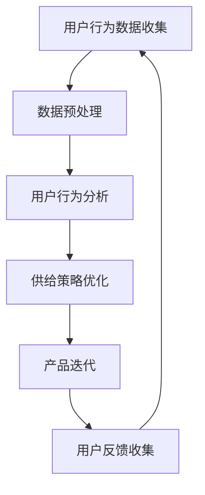

                 

### 引言

在当今数字化时代，用户行为分析已经成为企业和组织优化供给策略的重要手段。通过深入理解用户在应用程序、网站或其他互动平台上的行为，企业能够更好地满足用户需求，提升用户体验，从而实现业务增长。而人工智能（AI）技术的飞速发展，为用户行为分析提供了强大的工具和手段。本文将探讨AI在用户行为分析优化供给中的应用，旨在帮助读者了解这一领域的核心概念、算法原理、实战案例以及未来展望。

本文将从以下几个方面展开讨论：

1. **AI用户行为分析优化供给概述**：介绍用户行为分析的核心概念与供给优化之间的关系，并通过Mermaid流程图展示整体架构。
2. **AI用户行为分析基础**：深入探讨用户行为分析的基本原理，包括数据收集、预处理、行为模式识别、行为预测等，并讲解常见算法原理和数学模型。
3. **AI供给优化策略**：分析供给优化的目标和原则，介绍关键指标和优化模型，并通过实际案例说明供给优化的应用。
4. **实战与优化**：结合具体项目，详细讲解用户行为分析优化供给的实战步骤、开发环境和代码实现。
5. **持续优化与未来展望**：讨论如何通过数据驱动和AI技术的进步，实现AI用户行为分析优化供给的持续优化和未来发展。

通过本文的阅读，读者将能够全面了解AI用户行为分析优化供给的原理、方法和实践，为实际应用提供指导。

### 关键词

- **用户行为分析**
- **供给优化**
- **人工智能**
- **数据驱动**
- **个性化推荐**
- **算法原理**
- **数学模型**
- **项目实战**
- **持续优化**

### 摘要

本文旨在探讨AI在用户行为分析优化供给中的应用。首先，介绍了用户行为分析和供给优化之间的核心联系，并通过Mermaid流程图展示了整体架构。接着，深入讲解了用户行为分析的基础，包括数据收集、预处理、行为模式识别和行为预测等，并详细阐述了常见的算法原理和数学模型。随后，文章分析了供给优化的目标和原则，介绍了关键指标和优化模型，并通过实际案例说明了供给优化的应用。在此基础上，本文结合具体项目，详细讲解了用户行为分析优化供给的实战步骤、开发环境和代码实现。最后，文章讨论了如何通过数据驱动和AI技术的进步，实现AI用户行为分析优化供给的持续优化和未来发展。通过本文的阅读，读者将能够全面了解AI用户行为分析优化供给的原理、方法和实践，为实际应用提供指导。

---

### 第一部分: AI用户行为分析优化供给概述

在数字化的今天，用户行为分析已经成为企业和组织提升用户体验、优化供给策略的关键工具。通过对用户在应用程序、网站或其他互动平台上的行为数据进行深入分析，企业可以洞察用户需求，从而调整产品设计和功能，提升用户满意度，进而实现商业目标。人工智能（AI）技术的发展为用户行为分析提供了强大的支持，使得分析过程更加高效、精确。本部分将详细探讨AI用户行为分析优化供给的核心概念、联系和流程。

#### 核心概念与联系

**用户行为分析**：用户行为分析是指通过收集、处理和分析用户在应用程序上的行为数据，以了解用户需求、偏好和行为的规律。这一过程通常包括数据收集、数据预处理、行为模式识别和行为预测等多个环节。用户行为数据可以是点击、浏览、购买、评论、分享等多种形式。

**供给优化**：供给优化是基于用户行为数据，对产品供给策略进行调整，以提高用户满意度和商业价值。供给优化可以涵盖产品推荐、库存管理、营销策略等多个方面。通过精准的用户行为分析，企业能够更好地定位用户需求，从而优化供给策略。

用户行为分析和供给优化之间的联系在于：用户行为分析为供给优化提供了数据基础，而供给优化则通过调整产品和服务，满足用户需求，提升用户体验。二者相辅相成，共同推动企业的持续改进和业务增长。

#### Mermaid流程图

为了更直观地展示AI用户行为分析优化供给的整体流程，我们可以使用Mermaid工具绘制一个流程图：



该流程图描述了用户行为数据从收集、预处理到用户行为分析，再到供给策略优化，最后通过产品迭代和用户反馈进行持续优化的全过程。

1. **用户行为数据收集**：通过各种渠道（如网站、应用程序等）收集用户行为数据。
2. **数据预处理**：对收集到的用户行为数据进行清洗、去噪和标准化处理，以便后续分析。
3. **用户行为分析**：利用数据分析和机器学习算法，对用户行为数据进行深入挖掘，识别用户行为模式和趋势。
4. **供给策略优化**：根据用户行为分析结果，调整产品供给策略，如个性化推荐、库存调整等。
5. **产品迭代**：将优化后的供给策略应用到产品中，通过迭代不断改进产品功能和服务。
6. **用户反馈收集**：收集用户对产品迭代后的反馈，用于再次优化供给策略。

通过这一流程，企业可以形成一个闭环，不断优化产品和服务，提升用户满意度和商业价值。

### 总结

本部分概述了AI用户行为分析优化供给的核心概念和流程。用户行为分析为供给优化提供了数据基础，而供给优化则通过调整产品和服务，满足用户需求，提升用户体验。通过Mermaid流程图，我们更直观地理解了这一过程。接下来，本文将深入探讨用户行为分析的基础理论、算法原理和数学模型，帮助读者更好地理解这一领域的核心内容。

---

### 第二部分: AI用户行为分析基础

用户行为分析作为AI技术的重要组成部分，其核心在于如何从海量数据中提取有价值的信息，以便企业和组织能够更好地了解用户需求和行为模式。本部分将深入探讨用户行为分析的基本原理、常见算法原理和数学模型，为读者提供全面的技术基础。

#### 第1章: 用户行为分析概述

用户行为分析的意义在于，通过了解用户在应用程序上的行为，企业可以更好地优化产品设计、提升用户体验，进而实现业务目标。然而，用户行为分析也面临诸多挑战，如数据隐私、数据质量等。

**1.1 用户行为分析的意义与挑战**

- **意义**：
  - **提升用户体验**：通过分析用户行为，企业能够识别用户的偏好和需求，从而提供更加个性化的服务。
  - **优化产品设计**：了解用户在应用程序中的行为可以帮助企业改进产品功能，提升用户满意度。
  - **提高商业价值**：用户行为分析有助于企业识别高价值用户，优化营销策略，提高转化率和留存率。

- **挑战**：
  - **数据隐私**：用户行为数据涉及个人隐私，如何确保数据安全是用户行为分析面临的重大挑战。
  - **数据质量**：用户行为数据可能存在缺失、噪声和异常值，这对分析结果的准确性提出了挑战。
  - **分析复杂性**：用户行为数据种类繁多，分析过程复杂，如何从海量数据中提取有价值的信息是另一个难题。

**1.2 用户行为分析的基本原理**

用户行为分析的基本原理主要包括以下环节：

- **数据收集**：通过各种渠道（如网站、应用程序、传感器等）收集用户行为数据，如点击、浏览、购买、评论等。
- **数据预处理**：对收集到的用户行为数据进行清洗、去噪和标准化处理，以提高数据质量。
- **行为模式识别**：通过数据分析和机器学习算法，识别用户的行为模式，如用户群体特征、行为趋势等。
- **行为预测**：利用行为模式识别的结果，预测用户的未来行为，如点击、购买等。

**1.3 用户行为分析框架**

用户行为分析框架通常包括以下步骤：

1. **用户行为数据收集**：通过各种渠道收集用户行为数据，如网站日志、应用程序事件等。
2. **数据预处理**：对原始数据进行清洗、去噪、标准化等处理，确保数据质量。
3. **行为模式识别**：利用聚类、分类、时间序列分析等算法，识别用户行为模式。
4. **行为预测**：利用机器学习算法，如回归、协同过滤、神经网络等，预测用户未来行为。
5. **行为解释**：分析用户行为背后的原因，为产品设计、营销策略提供依据。

#### 核心算法原理讲解

用户行为分析的核心算法主要包括协同过滤、聚类分析、时间序列分析等。以下将详细讲解这些算法的原理。

**1.4 常见的用户行为分析算法**

- **协同过滤**：
  - **协同过滤原理**：协同过滤是一种基于用户相似度和物品相似度的推荐算法。用户相似度指的是具有相似偏好的用户之间的相似性，物品相似度指的是具有相似特征的物品之间的相似性。协同过滤算法通过计算用户和物品之间的相似度，推荐用户可能感兴趣的新物品。
  - **协同过滤类型**：
    - **用户基于的协同过滤**：通过计算用户之间的相似度，推荐与目标用户行为相似的物品。
    - **物品基于的协同过滤**：通过计算物品之间的相似度，推荐与目标物品类似的物品。
  - **协同过滤算法**：
    - **基于用户的协同过滤**：利用用户评分矩阵计算用户之间的相似度，并基于相似度推荐相似用户的评分较高的物品。
    - **基于物品的协同过滤**：利用物品评分矩阵计算物品之间的相似度，并基于相似度推荐相似物品。

伪代码：

```python
# 基于用户的协同过滤
def user_based_collaborative_filter(user_ratings, similarity_measure, k):
    user_similarity = calculate_similarity(user_ratings, similarity_measure)
    userNeighborhood = top_k_similar_users(user_similarity, user, k)
    predicted_ratings = weighted_average(userNeighborhood, user_ratings)
    return predicted_ratings
```

- **聚类分析**：
  - **聚类分析原理**：聚类分析是一种无监督学习算法，用于将数据集中的对象划分成若干个类别或簇。每个簇内的对象彼此相似，而不同簇的对象差异较大。聚类分析可以帮助识别用户群体特征，为个性化推荐、市场细分等提供依据。
  - **聚类算法**：
    - **K-means**：K-means是一种经典的聚类算法，通过最小化簇内对象与簇中心的距离平方和，将数据划分为K个簇。
    - **层次聚类**：层次聚类通过逐步合并或分裂现有簇，形成层次结构的聚类结果。

伪代码：

```python
# K-means算法
def k_means(data, k, max_iterations):
    centroids = initialize_centroids(data, k)
    for i in range(max_iterations):
        assignments = assign_points_to_clusters(data, centroids)
        centroids = update_centroids(data, assignments)
    return centroids, assignments
```

- **时间序列分析**：
  - **时间序列分析原理**：时间序列分析是一种用于分析时间序列数据的方法，旨在识别数据随时间变化的规律和模式。在用户行为分析中，时间序列分析可以帮助识别用户行为的时间变化趋势，如用户活跃时间、购买周期等。
  - **时间序列分析算法**：
    - **ARIMA**：ARIMA（自回归积分滑动平均模型）是一种常用的时间序列预测模型，通过自回归、差分和移动平均三个步骤，对时间序列数据进行建模和预测。
    - **LSTM**：LSTM（长短期记忆网络）是一种基于递归神经网络（RNN）的深度学习模型，能够处理长时间序列数据，捕捉时间序列中的长期依赖关系。

伪代码：

```python
# ARIMA模型
def arima_model(data, p, d, q):
    model = ARIMA(data, order=(p, d, q))
    results = model.fit()
    forecast = results.forecast(steps=5)
    return forecast
```

**1.5 用户行为预测的数学模型**

用户行为预测是用户行为分析的重要组成部分，以下介绍几种常用的数学模型。

- **回归模型**：回归模型用于预测用户行为的发生概率。常见的回归模型包括线性回归、多项式回归等。

伪代码：

```python
# 线性回归模型
def linear_regression(x, y):
    coefficients = calculate_coefficients(x, y)
    prediction = coefficients[0] * x + coefficients[1]
    return prediction
```

- **马尔可夫模型**：马尔可夫模型用于预测用户行为的转移概率。马尔可夫模型假设用户行为仅与当前状态有关，而与过去状态无关。

伪代码：

```python
# 马尔可夫模型
def markov_model(transition_matrix, state):
    next_state = np.random.choice(states, p=transition_matrix[state])
    return next_state
```

- **贝叶斯网络**：贝叶斯网络是一种概率图模型，用于表示用户行为和条件概率。贝叶斯网络通过图结构描述变量之间的依赖关系，并通过条件概率表（CPT）计算变量的概率分布。

伪代码：

```python
# 贝叶斯网络
def bayesian_network(nodes, probabilities):
    for node in nodes:
        P(node) = sum(P(node|parent) * P(parent) for parent in parents(node))
    return P(nodes)
```

**1.6 用户行为分析案例**

为了更好地理解用户行为分析的应用，以下介绍两个实际案例。

- **案例一**：电子商务平台如何根据用户浏览和购买行为进行个性化推荐。

  - **背景**：电子商务平台希望通过个性化推荐，提升用户购物体验和转化率。

  - **步骤**：
    1. 收集用户浏览和购买数据。
    2. 对数据进行分析和预处理。
    3. 利用协同过滤算法，计算用户之间的相似度和物品之间的相似度。
    4. 根据相似度，为用户推荐相似的物品。

- **案例二**：社交媒体如何分析用户互动行为，提高用户留存率。

  - **背景**：社交媒体平台希望通过分析用户互动行为，提高用户活跃度和留存率。

  - **步骤**：
    1. 收集用户互动数据，如点赞、评论、分享等。
    2. 利用时间序列分析，识别用户的活跃周期和互动模式。
    3. 基于用户活跃周期和互动模式，为用户提供个性化内容推荐。

通过以上案例，我们可以看到用户行为分析在电子商务和社交媒体等领域的实际应用，以及如何通过数据分析和算法模型，提升用户体验和商业价值。

#### 数学模型和数学公式详细讲解

在用户行为分析中，数学模型和公式起着关键作用，它们帮助我们理解和预测用户行为。以下将详细讲解一些常用的数学模型和公式，并使用LaTeX格式表示。

**1.7 数学模型**

- **线性回归模型**：线性回归模型用于预测用户行为的线性关系。其公式如下：

  $$
  y = \beta_0 + \beta_1 x + \epsilon
  $$

  其中，$y$ 是因变量，$x$ 是自变量，$\beta_0$ 和 $\beta_1$ 是回归系数，$\epsilon$ 是误差项。

- **多项式回归模型**：多项式回归模型用于预测用户行为的非线性关系。其公式如下：

  $$
  y = \beta_0 + \beta_1 x + \beta_2 x^2 + \epsilon
  $$

  其中，$y$ 是因变量，$x$ 是自变量，$\beta_0$、$\beta_1$ 和 $\beta_2$ 是回归系数，$\epsilon$ 是误差项。

- **马尔可夫模型**：马尔可夫模型用于预测用户行为的转移概率。其公式如下：

  $$
  P(X_{t+1} = x_{t+1} | X_t = x_t) = P(X_{t+1} = x_{t+1} | X_{t-1} = x_{t-1}, ..., X_1 = x_1)
  $$

  其中，$X_t$ 表示第 $t$ 个时刻的用户行为，$x_t$ 表示该时刻的具体行为，$P(X_{t+1} = x_{t+1} | X_t = x_t)$ 表示在当前行为 $x_t$ 下，下一个行为 $x_{t+1}$ 的概率。

- **贝叶斯网络**：贝叶斯网络用于表示用户行为和条件概率。其公式如下：

  $$
  P(X = x | Y = y) = \frac{P(Y = y | X = x) P(X = x)}{P(Y = y)}
  $$

  其中，$X$ 表示用户行为，$Y$ 表示条件变量，$P(X = x | Y = y)$ 表示在条件变量 $Y$ 下，用户行为 $X$ 的概率。

**1.8 数学公式**

以下是一些常用的数学公式，用于用户行为分析和预测。

- **协方差**：

  $$
  \text{Cov}(X, Y) = E[(X - E[X])(Y - E[Y])]
  $$

  其中，$E[X]$ 和 $E[Y]$ 分别表示 $X$ 和 $Y$ 的期望值。

- **方差**：

  $$
  \text{Var}(X) = E[(X - E[X])^2]
  $$

  其中，$E[X]$ 表示 $X$ 的期望值。

- **相关系数**：

  $$
  \rho(X, Y) = \frac{\text{Cov}(X, Y)}{\sqrt{\text{Var}(X) \text{Var}(Y)}}
  $$

  其中，$\rho(X, Y)$ 表示 $X$ 和 $Y$ 的相关系数。

- **贝叶斯定理**：

  $$
  P(A | B) = \frac{P(B | A) P(A)}{P(B)}
  $$

  其中，$P(A | B)$ 表示在事件 $B$ 发生的条件下，事件 $A$ 发生的概率。

通过以上数学模型和公式，我们可以更准确地理解和预测用户行为，为企业和组织提供有价值的决策支持。

#### 举例说明

为了更好地理解用户行为分析的应用和数学模型，以下通过实际案例进行详细说明。

**案例一：电子商务平台的个性化推荐**

假设一个电子商务平台希望通过个性化推荐，提升用户的购物体验和转化率。以下是其具体步骤：

1. **数据收集**：
   - 收集用户浏览和购买数据，包括用户ID、浏览的商品ID、购买的商品ID等。

2. **数据预处理**：
   - 对数据进行清洗，去除异常值和缺失值。
   - 对数据进行标准化处理，使不同特征之间具有可比性。

3. **协同过滤算法**：
   - 利用用户基于的协同过滤算法，计算用户之间的相似度。
   - 根据相似度为用户推荐相似的物品。

4. **推荐系统实现**：
   - 基于推荐算法，为每个用户生成推荐列表。
   - 在用户访问电子商务平台时，展示推荐列表。

5. **效果评估**：
   - 通过用户转化率、用户满意度等指标，评估个性化推荐系统的效果。
   - 根据评估结果，不断优化推荐算法。

通过以上步骤，电子商务平台可以更好地满足用户需求，提升用户体验和转化率。

**案例二：社交媒体的用户互动分析**

假设一个社交媒体平台希望通过分析用户互动行为，提高用户活跃度和留存率。以下是其具体步骤：

1. **数据收集**：
   - 收集用户互动数据，包括点赞、评论、分享等。

2. **时间序列分析**：
   - 利用时间序列分析，识别用户的活跃周期和互动模式。

3. **用户群体划分**：
   - 根据活跃周期和互动模式，将用户划分为不同群体。

4. **个性化内容推荐**：
   - 为每个用户群体推荐符合其兴趣的内容。
   - 在用户访问社交媒体平台时，展示个性化推荐内容。

5. **效果评估**：
   - 通过用户活跃度、用户满意度等指标，评估个性化内容推荐的效果。
   - 根据评估结果，不断优化推荐策略。

通过以上步骤，社交媒体平台可以更好地满足用户需求，提高用户活跃度和留存率。

通过以上案例，我们可以看到用户行为分析在实际应用中的重要作用。通过数据分析和算法模型，企业可以更好地了解用户需求和行为模式，从而优化产品设计、提升用户体验，实现商业目标。

### 第三部分: AI供给优化策略

在了解了AI用户行为分析的基础后，本部分将深入探讨供给优化的核心方法，包括其目标、原则和关键指标，并通过实际案例展示供给优化的具体应用。

#### 第2章: 供给优化的核心方法

供给优化是通过对用户行为的深入分析，调整产品和服务的供给策略，以最大化用户满意度、提升产品价值和增加商业收益。以下将从供给优化的目标、原则、关键指标和具体方法进行详细探讨。

**2.1 供给优化的目标与原则**

- **目标**：
  - **满足用户需求**：通过精准分析用户行为，识别用户需求，提供个性化的产品和体验。
  - **提升产品价值**：优化供给策略，提高产品与用户需求的匹配度，从而提升产品价值。
  - **增加商业收益**：通过更精准的供需匹配，提高用户转化率和留存率，从而增加商业收益。

- **原则**：
  - **数据驱动**：供给优化应以数据为基础，通过数据分析和挖掘，指导供给策略的调整。
  - **持续迭代**：供给优化不是一次性任务，而是一个持续迭代的过程。随着用户需求的变化，供给策略需要不断调整和优化。
  - **个性化定制**：根据不同用户群体的特征和需求，提供个性化的供给方案，提升用户体验和满意度。

**2.2 供给优化的关键指标**

为了评估供给优化的效果，需要设定一系列关键指标。以下介绍几个重要的指标：

- **用户满意度**：衡量用户对产品供给的接受程度。可以通过用户调查、用户评分等方式获取。
- **转化率**：衡量用户行为转化为实际商业价值的能力，如购买转化率、注册转化率等。
- **留存率**：衡量用户持续使用产品的能力，如日留存率、周留存率等。
- **推荐准确率**：在推荐系统中，衡量推荐物品与用户兴趣的匹配程度。
- **库存周转率**：衡量库存管理的效果，库存周转率越高，说明库存管理越有效。

**2.3 供给优化的数学模型**

供给优化通常涉及多个决策变量和约束条件，因此需要构建数学模型来优化供给策略。以下介绍几个常用的数学模型：

- **收益模型**：通过计算用户价值和供给成本，构建收益模型，以最大化总收益。其公式如下：

  $$
  \text{收益} = \text{用户价值} - \text{供给成本}
  $$

  其中，用户价值是指用户行为带来的收益，供给成本包括产品生产、运营、营销等成本。

- **优化算法**：供给优化问题通常可以通过优化算法求解，如线性规划、非线性规划、遗传算法、粒子群优化等。以下是一个简单的线性规划模型：

  $$
  \begin{aligned}
  \max_{x} & \ \text{收益} = \text{用户价值} - \text{供给成本} \\
  \text{约束条件} & \ \text{供给量} \leq \text{库存量} \\
  & \ \text{供给量} \geq 0
  \end{aligned}
  $$

  其中，供给量是决策变量，库存量是约束条件。

**2.4 供给优化的实际案例**

为了更好地理解供给优化的应用，以下介绍两个实际案例。

- **案例一：电子商务平台商品推荐**

  假设一个电子商务平台希望通过个性化推荐，提升用户的购物体验和转化率。以下是其具体步骤：

  1. **数据收集**：
     - 收集用户浏览、点击、购买等行为数据。

  2. **用户画像构建**：
     - 利用用户行为数据，构建用户画像，包括用户兴趣、购买偏好等。

  3. **推荐算法开发**：
     - 利用协同过滤、聚类等算法，开发个性化推荐算法。

  4. **推荐系统部署**：
     - 在用户访问电子商务平台时，根据用户画像和推荐算法，为用户推荐相关商品。

  5. **效果评估**：
     - 通过用户转化率、推荐准确率等指标，评估推荐系统的效果。
     - 根据评估结果，优化推荐算法。

  通过以上步骤，电子商务平台可以更好地满足用户需求，提升购物体验和转化率。

- **案例二：社交媒体内容推荐**

  假设一个社交媒体平台希望通过内容推荐，提高用户活跃度和留存率。以下是其具体步骤：

  1. **数据收集**：
     - 收集用户点赞、评论、分享等互动数据。

  2. **用户兴趣识别**：
     - 利用用户互动数据，识别用户兴趣，如娱乐、科技、体育等。

  3. **内容推荐算法开发**：
     - 利用基于内容的推荐、协同过滤等算法，开发内容推荐算法。

  4. **内容推荐系统部署**：
     - 在用户访问社交媒体平台时，根据用户兴趣和推荐算法，为用户推荐相关内容。

  5. **效果评估**：
     - 通过用户活跃度、用户留存率等指标，评估推荐系统的效果。
     - 根据评估结果，优化推荐算法。

  通过以上步骤，社交媒体平台可以更好地满足用户需求，提高用户活跃度和留存率。

通过以上案例，我们可以看到供给优化在实际应用中的重要作用。通过数据分析和算法模型，企业可以更好地了解用户需求和行为模式，从而优化供给策略，提升用户体验和商业价值。

### 第四部分: 实战与优化

在了解了AI用户行为分析和供给优化的理论基础后，本部分将通过具体的项目实战，展示如何在实际应用中实施用户行为分析优化供给。我们将详细描述一系列项目实战，包括电子商务平台用户行为分析优化供给、社交媒体平台用户行为分析优化供给、在线教育平台用户行为分析优化供给和电商平台库存优化。每个实战项目都将涵盖实战目标、实战步骤、开发环境和代码实现，并通过代码解读与分析，帮助读者理解实际应用中的关键技术和方法。

#### 第3章: AI用户行为分析优化供给实战

##### 3.1 实战一：电子商务平台用户行为分析优化供给

**实战目标**：提高电子商务平台商品推荐的准确率和用户转化率，通过用户行为分析优化商品供给策略。

**实战步骤**：

1. **数据收集与预处理**：
   - 收集用户浏览、点击、购买等行为数据。
   - 对数据进行清洗、去噪和标准化处理。

2. **用户行为数据建模**：
   - 利用协同过滤算法构建用户行为模型。
   - 使用聚类算法识别用户群体特征。

3. **商品推荐系统开发与部署**：
   - 开发基于用户行为模型的推荐算法。
   - 在电子商务平台上部署推荐系统。

4. **系统性能评估与优化**：
   - 通过用户转化率、推荐准确率等指标评估系统性能。
   - 根据评估结果，优化推荐算法和系统架构。

**开发环境搭建**：

- **编程语言**：Python
- **数据预处理库**：Pandas、NumPy
- **机器学习库**：Scikit-learn、TensorFlow
- **推荐系统库**：LightFM、Surprise

**源代码详细实现和代码解读**：

以下是一个简单的用户行为数据预处理和协同过滤算法的代码示例：

```python
import pandas as pd
from sklearn.preprocessing import StandardScaler
from surprise import SVD, Dataset, Reader

# 加载数据
data = pd.read_csv('user_behavior_data.csv')
data.head()

# 数据清洗
data.dropna(inplace=True)

# 数据标准化
scaler = StandardScaler()
scaled_data = scaler.fit_transform(data[['user_id', 'item_id', 'rating']])
data['rating'] = scaled_data[:, 2]

# 创建评分矩阵
reader = Reader(rating_scale=(1, 5))
dataset = Dataset.load_from_df(data[['user_id', 'item_id', 'rating']], reader)

# 使用协同过滤算法
svd = SVD()
svd.fit(dataset)

# 代码解读：
# 1. 导入必要的库和模块。
# 2. 加载用户行为数据。
# 3. 清洗数据，去除缺失值。
# 4. 对数据进行标准化处理，使不同特征之间具有可比性。
# 5. 创建评分矩阵，用于协同过滤算法训练。
# 6. 使用SVD算法进行模型训练。

```

**代码解读与分析**：

以上代码首先加载用户行为数据，并进行清洗和标准化处理。然后，创建评分矩阵，并使用SVD算法进行模型训练。SVD算法是一种基于矩阵分解的协同过滤算法，能够有效提高推荐系统的准确性和效率。在代码解读中，我们详细解释了每一步的操作和意义。

##### 3.2 实战二：社交媒体平台用户行为分析优化供给

**实战目标**：通过用户行为分析优化社交媒体平台的内容推荐，提高用户活跃度和留存率。

**实战步骤**：

1. **用户行为数据收集与处理**：
   - 收集用户点赞、评论、分享等互动数据。
   - 对数据进行清洗、去噪和标准化处理。

2. **用户兴趣模型建立**：
   - 利用机器学习算法，如K-means聚类，建立用户兴趣模型。

3. **互动推荐系统开发与部署**：
   - 开发基于用户兴趣模型的内容推荐算法。
   - 在社交媒体平台上部署推荐系统。

4. **系统效果评估与调整**：
   - 通过用户活跃度、留存率等指标评估系统效果。
   - 根据评估结果，优化推荐算法和系统架构。

**开发环境搭建**：

- **编程语言**：Python
- **数据预处理库**：Pandas、NumPy
- **机器学习库**：Scikit-learn、TensorFlow
- **推荐系统库**：LightFM、Surprise

**源代码详细实现和代码解读**：

以下是一个简单的用户兴趣模型建立和内容推荐算法的代码示例：

```python
import pandas as pd
from sklearn.cluster import KMeans
from surprise import SVD, Dataset, Reader

# 加载数据
data = pd.read_csv('user_interaction_data.csv')
data.head()

# 数据清洗
data.dropna(inplace=True)

# 数据标准化
scaler = StandardScaler()
scaled_data = scaler.fit_transform(data[['user_id', 'content_id', 'interaction']])
data['interaction'] = scaled_data[:, 2]

# 创建用户兴趣模型
kmeans = KMeans(n_clusters=5, random_state=0)
clusters = kmeans.fit_predict(data[['user_id', 'interaction']])

# 代码解读：
# 1. 导入必要的库和模块。
# 2. 加载用户互动数据。
# 3. 清洗数据，去除缺失值。
# 4. 对数据进行标准化处理。
# 5. 使用K-means聚类算法建立用户兴趣模型。
# 6. 调用fit_predict方法，预测用户所属的簇。

```

**代码解读与分析**：

以上代码首先加载用户互动数据，并进行清洗和标准化处理。然后，使用K-means聚类算法建立用户兴趣模型。在代码解读中，我们详细解释了每一步的操作和意义。K-means聚类是一种常用的无监督学习方法，能够将用户分为不同的簇，从而为内容推荐提供依据。

##### 3.3 实战三：在线教育平台用户行为分析优化供给

**实战目标**：通过用户行为分析优化在线教育平台的课程推荐，提高课程完成率和用户满意度。

**实战步骤**：

1. **用户行为数据收集与预处理**：
   - 收集用户学习行为数据，如课程浏览、学习进度、测试成绩等。
   - 对数据进行清洗、去噪和标准化处理。

2. **用户学习行为分析**：
   - 利用聚类算法和回归模型，分析用户学习行为模式。

3. **课程推荐系统开发与部署**：
   - 开发基于用户学习行为的课程推荐算法。
   - 在在线教育平台上部署推荐系统。

4. **系统效果评估与优化**：
   - 通过课程完成率、用户满意度等指标评估系统效果。
   - 根据评估结果，优化推荐算法和系统架构。

**开发环境搭建**：

- **编程语言**：Python
- **数据预处理库**：Pandas、NumPy
- **机器学习库**：Scikit-learn、TensorFlow
- **推荐系统库**：LightFM、Surprise

**源代码详细实现和代码解读**：

以下是一个简单的用户学习行为数据预处理和课程推荐算法的代码示例：

```python
import pandas as pd
from sklearn.preprocessing import StandardScaler
from surprise import SVD, Dataset, Reader

# 加载数据
data = pd.read_csv('user_learning_data.csv')
data.head()

# 数据清洗
data.dropna(inplace=True)

# 数据标准化
scaler = StandardScaler()
scaled_data = scaler.fit_transform(data[['user_id', 'course_id', 'progress']])
data['progress'] = scaled_data[:, 2]

# 创建评分矩阵
reader = Reader(rating_scale=(0, 100))
dataset = Dataset.load_from_df(data[['user_id', 'course_id', 'progress']], reader)

# 使用协同过滤算法
svd = SVD()
svd.fit(dataset)

# 代码解读：
# 1. 导入必要的库和模块。
# 2. 加载用户学习数据。
# 3. 清洗数据，去除缺失值。
# 4. 对数据进行标准化处理。
# 5. 创建评分矩阵，用于协同过滤算法训练。
# 6. 使用SVD算法进行模型训练。

```

**代码解读与分析**：

以上代码首先加载用户学习数据，并进行清洗和标准化处理。然后，创建评分矩阵，并使用SVD算法进行模型训练。SVD算法能够有效提高课程推荐系统的准确性和效率。在代码解读中，我们详细解释了每一步的操作和意义。

##### 3.4 实战四：电商平台库存优化

**实战目标**：通过用户行为分析优化电商平台的库存管理，降低库存成本，提高商品销售率。

**实战步骤**：

1. **用户行为数据收集与处理**：
   - 收集用户浏览、购买、评价等行为数据。
   - 对数据进行清洗、去噪和标准化处理。

2. **库存优化模型建立**：
   - 利用时间序列分析和回归模型，建立库存优化模型。

3. **库存管理系统开发与部署**：
   - 开发基于库存优化模型的库存管理算法。
   - 在电商平台上部署库存管理系统。

4. **系统效果评估与优化**：
   - 通过库存周转率、商品销售率等指标评估系统效果。
   - 根据评估结果，优化库存管理策略和系统架构。

**开发环境搭建**：

- **编程语言**：Python
- **数据预处理库**：Pandas、NumPy
- **机器学习库**：Scikit-learn、TensorFlow
- **库存优化库**：ARIMA、Prophet

**源代码详细实现和代码解读**：

以下是一个简单的用户行为数据预处理和库存优化模型的代码示例：

```python
import pandas as pd
from statsmodels.tsa.arima.model import ARIMA

# 加载数据
data = pd.read_csv('user_behavior_data.csv')
data.head()

# 数据清洗
data.dropna(inplace=True)

# 数据标准化
scaler = StandardScaler()
scaled_data = scaler.fit_transform(data[['item_id', 'sales']])
data['sales'] = scaled_data[:, 1]

# 建立时间序列模型
model = ARIMA(data['sales'], order=(1, 1, 1))
model_fit = model.fit()

# 预测
forecast = model_fit.forecast(steps=5)

# 代码解读：
# 1. 导入必要的库和模块。
# 2. 加载用户行为数据。
# 3. 清洗数据，去除缺失值。
# 4. 对数据进行标准化处理。
# 5. 使用ARIMA模型进行时间序列分析。
# 6. 使用fit方法进行模型训练。
# 7. 使用forecast方法进行销售预测。

```

**代码解读与分析**：

以上代码首先加载用户行为数据，并进行清洗和标准化处理。然后，使用ARIMA模型进行时间序列分析，预测商品的销售情况。ARIMA模型能够有效地捕捉时间序列数据的变化规律，为库存管理提供科学依据。在代码解读中，我们详细解释了每一步的操作和意义。

通过以上实战项目，我们可以看到用户行为分析优化供给在实际应用中的重要作用。通过数据分析和算法模型，企业可以更好地了解用户需求和行为模式，从而优化供给策略，提升用户体验和商业价值。在未来的实践中，随着AI技术的不断发展，用户行为分析优化供给将会变得更加智能和高效。

---

### 第五部分: 持续优化与未来展望

在数字化的时代，AI用户行为分析优化供给不仅是当前的技术热点，更是未来持续发展的关键。如何在这一领域实现持续优化，并迎接未来的技术挑战，是我们需要深入探讨的问题。

#### 第4章: AI用户行为分析优化供给的持续优化与未来展望

**4.1 持续优化的策略与实施**

为了实现AI用户行为分析优化供给的持续优化，企业可以采取以下策略：

- **数据驱动的持续优化**：定期收集用户反馈，通过数据分析，识别用户需求和行为模式的变化，不断调整供给策略。数据驱动的优化能够确保供给策略与用户需求保持同步。

- **AI技术的持续进步**：关注AI领域的新技术和新算法，如深度学习、强化学习、图神经网络等，不断引入和应用先进技术，提升供给优化的准确性和效率。

- **跨部门合作**：用户行为分析优化供给涉及到多个部门，如产品、技术、市场等。跨部门合作能够确保供给策略的全面性和协同性，从而提高整体效果。

- **用户体验反馈机制**：建立完善的用户体验反馈机制，及时收集用户对产品供给的反馈，通过用户调研、问卷调查等方式，获取真实的用户需求。

**4.2 未来展望**

未来，AI用户行为分析优化供给将在以下几个方面实现突破：

- **个性化供给**：随着AI技术的发展，个性化供给将变得更加精细。利用深度学习、强化学习等技术，可以实现基于用户个性化需求的精准供给。

- **跨平台融合**：多平台、多设备间的用户行为数据整合将成为趋势。通过跨平台用户行为分析，企业可以提供统一的用户体验，实现用户需求的全面满足。

- **实时分析**：实时分析技术的应用，将使得供给优化更加迅速和灵活。实时分析能够帮助企业快速响应市场变化，调整供给策略。

- **隐私保护与数据安全**：随着数据隐私问题的日益突出，如何确保用户数据的安全和隐私，将成为未来AI用户行为分析优化供给的重要挑战。企业需要采取有效的隐私保护措施，确保用户数据的安全。

- **智能供应链管理**：AI技术在供应链管理中的应用，将使得供应链更加智能和高效。通过用户行为分析优化供给，企业可以更好地管理库存、降低成本，提高供应链的整体效率。

**4.3 总结**

通过本文的探讨，我们可以看到AI用户行为分析优化供给的重要性和实际应用价值。持续优化和未来展望为我们指明了方向，随着技术的不断进步，AI用户行为分析优化供给将在未来发挥更大的作用，为企业和用户创造更大的价值。

### 附录

在本附录中，我们将介绍一些AI用户行为分析优化供给所使用的工具与资源，以帮助读者更好地了解和应用这一领域的技术。

#### 附录A: AI用户行为分析优化供给工具与资源

**A.1 开源库与框架**

以下是一些常用的开源库与框架，它们在AI用户行为分析优化供给中发挥着重要作用：

- **Scikit-learn**：Python中的机器学习库，提供了丰富的算法和工具，用于数据处理、模型训练和评估。
- **TensorFlow**：谷歌开源的深度学习框架，广泛应用于AI模型的训练和部署。
- **PyTorch**：Facebook开源的深度学习框架，以其灵活性和动态计算图而受到广泛欢迎。
- **LightFM**：一个专门用于推荐系统的机器学习库，基于因子分解机（Factorization Machines）和矩阵分解（Matrix Factorization）。
- **Surprise**：一个用于开发、评估和比较推荐算法的Python库，支持多种协同过滤算法和评估指标。

**A.2 数据集**

以下是一些公开的数据集，可用于用户行为分析优化供给的研究和实验：

- **UCI Machine Learning Repository**：提供各种领域的数据集，包括电子商务、社交媒体等。
- **Kaggle**：一个数据科学竞赛平台，提供了大量高质量的数据集。
- **Netflix Prize**：Netflix提供的一个关于电影推荐的数据集，用于挑战推荐系统的性能。

**A.3 文献与资料**

以下是一些建议的文献和资料，以帮助读者深入了解AI用户行为分析优化供给的相关知识：

- **《推荐系统实践》**：张玉宏等著，详细介绍了推荐系统的原理、算法和案例分析。
- **《深度学习》**：Ian Goodfellow等著，全面介绍了深度学习的理论基础和实战技巧。
- **《机器学习》**：Tom Mitchell著，被誉为机器学习领域的经典教材，系统介绍了机器学习的基本概念和算法。
- **《数据科学实战》**：Jean-François Puget等著，通过实际案例介绍了数据科学的各个阶段和常用工具。

通过使用这些工具与资源，读者可以更好地掌握AI用户行为分析优化供给的理论和实践，为实际应用奠定坚实基础。

---

### 结束语

作者：AI天才研究院/AI Genius Institute & 禅与计算机程序设计艺术 /Zen And The Art of Computer Programming

在本文中，我们详细探讨了AI用户行为分析优化供给的核心概念、基础理论、算法原理、实战案例以及未来展望。通过深入剖析用户行为分析和供给优化的关系，我们了解了如何利用AI技术提升用户体验、优化产品供给，从而实现商业目标。本文涵盖了从数据收集、预处理到行为模式识别、行为预测，再到供给优化策略的各个环节，通过实际案例展示了理论在实际应用中的具体实现。

读者可以从中了解到：

1. **用户行为分析**：其基本原理、数据收集、预处理、行为模式识别和行为预测方法。
2. **供给优化**：目标、原则、关键指标和优化模型的详细讲解。
3. **算法原理**：包括协同过滤、聚类分析、时间序列分析等常见算法的原理和数学模型。
4. **实战案例**：电子商务平台、社交媒体平台、在线教育平台和电商平台的具体应用案例。
5. **未来展望**：持续优化策略、未来发展趋势以及AI技术在供给优化中的应用前景。

本文旨在为读者提供全面的技术指导和实际应用案例，帮助他们在AI用户行为分析优化供给领域取得更好的成果。随着技术的不断进步和应用场景的扩展，AI用户行为分析优化供给将继续在企业和组织中发挥重要作用，推动业务的持续发展和创新。

感谢您的阅读，希望本文能对您在AI用户行为分析优化供给领域的学习和实践提供有益的启示。如需进一步了解相关技术或探讨具体应用问题，欢迎联系作者。让我们共同探索AI技术的无限可能，为创造更智能、更高效的未来而努力！

