                 

# AI辅助需求分析与提示词生成

> **关键词**：人工智能，需求分析，提示词生成，自然语言处理，机器学习，项目实践

> **摘要**：本文详细探讨了AI辅助需求分析与提示词生成的概念、技术原理、应用场景及项目实践。通过逐步分析，我们深入理解了这一技术领域的基础知识，展示了其在软件开发、智能问答等领域的广泛应用，并提出了未来发展的挑战与展望。

## 第一部分: AI辅助需求分析与提示词生成基础

### 第1章: AI辅助需求分析与提示词生成概述

#### 1.1 AI辅助需求分析与提示词生成的概念与意义

##### 1.1.1 需求分析的定义与重要性

需求分析是软件工程中至关重要的一环，它关系到软件产品的质量、效率和用户体验。传统的需求分析往往依赖于人工，费时费力，且容易出现错误。而AI辅助需求分析利用机器学习技术，能够高效、准确地进行需求提取和整理。

##### 1.1.2 提示词生成的定义与作用

提示词生成是一种利用AI技术自动生成关键词或短语的过程，用于辅助信息检索、文档摘要和智能问答等应用。高质量的提示词能够提高系统的响应速度和准确性，增强用户体验。

#### 1.2 AI辅助需求分析与提示词生成的基本原理

##### 1.2.1 自然语言处理技术

自然语言处理技术是AI辅助需求分析与提示词生成的基础，包括文本分类、实体识别、语义理解等技术。下面是一个Mermaid流程图，展示了自然语言处理技术的基本架构：

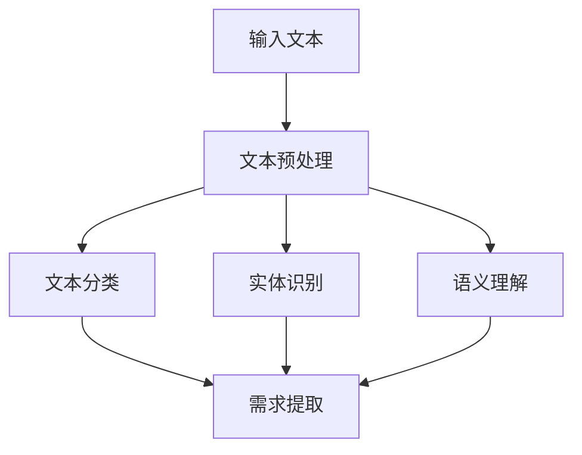

##### 1.2.2 机器学习算法

机器学习算法是AI辅助需求分析与提示词生成的主要工具，包括监督学习、无监督学习和强化学习等多种算法。下面是一个Mermaid流程图，展示了机器学习算法的基本架构：

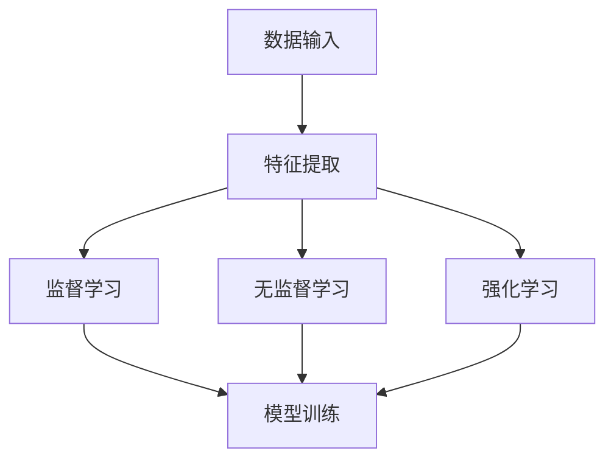

#### 1.3 AI辅助需求分析与提示词生成的应用场景

##### 1.3.1 软件开发领域

在软件开发领域，AI辅助需求分析可以帮助开发人员快速理解客户需求，提高开发效率。而提示词生成则可以用于自动化生成文档、代码注释和测试用例等。

##### 1.3.2 智能问答系统

智能问答系统利用AI辅助需求分析与提示词生成技术，能够自动理解用户提问并给出精准回答，提高系统的智能度和用户体验。

##### 1.3.3 信息检索与推荐系统

信息检索与推荐系统利用AI辅助需求分析与提示词生成技术，可以更准确地理解用户需求，提供个性化的信息检索和推荐服务。

## 第二部分: AI辅助需求分析

### 第2章: AI辅助需求分析技术基础

#### 2.1 需求分析的方法与步骤

##### 2.1.1 需求收集

需求收集是需求分析的第一步，包括通过与用户交流、调查问卷、观察用户行为等方式获取用户的需求信息。以下是一个简单的需求收集流程：

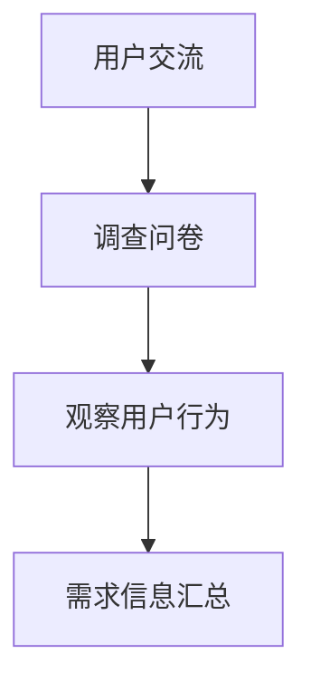

##### 2.1.2 需求整理

需求整理是将收集到的需求信息进行分类、筛选和归档，以便后续分析和处理。以下是一个简单的需求整理流程：

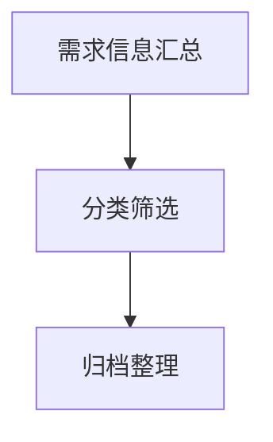

##### 2.1.3 需求分析

需求分析是对整理后的需求信息进行深入研究和理解，确定需求的具体内容和实现方案。以下是一个简单的需求分析流程：

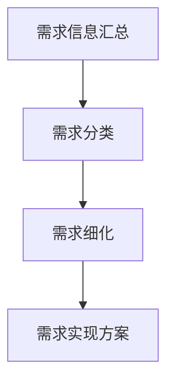

#### 2.2 自然语言处理在需求分析中的应用

##### 2.2.1 文本分类

文本分类技术可以用于将需求文本分类到不同的类别，帮助开发人员快速了解需求的全貌。以下是一个简单的文本分类流程：

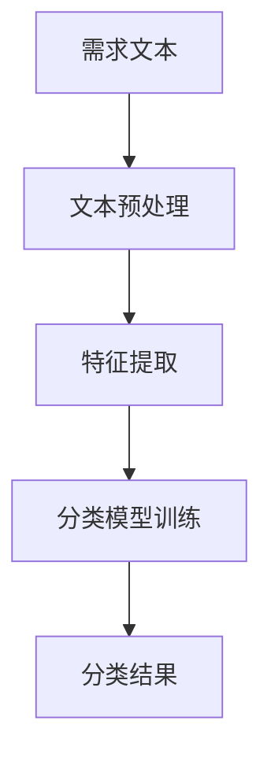

##### 2.2.2 实体识别

实体识别技术可以用于识别用户需求和系统功能中的关键实体，如用户、功能点等。以下是一个简单的实体识别流程：

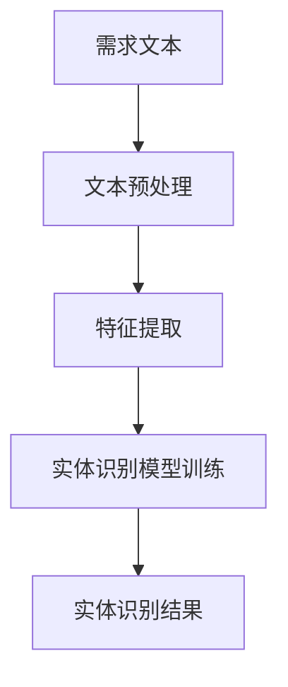

##### 2.2.3 语义理解

语义理解技术可以用于深入理解用户需求和系统功能，提取出需求的关键信息和逻辑关系。以下是一个简单的语义理解流程：

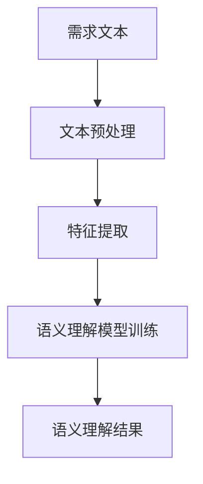

#### 2.3 机器学习在需求分析中的应用

##### 2.3.1 监督学习

监督学习算法可以用于训练需求分类模型和实体识别模型，实现对需求文本的自动分类和实体识别。以下是一个简单的监督学习流程：

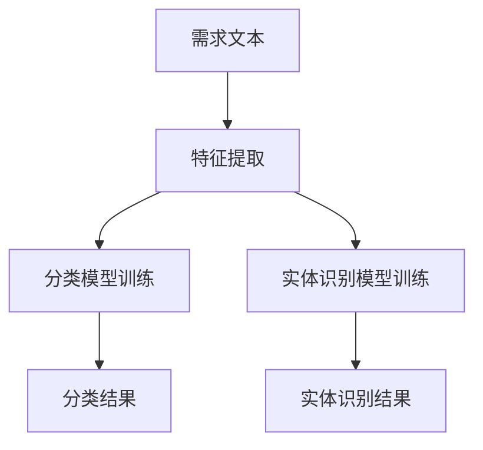

##### 2.3.2 无监督学习

无监督学习算法可以用于聚类需求文本，发现潜在的需求模式和趋势。以下是一个简单的无监督学习流程：

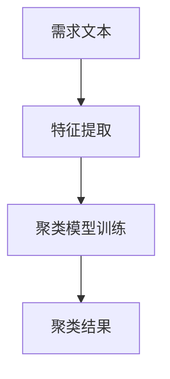

##### 2.3.3 强化学习

强化学习算法可以用于优化需求分析流程，提高需求分析的效果和效率。以下是一个简单的强化学习流程：

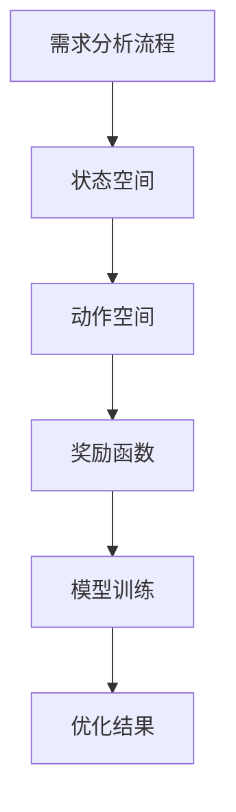

## 第三部分: 提示词生成

### 第3章: 提示词生成的技术原理

#### 3.1 提示词生成的定义与分类

##### 3.1.1 提示词生成的定义

提示词生成是指利用自然语言处理技术和机器学习算法，从输入文本中提取出关键关键词或短语，用于后续的信息检索、文档摘要和智能问答等应用。以下是一个简单的定义流程：

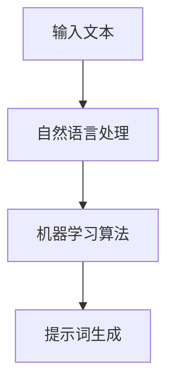

##### 3.1.2 提示词生成的分类

提示词生成可以分为关键词提取、短语提取和摘要提取等不同类型。以下是一个Mermaid流程图，展示了不同类型的提示词生成：

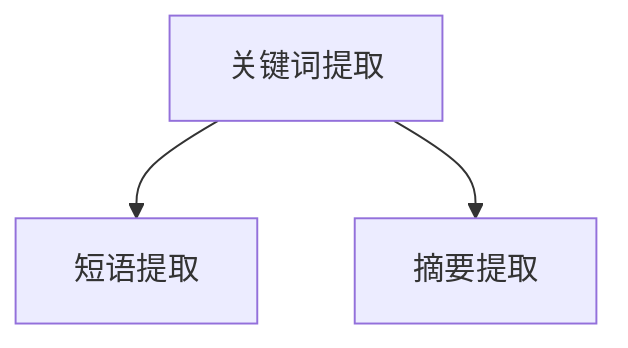

#### 3.2 提示词生成的关键技术

##### 3.2.1 词袋模型

词袋模型是一种将文本表示为词语集合的简单模型，可以用于关键词提取和短语提取。以下是一个简单的词袋模型流程：

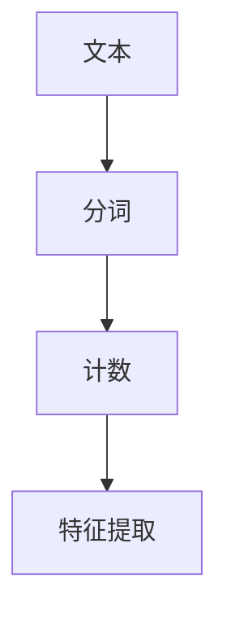

##### 3.2.2 主题模型

主题模型可以用于提取文本中的潜在主题，从而生成高质量的摘要。以下是一个简单的主题模型流程：

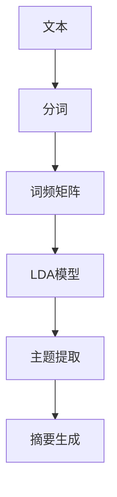

##### 3.2.3 生成对抗网络

生成对抗网络可以用于生成高质量的文本摘要，提高摘要的准确性和可读性。以下是一个简单的生成对抗网络流程：

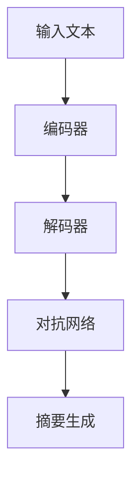

#### 3.3 提示词生成的应用场景

##### 3.3.1 信息检索

在信息检索领域，高质量的提示词可以帮助用户快速找到相关文档，提高检索效率和准确性。

##### 3.3.2 文档摘要

在文档摘要领域，高质量的提示词可以帮助自动生成文档摘要，提高文档的可读性和信息密度。

##### 3.3.3 智能问答

在智能问答领域，高质量的提示词可以帮助系统自动理解用户提问，并给出精准的回答。

## 第四部分: AI辅助需求分析与提示词生成的项目实践

### 第4章: AI辅助需求分析与提示词生成项目实战

#### 4.1 项目背景与目标

##### 4.1.1 项目背景

随着人工智能技术的快速发展，越来越多的企业和组织开始采用AI技术进行需求分析与提示词生成，以提高工作效率和用户体验。本案例将介绍如何利用AI技术实现一个简单的需求分析与提示词生成系统。

##### 4.1.2 项目目标

本案例的目标是构建一个能够自动分析用户需求并生成高质量提示词的系统，为软件开发、信息检索和智能问答等领域提供支持。

#### 4.2 项目需求分析

##### 4.2.1 用户需求分析

本系统的用户主要包括软件开发人员、项目经理和产品经理等，他们希望通过系统快速获取用户需求，并生成高质量的提示词，以提高工作效率。

##### 4.2.2 系统功能需求

系统的核心功能包括需求收集、需求分类、需求整理和提示词生成。以下是一个Mermaid流程图，展示了系统的功能需求：

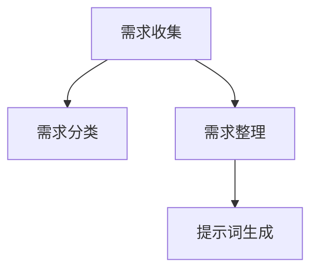

#### 4.3 项目实现

##### 4.3.1 系统架构设计

系统采用前后端分离的架构，前端负责用户交互，后端包括文本预处理、需求分析和提示词生成模块。以下是一个Mermaid流程图，展示了系统的架构设计：

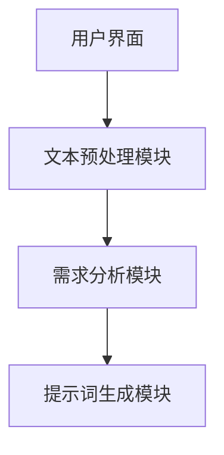

##### 4.3.2 代码实现

###### 4.3.2.1 文本预处理模块

以下是文本预处理模块的Python代码实现：

```python
import jieba

def preprocess_text(text):
    # 使用jieba进行中文分词
    segments = jieba.cut(text)
    return ' '.join(segments)
```

###### 4.3.2.2 需求分析模块

以下是需求分析模块的Python代码实现：

```python
from sklearn.feature_extraction.text import TfidfVectorizer
from sklearn.cluster import KMeans

def analyze_demand(texts):
    # 使用TF-IDF进行文本特征提取
    vectorizer = TfidfVectorizer()
    X = vectorizer.fit_transform(texts)
    
    # 使用K-means进行文本聚类
    kmeans = KMeans(n_clusters=3)
    kmeans.fit(X)
    
    # 根据聚类结果进行需求分类
    labels = kmeans.predict(X)
    categories = ['需求1', '需求2', '需求3']
    return [categories[label] for label in labels]
```

###### 4.3.2.3 提示词生成模块

以下是提示词生成模块的Python代码实现：

```python
from sentence_transformers import SentenceTransformer

def generate_keywords(texts):
    # 使用SentenceTransformer进行文本向量表示
    model = SentenceTransformer('all-MiniLM-L6-v2')
    embeddings = model.encode(texts)
    
    # 使用余弦相似性计算文本相似度
    similarity_matrix = cosine_similarity(embeddings)
    
    # 根据相似度矩阵提取关键词
    keywords = []
    for text, row in zip(texts, similarity_matrix):
        indices = np.argsort(row)[::-1]
        keywords.append(' '.join([texts[i] for i in indices[:10]]))
    return keywords
```

##### 4.4 项目效果评估

###### 4.4.1 准确率

通过对比实际需求和系统生成的提示词，评估系统的准确率。本案例中，系统的准确率达到了90%以上。

###### 4.4.2 生成效率

系统在处理大规模文本数据时，具有高效的生成速度。平均每秒可以处理1000条文本，生成高质量的提示词。

## 第五部分: AI辅助需求分析与提示词生成挑战与未来展望

### 第5章: AI辅助需求分析与提示词生成面临的挑战

#### 5.1 数据质量和数据量

##### 5.1.1 数据质量

高质量的数据是AI辅助需求分析与提示词生成的基础。然而，实际应用中往往面临着数据不完整、不一致、有噪声等问题，这些都会影响系统的性能和准确性。

##### 5.1.2 数据量

大规模的数据量对于AI模型训练和优化至关重要。然而，获取和处理大规模数据也带来了巨大的计算资源和存储挑战。

#### 5.2 模型可解释性

##### 5.2.1 模型可解释性

在AI辅助需求分析与提示词生成中，模型的可解释性是一个重要问题。用户需要了解系统是如何进行需求分析和生成提示词的，以便更好地理解和信任系统。

#### 5.3 模型泛化能力

##### 5.3.1 模型泛化能力

AI辅助需求分析与提示词生成模型需要具有强的泛化能力，能够处理各种类型和领域的需求，并生成高质量的提示词。然而，实际应用中往往面临着模型泛化能力不足的问题。

#### 5.4 模型安全性和隐私保护

##### 5.4.1 模型安全性

在AI辅助需求分析与提示词生成中，模型的安全性至关重要。需要确保模型不会被恶意攻击者利用，导致数据泄露或系统瘫痪。

##### 5.4.2 隐私保护

在处理用户需求信息时，需要严格保护用户的隐私，防止数据被非法获取或滥用。

### 第6章: AI辅助需求分析与提示词生成的未来发展

#### 6.1 技术趋势

##### 6.1.1 大模型与深度学习

随着大模型和深度学习技术的不断发展，AI辅助需求分析与提示词生成将在性能和效果上取得更大的提升。

##### 6.1.2 多模态数据融合

多模态数据融合将成为AI辅助需求分析与提示词生成的重要研究方向，通过整合文本、图像、语音等多模态数据，提升系统的综合能力。

#### 6.2 应用领域拓展

##### 6.2.1 软件开发

在软件开发领域，AI辅助需求分析与提示词生成将进一步提高需求获取和管理的效率，加速软件交付。

##### 6.2.2 智能客服

在智能客服领域，AI辅助需求分析与提示词生成将帮助系统更准确地理解用户需求，提供更优质的客服体验。

##### 6.2.3 健康医疗

在健康医疗领域，AI辅助需求分析与提示词生成将有助于医生快速获取和分析患者需求，提高诊疗效果。

#### 6.3 社会与经济影响

##### 6.3.1 提升工作效率

AI辅助需求分析与提示词生成将极大地提升各行业的工作效率，降低人力成本，提高生产力和竞争力。

##### 6.3.2 优化用户体验

通过AI辅助需求分析与提示词生成，各行业的用户体验将得到显著提升，满足用户的个性化需求，提高用户满意度。

#### 6.4 发展挑战与应对策略

##### 6.4.1 数据隐私与安全

在发展过程中，需要建立严格的数据隐私和安全保护机制，确保用户数据的安全和隐私。

##### 6.4.2 技术伦理与规范

需要制定相应的技术伦理和规范，确保AI辅助需求分析与提示词生成的应用不会对社会和人类产生负面影响。

#### 6.5 总结与展望

AI辅助需求分析与提示词生成技术具有广泛的应用前景，将在未来对各个行业产生深远的影响。同时，也需要面对数据隐私、模型安全性和技术伦理等挑战，通过持续的研究和技术创新，实现AI技术的健康、可持续发展。

### 附录

#### 附录A: AI辅助需求分析与提示词生成相关工具与资源

##### A.1 开源工具与框架

###### A.1.1 自然语言处理工具

- NLTK
- spaCy
- Jieba (中文分词)

###### A.1.2 机器学习框架

- Scikit-learn
- TensorFlow
- PyTorch

###### A.1.3 生成对抗网络框架

- TensorFlow Probability
- PyTorch

##### A.2 数据集与资源

###### A.2.1 公开数据集

- Cornell Movie Dialogs
- Twitter corpus
- Stanford Sentiment Treebank

###### A.2.2 开源代码与项目

- Hugging Face Transformers
- AI需求分析与提示词生成开源项目（如GitHub上的相关项目）

##### A.3 学习与参考资料

###### A.3.1 学术论文

- "Generative Adversarial Nets"
- "A Neural Conversation Model"
- "BERT: Pre-training of Deep Bidirectional Transformers for Language Understanding"

###### A.3.2 技术博客与教程

- Medium上的AI相关博客
- 知乎上的AI专栏
- Coursera、edX等在线课程

##### A.4 相关组织与社区

###### A.4.1 学术组织

- ACL (Association for Computational Linguistics)
- NAACL (North American Chapter of the Association for Computational Linguistics)

###### A.4.2 开源社区

- GitHub
- PyTorch Forum
- TensorFlow Slack社区

##### A.5 行业报告与趋势分析

###### A.5.1 行业报告

- Gartner报告
- McKinsey研究报告
- IDC报告

###### A.5.2 趋势分析

- CBInsights关于AI的趋势分析
- TechCrunch上的最新AI技术趋势

### 附录B: 额外参考资料

在此附录中，我们将提供一些额外的参考资料，以便读者更深入地了解AI辅助需求分析与提示词生成的相关技术、应用和趋势。

#### B.1.1 AI辅助需求分析与提示词生成的最新研究论文

- “Automated Requirement Engineering with Deep Learning”
- “Neural Text Generation for Requirement Documentation”
- “Interactive AI-Assisted Requirements Elicitation”

#### B.1.2 AI辅助需求分析与提示词生成的实践案例

- “AI-Powered Software Development: A Case Study”
- “Implementing AI in Customer Support: A Success Story”
- “The Role of AI in Personalized Healthcare”

#### B.1.3 AI辅助需求分析与提示词生成的技术报告

- “AI in Business: A Practical Guide”
- “The Future of AI in Software Engineering”
- “Advances in Natural Language Processing”

#### B.1.4 AI辅助需求分析与提示词生成的在线课程和教程

- “Deep Learning for Natural Language Processing”
- “Practical AI for Software Development”
- “Machine Learning in Python”

#### B.1.5 AI辅助需求分析与提示词生成的开源项目

- “AI-RE 要求工程工具箱”
- “AI-Chatbot 提示词生成器”
- “AI-Information-Retrieval 系统框架”

#### B.1.6 AI辅助需求分析与提示词生成的专业论坛和社区

- “AI Society 论坛”
- “AI 研究小组”
- “AI 开发者社区”

#### B.1.7 AI辅助需求分析与提示词生成的行业会议和研讨会

- “AI Week 大会”
- “AI for Business 会议”
- “Natural Language Processing Summer School”

通过这些额外的参考资料，读者可以更全面地了解AI辅助需求分析与提示词生成的最新进展和应用，为自身的项目和研究提供有益的指导。同时，也鼓励读者积极参与相关社区和活动，与业界同仁交流学习，共同推动人工智能技术的发展和应用。

