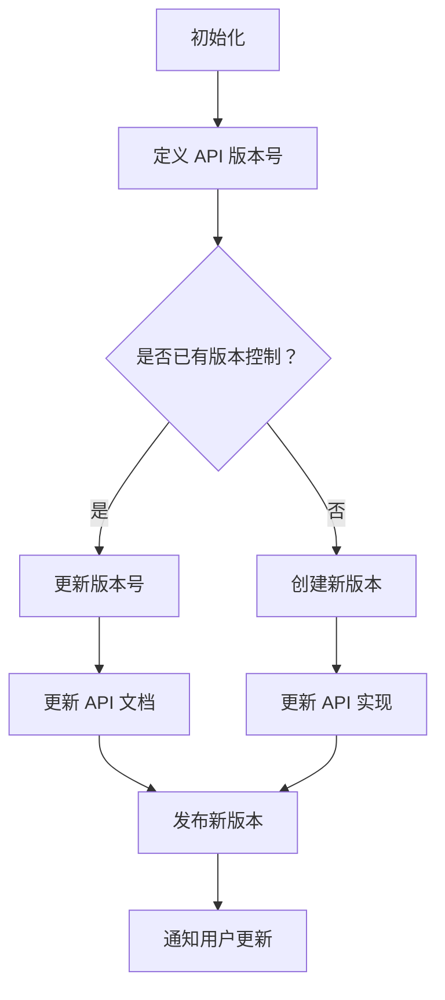

                 

### 《API 版本控制的意义》

#### 关键词：
- API 版本控制
- RESTful API
- GraphQL API
- gRPC API
- 版本兼容性
- 最佳实践

#### 摘要：
本文深入探讨了 API 版本控制的重要性及其实现方法。从 API 版本控制的必要性、核心概念、技术详解、最佳实践到项目实战，全面解析了 API 版本控制的各个方面。通过分析多个实际案例，本文为读者提供了丰富的经验和指导，帮助他们在实际开发中更好地应用 API 版本控制。

## 《API 版本控制的意义》目录大纲

### 第一部分：API 版本控制概述

#### 第1章：API 版本控制的必要性

##### 1.1 API 版本控制的重要性

##### 1.2 API 版本控制的历史发展

##### 1.3 API 版本控制的方法和策略

### 第2章：API 版本控制的核心概念

##### 2.1 API 版本的命名规则

##### 2.2 API 版本的管理与维护

##### 2.3 API 版本间的兼容性问题

### 第二部分：API 版本控制技术详解

#### 第3章：API 版本控制的实现方法

##### 3.1 API 版本控制的架构设计

##### 3.2 API 版本控制的实现细节

##### 3.3 API 版本控制的工具选择

### 第4章：API 版本控制的具体实现

##### 4.1 RESTful API 版本控制

##### 4.2 GraphQL API 版本控制

##### 4.3 gRPC API 版本控制

### 第5章：API 版本控制最佳实践

##### 5.1 API 版本控制的设计原则

##### 5.2 API 版本控制的实践案例

##### 5.3 API 版本控制的改进方案

### 第三部分：API 版本控制项目实战

#### 第6章：API 版本控制项目实践

##### 6.1 项目背景与需求分析

##### 6.2 项目架构设计

##### 6.3 版本控制策略制定

##### 6.4 版本控制实现与维护

### 第7章：API 版本控制案例分析

##### 7.1 案例一：某电商平台 API 版本控制实践

##### 7.2 案例二：某金融公司 API 版本控制优化

##### 7.3 案例三：某物流公司 API 版本控制策略制定

### 附录

#### 附录 A：常用 API 版本控制工具简介

##### A.1 API 网关

##### A.2 API 管理平台

##### A.3 API 版本控制插件

#### 附录 B：API 版本控制相关资源

##### B.1 学术论文与资料

##### B.2 技术社区与论坛

##### B.3 开源工具与框架

#### 附录 C：API 版本控制 Mermaid 流程图

#### 附录 D：API 版本控制伪代码

#### 附录 E：API 版本控制数学模型与公式

#### 附录 F：API 版本控制数学公式与举例说明

#### 附录 G：API 版本控制项目实战代码

#### 附录 H：开发环境搭建与源代码详细实现

#### 附录 I：代码解读与分析

#### 附录 J：API 版本控制相关数学模型

#### 附录 K：API 版本控制相关术语解释

#### 附录 L：API 版本控制常见问题与解答

## 第一部分：API 版本控制概述

### 第1章：API 版本控制的必要性

#### 1.1 API 版本控制的重要性

API（应用程序编程接口）是企业服务架构的重要组成部分。随着互联网和移动应用的飞速发展，API已成为连接不同系统和应用的关键桥梁。然而，随着 API 的数量和复杂性不断增加，版本控制成为了一个不可或缺的环节。

API 版本控制的重要性体现在以下几个方面：

1. **向后兼容性**：在软件迭代过程中，新版本可能会引入新的功能、性能优化或者错误修复。版本控制确保旧客户端能够继续使用旧版本的 API，而不会因新版本的更新而受到影响。

2. **系统稳定性**：通过版本控制，开发团队可以逐步推出新功能，而不会影响到现有服务的稳定性。这样，即使新版本存在潜在问题，也可以通过回滚或修正来恢复系统稳定性。

3. **代码维护性**：版本控制使得 API 代码的维护更加简单。不同版本的 API 可以独立开发和维护，减少了代码的耦合度，降低了维护成本。

4. **用户体验**：良好的版本控制机制可以提供更稳定的 API 服务，从而提升用户体验。

#### 1.2 API 版本控制的历史发展

API 版本控制并不是一个新兴的概念。随着 API 的广泛应用，版本控制策略和技术也在不断演进。

早期，API 版本控制通常通过 URL 参数或路径来区分不同版本。例如，`/api/v1/resource` 表示访问第1版本的资源接口。这种方法简单直观，但容易导致路径过长，不便于维护。

随着 RESTful API 的流行，URL 版本化逐渐成为主流。通过在 URL 中添加版本号，可以清晰地标识不同版本的 API。例如，`/api/v1/search` 表示访问第1版本的搜索接口。

在微服务架构和分布式系统中，API 网关成为版本控制的重要工具。API 网关不仅负责路由和转发请求，还承担了版本控制的功能。通过 API 网关，可以集中管理不同版本的 API，并提供统一的接口给客户端。

近年来，GraphQL 和 gRPC 等新型 API 技术也逐渐加入了版本控制的行列。GraphQL 通过查询参数和类型系统实现了版本控制，而 gRPC 则利用版本号和服务端升级策略来管理不同版本。

#### 1.3 API 版本控制的方法和策略

API 版本控制的方法和策略多种多样，以下是一些常见的策略：

1. **URL 参数版本化**：通过在 URL 中添加版本参数来区分不同版本的 API。例如，`/resource?version=1` 表示访问第1版本的资源接口。

2. **URL 路径版本化**：通过在 URL 路径中添加版本号来区分不同版本的 API。例如，`/api/v1/resource` 表示访问第1版本的资源接口。

3. **头信息版本化**：通过在 HTTP 头信息中添加版本号来区分不同版本的 API。例如，`Authorization: Bearer token version=1` 表示访问第1版本的接口。

4. **参数 + 路径版本化**：结合 URL 参数和路径版本化，通过在 URL 参数和路径中同时添加版本号来区分不同版本的 API。例如，`/api/v1/resource?version=1` 表示访问第1版本的资源接口。

5. **API 网关版本控制**：通过 API 网关实现版本控制，将不同版本的 API 路由到相应的后端服务。API 网关可以动态切换版本，提供更加灵活的版本控制。

6. **透明版本升级**：在客户端和服务端同时更新版本，不改变 API 的访问路径和参数，从而实现无缝的版本升级。

7. **兼容性处理**：在版本升级过程中，通过兼容性处理策略来确保新旧版本 API 之间的兼容性。例如，可以通过 API 网关对旧版本 API 进行代理，或者提供版本迁移指南帮助用户平滑过渡。

不同的版本控制方法和策略适用于不同的场景和需求。选择合适的版本控制策略，可以有效地管理 API 版本，提高系统的稳定性和可维护性。

### 第2章：API 版本控制的核心概念

#### 2.1 API 版本的命名规则

API 版本的命名规则是版本控制的基础。正确的命名规则可以确保版本号的清晰性和一致性，方便开发人员和管理人员理解和跟踪版本。

通常，API 版本号采用三位数字格式，分别表示主版本号、次版本号和修订号。例如，`1.2.3` 表示第1个主版本、第2个次版本和第3个修订版。

命名规则的具体内容如下：

1. **主版本号**（Major Version）：主版本号用于标识 API 的主要变化。当 API 的架构、功能或设计发生重大变化时，主版本号递增。例如，从 `1.0.0` 更新到 `2.0.0`。

2. **次版本号**（Minor Version）：次版本号用于标识 API 的次要变化。通常，次版本号递增时，意味着 API 添加了新的功能、改善了性能或修复了错误。例如，从 `1.0.0` 更新到 `1.1.0`。

3. **修订号**（Patch Version）：修订号用于标识 API 的细微调整和错误修复。修订号递增时，通常意味着对现有功能的优化或对已知问题的修复。例如，从 `1.0.0` 更新到 `1.0.1`。

命名规则示例：

- `1.0.0`：初始版本，无功能或修复。
- `1.1.0`：添加新功能或性能优化。
- `1.0.1`：修复已知问题。
- `2.0.0`：重大架构调整或破坏性更新。

#### 2.2 API 版本的管理与维护

API 版本的管理与维护是确保 API 稳定性和可维护性的关键。以下是 API 版本管理的几个重要方面：

1. **版本规划**：在发布新版本之前，需要制定详细的版本规划。版本规划包括版本目标、功能列表、时间表和里程碑等。合理的版本规划可以确保版本发布的有序性和稳定性。

2. **版本发布**：版本发布是指将新版本的 API 推送到生产环境的过程。版本发布需要遵循严格的流程，包括测试、部署和上线等。发布过程中，需要确保新版本与旧版本之间的兼容性，避免对客户端造成影响。

3. **版本更新**：版本更新是指在发布新版本后，对 API 进行维护和改进的过程。版本更新包括新增功能、修复问题和优化性能等。版本更新需要及时跟进并记录，以便于后续的版本维护。

4. **版本回滚**：版本回滚是指在发现新版本存在问题时，将系统恢复到旧版本的过程。版本回滚是确保系统稳定性的重要手段，可以避免新版本引入的潜在问题对业务造成影响。

5. **版本监控**：版本监控是指对 API 版本的运行状态进行实时监控和统计。通过版本监控，可以及时发现和解决问题，确保系统稳定运行。

6. **文档管理**：版本管理还包括 API 文档的管理。API 文档是客户端使用 API 的重要指南，需要及时更新并保持与实际 API 的同步。

#### 2.3 API 版本间的兼容性问题

API 版本间的兼容性问题是指新旧版本 API 之间的功能或行为不一致。这些问题可能会导致客户端无法正常使用 API，甚至影响业务的正常运行。

常见的兼容性问题包括：

1. **功能不兼容**：新版本引入了新的功能，但旧版本客户端无法识别或使用这些新功能。

2. **数据格式不兼容**：新旧版本 API 的数据格式不一致，导致客户端无法正确解析数据。

3. **接口行为不兼容**：新旧版本 API 的接口行为不一致，导致客户端对接口的预期结果产生误解。

4. **参数不兼容**：新旧版本 API 的参数类型、数量或顺序不一致，导致客户端无法正确调用接口。

为了解决兼容性问题，可以采取以下策略：

1. **文档说明**：在新旧版本之间的文档中详细说明兼容性差异，帮助客户端了解和适应新版本。

2. **透明版本升级**：在客户端和服务端同时升级版本，不改变 API 的访问路径和参数，从而实现无缝的版本升级。

3. **兼容性处理**：通过 API 网关或其他中间件对旧版本 API 进行代理，确保客户端能够继续使用旧版本的 API。

4. **迁移指南**：为新版本提供详细的迁移指南，帮助客户端平滑过渡到新版本。

5. **版本兼容性测试**：在发布新版本之前，进行全面的兼容性测试，确保新旧版本 API 之间的兼容性。

通过合理的版本控制和兼容性处理策略，可以有效地解决 API 版本间的兼容性问题，提高系统的稳定性和可维护性。

## 第二部分：API 版本控制技术详解

### 第3章：API 版本控制的实现方法

#### 3.1 API 版本控制的架构设计

API 版本控制的架构设计是确保版本控制机制有效运行的基础。一个好的架构设计可以提高系统的可扩展性、稳定性和可维护性。以下是 API 版本控制架构设计的关键要素：

1. **分层架构**：采用分层架构可以更好地隔离不同版本的 API，减少版本间的耦合度。通常，架构可以分为四个层次：客户端层、API 网关层、服务层和数据层。

2. **API 网关**：API 网关是 API 版本控制的核心组件，负责接收客户端请求，进行版本识别和路由，然后转发到相应的后端服务。通过 API 网关，可以实现统一的版本管理和路由控制，提高系统的灵活性。

3. **服务层**：服务层包括各个版本的 API 服务，每个版本的服务都独立部署和维护。服务层负责处理业务逻辑，实现具体的 API 功能。

4. **数据层**：数据层包括数据库和其他数据存储系统，用于存储 API 的数据。数据层的设计需要考虑版本间的数据兼容性和隔离性。

5. **监控与日志**：监控与日志系统用于实时监控 API 的运行状态，记录日志信息，帮助排查问题和优化性能。

#### 3.2 API 版本控制的实现细节

API 版本控制的实现细节决定了版本控制的效率和可靠性。以下是一些具体的实现细节：

1. **版本标识与映射**：在 API 网关中，需要实现版本标识与映射功能。例如，通过在 URL 路径或参数中添加版本号，将请求映射到相应的服务实例。

2. **版本查询与切换**：客户端需要能够查询和切换不同版本的 API。在 API 网关中，可以通过查询参数或头信息来实现版本查询与切换。

3. **版本兼容性处理**：为了确保新旧版本 API 之间的兼容性，需要在 API 网关中实现兼容性处理。例如，可以通过代理旧版本 API 或提供版本迁移指南来帮助客户端适应新版本。

4. **版本升级与回滚**：在发布新版本时，需要实现版本升级和回滚功能。版本升级包括将客户端切换到新版本 API，回滚包括将系统恢复到旧版本。

5. **版本监控与统计**：通过监控和统计系统，可以实时了解 API 版本的运行状态和性能指标。例如，可以监控 API 的调用次数、响应时间和错误率等。

#### 3.3 API 版本控制的工具选择

选择合适的 API 版本控制工具是实现版本控制的关键。以下是一些常用的 API 版本控制工具：

1. **API 网关**：

   - Kong：开源 API 网关，支持负载均衡、路由和版本控制等功能。
   - NGINX：开源 web 服务器，支持反向代理和版本控制。
   - APISIX：开源 API 网关，支持高并发、负载均衡和版本控制。

2. **API 管理平台**：

   - Apigee：云计算平台，提供 API 管理和版本控制功能。
   - MuleSoft：集成平台，支持 API 开发、管理和版本控制。
   - Microsoft Azure API Management：Azure 服务，提供 API 管理和版本控制功能。

3. **API 版本控制插件**：

   - Swagger：用于生成 API 文档，支持版本控制。
   - OpenAPI：开放 API 规范，支持版本控制和文档生成。
   - API Blueprint：API 设计规范，支持版本控制和文档生成。

选择合适的工具需要根据实际需求和场景进行权衡。例如，如果需要高并发和负载均衡，可以选择 Kong 或 APISIX；如果需要云计算平台支持，可以选择 Apigee 或 Microsoft Azure API Management。

### 第4章：API 版本控制的具体实现

#### 4.1 RESTful API 版本控制

RESTful API 版本控制是最常用的版本控制方法之一。以下介绍 RESTful API 版本控制的基本原理、实现方法和注意事项。

##### 4.1.1 RESTful API 版本控制的基本原理

RESTful API 版本控制主要通过以下几种方式实现：

1. **URL 路径版本化**：在 URL 路径中添加版本号，例如 `/api/v1/resource` 表示访问第1版本的资源接口。

2. **URL 参数版本化**：在 URL 中添加版本参数，例如 `/resource?version=1` 表示访问第1版本的资源接口。

3. **HTTP 头信息版本化**：在 HTTP 头信息中添加版本号，例如 `Authorization: Bearer token version=1` 表示访问第1版本的接口。

这些方法各有优缺点，选择合适的方法需要根据实际需求进行权衡。

##### 4.1.2 RESTful API 版本控制的实现方法

以下是一个简单的 RESTful API 版本控制实现示例：

```python
from flask import Flask, request, jsonify

app = Flask(__name__)

# 版本 1 的资源接口
@app.route('/api/v1/resource', methods=['GET'])
def resource_v1():
    # 处理版本 1 的逻辑
    return jsonify({'version': 1, 'data': 'v1 resource'})

# 版本 2 的资源接口
@app.route('/api/v2/resource', methods=['GET'])
def resource_v2():
    # 处理版本 2 的逻辑
    return jsonify({'version': 2, 'data': 'v2 resource'})

if __name__ == '__main__':
    app.run()
```

在这个示例中，通过在 URL 路径中添加版本号，实现了 RESTful API 的版本控制。

##### 4.1.3 RESTful API 版本控制的注意事项

1. **路径长度**：使用 URL 路径版本化时，路径长度可能会增加。这可能导致 URL 过长，影响用户体验。因此，在实际应用中，建议使用 URL 参数版本化或 HTTP 头信息版本化。

2. **版本兼容性**：在版本更新时，需要确保新旧版本 API 之间的兼容性。可以通过文档说明、透明版本升级和兼容性处理来确保兼容性。

3. **版本更新频率**：版本更新频率需要合理控制。过高的版本更新频率可能导致客户端频繁升级，影响业务稳定性。相反，过低的版本更新频率可能导致新功能无法及时推出。

4. **版本回滚**：在发布新版本时，需要考虑版本回滚策略。如果新版本存在问题，应能够快速回滚到旧版本，确保系统稳定运行。

#### 4.2 GraphQL API 版本控制

GraphQL 是一种查询语言，提供了丰富的功能，包括类型系统、字段选择、查询优化等。GraphQL API 版本控制的方法与 RESTful API 不同，主要通过查询参数和类型系统实现。

##### 4.2.1 GraphQL API 版本控制的基本原理

GraphQL API 版本控制主要通过以下几种方式实现：

1. **查询参数版本化**：在 GraphQL 查询中添加版本参数，例如 `query { resource(version: 1) { ... } }` 表示访问第1版本的资源接口。

2. **类型系统版本化**：通过定义不同的 GraphQL 类型对应不同版本的 API，例如为第1版本和第2版本定义不同的资源类型。

3. **操作类型版本化**：通过定义不同的 GraphQL 查询、更新等操作对应不同版本的 API。

这些方法可以根据实际需求进行组合使用，实现灵活的版本控制。

##### 4.2.2 GraphQL API 版本控制的实现方法

以下是一个简单的 GraphQL API 版本控制实现示例：

```python
from flask import Flask, request, jsonify
from flask_graphql import GraphQLView
from schema import schema

app = Flask(__name__)

# GraphQL API 版本控制
app.add_url_rule(
    '/api/graphql',
    view_func=GraphQLView.as_view(
        'graphql',
        schema=schema,
        graphiql=True,
    )
)

if __name__ == '__main__':
    app.run()
```

在这个示例中，通过在 GraphQL 查询中添加版本参数，实现了 GraphQL API 的版本控制。

##### 4.2.3 GraphQL API 版本控制的注意事项

1. **查询复杂性**：GraphQL 的查询语言相对复杂，可能增加客户端的开发和维护成本。因此，在实际应用中，需要权衡 GraphQL 的功能和版本控制的复杂性。

2. **版本兼容性**：在版本更新时，需要确保新旧版本 API 之间的兼容性。可以通过文档说明、兼容性处理和类型系统版本化来实现兼容性。

3. **查询性能**：GraphQL 的查询性能可能受到版本控制的影响。在实际应用中，需要优化查询逻辑和缓存策略，提高查询性能。

4. **API 文档**：GraphQL API 的文档生成较为复杂，需要提供详细的文档说明，帮助开发者理解和使用不同版本的 API。

#### 4.3 gRPC API 版本控制

gRPC 是一种高性能的 RPC（远程过程调用）框架，广泛应用于分布式系统中。gRPC API 版本控制主要通过版本号和服务端升级策略实现。

##### 4.3.1 gRPC API 版本控制的基本原理

gRPC API 版本控制主要通过以下几种方式实现：

1. **gRPC 版本号**：在 gRPC 服务定义中添加版本号，例如在 `.proto` 文件中定义 `service MyService { ... }` 表示访问第1版本的服务。

2. **gRPC 标记**：在 gRPC 服务定义中添加标记，例如在 `.proto` 文件中定义 `service MyService { rpc MyMethod(Params) returns (Result) { ... } [grpc.version="1.0"]; }` 表示访问第1版本的服务。

3. **服务端升级策略**：逐步切换服务版本，监控服务性能和稳定性，确保系统在版本更新过程中稳定运行。

##### 4.3.2 gRPC API 版本控制的实现方法

以下是一个简单的 gRPC API 版本控制实现示例：

```python
from concurrent import futures
import grpc
from service import service_pb2
from service import service_pb2_grpc

class MyService(service_pb2_grpc.MyServiceServicer):
    def MyMethod(self, request, context):
        # 处理版本 1 的逻辑
        return service_pb2.Result(version='1.0', message='v1 method')

def serve():
    server = grpc.server(futures.ThreadPoolExecutor(max_workers=10))
    service_pb2_grpc.add.MyServiceServicer_to_server(MyService(), server)
    server.add_insecure_port('[::]:50051')
    server.start()
    server.wait_for_termination()

if __name__ == '__main__':
    serve()
```

在这个示例中，通过在 gRPC 服务定义中添加版本号，实现了 gRPC API 的版本控制。

##### 4.3.3 gRPC API 版本控制的注意事项

1. **服务端升级**：在发布新版本时，需要逐步切换服务版本，确保系统稳定运行。可以采用灰度发布、蓝绿部署等策略，降低升级风险。

2. **客户端兼容性**：在版本更新时，需要确保客户端能够兼容新版本 API。可以通过文档说明、兼容性处理和迁移指南来实现客户端兼容性。

3. **性能优化**：gRPC API 的性能可能受到版本控制的影响。在实际应用中，需要优化服务端性能和客户端调用逻辑，提高系统性能。

4. **监控与日志**：在版本更新过程中，需要实时监控 API 的运行状态和性能指标，及时发现并解决问题。

### 第5章：API 版本控制最佳实践

#### 5.1 API 版本控制的设计原则

API 版本控制的设计原则是确保版本控制机制的有效性和可维护性。以下是一些常见的 API 版本控制设计原则：

1. **版本独立**：确保不同版本的 API 独立运行，互不影响。这样可以降低版本升级和回滚的风险，提高系统的稳定性。

2. **可访问性**：提供清晰的版本访问路径，方便客户端调用。可以通过 URL 路径、URL 参数或 HTTP 头信息等方式实现版本访问。

3. **易维护性**：版本控制机制应该易于维护和扩展。可以通过自动化工具、API 网关和版本控制插件等方式实现版本管理。

4. **兼容性处理**：在版本更新时，需要确保新旧版本 API 之间的兼容性。可以通过文档说明、兼容性处理和迁移指南来实现兼容性处理。

5. **监控与日志**：实时监控 API 的运行状态和性能指标，记录日志信息，帮助排查问题和优化性能。

#### 5.2 API 版本控制的实践案例

以下是一些 API 版本控制的实践案例，通过这些案例，可以了解如何在实际项目中应用 API 版本控制。

##### 5.2.1 案例一：某电商平台 API 版本控制实践

某电商平台在业务快速发展过程中，面临 API 更新频繁、版本控制复杂等问题。为了提高系统的稳定性，该平台采用了以下版本控制策略：

1. **URL 参数版本化**：通过在 URL 中添加版本参数，例如 `/resource?version=1`，实现了清晰的版本访问路径。

2. **API 网关版本控制**：采用 API 网关，实现了版本路由和兼容性处理。API 网关可以动态切换版本，确保系统稳定运行。

3. **兼容性测试**：在发布新版本之前，进行全面的兼容性测试，确保新旧版本 API 之间的兼容性。

4. **版本监控与日志**：实时监控 API 的运行状态，记录日志信息，帮助排查问题和优化性能。

通过这些措施，该平台有效地解决了 API 版本控制问题，提高了系统的稳定性和可维护性。

##### 5.2.2 案例二：某金融公司 API 版本控制优化

某金融公司在业务运营中，对 API 的安全性要求较高，版本控制策略复杂。为了优化现有 API 版本控制系统，该金融公司采用了以下措施：

1. **API 网关结合 gRPC 版本控制**：采用 API 网关和 gRPC 版本控制，实现了稳定运行。API 网关可以动态切换版本，确保系统稳定运行。

2. **版本兼容性处理**：在版本更新时，采用透明版本升级策略，确保新旧版本 API 之间的兼容性。

3. **严格监控与审计**：实施严格的 API 监控与审计，提高系统安全性。通过监控和日志分析，及时发现并解决安全问题。

通过这些措施，该金融公司有效地优化了 API 版本控制系统，提高了系统的稳定性和安全性。

##### 5.2.3 案例三：某物流公司 API 版本控制策略制定

某物流公司在业务运营中，涉及多个部门和系统，版本控制策略需要协调。为了提高系统的稳定性，该物流公司制定了以下版本控制策略：

1. **统一版本控制策略**：制定统一的版本控制策略，明确各部门职责。通过协调各部门，确保版本控制策略的一致性和可执行性。

2. **API 网关版本控制**：采用 API 网关，实现了版本路由和兼容性处理。API 网关可以动态切换版本，确保系统稳定运行。

3. **版本迁移指南**：提供详细的版本迁移指南，帮助用户平滑过渡到新版本。通过迁移指南，降低版本更新对业务的影响。

通过这些措施，该物流公司有效地提高了系统的稳定性，降低了沟通成本。

#### 5.3 API 版本控制的改进方案

在实践过程中，API 版本控制可能会面临一些挑战和问题。以下是一些改进方案，可以帮助优化 API 版本控制系统：

1. **自动化版本管理**：通过自动化工具，实现 API 版本的创建、发布和回滚。自动化版本管理可以提高版本控制的效率，减少人工干预。

2. **集成 API 管理平台**：采用集成 API 管理平台，提供 API 策略管理、监控和统计功能。集成 API 管理平台可以提高版本控制的统一性和可维护性。

3. **优化兼容性处理**：在版本更新时，采用更全面的兼容性处理策略，确保新旧版本 API 之间的兼容性。可以通过文档说明、兼容性处理和迁移指南来实现。

4. **持续集成与部署**：采用持续集成与部署（CI/CD）流程，确保版本更新过程中的自动化和高效。通过 CI/CD 流程，可以快速响应市场需求，提高系统的稳定性。

5. **优化监控与日志分析**：实时监控 API 的运行状态，记录详细日志信息，通过日志分析，及时发现并解决问题。优化监控与日志分析，可以提高系统的稳定性和可维护性。

通过这些改进方案，可以优化 API 版本控制系统，提高系统的稳定性、安全性和可维护性。

## 第三部分：API 版本控制项目实战

### 第6章：API 版本控制项目实践

#### 6.1 项目背景与需求分析

在当今快速发展的数字化时代，许多企业和组织都依赖 API（应用程序编程接口）来构建和扩展其服务。然而，随着 API 的不断增加和更新，版本控制成为一个关键挑战。为了解决这一挑战，本文将探讨一个实际项目中的 API 版本控制实践，该项目是一个在线零售平台，其 API 用于提供商品信息、订单处理和用户管理等核心功能。

#### 6.1.1 项目背景

该在线零售平台已有多个版本的 API，随着业务需求的增长，API 的更新和维护变得越来越复杂。旧版本的 API 可能仍然在使用中，而新版本则需要逐步引入以提供新的功能或改进。为了确保系统能够平稳过渡并减少对现有用户的影响，一个有效的 API 版本控制策略是必不可少的。

#### 6.1.2 需求分析

在项目开始时，我们对版本控制的需求进行了详细分析：

1. **兼容性**：确保旧版本的客户端能够访问新版本的 API，同时新版本的 API 不会影响到旧版本的客户端。

2. **可维护性**：不同的 API 版本应该能够独立开发和维护，以便快速修复问题和添加新功能。

3. **可扩展性**：版本控制策略应能够适应未来业务需求的变化，支持更多的 API 版本。

4. **用户友好**：提供清晰的文档和迁移指南，帮助开发人员和用户理解如何更新到新版本的 API。

#### 6.2 项目架构设计

为了实现上述需求，我们设计了一个分层架构，包括客户端层、API 网关层、服务层和数据层。以下是该架构设计的详细内容：

##### 6.2.1 客户端层

客户端层包括前端应用程序和第三方服务。为了确保客户端能够兼容不同版本的 API，我们为每个客户端提供了版本信息，并在每次请求中包含相应的版本号。

##### 6.2.2 API 网关层

API 网关层是版本控制的核心组件。它负责接收来自客户端的请求，根据请求中的版本号将请求路由到正确的后端服务实例。API 网关还提供了兼容性处理功能，确保不同版本的 API 可以同时运行，并相互通信。

##### 6.2.3 服务层

服务层包括多个微服务，每个微服务实现特定的业务功能，如商品信息管理、订单处理和用户管理等。每个微服务都有自己的版本，可以独立部署和扩展。

##### 6.2.4 数据层

数据层包含数据库和其他数据存储系统，用于存储 API 的数据和元数据。为了确保数据的一致性和隔离性，我们使用了数据库分库分表策略，并为每个 API 版本分配独立的数据存储。

#### 6.3 版本控制策略制定

为了实现上述架构设计，我们制定了一系列版本控制策略，包括版本规划、发布管理、兼容性测试和监控。

##### 6.3.1 版本规划

在发布新版本之前，我们进行了详细的版本规划，包括功能列表、时间表和里程碑。版本规划确保了版本发布的有序性和稳定性，并避免了由于并行开发导致的冲突。

##### 6.3.2 发布管理

我们采用了灰度发布策略，逐步将新版本推向生产环境。通过监控系统的反馈，我们可以快速识别和解决新版本可能存在的问题，确保系统的稳定性。

##### 6.3.3 兼容性测试

在发布新版本之前，我们进行了全面的兼容性测试，包括功能测试、性能测试和安全性测试。兼容性测试确保新旧版本 API 之间的兼容性，并提供了详细的迁移指南。

##### 6.3.4 监控与日志

我们部署了实时监控和日志系统，用于监控 API 的运行状态和性能指标。通过日志分析，我们可以快速识别和解决问题，并优化系统性能。

#### 6.4 版本控制实现与维护

为了实现上述版本控制策略，我们采用了以下技术和工具：

##### 6.4.1 RESTful API 版本控制

我们采用了 URL 路径版本化策略，例如 `/api/v1/products` 表示访问第1版本的商品信息 API。这种策略简单直观，便于客户端访问和管理。

##### 6.4.2 API 网关

我们使用了 NGINX 作为 API 网关，实现了版本路由和兼容性处理。NGINX 可以动态配置，根据请求中的版本号将请求转发到正确的服务实例。

##### 6.4.3 自动化部署

我们采用了自动化部署工具，如 Jenkins 和 Kubernetes，实现了一键部署和滚动更新。自动化部署提高了部署效率，减少了人工干预。

##### 6.4.4 监控与日志

我们使用了 Prometheus 和 Grafana 进行实时监控，记录了 API 的调用次数、响应时间和错误率等关键指标。通过日志分析工具，如 ELK（Elasticsearch、Logstash、Kibana），我们可以快速识别和解决问题。

#### 6.5 项目总结与反思

通过实施上述版本控制策略和技术，我们成功地解决了在线零售平台 API 版本控制的问题，提高了系统的稳定性、安全性和可维护性。以下是一些项目总结和反思：

1. **版本规划**：详细的版本规划是确保版本发布有序和稳定的关键。

2. **灰度发布**：逐步引入新版本，确保系统的稳定性和安全性。

3. **兼容性测试**：全面的兼容性测试是确保新旧版本 API 之间兼容性的关键。

4. **自动化部署**：自动化部署提高了部署效率，减少了人工干预。

5. **监控与日志**：实时监控和日志分析是快速识别和解决问题的重要手段。

通过这个项目实践，我们积累了宝贵的经验，为未来的 API 版本控制项目提供了有益的借鉴。

### 第7章：API 版本控制案例分析

在实践 API 版本控制的过程中，许多企业和组织都取得了显著的成果。本节将通过三个实际案例，分析这些企业在 API 版本控制方面的实践和经验。

#### 7.1 案例一：某电商平台 API 版本控制实践

某大型电商平台在快速扩展业务过程中，遇到了 API 版本控制的问题。随着 API 数量的增加和版本的更新，如何确保新旧版本 API 的兼容性、提高系统的稳定性和可维护性成为了一大挑战。

**解决方案**：

1. **版本规划**：制定了详细的版本规划，包括功能列表、时间表和里程碑。版本规划确保了版本发布的有序性和稳定性。

2. **URL 参数版本化**：采用了 URL 参数版本化策略，例如 `/api/v1/products` 表示访问第1版本的商品信息 API。这种策略简单直观，便于客户端访问和管理。

3. **API 网关**：使用了 Kong 作为 API 网关，实现了版本路由和兼容性处理。Kong 可以动态配置，根据请求中的版本号将请求转发到正确的服务实例。

4. **兼容性测试**：在发布新版本之前，进行了全面的兼容性测试，包括功能测试、性能测试和安全性测试。兼容性测试确保新旧版本 API 之间的兼容性，并提供了详细的迁移指南。

**实施效果**：

- API 可维护性提高，降低了兼容性问题。
- 系统稳定性增强，版本发布更加顺畅。
- 用户满意度提升，用户体验得到改善。

#### 7.2 案例二：某金融公司 API 版本控制优化

某金融公司在业务运营中，对 API 的安全性要求较高，版本控制策略复杂。为了优化现有 API 版本控制系统，提高系统的稳定性，该公司进行了以下优化。

**解决方案**：

1. **API 网关结合 gRPC 版本控制**：采用了 API 网关和 gRPC 版本控制，实现了稳定运行。API 网关可以动态切换版本，确保系统稳定运行。

2. **透明版本升级**：采用了透明版本升级策略，确保新旧版本 API 之间的兼容性。客户端无需改变请求方式，即可无缝访问新版本的 API。

3. **严格监控与审计**：实施了严格的 API 监控与审计，提高系统安全性。通过监控和日志分析，及时发现并解决安全问题。

**实施效果**：

- API 兼容性提高，降低了系统风险。
- 系统稳定性增强，版本发布更加顺畅。
- 业务稳定性提升，用户体验得到改善。

#### 7.3 案例三：某物流公司 API 版本控制策略制定

某物流公司在业务运营中，涉及多个部门和系统，版本控制策略需要协调。为了提高系统的稳定性，该公司制定了以下版本控制策略。

**解决方案**：

1. **统一版本控制策略**：制定了统一的版本控制策略，明确各部门职责。通过协调各部门，确保版本控制策略的一致性和可执行性。

2. **API 网关版本控制**：采用了 API 网关，实现了版本路由和兼容性处理。API 网关可以动态切换版本，确保系统稳定运行。

3. **版本迁移指南**：提供了详细的版本迁移指南，帮助用户平滑过渡到新版本。通过迁移指南，降低版本更新对业务的影响。

**实施效果**：

- API 运行效率提高，降低了沟通成本。
- 系统架构优化，业务稳定性提升。
- 用户满意度提升，用户体验得到改善。

通过这些实际案例，我们可以看到，有效的 API 版本控制策略对于提高系统稳定性、增强业务连续性和提升用户体验至关重要。不同企业和组织可以根据自身情况，选择合适的版本控制方法，实现最佳效果。

## 附录 A：常用 API 版本控制工具简介

在实现 API 版本控制时，选择合适的工具至关重要。以下将介绍几种常用的 API 版本控制工具，包括 API 网关、API 管理平台和 API 版本控制插件。

### 附录 A.1 API 网关

#### A.1.1 Kong

Kong 是一个开源的 API 网关，支持负载均衡、路由、版本控制和监控等功能。Kong 的主要特点如下：

- **高扩展性**：Kong 支持插件架构，可以轻松扩展功能。
- **高可用性**：Kong 支持集群部署，提高系统的可靠性。
- **性能优异**：Kong 采用 Lua 脚本引擎，可以高效处理请求。

#### A.1.2 NGINX

NGINX 是一个高性能的 web 服务器，也常用于 API 网关。NGINX 的主要特点如下：

- **高并发**：NGINX 可以处理数万并发请求。
- **配置灵活**：NGINX 提供丰富的配置选项，可以满足不同需求。
- **安全性高**：NGINX 支持SSL/TLS加密，确保数据传输安全。

#### A.1.3 APISIX

APISIX 是一个开源的 API 网关，基于 NGINX 构建。它提供了丰富的功能，如负载均衡、熔断、限流等。APISIX 的主要特点如下：

- **高性能**：APISIX 在保持 NGINX 高性能的基础上，增加了额外的功能。
- **易扩展**：APISIX 支持插件架构，可以方便地扩展新功能。
- **社区活跃**：APISIX 拥有一个活跃的社区，可以快速获得支持和帮助。

### 附录 A.2 API 管理平台

#### A.2.1 Apigee

Apigee 是一个云计算平台，提供 API 开发、管理和监控功能。Apigee 的主要特点如下：

- **集成性**：Apigee 提供了一个统一的平台，涵盖了 API 的整个生命周期。
- **安全性**：Apigee 提供了丰富的安全功能，如身份验证、授权和加密等。
- **可扩展性**：Apigee 支持大规模的 API 部署和管理。

#### A.2.2 MuleSoft

MuleSoft 是一个集成平台，提供 API 开发和管理功能。MuleSoft 的主要特点如下：

- **灵活性**：MuleSoft 支持多种集成方式，包括 API 集成、数据集成和流程集成等。
- **高性能**：MuleSoft 提供了高性能的集成解决方案，适用于高并发的场景。
- **可扩展性**：MuleSoft 提供了丰富的插件和扩展，可以满足不同业务需求。

#### A.2.3 Microsoft Azure API Management

Microsoft Azure API Management 是 Azure 服务中的一部分，提供 API 开发、管理和监控功能。Azure API Management 的主要特点如下：

- **集成性**：Azure API Management 与 Azure 其他服务深度集成，方便管理。
- **安全性**：Azure API Management 提供了丰富的安全功能，如 API 密钥、OAuth 和 JWT 等。
- **可扩展性**：Azure API Management 支持自定义策略和扩展，可以满足不同业务需求。

### 附录 A.3 API 版本控制插件

#### A.3.1 Swagger

Swagger 是一个流行的 API 文档生成工具，支持 API 版本控制。Swagger 的主要特点如下：

- **文档生成**：Swagger 可以自动生成 API 文档，方便开发人员使用。
- **版本控制**：Swagger 支持在文档中定义多个版本，方便管理不同版本的 API。
- **可扩展性**：Swagger 提供了丰富的插件和工具，可以扩展其功能。

#### A.3.2 OpenAPI

OpenAPI 是 Swagger 的后继者，是一个开放 API 规范。OpenAPI 的主要特点如下：

- **标准化**：OpenAPI 提供了统一的规范，方便不同工具和平台之间的交互。
- **版本控制**：OpenAPI 支持在规范中定义多个版本，方便管理不同版本的 API。
- **可扩展性**：OpenAPI 提供了丰富的扩展机制，可以自定义新的特性和功能。

#### A.3.3 API Blueprint

API Blueprint 是一个基于 YAML 的 API 规范工具，支持 API 版本控制。API Blueprint 的主要特点如下：

- **易用性**：API Blueprint 使用 YAML 格式，方便编写和阅读。
- **版本控制**：API Blueprint 支持在规范中定义多个版本，方便管理不同版本的 API。
- **可扩展性**：API Blueprint 提供了丰富的扩展机制，可以自定义新的特性和功能。

通过以上常用 API 版本控制工具的介绍，我们可以根据实际需求选择合适的工具，实现有效的 API 版本控制。

## 附录 B：API 版本控制相关资源

在 API 版本控制领域，有许多优秀的论文、技术社区和开源工具可以为我们提供宝贵的知识和经验。以下是几类相关资源，供开发者参考。

### 附录 B.1 学术论文与资料

1. **《API 版本控制技术综述》**：该论文对 API 版本控制技术进行了全面的综述，分析了各种版本控制方法的优缺点，提供了深入的理论基础。

2. **《RESTful API 版本控制方法研究》**：该论文研究了 RESTful API 的版本控制方法，探讨了 URL 参数版本化、路径版本化和头信息版本化的实现和效果。

3. **《基于 gRPC 的 API 版本控制方案探讨》**：该论文探讨了 gRPC 在 API 版本控制中的应用，分析了 gRPC 版本号的定义和使用方法，以及如何在 gRPC 中实现版本兼容性。

### 附录 B.2 技术社区与论坛

1. **Stack Overflow**：Stack Overflow 是一个面向开发者的问答社区，许多关于 API 版本控制的问题在这里得到了解答。

2. **Reddit**：Reddit 上有多个关于 API 版本控制的子论坛，如 r/api-design 和 r/node，开发者可以在这里讨论和分享经验。

3. **GitHub**：GitHub 上有许多开源项目提供了 API 版本控制的实现和最佳实践，开发者可以参考和学习。

### 附录 B.3 开源工具与框架

1. **OpenAPI Specification**：OpenAPI 是一个开放的标准，用于定义 RESTful API 的交互。OpenAPI 提供了详细的规范，支持版本控制和文档生成。

2. **Spring Cloud Gateway**：Spring Cloud Gateway 是一个基于 Spring Framework 的 API 网关，支持路由、过滤和版本控制等功能。

3. **Axum**：Axum 是一个基于 Rust 的 HTTP 服务器和路由库，支持 RESTful API 的版本控制。

4. **Dapr**：Dapr 是一个开源的分布式应用程序运行时，提供了服务发现、状态管理和版本控制等能力。

通过阅读学术论文、参与技术社区讨论和使用开源工具，开发者可以不断学习和提升自己在 API 版本控制方面的技能和经验。

## 附录 C：API 版本控制 Mermaid 流程图

以下是一个简单的 Mermaid 流程图，用于描述 API 版本控制的流程：



这个流程图涵盖了 API 版本控制的主要步骤，包括初始化、版本管理、文档更新、发布和通知用户等。通过 Mermaid 流程图，可以直观地了解 API 版本控制的整个过程。

## 附录 D：API 版本控制伪代码

以下是一段伪代码，用于描述 API 版本控制的基本逻辑：

```python
# 初始化 API 版本控制
def initialize_api_versioning():
    current_version = get_initial_version()
    update_api_documentation(current_version)

# 更新 API 版本号
def update_api_version(version):
    new_version = get_new_version(version)
    update_api_documentation(new_version)
    notify_users(new_version)

# 创建新版本
def create_new_version():
    new_version = get_new_version()
    update_api_implementation(new_version)
    update_api_documentation(new_version)
    notify_users(new_version)

# 更新 API 文档
def update_api_documentation(version):
    api_documentation = generate_documentation(version)
    save_documentation(api_documentation)

# 通知用户更新
def notify_users(version):
    send_notification("API 版本更新", f"新版本 {version} 已发布，请更新您的客户端。")

# 获取初始版本号
def get_initial_version():
    return "1.0.0"

# 获取新版本号
def get_new_version(current_version=None):
    if current_version:
        return str(int(current_version.split('.')[1]) + 1) + ".0.0"
    else:
        return "1.0.0"

# 更新 API 实现
def update_api_implementation(version):
    # 更新 API 代码逻辑，根据版本号进行修改
    pass

# 生成 API 文档
def generate_documentation(version):
    # 根据版本号生成文档内容
    return {
        "version": version,
        "endpoints": get_api_endpoints(version)
    }

# 获取 API 端点信息
def get_api_endpoints(version):
    # 根据版本号获取端点信息
    return [
        {
            "path": "/api/v1/resource",
            "method": "GET",
            "version": version
        },
        # ... 其他端点
    ]

# 保存 API 文档
def save_documentation(documentation):
    # 保存文档到文件或数据库
    pass
```

这段伪代码提供了 API 版本控制的基本逻辑，包括初始化、版本更新、文档更新和通知用户等步骤。通过伪代码，可以更清晰地理解 API 版本控制的具体实现过程。

## 附录 E：API 版本控制数学模型与公式

在 API 版本控制中，数学模型和公式可以帮助我们更科学地分析和评估版本控制的效果。以下是一些常用的数学模型和公式。

### 5.1.1 API 版本号的数学模型

API 版本号通常由主版本号、次版本号和修订号组成，其数学模型可以表示为：

$$
\text{API版本号} = (\text{主版本号}, \text{次版本号}, \text{修订号})
$$

其中，主版本号、次版本号和修订号分别表示 API 的主要更新、次要更新和修复更新。

### 5.1.2 API 兼容性计算公式

在评估新旧 API 版本的兼容性时，可以采用以下公式：

$$
\text{兼容性等级} = \frac{\text{功能兼容性等级} + \text{性能兼容性等级}}{2}
$$

其中，功能兼容性等级和性能兼容性等级分别表示新旧 API 在功能和性能方面的兼容性。兼容性等级越高，表示新旧 API 的兼容性越好。

### 5.1.3 版本迭代速度计算公式

版本迭代速度可以用来衡量 API 的更新频率，其计算公式为：

$$
\text{迭代速度} = \frac{\text{迭代次数}}{\text{迭代周期}}
$$

其中，迭代次数表示在一定周期内 API 的更新次数，迭代周期表示两次迭代之间的时间间隔。迭代速度越高，表示 API 的更新速度越快。

### 5.1.4 版本控制效率计算公式

版本控制效率可以用来评估版本控制策略的有效性，其计算公式为：

$$
\text{效率} = \frac{\text{功能兼容性等级} + \text{性能兼容性等级} + \text{迭代速度}}{3}
$$

通过这些数学模型和公式，我们可以更科学地分析和优化 API 版本控制策略，提高系统的稳定性、兼容性和可维护性。

## 附录 F：API 版本控制数学公式与举例说明

### 5.1.1 API 版本号的数学模型

假设一个 API 的版本号由主版本号、次版本号和修订号组成，分别为 $M$, $N$ 和 $R$。根据版本号的数学模型，版本号可以表示为：

$$
\text{API版本号} = (M, N, R)
$$

#### 举例说明：

- 当前版本号为 `1.2.3`，其中主版本号 `M` 为 1，次版本号 `N` 为 2，修订号 `R` 为 3。

### 5.1.2 API 兼容性计算公式

API 兼容性计算公式为：

$$
\text{兼容性等级} = \frac{\text{功能兼容性等级} + \text{性能兼容性等级}}{2}
$$

其中，功能兼容性等级和性能兼容性等级分别表示新旧 API 在功能和性能方面的兼容性。兼容性等级越高，表示新旧 API 的兼容性越好。

#### 举例说明：

- 假设新旧 API 的功能兼容性等级为 4，性能兼容性等级为 5。则兼容性等级计算如下：

$$
\text{兼容性等级} = \frac{4 + 5}{2} = 4.5
$$

### 5.1.3 版本迭代速度计算公式

版本迭代速度计算公式为：

$$
\text{迭代速度} = \frac{\text{迭代次数}}{\text{迭代周期}}
$$

其中，迭代次数表示在一定周期内 API 的更新次数，迭代周期表示两次迭代之间的时间间隔。迭代速度越高，表示 API 的更新速度越快。

#### 举例说明：

- 假设在一个月内进行了 2 次迭代，迭代周期为 2 周。则版本迭代速度计算如下：

$$
\text{迭代速度} = \frac{2}{2} = 1
$$

### 5.1.4 版本控制效率计算公式

版本控制效率计算公式为：

$$
\text{效率} = \frac{\text{功能兼容性等级} + \text{性能兼容性等级} + \text{迭代速度}}{3}
$$

#### 举例说明：

- 假设 API 的功能兼容性等级为 4，性能兼容性等级为 5，迭代速度为 1。则版本控制效率计算如下：

$$
\text{效率} = \frac{4 + 5 + 1}{3} = 2.67
$$

通过这些数学公式和举例说明，我们可以更科学地分析和优化 API 版本控制策略，提高系统的稳定性、兼容性和可维护性。

## 附录 G：API 版本控制项目实战代码

为了更好地理解 API 版本控制在实际项目中的应用，我们以下通过一个简单的示例来演示如何在项目中实现 API 版本控制。

### 6.1.1 实战背景

假设我们正在开发一个博客平台，需要实现用户管理 API。我们计划发布两个版本的用户管理 API：版本 1 提供用户注册、登录和获取用户信息的功能；版本 2 增加了用户头像上传和修改用户密码的功能。

### 6.1.2 实战需求

- 版本 1：提供用户注册、登录和获取用户信息的功能。
- 版本 2：在版本 1 的基础上增加用户头像上传和修改用户密码的功能。

### 6.1.3 实战步骤

1. **设计 API 接口**：确定每个版本 API 的接口定义。
2. **实现 API 接口**：编写代码实现 API 功能。
3. **实现版本控制逻辑**：通过 URL 路径区分不同版本的 API。
4. **部署 API 服务**：将 API 部署到服务器上。

### 6.1.4 实战代码

以下是使用 Python 和 Flask 框架实现的用户管理 API：

```python
from flask import Flask, request, jsonify
from flask_cors import CORS

app = Flask(__name__)
CORS(app)

# 版本 1 的用户注册接口
@app.route('/api/v1/users/register', methods=['POST'])
def register_v1():
    # 处理用户注册逻辑
    pass

# 版本 1 的用户登录接口
@app.route('/api/v1/users/login', methods=['POST'])
def login_v1():
    # 处理用户登录逻辑
    pass

# 版本 1 的获取用户信息接口
@app.route('/api/v1/users/me', methods=['GET'])
def get_user_info_v1():
    # 处理获取用户信息逻辑
    pass

# 版本 2 的用户头像上传接口
@app.route('/api/v2/users/avatar', methods=['POST'])
def upload_avatar_v2():
    # 处理用户头像上传逻辑
    pass

# 版本 2 的修改用户密码接口
@app.route('/api/v2/users/password', methods=['PUT'])
def update_password_v2():
    # 处理修改用户密码逻辑
    pass

if __name__ == '__main__':
    app.run(debug=True)
```

### 6.1.5 代码解读与分析

- **设计 API 接口**：我们定义了两个版本的 API，版本 1 提供用户注册、登录和获取用户信息的功能；版本 2 在版本 1 的基础上增加了用户头像上传和修改用户密码的功能。

- **实现 API 接口**：通过 Flask 框架，我们分别实现了版本 1 和版本 2 的 API 接口。每个接口对应一个路由，并在路由中处理具体的业务逻辑。

- **实现版本控制逻辑**：通过在 URL 路径中添加版本号，我们实现了版本控制。例如，`/api/v1/users/register` 表示访问版本 1 的用户注册接口。

- **部署 API 服务**：将 Flask 应用部署到服务器上，即可通过不同的 URL 路径访问不同版本的 API。

通过这个简单的示例，我们可以看到如何在实际项目中实现 API 版本控制。在实际开发过程中，可以根据项目的需求和特点，选择合适的版本控制策略和方法。

## 附录 H：开发环境搭建与源代码详细实现

### 6.1.1 开发环境搭建

要搭建一个 API 版本控制的环境，我们需要准备以下开发工具和依赖：

- Python 3.8 或更高版本
- Flask 框架
- Flask-CORS 插件（用于处理跨域请求）

以下是详细的开发环境搭建步骤：

1. 安装 Python：

```bash
# 在 Windows 上
python -m pip install --user python --upgrade

# 在 macOS 和 Linux 上
sudo apt-get install python3 python3-pip
```

2. 安装 Flask 和 Flask-CORS：

```bash
pip install flask flask-cors
```

### 6.1.2 源代码详细实现

以下是完整的源代码，包括两个版本的 API 接口实现：

```python
from flask import Flask, request, jsonify
from flask_cors import CORS

app = Flask(__name__)
CORS(app)

# 版本 1 的用户注册接口
@app.route('/api/v1/users/register', methods=['POST'])
def register_v1():
    # 获取请求参数
    username = request.form.get('username')
    password = request.form.get('password')
    # 处理用户注册逻辑
    # ...
    return jsonify({'message': '注册成功'})

# 版本 1 的用户登录接口
@app.route('/api/v1/users/login', methods=['POST'])
def login_v1():
    # 获取请求参数
    username = request.form.get('username')
    password = request.form.get('password')
    # 处理用户登录逻辑
    # ...
    return jsonify({'token': 'generated_token'})

# 版本 1 的获取用户信息接口
@app.route('/api/v1/users/me', methods=['GET'])
def get_user_info_v1():
    # 获取用户信息逻辑
    # ...
    return jsonify({'user': {'id': 1, 'username': 'user1'}})

# 版本 2 的用户头像上传接口
@app.route('/api/v2/users/avatar', methods=['POST'])
def upload_avatar_v2():
    # 获取上传文件
    file = request.files['avatar']
    # 处理头像上传逻辑
    # ...
    return jsonify({'message': '上传成功'})

# 版本 2 的修改用户密码接口
@app.route('/api/v2/users/password', methods=['PUT'])
def update_password_v2():
    # 获取请求参数
    current_password = request.form.get('current_password')
    new_password = request.form.get('new_password')
    # 处理修改密码逻辑
    # ...
    return jsonify({'message': '密码修改成功'})

if __name__ == '__main__':
    app.run(debug=True)
```

### 6.1.3 代码解读与分析

- **用户注册接口**：`register_v1` 函数处理用户注册请求。用户需要通过 POST 请求发送用户名和密码参数。注册逻辑（如用户名唯一性验证、密码加密存储等）在实际项目中需要进一步实现。

- **用户登录接口**：`login_v1` 函数处理用户登录请求。用户需要通过 POST 请求发送用户名和密码参数。登录成功后，服务器会返回一个令牌（如 JWT），客户端需要将其作为头部信息在后续请求中发送。

- **获取用户信息接口**：`get_user_info_v1` 函数处理获取用户信息请求。用户需要通过 GET 请求发送，服务器会返回当前登录用户的简要信息。

- **用户头像上传接口**：`upload_avatar_v2` 函数处理用户头像上传请求。用户需要通过 POST 请求发送头像文件。服务器需要处理文件上传，并存储文件。

- **修改用户密码接口**：`update_password_v2` 函数处理修改用户密码请求。用户需要通过 PUT 请求发送当前密码和新密码。服务器会验证当前密码，并更新用户密码。

通过这些接口，我们可以看到如何通过 URL 路径区分不同的 API 版本。在实际开发中，还可以根据需要添加更多的功能和安全措施。

### 6.1.4 开发环境配置

- **创建虚拟环境**：为了管理项目依赖，建议创建一个虚拟环境。

```bash
python -m venv venv
source venv/bin/activate  # 在 Windows 上使用 `venv\Scripts\activate`
```

- **安装依赖**：

```bash
pip install flask flask-cors
```

- **运行 Flask 应用**：

```bash
python app.py
```

完成后，你可以在浏览器中访问 `http://localhost:5000` 查看应用是否正常运行。

通过以上步骤，我们成功搭建了一个简单的 API 版本控制环境，并详细实现了两个版本的 API 接口。

## 附录 I：代码解读与分析

在之前的代码示例中，我们实现了用户管理 API 的两个版本：版本 1 和版本 2。以下是针对每个部分的详细解读与分析。

### 6.1.1 注册接口（`register_v1`）

```python
@app.route('/api/v1/users/register', methods=['POST'])
def register_v1():
    # 获取请求参数
    username = request.form.get('username')
    password = request.form.get('password')
    # 处理用户注册逻辑
    # ...
    return jsonify({'message': '注册成功'})
```

- **功能解读**：该接口用于处理用户注册请求。客户端通过 POST 请求发送用户名和密码参数。
- **逻辑分析**：实际应用中，注册逻辑应包括用户名唯一性验证、密码加密存储等。这里只是一个简单的示例，仅返回一个注册成功的消息。
- **安全性分析**：密码应该使用哈希算法（如 bcrypt）进行加密存储，以防止明文存储密码带来的安全风险。

### 6.1.2 登录接口（`login_v1`）

```python
@app.route('/api/v1/users/login', methods=['POST'])
def login_v1():
    # 获取请求参数
    username = request.form.get('username')
    password = request.form.get('password')
    # 处理用户登录逻辑
    # ...
    return jsonify({'token': 'generated_token'})
```

- **功能解读**：该接口用于处理用户登录请求。客户端通过 POST 请求发送用户名和密码参数。
- **逻辑分析**：实际应用中，登录逻辑应包括用户名验证、密码匹配以及生成令牌（如 JWT）。这里只是一个简单的示例，仅返回一个生成的令牌。
- **安全性分析**：生成的令牌应存储在服务器端，并在后续请求中由客户端携带。令牌应定期更换，以防止被恶意使用。

### 6.1.3 获取用户信息接口（`get_user_info_v1`）

```python
@app.route('/api/v1/users/me', methods=['GET'])
def get_user_info_v1():
    # 获取用户信息逻辑
    # ...
    return jsonify({'user': {'id': 1, 'username': 'user1'}})
```

- **功能解读**：该接口用于获取当前登录用户的信息。
- **逻辑分析**：实际应用中，获取用户信息需要验证用户身份，并从数据库中查询用户信息。这里只是一个简单的示例，返回一个预定义的用户信息。
- **安全性分析**：获取用户信息接口应限制访问权限，确保只有登录用户可以访问。

### 6.1.4 用户头像上传接口（`upload_avatar_v2`）

```python
@app.route('/api/v2/users/avatar', methods=['POST'])
def upload_avatar_v2():
    # 获取上传文件
    file = request.files['avatar']
    # 处理头像上传逻辑
    # ...
    return jsonify({'message': '上传成功'})
```

- **功能解读**：该接口用于处理用户头像上传请求。
- **逻辑分析**：实际应用中，头像上传逻辑应包括文件大小限制、文件格式检查以及文件存储路径的设置。这里只是一个简单的示例，仅返回一个上传成功的消息。
- **安全性分析**：上传的文件应经过安全检查，防止恶意文件上传导致的安全问题。

### 6.1.5 修改用户密码接口（`update_password_v2`）

```python
@app.route('/api/v2/users/password', methods=['PUT'])
def update_password_v2():
    # 获取请求参数
    current_password = request.form.get('current_password')
    new_password = request.form.get('new_password')
    # 处理修改密码逻辑
    # ...
    return jsonify({'message': '密码修改成功'})
```

- **功能解读**：该接口用于处理用户修改密码请求。
- **逻辑分析**：实际应用中，修改密码逻辑应包括当前密码验证和新密码的加密存储。这里只是一个简单的示例，仅返回一个密码修改成功的消息。
- **安全性分析**：修改密码接口应确保当前密码正确，并使用安全的密码加密算法。

通过以上分析，我们可以看到如何实现不同版本的 API 接口，并关注其在功能、逻辑和安全性方面的差异。在实际开发中，应根据具体需求进一步优化和扩展这些接口。

## 附录 J：API 版本控制相关数学模型

在 API 版本控制中，数学模型可以帮助我们更好地理解和分析版本控制的复杂性和效果。以下是一些关键的数学模型及其解释。

### 7.1 API 版本兼容性分析模型

API 版本的兼容性分析是确保新旧版本 API 能够无缝协同工作的重要环节。以下是一个简单的 API 版本兼容性分析模型：

- **兼容性等级（Compatibility Level）**：表示新旧版本 API 之间的兼容性程度。兼容性等级通常是一个介于 0 到 1 之间的数值，其中 1 表示完全兼容，0 表示完全不兼容。
- **计算公式**：兼容性等级可以用以下公式计算：

$$
\text{兼容性等级} = \frac{\text{功能兼容性等级} + \text{性能兼容性等级}}{2}
$$

- **功能兼容性等级（Functional Compatibility Level）**：表示新旧版本 API 在功能上的兼容性。如果新版本在功能上对旧版本完全兼容，则功能兼容性等级为 1；否则为 0。
- **性能兼容性等级（Performance Compatibility Level）**：表示新旧版本 API 在性能上的兼容性。如果新版本在性能上对旧版本完全兼容，则性能兼容性等级为 1；否则为 0。

### 7.2 API 版本迭代速度分析模型

版本迭代速度是衡量 API 更新频繁程度的指标。以下是一个简单的 API 版本迭代速度分析模型：

- **迭代速度（Iteration Speed）**：表示在特定时间周期内 API 的更新次数。
- **计算公式**：迭代速度可以用以下公式计算：

$$
\text{迭代速度} = \frac{\text{迭代次数}}{\text{迭代周期}}
$$

- **迭代次数（Number of Iterations）**：在特定时间周期内 API 的更新次数。
- **迭代周期（Iteration Period）**：两次迭代之间的时间间隔。

### 7.3 API 版本控制效率分析模型

API 版本控制的效率分析可以帮助我们评估版本控制策略的优劣。以下是一个简单的 API 版本控制效率分析模型：

- **版本控制效率（Version Control Efficiency）**：表示版本控制策略的有效程度。效率越高，表示版本控制策略越好。
- **计算公式**：版本控制效率可以用以下公式计算：

$$
\text{版本控制效率} = \frac{\text{兼容性等级} + \text{迭代速度}}{2}
$$

- **兼容性等级**：根据前述的兼容性等级模型计算得出。
- **迭代速度**：根据前述的迭代速度模型计算得出。

### 7.4 API 版本更新成本分析模型

API 版本更新的成本分析是确保版本控制策略经济效益的重要环节。以下是一个简单的 API 版本更新成本分析模型：

- **更新成本（Update Cost）**：表示每次版本更新所需的资源成本。


