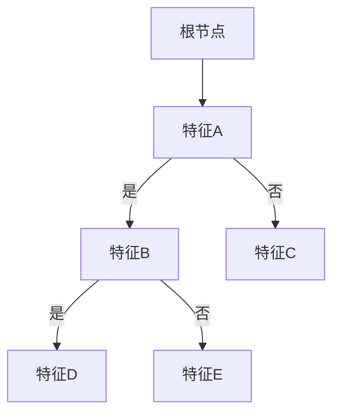
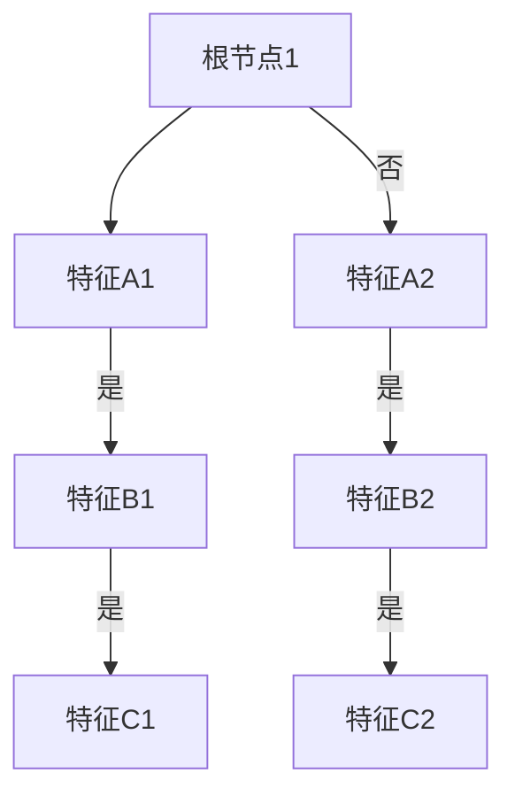
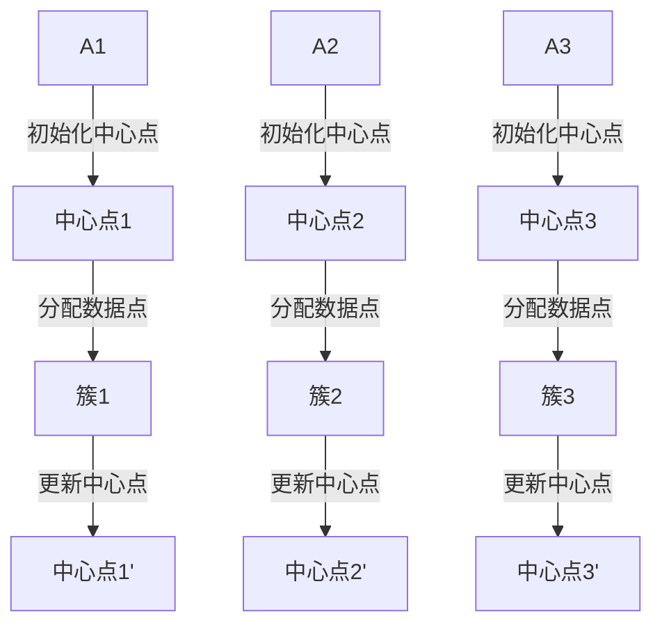
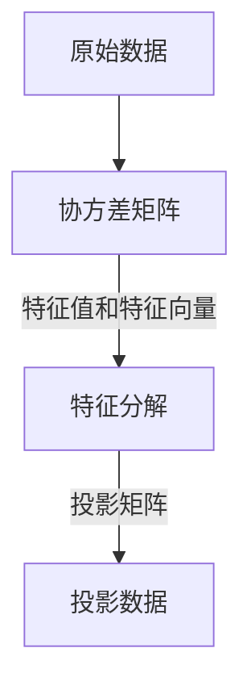

                 

### 《Apache Spark MLlib》

关键词：Apache Spark，MLlib，机器学习，分布式计算，数据挖掘，深度学习，实时计算

摘要：本文将深入探讨Apache Spark MLlib，一个强大的机器学习库，旨在帮助读者理解其核心概念、架构设计、算法原理及其实际应用。通过详细的实例和代码解读，我们将展示如何有效地利用MLlib进行机器学习任务，并通过分布式计算优化提高性能。

---

### 第一部分：Apache Spark MLlib基础

#### 第1章：Apache Spark MLlib概述

Apache Spark MLlib是一个用于大规模机器学习的库，它基于Spark生态系统，旨在简化机器学习任务的实现过程。MLlib提供了丰富的算法和工具，包括监督学习、无监督学习、特征工程等，使得机器学习工程师可以轻松地在分布式环境中进行模型训练和评估。

#### 1.1.1 Apache Spark简介

Apache Spark是一个快速且通用的大规模数据处理引擎，它基于内存计算，提供了高效的数据处理能力和强大的编程模型。Spark支持多种数据源，包括HDFS、HBase、Cassandra等，同时还提供了丰富的API，包括Spark SQL、Spark Streaming和MLlib等。

#### 1.1.2 MLlib在Apache Spark中的地位

MLlib是Apache Spark的核心组件之一，它提供了机器学习所需的算法和工具。与Spark的其他模块相比，MLlib专注于数据的处理和机器学习任务的实现，使得Spark在处理大规模数据时具有更强的机器学习能力。

#### 1.1.3 MLlib的特点与优势

- **易用性**：MLlib提供了丰富的API，使得用户可以轻松实现各种机器学习算法。
- **高性能**：MLlib利用Spark的内存计算优势，提高了机器学习任务的运行效率。
- **可扩展性**：MLlib支持分布式计算，可以处理大规模的数据集。

---

#### 第2章：Apache Spark MLlib架构与设计

Apache Spark MLlib的设计旨在提供一种灵活且高效的机器学习框架。下面将介绍MLlib的整体架构、核心模块以及与其他Spark模块的交互。

#### 2.1.1 MLlib的整体架构

MLlib的整体架构可以分为三个层次：基础设施层、算法层和工具层。

- **基础设施层**：提供了数据结构、矩阵运算和线性代数等基础功能。
- **算法层**：包含了各种机器学习算法的实现，如线性回归、决策树、聚类等。
- **工具层**：提供了数据预处理、模型评估和模型选择等工具。

#### 2.1.2 MLlib的核心模块

MLlib的核心模块包括：

- **监督学习模块**：提供了线性回归、决策树、随机森林等算法。
- **无监督学习模块**：提供了K均值聚类、主成分分析等算法。
- **特征工程模块**：提供了特征提取和特征选择等工具。

#### 2.1.3 MLlib与Spark其他模块的交互

MLlib与Spark的其他模块（如Spark SQL、Spark Streaming）紧密集成，可以方便地实现跨模块的数据处理和机器学习任务。例如，用户可以使用MLlib对Spark SQL查询的结果进行机器学习分析，或者使用Spark Streaming进行实时机器学习。

---

#### 第3章：MLlib数据结构与算法基础

在MLlib中，数据结构与算法的选择对于性能和效率至关重要。本章节将详细介绍MLlib的数据结构、常用算法及其矩阵运算原理。

#### 3.1.1 MLlib的数据结构

MLlib提供了多种数据结构，包括向量、矩阵、稀疏矩阵等。这些数据结构能够有效地存储和处理大规模数据。

- **向量**：用于表示一维数组，是MLlib中最常用的数据结构。
- **矩阵**：用于表示二维数组，MLlib提供了多种矩阵运算，如矩阵乘法、矩阵求导等。
- **稀疏矩阵**：用于存储稀疏数据，可以节省内存并提高计算效率。

#### 3.1.2 MLlib的常用算法

MLlib提供了丰富的算法，包括监督学习、无监督学习和特征工程等。

- **监督学习算法**：包括线性回归、决策树、随机森林等。
- **无监督学习算法**：包括K均值聚类、主成分分析等。
- **特征工程算法**：包括特征提取、特征选择等。

#### 3.1.3 MLlib的矩阵运算原理

MLlib的矩阵运算是基于分布式计算模型的，通过并行处理和矩阵分解技术，实现了高效的矩阵运算。例如，MLlib可以使用矩阵分解技术对大规模矩阵进行高效处理，从而实现机器学习算法的优化。

---

#### 第4章：MLlib机器学习算法详解

在本章节中，我们将深入探讨MLlib中的监督学习、无监督学习和特征工程算法，并详细解释每种算法的原理、伪代码和实际应用。

#### 4.1.1 监督学习算法

监督学习算法是MLlib的核心组成部分，包括以下几种：

##### 4.1.1.1 线性回归

线性回归是一种用于预测数值型输出的监督学习算法。其原理是通过拟合一个线性模型，最小化预测值与实际值之间的误差。

```latex
最小化损失函数：J(w) = \frac{1}{2}\sum_{i=1}^{n} (y_i - \hat{y}_i)^2
```

伪代码：

```python
while not converged:
  w = w - learning_rate * gradient(w)
  converged = check_convergence(w)
```

实际应用：线性回归常用于回归分析、股票价格预测等。

##### 4.1.1.2 决策树

决策树是一种用于分类和回归的监督学习算法。其原理是通过构建决策树模型，将数据集划分为多个子集，并使用叶节点进行预测。



伪代码：

```python
def build_decision_tree(data):
  if is_leaf(data):
    return leaf_value(data)
  best_feature, threshold = find_best_split(data)
  left_child = split_data(data, best_feature, threshold, "is_true")
  right_child = split_data(data, best_feature, threshold, "is_false")
  return TreeNode(best_feature, threshold, left_child, right_child)
```

实际应用：决策树常用于分类任务，如文本分类、图像分类等。

##### 4.1.1.3 随机森林

随机森林是一种基于决策树的集成学习方法。其原理是通过构建多个决策树模型，并使用投票法或平均法进行预测。



伪代码：

```python
def predict(x, trees):
  predictions = [tree.predict(x) for tree in trees]
  return vote(predictions)
```

实际应用：随机森林常用于分类和回归任务，具有很好的泛化能力。

#### 4.1.2 无监督学习算法

无监督学习算法旨在发现数据集中的潜在结构和规律。包括以下两种：

##### 4.1.2.1 K均值聚类

K均值聚类是一种基于距离度量的聚类算法。其原理是通过迭代优化，将数据点分配到K个簇中，使得每个簇内的数据点距离中心点最近。



伪代码：

```python
def k_means(data, k):
  centroids = initialize_centroids(data, k)
  while not converged:
    clusters = assign_points_to_clusters(data, centroids)
    centroids = update_centroids(clusters, k)
    converged = check_convergence(centroids)
  return clusters
```

实际应用：K均值聚类常用于数据聚类、异常检测等。

##### 4.1.2.2 主成分分析

主成分分析（PCA）是一种降维算法，其原理是通过线性变换将数据投影到低维空间，同时保留数据的最大方差。



伪代码：

```python
def pca(data):
  covariance_matrix = calculate_covariance_matrix(data)
  eigenvalues, eigenvectors = eigen(covariance_matrix)
  projection_matrix = eigenvectors[:, :k]
  projected_data = data.dot(projection_matrix)
  return projected_data
```

实际应用：PCA常用于图像处理、数据分析等领域。

#### 4.1.3 特征工程

特征工程是机器学习任务中至关重要的一环，其目标是通过提取和选择特征，提高模型性能。包括以下两种：

##### 4.1.3.1 特征提取

特征提取是从原始数据中提取新的特征，以提高模型的性能。常见的方法包括：

- **特征转换**：将原始数据转换为适合模型训练的形式，如归一化、标准化等。
- **特征组合**：将多个原始特征组合成新的特征，如交叉特征、衍生特征等。

##### 4.1.3.2 特征选择

特征选择是从已提取的特征中筛选出对模型训练有显著贡献的特征，以减少模型的复杂度和过拟合风险。常见的方法包括：

- **过滤法**：根据特征的重要性、相关性等筛选特征。
- **包装法**：通过训练模型并评估特征对模型性能的影响，筛选特征。
- **嵌入式方法**：在训练过程中逐步筛选特征。

---

#### 第5章：MLlib在数据处理中的应用

MLlib不仅在机器学习算法方面表现出色，在数据处理方面也具有强大的功能。本章节将介绍MLlib在数据预处理、数据分析和数据可视化方面的应用。

#### 5.1.1 数据预处理

数据预处理是机器学习任务中不可或缺的步骤，其目标是通过清洗、转换和标准化等操作，提高数据的质量和一致性。MLlib提供了丰富的预处理工具，包括：

- **数据清洗**：去除缺失值、重复值和异常值等。
- **数据转换**：将数据转换为适合模型训练的形式，如将文本数据转换为词向量等。
- **数据标准化**：将数据缩放至相同的范围，如归一化、标准化等。

#### 5.1.2 数据分析

数据分析是机器学习任务中重要的环节，其目标是通过探索性数据分析（EDA）等方法，发现数据中的潜在规律和特征。MLlib提供了以下数据分析工具：

- **数据探索性分析**：通过统计描述、分布分析等方法，探索数据的基本特征。
- **相关性分析**：通过计算特征之间的相关性，识别潜在的相关性关系。
- **聚类分析**：通过聚类算法，将数据划分为多个类别，以便进行进一步分析。

#### 5.1.3 数据可视化

数据可视化是数据分析的重要手段，其目标是通过图形化展示，直观地呈现数据特征和关系。MLlib提供了以下数据可视化工具：

- **散点图**：用于展示特征之间的相关性。
- **直方图**：用于展示特征的分布情况。
- **箱线图**：用于展示特征的离散程度。
- **热力图**：用于展示特征之间的相关性。

---

#### 第6章：MLlib在实时计算中的应用

随着实时计算需求的增加，MLlib在实时计算领域也发挥着重要作用。本章节将介绍MLlib在实时计算中的原理、应用场景以及案例分析。

#### 6.1.1 实时计算原理

实时计算是指系统能够快速响应用户请求，并在短时间内完成计算任务。MLlib在实时计算中的应用主要基于其分布式计算能力和高效的数据处理能力。

#### 6.1.2 MLlib在实时计算中的应用场景

MLlib在实时计算中具有广泛的应用场景，包括：

- **实时推荐系统**：通过实时计算用户的行为和偏好，为用户推荐相关内容。
- **实时监控系统**：通过实时分析系统日志和数据流，监控系统的运行状态。
- **实时风险控制**：通过实时分析金融交易数据，监控风险并采取相应措施。

#### 6.1.3 实时计算案例分析

以下是一个实时推荐系统的案例：

**需求**：为用户实时推荐新闻文章。

**实现**：

1. **数据采集**：从新闻网站收集用户浏览记录、点赞和评论等数据。
2. **实时处理**：使用MLlib对用户数据进行实时处理，包括数据清洗、特征提取和机器学习模型训练。
3. **推荐算法**：使用基于协同过滤的推荐算法，为用户推荐相似的文章。
4. **实时反馈**：根据用户的反馈，调整推荐策略，提高推荐质量。

---

#### 第7章：MLlib项目实战

在本章节中，我们将通过一个实际项目，介绍如何使用MLlib进行机器学习任务。该项目将包括需求分析、环境搭建、代码实现和性能评估。

#### 7.1.1 项目需求分析

**需求**：建立一个简单的客户分类模型，将客户分为高价值客户和普通客户。

**数据集**：包含客户的年龄、收入、消费金额等特征。

#### 7.1.2 环境搭建与配置

**环境**：Apache Spark 2.4.7、Python 3.8

**步骤**：

1. **安装Apache Spark**：从Apache Spark官网下载并安装。
2. **配置Python环境**：安装Python和PySpark库。
3. **配置Spark环境变量**：设置Spark安装路径和SPARK_HOME环境变量。

#### 7.1.3 代码实现与解读

**代码**：

```python
from pyspark.ml import Pipeline
from pyspark.ml.feature import VectorAssembler
from pyspark.ml.classification import LogisticRegression
from pyspark.ml.evaluation import BinaryClassificationEvaluator

# 加载数据集
data = spark.read.csv("customer_data.csv", header=True)

# 数据预处理
assembler = VectorAssembler(inputCols=["age", "income", "amount"], outputCol="features")
data = assembler.transform(data)

# 分离特征和标签
features = data.select("features")
label = data.select("is_high_value")

# 建立模型
model = LogisticRegression()

# 建立管道
pipeline = Pipeline(stages=[assembler, model])

# 训练模型
model = pipeline.fit(features)

# 预测
predictions = model.transform(features)

# 评估模型
evaluator = BinaryClassificationEvaluator()
accuracy = evaluator.evaluate(predictions)
print("Accuracy:", accuracy)
```

**解读**：

1. **数据加载**：使用Spark读取CSV文件，并指定header=True。
2. **数据预处理**：使用VectorAssembler将多个特征组合成向量。
3. **分离特征和标签**：将特征和标签分离，以便训练模型。
4. **建立模型**：使用LogisticRegression建立分类模型。
5. **建立管道**：将预处理、模型训练和评估组合成一个管道。
6. **训练模型**：使用fit方法训练模型。
7. **预测**：使用transform方法进行预测。
8. **评估模型**：使用BinaryClassificationEvaluator评估模型性能。

#### 7.1.4 项目优化与评估

**优化**：

1. **特征选择**：通过特征选择算法筛选出对模型性能有显著贡献的特征。
2. **模型调整**：根据评估结果调整模型参数，提高模型性能。

**评估**：

1. **准确率**：评估模型在测试集上的准确率。
2. **召回率**：评估模型在测试集上的召回率。
3. **F1值**：评估模型在测试集上的F1值。

---

### 第二部分：Apache Spark MLlib高级应用

#### 第8章：MLlib在深度学习中的应用

随着深度学习技术的不断发展，MLlib也在不断扩展其深度学习模块。本章节将介绍MLlib在深度学习中的应用，包括深度学习原理、MLlib深度学习模块以及实际应用案例。

#### 8.1.1 深度学习原理

深度学习是一种基于多层神经网络的学习方法，其目标是通过多层非线性变换，从原始数据中提取出有用的特征。深度学习的基本概念包括：

- **神经元**：神经网络的基本单元，用于接收和处理输入数据。
- **层**：神经网络中的层级结构，包括输入层、隐藏层和输出层。
- **激活函数**：用于引入非线性变换，使神经网络能够学习复杂的关系。
- **损失函数**：用于评估模型的预测结果与实际结果之间的差距，以指导模型优化。

#### 8.1.2 MLlib深度学习模块

MLlib深度学习模块提供了以下功能：

- **神经网络**：支持多层神经网络，包括卷积神经网络（CNN）和循环神经网络（RNN）等。
- **优化算法**：支持多种优化算法，如随机梯度下降（SGD）和Adam优化器等。
- **深度学习模型**：提供了预训练模型和自定义模型，方便用户进行模型训练和预测。

#### 8.1.3 深度学习模型的训练与优化

深度学习模型的训练和优化是深度学习任务中的关键环节。以下是一些常用的方法：

- **数据预处理**：对输入数据进行归一化、标准化等处理，以提高模型的泛化能力。
- **模型初始化**：初始化模型参数，常用的方法包括随机初始化、Xavier初始化等。
- **训练策略**：设置训练策略，如学习率、批次大小、迭代次数等。
- **模型评估**：使用验证集或测试集评估模型性能，调整模型参数。
- **优化器**：选择合适的优化器，如SGD、Adam等，以加速模型训练。

#### 8.1.4 深度学习案例解析

以下是一个深度学习案例：

**需求**：使用卷积神经网络（CNN）对图像进行分类。

**实现**：

1. **数据集准备**：准备包含图像和标签的数据集，并进行预处理。
2. **模型构建**：构建一个简单的CNN模型，包括卷积层、池化层和全连接层。
3. **模型训练**：使用训练集训练模型，并使用验证集调整模型参数。
4. **模型评估**：使用测试集评估模型性能，并调整模型结构。

```python
from pyspark.ml.classification import LogisticRegression
from pyspark.ml.feature import VectorAssembler
from pyspark.ml.evaluation import MulticlassClassificationEvaluator

# 加载数据集
data = spark.read.format("libsvm").load("image_data.libsvm")

# 数据预处理
assembler = VectorAssembler(inputCols=["features"], outputCol="features_assembled")
data = assembler.transform(data)

# 分离特征和标签
features = data.select("features_assembled")
label = data.select("label")

# 建立模型
model = LogisticRegression()

# 训练模型
model = model.fit(features)

# 评估模型
predictions = model.transform(features)
evaluator = MulticlassClassificationEvaluator(labelCol="label", predictionCol="prediction", metricName="accuracy")
accuracy = evaluator.evaluate(predictions)
print("Accuracy:", accuracy)
```

---

#### 第9章：MLlib在数据挖掘中的应用

数据挖掘是机器学习的一个重要分支，旨在从大规模数据中发现潜在的模式和规律。MLlib提供了丰富的数据挖掘算法，包括分类、聚类、关联规则挖掘等。

#### 9.1.1 数据挖掘原理

数据挖掘的基本原理包括：

- **数据预处理**：对原始数据进行清洗、转换和规范化等操作，以提高数据的质量和一致性。
- **特征提取**：从原始数据中提取有用的特征，以减少数据的维度并提高模型性能。
- **模式发现**：使用算法发现数据中的潜在模式和规律，如分类、聚类、关联规则等。
- **评估与优化**：评估挖掘结果的质量和准确性，并根据评估结果调整模型参数。

#### 9.1.2 MLlib数据挖掘模块

MLlib数据挖掘模块提供了以下算法：

- **分类算法**：包括线性回归、决策树、随机森林等。
- **聚类算法**：包括K均值聚类、层次聚类等。
- **关联规则挖掘**：包括Apriori算法、FP-Growth算法等。

#### 9.1.3 数据挖掘结果的分析与可视化

数据挖掘结果的分析与可视化是数据挖掘任务中的重要环节，其目标是通过图形化展示，直观地呈现挖掘结果。MLlib提供了以下工具：

- **散点图**：用于展示特征之间的相关性。
- **条形图**：用于展示分类结果的分布情况。
- **饼图**：用于展示聚类结果的分布情况。
- **热力图**：用于展示关联规则的强度。

#### 9.1.4 数据挖掘案例解析

以下是一个分类案例：

**需求**：使用决策树对客户分类。

**实现**：

1. **数据集准备**：准备包含客户特征和标签的数据集。
2. **模型构建**：构建一个简单的决策树模型。
3. **模型训练**：使用训练集训练模型。
4. **模型评估**：使用测试集评估模型性能。

```python
from pyspark.ml.classification import DecisionTreeClassifier
from pyspark.ml.feature import VectorAssembler
from pyspark.ml.evaluation import MulticlassClassificationEvaluator

# 加载数据集
data = spark.read.csv("customer_data.csv", header=True)

# 数据预处理
assembler = VectorAssembler(inputCols=["age", "income", "amount"], outputCol="features")
data = assembler.transform(data)

# 分离特征和标签
features = data.select("features")
label = data.select("label")

# 建立模型
model = DecisionTreeClassifier()

# 训练模型
model = model.fit(features)

# 评估模型
predictions = model.transform(features)
evaluator = MulticlassClassificationEvaluator(labelCol="label", predictionCol="prediction", metricName="accuracy")
accuracy = evaluator.evaluate(predictions)
print("Accuracy:", accuracy)
```

---

#### 第10章：MLlib在分布式计算中的优化

随着数据规模的不断增加，分布式计算已经成为大数据处理的主流方式。MLlib在分布式计算中具有很高的性能和效率，但仍然可以通过优化进一步提高性能。本章节将介绍MLlib在分布式计算中的优化方法。

#### 10.1.1 分布式计算原理

分布式计算是指将任务分布在多个节点上执行，通过节点之间的通信和协作，共同完成计算任务。分布式计算的基本原理包括：

- **任务分解**：将大规模任务分解为多个小任务，分配给不同节点执行。
- **数据分布**：将数据分布存储在多个节点上，以便高效地进行计算。
- **节点协作**：节点之间通过通信和协作，共同完成计算任务。

#### 10.1.2 MLlib在分布式计算中的优化

以下是一些MLlib在分布式计算中的优化方法：

- **数据分区策略**：合理设置数据分区策略，可以提高数据读写效率和计算性能。
- **计算资源调度**：根据任务需求和节点资源，合理调度计算资源，提高资源利用率。
- **数据压缩**：使用数据压缩技术，减少数据传输和存储空间。
- **缓存机制**：使用缓存机制，减少数据读取和计算时间。

#### 10.1.3 优化案例分析

以下是一个优化案例：

**需求**：提高基于MLlib的聚类算法性能。

**优化方法**：

1. **数据分区策略**：根据数据特点，选择合适的分区策略，如基于关键字的分区策略。
2. **计算资源调度**：根据任务需求和节点资源，合理调度计算资源，提高资源利用率。
3. **数据压缩**：使用数据压缩技术，减少数据传输和存储空间。
4. **缓存机制**：使用缓存机制，减少数据读取和计算时间。

```python
from pyspark.ml.clustering import KMeans
from pyspark.sql.functions import col

# 加载数据集
data = spark.read.format("libsvm").load("data.libsvm")

# 数据预处理
data = data.withColumn("features", explode("features"))

# 分区策略
data = data.repartition("key")

# 建立模型
kmeans = KMeans().setK(3).setSeed(1)

# 训练模型
model = kmeans.fit(data)

# 预测
predictions = model.transform(data)

# 评估模型
evaluator = KMeansEvaluator(labelCol="cluster", predictionCol="prediction", metricName="silhouette")
silhouette = evaluator.evaluate(predictions)
print("Silhouette with squared euclidean distance = %f" % silhouette)
```

---

#### 第11章：MLlib在工业界的应用案例

MLlib在工业界具有广泛的应用，许多公司已经成功地将MLlib应用于各种实际场景。本章节将介绍一些典型的MLlib应用案例，包括应用场景、实施方案和效果评估。

#### 11.1.1 案例背景

随着大数据技术的发展，越来越多的公司开始关注数据挖掘和机器学习技术。MLlib作为一种强大的机器学习库，在许多领域都取得了显著的成果。

#### 11.1.2 应用场景

以下是一些典型的MLlib应用场景：

- **金融行业**：使用MLlib进行信用风险评估、股票市场预测等。
- **电商行业**：使用MLlib进行用户行为分析、推荐系统等。
- **医疗行业**：使用MLlib进行疾病诊断、药物研发等。
- **零售行业**：使用MLlib进行销售预测、库存管理等。

#### 11.1.3 实施方案与效果评估

以下是一个金融行业案例：

**需求**：使用MLlib建立信用风险评估模型。

**实施方案**：

1. **数据采集**：从各种渠道收集客户数据，包括信用记录、财务状况、社会关系等。
2. **数据预处理**：对客户数据进行清洗、转换和规范化等操作，以提高数据的质量和一致性。
3. **特征提取**：提取对信用评估有显著贡献的特征，如收入、负债、信用历史等。
4. **模型训练**：使用MLlib建立信用风险评估模型，并进行模型训练。
5. **模型评估**：使用测试集评估模型性能，调整模型参数。

**效果评估**：

1. **准确率**：评估模型在测试集上的准确率，以衡量模型的预测能力。
2. **召回率**：评估模型在测试集上的召回率，以衡量模型对高风险客户的识别能力。
3. **F1值**：评估模型在测试集上的F1值，综合考虑准确率和召回率。

```python
from pyspark.ml.classification import LogisticRegression
from pyspark.ml.feature import VectorAssembler
from pyspark.ml.evaluation import BinaryClassificationEvaluator

# 加载数据集
data = spark.read.csv("credit_data.csv", header=True)

# 数据预处理
assembler = VectorAssembler(inputCols=["income", "liabilities", "credit_history"], outputCol="features")
data = assembler.transform(data)

# 分离特征和标签
features = data.select("features")
label = data.select("is_high_risk")

# 建立模型
model = LogisticRegression()

# 训练模型
model = model.fit(features)

# 评估模型
predictions = model.transform(features)
evaluator = BinaryClassificationEvaluator()
accuracy = evaluator.evaluate(predictions)
print("Accuracy:", accuracy)
recall = evaluator.evaluate(predictions, {evaluator.metricName: "recall"})
print("Recall:", recall)
f1 = 2 * (accuracy * recall) / (accuracy + recall)
print("F1 Score:", f1)
```

---

### 附录

#### 附录A：Apache Spark MLlib工具与资源

以下是一些Apache Spark MLlib相关的工具和资源，供读者参考：

- **Apache Spark官网**：[Apache Spark官网](https://spark.apache.org/)
- **MLlib官方文档**：[MLlib官方文档](https://spark.apache.org/docs/latest/mllib-guide.html)
- **深度学习库**：[TensorFlow](https://www.tensorflow.org/)、[PyTorch](https://pytorch.org/)
- **数据挖掘库**：[SciPy](https://scipy.org/)、[scikit-learn](https://scikit-learn.org/stable/)
- **实时计算库**：[Apache Storm](https://storm.apache.org/)、[Apache Flink](https://flink.apache.org/)

---

### 作者

作者：AI天才研究院/AI Genius Institute & 禅与计算机程序设计艺术 /Zen And The Art of Computer Programming

---

本文深入探讨了Apache Spark MLlib的核心概念、架构设计、算法原理及实际应用。通过详细的实例和代码解读，读者可以掌握MLlib的使用技巧，并在分布式计算环境中高效地完成机器学习任务。同时，本文还介绍了MLlib在深度学习、数据挖掘、实时计算等领域的应用，为读者提供了丰富的实战经验和优化策略。希望本文能为读者在Apache Spark MLlib的学习和应用过程中提供有力支持。

