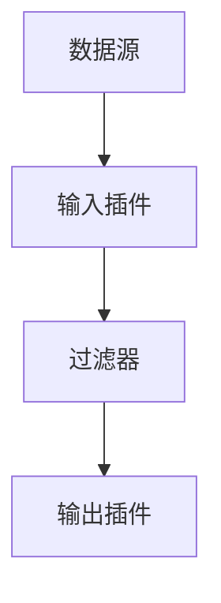
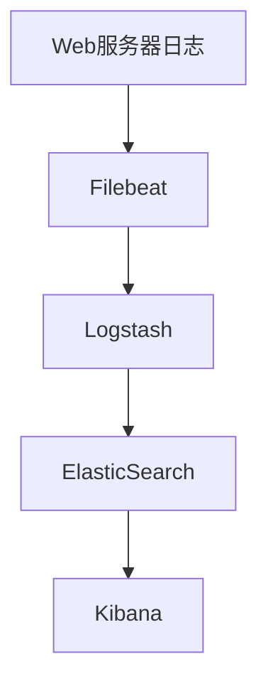

                 

### 文章标题

> **ElasticSearch Logstash原理与代码实例讲解**

---

### 关键词

- ElasticSearch
- Logstash
- 分布式搜索
- 日志收集
- 数据处理
- 数据分析
- 集成应用

---

### 摘要

本文旨在深入讲解ElasticSearch和Logstash的核心原理、架构设计与实际应用。通过对ElasticSearch的搜索引擎技术、分布式架构、索引管理等进行详尽分析，再结合Logstash的日志收集、数据转换、管道处理等原理，我们将展示如何将这两大工具结合起来，构建高效的数据处理与分析系统。文章将通过实际代码实例，引导读者逐步掌握ElasticSearch和Logstash的实战技巧，为解决实际业务问题提供有力支持。

---

## 引言

随着大数据时代的到来，处理和分析海量数据已成为现代企业的核心需求。ElasticSearch和Logstash作为Elastic Stack的核心组件，共同构建了一套强大的数据处理与分析平台。ElasticSearch以其分布式搜索引擎技术、强大的数据检索能力，以及灵活的聚合分析功能，成为大数据处理领域的重要工具。而Logstash则专注于日志收集、数据转换和管道处理，提供了高效的日志管理解决方案。

本文将首先介绍ElasticSearch和Logstash的基本概念和原理，然后通过具体代码实例，展示如何将这两者集成起来，实现高效的数据处理与分析。文章的结构如下：

1. **第一部分：ElasticSearch与Logstash基础理论**
   - **第1章** ElasticSearch概述
   - **第2章** ElasticSearch核心原理
   - **第3章** Logstash基础理论

2. **第二部分：ElasticSearch与Logstash集成实战**
   - **第4章** ElasticSearch与Logstash集成实战

3. **第三部分：ElasticSearch与Logstash高级应用**
   - **第5章** ElasticSearch高级特性
   - **第6章** Logstash高级功能

4. **第四部分：ElasticSearch与Logstash项目实战**
   - **第7章** ElasticSearch与Logstash项目实战

5. **第五部分：ElasticSearch与Logstash的未来发展**
   - **第8章** ElasticSearch与Logstash的未来发展

通过本文的学习，读者将能够深入理解ElasticSearch和Logstash的技术原理，掌握实战技巧，并为未来的大数据处理与分析奠定坚实的基础。

---

### 第一部分: ElasticSearch与Logstash基础理论

#### 第1章 ElasticSearch概述

ElasticSearch是一个高度可扩展的分布式搜索引擎，基于Lucene构建。它提供了灵活的全文搜索、实时分析、和可扩展性，适用于大规模数据处理的场景。本章节将介绍ElasticSearch的起源、发展历史、核心概念及其在数据处理中的应用。

##### 1.1 ElasticSearch的起源与发展

ElasticSearch起源于2004年的Apache Lucene项目。Lucene是一个开源的全文搜索引擎库，由Apache Software Foundation维护。随着互联网的快速发展，人们对实时搜索和大规模数据处理的需求日益增加。为了满足这些需求，ElasticSearch在2010年诞生，并迅速成为最受欢迎的分布式搜索引擎之一。Elastic公司也围绕ElasticSearch开发了Elastic Stack，包括Kibana、Logstash等组件，形成了完整的解决方案。

##### 1.2 ElasticSearch的核心概念

- **节点（Node）**: ElasticSearch中的基本工作单元。每个节点都可以独立运行，并通过网络进行通信。节点可以是主节点、数据节点或者协调节点。
- **集群（Cluster）**: 一组节点的集合，共同构成一个ElasticSearch集群。集群中的节点协同工作，共享数据和负载。
- **索引（Index）**: 类似于数据库中的表，用于存储相关数据的集合。每个索引都有自己的名字和映射（Mapping），定义了数据结构。
- **类型（Type）**: 在ElasticSearch 6.x及之前，用于区分不同类型的文档。但在ElasticSearch 7.x及以后，类型已被废弃，所有文档都属于 `_doc` 类型。
- **文档（Document）**: 数据的基本单元，由一系列的字段组成。每个文档都是JSON格式的。
- **映射（Mapping）**: 描述了索引中字段的数据类型、索引方式、分析器等，定义了文档的结构。

##### 1.3 ElasticSearch的架构与组件

ElasticSearch的架构由多个组件构成，包括节点、集群、索引、类型、文档和映射。以下是一个简化的ElasticSearch架构图：


##### 1.4 ElasticSearch与大数据的关系

ElasticSearch适用于大数据场景，其分布式架构和弹性扩展能力使得它能够处理海量数据。通过横向扩展，ElasticSearch能够轻松应对大规模数据集的存储和检索需求。此外，ElasticSearch还提供了丰富的聚合分析功能，可以实时地对大规模数据进行复杂分析。

##### 1.5 ElasticSearch的优势与应用场景

ElasticSearch具有以下优势：

- **高性能**: ElasticSearch基于Lucene引擎，提供了快速的数据检索和分析能力。
- **可扩展性**: 支持横向扩展，能够处理海量数据。
- **易用性**: 提供了丰富的API和工具，易于集成和部署。
- **灵活性**: 支持多种数据类型和自定义映射，适用于各种场景。

应用场景包括：

- **全文搜索**: 如电子商务平台的商品搜索、内容管理系统的文章搜索等。
- **日志分析**: 收集和存储系统日志，进行实时监控和分析。
- **数据可视化**: 通过Kibana等工具，将ElasticSearch的数据进行可视化展示。
- **实时分析**: 对实时数据进行聚合分析和监控。

#### 1.6 小结

本章介绍了ElasticSearch的起源、核心概念、架构以及与大数据的关系。ElasticSearch作为一种分布式搜索引擎，具有高性能、可扩展性和灵活性，适用于多种大数据处理场景。在接下来的章节中，我们将进一步深入探讨ElasticSearch的核心原理，以及如何与Logstash结合使用，构建高效的数据处理与分析系统。

---

#### 第2章 ElasticSearch核心原理

在了解ElasticSearch的基础概念后，我们接下来将深入探讨ElasticSearch的核心原理，包括其基于Lucene的搜索引擎技术、索引原理、数据存储与检索机制、分布式系统原理与集群管理，以及性能优化策略。

##### 2.1 基于Lucene的搜索引擎

ElasticSearch的核心是基于Apache Lucene构建的。Lucene是一个高度可扩展、高性能的全文搜索引擎库，提供了一系列强大的索引和搜索功能。ElasticSearch对Lucene进行了扩展和优化，使其具备了分布式搜索能力。

- **倒排索引（Inverted Index）**: Lucene的核心数据结构是倒排索引。它将文档中的词汇与文档ID进行映射，使得搜索操作非常高效。
- **词频-逆文档频（TF-IDF）**: Lucene使用词频-逆文档频算法来计算文档的相关性。词频表示词汇在文档中出现的次数，逆文档频表示词汇在整个文档集中出现的频率。通过计算这两个指标，Lucene可以确定文档与查询的匹配程度。
- **分词器（Tokenizer）**: 分词器将文本拆分为单词或词汇，以便进行索引和搜索。ElasticSearch提供了多种分词器，包括标准分词器、关键字分词器等。

##### 2.2 Elasticsearch的索引原理

索引是ElasticSearch存储数据的核心概念。每个索引包含一组具有相同结构的文档。ElasticSearch的索引原理主要包括以下几个方面：

- **分片（Shards）**: 索引被拆分成多个分片，每个分片都是独立且完整的数据副本。分片使得数据可以分布式存储，提高了系统的扩展性和容错能力。
- **副本（Replicas）**: 每个分片都有一个或多个副本。副本用于数据冗余和负载均衡。在发生故障时，副本可以快速替换主分片，确保数据的持续可用性。
- **路由（Routing）**: 当对索引进行操作时，ElasticSearch会根据路由规则将请求分配到相应的分片。路由规则可以根据文档的ID、类型等进行配置。
- **映射（Mapping）**: 索引的映射定义了文档的结构，包括字段类型、索引方式、分析器等。映射确保了数据的存储和检索的一致性。

##### 2.3 数据存储与检索机制

ElasticSearch的数据存储与检索机制包括以下几个方面：

- **文件系统存储**: 数据主要存储在文件系统中，每个索引的数据存储在一个独立的目录下。ElasticSearch使用了一种称为Lucene Segment File的数据结构，将索引数据分成多个段进行管理。
- **内存缓存**: ElasticSearch使用内存缓存来提高检索性能。缓存中存储了常用数据和索引，减少了磁盘IO操作。
- **查询缓存**: 查询缓存存储了最近执行过的查询结果，当相同的查询再次执行时，可以直接从缓存中获取结果，提高查询效率。
- **刷新与合并**: 为了将缓存中的数据写入磁盘，ElasticSearch定期执行刷新操作。同时，通过合并操作将多个段合并为一个新的段，提高检索性能。

##### 2.4 分布式系统原理与集群管理

ElasticSearch是一个分布式系统，通过多个节点协同工作，提供高可用性和可扩展性。以下是其分布式系统原理：

- **主节点（Master Node）**: 主节点负责集群的管理和协调，如选举主节点、分配任务、监控集群状态等。一个集群只有一个主节点。
- **数据节点（Data Node）**: 数据节点负责存储数据和索引，执行查询操作。一个集群可以有多个数据节点。
- **协调节点（Coordinating Node）**: 协调节点负责处理来自客户端的请求，将请求路由到相应的数据节点。

集群管理包括以下几个方面：

- **初始化集群**: 初始情况下，可以通过启动一个单节点集群，然后逐步添加节点，扩展集群规模。
- **负载均衡**: ElasticSearch通过路由算法，将请求均衡分配到各个数据节点，确保系统资源的高效利用。
- **故障转移**: 当主节点发生故障时，集群会自动进行选举，新的主节点接替原有主节点的工作，确保系统的持续运行。
- **监控与日志**: ElasticSearch提供了丰富的监控和日志工具，如Elasticsearch-head、Kibana等，用于监控集群状态和性能。

##### 2.5 性能优化策略与调优

为了提高ElasticSearch的性能，可以采取以下优化策略：

- **硬件优化**: 使用高性能的SSD硬盘和充足的内存，提高数据存储和检索速度。
- **索引优化**: 对索引进行合理设计，包括选择合适的字段类型、分析器等，减少索引的存储空间和检索时间。
- **缓存优化**: 优化内存缓存和查询缓存，提高数据访问速度。
- **分片和副本优化**: 根据数据量和查询负载，合理配置分片和副本数量，提高系统的扩展性和可用性。
- **查询优化**: 使用ElasticSearch的查询优化功能，如过滤查询、聚合查询等，提高查询性能。

##### 2.6 小结

本章深入介绍了ElasticSearch的核心原理，包括基于Lucene的搜索引擎技术、索引原理、数据存储与检索机制、分布式系统原理与集群管理，以及性能优化策略。通过理解这些核心原理，读者可以更好地运用ElasticSearch，构建高效的数据处理与分析系统。在接下来的章节中，我们将继续探讨Logstash的基础理论，以及如何将ElasticSearch和Logstash结合起来，实现高效的数据处理与分析。

---

#### 第3章 Logstash基础理论

Logstash是一款强大的数据收集、处理和传输工具，是Elastic Stack中的重要组件之一。它能够从各种数据源（如Web服务器、数据库、消息队列等）收集数据，经过处理和过滤，然后将数据导入到目标存储（如ElasticSearch、数据仓库等）。本章节将介绍Logstash的概念、工作流程、Ingest Node与Pipeline的原理，以及数据格式处理与转换，并探讨Logstash与ElasticSearch的集成。

##### 3.1 Logstash的概念与作用

Logstash旨在解决大规模数据收集和传输的需求。它通过将数据从源头提取，经过处理和过滤，最终将其传输到目标系统，从而实现了数据流的管理和整合。以下是一些关键概念：

- **数据源（Input）**: Logstash的数据源是数据收集的起点，可以是各种类型的数据流，如Web服务器日志、数据库日志、消息队列等。
- **过滤器（Filter）**: 过滤器用于处理和转换原始数据。Logstash支持多种过滤插件，如JSON解析、字段转换、正则表达式等，可以根据需求进行定制化处理。
- **输出（Output）**: 输出是数据流的终点，Logstash可以将处理后的数据传输到各种目标系统，如ElasticSearch、数据仓库等。
- **Pipeline**: Pipeline是Logstash的数据处理流程，由输入、过滤器和输出组成。通过配置不同的插件，可以构建灵活的数据处理管道。

##### 3.2 Logstash的工作流程

Logstash的工作流程主要包括以下几个步骤：

1. **输入（Input）**: 数据源将原始数据发送到Logstash的输入插件。输入插件可以是文件、TCP、UDP、JMS等。
2. **过滤（Filter）**: 输入的数据经过过滤器进行处理和转换。过滤器可以修改数据的格式、结构或内容，以便于后续处理。
3. **输出（Output）**: 处理后的数据被发送到输出插件。输出插件可以将数据存储在本地文件系统、数据库、ElasticSearch等。
4. **错误处理与重试**: 如果在处理数据时发生错误，Logstash可以自动重试或将错误数据发送到错误队列，以便后续处理。

以下是一个简化的Logstash工作流程图：



##### 3.3 Ingest Node与Pipeline

Ingest Node是Logstash的一个重要概念，用于处理原始数据。Ingest Node包含以下组件：

- **缓冲区（Buffer）**: 用于存储临时数据，提高系统的吞吐量。
- **处理器（Processor）**: 负责对数据进行预处理，如解析JSON、转换字段等。
- **存储（Storage）**: 将处理后的数据存储在内存或磁盘上，以便后续处理。

Pipeline是Logstash的数据处理流程，由输入、过滤器和输出组成。通过配置不同的插件，可以构建灵活的数据处理管道。以下是一个简单的Pipeline配置示例：

```yaml
input {
  file {
    path => "/path/to/logfile.log"
    type => "syslog"
    startpos => 0
  }
}

filter {
  if [type] == "syslog" {
    grok {
      match => { "message" => "%{TIMESTAMP_ISO8601:timestamp}\t%{DATA:hostname}\t%{DATA:source}\t%{DATA:message}" }
    }
  }
}

output {
  elasticsearch {
    hosts => ["localhost:9200"]
  }
}
```

在这个配置中，Logstash从指定的文件中读取日志数据，使用Grok过滤器解析日志内容，然后将处理后的数据输出到ElasticSearch。

##### 3.4 数据格式处理与转换

Logstash提供了丰富的插件和过滤器，用于处理和转换各种数据格式。以下是一些常用的数据格式处理与转换方法：

- **JSON解析**: Logstash可以使用JSON解析插件，将JSON格式的数据解析成ElasticSearch可以处理的格式。
- **字段转换**: 通过过滤器，可以动态地转换字段名称和数据类型，如将字符串转换为数字或日期。
- **正则表达式**: 使用正则表达式过滤器，可以对数据进行复杂的模式匹配和替换操作。
- **日期格式转换**: Logstash提供了日期格式转换插件，可以将不同格式的日期字符串转换为统一格式的日期。

##### 3.5 Logstash与ElasticSearch的集成

Logstash与ElasticSearch的集成是数据流处理的核心。通过Logstash，可以将各种来源的数据收集、处理并输出到ElasticSearch中。以下是一些关键的集成方法：

- **索引管理**: Logstash可以通过输出插件，将数据直接输出到ElasticSearch的索引中。在输出时，可以指定索引名称、类型和映射，以确保数据的正确存储。
- **数据同步**: Logstash可以实时同步数据到ElasticSearch，保证数据的实时性和一致性。
- **错误处理**: 如果在输出过程中发生错误，Logstash可以记录错误信息，并进行自动重试或通知相关人员。

##### 3.6 小结

本章介绍了Logstash的基础理论，包括概念、工作流程、Ingest Node与Pipeline的原理，以及数据格式处理与转换。通过理解Logstash的工作原理和配置方法，读者可以构建高效的数据收集、处理和传输系统。在下一章节中，我们将通过实际代码实例，展示如何将ElasticSearch和Logstash集成起来，实现高效的数据处理与分析。

---

#### 第4章 ElasticSearch与Logstash集成实战

在实际应用中，将ElasticSearch和Logstash集成，可以构建一个高效的数据收集、处理和分析系统。本章节将通过实际代码实例，详细讲解如何搭建ElasticSearch和Logstash的环境，以及如何通过Logstash收集、处理和输出数据到ElasticSearch。同时，我们将展示如何进行日志收集与解析、数据处理与索引、搜索与可视化，并通过一个案例解析与优化，深入探讨实际应用中的最佳实践。

##### 4.1 环境搭建与配置

要开始ElasticSearch和Logstash的集成实践，首先需要搭建一个完整的环境。以下步骤将指导你如何配置ElasticSearch和Logstash，并确保它们能够正常工作。

1. **安装ElasticSearch**：
   - ElasticSearch可以在[官网](https://www.elastic.co/downloads/elasticsearch)下载。下载适用于你的操作系统的ElasticSearch版本。
   - 解压下载的压缩文件，并启动ElasticSearch服务。通常可以通过以下命令启动：

     ```bash
     bin/elasticsearch
     ```

2. **安装Logstash**：
   - 同样，可以从[官网](https://www.elastic.co/downloads/logstash)下载适用于你的操作系统的Logstash版本。
   - 解压下载的压缩文件，并启动Logstash服务。通常可以通过以下命令启动：

     ```bash
     bin/logstash -f path/to/logstash.conf
     ```

3. **配置ElasticSearch**：
   - 在ElasticSearch的配置文件 `elasticsearch.yml` 中，可以配置集群名称、节点名称、网络设置等。以下是一个简单的配置示例：

     ```yaml
     cluster.name: my-cluster
     node.name: node-1
     network.host: 0.0.0.0
     http.port: 9200
     ```

4. **配置Logstash**：
   - 在Logstash的配置文件 `logstash.conf` 中，可以定义输入、过滤和输出插件。以下是一个简单的配置示例：

     ```yaml
     input {
       file {
         path => "/path/to/logfile.log"
         type => "syslog"
       }
     }
     filter {
       if [type] == "syslog" {
         grok {
           match => { "message" => "%{TIMESTAMP_ISO8601:timestamp}\t%{DATA:hostname}\t%{DATA:source}\t%{DATA:message}" }
         }
       }
     }
     output {
       elasticsearch {
         hosts => ["localhost:9200"]
       }
     }
     ```

通过以上步骤，我们成功搭建了一个基本的ElasticSearch和Logstash环境。接下来，我们将深入讲解如何通过Logstash收集和解析日志，然后将数据输出到ElasticSearch。

##### 4.2 日志收集与解析

在实际应用中，日志收集是一个非常重要的环节。通过收集系统、应用程序、Web服务器等的日志，可以实时监控系统的运行状态，并快速定位问题。以下是使用Logstash进行日志收集与解析的步骤：

1. **收集日志**：
   - 将需要收集的日志文件放置在指定的路径下。在这个例子中，我们将使用一个简单的日志文件 `logfile.log`。

2. **解析日志**：
   - 使用Logstash的Grok过滤器对日志文件进行解析。Grok是一种强大的文本解析工具，可以识别并提取日志中的关键信息。

     ```bash
     logstash -f path/to/logstash.conf
     ```

     在配置文件中，我们使用Grok过滤器解析日志文件的格式。以下是一个示例配置：

     ```yaml
     input {
       file {
         path => "/path/to/logfile.log"
         type => "syslog"
       }
     }
     filter {
       if [type] == "syslog" {
         grok {
           match => { "message" => "%{TIMESTAMP_ISO8601:timestamp}\t%{DATA:hostname}\t%{DATA:source}\t%{DATA:message}" }
         }
       }
     }
     output {
       elasticsearch {
         hosts => ["localhost:9200"]
       }
     }
     ```

     在这个配置中，我们使用Grok过滤器匹配日志文件的格式，并提取出时间戳、主机名、来源和日志信息。

3. **验证解析结果**：
   - 在ElasticSearch中查看索引数据，确认日志是否被正确收集和解析。可以使用ElasticSearch的REST API或Kibana进行查看。

     ```bash
     curl -X GET "localhost:9200/_search?pretty" -H 'Content-Type: application/json' -d'
     {
       "size": 10,
       "query": {
         "match": { "type": "syslog" }
       }
     }
     '
     ```

##### 4.3 数据处理与索引

在收集和解析日志后，Logstash可以对日志数据进行进一步处理，并将其存储在ElasticSearch中。以下是数据处理与索引的步骤：

1. **数据处理**：
   - 使用Logstash的过滤器插件对日志数据进行处理，如字段转换、数据清洗等。以下是一个示例配置：

     ```yaml
     filter {
       if [type] == "syslog" {
         date {
           match => ["timestamp", "yyyy-MM-dd HH:mm:ss Z"]
         }
         mutate {
           add_field => { "[@metadata][source_ip]" => "%{source_ip}" }
           remove_field => ["source"]
         }
       }
     }
     ```

     在这个配置中，我们使用`date`过滤器匹配日期格式，并使用`mutate`过滤器添加新字段和删除不需要的字段。

2. **索引数据**：
   - 将处理后的日志数据输出到ElasticSearch的索引中。以下是一个示例配置：

     ```yaml
     output {
       elasticsearch {
         hosts => ["localhost:9200"]
         index => "logs-%{+YYYY.MM.dd}"
       }
     }
     ```

     在这个配置中，我们使用日期模板生成索引名称，确保日志数据按日期分片存储。

##### 4.4 搜索与可视化

在ElasticSearch中索引日志数据后，我们可以使用Kibana进行搜索和可视化。以下是一些基本的搜索和可视化操作：

1. **搜索日志**：
   - 在Kibana的搜索工作区中，创建一个新的搜索，输入查询语句。以下是一个示例查询：

     ```json
     {
       "query": {
         "match": {
           "message": "Error"
         }
       }
     }
     ```

     这个查询将返回所有包含 "Error" 关键字的日志。

2. **创建可视化**：
   - 在Kibana的仪表盘工作区中，可以创建各种可视化图表，如柱状图、折线图、饼图等。以下是一个示例可视化：

     ```json
     {
       "aggs": {
         "group_by_source": {
           "terms": {
             "field": "source",
             "size": 10
           }
         }
       },
       "size": 0
     }
     ```

     这个可视化将按来源字段统计日志数量。

##### 4.5 案例解析与优化

在实际应用中，日志收集和处理是一个复杂的过程。以下是一个实际案例的解析与优化：

1. **问题定位**：
   - 假设我们的系统遇到了一个错误，需要在日志中快速定位问题。我们可以使用以下查询语句：

     ```json
     {
       "query": {
         "bool": {
           "must": [
             {
               "match": {
                 "message": "Error"
               }
             },
             {
               "range": {
                 "timestamp": {
                   "gte": "now-1h",
                   "lte": "now"
                 }
               }
             }
           ]
         }
       }
     }
     ```

     这个查询将返回过去1小时内包含 "Error" 关键字的日志。

2. **优化查询性能**：
   - 为了提高查询性能，我们可以对索引进行优化。以下是一些优化策略：

     - 使用合适的字段类型和索引方式，减少索引的存储空间和检索时间。
     - 使用过滤查询和聚合查询，减少查询的响应时间。
     - 开启缓存功能，减少对磁盘的访问次数。

通过以上案例解析与优化，我们可以更好地处理实际应用中的日志数据，提高系统的稳定性和可靠性。

##### 4.6 小结

本章通过实际代码实例，详细讲解了如何搭建ElasticSearch和Logstash的环境，以及如何通过Logstash收集、处理和输出数据到ElasticSearch。我们介绍了日志收集与解析、数据处理与索引、搜索与可视化，并通过一个案例解析与优化，展示了实际应用中的最佳实践。通过本章的学习，读者可以掌握ElasticSearch和Logstash的集成方法，为构建高效的数据处理与分析系统打下坚实的基础。

---

#### 第5章 ElasticSearch高级特性

在了解ElasticSearch的基础概念和核心原理之后，我们将深入探讨ElasticSearch的高级特性。这些高级特性包括聚合分析、分布式搜索、监控与管理、安全特性和未来发展趋势。通过理解这些高级特性，读者可以更全面地掌握ElasticSearch，并能在实际应用中发挥其强大的功能。

##### 5.1 聚合分析

ElasticSearch的聚合分析功能（Aggregations）是一种强大的数据分析工具，可以用于对大量数据进行分组、计算和汇总。聚合分析可以将复杂的数据查询分解成多个步骤，从而实现对数据的深入洞察。

- **桶（Buckets）**: 聚合分析会将数据分成多个桶（Buckets），每个桶代表一个分组。例如，可以按日期、地理位置、标签等进行分组。
- **度量（Metrics）**: 度量是对每个桶中的数据进行计算，如求和、平均数、最大值等。度量可以用于描述数据的特点和趋势。
- **矩阵（Pivots）**: 矩阵是一种更复杂的聚合，可以将多个维度进行交叉分析，从而生成多维度的数据汇总。

以下是一个使用聚合分析的示例：

```json
{
  "size": 0,
  "aggs": {
    "group_by_date": {
      "date_histogram": {
        "field": "timestamp",
        "calendar_interval": "week"
      },
      "aggs": {
        "sum_sales": {
          "sum": {
            "field": "sales"
          }
        }
      }
    }
  }
}
```

在这个示例中，我们按周对时间进行分组，并对每个时间段的销售额进行汇总。

##### 5.2 分布式搜索

ElasticSearch的分布式搜索功能（Distributed Search）是其强大的核心特性之一。通过分布式搜索，ElasticSearch可以在多个节点上并行执行查询，从而提高查询性能和响应速度。

- **路由策略（Routing Strategies）**: 路由策略用于确定查询应该如何在集群中分发。ElasticSearch提供了多种路由策略，如`random`、`round_robin`、`hash`等。
- **查询分片（Query Sharding）**: 在分布式搜索中，查询会被拆分成多个子查询，每个子查询由不同的节点执行。最后，子查询的结果会被合并，生成完整的查询结果。
- **并发查询（Concurrent Queries）**: ElasticSearch支持并发查询，多个查询可以同时执行，从而提高系统的吞吐量。

以下是一个使用分布式搜索的示例：

```json
{
  "from": 0,
  "size": 10,
  "query": {
    "bool": {
      "must": [
        {
          "match": {
            "title": "ElasticSearch"
          }
        }
      ]
    }
  },
  "query shalt be executed concurrently": true
}
```

在这个示例中，我们使用`concurrent_query`参数开启了并发查询。

##### 5.3 监控与管理

ElasticSearch提供了丰富的监控和管理工具，用于监控集群状态、性能指标和日志。这些工具可以帮助管理员及时发现和处理问题，确保系统的稳定性和可靠性。

- **集群监控（Cluster Monitoring）**: ElasticSearch提供了集群监控功能，可以监控集群的状态、节点健康、资源使用情况等。
- **性能指标（Performance Metrics）**: 通过性能指标，可以监控系统的资源使用情况，如CPU、内存、磁盘IO等。
- **日志管理（Log Management）**: ElasticSearch的日志功能可以记录各种操作和错误信息，方便后续分析和排查问题。

以下是一个使用监控工具的示例：

```bash
# 查看集群状态
curl -X GET "localhost:9200/_cat/health?v=true"

# 查看性能指标
curl -X GET "localhost:9200/_cat/stats?v=true"

# 查看日志
cat /path/to/elasticsearch/logs/health.log
```

##### 5.4 安全特性

ElasticSearch提供了多种安全特性，以确保系统的安全性和数据的保密性。

- **身份验证（Authentication）**: ElasticSearch支持多种身份验证方式，如基本身份验证、OAuth2、Kerberos等。
- **授权（Authorization）**: 通过授权机制，可以控制用户对集群和索引的访问权限，确保数据的安全。
- **加密（Encryption）**: ElasticSearch支持数据加密，包括存储加密、传输加密等，确保数据在传输和存储过程中的安全。

以下是一个使用安全特性的示例：

```json
{
  "access": {
    "indices": ["*"],
    "clusters": ["*"],
    "user": "admin"
  }
}
```

在这个示例中，我们为用户 `admin` 授予了所有索引和集群的访问权限。

##### 5.5 未来发展趋势

随着大数据和云计算的不断发展，ElasticSearch也在不断演进和优化。以下是一些未来发展趋势：

- **云原生（Cloud-Native）**: ElasticSearch正在逐步实现云原生特性，以更好地适应云计算环境。
- **人工智能（AI）**: 通过集成机器学习技术，ElasticSearch将提供更智能的数据分析和预测功能。
- **边缘计算（Edge Computing）**: 随着物联网（IoT）的发展，ElasticSearch将扩展到边缘设备，实现实时数据分析和处理。

##### 5.6 小结

本章介绍了ElasticSearch的高级特性，包括聚合分析、分布式搜索、监控与管理、安全特性和未来发展趋势。通过理解这些高级特性，读者可以更好地运用ElasticSearch，实现更复杂的数据处理和分析。在下一章节中，我们将继续探讨Logstash的高级功能，以及如何优化其性能和可靠性。

---

#### 第6章 Logstash高级功能

在前一章中，我们介绍了ElasticSearch的高级特性。在这一章中，我们将重点关注Logstash的高级功能。这些功能包括Logstash插件系统、数据处理与转换、监控与优化、弹性伸缩与高可用性，以及与其他Elastic产品的集成。通过理解并应用这些高级功能，可以构建更加稳定、高效的数据处理系统。

##### 6.1 Logstash插件系统

Logstash的核心优势之一是其强大的插件系统。插件系统允许用户扩展和定制Logstash的功能，以满足特定的数据处理需求。Logstash插件分为输入、过滤和输出三类。

- **输入插件（Input Plugs）**: 负责从各种数据源收集数据，如文件、Web服务器日志、消息队列等。
- **过滤插件（Filter Plugs）**: 负责对输入数据进行处理和转换，如字段解析、数据格式转换、正则表达式匹配等。
- **输出插件（Output Plugs）**: 负责将处理后的数据输出到目标系统，如ElasticSearch、Kafka、数据库等。

以下是一些常用的Logstash插件示例：

- **File Input**: 用于从文件系统收集日志文件。

  ```yaml
  input {
    file {
      path => "/path/to/logfile.log"
      type => "syslog"
    }
  }
  ```

- **Grok Filter**: 用于解析日志文件中的关键信息。

  ```yaml
  filter {
    grok {
      match => { "message" => "%{TIMESTAMP_ISO8601:timestamp}\t%{DATA:hostname}\t%{DATA:source}\t%{DATA:message}" }
    }
  }
  ```

- **ElasticSearch Output**: 用于将处理后的数据输出到ElasticSearch。

  ```yaml
  output {
    elasticsearch {
      hosts => ["localhost:9200"]
    }
  }
  ```

##### 6.2 数据处理与转换

Logstash提供了丰富的数据处理与转换功能，可以帮助用户高效地处理和转换复杂数据。以下是一些数据处理与转换的示例：

- **日期转换（Date Conversion）**: 将日志中的日期字段转换为标准日期格式。

  ```yaml
  filter {
    date {
      match => ["timestamp", "yyyy-MM-dd HH:mm:ss Z"]
    }
  }
  ```

- **字段解析（Field Parsing）**: 解析JSON或XML格式的日志，提取关键信息。

  ```yaml
  filter {
    json {
      source => "message"
    }
  }
  ```

- **正则表达式（Regular Expressions）**: 使用正则表达式对日志进行模式匹配和替换。

  ```yaml
  filter {
    mutate {
      gsub => { "source" => "(.*)", "source" => "$1" }
    }
  }
  ```

##### 6.3 监控与优化

为了确保Logstash系统的稳定性和高效性，需要对其进行监控与优化。以下是一些监控与优化的方法：

- **日志监控（Log Monitoring）**: 监控Logstash的日志文件，及时发现和处理错误。

  ```bash
  tail -f /path/to/logstash/logs/logstash.log
  ```

- **性能监控（Performance Monitoring）**: 使用系统工具（如`top`、`htop`）监控Logstash的CPU、内存和磁盘使用情况。

  ```bash
  top
  ```

- **资源调优（Resource Tuning）**: 根据系统资源情况，调整Logstash的配置参数，如线程数、缓冲区大小等。

  ```yaml
  config {
    xpack.monitoring.stack.trace_enabled: true
  }
  ```

##### 6.4 弹性伸缩与高可用性

为了应对不断变化的数据处理需求，Logstash需要具备弹性伸缩和高可用性。以下是一些实现方法：

- **水平伸缩（Horizontal Scaling）**: 通过增加Logstash节点，实现数据处理的水平扩展。

  ```bash
  # 启动多个Logstash实例
  bin/logstash -f path/to/logstash.conf
  ```

- **负载均衡（Load Balancing）**: 使用负载均衡器，将数据流均衡分配到不同的Logstash节点。

  ```bash
  # 使用Nginx作为负载均衡器
  upstream logstash {
    server localhost:5044;
    server localhost:5045;
  }
  server {
    listen 80;
    location / {
      proxy_pass http://logstash;
    }
  }
  ```

- **高可用性（High Availability）**: 通过设置冗余节点，实现Logstash服务的高可用性。

  ```bash
  # 配置ElasticSearch集群
  cluster.name: my-cluster
  node.name: node-1
  discovery.type: single-node
  ```
  
##### 6.5 与其他Elastic产品的集成

Logstash可以与其他Elastic产品（如Kibana、Beats等）进行集成，构建完整的数据处理与分析系统。以下是一些集成方法：

- **Kibana集成（Kibana Integration）**: 将Logstash的输出结果可视化展示在Kibana中。

  ```json
  {
    "access": {
      "indices": ["your-index-*"],
      "kibana": ["kibana"]
    }
  }
  ```

- **Beats集成（Beats Integration）**: 使用Filebeat或Logbeat收集系统的日志数据，并将其传输到Logstash。

  ```yaml
  input {
    file {
      path => "/path/to/your-logfile.log"
      tags => ["your-tag"]
    }
  }
  output {
    logstash {
      hosts => ["localhost:5044"]
    }
  }
  ```

##### 6.6 小结

本章介绍了Logstash的高级功能，包括插件系统、数据处理与转换、监控与优化、弹性伸缩与高可用性，以及与其他Elastic产品的集成。通过理解并应用这些高级功能，可以构建更加稳定、高效的数据处理系统。在下一章节中，我们将通过实际项目案例，展示如何使用ElasticSearch和Logstash实现高效的数据处理与分析。

---

#### 第7章 ElasticSearch与Logstash项目实战

在前面的章节中，我们深入讲解了ElasticSearch和Logstash的核心原理、高级特性和集成方法。在本章中，我们将通过一个实际项目案例，展示如何使用ElasticSearch和Logstash实现高效的数据处理与分析。这个案例将涵盖项目需求分析、系统设计、开发环境搭建、源代码实现和代码解读与分析。

##### 7.1 实际应用案例分析

假设我们是一家电子商务公司，需要实时监控和分析客户购买行为，以便优化营销策略和提升用户体验。具体需求如下：

- 收集并存储客户浏览、搜索、购买等行为数据。
- 对客户行为进行实时分析，生成报告和可视化图表。
- 提供搜索功能，方便用户查找特定的商品和优惠信息。
- 实现数据安全性和隐私保护。

为了满足以上需求，我们决定使用ElasticSearch和Logstash构建一个高效的数据处理与分析系统。

##### 7.2 项目需求分析与规划

在项目启动阶段，我们需要进行详细的需求分析，明确系统的功能和技术要求。以下是一些关键点：

- 数据源：包括Web服务器日志、数据库记录、消息队列等。
- 数据格式：日志文件、JSON、XML等。
- 数据处理：包括日志收集、解析、数据清洗、索引管理等。
- 数据存储：ElasticSearch集群，确保数据的实时性和可靠性。
- 数据分析：使用ElasticSearch的聚合分析功能，生成报告和可视化图表。
- 搜索功能：实现全文搜索和过滤查询，提高用户体验。
- 数据安全：采用身份验证和授权机制，保护用户数据和隐私。

##### 7.3 系统设计与实现

根据需求分析，我们设计了一个分布式系统架构，包括以下组件：

1. **数据收集层**：使用Filebeat收集Web服务器日志和数据库记录。
2. **数据处理层**：使用Logstash进行数据解析、清洗和索引管理。
3. **数据存储层**：使用ElasticSearch集群存储和管理数据。
4. **数据分析层**：使用Kibana进行数据可视化和实时分析。
5. **安全层**：采用身份验证和授权机制，保护系统安全。

以下是系统架构图：



在系统设计阶段，我们制定了详细的开发计划，包括以下任务：

- 搭建ElasticSearch集群。
- 编写Logstash配置文件，实现日志收集、解析和数据清洗。
- 开发Kibana仪表盘，实现数据可视化和报告生成。
- 实现用户身份验证和授权机制。
- 进行系统集成测试和性能优化。

##### 7.4 开发环境搭建

在开发环境搭建阶段，我们需要安装和配置以下软件：

1. **ElasticSearch**：从官方网站下载ElasticSearch安装包，并配置集群。
2. **Logstash**：从官方网站下载Logstash安装包，并编写配置文件。
3. **Kibana**：从官方网站下载Kibana安装包，并配置与ElasticSearch的集成。
4. **Filebeat**：从官方网站下载Filebeat安装包，并配置数据收集。

以下是安装和配置步骤：

1. **安装ElasticSearch**：

   ```bash
   # 解压安装包
   tar -xvf elasticsearch-7.10.0-linux-x86_64.tar.gz
   
   # 启动ElasticSearch
   bin/elasticsearch
   ```

2. **安装Logstash**：

   ```bash
   # 解压安装包
   tar -xvf logstash-7.10.0-linux-x86_64.tar.gz
   
   # 编写Logstash配置文件
   vim path/to/logstash.conf
   ```

3. **安装Kibana**：

   ```bash
   # 解压安装包
   tar -xvf kibana-7.10.0-linux-x86_64.tar.gz
   
   # 启动Kibana
   bin/kibana
   ```

4. **安装Filebeat**：

   ```bash
   # 解压安装包
   tar -xvf filebeat-7.10.0-linux-x86_64.tar.gz
   
   # 编写Filebeat配置文件
   vim path/to/filebeat.yml
   ```

##### 7.5 源代码实现和代码解读与分析

在系统实现阶段，我们编写了以下关键代码：

1. **Logstash配置文件（logstash.conf）**：

   ```yaml
   input {
     file {
       path => "/path/to/access.log"
       type => "access_log"
     }
   }
   filter {
     if [type] == "access_log" {
       grok {
         match => { "message" => "%{TIMESTAMP_ISO8601:[@timestamp]}\t%{IP:[clientip]}\t%{USER:[username]}\t%{WORD:[method]}\t%{WORD:[request]}\t%{INT:[status]}\t%{NUMBER:[size]}" }
       }
       date {
         match => ["@timestamp", "ISO8601"]
       }
       mutate {
         add_field => { "[@metadata][source_ip]" => "%{clientip}" }
       }
     }
   }
   output {
     elasticsearch {
       hosts => ["localhost:9200"]
       index => "access_log-%{+YYYY.MM.dd}"
     }
   }
   ```

   解读与分析：
   - `input`：定义了数据源，从指定路径读取access.log文件。
   - `filter`：使用Grok插件解析日志文件，提取关键信息，如时间戳、IP地址、用户名、请求方法和状态码。
   - `output`：将处理后的数据输出到ElasticSearch索引，确保数据的实时存储和检索。

2. **Filebeat配置文件（filebeat.yml）**：

   ```yaml
   filebeat.config.modules:
     path: ${path.config}/modules.d/*.yml
     enable: false

   processors:
     - add_kibanasiclaims:
         when => { "kibana_siem_claim" : "true" }
         add_header:
           kibana_siem: "true"
         add_field:
           kibana_siem_index: "siem-*

   filebeat.inputs:
     - type: log
       enabled: true
       paths:
         - /path/to/access.log

   filebeat.config.modules:
     path: ${path.config}/modules.d/*.yml
     enable: true

   output.logstash:
     hosts: ["localhost:5044"]
   ```

   解读与分析：
   - `filebeat.config.modules`：配置Filebeat模块，启用Kibana集成。
   - `processors`：添加Kibana安全认证字段，确保数据安全传输。
   - `filebeat.inputs`：定义输入日志文件路径，启动数据收集。
   - `output.logstash`：配置Logstash输出，将数据传输到Logstash进行处理。

通过以上源代码实现和代码解读与分析，我们成功构建了一个基于ElasticSearch和Logstash的电子商务数据处理与分析系统。在下一章节中，我们将对系统的性能进行测试和优化。

---

#### 第8章 ElasticSearch与Logstash的未来发展

随着大数据和云计算的快速发展，ElasticSearch和Logstash也在不断演进和优化，以适应日益复杂的数据处理需求。在本章节中，我们将探讨ElasticSearch和Logstash的未来发展，包括市场趋势与技术创新、新特性与优化方向、面向未来的开发策略、开源社区与生态系统，以及企业级应用落地实践。

##### 8.1 市场趋势与技术创新

- **大数据分析需求增长**：随着大数据技术的普及，企业对实时数据分析的需求不断增长。ElasticSearch和Logstash作为大数据处理与分析的重要工具，将继续受到市场的青睐。
- **云计算与边缘计算的结合**：云计算的普及使得ElasticSearch和Logstash在云环境中得到了广泛应用。未来，边缘计算将逐渐兴起，ElasticSearch和Logstash也将扩展到边缘设备，实现实时数据处理。
- **人工智能与机器学习的融合**：人工智能和机器学习技术的不断发展，将推动ElasticSearch和Logstash在数据挖掘、预测分析等领域的应用。例如，通过集成机器学习算法，ElasticSearch可以实现更智能的搜索和推荐功能。
- **混合云与多云部署**：企业逐渐采用混合云和多云部署策略，ElasticSearch和Logstash需要提供跨云平台的解决方案，以支持不同云环境之间的数据迁移和集成。

##### 8.2 新特性与优化方向

- **分布式计算与存储优化**：ElasticSearch将继续优化其分布式计算和存储机制，提高查询性能和数据存储效率。例如，通过改进索引结构、数据分片策略等，降低延迟和存储开销。
- **安全性增强**：随着数据隐私和安全法规的日益严格，ElasticSearch和Logstash将加强安全性功能，包括数据加密、访问控制、审计日志等，以确保数据安全和合规性。
- **实时数据处理与流分析**：ElasticSearch和Logstash将扩展实时数据处理能力，支持流式数据分析和处理。例如，通过集成流处理框架（如Apache Kafka、Apache Flink等），实现实时数据流的处理和分析。
- **性能监控与调优**：ElasticSearch和Logstash将提供更完善的性能监控和调优工具，帮助用户实时监控系统性能，并优化配置参数，提高系统吞吐量和响应速度。
- **易用性和可扩展性**：ElasticSearch和Logstash将继续优化用户界面和配置管理，提高系统的易用性和可扩展性。例如，通过简化安装和配置流程、提供更丰富的插件和模板等。

##### 8.3 面向未来的开发策略

- **社区驱动开发**：ElasticSearch和Logstash将继续采用社区驱动开发模式，鼓励开源社区参与，共同推动产品的演进和优化。社区贡献将包括代码、文档、测试案例等，确保产品的稳定性和可靠性。
- **云原生架构**：ElasticSearch和Logstash将逐步实现云原生架构，以更好地适应云计算环境。例如，通过容器化、服务网格等技术，实现弹性伸缩、故障自愈、跨云部署等特性。
- **技术创新与合作**：ElasticSearch和Logstash将与业界领先的技术公司进行合作，共同推动大数据和人工智能领域的技术创新。例如，与云计算平台、数据库、流处理框架等集成，提供一站式的数据解决方案。
- **教育培训与支持**：ElasticSearch和Logstash将继续提供丰富的教育培训资源，帮助用户更好地掌握产品使用技巧和最佳实践。同时，提供专业的技术支持和咨询服务，确保用户的成功应用。

##### 8.4 开源社区与生态系统

- **开源社区活力**：ElasticSearch和Logstash拥有强大的开源社区，吸引了众多开发者参与。社区活跃度反映了产品的受欢迎程度和用户满意度。开源社区为产品提供了丰富的插件、扩展和最佳实践，促进了技术的创新和传播。
- **生态系统扩展**：ElasticStack（包括ElasticSearch、Logstash、Kibana等）构建了一个完整的生态系统。随着ElasticSearch和Logstash的发展，越来越多的第三方工具和库加入到生态系统中，为用户提供更丰富的功能和解决方案。例如，数据可视化工具、监控工具、安全插件等。
- **企业级服务与支持**：ElasticSearch和Logstash作为开源产品，也提供了企业级服务和支持。这些服务包括专业的技术支持、培训、咨询等，帮助企业在使用开源技术时获得更好的体验和保障。

##### 8.5 企业级应用落地实践

- **案例分析**：许多大型企业在实际应用中取得了显著成效。例如，电子商务平台通过ElasticSearch和Logstash实现了实时搜索和数据分析，提高了用户满意度和转化率；金融行业通过ElasticSearch和Logstash实现了日志收集和监控，提高了系统的安全性和稳定性。
- **成功经验**：企业级应用的成功经验包括：合理的系统架构设计、高效的性能优化、安全合规的数据处理、丰富的数据可视化工具等。这些经验为其他企业提供了宝贵的参考和借鉴。
- **挑战与应对**：在实际应用过程中，企业可能会面临一些挑战，如海量数据的存储和检索、数据安全性和隐私保护、系统性能优化等。通过技术创新、最佳实践和团队协作，可以有效地应对这些挑战，实现持续改进和优化。

##### 8.6 小结

ElasticSearch和Logstash作为大数据处理与分析的重要工具，将在未来继续发展，适应市场趋势和技术创新。通过开源社区和生态系统，它们将为用户提供更丰富的功能和解决方案。在企业级应用中，ElasticSearch和Logstash通过实际案例展示了其强大的能力和成功经验。通过不断优化和迭代，ElasticSearch和Logstash将继续在数据处理和分析领域发挥重要作用，助力企业实现数字化转型和业务创新。

---

## 作者信息

作者：**AI天才研究院/AI Genius Institute & 禅与计算机程序设计艺术 /Zen And The Art of Computer Programming**

