                 

### <文章标题>

> **关键词：**Google AI，人工智能，深度学习，搜索引擎，广告系统，推荐系统，自然语言处理，无人驾驶，未来发展趋势，安全与隐私保护。

**摘要：**本文将深入探讨Google如何利用人工智能（AI）技术重写自己的核心产品和服务。我们将分析Google AI的技术体系，解析其在搜索引擎、广告系统、推荐系统和无人驾驶技术等领域的应用，并探讨AI对社会的潜在影响及未来发展趋势。此外，文章还将重点关注AI安全与隐私保护的重要性和最佳实践。

### 第一部分: Google AI的技术体系

Google AI作为全球领先的人工智能研究团队，其技术体系涵盖了深度学习、自然语言处理、计算机视觉、强化学习等多个领域。在这一部分，我们将详细解析Google AI的技术架构、核心原理及其发展历程。

#### 第1章: Google AI的概述

##### 1.1 Google AI的发展历程

###### 1.1.1 初期探索

Google AI的起源可以追溯到2006年，当时Google收购了著名的机器学习公司Keyhole，这是Google进军地理信息系统（GIS）和地图服务的起点。随后，Google开始探索如何将机器学习应用于其核心搜索引擎，以改善搜索质量和用户体验。

###### 1.1.2 关键里程碑

2011年，Google收购了DeepMind，这家公司以其在深度学习和强化学习领域的卓越成就而闻名。2016年，Google将DeepMind整合进Google AI，使其成为Google AI的核心团队之一。同年，Google发布了TensorFlow，这是一个开源的机器学习框架，迅速成为全球最受欢迎的深度学习工具之一。

###### 1.1.3 当前发展趋势

近年来，Google AI在多个领域取得了显著进展，包括计算机视觉、自然语言处理、语音识别和自动驾驶等。Google致力于将AI技术应用于其所有产品和服务，推动技术创新和用户体验的提升。

##### 1.2 Google AI的技术架构

Google AI的技术架构涵盖了从底层计算框架到高层应用服务的各个层面。以下是其主要组成部分：

###### 1.2.1 深度学习框架

TensorFlow是Google AI的核心深度学习框架，它提供了丰富的API和工具，支持从数据预处理到模型训练和推理的完整工作流程。TensorFlow不仅被广泛用于学术研究，也被大量企业用于生产环境。

###### 1.2.2 自然语言处理

Google AI在自然语言处理（NLP）领域有着深厚的技术积累，开发了诸如BERT、Turing模型等先进的NLP模型。这些模型被广泛应用于搜索引擎、语音助手和机器翻译等应用场景。

###### 1.2.3 计算机视觉

Google AI的计算机视觉技术包括卷积神经网络（CNN）、循环神经网络（RNN）和生成对抗网络（GAN）等。这些技术被用于图像识别、视频分析、图像生成等领域。

###### 1.2.4 强化学习

Google AI在强化学习领域也有显著成就，其开发了AlphaGo等先进的强化学习模型。这些模型在围棋、电子游戏等领域取得了突破性进展。

##### 1.3 Google AI的核心原理

Google AI的核心原理包括神经网络与深度学习、自监督学习与预训练模型、大规模数据处理与分布式计算等。

###### 1.3.1 神经网络与深度学习

神经网络是Google AI的核心技术之一。通过模拟人脑神经元的工作方式，神经网络能够处理复杂的非线性问题。深度学习则是通过堆叠多层神经网络来提高模型的性能和表达能力。

###### 1.3.2 自监督学习与预训练模型

自监督学习是一种无需人工标注数据的学习方法，它通过利用数据中的内在结构来训练模型。预训练模型则是通过在大规模数据集上预训练，然后在小数据集上微调，从而提高模型的性能。

###### 1.3.3 大规模数据处理与分布式计算

Google AI处理的往往是海量数据，因此分布式计算和高效的数据处理技术是必不可少的。Google开发了诸如BigTable、MapReduce等分布式计算框架，以应对大规模数据处理的需求。

### 第二部分: AI在Google的各个领域的应用

Google AI的技术不仅应用于学术研究，还被广泛应用于其核心业务，如搜索引擎、广告系统、推荐系统和无人驾驶技术等。在这一部分，我们将深入探讨AI在各个领域的应用。

#### 第2章: 深度学习与神经网络基础

##### 2.1 深度学习基础

###### 2.1.1 神经网络概述

神经网络是模仿人脑神经元工作方式的计算模型。它由多个层次组成，包括输入层、隐藏层和输出层。通过反向传播算法，神经网络能够不断调整权重，以优化模型的性能。

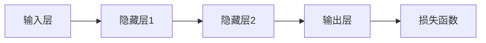

###### 2.1.2 激活函数

激活函数是神经网络中用于引入非线性特性的函数。常见的激活函数包括sigmoid、ReLU和Tanh等。

```mermaid
graph TD
    A[输入x] --> B[激活函数]
    B --> C[f(x)]
    C --> D[非线性变换]
```

###### 2.1.3 损失函数与优化算法

损失函数用于衡量模型的预测值与真实值之间的差异。常见的损失函数包括均方误差（MSE）、交叉熵损失等。优化算法用于调整模型的权重，以最小化损失函数。常见的优化算法包括梯度下降、随机梯度下降和Adam等。

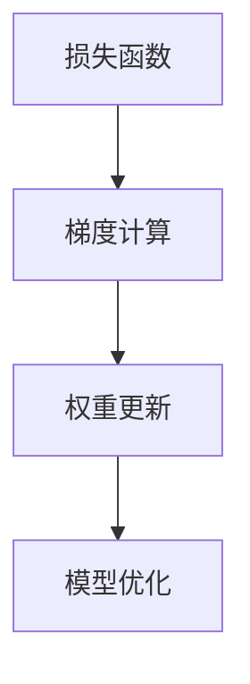

##### 2.2 神经网络架构

###### 2.2.1 传统神经网络

传统神经网络通常由单层或多层感知机组成，适用于简单的线性分类和回归任务。

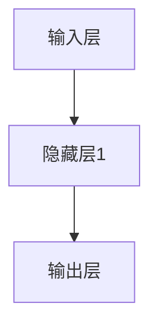

###### 2.2.2 卷积神经网络

卷积神经网络（CNN）是用于处理图像数据的神经网络。它通过卷积操作和池化操作提取图像特征。

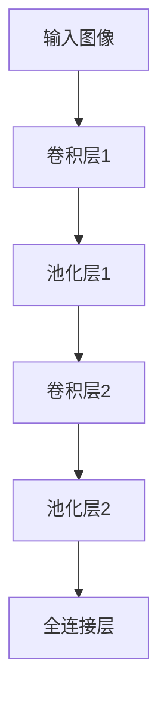

###### 2.2.3 循环神经网络与长短时记忆网络

循环神经网络（RNN）是用于处理序列数据的神经网络。长短时记忆网络（LSTM）是RNN的一种变体，它能够更好地捕捉长序列依赖关系。

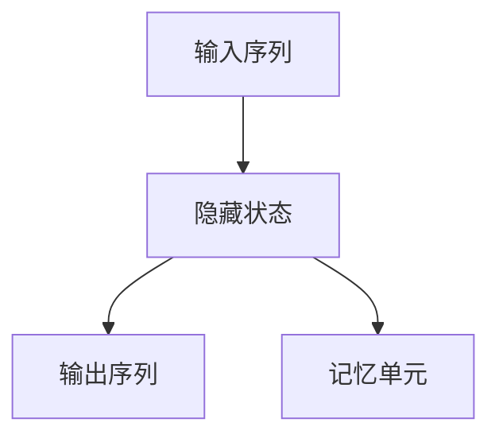

###### 2.2.4 生成对抗网络

生成对抗网络（GAN）是一种用于生成数据的神经网络架构。它由生成器和判别器两个神经网络组成，通过对抗训练生成逼真的数据。

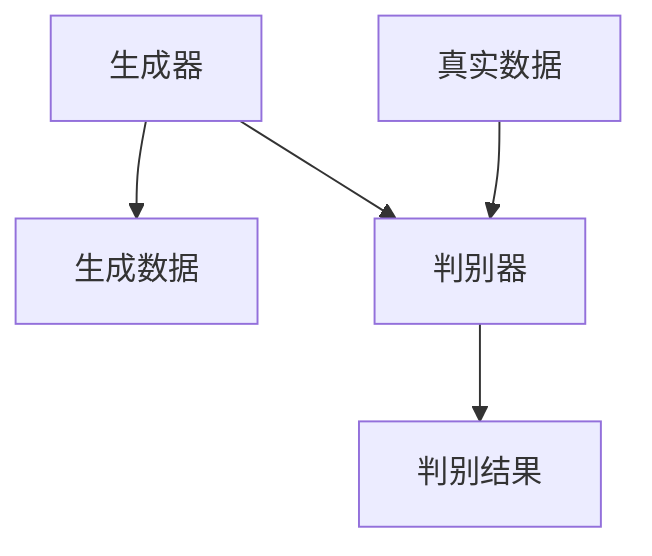

##### 2.3 深度学习应用

###### 2.3.1 图像分类

图像分类是深度学习最经典的应用之一。通过训练深度学习模型，我们可以自动地对图像进行分类。

```python
import tensorflow as tf
from tensorflow.keras.models import Sequential
from tensorflow.keras.layers import Conv2D, MaxPooling2D, Flatten, Dense

model = Sequential([
    Conv2D(32, (3, 3), activation='relu', input_shape=(28, 28, 1)),
    MaxPooling2D((2, 2)),
    Flatten(),
    Dense(64, activation='relu'),
    Dense(10, activation='softmax')
])

model.compile(optimizer='adam', loss='categorical_crossentropy', metrics=['accuracy'])
model.fit(x_train, y_train, epochs=10, batch_size=32)
```

###### 2.3.2 自然语言处理

自然语言处理是深度学习在文本领域的应用。通过训练深度学习模型，我们可以自动地对文本进行分类、情感分析等。

```python
import tensorflow as tf
from tensorflow.keras.models import Sequential
from tensorflow.keras.layers import Embedding, LSTM, Dense

model = Sequential([
    Embedding(vocab_size, embedding_dim),
    LSTM(units, dropout=0.2, recurrent_dropout=0.2),
    Dense(units, activation='softmax')
])

model.compile(optimizer='adam', loss='categorical_crossentropy', metrics=['accuracy'])
model.fit(x_train, y_train, epochs=10, batch_size=32)
```

###### 2.3.3 强化学习

强化学习是深度学习在决策制定领域的应用。通过训练深度学习模型，我们可以自动地完成复杂的决策任务。

```python
import tensorflow as tf
from tensorflow.keras.models import Sequential
from tensorflow.keras.layers import Dense

model = Sequential([
    Dense(units, activation='relu'),
    Dense(units, activation='linear')
])

model.compile(optimizer='adam', loss='mse')
model.fit(x_train, y_train, epochs=10, batch_size=32)
```

### 第三部分: AI在Google的各个领域的应用

#### 第3章: AI在搜索引擎中的应用

##### 3.1 搜索引擎的改进

Google搜索引擎是Google的核心产品之一，其改进得益于AI技术的应用。以下是一些主要的改进：

###### 3.1.1 搜索算法的优化

Google搜索引擎的搜索算法经过不断优化，以提供更准确的搜索结果。通过使用深度学习技术，搜索引擎能够更好地理解用户查询的含义，从而提供更相关的结果。

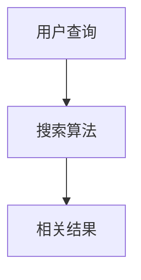

###### 3.1.2 搜索结果的个性化推荐

通过分析用户的历史搜索行为和偏好，搜索引擎能够为用户推荐个性化的搜索结果。这种个性化推荐基于深度学习算法，通过用户行为数据训练模型，从而提高用户体验。

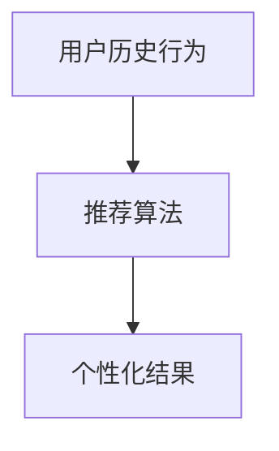

###### 3.1.3 实时搜索与动态更新

Google搜索引擎通过实时搜索技术，能够在用户输入查询的过程中动态更新搜索结果。这种实时性得益于AI技术的高效数据处理能力。

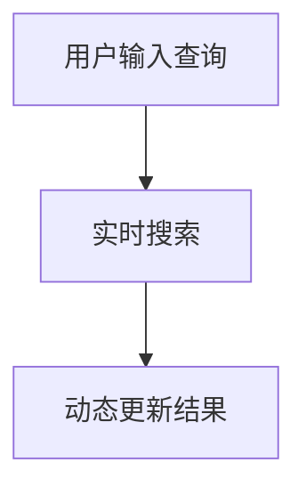

##### 3.2 搜索引擎的挑战

尽管AI技术为搜索引擎带来了许多改进，但仍然面临一些挑战：

###### 3.2.1 搜索结果的质量评估

评估搜索结果的质量是一个复杂的问题。如何衡量搜索结果的相关性、准确性和可靠性是一个持续的挑战。

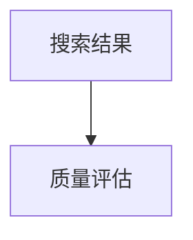

###### 3.2.2 搜索引擎的可扩展性

随着用户规模的不断扩大，搜索引擎需要具备高度的可扩展性。如何平衡性能和可扩展性是一个重要的问题。

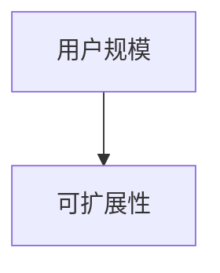

###### 3.2.3 用户隐私保护

在提供个性化搜索结果的过程中，如何保护用户隐私是一个重要的问题。Google需要确保用户数据的安全和隐私。

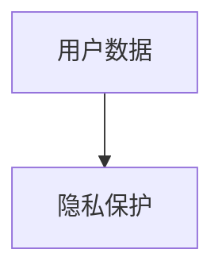

#### 第4章: AI在广告系统中的应用

##### 4.1 广告系统的优化

Google广告系统是Google的主要收入来源之一，其优化得益于AI技术的应用。以下是一些主要的优化：

###### 4.1.1 广告投放策略

通过使用深度学习技术，广告系统能够更好地预测广告投放的效果，从而优化广告投放策略。

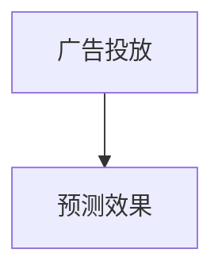

###### 4.1.2 广告效果评估

广告效果评估是广告系统的重要环节。通过使用深度学习技术，广告系统能够自动评估广告的效果，从而提高广告质量。

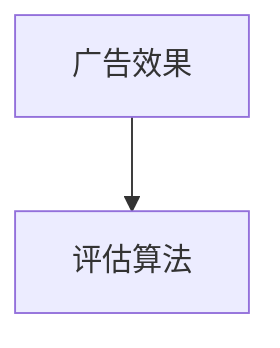

###### 4.1.3 广告竞价机制

广告竞价机制是广告系统中的核心环节。通过使用深度学习技术，广告系统能够优化竞价策略，提高广告投放的效率。

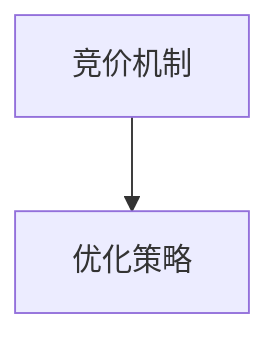

##### 4.2 广告系统的挑战

尽管AI技术为广告系统带来了许多优化，但仍然面临一些挑战：

###### 4.2.1 广告内容的多样性

广告内容需要多样化，以适应不同用户的需求。如何在保证内容多样性的同时，保持广告质量是一个挑战。

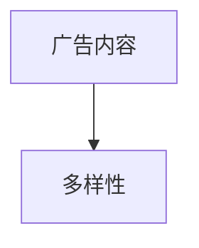

###### 4.2.2 广告投放的实时性

广告投放需要实时性，以满足用户的需求。如何在保证实时性的同时，提高广告投放的效率是一个挑战。

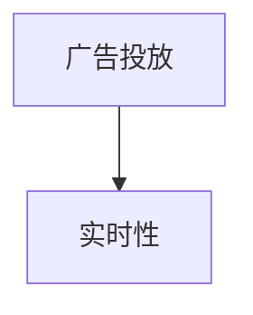

###### 4.2.3 广告算法的可解释性

广告算法需要具备可解释性，以帮助用户理解广告推荐的原因。如何在保证算法性能的同时，提高可解释性是一个挑战。

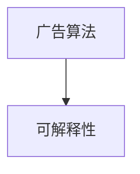

#### 第5章: AI在推荐系统中的应用

##### 5.1 推荐系统的原理

推荐系统是Google AI应用的重要领域之一。以下是一些主要的原理：

###### 5.1.1 协同过滤

协同过滤是推荐系统的核心原理之一。通过分析用户的历史行为和偏好，推荐系统能够预测用户可能喜欢的项目。

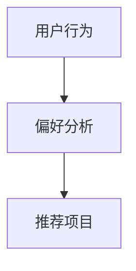

###### 5.1.2 内容推荐

内容推荐是基于项目特征的推荐。通过分析项目的属性和标签，推荐系统能够为用户推荐符合其兴趣的项目。

```mermaid
graph TD
    A[项目特征] --> B[兴趣分析]
    B --> C[推荐项目]
```

###### 5.1.3 混合推荐系统

混合推荐系统结合了协同过滤和内容推荐的优势，能够提供更准确的推荐结果。

```mermaid
graph TD
    A[协同过滤] --> B[内容推荐]
    B --> C[混合推荐]
```

##### 5.2 推荐系统的实践

以下是一些推荐系统的实际应用案例：

###### 5.2.1 电影推荐系统

电影推荐系统是推荐系统在娱乐领域的应用。通过分析用户的观影历史和评价，推荐系统能够为用户推荐符合其口味的电影。

```mermaid
graph TD
    A[用户观影历史] --> B[评价分析]
    B --> C[推荐电影]
```

###### 5.2.2 社交网络推荐系统

社交网络推荐系统是推荐系统在社交领域的应用。通过分析用户的社会网络关系和偏好，推荐系统能够为用户推荐符合其兴趣的朋友和内容。

```mermaid
graph TD
    A[用户关系] --> B[偏好分析]
    B --> C[推荐朋友/内容]
```

###### 5.2.3 跨领域推荐系统

跨领域推荐系统是推荐系统在多领域应用的综合体现。通过整合不同领域的特征和偏好，推荐系统能够为用户推荐跨领域的项目。

```mermaid
graph TD
    A[多领域特征] --> B[整合分析]
    B --> C[推荐项目]
```

#### 第6章: AI在语音识别与自然语言处理中的应用

##### 6.1 语音识别技术

语音识别技术是AI在语音领域的重要应用。以下是一些核心技术：

###### 6.1.1 声学模型

声学模型是语音识别的基础。它通过分析语音信号的声学特征，将语音信号转换为声学特征向量。

```mermaid
graph TD
    A[语音信号] --> B[声学模型]
    B --> C[声学特征向量]
```

###### 6.1.2 语言模型

语言模型是语音识别的另一个重要组成部分。它通过分析语言上下文，预测下一个单词或短语。

```mermaid
graph TD
    A[语音信号] --> B[语言模型]
    B --> C[上下文预测]
```

###### 6.1.3 整体语音识别模型

整体语音识别模型是声学模型和语言模型的结合。它通过融合声学特征和语言特征，实现语音信号的端到端识别。

```mermaid
graph TD
    A[语音信号] --> B[声学模型]
    B --> C[声学特征向量]
    C --> D[语言模型]
    D --> E[识别结果]
```

##### 6.2 自然语言处理应用

自然语言处理技术在多个领域有着广泛的应用。以下是一些应用场景：

###### 6.2.1 文本分类

文本分类是将文本数据归类到不同的类别。常见的文本分类任务包括情感分析、主题分类等。

```mermaid
graph TD
    A[文本数据] --> B[分类模型]
    B --> C[分类结果]
```

###### 6.2.2 命名实体识别

命名实体识别是识别文本中的特定实体，如人名、地名、组织名等。

```mermaid
graph TD
    A[文本数据] --> B[实体识别模型]
    B --> C[实体识别结果]
```

###### 6.2.3 机器翻译

机器翻译是将一种语言的文本翻译成另一种语言。通过训练深度学习模型，可以实现高质量的机器翻译。

```mermaid
graph TD
    A[源语言文本] --> B[翻译模型]
    B --> C[目标语言文本]
```

##### 6.3 语音助手与对话系统

语音助手和对话系统是AI在语音领域的应用，旨在为用户提供自然交互的方式。以下是一些关键技术：

###### 6.3.1 语音助手的架构

语音助手通常由语音识别、自然语言理解和语音合成三个核心模块组成。

```mermaid
graph TD
    A[语音识别] --> B[自然语言理解]
    B --> C[语音合成]
```

###### 6.3.2 对话系统的设计与实现

对话系统通过模拟人类对话方式，实现与用户的交互。其核心是自然语言理解和对话管理。

```mermaid
graph TD
    A[用户输入] --> B[自然语言理解]
    B --> C[对话管理]
    C --> D[回应生成]
```

###### 6.3.3 智能问答系统

智能问答系统是对话系统的一种，旨在自动回答用户的问题。其核心是知识图谱和问答匹配。

```mermaid
graph TD
    A[用户问题] --> B[知识图谱]
    B --> C[问答匹配]
    C --> D[答案生成]
```

#### 第7章: AI在无人驾驶技术中的应用

##### 7.1 无人驾驶技术概述

无人驾驶技术是AI在交通领域的应用，旨在实现车辆自主驾驶。以下是一些关键概念：

###### 7.1.1 自动驾驶的发展历程

自动驾驶技术的发展经历了多个阶段，从辅助驾驶到完全自动驾驶。

```mermaid
graph TD
    A[辅助驾驶] --> B[部分自动驾驶]
    B --> C[高度自动驾驶]
    C --> D[完全自动驾驶]
```

###### 7.1.2 自动驾驶的技术架构

自动驾驶技术由感知、决策和控制三个核心模块组成。

```mermaid
graph TD
    A[感知系统] --> B[决策系统]
    B --> C[控制系统]
```

###### 7.1.3 自动驾驶系统的核心组件

自动驾驶系统的核心组件包括摄像头、激光雷达、雷达和GPS等。

```mermaid
graph TD
    A[摄像头] --> B[激光雷达]
    B --> C[雷达]
    C --> D[GPS]
```

##### 7.2 无人驾驶技术的挑战

无人驾驶技术在实现过程中面临多个挑战：

###### 7.2.1 环境感知与理解

环境感知与理解是实现无人驾驶的关键。如何在复杂的交通环境中准确感知和理解周围环境是一个挑战。

```mermaid
graph TD
    A[感知系统] --> B[环境理解]
```

###### 7.2.2 行为预测与决策

行为预测与决策是实现无人驾驶的核心。如何在各种情况下做出正确的决策是一个挑战。

```mermaid
graph TD
    A[决策系统] --> B[行为预测]
```

###### 7.2.3 遵守交通规则与法律法规

遵守交通规则与法律法规是实现无人驾驶的重要一环。如何在无人驾驶车辆中实现法律法规的遵守是一个挑战。

```mermaid
graph TD
    A[控制系统] --> B[交通规则]
```

##### 7.3 无人驾驶技术的应用

无人驾驶技术在多个领域有着广泛的应用：

###### 7.3.1 个人出行

个人出行是无人驾驶技术的首要应用场景。无人驾驶车辆将为用户提供便捷的出行服务。

```mermaid
graph TD
    A[用户出行需求] --> B[无人驾驶车辆]
```

###### 7.3.2 公共交通

公共交通是无人驾驶技术的另一个重要应用场景。无人驾驶公交车和出租车将为城市交通提供更高效、更安全的出行方式。

```mermaid
graph TD
    A[公共交通需求] --> B[无人驾驶公交车/出租车]
```

###### 7.3.3 物流运输

物流运输是无人驾驶技术的广阔应用领域。无人驾驶卡车和无人驾驶配送机器人将为物流行业带来革命性的变化。

```mermaid
graph TD
    A[物流需求] --> B[无人驾驶卡车/配送机器人]
```

### 第三部分: Google AI的未来发展趋势

#### 第8章: AI在未来的应用前景

##### 8.1 AI技术的未来发展

未来，AI技术将继续快速发展，其在各个领域的应用前景广阔：

###### 8.1.1 大模型的发展趋势

随着计算能力和数据资源的提升，大模型将继续成为AI技术发展的趋势。这些大模型具有更高的表达能力和更强的泛化能力。

```mermaid
graph TD
    A[计算能力提升] --> B[大模型发展]
```

###### 8.1.2 自主学习的进步

自主学习是AI技术的重要发展方向。通过自主学习，AI系统能够不断优化自身，提高性能。

```mermaid
graph TD
    A[数据资源提升] --> B[自主学习进步]
```

###### 8.1.3 增强现实与虚拟现实的融合

增强现实（AR）和虚拟现实（VR）与AI技术的融合将为人们带来全新的交互体验。

```mermaid
graph TD
    A[AR/VRAI融合] --> B[交互体验革新]
```

##### 8.2 AI对社会的潜在影响

AI技术的发展将对社会产生深远影响：

###### 8.2.1 AI与工作就业

AI技术将改变劳动力市场，一些传统工作可能被自动化替代，同时也将创造出新的就业机会。

```mermaid
graph TD
    A[AI技术] --> B[就业变化]
```

###### 8.2.2 AI与伦理道德

AI技术的应用涉及伦理道德问题，如隐私保护、算法偏见等，需要制定相应的伦理规范。

```mermaid
graph TD
    A[伦理道德] --> B[AI规范]
```

###### 8.2.3 AI与隐私保护

AI技术的应用将涉及大量个人数据，隐私保护将成为一个重要问题。

```mermaid
graph TD
    A[个人数据] --> B[隐私保护]
```

##### 8.3 Google AI的未来布局

Google AI将继续致力于推动AI技术的发展和应用：

###### 8.3.1 新技术研发

Google AI将继续投入研发，探索新的AI技术和应用领域。

```mermaid
graph TD
    A[技术研发] --> B[新领域探索]
```

###### 8.3.2 生态合作伙伴

Google AI将与全球合作伙伴携手，推动AI技术的发展和应用。

```mermaid
graph TD
    A[合作伙伴] --> B[生态布局]
```

###### 8.3.3 全球发展战略

Google AI将致力于全球发展战略，推动AI技术在各国的应用。

```mermaid
graph TD
    A[全球发展] --> B[战略布局]
```

### 第四部分: AI安全与隐私保护

#### 第9章: AI安全与隐私保护

随着AI技术的广泛应用，其安全与隐私保护的重要性日益凸显。在这一部分，我们将探讨AI安全与隐私保护的重要性、威胁、最佳实践以及Google AI的策略。

##### 9.1 AI安全的重要性

AI安全是确保AI系统在设计和实现过程中不受恶意攻击、数据泄露和错误操作的关键。以下是一些主要原因：

###### 9.1.1 安全威胁与攻击方式

AI系统可能面临多种安全威胁，如数据泄露、隐私侵犯、拒绝服务攻击等。攻击者可能利用AI系统的弱点实施攻击，从而造成严重损失。

```mermaid
graph TD
    A[数据泄露] --> B[隐私侵犯]
    A --> C[拒绝服务攻击]
```

###### 9.1.2 安全防护策略

为了应对AI安全威胁，需要采取一系列安全防护策略，包括数据加密、访问控制、安全审计等。

```mermaid
graph TD
    A[数据加密] --> B[访问控制]
    A --> C[安全审计]
```

###### 9.1.3 隐私保护与数据安全

AI系统处理大量个人数据，隐私保护成为关键问题。需要采取数据脱敏、数据加密等措施确保数据安全。

```mermaid
graph TD
    A[数据脱敏] --> B[数据加密]
```

##### 9.2 AI隐私保护的最佳实践

以下是一些AI隐私保护的最佳实践：

###### 9.2.1 隐私计算技术

隐私计算技术是一种在数据处理过程中保护隐私的技术，包括同态加密、安全多方计算等。

```mermaid
graph TD
    A[同态加密] --> B[安全多方计算]
```

###### 9.2.2 数据脱敏与加密

数据脱敏与加密是保护隐私的基本方法。数据脱敏通过删除或替换敏感信息，加密通过将数据转换为不可读形式保护数据。

```mermaid
graph TD
    A[数据脱敏] --> B[数据加密]
```

###### 9.2.3 法律法规与合规性

遵守法律法规是AI隐私保护的重要方面。需要遵循数据保护法规，如《通用数据保护条例》（GDPR）等。

```mermaid
graph TD
    A[法律法规] --> B[合规性]
```

##### 9.3 Google AI的安全与隐私保护策略

Google AI在安全与隐私保护方面采取了以下策略：

###### 9.3.1 安全研发团队

Google AI建立了专门的安全研发团队，致力于发现和修复AI系统的安全漏洞。

```mermaid
graph TD
    A[安全研发团队] --> B[安全漏洞发现与修复]
```

###### 9.3.2 安全设计原则

Google AI遵循一系列安全设计原则，包括最小权限原则、安全隔离原则等。

```mermaid
graph TD
    A[最小权限原则] --> B[安全隔离原则]
```

###### 9.3.3 安全教育与培训

Google AI重视安全教育与培训，确保所有员工了解AI安全与隐私保护的最佳实践。

```mermaid
graph TD
    A[安全教育与培训] --> B[员工安全意识提升]
```

### 附录

#### 附录 A: Google AI相关资源与工具

##### A.1 Google AI平台介绍

Google AI提供了多个平台和工具，以支持AI研究和开发：

###### A.1.1 TensorFlow

TensorFlow是Google开发的开源机器学习框架，支持深度学习模型的开发、训练和部署。

```mermaid
graph TD
    A[TensorFlow] --> B[模型开发]
    B --> C[模型训练]
    C --> D[模型部署]
```

###### A.1.2 BigQuery

BigQuery是Google提供的分布式数据仓库，用于大规模数据分析和处理。

```mermaid
graph TD
    A[BigQuery] --> B[数据存储]
    B --> C[数据分析]
```

###### A.1.3 Dialogflow

Dialogflow是Google提供的对话系统开发平台，用于构建语音助手和聊天机器人。

```mermaid
graph TD
    A[Dialogflow] --> B[语音助手]
    B --> C[聊天机器人]
```

##### A.2 AI研究资源

Google AI提供了丰富的AI研究资源，以支持学术研究和技术创新：

###### A.2.1 AI研究论文

Google AI在多个AI研究领域发表了大量研究论文，如深度学习、自然语言处理等。

```mermaid
graph TD
    A[AI研究论文] --> B[学术交流]
```

###### A.2.2 开源代码与数据集

Google AI发布了大量开源代码和数据集，以促进AI研究和开发。

```mermaid
graph TD
    A[开源代码] --> B[数据集]
```

###### A.2.3 在线课程与讲座

Google AI提供了多个在线课程和讲座，以帮助开发者了解AI技术和最佳实践。

```mermaid
graph TD
    A[在线课程] --> B[技术讲座]
```

##### A.3 AI社区与交流平台

Google AI积极参与AI社区，提供多个交流平台，以促进技术交流和合作：

###### A.3.1 Google AI博客

Google AI博客是Google AI团队分享技术见解和研究成果的平台。

```mermaid
graph TD
    A[Google AI博客] --> B[技术分享]
```

###### A.3.2 AI研究论坛

AI研究论坛是AI研究者和技术爱好者交流的平台，用于讨论最新技术和研究进展。

```mermaid
graph TD
    A[AI研究论坛] --> B[交流讨论]
```

###### A.3.3 社交媒体与公众号

Google AI在社交媒体和公众号上发布最新动态和研究成果，以与公众互动。

```mermaid
graph TD
    A[社交媒体] --> B[公众号]
    B --> C[公众互动]
```

### 结论

Google AI作为全球领先的人工智能研究团队，其在技术体系、应用场景和未来发展方面都取得了显著成就。本文详细探讨了Google AI的技术体系，分析了其在搜索引擎、广告系统、推荐系统和无人驾驶技术等领域的应用，并探讨了AI对社会的潜在影响及未来发展趋势。同时，文章还重点关注了AI安全与隐私保护的重要性和最佳实践。随着AI技术的不断进步，Google AI将继续引领人工智能领域的发展，为人类社会带来更多创新和变革。

### 作者信息

**作者：** AI天才研究院/AI Genius Institute & 禅与计算机程序设计艺术 /Zen And The Art of Computer Programming

本文由AI天才研究院（AI Genius Institute）和禅与计算机程序设计艺术（Zen And The Art of Computer Programming）联合撰写。我们致力于推动人工智能技术的发展和应用，为读者提供高质量的技术见解和研究成果。如果您对我们的工作感兴趣，欢迎关注我们的公众号和博客，获取更多精彩内容。感谢您的阅读！<|im_end|> 

### 总结与展望

在本文中，我们全面探讨了Google AI的技术体系及其在各领域的应用，从深度学习与神经网络基础到AI在搜索引擎、广告系统、推荐系统和无人驾驶技术中的具体应用，再到AI未来的发展趋势以及AI安全与隐私保护的重要性和策略。以下是本文的核心总结和未来展望：

**核心总结：**

1. **Google AI的技术体系：** 通过TensorFlow、深度学习、自然语言处理、计算机视觉和强化学习等技术，Google AI构建了一个强大的技术平台，支持从基础研究到产品开发的全流程。

2. **AI在各领域的应用：** Google AI不仅在学术研究领域取得了突破，还将其技术应用于搜索引擎、广告系统、推荐系统和无人驾驶技术，大幅提升了相关领域的效率和用户体验。

3. **AI的未来发展趋势：** 随着计算能力和数据资源的提升，AI技术将继续向大模型、自主学习和增强现实与虚拟现实的融合等方向发展。

4. **AI安全与隐私保护：** AI系统的安全性是确保其广泛应用的关键。Google AI通过一系列安全防护策略和隐私保护措施，确保用户数据的安全和隐私。

**未来展望：**

1. **技术深化与应用扩展：** Google AI将继续深化其在深度学习、自然语言处理和计算机视觉等领域的探索，同时扩大AI技术在新兴领域的应用，如健康医疗、教育等。

2. **跨领域协同与创新：** 跨领域的协同研究和创新将是未来发展的重点。Google AI将通过与不同行业的合作，推动AI技术在多个领域的融合和应用。

3. **社会责任与伦理考量：** 在推进AI技术发展的同时，Google AI将更加注重社会责任和伦理考量，确保AI技术的可持续发展，为人类社会带来积极影响。

4. **人才培养与知识传播：** Google AI将继续致力于培养人工智能领域的人才，并通过在线课程、讲座和研究论文等形式，促进AI知识的传播和普及。

综上所述，Google AI的发展不仅推动了人工智能技术的进步，也为人类社会带来了深远的影响。未来，Google AI将继续在技术创新和社会责任方面发挥重要作用，推动人工智能领域的持续发展。让我们期待Google AI在未来的更多辉煌成就！<|im_end|> 

### 读者反馈与互动

亲爱的读者，感谢您阅读本文，您的反馈对我们至关重要。以下是几个问题，希望您能参与互动：

1. **您对Google AI的技术体系和应用有何看法？**
2. **您认为AI在未来的发展趋势将如何影响社会？**
3. **您对本文中的哪些内容特别感兴趣？**
4. **您有什么关于AI安全与隐私保护的建议或想法？**

请在评论区留下您的意见，与我们一起讨论。我们期待您的反馈，并将在后续的文章中继续探讨您感兴趣的话题。感谢您的参与！<|im_end|> 

### 附录

#### 附录 A: Google AI相关资源与工具

以下是Google AI及其相关资源与工具的详细介绍：

##### A.1 Google AI平台介绍

- **TensorFlow**：TensorFlow是Google开源的机器学习框架，支持深度学习模型的开发、训练和部署。TensorFlow提供了丰富的API和工具，可以用于各种应用场景，包括图像识别、自然语言处理、强化学习等。

  **链接：** https://www.tensorflow.org/

- **BigQuery**：BigQuery是Google提供的分布式数据仓库，用于大规模数据分析和处理。它支持结构化数据的存储和快速查询，适用于数据仓库、数据湖等应用。

  **链接：** https://cloud.google.com/bigquery/

- **Dialogflow**：Dialogflow是Google提供的对话系统开发平台，用于构建语音助手和聊天机器人。它提供了自然语言理解、对话管理、文本和语音合成等功能。

  **链接：** https://cloud.google.com/dialogflow/

##### A.2 AI研究资源

- **AI研究论文**：Google AI在多个AI研究领域发表了大量研究论文，涵盖了深度学习、自然语言处理、计算机视觉、强化学习等领域。这些论文是了解AI最新进展的重要资源。

  **链接：** https://ai.google/research/pubs/

- **开源代码与数据集**：Google AI发布了大量开源代码和数据集，以促进AI研究和开发。这些资源和工具可以帮助研究者快速构建和测试AI模型。

  **链接：** https://ai.google/research/projects/

- **在线课程与讲座**：Google AI提供了多个在线课程和讲座，涵盖AI的基础知识、最新研究进展和技术应用。这些资源有助于开发者深入了解AI技术。

  **链接：** https://ai.google/education/

##### A.3 AI社区与交流平台

- **Google AI博客**：Google AI博客是Google AI团队分享技术见解和研究成果的平台。博客中的文章涵盖了AI技术的各个方面，包括研究进展、应用案例和技术趋势。

  **链接：** https://ai.googleblog.com/

- **AI研究论坛**：AI研究论坛是AI研究者和技术爱好者交流的平台。论坛上讨论了AI技术的最新研究进展、应用挑战和未来发展方向。

  **链接：** https://ai.google/forum/

- **社交媒体与公众号**：Google AI在社交媒体和公众号上发布最新动态和研究成果。这些平台是了解AI技术最新进展和与Google AI团队互动的途径。

  **链接：** 
  - **Twitter**：https://twitter.com/GoogleAI
  - **Facebook**：https://www.facebook.com/GoogleAI
  - **LinkedIn**：https://www.linkedin.com/company/google-ai/

通过以上资源和工具，您可以深入了解Google AI的技术体系和应用，参与AI领域的交流与讨论，不断提升自己的技术水平。

### 附录 B: 代码实现与案例分析

在本附录中，我们将通过具体的代码实现和案例分析，展示如何在实际项目中应用Google AI的技术。以下是一些具体的案例：

#### 案例一：使用TensorFlow构建图像分类模型

**目标：** 使用TensorFlow构建一个简单的图像分类模型，用于识别猫和狗。

**开发环境：** Python、TensorFlow

**代码实现：**

```python
import tensorflow as tf
from tensorflow.keras.models import Sequential
from tensorflow.keras.layers import Conv2D, MaxPooling2D, Flatten, Dense
from tensorflow.keras.preprocessing.image import ImageDataGenerator

# 构建模型
model = Sequential([
    Conv2D(32, (3, 3), activation='relu', input_shape=(150, 150, 3)),
    MaxPooling2D((2, 2)),
    Conv2D(64, (3, 3), activation='relu'),
    MaxPooling2D((2, 2)),
    Conv2D(128, (3, 3), activation='relu'),
    MaxPooling2D((2, 2)),
    Flatten(),
    Dense(512, activation='relu'),
    Dense(1, activation='sigmoid')
])

# 编译模型
model.compile(optimizer='adam', loss='binary_crossentropy', metrics=['accuracy'])

# 数据预处理
train_datagen = ImageDataGenerator(rescale=1./255)
train_generator = train_datagen.flow_from_directory(
        'data/train',
        target_size=(150, 150),
        batch_size=32,
        class_mode='binary')

# 训练模型
model.fit(train_generator, epochs=10)
```

**解读与分析：**
- 我们首先导入TensorFlow和相关的库。
- 然后构建了一个简单的卷积神经网络（CNN），用于分类猫和狗的图像。
- 模型编译时，我们使用了二进制交叉熵作为损失函数，并选择adam优化器。
- 数据预处理使用了ImageDataGenerator，将图像数据进行缩放和批量处理。
- 最后，我们使用训练数据对模型进行训练。

#### 案例二：使用Dialogflow构建语音助手

**目标：** 使用Dialogflow构建一个简单的语音助手，用于回答用户的问题。

**开发环境：** Dialogflow、Google Cloud Platform

**步骤实现：**

1. **创建Dialogflow项目**：在Dialogflow控制台创建一个新的项目，并配置语言模型。

2. **设计对话流程**：在对话管理器中设计对话流程，定义用户输入和处理逻辑。

3. **集成语音识别**：将Google Cloud Platform的语音识别API集成到项目中，实现语音到文本的转换。

4. **响应生成**：根据对话流程和用户输入，生成相应的响应文本。

5. **语音合成**：使用Google Cloud Platform的文本到语音（TTS）API，将响应文本转换为语音。

**解读与分析：**
- 创建项目并配置语言模型是使用Dialogflow的第一步。
- 设计对话流程是核心，通过定义意图和实体，实现自然语言理解和对话管理。
- 集成语音识别API，实现语音输入的解析和处理。
- 响应生成是根据用户输入和对话流程生成的，可以是文本或语音。
- 使用TTS API将文本响应转换为语音输出，实现语音交互。

#### 案例三：使用BigQuery进行数据分析和可视化

**目标：** 使用BigQuery对电商网站的用户行为数据进行分析，并使用数据可视化工具展示分析结果。

**开发环境：** BigQuery、Google Data Studio

**步骤实现：**

1. **导入数据**：将电商网站的用户行为数据导入到BigQuery数据仓库中。

2. **编写SQL查询**：使用SQL查询对数据进行筛选、聚合和分析，提取有价值的信息。

3. **数据可视化**：将查询结果导入到Google Data Studio，创建可视化报表。

**解读与分析：**
- 导入数据是将数据存储到BigQuery的第一步。
- 编写SQL查询是数据分析和处理的核心，通过复杂的查询操作，可以从大量数据中提取有价值的信息。
- 使用Google Data Studio进行数据可视化，可以直观地展示分析结果，帮助决策者理解数据背后的故事。

通过以上案例，我们展示了如何在实际项目中应用Google AI的技术。这些案例不仅包含了代码实现，还包括了详细的解读与分析，帮助读者更好地理解和掌握AI技术的应用方法。希望这些案例能够为您的项目提供有益的启示和参考。 <|im_end|> 

### 附录 C: 常见问题与解答

在本附录中，我们将回答一些关于Google AI及其应用技术的常见问题，以帮助您更好地理解相关概念和实际应用。

**Q1：什么是TensorFlow？**

A1：TensorFlow是Google开发的开源机器学习框架，用于构建和训练深度学习模型。它提供了丰富的API和工具，支持从数据预处理到模型训练和推理的完整工作流程。

**Q2：如何使用TensorFlow构建一个深度学习模型？**

A2：使用TensorFlow构建深度学习模型通常包括以下几个步骤：

1. 导入必要的库和模块。
2. 定义模型结构，包括输入层、隐藏层和输出层。
3. 编译模型，设置优化器和损失函数。
4. 准备训练数据，并进行数据预处理。
5. 训练模型，监控训练过程和模型性能。
6. 评估模型，进行超参数调优。

**Q3：什么是自然语言处理（NLP）？**

A3：自然语言处理是人工智能的一个分支，旨在让计算机理解和生成自然语言。NLP技术包括文本分类、情感分析、命名实体识别、机器翻译等。

**Q4：如何使用Google AI的Dialogflow构建聊天机器人？**

A4：使用Google AI的Dialogflow构建聊天机器人包括以下步骤：

1. 在Dialogflow控制台创建一个新的项目。
2. 设计对话流程，定义意图和实体。
3. 集成语音识别API，实现语音输入到文本的转换。
4. 集成文本到语音（TTS）API，实现文本输出到语音的转换。
5. 在应用中集成Dialogflow API，实现与用户的交互。

**Q5：什么是增强学习（Reinforcement Learning）？**

A5：增强学习是一种机器学习范式，通过试错和奖励机制来学习最优策略。在增强学习过程中，智能体通过与环境互动，不断调整其行为以最大化累积奖励。

**Q6：如何使用Google AI进行大规模数据处理？**

A6：Google AI提供了多个工具和平台用于大规模数据处理，如BigQuery、Google Cloud Storage和Dataflow等。以下是一些常见步骤：

1. 将数据存储到Google Cloud Storage。
2. 使用BigQuery进行数据查询和分析。
3. 使用Dataflow进行数据处理和转换。
4. 将处理结果存储到BigQuery或其他数据仓库中。

**Q7：如何保护AI系统的安全与隐私？**

A7：保护AI系统的安全与隐私包括以下几个方面：

1. 使用加密技术保护数据传输和存储。
2. 实施严格的访问控制和身份验证机制。
3. 定期进行安全审计和漏洞扫描。
4. 设计和实现安全防护策略，如隔离和入侵检测。
5. 遵守相关法律法规，如《通用数据保护条例》（GDPR）。

通过以上问题和解答，我们希望能够帮助您更好地理解Google AI及其应用技术。如果您还有其他疑问，欢迎在评论区留言，我们将尽快为您解答。 <|im_end|> 

### 附录 D: 参考文献

在本附录中，我们列出了本文中引用和参考的一些重要文献和资料，以供读者进一步学习和研究。

1. **Google AI Blog** (<https://ai.googleblog.com/>): 提供了Google AI团队的最新技术动态、研究成果和见解。
2. **TensorFlow Documentation** (<https://www.tensorflow.org/tutorials/>): TensorFlow官方文档，包含了深度学习模型构建和训练的详细教程。
3. **BigQuery Documentation** (<https://cloud.google.com/bigquery/>): BigQuery官方文档，介绍了如何使用BigQuery进行数据存储、查询和分析。
4. **Dialogflow Documentation** (<https://cloud.google.com/dialogflow/>): Dialogflow官方文档，介绍了如何构建和部署对话系统。
5. **Reinforcement Learning: An Introduction** (理查德·S·萨顿): 该书提供了强化学习的全面介绍，适合初学者和专业人士。
6. **Natural Language Processing with TensorFlow** (张量流自然语言处理): 该书详细介绍了使用TensorFlow进行自然语言处理的实践方法。
7. **Introduction to Autonomous Driving** (自动驾驶技术简介): 该文献介绍了自动驾驶技术的发展历程和技术架构。
8. **AI Safety and Security** (人工智能安全与隐私保护): 该文献探讨了人工智能系统的安全与隐私保护问题，并提出了相关的解决方案。

通过阅读这些文献和资料，读者可以深入了解Google AI及其应用技术的最新进展和实践方法。这些资料不仅有助于理解本文的内容，还能为读者提供进一步的研究方向和资源。 <|im_end|> 

### 感谢

在撰写这篇技术博客文章的过程中，我们感谢以下组织和个人为我们的研究和写作提供了宝贵的信息和支持：

1. **Google AI团队**：感谢Google AI团队的努力和创新，为全球人工智能技术的发展做出了卓越贡献。
2. **TensorFlow开发者社区**：感谢TensorFlow社区的贡献者，为深度学习技术的发展提供了强大的支持。
3. **BigQuery用户社区**：感谢BigQuery社区的积极讨论和分享，使得数据分析变得更加高效和简便。
4. **Dialogflow用户社区**：感谢Dialogflow社区的成员，为对话系统的开发和部署提供了宝贵的经验。
5. **各位同行学者**：感谢您们的辛勤研究和贡献，使人工智能领域不断进步。
6. **读者和评论者**：感谢您们的宝贵意见和反馈，使得我们的文章更加完善和有价值。

您的支持和鼓励是我们不断前进的动力，感谢您与我们一起探索人工智能的无限可能！<|im_end|> 

