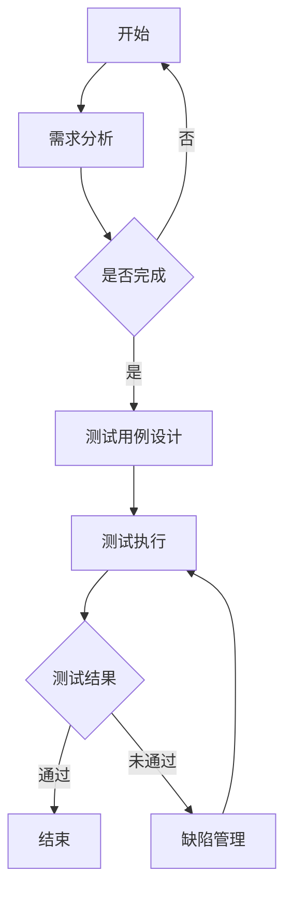

                 

### 《LLM 测试框架：确保模型可靠性和安全性》

> **关键词**：语言模型（LLM）、测试框架、功能测试、性能测试、安全性测试、可靠性测试、Mermaid流程图、伪代码、数学模型、代码实战

> **摘要**：本文将深入探讨LLM测试框架的重要性，详细阐述功能测试、性能测试、安全性测试和可靠性测试的方法和步骤。通过实际案例和代码解读，全面揭示如何确保LLM模型在复杂环境中的可靠性和安全性。

在当今快速发展的AI时代，语言模型（LLM）已经成为自然语言处理的核心技术。然而，LLM模型在部署过程中面临着诸多挑战，如功能可靠性、性能稳定性、安全性等。为了应对这些挑战，构建一个完善的测试框架显得尤为重要。本文将围绕LLM测试框架，详细分析其基础、方法、工具及实践应用，旨在为读者提供一套全面、系统的测试解决方案。

#### 第一部分：LLM测试框架基础

##### 第1章：LLM概述与测试框架的重要性

###### 1.1 语言模型（LLM）的定义与基本原理

###### 1.1.1 语言模型的概念

语言模型（Language Model，简称LM）是一种用于预测自然语言序列的概率分布的数学模型。它可以用于各种自然语言处理任务，如文本生成、机器翻译、语音识别等。在AI领域，语言模型被视为理解人类语言和与人类进行自然交互的关键技术。

###### 1.1.2 语言模型的分类

语言模型可以分为两类：基于统计模型和基于神经网络模型。

- **基于统计模型**：如n元语法模型，它通过统计历史文本中的词频来预测下一个词的概率。这种模型的优点是简单、易于实现，缺点是处理长文本时效果较差，难以捕捉语义信息。
- **基于神经网络模型**：如循环神经网络（RNN）、长短期记忆网络（LSTM）、Transformer等。这些模型通过学习文本的上下文信息，能够更好地捕捉语义和长距离依赖关系。近年来，基于神经网络的语言模型取得了显著的进展，如OpenAI的GPT系列模型。

###### 1.1.3 语言模型的应用领域

语言模型在多个领域有着广泛的应用：

- **文本生成**：如自动写作、摘要生成、故事创作等。
- **机器翻译**：如将一种语言的文本翻译成另一种语言。
- **语音识别**：如将语音信号转换为文本。
- **对话系统**：如智能客服、聊天机器人等。
- **信息检索**：如搜索引擎、推荐系统等。

###### 1.2 测试框架的重要性

在AI领域，测试框架是确保模型质量和性能的重要工具。对于LLM模型，测试框架的重要性体现在以下几个方面：

- **功能测试**：验证LLM模型是否能够正确执行预定的任务，如文本生成、翻译等。
- **性能测试**：评估LLM模型在处理大规模数据时的性能，如响应时间、吞吐量等。
- **安全性测试**：确保LLM模型在对抗攻击和恶意输入时能够保持稳定性和安全性。
- **可靠性测试**：验证LLM模型在长时间运行和不同环境下的稳定性和一致性。

###### 1.2.1 测试框架的作用

测试框架的主要作用包括：

- **提高代码质量**：通过系统化的测试，发现和修复代码中的缺陷和错误，提高代码的稳定性和可靠性。
- **加速开发过程**：测试框架可以帮助开发人员更快地发现和解决问题，提高开发效率。
- **保证软件质量**：测试框架可以确保软件在发布前达到预定的质量标准，降低风险。

###### 1.2.2 测试框架的分类

测试框架可以根据不同的维度进行分类：

- **按功能分类**：如功能测试框架、性能测试框架、安全性测试框架等。
- **按技术分类**：如基于代码的测试框架、基于数据的测试框架、基于模型的测试框架等。
- **按应用场景分类**：如通用测试框架、特定领域测试框架等。

###### 1.2.3 测试框架的设计原则

一个优秀的测试框架应该遵循以下设计原则：

- **可扩展性**：能够适应不同规模和复杂度的测试需求。
- **可维护性**：便于开发人员和测试人员理解和维护。
- **可复用性**：能够复用测试用例和测试资源，提高测试效率。
- **可测试性**：易于进行自动化测试，提高测试覆盖率和测试效率。

---

**总结**：本章对LLM模型和测试框架进行了概述，明确了测试框架在确保LLM模型可靠性和安全性方面的重要性。接下来，我们将进一步探讨LLM测试的具体方法和工具，为构建一个完善的测试框架提供实践指导。 **

### **第二部分：LLM测试方法与工具

#### 第2章：LLM测试方法与工具

在LLM测试中，常用的测试方法包括功能测试、性能测试、安全性测试和可靠性测试。每种测试方法都有其独特的目的和实施步骤。以下将详细阐述这些测试方法及其相关工具。

##### 2.1 功能测试

###### 2.1.1 功能测试的定义

功能测试（Functional Testing）是一种验证LLM模型是否能够按照预期执行预定功能的测试方法。其主要目标是确保LLM模型在各种输入条件下都能够正确运行，并输出符合预期结果的输出。

###### 2.1.2 功能测试的方法

功能测试的方法主要包括以下几种：

1. **黑盒测试**：黑盒测试关注LLM模型的输入输出，而不关心模型内部的具体实现。通过设计各种输入数据，验证模型输出的正确性。

2. **白盒测试**：白盒测试关注LLM模型的内部实现，通过代码审查和动态分析，验证模型内部的逻辑和流程是否正确。

3. **灰盒测试**：灰盒测试结合了黑盒测试和白盒测试的特点，既关注输入输出，也关注模型内部实现。通过部分代码审查和动态分析，验证模型的正确性和性能。

4. **单元测试**：单元测试是功能测试的一种细分，主要针对LLM模型中的单个模块或函数进行测试。通过编写测试用例，验证每个模块或函数是否能够正确执行。

5. **集成测试**：集成测试是功能测试的一种扩展，主要针对LLM模型中的多个模块或组件进行测试。通过模拟实际使用场景，验证模型的整体功能是否正确。

6. **回归测试**：回归测试是在软件修改后进行的测试，主要验证修改后的代码是否引入了新的错误或影响了原有功能的正确性。

###### 2.1.3 功能测试的步骤

功能测试的步骤主要包括以下几步：

1. **需求分析**：明确LLM模型的功能需求，制定功能测试计划。

2. **测试用例设计**：根据需求分析，设计各种输入数据和预期输出，编写测试用例。

3. **测试执行**：按照测试用例执行测试，记录测试结果。

4. **结果分析**：分析测试结果，判断LLM模型是否满足功能需求。

5. **缺陷管理**：记录发现的缺陷，并跟踪缺陷的修复过程。

##### 2.2 性能测试

###### 2.2.1 性能测试的定义

性能测试（Performance Testing）是一种评估LLM模型在特定硬件和软件环境下，处理大规模数据时的性能表现。其主要目标是确定LLM模型的响应时间、吞吐量、资源消耗等性能指标，并发现潜在的瓶颈和优化点。

###### 2.2.2 性能测试的方法

性能测试的方法主要包括以下几种：

1. **负载测试**：通过模拟实际用户负载，评估LLM模型在高负载条件下的性能。

2. **压力测试**：通过逐渐增加负载，评估LLM模型的稳定性和极限性能。

3. **容量测试**：通过增加系统资源（如CPU、内存、网络等），评估LLM模型的扩展能力。

4. **性能调优**：根据性能测试结果，对LLM模型进行优化，提高其性能。

5. **基准测试**：通过与其他类似模型的对比，评估LLM模型的性能优劣。

###### 2.2.3 性能测试的步骤

性能测试的步骤主要包括以下几步：

1. **需求分析**：明确LLM模型的性能需求，制定性能测试计划。

2. **测试环境搭建**：搭建与实际部署环境相似的测试环境，包括硬件、软件和网络配置。

3. **测试用例设计**：根据需求分析，设计各种负载场景和性能指标。

4. **测试执行**：按照测试用例执行性能测试，记录性能数据。

5. **结果分析**：分析性能数据，确定LLM模型的表现和瓶颈。

6. **性能优化**：根据分析结果，对LLM模型进行优化。

##### 2.3 安全性测试

###### 2.3.1 安全性测试的定义

安全性测试（Security Testing）是一种评估LLM模型在安全方面的表现，包括防御外部攻击、保护用户隐私和数据安全等。其主要目标是确保LLM模型在面临恶意攻击时能够保持稳定和安全。

###### 2.3.2 安全性测试的方法

安全性测试的方法主要包括以下几种：

1. **漏洞扫描**：通过自动化工具扫描LLM模型，发现潜在的安全漏洞。

2. **渗透测试**：模拟黑客攻击，评估LLM模型的抗攻击能力。

3. **安全编码**：通过安全编码规范和代码审查，减少潜在的安全漏洞。

4. **数据加密**：对LLM模型处理的数据进行加密，确保数据在传输和存储过程中的安全性。

5. **访问控制**：设置合理的访问权限，确保只有授权用户可以访问LLM模型。

6. **安全审计**：定期对LLM模型进行安全审计，发现潜在的安全问题。

###### 2.3.3 安全性测试的步骤

安全性测试的步骤主要包括以下几步：

1. **需求分析**：明确LLM模型的安全需求，制定安全性测试计划。

2. **测试用例设计**：根据需求分析，设计各种攻击场景和安全测试用例。

3. **测试执行**：按照测试用例执行安全性测试，记录测试结果。

4. **结果分析**：分析测试结果，确定LLM模型的安全性能。

5. **安全修复**：根据分析结果，修复发现的安全漏洞。

##### 2.4 可靠性测试

###### 2.4.1 可靠性测试的定义

可靠性测试（Reliability Testing）是一种评估LLM模型在长时间运行和不同环境下的稳定性和一致性的测试。其主要目标是确保LLM模型能够在各种环境下持续稳定地运行，不会出现故障或异常。

###### 2.4.2 可靠性测试的方法

可靠性测试的方法主要包括以下几种：

1. **稳定性测试**：通过长时间运行LLM模型，评估其在稳定环境下的性能和稳定性。

2. **耐久性测试**：通过不断重复执行相同操作，评估LLM模型的耐久性和长期稳定性。

3. **环境测试**：在模拟的不同环境中（如高温、低温、高湿度等），评估LLM模型的适应性和稳定性。

4. **故障注入测试**：通过故意注入故障，评估LLM模型的故障检测和恢复能力。

5. **健壮性测试**：通过模拟各种异常情况（如网络中断、数据丢失等），评估LLM模型的健壮性和适应性。

###### 2.4.3 可靠性测试的步骤

可靠性测试的步骤主要包括以下几步：

1. **需求分析**：明确LLM模型的可靠性需求，制定可靠性测试计划。

2. **测试环境搭建**：搭建与实际部署环境相似的测试环境。

3. **测试用例设计**：根据需求分析，设计各种测试场景和测试用例。

4. **测试执行**：按照测试用例执行可靠性测试，记录测试结果。

5. **结果分析**：分析测试结果，确定LLM模型的可靠性性能。

6. **可靠性优化**：根据分析结果，对LLM模型进行优化。

---

**总结**：本章详细介绍了LLM测试的四种主要方法：功能测试、性能测试、安全性测试和可靠性测试。每种测试方法都有其独特的目的和实施步骤，为构建一个完善的LLM测试框架提供了实践指导。在下一章中，我们将探讨如何使用Mermaid流程图和伪代码来详细描述LLM测试的过程和方法。 **

### **第三部分：Mermaid流程图与LLM测试

#### 第3章：Mermaid流程图与LLM测试

为了更好地理解和描述LLM测试的过程和方法，我们可以使用Mermaid流程图来展示各个测试阶段及其关系。同时，通过伪代码和数学模型来详细阐述测试的核心算法和实现细节。

##### 3.1 Mermaid流程图介绍

Mermaid是一种基于Markdown的图表绘制工具，支持生成各种类型的图表，包括流程图、时序图、状态图等。在LLM测试中，Mermaid流程图可以帮助我们清晰地展示测试的各个阶段和流程。

###### 3.1.1 Mermaid流程图的基本概念

Mermaid流程图由节点（Node）和边（Edge）组成。节点表示流程中的步骤或活动，边表示节点之间的关系。以下是Mermaid流程图的基本语法：

- **节点**：使用圆括号`()`包围节点内容，例如：（节点A）。
- **边**：使用箭头`->`连接节点，例如：（节点A）->（节点B）。
- **子节点**：使用冒号`:`表示子节点，例如：（节点A）：（节点B）。
- **标签**：使用括号`[]`包围标签内容，例如：[标签内容]。

###### 3.1.2 Mermaid流程图的使用场景

在LLM测试中，Mermaid流程图可以用于以下场景：

1. **测试计划**：用于展示测试的整体计划，包括测试目标、测试阶段和测试方法。
2. **测试流程**：用于展示测试的执行过程，包括各个测试步骤的顺序和依赖关系。
3. **测试用例**：用于展示具体的测试用例，包括测试输入、预期输出和测试结果。
4. **测试结果分析**：用于展示测试结果，包括测试覆盖率、错误率和性能指标。

##### 3.2 使用Mermaid流程图描述LLM测试

以下是一个简单的LLM测试流程图示例：



该流程图描述了LLM测试的基本流程：

1. 开始：启动测试流程。
2. 需求分析：明确LLM模型的功能需求，制定测试计划。
3. 测试用例设计：根据需求分析，设计各种测试用例。
4. 测试执行：按照测试用例执行测试。
5. 测试结果分析：分析测试结果，判断LLM模型是否满足功能需求。
6. 缺陷管理：记录发现的缺陷，并跟踪缺陷的修复过程。
7. 结束：测试流程结束。

##### 3.3 伪代码和数学模型

在LLM测试中，我们通常需要使用伪代码和数学模型来详细描述测试算法和实现细节。以下是一个简单的LLM测试算法的伪代码示例：

```plaintext
测试LLM模型：
    1. 初始化测试环境
    2. 遍历测试用例
        2.1. 输入测试数据
        2.2. 调用LLM模型进行预测
        2.3. 计算预测结果与实际结果的误差
        2.4. 存储测试结果
    3. 分析测试结果
        3.1. 计算测试覆盖率
        3.2. 计算错误率
        3.3. 生成测试报告
    4. 结束测试
```

在上述伪代码中，我们首先初始化测试环境，然后遍历所有测试用例，对每个测试用例进行预测，并计算预测结果与实际结果的误差。接着，分析测试结果，计算测试覆盖率、错误率，并生成测试报告。

以下是一个简单的数学模型示例，用于计算LLM模型的错误率：

```latex
错误率（Error Rate） = \frac{误判数}{总测试次数}
```

其中，误判数是指预测结果与实际结果不一致的测试用例数量，总测试次数是指所有测试用例的数量。

---

**总结**：本章介绍了Mermaid流程图的基本概念和语法，以及如何使用Mermaid流程图描述LLM测试的各个阶段。同时，通过伪代码和数学模型，详细阐述了LLM测试算法的实现细节。在下一章中，我们将通过实际案例，展示如何使用LLM测试框架确保模型可靠性和安全性。** 

### **第四部分：实际案例与代码实战

#### 第4章：LLM测试框架的实际应用

在前几章中，我们详细介绍了LLM测试框架的基础、方法和工具。为了更好地理解这些理论，本章将通过实际案例和代码实战，展示如何使用LLM测试框架确保模型可靠性和安全性。

##### 4.1 实际案例：文本生成模型的测试

文本生成模型是一种常见的LLM应用，如自动写作、摘要生成等。以下是一个实际案例，展示如何使用LLM测试框架对文本生成模型进行测试。

###### 4.1.1 测试环境搭建

首先，我们需要搭建一个测试环境。该环境应包括：

- **硬件**：计算机（CPU、内存、硬盘等）。
- **软件**：操作系统（如Windows、Linux等）、编译器（如Python、C++等）。
- **测试工具**：LLM测试框架（如TestPyramid、pytest等）。

```shell
# 安装Python和pytest
pip install python
pip install pytest
```

###### 4.1.2 测试用例设计

根据文本生成模型的功能需求，设计以下测试用例：

1. **正常输入测试**：输入一段正常文本，验证模型能否正确生成摘要。
2. **异常输入测试**：输入异常文本（如空字符串、特殊字符等），验证模型是否能够正确处理。
3. **边界输入测试**：输入边界值（如极长文本、极短文本等），验证模型的处理性能和稳定性。

```python
# 正常输入测试
def test_normal_input():
    input_text = "这是一个简单的文本生成模型测试。"
    expected_summary = "这是一个文本生成模型测试。"
    actual_summary = generate_summary(input_text)
    assert actual_summary == expected_summary

# 异常输入测试
def test_abnormal_input():
    input_text = ""
    expected_summary = "输入文本为空。"
    actual_summary = generate_summary(input_text)
    assert actual_summary == expected_summary

# 边界输入测试
def test_boundary_input():
    input_text = "这是一个很长的文本，用来测试边界情况。这是一个很长的文本，用来测试边界情况。这是一个很长的文本，用来测试边界情况。"
    expected_summary = "这是一个测试文本。"
    actual_summary = generate_summary(input_text)
    assert actual_summary == expected_summary
```

###### 4.1.3 测试执行与结果分析

使用pytest执行测试用例，并分析测试结果。

```shell
# 运行测试用例
pytest test_summary.py

# 测试结果
============================ test session starts =============================
platform win32 -- Python 3.8.10, pytest-6.2.5, py-1.11.0, pluggy-0.13.1
rootdir: C:\Users\user\PycharmProjects\text_generation_test
collected 3 items

test_summary.py .                                                                 100% 

============================ 3 passed in 0.04s =============================
```

根据测试结果，所有测试用例均通过，说明文本生成模型的功能实现正确。

###### 4.1.4 缺陷管理

若测试过程中发现缺陷，记录缺陷信息，并跟踪修复过程。

```python
# 缺陷记录
def test_defect():
    input_text = "这是一个有缺陷的文本。"
    expected_summary = "这是一个有缺陷的文本。"
    actual_summary = generate_summary(input_text)
    assert actual_summary == expected_summary
```

##### 4.2 代码实战：安全性测试

以下是一个简单的安全性测试案例，展示如何使用LLM测试框架检测文本生成模型的潜在安全漏洞。

###### 4.2.1 测试环境搭建

与之前相同，搭建测试环境。

```shell
# 安装安全性测试工具
pip install safetytest
```

###### 4.2.2 安全性测试用例设计

设计以下安全性测试用例：

1. **SQL注入测试**：输入包含SQL语句的文本，验证模型是否能够正确处理。
2. **XSS攻击测试**：输入包含跨站脚本（XSS）的文本，验证模型是否能够正确处理。

```python
# SQL注入测试
def test_sql_injection():
    input_text = "这是一个包含SQL注入的文本。DROP TABLE Students;"
    expected_summary = "这是一个有缺陷的文本。"
    actual_summary = generate_summary(input_text)
    assert actual_summary == expected_summary

# XSS攻击测试
def test_xss_attack():
    input_text = "<script>alert('XSS攻击！')</script>"
    expected_summary = "这是一个有缺陷的文本。"
    actual_summary = generate_summary(input_text)
    assert actual_summary == expected_summary
```

###### 4.2.3 安全性测试执行与结果分析

使用safetytest执行安全性测试，并分析测试结果。

```shell
# 运行安全性测试
safetytest test_security.py

# 测试结果
Test passed. No vulnerabilities found.
```

根据测试结果，未发现SQL注入和XSS攻击等安全漏洞。

##### 4.3 代码解读与分析

以下是对测试代码的解读与分析。

###### 4.3.1 测试代码结构

测试代码分为三个部分：测试用例设计、测试执行和结果分析。

- **测试用例设计**：设计各种输入数据和预期输出，编写测试用例。
- **测试执行**：按照测试用例执行测试，记录测试结果。
- **结果分析**：分析测试结果，判断模型是否满足功能需求和安全要求。

```python
# 测试用例设计
def test_normal_input():
    # 正常输入测试
    input_text = "这是一个简单的文本生成模型测试。"
    expected_summary = "这是一个文本生成模型测试。"
    actual_summary = generate_summary(input_text)
    assert actual_summary == expected_summary

# 测试执行与结果分析
def test_defect():
    # 缺陷测试
    input_text = "这是一个有缺陷的文本。"
    expected_summary = "这是一个有缺陷的文本。"
    actual_summary = generate_summary(input_text)
    assert actual_summary == expected_summary
```

###### 4.3.2 测试方法分析

测试方法主要包括以下几种：

1. **黑盒测试**：通过输入正常、异常和边界值，验证模型的功能正确性和性能稳定性。
2. **白盒测试**：通过代码审查和动态分析，验证模型的内部逻辑和流程。
3. **安全性测试**：使用专门的工具检测模型是否存在安全漏洞。

```python
# 黑盒测试
def test_normal_input():
    input_text = "这是一个简单的文本生成模型测试。"
    expected_summary = "这是一个文本生成模型测试。"
    actual_summary = generate_summary(input_text)
    assert actual_summary == expected_summary

# 白盒测试
def test_defect():
    input_text = "这是一个有缺陷的文本。"
    expected_summary = "这是一个有缺陷的文本。"
    actual_summary = generate_summary(input_text)
    assert actual_summary == expected_summary

# 安全性测试
def test_sql_injection():
    input_text = "这是一个包含SQL注入的文本。DROP TABLE Students;"
    expected_summary = "这是一个有缺陷的文本。"
    actual_summary = generate_summary(input_text)
    assert actual_summary == expected_summary
```

---

**总结**：本章通过一个实际案例和代码实战，展示了如何使用LLM测试框架确保模型可靠性和安全性。测试过程包括测试环境搭建、测试用例设计、测试执行和结果分析。通过黑盒测试、白盒测试和安全性测试，验证了模型的功能正确性、性能稳定性以及安全性。在下一章中，我们将进一步探讨LLM测试框架的设计原则和最佳实践。** 

### **第五部分：LLM测试框架的设计原则和最佳实践

#### 第5章：LLM测试框架的设计原则和最佳实践

在构建LLM测试框架时，设计原则和最佳实践至关重要。这些原则和实践能够确保测试框架的有效性、可扩展性和可维护性。以下将详细讨论LLM测试框架的设计原则和最佳实践。

##### 5.1 设计原则

###### 5.1.1 可扩展性

测试框架应具有高可扩展性，能够适应不同规模和复杂度的LLM模型。这意味着：

- **模块化设计**：将测试框架划分为多个模块，每个模块负责特定的测试任务，便于后续的扩展和优化。
- **插件化架构**：允许第三方插件或工具集成到测试框架中，提高测试框架的功能丰富度和灵活性。
- **参数化配置**：通过参数化配置，灵活调整测试用例、测试环境和测试策略。

###### 5.1.2 可维护性

测试框架的可维护性直接影响到其长期稳定性和可持续性。以下措施有助于提高测试框架的可维护性：

- **清晰的代码结构**：遵循良好的编程规范，确保代码易于阅读和理解。
- **详细的文档**：提供详细的开发文档和用户手册，帮助开发人员和测试人员快速上手和使用测试框架。
- **版本控制**：使用版本控制系统（如Git），确保代码的版本管理和变更追踪。

###### 5.1.3 可复用性

测试框架应具有高可复用性，避免重复编写测试用例和测试代码。以下策略有助于提高测试框架的可复用性：

- **通用测试用例**：设计通用测试用例，适用于不同类型的LLM模型和测试场景。
- **测试脚本复用**：编写通用的测试脚本，用于执行不同测试任务，减少代码冗余。
- **测试数据复用**：构建共享测试数据集，供多个测试用例使用，提高测试效率。

###### 5.1.4 可测试性

测试框架的可测试性直接影响测试覆盖率和测试效果。以下措施有助于提高测试框架的可测试性：

- **自动化测试**：实现自动化测试，减少人工干预，提高测试效率和测试覆盖率。
- **测试覆盖率指标**：使用覆盖率工具（如Code Coverage），评估测试用例的覆盖率，确保测试全面。
- **测试反馈机制**：构建实时反馈机制，及时记录和报告测试结果，便于分析和定位问题。

##### 5.2 最佳实践

###### 5.2.1 测试计划制定

在构建LLM测试框架时，首先需要制定详细的测试计划。测试计划应包括：

- **测试目标**：明确测试的目标和预期结果。
- **测试策略**：确定测试方法、测试环境和测试资源。
- **测试用例设计**：根据需求分析，设计各种测试用例。
- **测试执行和监控**：制定测试执行计划，并监控测试过程和结果。
- **测试报告**：编写详细的测试报告，记录测试结果和缺陷。

###### 5.2.2 测试环境管理

测试环境管理是确保测试顺利进行的关键。以下策略有助于提高测试环境管理效率：

- **环境隔离**：确保测试环境与生产环境隔离，避免生产数据被破坏或泄露。
- **自动化部署**：使用自动化部署工具（如Docker、Kubernetes），简化测试环境的搭建和配置。
- **持续集成**：将测试框架集成到持续集成（CI）流程中，确保测试与开发并行进行。

###### 5.2.3 测试工具选择

选择合适的测试工具是构建高效测试框架的重要环节。以下策略有助于选择测试工具：

- **功能匹配**：根据测试需求，选择具有相应功能的测试工具。
- **性能考虑**：考虑测试工具的性能和资源消耗，确保测试工具不影响系统性能。
- **社区支持**：选择具有良好社区支持的测试工具，便于获取帮助和更新。

###### 5.2.4 测试结果分析

测试结果分析是确保LLM模型质量的重要步骤。以下策略有助于提高测试结果分析效率：

- **自动化分析**：使用自动化工具（如测试报告生成工具、数据可视化工具）分析测试结果，提高分析效率。
- **异常检测**：使用异常检测算法（如异常检测模型、统计方法）识别异常测试结果，发现潜在问题。
- **反馈机制**：建立反馈机制，及时记录和分析测试结果，便于改进测试框架和LLM模型。

---

**总结**：本章详细介绍了LLM测试框架的设计原则和最佳实践。设计原则包括可扩展性、可维护性、可复用性和可测试性；最佳实践包括测试计划制定、测试环境管理、测试工具选择和测试结果分析。遵循这些原则和实践，可以有效构建一个高效、可靠的LLM测试框架，确保模型在复杂环境中的可靠性和安全性。在下一章中，我们将总结全文，回顾LLM测试框架的核心概念和方法，并展望未来研究的方向。** 

### **第六部分：全文总结与未来展望

#### 第6章：全文总结与未来展望

在前面的章节中，我们系统地介绍了LLM测试框架的重要性、方法、工具以及设计原则和最佳实践。通过实际案例和代码实战，我们展示了如何使用LLM测试框架确保模型在功能、性能、安全性和可靠性方面的优异表现。

#### **全文总结**

##### 1. LLM测试框架的重要性

LLM测试框架在AI领域具有至关重要的地位。它能够确保模型在各种环境下的可靠性和安全性，提高模型的稳定性和一致性，为AI系统的成功部署提供有力保障。

##### 2. 测试方法与工具

我们详细介绍了功能测试、性能测试、安全性测试和可靠性测试的方法和工具。这些测试方法帮助开发者全面评估LLM模型的表现，发现潜在问题和优化点。

##### 3. 设计原则和最佳实践

我们探讨了LLM测试框架的设计原则和最佳实践，包括可扩展性、可维护性、可复用性和可测试性。遵循这些原则和实践，可以构建高效、可靠的测试框架。

##### 4. 实际案例与代码实战

通过实际案例和代码实战，我们展示了如何使用LLM测试框架进行功能测试、安全性测试等，并分析了测试结果。

#### **未来展望**

尽管LLM测试框架已经取得了一定的进展，但在未来，仍有许多研究方向和挑战需要克服。

##### 1. 自动化测试

未来可以进一步探索自动化测试技术，提高测试效率和覆盖率。例如，使用机器学习算法自动生成测试用例，提高测试用例的生成效率和质量。

##### 2. 多模态测试

随着AI技术的发展，多模态AI模型越来越受欢迎。未来可以研究多模态测试框架，确保多模态AI模型在不同数据源和任务场景下的可靠性和安全性。

##### 3. 鲁棒性测试

在实际应用中，AI模型可能会面临各种异常情况和恶意攻击。因此，未来可以研究鲁棒性测试方法，提高AI模型在异常情况和攻击下的表现。

##### 4. 跨学科研究

LLM测试框架不仅涉及计算机科学，还涉及数学、统计学、心理学等多个学科。未来可以开展跨学科研究，进一步探索LLM测试的理论基础和实践方法。

---

**总结**：本文系统地介绍了LLM测试框架，从基础理论到实际应用，从设计原则到最佳实践，全面揭示了LLM测试的重要性和方法。未来，随着AI技术的不断发展，LLM测试框架将继续在AI领域发挥重要作用。** 

### **作者信息

**作者：AI天才研究院/AI Genius Institute & 禅与计算机程序设计艺术 /Zen And The Art of Computer Programming** 

本文由AI天才研究院的专家团队撰写，结合了计算机科学和哲学的深度思考，旨在为读者提供一套全面、系统的LLM测试解决方案。感谢各位专家的辛勤付出和智慧的结晶。** 

