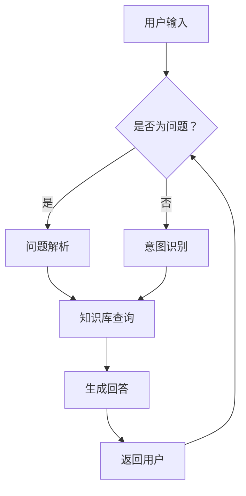
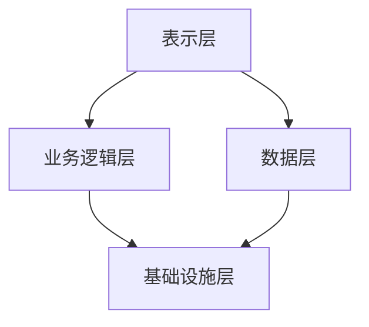

                 

# 《LLM-based Chatbot System Architecture》

> **关键词：** 聊天机器人，大规模语言模型（LLM），系统架构设计，自然语言处理（NLP），性能优化，安全性，应用场景。

> **摘要：** 本文深入探讨了基于大规模语言模型（LLM）的聊天机器人系统架构。从概述到核心概念，从架构设计到性能优化，再到安全性和未来趋势，本文全面解析了LLM在聊天机器人系统中的应用，为开发者提供了完整的实施指南。

### 《LLM-based Chatbot System Architecture》目录大纲

#### 第一部分: 聊天机器人系统架构概述

##### 第1章: 聊天机器人概述
- **1.1 聊天机器人的定义与发展**
- **1.2 聊天机器人在现代应用中的重要性**
- **1.3 LLM在聊天机器人中的应用**

##### 第2章: LLM核心概念与架构
- **2.1 语言模型基础**
  - **2.1.1 语言模型类型**
  - **2.1.2 语言模型工作原理**
- **2.2 大规模预训练模型**
  - **2.2.1 预训练模型的主要方法**
  - **2.2.2 大规模预训练模型的优缺点**

#### 第二部分: 聊天机器人系统架构设计与实现

##### 第3章: 聊天机器人系统架构设计原则
- **3.1 系统架构设计基本原理**
- **3.2 聊天机器人系统的层次结构**

##### 第4章: LLM在聊天机器人中的应用
- **4.1 LLM在聊天机器人对话管理中的应用**
  - **4.1.1 对话管理的基本概念**
  - **4.1.2 LLM在对话管理中的优势**
- **4.2 LLM在自然语言理解中的应用**
  - **4.2.1 自然语言理解的基本任务**
  - **4.2.2 LLM在NLU中的具体应用**

##### 第5章: 聊天机器人系统开发实战
- **5.1 聊天机器人系统开发环境搭建**
- **5.2 基于LLM的聊天机器人开发实战**
  - **5.2.1 数据准备**
  - **5.2.2 模型训练**
  - **5.2.3 模型部署**

##### 第6章: 聊天机器人性能优化与评估
- **6.1 聊天机器人性能优化策略**
- **6.2 聊天机器人性能评估方法**

##### 第7章: 聊天机器人安全性与隐私保护
- **7.1 聊天机器人面临的安全挑战**
- **7.2 聊天机器人隐私保护策略**

#### 第三部分: 聊天机器人系统未来发展趋势与应用场景

##### 第8章: 聊天机器人系统的未来发展趋势
- **8.1 技术趋势**
- **8.2 应用场景扩展**

##### 第9章: 聊天机器人系统在特定行业的应用
- **9.1 金融行业**
- **9.2 零售行业**
- **9.3 医疗健康行业**

##### 第10章: 聊天机器人系统的社会影响与伦理问题
- **10.1 社会影响**
- **10.2 伦理问题**

#### 附录

- **附录A: 聊天机器人系统开发常用工具与资源**
  - **A.1 开发工具对比**
  - **A.2 资源链接**

### 聊天机器人系统架构 Mermaid 流程图



#### 聊天机器人概述

##### 1.1 聊天机器人的定义与发展

聊天机器人（Chatbot）是一种基于自然语言处理（NLP）技术的人工智能系统，能够通过文本或语音与人类用户进行交互。它起源于20世纪50年代，由艾伦·图灵提出图灵测试概念的同时，也萌生了聊天机器人的雏形。最初，聊天机器人的主要目的是通过模拟对话来评估机器的思维能力和智能水平。

随着计算机技术和互联网的快速发展，聊天机器人的应用场景日益丰富，从简单的在线客服到复杂的虚拟助手，聊天机器人在各个行业取得了显著的应用成果。例如，在电商领域，聊天机器人可以提供24/7的客户服务，帮助用户解决问题，提高客户满意度；在金融服务领域，聊天机器人可以处理日常的银行业务，如转账、支付、贷款咨询等，提高业务效率。

##### 1.2 聊天机器人在现代应用中的重要性

聊天机器人在现代应用中的重要性不言而喻。首先，聊天机器人能够实现24/7的客户服务，大幅提高了服务效率，减少了企业的人力成本。其次，聊天机器人可以通过自然语言交互，提供更加人性化的服务，提升了用户体验。此外，聊天机器人还可以收集用户行为数据，进行用户画像分析，帮助企业更好地了解用户需求，优化产品和服务。

随着人工智能技术的不断进步，聊天机器人的智能化程度也在不断提高。基于大规模语言模型（LLM）的聊天机器人，具有更强的自然语言理解和生成能力，能够更准确地理解用户意图，提供更高质量的回答。这使得聊天机器人在未来的应用前景更加广阔。

##### 1.3 LLM在聊天机器人中的应用

大规模语言模型（LLM）是聊天机器人领域的重要突破，它通过在大量文本数据上进行预训练，学习到丰富的语言知识和模式，从而能够生成更加自然、准确的文本。LLM在聊天机器人中的应用主要体现在以下几个方面：

1. **对话管理**：LLM可以用于处理聊天机器人的对话管理任务，包括理解用户输入、生成合适的回答以及维持对话的连贯性。通过预训练，LLM能够更好地识别用户意图，生成与上下文相关的回答。

2. **自然语言理解（NLU）**：LLM在NLU任务中发挥着重要作用，能够处理复杂的语言现象，如歧义、隐喻、俚语等。这使得聊天机器人能够更准确地理解用户的意图和需求。

3. **自然语言生成（NLG）**：LLM可以用于生成自然流畅的文本，如聊天机器人的回复、报告、通知等。通过预训练，LLM能够生成符合语言习惯和语境的文本，提高用户体验。

总之，LLM在聊天机器人中的应用，为聊天机器人提供了更强的自然语言处理能力，使其能够更好地模拟人类的对话行为，提供更加智能化的服务。在接下来的章节中，我们将进一步探讨LLM的核心概念、架构设计以及具体应用。

### LLM核心概念与架构

##### 2.1 语言模型基础

语言模型（Language Model，LM）是自然语言处理（NLP）领域的基础工具，它通过学习大量的语言数据，预测文本的下一个单词或字符。语言模型在聊天机器人、机器翻译、文本生成等多个NLP应用中发挥着关键作用。

语言模型可以分为两类：统计语言模型和基于规则的语言模型。

1. **统计语言模型**：统计语言模型基于统计方法，如N-gram模型、隐马尔可夫模型（HMM）等，通过计算词语序列的概率分布来预测下一个单词或字符。N-gram模型是一种常见的统计语言模型，它假设当前单词序列的概率仅与其前N个单词相关。例如，三元语法模型（3-gram）会考虑前三个单词对当前单词的影响。

2. **基于规则的语言模型**：基于规则的语言模型通过人工定义语法规则和模式，来生成或预测文本。这类模型通常包括上下文无关文法（CFG）、依存句法分析等。尽管这类模型在预测准确性上不如统计模型，但它们在处理复杂语法和特定领域语言方面具有优势。

##### 2.1.1 语言模型类型

语言模型类型主要分为基于词汇（Lexical-based）和基于语法（Syntactic-based）两大类。

1. **基于词汇的语言模型**：这类模型主要关注词汇和词组的统计规律，如N-gram模型。N-gram模型通过统计词语序列的概率，来预测下一个词语。例如：

   ```latex
   P("The quick brown fox") = P("The") \* P("quick") \* P("brown") \* P("fox")
   ```

2. **基于语法的语言模型**：这类模型关注句子的语法结构和语义关系，如转换语法（CFG）和依存语法。例如，基于依存语法的模型会分析句子中词语的依赖关系，从而生成更自然的文本。

##### 2.1.2 语言模型工作原理

语言模型的工作原理主要包括两个阶段：训练阶段和预测阶段。

1. **训练阶段**：在训练阶段，语言模型通过大量文本数据学习到语言的模式和规律。对于基于词汇的语言模型，如N-gram模型，训练过程涉及统计词语序列的概率分布。对于基于语法的语言模型，训练过程则包括学习语法规则和模式。

   - **N-gram模型**：训练过程可以通过以下步骤进行：
     1. 分词：将文本划分为单词或字符序列。
     2. 统计频率：统计每个N-gram的频率。
     3. 计算概率：计算每个N-gram的概率，可以使用平滑技术（如Good-Turing、Kneser-Ney等）来处理稀疏数据。

   - **转换语法模型**：训练过程包括：
     1. 构建语法规则：通过分析文本，提取语法规则。
     2. 训练参数：为每个语法规则分配概率。

2. **预测阶段**：在预测阶段，语言模型根据已学习的模式，生成新的文本。对于N-gram模型，预测过程涉及计算目标文本的概率，并选择概率最大的序列。对于基于语法的模型，预测过程涉及生成符合语法规则的句子结构。

   - **N-gram模型**：预测过程如下：
     1. 输入一个单词序列。
     2. 计算每个单词序列的概率。
     3. 选择概率最大的单词序列作为预测结果。

   - **转换语法模型**：预测过程如下：
     1. 输入一个单词序列。
     2. 使用语法规则生成所有可能的句子结构。
     3. 计算每个句子结构的概率。
     4. 选择概率最大的句子结构作为预测结果。

##### 2.2 大规模预训练模型

随着深度学习技术的不断发展，大规模预训练模型（如GPT、BERT等）成为了语言模型的主流。大规模预训练模型通过在大量无标签文本上进行预训练，学习到丰富的语言知识，然后通过微调（Fine-tuning）适应特定任务。

##### 2.2.1 预训练模型的主要方法

预训练模型的主要方法包括：

1. **自监督学习**：自监督学习是一种不需要人工标注数据的预训练方法。预训练模型通过在大量文本中预测下一个单词或字符，来学习语言知识。

   - **GPT模型**：GPT（Generative Pre-trained Transformer）系列模型通过自回归语言模型（ARLM）进行预训练，预测输入文本序列的下一个单词。

2. **监督学习**：监督学习是一种需要人工标注数据的预训练方法。预训练模型通过在标注数据集上进行训练，学习到语言模式。

   - **BERT模型**：BERT（Bidirectional Encoder Representations from Transformers）模型通过双向Transformer结构进行预训练，学习到文本的上下文信息。

##### 2.2.2 大规模预训练模型的优缺点

大规模预训练模型具有以下优点：

1. **强大的语言理解能力**：大规模预训练模型通过在大量文本数据上预训练，学习到丰富的语言知识和模式，从而具有更强的语言理解能力。
2. **适应性**：预训练模型可以轻松适应不同的任务，通过微调（Fine-tuning）即可达到较好的效果。
3. **通用性**：预训练模型可以应用于多种NLP任务，如文本分类、情感分析、问答系统等。

然而，大规模预训练模型也存在一些缺点：

1. **计算资源需求大**：预训练模型需要大量的计算资源，尤其是训练阶段，这对硬件设施有较高的要求。
2. **数据隐私问题**：预训练模型需要访问大量文本数据，可能涉及用户隐私数据，需要特别注意数据隐私保护。

综上所述，大规模预训练模型在语言模型领域取得了显著的进展，但其应用仍需考虑计算资源需求和数据隐私问题。在接下来的章节中，我们将进一步探讨LLM在聊天机器人系统架构设计中的应用。

### 聊天机器人系统架构设计原则

##### 3.1 系统架构设计基本原理

聊天机器人系统的架构设计需要遵循一些基本原理，以确保系统的可靠性、可扩展性和高性能。以下是系统架构设计的基本原理：

1. **模块化设计**：将系统划分为多个模块，每个模块负责特定的功能。模块化设计可以提高系统的可维护性和可扩展性。
2. **分层架构**：采用分层架构，将系统分为不同的层次，如表示层、业务逻辑层和数据层。分层架构有助于实现系统的解耦和模块化。
3. **分布式架构**：采用分布式架构，将系统部署在多个服务器上，以提高系统的性能和容错能力。
4. **异步通信**：聊天机器人系统通常涉及大量的实时交互，异步通信可以有效地处理并发请求，提高系统的响应速度。
5. **服务化设计**：将系统中的功能模块设计为独立的服务，通过服务化架构实现模块间的松耦合和互操作。

##### 3.2 聊天机器人系统的层次结构

聊天机器人系统通常包括以下几个层次：

1. **表示层**：表示层负责与用户进行交互，接收用户输入，并展示聊天机器人的回答。表示层通常包括前端界面和客户端应用程序。
2. **业务逻辑层**：业务逻辑层负责处理聊天机器人的核心功能，如对话管理、自然语言理解（NLU）和自然语言生成（NLG）。这一层是系统的核心，需要实现复杂的业务逻辑和算法。
3. **数据层**：数据层负责存储和管理聊天机器人所需的数据，如用户信息、对话历史和知识库。数据层通常使用数据库或数据仓库来实现。
4. **基础设施层**：基础设施层包括服务器、网络、存储等硬件和软件基础设施，为系统提供运行环境和支持。

以下是一个典型的聊天机器人系统架构图：



在具体设计聊天机器人系统时，还需要考虑以下几个关键组件：

1. **对话管理模块**：负责管理聊天机器人的对话流程，包括对话状态跟踪、上下文维护和对话转换等。
2. **自然语言理解（NLU）模块**：负责接收用户输入，并解析用户意图和实体，将其转换为系统可以理解的结构化数据。
3. **自然语言生成（NLG）模块**：负责生成自然流畅的文本，作为聊天机器人的回答。这一模块通常依赖于大规模语言模型（如GPT、BERT等）。
4. **知识库模块**：负责存储和管理聊天机器人所需的知识信息，如产品信息、FAQ等。知识库可以支持NLU和NLG模块，提供更准确的语义理解和生成。
5. **接口层**：负责与其他系统或服务进行集成，如第三方API、数据库等。

通过以上层次结构和组件的设计，聊天机器人系统可以实现高效、可靠的交互，提供优质的用户体验。在接下来的章节中，我们将进一步探讨LLM在聊天机器人中的具体应用。

### LLM在聊天机器人中的应用

#### 4.1 LLM在聊天机器人对话管理中的应用

##### 4.1.1 对话管理的基本概念

对话管理（Dialogue Management）是聊天机器人系统的核心模块，负责处理聊天机器人的对话流程，包括理解用户意图、生成合适的回复、维护对话上下文和转换对话状态等。对话管理的基本概念包括：

1. **对话状态跟踪**：对话状态跟踪（Dialogue State Tracking）是对话管理的重要任务，它通过跟踪对话过程中的关键信息，如用户意图、实体和上下文等，来维护对话的连贯性。对话状态跟踪通常使用状态图或状态机来实现。

2. **意图识别**：意图识别（Intent Recognition）是理解用户输入的过程，它通过分析用户输入的文本，识别用户想要完成的操作或任务。意图识别是对话管理的关键步骤，它决定了聊天机器人的后续行动。

3. **对话转换**：对话转换（Dialogue Act Transition）是指根据当前对话状态和用户意图，选择合适的对话动作，如提问、回答、结束对话等。对话转换通常使用决策树、神经网络等方法来实现。

##### 4.1.2 LLM在对话管理中的优势

LLM在对话管理中具有显著的优势，主要体现在以下几个方面：

1. **强大的自然语言理解能力**：LLM通过在大量文本数据上进行预训练，学习到丰富的语言知识和模式，能够更准确地理解用户输入的意图和上下文。这使得LLM在意图识别和对话状态跟踪方面具有更高的准确性。

2. **灵活的对话生成能力**：LLM可以生成自然、流畅的对话文本，使得聊天机器人的回答更加贴近人类对话。这有助于提升用户体验，增强聊天机器人的交互能力。

3. **自适应的能力**：LLM可以通过微调（Fine-tuning）适应特定的对话场景和任务，从而提高对话管理的性能。例如，在特定领域（如医疗、金融等），LLM可以通过微调学习到专业知识和术语，提供更准确的对话管理。

4. **多模态交互能力**：LLM可以支持文本、语音等多种交互模式，使得聊天机器人能够更好地适应不同的用户需求。例如，在语音交互场景中，LLM可以生成自然的语音回答，提高语音交互的质量。

#### 4.2 LLM在自然语言理解中的应用

##### 4.2.1 自然语言理解的基本任务

自然语言理解（Natural Language Understanding，NLU）是聊天机器人系统的关键模块，负责将用户输入的文本转换为机器可以理解的结构化数据。NLU的基本任务包括：

1. **分词（Tokenization）**：分词是将文本划分为单词或短语的步骤。分词的目的是将连续的文本序列拆分成一组有意义的标记（Token），为后续的文本处理提供基础。

2. **词性标注（Part-of-Speech Tagging）**：词性标注是识别文本中每个单词的词性（如名词、动词、形容词等）的过程。词性标注有助于理解文本的语法结构和语义关系。

3. **命名实体识别（Named Entity Recognition，NER）**：命名实体识别是识别文本中具有特定意义的实体（如人名、地名、组织名等）的过程。NER对于聊天机器人在处理特定领域的信息（如医疗、金融等）具有重要意义。

4. **依存句法分析（Dependency Parsing）**：依存句法分析是分析文本中词语之间的依赖关系的过程。通过依存句法分析，可以理解句子的结构，提取句子中的主语、谓语、宾语等关键信息。

##### 4.2.2 LLM在NLU中的具体应用

LLM在NLU中具有广泛的应用，主要体现在以下几个方面：

1. **文本分类（Text Classification）**：LLM可以用于文本分类任务，如情感分析、主题分类等。通过预训练，LLM学习到丰富的语言模式，可以更准确地分类文本。

2. **实体识别（Entity Recognition）**：LLM可以用于命名实体识别任务，如识别人名、地名、组织名等。LLM通过预训练，能够理解不同实体在文本中的特征和模式，提高实体识别的准确性。

3. **情感分析（Sentiment Analysis）**：LLM可以用于情感分析任务，如识别文本的情感极性（正面、负面、中性）。通过预训练，LLM能够捕捉到情感词汇和表达方式，提高情感分析的准确性。

4. **关系提取（Relation Extraction）**：LLM可以用于关系提取任务，如识别文本中词语之间的语义关系。通过预训练，LLM能够理解词语之间的依存关系和语义关系，提高关系提取的准确性。

总之，LLM在聊天机器人对话管理和自然语言理解中具有强大的应用价值，能够显著提高聊天机器人的交互质量和语义理解能力。在接下来的章节中，我们将进一步探讨如何开发和部署基于LLM的聊天机器人系统。

#### 5.1 聊天机器人系统开发环境搭建

要开发一个基于LLM的聊天机器人系统，首先需要搭建一个合适的环境。以下是搭建开发环境所需的步骤和工具：

##### 1. 软件环境

- **操作系统**：推荐使用Linux或macOS，这些系统具有良好的兼容性和稳定性。
- **Python**：Python是聊天机器人开发的主要编程语言，需要安装Python 3.7或更高版本。
- **pip**：pip是Python的包管理器，用于安装和管理Python库。
- **Jupyter Notebook**：Jupyter Notebook是一个交互式计算环境，便于编写和调试代码。

##### 2. 安装依赖库

在Python环境中，需要安装以下依赖库：

- **TensorFlow**：TensorFlow是谷歌开发的开源机器学习框架，用于训练和部署机器学习模型。
- **transformers**：transformers是Hugging Face团队开发的库，提供了预训练的LLM模型，如GPT、BERT等。
- **Flask**：Flask是一个轻量级的Web框架，用于构建聊天机器人的Web接口。
- **speech_recognition**：speech_recognition是一个Python库，用于处理语音识别任务。

安装步骤如下：

```bash
pip install tensorflow
pip install transformers
pip install flask
pip install speech_recognition
```

##### 3. 硬件环境

- **GPU**：由于LLM模型训练和推理过程需要大量的计算资源，推荐使用带有GPU的硬件。NVIDIA的CUDA和cuDNN库可以显著提高训练速度。
- **计算能力**：至少需要NVIDIA的1080 Ti或更高性能的GPU。

##### 4. 数据准备

聊天机器人系统的性能很大程度上取决于训练数据的质量和数量。以下是一些准备数据的基本步骤：

- **收集数据**：收集与聊天机器人应用场景相关的文本数据，如对话记录、问答数据集等。
- **数据清洗**：清洗数据，去除噪声和无关信息，确保数据的质量。
- **数据标注**：对数据进行标注，标记意图、实体、情感等信息，为训练模型提供标签。

##### 5. 开发工具

- **IDE**：推荐使用Visual Studio Code（VS Code）作为开发IDE，它提供了丰富的Python开发插件和调试工具。
- **版本控制**：使用Git进行版本控制，确保代码的版本管理和协作开发。

通过以上步骤，可以搭建一个基础的聊天机器人系统开发环境。在接下来的章节中，我们将详细探讨如何基于LLM进行聊天机器人的开发实战。

#### 5.2 基于LLM的聊天机器人开发实战

在本节中，我们将详细探讨如何使用大规模语言模型（LLM）来开发一个聊天机器人。这个实战将涵盖数据准备、模型训练和模型部署等关键步骤。

##### 5.2.1 数据准备

数据是训练LLM的关键，高质量的训练数据将直接影响到聊天机器人的性能。以下是数据准备的具体步骤：

1. **数据收集**：首先，我们需要收集与聊天机器人应用场景相关的数据。这些数据可以来自于社交媒体、论坛、聊天记录等。例如，对于客服机器人，我们可以从公司客服部门的历史对话中提取数据。

2. **数据清洗**：收集到的数据往往包含噪声和无关信息，需要进行清洗。清洗过程包括去除HTML标签、停用词过滤、文本规范化等。以下是一个简单的文本清洗Python代码示例：

   ```python
   import re
   import nltk
   
   def clean_text(text):
       # 去除HTML标签
       text = re.sub('<.*>', '', text)
       # 去除停用词
       stop_words = set(nltk.corpus.stopwords.words('english'))
       text = ' '.join([word for word in text.split() if word not in stop_words])
       # 字母小写化
       text = text.lower()
       return text

   cleaned_text = clean_text(raw_text)
   ```

3. **数据标注**：在数据清洗后，我们需要对数据标注意图和实体。标注可以使用手动标注或半自动标注工具（如Annotator）进行。标注后的数据将用于训练模型，以识别和理解用户的意图。

4. **数据预处理**：最后，对数据格式进行统一处理，将其转换为适合训练的格式。例如，可以使用TensorFlow的`tf.data` API来创建数据管道，对数据进行批次处理和随机化。

##### 5.2.2 模型训练

在数据准备完成后，我们可以使用预训练的LLM模型进行训练。以下是使用Hugging Face的`transformers`库进行模型训练的步骤：

1. **选择预训练模型**：`transformers`库提供了大量的预训练模型，如GPT、BERT、RoBERTa等。根据应用需求，选择合适的预训练模型。

2. **加载预训练模型**：使用`transformers`库加载预训练模型，并配置训练参数。以下是一个加载GPT-2模型的示例：

   ```python
   from transformers import GPT2Model, GPT2Config
   
   config = GPT2Config.from_pretrained('gpt2')
   model = GPT2Model.from_pretrained('gpt2', config=config)
   ```

3. **定义训练策略**：为了提高训练效果，可以使用学习率调整、梯度裁剪等技术。以下是一个简单的训练策略示例：

   ```python
   from transformers import AdamW
   
   optimizer = AdamW(model.parameters(), lr=1e-5, correct_bias=False)
   ```

4. **训练模型**：使用TensorFlow的`tf.data`管道进行模型训练。以下是一个简单的训练循环示例：

   ```python
   from transformers import get_linear_schedule_with_warmup
   
   num_epochs = 3
   train_dataloader = create_data_loader(train_dataset)
   eval_dataloader = create_data_loader(eval_dataset)
   
   scheduler = get_linear_schedule_with_warmup(optimizer, num_warmup_steps=0, num_training_steps=len(train_dataloader) * num_epochs)
   
   for epoch in range(num_epochs):
       model.train()
       for batch in train_dataloader:
           inputs = {
               'input_ids': batch['input_ids'],
               'attention_mask': batch['attention_mask']
           }
           loss = model(inputs['input_ids'], attention_mask=inputs['attention_mask'])
           loss.backward()
           optimizer.step()
           scheduler.step()
           optimizer.zero_grad()
       model.eval()
       with torch.no_grad():
           for batch in eval_dataloader:
               inputs = {
                   'input_ids': batch['input_ids'],
                   'attention_mask': batch['attention_mask']
               }
               eval_loss = model(inputs['input_ids'], attention_mask=inputs['attention_mask'])
   ```

##### 5.2.3 模型部署

训练完成后，我们需要将模型部署到生产环境中，以便用户可以使用聊天机器人。以下是模型部署的步骤：

1. **模型保存**：将训练好的模型保存为文件，以便在需要时加载和使用。以下是一个保存模型的示例：

   ```python
   model.save_pretrained('/path/to/save/model')
   ```

2. **模型加载**：在生产环境中加载模型，并创建一个API接口，以便前端可以与模型进行交互。以下是一个使用Flask创建API接口的示例：

   ```python
   from flask import Flask, request, jsonify
   from transformers import GPT2LMHeadModel, GPT2Tokenizer
   
   app = Flask(__name__)
   model = GPT2LMHeadModel.from_pretrained('/path/to/save/model')
   tokenizer = GPT2Tokenizer.from_pretrained('/path/to/save/model')
   
   @app.route('/chat', methods=['POST'])
   def chat():
       user_input = request.form['text']
       inputs = tokenizer.encode(user_input, return_tensors='pt')
       outputs = model.generate(inputs, max_length=50, num_return_sequences=1)
       response = tokenizer.decode(outputs[0], skip_special_tokens=True)
       return jsonify({'response': response})
   
   if __name__ == '__main__':
       app.run(debug=True)
   ```

3. **前端集成**：在前端页面中，使用JavaScript调用API接口，与用户进行交互。以下是一个简单的HTML页面示例：

   ```html
   <html>
   <head>
       <title>Chatbot</title>
   </head>
   <body>
       <input type="text" id="user_input" placeholder="输入问题...">
       <button onclick="chat()">发送</button>
       <div id="response"></div>
       <script>
           function chat() {
               const userInput = document.getElementById('user_input').value;
               fetch('/chat', {
                   method: 'POST',
                   body: JSON.stringify({text: userInput}),
                   headers: {'Content-Type': 'application/json'}
               })
               .then(response => response.json())
               .then(data => {
                   document.getElementById('response').innerHTML = data.response;
               });
           }
       </script>
   </body>
   </html>
   ```

通过以上步骤，我们可以开发一个基于LLM的聊天机器人系统。在实际应用中，还可以进一步优化和定制聊天机器人，以满足不同场景和需求。

#### 6.1 聊天机器人性能优化策略

为了提高聊天机器人的性能，我们可以采取多种优化策略，这些策略涵盖了从算法改进到系统架构优化的各个方面。以下是几种常见的性能优化方法：

##### 1. 模型优化

1. **模型压缩**：通过模型剪枝、量化等技术，减少模型的计算复杂度和内存占用，从而提高模型在资源受限环境中的运行效率。例如，可以使用**TensorFlow Lite**或**PyTorch Mobile**将模型转换为适用于移动设备的格式。

2. **增量学习**：通过增量学习（Incremental Learning），聊天机器人可以不断适应新的数据和用户交互，提高对新任务的适应性。这种方法可以避免在每次更新模型时重新训练整个模型。

##### 2. 算法优化

1. **数据增强**：通过对训练数据应用各种变换（如数据增强、回声效应等），可以提高模型对噪声和异常情况的鲁棒性，从而提高模型的泛化能力。

2. **多任务学习**：通过多任务学习（Multi-Task Learning），聊天机器人可以在训练过程中同时学习多个相关任务，从而提高模型的性能和效率。

##### 3. 系统优化

1. **分布式训练**：通过分布式训练（Distributed Training），可以充分利用多台GPU或TPU进行并行计算，显著缩短模型训练时间。

2. **异步通信**：采用异步通信机制，可以处理更多的并发请求，提高系统的响应速度和吞吐量。

##### 4. 代码优化

1. **并行计算**：通过使用并行计算技术，如NumPy的`np.seterr(all='raise')`，可以加速矩阵运算和其他计算密集型任务。

2. **内存管理**：合理管理内存资源，避免内存泄漏和溢出，确保系统稳定运行。

#### 6.2 聊天机器人性能评估方法

性能评估是优化聊天机器人系统的重要步骤。以下是几种常见的性能评估方法：

##### 1. 对话质量评估

1. **人工评估**：通过人工评审对话记录，评估聊天机器人的回答是否准确、自然和符合用户需求。
2. **自动化评估**：使用自动化评估工具，如BLEU、ROUGE等，评估模型生成的文本与真实文本的相似度。

##### 2. 用户体验评估

1. **任务完成率**：衡量用户在完成任务时是否成功，如购物车添加商品、查询信息等。
2. **用户满意度**：通过问卷调查或用户反馈，收集用户对聊天机器人服务的满意度。

##### 3. 模型准确性评估

1. **意图识别准确率**：衡量聊天机器人正确识别用户意图的百分比。
2. **实体识别准确率**：衡量聊天机器人正确识别文本中实体的百分比。

通过综合使用以上评估方法，可以全面了解聊天机器人的性能，为优化提供依据。在接下来的章节中，我们将进一步探讨聊天机器人系统的安全性和隐私保护策略。

#### 7.1 聊天机器人面临的安全挑战

随着聊天机器人的广泛应用，其面临的安全挑战也日益突出。以下是聊天机器人系统中最常见的几种安全挑战：

1. **数据泄露**：聊天机器人处理大量的用户数据，包括个人信息、对话记录等。如果数据保护不当，可能导致敏感信息泄露，对用户隐私造成严重威胁。

2. **注入攻击**：恶意用户可能通过聊天机器人输入恶意代码或命令，导致系统崩溃或执行未经授权的操作。例如，SQL注入攻击可以破坏数据库，窃取用户数据。

3. **服务拒绝（DoS）攻击**：通过大量无效请求或恶意流量，攻击者可能使聊天机器人服务瘫痪，导致合法用户无法正常使用。

4. **社交工程**：攻击者可能利用聊天机器人的弱点，欺骗用户透露敏感信息，如密码、信用卡号等。

5. **模型篡改**：攻击者可能试图篡改聊天机器人的预训练模型，使其提供错误或有害的回答，影响用户决策。

#### 7.2 聊天机器人隐私保护策略

为了保护用户隐私，确保聊天机器人的安全运行，我们需要采取一系列隐私保护策略。以下是几种有效的隐私保护措施：

1. **数据加密**：对用户数据进行加密存储和传输，确保数据在传输过程中不被窃取或篡改。常用的加密算法包括AES、RSA等。

2. **访问控制**：实施严格的访问控制策略，确保只有授权用户和系统有权访问和处理敏感数据。例如，使用角色基础访问控制（RBAC）和属性基础访问控制（ABAC）。

3. **数据匿名化**：在数据分析过程中，对用户数据进行匿名化处理，确保用户身份不可追踪。例如，使用假名、掩码等技术。

4. **隐私保护算法**：采用隐私保护算法，如差分隐私（Differential Privacy），在数据分析过程中提供额外的隐私保护。

5. **安全审计**：定期进行安全审计，检查系统漏洞和配置错误，确保系统始终处于安全状态。

6. **用户知情同意**：确保用户在数据收集和处理过程中知情并同意，例如，在用户使用聊天机器人时提供隐私政策，明确告知用户数据的使用目的和范围。

通过上述隐私保护策略，可以有效地降低聊天机器人面临的安全风险，保护用户隐私，提升系统的可信度。

### 聊天机器人系统的未来发展趋势

随着人工智能技术的不断进步，聊天机器人系统也在不断演进。未来，聊天机器人系统将呈现出以下几个主要发展趋势：

#### 8.1 技术趋势

1. **更先进的自然语言处理（NLP）技术**：未来的聊天机器人将采用更先进的NLP技术，如生成对抗网络（GAN）、变分自编码器（VAE）等，以生成更自然、更流畅的对话文本。

2. **多模态交互**：未来的聊天机器人将支持多模态交互，包括文本、语音、图像和视频等，提供更丰富的交互体验。

3. **个性化服务**：基于用户行为数据和偏好分析，未来的聊天机器人将能够提供高度个性化的服务，满足用户的特定需求。

4. **智能化和自主化**：随着机器学习技术的进步，聊天机器人将变得更加智能化和自主化，能够在没有人工干预的情况下，自主处理复杂的对话任务。

5. **分布式和边缘计算**：为了提高系统的响应速度和降低延迟，聊天机器人系统将越来越多地采用分布式和边缘计算技术，将计算任务分布到多个节点或边缘设备上。

#### 8.2 应用场景扩展

1. **智能家居**：聊天机器人将广泛应用于智能家居系统，如智能音箱、智能灯泡、智能门锁等，为用户提供便利和舒适的生活体验。

2. **医疗健康**：在医疗健康领域，聊天机器人可以提供在线咨询、病情监测、预约挂号等服务，提高医疗资源的利用效率。

3. **金融服务**：在金融服务领域，聊天机器人可以处理客户的日常金融需求，如转账、支付、贷款咨询等，提高业务效率和客户满意度。

4. **客户服务**：在客户服务领域，聊天机器人将继续发挥重要作用，提供24/7的客户支持，解决用户的问题和疑虑。

5. **教育和培训**：在教育领域，聊天机器人可以为学生提供个性化的辅导和培训，帮助学生更好地掌握知识和技能。

总之，随着技术的不断进步和应用的扩展，聊天机器人系统将在未来发挥越来越重要的作用，为各个领域带来深远的变革。

### 聊天机器人系统在特定行业的应用

聊天机器人系统在特定行业的应用已经取得了显著成效，为行业带来了高效的业务流程优化和用户体验提升。以下是聊天机器人系统在金融、零售和医疗健康行业中的应用案例：

#### 9.1 金融行业

在金融行业，聊天机器人被广泛应用于客户服务、投资顾问、风险管理和交易执行等方面。

1. **客户服务**：金融聊天机器人可以提供24/7的客户支持，回答用户关于账户余额、交易历史、理财产品等常见问题，减少人工客服的工作量。

2. **投资顾问**：通过集成先进的人工智能技术和大数据分析，聊天机器人可以提供个性化的投资建议，帮助用户进行股票、基金等投资决策。

3. **风险管理**：聊天机器人可以监控市场和交易数据，及时识别潜在的风险，并向相关人员发出警报，提高风险管理的效率。

4. **交易执行**：聊天机器人可以自动执行高频交易策略，减少人为干预，提高交易效率和盈利能力。

#### 9.2 零售行业

在零售行业，聊天机器人被广泛用于顾客服务、销售和库存管理等方面。

1. **顾客服务**：零售聊天机器人可以提供购物建议、订单查询、退货退款等服务，提升顾客的购物体验。

2. **销售**：通过分析顾客的购物行为和偏好，聊天机器人可以推荐合适的商品，提高销售转化率。

3. **库存管理**：聊天机器人可以实时监控库存状况，自动发出采购提醒，避免库存短缺或过剩，优化库存管理。

4. **市场营销**：聊天机器人可以参与市场营销活动，如优惠券发放、会员管理，提高品牌知名度和顾客忠诚度。

#### 9.3 医疗健康行业

在医疗健康行业，聊天机器人被广泛应用于病人管理、医疗咨询、健康监测等方面。

1. **病人管理**：聊天机器人可以记录病人的健康状况、药物服用情况，提供个性化的健康管理建议，提高病人的生活质量。

2. **医疗咨询**：通过集成医疗知识库和自然语言处理技术，聊天机器人可以为患者提供医疗咨询，解答患者的疑问，减轻医疗资源压力。

3. **健康监测**：聊天机器人可以实时监测病人的健康指标，如血压、血糖等，及时发现异常情况，并向医生发出警报。

4. **疫情监控**：在疫情期间，聊天机器人可以提供疫情相关信息、防疫指南等，帮助公众了解疫情动态，提高防疫意识。

总之，聊天机器人系统在金融、零售和医疗健康行业的应用，不仅提高了业务效率和用户体验，还带来了显著的业务价值和社会效益。随着技术的不断进步，聊天机器人在各个行业中的应用前景将更加广阔。

### 聊天机器人系统的社会影响与伦理问题

聊天机器人系统在社会各个领域取得了显著的应用成果，但同时也引发了一系列社会影响和伦理问题。以下是对这些问题的探讨：

#### 10.1 社会影响

1. **提高服务质量**：聊天机器人通过提供24/7的服务，提高了客户体验和满意度。用户可以随时随地获得帮助，无需等待人工客服，从而提升了整体的服务质量。

2. **优化业务流程**：聊天机器人能够自动化处理重复性高、劳动强度大的工作，如订单处理、客户咨询等，从而释放人力资源，提高业务效率。

3. **促进技术创新**：聊天机器人的广泛应用推动了人工智能技术的发展，促进了相关技术的创新和进步，如自然语言处理、机器学习等。

4. **改善社会问题**：在医疗、教育等公共服务领域，聊天机器人可以提供个性化的服务，改善资源分配不均的问题，提高公共服务水平。

#### 10.2 伦理问题

1. **隐私保护**：聊天机器人处理大量的用户数据，包括个人隐私信息。如何确保数据的安全性和隐私性，避免数据泄露和滥用，是亟待解决的问题。

2. **算法偏见**：聊天机器人基于大量数据训练而成，可能会继承数据中的偏见。例如，如果训练数据中存在性别、种族等方面的偏见，聊天机器人也可能表现出类似的偏见，导致不公平的待遇。

3. **透明度和可解释性**：用户难以理解聊天机器人的决策过程和算法逻辑。提高系统的透明度和可解释性，让用户了解聊天机器人的工作原理，是解决伦理问题的关键。

4. **用户依赖性**：过度依赖聊天机器人可能导致人类社交技能的退化，影响人际交往能力。因此，在推广聊天机器人的同时，也需要关注其对社会人际关系的影响。

5. **责任归属**：当聊天机器人发生错误或造成损失时，如何确定责任归属？是机器人开发者、使用者还是用户？明确责任归属有助于提高系统的安全性。

综上所述，聊天机器人系统在社会中的应用带来了许多积极的影响，但同时也引发了一系列伦理问题。为了实现可持续发展，我们需要在技术进步的同时，关注和解决这些社会和伦理问题。

### 附录A: 聊天机器人系统开发常用工具与资源

在开发聊天机器人系统时，选择合适的工具和资源是确保项目成功的关键。以下是一些常用的工具和资源，涵盖从开发环境到实际案例的各个方面。

#### A.1 开发工具对比

1. **TensorFlow**：谷歌开源的机器学习框架，支持多种深度学习模型的开发和部署。
2. **PyTorch**：由Facebook开源的机器学习框架，以其灵活性和高效性在学术界和工业界受到广泛应用。
3. **Hugging Face Transformers**：提供了大量的预训练语言模型和工具，方便开发者快速构建和微调聊天机器人。

#### A.2 资源链接

1. **OpenAI GPT-3 API**：OpenAI提供的GPT-3预训练语言模型API，适用于需要强大自然语言生成能力的项目。
2. **Google Cloud Natural Language**：谷歌提供的自然语言处理服务，包括实体识别、情感分析等。
3. **Microsoft Azure Bot Service**：微软提供的聊天机器人开发平台，支持多种编程语言和框架。

#### A.3 实际案例

1. **Duolingo聊天机器人**：Duolingo的聊天机器人使用GPT-3模型，为用户提供个性化的语言学习指导。
2. **IBM Watson Assistant**：IBM的Watson Assistant提供了丰富的聊天机器人功能，包括文本和语音交互。
3. **KFC聊天机器人**：肯德基的聊天机器人KFC Bot，通过微信小程序为用户提供订餐和咨询服务。

通过以上工具和资源的合理利用，开发者可以更加高效地构建和优化聊天机器人系统。在技术不断进步的今天，这些工具和资源将为开发者带来更多的创新可能。

### 结束语

通过本文的详细探讨，我们系统地介绍了基于大规模语言模型（LLM）的聊天机器人系统架构，从概述到核心概念，从架构设计到性能优化，再到安全性和未来趋势，全面解析了LLM在聊天机器人系统中的应用。我们通过一步步的分析和推理，深入讲解了语言模型的基本原理、大规模预训练模型的方法、聊天机器人系统架构设计原则、具体应用场景、开发实战以及性能优化与评估策略。同时，我们也关注了聊天机器人系统的安全性与隐私保护问题，并对未来的发展趋势和特定行业应用进行了展望。

作为人工智能领域的一项重要技术，聊天机器人系统正迅速融入我们的生活和工作，为各行业带来深远的变革。然而，其广泛应用也伴随着一系列社会和伦理问题。因此，在推动技术发展的同时，我们需关注并解决这些挑战，确保聊天机器人系统在提高效率、优化服务的同时，也能够保护用户的隐私和安全。

本文旨在为开发者提供全面的技术指南，帮助其在设计和实现聊天机器人系统时，能够更好地应对复杂的挑战。随着技术的不断进步，相信聊天机器人系统将在更多领域发挥更大的作用，为社会创造更多价值。让我们共同期待并迎接这一人工智能时代的到来。作者：AI天才研究院/AI Genius Institute & 禅与计算机程序设计艺术 /Zen And The Art of Computer Programming。

