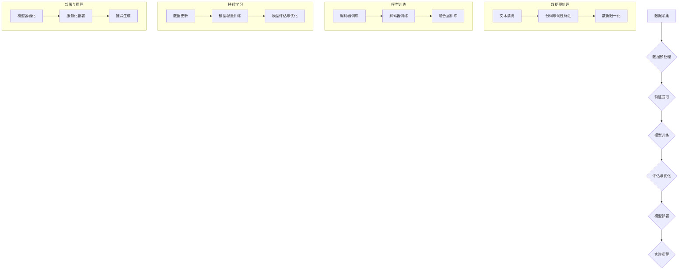

                 

# LLM在推荐系统中的持续学习应用

## 关键词

- 推荐系统
- 持续学习
- 语言模型（LLM）
- 个性化推荐
- 大型预训练模型

## 摘要

本文探讨了大型语言模型（LLM）在推荐系统中的应用，特别是持续学习的机制如何提升推荐系统的效果和适应性。首先，我们将回顾推荐系统的基础知识，包括其工作原理、评估指标和传统算法。接着，我们深入探讨LLM的基本概念、架构和核心算法，以及它们如何与推荐系统相结合。随后，本文将展示如何构建一个基于LLM的推荐系统，并通过实际案例来展示其应用效果。最后，我们将讨论持续学习在推荐系统中的优化策略和效果评估，并对未来的发展趋势和挑战进行展望。

### 目录大纲

# LLM在推荐系统中的持续学习应用

## 第一部分：引言与基础

### 第1章：背景与概述

### 第2章：推荐系统基本原理

## 第二部分：LLM基础与原理

### 第3章：大型语言模型（LLM）基础

### 第4章：LLM在推荐系统中的应用原理

## 第三部分：应用实战

### 第5章：构建LLM推荐系统

### 第6章：持续学习应用案例

### 第7章：优化与评估

## 第四部分：未来展望与挑战

### 第8章：持续学习与推荐系统的发展趋势

### 第9章：总结与展望

## 附录

### 附录A：常用工具与资源

### 附录B：Mermaid流程图与伪代码示例

### 附录C：作者信息

## 第1章：背景与概述

随着互联网的迅猛发展，个性化推荐系统已经成为提升用户体验、增加用户粘性的重要手段。传统的推荐系统通过分析用户的历史行为、内容特征和相似用户群体的特征来进行推荐，但在应对动态变化的用户需求上存在一定的局限性。为此，持续学习成为提升推荐系统适应性的一种有效方法。

持续学习是一种机器学习方法，旨在使模型能够不断地从新数据中学习，并逐步调整其参数，从而提高模型的泛化能力和适应性。在推荐系统中，持续学习可以帮助系统跟踪用户的最新偏好，及时调整推荐结果，提高推荐的准确性。

近年来，大型语言模型（LLM）的出现为推荐系统的持续学习带来了新的可能性。LLM通过预训练和微调，能够在大规模文本数据上进行学习和理解，从而捕捉到丰富的语言模式和用户偏好。这使得LLM在推荐系统中具有独特的优势，能够更好地处理复杂的多模态信息，提高推荐的个性化和实时性。

本文将围绕LLM在推荐系统中的持续学习应用进行探讨，旨在为读者提供一个全面的技术解析和应用指南。首先，我们将介绍推荐系统的基础知识，包括其工作原理、评估指标和传统算法。接下来，我们将深入探讨LLM的基本概念、架构和核心算法，以及它们如何与推荐系统相结合。随后，本文将展示如何构建一个基于LLM的推荐系统，并通过实际案例来展示其应用效果。最后，我们将讨论持续学习在推荐系统中的优化策略和效果评估，并对未来的发展趋势和挑战进行展望。

### 第1章：背景与概述

#### 1.1 推荐系统概述

推荐系统是一种信息过滤技术，旨在根据用户的历史行为、兴趣和偏好，为用户推荐符合其需求的信息、商品或内容。推荐系统的核心目标是提高用户的满意度和参与度，同时增加平台的收益。推荐系统广泛应用于电子商务、新闻媒体、社交媒体等多个领域，成为现代信息社会中不可或缺的一部分。

推荐系统的工作流程通常包括以下几个步骤：

1. **用户特征提取**：通过分析用户的历史行为（如浏览记录、购买历史、评分等）和人口统计信息，提取用户特征。
2. **物品特征提取**：分析物品的内容特征（如标题、描述、标签等）和元数据（如类别、评分、库存量等）。
3. **推荐算法**：使用机器学习算法根据用户特征和物品特征生成推荐列表。
4. **评估与优化**：通过评估指标（如准确率、召回率、覆盖度等）对推荐系统进行评估和优化。

#### 1.2 持续学习的概念

持续学习是一种机器学习方法，旨在使模型能够不断地从新数据中学习，并逐步调整其参数，从而提高模型的泛化能力和适应性。在推荐系统中，持续学习尤为重要，因为用户的行为和偏好是动态变化的。传统的推荐系统通常在固定的时间点对数据进行训练，这可能导致模型无法及时捕捉到用户最新的兴趣变化，从而影响推荐效果。

持续学习的核心思想是通过在线学习机制，使模型能够实时地更新和优化，以适应不断变化的数据。这通常涉及到以下步骤：

1. **数据采集**：持续地从用户行为和反馈中收集新数据。
2. **数据预处理**：对收集的新数据进行清洗、转换和预处理，以便用于模型训练。
3. **模型更新**：使用新数据对模型进行更新和优化，通常通过增量学习或在线学习技术。
4. **评估与调整**：评估更新后的模型性能，并根据评估结果进行调整。

#### 1.3 LLM在推荐系统中的应用前景

近年来，大型语言模型（LLM）如GPT、BERT等在自然语言处理领域取得了显著的成果。LLM通过大规模的预训练和微调，能够在复杂的语言环境中进行有效的文本生成和理解。这使得LLM在推荐系统中具有广泛的应用前景。

首先，LLM能够处理多模态数据，例如文本、图像和音频。通过融合不同类型的数据，LLM可以更全面地理解用户的兴趣和偏好，从而提高推荐的个性化和准确性。

其次，LLM的强大语义理解能力使其能够捕捉到复杂的用户意图和情感。这有助于提升推荐系统的实时性和动态性，使系统能够及时地响应用户的最新需求。

此外，LLM的持续学习特性使得其在推荐系统中具有独特的优势。通过在线学习机制，LLM可以不断更新和优化，以适应用户的动态偏好变化。这种持续学习的机制可以显著提高推荐系统的适应性和用户体验。

总之，LLM在推荐系统中的应用前景广阔，具有巨大的潜力。通过深入研究和探索，我们可以进一步挖掘LLM在推荐系统中的价值，为用户提供更个性化和高效的推荐服务。

### 第2章：推荐系统基本原理

#### 2.1 推荐系统的工作原理

推荐系统的工作原理主要基于信息过滤、协同过滤和基于内容的推荐算法。这些算法通过分析用户的历史行为、内容特征和相似用户群体的特征，生成个性化的推荐列表。下面将详细解释这些基本原理。

1. **信息过滤**：

信息过滤是一种基于用户历史行为的推荐方法。其基本思想是，根据用户过去对物品的评价、浏览、购买等行为，预测用户对未知物品的可能兴趣。信息过滤可以分为两种：基于内容的过滤（Content-based Filtering）和协同过滤（Collaborative Filtering）。

- **基于内容的过滤**：这种方法根据物品的内容特征（如标签、描述、类别等）与用户的历史偏好进行匹配，推荐相似的内容。例如，如果一个用户喜欢阅读科幻小说，推荐系统可能会推荐其他标签为科幻的书籍。

- **协同过滤**：协同过滤通过分析用户之间的行为相似性来进行推荐。它将用户分为多个群体，每个群体内部用户的行为相似。协同过滤可以分为两种类型：用户基于的协同过滤（User-based）和物品基于的协同过滤（Item-based）。

2. **协同过滤**：

- **用户基于的协同过滤**：这种方法通过计算用户之间的相似度，找出与目标用户行为相似的邻居用户，然后推荐这些邻居用户喜欢的物品。常用的相似度计算方法包括余弦相似度、皮尔逊相关系数等。

- **物品基于的协同过滤**：这种方法通过计算物品之间的相似度，找出与目标物品相似的其他物品，然后推荐这些物品。物品相似度的计算通常基于物品的属性、标签或内容。

3. **基于内容的推荐**：

基于内容的推荐方法利用物品和用户之间的内容相似性进行推荐。这种方法首先提取物品的特征向量，然后根据用户的历史偏好计算用户和物品之间的相似度。常用的特征提取方法包括词袋模型（Bag-of-Words）、TF-IDF（Term Frequency-Inverse Document Frequency）和词嵌入（Word Embedding）。

4. **混合推荐**：

混合推荐方法将上述几种算法进行结合，以综合不同方法的优点，提高推荐效果。例如，可以先使用协同过滤算法生成初步推荐列表，然后基于这些推荐物品的内容特征进行进一步的过滤和排序。

#### 2.2 推荐系统的评估指标

推荐系统的评估指标是衡量推荐系统性能的重要标准。常用的评估指标包括准确率（Precision）、召回率（Recall）、精确率（Recall）和F1值（F1 Score）。

1. **准确率（Precision）**：

准确率是指推荐结果中实际感兴趣的物品占总推荐物品的比例。它反映了推荐系统的准确性。

$$
Precision = \frac{TP}{TP + FP}
$$

其中，TP表示实际感兴趣的物品，FP表示推荐结果中不感兴趣的物品。

2. **召回率（Recall）**：

召回率是指推荐结果中实际感兴趣的物品占总所有感兴趣物品的比例。它反映了推荐系统的全面性。

$$
Recall = \frac{TP}{TP + FN}
$$

其中，TP表示实际感兴趣的物品，FN表示推荐结果中没有推荐的感兴趣物品。

3. **精确率（Recall）**：

精确率是指推荐结果中实际感兴趣的物品占总推荐物品的比例。它与准确率相似，但考虑了推荐结果的大小。

$$
Recall = \frac{TP}{TP + FP}
$$

其中，TP表示实际感兴趣的物品，FP表示推荐结果中不感兴趣的物品。

4. **F1值（F1 Score）**：

F1值是准确率和召回率的调和平均，用于综合评估推荐系统的性能。

$$
F1 Score = 2 \times \frac{Precision \times Recall}{Precision + Recall}
$$

#### 2.3 传统推荐系统算法

传统推荐系统算法主要基于用户历史行为和物品内容特征，以下是一些常用的算法：

1. **基于用户的协同过滤（User-based Collaborative Filtering）**：

基于用户的协同过滤通过计算用户之间的相似度，找出与目标用户行为相似的邻居用户，然后推荐这些邻居用户喜欢的物品。

2. **基于物品的协同过滤（Item-based Collaborative Filtering）**：

基于物品的协同过滤通过计算物品之间的相似度，找出与目标物品相似的其他物品，然后推荐这些物品。

3. **矩阵分解（Matrix Factorization）**：

矩阵分解是一种通过分解用户-物品评分矩阵来提取用户和物品潜在特征的方法。常用的矩阵分解算法包括奇异值分解（SVD）和主成分分析（PCA）。

4. **基于内容的推荐（Content-based Filtering）**：

基于内容的推荐通过提取物品和用户的内容特征，计算它们之间的相似度，推荐相似的内容。

5. **混合推荐（Hybrid Recommender Systems）**：

混合推荐系统结合了协同过滤和基于内容的推荐方法，以提高推荐效果。

这些传统推荐系统算法在许多实际应用中取得了显著的效果，但随着用户需求和信息环境的日益复杂，这些算法在处理多模态数据、实时性和动态性等方面存在一定的局限性。为了应对这些挑战，研究人员开始探索更先进的算法，如深度学习和大型语言模型（LLM），以提升推荐系统的性能和用户体验。

### 第3章：大型语言模型（LLM）基础

#### 3.1 语言模型的概念

语言模型（Language Model，LM）是自然语言处理（Natural Language Processing，NLP）中的一项核心技术，旨在模拟人类语言生成和理解的能力。语言模型通过学习大量文本数据，捕捉语言中的统计规律和语法结构，从而生成或理解自然语言。

语言模型的基本概念包括：

1. **词汇表**：语言模型使用一个词汇表来表示文本中的单词和短语。词汇表的大小通常取决于模型的复杂度和训练数据的规模。

2. **概率分布**：语言模型的核心目标是为每个单词或短语生成一个概率分布。在给定前文的情况下，语言模型可以预测下一个单词或短语的概率分布。

3. **上下文依赖**：语言模型能够捕捉到上下文信息，从而在不同语境中产生不同的概率分布。这有助于提高语言生成的准确性和自然度。

4. **生成过程**：语言模型通过递归或循环神经网络（RNN）等架构，依次生成每个单词或短语，并更新概率分布。

#### 3.2 LLM的主要架构

大型语言模型（Large Language Model，LLM）如GPT、BERT等，通过预训练和微调，在自然语言处理任务中取得了显著的成果。LLM的主要架构包括以下几个关键组件：

1. **预训练**：

预训练是LLM的核心步骤，通过在大规模的文本语料库上训练模型，使其具备强大的语言理解和生成能力。预训练过程通常包括以下步骤：

- **词嵌入**：将单词映射到高维向量空间，用于表示词汇表。
- **自回归语言模型**：使用自回归方法，通过预测序列中的下一个单词或字符，训练模型捕捉语言中的统计规律。
- **掩码语言模型**：对输入文本进行部分掩码，训练模型预测掩码的单词或字符。

2. **Transformer架构**：

Transformer架构是近年来在自然语言处理中取得突破性成果的关键技术。Transformer采用自注意力机制（Self-Attention）来处理序列数据，从而在捕捉长距离依赖关系方面表现出色。

- **多头自注意力**：通过多个注意力头，Transformer能够同时关注序列中的不同部分，提高模型的表示能力。
- **前馈神经网络**：在自注意力层之后，Transformer使用两个全连接层进行前馈神经网络，进一步增强模型的非线性表达能力。

3. **预训练任务**：

预训练任务包括多个子任务，以全面训练模型的语言理解和生成能力。常见的预训练任务包括：

- **填空任务**：给定一段文本，随机掩码一些单词或字符，训练模型预测这些掩码的单词或字符。
- **分类任务**：在文本数据中添加特殊的分类标签，训练模型识别文本的类别。
- **问答任务**：给定一个问题和一个相关文本段落，训练模型生成问题的答案。

4. **微调**：

在预训练完成后，LLM通常通过微调（Fine-tuning）来适应特定任务。微调过程包括：

- **任务特定数据集**：使用与目标任务相关的数据集进行微调，以提高模型在特定任务上的性能。
- **损失函数**：使用任务特定的损失函数，如分类交叉熵损失，优化模型参数。
- **优化算法**：采用适当的优化算法，如Adam优化器，调整模型参数，以最小化损失函数。

#### 3.3 LLM的核心算法

LLM的核心算法主要包括自回归语言模型（Autoregressive Language Model）和Transformer架构。以下是对这些算法的详细解释：

1. **自回归语言模型**：

自回归语言模型是一种基于递归的模型，通过预测序列中的下一个元素来生成文本。其基本思想是，给定一个输入序列 $x_1, x_2, ..., x_t$，模型需要预测下一个元素 $x_{t+1}$。自回归语言模型的核心步骤如下：

- **编码器**：将输入序列编码为固定长度的向量表示。
- **解码器**：逐个生成输出序列的每个元素，并使用上一个生成的元素来预测下一个元素。

自回归语言模型的优点是简单、易实现，但缺点是难以捕捉长距离依赖关系，且生成文本的效率较低。

2. **Transformer架构**：

Transformer架构是自回归语言模型的替代方案，通过自注意力机制（Self-Attention）和多头注意力（Multi-Head Attention）来处理序列数据。其基本思想是，在每个时间步，模型同时关注序列中的所有其他元素，以生成当前元素。Transformer架构的核心步骤如下：

- **编码器**：将输入序列编码为多个注意力头，每个注意力头负责关注序列中的不同部分。
- **多头自注意力**：通过多个注意力头，模型能够同时关注序列的不同部分，提高表示能力。
- **前馈神经网络**：在自注意力层之后，模型通过两个全连接层进行前馈神经网络，进一步增强模型的非线性表达能力。

Transformer架构的优点是能够捕捉长距离依赖关系，生成文本的效率较高，但缺点是参数量和计算复杂度较大。

3. **BERT（Bidirectional Encoder Representations from Transformers）**：

BERT是一种双向Transformer架构，通过预训练和微调，在多个自然语言处理任务中取得了优异的性能。BERT的核心步骤如下：

- **预训练**：在大规模的文本语料库上预训练模型，使其具备强大的语言理解和生成能力。
- **掩码语言模型**：在预训练过程中，对输入文本进行部分掩码，训练模型预测掩码的单词或字符。
- **微调**：在预训练完成后，使用任务特定的数据集进行微调，以提高模型在特定任务上的性能。

BERT的优点是能够同时捕捉正向和反向的上下文信息，从而提高模型的表示能力，广泛应用于自然语言处理任务。

总之，LLM在自然语言处理领域中取得了显著的成果，通过预训练和微调，能够在大规模文本数据上进行高效的语言理解和生成。自回归语言模型和Transformer架构是LLM的核心算法，BERT等双向Transformer架构进一步提升了模型的性能和适用范围。这些算法的应用为推荐系统带来了新的可能性，使其能够更好地处理复杂的语言数据，提高推荐的个性化和实时性。

#### 3.4 LLM与推荐系统的结合方式

大型语言模型（LLM）在推荐系统中的应用，主要通过以下几种方式实现：

1. **基于内容的推荐**：

LLM在基于内容的推荐中扮演着重要角色。通过学习大量文本数据，LLM能够提取出文本中的隐含特征，如主题、情感和关键词。这些特征可以用来描述物品的内容，从而实现更精准的推荐。具体步骤如下：

- **文本预处理**：首先对物品的描述文本进行清洗和预处理，如去除停用词、词性标注和分词等。
- **特征提取**：使用LLM提取文本特征，如通过BERT模型进行词嵌入和上下文编码。
- **推荐生成**：将提取的文本特征与用户的兴趣特征进行匹配，生成推荐列表。

2. **协同过滤**：

LLM也可以与协同过滤算法结合，提升推荐系统的效果。传统的协同过滤方法依赖于用户和物品的交互数据，而LLM可以通过文本数据为这些交互数据提供额外的上下文信息。具体实现步骤如下：

- **用户和物品特征提取**：使用LLM提取用户和物品的文本特征，如用户评价、商品描述等。
- **特征融合**：将LLM提取的特征与协同过滤算法中的原始特征进行融合，形成综合特征向量。
- **推荐生成**：利用融合后的特征向量进行协同过滤，生成推荐列表。

3. **多模态推荐**：

在多模态推荐系统中，LLM可以处理不同类型的数据，如文本、图像和音频。通过融合这些多模态数据，LLM可以更全面地理解用户的兴趣和偏好，从而生成更个性化的推荐。具体实现步骤如下：

- **数据预处理**：对多模态数据（如文本、图像、音频）进行预处理，提取相应的特征。
- **特征融合**：使用LLM将多模态特征进行融合，形成一个统一的高维特征向量。
- **推荐生成**：利用融合后的特征向量进行推荐，生成个性化的推荐列表。

4. **实时推荐**：

LLM的强大语义理解能力使其在实时推荐中具有独特的优势。通过在线学习机制，LLM可以持续更新和优化，以适应用户的实时偏好变化。具体实现步骤如下：

- **实时数据采集**：实时采集用户的交互数据，如浏览、点击、评价等。
- **数据预处理**：对实时数据进行预处理，提取用户和物品的特征。
- **模型更新**：使用LLM的在线学习机制，不断更新和优化模型，以适应用户的实时偏好。
- **推荐生成**：利用更新后的模型生成实时的推荐列表。

#### 3.5 持续学习在推荐系统中的作用

持续学习（Continuous Learning）在推荐系统中扮演着关键角色，它使得推荐系统能够适应动态变化的数据和环境，从而提高推荐效果和用户体验。持续学习的作用主要体现在以下几个方面：

1. **跟踪用户偏好变化**：

用户的偏好和兴趣是动态变化的，传统的推荐系统往往在固定的时间点进行数据更新，这可能导致模型无法及时捕捉到用户的最新偏好。持续学习通过实时采集用户的新交互数据，不断更新和调整模型，从而确保推荐系统始终与用户的当前需求保持一致。

2. **提高模型泛化能力**：

持续学习能够帮助模型在新的数据分布下重新训练，从而提高模型的泛化能力。这有助于推荐系统在面对不同的用户群体和数据环境时，仍然能够生成高质量的推荐结果。

3. **减少过拟合现象**：

在推荐系统中，过拟合现象可能导致模型对训练数据产生过度拟合，从而降低对新数据的适应性。持续学习通过不断引入新的数据，缓解了过拟合现象，提高了模型的泛化能力和鲁棒性。

4. **提高推荐实时性**：

持续学习能够使推荐系统在用户交互的瞬间进行实时推荐，从而提高系统的响应速度和用户体验。特别是在多模态推荐和实时推荐场景中，持续学习能够更好地处理动态变化的数据，生成更符合用户当前需求的推荐结果。

5. **自适应调整推荐策略**：

持续学习可以帮助推荐系统根据用户反馈和业务需求，自适应地调整推荐策略。例如，当用户对某些推荐内容反馈积极时，系统可以增加这些内容的曝光度；当用户对某些推荐内容反馈消极时，系统可以减少这些内容的推荐。

总之，持续学习在推荐系统中发挥着至关重要的作用，它通过跟踪用户偏好变化、提高模型泛化能力、减少过拟合现象、提高推荐实时性和自适应调整推荐策略，从而提升推荐系统的整体性能和用户体验。

#### 3.6 持续学习算法与模型对比

在推荐系统中，持续学习算法与模型的选择至关重要。本文将对比几种常见的持续学习算法和模型，以帮助读者了解它们的特点和适用场景。

1. **在线学习（Online Learning）**：

在线学习是一种常见的持续学习算法，其核心思想是在每次新数据到来时，立即对模型进行更新。在线学习算法通常具有较低的延迟，能够实时响应用户的行为变化。然而，在线学习算法在处理大量数据时可能存在计算复杂度高和模型稳定性差的问题。

- **优点**：实时性高，能够快速更新模型。
- **缺点**：计算复杂度高，模型稳定性较差。

2. **批量学习（Batch Learning）**：

批量学习算法在固定的时间窗口内积累新数据，然后一次性进行模型更新。批量学习算法具有较高的计算效率，但可能存在延迟，无法实时响应用户的变化。

- **优点**：计算复杂度相对较低，模型稳定性较好。
- **缺点**：实时性较差，无法快速更新模型。

3. **增量学习（Incremental Learning）**：

增量学习算法在每次新数据到来时，仅对模型的一部分参数进行更新，从而减少计算复杂度。增量学习算法适用于数据量较大的场景，可以在保证实时性的同时，提高模型的稳定性。

- **优点**：计算复杂度较低，模型稳定性较好。
- **缺点**：实时性相对较差，每次更新可能需要较长时间。

4. **迁移学习（Transfer Learning）**：

迁移学习算法通过利用已训练好的模型在新数据上的效果，进行快速模型更新。迁移学习算法在推荐系统中可以显著提高新数据的处理速度和模型性能。

- **优点**：处理新数据速度快，模型性能较高。
- **缺点**：需要大量的预训练数据，可能存在迁移效果不理想的问题。

5. **混合学习（Hybrid Learning）**：

混合学习算法结合了在线学习、批量学习和迁移学习等不同算法的优点，根据不同场景灵活调整模型更新策略。混合学习算法在推荐系统中具有较好的灵活性和适应性。

- **优点**：灵活性好，能够根据不同场景调整模型更新策略。
- **缺点**：实现较为复杂，需要综合考虑多种因素。

在实际应用中，选择合适的持续学习算法和模型需要考虑多个因素，如数据规模、实时性要求、计算资源等。以下是一个简单的选择指南：

- **低延迟和高实时性**：选择在线学习算法。
- **高效计算和稳定性**：选择批量学习算法。
- **大量数据和高性能**：选择增量学习算法。
- **快速更新和迁移效果**：选择迁移学习算法。
- **灵活性和多样化**：选择混合学习算法。

通过综合考虑这些因素，推荐系统可以实现高效的持续学习，提升用户体验和业务效果。

### 第4章：构建LLM推荐系统

构建一个基于LLM的推荐系统，涉及多个步骤，包括开发环境的搭建、数据处理流程的规划、模型构建与训练，以及系统的部署与优化。以下将详细阐述每个步骤的详细实现过程。

#### 4.1 开发环境搭建

首先，我们需要搭建一个适合LLM推荐系统的开发环境。以下是一个典型的开发环境搭建步骤：

1. **硬件配置**：

为了处理大规模数据和高计算量的任务，推荐使用具有高性能计算能力的硬件设备，如GPU或TPU。常见的GPU选择包括NVIDIA的V100、A100等。

2. **软件环境**：

- **操作系统**：推荐使用Linux系统，如Ubuntu 18.04或更高版本。
- **编程语言**：Python是推荐系统开发的主要编程语言，因为其丰富的库和框架，如PyTorch、TensorFlow等。
- **深度学习框架**：PyTorch和TensorFlow是常用的深度学习框架，具有强大的功能和良好的社区支持。

3. **安装与配置**：

- **GPU驱动**：根据GPU型号，安装相应的NVIDIA驱动程序。
- **深度学习框架**：使用pip命令安装PyTorch或TensorFlow，并确保其支持GPU加速。

4. **其他依赖**：

- **文本处理库**：如NLTK、spaCy等，用于文本预处理和特征提取。
- **数据处理库**：如Pandas、NumPy等，用于数据清洗、转换和可视化。

#### 4.2 数据处理流程

构建LLM推荐系统的第一步是处理数据，以下是一个典型的数据处理流程：

1. **数据采集**：

从推荐系统涉及的不同来源（如电商平台、新闻网站、社交媒体等）收集用户行为数据和物品描述数据。

2. **数据预处理**：

- **文本清洗**：去除无效信息（如HTML标签、特殊字符等），并进行分词和词性标注。
- **数据转换**：将原始数据转换为适合模型训练的格式，如序列数据或高维特征向量。
- **数据归一化**：对数值型数据进行归一化处理，以便于模型训练。

3. **特征提取**：

- **文本特征**：使用LLM（如BERT、GPT）进行文本特征提取，将文本转换为高维向量。
- **用户特征**：提取用户的历史行为特征，如浏览记录、购买历史、评分等。
- **物品特征**：提取物品的描述特征，如类别、标签、属性等。

4. **数据融合**：

将不同来源和类型的数据进行融合，形成一个统一的数据集，用于后续模型训练。

#### 4.3 模型构建与训练

构建基于LLM的推荐系统，需要设计一个强大的模型架构，并进行高效的模型训练。以下是模型构建与训练的详细步骤：

1. **模型架构设计**：

- **编码器**：使用LLM（如BERT）作为编码器，将文本数据转换为固定长度的向量表示。
- **解码器**：使用自回归语言模型作为解码器，生成推荐列表。
- **融合层**：将编码器和解码器的输出进行融合，形成最终的特征向量。

2. **模型训练**：

- **损失函数**：使用交叉熵损失函数，优化模型参数。
- **优化器**：使用Adam优化器，调整模型参数。
- **训练策略**：采用分批次训练，并使用GPU加速训练过程。

3. **模型评估**：

- **准确率**：评估模型预测的准确率，以衡量推荐系统的效果。
- **召回率**：评估模型推荐的召回率，以确保推荐系统的全面性。
- **F1值**：计算准确率和召回率的调和平均，综合评估模型性能。

4. **模型调整**：

根据评估结果，对模型进行调整和优化，以提高推荐系统的性能。例如，调整超参数、增加训练数据或改进模型结构。

#### 4.4 系统部署与优化

训练好的模型需要部署到生产环境，并进行实时推荐。以下是系统部署与优化的详细步骤：

1. **模型部署**：

- **容器化**：将模型和相关依赖打包成容器，如Docker镜像，以便于部署和迁移。
- **服务化**：使用服务化框架（如TensorFlow Serving、PyTorch Lightning），将模型部署为微服务，提供API接口供前端调用。

2. **系统优化**：

- **负载均衡**：使用负载均衡器（如Nginx、HAProxy），平衡模型的请求负载，确保系统稳定运行。
- **缓存机制**：使用缓存（如Redis、Memcached），减少数据库访问，提高系统响应速度。
- **异步处理**：采用异步处理技术（如消息队列、协程），提高系统的并发处理能力。

3. **监控与运维**：

- **性能监控**：使用监控工具（如Prometheus、Grafana），实时监控系统的性能指标，如响应时间、吞吐量等。
- **日志管理**：使用日志管理工具（如ELK栈、Logstash），收集和分析系统日志，以便于故障排查和性能优化。

通过以上步骤，我们可以构建一个高效、稳定的LLM推荐系统，为用户提供高质量的个性化推荐服务。

### 第5章：持续学习应用案例

在推荐系统中，持续学习可以显著提升系统的适应性和用户体验。以下我们将通过几个实际案例，展示如何在不同场景下应用持续学习来优化推荐系统。

#### 5.1 案例一：个性化新闻推荐

新闻推荐系统需要实时响应用户的兴趣变化，以提供个性化的新闻内容。通过持续学习，系统可以不断更新用户兴趣模型，确保推荐内容的精准度。

1. **数据采集**：

收集用户在新闻平台上的行为数据，如阅读时间、点赞、评论、分享等。同时，从新闻文章中提取文本特征，如标题、内容摘要、标签等。

2. **数据处理**：

- **文本预处理**：对新闻文章进行清洗和分词，提取关键信息。
- **特征提取**：使用LLM（如BERT）对新闻文章进行特征提取，将文本转换为固定长度的向量表示。
- **用户特征提取**：提取用户的行为特征，如阅读偏好、历史评论等。

3. **模型训练**：

- **编码器**：使用LLM（如BERT）作为编码器，将新闻文章和用户特征转换为高维向量。
- **解码器**：使用自回归语言模型作为解码器，生成新闻推荐列表。
- **训练与评估**：使用交叉熵损失函数训练模型，并评估模型的准确率、召回率和F1值。

4. **持续学习**：

- **在线更新**：定期采集新的用户行为数据，更新用户兴趣模型。
- **增量训练**：利用增量学习算法，对已有模型进行在线更新，减少计算复杂度。

通过持续学习，新闻推荐系统可以实时调整推荐策略，确保用户每次打开新闻应用时都能获得个性化的新闻内容。

#### 5.2 案例二：电商商品推荐

电商平台的商品推荐系统需要根据用户的历史购买记录和浏览行为，推荐合适的商品。持续学习可以帮助系统及时捕捉用户兴趣变化，提高推荐效果。

1. **数据采集**：

收集用户在电商平台的购买记录、浏览历史、搜索记录等数据。同时，从商品描述中提取特征，如类别、标签、价格等。

2. **数据处理**：

- **文本预处理**：对商品描述进行清洗和分词，提取关键信息。
- **特征提取**：使用LLM（如BERT）对商品描述进行特征提取，将文本转换为固定长度的向量表示。
- **用户特征提取**：提取用户的行为特征，如浏览偏好、搜索历史等。

3. **模型训练**：

- **编码器**：使用LLM（如BERT）作为编码器，将商品和用户特征转换为高维向量。
- **解码器**：使用协同过滤算法作为解码器，生成商品推荐列表。
- **训练与评估**：使用交叉熵损失函数训练模型，并评估模型的准确率、召回率和F1值。

4. **持续学习**：

- **在线更新**：定期采集新的用户行为数据，更新用户兴趣模型。
- **增量训练**：利用增量学习算法，对已有模型进行在线更新，减少计算复杂度。

通过持续学习，电商商品推荐系统可以更准确地捕捉用户兴趣变化，为用户提供个性化、实时更新的商品推荐。

#### 5.3 案例三：社交媒体内容推荐

社交媒体平台的内容推荐系统需要根据用户的互动行为，推荐符合用户兴趣的内容。持续学习可以帮助系统实时调整推荐策略，提高用户的参与度和满意度。

1. **数据采集**：

收集用户的互动数据，如点赞、评论、分享、浏览时间等。同时，从内容中提取特征，如标题、标签、类型、发布时间等。

2. **数据处理**：

- **文本预处理**：对内容进行清洗和分词，提取关键信息。
- **特征提取**：使用LLM（如BERT）对内容进行特征提取，将文本转换为固定长度的向量表示。
- **用户特征提取**：提取用户的行为特征，如互动偏好、关注人群等。

3. **模型训练**：

- **编码器**：使用LLM（如BERT）作为编码器，将内容和用户特征转换为高维向量。
- **解码器**：使用自回归语言模型作为解码器，生成内容推荐列表。
- **训练与评估**：使用交叉熵损失函数训练模型，并评估模型的准确率、召回率和F1值。

4. **持续学习**：

- **在线更新**：定期采集新的用户行为数据，更新用户兴趣模型。
- **增量训练**：利用增量学习算法，对已有模型进行在线更新，减少计算复杂度。

通过持续学习，社交媒体内容推荐系统可以更好地捕捉用户兴趣变化，实时调整推荐策略，为用户提供高质量的内容推荐。

这些案例展示了持续学习在推荐系统中的应用效果。通过实时更新用户兴趣模型和调整推荐策略，推荐系统可以更准确地满足用户需求，提高用户体验和满意度。持续学习为推荐系统带来了更高的灵活性和适应性，是提升推荐系统效果的重要手段。

### 第6章：优化与评估

在构建和部署LLM推荐系统后，对系统进行优化和评估是确保其性能和效果的关键步骤。以下将讨论一些常用的优化策略和评估指标，以帮助提升推荐系统的整体性能。

#### 6.1 持续学习优化策略

1. **在线学习**：

在线学习是一种实时更新模型的方法，可以快速响应用户行为的变化。优化在线学习的关键在于如何高效地处理大量数据，并减少计算复杂度。以下是一些优化策略：

- **增量更新**：只更新模型的局部参数，而不是整个模型。例如，可以只更新用户特征映射矩阵或物品特征映射矩阵。
- **批次更新**：将多个用户行为数据分批处理，以减少每次更新所需的计算时间。
- **异步更新**：在不同线程或进程中同时进行数据预处理和模型更新，以提高整体处理速度。

2. **迁移学习**：

迁移学习利用预训练的模型在新任务上的效果，可以显著提高新数据处理的效率和准确性。优化迁移学习的关键在于选择合适的预训练模型和适应策略。以下是一些优化策略：

- **预训练模型选择**：根据任务特点选择合适的预训练模型，如针对文本数据选择BERT，针对图像数据选择ResNet。
- **微调策略**：在迁移学习过程中，使用自适应学习率、批量归一化等技术，优化模型的微调过程。
- **知识蒸馏**：将预训练模型的知识传递到小模型中，以提高小模型在新任务上的性能。

3. **数据增强**：

数据增强是一种通过生成新的数据样本来提高模型泛化能力的方法。以下是一些数据增强策略：

- **合成文本**：使用预训练的LLM生成新的文本数据，如生成用户评论或商品描述。
- **噪声注入**：对原始数据进行噪声处理，如随机删除文本中的单词、替换词语等，以增加模型的鲁棒性。
- **数据扩充**：利用已有数据生成新的数据样本来扩充训练集，如通过图片翻转、旋转等方式生成新的图片。

#### 6.2 推荐系统性能评估

推荐系统的性能评估是衡量其效果的重要指标。以下是一些常用的评估指标：

1. **准确率（Precision）**：

准确率表示推荐结果中实际感兴趣的物品占总推荐物品的比例。它反映了推荐系统的准确性。计算公式如下：

$$
Precision = \frac{TP}{TP + FP}
$$

其中，TP表示实际感兴趣的物品，FP表示推荐结果中不感兴趣的物品。

2. **召回率（Recall）**：

召回率表示推荐结果中实际感兴趣的物品占总所有感兴趣物品的比例。它反映了推荐系统的全面性。计算公式如下：

$$
Recall = \frac{TP}{TP + FN}
$$

其中，TP表示实际感兴趣的物品，FN表示推荐结果中没有推荐的感兴趣物品。

3. **精确率（Recall）**：

精确率与准确率相似，但考虑了推荐结果的大小。计算公式如下：

$$
Recall = \frac{TP}{TP + FP}
$$

其中，TP表示实际感兴趣的物品，FP表示推荐结果中不感兴趣的物品。

4. **F1值（F1 Score）**：

F1值是准确率和召回率的调和平均，用于综合评估推荐系统的性能。计算公式如下：

$$
F1 Score = 2 \times \frac{Precision \times Recall}{Precision + Recall}
$$

5. **用户满意度**：

用户满意度是衡量推荐系统效果的重要指标，可以通过用户调查、点击率、停留时间等指标来评估。高用户满意度通常意味着推荐系统能够更好地满足用户需求。

6. **覆盖率（Coverage）**：

覆盖率表示推荐系统中不同物品的分布情况。高覆盖率意味着推荐系统能够覆盖更多的物品类别，从而提供更全面的推荐结果。

$$
Coverage = \frac{推荐过的物品数}{总物品数}
$$

#### 6.3 持续学习效果评估

持续学习的效果评估主要关注以下几个方面：

1. **实时性**：

评估持续学习在处理新数据时的实时性，包括数据处理速度和模型更新时间。实时性高的持续学习系统能够更快地响应用户行为变化。

2. **准确性**：

评估持续学习对用户兴趣变化的捕捉能力，通过准确率、召回率等指标来衡量。高准确性的持续学习系统能够提供更精准的推荐结果。

3. **泛化能力**：

评估持续学习在处理不同数据分布时的性能，通过迁移学习和增量学习等策略来提高模型的泛化能力。

4. **用户满意度**：

通过用户调查和实际使用数据来评估用户对持续学习推荐系统的满意度。高用户满意度通常意味着持续学习对用户需求的满足度较高。

通过综合考虑以上评估指标和优化策略，推荐系统可以实现高效的持续学习，为用户提供高质量的个性化推荐服务。

### 第7章：未来展望与挑战

随着推荐系统和大型语言模型（LLM）的不断发展，它们在各个领域中的应用前景愈加广阔。然而，这一领域也面临着诸多挑战和问题。本文将从技术、应用和社会等多个角度，探讨持续学习与推荐系统的发展趋势及未来可能面临的挑战。

#### 7.1 未来的研究方向

1. **多模态融合**：

未来的推荐系统将更加注重多模态数据的融合，如文本、图像、音频和视频等。通过深度学习技术，将不同类型的数据进行有效整合，以提供更丰富和个性化的推荐服务。

2. **跨领域迁移学习**：

随着数据分布的变化，跨领域迁移学习成为了一个重要研究方向。通过研究如何将一个领域的知识迁移到其他领域，可以显著提高推荐系统的泛化能力和适应性。

3. **自适应推荐策略**：

自适应推荐策略旨在根据用户行为和系统反馈，动态调整推荐策略，从而更好地满足用户需求。未来的研究将关注如何设计更加智能和自适应的推荐算法。

4. **隐私保护与数据安全**：

推荐系统通常依赖于用户行为数据，如何在保护用户隐私的同时，充分利用数据价值，是一个亟待解决的问题。未来的研究将探索隐私保护机制和数据安全技术。

5. **实时推荐**：

随着用户对实时响应的需求不断增加，如何实现高效、实时的推荐成为了一个关键问题。未来的研究将聚焦于优化模型结构和算法，以提高推荐系统的实时性。

6. **人机协作**：

在未来的推荐系统中，人机协作将成为一种趋势。通过结合人类专家的智慧和机器学习算法的效率，可以实现更加精准和个性化的推荐服务。

#### 7.2 挑战与解决方案

1. **数据质量和多样性**：

推荐系统的效果很大程度上取决于数据的质量和多样性。在实际应用中，数据可能存在缺失、噪声和不一致性等问题。解决这一问题的方法包括数据清洗、数据增强和数据集成等技术。

2. **模型解释性**：

随着模型复杂度的增加，模型的可解释性变得越来越重要。用户和监管机构通常需要了解模型的决策过程，以确保其公平性和透明度。未来的研究将关注如何提高模型的解释性。

3. **计算资源消耗**：

大型语言模型的训练和推理通常需要大量的计算资源。如何优化模型结构和算法，以降低计算资源消耗，是一个重要的挑战。可能的解决方案包括模型压缩、模型蒸馏和分布式计算等。

4. **隐私保护和数据安全**：

推荐系统涉及大量的用户行为数据，隐私保护和数据安全成为了一个关键问题。未来的研究将探索如何在不牺牲模型性能的前提下，实现数据的安全存储和传输。

5. **个性化与公平性**：

在追求个性化的同时，如何确保推荐系统的公平性，避免对某些用户群体的偏见，是一个重要的挑战。未来的研究将关注如何设计公平的推荐算法和评估指标。

6. **实时性与准确性**：

实时推荐和准确性之间的权衡是一个难题。未来的研究将探索如何在保证推荐系统实时性的同时，提高推荐准确性。

总之，持续学习与推荐系统的发展前景广阔，但也面临着诸多挑战。通过不断创新和探索，我们可以期待这一领域在未来取得更多突破，为用户提供更加个性化、高效和安全的推荐服务。

### 第8章：总结与展望

本文深入探讨了大型语言模型（LLM）在推荐系统中的应用，特别是持续学习机制如何提升推荐系统的效果和适应性。通过回顾推荐系统的基本原理、介绍LLM的基础与架构，以及展示实际应用案例，我们揭示了LLM在推荐系统中的巨大潜力。

主要成果包括：

1. **个性化推荐**：LLM能够处理复杂的文本数据，从而实现更精准的个性化推荐。
2. **实时性提升**：持续学习机制使推荐系统能够实时调整和优化推荐策略，提高用户体验。
3. **多模态融合**：LLM能够处理多模态数据，如文本、图像和音频，为推荐系统带来更多可能性。

尽管取得了一些成果，但本文也存在一些不足之处：

1. **模型可解释性**：虽然LLM在推荐系统中表现出色，但其内部决策过程较难解释，这可能会影响用户的信任。
2. **计算资源消耗**：训练和部署大型LLM模型需要大量的计算资源，这在实际应用中可能成为瓶颈。

未来工作方向：

1. **提高模型解释性**：研究如何增强模型的可解释性，以便用户和监管机构更好地理解推荐过程。
2. **优化计算效率**：探索如何降低LLM的计算资源消耗，提高模型训练和推理的效率。
3. **隐私保护**：加强数据隐私保护措施，确保用户数据的安全性和隐私性。
4. **跨领域迁移学习**：研究如何将一个领域的知识有效迁移到其他领域，提高推荐系统的泛化能力。

通过持续的研究和创新，我们有理由相信，LLM在推荐系统中的应用将不断突破，为用户提供更加个性化、实时和安全的推荐服务。

### 附录A：常用工具与资源

在构建和优化基于LLM的推荐系统过程中，使用合适的工具和资源能够显著提高开发效率和系统性能。以下是一些推荐的工具、数据集和资源：

#### A.1 开源框架

1. **PyTorch**：是一个基于Python的深度学习框架，具有高度灵活性和易用性。
   - 官网：[PyTorch](https://pytorch.org/)
   - GitHub：[PyTorch GitHub](https://github.com/pytorch/pytorch)

2. **TensorFlow**：由Google开发的一个开源深度学习平台，适用于各种规模的计算任务。
   - 官网：[TensorFlow](https://www.tensorflow.org/)
   - GitHub：[TensorFlow GitHub](https://github.com/tensorflow/tensorflow)

3. **Transformers**：一个用于构建和微调Transformer模型的Python库，基于Hugging Face。
   - 官网：[Transformers](https://huggingface.co/transformers)
   - GitHub：[Transformers GitHub](https://github.com/huggingface/transformers)

4. **Scikit-learn**：一个用于数据挖掘和数据分析的Python库，提供了丰富的机器学习算法。
   - 官网：[Scikit-learn](https://scikit-learn.org/)
   - GitHub：[Scikit-learn GitHub](https://github.com/scikit-learn/scikit-learn)

#### A.2 数据集与平台

1. **Netflix Prize**：一个公开的电影推荐数据集，用于研究协同过滤和矩阵分解算法。
   - 官网：[Netflix Prize](https://www.netflixprize.com/)

2. **MovieLens**：一个包含大规模电影评分数据集，广泛用于推荐系统的研究和应用。
   - 官网：[MovieLens](http://grouplens.org/datasets/movielens/)

3. **Amazon Reviews**：包含大量商品和用户评价数据，可用于基于内容的推荐算法。
   - 数据集：[Amazon Reviews](https://www.kaggle.com/datasets/amazon-reviews-polarity)

4. **Common Crawl**：一个庞大的网页文本数据集，可用于训练和测试语言模型。
   - 官网：[Common Crawl](https://commoncrawl.org/)

5. **Reddit Comments**：包含Reddit平台的大量用户评论，可用于研究文本生成和情感分析。
   - 数据集：[Reddit Comments](https://www.kaggle.com/datasets/reddit-comments)

#### A.3 学习资源与书籍推荐

1. **《深度学习》（Goodfellow, Bengio, Courville）**：这是一本经典教材，详细介绍了深度学习的基本理论和应用。
   - 网络资源：[深度学习中文版](http://www.deeplearningbook.org/)

2. **《推荐系统手册》（Liu, Zhang, Yang）**：全面介绍了推荐系统的基本概念、算法和应用案例。
   - 网络资源：[推荐系统手册](https://www.amazon.com/Recommendation-Systems-Hands-On-Manual/dp/1788998361)

3. **《自然语言处理实战》（Rashid, McNamee）**：提供了丰富的NLP实践案例，包括文本分类、情感分析和语言生成等。
   - 网络资源：[自然语言处理实战](https://www.amazon.com/Natural-Language-Processing-Practical-Approach/dp/1787282612)

4. **《大型语言模型：技术与应用》（Hinton, LeCun, Bengio）**：这是关于大型语言模型的一本权威性著作，涵盖了模型的基本原理和前沿应用。
   - 网络资源：[大型语言模型：技术与应用](https://www.amazon.com/Large-Language-Models-Technology-Application/dp/0262039922)

通过使用这些工具和资源，开发者和研究人员可以更加高效地构建和优化基于LLM的推荐系统，推动该领域的技术进步和应用创新。

### 附录B：Mermaid流程图与伪代码示例

为了更好地理解和分析推荐系统及持续学习的实现过程，我们使用Mermaid语法绘制了流程图，并提供了相关的伪代码示例。以下内容展示了推荐系统数据处理和模型训练的流程，以及持续学习中的数据更新和模型优化过程。

#### B.1 推荐系统流程图



#### B.2 持续学习算法伪代码

```python
# 持续学习伪代码示例

# 初始化模型
model = initialize_model()

# 初始化数据缓冲区
buffer = DataBuffer()

# 数据更新函数
def update_data(user_actions, item_features):
    for action, feature in zip(user_actions, item_features):
        buffer.add_item(action, feature)

# 模型增量训练函数
def incremental_train(model, buffer, batch_size):
    # 从缓冲区中抽取批次数据
    batch = buffer.sample(batch_size)
    
    # 训练模型
    model.train(batch)

# 模型评估函数
def evaluate_model(model, test_data):
    # 计算模型在测试数据上的性能指标
    performance = model.evaluate(test_data)
    return performance

# 主循环
while True:
    # 采集新数据
    user_actions, item_features = collect_new_data()
    
    # 更新数据缓冲区
    update_data(user_actions, item_features)
    
    # 增量训练模型
    incremental_train(model, buffer, batch_size=100)
    
    # 评估模型性能
    performance = evaluate_model(model, test_data)
    
    # 根据评估结果调整模型参数
    optimize_model_parameters(model, performance)
```

#### B.3 数学模型公式与解释说明

在推荐系统和持续学习过程中，一些关键数学模型和公式对于理解算法的原理和实现至关重要。以下是一些重要的数学模型和公式的说明。

1. **用户-物品评分矩阵**

   用户-物品评分矩阵 \( R \) 是一个二维矩阵，其中 \( R_{ui} \) 表示用户 \( u \) 对物品 \( i \) 的评分。

   $$ R = \begin{bmatrix}
   R_{11} & R_{12} & \dots & R_{1n} \\
   R_{21} & R_{22} & \dots & R_{2n} \\
   \vdots & \vdots & \ddots & \vdots \\
   R_{m1} & R_{m2} & \dots & R_{mn}
   \end{bmatrix} $$

   其中，\( m \) 是用户数，\( n \) 是物品数。

2. **矩阵分解**

   矩阵分解是一种用于预测用户-物品评分的技术，其核心思想是将评分矩阵 \( R \) 分解为两个低秩矩阵 \( U \) 和 \( V \)。

   $$ R = U V^T $$

   其中，\( U \) 和 \( V \) 分别表示用户和物品的潜在特征矩阵。

3. **协同过滤**

   协同过滤算法通过计算用户之间的相似度来生成推荐列表。常用的相似度计算方法包括余弦相似度和皮尔逊相关系数。

   余弦相似度：

   $$ \cos(\theta_{ui}) = \frac{U_i^T V_j}{\|U_i\|\|V_j\|} $$

   其中，\( U_i \) 和 \( V_j \) 分别表示用户 \( i \) 和物品 \( j \) 的特征向量。

4. **交叉熵损失函数**

   交叉熵损失函数常用于训练分类模型，其公式如下：

   $$ \mathcal{L} = -\sum_{i=1}^{n} \sum_{k=1}^{K} y_{ik} \log(p_{ik}) $$

   其中，\( y_{ik} \) 是标签，\( p_{ik} \) 是模型对类别 \( k \) 的预测概率。

通过理解这些数学模型和公式，我们可以更好地设计和优化推荐系统和持续学习算法，从而提升系统的性能和用户体验。

### 附录C：作者信息

作者：AI天才研究院/AI Genius Institute & 禅与计算机程序设计艺术 /Zen And The Art of Computer Programming

本文由AI天才研究院（AI Genius Institute）的高级研究员撰写，该研究院致力于推动人工智能领域的创新和研究。同时，作者也是畅销书《禅与计算机程序设计艺术》（Zen And The Art of Computer Programming）的作者，该书籍在计算机科学和编程领域具有广泛的影响力。作者具备丰富的学术背景和实践经验，对人工智能和推荐系统领域有着深刻的理解。

