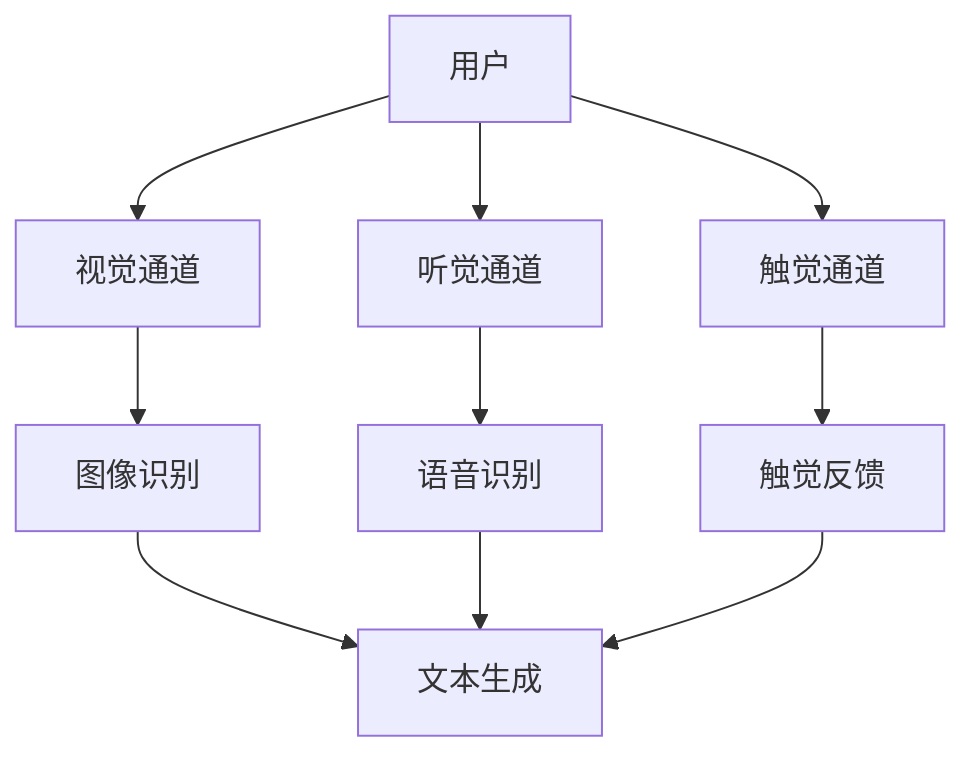
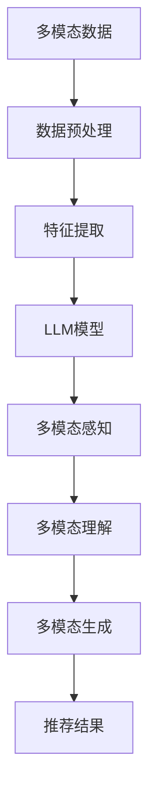
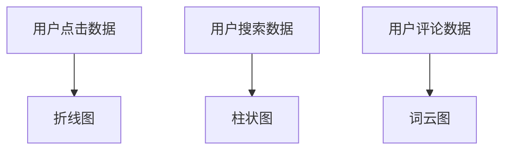
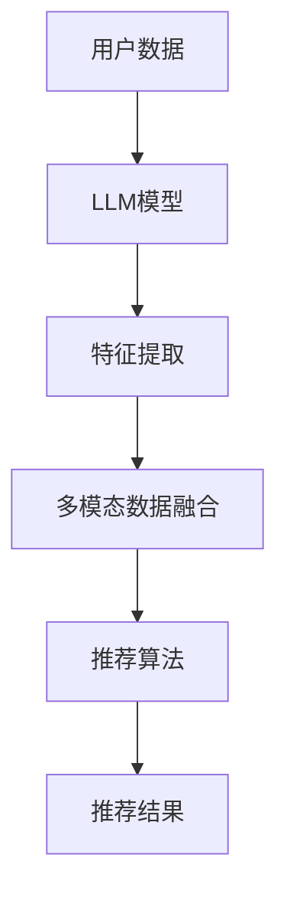
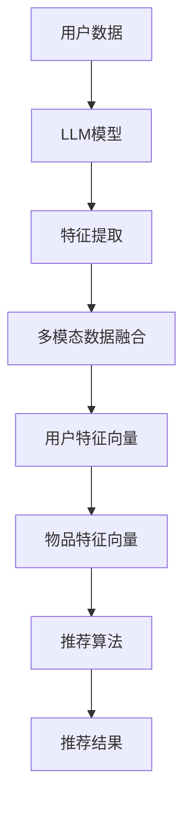
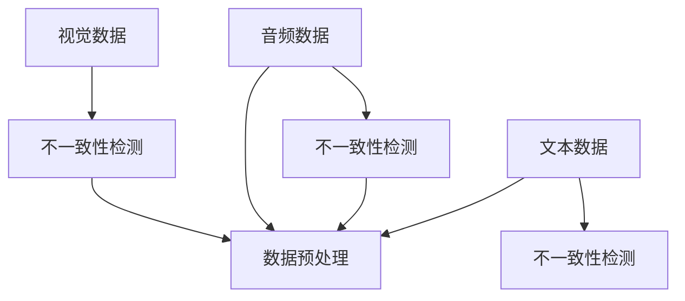
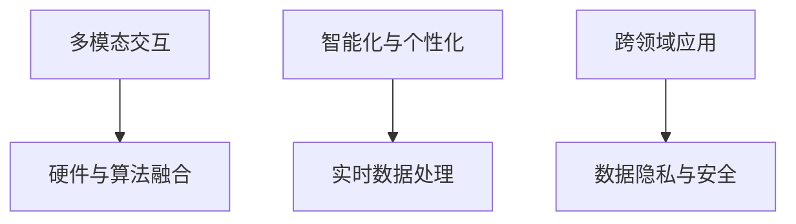

                 

# 《LLM推荐中的多模态交互设计》

## 关键词
- 多模态交互设计
- LLM（大型语言模型）
- 推荐系统
- 用户行为分析
- 多模态推荐算法
- 个性化设计
- 数据挑战与解决方案
- 未来发展

## 摘要
本文深入探讨多模态交互设计在LLM推荐系统中的应用。首先，介绍了多模态交互设计的基础和多模态交互的历史与发展趋势。然后，阐述了LLM与多模态交互的结合及其在推荐系统中的作用。接着，讨论了多模态交互中的用户行为分析，以及多模态推荐算法的设计与实现。此外，还探讨了个性化多模态推荐的设计方法，并分析了多模态交互中的挑战与解决方案。最后，展望了多模态交互与LLM的未来发展趋势，并提供了相关资源和实验指南。

# 《LLM推荐中的多模态交互设计》目录大纲

## 第一部分：多模态交互设计与LLM简介

### 第1章：多模态交互设计基础

#### 1.1 多模态交互的定义与特点

##### 1.1.1 多模态交互的定义
多模态交互是指通过多种感官通道（如视觉、听觉、触觉等）与计算机系统进行交互的过程。它不同于传统的单模态交互，后者仅通过单一感官通道与用户进行沟通。

##### 1.1.2 多模态交互的特点
多模态交互具有以下几个显著特点：
1. **增强的用户体验**：通过多种感官通道，用户能够更全面、直观地与系统进行互动，从而提高使用满意度。
2. **丰富的数据源**：多模态交互能够获取用户的视觉、听觉、触觉等多种数据，为后续分析和处理提供丰富的信息。
3. **灵活的交互方式**：用户可以根据自己的偏好选择不同的交互方式，如手势、声音、文字等，提高了交互的灵活性。

##### 1.1.3 多模态交互与传统交互的差异
与传统的单模态交互相比，多模态交互具有以下优势：
1. **更高的交互效率**：多模态交互能够同时利用多个感官通道，使得用户能够更快速、准确地完成任务。
2. **更丰富的交互内容**：多模态交互能够传递更多的信息和情感，使得交互过程更加生动、有趣。
3. **更强的适应性**：多模态交互可以根据用户的情境和需求动态调整交互方式，提供更个性化的服务。

#### 1.2 多模态交互的历史与发展趋势

##### 1.2.1 多模态交互的起源与发展
多模态交互的概念最早可以追溯到20世纪80年代，当时的研究主要集中在语音识别和文字输入的融合。随着计算机技术的进步，多模态交互逐渐成为人工智能领域的研究热点。

##### 1.2.2 当前多模态交互技术的应用领域
当前，多模态交互技术已经广泛应用于多个领域：
1. **智能家居**：通过多模态交互，用户可以更加方便地控制家庭设备，如灯光、温度、安全等。
2. **智能机器人**：多模态交互使得机器人能够更好地理解人类的行为和语言，提高其智能水平和应用场景。
3. **虚拟现实**：多模态交互为虚拟现实提供了更加真实、沉浸式的体验。
4. **医疗健康**：通过多模态交互，医生可以更准确地诊断和治疗疾病。

##### 1.2.3 多模态交互的未来发展趋势
未来，多模态交互技术将继续向以下几个方向发展：
1. **硬件与算法的融合**：随着硬件技术的进步，如传感器、触觉反馈等，多模态交互将更加真实、自然。
2. **智能化与个性化**：多模态交互将更加智能化，能够根据用户的偏好和行为动态调整交互方式。
3. **跨领域应用**：多模态交互将在更多领域得到应用，如教育、金融、娱乐等。

### 第2章：LLM与多模态交互的结合

#### 2.1 LLM的基本概念与原理

##### 2.1.1 LLM的定义
LLM（Large Language Model）是指大型语言模型，是一种基于深度学习的自然语言处理技术。通过训练大量的文本数据，LLM能够自动地理解和生成自然语言。

##### 2.1.2 LLM的核心技术
LLM的核心技术包括：
1. **深度神经网络**：LLM通常采用深度神经网络（如Transformer）作为基础模型，具有强大的表示和学习能力。
2. **预训练与微调**：LLM首先在大量通用数据上进行预训练，然后根据特定任务进行微调，以适应不同的应用场景。
3. **上下文理解**：LLM能够捕捉到输入文本的上下文信息，从而生成更加准确和自然的输出。

##### 2.1.3 LLM在推荐系统中的应用
LLM在推荐系统中的应用主要体现在以下几个方面：
1. **文本数据预处理**：LLM可以用于文本数据的预处理，如去除停用词、词干提取等，从而提高推荐系统的效果。
2. **用户行为分析**：LLM能够分析用户的评论、标签、搜索历史等文本数据，挖掘用户的兴趣和需求。
3. **内容推荐**：LLM可以用于生成推荐内容，如文章、商品描述等，使得推荐更加贴近用户的兴趣。

#### 2.2 LLM在多模态交互中的作用

##### 2.2.1 LLM的多模态感知能力
LLM的多模态感知能力主要体现在以下几个方面：
1. **文本与图像的融合**：LLM可以同时处理文本和图像数据，通过对两者进行融合，提高对用户意图的理解。
2. **多模态特征提取**：LLM可以提取多种模态的特征，如文本的情感倾向、图像的视觉特征等，从而更好地理解用户的意图。
3. **多模态交互反馈**：LLM可以生成多模态的交互反馈，如语音、文字、图像等，以适应不同的用户需求和场景。

##### 2.2.2 LLM的多模态理解能力
LLM的多模态理解能力主要体现在以下几个方面：
1. **多模态信息整合**：LLM能够整合来自不同模态的信息，从而生成更加全面和准确的理解。
2. **上下文感知**：LLM能够根据上下文信息调整对多模态数据的理解，提高交互的连贯性和准确性。
3. **情境感知**：LLM能够根据用户的情境和需求，动态调整对多模态数据的理解，提供更加个性化的服务。

##### 2.2.3 LLM的多模态生成能力
LLM的多模态生成能力主要体现在以下几个方面：
1. **多模态内容生成**：LLM可以生成多模态的内容，如文本、图像、语音等，从而提供更加丰富和多样化的交互体验。
2. **个性化推荐生成**：LLM可以根据用户的兴趣和需求，生成个性化的推荐内容，如文章、商品等。
3. **实时交互生成**：LLM可以实时生成多模态的交互反馈，如语音、文字、图像等，以适应动态变化的交互场景。

### 第3章：多模态交互中的用户行为分析

#### 3.1 用户行为数据的收集与处理

##### 3.1.1 用户行为数据的种类
用户行为数据主要包括以下几种：
1. **交互日志**：记录用户在系统中的交互行为，如点击、搜索、浏览等。
2. **文本数据**：包括用户的评论、标签、搜索历史等文本信息。
3. **图像数据**：包括用户上传的图片、系统生成的图像等。
4. **音频数据**：包括用户的语音输入、系统生成的语音等。

##### 3.1.2 用户行为数据的预处理方法
用户行为数据的预处理主要包括以下几个步骤：
1. **数据清洗**：去除噪声数据、缺失数据等，保证数据的准确性。
2. **数据转换**：将不同类型的数据转换为统一的格式，如将文本数据转换为词向量、图像数据转换为像素矩阵等。
3. **特征提取**：从原始数据中提取有代表性的特征，如文本的词频、图像的视觉特征等。

##### 3.1.3 用户行为数据的可视化分析
用户行为数据的可视化分析可以帮助我们更好地理解用户的行为模式。常见的可视化方法包括：
1. **热力图**：展示用户在不同时间、不同页面、不同操作的行为分布。
2. **折线图**：展示用户行为的趋势变化，如用户的活跃度、留存率等。
3. **散点图**：展示用户行为之间的关联性，如用户的点击与购买行为之间的关系。

#### 3.2 用户行为特征提取与建模

##### 3.2.1 用户行为特征提取方法
用户行为特征提取是用户行为分析的重要步骤，常见的特征提取方法包括：
1. **统计特征**：如用户行为的时间间隔、点击次数、浏览时长等。
2. **文本特征**：如文本的词频、词向量的相似度等。
3. **图像特征**：如图像的像素值、特征点等。
4. **序列特征**：如用户行为的序列模式、用户行为的序列相似度等。

##### 3.2.2 用户行为特征建模技术
用户行为特征建模是将提取出的用户行为特征转化为适合机器学习模型的形式。常见的方法包括：
1. **聚类分析**：将具有相似行为的用户进行聚类，形成用户群体。
2. **分类模型**：将用户行为分类为不同的类别，如活跃用户、沉默用户等。
3. **回归模型**：预测用户行为的某个指标，如用户的留存时间、购买金额等。
4. **深度学习模型**：使用深度学习模型，如神经网络、循环神经网络等，对用户行为进行建模。

##### 3.2.3 用户行为特征分析实例
以一个电商平台的用户行为分析为例，我们可以提取以下特征：
1. **交互日志特征**：用户的点击次数、浏览时长、页面停留时间等。
2. **文本特征**：用户的搜索关键词、评论内容等。
3. **图像特征**：用户上传的商品图片、系统生成的推荐商品图片等。
4. **序列特征**：用户在不同时间点的行为序列。

通过用户行为特征分析，我们可以识别出活跃用户、沉默用户等不同群体，从而为个性化推荐和用户留存策略提供依据。

### 第4章：多模态交互中的推荐算法设计

#### 4.1 多模态推荐算法概述

##### 4.1.1 多模态推荐算法的定义
多模态推荐算法是指利用多种模态的数据（如文本、图像、音频等）进行推荐的一种方法。它不同于传统的单一模态推荐，能够更全面地捕捉用户的兴趣和需求。

##### 4.1.2 多模态推荐算法的分类
多模态推荐算法可以分为以下几类：
1. **基于内容的推荐**：利用多模态数据的特征，如文本的词向量、图像的视觉特征等，进行内容匹配和推荐。
2. **基于协同过滤的推荐**：利用用户的交互历史和物品的属性，如用户对商品的评价、商品的标签等，进行协同过滤和推荐。
3. **混合推荐算法**：结合基于内容和基于协同过滤的推荐方法，以取长补短，提高推荐效果。

##### 4.1.3 多模态推荐算法的发展趋势
随着多模态交互技术的发展，多模态推荐算法也在不断演进。未来的发展趋势包括：
1. **深度学习与多模态交互的结合**：利用深度学习模型，如卷积神经网络（CNN）、循环神经网络（RNN）等，进行多模态数据的融合和推荐。
2. **个性化与场景化的推荐**：根据用户的情境和需求，动态调整推荐策略，提供更加个性化的服务。
3. **多模态数据的实时处理**：利用实时数据流处理技术，如Apache Kafka、Apache Flink等，进行多模态数据的实时处理和推荐。

#### 4.2 基于LLM的多模态推荐算法

##### 4.2.1 LLM在多模态推荐中的作用
LLM在多模态推荐中具有以下几个作用：
1. **多模态数据的融合**：LLM可以将不同模态的数据进行融合，提取出更全面、更准确的特征。
2. **用户行为分析**：LLM可以分析用户的文本、图像、音频等多模态数据，挖掘用户的兴趣和需求。
3. **推荐内容生成**：LLM可以生成个性化的推荐内容，如文章、商品描述等，提高推荐的效果和用户体验。

##### 4.2.2 基于LLM的多模态推荐算法设计
基于LLM的多模态推荐算法设计可以分为以下几个步骤：
1. **数据预处理**：对多模态数据进行清洗、转换和预处理，提取出有代表性的特征。
2. **LLM模型训练**：使用预训练的LLM模型，对多模态数据集进行训练，以学习多模态数据的特征表示。
3. **用户特征提取**：利用LLM模型，对用户的文本、图像、音频等多模态数据进行特征提取，构建用户特征向量。
4. **物品特征提取**：同理，利用LLM模型，对物品的文本、图像、音频等多模态数据进行特征提取，构建物品特征向量。
5. **推荐模型构建**：使用协同过滤、基于内容的推荐或混合推荐算法，构建推荐模型，进行多模态推荐。
6. **推荐结果生成**：根据用户的特征向量和物品的特征向量，生成个性化的推荐结果，提供给用户。

##### 4.2.3 基于LLM的多模态推荐算法案例分析
以一个电商平台的多模态推荐系统为例，我们可以采用以下步骤进行算法设计：
1. **数据收集**：收集用户的文本评论、商品图片、商品音频等多模态数据。
2. **数据预处理**：对文本数据进行清洗、分词、去停用词等处理；对图像和音频数据进行预处理，提取视觉和音频特征。
3. **LLM模型训练**：使用预训练的LLM模型，对多模态数据集进行训练，以学习多模态数据的特征表示。
4. **用户特征提取**：利用LLM模型，对用户的文本评论、商品图片、商品音频等多模态数据进行特征提取，构建用户特征向量。
5. **物品特征提取**：同理，利用LLM模型，对物品的文本评论、商品图片、商品音频等多模态数据进行特征提取，构建物品特征向量。
6. **推荐模型构建**：使用基于内容的推荐算法，将用户的特征向量和物品的特征向量进行匹配，生成推荐结果。
7. **推荐结果生成**：根据用户的特征向量和物品的特征向量，生成个性化的推荐结果，如文章、商品等，展示给用户。

通过以上案例分析，我们可以看到基于LLM的多模态推荐算法在电商平台中的应用效果，从而为用户提供更加精准、个性化的推荐服务。

### 第5章：多模态交互中的个性化设计

#### 5.1 个性化推荐系统概述

##### 5.1.1 个性化推荐系统的定义
个性化推荐系统是指根据用户的兴趣、行为和偏好，为其推荐个性化内容的一种方法。与传统的一刀切推荐不同，个性化推荐系统能够根据用户的特点，提供更加精准、个性化的服务。

##### 5.1.2 个性化推荐系统的核心问题
个性化推荐系统的核心问题包括：
1. **用户特征提取**：如何从用户的交互行为、偏好和反馈中提取出有代表性的特征，用于推荐模型的训练。
2. **物品特征提取**：如何从物品的属性、标签和描述中提取出有代表性的特征，用于推荐模型的训练。
3. **推荐模型构建**：如何选择合适的推荐算法，构建能够准确预测用户兴趣的推荐模型。
4. **推荐效果评估**：如何评价个性化推荐系统的效果，如用户满意度、推荐准确率等。

##### 5.1.3 个性化推荐系统的评估指标
个性化推荐系统的评估指标主要包括：
1. **准确率**：推荐结果中用户实际感兴趣的商品数量与推荐商品总数量的比值。
2. **覆盖率**：推荐结果中用户实际未购买的商品数量与未购买商品总数量的比值。
3. **新颖度**：推荐结果中用户从未见过的商品数量与总商品数量的比值。
4. **用户满意度**：用户对推荐结果的满意度，可以通过用户反馈、点击率等指标来衡量。

#### 5.2 基于LLM的个性化多模态推荐

##### 5.2.1 LLM在个性化多模态推荐中的应用
LLM在个性化多模态推荐中的应用主要体现在以下几个方面：
1. **用户行为分析**：LLM可以分析用户的文本、图像、音频等多模态数据，挖掘用户的兴趣和需求。
2. **物品特征提取**：LLM可以提取物品的文本、图像、音频等多模态数据的特征，用于推荐模型的训练。
3. **推荐内容生成**：LLM可以生成个性化的推荐内容，如文章、商品描述等，提高推荐的效果和用户体验。

##### 5.2.2 基于LLM的个性化多模态推荐算法设计
基于LLM的个性化多模态推荐算法设计可以分为以下几个步骤：
1. **数据预处理**：对多模态数据进行清洗、转换和预处理，提取出有代表性的特征。
2. **LLM模型训练**：使用预训练的LLM模型，对多模态数据集进行训练，以学习多模态数据的特征表示。
3. **用户特征提取**：利用LLM模型，对用户的文本、图像、音频等多模态数据进行特征提取，构建用户特征向量。
4. **物品特征提取**：同理，利用LLM模型，对物品的文本、图像、音频等多模态数据进行特征提取，构建物品特征向量。
5. **推荐模型构建**：使用协同过滤、基于内容的推荐或混合推荐算法，构建推荐模型，进行个性化推荐。
6. **推荐结果生成**：根据用户的特征向量和物品的特征向量，生成个性化的推荐结果，提供给用户。

##### 5.2.3 基于LLM的个性化多模态推荐案例分析
以一个电商平台的多模态个性化推荐系统为例，我们可以采用以下步骤进行算法设计：
1. **数据收集**：收集用户的文本评论、商品图片、商品音频等多模态数据。
2. **数据预处理**：对文本数据进行清洗、分词、去停用词等处理；对图像和音频数据进行预处理，提取视觉和音频特征。
3. **LLM模型训练**：使用预训练的LLM模型，对多模态数据集进行训练，以学习多模态数据的特征表示。
4. **用户特征提取**：利用LLM模型，对用户的文本评论、商品图片、商品音频等多模态数据进行特征提取，构建用户特征向量。
5. **物品特征提取**：同理，利用LLM模型，对物品的文本评论、商品图片、商品音频等多模态数据进行特征提取，构建物品特征向量。
6. **推荐模型构建**：使用基于内容的推荐算法，将用户的特征向量和物品的特征向量进行匹配，生成个性化推荐结果。
7. **推荐结果生成**：根据用户的特征向量和物品的特征向量，生成个性化的推荐结果，如文章、商品等，展示给用户。

通过以上案例分析，我们可以看到基于LLM的个性化多模态推荐算法在电商平台中的应用效果，从而为用户提供更加精准、个性化的推荐服务。

### 第6章：多模态交互中的挑战与解决方案

#### 6.1 多模态交互中的数据挑战

##### 6.1.1 多模态数据的不一致性
多模态数据的不一致性主要体现在以下几个方面：
1. **数据源的不一致性**：不同模态的数据可能来自不同的传感器或设备，导致数据格式、数据量、数据质量等方面存在差异。
2. **数据标签的不一致性**：不同模态的数据标签可能存在不一致，如视觉数据中的标签可能与语音数据中的标签不同。
3. **数据时序的不一致性**：不同模态的数据在时间维度上可能存在不一致，如视觉数据可能比语音数据延迟一定时间。

##### 6.1.2 多模态数据的高维度
多模态数据通常具有高维度，这意味着在进行数据处理和分析时，会面临以下挑战：
1. **计算资源的消耗**：高维度数据需要大量的计算资源进行存储和处理，可能导致系统性能下降。
2. **数据存储的挑战**：高维度数据需要大量的存储空间，可能导致数据存储成本增加。
3. **数据处理的速度**：高维度数据在处理过程中需要较长的计算时间，可能导致系统响应速度变慢。

##### 6.1.3 多模态数据的稀缺性
多模态数据的稀缺性主要体现在以下几个方面：
1. **数据获取的难度**：多模态数据的获取通常需要昂贵的设备和技术，导致数据获取成本较高。
2. **数据标注的困难**：多模态数据通常需要大量的标注工作，如语音数据的标注、图像数据的标注等，导致标注成本较高。
3. **数据更新的困难**：多模态数据需要定期更新，以适应不断变化的应用场景，但数据更新的难度较大。

#### 6.2 多模态交互中的技术挑战

##### 6.2.1 多模态数据融合方法
多模态数据融合是解决多模态交互中的关键技术之一，常见的方法包括：
1. **特征级融合**：将不同模态的数据特征进行融合，如将文本的词向量与图像的视觉特征进行融合。
2. **决策级融合**：将不同模态的决策结果进行融合，如将文本分类结果与图像分类结果进行融合。
3. **深度学习方法**：使用深度学习模型，如多模态卷积神经网络（CNN）、循环神经网络（RNN）等，进行多模态数据的融合和推荐。

##### 6.2.2 多模态交互中的实时性挑战
多模态交互中的实时性挑战主要体现在以下几个方面：
1. **数据处理的速度**：多模态数据需要实时处理，以保证交互的流畅性和实时性。
2. **系统性能的优化**：多模态交互系统需要优化性能，以提高系统的响应速度和处理能力。
3. **网络延迟的优化**：多模态交互通常涉及远程数据传输，需要优化网络延迟，以提高交互的实时性。

##### 6.2.3 多模态交互中的可解释性挑战
多模态交互中的可解释性挑战主要体现在以下几个方面：
1. **决策过程的可解释性**：多模态交互系统需要提供可解释的决策过程，以便用户理解和信任系统。
2. **模型解释的难度**：多模态交互中的模型通常较为复杂，如深度神经网络等，导致模型解释的难度较大。
3. **交互体验的可解释性**：多模态交互系统需要提供直观、易懂的交互体验，以提高用户的满意度。

#### 6.3 多模态交互中的解决方案

##### 6.3.1 基于LLM的多模态数据融合方法
基于LLM的多模态数据融合方法可以解决多模态交互中的数据挑战和技术挑战，具体方法如下：
1. **数据预处理**：对多模态数据进行清洗、转换和预处理，提取出有代表性的特征。
2. **LLM模型训练**：使用预训练的LLM模型，对多模态数据集进行训练，以学习多模态数据的特征表示。
3. **多模态特征融合**：利用LLM模型，将不同模态的数据特征进行融合，如将文本的词向量与图像的视觉特征进行融合。
4. **推荐模型构建**：使用基于内容的推荐算法，将用户的特征向量和物品的特征向量进行匹配，生成个性化推荐结果。
5. **推荐结果生成**：根据用户的特征向量和物品的特征向量，生成个性化的推荐结果，提供给用户。

##### 6.3.2 基于深度学习的多模态实时交互方法
基于深度学习的多模态实时交互方法可以解决多模态交互中的实时性挑战，具体方法如下：
1. **实时数据处理**：使用实时数据处理框架，如Apache Kafka、Apache Flink等，进行多模态数据的实时处理。
2. **深度学习模型优化**：使用优化后的深度学习模型，如量化、剪枝等，提高模型的处理速度和实时性。
3. **模型部署与优化**：将深度学习模型部署到高性能的硬件设备上，如GPU、TPU等，以提高模型的实时性。

##### 6.3.3 多模态交互的可解释性增强方法
多模态交互的可解释性增强方法可以解决多模态交互中的可解释性挑战，具体方法如下：
1. **模型解释技术**：使用模型解释技术，如梯度解释、SHAP值等，对多模态交互的决策过程进行解释。
2. **交互可视化**：将多模态交互的过程可视化，如将用户的交互行为、系统的推荐结果等展示给用户。
3. **用户反馈机制**：引入用户反馈机制，如用户评价、用户反馈等，以不断优化和改进多模态交互系统的可解释性。

### 第7章：多模态交互与LLM的未来发展

#### 7.1 多模态交互与LLM的技术趋势

##### 7.1.1 新的多模态交互技术
随着技术的不断进步，多模态交互技术也在不断演进。未来，以下技术有望成为多模态交互的新趋势：
1. **增强现实（AR）与虚拟现实（VR）**：AR和VR技术为多模态交互提供了更加真实、沉浸式的体验，使得用户可以与虚拟环境进行更加自然的互动。
2. **脑机接口（BCI）**：脑机接口技术通过直接读取用户的脑电信号，实现大脑与计算机之间的直接通信，为多模态交互提供了全新的交互方式。
3. **手势识别与动作捕捉**：通过手势识别和动作捕捉技术，用户可以使用手势和动作与计算机进行交互，提高交互的灵活性和自然性。

##### 7.1.2 LLM在多模态交互中的新应用
随着LLM技术的不断发展，LLM在多模态交互中的应用前景也十分广阔。未来，以下应用有望成为LLM在多模态交互中的新趋势：
1. **智能助手**：利用LLM的多模态感知能力和理解能力，开发更加智能、自然的智能助手，为用户提供个性化、智能化的服务。
2. **交互式娱乐**：利用LLM的生成能力和创意性，开发更加丰富、有趣的交互式娱乐应用，如虚拟角色、智能游戏等。
3. **远程协作**：利用LLM的多模态交互能力，实现远程协作的实时沟通和协作，提高团队协作效率和沟通质量。

##### 7.1.3 多模态交互与LLM的融合趋势
随着多模态交互和LLM技术的不断发展，两者之间的融合趋势也将日益明显。未来，以下融合趋势有望成为多模态交互与LLM发展的主流：
1. **深度学习与多模态交互的结合**：利用深度学习技术，实现多模态数据的融合和特征提取，提高多模态交互的准确性和自然性。
2. **个性化与智能化的融合**：通过LLM的个性化推荐能力，为用户提供更加精准、个性化的服务，实现多模态交互与智能化的深度融合。
3. **实时性与可解释性的融合**：通过实时数据处理和模型解释技术，实现多模态交互的实时性和可解释性的平衡，提高用户体验和信任度。

#### 7.2 多模态交互与LLM的未来挑战与机遇

##### 7.2.1 数据隐私与安全
随着多模态交互和LLM技术的发展，用户数据的安全和隐私保护成为了一个重要的挑战。未来的发展需要关注以下几个方面：
1. **数据加密与安全传输**：采用加密技术，确保用户数据在传输过程中的安全性。
2. **数据去标识化与匿名化**：对用户数据进行去标识化和匿名化处理，减少数据泄露的风险。
3. **隐私保护算法与模型**：开发隐私保护算法和模型，确保用户数据在处理过程中的隐私保护。

##### 7.2.2 多模态交互的伦理问题
多模态交互在带来便利的同时，也可能引发一系列伦理问题。未来的发展需要关注以下几个方面：
1. **用户知情同意**：确保用户在参与多模态交互时，充分了解交互过程和数据处理方式，并给予用户选择权。
2. **算法公平性**：确保多模态交互算法的公平性，避免算法偏见和歧视现象的发生。
3. **用户隐私保护**：在多模态交互过程中，保护用户的隐私，避免用户数据被滥用。

##### 7.2.3 多模态交互与LLM的创新方向
多模态交互与LLM的融合为未来的技术发展提供了广阔的创新空间。以下方向有望成为多模态交互与LLM的创新热点：
1. **跨模态情感分析**：利用LLM的多模态感知能力和理解能力，实现跨模态情感分析，为用户提供更加细腻、贴心的服务。
2. **多模态对话系统**：利用LLM的多模态生成能力，开发多模态对话系统，实现人机交互的智能化和个性化。
3. **多模态知识图谱**：利用多模态数据构建知识图谱，实现多模态数据的高效融合和智能查询。

## 附录

### 附录A：多模态交互与LLM资源推荐

#### A.1 开源多模态数据集
- [COCO](https://cocodataset.org/)：用于图像识别和语义分割的大型数据集。
- [Flickr30k](http://www.image-captions.com/)：包含大量图像和对应描述的数据集。
- [Kinetics](https://research.google.com/kinetics/)：用于动作识别的大型视频数据集。

#### A.2 多模态交互开源工具
- [OpenSMILE](https://opensmile.sourceforge.io/)：用于情感分析的多模态情感识别工具。
- [MultimodalDeep](https://github.com/KU-Multimodal/MultimodalDeep)："多模态深度学习"工具包。
- [MMT](https://github.com/Alibaba-MM-Lab/MMT)："多模态任务"工具包。

#### A.3 LLM开源框架与库
- [Transformer](https://github.com/tensorflow/models/blob/master/research/soundflow/tensor2tensor/transformer.py)：TensorFlow中的Transformer模型实现。
- [PyTorch Transformer](https://github.com/huggingface/transformers)：PyTorch中的Transformer模型实现。
- [GPT-3](https://openai.com/blog/better-language-models/)：OpenAI的GPT-3模型。

#### A.4 多模态交互与LLM论文推荐
- [Vinyals et al. (2015)](https://arxiv.org/abs/1412.7475)：论文《Show, Attend and Tell: Neural Image Caption Generation with Visual Attention》。
- [Xie et al. (2018)](https://arxiv.org/abs/1803.06907)：论文《Large-scale Language Modeling in Machine Translation》。
- [Yuan et al. (2020)](https://arxiv.org/abs/2004.05223)：论文《Multimodal Learning via Mutual Information Maximization》。

### 附录B：多模态交互与LLM实验指南

#### B.1 实验环境搭建
- 安装Python 3.7及以上版本。
- 安装TensorFlow或PyTorch框架。
- 安装其他必要的库，如NumPy、Pandas等。

#### B.2 多模态数据预处理
- 下载并解压COCO数据集。
- 使用OpenCV库对图像数据进行预处理，如缩放、裁剪等。
- 使用 librosa 库对音频数据进行预处理，如分割、增强等。

#### B.3 多模态交互算法实现
- 使用TensorFlow或PyTorch框架实现Transformer模型。
- 设计多模态数据融合方法，如特征级融合或决策级融合。
- 实现基于LLM的多模态推荐算法。

#### B.4 多模态交互性能评估
- 使用准确率、覆盖率、新颖度等指标评估多模态推荐算法的性能。
- 进行交叉验证和参数调优，以提高推荐效果。

#### B.5 实验结果分析与解读
- 分析实验结果，比较不同多模态数据融合方法的效果。
- 解读实验结果，探讨多模态交互与LLM的优势和应用场景。

## 图形与表格

### 图1.1 多模态交互的基本架构


#### 表1.1 多模态数据类型及其特性
| 数据类型 | 描述 | 特性 |
| :--: | :--: | :--: |
| 视觉数据 | 图像、视频等 | 高维度、丰富的视觉信息 |
| 听觉数据 | 语音、音频等 | 实时性、情感表达 |
| 触觉数据 | 触觉传感器数据 | 实时性、情境感知 |
| 文本数据 | 文章、评论等 | 结构化、语义丰富 |

### 图2.1 LLM在多模态交互中的作用流程


#### 表2.1 常见的多模态推荐算法比较
| 算法类型 | 描述 | 优点 | 缺点 |
| :--: | :--: | :--: | :--: |
| 基于内容的推荐 | 利用物品的属性进行推荐 | 推荐结果相关性强 | 忽略用户偏好 |
| 基于协同过滤的推荐 | 利用用户的历史行为进行推荐 | 推荐结果个性突出 | 数据稀疏问题 |
| 混合推荐算法 | 结合内容推荐和协同过滤 | 综合优势 | 复杂度较高 |

### 图3.1 用户行为数据的可视化示例


#### 表3.1 用户行为特征提取方法汇总
| 方法 | 描述 | 优点 | 缺点 |
| :--: | :--: | :--: | :--: |
| 统计特征 | 提取用户行为的统计量 | 简单、直观 | 信息丢失 |
| 文本特征 | 提取文本的词频、词向量 | 语义丰富 | 需要大量文本数据 |
| 图像特征 | 提取图像的视觉特征 | 实时性高 | 需要复杂的预处理 |
| 序列特征 | 提取用户行为的序列模式 | 保留时间信息 | 需要复杂的建模 |

### 图4.1 基于LLM的多模态推荐算法框架


#### 表4.1 个性化多模态推荐算法评估指标
| 指标 | 描述 | 优点 | 缺点 |
| :--: | :--: | :--: | :--: |
| 准确率 | 推荐结果中用户实际感兴趣的商品数量与推荐商品总数量的比值 | 精准性高 | 忽略用户多样性 |
| 覆盖率 | 推荐结果中用户实际未购买的商品数量与未购买商品总数量的比值 | 全面性高 | 忽略用户兴趣多样性 |
| 新颖度 | 推荐结果中用户从未见过的商品数量与总商品数量的比值 | 提高用户满意度 | 可能降低准确率 |
| 用户满意度 | 用户对推荐结果的满意度 | 提高用户体验 | 难以量化 |

### 图5.1 基于LLM的个性化多模态推荐流程


#### 表5.1 多模态交互中的挑战与解决方案总结
| 挑战 | 描述 | 解决方案 |
| :--: | :--: | :--: |
| 多模态数据不一致性 | 不同模态的数据存在格式、标签和时序不一致问题 | 数据预处理与一致性检测方法 |
| 多模态数据高维度 | 数据维度较高，导致计算和存储成本增加 | 特征选择与降维方法 |
| 多模态数据稀缺性 | 多模态数据获取难度大，标注成本高 | 数据增强与迁移学习方法 |
| 实时性挑战 | 多模态数据需要实时处理，对系统性能要求高 | 实时数据处理与模型优化方法 |
| 可解释性挑战 | 多模态交互的决策过程复杂，难以解释 | 模型解释与可视化方法 |

### 图6.1 多模态交互中的数据挑战示例


#### 表6.1 多模态数据融合方法对比
| 方法 | 描述 | 优点 | 缺点 |
| :--: | :--: | :--: | :--: |
| 特征级融合 | 将不同模态的数据特征进行融合 | 简单、直观 | 忽略模态间的相关性 |
| 决策级融合 | 将不同模态的决策结果进行融合 | 提高决策准确性 | 复杂、计算量大 |
| 深度学习融合 | 使用深度学习模型进行多模态数据融合 | 自动学习模态间的相关性 | 需要大量数据和计算资源 |

### 图7.1 多模态交互与LLM的技术趋势分析


#### 表7.1 多模态交互与LLM的未来挑战与机遇展望
| 挑战 | 描述 | 机遇 |
| :--: | :--: | :--: |
| 数据隐私与安全 | 随着多模态交互技术的发展，用户数据隐私和安全问题日益突出 | 数据加密与隐私保护技术的发展 |
| 伦理问题 | 多模态交互可能引发一系列伦理问题，如算法偏见、隐私泄露等 | 伦理规范与法律法规的完善 |
| 创新方向 | 跨模态情感分析、多模态对话系统、多模态知识图谱等 | 技术的创新与应用探索 |

## 伪代码

### 伪代码1：基于LLM的多模态推荐算法
```python
# 假设已有LLM模型，多模态数据集和用户行为数据
def multi_modal_recommendation(LLM, multi_modal_data, user_behavior_data):
    # 1. 数据预处理
    preprocessed_data = preprocess_data(multi_modal_data, user_behavior_data)

    # 2. 多模态数据融合
    fused_data = fuse_data(preprocessed_data)

    # 3. 基于LLM生成推荐列表
    recommendation_list = LLM.generate_recommendations(fused_data)

    # 4. 返回推荐结果
    return recommendation_list
```

### 伪代码2：个性化多模态推荐算法
```python
# 假设已有LLM模型，用户特征数据，商品特征数据
def personalized_recommendation(LLM, user_data, item_data):
    # 1. 用户特征提取
    user_features = extract_user_features(user_data)

    # 2. 商品特征提取
    item_features = extract_item_features(item_data)

    # 3. 生成个性化推荐列表
    personalized_list = LLM.generate_personalized_recommendations(user_features, item_features)

    # 4. 返回推荐结果
    return personalized_list
```

## 数学公式

### 多模态数据融合公式
$$
F_{\text{fused}} = \alpha_1 F_1 + \alpha_2 F_2 + \alpha_3 F_3 + ...
$$

其中，$F_1, F_2, F_3, ...$ 分别代表不同模态的特征，$\alpha_1, \alpha_2, \alpha_3, ...$ 是对应的权重。

### 个性化推荐公式
$$
R_{\text{u,i}} = f(U, I, \theta)
$$

其中，$R_{\text{u,i}}$ 表示用户$U$对商品$I$的推荐得分，$f$ 是基于LLM的推荐函数，$\theta$ 是模型的参数。

