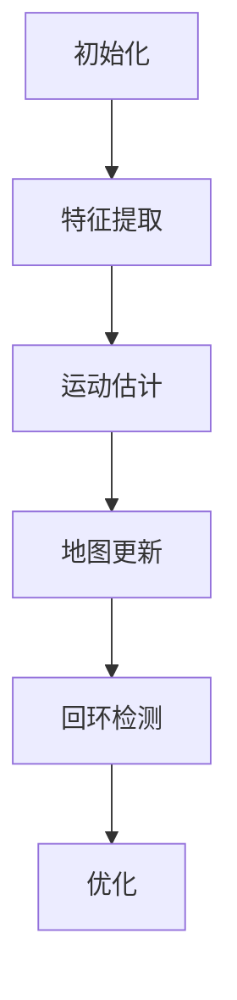

                 

# 《OPPO2024校招AR眼镜SLAM算法工程师技术面试》

> **关键词：** AR眼镜，SLAM算法，面试准备，技术面试，校招，算法工程师

> **摘要：** 本文旨在为OPPO 2024校招AR眼镜SLAM算法工程师准备面试提供全面的技术指导和策略建议。通过深入分析SLAM算法原理、实现、优化，以及面试准备和实战练习，帮助应聘者全面掌握面试所需的知识和技能。

## 目录大纲

### 第一部分：AR眼镜SLAM算法基础

### 第二部分：AR眼镜SLAM算法实现

### 第三部分：OPPO2024校招AR眼镜SLAM算法工程师面试准备

### 第四部分：总结与展望

---

### 第一部分：AR眼镜SLAM算法基础

## 第1章：SLAM算法基础

### 第1.1节：SLAM算法简介

SLAM（Simultaneous Localization and Mapping）即同时定位与地图构建，是计算机视觉与机器人领域的一个重要研究方向。SLAM算法旨在同时估计一个移动平台的位姿（位置和朝向）并构建其运动过程中的环境地图。

#### **1.1.1 SLAM的定义及重要性**

SLAM的核心目标是解决以下问题：

1. **定位**：确定相机相对于已知环境的位置。
2. **地图构建**：构建描述环境的地图。

这两个目标并不是独立进行的，而是相互关联的。定位需要地图提供参考，而地图构建则依赖于定位过程中的观察数据。

SLAM在自动驾驶、机器人导航、增强现实（AR）等多个领域具有广泛的应用。

#### **1.1.2 SLAM的基本原理**

SLAM的基本原理可以概括为以下几个步骤：

1. **初始化**：初始化位姿估计和地图。
2. **特征提取**：从图像中提取具有稳定性的特征点。
3. **运动估计**：利用特征点的变化估计相机运动。
4. **地图更新**：根据相机运动更新地图。
5. **回环检测**：检测并纠正由于传感器噪声或相机运动不确定性导致的定位误差。
6. **优化**：通过最小化定位误差和地图误差进行全局优化。

#### **1.1.3 SLAM的应用场景**

SLAM算法的应用场景包括但不限于：

1. **自动驾驶**：实时构建环境地图并保持定位。
2. **无人机导航**：在未知环境中进行自主导航。
3. **增强现实（AR）**：在现实世界中叠加虚拟物体。
4. **机器人导航**：在室内或室外环境中进行自主导航。
5. **虚拟现实（VR）**：实时生成与真实世界交互的虚拟环境。

### 第1.2节：SLAM算法核心概念

#### **1.2.1 位姿估计**

位姿估计是SLAM算法的核心之一。它涉及将一个移动平台的位置和朝向（称为位姿）表示为坐标系中的向量。常见的位姿估计方法包括基于视觉的位姿估计、基于激光雷达的位姿估计等。

#### **1.2.2 地标检测**

地标检测是指从图像或点云数据中检测出具有稳定性和可重复性的特征点。地标检测是构建地图和进行定位的关键步骤。

#### **1.2.3 视觉里程计**

视觉里程计（Visual SLAM）是利用相机拍摄的图像序列进行位姿估计和地图构建的方法。它依赖于图像的特征提取、特征匹配和优化。

#### **1.2.4 激光雷达里程计**

激光雷达里程计（Lidar SLAM）是利用激光雷达生成的点云数据进行位姿估计和地图构建的方法。激光雷达提供的密集点云数据使得里程计更加精确。

### 第1.3节：SLAM算法类型及优缺点分析

SLAM算法可以根据传感器类型和数据处理方式分为多种类型，每种类型都有其优缺点。

#### **1.3.1 单目SLAM**

单目SLAM利用单目摄像头进行位姿估计和地图构建。它的优点是成本低、易于实现，但缺点是定位精度较低，对光照变化敏感。

#### **1.3.2 双目SLAM**

双目SLAM利用双目摄像头（即两个位置不同的摄像头）进行位姿估计和地图构建。它的优点是定位精度高、稳定性好，但缺点是成本较高、计算复杂度大。

#### **1.3.3 激光雷达SLAM**

激光雷达SLAM利用激光雷达生成的点云数据进行位姿估计和地图构建。它的优点是定位精度高、抗干扰能力强，但缺点是成本高、数据量大。

#### **1.3.4 混合SLAM**

混合SLAM结合了多种传感器（如单目摄像头、双目摄像头、激光雷达）进行位姿估计和地图构建。它的优点是综合了多种传感器的优点，提高了定位精度和稳定性，但缺点是计算复杂度大、系统集成困难。

---

### 第二部分：AR眼镜SLAM算法实现

## 第2章：AR眼镜SLAM算法实现原理

### 第2.1节：AR眼镜概述

#### **2.1.1 AR眼镜的基本原理**

AR（Augmented Reality，增强现实）眼镜通过在真实环境中叠加虚拟信息，使用户能够看到增强过的现实世界。AR眼镜通常由以下几部分组成：

1. **显示模块**：通常采用透明显示屏，将虚拟信息叠加在真实环境中。
2. **传感器模块**：包括摄像头、激光雷达、惯性测量单元（IMU）等，用于感知环境信息。
3. **处理器模块**：负责处理传感器数据、执行SLAM算法等。
4. **交互模块**：通常包括触摸屏、语音识别等，用于用户与AR眼镜的交互。

#### **2.1.2 AR眼镜的硬件组成**

AR眼镜的硬件组成包括：

1. **显示屏**：通常采用微型OLED屏幕，以提供高清晰度和低延迟的显示效果。
2. **摄像头**：用于捕捉真实环境图像，用于SLAM算法的特征提取和匹配。
3. **激光雷达**：用于生成环境点云数据，用于SLAM算法的位姿估计和地图构建。
4. **惯性测量单元**：包括加速度计、陀螺仪等，用于辅助位姿估计。
5. **处理器**：用于执行SLAM算法和实时处理传感器数据。

#### **2.1.3 AR眼镜的软件架构**

AR眼镜的软件架构通常包括以下几个部分：

1. **操作系统**：如Android、iOS等，用于管理硬件资源和运行应用程序。
2. **SLAM算法库**：如ROS（Robot Operating System）、ARCore、Vuforia等，用于执行SLAM算法。
3. **应用层**：包括AR应用程序、游戏等，用于提供用户体验。

### 第2.2节：SLAM算法在AR眼镜中的应用

#### **2.2.1 AR眼镜SLAM的挑战**

AR眼镜SLAM面临以下挑战：

1. **动态环境**：AR眼镜通常在真实环境中使用，环境动态变化，如行人、车辆等。
2. **传感器融合**：AR眼镜通常包含多种传感器，如摄像头、激光雷达、IMU等，需要有效融合多种传感器数据。
3. **实时性能**：AR眼镜需要实时处理传感器数据并更新地图和位姿估计，对实时性能要求高。

#### **2.2.2 SLAM算法在AR眼镜中的实现步骤**

在AR眼镜中实现SLAM算法通常包括以下步骤：

1. **传感器数据预处理**：包括摄像头图像预处理、激光雷达点云预处理等。
2. **特征提取**：从预处理后的传感器数据中提取特征点。
3. **特征匹配**：将当前帧的特征点与历史帧的特征点进行匹配，以估计相机运动。
4. **位姿优化**：利用优化算法（如非线性优化）对位姿进行优化。
5. **地图构建**：根据相机运动和特征点信息构建地图。
6. **回环检测与纠正**：检测回环并纠正累积误差。

#### **2.2.3 AR眼镜SLAM的优势与不足**

**优势：**

1. **实时性**：AR眼镜SLAM能够在实时环境中提供高精度的定位和地图构建。
2. **交互性**：AR眼镜提供了丰富的交互方式，如手势识别、语音识别等，增强了用户体验。
3. **移动性**：AR眼镜能够跟随用户移动，提供无缝的定位和地图构建。

**不足：**

1. **成本较高**：AR眼镜包含多种高性能传感器和处理模块，成本较高。
2. **功耗较大**：AR眼镜需要处理大量传感器数据，功耗较大。
3. **环境适应性**：AR眼镜在复杂环境中可能受到干扰，影响定位精度和稳定性。

---

### 第三部分：OPPO2024校招AR眼镜SLAM算法工程师面试准备

## 第3章：面试准备与策略

### 第3.1节：面试准备要点

#### **3.1.1 技术知识储备**

为了在OPPO 2024校招AR眼镜SLAM算法工程师面试中脱颖而出，以下技术知识是必须掌握的：

1. **计算机视觉基础**：图像处理、特征提取、特征匹配等。
2. **机器人学基础**：位姿估计、传感器融合、路径规划等。
3. **SLAM算法原理**：单目SLAM、双目SLAM、激光雷达SLAM、混合SLAM等。
4. **深度学习基础**：神经网络、卷积神经网络、循环神经网络等。
5. **编程能力**：熟练掌握至少一门编程语言（如C++、Python）。

#### **3.1.2 项目经验梳理**

项目经验是面试中不可或缺的一部分。以下建议有助于梳理项目经验：

1. **项目概述**：简明扼要地介绍项目背景、目标、成果。
2. **技术难点**：详细描述项目中遇到的技术难点、解决方案和实现方法。
3. **成果展示**：展示项目成果，如代码、模型、实验结果等。

#### **3.1.3 面试常见问题与答案准备**

以下是一些常见的面试问题及其答案：

1. **什么是SLAM？**
   SLAM（Simultaneous Localization and Mapping）即同时定位与地图构建，是计算机视觉与机器人领域的一个重要研究方向。

2. **什么是特征提取？**
   特征提取是指从图像或点云数据中提取具有稳定性和可重复性的特征点，用于SLAM算法中的特征匹配和位姿估计。

3. **单目SLAM和双目SLAM的区别是什么？**
   单目SLAM利用单目摄像头进行位姿估计和地图构建，成本低、易于实现，但定位精度较低。双目SLAM利用双目摄像头进行位姿估计和地图构建，定位精度高、稳定性好，但成本较高、计算复杂度大。

4. **什么是回环检测？**
   回环检测是指检测SLAM算法中的回环，即检测相机是否回到先前已经访问过的位置。回环检测有助于纠正由于传感器噪声或相机运动不确定性导致的定位误差。

5. **请简述SLAM算法的实现步骤。**
   SLAM算法的实现步骤包括：传感器数据预处理、特征提取、特征匹配、位姿优化、地图构建、回环检测与纠正等。

---

### 第四部分：总结与展望

## 第4章：总结与展望

### 第4.1节：面试经验分享

在OPPO 2024校招AR眼镜SLAM算法工程师面试中，以下经验值得分享：

1. **技术准备**：充分准备相关技术知识，特别是SLAM算法原理和实现。
2. **项目经验**：梳理并展示实际项目经验，突出自己在项目中的贡献和成果。
3. **沟通能力**：在面试中清晰、准确地表达自己的观点和思路，展示自己的逻辑思维和解决问题的能力。
4. **问题准备**：针对面试官的问题，提前准备并练习可能的回答。

### 第4.2节：未来展望

随着增强现实（AR）技术的快速发展，AR眼镜SLAM算法工程师的职业前景广阔。未来，AR眼镜SLAM算法工程师将在以下几个方面有更多的发展：

1. **算法优化**：随着硬件性能的提升和算法的改进，SLAM算法的实时性能和精度将不断提高。
2. **多传感器融合**：未来AR眼镜将集成更多传感器，如深度传感器、热成像传感器等，实现更准确的环境感知和定位。
3. **应用扩展**：AR眼镜的应用将不仅限于娱乐和游戏，还将扩展到教育、医疗、工业等多个领域。
4. **人工智能结合**：深度学习等人工智能技术将在AR眼镜SLAM算法中发挥更大作用，实现更智能的环境理解和交互。

### 第4.3节：职业规划

对于OPPO 2024校招AR眼镜SLAM算法工程师，以下职业规划建议：

1. **学习与成长**：持续学习计算机视觉、机器人学、深度学习等相关知识，不断提升自己的技术能力。
2. **项目实践**：参与实际项目，积累实践经验，提高解决问题的能力。
3. **团队合作**：在团队中发挥自己的专长，与他人协作，共同完成项目。
4. **技术交流**：参加技术会议、研讨会等，与同行交流，拓宽视野，提升自己。
5. **职业发展**：根据个人兴趣和发展方向，选择适合自己的职业路径，如算法优化、系统集成、产品研发等。

---

### 附录：SLAM算法核心概念与联系

#### **SLAM算法核心概念流程图**

#### **SLAM算法核心概念解释**

- **初始化**：初始化位姿估计和地图，通常使用初始传感器数据。
- **特征提取**：从传感器数据中提取具有稳定性和可重复性的特征点，如角点、边缘等。
- **运动估计**：利用特征点的变化估计相机运动，如相机位姿的旋转和平移。
- **地图更新**：根据相机运动更新地图，通常使用特征点匹配和三角化等方法。
- **回环检测**：检测并纠正由于传感器噪声或相机运动不确定性导致的定位误差。
- **优化**：通过最小化定位误差和地图误差进行全局优化，提高定位精度和地图质量。

---

### 结语

本文针对OPPO 2024校招AR眼镜SLAM算法工程师面试进行了详细的技术指导和策略建议。通过深入分析SLAM算法原理、实现、优化，以及面试准备和实战练习，希望有助于应聘者全面掌握面试所需的知识和技能。在未来的职业生涯中，持续学习和实践将是关键，祝大家在OPPO 2024校招AR眼镜SLAM算法工程师面试中取得优异的成绩！

---

### 作者信息

**作者：** AI天才研究院/AI Genius Institute & 禅与计算机程序设计艺术 /Zen And The Art of Computer Programming

---

**参考文献：**

1. Lowe, D. G. (2004). Distinctive image features from scale-invariant keypoints. International Journal of Computer Vision, 60(2), 91-110.
2. Thrun, S., Burgard, W., & Fox, D. (2006). Probabilistic robotics. MIT press.
3. Dellaert, F., Thrun, S., & Burgard, W. (2001). A probabilistic framework for simultaneous localization and mapping. In International Conference on Machine Learning (pp. 1109-1116).
4.尘萌萌, 邱锡鹏. (2021). 深度学习与计算机视觉. 清华大学出版社.
5. Bousmal, R. (2017). Introduction to SLAM: Simultaneous Localization and Mapping. Springer.
6. Zheng, Y., Ma, M., & Heng, P. A. (2017). Deep learning for robotic perception: A survey. Robotics, 6(3), 22.

