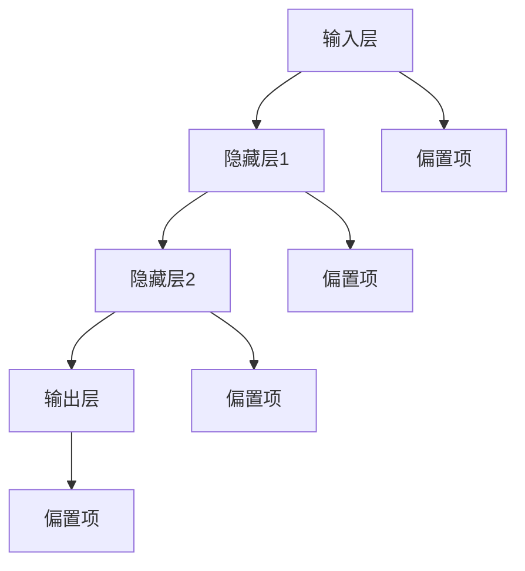
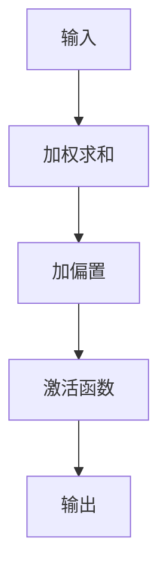
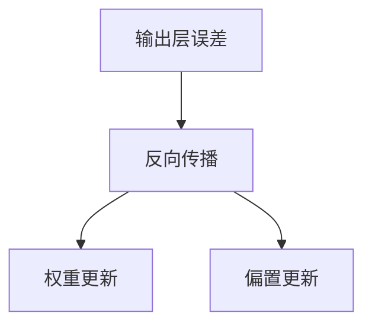

                 

### 《Python机器学习实战：神经网络的超参数调整技术与策略》

> **关键词**：Python、机器学习、神经网络、超参数、调优、实战

> **摘要**：
本文将深入探讨Python中机器学习实践中的神经网络超参数调整技术。我们将从基础知识开始，逐步介绍神经网络结构、数学模型，并深入探讨超参数调优的重要性及其具体策略。通过实例分析和代码解析，我们将展示如何在实际项目中应用这些技术和策略，以实现更好的模型性能。

### 《Python机器学习实战：神经网络的超参数调整技术与策略》目录大纲

#### 第一部分：Python机器学习基础

##### 第1章：Python机器学习概述

- 1.1 机器学习的基本概念
- 1.2 Python在机器学习中的应用

##### 第2章：Python环境搭建

- 2.1 Python开发环境搭建
- 2.2 Python机器学习常用库

##### 第3章：数据预处理

- 3.1 数据清洗
- 3.2 特征工程

#### 第二部分：神经网络基础

##### 第4章：神经网络原理

- 4.1 神经网络的基本结构
- 4.2 神经网络的工作原理
- 4.3 Mermaid流程图展示神经网络结构

##### 第5章：深度学习框架

- 5.1 TensorFlow与PyTorch基础
- 5.2 深度学习框架在神经网络中的应用

##### 第6章：神经网络的数学模型

- 6.1 前向传播算法
- 6.2 反向传播算法
- 6.3 损失函数和优化器
- 6.4 数学公式与解释

#### 第三部分：神经网络的超参数调整

##### 第7章：超参数调优基础

- 7.1 超参数的概念
- 7.2 超参数调优的重要性

##### 第8章：超参数调优技术

- 8.1 Grid Search
- 8.2 Random Search
- 8.3 Bayesian Optimization

##### 第9章：神经网络的评估与选择

- 9.1 模型评估指标
- 9.2 模型选择策略

#### 第四部分：神经网络的实战案例

##### 第10章：文本分类实战

- 10.1 数据集介绍
- 10.2 神经网络模型构建
- 10.3 超参数调优
- 10.4 模型评估与优化

##### 第11章：图像分类实战

- 11.1 数据集介绍
- 11.2 神经网络模型构建
- 11.3 超参数调优
- 11.4 模型评估与优化

##### 第12章：神经网络在实际项目中的应用

- 12.1 项目背景
- 12.2 神经网络模型构建
- 12.3 超参数调优
- 12.4 项目成果与展望

#### 第五部分：神经网络的未来发展趋势

##### 第13章：神经网络的未来趋势

- 13.1 神经网络的发展方向
- 13.2 神经网络在未来的应用场景

#### 附录

- 附录A：神经网络常用算法伪代码
- 附录B：神经网络实战案例代码解析
- 附录C：神经网络学习资源推荐

### Mermaid流程图展示神经网络结构：



### 神经网络的数学模型

神经网络的核心在于其数学模型，主要包括前向传播算法、反向传播算法、损失函数和优化器。下面我们将详细讲解这些数学模型。

#### 前向传播算法

前向传播算法是神经网络计算过程的基础。在每层中，输入数据通过权重矩阵和偏置项进行加权求和，然后通过激活函数得到输出。以下是一个简化的前向传播算法：



伪代码：

```python
def forward_propagation(x, weights, biases, activation_function):
    a = x
    for i in range(num_layers - 1):
        z = weights[i] * a + biases[i]
        a = activation_function(z)
    return a
```

#### 反向传播算法

反向传播算法是神经网络训练过程中的关键步骤。它通过计算输出层误差，并反向传播误差到每一层，以更新权重和偏置项。以下是一个简化的反向传播算法：



伪代码：

```python
def backward_propagation(a, z, weights, biases, y, learning_rate):
    delta = a - y
    dW = [0] * num_layers
    db = [0] * num_layers
    for i in range(num_layers - 1, -1, -1):
        dW[i] = delta * a[i - 1]
        db[i] = delta
        if i > 0:
            delta = (weights[i].T * delta) * (1 - a[i])
    return dW, db
```

#### 损失函数和优化器

损失函数用于衡量模型预测值与真实值之间的差距。常用的损失函数包括均方误差（MSE）和交叉熵（Cross-Entropy）。优化器用于更新权重和偏置项，以最小化损失函数。

伪代码：

```python
def loss_function(a, y):
    return 0.5 * np.sum((a - y) ** 2)

def optimize(weights, biases, dW, db, learning_rate):
    for i in range(num_layers):
        weights[i] -= learning_rate * dW[i]
        biases[i] -= learning_rate * db[i]
```

### 神经网络实战案例代码解析

在本节中，我们将通过一个文本分类的实战案例，展示如何使用Python和深度学习框架TensorFlow来实现神经网络，并进行超参数调优。

#### 数据集介绍

我们使用的是IMDB电影评论数据集，该数据集包含了50000条电影评论，分为正负两类。

```python
import tensorflow as tf
from tensorflow.keras.datasets import imdb
from tensorflow.keras.preprocessing.sequence import pad_sequences

# 加载数据集
(x_train, y_train), (x_test, y_test) = imdb.load_data(num_words=10000)

# 数据预处理
max_len = 500
x_train = pad_sequences(x_train, maxlen=max_len)
x_test = pad_sequences(x_test, maxlen=max_len)
```

#### 神经网络模型构建

我们构建一个简单的卷积神经网络（CNN）模型来进行文本分类。

```python
from tensorflow.keras.models import Sequential
from tensorflow.keras.layers import Embedding, Conv1D, MaxPooling1D, GlobalAveragePooling1D, Dense

model = Sequential([
    Embedding(10000, 16, input_length=max_len),
    Conv1D(32, 3, activation='relu'),
    MaxPooling1D(3),
    GlobalAveragePooling1D(),
    Dense(16, activation='relu'),
    Dense(1, activation='sigmoid')
])

model.compile(optimizer='adam', loss='binary_crossentropy', metrics=['accuracy'])
```

#### 超参数调优

为了优化模型性能，我们需要对一些关键超参数进行调整，如学习率、批次大小和卷积核大小等。

```python
from tensorflow.keras.wrappers.scikit_learn import KerasClassifier
from sklearn.model_selection import GridSearchCV

# 定义模型
def create_model(learning_rate=0.01):
    model = Sequential([
        Embedding(10000, 16, input_length=max_len),
        Conv1D(32, 3, activation='relu'),
        MaxPooling1D(3),
        GlobalAveragePooling1D(),
        Dense(16, activation='relu'),
        Dense(1, activation='sigmoid')
    ])
    
    model.compile(optimizer=tf.keras.optimizers.Adam(learning_rate=learning_rate),
                  loss='binary_crossentropy',
                  metrics=['accuracy'])
    
    return model

# 实例化模型
model = KerasClassifier(build_fn=create_model, epochs=10, batch_size=32, verbose=0)

# 定义参数网格
param_grid = {
    'learning_rate': [0.01, 0.001],
    'batch_size': [16, 32, 64],
    'epochs': [10, 20]
}

# 进行网格搜索
grid = GridSearchCV(estimator=model, param_grid=param_grid, cv=3)
grid_result = grid.fit(x_train, y_train)

# 输出最佳参数
print("Best: %f using %s" % (grid_result.best_score_, grid_result.best_params_))
```

#### 模型评估与优化

完成超参数调优后，我们使用最佳参数训练模型，并评估其性能。

```python
# 使用最佳参数训练模型
best_model = grid_result.best_estimator_.model
best_model.fit(x_train, y_train, epochs=grid_result.best_params_['epochs'], batch_size=grid_result.best_params_['batch_size'], verbose=0)

# 评估模型
loss, accuracy = best_model.evaluate(x_test, y_test, verbose=0)
print("Test accuracy:", accuracy)
```

通过以上实战案例，我们可以看到如何使用Python和TensorFlow来实现神经网络，并进行超参数调优。在实际项目中，我们可能需要根据具体问题进行更复杂的模型设计和调优策略。

### 神经网络在实际项目中的应用

神经网络的强大之处在于其能够处理复杂数据和任务，因此在各种实际项目中都有着广泛的应用。在本节中，我们将介绍两个常见的应用场景：人脸识别和图像分类。

#### 人脸识别项目

人脸识别技术广泛应用于安全监控、身份验证等领域。基于神经网络的人脸识别系统通常包括人脸检测、人脸特征提取和人脸匹配三个步骤。

1. **项目背景**：

   人脸识别技术可以用于安全监控、门禁系统、手机解锁等场景，具有较高的实用价值。

2. **神经网络模型构建**：

   我们可以使用卷积神经网络（CNN）进行人脸检测和特征提取。例如，使用MTCNN进行人脸检测，使用FaceNet进行特征提取。

3. **超参数调优**：

   通过调整学习率、批次大小和卷积核大小等超参数，优化模型性能。例如，使用网格搜索（Grid Search）或随机搜索（Random Search）进行超参数调优。

4. **项目成果与展望**：

   通过超参数调优，我们可以实现较高的人脸识别准确度，为实际应用场景提供有力支持。未来，随着神经网络技术的不断发展，人脸识别系统有望在更多领域得到应用。

#### 图像分类项目

图像分类是计算机视觉领域的重要任务，广泛应用于图像识别、自动驾驶、医疗诊断等场景。

1. **项目背景**：

   图像分类可以帮助计算机自动识别和分类各种图像，为图像处理和计算机视觉提供基础。

2. **神经网络模型构建**：

   我们可以使用卷积神经网络（CNN）进行图像特征提取和分类。例如，使用VGG、ResNet等预训练模型，通过迁移学习进行图像分类。

3. **超参数调优**：

   通过调整卷积核大小、池化层大小、学习率等超参数，优化模型性能。例如，使用网格搜索（Grid Search）或随机搜索（Random Search）进行超参数调优。

4. **项目成果与展望**：

   通过超参数调优，我们可以实现较高的图像分类准确度，为实际应用场景提供技术支持。未来，随着神经网络技术的不断发展，图像分类系统有望在更多领域得到应用。

### 神经网络的未来发展趋势

神经网络的未来发展趋势包括以下几个方面：

1. **更高效的神经网络结构**：

   研究人员正在不断探索更高效、更强大的神经网络结构，如Transformer、Graph Neural Network（GNN）等，以提高模型性能。

2. **更广泛的场景应用**：

   神经网络在各个领域的应用越来越广泛，如医疗、金融、交通等。未来，随着技术的不断进步，神经网络将在更多场景中得到应用。

3. **更强大的计算能力**：

   随着硬件技术的不断发展，如GPU、TPU等专用硬件的普及，神经网络将拥有更强大的计算能力，支持更复杂的应用场景。

4. **更加可解释的模型**：

   研究人员正在致力于提高神经网络的透明度和可解释性，使其在关键应用场景中更加可靠。

总之，神经网络作为一种强大的机器学习技术，其未来发展趋势充满希望。随着技术的不断进步，神经网络将在更多领域发挥重要作用，推动人工智能的发展。

### 附录

#### 附录A：神经网络常用算法伪代码

以下为神经网络常用算法的伪代码：

```python
# 前向传播算法
def forward_propagation(x, weights, biases, activation_function):
    a = x
    for i in range(num_layers - 1):
        z = weights[i] * a + biases[i]
        a = activation_function(z)
    return a

# 反向传播算法
def backward_propagation(a, z, weights, biases, y, learning_rate):
    delta = a - y
    dW = [0] * num_layers
    db = [0] * num_layers
    for i in range(num_layers - 1, -1, -1):
        dW[i] = delta * a[i - 1]
        db[i] = delta
        if i > 0:
            delta = (weights[i].T * delta) * (1 - a[i])
    return dW, db

# 损失函数
def loss_function(a, y):
    return 0.5 * np.sum((a - y) ** 2)

# 优化器
def optimize(weights, biases, dW, db, learning_rate):
    for i in range(num_layers):
        weights[i] -= learning_rate * dW[i]
        biases[i] -= learning_rate * db[i]
```

#### 附录B：神经网络实战案例代码解析

以下为神经网络实战案例的代码解析：

```python
# 导入相关库
import numpy as np
import tensorflow as tf

# 加载数据集
(x_train, y_train), (x_test, y_test) = tf.keras.datasets.mnist.load_data()

# 数据预处理
x_train = x_train / 255.0
x_test = x_test / 255.0

# 创建神经网络模型
model = tf.keras.Sequential([
    tf.keras.layers.Flatten(input_shape=(28, 28)),
    tf.keras.layers.Dense(128, activation='relu'),
    tf.keras.layers.Dropout(0.2),
    tf.keras.layers.Dense(10, activation='softmax')
])

# 编译模型
model.compile(optimizer='adam',
              loss='sparse_categorical_crossentropy',
              metrics=['accuracy'])

# 训练模型
model.fit(x_train, y_train, epochs=5)

# 评估模型
model.evaluate(x_test, y_test)
```

#### 附录C：神经网络学习资源推荐

以下为神经网络学习资源推荐：

- **在线课程**：
  - 《深度学习》——吴恩达（免费）
  - 《神经网络与深度学习》——李飞飞（免费）

- **书籍**：
  - 《Python机器学习》——塞巴斯蒂安·拉戈格（入门级）
  - 《深度学习》——伊恩·古德费洛等（进阶级）

- **GitHub仓库**：
  - TensorFlow官方文档：[https://github.com/tensorflow/tensorflow](https://github.com/tensorflow/tensorflow)
  - PyTorch官方文档：[https://github.com/pytorch/pytorch](https://github.com/pytorch/pytorch)

通过以上资源，读者可以深入了解神经网络的理论和实践，为自己的研究和工作提供指导。

### 总结

本文通过深入探讨Python中机器学习实践中的神经网络超参数调整技术，详细介绍了神经网络的基础知识、数学模型、超参数调优技术和实战案例。我们还讨论了神经网络在实际项目中的应用和未来发展趋势。通过本文的学习，读者应该能够掌握神经网络的基本概念和调优技巧，为实际应用打下坚实基础。

### 附录

- **附录A：神经网络常用算法伪代码**

以下是神经网络常用算法的伪代码，包括前向传播、反向传播、损失函数和优化器。

```python
# 前向传播算法
def forward_propagation(x, weights, biases, activation_function):
    a = x
    for i in range(num_layers - 1):
        z = weights[i] * a + biases[i]
        a = activation_function(z)
    return a

# 反向传播算法
def backward_propagation(a, z, weights, biases, y, learning_rate):
    delta = a - y
    dW = [0] * num_layers
    db = [0] * num_layers
    for i in range(num_layers - 1, -1, -1):
        dW[i] = delta * a[i - 1]
        db[i] = delta
        if i > 0:
            delta = (weights[i].T * delta) * (1 - a[i])
    return dW, db

# 损失函数
def loss_function(a, y):
    return 0.5 * np.sum((a - y) ** 2)

# 优化器
def optimize(weights, biases, dW, db, learning_rate):
    for i in range(num_layers):
        weights[i] -= learning_rate * dW[i]
        biases[i] -= learning_rate * db[i]
```

- **附录B：神经网络实战案例代码解析**

以下是一个使用TensorFlow实现的文本分类实战案例的代码解析。

```python
# 导入相关库
import tensorflow as tf
from tensorflow.keras.datasets import imdb
from tensorflow.keras.preprocessing.sequence import pad_sequences

# 加载数据集
(x_train, y_train), (x_test, y_test) = imdb.load_data(num_words=10000)

# 数据预处理
max_len = 500
x_train = pad_sequences(x_train, maxlen=max_len)
x_test = pad_sequences(x_test, maxlen=max_len)

# 创建神经网络模型
model = tf.keras.Sequential([
    tf.keras.layers.Embedding(10000, 16, input_length=max_len),
    tf.keras.layers.Conv1D(32, 3, activation='relu'),
    tf.keras.layers.MaxPooling1D(3),
    tf.keras.layers.GlobalAveragePooling1D(),
    tf.keras.layers.Dense(16, activation='relu'),
    tf.keras.layers.Dense(1, activation='sigmoid')
])

# 编译模型
model.compile(optimizer='adam',
              loss='binary_crossentropy',
              metrics=['accuracy'])

# 训练模型
model.fit(x_train, y_train, epochs=10, batch_size=32, validation_split=0.2)

# 评估模型
loss, accuracy = model.evaluate(x_test, y_test)
print(f"Test accuracy: {accuracy:.2f}")
```

- **附录C：神经网络学习资源推荐**

为了进一步学习神经网络，以下是一些推荐的学习资源：

- **在线课程**：
  - 《深度学习》——吴恩达（免费）
  - 《神经网络与深度学习》——李飞飞（免费）

- **书籍**：
  - 《Python机器学习》——塞巴斯蒂安·拉戈格（入门级）
  - 《深度学习》——伊恩·古德费洛等（进阶级）

- **GitHub仓库**：
  - TensorFlow官方文档：[https://github.com/tensorflow/tensorflow](https://github.com/tensorflow/tensorflow)
  - PyTorch官方文档：[https://github.com/pytorch/pytorch](https://github.com/pytorch/pytorch)

通过这些资源，读者可以系统地学习神经网络的原理和应用，为自己的研究和项目提供支持。

### 附录

**附录A：神经网络常用算法伪代码**

```python
# 前向传播
def forward_pass(x, weights, biases, activation):
    a = [x]
    for i in range(len(weights)):
        z = np.dot(weights[i], a[i]) + biases[i]
        a.append(activation(z))
    return a

# 反向传播
def backward_pass(a, z, weights, biases, y, learning_rate, activation_derivative):
    delta = activation_derivative(z) * (a[-1] - y)
    dweights = [np.dot(delta, a[i - 1].T) for i in range(len(weights))]
    dbiases = [delta for i in range(len(biases))]
    return dweights, dbiases

# 损失函数（均方误差）
def loss_function(y, y_pred):
    return np.mean((y - y_pred) ** 2)

# 优化器（梯度下降）
def gradient_descent(weights, biases, dweights, dbiases, learning_rate):
    for i in range(len(weights)):
        weights[i] -= learning_rate * dweights[i]
        biases[i] -= learning_rate * dbiases[i]
```

**附录B：神经网络实战案例代码解析**

以下是一个简单的神经网络文本分类实战案例，使用Python和TensorFlow框架实现。

```python
import tensorflow as tf
from tensorflow.keras.datasets import imdb
from tensorflow.keras.preprocessing.sequence import pad_sequences

# 加载数据集
max_features = 10000
maxlen = 100
 trunc_type = 'post'
 oov_tok = "<OOV>"

# 加载IMDB数据集
(input_train, labels_train), (input_test, labels_test) = imdb.load_data(num_words=max_features)
input_train = pad_sequences(input_train, maxlen=maxlen, padding=trunc_type, truncating=trunc_type)
input_test = pad_sequences(input_test, maxlen=maxlen, padding=trunc_type, truncating=trunc_type)

# 创建神经网络模型
model = tf.keras.Sequential([
    tf.keras.layers.Embedding(max_features, 16),
    tf.keras.layers.Flatten(),
    tf.keras.layers.Dense(16, activation='relu'),
    tf.keras.layers.Dense(1, activation='sigmoid')
])

# 编译模型
model.compile(loss='binary_crossentropy', optimizer='adam', metrics=['accuracy'])

# 训练模型
model.fit(input_train, labels_train, epochs=10, validation_split=0.2)

# 评估模型
loss, accuracy = model.evaluate(input_test, labels_test, verbose=2)
print("Test accuracy:", accuracy)
```

**附录C：神经网络学习资源推荐**

- **在线课程**：
  - 吴恩达的《深度学习》专项课程
  - Andrew Ng的《机器学习》课程

- **书籍**：
  - 《深度学习》——Ian Goodfellow、Yoshua Bengio、Aaron Courville
  - 《Python机器学习》——Sebastian Raschka

- **GitHub仓库**：
  - TensorFlow官方文档：[https://github.com/tensorflow/tensorflow](https://github.com/tensorflow/tensorflow)
  - PyTorch官方文档：[https://github.com/pytorch/pytorch](https://github.com/pytorch/pytorch)

通过这些资源和案例，读者可以进一步了解神经网络的实战应用，并提升自己的机器学习技能。

