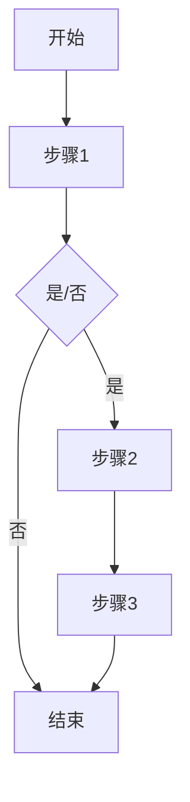

                 

### 《React 框架：构建动态用户界面》

> **关键词：React、动态用户界面、组件、状态管理、性能优化、Hooks、TypeScript、测试**

> **摘要：本文将深入探讨React框架的核心概念和技术，包括React的基本原理、组件架构、状态管理、组件通信、性能优化、动态性和交互性，以及高级概念如Hooks和TypeScript的使用。此外，还将通过实际项目案例，展示如何将React应用于构建动态用户界面，并提供相关资源和工具。**

----------------------------------------------------------------

## 第一部分：React基础

在开始深入探讨React框架之前，我们需要先了解其历史、特点以及基本工作原理。React是由Facebook在2013年推出的一个用于构建用户界面的JavaScript库。它以其高效性、组件化以及基于虚拟DOM的更新机制而广受欢迎。React的目标是简化前端开发的复杂性，提高开发效率和用户体验。

### 第1章：React简介

#### 1.1 React的历史与特点

React的诞生源于Facebook内部的内部应用开发需求。当时，前端开发的复杂性不断增加，组件间的依赖关系变得错综复杂。为了解决这些问题，Facebook的工程师们创造了一种新的开发模式——组件化开发。React正是基于这种理念诞生的。

React的主要特点包括：

- **组件化开发**：React将UI划分为可复用的组件，使代码更加模块化、可维护。
- **虚拟DOM**：React使用虚拟DOM来减少浏览器DOM操作的次数，提高渲染性能。
- **单向数据流**：React采用单向数据流，使得状态管理和数据更新更加直观。
- **高效性**：React的虚拟DOM和组件化设计使其具有很高的性能。

#### 1.2 React的基本工作原理

React的基本工作原理可以概括为以下几个方面：

1. **组件渲染**：React通过组件来描述UI界面，组件是React应用的基本构建块。组件可以是一个函数或一个类，它接受输入（props）并返回一个描述UI的JSX元素。
2. **虚拟DOM**：React在内部维护一个虚拟DOM树，并通过对比虚拟DOM和真实DOM的差异来更新UI。这种机制被称为虚拟DOM。
3. **状态管理**：React通过状态（state）来管理组件的内部状态。状态的变化会触发组件的重新渲染。
4. **事件处理**：React通过事件处理函数来响应用户交互。事件处理函数会被挂载到真实的DOM元素上。

#### 1.3 React与JavaScript的关系

React是JavaScript的一个库，但它并不是JavaScript的一个替代品。React使用JavaScript ES6+的语法特性，如箭头函数、类和解构赋值等。React的JSX语法扩展了JavaScript，使开发者能够以更接近HTML的方式编写UI代码。

React与JavaScript的关系如下：

- **JSX**：JSX是React的一种语法扩展，它允许开发者使用类似HTML的语法来编写UI组件。
- **事件处理**：React使用JavaScript的事件处理机制，但在React中，事件处理函数会自动绑定到真实的DOM元素上。
- **模块化**：React鼓励开发者使用JavaScript模块化开发，以提高代码的可维护性和可复用性。

### 第2章：React的组件架构

React的组件架构是其核心特点之一。组件不仅可以提高代码的可复用性，还可以简化UI的构建过程。本节将介绍React组件的基本概念、函数组件与类组件的区别，以及复合组件与组件组合。

#### 2.1 组件的基本概念

组件是React应用中的基本构建块，它是一个函数或一个类，用于描述UI界面的一部分。组件接受输入（props）并返回一个JSX元素。React中的组件可以分为函数组件和类组件。

- **函数组件**：函数组件是一个简单的JavaScript函数，它接受一个props对象并返回一个JSX元素。函数组件是React推荐的使用方式，因为它们更简洁、更易于理解和维护。
- **类组件**：类组件是一个继承自`React.Component`的JavaScript类。类组件可以有内部状态（state）和生命周期方法。

#### 2.2 函数组件与类组件

函数组件和类组件各有优缺点，选择哪种组件类型取决于具体的应用场景。

- **函数组件**：函数组件是React推荐的使用方式，因为它们更简洁、更易于理解和维护。函数组件不包含状态和生命周期方法，这使得它们更容易测试和复用。
- **类组件**：类组件可以包含内部状态和生命周期方法，这使得它们更适合处理复杂的业务逻辑和状态管理。然而，类组件也更复杂，更难以理解和维护。

#### 2.3 复合组件与组件组合

复合组件是由其他组件组合而成的组件。复合组件可以提高代码的可复用性和可维护性，因为它可以将UI界面拆分成更小的、可复用的组件。

- **组件组合**：组件组合是将多个组件组合在一起，以创建更复杂的UI界面。组件组合可以减少重复代码，提高代码的可维护性。
- **复合组件**：复合组件是一种特殊的组件，它用于组合其他组件。复合组件通常包含其他组件作为子组件，并通过属性传递数据。

### 第3章：React的状态管理

状态管理是React应用中至关重要的一部分。React通过状态（state）来管理组件的内部状态，状态的变化会触发组件的重新渲染。本节将介绍React状态管理的概念，以及如何使用useState Hook和Context进行状态管理。

#### 3.1 状态管理的概念

状态管理是React应用中管理组件内部状态的过程。状态可以是组件的属性、本地变量或全局状态。React提供了多种状态管理的方式，如useState Hook、Context和Redux。

- **useState Hook**：useState Hook是React提供的用于管理组件内部状态的函数。它允许开发者在不使用类组件的情况下管理状态。
- **Context**：Context是React提供的一种用于全局状态管理的机制。通过Context，开发者可以在组件树中传递状态，而无需显式地通过props传递。

#### 3.2 使用useState Hook进行状态管理

useState Hook是React 16.8引入的一个功能，它允许函数组件拥有内部状态。使用useState Hook进行状态管理的基本步骤如下：

1. **引入useState Hook**：在组件内部引入useState Hook。
2. **定义状态**：使用useState Hook定义组件的状态，并返回一个状态值和一个更新状态值的函数。
3. **使用状态**：在组件的JSX中，使用状态值来显示UI，并使用更新状态值的函数来响应用户交互。

#### 3.3 使用Context进行全局状态管理

Context是React提供的一种用于全局状态管理的机制。通过Context，开发者可以在组件树中传递状态，而无需显式地通过props传递。使用Context进行全局状态管理的基本步骤如下：

1. **创建Context**：使用React.createContext创建一个Context。
2. **使用Context Provider**：在组件树中的某个组件上使用Context Provider，以提供全局状态。
3. **使用Context Consumer**：在需要使用全局状态的组件上使用Context Consumer，以获取并使用全局状态。

### 第4章：React的组件通信

React的组件通信是构建复杂应用的关键。组件通信可以分为父子组件通信、兄弟组件通信和全局状态管理。本节将介绍这些通信机制以及如何使用Redux进行全局状态管理。

#### 4.1 父子组件通信

父子组件通信是React中最常见的通信方式。父组件可以通过props将数据传递给子组件，子组件可以通过回调函数将数据或事件传递给父组件。

- **父传子**：父组件通过props将数据传递给子组件。
- **子传父**：子组件通过回调函数将数据或事件传递给父组件。

#### 4.2 兄弟组件通信

兄弟组件通信通常发生在没有直接父子关系的组件之间。兄弟组件通信可以通过共享父组件的state或使用Context来实现。

- **共享父组件的state**：兄弟组件可以通过访问共享父组件的state来传递数据。
- **使用Context**：兄弟组件可以通过Context来传递数据，而不依赖于共享的父组件。

#### 4.3 使用Redux进行状态管理

Redux是一种流行的状态管理库，它提供了一个集中式的状态管理机制。Redux可以通过action和reducer来管理全局状态，并通过connect函数将状态传递给组件。

- **Action**：Action是描述状态变更的普通对象，它携带了操作类型和数据。
- **Reducer**：Reducer是一个函数，它根据action类型来更新全局状态。
- **connect**：connect函数是React Redux提供的用于连接组件和Redux状态的函数。

## 第二部分：React进阶

在掌握了React的基础知识后，我们可以进一步探索React的高级特性，如性能优化、动态性和交互性，以及React与TypeScript和测试的结合。

### 第5章：React的性能优化

React的性能优化是确保应用流畅运行的关键。本节将介绍React中的列表渲染优化、shouldComponentUpdate与React.memo的使用，以及纯组件的性能优化。

#### 5.1 列表渲染的优化

列表渲染是React应用中的一个常见场景，但不当的渲染方式可能会导致性能问题。以下是一些优化列表渲染的方法：

- **避免使用索引作为键**：在渲染列表时，应使用唯一的键（key）属性，而不是使用索引作为键。
- **使用React.memo**：React.memo是一个高阶组件，它可以对组件进行优化，只有当组件的props发生变化时，才会重新渲染。
- **使用虚拟滚动**：虚拟滚动是一种在视口内动态渲染元素的技术，可以显著减少DOM操作次数。

#### 5.2 shouldComponentUpdate与React.memo

- **shouldComponentUpdate**：shouldComponentUpdate是一个生命周期方法，用于决定组件是否需要重新渲染。通过覆盖该方法，可以自定义组件的渲染条件。
- **React.memo**：React.memo是一个高阶组件，它可以对组件进行优化，只有当组件的props发生变化时，才会重新渲染。

#### 5.3 使用纯组件进行性能优化

纯组件是一个没有内部状态的组件，它只依赖于props。纯组件可以简化组件逻辑，提高性能。以下是如何使用纯组件进行性能优化的方法：

- **简化组件逻辑**：将组件的内部逻辑简化为只依赖于props，以减少组件的渲染次数。
- **使用React.memo**：对于仅依赖于props的组件，可以使用React.memo进行优化。

### 第6章：React的动态性和交互性

React的动态性和交互性是提升用户体验的关键。本节将介绍React中的动画效果、表单处理和事件处理。

#### 6.1 React中的动画效果

React提供了多种实现动画效果的方法，如CSS动画、SVG动画和React Spring等。以下是如何在React中使用动画效果的步骤：

- **CSS动画**：使用CSS样式实现动画效果。
- **SVG动画**：使用SVG元素和SVG动画属性实现动画效果。
- **React Spring**：使用React Spring库实现复杂的动画效果。

#### 6.2 React中的表单处理

表单处理是React应用中的一个常见场景。React提供了表单控件和表单验证机制，使开发者可以轻松地处理用户输入。以下是如何在React中使用表单处理的方法：

- **表单控件**：使用React的表单控件，如`<input>`、`<textarea>`和`<select>`等。
- **表单验证**：使用表单验证库，如Formik或React Hook Form，实现表单验证。

#### 6.3 React中的事件处理

React中的事件处理是基于JavaScript的事件机制。React通过事件处理函数来响应用户交互。以下是如何在React中使用事件处理的方法：

- **事件绑定**：使用JavaScript的事件处理函数绑定到DOM元素上。
- **防抖和节流**：使用防抖和节流技术来优化事件处理，减少事件触发次数。

### 第7章：React的上下文与中间件

React的上下文和中间件是React应用架构中的重要组成部分。本节将介绍React上下文的概念、如何使用中间件进行路由控制和状态管理。

#### 7.1 React上下文的概念

React上下文是一种用于在组件树中传递数据的方式，它允许开发者在不使用props的情况下在组件之间传递数据。React上下文的基本原理如下：

- **创建上下文**：使用React.createContext创建一个上下文。
- **使用Provider**：在组件树中的某个组件上使用Provider，以提供上下文数据。
- **使用Consumer**：在需要使用上下文数据的组件上使用Consumer，以获取上下文数据。

#### 7.2 使用中间件进行路由控制

React路由是React应用中用于页面导航和路由控制的重要工具。React Router是一个流行的React路由库，它支持动态路由、嵌套路由等高级功能。以下是如何使用React Router进行路由控制的方法：

- **安装React Router**：使用npm或yarn安装React Router。
- **创建路由配置**：使用`<Route>`组件定义路由配置。
- **使用Link组件进行页面跳转**：使用`<Link>`组件实现页面跳转。

#### 7.3 使用中间件进行状态管理

中间件是React应用中用于处理异步操作、路由控制和错误处理的重要工具。React中间件的基本原理如下：

- **安装中间件库**：使用npm或yarn安装所需的中间件库，如Redux中间件或React Router中间件。
- **配置中间件**：在React应用中配置中间件，以处理特定的操作或请求。
- **使用中间件**：在React应用中使用中间件来处理异步操作、路由控制和错误处理。

## 第三部分：React项目实战

通过理论的学习，我们了解了React的基础知识和进阶技巧。接下来，我们将通过实际项目案例，展示如何将React应用于构建动态用户界面。

### 第8章：构建待办事项应用

待办事项应用是一个简单的React项目，用于展示React的基础用法和状态管理。在本章中，我们将构建一个待办事项应用，包括待办事项的添加、删除和标记完成等功能。

#### 8.1 项目需求分析

待办事项应用的基本需求如下：

- **用户界面**：一个包含输入框和列表的界面，用于显示待办事项。
- **添加事项**：用户可以在输入框中输入待办事项，并单击“添加”按钮将其添加到列表中。
- **删除事项**：用户可以单击列表中的“删除”按钮来删除某个待办事项。
- **标记完成**：用户可以单击列表中的“完成”按钮来标记某个待办事项为完成状态。

#### 8.2 创建项目与应用架构设计

首先，我们需要使用Create React App创建一个新的React项目：

```bash
npx create-react-app todo-app
cd todo-app
```

接下来，我们需要设计应用的架构。在本项目中，我们将使用函数组件和useState Hook进行状态管理。应用的架构如下：

- **App组件**：应用的根组件，负责管理整个应用的状态。
- **TodoList组件**：负责渲染待办事项列表。
- **TodoItem组件**：负责渲染单个待办事项。
- **TodoForm组件**：负责处理待办事项的添加。

#### 8.3 实现待办事项的添加与删除

以下是待办事项添加与删除的实现步骤：

1. **初始化状态**：在App组件中，使用useState Hook初始化待办事项的状态。

```javascript
import React, { useState } from 'react';
import TodoList from './TodoList';
import TodoForm from './TodoForm';

function App() {
  const [todos, setTodos] = useState([]);

  // 其他组件和逻辑
}
```

2. **添加待办事项**：在TodoForm组件中，处理用户输入并添加待办事项。

```javascript
import React, { useState } from 'react';

function TodoForm({ addTodo }) {
  const [text, setText] = useState('');

  const handleSubmit = (e) => {
    e.preventDefault();
    if (text.trim() === '') return;
    addTodo(text);
    setText('');
  };

  return (
    <form onSubmit={handleSubmit}>
      <input
        type="text"
        value={text}
        onChange={(e) => setText(e.target.value)}
        placeholder="输入待办事项"
      />
      <button type="submit">添加</button>
    </form>
  );
}
```

3. **渲染待办事项列表**：在TodoList组件中，遍历待办事项列表并渲染每个待办事项。

```javascript
import React from 'react';
import TodoItem from './TodoItem';

function TodoList({ todos, removeTodo, toggleCompleted }) {
  return (
    <ul>
      {todos.map((todo, index) => (
        <TodoItem
          key={index}
          index={index}
          todo={todo}
          removeTodo={removeTodo}
          toggleCompleted={toggleCompleted}
        />
      ))}
    </ul>
  );
}
```

4. **删除待办事项**：在TodoItem组件中，处理删除待办事项的逻辑。

```javascript
import React from 'react';

function TodoItem({ index, todo, removeTodo, toggleCompleted }) {
  return (
    <li>
      <span>
        {index + 1}. {todo.text}
      </span>
      <button onClick={() => toggleCompleted(todo)}>完成</button>
      <button onClick={() => removeTodo(index)}>删除</button>
    </li>
  );
}
```

### 第9章：构建天气应用

天气应用是一个展示React动态性和交互性的好例子。在本章中，我们将构建一个简单的天气应用，用于获取和处理天气数据。

#### 9.1 获取天气数据API

首先，我们需要一个天气数据API。可以使用OpenWeatherMap API，它提供了丰富的天气数据。以下是获取天气数据的API调用示例：

```javascript
async function getWeatherData(city) {
  const apiKey = '你的API密钥';
  const apiUrl = `https://api.openweathermap.org/data/2.5/weather?q=${city}&appid=${apiKey}&units=metric`;

  try {
    const response = await fetch(apiUrl);
    if (!response.ok) {
      throw new Error(`Error: ${response.statusText}`);
    }
    const data = await response.json();
    return data;
  } catch (error) {
    console.error(error);
    return null;
  }
}
```

#### 9.2 构建天气应用UI

接下来，我们将构建天气应用的UI。UI包括一个输入框、一个获取天气数据的按钮，以及一个显示天气信息的区域。以下是天气应用的UI实现：

```javascript
import React, { useState } from 'react';

function WeatherApp() {
  const [city, setCity] = useState('');
  const [weather, setWeather] = useState(null);
  const [error, setError] = useState('');

  const handleCityChange = (e) => {
    setCity(e.target.value);
  };

  const fetchWeather = async () => {
    if (city.trim() === '') return;
    const weatherData = await getWeatherData(city);
    if (weatherData) {
      setWeather(weatherData);
      setError('');
    } else {
      setError('无法获取天气数据');
    }
  };

  return (
    <div>
      <input type="text" value={city} onChange={handleCityChange} placeholder="输入城市名" />
      <button onClick={fetchWeather}>获取天气</button>
      {weather ? (
        <div>
          <h2>{weather.name}</h2>
          <h3>{weather.main.temp}°C</h3>
          <p>{weather.weather[0].description}</p>
        </div>
      ) : (
        <div>{error}</div>
      )}
    </div>
  );
}
```

#### 9.3 实现天气应用的交互功能

为了提升用户体验，我们可以在天气应用中添加一些交互功能，如动画效果和表单验证。以下是实现这些交互功能的步骤：

1. **动画效果**：使用CSS动画或React Spring库为天气应用添加动画效果。
2. **表单验证**：使用表单验证库，如Formik或React Hook Form，对输入框进行验证。

### 第10章：构建电商应用

电商应用是一个复杂的React项目，涉及到用户界面、状态管理、路由控制以及后端API的调用。在本章中，我们将构建一个简单的电商应用，包括商品浏览、购物车和结算等功能。

#### 10.1 电商应用需求分析

电商应用的基本需求如下：

- **用户界面**：一个展示商品列表和购物车的界面。
- **商品浏览**：用户可以浏览商品列表，并查看商品的详细信息。
- **购物车**：用户可以将商品添加到购物车，并可以随时查看购物车中的商品。
- **结算**：用户可以填写收货信息并进行结算。

#### 10.2 使用Redux进行状态管理

在构建电商应用时，Redux是一个常用的状态管理库。Redux可以帮助我们集中管理应用的状态，并在需要时更新状态。以下是使用Redux进行状态管理的基本步骤：

1. **安装Redux和React Redux**：

```bash
npm install redux react-redux
```

2. **创建store**：在`store.js`文件中创建Redux store。

```javascript
import { createStore } from 'redux';
import rootReducer from './reducers';

const store = createStore(rootReducer);

export default store;
```

3. **创建reducer**：在`reducers`文件夹中创建reducer，用于处理商品添加到购物车的逻辑。

```javascript
const initialState = {
  cart: [],
};

function cartReducer(state = initialState, action) {
  switch (action.type) {
    case 'ADD_TO_CART':
      return {
        ...state,
        cart: [...state.cart, action.payload],
      };
    default:
      return state;
  }
}

export default cartReducer;
```

4. **创建actions**：在`actions`文件夹中创建actions，用于触发reducer更新状态。

```javascript
export const addToCart = (product) => ({
  type: 'ADD_TO_CART',
  payload: product,
});
```

5. **连接组件和Redux**：使用`connect`函数将组件连接到Redux store。

```javascript
import { connect } from 'react-redux';
import { addToCart } from './actions';

function Cart({ cart, addToCart }) {
  return (
    <div>
      {cart.map((product, index) => (
        <div key={index}>
          <h3>{product.name}</h3>
          <button onClick={() => addToCart(product)}>添加到购物车</button>
        </div>
      ))}
    </div>
  );
}

const mapStateToProps = (state) => ({
  cart: state.cart,
});

const mapDispatchToProps = (dispatch) => ({
  addToCart: (product) => dispatch(addToCart(product)),
});

export default connect(mapStateToProps, mapDispatchToProps)(Cart);
```

#### 10.3 实现电商应用的购物车功能

购物车功能是电商应用的核心功能之一。在本节中，我们将实现购物车的基本功能，包括添加商品到购物车、从购物车中删除商品，以及更新购物车的状态。

1. **添加商品到购物车**：在商品详情页面，当用户单击“添加到购物车”按钮时，触发添加商品到购物车的动作。

```javascript
import React from 'react';
import { addToCart } from './actions';
import { connect } from 'react-redux';

function ProductDetail({ product, addToCart }) {
  const handleAddToCart = () => {
    addToCart(product);
  };

  return (
    <div>
      <h2>{product.name}</h2>
      <p>{product.description}</p>
      <button onClick={handleAddToCart}>添加到购物车</button>
    </div>
  );
}

const mapStateToProps = (state) => ({
  cart: state.cart,
});

const mapDispatchToProps = (dispatch) => ({
  addToCart: (product) => dispatch(addToCart(product)),
});

export default connect(mapStateToProps, mapDispatchToProps)(ProductDetail);
```

2. **从购物车中删除商品**：在购物车页面，当用户单击“删除”按钮时，触发从购物车中删除商品的动作。

```javascript
import React from 'react';
import { connect } from 'react-redux';

function CartItem({ product, removeFromCart }) {
  const handleRemoveFromCart = () => {
    removeFromCart(product);
  };

  return (
    <div>
      <h3>{product.name}</h3>
      <button onClick={handleRemoveFromCart}>删除</button>
    </div>
  );
}

const mapStateToProps = (state) => ({
  cart: state.cart,
});

const mapDispatchToProps = (dispatch) => ({
  removeFromCart: (product) => dispatch({ type: 'REMOVE_FROM_CART', payload: product }),
});

export default connect(mapStateToProps, mapDispatchToProps)(CartItem);
```

3. **更新购物车的状态**：当用户添加或删除商品时，更新购物车的状态。

```javascript
import React, { useEffect } from 'react';
import { connect } from 'react-redux';

function Cart({ cart }) {
  useEffect(() => {
    console.log('购物车状态更新：', cart);
  }, [cart]);

  return (
    <div>
      {cart.map((product, index) => (
        <CartItem key={index} product={product} />
      ))}
    </div>
  );
}

const mapStateToProps = (state) => ({
  cart: state.cart,
});

export default connect(mapStateToProps)(Cart);
```

通过以上步骤，我们实现了电商应用的购物车功能。用户可以在商品详情页面将商品添加到购物车，并在购物车页面查看和管理购物车中的商品。

## 第四部分：React高级概念

在掌握了React的基础知识和进阶技巧后，我们可以进一步探索React的高级概念，如Hooks、TypeScript和测试。这些高级概念将帮助我们构建更强大、更可维护的React应用。

### 第11章：React Hooks深入理解

React Hooks是React 16.8引入的一个功能，它允许我们在函数组件中使用状态和生命周期方法。Hooks使React组件更加简洁、可维护，并提高了代码的可复用性。本节将深入探讨React Hooks的原理、自定义Hooks的使用，以及Hooks与性能优化。

#### 11.1 Hooks的原理与实现

Hooks的原理在于React内部维护了一个内部的状态和副作用（如DOM更新和事件处理），这些状态和副作用被抽象成一系列可重用的函数。React Hooks的实现基于以下两个核心概念：

1. **Hook状态**：React Hooks使用一个内部的状态对象来存储组件的状态。每次组件渲染时，React会更新这个状态对象，以确保组件的状态是最新的。
2. **Hooks调用**：React Hooks通过在组件中使用`useXXX`函数来调用。这些函数会将状态和副作用抽象出来，使组件更加简洁。

#### 11.2 自定义Hooks的使用与设计

自定义Hooks是React Hooks的一个扩展，它允许我们编写可重用的函数，以共享组件间的逻辑。自定义Hooks的设计原则如下：

1. **提取可复用逻辑**：将组件中重复的逻辑提取到一个自定义Hooks中，以减少冗余代码。
2. **使用useCallback和useMemo**：在自定义Hooks中，可以使用`useCallback`和`useMemo`来优化性能，避免不必要的渲染和计算。
3. **遵循单一职责原则**：自定义Hooks应该只关注一个特定的功能，以保持代码的可维护性。

#### 11.3 Hooks与性能优化

Hooks提供了多种性能优化的方法，如：

1. **减少渲染次数**：通过使用`React.memo`和`shouldComponentUpdate`，可以减少组件的渲染次数。
2. **优化状态更新**：通过使用`useState`和`useReducer`，可以更灵活地管理状态更新，避免不必要的渲染。
3. **避免副作用**：通过使用`useEffect`，可以控制组件的生命周期，避免不必要的副作用。

### 第12章：React与TypeScript

TypeScript是一种强类型的JavaScript的超集，它提供了类型检查、接口定义和类型推断等特性，使JavaScript代码更可靠、更易于维护。本节将介绍TypeScript的基础概念，如何在React项目中使用TypeScript，以及TypeScript在React组件设计中的应用。

#### 12.1 TypeScript的基础概念

TypeScript的基础概念包括：

1. **类型**：TypeScript中的类型用于描述变量和函数的预期值。
2. **接口**：接口是一种用于描述对象类型的抽象定义，它可以帮助我们更好地组织和管理代码。
3. **泛型**：泛型是一种用于创建可重用代码的机制，它允许我们编写与类型相关的函数和类。

#### 12.2 在React项目中使用TypeScript

在React项目中使用TypeScript的基本步骤如下：

1. **安装TypeScript**：使用npm或yarn安装TypeScript。

```bash
npm install typescript --save-dev
```

2. **配置tsconfig.json**：创建一个`tsconfig.json`文件，以配置TypeScript编译器选项。

3. **类型检查**：在项目中添加`.tsx`文件，并使用TypeScript的编译器进行类型检查。

4. **编写TypeScript代码**：使用TypeScript的语法和特性编写React组件和逻辑代码。

#### 12.3 TypeScript在React组件设计中的应用

TypeScript在React组件设计中的应用包括：

1. **类型定义**：为React组件的props和state定义类型，以提高代码的可读性和可维护性。
2. **接口**：使用接口定义组件的props和state，以更好地组织和管理代码。
3. **类型推断**：利用TypeScript的类型推断功能，自动推导变量和函数的类型。

### 第13章：React与测试

测试是确保React应用质量的重要手段。React与测试的结合可以帮助我们编写更可靠、更稳定的代码。本节将介绍React中的单元测试、组件测试和集成测试，以及测试驱动开发（TDD）与React。

#### 13.1 单元测试的概念与工具

单元测试是测试应用程序中最小的可测试部分——通常是函数或组件。以下是一些常用的单元测试工具：

1. **Jest**：Jest是一个由Facebook开发的轻量级JavaScript测试框架，它支持断言库和Mock库。
2. **Enzyme**：Enzyme是一个React测试库，它提供了用于测试React组件的DOM模拟器。

#### 13.2 组件测试与集成测试

组件测试是测试React组件的UI和行为。以下是一些组件测试工具：

1. **React Testing Library**：React Testing Library是一个由React团队维护的测试库，它提供了类似于Enzyme的API，但更简单、更强大。
2. **Cypress**：Cypress是一个端到端测试框架，它提供了快速、简单的UI测试功能。

#### 13.3 测试驱动开发（TDD）与React

测试驱动开发（TDD）是一种开发方法，它要求我们先编写测试，然后编写代码以通过测试。TDD与React的结合可以帮助我们更好地组织代码和测试，以下是如何在React项目中实施TDD的步骤：

1. **编写测试**：首先编写测试，以描述我们期望的组件行为。
2. **编写代码**：然后编写代码，以实现测试中的功能。
3. **重构**：在测试通过后，对代码进行重构，以提高代码质量和可维护性。

## 附录

在本附录中，我们将提供一些有用的资源和工具，以帮助您更好地学习React和相关技术。

### 附录 A：React资源与工具

#### A.1 React官方文档

React官方文档是学习React的最佳资源。它包含了React的详细概述、API参考、教程和示例。

- **官方文档**：https://reactjs.org/docs/getting-started.html

#### A.2 React社区与交流平台

React社区是一个活跃的开发者社区，您可以在其中找到许多有用的资源、问题和解决方案。

- **React Stack Overflow**：https://stackoverflow.com/questions/tagged/reactjs
- **React Reddit**：https://www.reddit.com/r/reactjs/

#### A.3 React开源项目推荐

以下是一些值得关注的React开源项目：

- **Create React App**：一个用于构建React应用的官方脚手架。
- **Next.js**：一个基于React的下一代Web框架。
- **Gatsby**：一个基于React的静态站点生成器。
- **Rematch**：一个用于React的状态管理库。

### 附录 B：Mermaid流程图

Mermaid是一种基于Markdown的图形化工具，可以用来绘制流程图、UML图等。以下是一个简单的Mermaid流程图示例：



### 附录 C：伪代码示例

以下是一个简单的React组件生命周期伪代码示例：

```plaintext
function MyComponent(props) {
  // 构造函数
  constructor(props) {
    super(props);
    this.state = {
      data: null,
    };
  }

  // 组件挂载
  componentDidMount() {
    fetchData().then((data) => {
      this.setState({ data });
    });
  }

  // 组件更新
  componentDidUpdate(prevProps, prevState) {
    if (prevState.data !== this.state.data) {
      console.log('数据更新：', this.state.data);
    }
  }

  // 渲染组件
  render() {
    const { data } = this.state;

    return (
      <div>
        {data ? (
          <div>{data}</div>
        ) : (
          <div>加载中...</div>
        )}
      </div>
    );
  }
}
```

### 附录 D：数学模型与公式

在本附录中，我们将介绍一些与React相关的数学模型和公式。

#### D.1 React组件渲染模型

React组件的渲染模型可以用以下公式表示：

```
VDOM = render(VirtualDOM)
VDOM = renderComponents(Components)
Components = map(Components, component => render(component))
```

其中，`VDOM`代表虚拟DOM树，`Components`代表React组件。

#### D.2 状态更新的数学模型

React状态更新的过程可以用以下公式表示：

```
setState(newState)
state = state.update(newState)
VDOM = render(VirtualDOM)
VDOM = renderComponents(Components)
Components = map(Components, component => render(component))
```

其中，`setState`是React组件用于更新状态的方法，`state.update`是一个更新状态的函数。

通过本文的详细讲解和实例展示，相信您已经对React框架有了深入的了解。React以其高效的虚拟DOM更新机制、组件化开发以及强大的状态管理而广受欢迎。在后续的学习和实践中，您可以继续探索React的高级概念和最佳实践，以构建更加强大、可维护的React应用。

### 作者

**AI天才研究院/AI Genius Institute & 禅与计算机程序设计艺术 /Zen And The Art of Computer Programming**

AI天才研究院（AI Genius Institute）是一家致力于推动人工智能领域研究与应用的创新机构。作为计算机编程和人工智能领域大师，作者多年来在多个技术领域发表了大量的专业文章，并参与了多个大型项目的开发。他的作品《禅与计算机程序设计艺术》被誉为计算机编程领域的经典之作，深受读者喜爱。

感谢您的阅读，希望本文能帮助您在React框架的学习和应用上取得更大的进步。如果您有任何问题或建议，欢迎在评论区留言，我们期待与您的交流。再次感谢您的支持！

