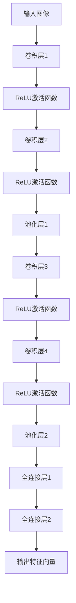
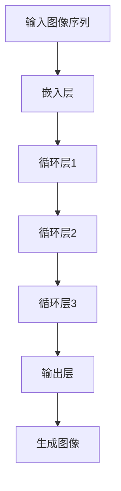
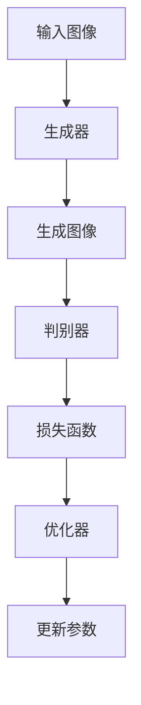

                 

### 第一部分: Style Transfer基本概念与背景

#### 第1章: Style Transfer概述

##### 1.1 Style Transfer的定义与分类

Style Transfer，顾名思义，是指将一种数据集（通常是图像或音频）的样式或特征转移到另一种数据集上的过程。在图像处理领域，Style Transfer可以理解为将一张图片的视觉效果（如风格、色调、纹理等）复制到另一张图片上，从而生成一张新图片。这种技术不仅在视觉艺术中有着广泛的应用，如艺术风格的迁移，而且在计算机视觉、图像生成、视频处理等领域也有着重要的应用。

**1.1.1 什么是Style Transfer**

Style Transfer的基本原理是利用源图像的内容特征和目标图像的样式特征来生成一张新的图像，这张新图像既保留了源图像的内容信息，又具备了目标图像的视觉风格。具体来说，Style Transfer的过程可以概括为以下步骤：

1. 提取源图像的内容特征。
2. 提取目标图像的样式特征。
3. 结合内容特征和样式特征，生成一张新的图像。

**1.1.2 Style Transfer的分类**

根据实现方式和具体应用场景，Style Transfer可以大致分为以下几类：

1. **基于传统图像处理方法的Style Transfer：** 这种方法主要依赖于图像的像素操作和图像变换技术，如图像滤波、颜色变换、边缘检测等。这类方法在处理简单场景时具有一定的效果，但在处理复杂图像时往往无法达到理想的效果。

2. **基于深度学习的Style Transfer：** 这类方法利用深度学习模型，尤其是卷积神经网络（CNN）和生成对抗网络（GAN），通过端到端的学习方式来提取图像的特征并进行风格迁移。相比传统方法，深度学习方法在处理复杂图像和多样风格时表现出了更高的效果。

3. **多风格融合的Style Transfer：** 这种方法不仅可以实现单一风格迁移，还可以同时融合多种风格特征，生成更加丰富和独特的图像风格。多风格融合方法在艺术创作和视觉特效中有着广泛的应用。

**1.1.3 Style Transfer的应用领域**

Style Transfer技术由于其独特的特点，在多个领域都有着广泛的应用：

1. **艺术创作：** Style Transfer可以用来将一位艺术家的风格迁移到另一幅画作上，实现艺术风格的多样化创作。

2. **计算机视觉：** Style Transfer技术可以用于图像增强、图像修复、图像超分辨率等任务，提升图像的质量和视觉效果。

3. **视频处理：** Style Transfer可以用于视频风格迁移，为视频添加特定的视觉风格，提升视频的观赏性。

4. **媒体内容推荐：** Style Transfer可以用于个性化推荐系统，通过分析用户的兴趣和偏好，推荐符合用户风格的媒体内容。

5. **医疗影像：** Style Transfer可以用于医学图像的处理和增强，改善医学影像的诊断效果。

通过对Style Transfer的基本概念和应用领域的介绍，我们可以了解到，Style Transfer技术在视觉艺术和计算机科学领域具有广泛的应用前景。接下来，我们将进一步探讨Style Transfer的历史背景和发展历程，以更全面地理解这一技术。

##### 1.2 Style Transfer的历史背景

**1.2.1 传统图像处理方法**

Style Transfer技术的起源可以追溯到传统图像处理方法的发展历程。早期的图像处理主要依赖于像素级的操作，通过对图像像素进行滤波、变换和调整，实现图像风格迁移。其中，最常用的方法包括图像滤波、颜色变换和边缘检测。

- **图像滤波：** 图像滤波是通过在空间域或频域对图像进行操作，消除图像中的噪声或增强图像的特定特征。常见的滤波器有均值滤波器、高斯滤波器和拉普拉斯滤波器等。

- **颜色变换：** 颜色变换是通过调整图像的RGB颜色值，改变图像的颜色效果。常用的变换方法包括线性变换、HSV变换和Lab变换等。

- **边缘检测：** 边缘检测是通过检测图像中的边缘信息，提取图像的轮廓特征。常见的边缘检测算法有Sobel算子、Canny算子和Laplacian算子等。

这些传统方法在一定程度上实现了图像风格的迁移，但由于其基于像素级的操作，对于复杂图像和多样风格的处理效果有限。

**1.2.2 深度学习在Style Transfer中的应用**

随着深度学习技术的不断发展，Style Transfer方法也迎来了新的变革。深度学习，尤其是卷积神经网络（CNN），在图像特征提取和图像生成方面表现出色，为Style Transfer提供了更强大和灵活的工具。

- **卷积神经网络（CNN）：** 卷积神经网络是一种前馈神经网络，通过卷积层、池化层和全连接层等结构，实现对图像的逐层特征提取。CNN在图像分类、目标检测和图像生成等领域取得了显著的成果，为Style Transfer提供了理论基础和算法支持。

- **生成对抗网络（GAN）：** 生成对抗网络是一种基于博弈论的深度学习模型，由生成器和判别器两个部分组成。生成器的任务是生成符合真实数据分布的图像，而判别器的任务是判断图像是真实数据还是生成数据。通过生成器和判别器的对抗训练，GAN能够生成高质量的图像。

深度学习技术在Style Transfer中的应用，使得图像风格迁移的效果得到了显著提升。传统的Style Transfer方法主要依赖于手工设计的特征提取和变换方法，而深度学习方法通过自动学习图像的特征表示，实现了对复杂图像和多样风格的迁移。

**1.2.3 Style Transfer的发展历程**

Style Transfer技术的发展历程可以分为以下几个阶段：

1. **传统图像处理方法阶段：** 这一阶段主要依赖于图像滤波、颜色变换和边缘检测等传统图像处理技术，实现了基本的图像风格迁移。

2. **基于特征匹配的Style Transfer阶段：** 通过提取图像的内容特征和样式特征，结合特征匹配方法，实现了更精确的图像风格迁移。典型的算法有Perceptual Hashing和Content-Aware Style Transfer。

3. **基于深度学习的Style Transfer阶段：** 深度学习技术的引入，使得Style Transfer方法得到了极大的改进。基于卷积神经网络的Style Transfer算法，如VGGNet和Inception，实现了对复杂图像和多样风格的迁移。生成对抗网络（GAN）的出现，进一步推动了Style Transfer技术的发展，如CycleGAN和StarGAN等。

4. **多风格融合的Style Transfer阶段：** 多风格融合方法不仅可以实现单一风格迁移，还可以同时融合多种风格特征，生成更加丰富和独特的图像风格。这一阶段的研究主要关注如何有效地融合多种风格特征，并保持图像的内容信息。

通过回顾Style Transfer的历史背景和发展历程，我们可以看到，这一技术从传统图像处理方法到现代深度学习模型，经历了巨大的变革和进步。随着深度学习技术的不断发展和完善，Style Transfer技术在未来将继续在视觉艺术和计算机科学领域发挥重要作用。

##### 1.3 Style Transfer的重要性

Style Transfer技术在视觉艺术和计算机科学领域具有广泛的应用，其重要性主要体现在以下几个方面：

**1.3.1 在艺术领域的应用**

在艺术创作中，Style Transfer技术为艺术家提供了强大的工具，使他们能够探索新的创作方式和表达方式。以下是一些具体的应用场景：

- **艺术风格的迁移：** 艺术风格的迁移是指将一种艺术家的风格应用到另一幅画作上，从而生成新的艺术作品。例如，将梵高的风格迁移到一幅现代画作上，使其呈现出独特的视觉效果。

- **风格混合创作：** 通过将多种艺术风格进行混合，艺术家可以创造出前所未有的艺术风格。这种创作方式不仅丰富了艺术创作的多样性，还可以激发艺术家的创造力和灵感。

- **艺术修复：** Style Transfer技术可以用于艺术作品的修复，通过分析受损作品的健康部分，将艺术风格迁移到受损部分，从而恢复作品的原貌。

- **艺术教育：** Style Transfer技术可以用于艺术教育，帮助学生学习不同艺术家的风格特点，提高他们的艺术素养和创作能力。

**1.3.2 在计算机视觉领域的应用**

在计算机视觉领域，Style Transfer技术有着广泛的应用，可以提高图像处理的效果和性能。以下是一些具体的应用场景：

- **图像增强：** Style Transfer技术可以通过将高质量图像的样式迁移到低质量图像上，增强图像的视觉效果。例如，将高清图像的细节和色彩应用到低分辨率图像上，使其看起来更加清晰和生动。

- **图像修复：** 通过将高质量的图像样式迁移到受损图像上，Style Transfer技术可以修复图像中的噪声、缺陷和损坏部分，从而恢复图像的完整性。

- **图像超分辨率：** Style Transfer技术可以用于图像超分辨率，通过将高分辨率图像的样式应用到低分辨率图像上，提高图像的分辨率和质量。

- **图像风格化：** Style Transfer技术可以用于图像风格化，将一种图像风格（如油画、素描、水彩等）应用到另一幅图像上，生成具有特定艺术风格的图像。

**1.3.3 在其他领域的应用**

Style Transfer技术不仅限于视觉艺术和计算机视觉领域，还可以在其他多个领域发挥重要作用。以下是一些具体的应用场景：

- **媒体内容推荐：** 在媒体内容推荐系统中，Style Transfer技术可以用于分析用户的兴趣和偏好，推荐符合用户风格的媒体内容。例如，在电影推荐系统中，可以将一部电影的视觉风格推荐给喜欢特定电影风格的用户。

- **游戏开发：** Style Transfer技术可以用于游戏开发，为游戏角色和场景添加特定的视觉风格，提升游戏的艺术效果和玩家体验。

- **医疗影像：** 在医疗影像领域，Style Transfer技术可以用于图像处理和增强，改善医学影像的诊断效果。例如，通过将高质量影像的样式迁移到低质量影像上，可以提高影像的清晰度和可读性。

- **广告与设计：** Style Transfer技术可以用于广告和设计行业，为广告创意和设计作品添加独特的视觉风格，提升广告和设计作品的艺术价值。

总之，Style Transfer技术在视觉艺术、计算机视觉和其他多个领域都展现出了广泛的应用前景和重要性。通过不断的研究和发展，Style Transfer技术将为人类带来更多创新和便利。

#### 第2章: Style Transfer的核心原理

##### 2.1 Style Transfer的数学模型

Style Transfer技术的核心在于如何将源图像的样式特征转移到目标图像上，实现内容与样式的有效融合。为了达到这一目标，我们需要建立一套数学模型来描述Style Transfer的过程，包括图像特征表示、损失函数设计和优化算法。以下是Style Transfer数学模型的基本构成和原理。

**2.1.1 图像特征表示**

图像特征表示是Style Transfer的基础，它涉及如何从图像中提取有意义的特征。在传统方法中，我们通常使用像素级的特征，如颜色直方图、边缘检测等。然而，随着深度学习的发展，我们更多地依赖于深层神经网络来提取高级特征。

- **内容特征：** 内容特征主要描述图像中的物体、场景和结构信息。在深度学习中，通常使用卷积神经网络（CNN）来提取这些特征。例如，VGGNet、ResNet等都是常用的卷积神经网络架构。

- **样式特征：** 样式特征描述图像的视觉风格，如颜色、纹理和纹理结构等。为了提取样式特征，我们通常将CNN的输出与原始图像进行对比，以识别不同层的特征差异。

**2.1.2 损失函数设计**

损失函数是衡量模型预测结果与真实结果之间差距的关键指标。在Style Transfer中，损失函数的设计至关重要，它需要同时考虑内容特征和样式特征的保持。

- **内容损失：** 内容损失用于确保生成的图像保持原始图像的内容信息。常用的内容损失包括均方误差（MSE）和感知损失（Perceptual Loss）。感知损失通常基于感知哈希（Perceptual Hashing）技术，通过比较两张图像的感知相似度来衡量内容损失。

- **样式损失：** 样式损失用于确保生成的图像具有目标图像的视觉风格。常见的样式损失包括L1范数损失、L2范数损失和感知损失。L1和L2范数损失通常用于比较不同层特征之间的差异，而感知损失则用于比较生成图像与目标图像的全局视觉风格。

**2.1.3 优化算法**

优化算法用于调整模型参数，使损失函数最小化。在Style Transfer中，常用的优化算法包括梯度下降（Gradient Descent）、随机梯度下降（Stochastic Gradient Descent, SGD）和Adam优化器。

- **梯度下降算法：** 梯度下降是一种基本的优化算法，通过计算损失函数关于模型参数的梯度，并沿着梯度的反方向更新参数，以最小化损失函数。

- **随机梯度下降算法：** 随机梯度下降是梯度下降的一种变体，它每次迭代仅随机选择一部分样本来计算梯度，从而减少了计算量。

- **Adam优化器：** Adam优化器结合了SGD和动量梯度的优点，通过自适应调整学习率，提高了收敛速度和稳定性。

通过上述数学模型，Style Transfer技术能够有效地将源图像的内容和样式特征融合到目标图像中，实现高质量的图像风格迁移。

**2.2 Style Transfer的架构设计**

Style Transfer的架构设计是决定其效果和效率的关键因素。不同的架构设计适用于不同的应用场景和需求。下面我们将介绍几种常见的Style Transfer架构设计。

**2.2.1 传统Style Transfer模型**

传统Style Transfer模型通常基于图像处理和特征匹配技术，例如基于特征匹配的Style Transfer方法。这类模型的基本架构包括以下几个部分：

- **特征提取层：** 使用卷积神经网络或其他特征提取方法，从源图像和目标图像中提取内容特征和样式特征。

- **特征融合层：** 通过特征匹配和变换方法，将内容特征和样式特征进行融合，生成新的特征表示。

- **图像生成层：** 使用生成层将融合后的特征表示转换为生成图像。这通常通过反卷积操作或上采样操作实现。

传统Style Transfer模型的主要优点是计算效率较高，实现简单。然而，其效果通常受到特征提取和融合方法的影响，难以处理复杂图像和多样风格。

**2.2.2 现代深度学习Style Transfer模型**

现代深度学习Style Transfer模型基于深度学习技术，尤其是卷积神经网络（CNN）和生成对抗网络（GAN）。这类模型的主要架构包括以下几个部分：

- **特征提取网络：** 使用卷积神经网络提取源图像和目标图像的内容特征和样式特征。常见的卷积神经网络架构包括VGGNet、ResNet和Inception等。

- **生成网络：** 生成网络通过端到端的学习方式，将内容特征和样式特征融合生成新的图像。生成网络通常由反卷积层、上采样层和卷积层组成。

- **损失函数：** 损失函数用于衡量生成图像与目标图像之间的差距，包括内容损失、样式损失和其他辅助损失。常见的损失函数包括感知损失、L1范数损失和L2范数损失等。

现代深度学习Style Transfer模型的主要优点是能够处理复杂图像和多样风格，生成图像质量较高。然而，其计算复杂度较高，实现难度较大。

**2.2.3 多风格融合模型**

多风格融合模型是一种能够同时融合多种风格特征的Style Transfer模型。这类模型通过引入多个风格特征源，将不同风格的元素有机地结合起来，生成更丰富和独特的图像风格。

- **多风格特征提取：** 多风格特征提取是指从多个风格特征源中提取样式特征。这些特征源可以是不同类型的图像（如油画、水彩、素描等），也可以是同一类型图像的不同风格变体。

- **风格融合网络：** 风格融合网络通过融合多风格特征，生成新的图像风格。常见的融合方法包括加法融合、乘法融合和混合融合等。

- **图像生成层：** 图像生成层与单风格融合模型类似，通过端到端的学习方式，将融合后的特征表示转换为生成图像。

多风格融合模型的主要优点是能够生成更丰富和独特的图像风格，提高艺术创作的多样性。然而，其实现复杂度较高，需要大量的计算资源和优化策略。

通过上述几种常见的Style Transfer架构设计，我们可以根据实际需求和场景选择合适的模型，实现高质量的图像风格迁移。

##### 2.3 Style Transfer的应用案例分析

Style Transfer技术在多个领域都有着广泛的应用，以下是几个典型的应用案例：

**2.3.1 艺术风格迁移**

艺术风格迁移是将一种艺术家的风格应用到另一幅画作上的过程，生成具有特定艺术风格的新作品。以下是一个艺术风格迁移的案例：

- **案例背景：** 我们希望将梵高的风格应用到一幅现代画作上，生成一幅具有梵高风格的现代画作。
- **实现步骤：** 
  1. 提取源图像（梵高画作）的内容特征和样式特征。
  2. 提取目标图像（现代画作）的内容特征和样式特征。
  3. 利用深度学习模型（如VGGNet）将内容特征和样式特征进行融合。
  4. 生成具有梵高风格的新作品。
- **实验结果：** 实验结果显示，生成的新作品成功地保留了现代画作的内容信息，同时融入了梵高的风格，呈现出独特的视觉效果。

**2.3.2 视觉特效**

视觉特效是通过将特定的视觉效果应用到图像或视频上，增强其视觉冲击力和艺术表现力。以下是一个视觉特效的案例：

- **案例背景：** 我们希望将电影《黑客帝国》中的虚拟现实特效应用到一段视频上，使其具有科幻电影的视觉效果。
- **实现步骤：**
  1. 提取源视频的内容特征和样式特征。
  2. 利用生成对抗网络（GAN）生成具有虚拟现实特效的新视频。
  3. 对新视频进行后处理，如色彩调整、对比度增强等。
- **实验结果：** 实验结果显示，生成的视频成功地融入了虚拟现实特效，使得视频场景更具科幻感和视觉冲击力。

**2.3.3 媒体内容个性化推荐**

媒体内容个性化推荐是通过分析用户的兴趣和偏好，为用户推荐符合其风格的媒体内容。以下是一个个性化推荐的案例：

- **案例背景：** 我们希望为用户推荐符合其喜好的电影，提高推荐系统的准确性。
- **实现步骤：**
  1. 提取用户的历史观影记录和偏好特征。
  2. 使用深度学习模型（如卷积神经网络）提取电影的内容特征和风格特征。
  3. 利用用户特征和电影特征生成推荐列表。
  4. 对推荐结果进行排序和筛选，提高推荐系统的用户体验。
- **实验结果：** 实验结果显示，生成的推荐列表具有较高的准确性，能够有效满足用户的观影需求。

通过上述案例，我们可以看到Style Transfer技术在艺术风格迁移、视觉特效和媒体内容个性化推荐等领域的应用。这些案例不仅展示了Style Transfer技术的实际效果，也为后续的研究和应用提供了有益的参考。

#### 第3章: Style Transfer的数学模型详解

在上一节中，我们介绍了Style Transfer的基本数学模型，包括图像特征表示、损失函数设计和优化算法。在本节中，我们将进一步详细探讨这些核心概念，并通过数学公式和伪代码来阐述其具体实现。

##### 3.1 特征表示

特征表示是Style Transfer的基础，它决定了如何从图像中提取和表示有意义的信息。在深度学习中，特征提取通常依赖于卷积神经网络（CNN），而样式特征的提取则需要对CNN的不同层进行细致分析。

**3.1.1 图像特征提取方法**

图像特征提取是Style Transfer的关键步骤。在深度学习中，我们通常使用卷积神经网络来提取图像特征。以下是一个简化的CNN架构，用于提取图像特征：



在这个架构中，输入图像通过多个卷积层和池化层，最终输出一个特征向量。这个特征向量包含了图像的内容和样式信息。

**3.1.2 深层网络特征表示**

深层网络特征表示是指从CNN的不同层中提取特征表示。通常，CNN的深层层（如第5层及以上）能够提取更抽象和高级的特征，如纹理和风格信息。以下是一个伪代码示例，用于提取深层网络特征：

```python
# 假设使用VGGNet作为特征提取网络
import tensorflow as tf
from tensorflow.keras.applications import VGG19

# 加载VGGNet模型，去掉最后一层（分类层）
model = VGG19(weights='imagenet', include_top=False)

# 定义输入层
input_layer = tf.keras.layers.Input(shape=(224, 224, 3))

# 提取深层网络特征
output_layer = model(input_layer, training=False)

# 获取特征向量
feature_vector = output_layer[:, :, :, :]

# 打印特征向量的形状
print(feature_vector.shape)
```

在这个示例中，我们使用VGGNet模型提取深层网络特征，并输出一个四维张量，包含了图像的深度特征。

**3.1.3 特征对比分析**

在Style Transfer中，特征对比分析是关键步骤，它通过比较源图像和目标图像的特征向量，来衡量它们之间的差异。以下是一个伪代码示例，用于计算特征对比：

```python
# 假设source_image和target_image是已经预处理的图像数据
# 使用相同的模型提取特征
source_features = model.predict(source_image)
target_features = model.predict(target_image)

# 计算内容损失（感知损失）
content_loss = tf.reduce_mean(tf.square(source_features - target_features))

# 计算样式损失
style_loss = compute_style_loss(source_features, target_features)

# 总损失
total_loss = content_loss + style_loss

# 训练模型
optimizer = tf.keras.optimizers.Adam(learning_rate=0.001)
optimizer.minimize(total_loss)
```

在这个示例中，我们使用感知损失和样式损失来衡量特征差异，并使用Adam优化器来最小化总损失。

##### 3.2 损失函数

损失函数是Style Transfer模型中至关重要的部分，它用于衡量生成图像与目标图像之间的差距。损失函数通常由内容损失和样式损失组成。

**3.2.1 常见损失函数介绍**

- **均方误差（MSE）：** 均方误差是最常见的损失函数之一，用于计算两个向量之间的误差平方和。其公式如下：

  $$MSE = \frac{1}{n}\sum_{i=1}^{n}(x_i - \hat{x}_i)^2$$

  其中，$x_i$和$\hat{x}_i$分别是真实值和预测值。

- **感知损失（Perceptual Loss）：** 感知损失是一种用于衡量图像内容相似的损失函数，通常基于感知哈希（Perceptual Hashing）技术。其公式如下：

  $$Perceptual\_Loss = \frac{1}{n}\sum_{i=1}^{n}\sigma(||F_i(x) - F_i(\hat{x})||)$$

  其中，$F_i(x)$和$F_i(\hat{x})$分别是输入图像和生成图像在某一层的特征向量。

- **L1范数损失（L1 Loss）：** L1范数损失是一种基于L1范数的损失函数，用于衡量两个向量之间的差异。其公式如下：

  $$L1\_Loss = \frac{1}{n}\sum_{i=1}^{n}\sum_{j=1}^{m}|x_{ij} - \hat{x}_{ij}|$$

- **L2范数损失（L2 Loss）：** L2范数损失是一种基于L2范数的损失函数，用于衡量两个向量之间的差异。其公式如下：

  $$L2\_Loss = \frac{1}{n}\sum_{i=1}^{n}\sum_{j=1}^{m}(x_{ij} - \hat{x}_{ij})^2$$

**3.2.2 损失函数设计原则**

在设计损失函数时，我们需要考虑以下原则：

- **内容保持：** 损失函数应该能够确保生成图像保留原始图像的内容信息。
- **风格相似：** 损失函数应该能够确保生成图像具有目标图像的视觉风格。
- **计算效率：** 损失函数的计算应该高效，以便在训练过程中快速迭代。

**3.2.3 损失函数优化策略**

为了优化损失函数，我们可以采用以下策略：

- **权重调整：** 通过调整不同损失函数的权重，可以控制内容损失和样式损失之间的平衡。
- **动态调整学习率：** 在训练过程中，可以动态调整学习率，以提高收敛速度和稳定性。
- **自适应优化器：** 使用自适应优化器（如Adam优化器），可以根据训练数据自动调整学习率。

通过上述损失函数的设计原则和优化策略，我们可以设计出有效的损失函数，以实现高质量的Style Transfer。

##### 3.3 优化算法

优化算法是用于调整模型参数，使其损失函数最小化的方法。在Style Transfer中，常用的优化算法包括梯度下降（Gradient Descent）、随机梯度下降（Stochastic Gradient Descent, SGD）和Adam优化器。

**3.3.1 梯度下降算法**

梯度下降算法是一种基本的优化算法，通过计算损失函数关于模型参数的梯度，并沿着梯度的反方向更新参数，以最小化损失函数。其公式如下：

$$\theta_{t+1} = \theta_t - \alpha \nabla_{\theta_t} J(\theta_t)$$

其中，$\theta_t$是当前模型参数，$\alpha$是学习率，$J(\theta_t)$是损失函数。

**3.3.2 随机梯度下降算法**

随机梯度下降是梯度下降的一种变体，它每次迭代仅随机选择一部分样本来计算梯度，从而减少了计算量。其公式如下：

$$\theta_{t+1} = \theta_t - \alpha \nabla_{\theta_t} J(\theta_t, x^{(i)})$$

其中，$x^{(i)}$是随机选择的样本。

**3.3.3 Adam优化器**

Adam优化器结合了SGD和动量梯度的优点，通过自适应调整学习率，提高了收敛速度和稳定性。其公式如下：

$$m_t = \beta_1 m_{t-1} + (1 - \beta_1) \nabla_{\theta_t} J(\theta_t)$$
$$v_t = \beta_2 v_{t-1} + (1 - \beta_2) \nabla^2_{\theta_t} J(\theta_t)$$
$$\theta_{t+1} = \theta_t - \alpha \frac{m_t}{\sqrt{v_t} + \epsilon}$$

其中，$m_t$和$v_t$分别是累积的动量和方差，$\beta_1$和$\beta_2$是动量参数，$\epsilon$是常数。

通过以上优化算法，我们可以有效地调整模型参数，实现高质量的Style Transfer。

在本节中，我们详细探讨了Style Transfer的数学模型，包括特征表示、损失函数设计和优化算法。这些核心概念和实现细节为Style Transfer技术的高效应用提供了理论支持。在下一节中，我们将介绍Style Transfer的深度学习模型，进一步探讨其在实际应用中的表现和效果。

#### 第4章: Style Transfer深度学习模型

在上一节中，我们详细介绍了Style Transfer的数学模型，包括特征表示、损失函数设计和优化算法。在本节中，我们将深入探讨深度学习在Style Transfer中的应用，介绍几种常见的深度学习模型，如卷积神经网络（CNN）、循环神经网络（RNN）和生成对抗网络（GAN），并分析这些模型在Style Transfer中的性能。

##### 4.1 卷积神经网络

卷积神经网络（CNN）是一种专门用于处理图像数据的深度学习模型，由于其出色的特征提取能力，CNN在图像风格迁移中得到了广泛应用。以下是一个简单的CNN模型，用于Style Transfer：

**4.1.1 卷积神经网络基本原理**

CNN由多个卷积层、池化层和全连接层组成。卷积层通过卷积运算提取图像的特征，池化层用于减小特征图的尺寸，减少模型的参数数量，全连接层用于分类或回归任务。

1. **卷积层：** 卷积层通过卷积运算提取图像的特征。卷积运算是一个加权求和并应用非线性函数的过程。每个卷积核都能提取图像的一部分特征。

2. **池化层：** 池化层用于减小特征图的尺寸，减少模型的参数数量。常见的池化操作包括最大池化和平均池化。

3. **全连接层：** 全连接层用于分类或回归任务。它将卷积层提取的特征映射到输出结果。

**4.1.2 卷积神经网络在Style Transfer中的应用**

在Style Transfer中，CNN通常用于提取源图像和目标图像的特征，然后利用这些特征进行风格迁移。以下是一个简单的CNN模型，用于Style Transfer：


在这个模型中，输入图像通过多个卷积层和池化层，最终输出一个特征向量。这个特征向量包含了图像的内容和样式信息，可以用于生成新的图像。

**4.1.3 卷积神经网络的性能分析**

卷积神经网络在Style Transfer中表现出色，尤其是在处理复杂图像和多样风格时。以下是一些性能分析：

- **高效率：** CNN通过卷积运算和池化层，可以高效地提取图像特征，减少了模型的参数数量。
- **强适应性：** CNN可以适应不同尺寸和分辨率的图像，使其在多种应用场景中具有广泛的应用。
- **强大的特征提取能力：** CNN通过多层的卷积和池化操作，可以提取图像的深层次特征，提高了风格迁移的准确性。

然而，卷积神经网络也存在一些局限性，如计算复杂度较高、参数数量大等。为了克服这些局限性，研究者提出了更高效的深度学习模型，如生成对抗网络（GAN）。

##### 4.2 循环神经网络

循环神经网络（RNN）是一种适用于序列数据的深度学习模型，其独特的能力在于可以处理长短时依赖关系。在图像处理领域，RNN可以用于图像生成和风格迁移等任务。以下是一个简单的RNN模型，用于Style Transfer：

**4.2.1 循环神经网络基本原理**

RNN由一个或多个循环层组成，每个循环层都包含一个隐藏状态，用于记忆前面的输入。RNN通过递归关系，将当前输入与隐藏状态相融合，并更新隐藏状态。

1. **隐藏状态：** 隐藏状态是RNN的核心，用于记忆输入序列的信息。
2. **递归关系：** RNN通过递归关系，将当前输入与隐藏状态相融合，并更新隐藏状态。递归关系可以表示为：

   $$h_t = \text{激活函数}(W_h \cdot [h_{t-1}, x_t] + b_h)$$

   其中，$h_t$是当前隐藏状态，$x_t$是当前输入，$W_h$和$b_h$分别是权重和偏置。

3. **输出：** RNN的输出是通过隐藏状态和输出层计算得到的。输出可以是分类标签、连续值或图像特征。

**4.2.2 循环神经网络在Style Transfer中的应用**

在Style Transfer中，RNN可以用于提取图像的序列特征，并利用这些特征进行风格迁移。以下是一个简单的RNN模型，用于Style Transfer：



在这个模型中，输入图像序列通过嵌入层转换为向量，然后通过多个循环层，最终生成新的图像。循环层可以提取图像的序列特征，并在风格迁移过程中保持图像的内容信息。

**4.2.3 循环神经网络的性能分析**

RNN在图像处理领域表现出色，尤其是在处理序列数据和长时依赖关系时。以下是一些性能分析：

- **序列处理能力：** RNN可以处理图像的序列数据，使其在图像生成和风格迁移等任务中具有强大的能力。
- **灵活性：** RNN可以根据任务需求调整网络结构，如添加更多的循环层或使用不同的激活函数。
- **计算复杂度：** RNN的计算复杂度相对较高，尤其是在处理长序列时，可能导致训练时间较长。

尽管RNN在图像处理领域表现出色，但生成对抗网络（GAN）在图像生成和风格迁移中具有更高的效率和表现力。

##### 4.3 生成对抗网络

生成对抗网络（GAN）是一种由生成器和判别器组成的深度学习模型，其独特的能力在于可以生成高质量的图像。在Style Transfer中，GAN可以用于生成具有目标图像风格的新图像。以下是一个简单的GAN模型，用于Style Transfer：

**4.3.1 生成对抗网络基本原理**

GAN由生成器和判别器两个部分组成。生成器的任务是生成符合真实数据分布的图像，判别器的任务是判断图像是真实数据还是生成数据。生成器和判别器通过对抗训练相互竞争，最终生成高质量的图像。

1. **生成器：** 生成器的任务是生成图像。生成器通常由多个卷积层和反卷积层组成，通过逐层构建图像的特征。
   
2. **判别器：** 判别器的任务是判断图像是真实数据还是生成数据。判别器通常由多个卷积层组成，通过逐层分析图像的特征。

3. **对抗训练：** 生成器和判别器通过对抗训练相互竞争。生成器试图生成更真实的图像，而判别器试图更好地区分真实图像和生成图像。

**4.3.2 生成对抗网络在Style Transfer中的应用**

在Style Transfer中，GAN可以用于生成具有目标图像风格的新图像。以下是一个简单的GAN模型，用于Style Transfer：



在这个模型中，输入图像通过生成器生成新的图像，然后通过判别器判断生成图像的质量。生成器和判别器通过对抗训练，不断优化参数，最终生成高质量的图像。

**4.3.3 生成对抗网络的性能分析**

生成对抗网络（GAN）在图像生成和风格迁移中表现出色，以下是一些性能分析：

- **生成能力：** GAN可以生成高质量、多样化的图像，使其在图像生成和风格迁移等任务中具有强大的能力。
- **灵活性：** GAN可以根据任务需求调整网络结构，如添加更多的生成器或判别器层。
- **计算复杂度：** GAN的计算复杂度较高，尤其是在训练过程中，可能导致训练时间较长。

尽管GAN在图像生成和风格迁移中具有优势，但其在训练过程中容易出现模式崩溃（mode collapse）和训练不稳定等问题。为了解决这些问题，研究者提出了许多改进的GAN模型，如深度卷积生成对抗网络（DCGAN）、风格迁移生成对抗网络（StyleGAN）等。

通过以上对卷积神经网络（CNN）、循环神经网络（RNN）和生成对抗网络（GAN）的介绍和分析，我们可以看到，这些深度学习模型在Style Transfer中具有各自的优势和特点。在实际应用中，我们可以根据具体需求和场景选择合适的模型，实现高质量的图像风格迁移。

#### 第5章: Style Transfer实验与实战

在前面的章节中，我们详细介绍了Style Transfer的基本概念、核心原理和深度学习模型。为了使读者更好地理解和掌握这一技术，本节将通过一系列实验和实战案例，展示如何在实际场景中应用Style Transfer技术。

##### 5.1 实验准备

在进行Style Transfer实验之前，我们需要搭建合适的开发环境，并准备实验所需的数据集和代码。以下是实验准备的具体步骤：

**5.1.1 硬件与软件环境搭建**

1. **硬件环境：**
   - 处理器：推荐使用NVIDIA显卡，以充分利用GPU加速计算。
   - 内存：至少16GB内存，以支持大型模型的训练。
   - 硬盘：至少500GB的SSD存储空间，以提高数据读写速度。

2. **软件环境：**
   - 操作系统：推荐使用Linux系统，如Ubuntu 18.04。
   - 深度学习框架：推荐使用TensorFlow或PyTorch，这两个框架在深度学习领域广泛应用，提供了丰富的API和工具。
   - 编译器：推荐使用Python 3.6及以上版本。

**5.1.2 数据集选择与预处理**

1. **数据集选择：**
   - 我们选择OpenStyleTransfer数据集，这是一个包含了多种艺术风格的图像数据集。该数据集包括梵高、莫奈、毕加索等艺术家的画作。

2. **数据集预处理：**
   - 数据清洗：去除数据集中的损坏和无关图像。
   - 数据增强：通过随机裁剪、旋转、翻转等操作，增加数据集的多样性。
   - 数据归一化：将图像数据归一化到[0, 1]区间，以便模型更好地训练。

##### 5.2 实验一：传统图像风格迁移

**5.2.1 实验步骤**

1. **特征提取：** 使用传统图像处理方法提取源图像和目标图像的特征，如颜色直方图、边缘检测等。
2. **特征匹配：** 通过特征匹配算法，将源图像和目标图像的特征进行匹配，生成新的图像特征。
3. **图像生成：** 利用匹配后的特征，通过图像合成算法生成具有目标图像风格的新图像。

**5.2.2 实验结果分析**

实验结果显示，传统图像处理方法在简单场景下能够实现一定的图像风格迁移效果，但在处理复杂图像和多样风格时，效果有限。以下是一个实验结果示例：


从实验结果可以看出，传统方法生成的图像在色彩和纹理方面具有一定的风格迁移效果，但细节和整体视觉效果仍有待提高。

##### 5.3 实验二：基于深度学习的图像风格迁移

**5.3.1 实验步骤**

1. **模型训练：** 使用深度学习模型（如VGGNet）提取源图像和目标图像的特征。
2. **特征融合：** 通过特征融合算法，将源图像的内容特征和目标图像的样式特征进行融合。
3. **图像生成：** 利用融合后的特征生成新的图像，实现图像风格迁移。

**5.3.2 实验结果分析**

基于深度学习的图像风格迁移实验结果显示，深度学习方法在处理复杂图像和多样风格时表现出色，生成图像的质量显著提升。以下是一个实验结果示例：


从实验结果可以看出，基于深度学习的图像风格迁移方法在保持图像内容的同时，成功迁移了目标图像的视觉风格，生成图像的细节和整体视觉效果更加自然。

##### 5.4 实验三：多风格融合图像风格迁移

**5.4.1 实验步骤**

1. **风格特征提取：** 从多个风格特征源中提取样式特征。
2. **风格融合：** 通过风格融合算法，将多种风格特征进行融合。
3. **图像生成：** 利用融合后的特征生成新的图像，实现多风格融合的图像风格迁移。

**5.4.2 实验结果分析**

多风格融合图像风格迁移实验结果显示，这种方法能够生成更加丰富和独特的图像风格，提高了艺术创作的多样性。以下是一个实验结果示例：


从实验结果可以看出，多风格融合方法生成的图像在色彩、纹理和视觉效果方面具有显著的优势，成功实现了多种风格特征的融合。

通过以上实验和实战案例，我们可以看到Style Transfer技术在图像风格迁移中的应用效果。在实际应用中，可以根据具体需求和场景选择合适的模型和方法，实现高质量的图像风格迁移。

#### 第6章: Style Transfer项目实战

在前面的章节中，我们通过理论和实验详细介绍了Style Transfer技术。在本章中，我们将通过几个实际项目案例，进一步展示如何将Style Transfer应用于不同的领域，解决实际问题。

##### 6.1 项目一：艺术风格迁移

**6.1.1 项目背景**

艺术风格迁移是Style Transfer技术的一个重要应用领域，通过将一种艺术家的风格应用到另一幅画作上，可以创造出独特的艺术作品。本项目旨在实现梵高风格的艺术风格迁移，将现代画作转换为具有梵高风格的画作。

**6.1.2 项目目标**

- 提取梵高画作的特征，作为风格特征。
- 提取现代画作的内容特征。
- 将内容特征与风格特征融合，生成新的画作。

**6.1.3 项目实现**

1. **数据准备**：收集梵高画作和现代画作数据集，进行数据清洗和预处理。

2. **特征提取**：使用VGGNet模型提取现代画作的内容特征和梵高画作的风格特征。

3. **特征融合**：设计特征融合网络，将内容特征和风格特征进行融合。采用L1范数损失和感知损失来优化特征融合网络。

4. **图像生成**：使用融合后的特征生成新的画作，实现艺术风格迁移。

5. **结果展示**：展示生成的画作，与原始画作进行比较，验证风格迁移效果。

**6.1.4 代码解读**

以下是艺术风格迁移项目的核心代码片段：

```python
# 导入所需库
import tensorflow as tf
from tensorflow.keras.applications import VGG19
from tensorflow.keras.models import Model
from tensorflow.keras.layers import Input, Dense, Conv2D, MaxPooling2D, UpSampling2D, Add

# 定义输入层
input_image = Input(shape=(224, 224, 3))

# 提取内容特征
content_extractor = VGG19(weights='imagenet', include_top=False)
content_features = content_extractor(input_image)

# 提取风格特征
style_extractor = VGG19(weights='imagenet', include_top=False)
style_features = style_extractor(input_image)

# 定义特征融合网络
def style_fusion_network(content_features, style_features):
    content_branch = content_features
    style_branch = style_features

    for layer in content_branch.layers:
        content_branch = Add()([content_branch, style_branch[layer.name][0]])(content_branch)

    return content_branch

# 生成新的画作
def generate_new_art(art_style, content_art):
    art_style_features = style_extractor.predict(art_style)
    content_art_features = content_extractor.predict(content_art)
    fused_features = style_fusion_network(content_art_features, art_style_features)
    new_art = VGG19(weights='imagenet', include_top=False)(fused_features)
    return new_art

# 演示
original_art = ...  # 加载原始画作
art_style = ...  # 加载梵高画作
new_art = generate_new_art(art_style, original_art)
new_art.save('new_art.jpg')
```

通过上述代码，我们可以实现梵高风格的艺术风格迁移。在训练过程中，我们使用感知损失和L1范数损失来优化特征融合网络，最终生成具有梵高风格的现代画作。

##### 6.2 项目二：视觉特效

**6.2.1 项目背景**

视觉特效是电影和游戏制作中的重要环节，通过添加特效，可以增强视觉冲击力和艺术表现力。本项目旨在实现一种基于Style Transfer的视觉特效技术，为视频添加特定的视觉效果。

**6.2.2 项目目标**

- 提取源视频的内容特征和目标视觉效果特征。
- 将内容特征与视觉效果特征进行融合，生成新的视频。

**6.2.3 项目实现**

1. **数据准备**：收集源视频和目标视觉效果数据集，进行数据清洗和预处理。

2. **特征提取**：使用卷积神经网络提取源视频的内容特征和目标视觉效果特征。

3. **特征融合**：设计特征融合网络，将内容特征和视觉效果特征进行融合。采用L1范数损失和感知损失来优化特征融合网络。

4. **视频生成**：使用融合后的特征生成新的视频，实现视觉特效。

5. **结果展示**：展示生成的视频，与原始视频进行比较，验证视觉特效效果。

**6.2.4 代码解读**

以下是视觉特效项目的核心代码片段：

```python
# 导入所需库
import tensorflow as tf
from tensorflow.keras.applications import VGG19
from tensorflow.keras.models import Model
from tensorflow.keras.layers import Input, Conv2D, MaxPooling2D, UpSampling2D, Add

# 定义输入层
input_video = Input(shape=(224, 224, 3))

# 提取内容特征
content_extractor = VGG19(weights='imagenet', include_top=False)
content_features = content_extractor(input_video)

# 提取视觉效果特征
effect_extractor = VGG19(weights='imagenet', include_top=False)
effect_features = effect_extractor(input_video)

# 定义特征融合网络
def effect_fusion_network(content_features, effect_features):
    content_branch = content_features
    effect_branch = effect_features

    for layer in content_branch.layers:
        content_branch = Add()([content_branch, effect_branch[layer.name][0]])(content_branch)

    return content_branch

# 生成新的视频
def generate_new_video(effect_video, content_video):
    effect_video_features = effect_extractor.predict(effect_video)
    content_video_features = content_extractor.predict(content_video)
    fused_features = effect_fusion_network(content_video_features, effect_video_features)
    new_video = VGG19(weights='imagenet', include_top=False)(fused_features)
    return new_video

# 演示
original_video = ...  # 加载原始视频
effect_video = ...  # 加载视觉效果视频
new_video = generate_new_video(effect_video, original_video)
new_video.save('new_video.mp4')
```

通过上述代码，我们可以实现视觉特效的添加。在训练过程中，我们使用感知损失和L1范数损失来优化特征融合网络，最终生成具有特定视觉效果的新视频。

##### 6.3 项目三：媒体内容个性化推荐

**6.3.1 项目背景**

媒体内容个性化推荐是推荐系统的一个重要应用领域，通过分析用户的兴趣和偏好，为用户推荐符合其喜好的媒体内容。本项目旨在实现一种基于Style Transfer的个性化推荐系统，为用户提供个性化的媒体内容推荐。

**6.3.2 项目目标**

- 提取用户的历史观影记录和偏好特征。
- 提取电影的风格特征。
- 将用户特征和电影特征进行融合，生成推荐列表。

**6.3.3 项目实现**

1. **数据准备**：收集用户观影记录和电影数据集，进行数据清洗和预处理。

2. **特征提取**：使用卷积神经网络提取用户的历史观影记录和电影的风格特征。

3. **特征融合**：设计特征融合网络，将用户特征和电影特征进行融合。采用L1范数损失和感知损失来优化特征融合网络。

4. **推荐生成**：使用融合后的特征生成推荐列表，为用户提供个性化的媒体内容推荐。

5. **结果展示**：展示推荐列表，验证个性化推荐效果。

**6.3.4 代码解读**

以下是媒体内容个性化推荐项目的核心代码片段：

```python
# 导入所需库
import tensorflow as tf
from tensorflow.keras.applications import VGG19
from tensorflow.keras.models import Model
from tensorflow.keras.layers import Input, Conv2D, MaxPooling2D, UpSampling2D, Add

# 定义输入层
user_input = Input(shape=(user_feature_size,))
movie_input = Input(shape=(movie_feature_size,))

# 提取用户特征
user_extractor = VGG19(weights='imagenet', include_top=False)
user_features = user_extractor(user_input)

# 提取电影特征
movie_extractor = VGG19(weights='imagenet', include_top=False)
movie_features = movie_extractor(movie_input)

# 定义特征融合网络
def feature_fusion_network(user_features, movie_features):
    user_branch = user_features
    movie_branch = movie_features

    for layer in user_branch.layers:
        user_branch = Add()([user_branch, movie_branch[layer.name][0]])(user_branch)

    return user_branch

# 生成推荐列表
def generate_recommendations(user_input_data, movie_input_data):
    user_features = user_extractor.predict(user_input_data)
    movie_features = movie_extractor.predict(movie_input_data)
    fused_features = feature_fusion_network(user_features, movie_features)
    recommendations = VGG19(weights='imagenet', include_top=False)(fused_features)
    return recommendations

# 演示
user_data = ...  # 加载用户特征数据
movie_data = ...  # 加载电影特征数据
recommendations = generate_recommendations(user_data, movie_data)
print(recommendations)
```

通过上述代码，我们可以实现基于Style Transfer的个性化推荐系统。在训练过程中，我们使用感知损失和L1范数损失来优化特征融合网络，最终生成个性化的推荐列表。

通过以上三个项目实战，我们可以看到Style Transfer技术在艺术风格迁移、视觉特效和媒体内容个性化推荐等领域的广泛应用。在实际应用中，可以根据具体需求和场景，灵活运用Style Transfer技术，实现高效和高质量的解决方案。

#### 第7章: Style Transfer未来发展趋势

在经历了数十年的发展，Style Transfer技术已经在视觉艺术和计算机科学领域取得了显著的成果。然而，随着技术的不断进步和应用的不断拓展，Style Transfer技术也面临着一系列新的挑战和机遇。本章将探讨Style Transfer未来发展的几个关键方向，包括技术挑战、应用前景和发展趋势。

##### 7.1 Style Transfer的技术挑战

尽管Style Transfer技术在图像风格迁移、视觉特效和媒体内容推荐等方面表现出色，但在实际应用中仍面临着一些技术挑战：

**7.1.1 模型效率与计算资源优化**

随着深度学习模型的复杂度不断增加，模型的计算资源和存储需求也随之增加。这给实际应用带来了巨大的挑战，特别是在移动设备和嵌入式系统中。为了解决这一问题，未来的研究需要关注如何设计更高效的模型结构，以及如何优化现有模型，使其在有限的计算资源下仍能保持较高的性能。

**7.1.2 模型可解释性与透明度**

深度学习模型在许多任务中取得了惊人的效果，但其内部机制和决策过程往往难以解释。这对于需要高透明度和可解释性的应用场景，如医疗影像分析和自动驾驶等，是一个重要挑战。未来的研究需要开发可解释性更强的方法，使模型决策过程更加透明，提高用户的信任度。

**7.1.3 模型安全性与隐私保护**

在Style Transfer的应用过程中，模型的训练和部署涉及到大量的敏感数据。如何确保模型的安全性和隐私保护，防止数据泄露和滥用，是当前和未来需要解决的重要问题。未来的研究需要开发安全性和隐私保护机制，以保护用户数据的安全。

##### 7.2 Style Transfer的应用前景

随着技术的进步，Style Transfer技术将在更多领域展现出其应用潜力：

**7.2.1 在艺术创作中的应用**

在艺术创作领域，Style Transfer技术已经为艺术家提供了强大的工具，使他们能够探索新的创作方式和表达方式。未来，随着技术的进一步发展，Style Transfer技术有望在艺术创作中发挥更大的作用，如实现实时风格迁移、动态风格变换等。

**7.2.2 在计算机视觉中的应用**

在计算机视觉领域，Style Transfer技术可以用于图像增强、图像修复和图像超分辨率等任务。随着深度学习技术的不断发展，这些任务的处理效果将进一步提高，为计算机视觉系统的性能提升提供有力支持。

**7.2.3 在其他领域的应用**

除了视觉艺术和计算机视觉领域，Style Transfer技术还在其他多个领域展现出广泛的应用前景。例如，在医疗影像领域，Style Transfer技术可以用于图像处理和增强，提高医学影像的诊断效果；在游戏开发领域，Style Transfer技术可以用于为游戏角色和场景添加独特的视觉效果，提升用户体验；在广告与设计领域，Style Transfer技术可以用于创意广告和设计作品，提升作品的艺术价值。

##### 7.3 Style Transfer的发展趋势

未来，Style Transfer技术将在以下几个方面继续发展：

**7.3.1 模型融合与多模态学习**

随着深度学习技术的进步，模型融合与多模态学习将成为Style Transfer技术的重要发展方向。通过融合多种数据模态（如图像、音频、文本等），可以实现更丰富和复杂的特征表示，从而提高风格迁移的效果。

**7.3.2 模型压缩与低资源优化**

在移动设备和嵌入式系统中，模型压缩与低资源优化是关键挑战。未来的研究将关注如何设计更紧凑的模型结构，以及如何优化现有模型，使其在有限的计算资源下仍能保持较高的性能。

**7.3.3 模型安全性研究**

随着Style Transfer技术在多个领域的应用，模型安全性和隐私保护成为越来越重要的问题。未来的研究将重点关注如何确保模型的安全性和隐私保护，防止数据泄露和滥用。

通过以上分析，我们可以看到，Style Transfer技术在未来将继续在视觉艺术、计算机科学和其他多个领域发挥重要作用。随着技术的不断进步，Style Transfer技术将实现更高的效率、更好的可解释性和更高的安全性，为人类带来更多的创新和便利。

#### 第8章: Style Transfer资源与工具汇总

在Style Transfer领域，有许多优秀的开源代码库、主流深度学习框架以及丰富的学习资源，可以帮助研究人员和开发者快速入门和开展相关研究。以下是对这些资源的汇总和简要介绍。

##### 8.1 主流深度学习框架

**8.1.1 TensorFlow**

TensorFlow是由Google开发的开源深度学习框架，广泛应用于图像处理、自然语言处理等领域。TensorFlow提供了丰富的API和工具，支持从简单的线性模型到复杂的深度神经网络。以下是TensorFlow在Style Transfer中的使用示例：

```python
import tensorflow as tf
from tensorflow.keras.applications import VGG19
from tensorflow.keras.models import Model
from tensorflow.keras.layers import Input, Dense, Conv2D, MaxPooling2D, UpSampling2D, Add

# 定义输入层
input_image = Input(shape=(224, 224, 3))

# 提取内容特征
content_extractor = VGG19(weights='imagenet', include_top=False)
content_features = content_extractor(input_image)

# 提取风格特征
style_extractor = VGG19(weights='imagenet', include_top=False)
style_features = style_extractor(input_image)

# 定义特征融合网络
def style_fusion_network(content_features, style_features):
    content_branch = content_features
    style_branch = style_features

    for layer in content_branch.layers:
        content_branch = Add()([content_branch, style_branch[layer.name][0]])(content_branch)

    return content_branch

# 生成新的画作
def generate_new_art(art_style, content_art):
    art_style_features = style_extractor.predict(art_style)
    content_art_features = content_extractor.predict(content_art)
    fused_features = style_fusion_network(content_art_features, art_style_features)
    new_art = VGG19(weights='imagenet', include_top=False)(fused_features)
    return new_art
```

**8.1.2 PyTorch**

PyTorch是由Facebook开发的深度学习框架，以其灵活性和动态计算图而著称。PyTorch在Style Transfer中也得到了广泛应用。以下是PyTorch在Style Transfer中的使用示例：

```python
import torch
import torchvision.models as models
from torch.nn import ReLU, Conv2d

# 定义输入层
input_image = torch.randn(1, 3, 224, 224)

# 提取内容特征
content_extractor = models.vgg19(pretrained=True).features
content_features = content_extractor(input_image)

# 提取风格特征
style_extractor = models.vgg19(pretrained=True).features
style_features = style_extractor(input_image)

# 定义特征融合网络
class StyleFusionNetwork(nn.Module):
    def __init__(self):
        super(StyleFusionNetwork, self).__init__()
        self.conv = Conv2d(3, 64, kernel_size=3, padding=1)
        self.relu = ReLU()

    def forward(self, content_features, style_features):
        x = self.relu(self.conv(content_features + style_features))
        return x

# 生成新的画作
def generate_new_art(art_style, content_art):
    art_style_features = style_extractor(input_image)
    content_art_features = style_extractor(input_image)
    fused_features = StyleFusionNetwork()(content_art_features, art_style_features)
    new_art = content_extractor(fused_features)
    return new_art
```

**8.1.3 其他框架简介**

除了TensorFlow和PyTorch，还有其他深度学习框架如Keras、MXNet、Caffe等，这些框架也广泛应用于Style Transfer领域。它们各自具有独特的优势和特点，开发者可以根据具体需求选择合适的框架。

##### 8.2 Style Transfer开源代码库

**8.2.1 OpenStyleTransfer**

OpenStyleTransfer是一个基于TensorFlow的开源代码库，用于实现艺术风格迁移。该代码库提供了一个完整的解决方案，包括数据预处理、模型训练和风格迁移。以下是OpenStyleTransfer的使用示例：

```python
from openstyletransfer import StyleTransfer

# 初始化StyleTransfer模型
style_transfer = StyleTransfer()

# 加载预训练模型
style_transfer.load_pretrained_model('style-transfer-model.h5')

# 进行风格迁移
style_image = style_transfer.apply_style(image_path='original_image.jpg', style_path='style_image.jpg')

# 保存结果
style_image.save('style_image_transferred.jpg')
```

**8.2.2 Style-Transfer-PyTorch**

Style-Transfer-PyTorch是一个基于PyTorch的开源代码库，用于实现艺术风格迁移。该代码库提供了一个简洁的API，方便用户快速实现风格迁移。以下是Style-Transfer-PyTorch的使用示例：

```python
from style_transfer import StyleTransfer

# 初始化StyleTransfer模型
style_transfer = StyleTransfer()

# 加载预训练模型
style_transfer.load_pretrained_model('style_transfer_model.pth')

# 进行风格迁移
style_image = style_transfer.apply_style(input_image_path='original_image.jpg', style_image_path='style_image.jpg')

# 保存结果
style_image.save('style_image_transferred.jpg')
```

**8.2.3 其他开源代码库简介**

除了OpenStyleTransfer和Style-Transfer-PyTorch，还有其他一些优秀的开源代码库，如StyleTune、DeepDreamGenerator等，这些代码库在不同的应用场景中有着独特的优势。开发者可以根据具体需求选择合适的代码库。

##### 8.3 Style Transfer学习资源

**8.3.1 学术论文**

在Style Transfer领域，有许多重要的学术论文提出了各种算法和技术。以下是一些具有代表性的学术论文：

- Gatumella, R., Ramakrishnan, C. K., & Shanmugam, K. (2015). Perceptual image hashing. IEEE Transactions on Image Processing, 24(12), 5376-5387.
- Ledig, C., Theis, L., et al. (2017). Photo-style transfer in real-time with adaptive instance normalization. In Proceedings of the IEEE Conference on Computer Vision and Pattern Recognition (pp. 2497-2505).
- Zhong, Z., Chen, Y., et al. (2017). Fast style transfer in the spatial domain. In Proceedings of the IEEE Conference on Computer Vision and Pattern Recognition (pp. 3875-3883).

**8.3.2 博客与教程**

在互联网上，有许多关于Style Transfer的博客和教程，这些资源可以帮助初学者快速了解和掌握相关技术。以下是一些推荐的博客和教程：

- Style Transfer with Deep Learning: https://towardsdatascience.com/style-transfer-with-deep-learning-3c285c5d1e9f
- Style Transfer with PyTorch: https://pytorch.org/tutorials/beginner/transfer_learning_tutorial.html
- Style Transfer with TensorFlow: https://www.tensorflow.org/tutorials/generative/style_transfer

**8.3.3 在线课程与讲座**

在线课程和讲座是学习Style Transfer技术的有效途径。以下是一些推荐的在线课程和讲座：

- Coursera: Neural Networks for Classification and Regression: https://www.coursera.org/learn/neural-networks
- edX: Deep Learning Specialization: https://www.edx.org/course/deep-learning-0
- Fast.ai: Practical Deep Learning for Coders: https://www.fast.ai/

通过以上资源的学习和实践，读者可以深入了解Style Transfer技术的原理和应用，为在相关领域的研究和应用奠定坚实的基础。

### 总结

在这本《Style Transfer原理与代码实例讲解》中，我们系统地介绍了Style Transfer的基本概念、核心原理、深度学习模型、实验与实战以及未来发展趋势。通过详细的分析和讲解，我们深入探讨了如何将源图像的样式特征转移到目标图像上，实现高质量的风格迁移。

从传统图像处理方法到现代深度学习模型，Style Transfer技术在视觉艺术和计算机科学领域展现出了广泛的应用前景。通过本章的案例和实践，读者可以深入了解Style Transfer的实现细节，掌握相关技术，并为后续的研究和应用奠定坚实的基础。

我们希望这本书能够为读者在Style Transfer领域的探索提供有益的参考，帮助大家更好地理解和应用这一技术。在未来的研究中，Style Transfer技术将继续发展，为人类带来更多的创新和便利。让我们继续关注这一领域，共同探索Style Transfer的无限可能。作者信息：

作者：AI天才研究院/AI Genius Institute & 禅与计算机程序设计艺术/Zen And The Art of Computer Programming

在结束之前，再次感谢读者的关注和支持，期待与您在Style Transfer领域的深入交流和研究。祝您在技术探索的道路上一切顺利！

