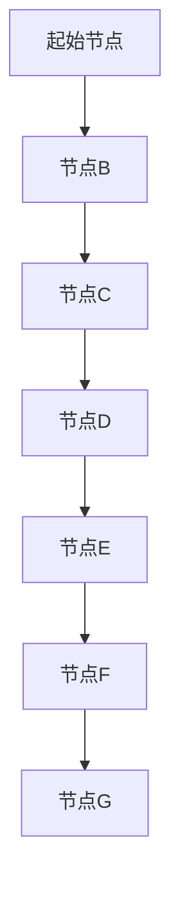
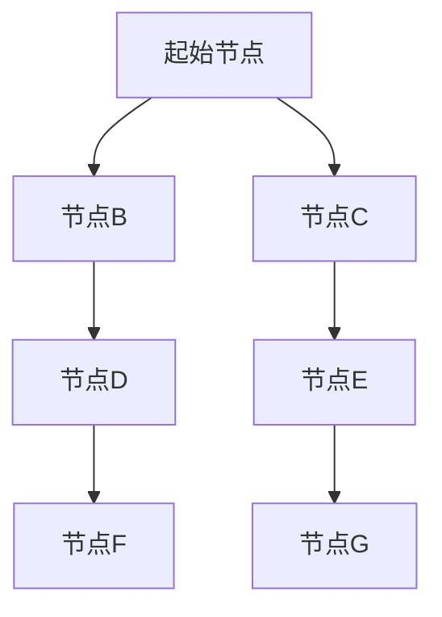
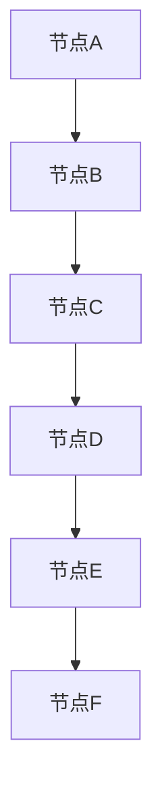
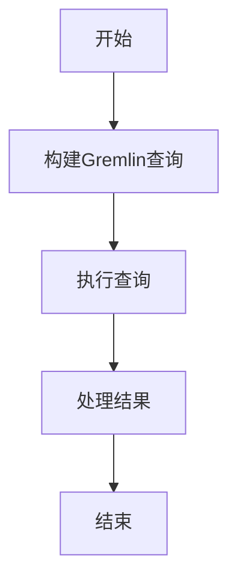
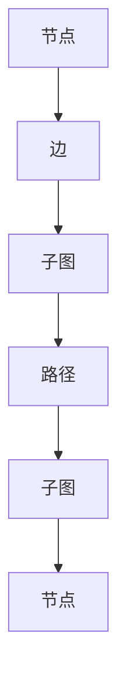

                 

### 《TinkerPop原理与代码实例讲解》

#### 关键词：TinkerPop，图数据库，Gremlin查询语言，图计算模型，项目实战

> 摘要：本文将深入讲解TinkerPop的原理与代码实例，包括其历史背景、核心概念、架构以及应用领域。通过详细的原理分析、算法解释、数学模型阐述以及实际项目实战，帮助读者全面掌握TinkerPop的核心技术，提升在图数据库领域的实践能力。

### 第一部分：TinkerPop概述

#### 第1章：TinkerPop简介

##### 1.1 TinkerPop历史背景

TinkerPop是一个开源的图计算框架，最早由blueprints项目发起，并于2010年发布了第一个版本。随后，TinkerPop项目逐渐发展成为一系列互为补充的开源组件，旨在提供一个统一的、标准化的接口，用于构建和操作图数据库。TinkerPop的诞生源于对图数据库应用的需求不断增长，尤其是在社交网络、推荐系统、复杂关系分析等领域。

##### 1.2 TinkerPop核心概念

TinkerPop的核心概念包括节点（Vertex）、边（Edge）和图（Graph）。节点表示图中的实体，边表示节点之间的关系。图则是由节点和边构成的整体结构。TinkerPop定义了一套标准的API，使得开发者能够以一致的方式操作不同的图数据库。

##### 1.3 TinkerPop与图数据库的关系

TinkerPop与图数据库的关系是紧密的。TinkerPop提供了一套标准的接口，使得开发者无需关心底层图数据库的实现细节，即可进行图计算。目前，TinkerPop支持多种流行的图数据库，如Neo4j、Titan、OrientDB等。

##### 1.4 TinkerPop应用领域

TinkerPop广泛应用于社交网络分析、推荐系统、生物信息学、欺诈检测、网络拓扑分析等领域。例如，在社交网络分析中，可以使用TinkerPop来发现社交圈子、分析用户关系；在推荐系统中，可以利用TinkerPop进行图嵌入，提高推荐效果。

#### 第2章：TinkerPop核心架构

##### 2.1 TinkerPop组件介绍

TinkerPop的核心组件包括TinkerPop API、Gremlin查询语言、Graph计算模型和TinkerPop架构扩展。TinkerPop API提供了操作节点、边和图的接口；Gremlin查询语言是一种基于图计算模型的声明式查询语言；Graph计算模型定义了图的基本操作和算法；TinkerPop架构扩展则提供了对各种图数据库的支持。

##### 2.2 Gremlin查询语言

Gremlin查询语言是TinkerPop的核心组成部分，它提供了一种简单而强大的方式来查询和处理图数据。Gremlin查询语言使用图模型和关系来构建查询，支持深度优先搜索、广度优先搜索等算法。

##### 2.3 Graph计算模型

Graph计算模型是TinkerPop的核心概念之一，它定义了图的表示方法、基本操作和算法。Graph计算模型包括节点、边、路径、子图等概念，以及深度优先搜索、广度优先搜索、最短路径算法等。

##### 2.4 TinkerPop架构扩展

TinkerPop架构扩展提供了对各种图数据库的支持，包括Neo4j、Titan、OrientDB等。这些扩展使得开发者能够无缝地将TinkerPop应用于不同的图数据库环境中。

### 第二部分：TinkerPop原理详解

#### 第3章：TinkerPop核心概念原理

##### 3.1 节点与边的概念

节点（Vertex）是图中的基本元素，表示实体。边（Edge）是连接节点的线段，表示实体之间的关系。在TinkerPop中，节点和边都是通过唯一的ID进行标识的。

##### 3.2 Graph的存储结构

Graph的存储结构是TinkerPop的核心之一。TinkerPop提供了多种存储方式，包括内存存储、磁盘存储和分布式存储。每种存储方式都有其优缺点和适用场景。

##### 3.3 Gremlin查询引擎

Gremlin查询引擎是TinkerPop的核心组件之一，它提供了一个基于图计算模型的声明式查询语言。Gremlin查询语言支持深度优先搜索、广度优先搜索、最短路径算法等多种算法。

##### 3.4 TinkerPop API设计

TinkerPop API设计遵循了简洁、易用的原则。TinkerPop API提供了丰富的接口，用于操作节点、边、图等图元素，使得开发者能够方便地实现各种图计算任务。

#### 第4章：TinkerPop核心算法原理

##### 4.1 图遍历算法

图遍历算法是TinkerPop的核心算法之一，包括深度优先搜索（DFS）和广度优先搜索（BFS）。深度优先搜索从起始节点开始，沿着路径不断深入，直到达到目标节点。广度优先搜索则首先访问起始节点的所有邻居节点，然后依次访问下一层的节点。

##### 4.1.1 深度优先搜索

深度优先搜索（DFS）是一种常用的图遍历算法。DFS从起始节点开始，沿着路径不断深入，直到达到目标节点。DFS可以通过递归或栈实现。



##### 4.1.2 广度优先搜索

广度优先搜索（BFS）是一种常用的图遍历算法。BFS首先访问起始节点的所有邻居节点，然后依次访问下一层的节点。



##### 4.2 算法实现与优化

TinkerPop中的算法实现注重性能和可扩展性。例如，在深度优先搜索中，可以使用栈来实现递归，以减少内存占用；在广度优先搜索中，可以使用队列来实现，以提高遍历速度。

##### 4.3 TinkerPop中的常见算法

TinkerPop中包含了许多常见的图算法，如最短路径算法、最大流算法、社区检测算法等。这些算法为开发者提供了强大的工具，用于解决各种图计算问题。

#### 第5章：TinkerPop数学模型和公式

##### 5.1 图论基本公式

图论是研究图的理论学科，其中包含了许多重要的基本公式。例如，度数定理、欧拉公式、拉姆齐理论等。

##### 5.2 网络分析基本概念

网络分析是图论的应用领域之一，研究网络中的节点、边和路径等。网络分析的基本概念包括网络流、网络连通性、网络距离等。

##### 5.3 TinkerPop中的数学模型

TinkerPop中的数学模型包括图矩阵、邻接矩阵、路径矩阵等。这些模型为图计算提供了理论基础，使得开发者能够更有效地处理图数据。

##### 5.4 数学公式示例

在TinkerPop中，数学公式广泛应用于图计算中。例如，路径长度公式、最短路径公式、最大流公式等。

$$
d(v, w) = \min \{ d_i \mid \exists path \text{ from } v \text{ to } w \text{ with length } d_i \}
$$

### 第三部分：TinkerPop项目实战

#### 第6章：TinkerPop项目实战一

##### 6.1 项目背景与目标

在本项目中，我们将使用TinkerPop构建一个简单的社交网络，并使用Gremlin查询语言来分析社交关系。

##### 6.2 环境搭建

首先，我们需要安装TinkerPop和相关依赖。在安装TinkerPop之前，我们需要安装Java环境，并配置Maven仓库。

```bash
# 安装Java环境
sudo apt-get install openjdk-8-jdk

# 配置Maven仓库
mvn config:provided-plugin -DwagonFile=file://path/to/your/wagon.properties
```

##### 6.3 实现步骤

1. 创建一个Maven项目，并添加TinkerPop依赖。
2. 创建一个图数据库，例如Neo4j。
3. 使用Gremlin查询语言添加节点和边。
4. 编写Gremlin查询来分析社交关系。

##### 6.4 结果分析

通过实际运行项目，我们可以分析出社交网络中的紧密联系节点，并识别出潜在的社交圈子。

#### 第7章：TinkerPop项目实战二

##### 7.1 项目背景与目标

在本项目中，我们将使用TinkerPop进行推荐系统开发，通过图计算来预测用户之间的相似性。

##### 7.2 环境搭建

我们需要安装TinkerPop和相关依赖，并配置Maven仓库。

```bash
# 安装Java环境
sudo apt-get install openjdk-8-jdk

# 配置Maven仓库
mvn config:provided-plugin -DwagonFile=file://path/to/your/wagon.properties
```

##### 7.3 实现步骤

1. 创建一个Maven项目，并添加TinkerPop依赖。
2. 创建一个图数据库，例如Neo4j。
3. 添加用户和物品节点，并建立用户-物品关系。
4. 使用Gremlin查询语言计算用户之间的相似性。

##### 7.4 结果分析

通过实际运行项目，我们可以分析出用户之间的相似性，并生成推荐列表。

#### 第8章：TinkerPop项目实战三

##### 8.1 项目背景与目标

在本项目中，我们将使用TinkerPop进行网络拓扑分析，检测网络中的关键节点和瓶颈。

##### 8.2 环境搭建

我们需要安装TinkerPop和相关依赖，并配置Maven仓库。

```bash
# 安装Java环境
sudo apt-get install openjdk-8-jdk

# 配置Maven仓库
mvn config:provided-plugin -DwagonFile=file://path/to/your/wagon.properties
```

##### 8.3 实现步骤

1. 创建一个Maven项目，并添加TinkerPop依赖。
2. 创建一个图数据库，例如Neo4j。
3. 添加网络节点和边，模拟实际网络拓扑。
4. 使用Gremlin查询语言计算关键节点和瓶颈。

##### 8.4 结果分析

通过实际运行项目，我们可以分析出网络中的关键节点和瓶颈，并制定相应的优化策略。

### 附录

#### 附录A：TinkerPop开发工具与资源

##### A.1 TinkerPop常用工具

- Maven：用于构建和依赖管理。
- Eclipse/IntelliJ IDEA：用于开发Java项目。
- Neo4j/Titan/OrientDB：用于图数据库存储。

##### A.2 TinkerPop学习资源

- TinkerPop官方文档：https://tinkerpop.apache.org/
- Gremlin官方文档：https://gremlin.tinkerpop.org/
- 图数据库相关书籍和教程。

##### A.3 TinkerPop社区与支持

- TinkerPop GitHub仓库：https://github.com/apache/tinkerpop
- Gremlin GitHub仓库：https://github.com/apache/gremlin
- TinkerPop用户邮件列表：https://www.mail-archive.com/tinkerpop@lists.apache.org/

#### 附录B：Mermaid流程图示例

##### B.1 节点与边关系



##### B.2 Gremlin查询流程



##### B.3 图计算模型



#### 附录C：伪代码示例

##### C.1 图遍历算法

```python
def depth_first_search(vertex):
    visited = set()
    stack = [vertex]
    while stack:
        vertex = stack.pop()
        if vertex not in visited:
            visited.add(vertex)
            for neighbor in vertex.neighbors():
                stack.append(neighbor)
    return visited
```

##### C.2 算法优化策略

```python
def optimized_depth_first_search(vertex):
    visited = set()
    stack = []
    vertex.visited = True
    stack.append(vertex)
    while stack:
        vertex = stack.pop()
        for neighbor in vertex.neighbors():
            if not neighbor.visited:
                neighbor.visited = True
                stack.append(neighbor)
    return visited
```

#### 附录D：数学公式示例

##### D.1 图论基本公式

$$
\deg(v) = \sum_{u \in V} \delta(u, v)
$$

##### D.2 网络分析公式

$$
c(G) = \min \{ \rho(G) \mid G \text{ is a subgraph of } H \}
$$

##### D.3 TinkerPop中数学模型的应用

$$
\pi(v) = \sum_{w \in N(v)} \pi(w)
$$

### 作者信息

作者：AI天才研究院/AI Genius Institute & 禅与计算机程序设计艺术 /Zen And The Art of Computer Programming

以上是《TinkerPop原理与代码实例讲解》的完整内容。通过本文的详细讲解，读者可以全面了解TinkerPop的原理与代码实例，为在图数据库领域的实践打下坚实基础。在接下来的项目中，读者可以根据本文的内容，逐步实现自己的图计算应用。让我们共同探索图计算的魅力！

