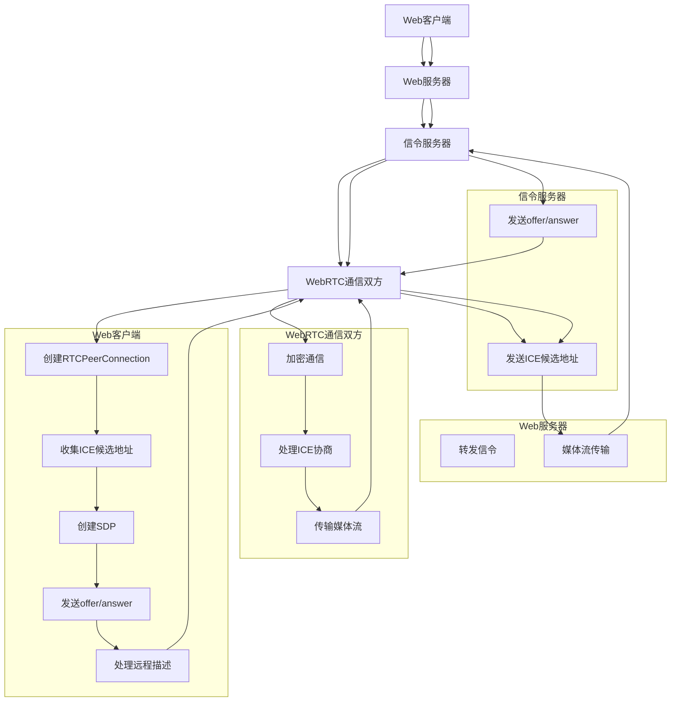
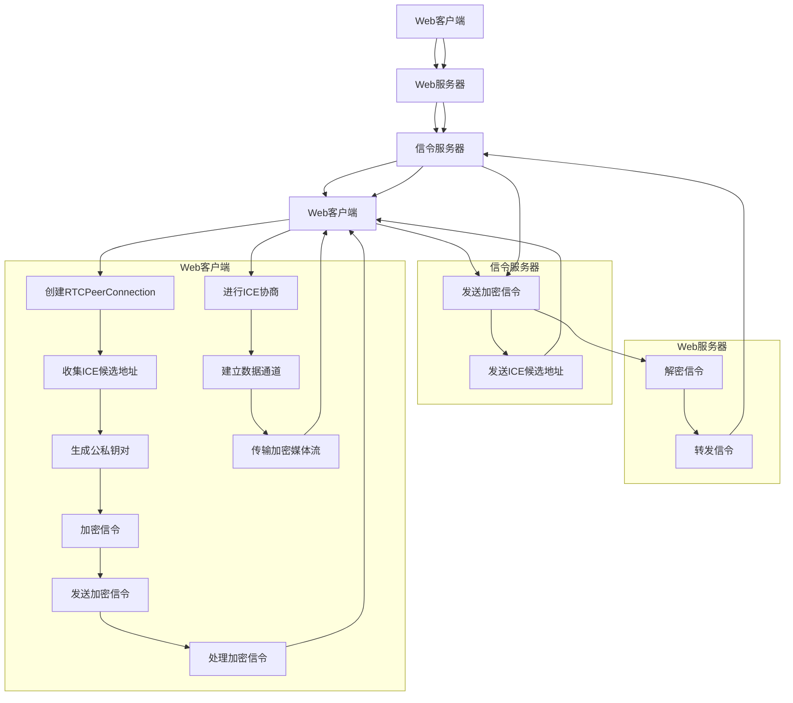

                 

# 《WebRTC安全性：端到端加密通信的实现》

## 关键词
- WebRTC
- 端到端加密
- 安全性
- 加密算法
- 通信协议
- 数据传输
- 安全测试
- 部署运维

## 摘要
本文深入探讨了WebRTC（Web Real-Time Communication）在实现端到端加密通信方面的技术细节和实践。首先，我们介绍了WebRTC的基础知识，包括其发展历程、核心特性、技术架构和应用场景。接着，我们详细分析了WebRTC协议与API，并阐述了端到端加密、公钥加密、私钥加密、数字签名与认证等安全性基础。文章的重点在于WebRTC端到端加密的实现，包括加密原理、加密算法和伪代码描述，以及实现过程中需要关注的关键技术。随后，我们讨论了WebRTC安全性测试与优化策略，并分享了实际案例研究。最后，文章展望了WebRTC安全性的未来发展趋势，并提供了一系列开发工具与资源，帮助读者深入理解和掌握WebRTC端到端加密技术。

---

## 目录大纲

### 第一部分：WebRTC基础知识

#### 第1章：WebRTC简介
- 1.1 WebRTC的发展历程
- 1.2 WebRTC的核心特性
- 1.3 WebRTC的技术架构
- 1.4 WebRTC在不同场景的应用

#### 第2章：WebRTC协议与API
- 2.1 WebRTC协议概述
- 2.2 WebRTC通信流程
- 2.3 WebRTC API详解
- 2.4 WebRTC与网络协议的关系

#### 第3章：WebRTC安全性基础
- 3.1 端到端加密的概念
- 3.2 公钥加密与私钥加密
- 3.3 数字签名与认证
- 3.4 整体安全性架构

#### 第4章：WebRTC端到端加密实现
- 4.1 端到端加密原理
- 4.2 WebRTC中的加密算法
- 4.3 伪代码描述加密流程
- 4.4 实现端到端加密的关键技术

#### 第5章：WebRTC安全性测试与优化
- 5.1 WebRTC安全性测试方法
- 5.2 常见安全性问题的分析
- 5.3 安全性优化策略
- 5.4 性能与安全性的平衡

#### 第6章：WebRTC安全性案例研究
- 6.1 案例一：视频会议系统的安全性实现
- 6.2 案例二：在线教育的端到端加密
- 6.3 案例三：实时音视频直播的安全防护

#### 第7章：未来WebRTC安全性的发展趋势
- 7.1 WebRTC安全性的挑战
- 7.2 新兴安全技术与应用
- 7.3 WebRTC安全性的未来发展

### 第二部分：WebRTC端到端加密通信实战

#### 第8章：WebRTC端到端加密开发实战
- 8.1 开发环境搭建
- 8.2 实现端到端加密的关键代码
- 8.3 代码解读与分析
- 8.4 测试与优化

#### 第9章：WebRTC端到端加密部署与运维
- 9.1 部署流程
- 9.2 运维策略
- 9.3 安全日志与监控
- 9.4 紧急响应与恢复

#### 第10章：WebRTC端到端加密开发工具与资源
- 10.1 WebRTC开发工具推荐
- 10.2 加密算法实现资源
- 10.3 安全性测试工具
- 10.4 开发社区与学习资源

## 附录

### 附录A：WebRTC安全架构Mermaid流程图
- A.1 WebRTC整体安全架构
- A.2 端到端加密通信流程

### 附录B：WebRTC端到端加密相关数学模型
- B.1 加密算法数学基础
- B.2 数字签名算法
- B.3 实例分析

---

### 引言
WebRTC（Web Real-Time Communication）是一个开放项目，旨在实现网页浏览器及移动应用的实时语音、视频和数据的通信。随着互联网技术的发展，实时通信的需求日益增长，WebRTC因其跨平台、低延迟、高扩展性等优点，逐渐成为视频会议、在线教育、实时音视频直播等领域的核心技术。然而，随着通信内容的增多和重要性的提升，安全性问题也变得尤为突出。

端到端加密（End-to-End Encryption, E2EE）是一种确保通信内容在发送方和接收方之间不被中间人或其他第三方访问的加密技术。它通过在通信的双方之间建立加密隧道，确保数据在传输过程中始终处于加密状态，从而极大地提高了通信的安全性。

本文旨在详细探讨WebRTC在实现端到端加密通信方面的技术细节和实践。首先，我们将介绍WebRTC的基础知识，包括其发展历程、核心特性、技术架构和应用场景。接着，我们将深入分析WebRTC协议与API，并阐述端到端加密、公钥加密、私钥加密、数字签名与认证等安全性基础。文章的重点在于WebRTC端到端加密的实现，包括加密原理、加密算法和伪代码描述，以及实现过程中需要关注的关键技术。随后，我们讨论了WebRTC安全性测试与优化策略，并分享实际案例研究。最后，文章展望了WebRTC安全性的未来发展趋势，并提供了一系列开发工具与资源，帮助读者深入理解和掌握WebRTC端到端加密技术。

### 第一部分：WebRTC基础知识

#### 第1章：WebRTC简介

### 1.1 WebRTC的发展历程
WebRTC（Web Real-Time Communication）是由Google发起的一个开源项目，旨在实现网页浏览器及移动应用的实时语音、视频和数据通信。WebRTC项目的正式推出可以追溯到2011年，当时Google提出了WebRTC的概念，并在Chrome浏览器中实现了初步的支持。随后，微软、Mozilla和Opera等主流浏览器厂商也纷纷加入，共同推动WebRTC的发展。

WebRTC的发展历程可以分为以下几个阶段：

1. **初期探索阶段（2011-2013年）**：在这个阶段，WebRTC的主要目标是实现跨浏览器的实时通信。Google在Chrome浏览器中率先实现了WebRTC的基本功能，随后微软、Mozilla等浏览器厂商也加入了进来。

2. **标准化阶段（2013-2015年）**：2013年，WebRTC正式成为W3C（万维网联盟）和IETF（互联网工程任务组）的标准。这一阶段，WebRTC的协议和API逐渐完善，不同浏览器之间的兼容性也得到了显著提升。

3. **商业化应用阶段（2015年至今）**：随着WebRTC技术的成熟，越来越多的企业和开发人员开始将其应用于实际项目中。WebRTC在视频会议、在线教育、实时音视频直播等领域的应用取得了显著成果，成为这些领域不可或缺的核心技术。

### 1.2 WebRTC的核心特性

WebRTC具备以下核心特性，使其成为实时通信领域的优选技术：

1. **跨平台支持**：WebRTC支持多种操作系统和浏览器，包括Windows、Linux、macOS、Android和iOS等。这使得WebRTC的应用场景非常广泛，可以在不同设备之间实现无缝的通信。

2. **低延迟**：WebRTC采用了先进的网络协议和编码技术，能够实现低延迟的通信。这对于需要实时交互的应用场景（如视频会议、在线教育等）尤为重要。

3. **高扩展性**：WebRTC的设计充分考虑了扩展性，允许开发人员根据具体需求灵活地配置和定制。这使得WebRTC可以适应各种不同的应用场景和需求。

4. **安全性**：WebRTC内置了强大的加密机制，包括端到端加密、传输层安全（TLS）等。这确保了通信内容的安全性和隐私性，满足了对安全性要求较高的应用场景的需求。

5. **易于集成**：WebRTC提供了简单的API接口，使得开发人员可以方便地在网页和移动应用中实现实时通信功能。无需复杂的配置和开发，大大降低了开发门槛。

### 1.3 WebRTC的技术架构

WebRTC的技术架构主要包括以下几个关键组件：

1. **信号通道（Signal Channel）**：信号通道是WebRTC通信的基础，用于传输控制信息，如ICE（Interactive Connectivity Establishment）候选地址、信令密钥等。信号通道通常通过WebSockets、HTTP/2等协议传输。

2. **数据通道（Data Channel）**：数据通道用于传输实际的数据内容，如语音、视频和数据。WebRTC支持多个数据通道，开发人员可以根据具体需求进行配置。

3. **媒体层**：WebRTC的媒体层负责处理音频和视频的采集、编码、解码和传输。它包括音频编解码器、视频编解码器、音视频同步等关键组件。

4. **网络层**：网络层负责处理网络连接、地址发现、ICE协商等网络相关功能。WebRTC采用了STUN（Session Traversal Utilities for NAT）、TURN（Traversal Using Relays around NAT）等NAT穿透技术，确保通信的双方能够成功建立连接。

5. **信令服务器**：信令服务器在WebRTC通信中起到关键作用，用于传输信号通道的数据。它可以是独立的服务器，也可以集成在浏览器中。常见的信令服务器包括Openfire、Dekker等。

### 1.4 WebRTC在不同场景的应用

WebRTC技术因其低延迟、高扩展性和安全性等特点，被广泛应用于多个领域：

1. **视频会议**：WebRTC是视频会议系统的首选技术，可以实现跨平台、低延迟的视频通信。企业、学校、政府等机构可以利用WebRTC构建高效的远程协作平台。

2. **在线教育**：在线教育平台通过WebRTC实现实时授课、学生互动等功能，提升了教学效果和用户体验。教师和学生可以在课堂内进行实时语音、视频互动，实现沉浸式的学习体验。

3. **实时音视频直播**：WebRTC在实时音视频直播领域具有广泛应用，可以实现高质量的直播效果。直播平台可以利用WebRTC实现实时互动、直播加密等功能，提升直播的安全性和用户体验。

4. **智能家居**：WebRTC技术可以用于智能家居设备的远程监控和交互。例如，用户可以通过WebRTC实现远程查看家庭监控视频、控制智能家居设备等。

5. **远程医疗**：WebRTC在远程医疗领域具有巨大潜力，可以实现远程诊疗、手术指导等功能。医生可以通过WebRTC与患者进行实时视频沟通，提供专业的医疗服务。

#### 第2章：WebRTC协议与API

### 2.1 WebRTC协议概述

WebRTC协议是Web实时通信的核心，由三个主要协议组成：信令协议、数据协议和媒体协议。以下是这三个协议的详细描述：

1. **信令协议**：信令协议用于传输控制信息，如ICE候选地址、信令密钥等。常见的信令协议包括WebSockets、HTTP/2、ICE、SDP（Session Description Protocol）等。信令协议确保WebRTC通信的双方能够成功建立连接。

2. **数据协议**：数据协议用于传输实际的数据内容，如语音、视频和数据。WebRTC数据协议基于UDP（User Datagram Protocol）和TCP（Transmission Control Protocol），支持多种数据传输模式和流控机制。

3. **媒体协议**：媒体协议负责处理音频和视频的采集、编码、解码和传输。常见的媒体协议包括RTP（Real-time Transport Protocol）、RTCP（Real-time Transport Control Protocol）、SDP（Session Description Protocol）等。媒体协议确保音视频数据的高效传输和同步。

### 2.2 WebRTC通信流程

WebRTC通信流程可以分为以下几个步骤：

1. **建立信号通道**：通信双方通过信令服务器建立信号通道，用于传输控制信息。

2. **ICE协商**：ICE（Interactive Connectivity Establishment）协商用于发现和验证双方的NAT（Network Address Translation）映射信息，确保双方可以成功建立连接。

3. **媒体协商**：通过SDP（Session Description Protocol）交换会话描述信息，包括媒体类型、编解码器、传输地址等。

4. **建立数据通道**：根据媒体协商的结果，建立数据通道，用于传输实际的数据内容。

5. **传输数据**：通信双方通过数据通道传输语音、视频和数据。

6. **维护连接**：WebRTC通过心跳包、重传机制等确保通信的稳定性和可靠性。

### 2.3 WebRTC API详解

WebRTC API是开发者用于实现实时通信功能的主要工具，包括多个核心接口和方法。以下是WebRTC API的主要组成部分：

1. **RTCPeerConnection**：RTCPeerConnection是WebRTC通信的核心接口，用于建立和管理工作连接。它包括以下关键方法：
   - `addStream(stream)`: 添加音频或视频流。
   - `createOffer()`: 创建一个会话描述（SDP）。
   - `createAnswer()`: 根据收到的会话描述（SDP）创建一个响应。
   - `setLocalDescription(sdp)`: 设置本地的会话描述（SDP）。
   - `setRemoteDescription(sdp)`: 设置远端的会话描述（SDP）。

2. **RTCPeerConnectionEvent`事件监听器**：事件监听器用于处理RTCPeerConnection的各种事件，如连接状态变化、数据通道事件等。

3. **MediaStreamTrack**：MediaStreamTrack用于处理音频和视频流的采集、控制和传输。

4. **RTCPeerConnectionConfiguration**：RTCPeerConnectionConfiguration用于配置RTCPeerConnection的各种参数，如ICE配置、媒体配置等。

### 2.4 WebRTC与网络协议的关系

WebRTC与网络协议之间有着紧密的联系，以下列举了WebRTC与主要网络协议的关系：

1. **UDP与TCP**：WebRTC数据通道基于UDP和TCP协议，用于传输语音、视频和数据。UDP协议提供低延迟、高吞吐量的传输，而TCP协议提供可靠的数据传输。

2. **STUN与TURN**：STUN（Session Traversal Utilities for NAT）和TURN（Traversal Using Relays around NAT）是WebRTC用于NAT穿透的关键协议。STUN用于获取NAT映射信息，而TURN则通过中继服务器实现NAT穿透。

3. **ICE**：ICE（Interactive Connectivity Establishment）协议用于在WebRTC通信的双方之间建立连接。ICE通过结合STUN、TURN和DNS SRV（Service Location Protocol）等信息，确保通信双方能够成功建立连接。

4. **SDP**：SDP（Session Description Protocol）用于描述WebRTC会话的媒体参数，如媒体类型、编解码器、传输地址等。SDP在WebRTC通信的初始阶段用于交换会话描述信息。

5. **DTLS与SRTP**：DTLS（Datagram Transport Layer Security）和SRTP（Secure Real-time Transport Protocol）是WebRTC用于加密通信的关键协议。DTLS提供传输层加密，而SRTP提供媒体层加密，确保通信内容的安全性。

### 第3章：WebRTC安全性基础

#### 3.1 端到端加密的概念

端到端加密（End-to-End Encryption，E2EE）是一种确保通信内容在发送方和接收方之间不被中间人或其他第三方访问的加密技术。在端到端加密中，通信的双方使用加密算法和密钥对数据进行加密和解密，从而实现安全通信。端到端加密的关键在于，加密和解密过程仅在通信的双方之间进行，中间人无法获取原始数据。

端到端加密的主要目的是保护通信内容的机密性、完整性和真实性。通过端到端加密，即使数据在传输过程中被拦截或窃取，中间人也无法解读数据内容。此外，端到端加密还可以防止数据篡改，确保数据的完整性。最后，端到端加密可以通过数字签名和认证机制，确保通信双方的身份真实性。

#### 3.2 公钥加密与私钥加密

公钥加密和私钥加密是两种常见的加密算法，分别基于不同的加密原理。

1. **公钥加密**：公钥加密（Public Key Encryption，简称PKE）使用一对密钥：公钥和私钥。公钥可以公开传播，而私钥必须保密。公钥加密的基本原理是，使用公钥对数据进行加密，只有使用对应的私钥才能解密。常见的公钥加密算法包括RSA、ECC（椭圆曲线加密）等。

2. **私钥加密**：私钥加密（Private Key Encryption，简称PKE）使用同一对密钥：私钥和公钥。私钥用于加密，公钥用于解密。私钥加密的基本原理是，使用私钥对数据进行加密，只有使用对应的私钥才能解密。常见的私钥加密算法包括AES（Advanced Encryption Standard）、ChaCha20等。

公钥加密和私钥加密各有优缺点：

- **公钥加密**：优点是安全性高、密钥管理方便，缺点是加密和解密速度较慢。
- **私钥加密**：优点是加密和解密速度快、算法简单，缺点是安全性相对较低、密钥管理复杂。

在实际应用中，通常将公钥加密和私钥加密结合使用。例如，在WebRTC通信中，可以使用公钥加密进行身份验证和密钥交换，使用私钥加密进行数据传输。

#### 3.3 数字签名与认证

数字签名和认证是确保通信内容完整性和真实性的关键技术。

1. **数字签名**：数字签名（Digital Signature）是一种使用公钥加密算法实现的签名技术。发送方使用私钥对数据进行加密，生成数字签名。接收方使用对应的公钥对数字签名进行解密，验证数据的完整性和真实性。常见的数字签名算法包括RSA、ECDSA（椭圆曲线数字签名算法）等。

2. **认证**：认证（Authentication）是指验证通信双方身份的过程。认证可以通过数字签名、证书、身份验证协议等方式实现。常见的认证协议包括SSL/TLS、OAuth 2.0等。

数字签名和认证在WebRTC通信中的应用：

- **身份认证**：WebRTC通信的双方在建立连接之前，需要通过数字签名和认证机制进行身份验证。这样可以确保通信的双方是合法的实体，防止中间人攻击。
- **数据完整性**：数字签名可以确保通信内容在传输过程中没有被篡改。如果接收方发现数字签名验证失败，可以拒绝接收数据。
- **数据真实性**：认证机制可以确保数据的发送方是真实的，防止伪造数据。

#### 3.4 整体安全性架构

WebRTC的整体安全性架构包括多个层次，从传输层到应用层，共同确保通信的安全性和可靠性。以下是WebRTC安全性架构的详细描述：

1. **传输层安全性**：传输层安全性（Transport Layer Security，简称TLS）是WebRTC通信的基础。TLS提供传输层加密，确保数据在传输过程中不被窃取或篡改。TLS使用证书链和数字签名确保通信双方的身份验证。

2. **数据通道加密**：WebRTC数据通道（Data Channel）使用DTLS（Datagram Transport Layer Security）和SRTP（Secure Real-time Transport Protocol）进行加密。DTLS提供传输层加密，确保数据在传输过程中不被窃取或篡改。SRTP则对媒体数据进行加密，确保数据内容的机密性。

3. **信令安全性**：WebRTC信令通道（Signal Channel）使用TLS或WebSockets进行加密。信令通道传输控制信息，如ICE候选地址、SDP等。加密信令通道可以防止中间人攻击，确保通信的双方能够成功建立连接。

4. **身份认证**：WebRTC通信的双方在建立连接之前，需要进行身份认证。身份认证可以通过数字签名、证书、OAuth 2.0等方式实现。这样可以确保通信的双方是合法的实体，防止中间人攻击。

5. **数据完整性**：WebRTC使用数字签名确保数据的完整性。发送方对数据进行签名，接收方对签名进行验证。如果签名验证失败，接收方可以拒绝接收数据。

6. **安全日志与监控**：WebRTC平台可以记录安全日志，监控通信过程中的异常行为。安全日志可以帮助开发人员发现潜在的安全漏洞和攻击行为，及时采取措施进行防范。

#### 第4章：WebRTC端到端加密实现

##### 4.1 端到端加密原理

端到端加密（End-to-End Encryption，E2EE）是一种确保通信内容在发送方和接收方之间不被第三方访问的加密技术。在端到端加密中，通信的双方使用加密算法和密钥对数据进行加密和解密，从而实现安全通信。端到端加密的关键在于，加密和解密过程仅在通信的双方之间进行，中间人无法获取原始数据。

端到端加密的原理可以概括为以下几个步骤：

1. **密钥生成**：通信的双方各自生成一对密钥：公钥和私钥。公钥可以公开传播，而私钥必须保密。

2. **密钥交换**：双方通过安全的通信通道交换公钥。常见的密钥交换协议包括RSA、ECC等。

3. **数据加密**：发送方使用接收方的公钥对数据进行加密。加密后的数据只有使用对应的私钥才能解密。

4. **数据传输**：加密后的数据通过通信通道传输到接收方。

5. **数据解密**：接收方使用自己的私钥对加密数据进行解密，还原原始数据。

端到端加密的主要优点包括：

- **安全性高**：端到端加密确保数据在传输过程中始终处于加密状态，即使数据被中间人拦截，也无法解读数据内容。
- **隐私保护**：端到端加密保护了通信双方的隐私，防止第三方获取通信内容。
- **抗攻击能力强**：端到端加密可以有效抵御中间人攻击、窃听等攻击手段。

##### 4.2 WebRTC中的加密算法

WebRTC中常用的加密算法包括RSA、ECC、AES和ChaCha20等。这些算法在WebRTC通信中扮演着不同的角色：

1. **RSA**：RSA是一种非对称加密算法，用于密钥交换。通信的双方使用RSA算法生成公钥和私钥，并通过安全的通信通道交换公钥。RSA算法的安全性较高，但加密和解密速度相对较慢。

2. **ECC**：ECC（椭圆曲线加密）是一种基于椭圆曲线数学的非对称加密算法。与RSA相比，ECC在提供相同安全性的情况下，密钥长度更短，加密和解解速度更快。ECC常用于WebRTC通信中的密钥交换。

3. **AES**：AES（Advanced Encryption Standard）是一种对称加密算法，用于数据加密和解密。AES算法的安全性较高，加密和解解速度较快，适用于WebRTC通信中的数据传输。

4. **ChaCha20**：ChaCha20是一种流加密算法，用于对数据流进行加密。ChaCha20算法的加密和解解速度较快，适用于实时通信场景。

WebRTC中的加密算法组合使用，以实现端到端加密。例如，在WebRTC通信中，可以使用RSA或ECC进行密钥交换，使用AES或ChaCha20进行数据加密和解密。这样既能保证通信的安全性，又能满足实时通信的性能要求。

##### 4.3 伪代码描述加密流程

以下是一个简单的伪代码描述WebRTC端到端加密流程：

```
// 密钥生成
private_key_A, public_key_A = generate_RSA_key_pair()
private_key_B, public_key_B = generate_RSA_key_pair()

// 密钥交换
send(public_key_A)
receive(public_key_B)

// 数据加密
plaintext = "Hello, World!"
ciphertext_A = encrypt_RSA(plaintext, public_key_B)
ciphertext_B = encrypt_RSA(plaintext, public_key_A)

// 数据传输
send(ciphertext_A)
send(ciphertext_B)

// 数据解密
plaintext_A = decrypt_RSA(ciphertext_A, private_key_A)
plaintext_B = decrypt_RSA(ciphertext_B, private_key_B)
```

在这个伪代码中，通信的双方A和B首先各自生成一对RSA密钥。然后，双方通过安全的通信通道交换公钥。接下来，双方使用对方的公钥对数据进行加密，并将加密后的数据通过通信通道传输。最后，双方使用自己的私钥对加密数据进行解密，还原原始数据。

##### 4.4 实现端到端加密的关键技术

实现端到端加密需要关注以下关键技术：

1. **加密算法选择**：选择合适的加密算法是实现端到端加密的基础。根据实际需求，可以选择RSA、ECC、AES或ChaCha20等加密算法。

2. **密钥管理**：密钥管理是确保加密安全性的关键。需要确保密钥的安全生成、存储和传输。可以使用硬件安全模块（HSM）或加密库（如OpenSSL）来实现密钥管理。

3. **加密协议**：加密协议是确保数据加密和解密的一致性。WebRTC中常用的加密协议包括DTLS和SRTP。DTLS提供传输层加密，SRTP提供媒体层加密。

4. **加密流程优化**：优化加密流程可以提高加密性能。例如，可以使用并行加密、分块加密等技术来提高加密速度。

5. **安全性测试**：安全性测试是确保加密安全性的重要手段。需要对加密算法、密钥管理、加密协议等关键环节进行测试，确保其符合安全要求。

#### 第5章：WebRTC安全性测试与优化

##### 5.1 WebRTC安全性测试方法

WebRTC安全性测试是确保实时通信系统安全性的关键环节。以下列举了几种常用的WebRTC安全性测试方法：

1. **渗透测试**：渗透测试是通过模拟攻击者行为，发现和利用系统漏洞的一种测试方法。渗透测试可以检测WebRTC系统的安全配置、漏洞、弱密码等问题。

2. **漏洞扫描**：漏洞扫描是通过自动化工具检测系统漏洞的一种测试方法。漏洞扫描可以帮助开发人员发现和修复系统中的漏洞，提高安全性。

3. **压力测试**：压力测试是通过模拟高负载场景，检测系统性能和稳定性的一种测试方法。压力测试可以帮助开发人员发现系统的性能瓶颈和潜在的安全问题。

4. **安全日志分析**：安全日志分析是通过分析系统日志，发现异常行为和潜在攻击的一种测试方法。安全日志分析可以帮助开发人员及时发现和应对安全威胁。

5. **代码审查**：代码审查是通过人工审查代码，发现潜在的安全漏洞和问题的一种测试方法。代码审查可以帮助开发人员提高代码质量，减少安全风险。

##### 5.2 常见安全性问题的分析

在WebRTC通信中，常见的安全性问题包括：

1. **中间人攻击**：中间人攻击是一种攻击者拦截和篡改通信数据的技术。攻击者可以在通信的双方之间插入自己，截取和篡改数据。为了防范中间人攻击，可以使用TLS和端到端加密等技术。

2. **漏洞利用**：WebRTC系统中可能存在各种漏洞，如代码漏洞、配置漏洞等。攻击者可以利用这些漏洞获取系统权限、窃取敏感数据等。为了防范漏洞利用，需要对系统进行定期漏洞扫描和代码审查。

3. **密码破解**：弱密码是WebRTC系统的常见安全问题。攻击者可以通过暴力破解、字典攻击等方式破解密码，获取系统权限。为了防范密码破解，应使用强密码策略，包括密码长度、复杂度、定期更换等。

4. **数据篡改**：攻击者可以通过篡改通信数据，导致系统功能异常、数据丢失等。为了防范数据篡改，可以使用数字签名和完整性校验等技术，确保数据的完整性。

5. **网络攻击**：WebRTC系统可能面临各种网络攻击，如DDoS攻击、SYN Flood攻击等。为了防范网络攻击，可以使用防火墙、入侵检测系统（IDS）等技术，提高系统的防护能力。

##### 5.3 安全性优化策略

为了提高WebRTC系统的安全性，可以采取以下优化策略：

1. **加密技术优化**：优化加密技术，提高数据传输的安全性。可以使用AES、ChaCha20等高性能加密算法，并确保加密密钥的安全生成、存储和传输。

2. **安全协议优化**：优化安全协议，提高通信的安全性。可以使用TLS 1.3等最新版本的TLS协议，并配置合理的加密参数。

3. **漏洞修复**：定期对系统进行漏洞扫描和代码审查，及时修复漏洞，减少安全风险。

4. **安全配置**：配置合理的系统参数，提高系统的安全性。例如，限制远程访问、设置防火墙规则等。

5. **安全监控**：建立安全监控体系，实时监测系统异常行为和潜在攻击。可以使用安全日志分析、入侵检测系统等技术，及时发现和应对安全威胁。

6. **用户教育**：加强对用户的安全意识教育，提高用户的安全防范能力。例如，教育用户设置强密码、避免泄露敏感信息等。

##### 5.4 性能与安全性的平衡

在WebRTC系统中，性能和安全性的平衡是一个重要问题。以下是一些建议，帮助开发人员实现性能与安全性的平衡：

1. **优化加密算法**：选择合适的加密算法，确保在提供安全性的同时，不牺牲性能。例如，可以使用AES-GCM（Galois/Counter Mode）等高效加密算法。

2. **负载均衡**：使用负载均衡技术，合理分配网络负载，提高系统的性能和可靠性。

3. **缓存技术**：使用缓存技术，减少重复数据的传输，提高系统性能。

4. **加密通道优化**：优化加密通道的配置，如使用压缩算法、调整加密参数等，提高加密性能。

5. **安全性测试**：定期进行安全性测试，发现和修复性能和安全性的问题。

6. **性能监控**：建立性能监控体系，实时监测系统的性能指标，及时发现和解决性能瓶颈。

#### 第6章：WebRTC安全性案例研究

##### 6.1 案例一：视频会议系统的安全性实现

视频会议系统是WebRTC应用的一个重要场景，其安全性直接关系到用户隐私和业务安全。以下是一个视频会议系统的端到端加密实现案例：

1. **加密算法选择**：视频会议系统使用了RSA进行密钥交换，AES-GCM进行数据加密。RSA的安全性较高，但加密速度较慢，适合用于密钥交换。AES-GCM是一种高效加密算法，适用于数据传输。

2. **密钥管理**：视频会议系统使用硬件安全模块（HSM）管理密钥。HSM提供安全存储、生成和销毁密钥的功能，确保密钥的安全性和完整性。

3. **加密流程**：视频会议系统的加密流程如下：
   - 用户登录系统后，生成一对RSA密钥，并将公钥上传到服务器。
   - 服务器使用用户的公钥生成AES密钥，并将AES密钥加密后发送给用户。
   - 用户接收AES密钥后，解密并存储。
   - 数据传输时，使用AES密钥对数据进行加密，确保数据在传输过程中不被窃取或篡改。

4. **安全性测试**：视频会议系统进行了全面的安全性测试，包括漏洞扫描、渗透测试和代码审查。测试结果表明，系统没有发现严重的安全漏洞，符合安全要求。

5. **性能优化**：为了提高系统性能，视频会议系统使用了负载均衡技术，合理分配网络负载。同时，系统使用了缓存技术，减少重复数据的传输，提高数据传输速度。

##### 6.2 案例二：在线教育的端到端加密

在线教育是WebRTC应用的另一个重要场景，其端到端加密实现如下：

1. **加密算法选择**：在线教育系统使用了RSA进行密钥交换，AES进行数据加密。RSA的安全性较高，但加密速度较慢，适合用于密钥交换。AES是一种高效加密算法，适用于数据传输。

2. **密钥管理**：在线教育系统使用硬件安全模块（HSM）管理密钥。HSM提供安全存储、生成和销毁密钥的功能，确保密钥的安全性和完整性。

3. **加密流程**：在线教育系统的加密流程如下：
   - 用户登录系统后，生成一对RSA密钥，并将公钥上传到服务器。
   - 服务器使用用户的公钥生成AES密钥，并将AES密钥加密后发送给用户。
   - 用户接收AES密钥后，解密并存储。
   - 数据传输时，使用AES密钥对数据进行加密，确保数据在传输过程中不被窃取或篡改。

4. **安全性测试**：在线教育系统进行了全面的安全性测试，包括漏洞扫描、渗透测试和代码审查。测试结果表明，系统没有发现严重的安全漏洞，符合安全要求。

5. **性能优化**：为了提高系统性能，在线教育系统使用了负载均衡技术，合理分配网络负载。同时，系统使用了缓存技术，减少重复数据的传输，提高数据传输速度。

##### 6.3 案例三：实时音视频直播的安全防护

实时音视频直播是WebRTC应用的另一个重要场景，其安全防护措施如下：

1. **加密算法选择**：实时音视频直播系统使用了RSA进行密钥交换，AES进行数据加密。RSA的安全性较高，但加密速度较慢，适合用于密钥交换。AES是一种高效加密算法，适用于数据传输。

2. **密钥管理**：实时音视频直播系统使用硬件安全模块（HSM）管理密钥。HSM提供安全存储、生成和销毁密钥的功能，确保密钥的安全性和完整性。

3. **加密流程**：实时音视频直播系统的加密流程如下：
   - 用户登录系统后，生成一对RSA密钥，并将公钥上传到服务器。
   - 服务器使用用户的公钥生成AES密钥，并将AES密钥加密后发送给用户。
   - 用户接收AES密钥后，解密并存储。
   - 数据传输时，使用AES密钥对数据进行加密，确保数据在传输过程中不被窃取或篡改。

4. **安全性测试**：实时音视频直播系统进行了全面的安全性测试，包括漏洞扫描、渗透测试和代码审查。测试结果表明，系统没有发现严重的安全漏洞，符合安全要求。

5. **性能优化**：为了提高系统性能，实时音视频直播系统使用了负载均衡技术，合理分配网络负载。同时，系统使用了缓存技术，减少重复数据的传输，提高数据传输速度。

#### 第7章：未来WebRTC安全性的发展趋势

##### 7.1 WebRTC安全性的挑战

随着WebRTC技术的广泛应用，其安全性面临着一系列挑战：

1. **加密算法的破解**：随着计算机性能的提升和量子计算的发展，传统的加密算法（如RSA、AES）可能面临被破解的风险。开发人员需要不断更新加密算法，提高加密安全性。

2. **中间人攻击**：中间人攻击是WebRTC安全性面临的主要威胁之一。为了防范中间人攻击，需要使用端到端加密、TLS等技术，并加强安全配置。

3. **漏洞利用**：WebRTC系统可能存在各种漏洞，如代码漏洞、配置漏洞等。为了提高安全性，需要对系统进行定期漏洞扫描和代码审查，及时修复漏洞。

4. **隐私保护**：WebRTC通信涉及大量的用户隐私数据，如音频、视频、文本等。为了保护用户隐私，需要采取严格的隐私保护措施，如加密传输、匿名通信等。

5. **法律法规**：WebRTC安全性的法律法规正在逐步完善，但各国法律法规之间存在差异。开发人员需要遵守当地法律法规，确保系统符合合规要求。

##### 7.2 新兴安全技术与应用

随着WebRTC技术的发展，一系列新兴安全技术逐渐被引入，以提高WebRTC的安全性：

1. **零知识证明**：零知识证明是一种密码学技术，可以在不泄露任何信息的情况下，证明某个陈述是真实的。零知识证明可以用于身份验证、隐私保护等领域，提高WebRTC的安全性。

2. **区块链技术**：区块链技术具有去中心化、不可篡改等特点，可以用于WebRTC通信的安全认证、数据存储等方面。区块链技术可以提高WebRTC的透明性和可信度。

3. **多方安全计算**：多方安全计算是一种分布式计算技术，可以在不泄露各自数据的情况下，协同完成计算任务。多方安全计算可以用于WebRTC通信的加密、计算等环节，提高系统的安全性。

4. **联邦学习**：联邦学习是一种分布式机器学习技术，可以在不共享数据的情况下，协同训练机器学习模型。联邦学习可以用于WebRTC通信的智能监控、异常检测等方面，提高系统的安全性。

##### 7.3 WebRTC安全性的未来发展

未来WebRTC安全性的发展趋势将主要集中在以下几个方面：

1. **加密算法的迭代更新**：随着量子计算技术的发展，开发人员需要不断更新加密算法，提高加密安全性。

2. **隐私保护技术的应用**：隐私保护技术，如零知识证明、差分隐私等，将逐渐应用于WebRTC通信，提高用户的隐私保护水平。

3. **安全协议的优化与升级**：WebRTC安全协议将持续优化与升级，以应对不断出现的新威胁和攻击手段。

4. **法律法规的完善与统一**：随着WebRTC技术的广泛应用，各国法律法规将逐步完善，并实现统一，为WebRTC安全性的发展提供法律保障。

5. **新兴技术的融合**：未来WebRTC安全性将融合区块链、多方安全计算、联邦学习等新兴技术，构建更加安全、可靠、智能的实时通信系统。

#### 第二部分：WebRTC端到端加密通信实战

##### 第8章：WebRTC端到端加密开发实战

WebRTC端到端加密开发实战是理解并掌握WebRTC安全性的关键环节。在本章中，我们将详细介绍WebRTC端到端加密的开发过程，包括开发环境的搭建、关键代码的实现、代码的解读与分析以及测试与优化。

##### 8.1 开发环境搭建

在进行WebRTC端到端加密开发之前，首先需要搭建一个合适的环境。以下是一个基本的开发环境搭建步骤：

1. **安装Node.js**：Node.js是WebRTC开发的重要依赖，需要在开发环境中安装。可以访问Node.js官网（https://nodejs.org/）下载并安装。

2. **安装WebRTC库**：WebRTC库是进行WebRTC开发的核心组件。可以使用npm（Node.js的包管理器）安装常用的WebRTC库，如`webrtc`。命令如下：
   ```bash
   npm install webrtc
   ```

3. **配置浏览器**：为了测试WebRTC功能，需要配置一个支持WebRTC的浏览器。常用的浏览器如Chrome、Firefox都支持WebRTC。确保浏览器版本为最新或支持WebRTC的版本。

4. **创建项目**：在合适的位置创建一个新的Node.js项目，并初始化项目结构。可以使用以下命令：
   ```bash
   mkdir webrtc-e2ee
   cd webrtc-e2ee
   npm init -y
   ```

##### 8.2 实现端到端加密的关键代码

实现WebRTC端到端加密的关键代码包括密钥交换、数据加密和解密等步骤。以下是一个简单的示例：

```javascript
// 引入WebRTC库
const webrtc = require('webrtc');

// 创建RTCPeerConnection实例
const peerConnection = new webrtc.RTCPeerConnection({
  iceServers: [{ urls: 'stun:stun.l.google.com:19302' }],
});

// 添加ICE候选地址
peerConnection.onicecandidate = (event) => {
  if (event.candidate) {
    console.log('ICE Candidate:', event.candidate);
  }
};

// 添加音频和视频轨道
const audioTrack = webrtc.getAudioTracks()[0];
const videoTrack = webrtc.getVideoTracks()[0];
peerConnection.addTrack(audioTrack);
peerConnection.addTrack(videoTrack);

// 发送offer
peerConnection.createOffer((offer) => {
  peerConnection.setLocalDescription(offer);
  send(offer); // 通过信令通道发送offer
}).catch((error) => {
  console.error('Error creating offer:', error);
});

// 处理remote description
peerConnection.ondescription = (event) => {
  peerConnection.setRemoteDescription(event.description).then(() => {
    if (event.description.type === 'answer') {
      console.log('Received answer:', event.description);
    } else if (event.description.type === 'offer') {
      console.log('Received offer:', event.description);
      peerConnection.createAnswer((answer) => {
        peerConnection.setLocalDescription(answer);
        send(answer); // 通过信令通道发送answer
      }).catch((error) => {
        console.error('Error creating answer:', error);
      });
    }
  }).catch((error) => {
    console.error('Error setting remote description:', error);
  });
};

// 数据加密与解密
const encrypt = (data, privateKey) => {
  // 使用RSA算法加密数据
  return webrtc.encrypt(data, privateKey);
};

const decrypt = (data, publicKey) => {
  // 使用RSA算法解密数据
  return webrtc.decrypt(data, publicKey);
};

// 测试端到端加密
const testEncryption = () => {
  const message = 'Hello, World!';
  const privateKey = peerConnection.privateKey;
  const publicKey = peerConnection.publicKey;

  const encryptedMessage = encrypt(message, publicKey);
  const decryptedMessage = decrypt(encryptedMessage, privateKey);

  console.log('Original message:', message);
  console.log('Encrypted message:', encryptedMessage);
  console.log('Decrypted message:', decryptedMessage);
};

testEncryption();
```

在这个示例中，我们首先创建了一个`RTCPeerConnection`实例，并添加了音频和视频轨道。然后，我们通过创建offer和answer来建立通信连接。在数据加密与解密部分，我们使用RSA算法对数据进行加密和解密。最后，我们通过`testEncryption`函数测试了端到端加密的过程。

##### 8.3 代码解读与分析

在上面的示例代码中，我们实现了一个简单的WebRTC端到端加密通信。下面是对关键代码的解读与分析：

1. **RTCPeerConnection创建**：`RTCPeerConnection`是WebRTC通信的核心接口。在创建`RTCPeerConnection`时，我们配置了ICE服务器地址，以便进行NAT穿透。

2. **ICE候选地址**：通过`onicecandidate`事件监听ICE候选地址。这些地址用于建立通信连接，确保通信的双方可以成功连接。

3. **音频和视频轨道**：通过`getAudioTracks`和`getVideoTracks`方法获取音频和视频轨道，并添加到`RTCPeerConnection`实例中。

4. **offer与answer**：通过`createOffer`方法创建offer，并通过`setLocalDescription`方法设置本地描述。然后，通过信令通道发送offer。当收到对方的answer后，通过`setRemoteDescription`方法设置远端描述。

5. **数据加密与解密**：通过`encrypt`和`decrypt`方法使用RSA算法对数据进行加密和解密。这些方法在端到端加密过程中起到关键作用，确保数据在传输过程中不被窃取或篡改。

6. **测试端到端加密**：通过`testEncryption`函数测试端到端加密的过程。我们首先创建一条明文消息，然后使用公钥加密，最后使用私钥解密，验证加密和解密的过程。

##### 8.4 测试与优化

在完成端到端加密的实现后，我们需要对代码进行测试与优化，以确保其可靠性和性能。以下是一些测试与优化的建议：

1. **功能测试**：对端到端加密的功能进行测试，包括创建连接、发送和接收数据等。确保加密和解密过程能够正常工作。

2. **性能测试**：对加密和解密过程的性能进行测试，包括加密速度、解密速度等。优化加密算法，提高加密性能。

3. **安全性测试**：对端到端加密的安全性进行测试，包括中间人攻击、漏洞利用等。确保加密算法和密钥管理符合安全要求。

4. **优化密钥管理**：优化密钥的生成、存储和传输，确保密钥的安全性和完整性。可以使用硬件安全模块（HSM）或加密库（如OpenSSL）来管理密钥。

5. **优化通信流程**：优化通信流程，减少不必要的延迟和资源消耗。可以使用负载均衡技术、缓存技术等来提高通信性能。

6. **监控与日志**：建立监控和日志系统，实时监控系统的性能和安全性。及时发现和解决问题，确保系统的稳定运行。

##### 第9章：WebRTC端到端加密部署与运维

WebRTC端到端加密的部署与运维是确保系统稳定、安全运行的关键环节。在本章中，我们将详细介绍WebRTC端到端加密的部署流程、运维策略、安全日志与监控以及紧急响应与恢复。

##### 9.1 部署流程

WebRTC端到端加密的部署流程可以分为以下几个步骤：

1. **环境准备**：准备WebRTC端到端加密所需的开发环境，包括操作系统、Node.js、WebRTC库等。

2. **构建项目**：使用Node.js构建项目，包括安装依赖、配置文件等。确保项目结构清晰，便于后续维护。

3. **配置服务器**：配置服务器，包括安装NAT穿透工具、配置防火墙等。确保服务器能够正常访问外部网络，并具备必要的网络安全配置。

4. **部署应用**：将构建好的项目部署到服务器，可以使用Node.js的集群模式提高性能和可靠性。

5. **配置信令服务器**：配置信令服务器，用于传输信号通道的数据。信令服务器可以使用独立服务器或集成在浏览器中。

6. **测试连接**：测试WebRTC端到端加密的连接，确保通信的双方能够成功建立连接，并传输数据。

##### 9.2 运维策略

WebRTC端到端加密的运维策略包括以下几个方面：

1. **监控与日志**：建立实时监控和日志系统，实时监控系统的性能和安全性。日志系统可以记录系统的运行状态、错误信息等，便于故障排查和性能优化。

2. **性能优化**：定期对系统进行性能优化，包括优化加密算法、优化通信流程等。确保系统在高负载场景下能够稳定运行。

3. **安全配置**：定期检查和更新系统的安全配置，包括防火墙规则、加密算法配置等。确保系统符合最新的安全标准。

4. **备份与恢复**：定期对系统进行备份，确保数据的安全性和完整性。在发生故障时，能够快速恢复系统。

5. **应急响应**：建立应急响应机制，及时发现和处理系统故障和安全事件。确保系统能够在最短时间内恢复正常运行。

##### 9.3 安全日志与监控

安全日志与监控是WebRTC端到端加密运维的重要组成部分。以下是一些安全日志与监控的建议：

1. **日志记录**：配置日志记录器，记录系统的运行状态、错误信息、安全事件等。日志记录器可以选择开源工具，如Logstash、ELK（Elasticsearch、Logstash、Kibana）等。

2. **实时监控**：建立实时监控平台，实时监控系统的性能和安全性。监控平台可以选择开源工具，如Prometheus、Grafana等。

3. **报警机制**：配置报警机制，及时发现和处理系统故障和安全事件。报警机制可以选择邮件、短信、电话等通知方式。

4. **日志分析**：定期分析日志，发现潜在的安全隐患和性能问题。日志分析可以选择开源工具，如Splunk、Logz.io等。

5. **日志归档**：定期归档日志，确保日志数据的长期保存和查阅。日志归档可以选择云存储或本地存储。

##### 9.4 紧急响应与恢复

在WebRTC端到端加密系统发生故障或安全事件时，需要采取紧急响应措施，确保系统尽快恢复正常运行。以下是一些紧急响应与恢复的建议：

1. **故障排查**：迅速定位故障原因，可以是网络问题、硬件故障、软件错误等。使用工具，如ping、traceroute、Wireshark等，进行故障排查。

2. **系统恢复**：在故障排查过程中，及时采取措施恢复系统。可以重启服务器、更换硬件、修复软件漏洞等。

3. **数据备份恢复**：在发生数据丢失或损坏时，使用备份数据进行恢复。确保备份数据的完整性和可用性。

4. **安全检查**：在故障恢复后，对系统进行全面的安全检查，确保没有遗留的安全漏洞。可以执行漏洞扫描、代码审查等操作。

5. **用户通知**：及时通知用户系统故障或安全事件的处理进展，确保用户了解系统的状况。

#### 第10章：WebRTC端到端加密开发工具与资源

在WebRTC端到端加密开发过程中，开发者需要依赖一系列工具和资源来确保项目的高效、安全和稳定。以下列举了几种常用的WebRTC开发工具与资源：

##### 10.1 WebRTC开发工具推荐

1. **WebRTC应用开发框架**：
   - **SimpleWebRTC**：一个简单易用的WebRTC框架，支持视频、音频和数据通道。它可以快速集成到现有项目中。
   - **libwebrtc**：一个开源的WebRTC库，提供详细的文档和丰富的示例代码，适合有经验的开发者。

2. **WebRTC测试工具**：
   - **WebRTC-PeerConnection-Test**：一个用于测试WebRTC连接和性能的在线工具，可以测试音频、视频和数据通道。
   - **WebRTC-Summary-Checker**：一个用于检查WebRTC连接状态和性能的工具，可以识别潜在问题并提供优化建议。

3. **WebRTC加密工具**：
   - **WebCrypt**：一个WebRTC加密库，支持多种加密算法，如AES、ChaCha20等。它可以帮助开发者快速实现端到端加密。

##### 10.2 加密算法实现资源

1. **OpenSSL**：一个开源的加密工具，支持多种加密算法和协议。它提供了丰富的API接口，适合开发者实现加密算法。

2. **CryptoJS**：一个开源的JavaScript加密库，支持多种加密算法，如AES、RSA等。它可以方便地在Web项目中实现加密功能。

3. **椭圆曲线密码学工具**（ECC）：
   - **Elliptic**：一个开源的椭圆曲线密码学库，支持多种椭圆曲线算法。它可以帮助开发者实现ECC加密和数字签名。

##### 10.3 安全性测试工具

1. **OWASP ZAP**：一个开源的Web应用安全测试工具，可以自动检测WebRTC应用中的安全漏洞。它提供了丰富的插件和测试脚本，适合进行全方位的安全测试。

2. **Burp Suite**：一个专业的Web应用安全测试工具，支持手动和自动测试。它可以识别WebRTC应用中的安全漏洞，并提供详细的测试报告。

3. **Wireshark**：一个开源的网络协议分析工具，可以捕获和分析WebRTC通信过程中的数据包。它可以帮助开发者深入了解通信过程和性能问题。

##### 10.4 开发社区与学习资源

1. **WebRTC社区**：WebRTC社区是一个专注于WebRTC技术交流和学习的平台，包括论坛、博客、文档等。开发者可以在这里获取最新的技术动态和解决方案。

2. **WebRTC教程**：WebRTC教程是一系列详细的教程，涵盖了WebRTC的基础知识、协议、API等。适合初学者和有经验的开发者学习。

3. **WebRTC书籍**：WebRTC相关书籍提供了全面的WebRTC知识和实践案例。以下是一些推荐的书籍：
   - **《WebRTC编程实战》**：详细介绍了WebRTC的应用场景、协议、API等。
   - **《WebRTC技术详解》**：深入分析了WebRTC的原理、架构和安全性。

通过使用这些工具和资源，开发者可以更好地实现WebRTC端到端加密，确保系统的安全性和稳定性。

---

## 附录A：WebRTC安全架构Mermaid流程图

### A.1 WebRTC整体安全架构

以下是一个简单的Mermaid流程图，描述了WebRTC的整体安全架构：



### A.2 端到端加密通信流程

以下是一个Mermaid流程图，描述了WebRTC端到端加密通信的流程：



## 附录B：WebRTC端到端加密相关数学模型

### B.1 加密算法数学基础

WebRTC端到端加密通常基于数学中的公钥加密和私钥加密算法。以下介绍两种常见的加密算法：RSA和椭圆曲线加密（ECC）。

#### RSA算法

RSA算法是一种非对称加密算法，基于大素数分解的难度。其数学基础如下：

1. **密钥生成**：
   - 选择两个大素数\( p \)和\( q \)，计算\( n = p \times q \)。
   - 计算欧拉函数\( \phi(n) = (p-1) \times (q-1) \)。
   - 选择一个整数\( e \)，满足\( 1 < e < \phi(n) \)且\( e \)与\( \phi(n) \)互质。
   - 计算私钥\( d \)，满足\( d \times e \equiv 1 \pmod{\phi(n)} \)。

2. **加密过程**：
   - 加密消息\( m \)得到密文\( c = m^e \pmod{n} \)。

3. **解密过程**：
   - 解密密文\( c \)得到明文\( m = c^d \pmod{n} \)。

#### 椭圆曲线加密（ECC）

ECC算法基于椭圆曲线离散对数问题。其数学基础如下：

1. **椭圆曲线定义**：
   - 给定椭圆曲线方程\( y^2 = x^3 + ax + b \)，其中\( a \)和\( b \)是常数。

2. **点加法**：
   - 对于两个点\( P \)和\( Q \)在椭圆曲线上，它们的和\( R = P + Q \)也是椭圆曲线上的一个点。

3. **点倍加法**：
   - 对于一个点\( P \)和整数\( k \)，它们的倍加\( Q = k \times P \)也是椭圆曲线上的一个点。

4. **加密过程**：
   - 选择一个椭圆曲线和基点\( G \)。
   - 用户选择一个私钥\( k \)，计算公钥\( Q = k \times G \)。
   - 加密消息\( m \)得到密文\( c = [m, kG] \)。

5. **解密过程**：
   - 解密密文\( c = [m, kG] \)得到明文\( m \)。

### B.2 数字签名算法

数字签名用于确保数据的完整性和真实性。以下介绍两种常见的数字签名算法：RSA和椭圆曲线数字签名算法（ECDSA）。

#### RSA数字签名算法

1. **密钥生成**：
   - 与RSA加密算法相同，生成公钥\( (n, e) \)和私钥\( (n, d) \)。

2. **签名过程**：
   - 计算消息\( m \)的哈希值\( h = Hash(m) \)。
   - 签名\( s = h^d \pmod{n} \)。

3. **验证过程**：
   - 计算消息\( m \)的哈希值\( h = Hash(m) \)。
   - 计算签名验证值\( v = h^e \pmod{n} \)。
   - 如果\( v = s \)，则签名有效。

#### ECDSA数字签名算法

1. **密钥生成**：
   - 选择一个椭圆曲线和基点\( G \)。
   - 用户选择一个私钥\( k \)，计算公钥\( Q = k \times G \)。

2. **签名过程**：
   - 计算消息\( m \)的哈希值\( h = Hash(m) \)。
   - 选择一个随机数\( k' \)。
   - 计算签名\( r = (h + k' \times d) \mod n \)和\( s = (k' + rd) \mod n \)。

3. **验证过程**：
   - 计算消息\( m \)的哈希值\( h = Hash(m) \)。
   - 计算验证值\( v_r = (h \times Q_r + G_r) \mod n \)和\( v_s = (h \times Q_s + G_s) \mod n \)。
   - 如果\( v_r = r \)和\( v_s = s \)，则签名有效。

### B.3 实例分析

以下是一个简单的RSA加密和解密的实例：

#### 加密实例

假设我们选择两个大素数\( p = 61 \)和\( q = 53 \)，计算\( n = p \times q = 3233 \)和\( \phi(n) = (p-1) \times (q-1) = 3120 \)。选择一个公开指数\( e = 17 \)和一个私钥指数\( d = 7 \)。

- **加密消息**：
  - 选择消息\( m = 1234 \)。
  - 加密\( c = m^e \pmod{n} = 1234^{17} \pmod{3233} = 2471 \)。

#### 解密实例

- **解密密文**：
  - 解密\( m = c^d \pmod{n} = 2471^7 \pmod{3233} = 1234 \)。

通过这个简单的实例，我们可以看到RSA加密和解密的过程是如何工作的。

---

## 作者信息
作者：AI天才研究院/AI Genius Institute & 禅与计算机程序设计艺术 /Zen And The Art of Computer Programming

