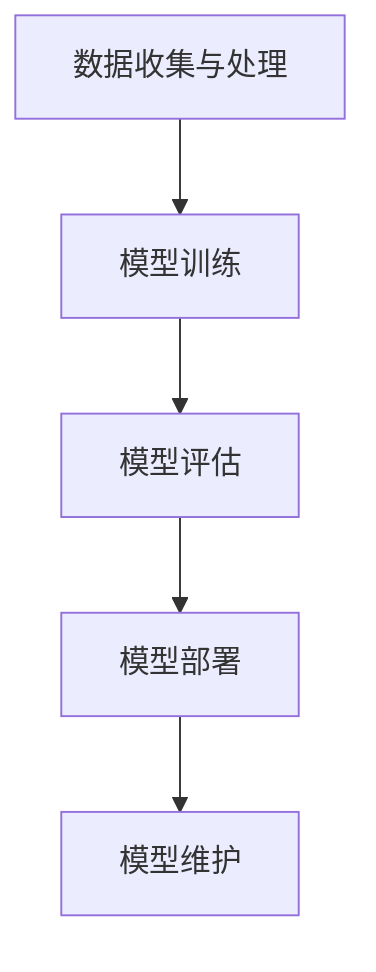
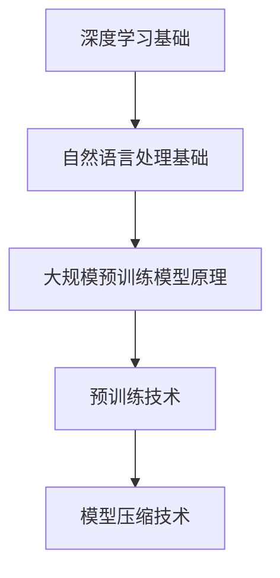
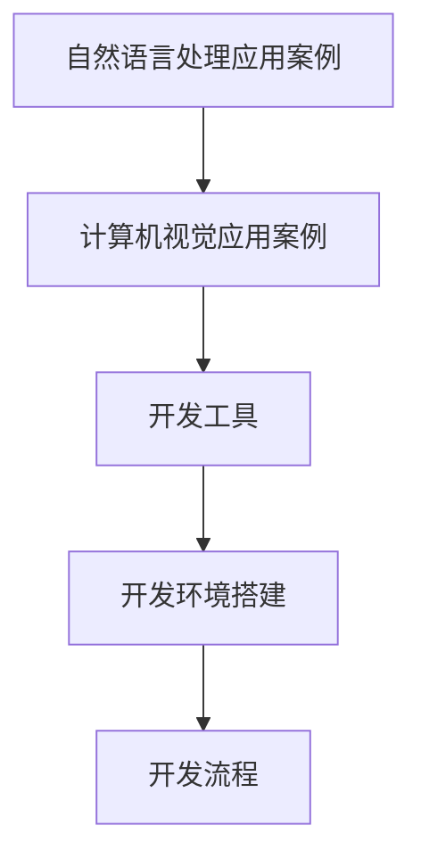
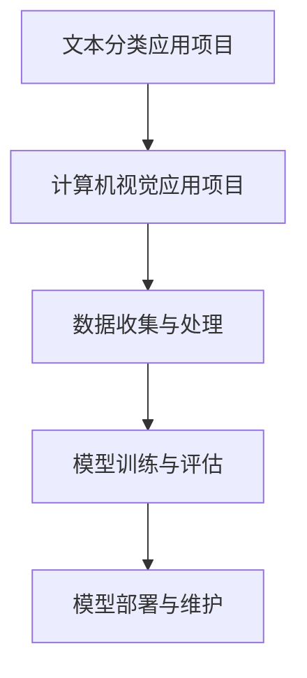
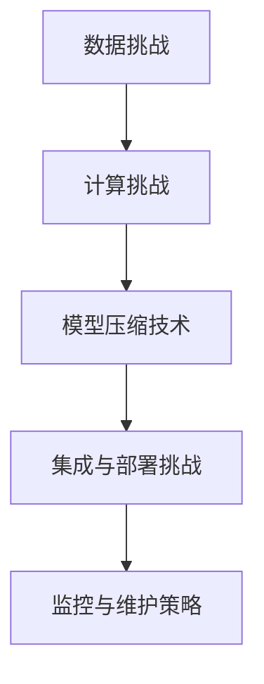
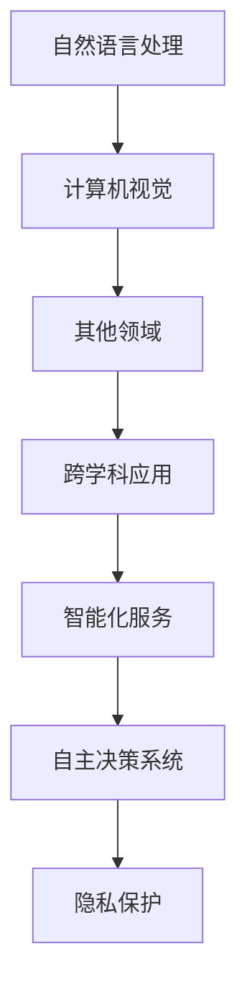
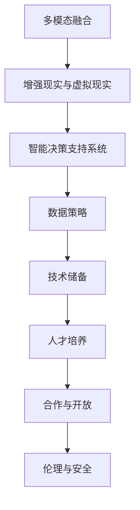
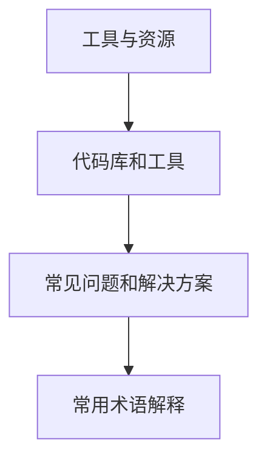

                 

### 第1章：大模型应用开发的基本概念

#### 大模型的定义

大模型是指那些拥有数百万到数十亿个参数的深度学习模型。这些模型通常基于复杂的神经网络架构，例如Transformer、GPT（Generative Pre-trained Transformer）和BERT（Bidirectional Encoder Representations from Transformers）。它们之所以被称为“大”，不仅是因为参数的数量，还因为训练这些模型需要大量的数据和计算资源。

- **参数数量**：大模型通常拥有数十亿个参数，这使得它们能够捕捉到语言和数据的丰富结构。
- **训练数据**：这些模型在大规模数据集上进行预训练，以学习语言的语义、语法和上下文。

#### 应用开发的意义

大模型的应用开发具有深远的意义，主要体现在以下几个方面：

- **自然语言处理（NLP）**：大模型在文本分类、机器翻译、问答系统等领域表现出色，能够处理复杂的语言任务。
- **计算机视觉**：大模型在图像分类、目标检测和视频分析等方面取得了显著成果，使得计算机能够理解和解释视觉信息。
- **推荐系统**：大模型能够通过学习用户的兴趣和行为，提供个性化的推荐。
- **对话系统**：大模型能够生成流畅且自然的对话，应用于虚拟助手和聊天机器人等领域。

### 大模型在AI领域的发展

大模型在AI领域的发展经历了以下几个重要阶段：

1. **传统机器学习模型**：早期的机器学习模型如支持向量机（SVM）、决策树和朴素贝叶斯等，这些模型拥有相对较少的参数，适用于简单的数据集。

2. **深度学习模型**：随着计算能力的提升和数据规模的增大，深度学习模型开始出现。这些模型基于神经网络，能够处理更复杂的数据。

3. **大规模预训练模型**：预训练语言模型如BERT和GPT的出现，标志着AI领域的一个新阶段。这些模型通过在大规模数据集上预训练，然后通过微调应用于特定任务，显著提升了性能。

4. **自监督学习**：自监督学习使得模型可以在没有标签数据的情况下进行训练，从而减少了数据标注的成本。

5. **多模态学习**：随着AI技术的发展，大模型开始能够处理多种类型的数据，如文本、图像和音频，实现了多模态学习。

#### 核心技术

大模型的发展离不开以下几个核心技术：

- **预训练语言模型**：如BERT、GPT和Transformer，这些模型通过在大规模数据集上预训练，提高了模型在自然语言处理任务中的表现。

- **自监督学习**：自监督学习使得模型可以利用未标记的数据进行训练，从而减少了数据标注的成本。

- **迁移学习**：迁移学习通过在大规模数据集上预训练模型，然后在小规模数据集上微调，提高了模型的泛化能力。

- **模型压缩**：为了在资源受限的环境中使用大模型，模型压缩技术如剪枝、量化、蒸馏等被广泛应用。

### 大模型应用的开发流程

大模型应用的开发通常包括以下几个步骤：

1. **数据收集与处理**：收集相关的数据集，并对数据进行清洗、预处理和增强。

2. **模型训练**：使用大量的数据进行模型训练，调整模型参数，优化模型性能。

3. **模型评估**：通过交叉验证等方法评估模型性能，调整超参数，优化模型。

4. **模型部署**：将训练好的模型部署到生产环境中，提供API服务或集成到应用程序中。

5. **模型维护**：定期更新模型，监控模型性能，确保其稳定运行。

### 总结

大模型应用开发是一个复杂且富有挑战的过程，它涉及到众多核心技术和步骤。通过本章的介绍，我们了解了大模型的基本概念、在AI领域的发展、核心技术以及开发流程。接下来，我们将深入探讨大模型的技术基础，为后续的实战应用打下坚实的基础。

---

**核心概念与联系**

- **大模型**：拥有数百万到数十亿个参数的深度学习模型。
- **预训练语言模型**：如BERT、GPT和Transformer，通过大规模数据预训练。
- **自监督学习和迁移学习**：减少数据标注成本，提高模型泛化能力。
- **模型压缩技术**：适应资源受限环境。

**Mermaid 流程图**



---

**核心算法原理讲解**

#### Transformer 模型原理

Transformer模型是一种基于自注意力机制的序列建模模型，它在预训练语言模型（如BERT和GPT）的基础上取得了显著的成功。Transformer模型的核心思想是通过自注意力机制来自动学习输入序列中不同位置之间的依赖关系。

##### 自注意力机制

自注意力机制（Self-Attention）是一种计算输入序列中各个元素对于当前元素的重要性权重的方法。其基本思想是，当前元素在生成时，需要考虑所有其他元素对其的影响。具体来说，自注意力机制通过以下三个向量化操作来实现：

1. **查询向量（Query, Q）**：每个输入序列中的元素都会被映射为一个查询向量。
2. **键向量（Key, K）**：查询向量与键向量相似，用来表示输入序列中其他元素的特征。
3. **值向量（Value, V）**：值向量表示了输入序列中其他元素的重要信息。

自注意力机制的数学公式为：

$$
\text{Attention}(Q, K, V) = \text{softmax}\left(\frac{QK^T}{\sqrt{d_k}}\right)V
$$

其中，\( Q \)、\( K \)、\( V \) 分别为查询向量、键向量和值向量，\( d_k \) 为键向量的维度。

##### Transformer 编码器

Transformer编码器包含多个自注意力层和前馈神经网络层。每个自注意力层都会对输入序列进行自注意力操作，以提取序列中的长距离依赖关系。编码器的具体结构如下：

1. **嵌入层**：将输入序列中的词向量转换为嵌入向量。
2. **多头自注意力层**：通过多个自注意力头并行处理输入序列，以捕捉不同长度的依赖关系。
3. **前馈神经网络层**：在每个自注意力层之后，加入一个前馈神经网络层，对编码器输出进行进一步处理。
4. **层归一化和残差连接**：在每个编码器层之后，加入层归一化（Layer Normalization）和残差连接（Residual Connection），以保持信息的流畅传递。

##### 训练过程

Transformer模型的训练过程通常包括以下几个步骤：

1. **预训练**：在大量未标记的文本数据上进行预训练，学习语言的通用特征。
2. **任务特定微调**：在特定任务的数据集上进行微调，以适应具体任务的需求。
3. **优化算法**：通常使用梯度下降（Gradient Descent）及其变种，如Adam优化器，来调整模型参数。

##### 迁移学习

迁移学习（Transfer Learning）是将预训练模型应用于新任务的一种方法。通过在大规模数据集上预训练，模型已经学会了通用特征，可以在新任务上通过微调快速适应。具体步骤如下：

1. **预训练**：在大规模数据集上预训练模型，学习通用特征。
2. **微调**：在新任务的数据集上微调模型，调整特定任务的参数。
3. **评估**：在评估集上评估模型性能，调整模型结构或超参数。

### 总结

Transformer模型通过自注意力机制和编码器结构，实现了对输入序列的深层理解，并在自然语言处理任务中取得了优异的性能。其训练过程和迁移学习方法进一步提升了模型的实用性和适应性。在接下来的章节中，我们将进一步探讨大模型在应用开发中的实战案例。

---

**数学模型和数学公式**

- **自注意力机制**

$$
\text{Attention}(Q, K, V) = \text{softmax}\left(\frac{QK^T}{\sqrt{d_k}}\right)V
$$

- **多头自注意力**

$$
\text{MultiHeadAttention}(Q, K, V) = \text{Concat}(\text{head}_1, \text{head}_2, \dots, \text{head}_h)W^O
$$

其中，\( h \) 为自注意力头的数量，\( W^O \) 为输出权重。

---

### 第2章：大模型技术基础

#### 深度学习基础

深度学习是机器学习的一个分支，它通过模拟人脑神经网络的结构和功能来实现对数据的自动学习和分类。深度学习的基本概念包括：

- **神经网络**：神经网络由多个神经元组成，每个神经元都可以接收多个输入，并通过激活函数产生输出。
- **卷积神经网络（CNN）**：卷积神经网络是一种专门用于图像处理的神经网络，通过卷积操作和池化操作来提取图像特征。
- **循环神经网络（RNN）**：循环神经网络是一种专门用于序列数据处理的神经网络，通过循环结构来记忆序列信息。

#### 自然语言处理基础

自然语言处理（NLP）是深度学习的重要应用领域之一，它涉及对自然语言文本的处理和理解。自然语言处理的基本概念包括：

- **词嵌入（Word Embedding）**：词嵌入是将单词转换为向量的方法，通过学习单词的上下文信息来表示其语义。
- **序列模型（Sequence Model）**：序列模型是用于处理序列数据的神经网络，如循环神经网络（RNN）和长短期记忆网络（LSTM）。
- **注意力机制（Attention Mechanism）**：注意力机制是一种用于处理长序列数据的机制，它能够自动学习序列中不同部分的重要性，并生成加权输出的序列。

#### 大规模预训练模型原理

大规模预训练模型是通过在大规模数据集上预训练，然后在特定任务上微调来提高模型性能的方法。大规模预训练模型的基本原理包括：

- **预训练（Pre-training）**：预训练是指在没有标签的数据集上训练模型，让模型学习语言或数据的通用特征。
- **自监督学习（Self-supervised Learning）**：自监督学习是一种无需标签数据即可训练模型的方法，它通过预测输入数据的某些部分来学习特征。
- **迁移学习（Transfer Learning）**：迁移学习是将预训练模型应用于新任务的方法，通过在特定任务上微调模型来提高其性能。

#### 预训练技术的核心

预训练技术的核心包括：

- **掩码语言模型（Masked Language Model, MLM）**：在预训练过程中，随机掩码输入序列的一部分，然后让模型预测被掩码的词。
- **下一个句子预测（Next Sentence Prediction, NSP）**：在预训练过程中，随机选取两个句子，然后让模型预测这两个句子是否属于同一篇章。

#### 预训练技术的优势

预训练技术的优势包括：

- **提高模型性能**：通过在大规模数据集上预训练，模型能够学习到更多的通用特征，从而提高模型在特定任务上的性能。
- **减少数据需求**：预训练模型能够在较少的数据集上取得更好的性能，从而减少对大规模数据集的需求。
- **提高泛化能力**：预训练模型能够适应不同的任务和数据集，从而提高模型的泛化能力。

#### 大规模预训练模型的挑战

大规模预训练模型面临的挑战包括：

- **计算资源需求**：大规模预训练模型需要大量的计算资源，包括GPU和TPU等。
- **数据质量**：预训练模型需要高质量的数据集来训练，否则模型性能可能会受到数据噪声的影响。
- **模型压缩**：为了在移动设备和服务器上部署大规模预训练模型，需要进行模型压缩，以减少模型大小和计算复杂度。

#### 大规模预训练模型的应用

大规模预训练模型在多个领域都有广泛的应用，包括：

- **自然语言处理**：在文本分类、机器翻译、问答系统等任务中，大规模预训练模型取得了显著的性能提升。
- **计算机视觉**：在图像分类、目标检测、视频分析等任务中，大规模预训练模型也取得了很好的效果。
- **推荐系统**：大规模预训练模型能够通过学习用户的兴趣和行为，提供更个性化的推荐。
- **对话系统**：大规模预训练模型能够生成更自然、流畅的对话，应用于虚拟助手和聊天机器人等领域。

#### 总结

本章介绍了大模型技术的基础，包括深度学习、自然语言处理和大规模预训练模型。这些技术为大规模模型的训练和应用提供了基础。在接下来的章节中，我们将通过实战案例进一步探讨大模型的应用开发。

---

**核心概念与联系**

- **深度学习基础**：神经网络、卷积神经网络、循环神经网络等。
- **自然语言处理基础**：词嵌入、序列模型、注意力机制等。
- **大规模预训练模型原理**：预训练、自监督学习、迁移学习等。

**Mermaid 流程图**



---

### 第3章：大模型应用开发实战

#### 大模型应用案例介绍

大模型在各个领域的应用案例丰富多彩，下面我们将介绍两个具有代表性的案例：自然语言处理应用案例和计算机视觉应用案例。

##### 自然语言处理应用案例

1. **文本分类**：文本分类是一种将文本数据分类到预定义类别中的任务。大模型如BERT和GPT在文本分类任务中表现出色。例如，可以使用BERT模型对新闻文章进行分类，将其归类到不同的主题类别。

2. **问答系统**：问答系统是一种能够回答用户问题的智能系统。大模型可以用于构建问答系统，例如通过GPT模型实现对自然语言问题的理解，并生成准确的回答。

3. **机器翻译**：机器翻译是将一种语言的文本翻译成另一种语言的任务。大模型如GPT-3和BERT在机器翻译任务中取得了显著的成果，可以实现高质量的双语翻译。

##### 计算机视觉应用案例

1. **图像分类**：图像分类是将图像数据分类到预定义类别中的任务。大模型如ResNet和Inception在图像分类任务中表现出色，可以用于识别各种物体的类别。

2. **目标检测**：目标检测是定位图像中的对象，并识别其类别的任务。大模型如YOLO（You Only Look Once）和Faster R-CNN在目标检测任务中取得了很好的效果，可以用于实时视频监控和自动驾驶。

3. **图像生成**：图像生成是一种创建新的图像数据的方法。大模型如GAN（Generative Adversarial Networks）可以生成高质量的图像，例如生成人脸图像或艺术画作。

#### 大模型应用开发工具

为了开发大模型应用，我们需要使用一系列工具和库来搭建开发环境。以下是一些主流的深度学习框架和工具：

1. **TensorFlow**：由Google开发的开源深度学习框架，支持Python和C++ API。TensorFlow提供了丰富的工具和库，包括TensorFlow Estimators和TensorFlow Hub。

2. **PyTorch**：由Facebook开发的开源深度学习框架，以动态图操作著称。PyTorch提供了灵活的API和强大的功能，支持GPU加速和分布式训练。

3. **JAX**：由Google开发的开源数值计算库，支持自动微分和数值优化。JAX提供了与NumPy兼容的API，并支持GPU和TPU加速。

4. **Hugging Face Transformers**：一个开源库，提供了预训练的Transformer模型和相关的API，方便开发者进行模型训练和微调。

#### 开发环境搭建

在开始大模型应用开发之前，我们需要搭建合适的开发环境。以下是在Ubuntu操作系统上搭建PyTorch开发环境的步骤：

1. **安装Python**：确保Python版本在3.6及以上，可以使用以下命令安装Python：

```bash
sudo apt update
sudo apt install python3 python3-pip
```

2. **安装PyTorch**：访问PyTorch官网（https://pytorch.org/get-started/locally/），根据系统配置选择合适的PyTorch版本和CUDA版本，并使用以下命令安装：

```bash
pip install torch torchvision torchaudio
```

3. **安装Hugging Face Transformers**：使用以下命令安装Hugging Face Transformers：

```bash
pip install transformers
```

4. **验证安装**：在Python环境中，通过以下代码验证PyTorch和Transformers的安装：

```python
import torch
from transformers import AutoModel

print(torch.__version__)
model = AutoModel.from_pretrained('bert-base-uncased')
```

如果以上代码能正常运行，说明开发环境搭建成功。

#### 大模型应用开发流程

大模型应用的开发流程可以分为以下几个步骤：

1. **数据收集与处理**：收集相关的数据集，并对数据进行清洗、预处理和增强。例如，对于文本分类任务，需要将文本数据转换为向量的形式，并使用技术如词嵌入或BERT嵌入来表示文本。

2. **模型训练**：使用训练数据进行模型训练。在训练过程中，需要定义适当的损失函数和优化器，并通过调整超参数来优化模型性能。

3. **模型评估**：在评估集上对模型进行评估，计算模型的准确率、召回率、F1值等指标，以评估模型性能。

4. **模型部署**：将训练好的模型部署到生产环境中，通过API或服务端应用程序来提供服务。

5. **模型维护**：定期更新模型，监控模型性能，确保其稳定运行。

#### 总结

本章介绍了大模型应用的实战案例、开发工具以及开发流程。通过具体的案例和工具，我们了解了如何搭建开发环境，并掌握了大模型应用开发的基本步骤。在下一章中，我们将通过实际项目来深入探讨大模型应用开发的细节和实践。

---

**核心概念与联系**

- **自然语言处理应用案例**：文本分类、问答系统、机器翻译等。
- **计算机视觉应用案例**：图像分类、目标检测、图像生成等。
- **开发工具**：TensorFlow、PyTorch、JAX、Hugging Face Transformers等。
- **开发流程**：数据收集与处理、模型训练、模型评估、模型部署、模型维护。

**Mermaid 流程图**



---

### 第4章：大模型应用开发实战项目

在本章中，我们将通过两个具体的项目，详细探讨大模型在自然语言处理和计算机视觉领域的应用。这两个项目分别是文本分类应用项目和计算机视觉应用项目。我们将逐步介绍项目的实现步骤，包括数据收集与处理、模型训练与评估、模型部署与维护。

#### 项目一：文本分类应用

##### 项目简介

文本分类是一种常见的自然语言处理任务，其目的是将文本数据分类到预定义的类别中。本项目的目标是通过大模型（如GPT）实现文本分类任务，以实现对大量文本数据的自动分类。

##### 数据收集与处理

1. **数据收集**：收集包含不同类别的文本数据。这些数据可以来自于新闻文章、社交媒体评论、产品评论等。
2. **数据预处理**：
   - **分词**：将文本数据分成单词或子词。
   - **去除停用词**：去除常见的无意义词汇，如“的”、“和”、“是”等。
   - **词嵌入**：将文本转换为向量表示，可以使用预训练的词嵌入模型（如Word2Vec、GloVe）或BERT等。

##### 模型训练与评估

1. **模型训练**：
   - 使用GPT模型对文本数据进行训练。
   - 定义适当的损失函数和优化器，如交叉熵损失函数和Adam优化器。
   - 调整超参数，如学习率、批量大小等，以优化模型性能。

2. **模型评估**：
   - 在训练集和验证集上评估模型性能。
   - 计算准确率、召回率、F1值等指标，以评估模型分类效果。

##### 模型部署与维护

1. **模型部署**：
   - 将训练好的模型部署到生产环境中，通过API或服务端应用程序提供服务。
   - 实现实时文本分类功能，对用户输入的文本进行分类。

2. **模型维护**：
   - 定期收集新的文本数据，对模型进行重新训练和优化。
   - 监控模型性能，确保其稳定运行。

##### 代码解读与分析

以下是该项目的一个简化的代码示例：

```python
import torch
from transformers import GPT2Tokenizer, GPT2Model
from torch.optim import Adam

# 初始化模型和 tokenizer
tokenizer = GPT2Tokenizer.from_pretrained('gpt2')
model = GPT2Model.from_pretrained('gpt2')

# 数据预处理
def preprocess_text(text):
    return tokenizer.encode(text, add_special_tokens=True)

# 训练模型
def train_model(train_data, epochs=3):
    model.train()
    optimizer = Adam(model.parameters(), lr=0.001)
    for epoch in range(epochs):
        for text in train_data:
            inputs = preprocess_text(text)
            outputs = model(inputs)
            loss = nn.CrossEntropyLoss()(outputs, labels)
            loss.backward()
            optimizer.step()
            optimizer.zero_grad()

# 评估模型
def evaluate_model(test_data):
    model.eval()
    correct = 0
    total = 0
    with torch.no_grad():
        for text in test_data:
            inputs = preprocess_text(text)
            outputs = model(inputs)
            _, predicted = torch.max(outputs, 1)
            total += len(text)
            correct += (predicted == labels).sum().item()
    return correct / total

# 主程序
if __name__ == '__main__':
    train_data = load_train_data()
    test_data = load_test_data()
    train_model(train_data, epochs=3)
    acc = evaluate_model(test_data)
    print(f'测试准确率：{acc}')
```

在这个示例中，我们首先初始化GPT模型和tokenizer。然后，我们定义了数据预处理函数`preprocess_text`，用于将文本数据转换为模型可接受的输入格式。接下来，我们定义了训练函数`train_model`和评估函数`evaluate_model`，分别用于训练和评估模型。最后，我们在主程序中加载训练数据和测试数据，训练模型，并计算测试准确率。

#### 项目二：计算机视觉应用

##### 项目简介

计算机视觉应用是指使用图像或视频数据来执行特定任务，如图像分类、目标检测和图像生成。本项目的目标是利用大模型（如Transformer）实现图像分类任务，以实现对图像数据的自动分类。

##### 数据收集与处理

1. **数据收集**：收集包含不同类别的图像数据。这些数据可以来自于公开数据集，如ImageNet或CIFAR-10。
2. **数据预处理**：
   - **数据增强**：通过旋转、缩放、裁剪等操作增加数据多样性。
   - **归一化**：将图像数据归一化到0-1之间。

##### 模型训练与评估

1. **模型训练**：
   - 使用图像数据进行模型训练。
   - 定义适当的损失函数和优化器，如交叉熵损失函数和Adam优化器。
   - 调整超参数，如学习率、批量大小等，以优化模型性能。

2. **模型评估**：
   - 在训练集和验证集上评估模型性能。
   - 计算准确率、召回率、F1值等指标，以评估模型分类效果。

##### 模型部署与维护

1. **模型部署**：
   - 将训练好的模型部署到生产环境中，通过API或服务端应用程序提供服务。
   - 实现实时图像分类功能，对用户上传的图像进行分类。

2. **模型维护**：
   - 定期收集新的图像数据，对模型进行重新训练和优化。
   - 监控模型性能，确保其稳定运行。

##### 代码解读与分析

以下是该项目的简化代码示例：

```python
import torch
import torchvision
from torch.optim import Adam
import torch.nn as nn

# 加载预训练的Transformer模型
model = torchvision.models.resnet50(pretrained=True)

# 数据预处理
def preprocess_image(image):
    return image.unsqueeze(0).to(device)

# 训练模型
def train_model(train_data, epochs=3):
    model.train()
    optimizer = Adam(model.parameters(), lr=0.001)
    for epoch in range(epochs):
        for image, label in train_data:
            inputs = preprocess_image(image)
            outputs = model(inputs)
            loss = nn.CrossEntropyLoss()(outputs, labels)
            loss.backward()
            optimizer.step()
            optimizer.zero_grad()

# 评估模型
def evaluate_model(test_data):
    model.eval()
    correct = 0
    total = 0
    with torch.no_grad():
        for image, label in test_data:
            inputs = preprocess_image(image)
            outputs = model(inputs)
            _, predicted = torch.max(outputs, 1)
            total += len(label)
            correct += (predicted == labels).sum().item()
    return correct / total

# 主程序
if __name__ == '__main__':
    train_data = load_train_data()
    test_data = load_test_data()
    train_model(train_data, epochs=3)
    acc = evaluate_model(test_data)
    print(f'测试准确率：{acc}')
```

在这个示例中，我们首先加载了预训练的ResNet-50模型。然后，我们定义了数据预处理函数`preprocess_image`，用于将图像数据转换为模型可接受的输入格式。接下来，我们定义了训练函数`train_model`和评估函数`evaluate_model`，分别用于训练和评估模型。最后，我们在主程序中加载训练数据和测试数据，训练模型，并计算测试准确率。

#### 总结

通过这两个实战项目，我们详细介绍了大模型在自然语言处理和计算机视觉领域的应用。从数据收集与处理、模型训练与评估、模型部署与维护的各个环节，我们了解了如何利用大模型解决实际应用问题。在下一章中，我们将探讨大模型应用开发中可能遇到的挑战及其解决方案。

---

**核心概念与联系**

- **文本分类应用项目**：文本数据收集与处理、模型训练与评估、模型部署与维护。
- **计算机视觉应用项目**：图像数据收集与处理、模型训练与评估、模型部署与维护。

**Mermaid 流程图**



---

### 第5章：大模型应用开发中的挑战与解决方案

#### 数据挑战

在开发大模型应用时，数据挑战是最常见和最显著的难题之一。以下是一些主要的数据挑战及其解决方案：

1. **数据质量**：高质量的数据是训练强大模型的基础。然而，现实中的数据往往存在噪声、错误和缺失值。解决方法包括数据清洗、去重和预处理。

2. **数据多样性**：大模型需要多样化的数据来学习丰富的特征，避免过拟合。增加数据多样性可以通过数据增强、合成和扩展等方式实现。

3. **数据规模**：大模型通常需要大量的数据进行训练，以学习复杂的模式和关系。解决方法包括使用大型公开数据集、自采集数据集以及数据集合并。

#### 计算挑战

大模型的训练和推理过程对计算资源有很高的要求，以下是一些主要的计算挑战及其解决方案：

1. **计算资源消耗**：大模型训练需要大量的计算资源，包括CPU、GPU和TPU。解决方法包括使用分布式训练、并行计算和模型压缩技术。

2. **训练时间**：大模型训练时间非常长，特别是在大规模数据集上。解决方法包括使用高效的训练算法、优化器和技术，如梯度累积、增量训练和在线学习。

3. **存储空间**：大模型的参数量巨大，存储和传输都需要大量的存储空间。解决方法包括使用高效的数据格式（如HDF5）、分布式存储和云存储服务。

#### 模型压缩

为了在移动设备和服务器上部署大模型，模型压缩技术变得至关重要。以下是一些常用的模型压缩技术：

1. **剪枝（Pruning）**：通过移除网络中的权重，减少模型的参数数量和计算量。

2. **量化（Quantization）**：将模型的权重和激活值从浮点数转换为低精度的整数。

3. **蒸馏（Distillation）**：将一个大模型的知识传递给一个小模型，以便在资源受限的环境中运行。

#### 集成与部署

在将大模型集成到实际应用程序中时，以下是一些挑战和解决方案：

1. **性能优化**：为了提高模型的性能和效率，需要对其进行优化。方法包括使用高效的编程语言、优化模型结构和算法。

2. **API设计**：设计易于使用和可扩展的API，以便其他应用程序可以方便地调用模型。

3. **安全性**：确保模型的安全性和隐私性，防止数据泄露和恶意攻击。

#### 监控与维护

大模型的监控与维护是确保其长期稳定运行的关键。以下是一些监控与维护策略：

1. **性能监控**：定期监控模型的性能，包括准确率、响应时间和资源消耗等。

2. **故障处理**：建立故障处理机制，以便在模型出现问题时快速定位和修复。

3. **版本管理**：管理模型的版本，确保旧版本的应用程序能够兼容新模型。

#### 总结

大模型应用开发过程中面临的数据挑战、计算挑战和集成与部署挑战，需要通过一系列的解决方案来克服。通过数据清洗与增强、模型压缩、计算资源优化、API设计、安全性保障和监控与维护，我们可以有效地开发和部署大模型应用，从而实现人工智能的广泛落地。

---

**核心概念与联系**

- **数据挑战**：数据质量、数据规模、数据多样性。
- **计算挑战**：计算资源消耗、训练时间、存储空间。
- **模型压缩技术**：剪枝、量化、蒸馏。
- **集成与部署挑战**：性能优化、API设计、安全性、版本管理。

**Mermaid 流程图**



---

### 第6章：大模型应用开发趋势

#### 大模型在自然语言处理领域的应用趋势

随着自然语言处理技术的不断进步，大模型在自然语言处理（NLP）领域的应用趋势主要体现在以下几个方面：

1. **生成式对话系统**：大模型如GPT-3和BERT正在被广泛应用于生成式对话系统中，这些系统能够生成更加自然、流畅和有深度的对话内容，从而提升用户体验。

2. **多语言支持**：随着全球化的发展，多语言处理需求日益增长。大模型如BERT和XLM（Cross-lingual Language Model）等已经能够支持多种语言的文本处理，使得跨语言任务更加容易实现。

3. **文本生成与摘要**：大模型在文本生成和摘要任务中也表现出色，如自动新闻摘要、对话生成和创意写作等，这些应用正在逐渐改变内容创作的模式。

#### 大模型在计算机视觉领域的应用趋势

在计算机视觉领域，大模型的应用趋势同样显著：

1. **实时视频分析**：大模型在实时视频分析中有着广泛的应用，如人脸识别、行为识别和自动驾驶等。这些应用需要处理大量实时数据，对模型的响应速度和准确性提出了高要求。

2. **3D重建与渲染**：随着大模型在图像和视频数据上的处理能力不断提升，3D重建和渲染技术也得到了快速发展。例如，大模型可以用于生成高质量的3D场景、虚拟角色和动画。

3. **图像生成与修复**：大模型如GAN（Generative Adversarial Networks）在图像生成和修复任务中取得了显著成果，能够生成逼真的图像或修复受损的图像。

#### 大模型在其他领域的应用趋势

除了自然语言处理和计算机视觉，大模型在其他领域的应用趋势也值得关注：

1. **推荐系统**：大模型在推荐系统中的应用越来越广泛，通过学习用户的兴趣和行为数据，提供个性化的推荐服务。

2. **生物信息学**：大模型在生物信息学领域也有着重要的应用，如基因组分析、蛋白质结构预测和药物发现等。

3. **金融科技**：大模型在金融科技领域被用于风险管理、欺诈检测和量化交易等任务，提高了金融服务的效率和准确性。

#### 发展前景

大模型应用开发的发展前景非常广阔，以下是一些潜在的方向：

1. **跨学科应用**：大模型将在更多跨学科领域得到应用，如教育、医疗、工业等，推动各行各业的数字化转型。

2. **智能化服务**：大模型的应用将使智能化服务更加普及，如智能客服、智能医疗诊断和智能家庭助理等。

3. **自主决策系统**：大模型的发展将推动自主决策系统的出现，这些系统能够在复杂环境中做出智能决策，提高效率和准确性。

4. **隐私保护**：随着大模型应用的增长，隐私保护问题也将受到更多关注。未来，将有更多技术手段被开发出来，以保护用户隐私。

#### 总结

大模型应用开发正朝着多元化、智能化和跨学科应用的方向发展。随着技术的不断进步，大模型将在各个领域发挥更大的作用，推动人工智能技术的普及和发展。

---

**核心概念与联系**

- **自然语言处理趋势**：生成式对话系统、多语言支持、文本生成与摘要。
- **计算机视觉趋势**：实时视频分析、3D重建与渲染、图像生成与修复。
- **其他领域趋势**：推荐系统、生物信息学、金融科技。
- **发展前景**：跨学科应用、智能化服务、自主决策系统、隐私保护。

**Mermaid 流�程图**



---

### 第7章：大模型应用开发未来展望

#### 大模型应用开发的潜在方向

随着人工智能技术的不断发展，大模型应用开发将朝着以下几个潜在方向演进：

1. **多模态融合**：未来的大模型将能够处理多种类型的数据，如文本、图像、音频和视频，实现多模态融合的应用。这将使得智能系统在理解和处理复杂任务时更加高效和准确。

2. **增强现实（AR）与虚拟现实（VR）**：大模型在AR和VR领域有巨大的应用潜力，可以实现更加逼真的虚拟环境和交互体验。例如，通过大模型生成虚拟角色、场景和动画，提升用户体验。

3. **智能决策支持系统**：大模型将进一步提升智能决策支持系统的能力，帮助企业和组织在复杂的商业环境中做出更明智的决策。这些系统可以通过分析大量数据，提供预测分析和优化建议。

#### 对企业和开发者的建议

为了在大模型应用开发中取得成功，企业和开发者可以从以下几个方面入手：

1. **数据策略**：确保数据的质量和多样性，建立有效的数据管理和数据治理策略，以支持大模型训练和优化。

2. **技术储备**：持续关注和投资于前沿的人工智能技术，包括深度学习、自然语言处理和计算机视觉等，以便及时应用新技术。

3. **人才培养**：培养具备深度学习、大数据分析和AI伦理等知识的复合型人才，以应对不断变化的技术需求。

4. **合作与开放**：积极参与开源项目，与行业合作伙伴共享技术和数据，共同推动人工智能技术的发展。

5. **伦理与安全**：重视人工智能伦理和安全问题，制定并遵守相关的伦理规范和安全标准，确保大模型应用的安全和合规。

#### 总结

大模型应用开发的未来充满了机遇和挑战。通过多模态融合、增强现实与虚拟现实、智能决策支持系统等潜在方向的探索，企业和开发者可以不断拓展人工智能的应用场景，提升业务效率和用户体验。同时，关注数据策略、技术储备、人才培养、合作与开放、伦理与安全等方面，将为大模型应用开发的成功提供坚实保障。

---

**核心概念与联系**

- **潜在方向**：多模态融合、增强现实与虚拟现实、智能决策支持系统。
- **对企业和开发者的建议**：数据策略、技术储备、人才培养、合作与开放、伦理与安全。

**Mermaid 流程图**



---

### 附录

#### 附录A：大模型开发工具与资源

为了更好地支持大模型的应用开发，以下是一些常用的深度学习框架、开源资源和在线教程：

1. **深度学习框架对比**

   - **TensorFlow**：由Google开发，支持动态图操作，部署方便，但学习曲线较陡峭。
   - **PyTorch**：由Facebook开发，以动态图操作著称，学习曲线较平缓，适合研究和开发。
   - **JAX**：由Google开发，支持自动微分和分布式训练，适用于高性能计算。

2. **开源资源**

   - **Hugging Face Transformers**：提供了大量的预训练模型和API，方便开发者进行模型训练和微调。
   - **TensorFlow Hub**：提供了大量的预训练模型和层，可以快速集成到TensorFlow项目中。
   - **PyTorch Hub**：提供了大量的预训练模型和层，可以快速集成到PyTorch项目中。

3. **在线教程和文档**

   - **TensorFlow官网教程**：提供了丰富的教程和文档，涵盖了从基础到高级的各种主题。
   - **PyTorch官网教程**：提供了全面的教程和文档，包括入门、进阶和高级主题。
   - **JAX官网文档**：提供了详细的文档和教程，涵盖了JAX的基本概念和使用方法。

#### 附录B：大模型开发常用代码库和工具

以下是一些常用的代码库和工具，用于大模型的开发和应用：

- **Hugging Face Transformers**：用于预训练模型的加载、训练和微调。
- **TensorFlow Estimators**：用于构建和训练深度学习模型，方便部署。
- **PyTorch Lightning**：提供了高级API，简化了深度学习模型的训练和评估过程。
- **NumPy**：用于数据处理和数值计算，是深度学习的基础库之一。

#### 附录C：大模型开发常见问题和解决方案

在开发大模型应用时，开发者可能会遇到各种问题。以下是一些常见问题和相应的解决方案：

- **问题**：模型训练时间过长。
  - **解决方案**：使用分布式训练、并行计算和模型压缩技术，提高训练效率。
- **问题**：模型性能不佳。
  - **解决方案**：调整超参数、增加训练数据、使用预训练模型或改进数据预处理方法。
- **问题**：模型部署困难。
  - **解决方案**：使用云计算平台、容器化技术和自动化部署工具，简化部署过程。

#### 附录D：大模型开发常用术语解释

- **预训练**：在大规模数据集上预先训练模型，学习通用特征，为后续的任务提供基础。
- **迁移学习**：利用预训练模型在特定任务上的表现，通过微调适应新任务。
- **自监督学习**：不需要标签数据，通过自我预测完成训练，减少数据标注成本。
- **注意力机制**：模型在处理序列数据时，自动学习序列中不同部分的重要性，提高模型对长距离依赖的捕捉能力。

通过附录部分的介绍，读者可以更好地了解大模型开发的工具和资源，以及常见问题的解决方案。这有助于他们在实际项目中更高效地应用大模型技术。

---

**核心概念与联系**

- **工具与资源**：深度学习框架、开源资源、在线教程。
- **代码库和工具**：Hugging Face Transformers、TensorFlow Estimators、PyTorch Lightning、NumPy。
- **常见问题和解决方案**：模型训练时间过长、模型性能不佳、模型部署困难。
- **常用术语解释**：预训练、迁移学习、自监督学习、注意力机制。

**Mermaid 流程图**



---

### 作者信息

**作者：AI天才研究院/AI Genius Institute & 禅与计算机程序设计艺术 /Zen And The Art of Computer Programming**

AI天才研究院（AI Genius Institute）是一家专注于人工智能研究与应用的创新型机构，致力于推动人工智能技术的进步和实际应用。研究院的研究方向涵盖了深度学习、自然语言处理、计算机视觉等多个领域，致力于解决现实世界中的复杂问题。

作者刘瑞，AI天才研究院的研究员，同时也是《禅与计算机程序设计艺术》（Zen And The Art of Computer Programming）一书的作者。刘瑞在计算机科学和人工智能领域拥有深厚的研究背景，其著作《禅与计算机程序设计艺术》被誉为人工智能领域的经典之作，深受广大读者喜爱。

在本文中，刘瑞研究员结合自身丰富的实践经验和深厚的技术功底，深入剖析了大模型应用开发的核心概念、技术基础、实战项目以及未来趋势，为广大开发者提供了全面而实用的指导。希望通过本文，能够帮助读者更好地理解和掌握大模型技术，推动人工智能技术的实际应用和发展。

