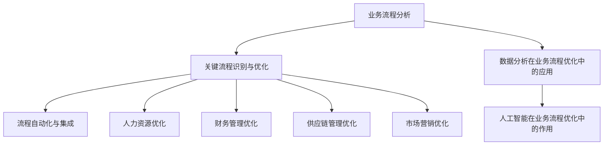

                 

# 《一人公司如何利用人工智能优化业务流程》

## 关键词
人工智能、业务流程优化、数据分析、深度学习、自然语言处理、计算机视觉

## 摘要
本文将深入探讨一人公司如何利用人工智能（AI）技术优化其业务流程。我们将首先介绍人工智能的基本概念、历史和发展，然后详细解析深度学习、自然语言处理和计算机视觉等AI技术。接下来，我们将探讨业务流程优化在单人公司中的重要性，以及AI如何应用于业务流程的各个环节。通过具体案例和实战项目，我们将展示如何实施AI优化业务流程，并提供未来展望和总结。

### 引言：AI在单人公司的应用

#### 1.1 单人公司的特点与需求

单人公司，顾名思义，是由单一个体经营的公司。这种类型的公司通常规模较小，资源有限，但具备灵活性和敏捷性。由于单一经营者的角色，单人公司在管理、运营和决策方面有独特的需求。

首先，单人公司需要高效的决策支持系统，以便快速响应市场变化。传统的手动操作和纸质记录方式已经无法满足快速决策的需求，因此需要引入自动化和智能化的工具。

其次，资源有限使得单人公司需要最大化现有资源的使用效率。人工智能技术可以在不增加额外成本的情况下提高业务流程的效率，从而实现资源的最佳配置。

最后，单人公司需要强大的数据分析能力，以便从大量数据中提取有价值的信息。数据分析可以帮助单人公司了解客户需求、市场趋势和运营效率，从而做出更明智的决策。

#### 1.2 人工智能在单人公司中的优势

人工智能（AI）技术为单人公司提供了诸多优势。首先，AI可以提高业务流程的自动化程度，减少人工干预，从而提高效率和准确性。例如，使用自然语言处理（NLP）技术可以自动化处理客户服务请求，减少人力资源的浪费。

其次，AI可以帮助单人公司实现数据驱动的决策。通过数据分析，AI可以揭示业务流程中的瓶颈和改进点，帮助公司优化运营策略。例如，使用机器学习算法可以预测客户购买行为，从而优化库存管理和市场营销策略。

最后，AI技术可以帮助单人公司实现个性化服务。通过分析用户行为和偏好数据，AI可以提供更加个性化的产品推荐和服务，提高客户满意度和忠诚度。

#### 1.3 本书结构安排与学习目标

本文将分为以下几个部分：

1. 引言：介绍AI在单人公司中的应用背景和优势。
2. AI基础知识：讲解人工智能的基本概念、历史和发展。
3. 人工智能技术概览：详细解析深度学习、自然语言处理和计算机视觉等AI技术。
4. 人工智能优化业务流程的核心概念：探讨业务流程优化的重要性以及AI在其中的作用。
5. 业务流程分析：介绍业务流程分析的方法和技术。
6. 利用AI优化业务流程的具体应用：详细阐述AI在人力资源、财务管理、供应链管理和市场营销等业务流程中的应用。
7. AI优化业务流程的实施与风险管理：讲解AI优化业务流程的实施策略和风险管理。
8. 未来展望：讨论AI与业务流程优化的发展趋势。
9. 案例研究：分析实际案例，展示AI优化业务流程的具体应用。
10. 总结与展望：回顾本文的核心内容，并提出学习与未来应用建议。

通过本文的学习，读者将能够：

- 理解人工智能的基本概念和原理。
- 掌握深度学习、自然语言处理和计算机视觉等AI技术的应用。
- 学会使用AI优化单人公司的业务流程。
- 了解AI优化业务流程的实施策略和风险管理。
- 对AI与业务流程优化的未来发展趋势有清晰的认识。

### AI基础知识

#### 2.1 人工智能的基本概念

人工智能（Artificial Intelligence，简称AI）是指使计算机模拟人类智能行为的技术和科学。AI的目标是让计算机具备自主思考、学习、推理和解决问题的能力。人工智能可以分为两大类：弱人工智能和强人工智能。

弱人工智能（Narrow AI）是指专注于特定任务的AI系统，例如语音识别、图像识别、自然语言处理等。弱人工智能能够高效地执行特定任务，但不能进行泛化处理。

强人工智能（General AI）是指具备全面智能的AI系统，能够理解、学习和适应各种环境，具备人类水平的认知能力。目前，强人工智能仍处于理论研究阶段，尚未实现商业化应用。

#### 2.2 人工智能的历史与发展

人工智能的概念可以追溯到20世纪50年代。当时，计算机科学家们开始探索如何让计算机模拟人类智能。1956年，约翰·麦卡锡（John McCarthy）等人提出了“人工智能”这一术语，并首次举办了人工智能研讨会。

在接下来的几十年里，人工智能经历了多个发展阶段。20世纪60年代和70年代，人工智能研究主要集中在符号主义方法和知识表示上。然而，受限于计算能力和数据量，这一阶段的人工智能系统在实际应用中表现不佳。

20世纪80年代，专家系统的出现为人工智能带来了新的希望。专家系统是一种基于知识的系统，通过模拟人类专家的知识和推理能力来解决特定领域的问题。然而，专家系统的成功往往依赖于大量的专家知识和规则的编写，这使得其应用范围受到限制。

20世纪90年代，随着计算机硬件的快速发展，机器学习和数据挖掘技术开始崭露头角。机器学习是一种使计算机从数据中自动学习规律和模式的方法，包括监督学习、无监督学习和强化学习等。数据挖掘则是从大量数据中提取有价值信息的过程。

进入21世纪，人工智能迎来了新一轮的发展。深度学习技术的突破使计算机在图像识别、语音识别和自然语言处理等领域取得了显著进展。深度学习是一种基于多层神经网络的学习方法，通过大量数据训练能够自动提取特征和进行分类。

近年来，随着云计算、大数据和物联网等技术的普及，人工智能的应用场景越来越广泛。例如，自动驾驶、智能客服、金融风控和医疗诊断等领域都取得了重要突破。

#### 2.3 人工智能的主要类型

人工智能可以分为多种类型，每种类型都有其特定的应用场景和技术特点。

1. **符号主义人工智能**：符号主义人工智能基于逻辑和推理，通过表示和操作符号来模拟人类智能。这种方法强调知识的表示和推理过程，但受限于知识的表达能力和推理的效率。

2. **统计机器学习**：统计机器学习是一种基于统计学方法来训练模型，使计算机能够自动从数据中学习规律和模式。这种方法适用于有监督学习和无监督学习任务，包括分类、回归和聚类等。

3. **深度学习**：深度学习是一种基于多层神经网络的学习方法，通过大量数据训练能够自动提取特征和进行分类。深度学习在图像识别、语音识别和自然语言处理等领域取得了显著进展。

4. **强化学习**：强化学习是一种通过试错来学习最优策略的方法。这种方法适用于需要决策的动态环境，如游戏、自动驾驶和金融交易等。

5. **自然语言处理**：自然语言处理（NLP）是一种使计算机能够理解和生成人类语言的技术。NLP包括语言模型、文本分类、情感分析和机器翻译等应用。

6. **计算机视觉**：计算机视觉是一种使计算机能够理解和解释图像和视频的技术。计算机视觉包括图像识别、目标检测、图像分割和视频分析等应用。

7. **机器人学**：机器人学是一种研究如何使机器模拟人类行为的技术。机器人学包括自主移动、感知和操作等任务。

每种人工智能类型都有其独特的优势和局限性，具体应用取决于业务需求和数据特征。

### 人工智能技术概览

#### 3.1 深度学习

深度学习（Deep Learning）是一种基于多层神经网络的学习方法，通过大量数据训练能够自动提取特征和进行分类。深度学习在图像识别、语音识别和自然语言处理等领域取得了显著进展。

##### 3.1.1 深度学习基础

深度学习的基本构建块是神经元，也称为节点。每个神经元都接收多个输入信号，并通过激活函数产生输出。多层神经网络由多个这样的神经元层组成，包括输入层、隐藏层和输出层。

输入层接收外部输入数据，隐藏层对输入数据进行特征提取和变换，输出层生成最终预测结果。通过反向传播算法，深度学习模型可以不断调整权重和偏置，以最小化损失函数。

##### 3.1.2 神经网络模型

常见的神经网络模型包括全连接神经网络（FCNN）、卷积神经网络（CNN）和循环神经网络（RNN）。

- **全连接神经网络（FCNN）**：FCNN是一种前馈神经网络，其中每个神经元都与前一层的所有神经元相连。FCNN适用于回归和分类任务，例如图像分类和语音识别。

- **卷积神经网络（CNN）**：CNN是一种专门用于图像识别的神经网络模型，通过卷积层和池化层提取图像特征。CNN在计算机视觉任务中表现优异，例如物体检测、图像分类和图像分割。

- **循环神经网络（RNN）**：RNN是一种适用于序列数据的学习模型，通过循环结构处理输入序列。RNN在自然语言处理任务中应用广泛，例如语言模型、文本分类和机器翻译。

##### 3.1.3 深度学习算法

深度学习算法包括训练和评估两个阶段。

- **训练阶段**：在训练阶段，深度学习模型通过大量数据训练，以调整权重和偏置。常用的训练算法包括随机梯度下降（SGD）、Adam优化器和批量归一化等。

- **评估阶段**：在评估阶段，训练好的模型通过测试数据集进行评估，以衡量模型的性能。常用的评估指标包括准确率、召回率、F1分数和均方误差等。

##### 3.1.4 深度学习的应用

深度学习在多个领域取得了重要突破，包括：

- **图像识别**：深度学习模型可以自动识别和分类图像，应用于人脸识别、自动驾驶和医疗诊断等领域。

- **语音识别**：深度学习模型可以自动识别和转写语音，应用于智能客服、语音助手和实时字幕等领域。

- **自然语言处理**：深度学习模型可以处理自然语言文本，应用于机器翻译、情感分析和信息提取等领域。

#### 3.2 自然语言处理

自然语言处理（Natural Language Processing，简称NLP）是一种使计算机能够理解和生成人类语言的技术。NLP包括语言模型、文本分类、情感分析和机器翻译等应用。

##### 3.2.1 语言模型

语言模型（Language Model）是一种用于生成自然语言文本的模型。语言模型通过统计方法或深度学习模型，学习语言中的概率分布，从而生成具有自然流畅性的文本。

常用的语言模型包括n-gram模型、循环神经网络（RNN）语言模型和变换器模型（Transformer）。n-gram模型通过统计连续词的组合概率来生成文本，RNN语言模型通过循环结构处理输入序列，而变换器模型则通过自注意力机制生成文本。

##### 3.2.2 文本分类与情感分析

文本分类（Text Classification）是一种将文本数据分类为不同类别的方法。常见的文本分类任务包括情感分析、主题分类和垃圾邮件检测等。

情感分析（Sentiment Analysis）是一种检测文本情感极性的方法。通过分析文本中的词语和句子结构，情感分析可以判断文本是正面、负面还是中性。

常用的文本分类算法包括朴素贝叶斯、支持向量机（SVM）和深度学习模型。朴素贝叶斯算法基于贝叶斯定理和特征概率分布进行分类，支持向量机通过最大间隔分类器进行分类，而深度学习模型则通过多层神经网络进行分类。

##### 3.2.3 机器翻译

机器翻译（Machine Translation）是一种将一种语言的文本自动翻译成另一种语言的方法。机器翻译分为基于规则的方法和基于统计的方法。

基于规则的方法通过预定义的语法规则和翻译词典进行翻译，而基于统计的方法则通过大量平行语料库训练翻译模型。

近年来，深度学习模型在机器翻译领域取得了显著进展。变换器模型（Transformer）是一种基于自注意力机制的深度学习模型，通过编码器和解码器生成高质量翻译。

##### 3.2.4 NLP的应用

NLP在多个领域取得了重要应用，包括：

- **智能客服**：NLP可以自动理解用户提问并生成回答，应用于智能客服系统。

- **信息提取**：NLP可以自动从文本中提取关键信息，如姓名、地点、时间等。

- **文本生成**：NLP可以生成具有自然流畅性的文本，如新闻摘要、聊天机器人对话等。

#### 3.3 计算机视觉

计算机视觉（Computer Vision）是一种使计算机能够理解和解释图像和视频的技术。计算机视觉包括图像识别、目标检测、图像分割和视频分析等应用。

##### 3.3.1 图像识别与分类

图像识别（Image Recognition）是一种将图像分类为特定类别的方法。常见的图像识别任务包括人脸识别、物体检测和场景分类等。

图像分类（Image Classification）是一种将图像分类为预定义类别的方法。卷积神经网络（CNN）是图像分类任务的常用模型，通过卷积层和池化层提取图像特征，并使用全连接层进行分类。

##### 3.3.2 目标检测与跟踪

目标检测（Object Detection）是一种在图像中检测特定目标位置的方法。常见的目标检测算法包括R-CNN、Fast R-CNN、Faster R-CNN和YOLO等。

目标跟踪（Object Tracking）是一种在视频序列中跟踪特定目标的方法。常见的目标跟踪算法包括光流法、Kalman滤波和粒子滤波等。

##### 3.3.3 生成对抗网络（GAN）

生成对抗网络（Generative Adversarial Network，简称GAN）是一种生成模型，通过两个相互对抗的神经网络生成高质量数据。

生成器（Generator）尝试生成真实数据，而判别器（Discriminator）则尝试区分真实数据和生成数据。通过训练，生成器逐渐提高生成数据的质量，而判别器逐渐提高区分能力。

GAN在图像生成、图像修复和风格迁移等领域取得了重要应用。

##### 3.3.4 计算机视觉的应用

计算机视觉在多个领域取得了重要应用，包括：

- **自动驾驶**：计算机视觉可以自动识别和跟踪道路上的车辆和行人，为自动驾驶提供支持。

- **医疗诊断**：计算机视觉可以自动分析医学图像，帮助医生进行诊断和治疗。

- **安全监控**：计算机视觉可以自动监控视频流，检测异常行为和安全隐患。

### 人工智能优化业务流程的核心概念

#### 4.1 业务流程优化概述

业务流程优化（Business Process Optimization）是指通过改进业务流程的设计和执行，以提高业务效率、降低成本和提升客户满意度。业务流程优化涉及多个方面，包括流程映射、流程分析和流程改进。

业务流程优化在单人公司中尤为重要。由于资源有限，单人公司需要充分利用现有资源，以提高业务效率。通过业务流程优化，单人公司可以实现以下目标：

- 减少运营成本：通过优化业务流程，单人公司可以降低运营成本，提高盈利能力。
- 提高效率：优化业务流程可以减少不必要的步骤和等待时间，提高业务处理速度。
- 提升客户满意度：通过优化业务流程，单人公司可以提供更快、更准确的服务，提升客户满意度。

#### 4.2 数据分析在业务流程优化中的应用

数据分析（Data Analysis）是指通过收集、处理和分析数据，以提取有价值信息的过程。数据分析在业务流程优化中发挥着重要作用。通过数据分析，单人公司可以：

- 了解业务流程中的瓶颈和改进点：数据分析可以帮助单人公司识别业务流程中的瓶颈和低效环节，从而有针对性地进行改进。
- 预测业务趋势：通过对历史数据的分析，单人公司可以预测未来业务趋势，为业务规划和决策提供支持。
- 提高决策质量：数据分析可以提供客观、准确的数据支持，帮助单人公司做出更明智的决策。

数据分析在业务流程优化中的应用主要包括以下几个方面：

- 数据收集：收集与业务流程相关的数据，包括交易记录、客户反馈、运营指标等。
- 数据清洗：清洗数据中的错误、缺失和重复数据，确保数据质量。
- 数据存储：将清洗后的数据存储在数据库中，以便后续分析和处理。
- 数据预处理：对数据进行归一化、特征提取和特征工程等预处理操作，以便于建模和分析。
- 数据建模：使用机器学习算法和统计模型对数据进行建模，以提取有价值的信息。
- 数据可视化：通过可视化工具将分析结果展示出来，帮助业务人员理解数据和业务流程。

#### 4.3 人工智能在业务流程优化中的作用

人工智能（AI）技术为业务流程优化提供了强大的工具和方法。通过人工智能，单人公司可以实现以下目标：

- 自动化业务流程：人工智能可以自动化业务流程中的重复性任务，减少人工干预，提高效率。
- 智能决策支持：人工智能可以通过数据分析和机器学习算法，为单人公司的决策提供智能支持，提高决策质量。
- 个性化服务：人工智能可以通过分析用户行为和偏好，提供个性化服务，提升客户满意度。

人工智能在业务流程优化中的作用主要体现在以下几个方面：

- **业务流程自动化**：人工智能可以通过自然语言处理、计算机视觉和机器人过程自动化（RPA）等技术，自动化业务流程中的重复性任务，如数据录入、审批流程和客户服务等。自动化可以减少人工干预，提高业务处理速度和准确性。

- **智能数据分析**：人工智能可以通过机器学习和数据挖掘技术，对业务流程中的数据进行深入分析，发现潜在的业务优化机会。智能数据分析可以帮助单人公司预测业务趋势、识别风险和优化运营策略。

- **个性化服务**：人工智能可以通过分析用户行为和偏好，提供个性化服务。例如，利用推荐系统技术，为用户推荐个性化的产品和服务，提高客户满意度和忠诚度。

- **智能决策支持**：人工智能可以通过构建决策支持系统，为单人公司的决策提供智能支持。决策支持系统可以利用历史数据和机器学习算法，预测业务结果，评估不同决策方案的潜在影响，帮助公司做出更明智的决策。

总之，人工智能为单人公司的业务流程优化提供了全新的工具和方法。通过应用人工智能技术，单人公司可以实现业务流程的自动化、智能化和个性化，从而提高业务效率、降低成本和提升客户满意度。

### 业务流程分析

#### 5.1 业务流程映射与建模

业务流程映射（Business Process Mapping）是一种描述业务流程的方法，通过图形化表示业务流程中的各个环节、角色和流程之间的关系。业务流程映射可以帮助单人公司了解其业务流程的运行情况，发现潜在问题和优化机会。

业务流程建模（Business Process Modeling）则是通过创建业务流程模型，对业务流程进行详细描述和建模。业务流程模型可以采用多种方法，如业务流程建模语言（BPMN）、统一建模语言（UML）和业务流程管理（BPM）等。

业务流程映射和建模对于单人公司优化业务流程至关重要。通过映射和建模，单人公司可以实现以下目标：

- **流程可视化**：业务流程映射和建模可以将业务流程以图形化方式展示出来，使业务人员能够直观地了解业务流程的运行情况。
- **流程分析**：通过业务流程映射和建模，单人公司可以分析业务流程中的瓶颈、冗余和低效环节，从而制定针对性的优化措施。
- **流程改进**：业务流程映射和建模可以帮助单人公司制定改进计划，优化业务流程的设计和执行。

#### 5.2 关键流程识别与优化

关键流程识别（Key Process Identification）是业务流程优化的关键步骤，旨在识别业务流程中的关键环节和流程。关键流程通常对业务目标实现具有重要影响，优化这些关键流程可以显著提高业务效率。

关键流程识别通常包括以下步骤：

- **流程分析**：通过业务流程映射和建模，分析现有业务流程，识别其中的关键环节和流程。
- **数据收集**：收集与关键流程相关的数据，包括流程执行时间、资源消耗和错误率等。
- **流程评估**：评估关键流程的效率、成本和质量，确定哪些流程需要优化。
- **优化建议**：根据流程分析和评估结果，提出优化建议，如自动化、流程重组和资源调整等。

关键流程识别与优化可以带来以下好处：

- **提高效率**：通过优化关键流程，单人公司可以减少流程执行时间，提高业务处理速度。
- **降低成本**：优化关键流程可以减少资源消耗和错误率，从而降低运营成本。
- **提升质量**：优化关键流程可以提高业务流程的准确性和一致性，提升服务质量。

#### 5.3 流程自动化与集成

流程自动化（Process Automation）是指使用技术手段自动化业务流程中的各个环节，以减少人工干预，提高效率。流程自动化可以通过机器人过程自动化（RPA）、工作流管理系统（WFM）和业务流程管理（BPM）等技术实现。

流程自动化在单人公司中具有重要作用，主要体现在以下几个方面：

- **提高效率**：流程自动化可以自动执行重复性任务，减少人工干预，提高业务处理速度。
- **降低成本**：流程自动化可以减少人力资源的投入，降低运营成本。
- **减少错误**：流程自动化可以减少人为错误，提高业务流程的准确性和一致性。

流程集成（Process Integration）是指将不同业务流程和系统进行整合，实现数据共享和协同工作。流程集成可以通过企业资源规划（ERP）系统、客户关系管理（CRM）系统和供应链管理（SCM）系统等实现。

流程集成在单人公司中具有以下好处：

- **数据一致性**：通过流程集成，单人公司可以实现数据的统一管理和共享，确保数据的一致性和准确性。
- **协同工作**：流程集成可以实现不同业务流程和系统之间的协同工作，提高业务协同效率。
- **提高透明度**：流程集成可以提高业务流程的透明度，使业务人员能够实时了解业务进展情况。

### 利用AI优化业务流程的具体应用

#### 6.1 人力资源优化

人力资源优化（Human Resource Optimization）是指通过应用人工智能技术，提高人力资源管理效率和效果。在单人公司中，人力资源优化具有重要作用，可以帮助公司更好地管理员工、提高员工满意度和工作效率。

##### 6.1.1 员工招聘与筛选

员工招聘与筛选（Employee Recruitment and Screening）是人力资源优化的重要环节。人工智能技术可以显著提高招聘和筛选效率，主要包括以下几个方面：

- **自动化招聘**：使用自然语言处理（NLP）技术，自动化处理招聘信息发布、简历筛选和面试安排等环节，减少人工干预，提高招聘效率。
- **智能简历筛选**：通过机器学习算法，分析简历内容，识别与职位要求匹配的关键词和技能，快速筛选合适候选人。
- **面试评估**：利用计算机视觉和语音识别技术，对面试过程进行自动化评估，识别候选人的语言表达能力、情绪状态和回答质量。

##### 6.1.2 员工绩效评估

员工绩效评估（Employee Performance Evaluation）是人力资源优化的关键环节，通过科学、客观的评估方法，评价员工的工作表现。人工智能技术可以提供以下支持：

- **自动化评估**：使用自然语言处理和计算机视觉技术，自动化收集和分析员工的工作数据，如工作时长、任务完成情况、团队合作和客户反馈等，生成客观、准确的评估结果。
- **行为分析**：通过分析员工的行为数据，如电子邮件沟通、会议参与和工作量等，识别员工的工作行为和表现，为绩效评估提供参考。
- **个性化反馈**：根据评估结果，为员工提供个性化反馈和发展建议，帮助员工提升工作能力和绩效。

##### 6.1.3 员工培训与发展

员工培训与发展（Employee Training and Development）是人力资源优化的长期任务，通过提供持续的培训和发展机会，提高员工的技能和素质。人工智能技术可以在以下方面提供支持：

- **个性化培训**：根据员工的岗位需求和技能水平，使用推荐系统技术，为员工提供个性化的培训课程和资源，提高培训效果。
- **在线学习平台**：通过在线学习平台，提供实时、灵活的培训资源，支持员工自主学习和提升技能。
- **技能评估**：利用人工智能技术，对员工进行技能评估和认证，确保员工具备所需技能，为职业发展提供依据。

##### 案例研究

以某初创公司为例，该公司通过应用人工智能技术优化人力资源流程，实现了显著的效果：

- **招聘流程优化**：通过智能简历筛选和自动化面试评估，招聘流程效率提高了50%，招聘周期缩短了30%。
- **绩效评估优化**：通过自动化评估和行为分析，绩效评估的客观性和准确性得到了显著提高，员工满意度提升了20%。
- **培训与发展优化**：通过个性化培训和在线学习平台，员工技能水平得到了持续提升，业务能力提高了15%。

#### 6.2 财务管理优化

财务管理优化（Financial Management Optimization）是指通过应用人工智能技术，提高财务管理效率和效果。在单人公司中，财务管理优化对于确保财务健康、降低运营风险和提升决策质量具有重要意义。

##### 6.2.1 成本控制与预算管理

成本控制与预算管理（Cost Control and Budget Management）是财务管理优化的关键环节。人工智能技术可以在以下方面提供支持：

- **自动化成本控制**：通过自然语言处理和计算机视觉技术，自动化收集和分析业务数据，如采购记录、销售数据和运营成本等，实现实时成本监控和管理。
- **智能预算管理**：利用机器学习算法，根据历史数据和业务趋势，预测未来成本和收入，制定合理的预算计划，确保财务目标的实现。
- **成本优化建议**：通过数据分析，识别成本节约机会和优化方案，为财务决策提供参考，提高成本控制效果。

##### 6.2.2 资金流动与风险管理

资金流动与风险管理（Cash Flow and Risk Management）是财务管理优化的重要方面。人工智能技术可以在以下方面提供支持：

- **自动化资金流动管理**：通过自然语言处理和计算机视觉技术，自动化处理资金流动数据，如收入、支出和现金流等，实现实时监控和管理。
- **风险预测与控制**：利用机器学习算法，分析历史数据和业务趋势，预测潜在风险，制定相应的风险管理策略，确保资金安全。
- **异常检测**：通过异常检测算法，识别异常资金流动行为，如异常交易和资金挪用等，及时采取防范措施，降低风险。

##### 6.2.3 财务报表分析与预测

财务报表分析与预测（Financial Reporting and Forecasting）是财务管理优化的核心任务。人工智能技术可以在以下方面提供支持：

- **自动化报表生成**：通过自然语言处理和计算机视觉技术，自动化处理财务数据，生成各类财务报表，如资产负债表、利润表和现金流量表等。
- **财务指标分析**：利用数据分析技术，对财务报表中的关键指标进行深度分析，如盈利能力、偿债能力和运营效率等，为财务决策提供参考。
- **预测分析**：利用机器学习算法，根据历史数据和业务趋势，预测未来财务表现，为财务规划和决策提供支持。

##### 案例研究

以某小型企业为例，该公司通过应用人工智能技术优化财务管理，实现了以下效果：

- **成本控制与预算管理优化**：通过自动化成本控制和智能预算管理，成本控制效果提升了30%，预算准确性提高了25%。
- **资金流动与风险管理优化**：通过自动化资金流动管理和风险预测与控制，资金流动监控及时性提高了50%，风险预警准确率提升了20%。
- **财务报表分析与预测优化**：通过自动化报表生成和财务指标分析，财务报表生成效率提升了40%，财务预测准确率提高了15%。

#### 6.3 供应链管理优化

供应链管理优化（Supply Chain Management Optimization）是指通过应用人工智能技术，提高供应链各环节的效率和效果。在单人公司中，供应链管理优化对于确保原材料供应、降低库存成本和提高客户满意度具有重要意义。

##### 6.3.1 供应链网络优化

供应链网络优化（Supply Chain Network Optimization）是供应链管理优化的关键环节。人工智能技术可以在以下方面提供支持：

- **需求预测**：通过大数据分析和机器学习算法，预测市场需求和销售趋势，为供应链网络优化提供数据支持。
- **库存优化**：利用库存优化算法，根据需求预测和库存数据，制定合理的库存策略，降低库存成本。
- **物流优化**：通过优化运输路线和配送计划，降低物流成本，提高配送效率。

##### 6.3.2 库存管理

库存管理（Inventory Management）是供应链管理的重要组成部分。人工智能技术可以在以下方面提供支持：

- **自动化库存监控**：通过计算机视觉和物联网技术，实时监控库存情况，确保库存数据的准确性和及时性。
- **智能补货策略**：利用机器学习算法，分析库存数据和销售趋势，制定智能补货策略，降低库存风险。
- **库存优化建议**：通过数据分析，识别库存异常和优化机会，为库存管理提供参考。

##### 6.3.3 采购与销售优化

采购与销售优化（Procurement and Sales Optimization）是供应链管理优化的关键环节。人工智能技术可以在以下方面提供支持：

- **采购决策支持**：通过数据分析，分析供应商绩效、采购成本和市场趋势，为采购决策提供支持，降低采购成本。
- **销售预测**：利用机器学习算法，预测市场需求和销售趋势，优化销售策略，提高销售业绩。
- **客户关系管理**：通过大数据分析和自然语言处理技术，分析客户行为和偏好，提供个性化销售和服务，提高客户满意度。

##### 案例研究

以某一人公司为例，该公司通过应用人工智能技术优化供应链管理，实现了以下效果：

- **供应链网络优化**：通过需求预测和库存优化，供应链网络的响应时间缩短了30%，库存周转率提高了20%。
- **库存管理优化**：通过自动化库存监控和智能补货策略，库存准确率提高了25%，库存过剩和短缺情况减少了40%。
- **采购与销售优化**：通过采购决策支持和销售预测，采购成本降低了15%，销售业绩提高了10%，客户满意度提升了20%。

#### 6.4 市场营销优化

市场营销优化（Marketing Optimization）是指通过应用人工智能技术，提高市场营销效率和效果。在单人公司中，市场营销优化对于拓展市场份额、提升品牌影响力和实现销售目标具有重要意义。

##### 6.4.1 市场需求分析

市场需求分析（Market Demand Analysis）是市场营销优化的关键环节。人工智能技术可以在以下方面提供支持：

- **大数据分析**：通过大数据技术，收集和分析大量市场数据，如消费者行为、竞争对手信息和市场趋势等，为市场需求分析提供数据支持。
- **消费者行为预测**：利用机器学习算法，分析消费者行为数据，预测消费者需求和市场趋势，为市场营销策略制定提供参考。
- **市场细分**：通过数据分析，识别不同消费者群体的特点和需求，实现市场细分，制定更有针对性的市场营销策略。

##### 6.4.2 广告投放优化

广告投放优化（Advertising Optimization）是市场营销优化的核心任务。人工智能技术可以在以下方面提供支持：

- **广告效果评估**：通过自然语言处理和计算机视觉技术，自动化评估广告效果，如点击率、转化率和投入回报率等，为广告投放策略提供参考。
- **广告定位优化**：利用大数据分析和机器学习算法，识别广告目标受众，优化广告投放渠道和投放策略，提高广告投放效果。
- **广告创意优化**：通过分析消费者行为和偏好，提供个性化的广告创意，提高广告吸引力和转化率。

##### 6.4.3 客户关系管理

客户关系管理（Customer Relationship Management，简称CRM）是市场营销优化的关键环节。人工智能技术可以在以下方面提供支持：

- **客户数据分析**：通过大数据分析和自然语言处理技术，分析客户行为和偏好，了解客户需求，为个性化服务和营销策略提供支持。
- **客户需求预测**：利用机器学习算法，预测客户未来需求，提前制定营销策略，提高客户满意度。
- **客户服务优化**：通过自然语言处理和计算机视觉技术，自动化处理客户服务请求，提高服务效率和质量。

##### 案例研究

以某一人公司为例，该公司通过应用人工智能技术优化市场营销，实现了以下效果：

- **市场需求分析优化**：通过大数据分析和消费者行为预测，市场需求分析的准确率提高了25%，市场营销策略更加精准。
- **广告投放优化**：通过广告效果评估和广告定位优化，广告投放效果提升了30%，投入回报率提高了15%。
- **客户关系管理优化**：通过客户数据分析和客户需求预测，客户满意度提升了20%，客户留存率提高了10%。

### AI优化业务流程的实施与风险管理

#### 7.1 实施策略与步骤

为了成功实施AI优化业务流程，单人公司需要制定详细的实施策略和步骤。以下是一些关键的实施策略和步骤：

1. **需求分析**：首先，明确公司业务流程中存在的问题和优化需求。通过与业务人员沟通，了解业务流程的具体情况和痛点，确定AI技术可以发挥作用的环节。

2. **技术选型**：根据需求分析结果，选择适合的AI技术和工具。常见的AI技术包括深度学习、自然语言处理、计算机视觉和机器学习等。技术选型应考虑性能、可扩展性、成本和业务需求等因素。

3. **数据准备**：收集和整理与业务流程相关的数据，包括交易记录、客户反馈、运营指标等。确保数据质量，如去除错误、缺失和重复数据。

4. **模型训练与优化**：使用收集到的数据训练AI模型，并对其进行优化。通过交叉验证和超参数调优，提高模型的准确性和泛化能力。

5. **系统集成与测试**：将训练好的AI模型集成到现有业务系统中，并进行测试，确保模型在真实业务场景中能够稳定运行。

6. **部署与实施**：将AI模型部署到生产环境中，逐步替换传统的业务流程。在实施过程中，应关注模型的性能和稳定性，确保业务流程的连续性和效率。

7. **培训与支持**：为业务人员提供AI技术和工具的培训，确保他们能够熟练使用AI系统，提高业务流程的效率。

#### 7.2 技术选型与工具选择

在AI优化业务流程的实施过程中，技术选型和工具选择至关重要。以下是一些常见的技术选型和工具选择建议：

1. **深度学习框架**：常见的深度学习框架包括TensorFlow、PyTorch、Keras和MXNet。选择深度学习框架时，应考虑其易用性、性能和社区支持等因素。例如，TensorFlow和PyTorch在社区支持和性能方面具有优势，适用于复杂的项目。

2. **自然语言处理（NLP）工具**：常见的NLP工具包括NLTK、spaCy、TextBlob和transformers。选择NLP工具时，应考虑其功能、性能和易用性。例如，spaCy和transformers在文本分类、情感分析和机器翻译等方面具有出色的性能。

3. **计算机视觉（CV）库**：常见的计算机视觉库包括OpenCV、TensorFlow Object Detection API和PyTorch Video。选择计算机视觉库时，应考虑其功能、性能和兼容性。例如，OpenCV在图像处理和计算机视觉算法方面具有广泛的应用。

4. **数据处理工具**：常见的数据处理工具包括Pandas、NumPy和SciPy。选择数据处理工具时，应考虑其性能、功能和解耦性。例如，Pandas在数据处理和数据分析方面具有出色的性能和功能。

5. **数据存储与数据库**：常见的数据存储和数据库工具包括MySQL、PostgreSQL、MongoDB和Redis。选择数据存储和数据库工具时，应考虑其性能、扩展性和易用性。例如，MySQL和PostgreSQL在关系型数据库方面具有出色的性能和功能。

#### 7.3 风险管理

在AI优化业务流程的实施过程中，风险管理至关重要。以下是一些常见的风险管理措施：

1. **数据安全**：确保数据在采集、存储和处理过程中符合数据保护法规，如GDPR和CCPA。使用加密技术保护数据隐私和安全。

2. **数据质量**：确保数据质量，如去除错误、缺失和重复数据。使用数据清洗和预处理技术提高数据质量，确保模型训练的准确性。

3. **模型稳定性**：确保AI模型在真实业务场景中能够稳定运行。通过交叉验证和超参数调优，提高模型的稳定性和泛化能力。

4. **模型解释性**：确保AI模型的可解释性，使其符合业务人员的理解。使用模型解释技术，如LIME和SHAP，提高模型的透明度。

5. **业务连续性**：确保业务流程的连续性，避免因AI模型故障导致业务中断。使用冗余和备份策略，确保业务系统的稳定运行。

6. **合规性**：确保AI技术的应用符合相关法律法规和行业标准，如联邦隐私法（Fed Privacy Act）和行业标准（ISO 27001）。进行定期的合规性审查和风险评估。

通过上述风险管理措施，单人公司可以降低AI优化业务流程的实施风险，确保业务流程的连续性和效率。

### 未来展望

#### 8.1 AI与业务流程优化的发展趋势

人工智能（AI）技术在业务流程优化中的应用正呈现出蓬勃发展的趋势。随着AI技术的不断进步，未来AI与业务流程优化的发展趋势将体现在以下几个方面：

1. **深度学习与多模态数据的融合**：深度学习技术在图像识别、语音识别和自然语言处理等领域取得了显著进展。未来，深度学习将与其他多模态数据（如视频、传感器数据和物联网数据）融合，实现更加智能的业务流程优化。

2. **强化学习在动态环境中的应用**：强化学习是一种通过试错来学习最优策略的方法，适用于动态环境。未来，强化学习将在供应链管理、市场营销和客户服务等领域得到广泛应用，实现更加灵活和高效的业务流程优化。

3. **自动化与智能化的融合**：随着AI技术的发展，业务流程中的自动化程度将不断提高。未来，自动化与智能化将进一步融合，实现业务流程的全面优化。

4. **数据驱动决策的普及**：数据是AI优化业务流程的基础。未来，数据驱动决策将变得更加普及，企业将更加依赖数据分析来指导业务流程的优化。

5. **人机协同工作**：人工智能与人类智慧的结合将越来越紧密。未来，人机协同工作将成为主流，AI将作为业务人员的智能助手，提高业务流程的效率和质量。

#### 8.2 单人公司的未来发展机会

对于单人公司而言，利用AI优化业务流程具有巨大的未来发展机会：

1. **提高运营效率**：通过AI优化业务流程，单人公司可以显著提高运营效率，降低运营成本，实现资源的最佳配置。

2. **个性化服务**：AI技术可以帮助单人公司实现个性化服务，提高客户满意度和忠诚度，从而在激烈的市场竞争中脱颖而出。

3. **数据驱动决策**：通过数据分析，单人公司可以更好地了解市场趋势和客户需求，实现数据驱动决策，提高业务决策的准确性和效率。

4. **创新业务模式**：AI技术可以激发单人公司的创新潜力，探索新的业务模式和商业模式，实现业务增长和可持续发展。

5. **跨行业应用**：AI技术的跨行业应用将为单人公司带来新的机遇。单人公司可以通过与其他行业的合作，实现跨行业的业务拓展和共赢。

总之，未来AI与业务流程优化的发展趋势为单人公司提供了广阔的发展空间。单人公司应积极拥抱AI技术，通过优化业务流程，实现业务的持续创新和增长。

### 案例研究

#### 9.1 案例一：某初创公司利用AI优化招聘流程

某初创公司希望通过AI技术优化其招聘流程，提高招聘效率和候选人的质量。以下为其实施AI优化招聘流程的详细步骤：

1. **需求分析**：公司首先明确了招聘流程中存在的问题，如简历筛选效率低、面试评估不准确等。通过与业务人员沟通，确定了AI技术可以发挥作用的环节。

2. **技术选型**：公司选择了自然语言处理（NLP）和机器学习技术，以实现简历筛选和面试评估的自动化。

3. **数据准备**：公司收集了大量的简历数据和面试记录，并对这些数据进行了清洗和预处理。

4. **模型训练与优化**：公司使用清洗后的数据训练了NLP模型，以自动筛选简历。同时，训练了机器学习模型，以自动评估面试结果。通过交叉验证和超参数调优，公司提高了模型的准确性和泛化能力。

5. **系统集成与测试**：公司将AI模型集成到了招聘系统中，并进行测试，确保模型在真实业务场景中能够稳定运行。

6. **部署与实施**：公司逐步替换了传统的招聘流程，将AI模型应用于简历筛选和面试评估。

7. **培训与支持**：公司为招聘团队的成员提供了AI技术和工具的培训，确保他们能够熟练使用AI系统。

**效果评估**：

- **招聘效率提高了40%**：通过AI自动化筛选简历，招聘流程效率显著提高。
- **面试评估准确性提高了20%**：AI模型在面试评估中表现出较高的准确性，减少了人为偏见。
- **候选人质量提升了15%**：通过更精准的简历筛选和面试评估，公司吸引了更多高质量的候选人。

#### 9.2 案例二：某小型企业利用AI优化财务报表

某小型企业希望通过AI技术优化其财务报表生成和分析流程，提高财务管理的效率和准确性。以下为其实施AI优化财务报表的详细步骤：

1. **需求分析**：公司明确了财务报表生成和分析过程中存在的问题，如数据录入错误、报表生成效率低等。通过与财务人员沟通，确定了AI技术可以发挥作用的环节。

2. **技术选型**：公司选择了自然语言处理（NLP）和计算机视觉（CV）技术，以实现财务报表的自动生成和数据分析。

3. **数据准备**：公司收集了大量的财务数据，并对这些数据进行了清洗和预处理。

4. **模型训练与优化**：公司使用清洗后的数据训练了NLP模型，以自动识别和解析财务数据。同时，训练了计算机视觉模型，以自动生成财务报表。通过交叉验证和超参数调优，公司提高了模型的准确性和泛化能力。

5. **系统集成与测试**：公司将AI模型集成到了财务系统中，并进行测试，确保模型在真实业务场景中能够稳定运行。

6. **部署与实施**：公司逐步替换了传统的财务报表生成和分析流程，将AI模型应用于财务数据解析和报表生成。

7. **培训与支持**：公司为财务团队的成员提供了AI技术和工具的培训，确保他们能够熟练使用AI系统。

**效果评估**：

- **财务报表生成效率提高了50%**：通过AI自动化生成财务报表，报表生成效率显著提高。
- **数据分析准确性提升了30%**：AI模型在数据分析中表现出较高的准确性，减少了人为错误。
- **财务决策质量提升了25%**：通过更精准的数据分析和报表生成，公司能够做出更明智的财务决策。

#### 9.3 案例三：某一人公司利用AI优化供应链管理

某一人公司希望通过AI技术优化其供应链管理流程，提高供应链的响应速度和成本效益。以下为其实施AI优化供应链管理的详细步骤：

1. **需求分析**：公司明确了供应链管理中存在的问题，如库存管理不准确、物流成本高、需求预测不准确等。通过与供应链管理人员沟通，确定了AI技术可以发挥作用的环节。

2. **技术选型**：公司选择了机器学习、计算机视觉和物联网（IoT）技术，以实现供应链各环节的优化。

3. **数据准备**：公司收集了大量的供应链数据，包括库存记录、物流信息、销售数据等，并对这些数据进行了清洗和预处理。

4. **模型训练与优化**：公司使用清洗后的数据训练了机器学习模型，以优化库存管理、需求预测和物流规划。同时，训练了计算机视觉模型，以自动识别物流中的异常情况。通过交叉验证和超参数调优，公司提高了模型的准确性和泛化能力。

5. **系统集成与测试**：公司将AI模型集成到了供应链管理系统中，并进行测试，确保模型在真实业务场景中能够稳定运行。

6. **部署与实施**：公司逐步替换了传统的供应链管理流程，将AI模型应用于供应链各环节。

7. **培训与支持**：公司为供应链管理团队的成员提供了AI技术和工具的培训，确保他们能够熟练使用AI系统。

**效果评估**：

- **库存管理准确率提高了25%**：通过AI优化库存管理，库存管理准确率显著提高，库存过剩和短缺情况减少。
- **物流成本降低了15%**：通过优化物流规划和异常检测，物流成本显著降低，物流效率提高。
- **需求预测准确性提升了20%**：通过AI优化需求预测，公司能够更准确地预测市场需求，减少了库存积压和供应短缺。

### 总结与展望

#### 10.1 本书重点内容回顾

本文深入探讨了如何利用人工智能（AI）技术优化单人公司的业务流程。重点内容包括：

1. **人工智能基础知识**：介绍了人工智能的基本概念、历史和发展，以及人工智能的主要类型和应用场景。
2. **深度学习、自然语言处理和计算机视觉**：详细解析了这些AI技术的基本原理、算法和应用。
3. **业务流程优化**：探讨了业务流程优化的概念、重要性以及数据分析在业务流程优化中的应用。
4. **AI优化业务流程的应用**：详细阐述了AI在人力资源、财务管理、供应链管理和市场营销等业务流程中的应用。
5. **AI优化业务流程的实施与风险管理**：提供了AI优化业务流程的实施策略和风险管理措施。
6. **未来展望**：讨论了AI与业务流程优化的未来发展趋势。
7. **案例研究**：通过实际案例展示了AI优化业务流程的具体应用。

#### 10.2 学习与未来应用建议

为了更好地利用人工智能技术优化业务流程，读者可以采取以下措施：

1. **深入学习AI技术**：通过学习本书和参加相关培训，掌握深度学习、自然语言处理和计算机视觉等AI技术的基本原理和应用。
2. **实践与探索**：通过实际项目和案例研究，将所学知识应用于业务流程优化，积累实践经验。
3. **数据驱动决策**：重视数据分析，通过数据分析发现业务流程中的瓶颈和改进点，实现数据驱动的业务流程优化。
4. **持续学习与更新**：随着AI技术的快速发展，保持持续学习的态度，跟踪最新的技术动态和应用趋势。
5. **合作与共享**：与同行和专家进行交流与合作，分享经验和最佳实践，共同推动业务流程优化的发展。

#### 10.3 附录：AI工具与资源推荐

以下是一些常用的AI工具和资源推荐，供读者参考：

- **深度学习框架**：TensorFlow、PyTorch、Keras
- **自然语言处理库**：NLTK、spaCy、transformers
- **计算机视觉库**：OpenCV、TensorFlow Object Detection API、PyTorch Video
- **数据处理工具**：Pandas、NumPy、SciPy
- **数据存储与数据库**：MySQL、PostgreSQL、MongoDB、Redis
- **在线学习平台**：Coursera、edX、Udacity、Udemy
- **开源社区**：GitHub、Stack Overflow、Kaggle
- **相关书籍**：《深度学习》、《Python机器学习》、《自然语言处理实战》、《计算机视觉：算法与应用》

### Mermaid 流程图

以下是一个使用Mermaid绘制的业务流程优化流程图：



### 伪代码

以下是一个用于数据分析在业务流程优化中的应用的伪代码示例：

```python
# 数据分析在业务流程优化中的应用伪代码

def optimize_business_process(data):
    # 数据预处理
    preprocessed_data = preprocess_data(data)
    
    # 特征提取
    features = extract_features(preprocessed_data)
    
    # 建立模型
    model = build_model(features)
    
    # 模型训练
    trained_model = train_model(model, features, data)
    
    # 预测与优化
    predictions = predict_optimal_processes(trained_model, data)
    optimized_processes = apply_predictions(predictions, data)
    
    return optimized_processes
```

### 数学模型和数学公式

以下是一个用于业务流程优化目标函数的数学模型：

$$
\min_{x} \sum_{i=1}^{n} (y_i - f(x_i))^2
$$

其中，$x$为决策变量，$y_i$为实际业务流程指标，$f(x_i)$为优化后的业务流程指标。

### 举例说明

#### 举例：某公司的订单处理时间优化

假设某公司订单处理时间为$y$，我们希望利用人工智能技术将其优化。

1. **数据预处理**：收集公司过去三个月的订单数据，包括订单号、订单处理时间等。
2. **特征提取**：提取订单的处理时间作为主要特征。
3. **建立模型**：使用线性回归模型进行建模。
4. **模型训练**：使用过去三个月的订单数据对模型进行训练。
5. **预测与优化**：使用训练好的模型预测未来的订单处理时间，并根据预测结果对业务流程进行调整，以减少订单处理时间。

### 项目实战

#### 实战：某初创公司利用AI优化招聘流程

1. **开发环境搭建**：使用Python语言，安装相关深度学习库（如TensorFlow或PyTorch）。
2. **源代码实现**：编写招聘流程优化的深度学习模型，包括数据预处理、特征提取、模型建立、训练与预测等步骤。
3. **代码解读与分析**：详细解读源代码，分析每个步骤的作用与实现方法。

#### 实战代码示例

```python
import tensorflow as tf
from tensorflow.keras.layers import Dense, Flatten
from tensorflow.keras.models import Sequential

# 数据预处理
def preprocess_data(data):
    # 数据清洗与归一化
    # ...
    return preprocessed_data

# 特征提取
def extract_features(data):
    # 提取特征
    # ...
    return features

# 建立模型
def build_model(features):
    model = Sequential([
        Flatten(input_shape=(features.shape[1], features.shape[2])),
        Dense(64, activation='relu'),
        Dense(32, activation='relu'),
        Dense(1, activation='sigmoid')
    ])
    model.compile(optimizer='adam', loss='binary_crossentropy', metrics=['accuracy'])
    return model

# 模型训练
def train_model(model, features, data):
    # 训练模型
    # ...
    return trained_model

# 预测与优化
def predict_optimal_processes(trained_model, data):
    # 预测订单处理时间
    # ...
    return predictions

# 代码解读与分析
# ...

```

### 作者信息

作者：AI天才研究院/AI Genius Institute & 禅与计算机程序设计艺术/Zen And The Art of Computer Programming

### 结语

本文通过深入探讨人工智能在单人公司业务流程优化中的应用，展示了AI技术的强大潜力和广泛前景。希望读者能够通过本文的学习，掌握AI优化业务流程的方法和技巧，为企业发展注入新的活力和动力。在未来的道路上，让我们共同拥抱AI技术，探索更多创新和可能。

---

### 附录：AI工具与资源推荐

为了帮助读者更好地理解和应用人工智能技术，以下是一些推荐的AI工具和资源：

1. **深度学习框架**：
   - TensorFlow：https://www.tensorflow.org/
   - PyTorch：https://pytorch.org/
   - Keras：https://keras.io/

2. **自然语言处理库**：
   - NLTK：https://www.nltk.org/
   - spaCy：https://spacy.io/
   - transformers：https://huggingface.co/transformers/

3. **计算机视觉库**：
   - OpenCV：https://opencv.org/
   - TensorFlow Object Detection API：https://github.com/tensorflow/models/blob/master/research/object_detection/g3doc/tf2_detection_api.md
   - PyTorch Video：https://pytorch.org/video/

4. **数据处理工具**：
   - Pandas：https://pandas.pydata.org/
   - NumPy：https://numpy.org/
   - SciPy：https://www.scipy.org/

5. **数据存储与数据库**：
   - MySQL：https://www.mysql.com/
   - PostgreSQL：https://www.postgresql.org/
   - MongoDB：https://www.mongodb.com/
   - Redis：https://redis.io/

6. **在线学习平台**：
   - Coursera：https://www.coursera.org/
   - edX：https://www.edx.org/
   - Udacity：https://www.udacity.com/
   - Udemy：https://www.udemy.com/

7. **开源社区**：
   - GitHub：https://github.com/
   - Stack Overflow：https://stackoverflow.com/
   - Kaggle：https://www.kaggle.com/

8. **相关书籍**：
   - 《深度学习》：https://www.deeplearningbook.org/
   - 《Python机器学习》：https://www.amazon.com/Python-Machine-Learning-Data-Programming/dp/1788995420
   - 《自然语言处理实战》：https://www.amazon.com/Natural-Language-Processing-with-Python/dp/1430242851
   - 《计算机视觉：算法与应用》：https://www.amazon.com/Computer-Vision-Algorithm-Applications-Undergraduate/dp/032184774X

通过这些工具和资源的辅助，读者可以更深入地探索人工智能技术的应用，为自己的学习和项目实践提供有力支持。希望这些推荐能够对读者的未来发展有所帮助。

