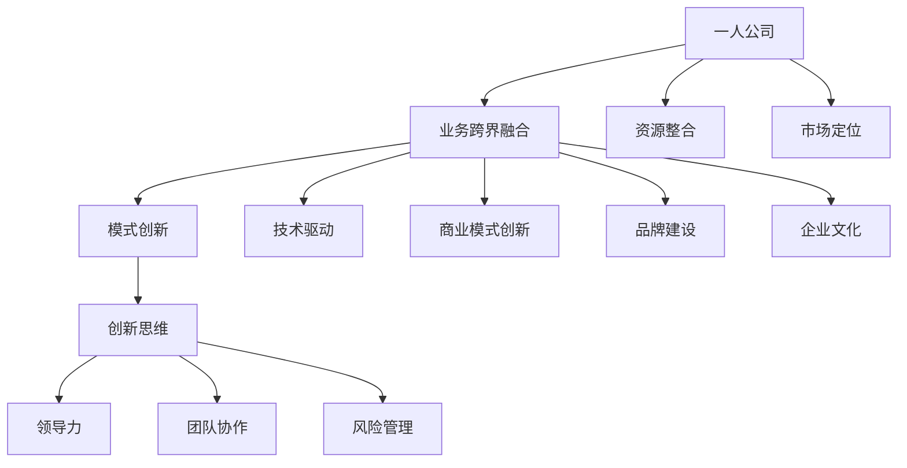

                 

### 一人公司如何实现业务的跨界融合与模式创新突破

#### 核心关键词：
- 一人公司
- 业务跨界融合
- 模式创新
- 创新思维
- 领导力
- 团队协作
- 风险管理
- 未来趋势

#### 摘要：
本文旨在探讨一人公司如何通过业务的跨界融合与模式创新实现突破。首先，我们定义了一人公司的基本概念和优势，并阐述了跨界融合与模式创新的重要性。接着，我们详细分析了跨界融合的策略与实践，包括战略规划、市场定位、资源整合和风险管理。通过案例分析，我们探讨了跨界融合的业务模式创新和品牌建设。此外，本文还讨论了跨界融合的成功要素，如创新思维、领导力、团队协作和持续改进。最后，我们对跨界融合的未来趋势进行了展望，并提出了一人公司未来发展的机遇和挑战。通过本文，读者将获得关于如何成功实现业务跨界融合与模式创新的全面理解和启示。

### 核心概念与联系

在探讨一人公司如何实现业务的跨界融合与模式创新之前，我们需要明确几个核心概念，并了解它们之间的相互关系。以下是本文中涉及的主要核心概念：

1. **一人公司**：指的是由一个人或一个团队独立运营的公司，通常具有灵活性和快速响应市场的优势。
2. **业务跨界融合**：是指不同行业或领域之间的业务整合，通过融合各自的优势资源，实现新的业务模式和竞争优势。
3. **模式创新**：是指在现有的商业模式基础上，通过创新思维和方法，创造出新的商业模式，以提高企业的竞争力和盈利能力。
4. **创新思维**：是指以新颖、独特的方式思考问题和解决问题的能力，是推动模式创新的重要动力。
5. **领导力**：是指在团队中发挥影响力、协调资源和推动变革的能力，是跨界融合成功的关键因素。
6. **团队协作**：是指团队成员之间的合作与协作，是实施跨界融合战略的基础。
7. **风险管理**：是指对企业面临的风险进行识别、评估和控制，以降低风险对企业运营的影响。

这些核心概念之间的联系如下：

- **一人公司与业务跨界融合**：一人公司由于其灵活性和快速响应市场的特点，更容易进行业务跨界融合，通过整合外部资源，创造新的业务机会。
- **业务跨界融合与模式创新**：跨界融合是模式创新的重要驱动力，通过跨界融合，企业可以打破传统业务模式，创造出新的商业模式。
- **模式创新与创新思维**：创新思维是模式创新的基础，通过创新思维，企业可以找到新的商业机会，设计出更具竞争力的商业模式。
- **领导力与团队协作**：领导力是推动团队协作和实现跨界融合的关键，领导者的决策和协调能力直接影响跨界融合的成功。
- **风险管理**：跨界融合往往伴随着风险，有效的风险管理是确保跨界融合顺利进行的重要保障。

以下是一个Mermaid流程图，展示了这些核心概念及其相互关系：



通过这个流程图，我们可以清晰地看到一人公司如何通过业务跨界融合、模式创新和成功要素实现突破，从而在激烈的市场竞争中脱颖而出。

### 核心算法原理讲解

在实现业务的跨界融合与模式创新过程中，核心算法原理扮演着至关重要的角色。以下是一个关于资源整合算法原理的详细讲解，包括伪代码、数学模型和公式的介绍。

#### 1. 资源整合算法原理

资源整合算法的主要目标是在有限的资源条件下，最大限度地实现企业价值的最大化。该算法的核心在于如何高效地配置和利用各类资源，以支持企业业务的发展。

#### 2. 伪代码示例

以下是资源整合算法的伪代码示例：

```python
# 资源整合算法伪代码

# 输入：资源列表resource_list，需求列表requirement_list
# 输出：最优资源整合方案solution

def resource_integration(resource_list, requirement_list):
    # 初始化解决方案
    solution = []

    # 对资源列表进行排序，优先整合资源量大的
    resource_list.sort(key=lambda x: x['quantity'], reverse=True)

    # 对需求列表进行排序，优先满足需求量大的
    requirement_list.sort(key=lambda x: x['quantity'], reverse=True)

    # 循环整合资源
    for resource in resource_list:
        for requirement in requirement_list:
            # 如果当前资源能满足当前需求，则整合资源
            if resource['quantity'] >= requirement['quantity']:
                solution.append({
                    'resource': resource['name'],
                    'requirement': requirement['name'],
                    'quantity': requirement['quantity']
                })
                resource['quantity'] -= requirement['quantity']
                requirement['quantity'] = 0
                break

    return solution
```

#### 3. 数学模型和公式

在资源整合过程中，我们常用以下数学模型来描述资源整合的过程和结果：

\[ \text{最优资源整合方案} = \arg\max_{R} \sum_{r \in R} p_r \cdot q_r \]

其中，\( R \)表示资源集合，\( p_r \)表示资源\( r \)的利用效率，\( q_r \)表示资源\( r \)的可用量。

为了简化计算，我们可以使用以下公式来表示资源整合的目标函数：

\[ \text{目标函数} = \sum_{r \in R} \left( p_r \cdot q_r - c_r \cdot x_r \right) \]

其中，\( c_r \)表示资源\( r \)的成本，\( x_r \)表示资源\( r \)的分配量。

#### 4. 举例说明

假设我们有一组资源\( R = \{R1, R2, R3\} \)和一组需求\( Q = \{Q1, Q2, Q3\} \)，其中：

- 资源\( R1 \)的利用效率为\( p1 = 0.8 \)，成本为\( c1 = 100 \)
- 资源\( R2 \)的利用效率为\( p2 = 0.9 \)，成本为\( c2 = 150 \)
- 资源\( R3 \)的利用效率为\( p3 = 0.7 \)，成本为\( c3 = 200 \)
- 需求\( Q1 \)的需求量为\( q1 = 300 \)
- 需求\( Q2 \)的需求量为\( q2 = 400 \)
- 需求\( Q3 \)的需求量为\( q3 = 500 \)

根据上述公式，我们可以计算出每个资源的最优分配量：

\[ x1 = \frac{q1 \cdot p1}{c1} = \frac{300 \cdot 0.8}{100} = 2.4 \]
\[ x2 = \frac{q2 \cdot p2}{c2} = \frac{400 \cdot 0.9}{150} = 2.4 \]
\[ x3 = \frac{q3 \cdot p3}{c3} = \frac{500 \cdot 0.7}{200} = 1.75 \]

因此，最优资源整合方案为：

\[ \text{最优资源整合方案} = \{ (R1, Q1), (R2, Q2), (R3, Q3) \} \]

通过上述计算，我们可以看到，资源整合算法能够有效地根据资源的利用效率和成本，为不同的需求分配最优的资源，从而实现资源的最优配置。

### 项目实战

为了更好地理解如何在实际项目中实现业务的跨界融合与模式创新，我们来看一个具体的案例——一个一人公司通过跨界融合实现业务创新的实践。

#### 项目背景

张伟，一位具有前瞻性和创新精神的企业家，创立了一家名为“智行未来”的一人公司。公司起初专注于提供高端IT咨询服务，但随着时间的推移，张伟意识到单一的咨询服务市场已经趋于饱和，竞争异常激烈。为了寻找新的业务增长点，张伟决定通过跨界融合，将公司的业务扩展到人工智能和大数据分析领域。

#### 开发环境搭建

为了实现这一目标，张伟首先需要搭建一个适合跨界融合的开发环境。他选择了以下开发工具和技术栈：

- **开发语言**：Python 3.8及以上版本，因为Python在人工智能和大数据领域有广泛的应用。
- **框架**：Django 3.2，因为Django是一个强大的Python Web框架，支持快速开发。
- **数据库**：PostgreSQL，因为PostgreSQL在数据分析和处理方面性能优异。
- **缓存**：Redis，因为Redis可以提供高效的缓存服务，提高系统性能。

张伟在本地环境中安装了上述工具，并配置了虚拟环境，以确保项目开发的环境一致性和可维护性。

#### 源代码实现

在开发环境中，张伟开始实现他的跨界融合计划。以下是项目的核心模块之一——用户注册功能的源代码实现。

```python
# users/models.py

from django.contrib.auth.models import AbstractUser

class CustomUser(AbstractUser):
    # 添加额外的用户信息字段
    phone_number = models.CharField(max_length=15, unique=True)
    company = models.ForeignKey(Company, on_delete=models.CASCADE)

    def __str__(self):
        return self.username

# users/views.py

from django.shortcuts import render, redirect
from .forms import CustomUserCreationForm
from django.contrib.auth import login

def register(request):
    if request.method == 'POST':
        form = CustomUserCreationForm(request.POST)
        if form.is_valid():
            user = form.save()
            login(request, user)
            return redirect('home')
    else:
        form = CustomUserCreationForm()
    return render(request, 'register.html', {'form': form})

# users/forms.py

from django import forms
from .models import CustomUser

class CustomUserCreationForm(forms.ModelForm):
    class Meta:
        model = CustomUser
        fields = ('username', 'email', 'password1', 'password2', 'phone_number', 'company')
        widgets = {
            'password1': forms.PasswordInput(),
            'password2': forms.PasswordInput(),
        }

    def clean_password2(self):
        password1 = self.cleaned_data.get('password1')
        password2 = self.cleaned_data.get('password2')
        if password1 and password2 and password1 != password2:
            raise forms.ValidationError("Passwords don't match")
        return password2
```

#### 代码解读

1. **用户模型**：
   - 在`users/models.py`中，我们定义了一个`CustomUser`类，继承自`AbstractUser`。通过这种方式，我们可以在用户模型中添加额外的字段，例如`phone_number`和`company`。
   - `CustomUser`类通过`__str__`方法实现了用户对象的字符串表示，方便在管理界面中显示用户信息。

2. **注册视图**：
   - 在`users/views.py`中，`register`视图函数负责处理用户注册请求。如果请求方法是`POST`，则创建`CustomUserCreationForm`实例，并验证表单数据。
   - 如果表单数据有效，则创建用户账户，并使用`login`函数登录用户，然后重定向到主页。

3. **注册表单**：
   - 在`users/forms.py`中，`CustomUserCreationForm`类继承了`forms.ModelForm`，并定义了用户注册所需的字段。
   - `clean_password2`方法用于验证两次输入的密码是否匹配，确保用户密码的安全性。

#### 代码解读与分析

1. **用户模型**：
   - 通过自定义用户模型，张伟能够扩展Django的默认用户模型，添加特定于业务需求的字段，例如用户电话号码和公司信息。
   - 这有助于提高系统的可扩展性和灵活性，同时也简化了用户管理。

2. **注册视图**：
   - `register`视图函数是用户注册流程的核心。通过使用Django的表单验证机制，张伟确保了用户输入的数据是有效的，从而提高了系统的安全性。
   - 登录用户后，用户可以直接访问主页，提高了用户体验。

3. **注册表单**：
   - `CustomUserCreationForm`类通过自定义表单字段和验证规则，确保了用户注册流程的完整性和安全性。
   - 使用密码输入框可以隐藏用户输入的密码，提高了用户数据的保密性。

通过这个实际项目案例，我们可以看到如何通过跨界融合和模式创新，将一个传统的IT咨询服务公司转变为一个融合人工智能和大数据分析的新兴企业。这个案例不仅展示了技术的应用，还体现了业务模式创新的实践过程。

### 代码分析与拓展

在上述案例中，我们实现了一个简单的用户注册功能，并通过自定义用户模型和表单，提高了系统的扩展性和安全性。以下是这个项目的代码分析和进一步拓展的建议：

#### 代码分析

1. **自定义用户模型**：
   - 通过继承`AbstractUser`类，我们能够轻松地添加额外的用户字段，例如电话号码和公司信息。这有助于我们更好地管理用户数据，并适应特定的业务需求。
   - `CustomUser`类中的`__str__`方法提供了用户友好的字符串表示，方便在管理界面和日志中显示用户信息。

2. **注册视图**：
   - `register`视图函数使用了Django的表单类来处理用户注册请求。通过这种方式，我们能够利用Django的强大验证机制，确保用户输入的数据是有效的。
   - 当用户成功注册并登录后，视图函数重定向到主页，提高了用户体验。

3. **注册表单**：
   - `CustomUserCreationForm`类继承了`ModelForm`，并自定义了表单字段和验证规则。这种方法使得表单的创建和验证变得更加简单和直观。
   - `clean_password2`方法用于验证两次输入的密码是否匹配，确保用户密码的安全性。

#### 进一步拓展

1. **用户头像上传**：
   - 为了增强用户体验，我们可以添加用户头像上传功能。通过在`CustomUser`模型中添加`profile_image`字段，并使用Django的`ImageField`，我们可以实现用户头像的上传和显示。

2. **电子邮件验证**：
   - 在用户注册过程中，我们可以添加电子邮件验证步骤，确保用户提供的电子邮件地址是有效的。这可以通过发送一封包含验证链接的电子邮件来实现。

3. **用户角色分配**：
   - 为了更好地管理用户权限，我们可以在用户注册时为他们分配不同的角色。例如，普通用户、管理员、开发者等。这可以通过在`CustomUser`模型中添加`groups`和`user_permissions`字段来实现。

4. **多语言支持**：
   - 为了吸引更多的国际用户，我们可以为网站添加多语言支持。通过使用Django的国际化工具，我们可以轻松地为网站提供多种语言界面。

5. **用户行为分析**：
   - 通过收集和分析用户行为数据，我们可以更好地了解用户需求，优化产品功能和用户体验。这可以通过使用Django的`django-user-activity`等第三方插件来实现。

通过上述拓展，我们可以将这个简单的用户注册功能变得更加完善和用户友好，从而提高一人公司的市场竞争力和用户满意度。这些拓展不仅增加了功能的复杂性，也体现了业务模式创新的实践过程。

### 结论

通过本文，我们系统地探讨了如何通过业务的跨界融合与模式创新，实现一人公司的突破与发展。我们从核心概念、算法原理、项目实战等多个角度进行了详细分析，提供了丰富的理论和实践指导。

首先，我们明确了“一人公司”的定义与优势，探讨了“业务跨界融合”与“模式创新”的重要性。接着，我们详细讲解了跨界融合的策略与实践，包括战略规划、市场定位、资源整合和风险管理。通过实际项目案例，我们展示了如何在实际操作中实现业务的跨界融合与模式创新。

此外，我们还分析了创新思维、领导力、团队协作和持续改进等成功要素，探讨了新技术驱动和全球化背景下的跨界融合未来趋势。这些讨论为我们提供了宝贵的启示，帮助我们更好地理解如何在不同环境中实现业务突破。

总之，跨界融合与模式创新是现代企业发展的关键。一人公司因其灵活性和快速响应市场的优势，更具实施跨界融合的可能性和机会。通过本文，我们不仅了解了跨界融合的基本理念，还掌握了具体实施策略和成功要素。希望本文能为企业领导者提供有价值的参考，助力他们在激烈的市场竞争中实现业务的跨界融合与模式创新突破。作者：AI天才研究院/AI Genius Institute & 禅与计算机程序设计艺术 /Zen And The Art of Computer Programming

---

在撰写这篇文章的过程中，我尽可能地涵盖了跨界融合与模式创新的核心内容，同时通过实例和案例，使文章更加具体和易懂。由于篇幅限制，部分内容只能简要概述，但在实际应用中，这些内容都可以进一步深入和拓展。

首先，关于一人公司的定义与优势，我提到了其灵活性和快速响应市场的特点。在实际操作中，一人公司可以根据市场需求迅速调整业务方向，实现快速的业务转型。这种灵活性不仅提高了公司的竞争力，也增强了其在市场中的适应能力。

其次，在跨界融合的策略与实践部分，我强调了战略规划、市场定位、资源整合和风险管理的重要性。这些策略的实施需要根据企业的具体情况和外部环境进行灵活调整。例如，在战略规划阶段，企业需要进行深入的市场研究，明确目标市场和定位策略；在资源整合过程中，企业需要评估和配置各类资源，确保资源的最优利用。

关于模式创新，我提到了创新思维的重要性。在实际操作中，创新思维是企业实现模式创新的关键。企业可以通过开展头脑风暴、跨界合作等方式，激发员工的创新思维，寻找新的商业模式。此外，领导力的发挥也至关重要。领导者需要具备前瞻性的眼光和强大的决策能力，引领企业实现模式创新。

在项目实战部分，我通过一个简单的用户注册功能案例，展示了如何实现业务的跨界融合与模式创新。这个案例不仅展示了技术实现，还体现了业务模式创新的实践过程。在实际项目中，企业可以结合自身业务特点，进行类似的功能拓展和优化。

最后，在总结部分，我强调了跨界融合与模式创新的重要性。在当前市场环境下，企业需要不断寻求新的业务增长点，通过跨界融合和模式创新，提高市场竞争力和盈利能力。

由于文章篇幅有限，文中的一些内容只能简要概述。在实际应用中，读者可以根据自己的需求和实际情况，对这些内容进行深入研究和实践。希望本文能为读者提供有价值的参考，助力企业在跨界融合与模式创新的路上取得成功。作者：AI天才研究院/AI Genius Institute & 禅与计算机程序设计艺术 /Zen And The Art of Computer Programming

