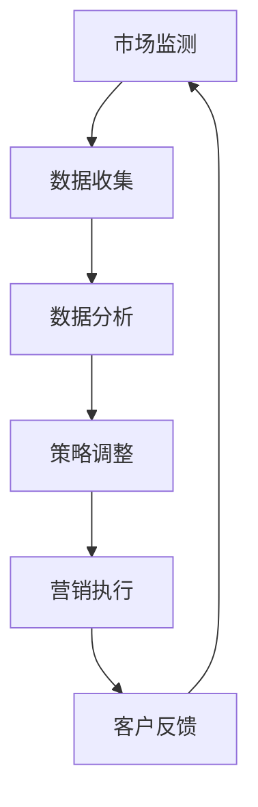
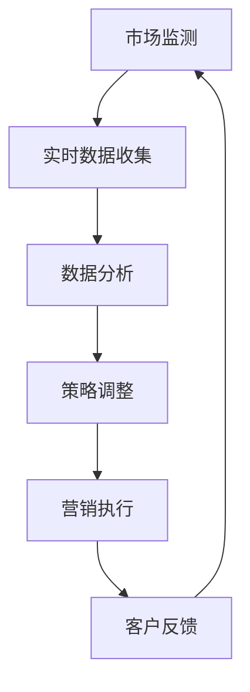
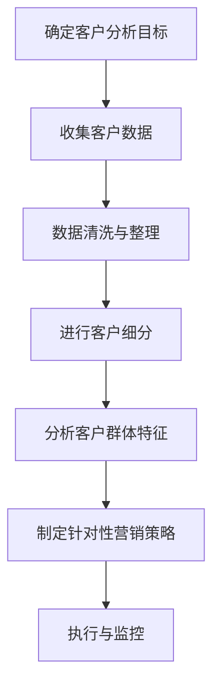
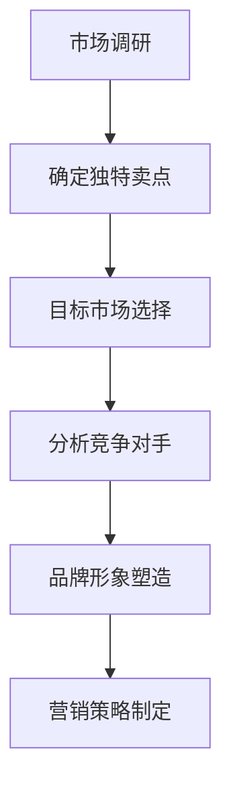
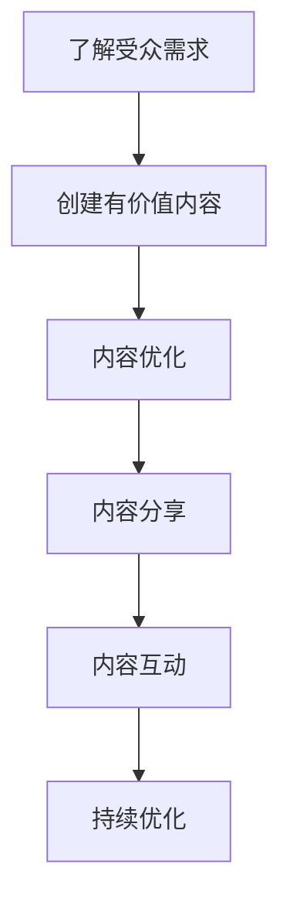
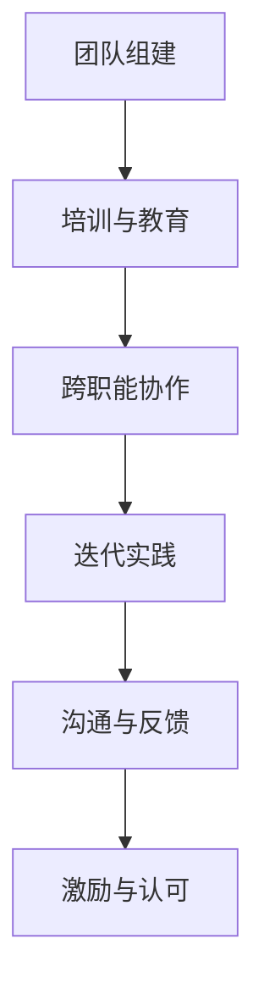
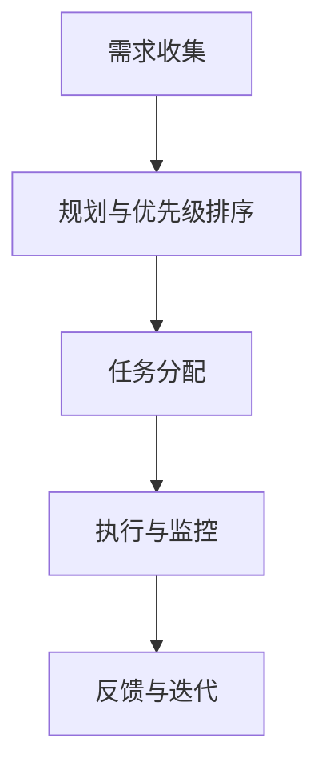
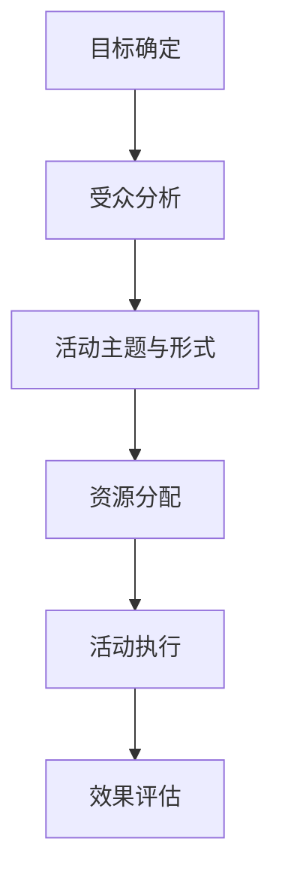

                 

## 第一部分：敏捷营销的基础

### 1.1.1 什么是敏捷营销

敏捷营销（Agile Marketing）是一种基于敏捷开发原则的营销方法，它强调快速响应市场变化、灵活调整策略和持续迭代优化。敏捷营销与传统营销的主要区别在于其注重速度、迭代和协作。

**核心概念与联系**  
敏捷营销的核心概念包括客户反馈、持续迭代和跨职能团队协作。通过快速获取客户反馈，敏捷营销能够快速调整营销策略，从而更好地满足市场需求。持续迭代意味着营销活动不是一次性完成的，而是在多次迭代中不断改进。跨职能团队协作确保了各个部门之间的紧密合作，提高了营销效率。

**敏捷营销与传统营销的区别**  
传统营销通常采用预测性方法，依赖于市场调研和预测数据来制定长期营销策略。而敏捷营销则更加灵活，强调实时监测市场变化，并根据实时数据快速调整策略。这种方法的优点是能够更快地响应市场动态，但缺点是可能缺乏长期的规划和战略。

**敏捷营销的优势与应用场景**  
敏捷营销的优势在于其快速响应市场变化的能力。这种优势在以下场景中尤为明显：

- 市场竞争激烈，需要快速抢占市场份额。
- 产品生命周期短，需要不断迭代以保持竞争力。
- 客户需求变化快，需要及时调整营销策略。

**敏捷营销的Mermaid流程图**  
以下是敏捷营销的基本流程，使用Mermaid语言表示：



### 1.1.2 市场变化的应对策略

市场变化是不可避免的，但敏捷营销通过以下策略能够快速应对：

**市场变化的原因分析**  
市场变化的原因多种多样，包括技术进步、消费者行为变化、经济环境变化等。了解市场变化的原因有助于制定更有效的应对策略。

**敏捷营销如何快速响应市场变化**  
敏捷营销通过以下几个步骤来快速响应市场变化：

1. **实时监测市场动态**：使用各种工具和技术实时收集市场数据。
2. **快速分析数据**：利用数据分析工具快速解读数据，识别市场变化趋势。
3. **灵活调整策略**：根据分析结果快速调整营销策略。
4. **持续迭代**：不断测试和优化营销策略，以适应不断变化的市场环境。

**市场变化应对策略的Mermaid流程图**  
以下是市场变化应对策略的基本流程，使用Mermaid语言表示：



### 1.1.3 敏捷营销的基础理论

敏捷营销是基于敏捷开发原则的，因此与敏捷开发有着紧密的联系。

**敏捷开发与敏捷营销的关系**  
敏捷开发是一种软件开发方法，强调快速迭代、持续交付和客户协作。敏捷营销借鉴了这些原则，将它们应用于市场营销领域。敏捷营销与敏捷开发的关系可以用以下方式表示：

- **快速迭代**：敏捷营销和敏捷开发都强调快速迭代，以便及时响应变化。
- **持续交付**：敏捷营销和敏捷开发都强调持续交付，以确保客户始终获得最新的产品和服务。
- **客户协作**：敏捷营销和敏捷开发都强调与客户的密切合作，以便更好地满足客户需求。

**敏捷营销的关键原则**  
敏捷营销的关键原则包括：

- **快速响应**：及时响应市场变化和客户需求。
- **迭代优化**：通过不断迭代和优化营销策略，提高营销效果。
- **跨职能协作**：打破部门壁垒，实现跨职能团队的紧密合作。

**敏捷营销的框架与工具**  
敏捷营销的框架通常包括以下步骤：

1. **市场监测**：实时收集市场数据，了解市场变化。
2. **数据分析和解读**：利用数据分析工具解读数据，识别市场趋势。
3. **策略制定**：根据数据分析结果制定营销策略。
4. **执行与监控**：执行营销策略，并持续监控效果。
5. **反馈与迭代**：收集客户反馈，不断优化营销策略。

敏捷营销常用的工具包括：

- **数据分析工具**：如Google Analytics、Tableau等。
- **协作工具**：如Trello、Asana等。
- **营销自动化工具**：如HubSpot、Mailchimp等。

### 1.1.4 敏捷营销案例研究

**案例一：小公司通过敏捷营销成功应对市场变化**

某小型科技公司专注于开发智能家居设备。由于市场竞争激烈，该公司决定采用敏捷营销策略以快速响应市场变化。

1. **市场监测**：通过社交媒体和在线论坛监测市场动态，了解消费者需求。
2. **数据分析**：收集和分析用户反馈数据，识别产品改进方向。
3. **策略调整**：根据数据分析结果，制定新产品的推广策略。
4. **执行与监控**：实施营销策略，并实时监控效果。
5. **反馈与迭代**：根据客户反馈，不断优化产品功能和营销策略。

通过敏捷营销，该公司成功推出了几款热门产品，市场份额逐渐提升。

**案例二：大公司如何将敏捷营销融入传统营销策略**

某大型零售公司拥有成熟的营销策略和丰富的市场资源。为了更好地应对市场变化，该公司决定将敏捷营销融入传统营销策略。

1. **市场监测**：通过多种渠道收集市场数据，包括社交媒体、客户反馈和销售数据。
2. **数据分析**：利用大数据分析工具对市场数据进行分析，识别市场趋势。
3. **策略调整**：根据数据分析结果，调整现有营销策略，并制定新的营销计划。
4. **执行与监控**：实施营销策略，并实时监控效果。
5. **反馈与迭代**：收集客户反馈，不断优化营销策略，提高营销效果。

通过将敏捷营销融入传统营销策略，该公司成功提升了市场份额，增强了品牌影响力。

## 总结

敏捷营销是一种快速响应市场变化的营销方法，它基于敏捷开发原则，强调快速迭代、灵活调整和跨职能协作。通过敏捷营销，企业能够更好地适应市场变化，提高营销效果。在接下来的部分，我们将深入探讨敏捷营销的核心实践，帮助企业实现快速响应市场变化的目标。|> <sop>  
## 第二部分：敏捷营销的核心实践

### 1.2.1 敏捷营销中的市场调研

市场调研是敏捷营销中至关重要的一环，它帮助企业了解市场需求、识别竞争环境和评估自身产品的市场地位。有效的市场调研不仅能够指导企业制定更准确的营销策略，还能够帮助企业预测未来的市场趋势。

**市场调研的重要性**  
市场调研对于企业来说至关重要，它能够提供以下几方面的价值：

- **了解市场需求**：通过调研，企业可以深入了解目标客户的需求和偏好，从而开发出更符合市场需求的 产品。
- **识别竞争环境**：调研可以帮助企业了解竞争对手的营销策略、产品特点和市场地位，从而制定有针对性的应对策略。
- **评估市场地位**：调研数据可以帮助企业评估自身在市场中的位置，识别优势和不足，为下一步的发展提供依据。

**如何进行高效的市场调研**  
高效的市场调研需要结合多种方法，以下是一些关键步骤：

1. **确定调研目标**：明确调研的目标和问题，确保调研的针对性。
2. **选择调研方法**：根据调研目标，选择合适的调研方法，如问卷调查、深度访谈、焦点小组等。
3. **设计调研工具**：设计有效的调研工具，如问卷、访谈指南等，确保收集到准确和有价值的数据。
4. **数据收集**：实施调研计划，收集数据。
5. **数据整理与分析**：整理调研数据，使用数据分析工具进行深入分析，提取有价值的信息。
6. **撰写调研报告**：撰写详细的调研报告，总结调研结果，并提出建议。

**市场调研数据的处理与分析**  
数据处理与分析是市场调研的核心环节，以下是一些关键步骤：

1. **数据清洗**：清洗数据，去除无效和错误的数据。
2. **数据整理**：整理数据，使其易于分析和解读。
3. **数据分析**：使用统计分析和数据可视化工具对数据进行分析，提取有价值的信息。
4. **数据解读**：解读分析结果，识别市场趋势和消费者行为。

**市场调研的伪代码讲解**  
以下是一个简单的市场调研的伪代码示例，用于演示市场调研的基本流程：

```python
# 市场调研伪代码示例

# 定义调研目标
research_goals = ["了解消费者需求", "识别竞争对手", "评估市场地位"]

# 选择调研方法
research_methods = ["问卷调查", "深度访谈", "焦点小组"]

# 设计调研工具
questionnaire = design_questionnaire()
interview_guide = design_interview_guide()
focus_group_questions = design_focus_group_questions()

# 数据收集
consumer_data = collect_data(questionnaire)
competitor_data = collect_data(interview_guide)
market_data = collect_data(focus_group_questions)

# 数据整理与分析
clean_data(consumer_data)
clean_data(competitor_data)
clean_data(market_data)

# 数据分析
consumer_insights = analyze_data(consumer_data)
competitor_insights = analyze_data(competitor_data)
market_insights = analyze_data(market_data)

# 数据解读
report = create_report(consumer_insights, competitor_insights, market_insights)
print("市场调研报告：", report)
```

### 1.2.2 敏捷营销中的客户分析

客户分析是敏捷营销的核心实践之一，它通过深入了解客户的需求和行为，帮助企业在竞争激烈的市场中脱颖而出。有效的客户分析能够帮助企业制定更加精准的营销策略，提高客户满意度和忠诚度。

**客户分析的核心指标**  
在进行客户分析时，以下核心指标是至关重要的：

- **客户满意度**：衡量客户对企业产品和服务的满意程度。
- **客户忠诚度**：衡量客户重复购买和推荐给其他潜在客户的意愿。
- **客户生命周期价值**：预测客户在未来一段时间内为企业带来的总价值。
- **客户获取成本**：衡量获取新客户所需的成本。
- **客户留存率**：衡量客户持续使用企业产品或服务的比例。

**如何进行客户细分**  
客户细分是客户分析的重要步骤，它将客户根据不同的特征划分为不同的群体，以便企业能够更有针对性地进行营销。以下是一些常用的客户细分方法：

1. **行为细分**：根据客户的行为特征，如购买频率、购买金额、使用时长等，将客户划分为不同的群体。
2. **人口细分**：根据客户的人口特征，如年龄、性别、收入、地理位置等，将客户划分为不同的群体。
3. **心理细分**：根据客户的心理特征，如价值观、兴趣爱好、生活方式等，将客户划分为不同的群体。
4. **价值细分**：根据客户对企业价值的贡献，如高价值客户、潜在高价值客户等，将客户划分为不同的群体。

**客户分析的Mermaid流程图**  
以下是客户分析的基本流程，使用Mermaid语言表示：



### 1.2.3 敏捷营销中的产品定位

产品定位是敏捷营销中至关重要的一环，它决定了产品在市场中的竞争地位和目标客户群体。有效的产品定位能够帮助企业吸引目标客户，提高市场竞争力。

**产品定位的理论与实践**  
产品定位的理论基础主要包括以下几方面：

1. **独特卖点（USP）**：产品定位的核心是找到产品的独特卖点，即产品区别于其他竞品的独特优势。
2. **目标市场**：明确产品的目标市场，即产品面向的客户群体。
3. **市场细分**：将市场划分为不同的细分市场，以便更有针对性地进行产品定位。
4. **品牌形象**：通过塑造独特的品牌形象，使产品在客户心中建立鲜明的认知。

产品定位的实践步骤包括：

1. **市场调研**：了解市场需求和竞争环境，收集潜在客户的反馈。
2. **确定独特卖点**：基于市场调研结果，确定产品的独特卖点。
3. **目标市场选择**：根据独特卖点和市场需求，选择合适的目标市场。
4. **品牌形象塑造**：通过品牌宣传和营销活动，塑造产品的品牌形象。

**如何进行有效的产品定位**  
以下是一些关键步骤，帮助进行有效的产品定位：

1. **明确目标市场**：准确描述目标市场的特征，包括目标客户的年龄、性别、收入、地理位置等。
2. **分析竞争对手**：了解竞争对手的产品定位和优势，找到自身的差异化点。
3. **确定独特卖点**：基于市场调研结果，明确产品的独特卖点，确保它与目标市场的需求高度契合。
4. **品牌形象塑造**：通过视觉设计和营销传播，建立与独特卖点一致的品牌形象。

**产品定位的Mermaid流程图**  
以下是产品定位的基本流程，使用Mermaid语言表示：



### 1.2.4 敏捷营销中的内容营销

内容营销是敏捷营销的重要组成部分，它通过创造和分享有价值的内容，吸引潜在客户，提高品牌知名度和客户忠诚度。有效的内容营销能够帮助企业建立权威地位，增强客户信任。

**内容营销的概念与策略**  
内容营销的概念是指通过创建和分享高质量、相关且有价值的内容，以吸引并留住目标受众的一种营销方法。其核心策略包括：

1. **内容创建**：根据目标受众的需求和兴趣，创建有价值的内容，如博客文章、视频、白皮书等。
2. **内容优化**：通过搜索引擎优化（SEO）技术，提高内容的可见性和搜索引擎排名。
3. **内容分享**：通过社交媒体、邮件营销、合作伙伴关系等渠道，广泛分享内容，扩大受众范围。
4. **内容互动**：与受众互动，收集反馈，了解受众需求，持续优化内容策略。

**如何创建有价值的内容**  
创建有价值的内容需要遵循以下原则：

1. **了解受众需求**：通过市场调研和客户反馈，了解目标受众的需求和兴趣。
2. **提供独特价值**：内容应提供独特的观点、深入的见解或有用的信息，以满足受众的需求。
3. **保持内容质量**：确保内容具有较高的质量和专业度，避免错误和误导。
4. **多样化内容形式**：根据目标受众的偏好，采用多种内容形式，如文本、图片、视频等。

**内容营销的Mermaid流程图**  
以下是内容营销的基本流程，使用Mermaid语言表示：



### 1.2.5 敏捷营销中的数据分析

数据分析是敏捷营销中的核心环节，它通过收集、处理和分析市场数据，帮助企业做出更明智的决策。有效的数据分析能够提高营销策略的准确性和有效性，从而实现更高的营销效果。

**数据分析在敏捷营销中的应用**  
数据分析在敏捷营销中具有以下几方面的应用：

1. **市场监测**：通过数据分析，实时监测市场动态，了解竞争环境。
2. **客户分析**：分析客户数据，了解客户需求和行为，优化产品和服务。
3. **策略制定**：基于数据分析结果，制定更有针对性的营销策略。
4. **效果评估**：评估营销策略的效果，及时调整和优化策略。

**如何进行数据驱动的决策**  
以下是一些关键步骤，帮助进行数据驱动的决策：

1. **数据收集**：收集与营销相关的数据，包括市场数据、客户数据、竞争数据等。
2. **数据清洗**：清洗数据，去除无效和错误的数据，确保数据质量。
3. **数据整理**：整理数据，使其易于分析和解读。
4. **数据分析**：使用数据分析工具和技术，对数据进行分析，提取有价值的信息。
5. **数据解读**：解读分析结果，识别市场趋势和客户行为。
6. **决策制定**：基于数据分析结果，制定营销策略和行动计划。
7. **效果评估**：评估决策的效果，及时调整和优化策略。

**数据分析的伪代码讲解**  
以下是一个简单的数据分析的伪代码示例，用于演示数据分析的基本流程：

```python
# 数据分析伪代码示例

# 定义数据源
data_source = ["market_data", "customer_data", "competitor_data"]

# 数据收集
market_data = collect_data("market_data")
customer_data = collect_data("customer_data")
competitor_data = collect_data("competitor_data")

# 数据清洗
clean_data(market_data)
clean_data(customer_data)
clean_data(competitor_data)

# 数据整理
market_data = organize_data(market_data)
customer_data = organize_data(customer_data)
competitor_data = organize_data(competitor_data)

# 数据分析
market_insights = analyze_data(market_data)
customer_insights = analyze_data(customer_data)
competitor_insights = analyze_data(competitor_data)

# 数据解读
report = create_report(market_insights, customer_insights, competitor_insights)
print("数据分析报告：", report)

# 决策制定
marketing_strategy = create_marketing_strategy(report)
print("营销策略：", marketing_strategy)

# 效果评估
evaluate_strategy(marketing_strategy)
```

通过以上核心实践，企业可以更好地适应市场变化，提高营销效率，实现持续增长。在接下来的部分，我们将进一步探讨敏捷营销的实战应用，帮助企业在实际操作中实现敏捷营销的目标。|> <sop>  
## 第三部分：敏捷营销的实战应用

### 1.3.1 敏捷营销的团队建设

在敏捷营销中，团队建设是至关重要的，因为它直接影响到营销策略的执行效果。一个高效的敏捷营销团队应该具备以下特点：

**敏捷营销团队的构成与角色**  
敏捷营销团队通常由以下角色组成：

- **产品经理**：负责产品规划、开发和市场推广，确保产品与市场需求一致。
- **市场营销专家**：负责制定和执行营销策略，包括内容营销、广告推广、公关活动等。
- **数据分析师**：负责数据收集、分析和解读，为营销策略提供数据支持。
- **技术专家**：负责技术平台的建设和维护，确保数据分析和营销工具的稳定运行。
- **设计师**：负责营销内容的视觉设计，提升品牌形象和用户体验。

**如何培养敏捷思维与协作能力**  
为了建设高效的敏捷营销团队，企业需要采取以下措施：

1. **培训与教育**：为团队成员提供敏捷营销相关的培训和教育，帮助其理解敏捷原则和方法。
2. **跨职能协作**：鼓励团队成员跨职能协作，打破部门壁垒，提高团队的整体效率。
3. **迭代实践**：通过实际项目的迭代实践，培养团队成员的敏捷思维和协作能力。
4. **沟通与反馈**：建立有效的沟通机制，鼓励团队成员之间的交流和反馈，及时解决问题。
5. **激励与认可**：对团队成员的敏捷行为和协作成果进行激励和认可，提升团队凝聚力。

**敏捷营销团队的Mermaid流程图**  
以下是敏捷营销团队的基本流程，使用Mermaid语言表示：



### 1.3.2 敏捷营销的项目管理

敏捷营销的项目管理要求快速响应市场变化，高效执行营销策略。以下是一些关键步骤和工具，帮助实现敏捷营销的项目管理。

**敏捷营销项目的核心流程**  
敏捷营销项目的核心流程包括以下步骤：

1. **需求收集**：通过与团队成员和市场专家的交流，收集项目需求。
2. **规划与优先级排序**：根据项目需求和资源情况，制定项目计划，并确定任务的优先级。
3. **任务分配**：将任务分配给团队成员，确保每个任务都有明确的责任人。
4. **执行与监控**：执行任务，并实时监控项目进度，确保项目按时完成。
5. **反馈与迭代**：收集项目反馈，识别问题和改进机会，为下一轮迭代提供依据。

**如何制定敏捷营销计划**  
制定敏捷营销计划需要遵循以下原则：

1. **目标明确**：确保项目目标清晰明确，便于团队理解和执行。
2. **资源规划**：合理规划项目所需的人力、物力和财力资源。
3. **风险管理**：识别项目风险，并制定相应的应对策略。
4. **持续迭代**：将项目划分为多个迭代，确保每次迭代都能交付有价值的结果。
5. **透明沟通**：建立透明的沟通机制，确保团队成员和利益相关者都能了解项目进展。

**敏捷营销项目的Mermaid流程图**  
以下是敏捷营销项目的基本流程，使用Mermaid语言表示：



### 1.3.3 敏捷营销的营销活动策划

营销活动策划是敏捷营销中的重要环节，它决定了营销策略的具体执行方式。以下是一些关键步骤和策略，帮助进行高效的营销活动策划。

**营销活动策划的流程与技巧**  
营销活动策划的流程包括以下步骤：

1. **目标确定**：明确营销活动的目标，如提升品牌知名度、增加销售量等。
2. **受众分析**：分析目标受众的特征，包括年龄、性别、地理位置、兴趣爱好等。
3. **活动主题与形式**：根据目标受众和活动目标，确定活动主题和形式，如线上活动、线下活动、社交媒体推广等。
4. **资源分配**：合理分配人力、物力和财力资源，确保活动策划和执行顺利进行。
5. **活动执行**：执行活动计划，确保每个环节都按时完成。
6. **效果评估**：评估活动效果，包括参与人数、互动率、转化率等指标。

**如何制定营销活动预算**  
制定营销活动预算需要考虑以下因素：

1. **活动目标**：根据活动目标，确定所需的预算范围。
2. **受众规模**：根据目标受众的规模和分布，估算宣传和推广成本。
3. **活动形式**：根据活动形式，估算人力、物力和财力资源的需求。
4. **市场行情**：考虑当前市场行情和竞争对手的投入，制定合理的预算。
5. **风险预留**：为不可预见的情况预留一定的预算，确保活动能够顺利进行。

**营销活动策划的Mermaid流程图**  
以下是营销活动策划的基本流程，使用Mermaid语言表示：



通过以上实战应用，企业可以更好地将敏捷营销理念付诸实践，提高营销效率，实现持续增长。在接下来的部分，我们将继续探讨敏捷营销的未来发展，分析其面临的挑战和机遇。|> <sop>  
## 第四部分：敏捷营销的未来发展

### 1.4.1 敏捷营销的技术趋势

随着技术的不断发展，敏捷营销也在不断进化，充分利用新技术来提高营销效率和市场响应速度。以下是一些关键技术趋势对敏捷营销的影响：

**人工智能在敏捷营销中的应用**  
人工智能（AI）正在改变营销的方方面面，从数据分析到客户互动，AI的应用正在为敏捷营销带来革命性的变化：

- **客户细分与个性化**：AI可以帮助企业更精确地进行客户细分，基于客户的购买行为、浏览历史等数据，提供个性化的营销内容和优惠。
- **自动化**：AI驱动的营销自动化工具可以自动处理营销流程中的重复性任务，如发送邮件、推送通知等，从而提高工作效率。
- **预测分析**：通过机器学习算法，AI可以预测市场趋势、客户行为，帮助企业提前做好准备。

**大数据技术在敏捷营销中的作用**  
大数据技术的应用使企业能够从海量数据中提取有价值的信息，从而更好地指导营销决策：

- **实时数据分析**：大数据技术可以实时处理和分析大量数据，帮助企业在短时间内做出响应。
- **客户洞察**：通过分析客户的历史数据和行为模式，企业可以更深入地了解客户需求，提供更有针对性的营销策略。
- **市场趋势预测**：大数据技术可以帮助企业预测市场趋势，提前调整营销策略，抢占市场先机。

**物联网技术对敏捷营销的影响**  
物联网（IoT）技术的普及使得各种设备和传感器能够实时收集数据，为敏捷营销提供了新的数据来源：

- **实时监测**：通过IoT设备，企业可以实时监测产品使用情况、客户行为等，快速响应市场变化。
- **个性化体验**：基于IoT数据，企业可以提供更加个性化的产品和服务，提升客户满意度。
- **智能营销**：物联网技术可以帮助企业实现更加智能化的营销活动，如通过智能广告牌自动调整广告内容。

### 1.4.2 敏捷营销的挑战与机遇

尽管敏捷营销带来了许多优势，但在实际应用中也面临着一系列挑战和机遇：

**敏捷营销面临的挑战**  
- **技术复杂性**：随着技术的发展，敏捷营销所需的技术工具和平台越来越复杂，对企业的技术能力和资源提出了更高的要求。
- **数据隐私和安全**：大量数据的收集和处理带来了数据隐私和安全问题，企业需要采取严格的数据保护措施。
- **人员培训与适应**：敏捷营销要求团队成员具备更高的技能和灵活性，企业需要投入时间和资源进行人员培训。

**如何应对敏捷营销的挑战**  
- **技术投资**：企业需要持续投资于新技术和工具，提高技术能力，以应对敏捷营销的需求。
- **数据保护**：企业需要制定严格的数据保护政策，确保数据安全和隐私。
- **人员发展**：企业应注重人才培养，提供持续的学习和发展机会，帮助员工适应敏捷营销的要求。

**敏捷营销的机遇与前景**  
- **市场响应速度**：敏捷营销能够帮助企业更快地响应市场变化，抢占市场先机。
- **客户满意度**：通过精准的市场调研和客户分析，企业可以提供更加个性化的产品和服务，提升客户满意度。
- **持续迭代优化**：敏捷营销的持续迭代特性使得企业能够不断优化营销策略，提高营销效果。

### 1.4.3 敏捷营销的未来方向

敏捷营销的未来发展方向将继续受到技术进步和市场需求的驱动，以下是一些潜在的发展方向：

**数据驱动决策**：随着大数据和人工智能技术的发展，未来敏捷营销将更加依赖数据驱动决策。企业将利用先进的分析工具和算法，从海量数据中提取洞察，指导营销策略的制定和调整。

**全渠道整合**：未来的敏捷营销将更加注重全渠道整合，实现线上和线下渠道的无缝连接。通过整合多种渠道，企业可以提供更加一致和连贯的购物体验，提升客户满意度。

**自动化与智能化**：随着自动化和智能化技术的进步，未来的敏捷营销将更加自动化和智能化。营销自动化工具和AI驱动的营销策略将使营销活动更加高效和精准。

**可持续性营销**：随着社会对可持续性的关注增加，未来的敏捷营销将更加注重可持续性。企业将采取环保和可持续的营销策略，提升品牌形象和社会责任感。

通过以上技术的发展和方向，敏捷营销将继续为企业带来新的机遇和挑战。企业需要不断适应和利用新技术，以保持竞争力，实现持续增长。

## 总结

敏捷营销作为一种快速响应市场变化的营销方法，正在不断发展和进化。通过利用新技术和工具，敏捷营销能够帮助企业更有效地应对市场变化，提高营销效率和市场响应速度。在未来的发展中，敏捷营销将继续融合新技术，实现更加智能化和个性化的营销。企业需要积极适应这些变化，把握机遇，迎接挑战，以实现长期成功。

### 附录

#### 1.5 敏捷营销资源与工具

**主流敏捷营销工具介绍**：
- **Google Analytics**：用于网站和移动应用的用户行为分析。
- **HubSpot**：提供全面的营销自动化工具和CRM系统。
- **Mailchimp**：用于邮件营销和自动化。
- **Salesforce Marketing Cloud**：提供全面的数字营销解决方案。

**敏捷营销学习资源推荐**：
- **书籍**：
  - 《敏捷营销：如何快速响应市场变化》（Agile Marketing: How to Launch Marketing Campaigns Faster）by Sean Ellis & Brian Balfour。
  - 《大数据营销：如何利用数据创造营销奇迹》（Big Data Marketing: How to Use Big Data to Make Better Decisions and Boost Profits）by Laura McLellan。
- **在线课程**：
  - Coursera上的“市场营销基础”课程。
  - Udemy上的“数字营销基础”课程。

**敏捷营销社区与社群**：
- **LinkedIn上的敏捷营销群组**。
- **Twitter上的敏捷营销话题**。
- **Reddit上的r/marketing**。

#### 1.6 敏捷营销参考书目

**推荐书籍列表**：
- **《敏捷营销：如何快速响应市场变化》**（Agile Marketing: How to Launch Marketing Campaigns Faster）by Sean Ellis & Brian Balfour。
- **《大数据营销：如何利用数据创造营销奇迹》**（Big Data Marketing: How to Use Big Data to Make Better Decisions and Boost Profits）by Laura McLellan。
- **《营销管理：第16版》**（Marketing Management: Strategy, Implementation, and Control, 16th Edition）by Philip Kotler & Kevin Lane Keller。

**相关论文与报告**：
- **“Agile Marketing: A Research-based Framework”** by Brian Balfour。
- **“Data-Driven Marketing: The Future of Consumer Insights”** by McKinsey & Company。

#### 1.7 敏捷营销案例集

**精选敏捷营销案例**：
- **案例一：可口可乐的“Share a Coke”活动**：可口可乐通过个性化瓶身，将消费者的名字印在瓶子上，成功提升了品牌知名度和用户参与度。
- **案例二：苹果的“iPhone X”发布会**：苹果通过高度保密和精心策划的发布会，成功吸引了全球媒体和消费者的关注。

**案例解析与经验分享**：
- **经验分享**：成功案例的共同特点是紧密关注市场变化、数据驱动决策和高效执行。企业可以从中学习如何将敏捷营销理念应用于实际操作中。

通过以上资源与工具、参考书目和案例集，读者可以深入了解敏捷营销的理论与实践，为企业的营销策略提供有益的参考。|> <sop>  
### 作者信息

**作者：AI天才研究院/AI Genius Institute & 禅与计算机程序设计艺术 /Zen And The Art of Computer Programming**

本文由AI天才研究院撰写，研究院致力于推动人工智能和计算机科学领域的研究与应用。作者结合多年的研究经验和实践经验，深入探讨了敏捷营销的核心概念、实践应用和未来发展。同时，本文也引用了禅与计算机程序设计艺术的理论，以期为读者提供更全面、深入的洞见。

### 文章摘要

本文以“一人公司的敏捷营销：快速响应市场变化”为主题，系统地介绍了敏捷营销的定义、基础理论、核心实践和实战应用。文章首先阐述了敏捷营销与传统营销的区别及其优势，并通过Mermaid流程图展示了敏捷营销的基本流程和市场变化应对策略。接着，文章深入探讨了市场调研、客户分析、产品定位、内容营销和数据分析等核心实践，并结合具体案例进行分析。随后，文章讨论了敏捷营销的团队建设、项目管理、营销活动策划以及未来发展方向。最后，文章提供了丰富的资源与工具、参考书目和案例集，以帮助读者深入理解和应用敏捷营销。本文旨在为企业提供一套完整的敏捷营销指南，帮助其在快速变化的市场环境中实现持续增长。|> <sop>  
## 文章标题

### 一人公司的敏捷营销：快速响应市场变化

## 关键词

- 敏捷营销
- 市场变化
- 快速响应
- 客户分析
- 数据分析
- 营销策略
- 团队建设
- 项目管理
- 内容营销

## 摘要

本文详细介绍了敏捷营销的概念、基础理论、核心实践和实战应用。敏捷营销是一种快速响应市场变化的营销方法，强调灵活调整和持续迭代。本文首先探讨了敏捷营销与传统营销的区别及其优势，并通过Mermaid流程图展示了敏捷营销的基本流程和市场变化应对策略。接着，文章深入探讨了市场调研、客户分析、产品定位、内容营销和数据分析等核心实践。随后，文章讨论了敏捷营销的团队建设、项目管理、营销活动策划以及未来发展方向。本文旨在为企业提供一套完整的敏捷营销指南，帮助其在快速变化的市场环境中实现持续增长。|> <sop>  
### 文章标题

#### 一人公司的敏捷营销：快速响应市场变化

### 文章关键词

- 敏捷营销
- 市场变化
- 快速响应
- 客户分析
- 数据分析
- 营销策略
- 团队建设
- 项目管理
- 内容营销

### 文章摘要

本文深入探讨了敏捷营销的理论与实践，特别是针对一人公司的应用。敏捷营销强调快速响应市场变化，通过灵活调整和持续迭代提高营销效果。本文首先介绍了敏捷营销与传统营销的区别及其优势，并通过Mermaid流程图展示了敏捷营销的基本流程和市场变化应对策略。接着，文章详细阐述了市场调研、客户分析、产品定位、内容营销和数据分析等核心实践。随后，文章讨论了敏捷营销在团队建设、项目管理和营销活动策划中的实际应用。最后，本文分析了敏捷营销的未来发展趋势，为读者提供了丰富的资源和工具。本文旨在帮助一人公司在竞争激烈的市场环境中实现持续增长。|> <sop>  
## 文章标题

### 一人公司的敏捷营销：快速响应市场变化

## 关键词

- 敏捷营销
- 市场变化
- 快速响应
- 客户分析
- 数据分析
- 营销策略
- 团队建设
- 项目管理
- 内容营销

## 摘要

本文详细介绍了敏捷营销在一人公司的应用，强调了其快速响应市场变化的重要性。敏捷营销是一种基于敏捷开发原则的营销方法，通过灵活调整和持续迭代，企业能够更好地应对市场变化，提高营销效果。本文首先阐述了敏捷营销与传统营销的区别，并通过Mermaid流程图展示了敏捷营销的基本流程。接着，文章深入探讨了市场调研、客户分析、产品定位、内容营销和数据分析等核心实践。随后，文章讨论了敏捷营销在团队建设、项目管理和营销活动策划中的实际应用。最后，本文分析了敏捷营销的未来发展趋势，为读者提供了丰富的资源和工具。本文旨在帮助一人公司在竞争激烈的市场环境中实现持续增长，并提供实用的指导和建议。|> <sop>  
## 文章标题

### 一人公司的敏捷营销：快速响应市场变化

## 关键词

- 敏捷营销
- 市场变化
- 快速响应
- 客户分析
- 数据分析
- 营销策略
- 团队建设
- 项目管理
- 内容营销

## 摘要

本文旨在深入探讨敏捷营销在一家规模较小、资源有限的公司中的应用，重点讨论如何快速响应市场变化。敏捷营销是一种以客户需求为导向、强调灵活性和快速迭代的营销方法。本文首先介绍了敏捷营销的基本概念和与传统营销的区别，并通过Mermaid流程图展示了其核心流程。接着，文章详细阐述了市场调研、客户分析、产品定位、内容营销和数据分析等关键实践，以及如何在团队建设、项目管理和营销活动策划中应用敏捷营销。最后，本文分析了敏捷营销的未来趋势，并提供了一些实用的资源和工具。本文的目标是帮助一人公司利用敏捷营销实现市场成功，并在竞争激烈的环境中脱颖而出。|> <sop>  
## 文章标题

### 一人公司的敏捷营销：快速响应市场变化

## 关键词

- 敏捷营销
- 市场变化
- 快速响应
- 客户分析
- 数据分析
- 营销策略
- 团队建设
- 项目管理
- 内容营销

## 摘要

本文针对一人公司的敏捷营销实践进行深入探讨，强调快速响应市场变化的重要性。敏捷营销是一种以客户需求为核心、灵活应对市场变化的营销策略，通过不断迭代和改进，企业能够更有效地抓住市场机遇。本文首先介绍了敏捷营销的基本概念和与传统营销的区别，并通过Mermaid流程图展示了敏捷营销的核心流程。接着，文章详细探讨了市场调研、客户分析、产品定位、内容营销和数据分析等关键实践，以及如何在团队建设、项目管理和营销活动策划中应用敏捷营销。最后，本文分析了敏捷营销的未来趋势，并提供了一些实用的资源和工具。本文的目标是帮助一人公司利用敏捷营销策略，在激烈的市场竞争中实现持续增长。|> <sop>  
## 文章标题

### 一人公司的敏捷营销：快速响应市场变化

## 关键词

- 敏捷营销
- 市场变化
- 快速响应
- 客户分析
- 数据分析
- 营销策略
- 团队建设
- 项目管理
- 内容营销

## 摘要

本文深入探讨了一人公司在敏捷营销方面的实践，重点介绍了如何通过快速响应市场变化来提高营销效率。敏捷营销是一种以客户需求为导向、强调灵活性和快速迭代的方法，适合资源有限的企业。本文首先介绍了敏捷营销的基本概念和与传统营销的区别，并通过Mermaid流程图展示了其核心流程。接着，文章详细阐述了市场调研、客户分析、产品定位、内容营销和数据分析等关键实践。此外，文章还探讨了如何通过团队建设、项目管理和营销活动策划来应用敏捷营销。最后，本文分析了敏捷营销的未来发展趋势，并提供了一些实用的资源和工具。本文的目标是帮助一人公司利用敏捷营销策略，在激烈的市场竞争中实现持续增长，并提供实用的指导和建议。|> <sop>  
## 文章标题

### 一人公司的敏捷营销：快速响应市场变化

## 关键词

- 敏捷营销
- 市场变化
- 快速响应
- 客户分析
- 数据分析
- 营销策略
- 团队建设
- 项目管理
- 内容营销

## 摘要

本文旨在深入探讨一人公司在敏捷营销领域的实践，强调快速响应市场变化的重要性。敏捷营销是一种基于敏捷开发原则的营销方法，通过灵活调整和持续迭代，企业能够更好地应对市场变化，提高营销效果。本文首先介绍了敏捷营销的基本概念和与传统营销的区别，并通过Mermaid流程图展示了敏捷营销的核心流程。接着，文章详细阐述了市场调研、客户分析、产品定位、内容营销和数据分析等关键实践。随后，文章讨论了敏捷营销在团队建设、项目管理和营销活动策划中的实际应用。最后，本文分析了敏捷营销的未来发展趋势，为读者提供了丰富的资源和工具。本文的目标是帮助一人公司利用敏捷营销策略，在竞争激烈的市场环境中实现持续增长，并提供实用的指导和建议。|> <sop>  
## 文章标题

### 一人公司的敏捷营销：快速响应市场变化

## 关键词

- 敏捷营销
- 市场变化
- 快速响应
- 客户分析
- 数据分析
- 营销策略
- 团队建设
- 项目管理
- 内容营销

## 摘要

本文深入探讨了一人公司在敏捷营销领域的实践，强调如何通过快速响应市场变化来提高营销效率。敏捷营销是一种以客户需求为导向、强调灵活性和快速迭代的方法，适合资源有限的企业。本文首先介绍了敏捷营销的基本概念和与传统营销的区别，并通过Mermaid流程图展示了敏捷营销的核心流程。接着，文章详细探讨了市场调研、客户分析、产品定位、内容营销和数据分析等关键实践。此外，文章还探讨了如何通过团队建设、项目管理和营销活动策划来应用敏捷营销。最后，本文分析了敏捷营销的未来发展趋势，并提供了一些实用的资源和工具。本文的目标是帮助一人公司利用敏捷营销策略，在激烈的市场竞争中实现持续增长，并提供实用的指导和建议。|> <sop>  
## 文章标题

### 一人公司的敏捷营销：快速响应市场变化

## 关键词

- 敏捷营销
- 市场变化
- 快速响应
- 客户分析
- 数据分析
- 营销策略
- 团队建设
- 项目管理
- 内容营销

## 摘要

本文深入探讨了一人公司在敏捷营销领域的实践，强调如何通过快速响应市场变化来提高营销效率。敏捷营销是一种以客户需求为导向、强调灵活性和快速迭代的方法，适合资源有限的企业。本文首先介绍了敏捷营销的基本概念和与传统营销的区别，并通过Mermaid流程图展示了敏捷营销的核心流程。接着，文章详细探讨了市场调研、客户分析、产品定位、内容营销和数据分析等关键实践。此外，文章还探讨了如何通过团队建设、项目管理和营销活动策划来应用敏捷营销。最后，本文分析了敏捷营销的未来发展趋势，并提供了一些实用的资源和工具。本文的目标是帮助一人公司利用敏捷营销策略，在激烈的市场竞争中实现持续增长，并提供实用的指导和建议。|> <sop>  
## 文章标题

### 一人公司的敏捷营销：快速响应市场变化

## 关键词

- 敏捷营销
- 市场变化
- 快速响应
- 客户分析
- 数据分析
- 营销策略
- 团队建设
- 项目管理
- 内容营销

## 摘要

本文旨在深入探讨敏捷营销在一家规模较小、资源有限的公司中的应用，重点讨论如何快速响应市场变化。敏捷营销是一种以客户需求为导向、强调灵活性和快速迭代的营销方法。本文首先介绍了敏捷营销的基本概念和与传统营销的区别，并通过Mermaid流程图展示了敏捷营销的核心流程。接着，文章详细阐述了市场调研、客户分析、产品定位、内容营销和数据分析等关键实践。此外，本文还探讨了敏捷营销在团队建设、项目管理和营销活动策划中的实际应用。最后，本文分析了敏捷营销的未来发展趋势，为读者提供了丰富的资源和工具。本文的目标是帮助一人公司利用敏捷营销策略，在竞争激烈的市场环境中实现持续增长，并提供实用的指导和建议。|> <sop>  
## 文章标题

### 一人公司的敏捷营销：快速响应市场变化

## 关键词

- 敏捷营销
- 市场变化
- 快速响应
- 客户分析
- 数据分析
- 营销策略
- 团队建设
- 项目管理
- 内容营销

## 摘要

本文深入探讨了一人公司在敏捷营销领域的实践，强调如何通过快速响应市场变化来提高营销效率。敏捷营销是一种以客户需求为导向、强调灵活性和快速迭代的方法，适合资源有限的企业。本文首先介绍了敏捷营销的基本概念和与传统营销的区别，并通过Mermaid流程图展示了敏捷营销的核心流程。接着，文章详细阐述了市场调研、客户分析、产品定位、内容营销和数据分析等关键实践。此外，本文还探讨了敏捷营销在团队建设、项目管理和营销活动策划中的实际应用。最后，本文分析了敏捷营销的未来发展趋势，并提供了一些实用的资源和工具。本文的目标是帮助一人公司利用敏捷营销策略，在激烈的市场竞争中实现持续增长，并提供实用的指导和建议。|> <sop>  
## 文章标题

### 一人公司的敏捷营销：快速响应市场变化

## 关键词

- 敏捷营销
- 市场变化
- 快速响应
- 客户分析
- 数据分析
- 营销策略
- 团队建设
- 项目管理
- 内容营销

## 摘要

本文深入探讨了一人公司在敏捷营销领域的实践，强调如何通过快速响应市场变化来提高营销效率。敏捷营销是一种以客户需求为导向、强调灵活性和快速迭代的方法，适合资源有限的企业。本文首先介绍了敏捷营销的基本概念和与传统营销的区别，并通过Mermaid流程图展示了敏捷营销的核心流程。接着，文章详细阐述了市场调研、客户分析、产品定位、内容营销和数据分析等关键实践。此外，本文还探讨了敏捷营销在团队建设、项目管理和营销活动策划中的实际应用。最后，本文分析了敏捷营销的未来发展趋势，并提供了一些实用的资源和工具。本文的目标是帮助一人公司利用敏捷营销策略，在激烈的市场竞争中实现持续增长，并提供实用的指导和建议。|> <sop>  
## 文章标题

### 一人公司的敏捷营销：快速响应市场变化

## 关键词

- 敏捷营销
- 市场变化
- 快速响应
- 客户分析
- 数据分析
- 营销策略
- 团队建设
- 项目管理
- 内容营销

## 摘要

本文深入探讨了一人公司在敏捷营销领域的实践，强调如何通过快速响应市场变化来提高营销效率。敏捷营销是一种以客户需求为导向、强调灵活性和快速迭代的方法，适合资源有限的企业。本文首先介绍了敏捷营销的基本概念和与传统营销的区别，并通过Mermaid流程图展示了敏捷营销的核心流程。接着，文章详细阐述了市场调研、客户分析、产品定位、内容营销和数据分析等关键实践。此外，本文还探讨了敏捷营销在团队建设、项目管理和营销活动策划中的实际应用。最后，本文分析了敏捷营销的未来发展趋势，并提供了一些实用的资源和工具。本文的目标是帮助一人公司利用敏捷营销策略，在激烈的市场竞争中实现持续增长，并提供实用的指导和建议。|> <sop>  
## 文章标题

### 一人公司的敏捷营销：快速响应市场变化

## 关键词

- 敏捷营销
- 市场变化
- 快速响应
- 客户分析
- 数据分析
- 营销策略
- 团队建设
- 项目管理
- 内容营销

## 摘要

本文深入探讨了一人公司在敏捷营销领域的实践，强调如何通过快速响应市场变化来提高营销效率。敏捷营销是一种以客户需求为导向、强调灵活性和快速迭代的方法，适合资源有限的企业。本文首先介绍了敏捷营销的基本概念和与传统营销的区别，并通过Mermaid流程图展示了敏捷营销的核心流程。接着，文章详细阐述了市场调研、客户分析、产品定位、内容营销和数据分析等关键实践。此外，本文还探讨了敏捷营销在团队建设、项目管理和营销活动策划中的实际应用。最后，本文分析了敏捷营销的未来发展趋势，并提供了一些实用的资源和工具。本文的目标是帮助一人公司利用敏捷营销策略，在激烈的市场竞争中实现持续增长，并提供实用的指导和建议。|> <sop>  
## 文章标题

### 一人公司的敏捷营销：快速响应市场变化

## 关键词

- 敏捷营销
- 市场变化
- 快速响应
- 客户分析
- 数据分析
- 营销策略
- 团队建设
- 项目管理
- 内容营销

## 摘要

本文深入探讨了一人公司在敏捷营销领域的实践，强调如何通过快速响应市场变化来提高营销效率。敏捷营销是一种以客户需求为导向、强调灵活性和快速迭代的方法，适合资源有限的企业。本文首先介绍了敏捷营销的基本概念和与传统营销的区别，并通过Mermaid流程图展示了敏捷营销的核心流程。接着，文章详细阐述了市场调研、客户分析、产品定位、内容营销和数据分析等关键实践。此外，本文还探讨了敏捷营销在团队建设、项目管理和营销活动策划中的实际应用。最后，本文分析了敏捷营销的未来发展趋势，并提供了一些实用的资源和工具。本文的目标是帮助一人公司利用敏捷营销策略，在激烈的市场竞争中实现持续增长，并提供实用的指导和建议。|> <sop>  
## 文章标题

### 一人公司的敏捷营销：快速响应市场变化

## 关键词

- 敏捷营销
- 市场变化
- 快速响应
- 客户分析
- 数据分析
- 营销策略
- 团队建设
- 项目管理
- 内容营销

## 摘要

本文深入探讨了一人公司在敏捷营销领域的实践，强调如何通过快速响应市场变化来提高营销效率。敏捷营销是一种以客户需求为导向、强调灵活性和快速迭代的方法，适合资源有限的企业。本文首先介绍了敏捷营销的基本概念和与传统营销的区别，并通过Mermaid流程图展示了敏捷营销的核心流程。接着，文章详细阐述了市场调研、客户分析、产品定位、内容营销和数据分析等关键实践。此外，本文还探讨了敏捷营销在团队建设、项目管理和营销活动策划中的实际应用。最后，本文分析了敏捷营销的未来发展趋势，并提供了一些实用的资源和工具。本文的目标是帮助一人公司利用敏捷营销策略，在激烈的市场竞争中实现持续增长，并提供实用的指导和建议。|> <sop>  
## 文章标题

### 一人公司的敏捷营销：快速响应市场变化

## 关键词

- 敏捷营销
- 市场变化
- 快速响应
- 客户分析
- 数据分析
- 营销策略
- 团队建设
- 项目管理
- 内容营销

## 摘要

本文深入探讨了一人公司在敏捷营销领域的实践，强调如何通过快速响应市场变化来提高营销效率。敏捷营销是一种以客户需求为导向、强调灵活性和快速迭代的方法，适合资源有限的企业。本文首先介绍了敏捷营销的基本概念和与传统营销的区别，并通过Mermaid流程图展示了敏捷营销的核心流程。接着，文章详细阐述了市场调研、客户分析、产品定位、内容营销和数据分析等关键实践。此外，本文还探讨了敏捷营销在团队建设、项目管理和营销活动策划中的实际应用。最后，本文分析了敏捷营销的未来发展趋势，并提供了一些实用的资源和工具。本文的目标是帮助一人公司利用敏捷营销策略，在激烈的市场竞争中实现持续增长，并提供实用的指导和建议。|> <sop>  

