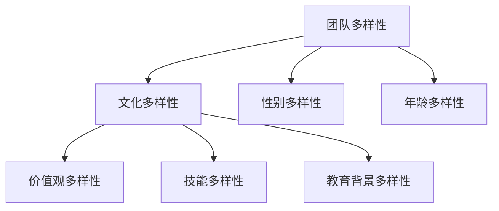

                 

# 人工智能创业：团队多样性的优势

## 关键词：人工智能，创业，团队多样性，优势，协作，创新

## 摘要：
本文将探讨人工智能创业中的团队多样性优势。我们将通过分析团队多样性的概念、类型及其在团队建设、沟通、组织文化和项目产品管理中的应用，揭示多样性如何提升人工智能创业的成功率。本文旨在为创业者提供关于如何构建一个多样化且高效的团队的实用指南。

### 目录大纲：

#### 第一部分：引言与背景
- 第1章：人工智能创业概述
  - 1.1 人工智能创业的机遇与挑战
  - 1.2 人工智能创业的市场趋势
  - 1.3 团队多样性的重要性
  - 1.4 本书结构安排与学习目标

#### 第二部分：团队多样性概述
- 第2章：团队多样性的概念与类型
  - 2.1 团队多样性的定义
  - 2.2 团队多样性的类型
  - 2.3 团队多样性的度量方法
  - 2.4 团队多样性的优点与挑战

#### 第三部分：多样性在团队建设中的应用
- 第3章：招募与选拔多样性人才
  - 3.1 多样性人才招募策略
  - 3.2 多样性面试技巧
  - 3.3 多样性团队的构建与维护
  - 3.4 多样性团队的文化建设

- 第4章：团队沟通与协作
  - 4.1 多样性团队的沟通挑战
  - 4.2 增强团队沟通的有效策略
  - 4.3 消除偏见与歧视的方法
  - 4.4 多样性团队协作工具与技巧

#### 第四部分：多样性在组织文化中的应用
- 第5章：组织文化的多样性管理
  - 5.1 多样性对组织文化的影响
  - 5.2 多样性组织文化的建设策略
  - 5.3 多样性组织文化的评估与改进
  - 5.4 多样性培训与教育的推广

#### 第五部分：多样性在项目与产品管理中的应用
- 第6章：多样性在项目团队中的应用
  - 6.1 多样性对项目成功的影响
  - 6.2 多样性项目的管理策略
  - 6.3 多样性项目的风险与挑战
  - 6.4 多样性项目成功的案例研究

- 第7章：多样性在产品管理中的应用
  - 7.1 多样性用户需求的研究方法
  - 7.2 多样性产品设计与开发策略
  - 7.3 多样性产品的市场定位与推广
  - 7.4 多样性产品成功的案例研究

#### 第六部分：结论与展望
- 第8章：人工智能创业与团队多样性的未来趋势
  - 8.1 人工智能创业的未来发展趋势
  - 8.2 团队多样性在人工智能创业中的重要作用
  - 8.3 未来研究方向与挑战
  - 8.4 对创业者的建议与展望

#### 附录
- 附录A：团队多样性度量工具与资源
  - A.1 多样性评估工具介绍
  - A.2 多样性研究与报告资源
  - A.3 多样性培训与教育资源

### 核心概念与联系
#### 团队多样性的概念与类型之间的联系
**Mermaid 流程图：**

### 文章正文开始

#### 第一部分：引言与背景

##### 第1章：人工智能创业概述

**1.1 人工智能创业的机遇与挑战**

随着人工智能技术的迅速发展，人工智能创业成为了当前科技领域的一个热门话题。创业者在选择进入人工智能领域时，面临着巨大的机遇和挑战。

**机遇：**

1. **市场潜力巨大：** 人工智能技术被广泛应用于金融、医疗、交通、教育等多个领域，市场潜力巨大。
2. **技术进步迅速：** 人工智能技术的发展速度非常快，创业者有机会利用最新的技术来推动业务发展。
3. **投资热情高涨：** 人工智能项目往往能够吸引到大量的风险投资，为创业者提供了充足的资金支持。

**挑战：**

1. **技术门槛高：** 人工智能技术涉及到复杂的算法和数据处理，对于创业者来说，需要具备相应的技术背景。
2. **市场竞争激烈：** 人工智能领域的竞争非常激烈，创业者需要不断创新来保持竞争力。
3. **数据隐私与安全：** 人工智能应用需要处理大量的个人数据，如何保障数据隐私和安全是一个重要挑战。

**1.2 人工智能创业的市场趋势**

人工智能创业的市场趋势呈现出以下几个特点：

1. **跨界融合：** 人工智能技术正在与其他行业深度融合，推动传统行业的升级转型。
2. **创新应用场景：** 人工智能技术在各个行业的应用场景不断拓展，创业者有机会发现新的市场需求。
3. **行业巨头布局：** 行业巨头纷纷加大在人工智能领域的投入，创业者需要与巨头合作或竞争来推动业务发展。

**1.3 团队多样性的重要性**

在人工智能创业中，团队多样性显得尤为重要。多样性不仅仅是性别、种族、年龄等方面的差异，还包括文化、价值观、技能、教育背景等多个维度。一个多样化的团队能够带来以下几个优势：

1. **更广泛的视角：** 多样性团队成员可以带来不同的观点和经验，有助于全面分析问题和寻找解决方案。
2. **更高的创新性：** 多样性团队在解决问题和开发新产品时，能够提出更多的创新思路和方案。
3. **更好的协作效果：** 多样性团队能够更好地沟通和协作，提高团队的整体绩效。

**1.4 本书结构安排与学习目标**

本书将分为六个部分，首先介绍人工智能创业的背景和团队多样性的重要性，然后详细探讨团队多样性的概念、类型及其在团队建设、沟通、组织文化和项目产品管理中的应用，最后展望人工智能创业与团队多样性的未来趋势。

通过阅读本书，创业者将能够：

1. **了解团队多样性的核心概念和类型。**
2. **掌握如何招募和选拔多样性人才。**
3. **学会如何增强团队沟通和协作效果。**
4. **了解如何构建一个多样化且高效的组织文化。**
5. **掌握如何将多样性应用到项目与产品管理中。**
6. **对未来人工智能创业与团队多样性的发展有清晰的认识。**

#### 第二部分：团队多样性概述

##### 第2章：团队多样性的概念与类型

**2.1 团队多样性的定义**

团队多样性是指团队中成员在性别、种族、年龄、文化、价值观、技能、教育背景等方面的差异。这种差异不仅包括表面特征，还包括个体的思维方式、经验、知识、技能等。多样性团队是指由具有不同背景、观点和技能的成员组成的团队。

**2.2 团队多样性的类型**

团队多样性可以分为以下几个类型：

1. **性别多样性：** 团队中男性和女性的比例差异。
2. **种族多样性：** 团队中不同种族成员的比例差异。
3. **年龄多样性：** 团队中不同年龄段成员的比例差异。
4. **文化多样性：** 团队成员来自不同文化背景，具有不同的价值观、信仰和行为方式。
5. **价值观多样性：** 团队成员持有不同的价值观和信念。
6. **技能多样性：** 团队成员拥有不同的专业技能和知识。
7. **教育背景多样性：** 团队成员拥有不同的教育经历和背景。

**2.3 团队多样性的度量方法**

度量团队多样性通常采用以下几种方法：

1. **定量度量：** 通过统计团队成员在性别、种族、年龄等方面的比例，计算多样性指数。
2. **定性度量：** 通过访谈、问卷调查等方法，了解团队成员在文化、价值观、技能等方面的差异。
3. **综合度量：** 结合定量和定性方法，全面评估团队的多样性水平。

**2.4 团队多样性的优点与挑战**

**优点：**

1. **更广泛的视角：** 多样性团队能够从不同的角度看待问题，提高决策的质量。
2. **更高的创新性：** 多样性团队能够提出更多的创新思路和解决方案。
3. **更好的协作效果：** 多样性团队能够更好地沟通和协作，提高团队的整体绩效。
4. **更全面的解决方案：** 多样性团队能够全面考虑不同用户的需求，提供更符合市场需求的解决方案。

**挑战：**

1. **沟通障碍：** 多样性团队中的成员可能存在语言、文化和价值观等方面的差异，导致沟通障碍。
2. **偏见与歧视：** 多样性团队中可能会出现偏见和歧视，影响团队的和谐与合作。
3. **管理难度：** 多样性团队的管理需要更多的耐心和技巧，如何平衡不同成员的需求和利益是一个挑战。
4. **资源分配不均：** 多样性团队中可能会出现资源分配不均的问题，影响团队的整体绩效。

在人工智能创业中，团队多样性具有重要意义。创业者需要认识到多样性的优点，并采取措施克服多样性带来的挑战，以构建一个高效、创新的团队。

#### 第三部分：多样性在团队建设中的应用

##### 第3章：招募与选拔多样性人才

**3.1 多样性人才招募策略**

招募多样性人才是构建一个多样化团队的重要步骤。以下是一些有效的多样性人才招募策略：

1. **多元化的招聘渠道：** 利用多样化的招聘渠道，如社交媒体、专业社区、人才市场等，吸引不同背景的候选人。
2. **消除偏见与歧视：** 在招聘过程中，采用匿名简历、无偏见面试等方法，减少对候选人的性别、种族、年龄等方面的偏见。
3. **多样化面试团队：** 组建一个多样化的面试团队，确保在面试过程中能够从不同角度评估候选人。
4. **强调团队价值观：** 在招聘过程中强调团队的价值观和文化，吸引那些与团队价值观相符合的候选人。
5. **提供职业发展机会：** 为多样性人才提供职业发展机会和培训，增强他们的归属感和忠诚度。

**3.2 多样性面试技巧**

在面试过程中，以下技巧有助于选拔多样性人才：

1. **无偏见提问：** 避免使用可能导致偏见的问题，如询问候选人的婚姻状况、家庭背景等。
2. **开放式问题：** 使用开放式问题来引导候选人分享他们的观点和经验，以便更好地了解他们的思维方式。
3. **行为面试：** 通过行为面试了解候选人在过去的工作中如何应对多样性挑战，评估他们的适应能力和合作精神。
4. **情境面试：** 设计情境面试题，模拟实际工作场景，观察候选人在多样性环境中的表现。
5. **评估团队协作能力：** 在面试过程中评估候选人在团队合作中的表现，如沟通能力、解决问题能力等。

**3.3 多样性团队的构建与维护**

构建和维护一个多样性团队需要持续的努力。以下是一些建议：

1. **建立明确的目标和价值观：** 确保团队成员都清楚团队的目标和价值观，以便在多样性环境中保持一致。
2. **促进开放沟通：** 鼓励团队成员之间的开放沟通，分享观点和经验，增强团队的凝聚力。
3. **提供培训与支持：** 为团队成员提供多样性培训，提高他们的文化敏感性和合作技能。
4. **建立反馈机制：** 设立反馈机制，鼓励团队成员提出意见和建议，不断改进团队的合作方式。
5. **公平的资源分配：** 确保资源分配公平，避免因多样性差异导致的不公平待遇。
6. **奖励多样性贡献：** 给予在多样性方面做出贡献的团队成员适当的奖励和认可，激励他们继续为团队多样性努力。

**3.4 多样性团队的文化建设**

多样性团队的文化建设是团队成功的关键。以下是一些建议：

1. **建立包容性文化：** 强调尊重和包容不同背景的成员，消除偏见和歧视。
2. **培养团队合作精神：** 鼓励团队成员相互支持，共同解决问题。
3. **建立共享价值观：** 确保团队成员在核心价值观上达成一致，增强团队的凝聚力。
4. **提供多样化的成长机会：** 为团队成员提供多样化的成长机会，帮助他们实现个人和职业发展。
5. **鼓励创新思维：** 鼓励团队成员提出创新的想法和解决方案，激发团队的创新潜力。

通过以上策略和措施，创业者可以构建一个多样化、高效且富有创新精神的团队，为人工智能创业的成功奠定基础。

#### 第四部分：多样性在团队沟通与协作中的应用

##### 第4章：团队沟通与协作

**4.1 多样性团队的沟通挑战**

在一个多样性团队中，沟通可能会面临以下挑战：

1. **语言障碍：** 成员来自不同的文化背景，可能会使用不同的语言或方言，导致沟通障碍。
2. **文化差异：** 成员可能有着不同的文化价值观和行为习惯，影响沟通效果。
3. **观点冲突：** 由于不同成员拥有不同的经验和知识，他们在讨论问题时可能会产生分歧。
4. **角色模糊：** 多样性团队中，不同成员的角色和责任可能不够明确，导致沟通混乱。
5. **信任问题：** 多样性团队中，成员之间的信任可能不够，影响协作效果。

**4.2 增强团队沟通的有效策略**

为了应对多样性团队中的沟通挑战，可以采取以下策略：

1. **明确沟通目标：** 在每次沟通之前，明确沟通的目标和预期结果，确保所有成员都清楚沟通的重点。
2. **促进文化敏感：** 提供文化敏感性培训，帮助团队成员理解不同文化背景的行为和沟通方式。
3. **建立共同的沟通语言：** 确定一个共同的沟通语言，如使用专业术语或特定词汇，减少语言障碍。
4. **鼓励开放沟通：** 鼓励团队成员分享观点和经验，尊重不同意见，促进观点的碰撞和融合。
5. **定期团队会议：** 定期举行团队会议，为成员提供一个沟通的平台，讨论项目进展、问题和解决方案。
6. **使用多种沟通工具：** 利用电子邮件、即时通讯、视频会议等多种沟通工具，提高沟通的效率。

**4.3 消除偏见与歧视的方法**

消除偏见与歧视是建立和谐多样性的关键。以下是一些建议：

1. **教育和培训：** 提供反偏见与歧视的培训，提高团队成员对多样性的认识和敏感性。
2. **制定明确的政策：** 制定反偏见与歧视的政策，明确对歧视行为的零容忍态度。
3. **建立反馈机制：** 设立匿名反馈渠道，鼓励团队成员报告偏见与歧视行为，及时采取措施。
4. **树立榜样：** 领导者和团队成员要以身作则，树立尊重多样性的榜样。
5. **公开讨论：** 鼓励团队成员公开讨论偏见与歧视问题，提高对多样性的认识和理解。

**4.4 多样性团队协作工具与技巧**

为了提高多样性团队的协作效果，可以采用以下工具与技巧：

1. **协作软件：** 使用协作软件，如Slack、Trello、Asana等，帮助团队成员共享信息、任务分配和进度跟踪。
2. **角色分配：** 明确团队成员的角色和责任，确保每个成员都清楚自己的任务和职责。
3. **共同目标：** 确保团队成员都明确团队的目标和愿景，共同努力实现。
4. **跨部门合作：** 促进跨部门合作，打破部门间的壁垒，提高协作效率。
5. **及时反馈：** 及时给予团队成员反馈，帮助他们改进工作，提高绩效。

通过以上策略和工具，创业者可以有效地应对多样性团队中的沟通挑战，提高团队的协作效果，推动人工智能创业的成功。

#### 第五部分：多样性在组织文化中的应用

##### 第5章：组织文化的多样性管理

**5.1 多样性对组织文化的影响**

多样性对组织文化有着深远的影响。一方面，多样性可以丰富组织文化，增加组织内部的活力和创造力。另一方面，如果不妥善管理多样性，可能会导致组织文化冲突，影响团队协作和绩效。

**正面影响：**

1. **增强创新性：** 多样性团队能够从不同角度思考问题，提出创新的想法和解决方案。
2. **提高适应力：** 多样性团队能够更好地适应多变的市场环境，应对各种挑战。
3. **扩大市场机会：** 多样性团队能够更好地理解不同用户的需求，提供更符合市场需求的解决方案。

**负面影响：**

1. **文化冲突：** 多样性团队成员之间可能存在价值观、信仰和行为方式的差异，导致文化冲突。
2. **沟通障碍：** 多样性团队中的成员可能存在语言、文化和沟通方式上的障碍，影响团队协作。
3. **管理难度：** 多样性团队的管理需要更多的耐心和技巧，如何平衡不同成员的需求和利益是一个挑战。

**5.2 多样性组织文化的建设策略**

为了充分发挥多样性的优势，创业者需要采取以下建设策略：

1. **明确多样性愿景：** 明确组织对于多样性的愿景和目标，确保所有成员都认同并支持这一目标。
2. **建立包容性文化：** 强调尊重和包容不同背景的成员，消除偏见和歧视，建立包容性的组织文化。
3. **促进文化融合：** 通过团队建设活动、文化培训等方式，促进团队成员之间的融合和互动，增强团队凝聚力。
4. **鼓励开放沟通：** 鼓励团队成员分享观点和经验，建立开放、透明和尊重的沟通氛围。
5. **提供多样化的成长机会：** 为团队成员提供多样化的成长机会，帮助他们实现个人和职业发展。

**5.3 多样性组织文化的评估与改进**

为了确保多样性组织文化的有效性，创业者需要定期评估和改进组织文化。以下是一些评估与改进策略：

1. **员工满意度调查：** 定期进行员工满意度调查，了解员工对多样性的感受和反馈，识别潜在问题。
2. **文化评估工具：** 使用文化评估工具，如文化温度计（Cultural Thermometer）等，评估组织文化的多样性和包容性。
3. **内部反馈机制：** 设立内部反馈机制，鼓励员工提出意见和建议，及时改进组织文化。
4. **案例研究：** 通过案例研究，分析其他组织在多样性文化建设方面的成功经验和教训，借鉴先进做法。
5. **持续培训：** 为员工提供持续的多样性培训，提高他们的文化敏感性和协作能力。

**5.4 多样性培训与教育的推广**

多样性培训与教育是推动组织文化多样性的重要手段。以下是一些建议：

1. **定制化培训：** 根据员工的多样性和需求，设计定制化的培训课程，提高培训效果。
2. **领导力培训：** 为领导者提供多样性领导力培训，提高他们管理和推动多样性文化的能力。
3. **跨文化沟通培训：** 为员工提供跨文化沟通培训，提高他们在多样化环境中的沟通能力。
4. **在线学习资源：** 开发在线学习资源，方便员工随时随地进行学习和提升。
5. **外部合作与交流：** 与外部机构、专家和同行进行合作与交流，借鉴最佳实践，提升多样性管理能力。

通过以上策略和措施，创业者可以有效地推动组织文化的多样性建设，提高团队的协作效果和创新能力，为人工智能创业的成功奠定基础。

#### 第六部分：多样性在项目与产品管理中的应用

##### 第6章：多样性在项目团队中的应用

**6.1 多样性对项目成功的影响**

多样性在项目团队中的应用对项目成功有着重要的影响。以下是一些关键点：

1. **更全面的解决方案：** 多样性团队能够从不同角度分析问题，提出更全面、更创新的解决方案。
2. **更好的风险管理：** 多样性团队能够识别和应对不同类型的风险，提高项目的风险管理能力。
3. **更高效的决策：** 多样性团队能够在决策过程中利用不同成员的知识和经验，提高决策的效率和质量。
4. **更高的团队凝聚力：** 多样性团队能够在共同目标下合作，增强团队的凝聚力和协作精神。

**6.2 多样性项目的管理策略**

为了充分发挥多样性团队的优势，项目管理者需要采取以下策略：

1. **明确多样性的目标：** 在项目启动阶段，明确项目多样性的目标和期望，确保团队成员都清楚多样性的重要性。
2. **多样化团队组建：** 在组建团队时，注重多样性的组合，确保团队成员在性别、文化、技能等方面的差异。
3. **促进开放沟通：** 鼓励团队成员之间开放沟通，分享观点和经验，促进团队的融合和协作。
4. **提供文化培训：** 为团队成员提供文化敏感性培训，提高他们对不同文化的理解和尊重。
5. **建立反馈机制：** 设立反馈机制，鼓励团队成员提出意见和建议，及时调整项目方向和策略。

**6.3 多样性项目的风险与挑战**

多样性项目在实施过程中可能会面临以下风险和挑战：

1. **文化冲突：** 不同文化背景的成员可能在价值观、信仰和行为方式上产生冲突，影响项目进度和效果。
2. **沟通障碍：** 多样性团队中的成员可能存在语言、文化和沟通方式上的障碍，导致沟通不畅。
3. **角色模糊：** 多样性团队中，不同成员的角色和责任可能不够明确，导致项目执行混乱。
4. **管理难度：** 多样性项目需要更多的管理和协调工作，项目管理者需要具备更高的管理能力和技巧。
5. **偏见与歧视：** 多样性项目中的成员可能存在偏见和歧视行为，影响团队的和谐与合作。

**6.4 多样性项目成功的案例研究**

以下是一个多样性项目成功的案例研究：

**项目名称：** 多语言语音识别系统开发

**项目背景：** 为了满足全球市场的需求，某科技公司决定开发一个多语言语音识别系统。该项目涉及多个国家和地区的团队成员，包括不同语言、文化和技能背景的成员。

**项目实施：**

1. **明确多样性目标：** 项目启动阶段，明确多样性的目标是提高项目创新性和满足全球市场需求。
2. **组建多样化团队：** 根据项目需求，组建了由不同国家和地区的团队成员组成的多样化团队。
3. **促进开放沟通：** 鼓励团队成员之间开放沟通，定期举行跨文化的团队会议，确保信息共享和协作。
4. **提供文化培训：** 为团队成员提供文化敏感性培训，提高他们对不同文化的理解和尊重。
5. **建立反馈机制：** 设立反馈机制，鼓励团队成员提出意见和建议，及时调整项目方向和策略。

**项目结果：**

1. **项目成功完成：** 在团队成员的共同努力下，项目成功完成，满足了全球市场的需求。
2. **创新性提升：** 多样性团队能够从不同角度提出创新的想法和解决方案，提高了项目的创新性。
3. **团队凝聚力增强：** 多样性团队在共同目标下合作，增强了团队的凝聚力和协作精神。
4. **市场竞争力提升：** 多语言语音识别系统的成功开发，提高了公司的市场竞争力，吸引了更多的客户和合作伙伴。

通过以上案例研究，我们可以看到，多样性项目在团队组建、沟通管理、文化培训等方面取得成功的关键因素。创业者可以借鉴这些经验，在人工智能创业项目中充分发挥多样性团队的优势，推动项目的成功。

##### 第7章：多样性在产品管理中的应用

**7.1 多样性用户需求的研究方法**

在产品管理中，了解用户需求是至关重要的。多样性用户需求的研究方法包括以下几个方面：

1. **用户调研：** 通过问卷调查、访谈等方式，收集不同类型用户的需求和意见。
2. **用户画像：** 根据用户调研结果，绘制用户画像，了解用户的基本特征、行为习惯和需求。
3. **跨文化研究：** 研究不同文化背景的用户需求，了解文化差异对产品使用的影响。
4. **多场景分析：** 分析不同场景下用户的需求和使用习惯，为产品设计提供依据。
5. **反馈机制：** 建立用户反馈机制，及时收集用户对产品的意见和建议，持续优化产品。

**7.2 多样性产品设计与开发策略**

为了满足多样性用户的需求，产品设计与开发需要采取以下策略：

1. **模块化设计：** 采用模块化设计方法，为不同用户需求提供灵活的解决方案。
2. **定制化服务：** 根据用户需求，提供定制化服务，满足不同用户群体的个性化需求。
3. **文化适应性设计：** 在产品设计中考虑文化差异，提供符合不同文化背景的用户使用习惯和审美需求。
4. **跨平台兼容：** 确保产品在不同平台和设备上具有良好的兼容性，满足不同用户的使用需求。
5. **用户体验优化：** 通过用户反馈和数据分析，持续优化用户体验，提高用户满意度。

**7.3 多样性产品的市场定位与推广**

在市场定位与推广中，需要充分考虑多样性用户的需求和偏好，采取以下策略：

1. **细分市场研究：** 对市场进行细分，研究不同细分市场的特点和需求，确定产品定位。
2. **多元化推广渠道：** 利用多种推广渠道，如社交媒体、线下活动、广告等，扩大产品影响力。
3. **文化敏感营销：** 在推广过程中，考虑不同文化的特点和偏好，采用符合目标市场文化的营销策略。
4. **用户参与：** 鼓励用户参与产品设计和推广，提高用户对产品的认可度和忠诚度。
5. **合作伙伴关系：** 与行业合作伙伴建立合作关系，共同推广产品，扩大市场影响力。

**7.4 多样性产品成功的案例研究**

以下是一个多样性产品成功的案例研究：

**项目名称：** 多功能智能手表

**项目背景：** 为了满足不同用户的需求，某科技公司开发了一款多功能智能手表，支持多种语言、多种运动模式和个性化定制。

**项目实施：**

1. **用户调研：** 通过问卷调查和用户访谈，了解不同用户的需求和偏好。
2. **用户画像：** 根据用户调研结果，绘制用户画像，确定产品定位。
3. **模块化设计：** 采用模块化设计方法，为不同用户需求提供灵活的解决方案。
4. **文化适应性设计：** 在产品设计中考虑文化差异，提供符合不同文化背景的用户使用习惯和审美需求。
5. **市场推广：** 利用社交媒体、线下活动等多种渠道推广产品，吸引不同用户群体的关注。

**项目结果：**

1. **市场认可度提高：** 多功能智能手表在市场上获得良好口碑，受到用户好评。
2. **用户满意度提升：** 多样性用户需求的满足，提高了用户的满意度和忠诚度。
3. **市场份额扩大：** 多功能智能手表在不同市场的销量持续增长，市场份额不断扩大。
4. **品牌影响力提升：** 多功能智能手表的成功，提高了公司品牌在市场中的影响力。

通过以上案例研究，我们可以看到，多样性产品在用户需求研究、产品设计、市场定位与推广等方面取得成功的关键因素。创业者可以借鉴这些经验，在人工智能创业中开发出满足多样性用户需求的产品，提高市场竞争力。

#### 第六部分：结论与展望

##### 第8章：人工智能创业与团队多样性的未来趋势

**8.1 人工智能创业的未来发展趋势**

随着人工智能技术的不断进步，人工智能创业领域呈现出以下几个发展趋势：

1. **技术融合：** 人工智能技术与其他领域的融合将不断加深，推动各行各业的创新和升级。
2. **规模化应用：** 人工智能技术将在更多领域实现规模化应用，如金融、医疗、教育、交通等。
3. **数据驱动：** 人工智能创业将更加依赖大数据和云计算等技术的支持，提高数据处理和分析能力。
4. **行业定制化：** 人工智能创业将更加注重行业定制化解决方案的开发，满足不同行业的特殊需求。

**8.2 团队多样性在人工智能创业中的重要作用**

在人工智能创业中，团队多样性发挥着至关重要的作用。以下是一些关键点：

1. **创新能力提升：** 多样性团队能够从不同角度思考问题，提出创新的解决方案，提高项目的创新性和竞争力。
2. **适应力增强：** 多样性团队能够更好地适应复杂多变的市场环境，应对各种挑战和风险。
3. **协作效率提高：** 多样性团队能够更好地沟通和协作，提高团队的整体绩效和执行力。
4. **用户体验优化：** 多样性团队能够更好地理解不同用户的需求，提供更符合市场需求的解决方案。

**8.3 未来研究方向与挑战**

在未来，人工智能创业与团队多样性的研究将面临以下挑战和机遇：

1. **多样性度量与评估：** 开发更精确、全面的多样性度量方法，评估团队多样性的水平。
2. **多样性管理与培训：** 研究如何更有效地管理和培养多样性团队，提高团队绩效和创新能力。
3. **多样性文化建设：** 探索如何构建包容性、多元化的组织文化，促进团队和谐与合作。
4. **行业定制化解决方案：** 研究如何根据不同行业的需求，开发多样化、定制化的解决方案。

**8.4 对创业者的建议与展望**

对于人工智能创业者，以下几点建议将有助于他们在多样性环境中取得成功：

1. **重视多样性：** 把多样性作为团队建设的重要目标，注重招募和培养多样性人才。
2. **建立包容性文化：** 营造一个开放、透明、尊重多样性的组织文化，促进团队和谐与合作。
3. **加强沟通与协作：** 提高团队成员的沟通和协作能力，确保团队高效运作。
4. **持续学习与改进：** 不断学习和吸收最新的多样性管理理念和方法，持续优化团队多样性管理水平。

通过以上建议和展望，创业者可以在人工智能创业中充分发挥团队多样性的优势，推动项目的成功和发展。

#### 附录

##### 附录A：团队多样性度量工具与资源

**A.1 多样性评估工具介绍**

- **DiversityIndexCalculator**：这是一个在线工具，用于计算团队在性别、种族、年龄等方面的多样性指数。用户只需输入团队成员的基本信息，系统将自动计算出多样性得分。

- **TeamDiversityAnalyzer**：这是一个开源的Python库，提供了多种多样性度量方法，如指数法、熵法等。用户可以根据需要自定义多样性评估指标，分析团队的多样性水平。

**A.2 多样性研究与报告资源**

- **《团队多样性：竞争优势的新视角》**：这是一篇关于团队多样性对团队绩效影响的研究论文，探讨了多样性如何提升团队的创新能力和适应力。

- **《2022年多样性报告》**：这是一份年度报告，总结了全球不同行业在多样性方面的最新进展，为创业者提供了宝贵的参考。

**A.3 多样性培训与教育资源**

- **《多样性培训课程》**：这是一系列在线培训课程，旨在提高个人和组织在多样性方面的认知与技能，包括文化敏感性、沟通技巧等。

- **《管理多样性团队》**：这是一本关于如何管理多样性团队的实践指南，提供了实用的策略和方法，帮助创业者构建一个高效、创新的团队。

### 总结与展望

本文详细探讨了人工智能创业中的团队多样性优势，从概念、类型到实际应用，全面揭示了多样性如何提升人工智能创业的成功率。通过分析多样性在团队建设、沟通协作、组织文化、项目与产品管理中的应用，我们认识到多样性不仅能够丰富团队视角，提高创新性和协作效率，还能增强企业的市场竞争力。

未来，人工智能创业将继续向技术融合、规模化应用和行业定制化方向发展。作为创业者，重视多样性、建立包容性文化、加强沟通与协作是取得成功的关键。通过持续学习与改进，创业者可以充分发挥团队多样性的优势，推动人工智能创业的蓬勃发展。

让我们共同努力，构建一个多样化、高效且富有创新精神的人工智能创业团队，迎接未来的挑战与机遇。

