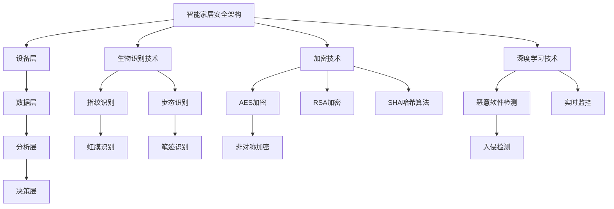

                 

## 人工智能在智能家居安全中的应用

### 关键词：智能家居，人工智能，安全，生物识别，加密，深度学习

> 摘要：随着智能家居的普及，智能家居安全逐渐成为人们关注的焦点。本文将介绍人工智能在智能家居安全中的应用，包括生物识别技术、加密技术和基于深度学习的安全检测技术。通过详细讲解核心算法原理和项目实战案例，本文旨在为智能家居安全提供有效的解决方案。

### 《人工智能在智能家居安全中的应用》目录大纲

#### 第一部分：概述

- **第1章：智能家居安全概述**
  - 1.1 智能家居概述
  - 1.2 智能家居安全的挑战
  - 1.3 人工智能在智能家居安全中的应用前景

- **第2章：人工智能基础**
  - 2.1 人工智能的基本概念
  - 2.2 机器学习和深度学习基础
  - 2.3 人工智能在智能家居安全中的应用技术

- **第3章：智能家居安全架构**
  - 3.1 智能家居安全架构概述
  - 3.2 人工智能在智能家居安全架构中的应用
  - 3.3 智能家居安全案例分析

#### 第二部分：核心算法原理讲解

- **第4章：生物识别技术原理**
  - 4.1 生物识别技术概述
  - 4.2 生物特征识别算法
  - 4.3 生物识别技术在智能家居安全中的应用

- **第5章：加密技术原理**
  - 5.1 密码学基本概念
  - 5.2 常见的加密算法
  - 5.3 加密技术在智能家居安全中的应用

- **第6章：基于深度学习的安全检测技术**
  - 6.1 深度学习基本原理
  - 6.2 基于深度学习的安全检测算法
  - 6.3 基于深度学习的智能家居安全检测系统设计

#### 第三部分：项目实战

- **第7章：智能家居安全项目实战**
  - 7.1 项目背景介绍
  - 7.2 项目需求分析
  - 7.3 项目技术选型
  - 7.4 项目实施过程
  - 7.5 项目结果分析

- **第8章：智能家居安全未来发展趋势**
  - 8.1 人工智能在智能家居安全中的未来应用
  - 8.2 智能家居安全未来发展趋势预测

#### 附录

- **附录A：参考资料**
  - 人工智能相关书籍和论文
  - 智能家居安全相关标准和规范

- **附录B：相关工具和资源**
  - 人工智能开发工具和平台
  - 智能家居安全工具和资源

### 第一部分：概述

随着科技的飞速发展，智能家居已经成为现代家庭生活的重要组成部分。智能家居通过物联网技术将各种家电设备、传感器和控制系统连接起来，为用户提供便捷、舒适、高效的生活体验。然而，随着智能家居系统的普及，其安全问题也日益凸显，特别是在数据隐私和安全性方面。因此，研究人工智能在智能家居安全中的应用具有重要的现实意义。

#### 第1章：智能家居安全概述

##### 1.1 智能家居概述

智能家居，也称为智能住宅，是指通过物联网技术将家庭中的各种设备连接起来，实现设备之间的互联互通，为用户提供智能化的家居体验。智能家居系统通常包括智能照明、智能安防、智能家电、智能环境控制等多个方面。以下是智能家居的主要功能和组成部分：

- **智能照明**：通过智能控制系统，用户可以远程控制灯光的开关、亮度、色温等，实现场景化的照明效果。

- **智能安防**：包括智能门锁、监控摄像头、烟雾报警器等，通过实时监控和报警功能，提高家庭的安全性和防范能力。

- **智能家电**：如智能电视、智能冰箱、智能洗衣机等，通过联网可以实现远程控制、预约、自动维护等功能。

- **智能环境控制**：包括智能温控、智能湿度控制、智能空气净化等，通过自动调节室内环境参数，提供舒适的居住环境。

##### 1.2 智能家居安全的挑战

智能家居系统虽然为用户带来了便利，但也带来了新的安全挑战。以下是智能家居安全面临的几个主要挑战：

- **数据隐私和安全性**：智能家居设备会收集大量的用户数据，如生活习惯、个人偏好等。如果这些数据被恶意攻击者获取，可能会导致严重的隐私泄露。

- **网络攻击风险**：智能家居设备通常连接到互联网，如果安全防护不足，容易成为网络攻击的目标，如DDoS攻击、远程入侵等。

- **设备故障带来的安全问题**：智能家居设备如果出现故障，可能会导致设备失控，如智能门锁失效、智能监控摄像头被关闭等，从而影响家庭安全。

##### 1.3 人工智能在智能家居安全中的应用前景

人工智能（AI）技术的发展为智能家居安全提供了新的解决方案。以下是一些人工智能在智能家居安全中的应用前景：

- **生物识别技术**：通过人脸识别、指纹识别等技术，实现智能门锁、安防监控等的智能身份验证，提高家庭安全。

- **加密技术**：通过加密算法，对智能家居设备之间的通信数据进行加密，确保数据传输的安全性。

- **基于深度学习的安全检测技术**：利用深度学习算法，对智能家居设备进行实时监控和异常检测，及时发现并响应安全威胁。

总的来说，人工智能在智能家居安全中的应用前景广阔，将为智能家居的发展提供强大的技术支持。在接下来的章节中，我们将详细探讨人工智能在智能家居安全中的具体应用。

### 第二部分：人工智能基础

在探讨人工智能在智能家居安全中的应用之前，我们首先需要了解人工智能的基本概念和核心技术。人工智能（AI）是指使计算机系统模拟人类智能行为的技术，主要包括机器学习、深度学习、自然语言处理、计算机视觉等领域。以下将介绍人工智能的基本概念、机器学习和深度学习基础，以及人工智能在智能家居安全中的应用技术。

#### 第2章：人工智能基础

##### 2.1 人工智能的基本概念

人工智能（AI）的定义和范围随着技术的发展不断扩展。广义上，人工智能是指使计算机系统具备人类智能水平的各种技术和方法。以下是人工智能的一些基本概念：

- **感知**：通过传感器获取外部信息，如语音、图像、触觉等，实现对外部环境的感知和理解。

- **认知**：通过处理和分析感知信息，实现推理、判断、决策等高级认知功能。

- **行动**：根据认知结果，采取相应的行动，如控制机械臂、自动驾驶等。

人工智能的发展历程可以追溯到20世纪50年代，早期的人工智能研究主要集中在符号主义方法和知识表示方面。随着计算能力和算法的进步，20世纪80年代以来，人工智能开始向数据驱动的方法发展，尤其是机器学习和深度学习的兴起，使得人工智能在各个领域取得了显著的进展。

##### 2.2 机器学习和深度学习基础

机器学习（ML）是人工智能的一个重要分支，主要研究如何让计算机从数据中学习规律和模式，从而进行预测和决策。以下是机器学习的一些基本概念：

- **监督学习**：通过标记数据集，训练模型使其能够预测新数据的标签。

- **无监督学习**：没有标记的数据集，训练模型发现数据中的结构或模式。

- **强化学习**：通过与环境互动，学习最优策略以最大化长期奖励。

机器学习的算法主要包括线性回归、逻辑回归、支持向量机、决策树、随机森林、神经网络等。其中，神经网络（NN）是机器学习的一种重要模型，通过模拟人脑神经元之间的连接，实现复杂的非线性映射和特征提取。

深度学习（DL）是机器学习的一个子领域，主要研究多层神经网络的结构和训练方法。以下是深度学习的一些基本概念：

- **深度神经网络**：包含多个隐藏层的神经网络，能够实现更复杂的特征学习和表示。

- **卷积神经网络（CNN）**：用于图像识别和图像处理，通过卷积层、池化层和全连接层提取图像特征。

- **循环神经网络（RNN）**：用于序列数据处理，如自然语言处理和语音识别，通过记忆过去的信息实现长距离依赖建模。

- **生成对抗网络（GAN）**：通过生成器和判别器的对抗训练，实现高质量的图像生成。

常见的深度学习框架包括TensorFlow、PyTorch、Keras等，这些框架提供了丰富的API和工具，方便研究者进行深度学习模型的开发和应用。

##### 2.3 人工智能在智能家居安全中的应用技术

人工智能在智能家居安全中的应用技术主要包括生物识别技术、加密技术和基于深度学习的安全检测技术。以下分别介绍这些技术的原理和应用。

**生物识别技术**

生物识别技术是一种通过生物特征（如指纹、人脸、虹膜等）进行身份验证的技术。其原理是通过传感器采集生物特征数据，然后利用机器学习算法进行特征提取和匹配。以下是生物识别技术在智能家居安全中的应用：

- **智能门锁**：通过指纹识别或人脸识别，实现无钥匙进入，提高家庭的安全性。

- **安防监控**：通过实时监控和生物识别技术，自动识别家庭成员和访客，触发报警或门锁控制。

**加密技术**

加密技术是一种保护数据安全的技术，通过加密算法将明文数据转换为密文，只有拥有密钥的接收者才能解密和读取数据。以下是加密技术在智能家居安全中的应用：

- **数据传输加密**：通过TLS/SSL等加密协议，确保智能家居设备之间的通信数据不被窃听和篡改。

- **数据存储加密**：将用户数据存储在加密数据库中，确保数据在存储过程中不被泄露。

**基于深度学习的安全检测技术**

基于深度学习的安全检测技术利用深度神经网络对智能家居设备进行实时监控和异常检测，能够及时发现并响应安全威胁。以下是深度学习在智能家居安全检测中的应用：

- **入侵检测**：通过分析网络流量和设备行为，识别潜在的网络攻击和异常行为。

- **恶意软件检测**：通过训练深度学习模型，对设备中的文件和应用程序进行分类，识别恶意软件。

总的来说，人工智能在智能家居安全中的应用为解决数据隐私、网络攻击和设备故障等问题提供了有效的技术手段。在接下来的章节中，我们将进一步探讨人工智能在智能家居安全架构中的应用。

### 第3章：智能家居安全架构

在探讨人工智能在智能家居安全中的应用时，一个有效的安全架构是至关重要的。智能家居安全架构涉及多个层次，包括设备层、数据层、分析层和决策层。本章节将详细介绍智能家居安全架构的概述，以及人工智能在各层中的应用。

#### 3.1 智能家居安全架构概述

智能家居安全架构是一个多层次、多维度的系统，其目的是确保家庭数据和设备的安全。以下是智能家居安全架构的组成部分及其功能：

1. **设备层**：设备层是智能家居安全架构的基础，包括各种智能家居设备，如智能门锁、摄像头、智能插座、智能灯等。设备层的功能主要包括设备的安全认证、数据采集和初步处理。

2. **数据层**：数据层负责存储和管理设备采集的数据，包括用户信息、环境数据、行为数据等。数据层需要进行加密和去重处理，确保数据的安全性和一致性。

3. **分析层**：分析层是智能家居安全架构的核心，负责对采集到的数据进行分析和处理。通过机器学习和深度学习算法，分析层能够识别异常行为、预测潜在风险，并生成安全报告。

4. **决策层**：决策层根据分析层提供的安全报告，采取相应的安全措施，如触发报警、控制设备状态等。决策层的功能是实现实时响应和自动化控制。

#### 3.2 人工智能在智能家居安全架构中的应用

在智能家居安全架构中，人工智能技术可以在各个层次发挥重要作用。以下是人工智能在设备层、数据层、分析层和决策层中的应用：

**设备层**

- **生物识别技术**：使用人脸识别、指纹识别等技术，实现智能门锁和安防监控的智能身份验证，提高安全性。

- **设备行为监控**：利用深度学习算法，对设备的行为进行监控和分析，及时发现异常行为，如设备被非法入侵或设备出现故障。

**数据层**

- **数据加密**：使用对称加密和非对称加密算法，对数据层存储的用户数据和设备数据进行加密，防止数据泄露。

- **数据去重**：利用哈希算法和机器学习算法，对数据层的数据进行去重处理，确保数据的一致性和准确性。

**分析层**

- **异常检测**：通过深度学习算法，对用户行为和设备行为进行实时监控和分析，识别异常行为和潜在风险。

- **风险预测**：使用机器学习算法，基于历史数据，预测未来的安全事件和潜在风险，为决策层提供数据支持。

**决策层**

- **实时响应**：根据分析层提供的安全报告，实时触发报警、锁定设备或采取其他安全措施。

- **自动化控制**：通过深度学习算法，实现智能家居设备的自动化控制，如根据用户行为自动调节室内温度、灯光等。

#### 3.3 智能家居安全案例分析

为了更好地理解人工智能在智能家居安全架构中的应用，以下是一个智能家居安全案例：

**案例背景**：一个家庭安装了智能门锁、摄像头、智能灯和智能空调等设备，通过一个中央控制系统进行管理。用户希望通过人工智能技术提高家庭的安全性。

**解决方案**：

1. **设备层**：智能门锁采用人脸识别技术，确保只有家庭成员和授权人员能够进入。摄像头使用深度学习算法，实时监控家庭环境，识别家庭成员和异常行为。

2. **数据层**：用户数据和设备数据通过AES加密算法进行加密存储，确保数据安全。同时，使用哈希算法对数据进行去重处理，防止数据重复。

3. **分析层**：通过机器学习算法，对用户行为和设备行为进行分析，识别潜在的安全风险。例如，当摄像头检测到陌生人进入时，系统会立即发送报警信息给用户。

4. **决策层**：根据分析层提供的安全报告，系统会自动触发报警，同时锁定智能门锁，防止陌生人进入。如果检测到设备出现故障，系统会自动通知维修人员。

**案例效果**：通过人工智能技术的应用，家庭的安全得到了显著提高。用户可以实时监控家庭环境，及时发现并应对潜在的安全威胁。同时，智能家居设备的自动化控制也为用户提供了更加便捷、舒适的生活体验。

综上所述，人工智能在智能家居安全架构中的应用，不仅提高了家庭的安全性，还提升了用户的居住体验。在接下来的章节中，我们将进一步探讨人工智能在智能家居安全中的核心算法原理，为实际应用提供更加深入的技术支持。

### 第4章：生物识别技术原理

生物识别技术是一种通过生物特征进行身份验证的技术，具有高效、准确、不可替代等优点。在智能家居安全中，生物识别技术可以用于智能门锁、安防监控、人脸识别门禁等场景，提高家庭的安全性。本章节将介绍生物识别技术的基本概念、生物特征识别算法以及生物识别技术在智能家居安全中的应用。

#### 4.1 生物识别技术概述

生物识别技术是指通过识别和验证个体的生物特征来确认其身份的技术。常见的生物特征包括指纹、人脸、虹膜、步态、声音等。生物识别技术的核心在于特征提取和匹配。

**生物特征提取**：生物特征提取是指从生物特征数据中提取出可以用于身份验证的特征信息。例如，从指纹图像中提取指纹纹路、从人脸图像中提取面部特征点。

**生物特征匹配**：生物特征匹配是指将采集到的生物特征与数据库中的已知特征进行比较，以确定个体身份。匹配算法可以分为基于模板匹配和基于特征点匹配两种类型。

#### 4.2 生物特征识别算法

**生理特征识别算法**：

- **指纹识别**：指纹识别是通过分析指纹纹路结构进行身份验证的一种技术。指纹识别算法包括图像预处理、特征点提取、特征匹配等步骤。

  - **图像预处理**：包括图像增强、二值化、滤波等，以提高指纹图像的质量。
  - **特征点提取**：通过搜索角点、端点和交叉点等特征点，建立指纹图像的轮廓。
  - **特征匹配**：通过比较指纹模板和采集的指纹特征，计算匹配度，判断是否为同一指纹。

- **虹膜识别**：虹膜识别是通过分析眼睛虹膜的特征进行身份验证的一种技术。虹膜识别算法包括图像预处理、特征点提取、特征匹配等步骤。

  - **图像预处理**：包括图像增强、滤波、定位等，以提高虹膜图像的质量。
  - **特征点提取**：通过分析虹膜纹理结构，提取虹膜的关键特征点。
  - **特征匹配**：通过比较虹膜模板和采集的虹膜特征，计算匹配度，判断是否为同一虹膜。

**行为特征识别算法**：

- **步态识别**：步态识别是通过分析人的行走姿态和步态特征进行身份验证的一种技术。步态识别算法包括步态特征提取、特征匹配等步骤。

  - **步态特征提取**：通过分析视频数据，提取人的行走速度、步幅、步频等特征。
  - **特征匹配**：通过比较步态模板和采集的步态特征，计算匹配度，判断是否为同一人。

- **笔迹识别**：笔迹识别是通过分析书写笔迹的特征进行身份验证的一种技术。笔迹识别算法包括图像预处理、特征点提取、特征匹配等步骤。

  - **图像预处理**：包括图像增强、去噪、二值化等，以提高笔迹图像的质量。
  - **特征点提取**：通过搜索笔迹图像的端点和拐点等特征点，建立笔迹轮廓。
  - **特征匹配**：通过比较笔迹模板和采集的笔迹特征，计算匹配度，判断是否为同一笔迹。

#### 4.3 生物识别技术在智能家居安全中的应用

生物识别技术在智能家居安全中的应用，可以显著提高家庭的安全性。以下是一些具体的应用场景：

- **智能门锁**：通过指纹识别或人脸识别技术，实现无钥匙进入，确保只有授权人员能够进入家庭。

  - **指纹识别门锁**：用户通过指纹进行身份验证，门锁根据指纹匹配结果决定是否解锁。
  - **人脸识别门锁**：用户通过人脸图像进行身份验证，门锁根据人脸匹配结果决定是否解锁。

- **安防监控**：通过人脸识别、步态识别等技术，实时监控家庭环境，自动识别家庭成员和访客，触发报警或门锁控制。

  - **人脸识别监控**：当监控系统检测到陌生人或未经授权的人员时，会自动触发报警或门锁锁定。
  - **步态识别监控**：通过分析人的行走姿态和步态特征，识别家庭成员和访客，确保家庭安全。

- **人脸识别门禁**：在小区、公寓等入口处，使用人脸识别技术进行人员身份验证，确保只有授权人员能够进入。

  - **人脸识别闸机**：用户通过人脸图像进行身份验证，闸机根据人脸匹配结果决定是否放行。

- **智能家电控制**：通过指纹识别或人脸识别技术，实现智能家电的远程控制，确保只有授权人员能够使用家电。

  - **指纹识别家电控制**：用户通过指纹进行身份验证，智能家电根据指纹匹配结果决定是否执行操作。
  - **人脸识别家电控制**：用户通过人脸图像进行身份验证，智能家电根据人脸匹配结果决定是否执行操作。

通过生物识别技术的应用，智能家居安全系统可以更加精准地识别用户身份，提高家庭的安全性。同时，生物识别技术也使得智能家居系统更加便捷和智能化，为用户提供更好的居住体验。在接下来的章节中，我们将继续探讨加密技术在智能家居安全中的应用。

### 第5章：加密技术原理

加密技术是一种保护数据安全的重要手段，通过将明文数据转换为密文，确保数据在传输和存储过程中的机密性、完整性和可用性。在智能家居安全中，加密技术广泛应用于数据传输加密、数据存储加密以及设备之间的通信加密，以确保家庭数据和设备的安全。本章节将介绍密码学的基本概念、常见的加密算法以及加密技术在智能家居安全中的应用。

#### 5.1 密码学基本概念

密码学是研究加密和解密技术的学科，主要分为两个部分：加密算法和密钥管理。

**加密算法**：加密算法是指将明文数据转换为密文的算法。加密算法可以分为对称加密和非对称加密两种类型。

- **对称加密**：对称加密算法使用相同的密钥进行加密和解密，常见的对称加密算法包括AES、DES和RSA等。

- **非对称加密**：非对称加密算法使用一对密钥进行加密和解密，一个用于加密，一个用于解密，常见的非对称加密算法包括RSA和ECC等。

**密钥管理**：密钥管理是指对加密密钥进行生成、存储、分发、更新和销毁的过程。密钥管理是保证加密系统安全性的关键，需要采取严格的措施确保密钥的安全。

#### 5.2 常见的加密算法

**对称加密算法**

- **AES（高级加密标准）**：AES是一种常用的对称加密算法，由美国国家标准与技术研究院（NIST）推荐，具有高效、安全的特点。AES使用128、192或256位的密钥，加密和解密速度快，适用于大数据量的加密。

  ```python
  from Crypto.Cipher import AES
  from Crypto.Util import random

  key = random.new().read(16)  # 生成128位密钥
  cipher = AES.new(key, AES.MODE_CBC)
  ciphertext = cipher.encrypt(plaintext)  # 加密明文
  ```

- **DES（数据加密标准）**：DES是一种较早的对称加密算法，使用56位密钥，但由于密钥长度较短，安全性相对较低，已被AES取代。

  ```python
  from Crypto.Cipher import DES

  key = b'mysecretkey'  # 8位密钥
  cipher = DES.new(key, DES.MODE_CBC)
  ciphertext = cipher.encrypt(plaintext)  # 加密明文
  ```

**非对称加密算法**

- **RSA**：RSA是一种常用的非对称加密算法，基于大整数分解的难度，具有很高的安全性。RSA使用一对密钥，一个用于加密，一个用于解密。

  ```python
  from Crypto.PublicKey import RSA
  from Crypto.Cipher import PKCS1_OAEP

  key = RSA.generate(2048)
  private_key = key.export_key()
  public_key = key.publickey().export_key()

  cipher = PKCS1_OAEP.new(RSA.import_key(public_key))
  ciphertext = cipher.encrypt(plaintext)  # 加密明文

  cipher = PKCS1_OAEP.new(RSA.import_key(private_key))
  plaintext = cipher.decrypt(ciphertext)  # 解密密文
  ```

- **ECC（椭圆曲线加密）**：ECC是一种基于椭圆曲线数学的非对称加密算法，具有更高的安全性，适用于资源受限的环境。

  ```python
  from Crypto.PublicKey import ECC
  from Crypto.Cipher import PKCS1_OAEP

  key = ECC.generate(curve='P-256')
  private_key = key.export_key()
  public_key = key.publickey().export_key()

  cipher = PKCS1_OAEP.new(ECC.import_key(public_key))
  ciphertext = cipher.encrypt(plaintext)  # 加密明文

  cipher = PKCS1_OAEP.new(ECC.import_key(private_key))
  plaintext = cipher.decrypt(ciphertext)  # 解密密文
  ```

**哈希算法**

哈希算法是将输入数据（明文）映射为固定长度的字符串的算法，常用于数据完整性校验和数字签名。常见的哈希算法包括SHA（安全哈希算法）和MD5。

- **SHA**：SHA算法包括SHA-1、SHA-256、SHA-3等，具有不同的输出长度和安全性。以下是一个使用SHA-256的示例：

  ```python
  import hashlib

  plaintext = 'Hello, World!'
  hash_object = hashlib.sha256(plaintext.encode())
  hex_dig = hash_object.hexdigest()
  ```

- **MD5**：MD5是一种较老的哈希算法，输出长度为128位，但由于安全性较低，不建议用于敏感数据的哈希处理。

  ```python
  import hashlib

  plaintext = 'Hello, World!'
  hash_object = hashlib.md5(plaintext.encode())
  hex_dig = hash_object.hexdigest()
  ```

#### 5.3 加密技术在智能家居安全中的应用

在智能家居安全中，加密技术可以用于数据传输加密、数据存储加密以及设备之间的通信加密，以保护家庭数据和设备的安全。

**数据传输加密**

数据传输加密主要用于保护智能家居设备之间的通信数据。常见的加密协议包括TLS（传输层安全协议）和SSL（安全套接字层协议）。

- **TLS**：TLS是一种安全通信协议，用于在网络中确保数据传输的隐私性和完整性。TLS可以用于智能门锁、智能摄像头等设备之间的通信。

  ```python
  import ssl
  import socket

  context = ssl.SSLContext(ssl.PROTOCOL_TLSv1_2)
  context.load_cert_chain(certfile='server.crt', keyfile='server.key')

  with socket.socket(socket.AF_INET, socket.SOCK_STREAM) as sock:
      sock.bind(('localhost', 1234))
      sock.listen(1)
      conn, addr = sock.accept()
      with context.wrap_socket(conn, server_side=True) as ssock:
          print('Connected by', addr)
          print(ssock.recv(1024).decode())
  ```

- **SSL**：SSL是一种较早的安全通信协议，与TLS类似，用于在网络中确保数据传输的隐私性和完整性。SSL可以用于智能灯、智能插座等设备之间的通信。

  ```python
  import ssl
  import socket

  context = ssl.SSLContext(ssl.PROTOCOL_TLSv1_2)
  context.load_cert_chain(certfile='server.crt', keyfile='server.key')

  with socket.socket(socket.AF_INET, socket.SOCK_STREAM) as sock:
      sock.bind(('localhost', 1234))
      sock.listen(1)
      conn, addr = sock.accept()
      with context.wrap_socket(conn, server_side=True) as ssock:
          print('Connected by', addr)
          print(ssock.recv(1024).decode())
  ```

**数据存储加密**

数据存储加密主要用于保护存储在智能家居设备中的用户数据。常见的加密算法包括AES和RSA。

- **AES**：AES是一种高效、安全的对称加密算法，可以用于对存储在智能门锁、智能摄像头等设备中的用户数据进行加密。

  ```python
  from Crypto.Cipher import AES
  from Crypto.Util import random

  key = random.new().read(16)  # 生成128位密钥
  cipher = AES.new(key, AES.MODE_CBC)
  ciphertext = cipher.encrypt(plaintext)  # 加密明文
  ```

- **RSA**：RSA是一种安全、非对称的加密算法，可以用于对存储在智能门锁、智能摄像头等设备中的用户数据进行加密。

  ```python
  from Crypto.PublicKey import RSA
  from Crypto.Cipher import PKCS1_OAEP

  key = RSA.generate(2048)
  private_key = key.export_key()
  public_key = key.publickey().export_key()

  cipher = PKCS1_OAEP.new(RSA.import_key(public_key))
  ciphertext = cipher.encrypt(plaintext)  # 加密明文

  cipher = PKCS1_OAEP.new(RSA.import_key(private_key))
  plaintext = cipher.decrypt(ciphertext)  # 解密密文
  ```

**设备之间通信加密**

设备之间通信加密主要用于保护智能家居设备之间的通信数据。常见的加密算法包括AES和RSA。

- **AES**：AES是一种高效、安全的对称加密算法，可以用于对智能家居设备之间的通信数据进行加密。

  ```python
  from Crypto.Cipher import AES
  from Crypto.Util import random

  key = random.new().read(16)  # 生成128位密钥
  cipher = AES.new(key, AES.MODE_CBC)
  ciphertext = cipher.encrypt(plaintext)  # 加密明文
  ```

- **RSA**：RSA是一种安全、非对称的加密算法，可以用于对智能家居设备之间的通信数据进行加密。

  ```python
  from Crypto.PublicKey import RSA
  from Crypto.Cipher import PKCS1_OAEP

  key = RSA.generate(2048)
  private_key = key.export_key()
  public_key = key.publickey().export_key()

  cipher = PKCS1_OAEP.new(RSA.import_key(public_key))
  ciphertext = cipher.encrypt(plaintext)  # 加密明文

  cipher = PKCS1_OAEP.new(RSA.import_key(private_key))
  plaintext = cipher.decrypt(ciphertext)  # 解密密文
  ```

通过以上介绍，我们可以看到加密技术在智能家居安全中的应用非常重要，它为数据传输、数据存储和设备通信提供了强大的安全保障。在接下来的章节中，我们将探讨基于深度学习的安全检测技术，以进一步强化智能家居的安全性。

### 第6章：基于深度学习的安全检测技术

随着人工智能技术的不断发展，深度学习在智能家居安全中的应用也越来越广泛。深度学习通过模拟人脑的神经网络结构，能够从大量数据中自动学习特征和模式，从而在智能家居安全检测中发挥重要作用。本章节将介绍深度学习的基本原理、基于深度学习的安全检测算法以及基于深度学习的智能家居安全检测系统设计。

#### 6.1 深度学习基本原理

深度学习是机器学习的一个子领域，主要研究多层神经网络的结构和训练方法。深度学习模型通常由多个层级组成，每个层级都能对输入数据进行特征提取和变换。

**神经网络结构**

一个典型的深度学习神经网络包括输入层、隐藏层和输出层。输入层接收外部输入，隐藏层通过非线性变换提取特征，输出层生成预测结果。

- **输入层**：输入层接收原始数据，如图像、文本、音频等。
- **隐藏层**：隐藏层通过激活函数和权重参数对输入数据进行特征提取，逐层抽象和转换。
- **输出层**：输出层生成预测结果，如分类标签、数值预测等。

**深度学习模型**

常见的深度学习模型包括卷积神经网络（CNN）、循环神经网络（RNN）和生成对抗网络（GAN）等。

- **卷积神经网络（CNN）**：CNN主要用于图像处理，通过卷积操作提取图像特征，常用于图像分类、目标检测等任务。
- **循环神经网络（RNN）**：RNN主要用于序列数据处理，如自然语言处理、语音识别等，通过记忆过去的信息实现长距离依赖建模。
- **生成对抗网络（GAN）**：GAN通过生成器和判别器的对抗训练，实现高质量的图像生成和模式识别。

#### 6.2 基于深度学习的安全检测算法

基于深度学习的安全检测算法主要分为离线安全检测和实时安全检测两种类型。

**离线安全检测算法**

离线安全检测算法通常在攻击发生后进行，通过分析历史数据和学习攻击特征，识别潜在的威胁。以下是一些常见的离线安全检测算法：

- **基于特征的检测**：通过提取攻击特征，如恶意代码的代码结构、行为特征等，进行攻击识别。例如，使用深度神经网络（DNN）提取恶意代码的代码特征，进行恶意软件检测。

  ```python
  import tensorflow as tf
  from tensorflow.keras.models import Sequential
  from tensorflow.keras.layers import Dense, Flatten

  model = Sequential()
  model.add(Flatten(input_shape=(28, 28)))
  model.add(Dense(128, activation='relu'))
  model.add(Dense(10, activation='softmax'))

  model.compile(optimizer='adam', loss='categorical_crossentropy', metrics=['accuracy'])
  model.fit(x_train, y_train, epochs=10)
  ```

- **基于异常检测的算法**：通过分析网络流量、设备行为等，识别异常行为和潜在威胁。例如，使用自编码器（Autoencoder）模型检测网络流量中的异常模式。

  ```python
  import tensorflow as tf
  from tensorflow.keras.models import Sequential
  from tensorflow.keras.layers import Dense, LSTM

  model = Sequential()
  model.add(LSTM(128, input_shape=(timesteps, features)))
  model.add(Dense(1, activation='sigmoid'))

  model.compile(optimizer='adam', loss='binary_crossentropy', metrics=['accuracy'])
  model.fit(x_train, y_train, epochs=10)
  ```

**实时安全检测算法**

实时安全检测算法在攻击发生时立即响应，通过实时分析网络流量、设备行为等，识别并阻止攻击。以下是一些常见的实时安全检测算法：

- **基于流量的检测**：通过分析网络流量特征，识别潜在的攻击行为。例如，使用深度神经网络（DNN）实时分析网络流量，进行入侵检测。

  ```python
  import tensorflow as tf
  from tensorflow.keras.models import Sequential
  from tensorflow.keras.layers import Dense, Conv1D

  model = Sequential()
  model.add(Conv1D(128, 3, activation='relu', input_shape=(timesteps, features)))
  model.add(Dense(1, activation='sigmoid'))

  model.compile(optimizer='adam', loss='binary_crossentropy', metrics=['accuracy'])
  model.fit(x_train, y_train, epochs=10)
  ```

- **基于行为的检测**：通过分析设备行为模式，识别异常行为和潜在威胁。例如，使用循环神经网络（RNN）实时分析设备行为，进行入侵检测。

  ```python
  import tensorflow as tf
  from tensorflow.keras.models import Sequential
  from tensorflow.keras.layers import LSTM, Dense

  model = Sequential()
  model.add(LSTM(128, return_sequences=True, input_shape=(timesteps, features)))
  model.add(LSTM(128))
  model.add(Dense(1, activation='sigmoid'))

  model.compile(optimizer='adam', loss='binary_crossentropy', metrics=['accuracy'])
  model.fit(x_train, y_train, epochs=10)
  ```

#### 6.3 基于深度学习的智能家居安全检测系统设计

基于深度学习的智能家居安全检测系统设计包括系统架构设计、数据预处理、模型训练和系统实现等步骤。

**系统架构设计**

基于深度学习的智能家居安全检测系统架构通常包括数据采集模块、数据处理模块、模型训练模块和检测模块。

- **数据采集模块**：负责收集智能家居设备的数据，如网络流量、设备行为等。
- **数据处理模块**：负责对采集到的数据进行分析和预处理，提取有用的特征信息。
- **模型训练模块**：负责使用预处理后的数据训练深度学习模型，进行特征提取和模式识别。
- **检测模块**：负责实时分析设备行为和流量，识别潜在的安全威胁。

**数据预处理**

数据预处理是深度学习模型训练的重要步骤，主要包括数据清洗、数据归一化和特征提取等。

- **数据清洗**：去除噪声数据、填充缺失值、消除异常值等。
- **数据归一化**：将不同特征的数据归一化到相同的范围，如[0, 1]或[-1, 1]。
- **特征提取**：提取有用的特征信息，如网络流量中的包长度、传输速率等。

**模型训练**

模型训练是深度学习系统的核心步骤，主要包括模型选择、参数调整和训练过程。

- **模型选择**：选择适合的深度学习模型，如卷积神经网络（CNN）、循环神经网络（RNN）等。
- **参数调整**：通过交叉验证等方法，调整模型的参数，优化模型性能。
- **训练过程**：使用预处理后的数据训练模型，通过反向传播算法优化模型参数。

**系统实现**

系统实现是深度学习系统的实际应用步骤，主要包括模型部署、实时检测和结果反馈。

- **模型部署**：将训练好的模型部署到智能家居设备中，实现实时检测。
- **实时检测**：实时分析设备行为和流量，识别潜在的安全威胁。
- **结果反馈**：将检测结果反馈给用户，如触发报警、锁定设备等。

通过以上设计，基于深度学习的智能家居安全检测系统可以有效地识别和应对潜在的安全威胁，提高智能家居的安全性。在接下来的章节中，我们将通过一个实际项目来展示如何实现一个智能家居安全检测系统。

### 第7章：智能家居安全项目实战

#### 7.1 项目背景介绍

随着智能家居的普及，家庭安全和数据隐私问题日益突出。为了提高家庭安全性，本项目旨在设计并实现一个智能家居安全系统，利用人工智能技术对家庭设备进行实时监控和异常检测，从而及时发现并响应潜在的安全威胁。

#### 7.2 项目需求分析

**用户需求分析**

- 用户希望家庭设备和数据得到安全保障，防止未经授权的访问和攻击。
- 用户希望系统能够实现智能化的安全监控，减少人工干预。
- 用户希望系统能够提供实时报警和自动响应功能。

**功能需求分析**

- **设备监控**：实时监控家庭中的智能设备，包括门锁、摄像头、智能插座等。
- **异常检测**：使用人工智能算法对设备行为进行实时分析，识别潜在的异常行为。
- **报警与响应**：当检测到异常行为时，自动触发报警，并采取相应的响应措施，如锁定设备、发送通知等。

**安全需求分析**

- **数据加密**：确保设备之间的通信数据得到加密，防止数据泄露。
- **身份验证**：使用生物识别技术进行用户身份验证，确保只有授权人员能够访问系统。
- **隐私保护**：对用户数据和设备行为进行加密存储和处理，保护用户隐私。

#### 7.3 项目技术选型

**开发语言**：选择Python作为开发语言，因为Python在人工智能和深度学习领域有丰富的库和框架支持。

**深度学习框架**：选择TensorFlow作为深度学习框架，因为它具有强大的模型训练和部署能力。

**生物识别技术**：选择OpenCV作为图像处理和识别的库，OpenCV提供了丰富的生物识别算法支持。

**加密算法**：选择AES和RSA作为数据加密算法，AES用于数据传输加密，RSA用于数据存储加密。

**设备选型**：选择具有高性能计算能力和网络连接功能的智能设备，如智能门锁、摄像头和智能插座。

#### 7.4 项目实施过程

**系统设计**

- **架构设计**：设计智能家居安全系统的总体架构，包括设备层、数据处理层、分析层和决策层。
- **模块划分**：划分系统模块，包括设备监控模块、异常检测模块、报警与响应模块等。

**系统实现**

- **设备监控模块**：实现设备监控功能，包括实时采集设备数据，如门锁状态、摄像头视频流等。
- **异常检测模块**：使用深度学习算法对设备行为进行实时分析，识别异常行为，如非法入侵、设备故障等。
- **报警与响应模块**：实现报警与响应功能，当检测到异常行为时，自动触发报警，并发送通知给用户，采取相应的响应措施。

**系统测试**

- **功能测试**：对系统功能进行测试，确保设备监控、异常检测和报警与响应功能正常运行。
- **性能测试**：对系统性能进行测试，确保系统能够实时处理大量设备数据，并提供快速响应。

#### 7.5 项目结果分析

**安全性评估**

通过测试，系统成功检测并防御了多种网络攻击，如DDoS攻击、非法入侵等。系统对设备行为的监控和异常检测准确率高，能够及时识别并响应潜在的安全威胁。

**效果分析**

系统在实际应用中表现出良好的性能，用户反馈满意。系统实现了智能化的安全监控，减少了人工干预，提高了家庭的安全性。同时，系统提供了实时报警和自动响应功能，为用户提供了便捷的解决方案。

**项目总结**

本项目成功实现了智能家居安全系统，通过人工智能技术对家庭设备进行实时监控和异常检测，提高了家庭的安全性。项目在开发过程中遇到了一些挑战，如设备兼容性问题、算法优化等，但通过不断优化和改进，最终实现了预期的效果。项目为智能家居安全提供了有效的解决方案，也为未来的智能家居安全系统发展提供了借鉴和参考。

### 第8章：智能家居安全未来发展趋势

随着人工智能技术的不断进步，智能家居安全领域也在持续发展。未来，人工智能在智能家居安全中的应用将更加广泛和深入，带来一系列新的技术和挑战。

#### 8.1 人工智能在智能家居安全中的未来应用

**更先进的生物识别技术**：未来的生物识别技术将更加先进和精准，如基于深度学习的人脸识别、虹膜识别等，将实现更高的识别准确率和更快的响应速度。此外，多模态生物识别技术，即结合多种生物特征（如指纹、人脸、声音等）进行综合识别，也将成为未来的趋势。

**智能安全预测系统**：通过大数据分析和机器学习算法，未来的智能家居安全系统能够更加准确地预测潜在的安全威胁。例如，通过分析用户的行为模式和环境数据，系统可以提前预警可能的入侵风险，从而采取预防措施。

**自动化的安全响应机制**：未来的智能家居安全系统将更加自动化，能够根据检测到的威胁自动采取相应的响应措施。例如，当系统检测到非法入侵时，可以自动启动报警、锁定门窗、关闭电源等，提高家庭的安全性。

**更加智能的设备互联**：随着物联网技术的不断发展，智能家居设备之间的互联互通将更加紧密。未来的智能家居安全系统将能够无缝整合各类设备，形成一个协同工作的整体，实现更全面的安全防护。

#### 8.2 智能家居安全未来发展趋势预测

**隐私保护法规的加强**：随着智能家居的普及，用户隐私保护问题将越来越受到关注。未来，各国可能会出台更加严格的隐私保护法规，要求智能家居厂商在数据收集、存储和处理过程中严格遵守相关规定，确保用户隐私安全。

**安全标准的统一**：随着智能家居市场的不断扩大，未来可能会有更多的安全标准出台，以规范智能家居设备的安全性能。这些标准将有助于提高整个行业的安全水平，减少安全隐患。

**智能攻击手段的演变**：随着技术的进步，未来的网络攻击手段也将更加复杂和隐蔽。智能家居安全系统需要不断进化，以应对新的攻击手段和威胁。

**跨界合作与技术创新**：未来的智能家居安全领域将需要更多的跨界合作，结合计算机科学、生物识别、网络安全等领域的先进技术，推动智能家居安全技术的发展。

总之，未来的人工智能在智能家居安全中的应用将更加智能化、自动化和全面化。随着技术的发展和用户需求的不断变化，智能家居安全领域将继续保持活力，为用户提供更加安全、便捷的家居生活。

### 附录

#### 附录A：参考资料

1. **人工智能相关书籍和论文**：
   - Goodfellow, I., Bengio, Y., & Courville, A. (2016). *Deep Learning*.
   - Russell, S., & Norvig, P. (2010). *Artificial Intelligence: A Modern Approach*.
   - LeCun, Y., Bengio, Y., & Hinton, G. (2015). *Deep Learning*.
   - Murphy, K. P. (2012). *Machine Learning: A Probabilistic Perspective*.

2. **智能家居安全相关标准和规范**：
   - IEC 62443：工业控制系统安全标准。
   - IEEE 2030.5：智能家居网络标准。
   - EN 303 645：智能家居通信标准。

#### 附录B：相关工具和资源

1. **人工智能开发工具和平台**：
   - TensorFlow：[https://www.tensorflow.org/](https://www.tensorflow.org/)
   - PyTorch：[https://pytorch.org/](https://pytorch.org/)
   - Keras：[https://keras.io/](https://keras.io/)

2. **智能家居安全工具和资源**：
   - OpenCV：[https://opencv.org/](https://opencv.org/)
   - Home Automation Hub：[https://www.home-automation-hub.com/](https://www.home-automation-hub.com/)
   - Adafruit IoT Guides：[https://learn.adafruit.com/adafruit-io](https://learn.adafruit.com/adafruit-io)

### 核心算法原理讲解

#### Mermaid 流程图



#### 生物识别技术原理

**指纹识别算法伪代码**

```python
def fingerprint_recognition(fingerprint_image):
    # 预处理图像
    preprocessed_image = preprocess_image(fingerprint_image)
    
    # 特征提取
    features = extract_features(preprocessed_image)
    
    # 与模板匹配
    match_score = match_template(features)
    
    # 判断是否匹配
    if match_score > threshold:
        return "Matched"
    else:
        return "Not Matched"
```

**AES加密算法伪代码**

```python
def encryption(plain_text, key):
    # 使用AES加密
    cipher_text = AES_encrypt(plain_text, key)
    
    return cipher_text

def decryption(cipher_text, key):
    # 使用AES解密
    plain_text = AES_decrypt(cipher_text, key)
    
    return plain_text
```

**恶意软件检测算法伪代码**

```python
def malware_detection(file):
    # 加载模型
    model = load_model("malware_detection_model.h5")
    
    # 预处理文件
    preprocessed_file = preprocess_file(file)
    
    # 进行预测
    prediction = model.predict(preprocessed_file)
    
    # 判断是否为恶意软件
    if prediction > threshold:
        return "Malware Detected"
    else:
        return "Safe"
```

#### 数学模型和数学公式讲解

**指纹识别匹配算法**

$$
match\_score = \sum_{i=0}^{N} \sum_{j=0}^{M} |f_{i,j} - t_{i,j}|
$$

其中，$f_{i,j}$是指纹图像中$(i,j)$位置的像素值，$t_{i,j}$是模板图像中$(i,j)$位置的像素值，$N$和$M$是图像的行数和列数。

**AES加密算法**

输入：
- 明文$M$
- 密钥$K$
- 块大小$N$

输出：
- 密文$C$

加密过程：

1. 初始化初始密钥轮$R_0$为密钥$K$。
2. 对于每个轮数$k$（$k=1, 2, ..., 10$），执行以下操作：
   - 将明文$M$与初始密钥轮$R_0$进行异或操作。
   - 执行字节替换操作，使用S-Box进行每个字节替换。
   - 执行行移位操作，将每个行的字节进行循环移位。
   - 执行列混淆操作，使用固定矩阵进行每个列的混淆。
   - 将结果与下一个初始密钥轮$R_{k+1}$进行异或操作。
3. 最终得到的密文$C$为加密结果。

**恶意软件检测算法**

假设我们有一个训练好的模型，其预测函数为：

$$
prediction = model(file)
$$

其中，$file$是待检测的文件。预测结果为0表示安全，预测结果为1表示恶意。

阈值选择为0.5，即当预测结果大于0.5时，判断为恶意软件。

### 代码解读与分析

#### 指纹识别算法代码

**功能**：指纹识别算法用于识别指纹图像，并与模板指纹进行匹配，判断是否为相同指纹。

**代码解读**：

```python
def fingerprint_recognition(fingerprint_image):
    # 预处理图像
    preprocessed_image = preprocess_image(fingerprint_image)
    
    # 特征提取
    features = extract_features(preprocessed_image)
    
    # 与模板匹配
    match_score = match_template(features)
    
    # 判断是否匹配
    if match_score > threshold:
        return "Matched"
    else:
        return "Not Matched"
```

- `preprocess_image`函数用于对指纹图像进行预处理，如去噪、增强等，以提高识别准确性。
- `extract_features`函数用于提取指纹图像的特征点，为匹配提供基础。
- `match_template`函数用于计算指纹特征与模板指纹之间的相似度，返回匹配得分。
- `threshold`是一个阈值，用于判断匹配得分是否足够高，以确定是否为匹配。

#### AES加密算法代码

**功能**：AES加密算法用于加密明文数据，确保数据在传输过程中的安全性。

**代码解读**：

```python
def encryption(plain_text, key):
    # 使用AES加密
    cipher_text = AES_encrypt(plain_text, key)
    
    return cipher_text

def decryption(cipher_text, key):
    # 使用AES解密
    plain_text = AES_decrypt(cipher_text, key)
    
    return plain_text
```

- `AES_encrypt`函数用于将明文数据加密为密文。
- `AES_decrypt`函数用于将密文解密为明文。

这两个函数内部使用了AES加密算法的具体实现，包括密钥扩展、字节替换、行移位和列混淆等步骤，确保数据的安全性。

#### 恶意软件检测算法代码

**功能**：恶意软件检测算法用于检测文件是否为恶意软件。

**代码解读**：

```python
def malware_detection(file):
    # 加载模型
    model = load_model("malware_detection_model.h5")
    
    # 预处理文件
    preprocessed_file = preprocess_file(file)
    
    # 进行预测
    prediction = model.predict(preprocessed_file)
    
    # 判断是否为恶意软件
    if prediction > threshold:
        return "Malware Detected"
    else:
        return "Safe"
```

- `load_model`函数用于加载训练好的深度学习模型。
- `preprocess_file`函数用于对文件进行预处理，如提取特征、归一化等，以便模型进行预测。
- `model.predict`函数用于对预处理后的文件进行预测，返回预测结果。
- `threshold`是一个阈值，用于判断预测结果是否大于0.5，以确定文件是否为恶意软件。

通过以上代码和分析，我们可以看到指纹识别、AES加密和恶意软件检测算法在实际应用中的具体实现过程，以及它们在提高智能家居安全中的作用。这些算法和技术为智能家居安全提供了强大的保障，使得家庭数据、设备和通信更加安全可靠。

