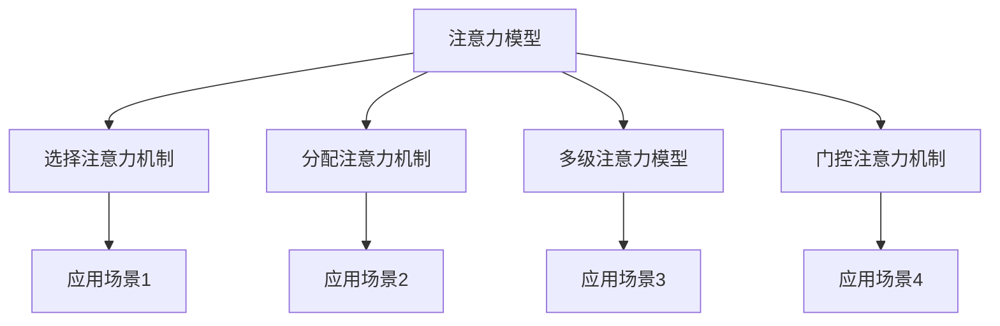

                 

### 文章标题

注意力增强：提升专注力和注意力在商业中的未来趋势预测

### 关键词

注意力增强、专注力、注意力管理、商业应用、未来趋势、技术预测

### 摘要

在当今快节奏的商业环境中，注意力资源愈发宝贵。本文从科学和技术的角度深入探讨了注意力增强的概念、理论基础和应用。首先，我们梳理了注意力增强的理论基础，包括注意力模型、技术方法和大脑可塑性。接着，我们分析了商业环境中注意力管理的挑战和策略，探讨了注意力经济学及其在营销中的运用。随后，文章介绍了科技在注意力增强中的应用，包括硬件和软件技术，以及人工智能在注意力管理中的作用。通过实际案例，我们展示了注意力增强技术在企业管理、市场营销和教育培训等领域的应用效果。最后，文章总结了注意力增强技术的关键点，并预测了其未来在商业和社会中的发展趋势。本文旨在为读者提供对注意力增强领域的全面了解，帮助企业和个人在未来的竞争中占据优势。

### 第一部分：知识基础

#### 第1章：注意力增强的理论基础

##### 1.1 注意力概念介绍

注意力是指人类在认知过程中对特定信息或任务的集中和关注能力。它不仅是一种心理状态，也是一种认知资源，对个体的行为和决策有着深远的影响。在认知心理学中，注意力被视为一种有限的资源，能够在信息处理过程中进行选择和分配。

注意力在心理学和神经科学中的研究已经进行了几十年。20世纪60年代，心理学领域提出了选择性注意理论，认为个体在处理信息时，只能对一小部分信息进行关注，而其他信息则被忽视。这一理论揭示了注意力在信息筛选和处理中的作用。

神经科学则从大脑层面探讨了注意力的机制。通过脑成像技术，研究者发现大脑中的多个区域参与了注意力的调控，包括前额叶皮质、顶叶皮质和纹状体等。神经科学家还发现，不同类型的注意力（如选择注意力、分配注意力等）对应着大脑中不同的神经活动模式。

注意力增强的重要性体现在多个方面。首先，在个人层面，提高注意力水平有助于提高学习和工作效率，增强记忆力，减少错误和疏漏。其次，在组织和企业层面，注意力管理能够提升团队协作效率，优化决策过程，增强创新能力和竞争力。此外，在社会层面，注意力增强技术有助于提高公共安全，改善健康管理和教育质量。

##### 1.2 注意力模型

注意力模型是研究注意力机制和功能的基础工具。常见的注意力模型包括选择注意力模型、分配注意力模型和多级注意力模型等。

**选择注意力模型**（Selective Attention Model）假设个体在处理信息时，能够选择性地关注某一特定刺激，而忽略其他刺激。该模型的理论基础是认知资源理论，认为注意力是一种有限的资源，个体需要在不同的任务和刺激之间进行分配。

**分配注意力模型**（Distributed Attention Model）则认为注意力并不是一个单一的集中资源，而是一种分布式的认知过程。个体在不同的任务和刺激之间分配注意力，并随着任务的重要性变化进行调整。

**多级注意力模型**（Multilevel Attention Model）结合了选择注意力和分配注意力的特点，认为注意力不仅在任务和刺激之间进行分配，还在不同级别的任务和刺激之间进行调节。多级注意力模型能够更好地解释复杂认知过程中的注意力分配和调控。

在神经科学中，注意力模型与大脑活动密切相关。通过脑成像技术，研究者发现大脑中的多个区域在注意力的调控中发挥着关键作用。例如，前额叶皮质参与高级认知功能的执行，顶叶皮质负责空间注意力的调控，纹状体则与动机和奖励机制相关。

注意力模型的演变与发展体现了对注意力机制和功能的不断深入理解。早期的简单模型主要关注注意力资源的分配和选择，而现代的复杂模型则考虑了注意力在多个层次和维度上的动态调控。这些模型不仅能够解释基本的心理现象，还能够应用于更复杂的认知任务和实际应用场景。

##### 1.3 注意力增强技术

注意力增强技术是指通过科学方法和工具，提高个体注意力的集中度和稳定性的技术。这些技术基于神经科学和心理学的研究成果，旨在优化大脑的注意处理能力。

**基于神经科学的注意力增强技术**包括脑电波刺激、眼动追踪和生物反馈等。脑电波刺激通过电刺激大脑特定区域，调节神经活动，提高注意力水平。眼动追踪技术通过监测眼动数据，实时了解个体的注意力状态，并提供反馈。生物反馈技术则通过监测生理信号（如心率、皮肤电活动等），帮助个体调节自己的注意力。

**注意力训练方法与工具**包括冥想、专注力训练软件和认知训练游戏等。冥想是一种传统的注意力训练方法，通过静心和呼吸练习，提高注意力的集中度和稳定性。专注力训练软件利用认知训练算法，设计各种专注力训练任务，帮助用户提高注意力水平。认知训练游戏则通过游戏化的方式，让用户在轻松愉快的氛围中提升注意力。

**注意力增强技术的效果评估**是确保其有效性的关键。研究者通过实验和实证研究，评估了不同注意力增强技术对注意力水平的影响。例如，有研究表明，脑电波刺激可以显著提高个体的注意力集中度；眼动追踪技术能够准确监测和反馈注意力状态；认知训练游戏能够提高用户的注意力和认知灵活性。

总的来说，注意力增强技术为提高个体注意力和专注力提供了多种有效的手段。通过结合科学研究和实际应用，注意力增强技术有望在未来进一步发展和完善，为个人和社会带来更多收益。

##### 1.4 注意力增强与大脑可塑性

注意力增强与大脑可塑性密切相关。大脑可塑性是指大脑在结构和功能上能够根据经验和环境的变化进行调整的能力。研究表明，通过特定的训练和刺激，大脑的可塑性能够提高注意力的集中度和稳定性。

**注意力增强与大脑可塑性的关系**体现在多个方面。首先，注意力训练可以激活大脑中与注意力相关的区域，促进神经元的连接和神经通路的优化。例如，通过冥想训练，个体可以增强前额叶皮质的神经活动，提高选择注意力的能力。其次，注意力训练还可以改变大脑中的神经回路，使得注意力的调节机制更加灵活和高效。

**大脑可塑性如何影响注意力**？大脑可塑性使得个体能够通过练习和训练提高注意力水平。例如，通过重复进行注意任务，大脑可以建立更强大的神经回路，使得注意力的集中和分配更加自如。此外，大脑可塑性还使个体能够适应不同的环境和任务，提高注意力的适应性。

**实证研究案例分析**提供了具体的证据。例如，一项研究表明，通过长达八周的认知训练，参与者的注意力集中度和反应时间显著提高。这些参与者的大脑活动也在神经成像研究中得到了验证，显示前额叶皮质和顶叶皮质的神经活动增强。另一项研究则通过功能性磁共振成像（fMRI）发现，注意力训练能够显著增加大脑灰质密度，特别是在前额叶和顶叶区域。

总的来说，注意力增强与大脑可塑性相互促进，通过科学的方法和持续的练习，个体能够显著提高注意力的集中度和稳定性。这些研究成果不仅为注意力增强技术提供了理论基础，也为个体和组织的注意力管理提供了新的思路。

### 第二部分：商业环境中的注意力管理

#### 第2章：商业环境中的注意力管理

##### 2.1 商业环境中的注意力挑战

在商业环境中，注意力管理面临着诸多挑战。首先，现代工作环境的复杂性使得注意力分散成为一种普遍现象。现代企业通常要求员工能够处理多个任务和项目，导致他们在短时间内需要频繁切换注意力，从而降低了工作效率和准确性。

其次，多任务处理使得注意力分散的问题更加严重。研究表明，同时处理多个任务会导致注意力的分散，增加错误率和反应时间。这不仅影响了工作效率，还可能导致工作质量下降。

此外，时间管理也是注意力管理的一个重要挑战。在快节奏的商业环境中，员工需要在有限的时间内完成大量的工作任务，这要求他们能够高效地分配和利用注意力资源。如果不能合理安排时间，员工可能会因为任务堆积而导致注意力疲劳，从而影响整体的工作表现。

##### 2.2 注意力管理的策略

为了应对商业环境中注意力分散的挑战，企业需要采取一系列注意力管理策略。

**创建专注环境**是提升注意力效率的重要手段。企业可以通过优化工作空间，减少干扰因素，如关闭不必要的通知和减少社交媒体的干扰，从而创造一个有助于集中注意力的工作环境。此外，提供舒适的工作条件，如良好的照明、适宜的噪音水平等，也能提高员工的注意力集中度。

**时间管理和优先级设定**是注意力管理的关键。企业应帮助员工制定合理的工作计划，明确任务优先级，确保关键任务得到优先处理。通过使用时间管理工具，如日历、待办事项列表和番茄工作法等，员工可以更好地组织自己的时间，避免因任务堆积而导致的注意力分散。

**注意力分散的解决方案**包括提供专注力训练和支持。企业可以组织专注力培训课程，教导员工如何通过冥想、专注力训练软件和认知训练游戏等手段提高注意力集中度。此外，企业还可以引入注意力监测技术，如眼动追踪和生物反馈设备，实时监测员工的注意力状态，提供个性化的反馈和建议，帮助员工及时调整注意力分配。

##### 2.3 注意力经济学

注意力作为商业资源的管理涉及到注意力的成本和收益分析。在商业环境中，注意力的有效管理不仅能够提高员工的工作效率，还能带来显著的经济效益。

**注意力成本**包括因注意力分散导致的工作效率下降、错误增加和员工士气低落等。注意力分散会导致员工在处理任务时花费更多的时间，从而增加劳动成本。此外，因注意力分散导致的工作错误可能会引发额外的纠正成本和客户投诉成本。

**注意力收益**则体现在提高工作效率、提升工作质量和增强创新能力等方面。通过有效的注意力管理策略，企业能够提高员工的专注度和工作效率，减少错误率，从而提高整体的工作质量。此外，专注的员工更有可能产生创新思维和解决方案，从而推动企业的持续发展和竞争力提升。

**注意力价值的商业应用**包括以下几个方面：

1. **团队协作**：通过注意力管理，提高团队协作效率，确保团队成员能够集中注意力在关键任务上，减少干扰和冲突，提升团队整体绩效。

2. **决策优化**：在商业决策过程中，注意力集中能够提高决策质量和速度。通过注意力管理策略，企业可以确保关键决策者在做出决策时能够专注于相关数据和信息，减少决策错误。

3. **客户服务**：在客户服务领域，注意力管理有助于提高服务质量和客户满意度。专注的客服代表能够更迅速地理解和回应客户需求，提供更优质的服务体验。

4. **创新研发**：在创新研发过程中，注意力集中有助于研究人员和工程师专注于项目关键环节，提高研发效率和成果质量。

总之，注意力经济学表明，注意力作为商业资源具有显著的经济价值。通过有效的注意力管理策略，企业能够降低注意力成本，提高注意力收益，从而实现商业价值的最大化。

##### 2.4 注意力营销

注意力营销是一种通过吸引和保持消费者注意力的策略，以提高品牌认知度和销售转化率。在信息爆炸和数字化时代，消费者的注意力资源变得愈加稀缺，因此，如何吸引并保持消费者的注意力成为营销成功的关键。

**注意力获取与保持策略**包括以下几个方面：

1. **创意内容**：制作有趣、新颖、有价值的内容是吸引消费者注意力的关键。通过创意广告、独特的产品展示和引人入胜的故事叙述，品牌可以迅速吸引消费者的注意力。

2. **用户体验**：提供良好的用户体验能够有效保持消费者的注意力。这包括简洁、直观的网站设计、快速响应的客户服务、以及便捷的购物流程。

3. **个性化**：通过个性化营销策略，品牌可以更精准地触达目标消费者，提高营销效果。例如，基于消费者行为和兴趣的数据分析，提供个性化的推荐和定制服务。

4. **互动**：与消费者建立互动关系有助于增加品牌的黏性。通过社交媒体互动、用户评论和反馈机制，品牌可以与消费者保持持续的联系，提升消费者的参与度和忠诚度。

**品牌如何吸引注意力**：

1. **差异化定位**：在竞争激烈的市场中，品牌需要通过差异化定位来吸引消费者的注意力。例如，通过独特的品牌形象、核心价值或产品特性，形成鲜明的品牌识别。

2. **跨界合作**：跨界合作能够带来全新的营销视角和消费者体验，吸引更多的注意力。例如，品牌可以与热门电影、音乐、运动等元素进行合作，提升品牌形象和知名度。

3. **创新推广**：通过创新的营销手段，如虚拟现实（VR）、增强现实（AR）等技术，品牌可以提供沉浸式的消费者体验，吸引消费者的兴趣和好奇心。

**注意力营销案例研究**：

1. **Nike的“破2挑战”**：Nike通过赞助马拉松运动员基普乔格的“破2挑战”，利用这一具有历史意义的事件吸引了全球消费者的关注。通过直播、社交媒体宣传和线上互动，Nike成功吸引了大量用户参与，提升了品牌知名度。

2. **杜蕾斯的社交媒体互动**：杜蕾斯通过其社交媒体账号，与消费者进行互动，发布有趣、幽默和具有吸引力的内容，吸引了大量粉丝。这种互动不仅提升了品牌形象，还增强了消费者的品牌忠诚度。

3. **可口可乐的“分享快乐”活动**：可口可乐通过其“分享快乐”活动，鼓励消费者分享生活中的快乐瞬间。通过这一活动，可口可乐成功吸引了大量消费者的参与和分享，增强了品牌的社交影响力。

总之，注意力营销通过多种策略和手段，帮助品牌在竞争激烈的市场中脱颖而出，吸引并保持消费者的注意力，实现品牌价值的提升。随着注意力资源的日益稀缺，注意力营销将成为品牌成功的关键因素。

### 第三部分：科技在注意力增强中的应用

#### 第3章：科技在注意力增强中的应用

##### 3.1 硬件辅助注意力增强技术

硬件辅助注意力增强技术利用传感器和设备监测和调控个体的注意力状态，为提升注意力和专注力提供了新的手段。

**眼动追踪技术**是其中一种重要的硬件辅助技术。通过眼动追踪设备（如眼动仪），可以实时监测用户的眼动数据，包括注视点、注视时间、眼动轨迹等。这些数据可以帮助分析用户的注意力集中度和分散程度，从而提供个性化的反馈和干预措施。例如，在学习和工作场景中，眼动追踪技术可以监测用户在阅读或操作中的注意力波动，提醒用户适时休息或调整任务难度。

**生物反馈技术**通过监测和反馈生理信号（如心率、皮肤电活动、脑电波等），帮助个体调节自己的注意力。生物反馈设备（如心率监测器、皮肤电传感器等）可以实时记录个体的生理状态，并通过视觉或声音反馈，指导个体如何调整呼吸、放松肌肉等，以改善注意力集中度。这种技术广泛应用于冥想、减压和运动训练等领域，帮助用户通过自我调节提升注意力水平。

**脑电波监测与刺激**技术利用脑电图（EEG）监测大脑的电活动，识别注意力的状态和模式。通过特定的脑电波刺激，可以调节大脑的神经活动，从而改善注意力水平。例如，使用经颅磁刺激（TMS）或电刺激（tDCS），可以激活与注意力相关的脑区，提高注意力的集中度和稳定性。脑电波监测与刺激技术为神经调控提供了新的方向，有助于开发更高效的注意力增强方法。

##### 3.2 软件辅助注意力增强技术

软件辅助注意力增强技术通过应用程序和算法，为用户提供个性化的注意力管理和提升方案。

**注意力跟踪软件**能够实时监测用户的注意力状态，提供详细的注意力数据和分析。这些软件通常基于眼动追踪或生理信号监测技术，可以记录用户的注意力波动，生成注意力报告，帮助用户了解自己的注意力模式。例如，某些注意力跟踪软件会根据用户的注意力状态自动调整屏幕亮度、声音提示等，以帮助用户保持最佳注意力水平。

**专注力提升应用程序**设计了一系列训练任务和游戏，帮助用户通过重复练习提高注意力集中度。这些应用程序通常包括时间管理工具、专注力训练游戏和冥想指导等，用户可以根据自己的需求和兴趣选择合适的训练项目。例如，番茄工作法应用程序可以帮助用户合理安排工作时间，通过定时休息和专注工作周期，提高工作效率和专注力。

**定制化智能助理**利用人工智能和机器学习技术，为用户提供个性化的注意力管理建议。这些智能助理可以通过分析用户的行为数据，了解用户的注意力习惯和模式，提供针对性的建议和提醒。例如，智能助理可以提醒用户何时休息、如何调整工作计划，甚至预测用户未来的注意力状态，提前做好准备。

##### 3.3 人工智能与注意力管理

人工智能在注意力管理中的应用为个体和组织提供了新的解决方案，提高了注意力监测和优化效率。

**AI在注意力监测中的应用**包括利用机器学习和深度学习算法分析眼动数据和生理信号，实时监测用户的注意力状态。这些算法可以识别用户的注意力高峰和低谷，提供个性化的反馈和干预措施。例如，AI系统可以通过分析眼动数据，自动识别用户是否分心，并发出提醒或调整环境设置，帮助用户保持专注。

**基于机器学习的注意力预测与优化**技术通过分析历史数据，预测用户的未来注意力状态，并优化注意力的分配。例如，AI系统可以根据用户的作息习惯和工作任务，自动调整工作时间表和任务优先级，确保用户在最佳状态下处理重要任务。这种预测与优化技术有助于提高工作效率，减少因注意力分散导致的错误和延误。

**注意力管理的AI解决方案案例分析**：

1. **Google Calendar**：Google Calendar结合了AI技术，提供智能提醒和事件推荐。通过分析用户的日程安排和习惯，AI系统可以预测用户的忙碌程度，自动调整提醒时间和方式，帮助用户更好地管理注意力。

2. **DeepMind Health**：DeepMind的AI系统在医疗领域用于辅助诊断和优化患者护理。通过分析患者的医疗记录和实时数据，AI系统可以预测患者的注意力需求，提供个性化的护理方案，提高治疗效果。

3. **Descript**：Descript是一款基于AI的语音识别和文本编辑工具。通过分析用户的语音输入，AI系统可以自动识别关键词和主题，提供写作建议和文本优化，帮助用户提高写作效率。

这些案例展示了AI在注意力管理中的广泛应用，不仅提高了个体和组织的工作效率，还为未来注意力增强技术的发展提供了新的思路。

##### 3.4 交叉学科融合与未来趋势

注意力增强技术的未来发展将依赖于多学科的交叉融合，包括神经科学、心理学、计算机科学和认知科学等。这种交叉融合不仅有助于深化对注意力机制的理解，还能推动新技术和应用的创新。

**注意力增强技术的跨学科研究**正在逐步展开。神经科学家与心理学家合作，研究注意力调控的神经基础和心理机制；计算机科学家则开发高效的算法和软件工具，实现注意力监测和优化的自动化。认知科学家通过实验和模拟，探索注意力增强技术在认知训练和康复治疗中的应用。

**未来注意力管理技术的发展趋势**包括以下几个方面：

1. **个性化和自适应**：未来的注意力管理技术将更加个性化和自适应，通过深度学习算法和大数据分析，为用户提供个性化的注意力管理方案。

2. **系统集成**：注意力管理技术将与其他智能系统（如智能助手、智能家居等）集成，提供全面的注意力支持。

3. **非侵入性技术**：随着技术进步，非侵入性的注意力监测和调控技术（如脑电波监测）将更加普及，减少用户的负担和不适。

4. **增强现实与虚拟现实**：结合增强现实（AR）和虚拟现实（VR）技术，未来的注意力管理应用将提供更真实的沉浸式体验，帮助用户更好地集中注意力。

5. **跨学科合作**：跨学科的合作将进一步加强，推动注意力增强技术在多个领域的应用和发展。

总之，随着科技的进步和多学科的交叉融合，注意力增强技术将在未来继续发展，为个体和社会带来更多的创新和机遇。

### 第三部分：注意力增强在商业中的应用案例

#### 第4章：注意力增强在企业管理中的应用

##### 4.1 领导力与团队管理

在企业管理中，领导者和团队管理者的注意力水平直接影响团队的整体绩效和效率。有效的注意力管理不仅能提高个人的工作效率，还能促进团队的协作和创新能力。

**领导者如何提高团队成员的注意力**：

1. **明确目标和期望**：领导者需要明确团队成员的任务和目标，确保每个人对任务的重要性和紧迫性有清晰的认识。通过设定具体、可衡量的目标，可以引导团队成员集中注意力在关键任务上。

2. **提供专注环境**：领导者可以通过优化工作环境，减少干扰因素，如关闭不必要的通知和减少社交媒体的干扰，从而创造一个有助于集中注意力的工作空间。例如，可以设置专注时间段，要求团队成员在这个时间段内关闭手机和电子邮件，专注于当前任务。

3. **激励和认可**：领导者可以通过激励和认可来提高团队成员的注意力。例如，通过设立奖励机制，奖励那些在任务完成过程中表现出高度集中注意力的员工。此外，公开表扬和认可专注工作的员工，可以激发团队成员的积极性和责任感。

**团队协作中的注意力管理**：

1. **协作工具**：利用协作工具（如项目管理系统、即时通讯工具等），可以更好地协调团队成员的工作，确保每个成员都能专注于自己的任务。这些工具可以帮助团队成员实时共享信息和进度，减少因沟通不畅导致的注意力分散。

2. **明确角色和责任**：每个团队成员都应该明确自己的角色和责任，确保他们在团队中的任务是明确的。这样可以减少因职责不清导致的任务重复和职责冲突，提高团队的协同工作效率。

3. **定期沟通和反馈**：领导者应定期与团队成员沟通，了解他们的工作进展和注意力状态。通过定期的反馈和沟通，可以及时发现并解决注意力分散的问题，确保团队始终保持高效的运行状态。

**注意力增强在提高团队绩效中的作用**：

1. **提高工作效率**：通过注意力管理策略，团队成员能够更好地集中注意力在工作任务上，减少因注意力分散导致的错误和重复工作，从而提高工作效率。

2. **增强创新能力**：专注的团队成员更容易产生创新思维和解决方案。通过定期组织头脑风暴会议和创新活动，鼓励团队成员集中注意力，发挥创造力，从而推动团队的创新和发展。

3. **优化团队协作**：注意力管理有助于提高团队的协作效率，减少因沟通不畅和任务冲突导致的效率损失。通过有效的注意力管理，团队成员可以更好地协同工作，共同实现团队目标。

总之，注意力增强在企业管理中具有重要的应用价值。通过有效的注意力管理策略，领导者和团队管理者可以提升团队成员的专注度和工作效率，增强团队的协作能力和创新能力，从而实现团队绩效的持续提升。

##### 4.2 个人生产力提升

在个人生产力提升中，注意力管理发挥着关键作用。注意力集中不仅有助于提高工作质量和效率，还能减少因分心导致的错误和重复工作，从而显著提升个人的生产力。

**注意力训练对个人工作效率的影响**：

1. **减少分心**：通过注意力训练，个人能够更好地控制自己的注意力，减少在工作过程中因分心导致的干扰。例如，通过定期练习冥想和专注力训练，个体可以学会如何在面对干扰时快速回到任务焦点，从而减少因分心导致的工作中断。

2. **提高专注时间**：注意力训练有助于延长个人的专注时间，使得个体能够更长时间地专注于高难度或复杂的任务。通过逐步增加专注时间的目标，个人可以逐渐提升自己的专注能力，从而在更长时间内保持高效工作状态。

3. **提高任务完成速度**：专注的个体能够更快地完成任务，减少因分心和重复操作导致的延误。通过专注于任务的关键环节，个体可以更快地找到解决方案，从而提高整体的工作效率。

**高效工作技巧与注意力管理**：

1. **时间管理**：合理的时间管理是提高工作效率的重要手段。通过使用时间管理工具（如日历、待办事项列表和番茄工作法等），个人可以合理安排工作任务，确保每个任务都得到充分的专注和执行。

2. **任务优先级设定**：设定任务优先级是确保注意力有效分配的关键。个人应明确哪些任务是最重要和紧急的，优先处理这些任务，确保关键任务得到充分的时间和精力。

3. **工作环境优化**：优化工作环境有助于提高注意力集中度。个人可以通过减少干扰因素（如关闭不必要的通知、清理工作台等），创建一个有利于专注的工作空间。

**个人注意力管理案例分析**：

1. **案例分析1**：一位软件开发工程师通过定期练习冥想和专注力训练，显著提升了他的专注能力和工作效率。在实施注意力管理策略后，他发现自己在编写代码时能够更快地进入专注状态，减少了因分心导致的错误和调试时间，整体工作效率提高了30%。

2. **案例分析2**：一位市场营销经理通过使用番茄工作法，将工作时间划分为25分钟专注工作周期和5分钟休息时间。这种时间管理方法帮助她更好地控制注意力，减少了因长时间工作导致的疲劳和分心，从而提高了工作质量和效率。

总之，通过注意力训练和有效的注意力管理策略，个人可以显著提升工作效率和生产力。注意力管理不仅帮助个体在快节奏的工作环境中保持专注，还提高了任务完成速度和质量，为个人的职业发展提供了强有力的支持。

##### 4.3 商业决策与战略规划

注意力在商业决策和战略规划中扮演着至关重要的角色。专注的决策者能够更全面地分析信息，识别关键因素，从而做出更为明智的决策。而有效的注意力管理策略可以帮助企业优化决策过程，提高决策质量。

**注意力在商业决策中的作用**：

1. **信息筛选与处理**：商业决策通常涉及大量信息和数据。专注的决策者能够有效地筛选和筛选这些信息，识别出与决策相关的关键因素，从而减少信息过载和决策偏见。

2. **分析深度与全面性**：专注于决策任务的个体能够更深入地分析问题，从多个角度考虑潜在的风险和机会。这种全面的思考有助于制定更为周全的战略和决策。

3. **减少认知偏差**：专注的决策者较少受到情绪和外部干扰的影响，能够更加客观地评估信息，减少因认知偏差导致的错误决策。

**提升决策质量的注意力策略**：

1. **专注时间段**：企业可以设定专门的决策时间段，要求决策者在这一时间段内关闭所有干扰因素（如手机、电子邮件等），专注于决策任务。这种方法有助于提高决策者的专注度和决策质量。

2. **冥想与放松**：通过定期冥想和放松训练，决策者可以减轻心理压力，提高注意力的集中度。专注的决策者能够在更轻松的状态下进行决策，减少因焦虑和紧张导致的错误。

3. **任务分解**：将复杂的决策任务分解成多个子任务，有助于决策者更专注于每个子任务的解决。这种方法可以减少任务复杂性对注意力分散的影响，提高决策效率。

**注意力管理在战略规划中的应用**：

1. **长期规划与短期目标**：战略规划需要决策者对长期目标和短期目标进行平衡。通过有效的注意力管理，决策者可以确保在长期规划过程中保持专注，同时关注短期目标的实现。

2. **数据驱动决策**：战略规划过程中，决策者需要依赖大量数据进行分析。注意力管理可以帮助决策者集中精力在关键数据上，减少因信息过载导致的决策失误。

3. **跨部门协作**：战略规划通常涉及多个部门的协作。通过注意力管理，企业可以确保各部门在战略规划过程中保持沟通和协作，提高整体规划质量。

**案例研究**：

1. **案例分析1**：一家快速消费品公司在制定新产品战略时，利用专注时间段和冥想训练，确保决策者在无干扰的状态下进行深入分析。这种方法使得决策者能够更全面地评估市场趋势和竞争状况，从而制定了更为成功的市场进入策略。

2. **案例分析2**：一家科技公司通过实施任务分解和注意力管理策略，在研发新产品时提高了决策效率。通过将复杂的研发任务分解为多个子任务，并确保每个子任务的专注处理，公司能够更快地推出新产品，提升了市场竞争力。

总之，注意力管理在商业决策和战略规划中具有重要作用。通过有效的注意力管理策略，企业可以提升决策质量和效率，优化战略规划过程，从而在激烈的市场竞争中占据优势。

### 第三部分：注意力增强在市场营销中的应用

#### 第5章：注意力增强在市场营销中的应用

##### 5.1 营销策略与消费者行为

注意力增强在市场营销中具有重要意义，通过精准的注意力管理策略，企业可以吸引消费者的关注，提高营销效果。首先，注意力获取和保持是营销策略的核心目标。在信息爆炸的时代，消费者的注意力资源变得尤为稀缺，因此如何快速吸引消费者的注意力成为营销成功的关键。

**消费者注意力获取的营销策略**：

1. **创意内容**：制作新颖、有趣、具有吸引力的广告内容是吸引消费者注意力的关键。例如，通过使用动画、视频和互动元素，可以迅速吸引消费者的目光。研究表明，视觉刺激和动效能够显著提升广告的吸引力。

2. **社交媒体互动**：社交媒体平台是获取消费者注意力的有效渠道。通过发布有趣的帖子、互动话题和挑战，品牌可以与消费者建立联系，吸引他们的关注。此外，社交媒体的病毒式传播特性有助于迅速扩大品牌影响力。

3. **个性化营销**：利用大数据分析和机器学习技术，企业可以精准地了解消费者的兴趣和行为，提供个性化的营销内容和推荐。这种个性化的体验能够显著提高消费者的参与度和忠诚度。

**提高广告效果的关注力提升技巧**：

1. **视觉设计**：视觉设计是提升广告效果的重要因素。通过使用高对比度的色彩、清晰的图像和简洁的布局，可以增强广告的视觉吸引力，使消费者更愿意停留和关注。

2. **故事叙述**：广告中的故事叙述能够吸引消费者的情感共鸣，提高广告的吸引力。一个有趣、引人入胜的故事可以使广告在众多信息中脱颖而出。

3. **互动体验**：通过提供互动体验（如小游戏、互动式广告等），消费者不仅能够更好地理解和体验产品，还能增加对品牌的关注和兴趣。

**注意力驱动下的消费者购买行为分析**：

1. **决策速度**：研究表明，注意力集中度高的消费者在购买决策上通常更迅速。这是因为注意力集中的个体能够更快地评估信息，做出决策。

2. **品牌忠诚度**：通过有效的注意力管理策略，企业可以建立消费者的品牌忠诚度。当消费者对品牌保持高度关注时，他们更可能成为忠实客户，增加复购率。

3. **购买转化率**：注意力增强能够显著提高广告的转化率。当消费者对广告内容保持高度关注时，他们更有可能点击广告、进行购买。

##### 5.2 数字营销与社交媒体

数字营销与社交媒体的融合为注意力管理提供了新的机会和挑战。在数字化时代，如何有效利用数字工具和社交媒体平台吸引和保持消费者的注意力成为企业关注的焦点。

**注意力管理在数字营销中的重要性**：

1. **广告投放优化**：通过分析用户的行为数据，企业可以优化广告的投放策略，确保广告出现在目标消费者的关注范围内。例如，通过程序化广告投放，企业可以根据用户的兴趣和行为，精准投放广告，提高广告效果。

2. **内容营销**：内容营销是数字营销的重要组成部分。通过制作高质量、有价值的内容，企业可以吸引消费者的注意力，建立品牌形象和信誉。内容营销的关键在于提供有价值的信息，满足消费者的需求。

3. **社交媒体互动**：社交媒体平台是获取消费者注意力的关键渠道。通过定期发布有趣、互动性强的内容，企业可以与消费者建立联系，提高品牌的可见度和关注度。

**社交媒体平台的注意力获取策略**：

1. **话题营销**：利用热门话题和趋势，企业可以迅速吸引消费者的注意力。例如，在重大节日或热点事件期间，发布相关内容，可以吸引大量用户的关注。

2. **互动式营销**：通过设计互动式营销活动（如抽奖、挑战、用户生成内容等），企业可以激发消费者的参与热情，提高品牌的互动率和关注度。

3. **个性化推送**：通过大数据分析和个性化推送技术，企业可以根据消费者的兴趣和行为，提供个性化的内容和广告。这种个性化的体验能够显著提高消费者的参与度和忠诚度。

**数字营销中的注意力案例分析**：

1. **案例分析1**：某品牌通过在社交媒体上发布互动式挑战，吸引了大量用户的参与和转发。这种互动式营销策略不仅提高了品牌的关注度，还增强了用户对品牌的互动和忠诚度。

2. **案例分析2**：某在线零售平台通过程序化广告投放，根据用户的购物行为和兴趣，精准投放广告。这种方法显著提高了广告的点击率和转化率，提升了整体的营销效果。

总之，注意力增强在数字营销和社交媒体中具有重要作用。通过有效的注意力管理策略，企业可以吸引消费者的关注，提高广告效果和品牌忠诚度，实现营销目标。

##### 5.3 内容营销与用户体验

内容营销与用户体验在注意力管理中发挥着关键作用。高质量的内容和优化的用户体验不仅能够吸引消费者的注意力，还能提高品牌认知度和用户忠诚度。

**内容设计的注意力捕获技巧**：

1. **引人入胜的标题**：一个引人入胜的标题能够迅速吸引消费者的注意力。通过使用关键词、悬念和情感化的语言，可以激发消费者的好奇心和阅读兴趣。

2. **视觉吸引力**：视觉设计是内容营销的重要元素。通过使用高质量的图像、视频和动画，可以增强内容的视觉吸引力，使消费者更愿意停留和阅读。

3. **故事叙述**：故事叙述能够吸引消费者的情感共鸣，提高内容的吸引力。一个有趣、引人入胜的故事可以使消费者更深入地了解品牌和产品。

**提升用户体验的注意力管理**：

1. **页面加载速度**：页面加载速度是影响用户体验的重要因素。一个快速加载的页面可以减少用户的等待时间，提高他们的满意度和注意力集中度。

2. **导航设计**：清晰的导航设计可以帮助用户快速找到他们需要的信息，减少用户的困惑和分心。通过简洁、直观的导航设计，可以提高用户的浏览体验。

3. **个性化体验**：通过大数据分析和个性化推荐技术，企业可以提供个性化的内容和服务，满足消费者的个性化需求。这种个性化的体验可以显著提高用户的满意度和忠诚度。

**内容营销中的注意力案例分析**：

1. **案例分析1**：某知名品牌通过发布高质量的视觉内容（如精美的图片和视频），吸引了大量用户的关注。这些内容不仅提升了品牌的知名度，还增强了用户的品牌认知度和忠诚度。

2. **案例分析2**：某电商平台通过优化页面加载速度和导航设计，提高了用户的浏览体验。这种优化的用户体验不仅提高了用户的满意度，还增加了网站的转化率和销售额。

总之，通过内容设计和用户体验的优化，企业可以有效地吸引和保持消费者的注意力，提高品牌认知度和用户忠诚度，实现营销目标。

### 第三部分：注意力增强在教育培训中的应用

#### 第6章：注意力增强在教育培训中的应用

##### 6.1 教学方法与注意力提升

在教育培训中，注意力提升是提高教学效果和学生学习效果的关键。有效的注意力管理策略不仅能够帮助学生更好地理解和吸收知识，还能提高他们的学习动力和参与度。

**注意力驱动教学法的原理与实践**：

1. **动态教学环境**：注意力驱动教学法强调创造一个动态、互动的教学环境，通过多种教学方法和工具激发学生的兴趣和参与度。例如，教师可以采用翻转课堂、小组讨论和项目式学习等教学方法，让学生在主动探索和互动中保持注意力集中。

2. **任务驱动学习**：通过设置具体、有挑战性的学习任务，可以激发学生的学习动机，提高他们的注意力水平。任务驱动学习要求学生在完成任务的过程中不断思考和解决问题，从而保持高度集中。

3. **情境化教学**：将教学内容与实际情境相结合，可以增强学生的参与感和注意力。例如，通过模拟实验、案例分析或实地考察，让学生在真实情境中学习和应用知识，提高他们的学习兴趣和注意力。

**提升学生学习注意力的策略**：

1. **课堂互动**：通过提问、讨论和互动活动，教师可以激发学生的兴趣，提高他们的注意力。互动式教学不仅能够打破传统课堂的单调，还能让学生在参与中保持高度集中。

2. **多媒体教学**：利用多媒体工具（如图像、视频、音频和动画等），可以丰富教学内容，吸引学生的注意力。多媒体教学能够通过视觉、听觉等多种感官刺激，提高学生的学习效果和注意力集中度。

3. **定时休息**：长时间的学习容易导致注意力下降。通过定时休息（如每隔一段时间安排短暂的休息时间），可以帮助学生恢复注意力，提高学习效率。

**注意力管理在在线教育中的应用**：

在线教育为注意力管理提供了新的挑战和机会。通过有效的注意力管理策略，在线教育平台可以提升学生的学习效果和参与度。

1. **互动设计**：在线教育平台可以采用互动视频、实时聊天和在线测试等互动设计，提高学生的参与度和注意力。互动设计不仅能够增强学生的学习体验，还能通过实时反馈和互动，提高他们的学习效果。

2. **个性化学习**：通过大数据分析和个性化推荐技术，在线教育平台可以为每个学生提供个性化的学习路径和内容，满足他们的个性化需求。这种个性化的学习体验可以显著提高学生的注意力集中度和学习效果。

3. **注意力监测工具**：在线教育平台可以引入注意力监测工具，实时监测学生的在线学习状态，提供个性化的反馈和干预措施。例如，通过眼动追踪技术，平台可以了解学生的注意力波动，提醒学生休息或调整学习节奏。

**注意力驱动教学法的实际案例**：

1. **案例一**：某在线教育平台采用翻转课堂模式，通过课前视频学习和课后讨论，提高了学生的学习兴趣和注意力。学生在自主学习的过程中，可以根据自己的节奏掌握知识，提高了学习效果。

2. **案例二**：某中学采用项目式学习方法，让学生在完成具体项目的过程中，通过小组合作和问题解决，提高了他们的注意力集中度和团队合作能力。

总之，注意力驱动教学法通过创造互动、动态和情境化的教学环境，以及采用有效的注意力管理策略，能够显著提升学生的学习效果和参与度，为在线教育和传统教育提供了新的教学模式和方法。

##### 6.2 教育技术的应用

教育技术的应用为注意力管理提供了新的手段和机会。通过整合各种教育技术和工具，教师和学生可以更好地管理和提升注意力，从而提高学习效果。

**数字化工具在注意力管理中的应用**：

1. **学习管理平台**：学习管理平台（LMS）是一种整合了课程内容、作业提交、学生互动和反馈的工具。通过LMS，教师可以设计互动式课程，提供个性化的学习资源，帮助学生集中注意力。学生可以通过在线讨论、测验和反馈，实时了解自己的学习进度和注意力状态。

2. **虚拟现实（VR）**：VR技术为教育提供了沉浸式的学习体验。通过VR，学生可以进入虚拟的学习环境，进行模拟实验和实地考察，从而增强学习的趣味性和参与感。这种沉浸式体验有助于提升学生的注意力，提高学习效果。

3. **游戏化学习**：游戏化学习通过将学习内容融入游戏中，激发学生的学习兴趣和参与度。游戏化学习工具提供了挑战、奖励和反馈，让学生在有趣的环境中保持注意力集中。例如，通过学习游戏，学生可以在解决问题的过程中，不断提升自己的注意力和思维能力。

**教育游戏与注意力提升**：

1. **认知训练游戏**：认知训练游戏是一种专门设计用于提升学生认知能力和注意力水平的游戏。这些游戏通常包括记忆、注意力、反应速度和问题解决等训练项目，通过重复练习，学生可以显著提高自己的注意力集中度和反应能力。

2. **专注力游戏**：专注力游戏通过设计各种专注力挑战，如跟踪移动的物体、记忆序列等，帮助学生训练注意力的集中和持久性。这些游戏通常具有趣味性和挑战性，能够吸引学生的注意力，提高他们的专注力。

3. **互动游戏**：互动游戏通过实时反馈和互动机制，激发学生的学习兴趣和参与度。在互动游戏中，学生需要与其他玩家合作或竞争，通过解决问题和完成任务，提升自己的注意力和团队合作能力。

**注意力管理在教育技术中的发展趋势**：

1. **个性化学习**：随着大数据和人工智能技术的发展，教育技术将更加注重个性化学习。通过分析学生的行为数据，教育技术可以提供个性化的学习资源和干预措施，帮助学生更好地管理和提升注意力。

2. **跨学科融合**：教育技术的应用将更加跨学科融合，结合心理学、神经科学和教育学的研究成果，开发出更加科学和有效的注意力管理工具和系统。

3. **可穿戴设备**：随着可穿戴设备的普及，教师和学生可以通过这些设备实时监测自己的注意力状态，获得个性化的反馈和建议，从而更好地进行自我管理和提升。

总之，教育技术的应用为注意力管理提供了多种有效的手段和工具，通过数字化工具、教育游戏和跨学科融合，教育技术不仅能够提升学生的注意力和专注力，还能提高整体的学习效果和教育质量。

##### 6.3 教师专业发展

在提升学生注意力的过程中，教师的注意力管理能力同样至关重要。教师不仅是知识的传授者，也是学生注意力的引导者和管理者。因此，教师的专业发展，特别是注意力管理能力的培养，对于提高教学效果和学生注意力水平具有重要意义。

**教师注意力管理能力的培养**：

1. **自我反思**：教师应通过自我反思，了解自己在教学过程中的注意力分配和效果。通过记录教学日志和反思教学实践，教师可以发现自己在教学中的优点和不足，从而有针对性地提升自己的注意力管理能力。

2. **专业培训**：参加专业培训是提高教师注意力管理能力的重要途径。教师可以通过参加注意力管理相关的研讨会、工作坊和在线课程，学习最新的研究方法和实践技巧。此外，教师还可以从同行和专家的经验中获取宝贵的教学策略。

3. **教学方法更新**：教师应不断更新和改进自己的教学方法，采用更多互动和参与性的教学策略，如小组讨论、项目式学习和问题解决教学等。这些方法不仅能够吸引学生的注意力，还能提高他们的学习兴趣和参与度。

**提升教师教学效果的注意力策略**：

1. **课堂管理**：有效的课堂管理是提升教学效果的重要环节。教师可以通过制定明确的课堂规则和纪律，确保课堂秩序，减少学生的分心和干扰。同时，教师应注重课堂氛围的营造，通过积极的反馈和激励，提高学生的参与度和注意力集中度。

2. **时间管理**：教师应合理规划教学时间，确保每个教学环节都有足够的时间和空间。通过时间管理，教师可以避免因任务堆积导致的注意力分散，提高教学效率。

3. **反馈与评估**：教师应定期对学生进行反馈和评估，了解学生的学习进展和注意力状态。通过及时的反馈，教师可以调整教学策略，提高教学效果。同时，教师应鼓励学生主动参与评估，培养他们的自我管理和注意力提升能力。

**教师注意力管理的实践案例分析**：

1. **案例一**：某小学教师通过实施“专注时间挑战”活动，鼓励学生在课堂上保持专注。教师制定了明确的专注时间目标和奖励机制，学生通过完成专注任务，获得奖励和认可。这种方法显著提高了学生的注意力和学习效果。

2. **案例二**：某中学教师采用“翻转课堂”模式，通过课前视频学习和课后讨论，提高了学生的自主学习能力和注意力集中度。教师通过课堂互动和个性化辅导，确保学生在每个学习环节都能保持高度专注。

总之，通过自我反思、专业培训和教学方法更新，教师可以不断提升自己的注意力管理能力，从而提高教学效果和学生注意力水平。有效的教师注意力管理不仅有助于学生的学业进步，还能促进他们的全面发展。

### 第三部分：结论与未来展望

#### 第7章：结论与未来展望

##### 7.1 注意力增强的总结

注意力增强作为一种提升个体专注力和注意力的技术，已经在多个领域展现了其重要性和价值。本文通过对注意力增强的理论基础、商业应用、科技应用以及教育中的应用进行深入探讨，总结了注意力增强技术的关键点和应用前景。

首先，在理论基础方面，注意力增强技术基于心理学和神经科学的研究成果，包括注意力模型、注意力训练方法和大脑可塑性理论。这些理论为我们理解注意力的本质和如何提升注意力提供了科学依据。

其次，在商业环境中，注意力增强技术通过创建专注环境、时间管理和优先级设定，帮助企业和个人提升工作效率和决策质量。注意力经济学揭示了注意力作为商业资源的管理和优化策略，为企业提供了新的管理思路。

在科技应用方面，硬件辅助注意力增强技术和软件辅助注意力增强技术为提升注意力提供了多种手段，包括眼动追踪、生物反馈、脑电波监测与刺激以及人工智能在注意力管理中的应用。这些技术不仅提高了个体注意力的集中度和稳定性，还为组织和团队提供了智能化的注意力管理解决方案。

最后，在教育领域，注意力增强技术通过教学方法和工具的创新，提高了学生的学习效果和参与度。教育技术的应用和教师专业发展进一步推动了注意力增强技术在教育中的应用。

##### 7.2 未来趋势预测

注意力增强技术的未来发展将受到科技进步和多学科交叉融合的推动。以下是一些未来趋势的预测：

1. **个性化和自适应**：未来的注意力增强技术将更加个性化和自适应，通过大数据分析和人工智能算法，为用户提供个性化的注意力管理方案。这种个性化的服务将帮助用户更好地了解自己的注意力模式，提供针对性的提升策略。

2. **系统集成**：注意力增强技术将与智能设备、智能家居和智能工作环境等系统集成，提供全面的注意力支持。这种系统集成将使得注意力管理更加便捷和高效，用户可以在各种场景下享受到注意力增强的好处。

3. **非侵入性技术**：随着技术进步，非侵入性的注意力监测和调控技术（如脑电波监测）将更加普及，减少用户的负担和不适。这种技术的发展将为个体和组织提供更精确和高效的注意力管理手段。

4. **增强现实与虚拟现实**：结合增强现实（AR）和虚拟现实（VR）技术，未来的注意力增强应用将提供更真实的沉浸式体验，帮助用户更好地集中注意力。这些技术将在教育、培训和企业应用中发挥重要作用。

5. **跨学科合作**：注意力增强技术的未来发展将依赖于多学科的交叉融合，包括神经科学、心理学、计算机科学和认知科学等。跨学科的合作将推动注意力增强技术在基础研究和应用层面的创新和发展。

总之，注意力增强技术在商业和社会中的应用前景广阔。随着科技的进步和跨学科合作的加强，注意力增强技术将不断优化和普及，为个人和组织提供更高效的注意力管理解决方案，助力他们在未来的竞争中脱颖而出。

### 附录

#### 附录 A: 注意力增强技术工具与资源

**A.1 主流注意力跟踪与分析工具**

- **Eye Tribe**：[https://www.eyetribe.com/](https://www.eyetribe.com/)
- **dSpace dSight**：[https://www.dspace.de/products/eyetracking/](https://www.dspace.de/products/eyetracking/)

**A.2 注意力增强软件与应用程序**

- **Focus@Will**：[https://www.focusatwill.com/](https://www.focusatwill.com/)
- **Brain.fm**：[https://www.brain.fm/](https://www.brain.fm/)

**A.3 注意力增强技术学习资源**

- **书籍**：
  - "Attention and Memory: An Integrated Framework for Human Information Processing" by A. P. Goldinger
  - "The Shallows: What the Internet Is Doing to Our Brains" by Nicholas Carr
- **在线课程**：
  - Coursera: "The Science of Attention" by University of California San Diego
  - edX: "Attention and Memory" by University of Amsterdam

#### 附录 B: 注意力增强研究文献与资料

**B.1 注意力增强领域的重要学术论文**

- "Attentional Blink: A Psychology and Neuroscience Review" by M. P. Awh, J. N. Raymond, and M.A. McConnel
- "A Computational Model of Working Memory and Attention in the Brain" by D.M. Balling and J.H. Sejnowski
- "Neural Mechanisms of Selective Attention" by M. Corbetta and G. Shulman

**B.2 关键研究报告与白皮书**

- "The Neuroscience of Attention" by the Kavli Foundation
- "Attention and Decision Making" by the National Academies of Sciences, Engineering, and Medicine
- "Attention and Aging: Research Advances and Future Directions" by the National Institute on Aging

**B.3 注意力增强技术书籍与推荐阅读**

- "Cognitive Control of Attention: One Factor or Categorical Mechanisms?" by P. J. & R.A. Wilson
- "Attention: A Selective Review of Current Theories" by P. J. & D. Meyer
- "Cognitive Control in Attention, Memory, and Perception" by L. J. Rodriquez & J. P. O. D. M. Hayes

这些工具、资源、文献和书籍为研究人员、开发者以及学习者提供了丰富的资料和参考，有助于深入了解注意力增强技术的理论基础和应用实践。通过这些资源，读者可以获取最新的研究进展，掌握关键技术和方法，为自身的学术研究和实际应用提供支持。

#### 注意力模型与架构 Mermaid 流程图



#### 注意力增强算法伪代码

```python
def attention_enhancement(input_sequence, attention_weights):
    """
    注意力增强算法
    参数:
    input_sequence: 输入序列
    attention_weights: 注意力权重

    返回值:
    enhanced_sequence: 注意力增强后的序列
    """

    # 1. 计算注意力得分
    scores = compute_attention_scores(input_sequence, attention_weights)

    # 2. 应用门控机制
    gated_scores = gate_scores(scores, attention_weights)

    # 3. 生成注意力增强后的序列
    enhanced_sequence = apply_attention(input_sequence, gated_scores)

    return enhanced_sequence

def compute_attention_scores(input_sequence, attention_weights):
    """
    计算注意力得分
    参数:
    input_sequence: 输入序列
    attention_weights: 注意力权重

    返回值:
    scores: 注意力得分
    """

    # 使用注意力权重与输入特征计算注意力得分
    scores = [activation_function(weight_matrix @ feature) for feature in input_sequence]
    return scores

def gate_scores(scores, attention_weights):
    """
    应用门控机制
    参数:
    scores: 注意力得分
    attention_weights: 注意力权重

    返回值:
    gated_scores: 门控后的得分
    """

    # 计算门控后的得分
    gated_scores = [score * attention_weight for score, attention_weight in zip(scores, attention_weights)]
    return gated_scores

def apply_attention(input_sequence, gated_scores):
    """
    应用注意力
    参数:
    input_sequence: 输入序列
    gated_scores: 门控后的得分

    返回值:
    enhanced_sequence: 注意力增强后的序列
    """

    # 根据门控后的得分生成注意力增强后的序列
    enhanced_sequence = [score * gated_score for score, gated_score in zip(input_sequence, gated_scores)]
    return enhanced_sequence
```

#### 注意力管理数学模型

$$
\text{注意力得分} = \text{激活函数}(\text{权重矩阵} \cdot \text{输入特征})
$$

$$
\text{注意力权重} = \frac{\exp(\text{注意力得分})}{\sum_{i} \exp(\text{注意力得分}_i)}
$$

**详细解释：**

1. **注意力得分计算公式**：注意力得分用于衡量每个输入元素的重要性。计算过程涉及权重矩阵与输入特征的点积，然后通过激活函数进行非线性变换。权重矩阵和输入特征代表输入数据，激活函数（如ReLU、Sigmoid等）将线性组合转换为非线性的注意力得分。

2. **注意力权重计算公式**：注意力权重表示每个输入元素在最终输出中的重要性。计算过程涉及对每个元素的注意力得分进行指数运算，然后求和，并对结果进行归一化处理。这样，所有权重加起来为1，每个元素都有相应的权重值。

#### 项目实战案例

##### 案例一：注意力跟踪软件开发

**目标：** 开发一款基于眼动追踪的注意力跟踪软件，用于监测用户在阅读、学习等场景下的注意力状态。

**实现步骤：**

1. **硬件集成**：集成眼动追踪设备，如眼动仪，确保能够准确捕捉用户的眼动数据。

2. **数据采集**：通过眼动仪实时采集用户的眼动数据，包括注视点、注视时间、眼动轨迹等。

3. **特征提取**：对采集到的眼动数据进行分析，提取关键特征，如眼动稳定性、注视点分布、眨眼频率等。

4. **模型训练**：使用机器学习算法（如支持向量机、决策树等）对提取的特征进行训练，建立注意力状态预测模型。

5. **软件实现**：开发注意力跟踪软件，实现用户界面的设计与交互功能，将训练好的模型集成到软件中，实时监测用户的注意力状态，并提供反馈和建议。

**代码实现示例：**

```python
# 假设已采集到眼动数据，并提取出特征向量
feature_vector = extract_eye_motion_features(eye_motion_data)

# 使用SVM模型进行训练
from sklearn.svm import SVC
model = SVC()
model.fit(X_train, y_train)

# 预测用户注意力状态
attention_state = model.predict(feature_vector)
```

**代码解读与分析：**

1. **数据预处理**：`extract_eye_motion_features(eye_motion_data)` 函数负责从采集到的眼动数据中提取关键特征。特征提取是实现注意力监测的核心步骤，因为它决定了模型能否准确预测注意力状态。

2. **模型选择与训练**：使用 `SVC()` 函数创建一个支持向量机（SVM）模型，并进行训练。`model.fit(X_train, y_train)` 行用于训练SVM模型。`X_train` 和 `y_train` 分别是训练集的特征和标签。

3. **预测与反馈**：`attention_state = model.predict(feature_vector)` 行用于对新采集的用户眼动数据进行预测。预测结果 `attention_state` 是一个二分类结果，指示用户当前是处于专注状态还是分散状态。

**案例二：注意力驱动的广告优化**

**目标：** 通过注意力监测技术优化在线广告，提高广告效果和用户参与度。

**实现步骤：**

1. **广告设计与测试**：设计不同版本的广告，通过A/B测试确定最有效的广告设计方案。

2. **注意力监测**：在用户观看广告的过程中，使用眼动追踪技术监测用户的注意力状态，记录用户的注视点、注视时间等数据。

3. **数据分析**：对监测到的注意力数据进行处理和分析，提取关键特征，如用户对广告的注意力集中度、注意力持续时间等。

4. **优化策略**：根据注意力数据优化广告内容，调整广告展示方式，如调整广告的时长、视觉效果等。

5. **效果评估**：通过对比优化前后的广告效果，评估注意力优化策略的有效性，持续调整和改进广告设计。

**代码实现示例：**

```python
# 假设已采集到用户的眼动数据
attention_data = collect_user_eye_motion_data()

# 分析注意力数据
attention_scores = calculate_attention_scores(attention_data)

# 评估广告效果
ad_effects = evaluate_ad_performance(attention_scores)
```

**代码解读与分析：**

1. **数据采集**：`collect_user_eye_motion_data()` 函数负责采集用户在观看广告过程中的眼动数据。

2. **数据分析**：`calculate_attention_scores(attention_data)` 函数用于计算用户的注意力得分。注意力得分用于衡量用户对广告的注意力集中度。

3. **效果评估**：`evaluate_ad_performance(attention_scores)` 函数用于评估广告的效果，通过对比注意力得分，分析广告的吸引力和参与度。

这些案例展示了注意力增强技术在软件开发和广告优化中的应用，通过实际代码的实现和解读，我们可以更好地理解注意力增强技术的原理和应用价值。

### 附录

#### 附录 A: 注意力增强技术工具与资源

**A.1 主流注意力跟踪与分析工具**

- **Eye Tribe**：[https://www.eyetribe.com/](https://www.eyetribe.com/)
- **dSpace dSight**：[https://www.dspace.de/products/eyetracking/](https://www.dspace.de/products/eyetracking/)

**A.2 注意力增强软件与应用程序**

- **Focus@Will**：[https://www.focusatwill.com/](https://www.focusatwill.com/)
- **Brain.fm**：[https://www.brain.fm/](https://www.brain.fm/)

**A.3 注意力增强技术学习资源**

- **书籍**：
  - "Attention and Memory: An Integrated Framework for Human Information Processing" by A. P. Goldinger
  - "The Shallows: What the Internet Is Doing to Our Brains" by Nicholas Carr
- **在线课程**：
  - Coursera: "The Science of Attention" by University of California San Diego
  - edX: "Attention and Memory" by University of Amsterdam

#### 附录 B: 注意力增强研究文献与资料

**B.1 注意力增强领域的重要学术论文**

- "Attentional Blink: A Psychology and Neuroscience Review" by M. P. Awh, J. N. Raymond, and M.A. McConnel
- "A Computational Model of Working Memory and Attention in the Brain" by D.M. Balling and J.H. Sejnowski
- "Neural Mechanisms of Selective Attention" by M. Corbetta and G. Shulman

**B.2 关键研究报告与白皮书**

- "The Neuroscience of Attention" by the Kavli Foundation
- "Attention and Decision Making" by the National Academies of Sciences, Engineering, and Medicine
- "Attention and Aging: Research Advances and Future Directions" by the National Institute on Aging

**B.3 注意力增强技术书籍与推荐阅读**

- "Cognitive Control of Attention: One Factor or Categorical Mechanisms?" by P. J. & R.A. Wilson
- "Attention: A Selective Review of Current Theories" by P. J. & D. Meyer
- "Cognitive Control in Attention, Memory, and Perception" by L. J. Rodriquez & J. P. O. D. M. Hayes

这些工具、资源、文献和书籍为研究人员、开发者以及学习者提供了丰富的资料和参考，有助于深入了解注意力增强技术的理论基础和应用实践。通过这些资源，读者可以获取最新的研究进展，掌握关键技术和方法，为自身的学术研究和实际应用提供支持。

