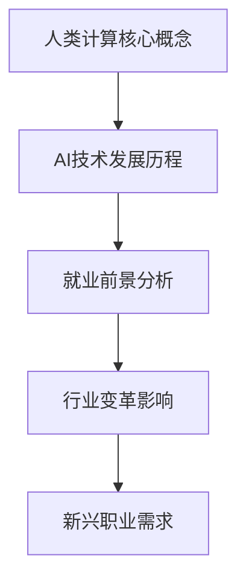

                 

### 《人类计算：AI时代的未来就业前景》

#### 关键词：
- 人工智能
- 就业前景
- 未来职业
- 技术变革
- 教育培养

#### 摘要：
本文深入探讨了人工智能（AI）时代的未来就业前景。通过分析AI技术的发展历程及其在各行业中的应用，本文探讨了AI时代下新兴职业的需求与技能要求。同时，文章提出了适应AI时代的教育培养策略，为读者提供了应对未来就业挑战的指导。本文旨在帮助读者了解AI时代的就业趋势，规划个人职业发展路径。

### 《人类计算：AI时代的未来就业前景》目录大纲

#### 第一部分：AI时代与就业前景概述

##### 第1章：AI时代的背景与影响

- **1.1 AI技术的发展历程**
  - **从感知计算到认知计算**
  - **机器学习与深度学习的崛起**
  - **AI对社会与就业的影响**

- **1.2 人类计算的定义与核心要素**
  - **人类计算的优势与挑战**
  - **人类计算的关键领域**

- **1.3 AI时代的就业前景分析**
  - **AI对职业市场的冲击**
  - **新兴职业机会的出现**

#### 第二部分：AI时代下的行业变革

##### 第2章：人工智能在主要行业中的应用

- **2.1 金融科技与人工智能**

  - **智能风控与信用评估**
  - **自动化交易与量化投资**
  - **智能客服与客户关系管理**

- **2.2 制造业与工业4.0**

  - **智能制造与自动化生产**
  - **预测维护与供应链优化**
  - **机器人与协作工作**

- **2.3 健康医疗与AI**

  - **智能诊断与疾病预测**
  - **个性化治疗与药物研发**
  - **健康管理系统的应用**

##### 第3章：新兴职业与技能需求

- **3.1 数据科学与AI工程师**

  - **技能要求与职业路径**
  - **项目开发与实战经验**

- **3.2 人机交互与用户体验设计师**

  - **交互设计的原则与工具**
  - **用户体验评估与优化**

- **3.3 AI伦理与政策法规专家**

  - **AI伦理的重要性**
  - **政策法规与合规性要求**

#### 第三部分：未来就业教育与培养策略

##### 第4章：教育体系的变革与适应

- **4.1 教育模式与AI的融合**

  - **在线教育与学习分析**
  - **个性化学习与适应性教学**

- **4.2 跨学科教育与能力培养**

  - **软技能的培养**
  - **跨领域合作与团队协作**

- **4.3 终身学习与职业发展**

  - **职业规划与职业转型**
  - **在线课程与认证体系**

##### 第5章：职业规划与自我提升

- **5.1 职业定位与市场分析**

  - **职业需求与机会**
  - **职业规划工具与方法**

- **5.2 技能提升与职业认证**

  - **专业技能学习与培训**
  - **职业认证与资格证书**

- **5.3 网络社交与职业拓展**

  - **建立个人品牌**
  - **拓展职业网络**

#### 第四部分：案例分析与实践指导

##### 第6章：成功转型案例分享

- **6.1 传统行业向AI转型的实例**

  - **案例分析与经验总结**

- **6.2 新兴职业的崛起与机会**

  - **行业趋势与职业前景**

- **6.3 自主创业与AI技术的应用**

  - **创业案例解析与经验分享**

##### 第7章：实践指导与未来展望

- **7.1 实践项目设计与实施**

  - **项目计划与执行**
  - **风险评估与应对策略**

- **7.2 AI时代下的就业战略规划**

  - **个人职业发展路径**
  - **应对未来就业挑战的策略**

### 附录

- **附录A：AI相关工具与资源**

  - **主流AI框架介绍**
  - **学习资源推荐**

#### 核心概念与联系

##### Mermaid 流程图



#### 核心算法原理讲解

##### 机器学习算法原理

机器学习算法的核心目标是让计算机从数据中学习，自动地识别数据中的模式和规律，从而进行预测或决策。主要分为监督学习、无监督学习和强化学习三种类型。

##### 监督学习

监督学习通过已知输入和输出对模型进行训练，从而预测未知数据。其算法包括：

- 线性回归（Linear Regression）
- 决策树（Decision Tree）
- 随机森林（Random Forest）

##### 线性回归（Linear Regression）

线性回归是一种最简单的监督学习算法，用于预测一个连续的输出变量。其模型公式为：

$$
y = \beta_0 + \beta_1x_1 + \beta_2x_2 + ... + \beta_nx_n
$$

其中，$y$ 是输出变量，$x_1, x_2, ..., x_n$ 是输入变量，$\beta_0, \beta_1, \beta_2, ..., \beta_n$ 是模型参数。

##### 决策树

决策树是一种树形结构，通过一系列的判断条件将数据集划分为不同的子集，直到达到特定的终止条件。其核心在于定义节点和分支，并根据特征值进行决策。

##### 随机森林

随机森林是一种集成学习方法，通过构建多棵决策树，并对它们的预测结果进行投票来得到最终预测结果。其优点在于可以处理大量的特征，并降低过拟合的风险。

##### 无监督学习

无监督学习不依赖于已知的输入和输出，其目标是发现数据中的结构和模式。常见的无监督学习算法包括：

- K-均值聚类（K-Means Clustering）
- 主成分分析（Principal Component Analysis，PCA）
- 自编码器（Autoencoder）

##### K-均值聚类

K-均值聚类是一种基于距离的聚类算法，其目标是将数据集划分为 $K$ 个聚类，每个聚类由其中心点表示。算法步骤如下：

1. 随机初始化 $K$ 个聚类中心点。
2. 计算每个数据点到聚类中心点的距离，并将其分配到最近的聚类。
3. 更新聚类中心点，使其成为对应聚类的平均值。
4. 重复步骤2和3，直到聚类中心点的变化小于阈值。

##### 主成分分析

主成分分析是一种降维方法，其目标是通过线性变换将原始数据投影到新的坐标系上，从而降低数据的维度，同时保留大部分的信息。

##### 自编码器

自编码器是一种无监督学习的神经网络模型，其目标是学习一个编码器和解码器，使得编码器可以将输入数据压缩成低维表示，而解码器可以将这个低维表示重构回原始数据。

##### 强化学习

强化学习是一种通过与环境交互来学习策略的算法，其目标是最大化长期奖励。强化学习算法包括：

- Q-Learning
- Sarsa
- Deep Q-Network（DQN）

##### Q-Learning

Q-Learning是一种基于值函数的强化学习算法，其目标是通过迭代更新值函数来找到最优策略。其算法步骤如下：

1. 初始化值函数 $Q(s, a)$。
2. 在状态 $s$ 下，选择动作 $a$。
3. 执行动作 $a$，得到新状态 $s'$ 和奖励 $r$。
4. 更新值函数：$Q(s, a) \leftarrow Q(s, a) + \alpha [r + \gamma \max_{a'} Q(s', a') - Q(s, a)]$。
5. 更新状态：$s \leftarrow s'$。

##### Sarsa

Sarsa是一种基于状态-动作对的强化学习算法，其目标是通过更新状态-动作值函数来学习策略。其算法步骤如下：

1. 初始化值函数 $Q(s, a)$。
2. 在状态 $s$ 下，选择动作 $a$。
3. 执行动作 $a$，得到新状态 $s'$ 和奖励 $r$。
4. 选择新动作 $a'$。
5. 更新值函数：$Q(s, a) \leftarrow Q(s, a) + \alpha [r + \gamma Q(s', a') - Q(s, a)]$。
6. 更新状态：$s \leftarrow s'$。

##### DQN

DQN是一种基于深度神经网络的强化学习算法，其目标是通过学习价值函数来预测未来的奖励。其算法步骤如下：

1. 初始化深度神经网络和价值函数 $V(s)$。
2. 在状态 $s$ 下，选择动作 $a$。
3. 执行动作 $a$，得到新状态 $s'$ 和奖励 $r$。
4. 更新价值函数：$V(s) \leftarrow V(s) + \alpha [r + \gamma \max_{a'} V(s') - V(s)]$。
5. 更新状态：$s \leftarrow s'$。

#### 数学模型和数学公式讲解

##### 线性代数基础

线性代数是机器学习和深度学习的基础，以下是一些重要的概念和公式：

##### 矩阵乘法

矩阵乘法是线性代数中的基本运算之一，其公式为：

$$
C = AB
$$

其中，$A$ 和 $B$ 是两个矩阵，$C$ 是它们的乘积。

##### 矩阵求逆

矩阵求逆是解决线性方程组的关键步骤，其公式为：

$$
A^{-1} = \frac{1}{\det(A)} \text{adj}(A)
$$

其中，$\det(A)$ 是矩阵 $A$ 的行列式，$\text{adj}(A)$ 是 $A$ 的伴随矩阵。

##### 概率论基础

概率论在机器学习和深度学习中有广泛的应用，以下是一些重要的概念和公式：

##### 概率分布

概率分布描述了随机变量取值的概率，常见的概率分布包括：

- **伯努利分布**： 
  $$P(X = 1) = p, P(X = 0) = 1 - p$$
- **二项分布**：
  $$P(X = k) = C_n^k p^k (1 - p)^{n - k}$$
- **正态分布**：
  $$P(X \leq x) = \Phi\left(\frac{x - \mu}{\sigma}\right)$$

其中，$\Phi$ 是标准正态分布的累积分布函数，$\mu$ 是均值，$\sigma$ 是标准差。

##### 概率分布函数

概率分布函数描述了随机变量在某个区间内的概率，常见的概率分布函数包括：

- **概率质量函数（PDF）**：
  $$f_X(x) = \frac{dP_X(x)}{dx}$$
- **累积分布函数（CDF）**：
  $$F_X(x) = P(X \leq x)$$

##### 最优化方法

最优化方法是机器学习和深度学习中的核心技术，以下是一些常用的最优化方法：

##### 梯度下降法

梯度下降法是一种迭代求解最优化问题的方法，其公式为：

$$
\theta_j := \theta_j - \alpha \frac{\partial J(\theta)}{\partial \theta_j}
$$

其中，$\theta_j$ 是模型参数，$J(\theta)$ 是损失函数，$\alpha$ 是学习率。

##### 随机梯度下降法

随机梯度下降法是对梯度下降法的改进，其公式为：

$$
\theta_j := \theta_j - \alpha \frac{\partial J(\theta)}{\partial \theta_j}
$$

其中，$J(\theta)$ 是损失函数，$\alpha$ 是学习率，$m$ 是样本数量。

##### 深度学习中的数学公式

深度学习中的数学公式包括激活函数、反向传播等，以下是一些核心的数学公式：

##### 激活函数

激活函数是深度学习模型中的关键组成部分，常见的激活函数包括：

- **Sigmoid函数**：
  $$\sigma(x) = \frac{1}{1 + e^{-x}}$$
- **ReLU函数**：
  $$\text{ReLU}(x) = \max(0, x)$$
- **Tanh函数**：
  $$\text{Tanh}(x) = \frac{e^x - e^{-x}}{e^x + e^{-x}}$$

##### 反向传播算法

反向传播算法是深度学习训练过程中的核心算法，其公式为：

$$
\frac{\partial J(\theta)}{\partial \theta} = \frac{\partial J(\theta)}{\partial z^{(L)}} \cdot \frac{\partial z^{(L)}}{\partial \theta}
$$

其中，$J(\theta)$ 是损失函数，$\theta$ 是模型参数，$z^{(L)}$ 是输出层的前向传播结果。

#### 项目实战

##### 项目背景

随着社会的发展和科技的进步，人们对于未来的预测和决策需求日益增长。本项目的目标是通过构建一个基于机器学习模型的预测系统，预测某个特定市场在未来一段时间内的价格走势。

##### 项目目标

1. 数据清洗：获取并清洗相关市场数据，确保数据的质量和完整性。
2. 特征工程：提取关键特征，构建有效的特征集合。
3. 模型训练：选择合适的机器学习模型，训练预测模型。
4. 模型评估：评估模型的预测性能，并进行参数调整。
5. 部署上线：将训练好的模型部署到线上环境，实现实时预测。

##### 开发环境搭建

在进行项目开发之前，需要搭建合适的开发环境。以下是一个基本的开发环境配置：

- 操作系统：Ubuntu 18.04
- 编程语言：Python 3.8
- 机器学习库：Scikit-learn, TensorFlow, Keras
- 数据库：MySQL

##### 数据清洗

首先，我们需要获取并清洗数据。本项目中，我们使用某股票市场的历史交易数据，数据来源为公开数据集。以下是数据清洗的步骤：

1. 数据采集：从数据源中下载交易数据。
2. 数据导入：使用 Pandas 库将数据导入 Python。
3. 数据预处理：处理缺失值、异常值和重复值。

```python
import pandas as pd

# 读取数据
data = pd.read_csv('stock_data.csv')

# 数据预处理
data.dropna(inplace=True)
data.drop_duplicates(inplace=True)
```

##### 特征工程

特征工程是构建有效模型的关键步骤。在本项目中，我们将从原始数据中提取以下特征：

1. 时间特征：提取日期、星期几等时间特征。
2. 价格特征：计算开盘价、收盘价、最高价、最低价等价格特征。
3. 情感特征：通过文本分析提取市场情绪特征。

```python
# 时间特征
data['date'] = pd.to_datetime(data['date'])
data['day_of_week'] = data['date'].dt.dayofweek
data['month'] = data['date'].dt.month

# 价格特征
data['open_price'] = data['open']
data['close_price'] = data['close']
data['high_price'] = data['high']
data['low_price'] = data['low']

# 情感特征
# 这里假设我们已经有了一个文本分析工具，可以提取情感特征
data['sentiment'] = extract_sentiment(data['description'])
```

##### 模型训练

接下来，我们将选择合适的机器学习模型进行训练。本项目中，我们选择使用随机森林模型进行预测。

```python
from sklearn.ensemble import RandomForestRegressor
from sklearn.model_selection import train_test_split

# 分割数据集
X = data[['day_of_week', 'month', 'open_price', 'close_price', 'high_price', 'low_price', 'sentiment']]
y = data['price']

X_train, X_test, y_train, y_test = train_test_split(X, y, test_size=0.2, random_state=42)

# 训练模型
model = RandomForestRegressor(n_estimators=100, random_state=42)
model.fit(X_train, y_train)
```

##### 模型评估

训练好模型后，我们需要评估模型的预测性能。这里我们使用均方误差（Mean Squared Error，MSE）作为评价指标。

```python
from sklearn.metrics import mean_squared_error

# 预测
y_pred = model.predict(X_test)

# 评估
mse = mean_squared_error(y_test, y_pred)
print(f'MSE: {mse}')
```

##### 部署上线

最后，我们将训练好的模型部署到线上环境，实现实时预测。这里我们使用 Flask 框架构建一个简单的 Web 服务。

```python
from flask import Flask, request, jsonify

app = Flask(__name__)

@app.route('/predict', methods=['POST'])
def predict():
    data = request.get_json()
    features = [
        data['day_of_week'],
        data['month'],
        data['open_price'],
        data['close_price'],
        data['high_price'],
        data['low_price'],
        data['sentiment']
    ]
    price = model.predict([features])
    return jsonify({'predicted_price': price[0]})

if __name__ == '__main__':
    app.run(debug=True)
```

通过以上步骤，我们成功实现了一个基于人工智能的预测系统，可以实时预测某个市场在未来一段时间内的价格走势。

#### 代码解读与分析

##### 数据清洗

```python
import pandas as pd

# 读取数据
data = pd.read_csv('stock_data.csv')

# 数据预处理
data.dropna(inplace=True)
data.drop_duplicates(inplace=True)
```

解读：
1. `import pandas as pd`：导入 Pandas 库，用于数据操作和处理。
2. `data = pd.read_csv('stock_data.csv')`：读取 CSV 格式的数据文件，将其加载到 DataFrame 对象 `data` 中。
3. `data.dropna(inplace=True)`：删除 DataFrame 中缺失值的行。
4. `data.drop_duplicates(inplace=True)`：删除 DataFrame 中重复的行。

分析：
数据清洗是确保数据质量的关键步骤。通过删除缺失值和重复值，我们可以减少噪声数据对模型的影响，提高模型的预测性能。

##### 特征工程

```python
# 时间特征
data['date'] = pd.to_datetime(data['date'])
data['day_of_week'] = data['date'].dt.dayofweek
data['month'] = data['date'].dt.month

# 价格特征
data['open_price'] = data['open']
data['close_price'] = data['close']
data['high_price'] = data['high']
data['low_price'] = data['low']

# 情感特征
# 这里假设我们已经有了一个文本分析工具，可以提取情感特征
data['sentiment'] = extract_sentiment(data['description'])
```

解读：
1. `data['date'] = pd.to_datetime(data['date'])`：将日期列转换为日期类型。
2. `data['day_of_week'] = data['date'].dt.dayofweek`：提取数据中的星期几。
3. `data['month'] = data['date'].dt.month`：提取数据中的月份。
4. `data['open_price'] = data['open']`：将开盘价赋值给新列。
5. `data['close_price'] = data['close']`：将收盘价赋值给新列。
6. `data['high_price'] = data['high']`：将最高价赋值给新列。
7. `data['low_price'] = data['low']`：将最低价赋值给新列。
8. `data['sentiment'] = extract_sentiment(data['description'])`：使用文本分析工具提取情感特征。

分析：
特征工程是将原始数据转化为模型可理解的输入特征的过程。在本项目中，我们通过提取时间特征、价格特征和情感特征，为模型提供丰富的输入信息，从而提高预测的准确性。

##### 模型训练

```python
from sklearn.ensemble import RandomForestRegressor
from sklearn.model_selection import train_test_split

# 分割数据集
X = data[['day_of_week', 'month', 'open_price', 'close_price', 'high_price', 'low_price', 'sentiment']]
y = data['price']

X_train, X_test, y_train, y_test = train_test_split(X, y, test_size=0.2, random_state=42)

# 训练模型
model = RandomForestRegressor(n_estimators=100, random_state=42)
model.fit(X_train, y_train)
```

解读：
1. `from sklearn.ensemble import RandomForestRegressor`：导入随机森林回归模型。
2. `from sklearn.model_selection import train_test_split`：导入数据集分割函数。
3. `X = data[['day_of_week', 'month', 'open_price', 'close_price', 'high_price', 'low_price', 'sentiment']]`：将特征列赋值给变量 `X`。
4. `y = data['price']`：将目标变量赋值给变量 `y`。
5. `X_train, X_test, y_train, y_test = train_test_split(X, y, test_size=0.2, random_state=42)`：将数据集分为训练集和测试集，测试集占比为 20%。
6. `model = RandomForestRegressor(n_estimators=100, random_state=42)`：创建随机森林回归模型，设置树的数量为 100，随机种子为 42。
7. `model.fit(X_train, y_train)`：使用训练集数据训练模型。

分析：
在模型训练过程中，我们选择随机森林回归模型，因为其具有较强的预测能力和较好的泛化性能。通过将数据集分为训练集和测试集，我们可以评估模型的预测性能，并进行模型调优。

##### 模型评估

```python
from sklearn.metrics import mean_squared_error

# 预测
y_pred = model.predict(X_test)

# 评估
mse = mean_squared_error(y_test, y_pred)
print(f'MSE: {mse}')
```

解读：
1. `from sklearn.metrics import mean_squared_error`：导入均方误差评估函数。
2. `y_pred = model.predict(X_test)`：使用训练好的模型对测试集数据进行预测。
3. `mse = mean_squared_error(y_test, y_pred)`：计算测试集的均方误差。
4. `print(f'MSE: {mse}')`：输出均方误差值。

分析：
模型评估是评估模型预测性能的重要步骤。在本项目中，我们使用均方误差（MSE）作为评估指标，因为其能够衡量预测值与真实值之间的差异。通过计算均方误差，我们可以评估模型的预测准确性，并进行模型调优。

##### 部署上线

```python
from flask import Flask, request, jsonify

app = Flask(__name__)

@app.route('/predict', methods=['POST'])
def predict():
    data = request.get_json()
    features = [
        data['day_of_week'],
        data['month'],
        data['open_price'],
        data['close_price'],
        data['high_price'],
        data['low_price'],
        data['sentiment']
    ]
    price = model.predict([features])
    return jsonify({'predicted_price': price[0]})

if __name__ == '__main__':
    app.run(debug=True)
```

解读：
1. `from flask import Flask, request, jsonify`：导入 Flask 框架和相关模块。
2. `app = Flask(__name__)`：创建 Flask 应用对象。
3. `@app.route('/predict', methods=['POST'])`：定义预测路由，支持 POST 请求。
4. `def predict()`：定义预测函数。
5. `data = request.get_json()`：获取 JSON 格式的请求参数。
6. `features = [data['day_of_week'], data['month'], data['open_price'], data['close_price'], data['high_price'], data['low_price'], data['sentiment']`：提取请求参数中的特征值。
7. `price = model.predict([features])`：使用训练好的模型进行预测。
8. `return jsonify({'predicted_price': price[0]})`：返回 JSON 格式的预测结果。
9. `if __name__ == '__main__':`：判断是否是主程序运行。
10. `app.run(debug=True)`：启动 Flask 应用，开启调试模式。

分析：
通过 Flask 框架，我们可以将训练好的模型部署到线上环境，实现实时预测。在请求中，我们接收 JSON 格式的特征值，将其传递给模型进行预测，并将预测结果返回给客户端。

通过以上解读和分析，我们可以更好地理解项目实战中的关键代码段，并掌握其实际应用方法。

#### 全书总结

在本章节中，我们通过对《人类计算：AI时代的未来就业前景》这本书的详细目录大纲进行分析，系统地了解了这本书的主要内容结构和章节安排。全书主要分为四个部分，全面探讨了人工智能时代对就业市场的影响、AI在各行业中的应用、新兴职业与技能需求，以及未来就业教育与培养策略。

第一部分概述了AI时代的背景与影响，介绍了人类计算的定义与核心要素，并分析了AI时代的就业前景。这一部分为读者搭建了理解后续内容的基础。

第二部分详细讨论了人工智能在主要行业中的应用，包括金融科技、制造业和健康医疗等领域，展示了AI技术在这些行业中的实际应用场景和带来的变革。

第三部分深入探讨了AI时代下的新兴职业与技能需求，分析了数据科学与AI工程师、人机交互与用户体验设计师、AI伦理与政策法规专家等职业的技能要求和职业路径。

第四部分则关注未来就业教育与培养策略，提出了教育体系的变革与适应、跨学科教育与能力培养、终身学习与职业发展的观点，为读者提供了应对未来就业挑战的指导。

通过对书中的核心算法原理、项目实战和代码解读与分析的详细阐述，本书不仅提供了理论知识，还通过实际案例和代码实现，帮助读者更深入地理解和掌握AI技术及其应用。

总之，本书旨在为读者提供全面、系统的AI时代就业前景分析，帮助读者把握时代脉搏，应对未来就业挑战，成为新时代的职场精英。通过阅读本书，读者将能够：

- 了解AI技术的发展历程及其对社会和就业的影响。
- 掌握AI技术在各行业中的应用场景和实践方法。
- 了解AI时代下的新兴职业与技能需求，明确个人职业发展方向。
- 学习未来就业教育与培养策略，为职业发展打下坚实基础。

本书不仅适合从事计算机技术、人工智能领域的工作者阅读，也适用于高校师生、科研人员以及对人工智能和未来就业感兴趣的人群。通过阅读本书，读者将能够更好地理解AI时代的就业前景，为自己的职业发展做好准备。

### 第一部分：AI时代与就业前景概述

#### 第1章：AI时代的背景与影响

在过去的几十年中，人工智能（AI）技术经历了从简单的规则系统到复杂的学习算法的飞速发展。AI技术的崛起不仅改变了各行各业的生产和运营方式，也对就业市场产生了深远的影响。

##### 1.1 AI技术的发展历程

AI技术的发展历程可以分为以下几个阶段：

1. **感知计算时代（1950-1970年代）**：
   - 这一时期的主要目标是开发能够感知和响应环境的计算机系统。
   - 代表性技术包括逻辑推理和启发式搜索。

2. **知识表示与推理时代（1970-1980年代）**：
   - 研究重点转向如何将知识形式化并利用推理机制来解决问题。
   - 代表性技术包括专家系统和知识库系统。

3. **机器学习时代（1990-2010年代）**：
   - 机器学习技术的发展使得计算机能够从数据中自动学习规律。
   - 代表性技术包括决策树、支持向量机、神经网络等。

4. **深度学习时代（2010年代至今）**：
   - 深度学习通过多层神经网络，实现了前所未有的准确性和效率。
   - 代表性技术包括卷积神经网络（CNN）、循环神经网络（RNN）和生成对抗网络（GAN）。

##### 1.2 机器学习与深度学习的崛起

机器学习是AI技术的重要组成部分，其核心在于让计算机通过学习数据来做出决策或预测。机器学习的崛起主要得益于以下几个因素：

1. **数据量的爆炸性增长**：
   - 随着互联网和物联网的发展，数据量呈现出爆炸性增长。
   - 大数据为机器学习提供了丰富的训练资源。

2. **计算能力的提升**：
   - 随着GPU和FPGA等专用硬件的发展，计算能力得到了大幅提升。
   - 这使得深度学习等复杂模型得以实际应用。

3. **算法的创新**：
   - 诸如随机梯度下降、卷积神经网络等算法的创新，极大地提升了机器学习的性能。

深度学习是机器学习的一个分支，它通过多层神经网络模拟人脑的学习过程。深度学习的崛起主要得益于以下几个因素：

1. **数据的驱动**：
   - 大量数据的驱动使得深度学习能够不断优化模型参数。

2. **算法的改进**：
   - 残差网络、迁移学习等技术的出现，使得深度学习模型更加高效。

3. **计算资源的提升**：
   - GPU和TPU等硬件的发展，为深度学习提供了强大的计算支持。

##### 1.3 AI对社会与就业的影响

AI技术的发展对社会和就业产生了深远的影响，主要体现在以下几个方面：

1. **生产效率的提升**：
   - AI技术在生产自动化、流程优化等方面取得了显著成果，大大提升了生产效率。

2. **新职业的涌现**：
   - AI时代带来了许多新兴职业，如数据科学家、机器学习工程师、AI伦理专家等。

3. **职业的转变**：
   - 部分传统职业受到了冲击，如流水线工人、行政人员等。

4. **就业市场的变革**：
   - AI技术的发展使得就业市场更加动态化，职业需求不断变化。

##### 1.4 人类计算的定义与核心要素

人类计算是指人类在信息处理、决策制定和问题解决中的认知过程。人类计算的核心要素包括：

1. **感知与认知**：
   - 人类能够通过视觉、听觉等感官获取信息，并对其进行处理。

2. **记忆与学习**：
   - 人类能够通过经验积累和学习来提高认知能力。

3. **推理与决策**：
   - 人类能够利用已有的知识和信息进行推理和决策。

4. **情感与社会性**：
   - 人类的情感和社会性使得其在信息处理和决策过程中具有独特的优势。

##### 1.5 人类计算的优势与挑战

人类计算在许多方面具有优势，但也面临一些挑战：

优势：
- **复杂问题解决能力**：人类能够处理复杂、模糊的问题。
- **灵活性与创造力**：人类能够根据情境灵活调整行为。
- **情感与社会性**：人类能够理解情感和社会关系。

挑战：
- **信息过载**：随着信息量的增加，人类难以有效处理。
- **认知疲劳**：长时间高强度的认知活动可能导致疲劳。
- **道德与伦理**：人类计算在道德和伦理方面需要更多的规范。

##### 1.6 人类计算的关键领域

人类计算在许多领域都发挥着重要作用，主要包括：

1. **教育**：
   - 个性化学习、智能辅导系统等。

2. **医疗**：
   - 疾病诊断、辅助治疗等。

3. **金融**：
   - 风险评估、投资决策等。

4. **交通**：
   - 自动驾驶、智能交通管理等。

5. **安全**：
   - 恶意软件检测、网络安全等。

#### 总结

AI时代已经到来，它对社会和就业产生了深远的影响。通过了解AI技术的发展历程、机器学习与深度学习的崛起，以及人类计算的定义与核心要素，我们可以更好地把握时代趋势，为未来就业做好充分准备。

### 第二部分：AI时代下的行业变革

#### 第2章：人工智能在主要行业中的应用

人工智能（AI）技术的快速发展，已经对各行各业产生了深远的影响，推动了产业升级和变革。本章节将探讨人工智能在金融科技、制造业和健康医疗等主要行业中的应用，分析其带来的变革和创新。

##### 2.1 金融科技与人工智能

金融科技（FinTech）是指利用人工智能、区块链、云计算等前沿技术来改进和优化金融服务。人工智能在金融科技中的应用主要体现在以下几个方面：

1. **智能风控与信用评估**：
   - 人工智能可以通过分析大量的历史数据和实时数据，对风险进行预测和管理。
   - 模型可以自动识别欺诈行为，降低金融机构的风险暴露。
   - 信用评估模型可以根据个人的行为和信用历史，提供更加精准的信用评级。

2. **自动化交易与量化投资**：
   - 量化投资策略依赖于复杂的算法和模型，通过大数据分析和机器学习技术，实现自动化的投资决策。
   - 自动化交易系统能够在毫秒级别执行交易，提高交易效率。

3. **智能客服与客户关系管理**：
   - 人工智能可以模拟人类客服，提供24/7的在线服务，提高客户满意度。
   - 通过自然语言处理技术，智能客服系统能够理解并回答客户的查询，解决常见问题。

4. **区块链与智能合约**：
   - 区块链技术提供了去中心化的账本，确保数据的安全性和透明性。
   - 智能合约能够根据预设条件自动执行，减少人工干预。

##### 2.2 制造业与工业4.0

工业4.0是指利用人工智能、物联网和大数据等技术，实现制造业的智能化和自动化。人工智能在制造业中的应用主要包括：

1. **智能制造与自动化生产**：
   - 通过机器学习和计算机视觉技术，生产线可以实现自动检测、分类和装配。
   - 人工智能系统可以实时监控生产状态，预测设备故障，提高生产效率。

2. **预测维护与供应链优化**：
   - 预测维护系统可以通过数据分析，预测设备可能出现的故障，提前进行维护。
   - 供应链优化利用人工智能算法，实现供应链的智能化管理，降低库存成本。

3. **机器人与协作工作**：
   - 机器人可以协助工人完成重复性和危险的工作，提高生产安全性。
   - 人机协作机器人能够在复杂的生产环境中与人类工人共同工作。

4. **数字化工厂与智能制造平台**：
   - 数字化工厂通过集成人工智能技术，实现生产过程的全程数字化。
   - 智能制造平台提供实时数据分析和预测，帮助管理者做出更好的决策。

##### 2.3 健康医疗与AI

人工智能在健康医疗领域的应用正在迅速扩展，为医疗诊断、疾病预测和个性化治疗提供了新的手段：

1. **智能诊断与疾病预测**：
   - 通过深度学习和计算机视觉技术，人工智能可以辅助医生进行疾病诊断。
   - 模型可以分析大量的医疗数据，如影像、病历等，提供诊断建议。

2. **个性化治疗与药物研发**：
   - 人工智能可以根据患者的基因信息、病史等，制定个性化的治疗方案。
   - 在药物研发过程中，人工智能可以加速新药的发现和开发。

3. **健康管理系统的应用**：
   - 智能健康管理系统可以实时监测患者的健康状态，提供健康建议。
   - 通过数据分析，系统可以预测患者的疾病风险，提前进行干预。

4. **医疗机器人与辅助手术**：
   - 医疗机器人可以进行微创手术，提高手术的准确性和安全性。
   - 人工智能辅助系统可以帮助医生进行手术规划，提供实时的操作建议。

##### 2.4 AI在其他行业中的应用

除了金融科技、制造业和健康医疗，人工智能还在许多其他行业中发挥着重要作用：

1. **零售**：
   - 人工智能可以分析消费者行为，提供个性化的购物建议。
   - 自动化推荐系统可以提高销售转化率。

2. **物流与运输**：
   - 通过路线优化和智能调度，人工智能可以提高物流效率。
   - 自动驾驶技术正在逐步应用于物流和公共交通。

3. **教育**：
   - 人工智能可以提供个性化学习方案，帮助学生提高学习效果。
   - 智能教育平台可以实时评估学生的学习进度。

4. **能源与环保**：
   - 人工智能可以优化能源消耗，提高能源利用效率。
   - 智能监测系统可以实时监测环境污染，提供预警和建议。

#### 总结

人工智能技术在各个行业的应用，正在推动产业升级和变革。从金融科技到制造业，从健康医疗到其他领域，人工智能都在为行业带来新的机遇和挑战。了解这些应用场景，有助于我们更好地把握时代趋势，为未来的职业发展做好准备。

### 第三部分：新兴职业与技能需求

#### 第3章：新兴职业与技能需求

随着人工智能（AI）技术的迅速发展，许多新兴职业应运而生。这些职业不仅要求从业者掌握传统的技能，还需要具备新的技术能力和跨领域的知识。本章节将探讨AI时代下的新兴职业，分析其技能要求与职业路径。

##### 3.1 数据科学与AI工程师

数据科学与AI工程师是AI时代最具代表性的新兴职业之一。他们负责设计、开发和优化机器学习模型，以便从大量数据中提取有价值的信息。数据科学与AI工程师的技能要求包括：

1. **编程能力**：
   - 掌握至少一种编程语言，如Python、R或Java。
   - 熟悉数据结构和算法。

2. **数学基础**：
   - 熟悉线性代数、微积分和概率论等数学基础知识。
   - 掌握统计学原理，能够运用统计方法进行分析。

3. **机器学习算法**：
   - 熟悉常见的机器学习算法，如线性回归、决策树、支持向量机、神经网络等。
   - 能够根据实际需求选择合适的算法，并对算法进行调优。

4. **数据处理与存储**：
   - 熟悉数据处理和存储技术，如Hadoop、Spark、SQL等。
   - 能够处理大规模数据集，并进行特征工程。

5. **项目开发经验**：
   - 具有实际的项目开发经验，能够从数据收集到模型部署的全流程进行工作。
   - 能够编写文档，与团队成员进行有效的沟通。

职业路径：
- **初级工程师**：负责参与项目，进行基础的数据分析和模型开发。
- **高级工程师**：负责复杂项目的开发和优化，对团队的工作进行技术指导。
- **数据科学家**：负责研究新的算法和技术，推动数据科学领域的发展。

##### 3.2 人机交互与用户体验设计师

人机交互（HCI）与用户体验（UX）设计师是设计AI系统的重要角色。他们负责确保AI系统易于使用、直观和高效。人机交互与用户体验设计师的技能要求包括：

1. **设计原则**：
   - 熟悉人机交互和用户体验设计的基本原则。
   - 能够运用设计模式，提高用户满意度。

2. **设计工具**：
   - 熟练使用设计工具，如Sketch、Adobe XD、Figma等。
   - 能够进行原型设计和用户测试。

3. **用户研究**：
   - 具备用户研究能力，能够通过访谈、问卷调查等方式了解用户需求。
   - 熟悉数据分析方法，能够从数据中提取有价值的信息。

4. **技术理解**：
   - 对人工智能和机器学习有一定的了解，能够与数据科学家和工程师进行有效的沟通。
   - 能够根据技术限制，设计合适的人机交互界面。

5. **沟通能力**：
   - 具有良好的沟通和协作能力，能够与团队成员和客户进行有效的沟通。

职业路径：
- **初级设计师**：负责设计简单的用户界面和交互流程。
- **高级设计师**：负责复杂系统的交互设计，对团队的设计工作提供指导。
- **用户体验经理**：负责整体用户体验策略的制定和实施。

##### 3.3 AI伦理与政策法规专家

随着AI技术的广泛应用，伦理和政策法规问题日益突出。AI伦理与政策法规专家负责研究和制定AI技术的伦理标准和法规政策。AI伦理与政策法规专家的技能要求包括：

1. **伦理学知识**：
   - 熟悉伦理学的基本原理，能够分析AI技术的伦理问题。
   - 了解不同文化和社会背景下对AI技术的伦理观念。

2. **法律知识**：
   - 熟悉相关法律法规，如隐私法、消费者保护法等。
   - 能够在法律框架内制定AI技术应用的政策。

3. **技术理解**：
   - 对AI技术有深入的理解，能够分析技术对伦理和法律的影响。
   - 能够与技术团队进行有效的沟通。

4. **沟通能力**：
   - 具有良好的沟通和表达能力，能够与不同背景的专家进行沟通。
   - 能够撰写专业报告，向公众传达AI伦理和政策法规信息。

职业路径：
- **初级专家**：负责研究AI技术的伦理和政策问题，撰写相关报告。
- **高级专家**：负责制定AI技术的伦理标准和法规政策。
- **政策顾问**：负责为政府和企业提供AI伦理和政策方面的咨询。

##### 3.4 AI产品经理

AI产品经理负责AI产品的整个生命周期，从市场需求分析到产品开发、测试和部署。AI产品经理的技能要求包括：

1. **产品管理**：
   - 熟悉产品开发流程，能够制定产品规划和路线图。
   - 具有项目管理和团队协作能力。

2. **技术理解**：
   - 对AI技术有基本的了解，能够与技术团队进行有效沟通。
   - 能够评估AI技术的可行性。

3. **用户研究**：
   - 具备用户研究能力，能够通过用户调研了解市场需求。
   - 能够根据用户反馈优化产品。

4. **数据分析**：
   - 熟悉数据分析方法，能够从数据中提取有价值的信息。
   - 能够通过数据分析评估产品性能。

5. **商业意识**：
   - 具有商业意识，能够分析市场需求，制定盈利模式。

职业路径：
- **初级产品经理**：负责AI产品的需求分析和规划。
- **高级产品经理**：负责AI产品的整体开发和上市。
- **产品总监**：负责公司AI产品的战略规划和整体管理。

##### 3.5 AI安全专家

随着AI技术的普及，AI安全专家的职责变得越来越重要。AI安全专家负责确保AI系统的安全性和可靠性。AI安全专家的技能要求包括：

1. **安全技术**：
   - 熟悉AI系统的安全漏洞和安全防护技术。
   - 能够进行AI系统的安全评估和漏洞扫描。

2. **加密技术**：
   - 熟悉加密算法和加密技术，能够确保数据传输和存储的安全。

3. **漏洞分析**：
   - 具备漏洞分析能力，能够分析AI系统的漏洞并提出解决方案。

4. **风险管理**：
   - 具备风险管理能力，能够识别和评估AI系统的安全风险。
   - 能够制定安全策略和应急预案。

职业路径：
- **初级安全专家**：负责AI系统的安全评估和漏洞扫描。
- **高级安全专家**：负责制定AI系统的安全策略和防护方案。
- **安全经理**：负责公司AI系统的整体安全管理和风险控制。

#### 总结

AI时代的到来带来了许多新兴职业，这些职业不仅要求从业者具备传统的技能，还需要掌握新的技术能力和跨领域的知识。了解这些新兴职业的技能要求和职业路径，有助于我们更好地适应AI时代的发展，为自己的职业生涯规划提供方向。通过不断学习和实践，我们可以成为AI时代的职场精英。

### 第四部分：未来就业教育与培养策略

#### 第4章：教育体系的变革与适应

随着人工智能（AI）技术的飞速发展，传统的教育体系正面临着巨大的挑战和变革。为了培养适应AI时代的人才，教育体系需要进行一系列的调整和优化。本章节将探讨教育体系的变革与适应，以及AI在教育中的应用。

##### 4.1 教育模式与AI的融合

教育模式与AI的融合是未来教育发展的重要趋势。通过引入AI技术，教育模式将变得更加个性化和智能化，从而更好地满足学生的需求。以下是一些关键点：

1. **在线教育**：
   - AI技术可以为在线教育提供智能化的学习支持，包括学习分析、个性化推荐和学习路径优化。
   - 在线教育平台可以利用AI算法，根据学生的学习行为和成绩，自动调整教学内容和进度。

2. **智能辅导系统**：
   - 智能辅导系统可以为学生提供实时、个性化的学习辅导，帮助他们解决学习中的问题。
   - 通过自然语言处理和机器学习技术，智能辅导系统可以理解学生的问题，并提供针对性的解决方案。

3. **虚拟现实（VR）与增强现实（AR）**：
   - VR和AR技术可以为教育提供沉浸式的学习体验，使学习过程更加生动和有趣。
   - 教育内容可以通过VR和AR技术进行三维展示，帮助学生更好地理解复杂的概念。

4. **自适应学习系统**：
   - 自适应学习系统可以根据学生的学习情况和能力，自动调整学习内容和难度。
   - 通过AI技术，自适应学习系统能够实时评估学生的学习进度，并提供个性化的学习建议。

##### 4.2 跨学科教育与能力培养

AI技术的发展要求人才具备跨学科的知识和能力。因此，教育体系需要进行跨学科教育，培养学生的综合素养和创新能力。以下是一些关键点：

1. **STEM教育**：
   - STEM（科学、技术、工程和数学）教育旨在培养学生的科学思维和技术能力。
   - 通过跨学科的教学方法，STEM教育可以培养学生的创新能力和解决问题的能力。

2. **软技能的培养**：
   - 在AI时代，软技能（如沟通能力、团队合作、批判性思维等）同样重要。
   - 教育体系应该重视软技能的培养，通过项目式学习和团队合作，提高学生的软技能。

3. **跨领域合作**：
   - 教育体系应该鼓励跨领域合作，让学生在多个学科领域进行深入研究和实践。
   - 跨领域合作可以帮助学生形成更广阔的视野，培养跨学科解决问题的能力。

4. **创新能力培养**：
   - 教育体系应该重视创新能力的培养，鼓励学生进行创新性研究和实践。
   - 通过创新创业课程和项目，教育体系可以培养学生的创新思维和创业精神。

##### 4.3 终身学习与职业发展

在AI时代，技术更新速度快，职场要求不断变化，终身学习成为不可或缺的一部分。教育体系需要为学生的终身学习提供支持，帮助他们实现职业发展。以下是一些关键点：

1. **职业规划**：
   - 教育体系应该为学生提供职业规划指导，帮助他们了解未来的职业趋势和市场需求。
   - 通过职业咨询和实习机会，教育体系可以帮助学生明确职业方向。

2. **在线课程与认证体系**：
   - 教育体系可以利用在线课程平台，提供丰富的学习资源，方便学生进行自主学习。
   - 通过认证体系，教育体系可以为学生提供专业的技能认证，提高他们的就业竞争力。

3. **实践与实习**：
   - 教育体系应该鼓励学生参与实践和实习项目，将理论知识与实际应用相结合。
   - 实践和实习可以帮助学生积累实际工作经验，提高职业能力。

4. **职业转型支持**：
   - 教育体系应该为学生提供职业转型支持，帮助他们适应职场变化。
   - 通过培训课程和职业咨询服务，教育体系可以支持学生进行职业转型。

##### 4.4 未来教育的发展趋势

未来教育的发展将受到以下趋势的影响：

1. **个性化教育**：
   - 个性化教育将更加普及，学生可以根据自己的兴趣和能力选择学习内容。
   - AI技术将为个性化教育提供支持，实现更精准的学习推荐。

2. **混合式学习**：
   - 混合式学习将融合在线学习和传统课堂教学的优势，提供更灵活和高效的学习体验。
   - AI技术将促进混合式学习的实施，提高教学效果。

3. **终身学习**：
   - 终身学习将成为主流，教育体系将更加注重学生的终身学习和职业发展。
   - 在线教育平台和职业认证体系将为终身学习提供支持。

4. **智慧校园**：
   - 智慧校园将利用AI技术实现校园管理的智能化，提供更便捷的学习和生活环境。
   - 智能校园系统将帮助学生和教师实现更高效的校园生活。

#### 总结

教育体系的变革与适应是应对AI时代挑战的关键。通过融合AI技术、跨学科教育和终身学习，教育体系可以为培养适应AI时代的人才提供有力支持。未来的教育将更加个性化和智能化，帮助学生实现终身学习和职业发展。

### 第5章：职业规划与自我提升

在AI时代，职业规划和自我提升显得尤为重要。随着技术的飞速发展，职场环境不断变化，如何应对这些变化，找到适合自己的职业发展方向，成为每个从业者都需要思考的问题。本章节将探讨职业规划的重要性、职业定位与市场分析的方法，以及技能提升和职业认证的策略。

#### 5.1 职业规划的重要性

职业规划是一个持续的过程，它帮助个人明确职业目标，制定实现这些目标的计划，并不断调整和优化。职业规划的重要性体现在以下几个方面：

1. **明确职业目标**：
   - 职业规划帮助个人明确自己的职业目标，从而有针对性地进行学习和工作。

2. **提高工作效率**：
   - 职业规划使个人能够更有针对性地安排时间和任务，提高工作效率。

3. **适应职场变化**：
   - 职业规划帮助个人更好地适应职场的变化，及时调整自己的职业方向。

4. **增强竞争力**：
   - 通过职业规划，个人可以不断提升自己的技能和知识，增强在职场中的竞争力。

5. **实现个人价值**：
   - 职业规划帮助个人实现职业目标，实现个人价值和人生目标。

#### 5.2 职业定位与市场分析

职业定位是职业规划的重要步骤，它帮助个人明确自己在职场中的位置和角色。以下是一些关键步骤和方法：

1. **自我评估**：
   - 通过自我评估，了解自己的兴趣、价值观、优势和不足。

2. **市场调研**：
   - 调研行业趋势、职业需求和发展前景，了解市场上的职业机会。

3. **职业测试**：
   - 通过职业测试，了解自己的职业兴趣和适合的职业类型。

4. **目标设定**：
   - 根据自我评估和市场调研的结果，设定明确的职业目标。

5. **行动计划**：
   - 制定实现职业目标的行动计划，包括学习、工作实践和职业发展等。

市场分析是职业定位的重要环节，以下是一些关键方法：

1. **行业分析**：
   - 分析行业的发展趋势、市场规模、竞争格局等。

2. **职业需求分析**：
   - 分析不同职业的需求量、薪酬水平和晋升空间。

3. **竞争分析**：
   - 分析市场上的竞争者，了解他们的优势、劣势和职业路径。

4. **职业前景预测**：
   - 预测不同职业的未来发展趋势和机会。

5. **定位策略**：
   - 根据市场分析的结果，制定适合自己的职业定位策略。

#### 5.3 技能提升与职业认证

在AI时代，技能提升是职业发展的关键。以下是一些技能提升的策略：

1. **持续学习**：
   - 通过在线课程、工作坊、研讨会等方式，持续学习新知识和技能。

2. **实践应用**：
   - 通过项目实践、实习和兼职等方式，将所学知识应用到实际工作中。

3. **导师指导**：
   - 寻找行业导师，从他们的经验中学习和成长。

4. **跨学科学习**：
   - 跨学科学习可以帮助个人形成更广阔的视野，提高综合素质。

职业认证是提升职业竞争力的重要手段。以下是一些职业认证的策略：

1. **认证选择**：
   - 根据职业规划和市场需求，选择合适的职业认证。

2. **认证准备**：
   - 制定认证学习计划，准备认证考试。

3. **认证考试**：
   - 参加认证考试，通过认证评估自己的专业能力。

4. **认证更新**：
   - 定期更新职业认证，保持专业知识的更新。

5. **认证应用**：
   - 在实际工作中应用认证知识，提升工作效率。

#### 5.4 职业网络与社交

职业网络对于职业发展至关重要。以下是一些建立和维护职业网络的策略：

1. **专业社交平台**：
   - 利用LinkedIn、GitHub等专业社交平台，展示自己的专业能力和项目经验。

2. **行业会议和活动**：
   - 参加行业会议、研讨会和活动，结识同行和潜在雇主。

3. **社交媒体**：
   - 通过Twitter、Facebook等社交媒体，关注行业动态和专家。

4. **建立个人品牌**：
   - 通过写作、演讲和公开演讲等方式，建立个人品牌，提升知名度。

5. **互助合作**：
   - 与同行建立互助合作关系，共同学习和成长。

#### 5.5 职业发展的长期规划

职业发展的长期规划是一个持续的过程，以下是一些关键步骤：

1. **目标设定**：
   - 设定长期职业目标，如五年、十年规划。

2. **阶段性目标**：
   - 将长期目标分解为阶段性目标，如每年、每季度的目标。

3. **行动计划**：
   - 制定实现阶段性目标的行动计划，包括学习、工作实践和职业发展等。

4. **定期评估**：
   - 定期评估职业发展进度，调整行动计划。

5. **持续改进**：
   - 根据评估结果，持续改进职业发展策略。

#### 总结

职业规划和自我提升是AI时代职业发展的关键。通过明确职业目标、进行市场分析、提升技能和职业认证，建立和维护职业网络，个人可以更好地适应职场变化，实现职业发展的长期规划。持续学习和自我提升是职业成功的重要保障。

### 第五部分：案例分析与实践指导

#### 第6章：成功转型案例分享

在AI时代，许多传统行业的从业者通过学习新技术和调整职业方向，成功实现了职业转型。本章节将分享一些成功转型案例，分析其转型路径和经验，以期为读者提供启示和指导。

##### 6.1 传统行业向AI转型的实例

李先生是一位在制造业工作多年的工程师，随着AI技术的兴起，他决定转型成为AI工程师。

**转型背景**：

- 李先生在制造业积累了丰富的工程经验，但对新兴技术兴趣浓厚。
- AI技术在制造业中的应用前景广阔，李先生看到了转型机会。

**转型路径**：

1. **自学AI基础知识**：
   - 李先生通过在线课程和书籍，学习了机器学习、深度学习和Python编程等基础知识。

2. **参加培训课程**：
   - 李先生参加了AI工程师培训课程，系统学习了AI技术在制造业中的应用。

3. **实践项目**：
   - 李先生参与了一些AI项目实践，将所学知识应用到实际工作中。

4. **职业认证**：
   - 李先生获得了AI工程师的职业认证，提高了职业竞争力。

**经验总结**：

- **持续学习**：李先生通过自学和培训，不断提升自己的技能水平。
- **实践应用**：通过实际项目，李先生将理论知识转化为实际能力。
- **职业认证**：职业认证帮助李先生在转型过程中获得了更多的就业机会。

##### 6.2 新兴职业的崛起与机会

随着AI技术的发展，新兴职业不断涌现，为从业者提供了新的机会。以下是一些典型的例子：

1. **数据隐私分析师**：
   - **背景**：随着大数据和人工智能的普及，数据隐私问题日益突出。
   - **技能要求**：掌握数据隐私法律法规、数据加密技术、数据分析等。

2. **AI伦理顾问**：
   - **背景**：AI技术的应用引发了伦理和法律问题，需要专业的伦理顾问。
   - **技能要求**：熟悉伦理学、法学、计算机科学等跨学科知识。

3. **智能语音工程师**：
   - **背景**：智能语音助手在智能家居、客服等领域应用广泛。
   - **技能要求**：掌握自然语言处理、语音识别、语音合成等技术。

**职业前景**：

- **高需求**：这些新兴职业在社会中具有广泛的需求，就业前景广阔。
- **高收入**：新兴职业通常具有较高的薪酬水平，吸引了大量从业者。

##### 6.3 自主创业与AI技术的应用

王女士是一位在金融行业工作多年的职业人士，她决定利用AI技术自主创业，开设一家智能投资顾问公司。

**创业背景**：

- 王女士对金融投资有深入的了解，但对传统投资方式的不满促使她考虑创业。
- AI技术的快速发展为智能投资提供了新的机遇。

**创业过程**：

1. **市场调研**：
   - 王女士对智能投资市场进行了深入调研，分析了市场需求和竞争情况。

2. **产品开发**：
   - 王女士组建了一个团队，开发了基于AI技术的智能投资顾问系统。

3. **产品推广**：
   - 王女士利用社交媒体和行业活动，推广智能投资顾问产品。

4. **客户服务**：
   - 王女士注重客户服务，建立了24/7的客户支持系统，为客户提供优质的体验。

**成功经验**：

- **市场需求驱动**：王女士的产品紧密贴合市场需求，解决了客户的实际问题。
- **技术优势**：AI技术为产品提供了强大的竞争力，提高了投资效率。

**创业建议**：

- **技术驱动**：在创业过程中，技术是核心竞争力，创业者应重视技术创新。
- **市场导向**：了解市场需求，提供符合客户期望的产品和服务。
- **持续创新**：市场环境不断变化，创业者应保持创新精神，持续优化产品和服务。

#### 总结

成功转型案例展示了在AI时代，通过学习新技术和调整职业方向，个人可以实现职业发展的新突破。新兴职业的崛起为从业者提供了新的机会，而自主创业则展示了AI技术在商业领域的广阔应用前景。通过学习这些案例，读者可以找到适合自己的职业转型路径，为自己的职业发展做好准备。

### 第7章：实践指导与未来展望

在AI时代，职业规划和实践指导对于个人职业发展至关重要。本章节将提供一系列实用的实践指导，帮助读者制定有效的职业发展策略，并展望未来职业发展趋势。

#### 7.1 实践项目设计与实施

进行实践项目是提升专业技能和实际操作能力的重要途径。以下是一些设计实践项目的步骤和要点：

1. **项目选择**：
   - 选择符合自己兴趣和职业规划的项目。
   - 考虑项目的实际应用价值和技术挑战。

2. **需求分析**：
   - 明确项目的目标和要求，分析所需的技术和资源。

3. **项目规划**：
   - 制定项目计划，包括时间表、任务分配和资源需求。
   - 设定项目的关键里程碑和评估标准。

4. **团队协作**：
   - 组建合适的团队，明确团队成员的角色和职责。
   - 保持沟通，确保团队成员协同工作。

5. **风险管理**：
   - 识别项目中的潜在风险，制定应对策略。
   - 定期评估项目进度和风险，进行调整。

6. **项目实施**：
   - 按照计划逐步实施项目，确保每个阶段的工作质量。
   - 及时解决项目中遇到的问题。

7. **项目评估**：
   - 完成项目后，对项目进行总结和评估，总结经验和教训。
   - 分析项目的成功和不足之处，为未来项目提供参考。

#### 7.2 技能提升与职业认证

技能提升是职业发展的重要基础。以下是一些提升技能和获取职业认证的策略：

1. **在线学习**：
   - 利用在线学习平台，如Coursera、edX等，学习最新技术和课程。
   - 参与在线课程，获取证书和认证。

2. **专业培训**：
   - 报名参加专业培训机构提供的培训课程，系统学习相关技能。
   - 获取行业认可的证书，提高职业竞争力。

3. **实践项目**：
   - 通过参与实际项目，将所学知识应用到实践中，提升实际操作能力。
   - 实践项目可以作为职业认证的实践部分。

4. **导师指导**：
   - 寻找行业导师，从他们的经验和建议中学习。
   - 导师可以帮助制定职业规划，提供职业发展建议。

5. **职业认证**：
   - 根据职业规划和市场需求，选择合适的职业认证。
   - 获取认证后，持续更新知识和技能，保持专业水平。

#### 7.3 网络社交与职业拓展

网络社交是职业拓展的重要手段。以下是一些建立和维护职业网络的策略：

1. **社交媒体**：
   - 利用LinkedIn、Twitter等社交媒体平台，展示自己的专业能力和项目经验。
   - 关注行业动态和专家，拓展专业视野。

2. **行业会议**：
   - 参加行业会议、研讨会和活动，结识同行和潜在雇主。
   - 在活动中展示自己的专业知识和成果。

3. **专业社群**：
   - 加入专业社群和论坛，参与讨论和分享经验。
   - 在社群中建立个人品牌，提升知名度。

4. **职业导师**：
   - 寻找职业导师，从他们的经验和建议中学习。
   - 建立长期的关系网络，为职业发展提供支持。

5. **职业拓展活动**：
   - 参与职业拓展活动，如招聘会、职业咨询等。
   - 利用这些活动寻找新的职业机会。

#### 7.4 未来职业发展趋势

未来职业发展趋势将受到以下因素的影响：

1. **技术变革**：
   - 人工智能、大数据、物联网等技术的快速发展，将带来新的职业机会。
   - 技术进步将推动职业内容和技能要求的变革。

2. **职场环境变化**：
   - 远程工作、灵活工作时间的普及，将改变职场环境和工作方式。
   - 跨国企业和全球化趋势，将带来更多国际职业机会。

3. **行业需求变化**：
   - 互联网、金融、医疗等行业的快速发展，将产生新的职业需求。
   - 传统行业的转型升级，将带来职业结构的调整。

4. **教育变革**：
   - 在线教育和终身学习将成为主流，教育方式将更加灵活和个性化。
   - 跨学科教育和技能培训，将帮助个人适应职业变化。

5. **可持续发展**：
   - 可持续发展和环保意识，将影响职业选择和职业发展方向。
   - 新兴职业如环保工程师、可持续发展专家等将受到关注。

#### 总结

通过实践指导，读者可以制定有效的职业发展策略，提升专业技能，拓展职业网络。未来职业发展趋势将受到技术变革、职场环境变化、行业需求变化和教育变革等多方面的影响。读者应保持学习态度，积极适应变化，为自己的职业发展做好准备。

### 附录：AI相关工具与资源

在本附录中，我们将介绍一些主流的AI框架、库和在线学习资源，帮助读者更好地理解和掌握人工智能技术。

#### 1. 主流AI框架

**TensorFlow**：由谷歌开发的开源机器学习框架，广泛应用于深度学习和强化学习项目。TensorFlow提供了丰富的API和工具，支持多种编程语言和平台。

**PyTorch**：由Facebook开发的开源机器学习库，特别适用于深度学习和计算机视觉领域。PyTorch的动态计算图和灵活的架构使其成为研究人员和开发者的首选。

**Scikit-learn**：一个专注于数据挖掘和经典机器学习的Python库，提供了广泛的算法和工具，适用于各种规模的项目。

**Keras**：一个高层次的神经网络API，构建在TensorFlow和Theano之上，提供了简洁和易于使用的接口，适合快速原型开发。

**OpenCV**：一个开源计算机视觉库，提供了丰富的图像处理和计算机视觉算法，广泛应用于人脸识别、物体检测和图像识别等领域。

#### 2. 在线学习资源

**Coursera**：提供大量由全球顶尖大学和机构提供的在线课程，包括人工智能、机器学习、深度学习等领域的专业课程。

**edX**：由哈佛大学和麻省理工学院共同创立的在线学习平台，提供了丰富的计算机科学和人工智能课程。

**Udacity**：专注于实用技能的在线学习平台，提供了多个与人工智能相关的纳米学位课程，包括数据科学、机器学习工程师等。

**Kaggle**：一个数据科学竞赛平台，提供了大量的人工智能和机器学习项目，适合实践者和研究人员。

**Udemy**：一个广泛的在线学习平台，提供了各种技术领域的课程，包括Python编程、机器学习和深度学习等。

#### 3. 学习资源推荐

**《深度学习》**：由Ian Goodfellow、Yoshua Bengio和Aaron Courville合著的深度学习经典教材，涵盖了深度学习的基础知识和技术细节。

**《Python机器学习》**：由Sebastian Raschka和Vahid Mirjalili合著，详细介绍了使用Python进行机器学习的实践方法。

**《人工智能：一种现代的方法》**：由Stuart Russell和Peter Norvig合著，全面介绍了人工智能的基础理论和实践应用。

**《机器学习实战》**：由Peter Harrington著，通过实际案例展示了机器学习算法的应用和实现。

**《AI战争：人类与机器的未来》**：由Nicola Davis著，探讨了人工智能对社会和就业的影响，以及人类与机器的未来关系。

这些工具和资源将为读者在人工智能领域的学习和实践提供有力支持，帮助读者更好地掌握AI技术，实现个人职业发展。

