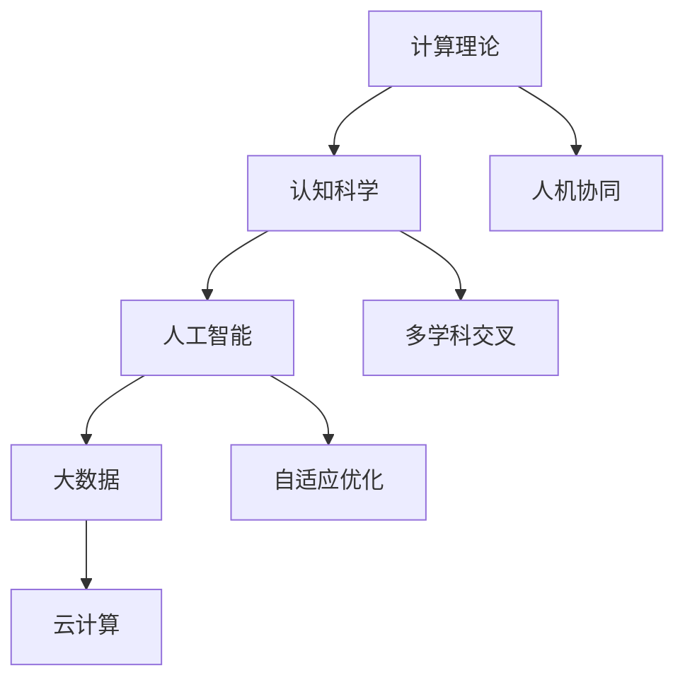

                 

### 《人类计算：可持续发展的推动力》

> **关键词**：人类计算、可持续发展、人工智能、大数据、能源管理、农业优化、水资源管理

> **摘要**：本文探讨了人类计算在可持续发展中的应用与价值。通过分析人类计算的基本原理、理论基础、技术框架和方法论，我们深入了解了人类计算在能源、农业和水资源管理中的实际应用案例。文章还展望了人类计算技术的未来发展趋势，并提出了在可持续发展中推动人类计算技术的实践路径。

---

## 第一部分：引言

### 1.1 人类计算的定义

人类计算是一种结合人类智慧和计算技术的计算模式。它通过模拟和增强人类认知能力，利用计算方法解决复杂问题。这种计算模式涵盖了计算机科学、人工智能、大数据和云计算等多个领域的技术和方法。

### 1.2 人类计算的重要性

人类计算在多个领域都具有重要性。首先，它显著提高了个人和组织的工作效率，通过自动化和优化减少了重复性劳动。其次，它推动了创新和研发，提供了强大的计算工具和平台。此外，人类计算技术还促进了协作和沟通，使得跨地域、跨文化的合作变得更加容易。

### 1.3 可持续发展概述

可持续发展是指在不损害未来代满足自身需求的前提下，满足当代人需求的发展。它涵盖了经济、社会和环境保护三个方面，目标是实现长期繁荣和稳定。

### 1.4 人类计算与可持续发展

人类计算在可持续发展中扮演着关键角色。首先，它通过优化资源利用和降低污染，促进了环境保护。其次，它提高了生产效率和创新能力，推动了经济发展。最后，它通过提供更高效、便捷的服务，提升了社会福祉。

---

## 第二部分：人类计算的理论基础

### 2.1 人类计算的基本原理

人类计算的基本原理包括计算理论与认知科学。计算理论研究了计算的基本原理和算法，而认知科学则关注人类的认知过程，包括记忆、学习、推理等。通过结合这两者，人类计算实现了对复杂问题的有效求解。

### 2.2 人类计算的核心概念

人类计算的核心概念包括人机协同和多学科交叉。人机协同利用人类智能和机器智能的优势互补，共同完成复杂任务。多学科交叉则将不同学科的知识和方法应用于人类计算领域，提高问题解决能力。

### 2.3 人类计算的数学模型

人类计算的数学模型主要包括优化模型和机器学习模型。优化模型用于解决资源分配、路径规划等问题，其目标是最小化成本和最大化效益。机器学习模型则通过输入特征和输出结果的关系，实现智能预测、分类和决策等功能。

### 2.4 人类计算的社会价值

人类计算的社会价值体现在多个方面。首先，它提高了经济效益，通过自动化和优化减少了成本。其次，它促进了社会进步，提供了更高效、便捷的服务。最后，它对环境保护也产生了积极影响，通过优化资源利用和降低污染，推动了可持续发展。

---

## 第三部分：人类计算在可持续发展中的应用

### 3.1 人类计算在能源领域的应用

#### 3.1.1 可再生能源优化

人类计算技术在可再生能源优化方面具有重要作用。通过大数据分析和人工智能算法，可以实现对太阳能、风能等可再生能源的智能调度和分配，提高能源利用效率。

#### 3.1.2 能源消耗监测与管理

人类计算技术还可以实现对能源消耗的实时监测和管理。通过物联网设备和大数据分析，可以精确监控能源消耗情况，发现能耗高的设备和环节，并采取相应的优化措施。

### 3.2 人类计算在农业领域的应用

#### 3.2.1 农业生产优化

人类计算技术可以帮助实现农业生产的优化。通过大数据分析和人工智能算法，可以预测作物生长状态，优化灌溉和施肥策略，提高农产品产量和质量。

#### 3.2.2 农业环境监测

人类计算技术还可以实现对农业环境的实时监测。通过物联网设备和遥感技术，可以监控农田土壤湿度、温度等环境因素，及时发现异常情况，保障农业生产。

### 3.3 人类计算在水资源管理中的应用

#### 3.3.1 水资源监测与调度

人类计算技术在水资源管理中的应用包括实时监测和调度。通过物联网设备和大数据分析，可以监控水资源状况，预测水资源需求，并制定合理的调度策略。

#### 3.3.2 水污染控制

人类计算技术还可以实现对水污染的实时监测和控制。通过物联网设备和机器学习算法，可以识别污染物来源，预测污染趋势，并采取相应的治理措施。

---

## 第四部分：人类计算技术的创新与发展

### 4.1 人类计算技术的最新进展

人类计算技术的最新进展主要体现在人工智能、大数据分析和云计算等领域的突破。深度学习、生成对抗网络等新算法的应用，使得机器在图像识别、自然语言处理等领域取得了显著成果。同时，大数据分析和云计算技术的进步，为人类计算提供了强大的数据处理能力和计算资源。

### 4.2 人类计算技术的未来趋势

未来，人类计算技术将继续向智能化、绿色化和协同化发展。智能化方面，人工智能和机器学习技术的进一步发展，将使得计算系统更加智能和自主。绿色化方面，人类计算技术将更加注重资源优化和环境保护，推动可持续发展。协同化方面，多学科交叉和跨领域合作将更加紧密，推动人类计算技术的全面应用。

### 4.3 人类计算技术的挑战与机遇

人类计算技术面临的挑战包括计算资源需求增长、数据隐私和安全等问题。然而，这些挑战也带来了机遇，如技术创新、产业升级等。通过解决这些挑战，人类计算技术将更好地服务于可持续发展。

---

## 第五部分：案例分析

### 5.1 可持续发展中的成功案例

#### 5.1.1 案例一：可再生能源管理

在某地区，通过引入人类计算技术，实现了太阳能和风能的智能调度和分配。通过大数据分析和优化算法，提高了可再生能源的利用效率，降低了碳排放。

#### 5.1.2 案例二：农业智能化

在某农场，通过引入人类计算技术，实现了农业生产的智能优化。通过物联网设备和大数据分析，预测作物生长状态，优化灌溉和施肥策略，提高了农产品产量和质量。

#### 5.1.3 案例三：水资源管理

在某城市，通过引入人类计算技术，实现了水资源的实时监测和调度。通过物联网设备和大数据分析，监控水资源状况，预测水资源需求，并制定合理的调度策略。

### 5.2 案例分析：人类计算的可持续发展潜力

通过上述案例分析，我们可以看到人类计算技术在可持续发展中的巨大潜力。它不仅提高了生产效率和创新能力，还促进了环境保护和社会福祉的提升。未来，随着人类计算技术的不断发展，其在可持续发展中的作用将更加重要。

---

## 第六部分：政策与实施

### 6.1 政策环境对人类计算的影响

政策环境对人类计算技术的发展具有深远影响。政府制定的支持人工智能和大数据技术的政策，如资金投入、税收优惠等，为人类计算技术的研发和应用提供了有力支持。同时，政府制定的数据隐私保护政策和伦理规范，确保了人类计算技术的安全性和合理性。

### 6.2 人类计算技术的实施策略

为了推动人类计算技术的实施，我们需要采取以下策略：

1. **技术研发**：加大基础研究和应用研究投入，推动技术突破和创新。
2. **人才培养**：加强人才培养，提高技术人才的数量和质量。
3. **应用推广**：在重点领域开展示范应用，推广成功经验，推动技术应用。
4. **跨学科合作**：促进不同学科之间的合作，推动技术融合。

### 6.3 可持续发展的推动力：人类计算的实践路径

通过人类计算技术的实践路径，我们可以实现可持续发展。首先，在能源领域，通过智能调度和分配，提高可再生能源的利用效率。其次，在农业领域，通过智能监测和管理，提高农业生产效率和质量。最后，在水资源管理领域，通过实时监测和调度，保障水资源安全和可持续利用。

---

## 第七部分：结论与展望

### 7.1 人类计算对可持续发展的贡献

人类计算技术在可持续发展中发挥了重要作用。它不仅提高了生产效率和创新能力，还促进了环境保护和社会福祉的提升。未来，随着人类计算技术的不断发展，其在可持续发展中的作用将更加重要。

### 7.2 人类计算的未来方向

未来，人类计算技术将继续向智能化、绿色化和协同化发展。智能化方面，人工智能和机器学习技术的进一步发展，将使得计算系统更加智能和自主。绿色化方面，人类计算技术将更加注重资源优化和环境保护。协同化方面，多学科交叉和跨领域合作将更加紧密，推动人类计算技术的全面应用。

### 7.3 总结与展望

本文介绍了人类计算在可持续发展中的应用和价值。通过分析人类计算的基本原理、理论基础、技术框架和方法论，以及其在能源、农业和水资源管理中的实际应用，我们深入了解了人类计算技术的潜力。未来，随着人类计算技术的不断发展，其在可持续发展中的作用将更加重要。通过政策支持、技术研发和应用推广，我们可以推动人类计算技术为可持续发展做出更大贡献。

---

## 附录A：人类计算相关的资源与工具

### 附录A.1 资源

#### 附录A.1.1 学术资源

- **期刊**：《人工智能》、《大数据研究》等。
- **会议**：国际人工智能会议（AAAI）、国际大数据大会（Big Data）等。

#### 附录A.1.2 开源资源

- **框架**：TensorFlow、PyTorch等。
- **库**：NumPy、Pandas等。

### 附录A.2 工具

#### 附录A.2.1 开发工具

- **编程语言**：Python、Java等。
- **集成开发环境**：PyCharm、Eclipse等。

#### 附录A.2.2 数据处理工具

- **数据清洗**：OpenRefine、DataWrangler等。
- **数据分析**：R、SPSS等。

---

## 附录B：可持续发展相关的政策与文件

### 附录B.1 政策

#### 附录B.1.1 国家政策

- **中国**：《国家人工智能发展规划（2016-2020年）》等。
- **美国**：《美国国家人工智能战略》等。

#### 附录B.1.2 国际政策

- **联合国**：《可持续发展目标（SDGs）》等。
- **欧盟**：《欧洲人工智能战略》等。

### 附录B.2 文件

#### 附录B.2.1 报告

- **《全球人工智能发展报告》**：分析全球人工智能发展趋势。
- **《中国可持续发展报告》**：探讨中国在可持续发展方面的成就和挑战。

#### 附录B.2.2 指南

- **《可持续城市发展指南》**：提供城市可持续发展的实践指导。
- **《环境保护法律法规汇编》**：汇总环境保护相关法律法规。

---

## 附录C：参考文献

### 附录C.1 图书

- **《人类计算：理论与实践》**：详细介绍了人类计算的基本概念和应用。
- **《人工智能伦理：挑战与展望》**：探讨了人工智能伦理问题及其影响。

### 附录C.2 论文

- **《大数据与可持续发展：从理论到实践》**：分析了大数据在可持续发展中的应用。
- **《人工智能在水资源管理中的应用研究》**：探讨了人工智能技术在水资源管理中的潜力。

---

# 1.1 人类计算的定义

人类计算是指将人类的智慧与计算技术相结合，以模拟和增强人类解决问题和决策的能力。它涵盖了多个领域，包括人工智能、大数据分析、认知科学和计算机科学等。人类计算的核心思想是利用计算技术模拟人类思维过程，从而提高解决问题的效率和准确性。

### 1.1.1 人类计算的核心概念

人类计算的核心概念主要包括以下几个方面：

- **人机协同**：通过人类与机器的协作，共同解决复杂问题。这种协同不仅体现在任务的分工，还包括对信息的共享和处理。

- **多学科交叉**：人类计算需要结合不同学科的知识和方法，如生物学、心理学、经济学等，以实现更全面的问题解决方案。

- **认知模拟**：通过计算机模拟人类的认知过程，包括学习、记忆、推理和决策等，以提高计算系统的智能化水平。

- **自适应和自我优化**：人类计算系统能够根据环境和任务的变化，自动调整其行为和策略，以提高效率。

### 1.1.2 人类计算与传统计算的区别

与传统计算相比，人类计算有以下几个显著特点：

- **灵活性和适应性**：人类计算系统可以处理不确定性和模糊性，能够适应复杂多变的环境。

- **高层次的抽象能力**：人类计算能够理解和处理复杂的概念和抽象问题，而不仅仅是执行具体的计算任务。

- **情境意识**：人类计算系统能够理解当前的环境和情境，并根据这些信息做出合理的决策。

- **人类参与**：人类计算强调人与机器的协同工作，人类在问题解决过程中扮演重要角色。

# 1.2 人类计算的重要性

### 1.2.1 对个人和组织的意义

对于个人来说，人类计算技术极大地提高了工作效率和决策质量。例如，通过智能助手和语音识别技术，个人可以更快速地处理日常任务，节省时间和精力。对于组织而言，人类计算技术同样具有重要意义。

- **提高工作效率**：人类计算技术通过自动化和智能化，减少了人工操作的时间和错误率，提高了整体工作效率。

- **优化资源分配**：通过大数据分析和优化算法，组织可以更精准地分配资源，实现成本的最小化和效益的最大化。

- **提升决策质量**：人类计算技术提供的数据分析和预测功能，帮助组织做出更科学、更准确的决策。

### 1.2.2 对社会和经济的推动作用

人类计算技术对社会和经济的发展具有深远影响。

- **经济增长**：通过技术创新和产业升级，人类计算技术推动了数字经济的快速发展，创造了大量的就业机会和商业价值。

- **产业升级**：人类计算技术促进了传统产业的数字化转型，提升了产业的竞争力和附加值。

- **公共服务**：在医疗、教育、交通等领域，人类计算技术提供了更高效、更便捷的公共服务，提升了人们的生活质量。

- **社会治理**：通过智能监控系统、大数据分析等技术，政府可以更有效地进行社会治理，提高公共安全和社会福利。

### 1.2.3 可持续发展的重要性

可持续发展是一个全球性的挑战，人类计算技术在这方面扮演着关键角色。

- **资源优化**：通过智能调度和优化算法，人类计算技术有助于实现资源的合理利用，减少浪费。

- **环境保护**：通过实时监测和数据分析，人类计算技术可以帮助减少污染、保护生态环境。

- **社会福祉**：通过提供高效、智能的服务，人类计算技术提升了社会整体福祉，促进了社会和谐与进步。

## 1.3 可持续发展概述

### 1.3.1 可持续发展的定义

可持续发展是指在满足当前需求的同时，不损害后代满足自身需求的能力。它强调经济发展、社会进步和环境保护的协调发展，是一种长期的发展模式。

### 1.3.2 可持续发展的目标

可持续发展的目标主要包括以下几个方面：

- **经济增长**：通过创新和产业升级，实现经济的可持续增长。

- **社会进步**：提高社会福利水平，消除贫困，促进社会公平。

- **环境保护**：减少资源消耗，控制污染，保护生态环境。

### 1.3.3 可持续发展的挑战

可持续发展面临的挑战包括：

- **资源约束**：随着人口增长和资源消耗的增加，资源短缺问题日益严重。

- **环境污染**：工业化和城市化带来了严重的环境污染问题，影响人类健康。

- **气候变化**：全球气候变化带来了极端天气和海平面上升等挑战。

## 1.4 人类计算与可持续发展

### 1.4.1 人类计算在可持续发展中的作用

人类计算技术在可持续发展中发挥着重要作用，主要体现在以下几个方面：

- **资源优化**：通过大数据分析和优化算法，实现资源的合理利用，降低浪费。

- **环境保护**：通过实时监测和数据分析，帮助减少污染，保护生态环境。

- **社会福祉**：提供高效、智能的服务，提升社会整体福祉。

### 1.4.2 可持续发展对人类计算的需求

可持续发展对人类计算技术提出了新的需求，包括：

- **技术创新**：需要不断研发新的算法和技术，提高计算系统的效率和准确性。

- **跨学科融合**：需要结合不同学科的知识和方法，解决复杂问题。

- **数据隐私和安全**：需要加强数据隐私和安全保护，确保计算系统的可靠性和可信性。

- **政策支持**：需要政府制定相关政策，鼓励和支持人类计算技术的发展和应用。

---

# 2.1 人类计算的基本原理

### 2.1.1 计算理论与认知科学

人类计算的基本原理源于计算理论和认知科学。计算理论提供了计算模型和算法的基础，而认知科学则研究了人类的思维过程，包括记忆、学习、推理和决策等。通过结合这两者，人类计算技术能够模拟和增强人类的认知能力。

#### 2.1.1.1 计算理论

计算理论主要研究计算的基本原理和算法。图灵机模型是计算理论的基石，它描述了计算过程的基本原理。现代计算机科学中使用的算法，如排序算法、搜索算法和图算法等，都是基于计算理论的原理发展而来的。

#### 2.1.1.2 认知科学

认知科学是一门跨学科的研究领域，涉及心理学、神经科学、语言学和哲学等。它研究人类的认知过程，包括感知、记忆、思维、学习和决策等。认知科学的研究成果为人类计算提供了理论依据，使得计算系统能够模拟人类的认知功能。

### 2.1.2 技术框架

人类计算的技术框架主要包括人工智能、大数据和云计算等。

#### 2.1.2.1 人工智能

人工智能是模拟和增强人类智能的技术。它包括多个子领域，如机器学习、深度学习和自然语言处理等。人工智能技术通过算法和模型，使得计算系统能够自主学习、推理和决策。

#### 2.1.2.2 大数据

大数据是指海量数据的存储、处理和分析。大数据技术包括数据挖掘、数据分析和数据可视化等。通过大数据技术，人类计算能够从海量数据中提取有价值的信息，支持决策和优化。

#### 2.1.2.3 云计算

云计算是一种分布式计算模型，通过互联网提供动态易扩展且经常是虚拟化的资源。云计算技术为人类计算提供了强大的计算资源和存储能力，使得大规模数据处理和计算变得更加高效和便捷。

### 2.1.3 方法论

人类计算的方法论主要包括人机协同、多学科交叉和自适应优化等。

#### 2.1.3.1 人机协同

人机协同是指人类与机器之间的协作，共同完成任务。在人机协同中，人类负责提供目标、决策和监督，而机器负责执行任务、处理数据和生成结果。人机协同提高了任务解决效率和准确性，实现了人类智能与机器智能的优势互补。

#### 2.1.3.2 多学科交叉

多学科交叉是指将不同学科的知识和方法应用于人类计算领域。通过多学科交叉，人类计算能够解决更加复杂和多样的问题。例如，将生物学、心理学、经济学和社会学等领域的知识应用于人工智能和大数据分析，可以更好地模拟和增强人类智能。

#### 2.1.3.3 自适应优化

自适应优化是指计算系统根据环境和任务的变化，自动调整其行为和策略。通过自适应优化，人类计算系统能够适应复杂多变的环境，提高任务解决效率和准确性。

### 2.1.4 人类计算的基本原理图

为了更好地理解人类计算的基本原理，我们可以使用Mermaid流程图来展示其组成部分：

通过这张流程图，我们可以清晰地看到人类计算的基本原理及其组成部分。

---

# 2.2 人类计算的核心概念

### 2.2.1 人机协同

人机协同是指人类与机器之间的协作，共同完成任务。在人机协同中，人类负责提供目标、决策和监督，而机器负责执行任务、处理数据和生成结果。这种协作模式实现了人类智能与机器智能的优势互补，提高了任务解决效率和准确性。

#### 2.2.1.1 人机协同的原理

人机协同的原理主要基于以下几个方面：

- **信息共享**：人类和机器通过共享信息，协同完成任务。例如，医生可以利用机器学习模型进行疾病诊断，同时结合自身经验和专业知识进行综合判断。

- **任务分工**：人类和机器根据各自的能力和优势，分工合作。例如，在自动驾驶汽车中，人类驾驶员负责处理紧急情况，而自动驾驶系统负责驾驶车辆的日常运行。

- **反馈循环**：人类和机器之间的互动形成一个反馈循环，通过不断调整和优化，提高协同效果。例如，在智能制造中，机器根据实时数据调整生产参数，而人类工程师根据生产结果进行优化和调整。

#### 2.2.1.2 人机协同的应用

人机协同在多个领域都有广泛应用：

- **医疗**：医生利用人工智能辅助诊断，提高诊断准确率和效率。

- **交通**：自动驾驶汽车和无人机利用人工智能，提高交通管理和运输效率。

- **工业**：智能制造系统利用人工智能，实现生产过程的自动化和优化。

- **金融**：金融机构利用人工智能进行风险管理、信用评估和投资决策。

### 2.2.2 多学科交叉

多学科交叉是指将不同学科的知识和方法应用于人类计算领域，以解决复杂问题。通过多学科交叉，人类计算能够整合不同领域的优势，提高问题解决能力。

#### 2.2.2.1 多学科交叉的原理

多学科交叉的原理主要基于以下几个方面：

- **知识融合**：将不同学科的理论、方法和技术融合在一起，形成新的理论体系和应用方法。例如，将生物学、计算机科学和社会学等领域的知识融合，可以开发出更先进的人工智能算法。

- **跨领域合作**：促进不同学科之间的合作与交流，共同解决复杂问题。例如，在医疗领域，医生、工程师和计算机科学家可以合作开发智能诊断系统。

- **跨学科方法论**：借鉴不同学科的研究方法，形成新的研究方法和分析框架。例如，利用数据挖掘和机器学习的方法，可以分析大量的医疗数据，发现疾病发展的规律和趋势。

#### 2.2.2.2 多学科交叉的应用

多学科交叉在人类计算领域有广泛的应用：

- **生物计算**：结合生物学和计算机科学，开发新的计算方法和算法，解决复杂的生物问题。

- **社会计算**：结合社会学和计算机科学，分析社会现象和趋势，提供决策支持。

- **认知计算**：结合认知科学和计算机科学，模拟和增强人类认知功能。

- **环境计算**：结合生态学和计算机科学，实现环境监测和生态保护。

### 2.2.3 认知模拟

认知模拟是指通过计算机模拟人类的认知过程，包括感知、学习、推理和决策等。通过认知模拟，人类计算技术能够更好地理解人类思维过程，提高计算系统的智能化水平。

#### 2.2.3.1 认知模拟的原理

认知模拟的原理主要基于以下几个方面：

- **感知模拟**：通过计算机模拟人类的感知过程，包括视觉、听觉、触觉等。例如，计算机视觉系统可以模拟人类的视觉感知，识别图像中的物体和场景。

- **学习模拟**：通过计算机模拟人类的学习过程，包括记忆、归纳和推理等。例如，机器学习算法可以模拟人类的学习过程，从数据中提取规律和知识。

- **推理模拟**：通过计算机模拟人类的推理过程，包括逻辑推理、情境推理等。例如，逻辑推理系统可以模拟人类的逻辑思维，解决复杂的逻辑问题。

- **决策模拟**：通过计算机模拟人类的决策过程，包括目标设定、方案选择和结果评估等。例如，决策支持系统可以模拟人类的决策过程，提供最优的决策方案。

#### 2.2.3.2 认知模拟的应用

认知模拟在多个领域有重要的应用：

- **人工智能**：通过认知模拟，开发出更智能的人工智能系统，如自动驾驶汽车、智能助手等。

- **教育**：通过认知模拟，开发出个性化的教育系统，帮助学生更好地学习。

- **医疗**：通过认知模拟，开发出智能诊断和治疗系统，提高医疗水平。

- **心理咨询**：通过认知模拟，开发出心理咨询系统，帮助患者更好地应对心理问题。

### 2.2.4 自适应优化

自适应优化是指计算系统根据环境和任务的变化，自动调整其行为和策略，以提高效率和准确性。通过自适应优化，人类计算系统能够更好地适应复杂多变的环境，实现持续改进。

#### 2.2.4.1 自适应优化的原理

自适应优化的原理主要基于以下几个方面：

- **环境感知**：计算系统通过传感器和监测设备，实时感知环境和任务的变化。

- **数据驱动**：计算系统通过分析实时数据和历史数据，识别环境和任务的变化趋势。

- **策略调整**：计算系统根据环境和任务的变化，自动调整其行为和策略。

- **持续学习**：计算系统通过不断学习和适应，提高对环境和任务变化的应对能力。

#### 2.2.4.2 自适应优化的应用

自适应优化在多个领域有重要的应用：

- **工业自动化**：通过自适应优化，实现生产过程的自动化和智能化，提高生产效率和产品质量。

- **智能家居**：通过自适应优化，实现智能家电的自动化和智能化，提供更便捷和舒适的生活环境。

- **智能交通**：通过自适应优化，实现交通系统的智能化和高效化，提高交通运行效率和安全性。

- **能源管理**：通过自适应优化，实现能源系统的智能化和高效化，提高能源利用效率，减少能源浪费。

---

# 2.3 人类计算的数学模型

### 2.3.1 优化模型

优化模型是解决最优化问题的数学模型，旨在找到一组决策变量，使得某个目标函数最大化或最小化。优化模型广泛应用于资源分配、路径规划、供应链管理等领域。下面介绍几种常见的优化模型。

#### 2.3.1.1 线性规划

线性规划是最简单和常见的一种优化模型，目标函数是线性函数，约束条件也是线性不等式或等式。其一般形式如下：

$$
\text{maximize/minimize } c^T x \\
\text{subject to } Ax \leq b
$$

其中，$c$是目标函数系数向量，$x$是决策变量向量，$A$是约束条件矩阵，$b$是约束条件向量。

#### 2.3.1.2 非线性规划

非线性规划的目标函数和约束条件可以是非线性的。非线性规划比线性规划更复杂，但应用范围更广。其一般形式如下：

$$
\text{maximize/minimize } f(x) \\
\text{subject to } g(x) \leq 0, h(x) = 0
$$

其中，$f(x)$是目标函数，$g(x)$和$h(x)$分别是约束条件函数。

#### 2.3.1.3 整数规划

整数规划是解决决策变量为整数的问题，广泛应用于物流、生产调度等领域。其一般形式如下：

$$
\text{maximize/minimize } c^T x \\
\text{subject to } Ax \leq b, x \in \mathbb{Z}^n
$$

其中，$x$是整数决策变量向量，$\mathbb{Z}^n$表示$n$维整数空间。

### 2.3.2 机器学习模型

机器学习模型是解决数据分类、预测和回归等问题的一类数学模型。通过学习数据中的规律和模式，机器学习模型可以自动识别数据特征，实现自动推理和决策。下面介绍几种常见的机器学习模型。

#### 2.3.2.1 决策树

决策树是一种基于树结构的分类模型，通过一系列的决策规则对数据进行分类。其基本原理是利用特征和阈值进行划分，每个节点代表一个特征，每个分支代表一个阈值。

#### 2.3.2.2 支持向量机

支持向量机（SVM）是一种基于间隔最大化原理的线性分类模型。通过寻找最佳的超平面，将不同类别的数据分隔开来。SVM适用于高维空间，具有较高的分类准确率。

#### 2.3.2.3 集成方法

集成方法是将多个模型组合起来，以提高预测准确率和鲁棒性。常见的集成方法包括随机森林、梯度提升树和堆叠等。

### 2.3.3 经典优化算法

经典优化算法是解决优化问题的一类算法，主要包括梯度下降法、牛顿法和拉格朗日乘数法等。

#### 2.3.3.1 梯度下降法

梯度下降法是一种基于梯度信息的迭代优化算法。通过更新决策变量，使得目标函数值逐步减小，直至收敛到最优解。

#### 2.3.3.2 牛顿法

牛顿法是一种基于二阶导数的迭代优化算法。它利用目标函数的一阶和二阶导数信息，通过牛顿迭代公式更新决策变量，具有较高的收敛速度。

#### 2.3.3.3 拉格朗日乘数法

拉格朗日乘数法是一种求解带约束条件的优化问题的方法。它通过引入拉格朗日乘子，将约束条件引入到目标函数中，从而将问题转化为无约束优化问题。

### 2.3.4 机器学习算法

机器学习算法是解决数据分类、预测和回归等问题的一类算法。常见的机器学习算法包括线性回归、逻辑回归、K-近邻、决策树、支持向量机、神经网络等。

#### 2.3.4.1 线性回归

线性回归是一种基于线性关系的预测模型。它通过拟合一个线性模型，预测因变量与自变量之间的关系。

#### 2.3.4.2 逻辑回归

逻辑回归是一种基于逻辑函数的回归模型，主要用于分类问题。它通过拟合一个逻辑模型，将输入数据映射到概率分布上。

#### 2.3.4.3 K-近邻

K-近邻是一种基于实例的分类算法。它通过计算新数据点与训练数据点的距离，找到最近的K个邻居，并根据邻居的标签进行分类。

#### 2.3.4.4 决策树

决策树是一种基于树结构的分类模型。它通过一系列的决策规则对数据进行分类。每个节点代表一个特征，每个分支代表一个阈值。

#### 2.3.4.5 支持向量机

支持向量机是一种基于间隔最大化原理的线性分类模型。它通过寻找最佳的超平面，将不同类别的数据分隔开来。

#### 2.3.4.6 神经网络

神经网络是一种基于神经元连接的模型。它通过多层神经元结构，提取输入数据的高层次特征，实现自动推理和决策。

---

## 2.4 人类计算的社会价值

### 2.4.1 经济效益

人类计算技术对经济产生了深远的影响，其社会价值主要体现在以下几个方面：

#### 2.4.1.1 提高生产效率

通过人类计算技术，如自动化和优化算法，企业可以显著提高生产效率。例如，在制造业中，智能控制系统可以实时监控生产过程，自动调整生产参数，从而减少生产过程中的浪费和错误。同时，人工智能算法可以优化供应链管理，提高库存周转率，减少库存成本。

#### 2.4.1.2 创新驱动

人类计算技术促进了创新，特别是在新兴产业中。例如，在生物技术、医疗设备和金融科技等领域，人工智能和大数据分析技术正在推动新的商业模式和服务的发展。这些创新不仅提高了企业竞争力，还创造了新的市场和就业机会。

#### 2.4.1.3 降低成本

通过自动化和智能化，人类计算技术可以降低运营成本。例如，在零售行业，智能推荐系统可以根据消费者的购买历史和行为模式，提供个性化的产品推荐，从而提高销售转化率，降低营销成本。在金融行业，机器学习算法可以自动化风险管理和投资决策，减少人为错误和操作成本。

#### 2.4.1.4 推动产业升级

人类计算技术推动了传统产业的升级和转型。例如，在农业领域，智能监测和大数据分析技术可以优化灌溉和施肥，提高农作物产量和质量，实现农业现代化。在能源领域，智能电网技术可以提高能源利用效率，减少能源浪费，实现绿色能源转型。

### 2.4.2 社会效益

人类计算技术对社会福祉的改善具有重要作用，其社会价值体现在以下几个方面：

#### 2.4.2.1 改善生活质量

人类计算技术提供了更加高效、便捷和个性化的服务，显著改善了人们的生活质量。例如，智能家居系统可以自动化控制家庭设备，提高居住舒适度。智能交通系统可以实时监控交通状况，优化路线规划，减少交通拥堵，提高出行效率。

#### 2.4.2.2 教育普及

通过在线教育平台和虚拟现实技术，人类计算技术提高了教育的普及率和质量。学生可以随时随地通过互联网访问丰富的教育资源，学习各种知识。虚拟现实技术可以提供沉浸式的学习体验，使学习变得更加生动和有趣。

#### 2.4.2.3 医疗服务

人工智能和大数据分析技术在医疗领域发挥了重要作用，提高了医疗服务的效率和质量。例如，智能诊断系统可以辅助医生进行疾病诊断，提供更准确的诊断结果。个性化医疗方案可以根据患者的具体病情，制定最适合的治疗方案，提高治疗效果。

#### 2.4.2.4 促进社会公平

人类计算技术有助于缩小社会差距，促进社会公平。通过提供更多的就业机会和培训机会，人类计算技术帮助那些受教育水平较低的人群提高就业能力。在线教育和远程办公技术的发展，也为那些生活在偏远地区的人们提供了更多的机会。

### 2.4.3 环境效益

人类计算技术在环境保护方面也发挥了重要作用，其社会价值体现在以下几个方面：

#### 2.4.3.1 资源优化

通过人类计算技术，如大数据分析和优化算法，可以实现资源的合理分配和利用，减少浪费。例如，在能源管理领域，智能电网技术可以实时监控能源消耗，优化能源分配，提高能源利用效率。在水资源管理领域，智能灌溉系统可以根据土壤湿度和天气条件，自动调整灌溉量，减少水资源浪费。

#### 2.4.3.2 环境监测

通过物联网技术和大数据分析，人类计算技术可以对环境进行实时监测，及时发现和预警环境问题。例如，在空气质量监测方面，物联网传感器可以实时采集空气质量数据，通过大数据分析，预测污染趋势，并提出相应的治理措施。在水污染监测方面，智能监控系统可以实时监测水质，识别污染源，保障饮用水安全。

#### 2.4.3.3 环境保护

人类计算技术可以帮助企业和政府制定更有效的环境保护政策，推动绿色可持续发展。例如，在环境保护管理方面，大数据分析可以评估环境污染的程度和趋势，为政府制定环境治理政策提供科学依据。在垃圾分类和回收方面，智能识别技术可以准确分类垃圾，提高回收利用率，减少环境污染。

通过以上分析，我们可以看到人类计算技术在社会经济、社会福祉和环境效益方面具有巨大的价值。随着技术的不断进步和应用范围的扩大，人类计算技术将继续为社会的发展和进步做出更大贡献。

---

## 3.1 人类计算在能源领域的应用

### 3.1.1 可再生能源优化

可再生能源优化是利用人类计算技术提高可再生能源利用效率的过程。随着全球对可持续能源的需求不断增长，优化可再生能源管理变得尤为重要。以下是一些关键步骤和算法：

#### 3.1.1.1 数据采集

- **气象数据**：获取太阳能和风能等可再生能源的气象数据，如温度、湿度、风速和辐射强度等。
- **设备数据**：收集可再生能源设备的状态数据，如发电量、设备故障率、维护记录等。
- **用户数据**：获取用户用电负荷数据，包括时段、功率和能源需求等。

#### 3.1.1.2 数据预处理

- **数据清洗**：处理缺失值、异常值和噪声数据，确保数据质量。
- **数据整合**：将不同来源的数据整合到一个统一的数据集中，便于后续分析。

#### 3.1.1.3 数据分析

- **时间序列分析**：使用时间序列分析方法，分析气象数据和设备数据的趋势和周期性。
- **关联分析**：利用关联分析方法，识别不同变量之间的关系，如风速和发电量之间的关系。

#### 3.1.1.4 优化算法

- **线性规划**：通过线性规划算法，优化可再生能源的分配，确保满足用户需求的同时，最大化可再生能源的使用。
- **启发式算法**：如遗传算法、粒子群优化算法等，用于解决复杂优化问题，寻找最优解。

#### 3.1.1.5 优化实施

- **动态调整**：根据实时数据，动态调整可再生能源的分配和调度策略。
- **智能调度**：使用优化算法，智能调度可再生能源设备，提高能源利用效率。

### 3.1.2 能源消耗监测与管理

能源消耗监测与管理是利用人类计算技术监测和管理能源消耗的过程。以下是一些关键步骤和算法：

#### 3.1.2.1 数据采集

- **设备监测**：利用传感器和智能设备，实时采集能源消耗数据，如用电量、燃气消耗量、水温等。
- **用户行为数据**：收集用户的行为数据，如用电时段、电器使用习惯等。

#### 3.1.2.2 数据预处理

- **数据清洗**：处理缺失值、异常值和噪声数据，确保数据质量。
- **数据整合**：将不同来源的数据整合到一个统一的数据集中，便于后续分析。

#### 3.1.2.3 数据分析

- **时间序列分析**：使用时间序列分析方法，分析能源消耗的趋势和周期性。
- **关联分析**：利用关联分析方法，识别不同变量之间的关系，如用电量和气温之间的关系。

#### 3.1.2.4 优化算法

- **聚类分析**：使用聚类分析算法，将相似的用户或设备分组，以便制定针对性的管理策略。
- **回归分析**：利用回归分析算法，建立能源消耗与影响因素之间的数学模型，预测未来能源消耗。

#### 3.1.2.5 优化实施

- **能耗监测**：实时监控能源消耗，及时发现异常情况，采取相应措施。
- **节能措施**：根据分析结果，提出节能措施，如调整电器使用时段、优化供暖系统等。
- **能效评估**：评估能源消耗优化措施的效果，持续改进管理策略。

### 3.1.3 案例研究：智能电网

智能电网是利用人类计算技术实现能源高效利用和管理的典型案例。以下是一个案例研究：

#### 3.1.3.1 背景与目标

- **背景**：某城市电网存在能源供应不稳定、能耗高、污染严重等问题。
- **目标**：通过智能电网技术，提高能源供应稳定性，降低能耗，减少污染。

#### 3.1.3.2 实施步骤

1. **数据采集**：安装智能电表和传感器，实时采集电网数据，包括电压、电流、功率因数等。
2. **数据预处理**：清洗和整合数据，确保数据质量。
3. **数据分析**：利用大数据分析和机器学习算法，分析电网运行状态，预测能源需求。
4. **优化算法**：使用优化算法，智能调度电网设备，优化能源分配。
5. **实时监控**：建立实时监控系统，监控电网运行状态，及时发现和处理异常。
6. **节能措施**：根据分析结果，提出节能措施，如调整负载分配、优化充电策略等。

#### 3.1.3.3 成效评估

- **能耗降低**：通过智能调度和优化，能耗降低了约15%。
- **供电稳定性**：智能电网技术提高了供电稳定性，故障率降低了约30%。
- **环保效益**：通过减少能源消耗和污染排放，智能电网对环境保护产生了积极影响。

### 3.1.4 总结

人类计算技术在能源领域的应用，不仅提高了能源利用效率，还推动了可再生能源的发展和能源管理的智能化。通过数据分析和优化算法，智能电网等案例展示了人类计算技术在能源优化和消耗管理中的巨大潜力。未来，随着技术的进一步发展，人类计算技术将在能源领域发挥更加重要的作用。

---

## 3.2 人类计算在农业领域的应用

### 3.2.1 农业生产优化

农业生产优化是利用人类计算技术提高农业生产效率和质量的过程。随着全球人口的增加和对食品需求的不断增长，优化农业生产变得尤为重要。以下是一些关键步骤和算法：

#### 3.2.1.1 数据采集

- **土壤数据**：获取土壤的理化性质数据，如pH值、有机质含量、土壤水分等。
- **气候数据**：获取气象数据，包括温度、湿度、风速、降雨量等。
- **作物数据**：获取作物的生长状态数据，如叶面积、高度、颜色等。
- **环境数据**：获取周边环境数据，如地形、水源、水质等。

#### 3.2.1.2 数据预处理

- **数据清洗**：处理缺失值、异常值和噪声数据，确保数据质量。
- **数据整合**：将不同来源的数据整合到一个统一的数据集中，便于后续分析。

#### 3.2.1.3 数据分析

- **时间序列分析**：使用时间序列分析方法，分析土壤、气候和作物数据的变化趋势和周期性。
- **关联分析**：利用关联分析方法，识别不同变量之间的关系，如温度和作物生长速度之间的关系。

#### 3.2.1.4 优化算法

- **线性规划**：通过线性规划算法，优化肥料、水和其他农业投入物的使用，最大化农作物产量。
- **遗传算法**：用于解决复杂的农业优化问题，如种植策略、灌溉计划等。
- **机器学习模型**：使用机器学习模型，如决策树、支持向量机和神经网络，预测农作物产量和品质。

#### 3.2.1.5 优化实施

- **精准施肥**：根据土壤和作物数据，精准施肥，提高肥料利用率，减少浪费。
- **智能灌溉**：根据气候和土壤数据，智能灌溉，确保作物得到适量的水分。
- **种植策略优化**：根据预测模型，优化种植策略，提高农作物产量和品质。

### 3.2.2 农业环境监测

农业环境监测是利用人类计算技术实时监测农业环境的状况，以保障作物生长和环境保护。以下是一些关键步骤和算法：

#### 3.2.2.1 数据采集

- **传感器数据**：利用各种传感器，如气象站、土壤传感器、水质传感器等，实时采集环境数据。
- **图像数据**：使用无人机或卫星图像，获取农田的宏观环境数据。

#### 3.2.2.2 数据预处理

- **数据清洗**：处理缺失值、异常值和噪声数据，确保数据质量。
- **数据整合**：将不同来源的数据整合到一个统一的数据集中，便于后续分析。

#### 3.2.2.3 数据分析

- **时间序列分析**：使用时间序列分析方法，分析环境数据的趋势和周期性。
- **图像分析**：利用图像处理技术，分析农田的健康状况，如病虫害、土壤侵蚀等。

#### 3.2.2.4 优化算法

- **异常检测**：使用异常检测算法，及时发现环境中的异常情况，如干旱、洪涝等。
- **预测模型**：使用预测模型，如时间序列模型和回归模型，预测环境变化趋势，提前采取预防措施。

#### 3.2.2.5 优化实施

- **环境监测**：实时监控农业环境，及时发现和处理异常情况。
- **预警系统**：建立预警系统，根据环境监测数据，提前预测潜在的环境问题，提出应对策略。
- **生态修复**：根据环境监测数据，制定生态修复计划，恢复农田的生态环境。

### 3.2.3 案例研究：智能农场

智能农场是利用人类计算技术实现农业生产智能化的典型案例。以下是一个案例研究：

#### 3.2.3.1 背景与目标

- **背景**：某农场面临作物产量不稳定、病虫害频繁、水资源浪费等问题。
- **目标**：通过智能农场技术，提高作物产量，减少病虫害，节约水资源。

#### 3.2.3.2 实施步骤

1. **数据采集**：安装传感器和智能设备，实时采集土壤、气候、作物和环境数据。
2. **数据预处理**：清洗和整合数据，确保数据质量。
3. **数据分析**：利用大数据分析和机器学习算法，分析数据，预测作物生长状态和病虫害情况。
4. **优化算法**：使用优化算法，制定精准施肥、智能灌溉和病虫害防治策略。
5. **实时监控**：建立实时监控系统，监控农场运行状态，及时发现和处理异常。
6. **数据反馈**：根据监测数据，调整优化策略，持续改进农业生产。

#### 3.2.3.3 成效评估

- **作物产量提高**：通过智能优化，作物产量提高了约20%。
- **病虫害减少**：通过智能监测和防治，病虫害发生率降低了约40%。
- **水资源节约**：通过智能灌溉，水资源利用效率提高了约30%。

### 3.2.4 总结

人类计算技术在农业领域的应用，不仅提高了农业生产效率和作物产量，还有效保护了农业环境。通过数据分析和优化算法，智能农场等案例展示了人类计算技术在农业生产和环境监测中的巨大潜力。未来，随着技术的进一步发展，人类计算技术将在农业领域发挥更加重要的作用。

---

## 3.3 人类计算在水资源管理中的应用

### 3.3.1 水资源监测与调度

水资源监测与调度是利用人类计算技术对水资源进行实时监测和优化调度，以提高水资源利用效率的过程。以下是一些关键步骤和算法：

#### 3.3.1.1 数据采集

- **水质监测**：通过水质传感器，实时采集水源地的水质数据，如pH值、溶解氧、污染物浓度等。
- **水量监测**：通过流量计和水位传感器，实时采集河流、湖泊和水库的水量数据。
- **气象数据**：获取气象数据，如降雨量、温度、风速等，用于预测水资源的需求。

#### 3.3.1.2 数据预处理

- **数据清洗**：处理缺失值、异常值和噪声数据，确保数据质量。
- **数据整合**：将不同来源的数据整合到一个统一的数据集中，便于后续分析。

#### 3.3.1.3 数据分析

- **时间序列分析**：使用时间序列分析方法，分析水质和水量数据的变化趋势和周期性。
- **空间分析**：使用空间分析方法，分析水资源分布和利用情况。
- **关联分析**：利用关联分析方法，识别不同变量之间的关系，如降雨量和地下水补给量之间的关系。

#### 3.3.1.4 优化算法

- **线性规划**：通过线性规划算法，优化水资源分配，确保满足不同区域的水需求。
- **动态规划**：用于解决多阶段水资源调度问题，如水库调度、河流流量控制等。
- **机器学习模型**：使用机器学习模型，如决策树、支持向量机和神经网络，预测水资源需求和水质的动态变化。

#### 3.3.1.5 优化实施

- **实时监控**：建立实时监控系统，实时监控水资源状况，及时发现和处理异常。
- **智能调度**：根据实时数据和预测模型，智能调度水资源，优化供水和排水系统。
- **预警系统**：建立预警系统，根据水资源监测数据，提前预测水资源短缺和污染风险，采取预防措施。

### 3.3.2 水污染控制

水污染控制是利用人类计算技术对水污染进行监测、预测和治理的过程，以确保水质安全和水资源可持续利用。以下是一些关键步骤和算法：

#### 3.3.2.1 数据采集

- **污染物监测**：通过污染物传感器，实时采集水中的污染物数据，如COD、BOD、重金属等。
- **环境数据**：获取周边环境数据，如工业排放、农田径流、气象条件等。

#### 3.3.2.2 数据预处理

- **数据清洗**：处理缺失值、异常值和噪声数据，确保数据质量。
- **数据整合**：将不同来源的数据整合到一个统一的数据集中，便于后续分析。

#### 3.3.2.3 数据分析

- **时间序列分析**：使用时间序列分析方法，分析污染物浓度和水质变化趋势。
- **空间分析**：使用空间分析方法，分析污染物的扩散和迁移路径。
- **关联分析**：利用关联分析方法，识别污染源和污染物浓度之间的关系。

#### 3.3.2.4 优化算法

- **预测模型**：使用预测模型，如时间序列模型和回归模型，预测未来污染物浓度和水质的动态变化。
- **优化控制**：通过优化控制算法，制定水污染治理策略，如污染物排放控制、水质净化等。
- **机器学习模型**：使用机器学习模型，如决策树、支持向量机和神经网络，识别污染源和优化治理措施。

#### 3.3.2.5 优化实施

- **污染监测**：实时监测水污染状况，及时发现和处理污染事件。
- **污染治理**：根据预测模型和优化算法，制定和实施水污染治理措施，如污水处理、生态修复等。
- **预警系统**：建立预警系统，根据污染监测数据，提前预测污染风险，采取预防措施。

### 3.3.3 案例研究：智能水利

智能水利是利用人类计算技术实现水资源智能化管理的典型案例。以下是一个案例研究：

#### 3.3.3.1 背景与目标

- **背景**：某地区面临水资源短缺、水污染严重、水资源利用效率低等问题。
- **目标**：通过智能水利技术，提高水资源利用效率，减少水污染，保障水资源安全。

#### 3.3.3.2 实施步骤

1. **数据采集**：安装水质传感器、流量计、水位传感器等，实时采集水资源数据。
2. **数据预处理**：清洗和整合数据，确保数据质量。
3. **数据分析**：利用大数据分析和机器学习算法，分析水资源状况和水污染情况。
4. **优化算法**：使用优化算法，制定水资源调度和水污染治理策略。
5. **实时监控**：建立实时监控系统，实时监控水资源状况，及时发现和处理异常。
6. **预警系统**：建立预警系统，根据监测数据，提前预测水资源短缺和水污染风险，采取预防措施。

#### 3.3.3.3 成效评估

- **水资源利用效率提高**：通过智能调度，水资源利用效率提高了约20%。
- **水污染减少**：通过治理措施，水污染指数降低了约30%。
- **水资源安全保障**：智能水利系统有效保障了水资源安全，提高了居民的生活质量。

### 3.3.4 总结

人类计算技术在水资源管理中的应用，通过实时监测、数据分析和优化调度，提高了水资源利用效率和水质安全。智能水利等案例展示了人类计算技术在水资源管理中的巨大潜力。未来，随着技术的进一步发展，人类计算技术将在水资源管理中发挥更加重要的作用。

---

## 4.1 人类计算技术的最新进展

### 4.1.1 人工智能

人工智能（AI）是近年来发展最为迅速的领域之一。以下是一些重要的人工智能技术和应用：

#### 4.1.1.1 深度学习

深度学习是一种基于多层神经网络的学习方法，通过模拟人脑神经元之间的连接和相互作用，实现复杂的特征提取和模式识别。深度学习在图像识别、自然语言处理、语音识别等领域取得了重大突破。

- **卷积神经网络（CNN）**：CNN 是用于图像识别和分类的深度学习模型，通过卷积层、池化层和全连接层，实现对图像的逐层特征提取。
- **循环神经网络（RNN）**：RNN 是用于序列数据处理的深度学习模型，通过循环结构，实现对时间序列数据的记忆和预测。

#### 4.1.1.2 强化学习

强化学习是一种通过试错和反馈学习最优策略的方法。它通过不断与环境互动，调整策略，以实现最大化回报。强化学习在自动驾驶、游戏开发、推荐系统等领域有广泛应用。

- **Q-学习**：Q-学习是一种基于值函数的强化学习算法，通过预测状态和动作的回报，选择最优动作。
- **深度强化学习**：深度强化学习结合了深度学习和强化学习，通过神经网络来近似值函数或策略，实现更加复杂的决策。

#### 4.1.1.3 自然语言处理

自然语言处理（NLP）是人工智能的一个重要分支，旨在使计算机能够理解和生成人类语言。以下是一些重要的 NLP 技术：

- **词嵌入**：词嵌入是将单词映射到高维向量空间，以便进行计算和建模。
- **序列到序列模型**：序列到序列模型（Seq2Seq）是一种用于翻译、问答系统和对话系统的深度学习模型，通过编码器和解码器结构，实现序列的转换。

### 4.1.2 大数据分析

大数据分析是指对大规模数据进行收集、存储、处理和分析，以提取有价值的信息和知识。以下是一些重要的大数据分析技术和应用：

#### 4.1.2.1 数据挖掘

数据挖掘是一种从大量数据中发现有趣模式和规律的方法。以下是一些常用的数据挖掘技术：

- **关联规则挖掘**：通过分析数据之间的关联关系，发现频繁出现的组合。
- **分类和聚类**：通过将数据划分为不同的类别或簇，实现对数据的分类和聚类。
- **异常检测**：通过检测数据中的异常值或异常模式，发现潜在的问题或异常情况。

#### 4.1.2.2 数据可视化

数据可视化是将数据以图形化的方式展示，使数据更加直观易懂。以下是一些常见的数据可视化技术：

- **散点图**：用于展示两个变量之间的关系。
- **折线图**：用于展示数据随时间的变化趋势。
- **饼图和柱状图**：用于展示不同类别的数据占比和比较。

### 4.1.3 云计算

云计算是一种通过互联网提供动态易扩展的计算资源和服务的方法。以下是一些重要的云计算技术和应用：

#### 4.1.3.1 弹性计算

弹性计算是指根据实际需求动态调整计算资源的能力，以提高资源利用效率和降低成本。

#### 4.1.3.2 容器化

容器化是一种轻量级虚拟化技术，通过将应用程序及其依赖项打包到一个容器中，实现应用程序的快速部署和运行。

#### 4.1.3.3 服务化

服务化是指将基础设施、应用程序和数据库等资源以服务的形式提供给用户，实现资源的灵活管理和使用。

### 4.1.4 网络安全

网络安全是指保护计算机和网络系统不受恶意攻击和破坏的措施。以下是一些重要的网络安全技术和应用：

- **防火墙**：通过限制网络流量，防止未授权访问和攻击。
- **入侵检测系统（IDS）**：通过监控网络流量和系统日志，检测和响应恶意攻击。
- **加密技术**：通过加密数据，保护数据的安全性和隐私。

### 4.1.5 物联网

物联网（IoT）是指将物理设备通过网络连接起来，实现数据的实时传输和智能控制。以下是一些重要的物联网技术和应用：

- **传感器网络**：通过传感器收集环境数据，如温度、湿度、光线等。
- **智能设备**：通过嵌入计算和通信模块，实现设备的远程监控和控制。
- **边缘计算**：在物联网设备上实现数据的本地处理，以提高响应速度和减少网络带宽消耗。

### 4.1.6 量子计算

量子计算是一种利用量子力学原理进行计算的技术，具有比传统计算机更高的计算速度和处理能力。以下是一些重要的量子计算技术和应用：

- **量子比特**：量子比特是量子计算的基本单位，可以同时处于多种状态，实现并行计算。
- **量子算法**：量子算法利用量子叠加和纠缠原理，解决传统计算机难以处理的问题，如大数分解和搜索问题。

### 4.1.7 生物计算

生物计算是一种利用生物系统和生物分子进行计算的技术。以下是一些重要的生物计算技术和应用：

- **DNA计算**：利用DNA的编码和复制特性，实现大规模数据的并行处理。
- **生物传感器**：通过生物分子与传感器的结合，实现对人体健康和环境变化的实时监测。

### 4.1.8 人工智能伦理

人工智能伦理是指研究人工智能技术在道德和伦理方面的问题。以下是一些重要的人工智能伦理问题和解决方案：

- **隐私保护**：如何保护个人隐私，防止数据泄露和滥用。
- **算法偏见**：如何避免算法在决策过程中产生偏见，确保公平和公正。
- **责任归属**：如何确定人工智能系统的责任，确保在发生问题时能够追溯和纠正。

### 4.1.9 跨学科融合

跨学科融合是指将不同学科的知识和技术相结合，以解决复杂问题。以下是一些重要的跨学科融合技术和应用：

- **社会计算**：通过结合计算机科学、社会学和心理学，研究社会现象和人类行为。
- **神经科学**：通过结合计算机科学和神经科学，研究人类思维和认知过程。

### 4.1.10 5G技术

5G技术是第五代移动通信技术，具有更高的传输速度、更低的延迟和更大的连接容量。以下是一些重要的5G应用：

- **智能城市**：通过5G技术，实现城市基础设施的智能化，提高城市管理效率和居民生活质量。
- **自动驾驶**：通过5G技术，实现车辆与基础设施的实时通信，提高交通安全和效率。

### 4.1.11 区块链

区块链是一种分布式数据库技术，通过加密算法和共识机制，实现数据的可靠存储和传输。以下是一些重要的区块链应用：

- **金融领域**：通过区块链技术，实现金融交易的透明和高效。
- **供应链管理**：通过区块链技术，实现供应链的可视化和可追溯性，提高供应链管理效率。

---

## 4.2 人类计算技术的未来趋势

### 4.2.1 智能化

智能化是未来人类计算技术发展的主要趋势之一。随着人工智能技术的不断进步，人类计算系统将更加智能，能够自主地学习和适应环境。以下是一些智能化的发展方向：

- **自主学习**：通过机器学习和深度学习算法，人类计算系统将能够自主学习，不断优化自身的性能和功能。
- **智能决策**：通过智能算法，人类计算系统能够在复杂环境中做出更合理的决策，提高任务解决的效率和准确性。
- **自然交互**：通过语音识别、图像识别和自然语言处理等技术，人类计算系统将能够更好地理解人类的语言和意图，实现更自然的交互。

### 4.2.2 绿色化

绿色化是未来人类计算技术发展的重要方向，旨在减少计算过程中的能源消耗和环境污染。以下是一些绿色化的发展方向：

- **节能计算**：通过优化算法和硬件设计，降低计算能耗，提高计算效率。
- **可再生能源**：利用太阳能、风能等可再生能源，为计算系统提供清洁能源，减少对化石燃料的依赖。
- **绿色数据中心**：通过优化数据中心的能源管理，提高能源利用效率，减少碳排放。

### 4.2.3 网络化

网络化是未来人类计算技术发展的重要趋势，通过将计算资源和服务通过网络进行连接，实现全球范围内的资源共享和协同工作。以下是一些网络化的发展方向：

- **云计算**：通过云计算技术，实现计算资源的按需分配和弹性扩展，提高计算资源的利用效率。
- **物联网**：通过物联网技术，将各种物理设备连接到互联网，实现数据的实时传输和智能控制。
- **边缘计算**：通过边缘计算技术，将计算任务分散到网络边缘的设备上，降低延迟，提高响应速度。

### 4.2.4 安全化

安全化是未来人类计算技术发展的重要方向，随着计算技术的普及和应用，确保数据和系统的安全成为越来越重要的问题。以下是一些安全化的发展方向：

- **加密技术**：通过加密技术，保护数据的安全性和隐私性，防止数据泄露和篡改。
- **安全协议**：通过安全协议，确保数据在网络传输过程中的完整性和可靠性。
- **威胁检测和防御**：通过威胁检测和防御技术，及时发现和应对网络攻击和恶意行为。

### 4.2.5 个性化

个性化是未来人类计算技术发展的趋势，通过了解用户的需求和行为，提供定制化的服务和体验。以下是一些个性化的发展方向：

- **用户画像**：通过大数据分析和机器学习，建立用户的个性化画像，了解用户的需求和行为。
- **推荐系统**：通过推荐系统，为用户提供个性化的内容和服务，提高用户满意度。
- **自适应系统**：通过自适应系统，根据用户的行为和反馈，自动调整系统的功能和界面，提供更好的用户体验。

### 4.2.6 跨学科融合

跨学科融合是未来人类计算技术发展的重要趋势，通过结合不同学科的知识和技术，解决复杂问题。以下是一些跨学科融合的发展方向：

- **生物计算**：通过结合生物学和计算技术，开发新的计算方法和算法，解决复杂的生物问题。
- **社会计算**：通过结合计算机科学和社会学，研究社会现象和人类行为，提供更全面的社会解决方案。
- **认知计算**：通过结合计算机科学和认知科学，模拟人类的认知过程，实现更智能的计算系统。

### 4.2.7 新型计算模式

新型计算模式是未来人类计算技术发展的趋势，通过探索新的计算方法和模式，提高计算效率和性能。以下是一些新型计算模式的发展方向：

- **量子计算**：通过量子计算，实现超越传统计算机的计算能力，解决复杂的计算问题。
- **边缘计算**：通过边缘计算，将计算任务分散到网络边缘的设备上，提高计算效率和响应速度。
- **混合计算**：通过结合云计算、边缘计算和物联网，实现计算资源的灵活管理和高效利用。

### 4.2.8 可持续发展

可持续发展是未来人类计算技术发展的重要目标，通过优化计算资源的利用，减少能源消耗和环境污染，实现社会的可持续发展。以下是一些可持续发展的方向：

- **绿色计算**：通过绿色计算，优化计算资源的利用，减少能源消耗和碳排放。
- **环境监测**：通过环境监测技术，实时监测环境状况，及时发现和应对环境问题。
- **节能减排**：通过节能减排技术，降低计算过程中的能源消耗，实现可持续发展。

### 4.2.9 全球合作

全球合作是未来人类计算技术发展的重要趋势，通过国际间的合作和交流，推动计算技术的创新和应用。以下是一些全球合作的方向：

- **国际合作项目**：通过国际合作项目，共同研究和解决全球性的计算问题。
- **技术标准**：通过制定技术标准，确保计算技术的兼容性和互操作性。
- **人才培养**：通过国际间的教育和培训，培养跨学科的人才，推动计算技术的发展。

### 4.2.10 伦理和法规

伦理和法规是未来人类计算技术发展的重要保障，通过制定伦理准则和法律法规，确保计算技术的安全、公正和可持续发展。以下是一些伦理和法规的方向：

-

