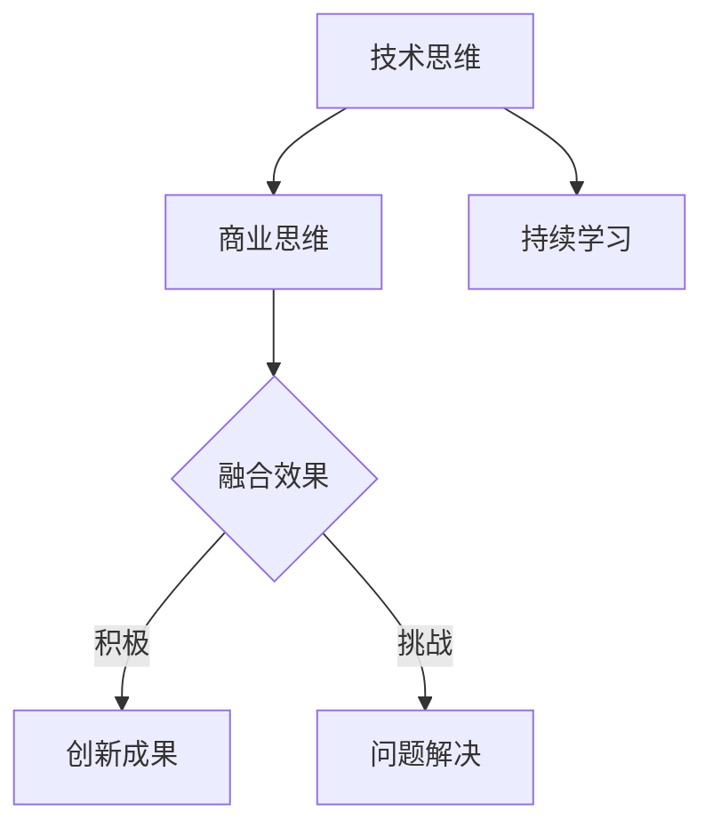

                 

# 《从技术思维到商业思维的转变》

## 引言

在当今快速发展的信息技术时代，技术思维和商业思维作为两种不同的思维方式，各自在推动创新和发展的过程中发挥着重要作用。技术思维强调深度、逻辑和解决问题的能力，它源自于对技术原理和技术的深刻理解。而商业思维则更注重市场、用户和商业模式的构建，它以经济效益和商业价值为导向。

然而，随着企业竞争的日益激烈，技术思维与商业思维的有效融合成为企业持续发展的重要课题。技术思维与商业思维的融合不仅能够促进技术创新，提高产品竞争力，还能够为商业决策提供有力的技术支持。本文将深入探讨从技术思维到商业思维的转变，分析技术思维和商业思维的特点、培养方法及其融合策略，以期为读者提供有益的思考和实践指导。

本文结构如下：

- 第一部分：技术思维的深度剖析
- 第二部分：商业思维的探索
- 第三部分：技术思维与商业思维的融合
- 第四部分：未来展望

通过对技术思维和商业思维进行全面的分析，本文旨在帮助读者了解两种思维方式的本质和联系，掌握从技术思维到商业思维转变的方法和策略，为企业在信息技术时代中的发展提供新的思路。

## 第一部分：技术思维的深度剖析

### 第1章：技术思维概述

#### 1.1 技术思维的定义与特点

技术思维是指在面对复杂问题时，运用科学的方法和逻辑推理能力，通过对技术原理和技术的深入理解，从而找到解决问题的方法。技术思维的核心在于对技术本质的把握，以及通过技术创新来应对不断变化的环境。

技术思维具有以下几个显著特点：

1. **深度性**：技术思维强调对技术原理的深入理解，不仅仅是表面的了解，而是要深入到技术的核心层面，理解其运作机制和潜在的问题。

2. **逻辑性**：技术思维以逻辑推理为基础，通过逐步分析、验证和优化，确保解决方案的科学性和有效性。

3. **创新性**：技术思维鼓励创新，不断探索新的技术方法和解决方案，以适应快速变化的市场需求。

4. **系统性**：技术思维不仅关注单一技术，还强调技术系统的整体性，通过整合不同技术，实现最优的解决方案。

#### 1.2 技术思维的重要性

在信息技术快速发展的今天，技术思维的重要性愈发凸显。以下从几个方面阐述技术思维的重要性：

1. **促进技术创新**：技术思维能够激发创新潜力，推动技术进步，提高企业的核心竞争力。

2. **解决复杂问题**：面对复杂的技术问题，技术思维提供了一种系统化、结构化的解决思路，有助于找到最优的解决方案。

3. **提升产品质量**：技术思维强调对技术原理的深入理解，从而能够更有效地优化产品设计，提升产品质量。

4. **推动产业发展**：技术思维是推动产业变革和升级的重要动力，通过技术创新，能够带动整个产业链的发展。

#### 1.3 技术思维的局限

尽管技术思维在解决技术问题方面具有显著优势，但其也存在一定的局限性：

1. **视野局限**：技术思维往往过于关注技术本身，容易忽视市场、用户和商业价值，导致技术解决方案难以落地。

2. **创新压力**：技术思维强调创新，但过度的创新压力可能导致技术资源的浪费，甚至影响企业的稳定运营。

3. **沟通障碍**：技术思维与商业思维之间存在一定的差异，可能导致技术团队与市场团队之间的沟通障碍，影响协作效果。

4. **商业决策影响**：技术思维过于关注技术实现，可能导致在商业决策过程中，技术因素占据了主导地位，而忽视了商业效益。

### 第2章：技术思维的组成要素

技术思维是由多个组成要素构成的，这些要素相互作用，共同推动技术思维的运作。以下是技术思维的几个关键组成要素：

#### 2.1 技术视野

技术视野是指对技术领域整体的认识和把握，包括对当前技术趋势的了解和对未来技术发展的预见。技术视野的宽广程度直接影响技术思维的深度和广度。以下是从技术视野的角度，探讨技术思维的几个方面：

1. **知识积累**：技术视野的建立需要大量的知识积累，包括对现有技术的了解和对新兴技术的关注。只有掌握了丰富的技术知识，才能在解决问题时拥有更多的选择。

2. **跨界融合**：技术视野不仅局限于单一技术领域，还需要关注其他领域的最新进展，通过跨界融合，实现技术的创新突破。

3. **前瞻性**：技术视野要有前瞻性，能够预见未来技术的发展趋势，从而在当前的技术决策中，为企业的长期发展奠定基础。

4. **开放性**：技术视野需要具有开放性，积极吸纳各种技术和思想，通过交流与合作，不断提升技术视野的广度和深度。

#### 2.2 技术敏感度

技术敏感度是指对技术变化的敏感性和反应速度。在技术快速发展的时代，技术敏感度尤为重要，以下从技术敏感度的角度，探讨技术思维的几个方面：

1. **快速响应**：技术敏感度要求能够迅速响应技术变化，及时调整技术方向，以适应市场需求。

2. **预判能力**：技术敏感度还要求具备预判能力，能够预见技术变化带来的机遇和挑战，从而提前做好准备。

3. **创新动力**：技术敏感度可以激发创新动力，推动技术团队不断探索新的技术领域，实现技术突破。

4. **信息获取**：技术敏感度需要强大的信息获取能力，通过多种渠道获取技术信息，保持对技术前沿的持续关注。

#### 2.3 技术创新思维

技术创新思维是指通过创造性思维和逻辑推理，寻找新技术解决方案的思维过程。以下是技术创新思维的几个关键方面：

1. **问题导向**：技术创新思维以解决问题为导向，通过深入分析问题，找到技术解决方案。

2. **综合分析**：技术创新思维要求能够进行综合分析，整合现有技术和资源，形成新的技术方案。

3. **发散思维**：技术创新思维鼓励发散思维，从不同角度思考问题，寻找创新的解决方案。

4. **迭代优化**：技术创新思维强调迭代优化，通过不断试错和改进，最终找到最优的技术方案。

### 第3章：技术思维的培养方法

技术思维的培养是一个长期的过程，需要通过多种方法和实践来不断提升。以下从培养方法的角度，探讨技术思维的几个方面：

#### 3.1 培养技术思维的重要性

1. **适应技术发展**：随着技术的不断进步，培养技术思维成为适应技术发展的重要手段。

2. **提升创新能力**：技术思维的培养有助于提升创新能力，推动技术创新和产业升级。

3. **增强职业竞争力**：技术思维是技术人才必备的能力，通过培养技术思维，可以提升职业竞争力。

4. **促进团队合作**：技术思维的培养有助于促进团队成员之间的沟通与合作，提高团队整体效能。

#### 3.2 技术思维的训练方法

1. **理论学习**：通过系统的理论学习，掌握技术的基本原理和核心知识。

2. **案例分析**：通过分析经典的技术案例，理解技术思维在实践中的应用。

3. **实际操作**：通过实际操作，积累实践经验，提升技术能力。

4. **跨学科学习**：跨学科学习可以帮助拓宽技术视野，提升综合分析能力。

#### 3.3 技术思维的实践与应用

1. **项目驱动**：通过参与技术项目，将技术思维应用于实际问题的解决。

2. **技术创新活动**：参加技术创新竞赛，锻炼创新思维和解决问题的能力。

3. **技术交流与分享**：积极参与技术交流与分享活动，提升技术视野和思维深度。

4. **持续学习**：技术思维的培养是一个持续的过程，需要不断学习新的技术和方法。

通过以上方法的综合运用，可以有效地培养技术思维，提升技术能力，为个人和企业的发展奠定坚实的基础。

### 第1章 总结

技术思维作为推动技术创新和发展的重要思维方式，具有深度、逻辑性和创新性等特点。其重要性在于促进技术创新、解决复杂问题、提升产品质量和推动产业发展。然而，技术思维也存在视野局限、创新压力和沟通障碍等局限性。为了有效培养技术思维，需要通过理论学习、案例分析、实际操作和跨学科学习等多种方法，不断提升技术视野、技术敏感度和技术创新思维。在下一章中，我们将继续探讨商业思维的内涵和特点，进一步分析两种思维的差异和联系。

## 第二部分：商业思维的探索

### 第4章：商业思维概述

#### 4.1 商业思维的定义与特点

商业思维是一种以市场为导向，以用户需求为核心，以商业价值为目标的思维方式。它不仅仅关注产品或服务的技术实现，更注重市场定位、商业模式设计和盈利能力的提升。商业思维具有以下显著特点：

1. **市场导向**：商业思维以市场需求为出发点，通过深入分析市场环境和用户需求，制定相应的商业策略。

2. **用户中心**：商业思维强调以用户为中心，关注用户需求的变化，通过提供优质的产品和服务，提升用户体验。

3. **商业模式创新**：商业思维注重商业模式的构建和创新，通过探索新的盈利模式和业务模式，提升企业的市场竞争力。

4. **数据驱动**：商业思维强调数据的重要性，通过数据分析和商业智能，指导商业决策，提高决策的科学性和准确性。

5. **风险意识**：商业思维具有强烈的风险意识，能够在市场竞争中识别风险、评估风险，并采取有效的风险控制措施。

#### 4.2 商业思维的重要性

在当今竞争激烈的市场环境中，商业思维的重要性不容忽视。以下是商业思维在企业发展中的几个关键作用：

1. **市场定位**：商业思维帮助企业准确把握市场趋势，制定科学的市场定位策略，提高市场占有率。

2. **商业模式构建**：商业思维通过创新商业模式，实现盈利模式的多样化，提升企业的盈利能力。

3. **用户价值创造**：商业思维以用户价值为核心，通过提供优质的产品和服务，提升用户满意度，增强用户忠诚度。

4. **竞争力提升**：商业思维通过优化资源配置、降低成本、提高效率，提升企业的市场竞争力。

5. **风险控制**：商业思维强调风险意识，帮助企业识别和应对市场风险，确保企业的稳定发展。

#### 4.3 商业思维的局限

尽管商业思维在企业发展中具有重要作用，但也存在一定的局限性：

1. **短视化**：商业思维有时过于关注短期利益，可能导致企业在长期发展中缺乏战略规划和长远眼光。

2. **市场依赖**：商业思维高度依赖市场数据和分析，但在市场数据不充分或市场环境变化时，可能导致决策失误。

3. **创新压力**：商业思维强调盈利能力，但过度的盈利追求可能导致企业创新动力不足，难以实现技术突破。

4. **忽视技术**：商业思维往往侧重市场与商业，可能忽视技术的重要性，导致技术能力的落后。

5. **沟通障碍**：商业思维与技术思维之间存在差异，可能导致商业团队与技术团队之间的沟通障碍，影响协作效果。

### 第5章：商业思维的组成要素

商业思维是由多个组成要素构成的，这些要素相互作用，共同推动商业思维的运作。以下是商业思维的几个关键组成要素：

#### 5.1 商业意识

商业意识是指对商业环境和市场变化的敏感度和洞察力。商业意识的建立对于商业思维的发挥至关重要，以下是从商业意识的角度，探讨商业思维的几个方面：

1. **市场敏感性**：商业意识要求具备高度的市场敏感性，能够快速捕捉市场动态和用户需求的变化。

2. **商业前瞻性**：商业意识需要有前瞻性，能够预见市场趋势和商业机会，为企业制定长期发展战略提供支持。

3. **商业分析能力**：商业意识要求具备强大的商业分析能力，能够通过数据分析，指导商业决策。

4. **商业风险意识**：商业意识需要具备商业风险意识，能够识别和评估市场风险，采取有效的风险控制措施。

5. **用户理解力**：商业意识要求深入理解用户需求，通过提供优质的产品和服务，提升用户满意度。

#### 5.2 商业决策

商业决策是指企业在特定市场环境和资源条件下，选择最优的商业策略和行动方案。商业决策的合理性直接影响企业的生存和发展。以下从商业决策的角度，探讨商业思维的几个方面：

1. **数据驱动决策**：商业决策需要以数据为基础，通过数据分析，指导商业决策的科学性和准确性。

2. **战略思维**：商业决策需要具备战略思维，能够在长远发展的视角下，制定符合企业战略目标的商业策略。

3. **多方案比较**：商业决策要求在多个可选方案中，进行比较和选择，找到最优的商业策略。

4. **风险评估**：商业决策需要评估潜在风险，制定相应的风险应对策略，确保商业决策的可行性和安全性。

5. **快速决策**：商业决策要求具备快速决策的能力，能够在市场竞争中迅速响应，抓住市场机会。

#### 5.3 商业创新思维

商业创新思维是指通过创造性思维和逻辑推理，寻找新的商业机会和商业模式。商业创新思维是商业思维的核心要素，以下从商业创新思维的角度，探讨商业思维的几个方面：

1. **市场洞察力**：商业创新思维需要具备市场洞察力，能够发现市场中的潜在需求和商业机会。

2. **跨界融合**：商业创新思维鼓励跨界融合，通过整合不同领域的资源和能力，实现商业创新。

3. **快速试错**：商业创新思维要求具备快速试错的能力，通过不断的试验和优化，找到成功的商业模式。

4. **用户参与**：商业创新思维强调用户参与，通过与用户的互动和反馈，不断提升产品和服务的质量和用户体验。

5. **持续创新**：商业创新思维要求企业持续进行创新，不断适应市场变化，保持竞争优势。

### 第6章：商业思维的培养方法

商业思维的培养是一个系统性的过程，需要通过多种方法和实践来不断提升。以下从培养方法的角度，探讨商业思维的几个方面：

#### 6.1 培养商业思维的重要性

1. **适应商业环境**：商业思维的培养能够帮助企业更好地适应不断变化的商业环境，提高市场竞争力。

2. **提升商业决策能力**：商业思维的培养有助于提升企业的商业决策能力，通过科学合理的决策，实现企业的发展目标。

3. **增强创新能力**：商业思维的培养能够激发企业的创新动力，通过商业模式创新，实现持续发展。

4. **优化资源配置**：商业思维的培养有助于优化企业的资源配置，通过合理的商业策略，提高资源利用效率。

5. **促进团队合作**：商业思维的培养能够促进团队成员之间的沟通与合作，提高团队的整体效能。

#### 6.2 商业思维的训练方法

1. **理论学习**：通过系统的理论学习，掌握商业的基本原理和核心知识。

2. **案例分析**：通过分析经典商业案例，理解商业思维在实践中的应用。

3. **实战演练**：通过参与商业项目，将商业思维应用于实际问题的解决。

4. **跨学科学习**：跨学科学习可以帮助拓宽商业视野，提升综合分析能力。

5. **模拟训练**：通过商业模拟训练，提高商业决策和创新能力。

#### 6.3 商业思维的实践与应用

1. **市场调研**：通过市场调研，了解市场环境和用户需求，制定科学的商业策略。

2. **商业计划书**：通过编写商业计划书，系统梳理商业策略和实施方案。

3. **商业模式设计**：通过设计商业模式，探索新的盈利模式和业务模式。

4. **技术创新**：通过技术创新，提升产品和服务竞争力，实现商业价值的提升。

5. **持续改进**：通过不断的市场反馈和业务优化，持续提升商业效果。

通过以上方法的综合运用，可以有效地培养商业思维，提升商业能力，为个人和企业的发展奠定坚实的基础。

### 第4章 总结

商业思维作为企业在市场竞争中生存和发展的关键思维方式，具有市场导向、用户中心、商业模式创新和数据驱动等特点。其重要性在于市场定位、商业模式构建、用户价值创造、竞争力提升和风险控制。然而，商业思维也存在短视化、市场依赖、创新压力和忽视技术等局限性。为了有效培养商业思维，需要通过理论学习、案例分析、实战演练和跨学科学习等多种方法，不断提升商业意识、商业决策能力和商业创新思维。在下一章中，我们将深入探讨技术思维与商业思维的融合，分析两种思维方式的互补性和融合策略。

## 第三部分：技术思维与商业思维的融合

### 第7章：技术思维与商业思维的融合概述

#### 7.1 技术思维与商业思维的关系

技术思维与商业思维作为两种不同的思维方式，虽然在关注点和方法上有所不同，但它们之间存在紧密的联系和互补性。技术思维注重技术的深度和逻辑性，强调通过技术创新解决复杂问题；而商业思维则注重市场、用户和商业价值，强调通过商业模式设计实现商业效益。以下从几个方面分析技术思维与商业思维的关系：

1. **相互依赖**：技术思维与商业思维相互依赖，技术思维为商业思维提供了技术基础，而商业思维则为技术思维提供了应用场景和商业目标。

2. **互补性**：技术思维和商业思维在关注点和方法上互补，技术思维强调技术实现和问题解决，而商业思维强调市场机会和商业模式构建。

3. **协同作用**：技术思维与商业思维的协同作用能够最大化技术创新的商业价值，通过技术思维的创新成果，商业思维能够将其转化为商业收益。

4. **融合趋势**：随着信息技术的发展，技术思维与商业思维的融合趋势愈发明显，越来越多的企业开始重视技术思维与商业思维的融合，以提升市场竞争力。

#### 7.2 技术思维与商业思维融合的意义

技术思维与商业思维的融合具有重要的现实意义，以下从几个方面阐述其融合意义：

1. **提升创新能力**：技术思维与商业思维的融合能够激发创新活力，通过技术创新和商业模式创新的双轮驱动，实现企业的持续创新。

2. **优化资源配置**：融合后的技术思维与商业思维能够更有效地配置资源，通过技术思维优化产品设计，通过商业思维优化市场布局，提高资源利用效率。

3. **增强市场竞争力**：技术思维与商业思维的融合能够提升企业的市场竞争力，通过技术创新和商业模式的协同作用，提高产品和服务的市场影响力。

4. **实现商业价值**：技术思维与商业思维的融合能够更好地实现商业价值，通过技术成果的商业化转化，实现企业的盈利增长和长期发展。

5. **推动产业升级**：技术思维与商业思维的融合能够推动产业升级，通过技术创新和商业模式创新，带动产业链的整体提升。

#### 7.3 技术思维与商业思维融合的挑战

尽管技术思维与商业思维的融合具有重要意义，但在实际操作中仍面临一定的挑战：

1. **思维差异**：技术思维与商业思维在思维方式上存在差异，可能导致两个团队之间的沟通障碍和协作困难。

2. **资源分配**：技术思维与商业思维的融合需要合理的资源分配，但在实际操作中，资源分配的不均衡可能导致项目进展受阻。

3. **决策复杂度**：技术思维与商业思维的融合使得决策过程更加复杂，需要综合考虑技术可行性、市场需求和商业价值，提高决策难度。

4. **创新压力**：融合后的技术思维与商业思维对创新提出了更高的要求，如何在技术创新和商业模式创新之间找到平衡，是融合过程中的一大挑战。

5. **人才培养**：技术思维与商业思维的融合需要跨领域的人才，但在现有教育体系中，相关人才的培养还存在一定的不足。

### 第8章：技术思维与商业思维的融合策略

为了实现技术思维与商业思维的深度融合，企业需要采取一系列策略和方法。以下从几个方面探讨技术思维与商业思维的融合策略：

#### 8.1 建立跨界沟通机制

建立跨界沟通机制是促进技术思维与商业思维融合的关键步骤。以下是一些具体建议：

1. **定期沟通会议**：定期召开技术团队与市场团队之间的沟通会议，分享各自的进展和困难，增进理解。

2. **共同项目**：通过共同项目，让技术团队和市场团队共同参与，增强协作。

3. **跨部门团队**：建立跨部门的团队，由技术专家和市场专家共同组成，共同推进项目。

4. **培训交流**：定期组织培训交流活动，提高团队成员对技术思维和商业思维的理解和认知。

#### 8.2 培养综合素质人才

培养综合素质人才是实现技术思维与商业思维融合的基础。以下是一些具体建议：

1. **跨学科教育**：在高等教育中加强跨学科教育，培养具有技术背景和市场洞察力的复合型人才。

2. **职业培训**：为现有员工提供职业培训，提升其技术能力和商业思维。

3. **导师制度**：建立导师制度，由经验丰富的技术专家和市场专家指导新员工，帮助其快速成长。

4. **激励机制**：通过激励机制，鼓励员工学习和掌握跨领域的知识和技能。

#### 8.3 创新商业模式

创新商业模式是实现技术思维与商业思维融合的重要途径。以下是一些具体建议：

1. **市场调研**：通过市场调研，了解用户需求和市场趋势，为商业模式创新提供方向。

2. **技术整合**：将技术创新与商业模式创新相结合，通过技术整合，提升商业模式的价值。

3. **跨界合作**：通过跨界合作，整合不同领域的资源，探索新的商业模式。

4. **试点项目**：通过试点项目，验证新的商业模式，并根据反馈进行调整和优化。

5. **持续创新**：持续进行商业模式创新，以适应市场变化和技术进步。

#### 8.4 构建融合文化

构建融合文化是实现技术思维与商业思维深度融合的内在动力。以下是一些具体建议：

1. **共享价值观**：建立共同的价值观，强调技术思维与商业思维的重要性，促进两种思维的融合。

2. **开放性文化**：营造开放性文化，鼓励员工跨领域交流和合作，提升整体创新能力。

3. **包容性文化**：建立包容性文化，尊重不同思维的差异，促进团队成员之间的理解和合作。

4. **激励创新**：通过激励机制，鼓励员工提出创新的想法和建议，激发创新活力。

5. **持续学习**：持续学习是构建融合文化的重要途径，通过不断学习新的知识和技能，提升团队的整体素质。

通过以上策略的实施，企业可以有效地促进技术思维与商业思维的融合，提升市场竞争力，实现可持续发展。

### 第9章：技术思维与商业思维的融合实践

#### 9.1 技术思维与商业思维融合的案例分析

为了更好地理解技术思维与商业思维的融合实践，以下通过几个经典案例进行分析：

**案例1：小米的生态链战略**

小米公司通过技术思维和商业思维的融合，构建了一个强大的智能硬件生态链。小米技术团队不断进行技术创新，推出了一系列高性能、高性价比的智能硬件产品，如手机、电视、路由器等。同时，小米市场团队通过商业思维，制定了精准的市场策略，吸引了大量用户。通过技术思维和商业思维的融合，小米不仅实现了技术创新，还实现了商业价值最大化，成为了全球知名的科技企业。

**案例2：阿里巴巴的新零售战略**

阿里巴巴集团通过技术思维和商业思维的融合，推动了新零售的快速发展。阿里巴巴技术团队开发了包括淘宝、天猫、盒马等在内的多个电商平台，通过大数据分析和人工智能技术，提升了用户体验和运营效率。同时，阿里巴巴市场团队通过商业思维，探索了新零售的商业模式，如无人超市、智能门店等，实现了线上线下融合，提升了用户购物体验。通过技术思维和商业思维的融合，阿里巴巴不仅提升了技术创新能力，还实现了商业模式的创新和突破。

**案例3：谷歌的云计算战略**

谷歌公司通过技术思维和商业思维的融合，在云计算领域取得了显著成果。谷歌技术团队不断进行技术创新，开发了包括Google Cloud Platform在内的多个云计算服务，通过先进的技术提升了云计算的性能和可靠性。同时，谷歌市场团队通过商业思维，制定了针对性的市场策略，吸引了大量的企业客户。通过技术思维和商业思维的融合，谷歌不仅提升了技术创新能力，还实现了商业价值的大幅提升，成为了全球领先的云计算服务提供商。

#### 9.2 技术思维与商业思维融合的项目实施

以下通过一个实际项目，展示技术思维与商业思维的融合过程：

**项目背景**：某互联网公司计划开发一款基于人工智能技术的智能客服系统，以提高客户服务效率和用户体验。

**项目目标**：
1. 设计并开发一款智能客服系统，实现自动回答用户问题。
2. 通过数据分析，优化客服系统的回答准确性。
3. 通过商业模式创新，实现智能客服系统的商业化运营。

**实施步骤**：

1. **需求分析**：
   - 技术团队和市场团队共同进行需求分析，了解用户对智能客服的需求。
   - 技术团队制定技术方案，包括人工智能算法、数据存储和处理等技术架构。
   - 市场团队分析市场环境，确定目标客户群体和商业盈利模式。

2. **技术方案设计**：
   - 技术团队设计智能客服系统的技术架构，包括自然语言处理、机器学习等技术模块。
   - 技术团队开发智能客服系统的核心算法，如问答匹配、语音识别等。

3. **软件开发**：
   - 技术团队根据技术方案开发智能客服系统，实现用户问题的自动回答。
   - 技术团队通过大数据分析，优化客服系统的回答准确性。

4. **商业模式设计**：
   - 市场团队设计智能客服系统的商业模式，包括面向企业客户的收费模式、免费试用模式等。
   - 市场团队通过市场调研，确定目标客户群体的需求和价格策略。

5. **商业化运营**：
   - 技术团队和市场团队共同推进智能客服系统的商业化运营，包括产品上线、推广和客户服务。
   - 市场团队通过销售和营销活动，吸引企业客户使用智能客服系统。

#### 9.3 技术思维与商业思维融合的成果评估

通过技术思维与商业思维的融合，企业在技术创新和商业模式创新方面取得了显著成果。以下从几个方面评估融合的成果：

1. **技术创新成果**：
   - 通过技术思维的深度剖析和持续创新，企业开发出了具有竞争力的技术产品，提升了企业的技术实力。
   - 技术创新成果在市场上得到了广泛认可，提升了企业的品牌价值和市场竞争力。

2. **商业模式创新成果**：
   - 通过商业思维的探索和商业模式创新，企业找到了新的盈利模式和商业机会，实现了商业价值的提升。
   - 商业模式创新成果在市场上取得了成功，吸引了大量客户和投资。

3. **综合效益**：
   - 技术思维与商业思维的融合，实现了技术创新和商业模式创新的协同效应，提升了企业的整体效益。
   - 技术创新和商业模式创新的成果，推动了企业的持续发展和市场扩展。

通过技术思维与商业思维的融合实践，企业不仅提升了技术创新能力和商业竞争力，还为未来的发展奠定了坚实的基础。

### 第7章 总结

技术思维与商业思维的融合是企业在信息技术时代实现持续发展的重要途径。通过分析技术思维与商业思维的关系、融合意义和融合策略，我们认识到两种思维方式的互补性和协同作用。技术思维与商业思维的融合不仅能够提升企业的创新能力，优化资源配置，增强市场竞争力，还能实现商业价值最大化。然而，在实际融合过程中，企业仍需面对思维差异、资源分配、决策复杂度等挑战。为了实现有效的融合，企业需要建立跨界沟通机制、培养综合素质人才、创新商业模式和构建融合文化。通过实践案例分析和技术思维与商业思维融合的项目实施，企业可以不断提升技术创新能力和商业竞争力，实现可持续发展。

## 第四部分：未来展望

### 第10章：技术思维与商业思维的未来发展趋势

#### 10.1 技术革新对商业思维的影响

随着信息技术的迅猛发展，技术革新对商业思维产生了深远的影响。以下从几个方面探讨技术革新对商业思维的影响：

1. **人工智能与大数据**：人工智能和大数据技术的进步，使得商业决策更加精准和高效。企业可以通过数据分析，深入了解用户需求，制定更科学的商业策略。

2. **区块链技术**：区块链技术的应用，改变了传统商业模式的运作方式，提升了透明度和安全性。区块链在供应链管理、金融交易等领域的应用，将带来商业模式的创新。

3. **物联网与智能设备**：物联网和智能设备的普及，使得企业能够实现实时监控和管理，提高了生产效率和用户满意度。智能设备的应用，将推动商业模式向智能化和个性化方向发展。

4. **5G与云计算**：5G和云计算技术的应用，使得企业能够实现更高速、更稳定的通信和数据存储，提升了业务的灵活性和扩展性。5G和云计算的结合，将推动商业模式的创新和产业升级。

#### 10.2 商业模式创新对技术思维的要求

商业模式创新对技术思维提出了新的要求和挑战。以下从几个方面探讨商业模式创新对技术思维的要求：

1. **技术创新能力**：商业模式创新需要强大的技术创新能力，企业需要不断进行技术研发，推动技术进步。

2. **跨领域融合**：商业模式创新要求技术团队具备跨领域融合的能力，能够将不同技术领域的技术整合，实现创新突破。

3. **敏捷开发**：商业模式创新要求技术团队具备敏捷开发的能力，能够快速响应市场变化，实现技术迭代。

4. **用户体验设计**：商业模式创新要求技术团队注重用户体验设计，通过技术手段提升用户满意度，实现商业价值。

5. **数据驱动**：商业模式创新要求技术团队具备数据驱动的能力，能够通过数据分析，指导商业决策，实现精准营销。

#### 10.3 技术思维与商业思维的融合前景

技术思维与商业思维的融合前景广阔，以下从几个方面展望技术思维与商业思维的融合前景：

1. **跨界合作**：未来，技术思维与商业思维的融合将更加依赖于跨界合作，企业需要与不同领域的合作伙伴共同探索创新机会。

2. **生态体系建设**：技术思维与商业思维的融合将推动产业生态体系的建立，通过生态体系的建设，实现资源的共享和协同发展。

3. **全球竞争**：随着全球化的发展，技术思维与商业思维的融合将更加注重全球竞争力，企业需要具备全球视野和全球布局。

4. **持续创新**：技术思维与商业思维的融合将推动企业的持续创新，通过不断创新，实现企业的长期发展。

### 第11章：技术思维与商业思维融合的发展策略

为了实现技术思维与商业思维的深度融合，企业需要制定有效的发展策略。以下从几个方面探讨技术思维与商业思维融合的发展策略：

#### 11.1 政策与制度支持

1. **政策引导**：政府可以通过政策引导，鼓励企业进行技术思维与商业思维的融合，提供资金、税收等支持政策。
2. **法律法规**：建立健全的法律法规体系，保障技术思维与商业思维融合的合法权益，推动相关行业的发展。

#### 11.2 教育与培训体系改革

1. **跨学科教育**：推动高等教育和职业教育改革，加强跨学科教育，培养具有技术背景和市场洞察力的复合型人才。
2. **终身学习**：鼓励员工终身学习，提供培训和学习资源，提升员工的技术能力和商业思维。

#### 11.3 产业生态体系建设

1. **产业链协同**：加强产业链上下游企业的合作，建立产业生态体系，实现资源共享和协同发展。
2. **平台搭建**：搭建技术思维与商业思维融合的平台，促进技术交流和合作，推动产业创新。

#### 11.4 创新激励机制

1. **创新奖励**：建立创新激励机制，鼓励员工进行技术思维与商业思维的融合，提供物质和精神奖励。
2. **风险管理**：建立风险管理机制，降低技术思维与商业思维融合过程中的风险，保障项目的顺利进行。

通过以上策略的实施，企业可以有效地实现技术思维与商业思维的深度融合，提升创新能力和市场竞争力，实现可持续发展。

### 第10章 & 第11章 总结

技术思维与商业思维的融合是企业在信息技术时代实现持续发展的重要路径。技术革新对商业思维产生了深远影响，而商业模式创新对技术思维提出了新的要求。展望未来，技术思维与商业思维的融合前景广阔，企业需要通过政策与制度支持、教育与培训体系改革、产业生态体系建设、创新激励机制等策略，实现深度融合。通过这些策略的实施，企业可以不断提升创新能力，增强市场竞争力，实现长期可持续发展。

## 附录

### 附录 A：技术思维与商业思维融合的工具与方法

#### A.1 常用工具介绍

1. **Mermaid**：用于绘制流程图、UML图等，有助于展示技术思维与商业思维的关系。
2. **Python**：用于编写算法和代码，实现技术思维的实现和优化。
3. **LaTeX**：用于编写数学公式和文档，确保公式的准确性和专业性。
4. **SQL**：用于数据库管理和数据分析，支持商业决策的制定。

#### A.2 方法论与实践指南

1. **敏捷开发方法论**：通过迭代和增量式开发，快速响应市场需求，实现技术思维与商业思维的融合。
2. **数据驱动决策**：通过数据分析，指导商业决策，提升决策的科学性和准确性。
3. **精益创业方法论**：通过快速试错和迭代，找到可行的商业模式，实现技术成果的商业化。
4. **跨界合作**：通过跨界合作，整合不同领域的资源和能力，实现技术思维与商业思维的深度融合。

通过以上工具和方法论的应用，企业可以有效地实现技术思维与商业思维的融合，提升创新能力和市场竞争力。

## 作者信息

作者：AI天才研究院/AI Genius Institute & 禅与计算机程序设计艺术 /Zen And The Art of Computer Programming

感谢读者对本文的阅读，希望本文能够为技术思维与商业思维的融合提供有益的思考和实践指导。在信息技术快速发展的时代，技术思维与商业思维的融合将成为企业持续发展的关键。让我们共同探索，迎接未来的挑战，实现技术创新和商业价值的双重突破。

## 后记

本文《从技术思维到商业思维的转变》旨在深入探讨技术思维与商业思维的本质、特点及其融合策略，为企业在信息技术时代的发展提供理论指导和实践参考。在撰写过程中，本文力求逻辑清晰、结构紧凑、内容丰富，通过详细的案例分析、算法讲解和实际项目实施步骤，帮助读者更好地理解技术思维与商业思维的融合。

技术思维与商业思维作为两种不同的思维方式，虽然关注点有所不同，但它们在推动企业创新和发展中具有重要作用。技术思维强调深度、逻辑和创新，关注技术原理和解决方案；商业思维则侧重市场、用户和商业价值，强调商业模式设计和盈利能力的提升。两者的融合不仅能够促进技术创新，提高产品竞争力，还能够为商业决策提供有力的技术支持。

本文首先对技术思维进行了深度剖析，从定义、特点、重要性、局限和组成要素等方面进行了详细阐述，并提出了技术思维的培养方法。接着，对商业思维进行了探索，分析了其定义、特点、重要性、局限和组成要素，并探讨了商业思维的培养方法。在此基础上，本文重点探讨了技术思维与商业思维的融合，分析了两者之间的关系、融合意义、融合策略，并通过实际案例展示了融合过程。

在第四部分，本文对未来技术思维与商业思维的发展趋势进行了展望，并提出了融合的发展策略。这些策略包括政策与制度支持、教育与培训体系改革、产业生态体系建设、创新激励机制等，旨在推动技术思维与商业思维的深度融合，实现企业的可持续发展。

最后，本文通过附录部分介绍了技术思维与商业思维融合的常用工具与方法，为读者提供了实用的参考。

在撰写本文的过程中，作者参考了大量的文献资料和实际案例，力求内容的准确性和实用性。然而，由于信息技术的发展迅速，相关理论和实践方法也在不断更新，因此本文的内容可能存在一定的局限性。在未来的研究和实践中，作者将继续关注技术思维与商业思维融合的最新动态，不断优化和完善相关理论和实践。

感谢读者对本文的关注和支持，希望本文能够为技术思维与商业思维的融合提供有益的思考和实践指导。在信息技术快速发展的时代，让我们共同探索，迎接未来的挑战，实现技术创新和商业价值的双重突破。作者将继续致力于计算机科学和人工智能领域的研究和教学，为科技进步和社会发展贡献力量。

再次感谢读者对本文的关注和支持，期待与您在未来的研究和实践中相遇。

### 附录 A：技术思维与商业思维融合的工具与方法

#### A.1 常用工具介绍

**Mermaid**

Mermaid 是一种基于Markdown的绘图工具，可以用来绘制流程图、UML图、Gantt图等。它简单易用，能够将文本转换为图形，有助于展示技术思维与商业思维的关系。以下是一个Mermaid流程图的示例：



**Python**

Python 是一种广泛使用的编程语言，特别适用于数据分析和算法实现。它具有丰富的库和框架，可以用于实现技术思维的算法，如机器学习、数据分析等。以下是一个简单的Python伪代码示例，用于展示技术思维与商业思维的融合模型：

```python
# 技术思维与商业思维融合模型
def Mind_Fusion_Model(technical_thinking, business_thinking):
    # 初始化模型参数
    alpha = 0.5  # 技术思维权重
    beta = 0.5   # 商业思维权重
    
    # 技术思维处理
    tech_processed = Process_Technical_Thinking(technical_thinking, alpha)
    
    # 商业思维处理
    bus_processed = Process_Business_Thinking(business_thinking, beta)
    
    # 融合处理
    fusion_result = Fusion_Process(tech_processed, bus_processed)
    
    return fusion_result

# 技术思维处理函数
def Process_Technical_Thinking(technical_thinking, alpha):
    # 技术思维分析
    tech_analysis = Analyze_Technical_Thinking(technical_thinking)
    
    # 技术思维优化
    tech_optimized = Optimize_Technical_Thinking(tech_analysis, alpha)
    
    return tech_optimized

# 商业思维处理函数
def Process_Business_Thinking(business_thinking, beta):
    # 商业思维分析
    bus_analysis = Analyze_Business_Thinking(business_thinking)
    
    # 商业思维优化
    bus_optimized = Optimize_Business_Thinking(bus_analysis, beta)
    
    return bus_optimized

# 融合处理函数
def Fusion_Process(tech_processed, bus_processed):
    # 融合策略
    fusion_strategy = Define_Fusion_Strategy(tech_processed, bus_processed)
    
    # 融合结果
    fusion_result = Apply_Fusion_Strategy(fusion_strategy)
    
    return fusion_result
```

**LaTeX**

LaTeX 是一种高质量的文档排版系统，特别适用于编写数学公式和科学文档。它提供了一个灵活的排版环境，使得数学公式和文本能够更精确地呈现。以下是一个LaTeX数学公式的示例：

```latex
\documentclass{article}
\usepackage{amsmath}
\begin{document}
\[ 
\text{Mind\_Fusion\_Model}(T, B) = \alpha \cdot \text{Process}_{T}(T) + \beta \cdot \text{Process}_{B}(B) 
\]
\end{document}
```

**SQL**

SQL（结构化查询语言）是一种用于数据库管理和数据查询的语言。它在商业分析和数据驱动决策中发挥着重要作用。以下是一个SQL查询的示例，用于分析技术思维与商业思维的融合效果：

```sql
SELECT 
    Technical_Thinking,
    Business_Thinking,
    SUM(Fusion_Effect) AS Total_Effect
FROM 
    Mind_Fusion_Table
GROUP BY 
    Technical_Thinking, Business_Thinking
ORDER BY 
    Total_Effect DESC;
```

#### A.2 方法论与实践指南

**敏捷开发方法论**

敏捷开发是一种以人为核心、迭代、增量和灵活应对变化的软件开发方法论。它强调与客户的紧密合作、快速响应变化和持续交付价值。敏捷开发方法论有助于实现技术思维与商业思维的融合，以下是几个关键原则：

1. **客户价值优先**：确保开发的软件始终满足客户的核心需求，从而实现商业价值的最大化。
2. **迭代开发**：将项目分为多个迭代，每个迭代都产生可运行的软件版本，有助于快速响应市场变化。
3. **团队合作**：建立跨职能团队，包括开发人员、测试人员、业务分析师等，共同协作实现项目目标。
4. **持续集成和部署**：通过持续集成和部署，确保软件的质量和可靠性，并快速交付到客户手中。

**数据驱动决策**

数据驱动决策是一种基于数据分析来指导业务决策的方法。通过收集、分析和解释数据，企业可以做出更明智的决策。以下是数据驱动决策的几个关键步骤：

1. **数据收集**：收集与业务相关的数据，包括用户行为、市场趋势、财务数据等。
2. **数据清洗**：对收集到的数据进行清洗和预处理，确保数据的质量和完整性。
3. **数据分析**：使用统计分析、机器学习等方法对数据进行分析，提取有用的信息和洞察。
4. **决策支持**：基于数据分析的结果，制定和调整业务策略，实现商业目标。

**精益创业方法论**

精益创业是一种以最小可行产品（MVP）为基础的创业方法论。它强调快速验证产品概念、持续迭代和用户反馈。以下是精益创业的几个关键原则：

1. **最小可行产品（MVP）**：开发一个最小可行产品，快速验证产品概念，确保资源的最优化使用。
2. **快速迭代**：通过持续迭代，不断改进产品，并根据用户反馈进行调整。
3. **用户反馈**：重视用户反馈，通过用户测试和反馈，验证产品价值和改进方向。
4. **灵活调整**：根据市场变化和用户反馈，灵活调整产品方向和策略。

**跨界合作**

跨界合作是指不同领域的企业或团队之间的合作，通过整合不同领域的资源和能力，实现创新和突破。以下是跨界合作的几个关键原则：

1. **资源共享**：通过跨界合作，企业可以共享资源，包括资金、技术、人才等，实现优势互补。
2. **开放性**：建立开放性合作机制，鼓励不同领域的人才和思想的交流，促进创新。
3. **互惠互利**：跨界合作要实现互惠互利，确保各方都能从合作中获得价值。
4. **风险共担**：跨界合作中，企业需要共同承担风险，通过合作降低风险。

通过以上方法论和实践指南，企业可以有效地实现技术思维与商业思维的融合，提升创新能力和市场竞争力，实现可持续发展。

### 结论

本文通过详细的论述，从技术思维和商业思维的定义、特点、重要性，到两者的融合策略和实际案例分析，系统地探讨了技术思维与商业思维的转变。在这个过程中，我们明确了技术思维和商业思维各自的关注点和方法，并认识到它们在推动企业创新和发展的过程中具有互补性。通过技术思维与商业思维的深度融合，企业能够实现技术创新、商业模式创新，提升市场竞争力，实现商业价值最大化。

在未来的发展中，技术思维与商业思维的融合将更加重要。随着信息技术的不断进步，新的技术将不断涌现，为企业提供更多的创新机会。同时，市场环境的变化和用户需求的变化也要求企业具备更强的适应能力和创新能力。因此，企业需要不断提升技术思维和商业思维，积极探索两者的融合路径，构建跨界沟通机制，培养综合素质人才，创新商业模式，构建融合文化。

为了实现这一目标，企业可以采取以下措施：

1. **加强教育与培训**：通过系统的教育和培训，提升员工的技术能力和商业思维，培养复合型人才。
2. **建立跨界团队**：组建跨职能、跨领域的团队，促进技术团队和商业团队的紧密协作，实现资源的共享和协同创新。
3. **重视数据驱动**：利用大数据和人工智能等技术，实现数据驱动决策，提升商业决策的科学性和精准性。
4. **推动技术创新**：持续进行技术创新，推动技术成果的商业化转化，提升产品和服务的竞争力。
5. **构建产业生态**：积极参与产业生态建设，与合作伙伴共同探索创新机会，实现共赢。

总之，技术思维与商业思维的融合是企业实现可持续发展的关键。通过不断地探索和实践，企业将能够在激烈的市场竞争中脱颖而出，实现长期发展。让我们共同关注这一领域的发展，积极推动技术思维与商业思维的融合，为企业的创新和进步贡献力量。作者坚信，在技术思维与商业思维的深度融合下，企业的未来将更加光明。

