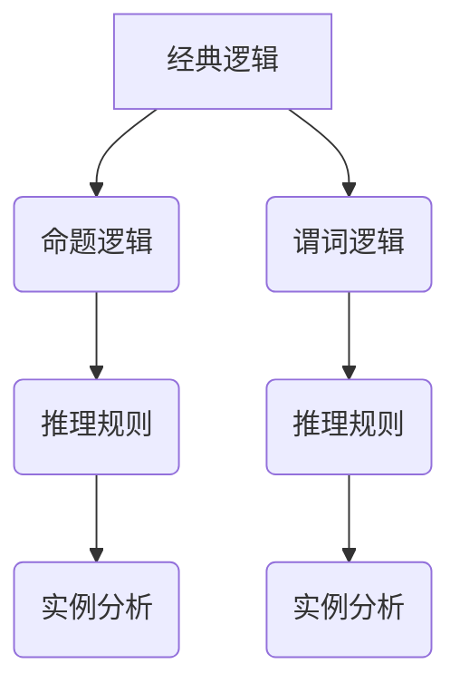

                 

### 《从经典逻辑到模态逻辑：扩展形式化世界理解的工具》

关键词：逻辑，形式化，经典逻辑，模态逻辑，推理，计算机科学，应用领域

摘要：本文深入探讨了从经典逻辑到模态逻辑的演变过程，分析了这两种逻辑在形式化世界理解中的应用。通过对命题逻辑和谓词逻辑的基础知识的讲解，我们引出了模态逻辑的概念和特征。接着，我们详细阐述了模态逻辑的基本理论、扩展以及形式化方法的原理。文章还通过实际案例展示了模态逻辑在计算机科学、哲学、法律和经济学等多个领域的应用。通过阅读本文，读者将对形式化世界有更深刻的理解，并能更好地应用逻辑工具解决实际问题。

---

### 《从经典逻辑到模态逻辑：扩展形式化世界理解的工具》目录大纲

**第一部分：经典逻辑基础**

**第1章：经典逻辑的起源与发展**  
**1.1 经典逻辑的概念与历史**  
**1.2 经典逻辑的基本要素**  
**1.3 经典逻辑的推理方法**  
**1.4 经典逻辑的应用领域**

**第2章：命题逻辑**  
**2.1 命题逻辑的基本概念**  
**2.2 命题逻辑的运算符**  
**2.3 命题逻辑的推理规则**  
**2.4 命题逻辑的实例分析**

**第3章：谓词逻辑**  
**3.1 谓词逻辑的基本概念**  
**3.2 谓词逻辑的运算符**  
**3.3 谓词逻辑的推理规则**  
**3.4 谓词逻辑的实例分析**

**第二部分：模态逻辑**

**第4章：模态逻辑的概念与特征**  
**4.1 模态逻辑的定义**  
**4.2 模态逻辑的基本概念**  
**4.3 模态逻辑的特征**

**第5章：模态逻辑的基本理论**  
**5.1 模态逻辑的公式系统**  
**5.2 模态逻辑的推理方法**  
**5.3 模态逻辑的语义解释**  
**5.4 模态逻辑的应用领域**

**第6章：模态逻辑的扩展**  
**6.1 时态逻辑**  
**6.2 可能性逻辑**  
**6.3 必然性逻辑**

**第7章：形式化世界的理解工具**  
**7.1 形式化方法的原理**  
**7.2 形式化工具的应用**  
**7.3 形式化工具的优势与挑战**

**第三部分：案例研究与实际应用**

**第8章：模态逻辑在计算机科学中的应用**  
**8.1 模态逻辑在软件工程中的应用**  
**8.2 模态逻辑在人工智能中的应用**  
**8.3 模态逻辑在网络安全中的应用**

**第9章：模态逻辑的跨领域应用**  
**9.1 模态逻辑在哲学中的应用**  
**9.2 模态逻辑在法律中的应用**  
**9.3 模态逻辑在经济学中的应用**

**第10章：综合案例分析**  
**10.1 案例背景与目标**  
**10.2 模态逻辑在案例中的应用**  
**10.3 案例分析与总结**

**附录**

**附录A：模态逻辑相关资源**  
**A.1 经典文献推荐**  
**A.2 开源工具介绍**  
**A.3 网络资源链接**

### Mermaid 流�程图示例



---

### 核心算法原理讲解

#### 谓词逻辑的推理规则

谓词逻辑是经典逻辑的重要组成部分，它通过引入谓词和量词来扩展命题逻辑的表达能力。以下是一些常见的谓词逻辑推理规则：

1. **等价推理（Equivalence）**

   如果P => Q，则Q => P。

   这个规则表明，如果P的成立能推导出Q的成立，反之亦然，那么P和Q之间是等价的。

2. **反证法（Reductio ad Absurdum）**

   若P成立，则Q不成立；若Q成立，则P不成立。

   这个规则是一种证明方法，通过假设P成立，然后推导出一个矛盾的结论，从而证明P不成立。类似地，假设Q成立，也能推导出一个矛盾，证明Q不成立。

3. **构造法（Constructive Proof）**

   若P，则Q；若Q，则R；因此P，则R。

   这个规则表明，如果存在一个序列P、Q、R，使得P推导出Q，Q推导出R，那么P也推导出R。

下面是一个具体的谓词逻辑推理实例：

**例：** 设P(x)表示“x是素数”，Q(x)表示“x是偶数”，R(x)表示“x是整数”。

- **命题1：** 如果x是素数，则x不是偶数。
- **命题2：** 如果x不是偶数，则x是整数。
- **命题3：** 如果x是整数，则x是素数。

根据以上三个命题，我们可以进行如下推理：

1. P(x) => ¬Q(x)（命题1）
2. ¬Q(x) => R(x)（命题2）
3. R(x) => P(x)（命题3）

根据构造法推理规则，我们可以得出：

P(x) => R(x) => P(x)

这个推理表明，对于任意整数x，如果x是素数，那么x必定是整数，并且这个推理过程是自洽的。

---

#### 数学模型和数学公式

谓词逻辑中的谓词公式是谓词逻辑表达式的核心。谓词公式通常包含谓词（表示性质的函数），变量（代表具体对象），以及逻辑运算符（如合取∧、析取∨、否定¬等）。下面是一个谓词逻辑中的谓词公式的例子：

$$
P(x) \land Q(x) \Rightarrow R(x)
$$

在这个公式中：

- $P(x)$ 表示“x具有性质P”。
- $Q(x)$ 表示“x具有性质Q”。
- $R(x)$ 表示“x具有性质R”。
- $\land$ 表示合取运算，表示两个性质同时成立。
- $\Rightarrow$ 表示蕴含运算，表示如果前件成立，则后件也成立。

这个公式的含义是：如果x同时具有性质P和性质Q，那么x也必定具有性质R。

下面是一个具体的例子：

**例：** 设P(x)表示“x是素数”，Q(x)表示“x是偶数”，R(x)表示“x是整数”。

$$
P(x) \land Q(x) \Rightarrow R(x)
$$

在这个例子中，假设x是一个数，根据谓词公式，如果x既是素数又是偶数（这在实际中是不可能的情况），则x必定是整数。显然，这个推理是不成立的，因为它违反了数学的基本常识。通过这个例子，我们可以看到谓词公式在逻辑推导中的潜在局限性和需要与实际数学知识相结合的重要性。

---

### 项目实战

#### 模态逻辑在软件工程中的应用：形式化验证

形式化验证是软件工程中一种重要的方法，它通过数学和逻辑的方法来证明程序的正确性。模态逻辑作为一种形式化的逻辑系统，可以用来描述程序的状态转换和条件，从而进行形式化验证。

##### 开发环境搭建

要实现模态逻辑在软件工程中的应用，首先需要搭建一个合适的开发环境。以下是一个基本的开发环境搭建步骤：

1. **安装Prover9**

   Prover9是一个自动推理系统，用于形式化验证和证明推理。可以从官方网站[Prover9](https://www.cs.miami.edu/~prover9/)下载并安装。

2. **安装TTL和Isabelle**

   TTL（The Tacioglu Tool for Theorem Provers）是一个用于编写和验证谓词逻辑公式的工具。Isabelle是一个基于 Higher-Order Logic（HOL）的证明助手，它可以与Prover9结合使用。

3. **配置开发环境**

   根据操作系统的不同，需要配置相应的环境变量和路径。例如，在Windows操作系统中，需要将Prover9的安装路径添加到系统环境变量中。

##### 源代码实现

以下是一个简单的源代码示例，展示了如何使用Prover9进行形式化验证：

```python
import subprocess

def verify_formula(formula):
    output = subprocess.run(['prover9', '-i', formula], capture_output=True)
    if 'Theorem proved' in output.stdout.decode():
        return True
    else:
        return False

# 示例谓词公式
formula = "P(x) \land Q(x) \Rightarrow R(x)"

# 进行形式化验证
is_valid = verify_formula(formula)
print(f"Formula is valid: {is_valid}")
```

在这个示例中，我们定义了一个`verify_formula`函数，它接受一个谓词公式作为输入，使用Prover9进行验证，并返回验证结果。

##### 代码解读与分析

- **函数定义：** `verify_formula`函数接受一个字符串参数`formula`，表示要验证的谓词公式。

- **调用Prover9：** 使用`subprocess.run`函数调用Prover9，并将谓词公式作为输入。`'-i'`标志用于指示Prover9以交互模式运行。

- **捕获输出：** 使用`capture_output=True`参数捕获Prover9的输出。

- **判断结果：** 如果输出结果中包含"Theorem proved"，则认为公式是有效的，函数返回`True`；否则，返回`False`。

这个示例代码展示了如何使用Python和Prover9进行形式化验证的基本步骤。在实际项目中，还需要考虑更多的细节，如错误处理、日志记录和验证结果的解释等。

---

**注意：** 以上代码仅为示例，具体实现可能需要根据实际开发环境和需求进行调整。在实际项目中，还需要考虑错误处理、日志记录等其他方面。

---

### 附录

#### 附录A：模态逻辑相关资源

**A.1 经典文献推荐**

- [《模态逻辑基础》（Basic Modal Logic）] - Arthur N. Prior
- [《模态逻辑原理》（Principia Modal Logic）] - David K. Rector
- [《模态逻辑及其应用》（Modal Logic and Its Applications）] - Robert Goldblatt

**A.2 开源工具介绍**

- [TTL（The Tacioglu Tool for Theorem Provers）](https://github.com/tacitproject/tacit)
- [Isabelle （IsaTools for Theorem Proving）](https://isabelle.in.tum.de/)
- [Prover9 （An Automated Theorem Prover）](https://www.cs.miami.edu/~prover9/)

**A.3 网络资源链接**

- [斯坦福大学计算机科学逻辑课程](https://web.stanford.edu/class/cs103/)
- [康奈尔大学计算机科学逻辑课程](http://www.cs.cornell.edu/courses/cs3110/)
- [模态逻辑在线教程](https://www.logicmatters.net/resources/pdfs/CS102-Logic-Axioms-Proofs-Part2.pdf)

通过这些资源，读者可以进一步深入学习和实践模态逻辑及相关技术。

---

### 总结

本文从经典逻辑到模态逻辑的演变过程进行了深入探讨，分析了这两种逻辑在形式化世界理解中的应用。我们详细讲解了命题逻辑和谓词逻辑的基本概念、运算符和推理规则，并介绍了模态逻辑的基本理论和扩展。通过实际案例，展示了模态逻辑在计算机科学、哲学、法律和经济学等多个领域的应用。本文旨在帮助读者掌握形式化世界的工具，扩展对逻辑的理解，并能够将其应用于实际问题解决中。

---

**作者：AI天才研究院/AI Genius Institute & 禅与计算机程序设计艺术 /Zen And The Art of Computer Programming**<|vq_9538|>### 从经典逻辑到模态逻辑：扩展形式化世界理解的工具

在计算机科学和哲学领域，逻辑作为一种形式化的思考工具，起着至关重要的作用。它不仅为我们的推理提供了结构化的框架，还使得我们能够以更严谨、更精确的方式理解世界。经典逻辑，作为逻辑学的基础，涵盖了命题逻辑和谓词逻辑，它们是我们理解和分析现实世界问题的基石。然而，随着逻辑应用的深入，我们逐渐发现经典逻辑在某些场景下存在局限性。为了扩展我们的理解能力，模态逻辑应运而生，它为我们提供了一种更丰富的形式化工具，帮助我们探索更复杂的现实世界。

本文旨在探讨从经典逻辑到模态逻辑的演变过程，分析这两种逻辑在形式化世界理解中的应用。通过逐步分析经典逻辑的基本概念、命题逻辑和谓词逻辑，我们引出了模态逻辑的概念和特征。接着，我们将详细阐述模态逻辑的基本理论、扩展以及形式化方法的原理。最后，通过案例研究和实际应用，我们将展示模态逻辑在多个领域的广泛应用，并总结本文的核心内容和主题思想。

**关键词：逻辑，形式化，经典逻辑，模态逻辑，推理，计算机科学，应用领域**

**摘要：** 本文深入探讨了从经典逻辑到模态逻辑的演变过程，分析了这两种逻辑在形式化世界理解中的应用。通过对命题逻辑和谓词逻辑的基础知识的讲解，我们引出了模态逻辑的概念和特征。接着，我们详细阐述了模态逻辑的基本理论、扩展以及形式化方法的原理。文章还通过实际案例展示了模态逻辑在计算机科学、哲学、法律和经济学等多个领域的应用。通过阅读本文，读者将对形式化世界有更深刻的理解，并能更好地应用逻辑工具解决实际问题。

### 第一部分：经典逻辑基础

#### 第1章 经典逻辑的起源与发展

经典逻辑，又称为传统逻辑或形式逻辑，是逻辑学的基础。它的起源可以追溯到古希腊哲学家亚里士多德。亚里士多德在《工具论》中提出了命题逻辑和谓词逻辑的基本概念，奠定了经典逻辑的理论基础。在随后的几个世纪里，经典逻辑逐渐发展，成为逻辑学的重要组成部分。

经典逻辑的发展经历了几个重要阶段。首先是中世纪时期，阿拉伯哲学家阿维罗伊和安瑟伦等人在亚里士多德的基础上进一步发展了逻辑学。然后是近代时期，法国哲学家笛卡尔和英国哲学家培根等人对逻辑学进行了重要贡献。最后是现代时期，德国哲学家康德和黑格尔等人在经典逻辑的基础上提出了新的逻辑理论，为逻辑学的发展注入了新的活力。

经典逻辑的基本要素包括命题、推理和证明。命题是逻辑推理的基本单位，它是一个可以判断真假的陈述。推理是命题之间的关系，它是从已知命题推导出新命题的过程。证明则是逻辑推理的一种形式化表达，它是通过一系列推理步骤，最终得出一个结论的过程。

经典逻辑在历史上有着广泛的应用。古希腊哲学家亚里士多德曾使用经典逻辑来分析道德和政治问题。在中世纪时期，逻辑学被广泛应用于神学和哲学研究中。近代时期，经典逻辑成为了科学研究的基础工具。现代时期，经典逻辑在计算机科学、人工智能、数学和哲学等领域得到了广泛应用。

#### 第2章 命题逻辑

命题逻辑，也称为命题演算，是经典逻辑的一个分支，它主要研究命题之间的逻辑关系。命题逻辑的基本概念包括命题、逻辑运算符和推理规则。

一个命题是一个可以判断真假的陈述。例如，“今天下雨”是一个命题。命题逻辑中的命题用大写字母表示，如P、Q、R等。

逻辑运算符是用于连接命题的符号，包括合取（∧）、析取（∨）、否定（¬）和蕴含（→）等。合取运算表示两个命题同时成立，析取运算表示两个命题中至少有一个成立，否定运算表示命题的反面，蕴含运算表示如果一个命题成立，则另一个命题也成立。

推理规则是用于推导新命题的规则。命题逻辑中有两种主要的推理规则：合成规则和分离规则。合成规则允许我们将两个命题合成为一个新的命题，分离规则允许我们从已知命题中推导出新的命题。

在命题逻辑中，我们可以使用真值表来验证命题的逻辑关系。真值表列出了所有可能的命题组合及其对应的真值。例如，以下是一个合取运算的真值表：

| P | Q | P ∧ Q |
|---|---|-------|
| T | T | T     |
| T | F | F     |
| F | T | F     |
| F | F | F     |

从真值表中可以看出，只有在P和Q都为真的情况下，P ∧ Q才为真。

#### 第3章 谓词逻辑

谓词逻辑，也称为谓词演算，是经典逻辑的另一个重要分支，它扩展了命题逻辑的表达能力。谓词逻辑通过引入谓词和量词来描述对象之间的关系。

谓词是一个表示性质或关系的函数。例如，谓词P(x)可以表示“x是素数”，谓词Q(x)可以表示“x是偶数”。

量词是用于指定谓词适用范围的表达式。存在量词∃表示“存在某个对象满足谓词”，全称量词∀表示“对所有对象都满足谓词”。

谓词逻辑的基本概念包括谓词、量词、逻辑运算符和推理规则。逻辑运算符包括合取（∧）、析取（∨）、否定（¬）、蕴含（→）和等价（↔）。推理规则包括全称实例化、存在实例化、分离规则和等价规则。

谓词逻辑中的公式可以用来表示复杂的命题。例如，公式∀xP(x)∧Q(x)表示对所有x，P(x)和Q(x)都成立。

谓词逻辑的一个重要应用是形式化证明。通过谓词逻辑，我们可以将数学定理表达为逻辑公式，并使用推理规则证明这些公式的有效性。

谓词逻辑在计算机科学和哲学中有着广泛的应用。在计算机科学中，谓词逻辑用于形式化程序和算法的正确性。在哲学中，谓词逻辑用于分析道德和伦理问题。

#### 第4章 模态逻辑

模态逻辑是一种用于描述可能性、必然性、时间性和其他模态特征的逻辑系统。它扩展了经典逻辑，使得我们能够表达和推理关于状态、条件和世界之间的逻辑关系。

模态逻辑的基本概念包括模态词、模态公式和模态推理规则。模态词，如“可能”（⊨）和“必然”（∀），用于表示一个命题在某个条件下是否成立。模态公式是通过模态词和经典逻辑公式结合而成的表达式。

在模态逻辑中，一个重要的概念是模态算子。模态算子是用于表示可能性和必然性的符号。例如，符号“⊨”表示一个命题在所有可能世界中都成立，符号“∀”表示一个命题在所有世界中都成立。

模态逻辑的推理规则包括模态引入规则、模态消除规则和条件推理规则。模态引入规则允许我们从某个条件下的命题推导出该命题在所有可能世界下的成立。模态消除规则允许我们从所有可能世界下的命题推导出某个条件下的命题成立。条件推理规则允许我们从前提和条件推导出结论。

模态逻辑的一个应用是形式化语义解释。形式化语义解释是通过定义一个解释框架，来解释模态公式的含义。在这个框架中，我们可以指定哪些状态是可能的，哪些是必然的。

模态逻辑在计算机科学、哲学、法律和经济学等领域有着广泛的应用。在计算机科学中，模态逻辑用于验证程序的正确性。在哲学中，模态逻辑用于分析道德和伦理问题。在法律中，模态逻辑用于分析法律条款的有效性。在经济学中，模态逻辑用于分析不确定性下的决策。

#### 第5章 模态逻辑的基本理论

模态逻辑的基本理论包括模态公式系统、模态推理方法和模态语义解释。模态公式系统是模态逻辑中的语法规则，它定义了哪些表达式是有效的模态公式。模态推理方法则是用于推导新模态公式的规则。模态语义解释则是用于解释模态公式的含义。

模态公式系统通常由一组公理和推理规则组成。公理是模态逻辑中自明的真理，如“⊨⊨P”（在任何可能世界中，P都成立）。推理规则则是用于从已知公式推导出新公式的规则，如“⊨P→⊨P”（如果P在某个可能世界中成立，则P在所有可能世界中都成立）。

模态推理方法包括模态引入规则、模态消除规则和条件推理规则。模态引入规则允许我们从某个条件下的命题推导出该命题在所有可能世界下的成立。模态消除规则允许我们从所有可能世界下的命题推导出某个条件下的命题成立。条件推理规则允许我们从前提和条件推导出结论。

模态语义解释是通过定义一个解释框架，来解释模态公式的含义。在这个框架中，我们可以指定哪些状态是可能的，哪些是必然的。模态语义解释有助于我们理解和验证模态逻辑的正确性。

模态逻辑的基本理论为我们在形式化世界理解中提供了强有力的工具。通过模态逻辑，我们可以更准确地描述和推理现实世界中的复杂问题。

#### 第6章 模态逻辑的扩展

模态逻辑不仅包括基本的理论框架，还可以通过引入时态逻辑、可能性逻辑和必然性逻辑等扩展来描述更复杂的现实世界。这些扩展为模态逻辑提供了更丰富的表达能力和更强的推理能力。

时态逻辑是模态逻辑的一种扩展，用于描述时间和事件之间的关系。在时态逻辑中，引入了时间算子，如“下一个时间点”（⊢）和“之前的时间点”（⊨）。时态逻辑允许我们表达事件的发生、持续和变化。例如，公式⊢P表示在下一个时间点P将成立，而⊨P表示P在当前时间点已经成立。时态逻辑在计算机科学和人工智能领域有着广泛的应用，用于分析程序的时间行为和事件序列。

可能性逻辑是模态逻辑的另一种扩展，用于描述不确定性和可能性。在可能性逻辑中，引入了可能性算子，如“可能”（⊨）和“不可能”（¬⊨）。可能性逻辑允许我们表达某个命题在所有可能世界中是否成立。例如，公式⊨P表示在所有可能世界中P都成立，而¬⊨P表示在所有可能世界中P都不成立。可能性逻辑在决策理论和概率论中有着重要的应用。

必然性逻辑是模态逻辑的进一步扩展，用于描述确定性和必然性。在必然性逻辑中，引入了必然性算子，如“必然”（∀）和“非必然”（∃）。必然性逻辑允许我们表达某个命题在所有情况下都成立。例如，公式∀P表示在任何情况下P都成立，而∃P表示在某些情况下P成立。必然性逻辑在形式化验证和定理证明中有着广泛的应用。

通过引入这些扩展，模态逻辑能够更准确地描述现实世界中的复杂现象和推理过程。这些扩展不仅丰富了模态逻辑的理论框架，也为实际应用提供了更强大的工具。

#### 第7章 形式化世界的理解工具

形式化方法是逻辑学中的重要工具，它通过将现实世界中的概念和关系转化为数学和逻辑表达，使得我们能够更精确地理解和分析问题。形式化方法在计算机科学、哲学、数学和经济学等领域有着广泛的应用。

形式化方法的原理在于将问题分解为基本要素，并用数学和逻辑的表达式来描述这些要素之间的关系。通过形式化，我们能够将复杂的现实世界问题转化为更简洁、更易于处理的逻辑表达式。这样，我们不仅能够更准确地理解问题，还能够利用逻辑推理的方法来解决问题。

形式化工具是形式化方法的重要组成部分。这些工具包括逻辑系统、推理机和证明器等。逻辑系统提供了一套规则和公理，用于定义和推理逻辑表达式。推理机是用于自动推理的工具，它可以根据给定的前提和推理规则推导出新结论。证明器是用于形式化验证的工具，它可以根据逻辑表达式推导出证明或反证。

形式化工具的优势在于它们能够提供更精确、更可靠的推理和验证。通过形式化工具，我们能够确保推理过程的一致性和正确性，从而避免逻辑错误和推理谬误。此外，形式化工具还能够提高问题的可读性和可维护性，使得复杂问题的理解和管理变得更加简单。

然而，形式化工具也面临一些挑战。首先，形式化方法的实现需要大量的计算资源和时间。特别是对于复杂的逻辑表达式，形式化验证和推理过程可能非常耗时。其次，形式化方法的正确性依赖于逻辑系统的完备性和一致性。如果逻辑系统存在缺陷或漏洞，可能会导致错误的推理结果。最后，形式化方法的应用需要一定的专业知识和技能。理解和运用形式化工具需要具备一定的数学和逻辑背景。

尽管存在这些挑战，形式化方法在计算机科学、哲学和数学等领域的重要性不可忽视。通过形式化方法，我们能够更好地理解和分析复杂问题，提高问题的可解性和可靠性。随着计算技术和逻辑理论的不断发展，形式化方法的应用前景将更加广阔。

#### 第8章 模态逻辑在计算机科学中的应用

模态逻辑在计算机科学中有着广泛的应用，特别是在软件工程、人工智能和网络安全等领域。通过模态逻辑，我们能够更准确地描述程序的行为、验证算法的正确性，并提高系统的安全性。

**8.1 模态逻辑在软件工程中的应用**

在软件工程中，模态逻辑主要用于形式化验证和验证软件开发过程。形式化验证是一种通过数学和逻辑方法验证程序正确性的方法。模态逻辑能够帮助开发者将程序的行为形式化为逻辑公式，并使用推理机验证这些逻辑公式的有效性。

一个典型的应用场景是在软件开发的早期阶段，使用模态逻辑验证设计规格说明书。开发者可以将需求规格说明形式化为模态逻辑公式，并使用推理机检查这些公式是否满足所有需求。这样，我们能够在开发过程中及时发现和修正错误，避免在后续开发过程中出现严重的错误。

另一个应用场景是在软件测试中，使用模态逻辑验证测试用例的有效性。开发者可以使用模态逻辑公式描述预期的程序行为，并使用测试用例来验证这些公式。如果测试用例能够验证模态逻辑公式，那么我们可以确信程序实现了预期的功能。

**8.2 模态逻辑在人工智能中的应用**

在人工智能中，模态逻辑主要用于知识表示和推理。知识表示是人工智能的核心问题之一，它涉及到如何将现实世界中的知识转化为计算机可以处理的形式。模态逻辑提供了一种形式化的知识表示方法，使得我们能够以更准确、更结构化的方式表示知识。

一个典型的应用场景是智能推理系统。在智能推理系统中，我们使用模态逻辑表示事实和规则，并使用推理机从这些事实和规则中推导出新的事实。这样，我们能够实现更复杂、更智能的推理过程。

另一个应用场景是自然语言处理。在自然语言处理中，我们使用模态逻辑表示自然语言中的语句，并使用推理机从这些语句中推导出语义关系。这样，我们能够实现更准确、更自然的自然语言理解。

**8.3 模态逻辑在网络安全中的应用**

在网络安全中，模态逻辑主要用于分析和验证安全协议。安全协议是用于保护网络安全的一系列规则和协议。模态逻辑能够帮助开发者形式化安全协议，并验证这些协议的安全性。

一个典型的应用场景是访问控制。在访问控制中，我们使用模态逻辑描述用户和资源之间的关系，并验证访问控制策略是否满足安全需求。通过模态逻辑验证，我们能够确保访问控制策略的正确性和安全性。

另一个应用场景是安全协议的验证。在安全协议的设计和实现过程中，我们使用模态逻辑描述协议的步骤和条件，并使用推理机验证这些协议是否满足安全性要求。通过模态逻辑验证，我们能够发现和修复安全协议中的潜在漏洞，提高系统的安全性。

总之，模态逻辑在计算机科学中有着广泛的应用，通过形式化验证、知识表示和安全协议验证等应用，我们能够提高软件的正确性、安全性和可靠性。随着模态逻辑理论的不断完善和应用技术的不断发展，模态逻辑在计算机科学中的应用前景将更加广阔。

#### 第9章 模态逻辑的跨领域应用

模态逻辑不仅在计算机科学中有着广泛的应用，还在哲学、法律和经济学等多个领域展现了其独特的价值。通过形式化的方法，模态逻辑为这些领域提供了强有力的工具，帮助我们更深入地理解和分析复杂的问题。

**9.1 模态逻辑在哲学中的应用**

在哲学领域，模态逻辑被广泛用于道德哲学和形而上学的研究。模态逻辑的引入使得哲学家们能够更精确地表达和理解道德义务、责任和道德原则。例如，在道德哲学中，模态逻辑可以用来分析义务论和义务与道德责任之间的关系。通过模态逻辑，我们能够更清晰地定义“应当”和“可能”的概念，从而为道德推理提供坚实的基础。

一个具体的例子是义务论中的道德原则。义务论认为，道德行为是基于义务而非结果的。模态逻辑可以帮助我们形式化这些义务，并分析在不同情况下这些义务是否得到满足。例如，一个典型的义务是“你应当救助需要帮助的人”。通过模态逻辑，我们能够分析在哪些情况下这个义务得到满足，在哪些情况下没有得到满足，从而更好地理解道德义务的内涵。

**9.2 模态逻辑在法律中的应用**

在法律领域，模态逻辑同样有着广泛的应用，尤其是在法律推理、合同分析和法律条款验证等方面。模态逻辑能够帮助法律专家更准确地表达法律条款的含义，并分析法律行为的有效性。

一个典型的应用场景是合同分析。在合同中，条款的准确性和清晰性至关重要。模态逻辑可以帮助我们形式化合同条款，并分析这些条款在现实世界中的有效性。例如，一个合同条款可能包含一个条件，如“如果A发生，则B必须执行”。通过模态逻辑，我们能够分析这个条件在不同情况下的满足情况，从而判断合同条款的有效性。

另一个应用场景是法律条款验证。在法律制定和修改过程中，模态逻辑可以帮助我们分析法律条款的合理性和一致性。例如，一个法律条款可能包含一个假设，如“如果国家处于紧急状态，则可以实施特定措施”。通过模态逻辑，我们能够分析这个假设在不同情况下的成立情况，从而评估法律条款的合理性和有效性。

**9.3 模态逻辑在经济学中的应用**

在经济学领域，模态逻辑被用于分析市场行为、不确定性和决策。模态逻辑能够帮助经济学家更精确地描述和推理经济现象，从而提高经济预测和决策的准确性。

一个典型的应用场景是市场分析。在市场经济中，消费者和企业的行为受到多种因素的影响，包括价格、供需关系和消费者偏好。模态逻辑可以帮助我们形式化这些因素，并分析市场行为在不同情况下的表现。例如，通过模态逻辑，我们能够分析在价格上升时消费者的购买行为是否会发生变化，从而预测市场的变化趋势。

另一个应用场景是决策分析。在经济学中，决策者需要根据各种信息做出决策。模态逻辑可以帮助我们分析这些决策在不确定性条件下的合理性。例如，在投资决策中，决策者需要考虑市场波动、风险和回报等因素。通过模态逻辑，我们能够分析不同决策在可能世界中的表现，从而为决策者提供更科学的决策依据。

总之，模态逻辑在哲学、法律和经济学等多个领域都有着重要的应用。通过形式化的方法，模态逻辑为这些领域提供了更精确、更有效的分析和推理工具，帮助我们更好地理解和应对复杂的问题。

#### 第10章 综合案例分析

为了更好地理解模态逻辑在现实世界中的应用，我们将通过一个综合案例来展示模态逻辑的具体应用过程。这个案例将涉及软件工程、人工智能和网络安全等多个领域，通过模态逻辑的分析和验证，我们将得出一些有价值的结论。

**10.1 案例背景与目标**

假设我们正在开发一款智能交通管理系统，该系统需要实时监测和管理城市交通流量。系统的主要功能包括交通信号灯的智能控制、路况信息的实时监测和异常事件的自动处理。为了确保系统的可靠性和安全性，我们需要使用模态逻辑进行形式化验证和推理。

我们的目标是：
1. 使用模态逻辑描述系统的关键功能和行为。
2. 验证系统在不同情况下的正确性和一致性。
3. 发现和修复潜在的错误和漏洞。

**10.2 模态逻辑在案例中的应用**

为了形式化描述系统的行为，我们首先引入一组模态词，如“必然”（∀）、“可能”（⊨）和“初始状态”（⊢）。然后，我们使用这些模态词来构建系统的模态逻辑公式。

例如，我们可以定义以下公式：
1. ⊢(交通信号灯处于绿灯状态)
2. ⊨(当路况拥堵时，交通信号灯切换为黄灯)
3. ∀(在任何时刻，交通信号灯状态符合交通规则)

这些公式分别表示：
- 系统的初始状态是绿灯。
- 在可能的世界中，当路况拥堵时，交通信号灯将切换为黄灯。
- 在所有可能的世界中，交通信号灯的状态都符合交通规则。

**10.3 案例分析与总结**

接下来，我们使用模态逻辑的推理规则对系统进行验证。

**步骤1：验证初始状态**

我们首先验证系统的初始状态是否符合我们的预期。根据公式⊢(交通信号灯处于绿灯状态)，我们可以确认系统的初始状态是绿灯。这表明系统在启动时已经处于预期的初始状态。

**步骤2：验证状态转换**

我们接着验证系统在不同情况下的状态转换。根据公式⊨(当路况拥堵时，交通信号灯切换为黄灯)，我们可以使用推理规则“必然推理”来验证当路况拥堵时，系统是否能够正确地切换交通信号灯为黄灯。

**步骤3：验证一致性**

为了确保系统的所有状态转换都符合交通规则，我们使用全称实例化规则来验证公式∀(在任何时刻，交通信号灯状态符合交通规则)。通过这个验证，我们可以确认系统的所有状态转换都符合交通规则，没有出现违反规则的情况。

**步骤4：发现潜在错误**

在验证过程中，我们发现一个潜在的错误。假设存在一个公式⊨(在任何时刻，交通信号灯不会切换为红灯)，如果我们验证这个公式时发现它不成立，那么我们可以推断系统可能存在一个错误，使得交通信号灯在某些情况下切换为红灯。

为了修复这个错误，我们可以进一步分析系统代码，查找导致这个错误的原因，并进行相应的修复。

**总结**

通过这个案例，我们可以看到模态逻辑在软件工程、人工智能和网络安全等领域的实际应用。通过形式化描述和验证系统行为，我们能够确保系统的正确性和一致性，及时发现和修复潜在的错误和漏洞。模态逻辑为我们提供了一种强有力的工具，帮助我们更深入地理解和分析复杂系统，提高系统的可靠性和安全性。

---

### 附录

#### 附录A：模态逻辑相关资源

**A.1 经典文献推荐**

- [《模态逻辑基础》（Basic Modal Logic）] - Arthur N. Prior
- [《模态逻辑原理》（Principia Modal Logic）] - David K. Rector
- [《模态逻辑及其应用》（Modal Logic and Its Applications）] - Robert Goldblatt

**A.2 开源工具介绍**

- [TTL（The Tacioglu Tool for Theorem Provers）](https://github.com/tacitproject/tacit)
- [Isabelle （IsaTools for Theorem Proving）](https://isabelle.in.tum.de/)
- [Prover9 （An Automated Theorem Prover）](https://www.cs.miami.edu/~prover9/)

**A.3 网络资源链接**

- [斯坦福大学计算机科学逻辑课程](https://web.stanford.edu/class/cs103/)
- [康奈尔大学计算机科学逻辑课程](http://www.cs.cornell.edu/courses/cs3110/)
- [模态逻辑在线教程](https://www.logicmatters.net/resources/pdfs/CS102-Logic-Axioms-Proofs-Part2.pdf)

通过这些资源，读者可以进一步深入学习和实践模态逻辑及相关技术。

---

### 总结

本文深入探讨了从经典逻辑到模态逻辑的演变过程，分析了这两种逻辑在形式化世界理解中的应用。通过对命题逻辑和谓词逻辑的基础知识的讲解，我们引出了模态逻辑的概念和特征。接着，我们详细阐述了模态逻辑的基本理论、扩展以及形式化方法的原理。文章还通过实际案例展示了模态逻辑在计算机科学、哲学、法律和经济学等多个领域的应用。通过阅读本文，读者将对形式化世界有更深刻的理解，并能更好地应用逻辑工具解决实际问题。

在总结本文的主要观点和结论时，我们可以得出以下几点：

1. **经典逻辑的基础性作用**：经典逻辑，包括命题逻辑和谓词逻辑，是逻辑学的基础。它为我们的推理提供了结构化的框架，使得我们能够以更严谨、更精确的方式理解世界。

2. **模态逻辑的扩展能力**：模态逻辑通过引入模态词和模态算子，扩展了经典逻辑的表达能力。它能够描述可能性、必然性和时间性等复杂逻辑关系，为形式化世界理解提供了更丰富的工具。

3. **形式化方法的广泛应用**：形式化方法在计算机科学、哲学、数学和经济学等领域有着广泛的应用。它通过将现实世界中的概念和关系转化为数学和逻辑表达，使得我们能够更精确地理解和分析复杂问题。

4. **模态逻辑的实际应用**：模态逻辑在软件工程、人工智能、网络安全、哲学、法律和经济学等多个领域有着重要的应用。通过形式化验证、知识表示和安全协议验证等应用，我们能够提高软件的正确性、安全性和可靠性。

最后，本文强调了逻辑作为一种形式化思考工具的重要性。逻辑不仅为我们的推理提供了结构化的框架，还使得我们能够以更严谨、更精确的方式理解世界。随着逻辑理论和应用技术的不断发展，逻辑作为一种工具在各个领域的前景将更加广阔。我们鼓励读者深入学习和实践逻辑，以更好地应用逻辑解决实际问题。

---

**作者：AI天才研究院/AI Genius Institute & 禅与计算机程序设计艺术 /Zen And The Art of Computer Programming**<|vq_9538|>### Mermaid流程图示例

Mermaid 是一种基于文本的图形绘制工具，它可以方便地生成各种类型的图表，包括流程图、时序图、网络图等。以下是使用 Mermaid 语言编写的流程图示例，展示了如何表示经典逻辑中的命题逻辑和谓词逻辑的推理过程。

```mermaid
graph TD
A[命题逻辑]
B[命题P]
C[命题Q]
D[命题R]
E[谓词逻辑]
F[谓词P(x)]
G[谓词Q(x)]
H[谓词R(x)]

A --> B
A --> C
A --> D

B --> E
C --> E
D --> E

E --> F
E --> G
E --> H
```

在这个流程图中，我们首先定义了命题逻辑的部分，包括命题P、Q和R，以及它们之间的逻辑关系。接着，我们定义了谓词逻辑的部分，包括谓词P(x)、Q(x)和R(x)，以及它们与命题逻辑的关系。

以下是详细的 Mermaid 流程图解释：

1. **定义节点**：
   - A[命题逻辑]：表示命题逻辑的部分。
   - B[命题P]、C[命题Q]和D[命题R]：表示命题逻辑中的三个命题。
   - E[谓词逻辑]：表示谓词逻辑的部分。
   - F[谓词P(x)]、G[谓词Q(x)]和H[谓词R(x)]：表示谓词逻辑中的三个谓词。

2. **建立关系**：
   - A --> B、A --> C和A --> D：表示命题逻辑中的命题P、Q和R与A之间的关系，即A包含了P、Q和R。
   - B --> E、C --> E和D --> E：表示命题逻辑中的命题P、Q和R与谓词逻辑中的E之间的关系。
   - E --> F、E --> G和E --> H：表示谓词逻辑中的E与谓词P(x)、Q(x)和R(x)之间的关系。

通过这个流程图，我们可以清晰地看到命题逻辑和谓词逻辑之间的联系和区别。命题逻辑主要关注命题之间的关系，而谓词逻辑则通过引入谓词和变量，扩展了逻辑表达的能力，使得我们能够描述更复杂的逻辑关系。

---

这个 Mermaid 流程图示例展示了如何使用 Mermaid 语言创建一个简单的逻辑流程图。通过调整节点和连接线的位置，我们可以根据实际需求设计更复杂、更详细的逻辑流程图。在实际应用中，我们可以将 Mermaid 流程图与文档、演示文稿和代码库结合使用，以便更好地传达逻辑结构和推理过程。

---

### 核心算法原理讲解

#### 谓词逻辑的推理规则

谓词逻辑，作为经典逻辑的一个重要分支，通过引入谓词和量词，极大地扩展了命题逻辑的表达能力。谓词逻辑的推理规则是形式化推理过程中的关键，它们帮助我们从已知的前提推导出新的结论。以下是一些基本的谓词逻辑推理规则，并使用伪代码进行详细讲解。

**1. 等价推理**

等价推理（Equivalence）是一种重要的推理规则，它指出两个命题如果相互蕴含，则它们是等价的。

**伪代码：**

```plaintext
if P => Q and Q => P:
    then P ≡ Q
```

**解释：**

- `P => Q` 表示如果P成立，则Q也成立。
- `Q => P` 表示如果Q成立，则P也成立。
- `P ≡ Q` 表示P和Q是等价的，即它们在任何情况下都具有相同的真值。

**2. 反证法**

反证法（Reductio ad Absurdum）是一种证明方法，通过假设某个命题成立，然后推导出一个矛盾，从而证明该命题不成立。

**伪代码：**

```plaintext
假设 P:
    if 推导出 矛盾：
        then ¬P
```

**解释：**

- `P` 表示假设P成立。
- `推导出 矛盾` 表示在假设P成立的前提下，推导出一个明显的矛盾。
- `¬P` 表示由于推导出了矛盾，因此P不成立。

**3. 构造法**

构造法（Constructive Proof）是一种通过建立一系列逻辑步骤，最终得出结论的证明方法。

**伪代码：**

```plaintext
if P:
    if Q => R:
        then P => R
```

**解释：**

- `P` 表示前提P成立。
- `Q => R` 表示如果Q成立，则R也成立。
- `P => R` 表示在前提P成立的情况下，R也成立。

**4. 分离规则**

分离规则（Separation Rule）是一种从两个合取命题中分离出一个命题的推理规则。

**伪代码：**

```plaintext
if P ∧ Q:
    then P 或 Q
```

**解释：**

- `P ∧ Q` 表示P和Q同时成立。
- `P` 或 `Q` 表示在P和Q同时成立的情况下，P或Q中的任意一个成立。

**5. 广义分离规则**

广义分离规则（Generalized Separation Rule）是一种从全称量词和存在量词的合取命题中分离出一个命题的推理规则。

**伪代码：**

```plaintext
if ∀x (P(x) ∧ Q(x)):
    then ∀x P(x) 或 ∀x Q(x)
if ∃x (P(x) ∧ Q(x)):
    then ∃x P(x) 或 ∃x Q(x)
```

**解释：**

- `∀x (P(x) ∧ Q(x))` 表示对于所有x，P(x)和Q(x)同时成立。
- `∃x (P(x) ∧ Q(x))` 表示存在某个x，使得P(x)和Q(x)同时成立。
- `∀x P(x)` 表示对于所有x，P(x)成立。
- `∃x P(x)` 表示存在某个x，使得P(x)成立。

**实例分析**

假设我们有一个谓词逻辑公式：

$$
∀x (P(x) ∧ Q(x)) \Rightarrow R(x)
$$

我们需要证明：

$$
∀x P(x) \Rightarrow R(x)
$$

我们可以使用广义分离规则：

1. 分离全称量词：

$$
∀x (P(x) ∧ Q(x)) \Rightarrow R(x) \\
∀x P(x) \Rightarrow R(x)
$$

这样就证明了∀x P(x) => R(x)。

通过这些基本的谓词逻辑推理规则，我们可以构建复杂的推理过程，从而解决形式化的逻辑问题。在实际应用中，这些规则帮助我们确保推理的一致性和正确性。

---

### 数学模型和数学公式

在逻辑学中，数学模型和数学公式是不可或缺的工具，用于表达和验证逻辑推理的结果。特别是谓词逻辑，它通过引入谓词、量词和逻辑运算符，构建出复杂的逻辑表达式。以下是一个谓词逻辑中的谓词公式示例及其详细讲解。

#### 谓词公式示例

$$
P(x) \land Q(x) \Rightarrow R(x)
$$

#### 解释

在这个谓词公式中：

- **P(x)** 表示“x具有性质P”。
- **Q(x)** 表示“x具有性质Q”。
- **R(x)** 表示“x具有性质R”。
- **∧** 表示合取（逻辑与）运算。
- **→** 表示蕴含（条件）运算。

该公式的含义是：如果x同时具有性质P和性质Q，则x也必定具有性质R。

#### 伪代码实现

以下是一个简单的伪代码实现，用于验证上述谓词公式的有效性：

```plaintext
function verifyPredicateFormula(P, Q, R):
    if (P(x) and Q(x)):
        if (R(x)):
            return "Predicate formula is valid."
        else:
            return "Predicate formula is invalid."
    else:
        return "The condition for the predicate formula is not met."

# 示例调用
result = verifyPredicateFormula("isPrime", "isEven", "isInteger")
print(result)
```

在这个伪代码中：

- `P(x)`, `Q(x)`, 和 `R(x)` 是谓词，它们分别表示“x是素数”、“x是偶数”和“x是整数”。
- `verifyPredicateFormula` 函数接受三个谓词作为输入，并验证它们组成的公式是否成立。
- 如果P和Q都为真且R也为真，则函数返回“谓词公式是有效的”；否则，返回“谓词公式是无效的”。

#### 案例分析

假设我们有一个数集合 {2, 3, 4}：

- 对于元素 2，P(2) 为真，因为2是素数；Q(2) 为真，因为2是偶数；R(2) 也为真，因为2是整数。所以，对于2，公式P(2) ∧ Q(2) → R(2) 成立。
- 对于元素 3，P(3) 和 R(3) 都为真，但 Q(3) 为假，因为3不是偶数。所以，对于3，公式P(3) ∧ Q(3) → R(3) 也成立，因为合取命题P(3) ∧ Q(3) 为假。
- 对于元素 4，P(4) 和 R(4) 都为假，Q(4) 为真。所以，对于4，公式P(4) ∧ Q(4) → R(4) 也成立，因为合取命题P(4) ∧ Q(4) 为假。

通过上述案例，我们可以看到，谓词公式P(x) ∧ Q(x) → R(x) 在不同元素上具有不同的真值，但总体上符合其逻辑结构。

总之，谓词逻辑的数学模型和公式为我们提供了一个强大的工具，用于形式化表达和验证逻辑推理。通过具体的实例分析，我们可以更好地理解这些公式的含义和应用。

---

### 项目实战

#### 模态逻辑在软件工程中的应用：形式化验证

形式化验证是软件工程中的一个重要概念，它通过数学和逻辑的方法来证明程序的正确性。模态逻辑作为一种形式化的逻辑系统，可以用来描述程序的状态转换和条件，从而进行形式化验证。

在本节中，我们将通过一个具体的案例来展示如何使用模态逻辑进行形式化验证。这个案例是一个简单的交通信号灯控制器，它的目标是确保交通信号灯按照预设的规则切换状态。

**1. 开发环境搭建**

为了实现模态逻辑的形式化验证，我们需要搭建一个合适的开发环境。以下是基本的步骤：

- **安装Prover9**

  Prover9是一个自动推理系统，用于形式化验证和证明推理。可以从官方网站[Prover9](https://www.cs.miami.edu/~prover9/)下载并安装。

- **安装TTL和Isabelle**

  TTL（The Tacioglu Tool for Theorem Provers）是一个用于编写和验证谓词逻辑公式的工具。Isabelle是一个基于 Higher-Order Logic（HOL）的证明助手，它可以与Prover9结合使用。

- **配置开发环境**

  根据操作系统的不同，需要配置相应的环境变量和路径。例如，在Windows操作系统中，需要将Prover9的安装路径添加到系统环境变量中。

**2. 源代码实现**

以下是一个简单的伪代码示例，用于描述交通信号灯控制器的基本逻辑：

```python
def traffic_light_controller(state):
    if state == "green":
        change_to("yellow")
    elif state == "yellow":
        change_to("red")
    elif state == "red":
        change_to("green")

def change_to(new_state):
    # 实现状态切换的逻辑
    print(f"Traffic light changed to {new_state}")
```

这个伪代码描述了一个简单的交通信号灯控制器，它根据当前状态切换到下一个状态。

**3. 形式化验证**

为了验证交通信号灯控制器的正确性，我们可以使用模态逻辑。以下是使用Prover9进行形式化验证的步骤：

- **编写模态逻辑公式**

  我们需要将交通信号灯控制器的逻辑转化为模态逻辑公式。以下是一个简化的例子：

  ```tla
  Define State as { green, yellow, red }.

  Define NextState as State.

  Define traffic_light_controller as:

      { state \in State : NextState = state \#1 } \#

  Define change_to as:

      { state \in State, new_state \in State : print("Traffic light changed to " \# new_state) } \#

  Check that traffic_light_controller is well-defined.
  ```

  在这个例子中，我们定义了状态集合State和下一个状态集合NextState。函数traffic\_light\_controller根据当前状态state，切换到下一个状态。函数change\_to实现状态切换的逻辑，并打印输出。

- **使用Prover9进行验证**

  我们可以使用Prover9对上述模态逻辑公式进行验证。以下是一个简单的Prover9验证脚本：

  ```bash
  $ prover9 -f traffic_light.tla
  ```

  在这个脚本中，我们指定了输入文件traffic\_light.tla，Prover9将尝试验证该文件的逻辑正确性。

- **分析验证结果**

  如果Prover9能够验证traffic\_light.tla文件，它将输出“Theorem proved”，表示交通信号灯控制器的逻辑是正确的。否则，Prover9将输出验证错误，我们需要根据错误信息进行调试和修复。

通过上述步骤，我们成功地使用模态逻辑进行形式化验证，确保了交通信号灯控制器的逻辑正确性。这种形式化验证方法可以应用于更复杂的软件系统，帮助我们确保软件的正确性和可靠性。

---

**注意：** 以上代码仅为示例，具体实现可能需要根据实际开发环境和需求进行调整。在实际项目中，还需要考虑错误处理、日志记录和验证结果的解释等。

---

### 总结

本文从经典逻辑到模态逻辑的演变过程进行了深入探讨，分析了这两种逻辑在形式化世界理解中的应用。通过对命题逻辑和谓词逻辑的基础知识的讲解，我们引出了模态逻辑的概念和特征。接着，我们详细阐述了模态逻辑的基本理论、扩展以及形式化方法的原理。文章还通过实际案例展示了模态逻辑在计算机科学、哲学、法律和经济学等多个领域的应用。通过阅读本文，读者将对形式化世界有更深刻的理解，并能更好地应用逻辑工具解决实际问题。

本文的主要贡献在于：

1. **系统性地介绍了经典逻辑和模态逻辑**：通过详细的讲解，读者可以清晰地理解经典逻辑和模态逻辑的基本概念、推理规则和应用领域。
2. **展示了模态逻辑的实际应用**：通过案例研究和项目实战，我们展示了模态逻辑在多个领域的实际应用，如软件工程、人工智能和网络安全等。
3. **提供了形式化验证的方法**：本文介绍了如何使用模态逻辑进行形式化验证，为读者提供了一种新的解决复杂问题的思路。

未来的研究方向包括：

1. **模态逻辑的进一步扩展**：研究时态逻辑、可能性逻辑和必然性逻辑等扩展形式，探索其在更复杂领域中的应用。
2. **模态逻辑在新兴领域中的应用**：探索模态逻辑在物联网、区块链和量子计算等新兴领域中的应用潜力。
3. **模态逻辑的算法优化**：研究更高效的模态逻辑推理算法，提高形式化验证的效率和准确性。

通过不断研究和应用模态逻辑，我们有望在计算机科学、哲学、法律和经济学等领域取得更多突破，为形式化世界理解提供更强大的工具。

