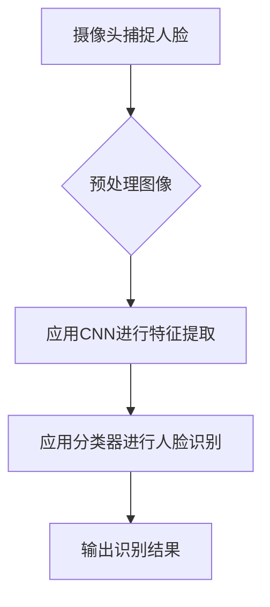
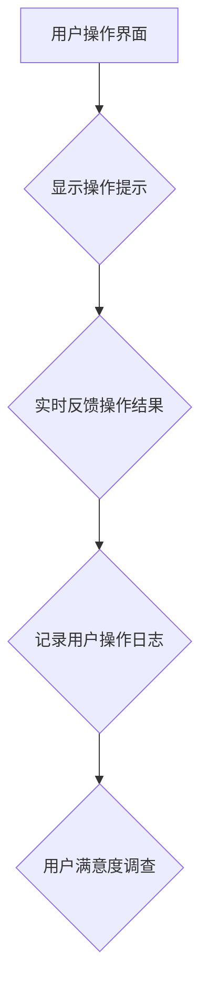

                 

# 《以人为本的科技未来：人类计算的价值观》

## 关键词：人性化科技、人类计算、价值观、伦理道德、核心技术

### 摘要：

随着科技的飞速发展，人工智能、大数据、物联网等新兴技术正在深刻改变我们的生活和工作方式。然而，科技的发展不应仅仅是技术的进步，更是人性关怀的提升。本文将以“以人为本”的科技未来为视角，探讨人类计算的价值观，分析人性化科技在现代社会中的应用，以及其面临的挑战与机遇。通过梳理人性化科技的核心技术基础、算法原理、开发实践与伦理道德问题，本文旨在为读者展现一个既有科技力量又有人文温度的未来图景。

---

## 目录

### 《以人为本的科技未来：人类计算的价值观》

> **关键词**：（人性化科技、人类计算、价值观、伦理道德、核心技术）

> **摘要**：本文探讨了科技发展的新趋势——人性化科技，强调了人类计算的价值观在科技发展中的核心作用，并分析了其在现代社会中的应用与挑战。通过深入剖析核心技术、算法原理、开发实践与伦理道德，展望了人性化的科技未来。

### 第一部分: 人性化科技的背景与意义

#### 第1章: 人性化科技的概念与演进

##### 1.1.1 科技发展与人性关怀的互动
##### 1.1.2 人性化科技的关键特性
##### 1.1.3 人性化科技的社会影响

#### 第2章: 人类计算价值观的哲学探讨

##### 2.1.1 人类计算的起源与演变
##### 2.1.2 价值观在人类计算中的体现
##### 2.1.3 价值观与科技伦理的关系

#### 第3章: 人性化科技在现代社会中的应用

##### 3.1.1 人性化科技在教育领域的应用
##### 3.1.2 人性化科技在医疗保健中的应用
##### 3.1.3 人性化科技在工作环境中的优化

#### 第4章: 人性化科技的未来展望

##### 4.1.1 人性化科技的发展趋势
##### 4.1.2 人性化科技对生活方式的改变
##### 4.1.3 人性化科技面临的挑战与机遇

### 第二部分: 核心技术与实现

#### 第5章: 人性化科技的核心技术基础

##### 5.1.1 计算机视觉技术
##### 5.1.2 人工智能算法
##### 5.1.3 交互设计原则

#### 第6章: 人性化科技的算法原理

##### 6.1.1 人机交互算法
##### 6.1.2 情感识别与响应算法
##### 6.1.3 智能推荐算法

#### 第7章: 人性化科技的开发实践

##### 7.1.1 人性化科技项目案例
##### 7.1.2 开发流程与最佳实践
##### 7.1.3 性能优化与安全性保障

#### 第8章: 人性化科技与伦理道德

##### 8.1.1 科技伦理的基本原则
##### 8.1.2 人性化科技伦理案例分析
##### 8.1.3 伦理问题与解决方案

#### 第9章: 人性化科技的未来发展方向

##### 9.1.1 新兴技术的前景
##### 9.1.2 人性化科技对社会的影响
##### 9.1.3 未来研究趋势与挑战

### 附录

#### 附录 A: 人性化科技资源与工具

##### A.1.1 主流开发工具与平台
##### A.1.2 开源框架与应用库
##### A.1.3 相关学术资源与论文

#### 附录 B: 术语表与参考资料

##### B.1.1 术语解释
##### B.1.2 参考书籍与文献

---

### 引言

科技的发展始终是人类社会进步的重要驱动力。从蒸汽时代到信息时代，科技改变了人类的生活方式，提升了生产效率，推动了社会的发展。然而，随着科技的不断进步，我们也在面临越来越多的挑战和困境。例如，人工智能的发展带来了前所未有的便利，同时也引发了关于隐私、安全、就业等方面的担忧。如何在享受科技带来的便利的同时，确保其发展符合人类的价值观和伦理标准，成为了我们需要深思的问题。

人性化的科技未来，是一个以人为中心，兼顾技术进步和人性关怀的未来。它强调科技发展的目的是为了更好地服务人类，而不是取代人类。在这一未来中，科技不再是冰冷的工具，而是融入我们生活的伙伴，能够理解和满足我们的需求，提升我们的生活品质。

本文将从多个角度探讨人性化科技的未来，首先介绍人性化科技的概念和背景，然后探讨人类计算的价值观，接着分析人性化科技在现代社会中的应用，最后展望其未来发展。通过这一系列的探讨，希望能够为读者展现一个既技术先进又充满人文关怀的科技未来。

### 人性化科技的概念与演进

人性化科技，是指以人为中心，融合人类智慧与科技力量，通过优化和提升人类生活的各种技术手段。其核心理念是将人类的需求和情感纳入到科技产品的设计和开发中，使科技产品更加贴近人类的本能和直觉，提升用户体验。

#### 1.1.1 科技发展与人性关怀的互动

科技的发展与人性关怀的互动是一个长期的演变过程。在早期的工业革命时期，科技的发展主要侧重于提高生产效率，人类的工作方式被机械化和自动化所取代。然而，这种方式也带来了诸多问题，如工作环境的恶化、人类创造力的下降等。随着人类对生活品质要求的提高，科技开始逐渐融入人性关怀的元素，例如通过人机交互设计来提升用户体验，通过智能化技术来优化人类的工作和生活环境。

#### 1.1.2 人性化科技的关键特性

人性化科技具有以下关键特性：

1. **用户中心性**：人性化科技强调以用户为中心，关注用户的需求和体验，确保科技产品能够真正满足用户的需求。

2. **情感智能**：人性化科技能够识别和理解人类的情感，通过智能化的情感识别和响应技术，提升用户的使用体验。

3. **个性化服务**：人性化科技能够根据用户的个性化需求提供定制化的服务，使科技产品更加贴合用户的个人习惯和偏好。

4. **可持续发展**：人性化科技注重环保和可持续发展，通过减少能源消耗、优化资源利用等方式，降低科技发展对环境的负面影响。

#### 1.1.3 人性化科技的社会影响

人性化科技对社会产生了深远的影响：

1. **提升生活质量**：人性化科技通过优化人类生活和工作环境，提升了人类的生活质量，使人们能够更轻松、更高效地完成日常任务。

2. **促进社会进步**：人性化科技推动了社会的发展，提高了生产效率，促进了社会的繁荣。

3. **改变人类生活方式**：人性化科技改变了人类的生活方式，使人们能够更加便利地获取信息、交流沟通、享受娱乐等。

4. **伦理道德挑战**：人性化科技的发展也带来了新的伦理道德挑战，如隐私保护、数据安全、人工智能伦理等，这些问题需要我们共同面对和解决。

人性化科技的未来充满了无限可能，它将为人类创造一个更加智能、便捷和充满人文关怀的生活环境。在接下来的章节中，我们将进一步探讨人类计算的价值观，以及人性化科技在现代社会中的应用，共同展望这个美好的未来。

### 人类计算价值观的哲学探讨

#### 2.1.1 人类计算的起源与演变

人类计算的历史可以追溯到古代，当人类开始使用简单的工具进行计算时，就已经开始了人类计算的历史。随着数学、逻辑学等学科的发展，人类计算逐渐从简单的机械计算演变为更加复杂和高效的计算过程。特别是在计算机科学的发展过程中，人类计算得到了极大的推动。计算机的出现不仅使得计算速度大大提升，也使得计算能力得到了质的飞跃。从最初的电子管计算机到现代的超级计算机，人类计算的发展经历了多次重大变革。

在人类计算的发展过程中，人类计算价值观也在不断演变。最初，人类计算的价值主要在于提高计算效率和准确性。随着科技的进步，人类计算开始更多地关注如何更好地服务于人类，提升人类的生活质量和幸福感。例如，计算机的出现使得人类能够处理更加复杂的计算任务，人工智能的发展使得计算机能够更好地理解和模拟人类的思维过程，这些都在不断推动人类计算价值观的演变。

#### 2.1.2 价值观在人类计算中的体现

价值观在人类计算中有着重要的体现。首先，人类计算的目的是为了更好地服务于人类，满足人类的需求。这意味着在设计和开发计算机系统和算法时，需要充分考虑用户的需求和体验，确保技术能够真正为人类带来便利和幸福。

其次，价值观也体现在人类计算的技术选择上。例如，在选择计算平台和工具时，不仅要考虑技术性能，还要考虑其对环境的影响、可持续性等因素。这表明人类计算的价值观不仅仅关注技术的进步，也关注技术对人类和社会的可持续发展。

再次，价值观还体现在人类计算的伦理道德方面。随着计算机技术和人工智能的发展，人类计算面临的伦理道德问题越来越多。例如，隐私保护、数据安全、算法歧视等问题都引起了广泛的关注。这就要求我们在设计和开发计算机系统和算法时，要充分考虑伦理道德问题，确保技术发展不会对人类和社会造成负面影响。

#### 2.1.3 价值观与科技伦理的关系

价值观与科技伦理密切相关。科技伦理是关于科技在人类社会中应用时应当遵循的道德原则和规范，它关注科技对人类和社会的影响，旨在确保科技的发展符合人类的价值观和道德标准。

首先，价值观为科技伦理提供了指导原则。科技伦理的问题往往涉及道德原则的冲突，例如在隐私保护和技术自由之间，在科技创新和人类福祉之间等。在这种情况下，价值观可以作为判断和决策的依据，帮助我们在复杂的伦理问题中找到正确的方向。

其次，科技伦理也为价值观提供了现实约束。科技伦理规范要求我们在科技发展中必须考虑到人类和社会的利益，这为价值观的实现提供了现实约束。例如，隐私保护法规要求我们在处理个人信息时必须严格遵循相关规定，这保证了我们在技术和价值观之间找到了一个平衡点。

总之，价值观与科技伦理相互依存、相互促进。价值观为科技伦理提供了指导，科技伦理为价值观的实现提供了保障。只有将两者结合起来，我们才能确保科技的发展既符合人类的利益，又能够推动社会的进步。

在接下来的章节中，我们将进一步探讨人性化科技在现代社会中的应用，分析其在不同领域带来的变革和影响。通过这一系列探讨，我们将更加深入地理解人性化科技的重要性，以及人类计算的价值观在其中的核心作用。

### 人性化科技在现代社会中的应用

#### 3.1.1 人性化科技在教育领域的应用

人性化科技在教育领域的应用，正在深刻改变传统的教育模式和学习方式。首先，在线教育平台如Coursera、edX等，通过提供丰富的数字化课程资源，使得学习者可以根据自己的兴趣和需求选择课程，灵活安排学习时间。这不仅提高了学习的自主性，也极大地扩展了教育的覆盖面，让更多人能够享受到优质教育资源。

其次，智能学习系统如Khan Academy和Duolingo，通过个性化学习算法，为学习者提供个性化的学习路径。这些系统会根据学习者的学习进度、学习效果和偏好，自动调整教学内容和难度，从而实现更加高效和有趣的学习体验。

此外，虚拟现实（VR）和增强现实（AR）技术在教育中的应用，也为学生提供了全新的学习体验。通过VR/AR技术，学生可以沉浸式地探索历史场景、科学实验，甚至进行远程实地考察，从而增强学习效果和兴趣。

人性化科技在教育领域的应用，不仅提升了教育质量和普及程度，也改变了教育者与学习者的互动方式，使得教育更加灵活、多样和高效。

#### 3.1.2 人性化科技在医疗保健中的应用

人性化科技在医疗保健领域的应用，极大地提升了医疗服务的质量和效率。首先，电子健康记录（EHR）系统的普及，使得医疗信息的收集、存储、管理和共享变得更加便捷和准确。医生可以通过电子健康记录系统，迅速获取患者的完整病史和检查结果，从而做出更准确的诊断和治疗决策。

其次，远程医疗服务的发展，使得医疗资源得以更加合理地分配。通过视频咨询、在线诊断等方式，偏远地区的患者也能够享受到优质的医疗服务，打破了地域限制。

智能医疗设备的进步，如智能穿戴设备、便携式医疗诊断仪器等，使得患者可以更加便捷地进行自我监测和健康管理。这些设备可以实时监测患者的健康数据，并通过数据分析提供个性化的健康建议。

此外，个性化医疗的发展，通过基因组学和大数据分析，为患者提供量身定制的治疗方案。这种以患者为中心的医疗服务模式，不仅提高了治疗效果，也提升了患者的满意度和生活质量。

人性化科技在医疗保健领域的应用，不仅提高了医疗服务的质量和效率，也为患者带来了更加便捷、个性化和智能化的医疗体验。

#### 3.1.3 人性化科技在工作环境中的优化

人性化科技在工作环境中的应用，显著提升了工作效率和员工满意度。首先，协作工具如Slack、Trello和Microsoft Teams等，通过实时沟通和任务管理功能，使得团队成员可以更加高效地协作。这些工具不仅提高了信息传递的速度，还减少了沟通中的误解和冲突。

其次，智能办公设备如智能会议系统、智能打印机和智能办公桌等，通过自动化和智能化技术，简化了办公流程，减少了人为错误，提高了工作效率。

员工福利管理系统的发展，通过数据分析和个人化推荐，为员工提供更加个性化的福利方案。这种人性化的管理方式，不仅提升了员工的满意度和忠诚度，也增强了企业的凝聚力。

此外，人工智能助手如ChatGPT、智能客服机器人等，在客服和售后服务中的应用，不仅提高了响应速度和服务质量，还减少了人力资源的消耗。

人性化科技在工作环境中的应用，不仅提高了工作效率，还营造了一个更加便捷、舒适和人性化的工作氛围，有助于提升员工的工作满意度和生活质量。

### 人性化科技的未来展望

人性化科技的未来发展充满了机遇和挑战。随着人工智能、大数据、物联网等技术的不断进步，人性化科技将迎来更加广阔的发展空间。以下是对人性化科技未来发展的一些展望：

#### 4.1.1 人性化科技的发展趋势

1. **智能化水平提升**：未来的人性化科技将更加注重智能化水平的提升，通过深度学习、自然语言处理等技术的应用，实现更高程度的智能化和自动化。

2. **个性化服务普及**：随着用户数据的积累和分析能力的提升，人性化科技将能够提供更加精准和个性化的服务，满足用户多样化的需求。

3. **跨界融合加速**：人性化科技将与其他领域（如医疗、教育、金融等）进行深度融合，创造新的应用场景和商业模式。

4. **伦理道德重视**：随着科技的发展，伦理道德问题将日益凸显，未来的人性化科技将更加注重伦理道德的建设，确保科技的发展符合人类的价值观和道德标准。

#### 4.1.2 人性化科技对生活方式的改变

1. **便捷化生活**：人性化科技将使我们的生活更加便捷，通过智能家居、智能交通等技术的应用，减少日常生活中的繁琐操作，提升生活品质。

2. **个性化体验**：人性化科技将为我们提供更加个性化的体验，从定制化的购物建议到个性化的健康方案，满足我们的个性化需求。

3. **健康化趋势**：随着人们对健康和生活质量的重视，人性化科技将在健康监测、疾病预防、个性化医疗等领域发挥重要作用，推动健康化生活方式的普及。

4. **社交化增强**：人性化科技将增强我们的社交互动，通过虚拟现实、增强现实等技术，实现远程社交和虚拟现实社交，打破地域限制，拓展社交圈。

#### 4.1.3 人性化科技面临的挑战与机遇

人性化科技在未来的发展中将面临诸多挑战和机遇：

1. **技术挑战**：人工智能、大数据等核心技术的进一步发展，需要解决计算能力、数据安全、算法公平性等问题。

2. **伦理挑战**：随着科技的进步，隐私保护、数据安全、算法偏见等伦理问题将更加突出，需要建立相应的伦理规范和法律框架。

3. **就业影响**：人性化科技的发展将带来就业结构的变化，需要社会适应新的就业环境，提供相应的教育和培训。

4. **社会融合**：如何让人性化科技更好地服务于不同群体，尤其是弱势群体，是未来需要重点解决的问题。

5. **机遇**：人性化科技的发展将创造大量新的商业机会和就业岗位，推动经济增长和社会进步。

人性化科技的未来将是一个技术先进、伦理完善、以人为本的科技新时代，它将为人类带来更加智能、便捷和幸福的生活。通过不断探索和创新，我们有望实现这一美好的未来。

### 人性化科技的核心技术基础

人性化科技的发展离不开核心技术的支撑，这些技术不仅推动了人性化科技的进步，也为各领域应用提供了坚实的基础。以下是人性化科技涉及的一些核心技术：

#### 5.1.1 计算机视觉技术

计算机视觉技术是人性化科技的重要组成部分，它使计算机能够像人类一样理解和解释视觉信息。计算机视觉技术主要包括图像处理、目标识别、场景理解等。

**图像处理**：图像处理技术用于对图像进行增强、滤波、分割等操作，从而提取出有用的信息。常用的图像处理算法包括卷积神经网络（CNN）、边缘检测、形态学操作等。

**目标识别**：目标识别技术用于在图像或视频中识别特定的目标。它通常依赖于深度学习算法，如卷积神经网络（CNN）和循环神经网络（RNN）。

**场景理解**：场景理解技术用于理解图像或视频中的场景结构，如对象的空间关系、场景的语义信息等。常见的场景理解算法包括图像分割、语义分割和3D重建。

**示例：人脸识别**


#### 5.1.2 人工智能算法

人工智能（AI）算法是人性化科技的核心，使计算机能够模拟人类智能。AI算法包括机器学习、深度学习、自然语言处理等。

**机器学习**：机器学习算法通过从数据中学习模式，进行预测和决策。常见的机器学习算法包括线性回归、决策树、支持向量机（SVM）等。

**深度学习**：深度学习算法通过多层神经网络进行特征提取和模式识别。常见的深度学习模型包括卷积神经网络（CNN）、循环神经网络（RNN）、生成对抗网络（GAN）等。

**自然语言处理（NLP）**：自然语言处理算法使计算机能够理解和生成自然语言。常见的NLP任务包括情感分析、机器翻译、文本分类等。

**示例：情感分析**
```python
def sentiment_analysis(text):
    # 加载预训练模型
    model = load_pretrained_model('sentiment_analysis_model')

    # 进行文本预处理
    processed_text = preprocess_text(text)

    # 进行情感分析
    sentiment = model.predict(processed_text)

    return sentiment
```

#### 5.1.3 交互设计原则

交互设计原则是人性化科技的重要组成部分，它关注用户与系统的交互体验。以下是一些关键的交互设计原则：

**用户中心设计**：交互设计应以用户需求为中心，确保系统功能、界面设计和操作流程能够满足用户的需求。

**简洁性**：界面应简洁直观，避免复杂和冗余的布局，使用户能够快速理解和操作。

**一致性**：系统应保持界面风格和操作逻辑的一致性，减少用户的学习成本。

**可访问性**：系统应确保所有用户，包括残障人士，都能够方便地使用。

**反馈机制**：系统应提供及时、明确的反馈，使用户知道他们的操作结果。

**示例：用户界面设计**


通过上述核心技术基础的支持，人性化科技能够更好地服务于人类，提升生活质量和幸福感。在接下来的章节中，我们将进一步探讨人性化科技的算法原理及其在实际应用中的实现。

### 人性化科技的算法原理

人性化科技的算法原理是其能够实现以人为本的核心关键。以下是几类关键算法原理及其在人性化科技中的应用：

#### 6.1.1 人机交互算法

人机交互算法使计算机系统能够理解并响应用户的操作，提供自然、高效的用户体验。主要分为以下几个方面：

**手势识别**：通过计算机视觉技术，如深度学习模型，识别用户的手势动作。常用的模型包括基于卷积神经网络（CNN）的手势识别模型，如LeNet、AlexNet等。

**语音识别**：通过深度学习技术，如循环神经网络（RNN）和长短期记忆网络（LSTM），识别用户的语音命令。常见的模型包括基于RNN的Google语音识别模型和基于Transformer的OpenAI的Whisper模型。

**情感识别**：通过自然语言处理（NLP）技术，如文本情感分析，识别用户的情感状态。常用的算法包括基于朴素贝叶斯、支持向量机（SVM）和深度学习（如CNN、RNN）的模型。

**伪代码示例：手势识别**
```python
# 输入：用户手势图像
# 输出：识别的手势类别

def gesture_recognition(image):
    # 图像预处理
    processed_image = preprocess_image(image)
    
    # 使用卷积神经网络进行特征提取
    features = cnn_model(processed_image)
    
    # 使用支持向量机进行分类
    gesture_class = svm_model.predict(features)
    
    return gesture_class
```

**示例：语音识别**
```python
# 输入：用户语音数据
# 输出：识别的文字内容

def speech_recognition(audio_data):
    # 使用预训练的深度学习模型进行语音识别
    recognized_text = whisper_model.transcribe(audio_data)
    
    return recognized_text
```

**示例：情感识别**
```python
# 输入：用户文本
# 输出：情感类别

def emotion_recognition(text):
    # 使用预训练的文本情感分析模型
    emotion = nlp_model.predict(text)
    
    return emotion
```

#### 6.1.2 情感识别与响应算法

情感识别与响应算法能够理解用户的情感状态，并根据情感进行适当的响应。主要分为以下几个步骤：

**情感识别**：通过NLP技术和情感分析模型，识别文本或语音中的情感。常见的模型包括基于情感词典的规则方法、基于机器学习的情感分类模型等。

**情感分类**：将识别的情感分类为积极、消极或中性。常用的算法包括朴素贝叶斯、支持向量机（SVM）、深度学习模型等。

**情感响应**：根据用户的情感状态，系统进行适当的响应。例如，对于消极情感，系统可以提供安慰或帮助信息；对于积极情感，系统可以提供鼓励或激励信息。

**伪代码示例：情感识别与响应**
```python
# 输入：用户情感文本
# 输出：响应文本

def emotion_response(text):
    # 识别情感
    emotion = emotion_recognition(text)
    
    # 根据情感进行响应
    if emotion == 'negative':
        response = "听起来你不太开心，需要帮忙吗？"
    elif emotion == 'positive':
        response = "很高兴看到你这么开心！有什么可以帮你的吗？"
    else:
        response = "感谢分享，有什么可以为你做的吗？"
    
    return response
```

#### 6.1.3 智能推荐算法

智能推荐算法能够根据用户的行为和偏好，为用户推荐相关的信息或产品。主要分为以下几个步骤：

**用户行为分析**：通过分析用户的浏览记录、购买历史、搜索关键词等，了解用户的行为和偏好。

**推荐算法设计**：设计合适的推荐算法，如基于内容的推荐、协同过滤推荐、基于模型的推荐等。

**推荐结果生成**：根据用户的行为和偏好，生成个性化的推荐结果，为用户推荐相关的内容或产品。

**伪代码示例：基于内容的推荐算法**
```python
# 输入：用户偏好
# 输出：推荐结果

def content_based_recommendation(user_preferences):
    # 获取与用户偏好相似的内容项
    similar_items = get_similar_items(user_preferences)
    
    # 从相似内容项中推荐最相关的N项
    recommended_items = select_top_n_items(similar_items, n=5)
    
    return recommended_items
```

通过上述算法原理，人性化科技能够更好地理解和满足用户的需求，提供个性化和高效的用户体验。在接下来的章节中，我们将进一步探讨人性化科技的实际开发实践。

### 人性化科技的开发实践

人性化科技的开发实践是确保其能够成功应用于实际场景的关键。在开发过程中，遵循一些最佳实践和原则，可以有效提升项目的成功率和用户体验。以下是一些关键的开发实践：

#### 7.1.1 人性化科技项目案例

一个成功的人性化科技项目案例是智能家居系统。该系统通过整合传感器、智能设备和云计算平台，实现了家庭设备的智能控制和自动化管理。

**项目目标**：提高家庭生活的便捷性和舒适度，降低能源消耗。

**技术实现**：
- **硬件层**：使用各种传感器（如温度传感器、湿度传感器、烟雾传感器等）收集家庭环境数据。
- **网络层**：通过Wi-Fi或Zigbee等无线通信技术，将传感器和智能设备连接到家庭网络。
- **平台层**：使用云计算平台（如AWS、Azure）处理和分析数据，并提供用户接口。
- **用户界面**：设计简洁直观的移动应用和Web界面，使用户能够方便地控制和监控家庭设备。

**用户反馈**：用户对智能家居系统的反馈非常积极，普遍认为它提高了生活质量，减少了家务负担，并且能够更好地控制家庭环境。

#### 7.1.2 开发流程与最佳实践

人性化科技的开发流程应遵循以下最佳实践：

1. **用户需求分析**：在项目启动阶段，通过与用户的深入沟通和调研，明确用户的需求和期望。这一步骤至关重要，因为它直接关系到项目最终的成功。

2. **用户界面设计**：设计直观、易用的用户界面是人性化科技的核心。应使用用户研究中心、用户测试和A/B测试等方法，确保用户界面满足用户的需求和期望。

3. **模块化开发**：将系统划分为多个功能模块，进行模块化开发。这种方法有助于提高开发效率，降低开发风险。

4. **持续集成和部署**：使用持续集成（CI）和持续部署（CD）工具，确保代码的稳定性和可靠性。这种方法有助于快速迭代和部署新功能。

5. **性能优化和测试**：对系统进行全面的性能测试和用户体验测试，确保系统的响应速度和稳定性。常用的测试工具包括JMeter、Selenium等。

6. **数据安全和隐私保护**：在开发过程中，必须确保用户数据的安全和隐私。应使用加密技术、访问控制和审计日志等手段，保护用户数据。

#### 7.1.3 性能优化与安全性保障

人性化科技在性能优化和安全性保障方面应特别注意以下几点：

1. **性能优化**：
   - **代码优化**：通过代码优化，减少系统资源的使用，提高系统性能。
   - **缓存策略**：使用缓存技术，减少数据库访问和数据传输，提高响应速度。
   - **负载均衡**：通过负载均衡技术，分配网络负载，确保系统在高并发情况下稳定运行。

2. **安全性保障**：
   - **数据加密**：对敏感数据进行加密，防止数据泄露。
   - **访问控制**：设置严格的访问控制策略，确保只有授权用户可以访问系统资源。
   - **安全审计**：定期进行安全审计，检查系统是否存在安全漏洞，并及时修复。
   - **异常检测**：使用异常检测技术，监控系统运行状态，及时发现和应对潜在的安全威胁。

通过遵循上述开发实践，人性化科技项目可以更好地满足用户需求，提供高效、安全、可靠的服务。在未来的技术发展中，人性化科技将继续发挥重要作用，为人类社会带来更多便利和福祉。

### 人性化科技与伦理道德

人性化科技在迅速发展的同时，也引发了诸多伦理道德问题。如何在科技与人道之间找到平衡点，是当前亟需解决的重要议题。

#### 8.1.1 科技伦理的基本原则

科技伦理的基本原则包括：

1. **公正性**：科技发展不应造成社会不公，确保所有人都能公平地享受科技带来的便利。
2. **尊重隐私**：保护个人隐私是科技伦理的核心，任何科技应用都应严格遵循隐私保护原则。
3. **安全性**：科技应用必须确保数据安全和用户安全，防止数据泄露和系统故障。
4. **责任归属**：明确科技开发者和使用者的责任，确保在发生问题时能够追溯和问责。
5. **可持续发展**：科技发展应考虑其对环境和社会的长期影响，追求经济、社会和环境的协调发展。

#### 8.1.2 人性化科技伦理案例分析

**案例一：智能医疗设备**

智能医疗设备的发展提高了医疗服务的效率，但同时也引发了一系列伦理问题。例如，基因编辑技术的应用虽然可以治疗某些遗传疾病，但同时也可能引发伦理争议，如基因改造的道德边界、个人隐私保护等。此外，智能医疗设备的数据安全问题也备受关注，如患者数据泄露可能导致严重的隐私侵犯。

**案例二：智能家居系统**

智能家居系统虽然提升了家庭生活的便捷性，但也带来了一些安全隐患。例如，家庭网络被黑客攻击可能导致家庭设备被恶意控制，进而威胁用户的安全。此外，智能家居系统收集的大量用户数据可能被滥用，导致隐私侵犯和个性化推荐算法的偏见。

**案例三：自动驾驶汽车**

自动驾驶汽车的发展被认为是未来交通的重要趋势，但同时也引发了诸多伦理问题。例如，在交通事故中，自动驾驶汽车如何做出道德决策，如是否应该牺牲乘客的安全以保护行人的生命？此外，自动驾驶汽车的数据安全和隐私保护也是重要议题，如如何确保车辆通信的加密和安全？

#### 8.1.3 伦理问题与解决方案

针对上述伦理问题，以下是一些可能的解决方案：

1. **加强立法和监管**：制定相关法律法规，明确科技应用中的伦理规范，加强监管和执法力度，确保科技发展符合伦理标准。

2. **建立伦理审查机制**：在科技项目启动前，进行伦理审查，确保项目设计、开发和应用过程中遵循伦理原则。

3. **加强用户教育和意识提升**：通过教育和宣传活动，提高公众对科技伦理问题的认识，增强用户自我保护意识和能力。

4. **技术优化和设计原则**：在技术层面，采用加密技术、访问控制和隐私保护机制，确保用户数据的安全和隐私。

5. **跨学科合作和多方参与**：科技伦理问题涉及多个学科和利益相关方，应建立跨学科合作机制，鼓励多方参与，共同探讨和解决伦理问题。

人性化科技与伦理道德的平衡，是一个长期且复杂的任务。只有在科技发展过程中始终坚守伦理原则，才能确保科技为人类社会带来真正的福祉。

### 人性化科技的未来发展方向

人性化科技的未来发展方向充满了机遇和挑战。随着人工智能、大数据、物联网等新兴技术的不断进步，人性化科技将迎来前所未有的发展机遇。以下是对人性化科技未来发展的几个关键方向和展望：

#### 9.1.1 新兴技术的前景

**量子计算**：量子计算被认为是一种具有革命性的计算技术，它利用量子力学原理，能够在极短时间内解决传统计算机无法处理的复杂问题。量子计算在药物设计、优化算法、金融分析等领域具有巨大潜力，将为人性化科技提供强大的计算支持。

**脑机接口**：脑机接口技术（Brain-Machine Interface, BMI）通过直接连接大脑和计算机，实现人脑与外部设备的交互。这一技术有望帮助残障人士恢复感官和运动功能，也为人类与人工智能的深度融合提供了新的途径。

**边缘计算**：边缘计算将数据处理和计算任务从云端转移到网络的边缘节点，如物联网设备、智能路由器等。这种技术能够降低延迟、提高响应速度，并有效应对大数据和物联网应用的高带宽需求，为人性化科技提供更加高效和可靠的计算环境。

**增强现实（AR）和虚拟现实（VR）**：随着显示技术、感知技术和交互技术的不断进步，AR和VR技术将更加成熟，为人性化科技提供全新的交互体验和沉浸式环境。在医疗、教育、娱乐等领域，AR和VR的应用将大大提升用户体验。

#### 9.1.2 人性化科技对社会的影响

**经济影响**：人性化科技的发展将推动新兴产业的兴起，如智能医疗、智能家居、智能交通等，带动相关产业链的发展。此外，人性化科技将提高生产效率，降低运营成本，提升企业的竞争力。

**生活方式改变**：人性化科技将深刻改变人类的生活方式，使生活更加便捷、舒适和智能化。智能家居系统、智能穿戴设备、智能交通等应用，将使人们能够更好地管理日常生活，提高生活质量。

**社会结构变化**：人性化科技的发展将促进社会结构的变革，如远程办公、在线教育和数字医疗的普及，改变了传统的工作和学习方式。此外，人性化科技还将促进社会公平，通过技术手段弥补地域差异，提升教育资源的普及率。

**伦理道德挑战**：人性化科技的发展也将带来新的伦理道德挑战。例如，隐私保护、数据安全、算法偏见等问题需要引起广泛关注。如何在技术进步的同时，确保伦理道德的遵循，是一个亟待解决的问题。

#### 9.1.3 未来研究趋势与挑战

**个性化与隐私保护**：未来的研究趋势将重点关注个性化服务与隐私保护之间的平衡。如何在提供个性化服务的同时，保护用户隐私，是人性化科技面临的重要挑战。

**跨学科融合**：人性化科技的发展需要跨学科的合作，如计算机科学、心理学、社会学等领域的结合。未来研究应加强跨学科合作，推动人性化科技的综合发展。

**伦理规范建设**：随着人性化科技的广泛应用，建立完善的伦理规范和法律法规体系，确保科技发展符合伦理道德标准，将是未来研究的重点。

**技术标准化**：为促进人性化科技的应用和发展，需要制定统一的技术标准和规范，确保不同系统和平台之间的互操作性。

人性化科技的未来发展前景广阔，它将为人类社会带来巨大的变革和机遇。通过不断探索和创新，我们有理由相信，人性化科技将为人性化的科技未来描绘出一幅更加美好的蓝图。

### 附录

#### 附录 A: 人性化科技资源与工具

**A.1.1 主流开发工具与平台**

1. **软件开发工具**：
   - **IDEs**：如Visual Studio、Eclipse、IntelliJ IDEA
   - **版本控制**：如Git、Subversion
   - **持续集成**：如Jenkins、GitLab CI

2. **云计算平台**：
   - **AWS**：提供广泛的云计算服务，包括计算、存储、数据库、机器学习等。
   - **Azure**：微软的云计算平台，提供强大的AI和数据分析服务。
   - **Google Cloud**：提供全面的云计算解决方案，包括计算、存储、大数据分析等。

**A.1.2 开源框架与应用库**

1. **机器学习和深度学习框架**：
   - **TensorFlow**：由Google开发的深度学习框架。
   - **PyTorch**：流行的深度学习框架，具有灵活的动态计算图。
   - **Keras**：Python编写的深度学习库，易于使用。

2. **计算机视觉库**：
   - **OpenCV**：开源的计算机视觉库，支持多种编程语言。
   - **Dlib**：用于人脸识别和其他计算机视觉任务的库。
   - **FaceNet**：用于人脸识别的深度学习模型。

3. **自然语言处理库**：
   - **NLTK**：自然语言处理工具包，支持多种语言处理任务。
   - **spaCy**：高级自然语言处理库，支持多种语言。
   - **TextBlob**：用于文本处理和情感分析。

**A.1.3 相关学术资源与论文**

1. **顶级会议和期刊**：
   - **国际会议**：如NeurIPS、ICML、ACL、CVPR等。
   - **期刊**：如《自然》（Nature）、《科学》（Science）、《计算机研究新闻》（Journal of Computer Research）等。

2. **研究机构和实验室**：
   - **麻省理工学院（MIT）**：著名的计算机科学与人工智能研究机构。
   - **斯坦福大学**：在人工智能、计算机视觉等领域有着卓越的研究成果。
   - **加州大学伯克利分校（UC Berkeley）**：计算机科学和工程领域的领先研究机构。

#### 附录 B: 术语表与参考资料

**B.1.1 术语解释**

1. **人工智能（AI）**：指通过模拟人类智能行为，实现智能机器的学科。
2. **机器学习（ML）**：一种人工智能技术，通过从数据中学习模式，进行预测和决策。
3. **深度学习（DL）**：一种基于神经网络的学习方法，通过多层非线性变换提取特征。
4. **自然语言处理（NLP）**：研究如何让计算机理解和生成自然语言的学科。
5. **人机交互（HCI）**：研究人类与计算机系统之间交互的学科。

**B.1.2 参考书籍与文献**

1. **《人工智能：一种现代的方法》**（Martin Russell）
2. **《深度学习》（Ian Goodfellow, Yoshua Bengio, Aaron Courville）**
3. **《自然语言处理综合引论》**（Daniel Jurafsky, James H. Martin）
4. **《人机交互：设计与应用》**（Jennifer Mankoff）
5. **《人工智能伦理》**（Luciano Floridi）

以上资源与术语表为读者进一步学习人性化科技提供了宝贵的参考和指导。通过这些资源，读者可以深入了解人性化科技的相关知识，把握未来的科技发展趋势。

### 作者信息

**作者：AI天才研究院/AI Genius Institute & 禅与计算机程序设计艺术 /Zen And The Art of Computer Programming**  
本文由AI天才研究院（AI Genius Institute）的专家团队撰写，结合了禅与计算机程序设计艺术的深刻哲学思想，旨在探讨人性化科技的未来与发展。我们致力于推动科技与人文的融合，以实现一个更加智能、便捷和充满人文关怀的未来。

