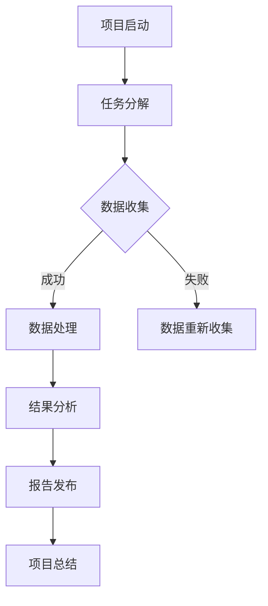

                 

### 《众包科学：公众参与科学研究的新时代》

> **关键词**：众包科学、公众参与、科研模式、数据收集、用户激励、应用领域、未来展望、伦理问题。

> **摘要**：本文深入探讨了众包科学这一新兴科研模式，阐述了其起源、意义、实施方法及应用领域。通过分析公众参与科研的现状与挑战，探讨了众包科学在各个领域的实际应用，并展望了其未来发展趋势与伦理影响。本文旨在为广大科研工作者、学生和公众提供一份全面、系统的指南，引导他们了解、参与并推动众包科学的发展。

### 第一部分：引言与概述

#### 第1章：众包科学的背景与意义

众包科学，作为一种新兴的科研模式，正逐渐改变着传统科研的格局。它不仅仅是一种技术手段的创新，更是一种科研理念的变革。那么，众包科学究竟是什么？它的起源和发展历程又是怎样的？让我们一步一步来探讨。

##### **1.1 众包科学的起源与发展**

众包（Crowdsourcing）这个概念最早由威尔斯（Jeff Howe）在2006年提出，指的是通过互联网平台，将复杂的任务或问题分解成多个小任务，然后通过众包平台，向公众征集解决方案。这种模式在商业、艺术、设计等领域得到了广泛应用。

然而，众包科学并非一开始就与科学研究挂钩。最早的众包科学项目之一是“SETI@home”，该项目通过让公众的计算机在空闲时间参与处理天文数据，来寻找外星文明的信号。这一项目的成功，激发了更多科研领域的众包探索。

随着时间的推移，众包科学逐渐从单一领域扩展到多个学科领域。例如，生物学的“ foldit”游戏项目，通过让公众参与蛋白质折叠的解谜，为科学研究提供了重要的数据。地理学的“OpenStreetMap”项目，则通过公众的贡献，建立了一个庞大的地理信息数据库。

##### **1.2 众包科学的特点与优势**

众包科学具有以下特点：

1. **多样性**：众包科学吸引了来自不同背景、不同领域的公众参与，这使得科研团队能够获得更广泛、更多样化的视角和观点。

2. **高效性**：众包科学将复杂的任务分解成小任务，通过众包平台进行分发，从而大大提高了任务的完成效率。

3. **灵活性**：众包科学允许科研团队根据实际需求，灵活调整任务分配和资源利用。

4. **开放性**：众包科学打破了传统科研的封闭模式，使公众能够直接参与到科研过程中，提高了科研的透明度和公众参与度。

众包科学的优势主要体现在以下几个方面：

1. **降低成本**：众包科学利用公众的资源，降低了科研的成本。

2. **提高效率**：众包科学通过公众的参与，提高了科研任务的完成效率。

3. **促进创新**：众包科学激发了公众的创造力和创新能力，为科学研究带来了新的思路和方法。

4. **增强公众参与感**：众包科学使公众能够直接参与到科研过程中，增强了他们的参与感和归属感。

##### **1.3 众包科学对传统科研模式的影响**

众包科学的出现，对传统科研模式产生了深远的影响。首先，它改变了科研资源的分配方式，使得更多的公众能够参与到科研过程中。其次，它打破了科研的封闭模式，使科研更加开放和透明。最后，它促进了科研的多样性和创新性，为科学研究带来了新的机遇和挑战。

总之，众包科学作为一种新兴的科研模式，具有巨大的潜力和价值。它不仅能够提高科研效率，降低科研成本，还能够激发公众的创造力和参与感，为科学研究注入新的活力。在接下来的章节中，我们将深入探讨众包科学的实施方法、应用领域和未来展望。

#### 第2章：公众参与科研的现状与挑战

随着科技的进步和社会的发展，公众参与科研逐渐成为科研领域的一大趋势。然而，公众参与科研的现状并不乐观，面临着诸多挑战。在这一章中，我们将详细分析公众参与科研的主要形式、存在的问题以及应对策略。

##### **2.1 公众参与科研的主要形式**

公众参与科研的形式多种多样，主要包括以下几种：

1. **数据收集**：公众可以通过各种渠道，如在线调查、问卷调查、实地考察等，为科研提供数据支持。这种形式在社会科学、生物学、环境科学等领域应用较为广泛。

2. **数据标注**：在机器学习和人工智能领域，公众可以通过对图像、文本等进行标注，帮助科学家训练模型和算法。例如，OpenStreetMap 项目中，用户可以参与到地图数据的编辑和标注中。

3. **科研协作**：一些科研团队会通过在线平台，邀请公众参与到科研项目中，共同完成研究任务。例如，SETI@home 项目，公众可以参与到天文数据分析中。

4. **科研支持**：除了直接参与科研活动，公众还可以通过捐赠资金、提供设备等，为科学研究提供支持。

##### **2.2 公众参与科研的挑战与问题**

尽管公众参与科研具有诸多优势，但在实际操作中，也面临着诸多挑战和问题：

1. **数据质量问题**：由于公众的背景和知识水平不同，导致收集的数据可能存在质量参差不齐的问题。这不仅会影响研究的准确性，还可能带来误导性结论。

2. **数据隐私问题**：在数据收集和处理过程中，如何保护参与者的隐私是一个重要问题。如果隐私保护措施不当，可能会导致参与者的个人信息泄露。

3. **用户激励问题**：如何激励公众积极参与科研，是一个亟待解决的问题。目前的激励机制往往不够有效，难以激发用户的参与热情。

4. **项目管理问题**：公众参与科研的项目管理相对复杂，需要处理大量数据和参与者。如果没有有效的项目管理手段，可能导致项目进度延误、质量下降。

5. **伦理问题**：公众参与科研可能会涉及到伦理问题，如实验风险、知情同意等。这些问题需要科研团队和参与者共同关注和解决。

##### **2.3 应对公众参与科研的挑战的策略**

为了解决公众参与科研面临的挑战，可以采取以下策略：

1. **提高数据质量**：通过提供培训、规范数据收集和标注流程，确保收集的数据具有较高的质量。

2. **强化隐私保护**：在数据收集和处理过程中，采用先进的加密技术和隐私保护措施，确保参与者的个人信息安全。

3. **设计有效的激励机制**：通过奖励制度、荣誉表彰等方式，激发公众的参与热情，提高参与度。

4. **优化项目管理**：建立完善的项目管理体系，确保项目进度、质量和资源分配合理。

5. **重视伦理问题**：在项目设计和实施过程中，严格遵守伦理规范，确保参与者的权益得到保障。

总之，公众参与科研具有巨大的潜力和价值，但也面临着诸多挑战。只有通过有效的策略和措施，才能充分发挥公众参与科研的优势，推动科研事业的发展。

#### 第3章：项目设计与管理

在众包科学中，项目设计和管理是确保项目成功的关键环节。一个良好的项目设计能够激发公众的参与热情，提高任务完成的效率；而有效的项目管理则能够确保项目在既定的时间、质量和预算范围内顺利完成。以下，我们将详细探讨项目设计与管理的重要步骤和注意事项。

##### **3.1 众包项目的目标与规划**

项目设计的第一步是明确项目的目标。项目目标应该具体、可衡量、可实现，同时要与科研团队的研究目标紧密相关。在确定目标后，需要对项目进行全面的规划，包括以下几个方面：

1. **任务分解**：将复杂的研究任务分解成若干个可操作的小任务，确保每个任务都能被公众理解和执行。

2. **资源分配**：根据项目需求和预算，合理分配人力、物力、财力等资源，确保项目能够顺利进行。

3. **时间规划**：制定详细的时间表，明确每个阶段的开始和结束时间，确保项目按时完成。

4. **风险评估**：对项目可能面临的风险进行评估，并制定相应的应对措施，降低风险对项目的影响。

##### **3.2 众包项目的设计与实施**

在项目设计完成后，进入实施阶段。以下是一些关键步骤和注意事项：

1. **平台选择**：选择合适的众包平台，如Topcoder、GitHub、图吧等，确保平台能够满足项目的需求，如任务发布、参与者管理、数据收集和分析等。

2. **任务发布**：将分解后的任务发布到众包平台上，确保任务描述清晰、具体，并提供必要的指导和资源。

3. **参与者招募**：通过宣传、推荐等方式，吸引公众参与项目。在招募过程中，要注重参与者的背景和技能，确保他们能够胜任所分配的任务。

4. **任务执行**：在任务执行过程中，项目管理者需要实时监控任务进度，及时解决参与者遇到的问题，确保任务按时完成。

5. **质量控制**：对收集到的数据进行质量控制，确保数据的准确性和可靠性。可以采用多级审核、数据清洗等方法，提高数据质量。

##### **3.3 众包项目的监控与评估**

项目监控与评估是确保项目质量和效果的重要环节。以下是一些监控与评估的方法和工具：

1. **进度监控**：通过项目管理系统，实时监控项目的进度，及时发现和解决问题。

2. **质量评估**：对完成的任务进行质量评估，可以采用定量评估（如准确率、完成率等）和定性评估（如用户反馈、专家评审等）相结合的方法。

3. **成本控制**：对项目的成本进行监控，确保项目在预算范围内完成。

4. **用户反馈**：收集参与者的反馈，了解他们对项目的看法和建议，不断优化和改进项目。

5. **效果评估**：在项目完成后，对项目效果进行评估，评估指标可以包括项目成果、参与者的满意度、社会影响等。

##### **3.4 项目设计与管理的注意事项**

1. **明确目标**：项目目标必须明确、具体，确保项目能够朝着正确的方向前进。

2. **合理分配资源**：资源分配要合理，确保项目有足够的资源支持。

3. **灵活调整**：在项目实施过程中，要灵活调整计划，应对可能出现的变化和问题。

4. **质量控制**：数据质量是项目成功的关键，要高度重视数据质量控制。

5. **用户参与**：鼓励公众参与项目，提高他们的满意度和参与度。

6. **透明沟通**：保持与参与者的透明沟通，确保他们了解项目的进展和问题。

总之，项目设计与管理是众包科学成功的关键。通过明确目标、合理规划、科学实施和严格监控，可以确保众包项目的顺利进行，为科学研究做出贡献。

#### 第4章：数据收集与处理

在众包科学项目中，数据收集与处理是至关重要的环节。准确、可靠的数据不仅能够提高研究的可信度，还能够为后续的分析提供坚实的基础。以下是关于数据收集与处理的详细探讨，包括方法、工具、数据处理与分析、数据质量控制与隐私保护等内容。

##### **4.1 数据收集的方法与工具**

数据收集是众包科学项目的起点，合理选择数据收集方法与工具是确保数据质量的关键。以下是几种常用的数据收集方法与工具：

1. **在线调查**：在线调查是一种简便有效的数据收集方法。可以使用问卷星、金数据等在线问卷工具，设计并分发问卷，收集参与者的信息。

2. **移动应用**：开发专门的移动应用，通过用户的日常使用数据收集所需信息。例如，在环保项目中，可以开发一款记录用户日常环保行为的移动应用。

3. **传感器与物联网**：在环境监测、交通研究等领域，可以使用传感器和物联网设备，实时收集环境数据。

4. **社交媒体**：利用社交媒体平台，如Twitter、Facebook等，收集与特定话题相关的数据，如公共意见、情绪分析等。

5. **众包平台**：在众包科学项目中，可以通过众包平台，如图吧、Topcoder等，收集来自全球参与者的数据。

##### **4.2 数据处理与分析**

收集到的原始数据通常是杂乱无章的，需要进行处理和分析，才能得到有价值的信息。以下是数据处理与分析的几个关键步骤：

1. **数据清洗**：数据清洗是数据处理的第一步，目的是去除重复数据、处理缺失值和异常值，提高数据的准确性。可以使用Python的Pandas库、R语言等工具进行数据清洗。

2. **数据转换**：数据转换包括数据格式的转换、数据类型的转换等，使数据格式统一，便于后续处理。例如，将文本数据转换为数值数据。

3. **数据归一化**：通过数据归一化，使不同量级的数据在同一尺度上进行分析。常用的归一化方法有最小-最大归一化、标准归一化等。

4. **数据分析**：数据分析包括统计分析、机器学习、深度学习等方法。根据研究需求，选择合适的数据分析方法，提取有价值的信息。

5. **数据可视化**：数据可视化是展示分析结果的重要手段。可以使用Matplotlib、Seaborn、Tableau等工具，将分析结果以图表、图形等形式展示。

##### **4.3 数据质量控制与隐私保护**

数据质量是众包科学项目成功的关键，而隐私保护是数据收集和处理过程中必须重视的问题。以下是几个关键点：

1. **数据质量控制**：确保数据收集过程的准确性、完整性。在数据收集阶段，可以通过多级审核、数据验证等方式提高数据质量。在数据处理过程中，通过数据清洗、去噪等方法，进一步提高数据质量。

2. **匿名化处理**：在数据收集和处理过程中，对参与者的个人信息进行匿名化处理，避免个人信息的泄露。可以使用哈希函数、加密技术等方法，确保个人隐私安全。

3. **隐私保护协议**：制定严格的隐私保护协议，明确参与者的权利和义务，确保参与者在参与过程中了解自己的隐私保护情况。

4. **透明度**：在数据收集和处理过程中，保持与参与者的透明沟通，让他们了解自己的数据是如何被使用的。

5. **安全存储**：确保数据存储的安全性，采用先进的加密技术和安全存储策略，防止数据泄露和篡改。

总之，数据收集与处理是众包科学项目的核心环节，关系到研究的准确性和可靠性。通过合理选择数据收集方法、科学处理数据、严格质量控制以及有效保护隐私，可以确保数据的质量和安全，为科学研究提供有力支持。

#### 第5章：用户激励与参与策略

在众包科学项目中，用户的参与度和积极性是决定项目成功与否的关键因素。因此，设计有效的用户激励机制和参与策略至关重要。以下将从用户激励机制的设计、提高用户参与度的策略和用户反馈与迭代优化三个方面进行详细探讨。

##### **5.1 用户激励机制的设计**

用户激励机制是激发用户参与众包科学项目的重要手段。设计有效的激励机制，需要考虑以下几个方面：

1. **物质激励**：物质激励是最直接、最有效的激励方式，包括奖金、奖品、积分等。例如，在“foldit”游戏中，参与者通过解决蛋白质折叠难题可以获得游戏积分，积分可以兑换奖品。

2. **荣誉激励**：荣誉激励可以提升用户的成就感和荣誉感，包括颁发证书、表彰、荣誉榜等。例如，一些科研团队会在项目完成后，向贡献突出的用户颁发荣誉证书。

3. **精神激励**：精神激励可以通过认可用户的贡献、感谢信、公开表扬等方式，提升用户的参与热情。例如，在OpenStreetMap项目中，用户会被感谢信和社区认可所激励。

4. **社交激励**：社交激励通过建立用户之间的互动和社区，增强用户的参与感。例如，在Topcoder平台上，用户可以参与到讨论区、论坛等社交活动中，与其他用户交流心得和经验。

##### **5.2 提高用户参与度的策略**

除了激励机制，以下策略也可以提高用户的参与度：

1. **明确任务目标**：确保用户了解任务的目标和要求，帮助他们明确自己的贡献对项目的重要性。例如，在NASA的“公民科学家”项目中，用户会被清楚地告知他们的数据对探索火星的任务有何帮助。

2. **提供培训与支持**：为用户提供必要的培训和支持，帮助他们更好地理解和完成任务。例如，在生物信息学项目中，可以提供在线教程、研讨会和实时技术支持。

3. **增强互动与反馈**：鼓励用户之间的互动和反馈，建立社区感。例如，在SETI@home项目中，用户可以通过论坛分享他们的发现和疑问，获得其他用户的帮助和反馈。

4. **游戏化设计**：将众包项目设计成游戏化的形式，提高用户的参与乐趣。例如，在“e-Science”项目中，用户可以通过完成任务获得游戏积分和升级，从而增加他们的参与积极性。

##### **5.3 用户反馈与迭代优化**

用户反馈是优化众包科学项目的重要信息来源。以下是一些反馈和迭代优化的策略：

1. **定期收集反馈**：定期收集用户的反馈，了解他们对项目的设计、实施和结果的看法。可以通过在线调查、用户访谈、社区讨论等方式收集反馈。

2. **快速响应**：对用户的反馈进行快速响应，及时解决问题和改进项目。例如，在“citizen science”项目中，项目团队会定期更新项目说明和指南，根据用户反馈进行调整。

3. **迭代优化**：根据用户反馈，对项目进行迭代优化，不断改进项目的设计、流程和激励机制。例如，在“citizen science”项目中，团队会根据用户的反馈，调整任务的难度和奖励机制，提高用户的参与度。

4. **公开透明**：保持项目的公开透明，让用户了解项目进展和成果，增强他们的参与感和信任感。例如，在“citizen science”项目中，项目团队会定期发布项目进展报告，公开用户的贡献和成果。

总之，用户激励与参与策略是众包科学项目成功的关键。通过设计合理的激励机制、采取有效的参与策略和进行迭代优化，可以大幅提高用户的参与度和积极性，推动众包科学项目取得更好的成果。

#### 第6章：自然科学领域的众包科学应用

在自然科学领域，众包科学的应用已经取得了显著的成果，大大推动了科学研究的发展。以下是关于生物学与遗传学研究、地理学与气候科学、天文学与天体物理学中众包科学应用的详细探讨。

##### **6.1 生物学与遗传学研究**

生物学与遗传学研究是众包科学的重要领域之一。通过众包平台，公众可以参与到生物数据的收集、分析和解读中，为科学研究提供宝贵的资源。

1. **“Foldit”游戏**： Foldit 是一个由华盛顿大学开发的蛋白质折叠游戏，通过游戏的方式让玩家解决蛋白质折叠问题。玩家在游戏过程中，对蛋白质结构进行模拟和调整，从而为科学研究提供了重要的数据。Foldit 的成功展示了众包科学在生物信息学领域的潜力。

2. **“Globecan”项目**：Globecan 是一个全球性的癌症研究项目，通过众包平台收集癌症患者的基因数据，帮助科学家研究癌症的发病机制和治疗方法。公众可以通过在线平台提交自己的基因数据，参与到全球癌症研究中。

3. **“Gene Wiki”项目**：Gene Wiki 是一个由开放研究社区维护的基因数据库，公众可以参与到基因信息的收集、编辑和更新中。Gene Wiki 的建立，提高了基因数据的共享和利用效率，为生物学研究提供了重要的支持。

##### **6.2 地理学与气候科学**

地理学与气候科学也是众包科学的重要应用领域。通过公众的参与，地理学和气候科学的研究得到了广泛的资源和支持。

1. **“OpenStreetMap”项目**：OpenStreetMap 是一个由全球志愿者维护的地图数据库，公众可以参与到地图的绘制、更新和维护中。OpenStreetMap 的数据被广泛应用于地理学和气候科学研究中，为环境监测、灾害应对等提供了重要的数据支持。

2. **“Climate Watch”项目**：Climate Watch 是一个全球性的气候观测项目，公众可以通过智能手机应用，实时提交天气和气候数据。这些数据被科学家用来研究气候变化、预测天气模式等。

3. **“Weather Underground”项目**：Weather Underground 是一个由公众参与维护的天气数据平台，用户可以提交自己的天气观测数据。这些数据被用于天气预测、气候研究等。

##### **6.3 天文学与天体物理学**

天文学与天体物理学是另一个众包科学的重要领域。通过众包平台，公众可以参与到天文数据的收集、分析和解读中，为天文学研究提供了新的机遇。

1. **“SETI@home”项目**：SETI@home 是一个通过个人电脑处理天文数据的项目，公众可以通过安装 SETI@home 客户端，在电脑空闲时参与数据处理。SETI@home 的数据帮助科学家寻找外星文明的信号，是天文学研究的重要资源。

2. **“Citizen Sky”项目**：Citizen Sky 是一个公众参与的天文学项目，用户可以通过观测星空，提交观测数据。这些数据被科学家用来研究恒星、行星等天体。

3. **“Zooniverse”项目**：Zooniverse 是一个由多个众包科学项目组成的平台，用户可以参与到不同领域的科学研究中。例如，“Galaxy Zoo”项目，用户可以参与到星系分类中，为天文学研究提供了重要的数据支持。

总之，众包科学在自然科学领域的应用，极大地推动了科学研究的发展。通过公众的参与，科学家们能够获得更多的数据资源，提高研究的效率和准确性。同时，公众也能够通过参与科学研究，增强对科学的理解和兴趣，实现科学与公众的互动与共赢。

#### 第7章：社会科学领域的众包科学应用

在社会科学研究领域，众包科学的应用同样具有深远的影响。通过公众的参与，社会科学家能够收集到大量珍贵的数据，这些数据不仅能够提高研究的准确性和可信度，还能拓宽研究的视野。以下是关于社会学研究、行为学研究和经济学研究的众包科学应用的详细探讨。

##### **7.1 社会学领域**

社会学作为研究社会结构、社会关系和社会过程的学科，众包科学为其提供了新的研究途径。

1. **社会网络分析**：通过众包平台，社会学家可以收集公众的社会网络数据，如Facebook、Twitter等社交媒体平台上的关系数据。这些数据有助于研究社会网络的形态、结构和功能，揭示社会关系背后的规律。

2. **行为观察**：众包科学允许公众参与到社会行为的观察和记录中。例如，在“Street Harassment”项目中，参与者记录并上传他们在公共场所经历或观察到的骚扰行为，帮助社会学家研究骚扰行为的类型、频率和影响。

3. **民意调查**：众包平台可以快速收集广泛的民意数据，社会学家可以利用这些数据进行选举预测、政策分析等研究。例如，“Gallup”民意调查就通过在线平台收集全球各地的民意数据，为政治分析提供了重要依据。

##### **7.2 行为学研究**

行为学研究关注人类的行为和心理过程，众包科学为其提供了丰富的数据来源。

1. **心理测试**：通过众包平台，行为学家可以设计并分发各种心理测试，如情绪量表、性格测试等，收集参与者的数据。这些数据有助于研究人类情绪、性格与行为之间的关系。

2. **行为追踪**：使用移动应用和传感器技术，行为学家可以追踪公众的日常行为模式，如运动、饮食、睡眠等。例如，“Lifelog”项目，用户通过智能手机记录他们的日常生活，为行为学研究提供了丰富的数据支持。

3. **社会实验**：众包科学平台可以方便地开展社会实验，行为学家可以在在线环境中模拟不同的社会情境，观察参与者的行为反应。例如，“ReciprocityLab”项目，通过在线游戏研究合作与竞争的行为模式。

##### **7.3 经济学研究**

经济学作为研究资源分配和市场行为的学科，众包科学为其提供了新的研究方法和数据来源。

1. **金融市场预测**：通过众包平台，经济学家可以收集大量参与者的市场预测数据，这些数据有助于分析市场动态和预测未来趋势。例如，“Wisdom of Crowds”项目，参与者通过预测金融市场走势，为经济学家提供了宝贵的数据。

2. **行为经济学实验**：众包科学平台可以方便地进行行为经济学实验，经济学家可以通过在线平台招募参与者，进行各种市场行为和决策的实验。例如，“MTurk”平台，经济学家可以设计并执行复杂的实验，研究人类的经济行为。

3. **经济数据收集**：众包平台可以收集广泛的经济数据，如消费者行为、商业活动等。例如，“Global Entrepreneurship Monitor”项目，通过众包平台收集全球范围内的创业数据，为经济学研究提供了重要参考。

总之，社会科学领域的众包科学应用，不仅丰富了社会学研究的数据来源，还提升了研究的准确性和实用性。通过公众的参与，社会科学家能够获得更广泛、更真实的观察数据，从而推动社会科学的发展。同时，公众的参与也增强了他们对社会现象的理解和认识，实现了科研与公众的互动与共赢。

#### 第8章：跨学科领域的众包科学应用

跨学科领域的众包科学应用正在成为科研创新的重要驱动力。它不仅促进了不同学科之间的合作与交流，还带来了全新的研究方法和视角。以下是关于跨学科合作与综合研究、艺术与设计领域的应用、环境科学与可持续发展的应用的详细探讨。

##### **8.1 跨学科合作与综合研究**

跨学科合作与综合研究是众包科学的一个重要应用领域。通过公众的参与，不同学科的研究者可以共同探讨和解决复杂的问题。

1. **综合医学研究**：在医学研究中，众包科学被用于收集和分析大量的患者数据、基因数据和环境数据。例如，在“pangenome”项目中，研究人员通过众包平台收集了全球不同地区的人类基因组数据，帮助科学家研究疾病的遗传因素和全球流行趋势。

2. **气候变化研究**：气候变化是一个涉及地球科学、环境科学、经济学等多个学科的复杂问题。通过众包平台，研究人员可以收集来自不同学科领域的专家和公众的数据，进行综合分析，以更好地理解气候变化的原因和影响。

3. **生态学研究**：在生态学研究中，众包科学被用于收集和监测生态系统数据。例如，“iNaturalist”项目，参与者可以通过手机应用记录他们在户外观察到的动植物，为生态学研究提供了丰富的数据支持。

##### **8.2 艺术与设计领域的应用**

艺术与设计领域的众包科学应用正在不断拓展，通过公众的参与，艺术家和设计师可以创造出更多创新的作品。

1. **艺术创作**：在艺术创作中，众包科学可以用来收集公众的意见和建议，帮助艺术家进行创作。例如，在“Big Buck Bunny”动画电影项目中，艺术家通过众包平台收集了公众的反馈和建议，不断改进动画作品。

2. **设计竞赛**：设计师可以通过众包平台发布设计竞赛，邀请全球的设计师参与创作。例如，“99designs”平台，设计师可以在这个平台上提交他们的设计作品，通过公众的投票和评审，最终选出最佳设计。

3. **艺术教育**：众包科学在艺术教育中的应用，可以帮助学生和艺术家获取更多的创作机会和资源。例如，“Instructables”平台，用户可以分享自己的创作过程和技巧，其他用户可以学习和借鉴，提高自己的艺术水平。

##### **8.3 环境科学与可持续发展的应用**

环境科学与可持续发展领域的众包科学应用，旨在通过公众的参与，推动环境保护和可持续发展。

1. **环境保护行动**：公众可以通过众包平台参与各种环境保护行动，如植树、垃圾清理等。例如，“CleanUptheworld”项目，参与者可以通过手机应用记录他们的环保行动，为环境保护提供数据支持。

2. **环境监测**：众包平台可以用于收集环境数据，如空气质量、水质等。例如，“AirVisual”平台，用户可以提交自己所在地区的空气质量数据，帮助科学家研究环境污染的原因和影响。

3. **可持续发展研究**：众包科学被用于收集和分析与可持续发展相关的数据，如能源消耗、碳排放等。例如，“Recommons”项目，参与者可以通过众包平台提交他们的能源消耗数据，帮助科学家研究可持续能源的使用模式。

总之，跨学科领域的众包科学应用，不仅促进了科研的创新与发展，还为公众提供了更多的参与机会，实现了科研与社会的互动与共赢。通过跨学科合作、艺术与设计创新以及环境科学的应用，众包科学正在为解决复杂的社会问题提供新的思路和方法。

### 第四部分：众包科学的未来展望

#### 第9章：众包科学的发展趋势与前景

随着技术的不断进步，众包科学正朝着更广阔、更深层次的方向发展。在未来，人工智能、大数据和区块链等新兴技术将在众包科学中发挥重要作用，推动其迈向新的高度。

##### **9.1 人工智能与大数据在众包科学中的应用**

人工智能（AI）与大数据技术正在深刻改变众包科学的运行模式。首先，人工智能可以帮助科学家更有效地处理和分析大规模的众包数据。例如，机器学习算法可以自动识别数据中的模式，提高数据处理的效率。在生物信息学领域，AI已经被用来分析大量的基因组数据，帮助科学家发现新的基因变异和疾病关联。

大数据技术则提供了处理海量数据的手段。通过大数据平台，科学家可以轻松地存储、管理和分析来自不同来源的众包数据。例如，在地理学研究中，大数据技术可以帮助科学家整合来自卫星、传感器、社交媒体等不同渠道的环境数据，进行全面的气候分析和环境监测。

##### **9.2 众包科学在新兴领域的探索**

众包科学在新兴领域的应用正在不断拓展。随着物联网（IoT）技术的发展，众包科学在环境监测、城市规划和灾害应对等领域的应用前景广阔。例如，通过物联网设备，公众可以实时监测空气质量、水质等环境参数，并将数据上传到众包平台，为环境保护和城市规划提供重要参考。

此外，区块链技术也为众包科学带来了新的可能性。区块链的去中心化和不可篡改特性，可以确保众包数据的真实性和安全性。例如，在医学研究中，区块链技术可以用于记录患者的医疗数据，确保数据的真实性和隐私性。

##### **9.3 众包科学对全球科研合作的影响**

众包科学不仅推动了科研方法的发展，还促进了全球科研合作。通过众包平台，科学家可以轻松地与世界各地的同行合作，共同开展科研项目。这种跨国界的合作模式，打破了传统科研的地理限制，加速了科研的进展。

例如，在“citizen science”项目中，来自不同国家和地区的科学家和志愿者共同参与了地球气候监测、物种保护等研究。这种合作不仅提高了科研的效率，还促进了不同文化背景下的科学交流和知识共享。

总之，众包科学在未来的发展中，将受益于人工智能、大数据和区块链等新兴技术的推动。通过在新兴领域的探索和全球科研合作的深化，众包科学有望成为科研创新的重要力量，推动科学研究迈向新的高峰。

#### 第10章：众包科学的伦理与社会影响

随着众包科学在全球范围内的广泛应用，其伦理和社会影响逐渐引起了广泛关注。众包科学不仅带来了科研方法和模式的革新，还引发了一系列伦理和社会问题。在这一章中，我们将探讨众包科学的伦理问题、公众参与科研的社会影响以及众包科学的教育与社会价值。

##### **10.1 众包科学的伦理问题**

众包科学在带来科研便利的同时，也带来了一些伦理挑战。以下是一些主要的伦理问题：

1. **隐私保护**：众包科学往往需要收集大量的个人数据，如何保护参与者的隐私成为一大挑战。如果隐私保护措施不当，可能会导致参与者的个人信息泄露，对他们的生活造成不利影响。

2. **数据真实性**：众包科学依赖于公众的参与，如何确保收集到的数据真实可靠是一个重要问题。如果参与者提供虚假信息，可能会影响科研的准确性和有效性。

3. **公平性问题**：在众包科学项目中，参与者往往来自不同的背景和地区，如何确保项目的公平性，使所有参与者都有平等的参与机会，是一个需要考虑的伦理问题。

4. **知情同意**：在众包科学项目中，参与者需要明确了解自己的数据将被如何使用，并给予知情同意。如果没有得到参与者的明确同意，使用他们的数据可能会侵犯他们的隐私权。

##### **10.2 公众参与科研的社会影响**

公众参与科研不仅对科研本身有着重要影响，还对社会产生了深远的影响。以下是公众参与科研的几个主要社会影响：

1. **科学素养提升**：公众参与科研，可以增强他们对科学的理解和兴趣，提高科学素养。通过参与科研活动，公众能够更深入地了解科学研究的流程和成果，对科学有更全面的认知。

2. **科研公信力增强**：公众参与科研，使科学研究更加透明和公开，增强了科研的公信力和公众信任。公众的参与，使得科研成果更具说服力和权威性，促进了科学与社会之间的互动和合作。

3. **社会问题解决**：通过公众参与科研，科学家可以更好地了解社会问题和公众需求，从而更有效地解决实际问题。例如，在公共卫生、环境保护等领域，公众的参与可以为科研提供宝贵的现实依据，推动问题的解决。

4. **教育创新**：公众参与科研，为教育创新提供了新的思路和方法。通过将科研活动融入教育过程中，可以激发学生的创新思维和科研兴趣，培养未来的人才。

##### **10.3 众包科学的教育与社会价值**

众包科学不仅具有重要的科研价值，还具有显著的教育和社会价值。以下是众包科学在教育和社会领域的几个应用：

1. **科学教育**：众包科学可以作为科学教育的工具，通过在线平台，学生可以参与到实际的科研活动中，获得实践经验和科研技能。这种体验式教育，有助于培养学生的科学素养和创新能力。

2. **社区建设**：众包科学可以促进社区建设，增强社区的凝聚力和活力。通过众包平台，社区居民可以共同参与科研活动，增进相互了解和合作，构建更加和谐的社区。

3. **社会公益**：众包科学可以应用于社会公益事业，如疾病防治、环境保护等。公众的参与，可以为这些领域的研究提供宝贵的资源和支持，推动社会问题的解决。

4. **文化传播**：众包科学可以作为一种文化传播方式，通过在线平台，科学家和公众可以分享科学知识和文化，促进不同文化之间的交流和理解。

总之，众包科学在伦理和社会方面具有复杂的挑战和巨大的潜力。通过合理的伦理规范和社会管理，众包科学可以发挥其积极作用，推动科学的发展和社会的进步。

### 附录

#### 附录 A：众包科学工具与资源介绍

在众包科学项目中，选择合适的工具和资源至关重要。以下是几个主流的众包平台、数据收集与处理工具以及项目设计与管理的工具介绍。

##### **A.1 主流众包平台介绍**

1. **Topcoder**：Topcoder 是一个全球领先的众包平台，提供编程竞赛、数据科学竞赛、设计竞赛等多种服务。它吸引了全球的程序员、数据科学家和设计师参与。

2. **GitHub**：GitHub 是一个基于 Git 的版本控制软件，广泛用于软件开发项目。它支持项目的托管、协作和代码审查，非常适合开发者和科学家共同协作。

3. **图吧**：图吧 是一个中文众包平台，提供设计、开发、写作、翻译等多种服务。它在国内有着广泛的用户群体，适合进行本地化的众包项目。

##### **A.2 数据收集与处理工具**

1. **问卷星**：问卷星 是一个在线问卷调查工具，支持多种题型、数据分析和报告生成。它非常适合进行大规模的数据收集。

2. **Python Pandas**：Python Pandas 是一个强大的数据分析库，支持数据清洗、转换和分析。它广泛应用于数据科学和众包科学项目。

3. **R语言**：R语言 是一种专门用于统计分析和图形展示的编程语言。它提供了丰富的统计和图形功能，适用于众包科学项目中的数据分析。

##### **A.3 众包项目设计与管理的工具**

1. **Trello**：Trello 是一个基于看板的项目管理工具，可以帮助团队进行任务分配、进度跟踪和协作。它界面简洁，操作直观。

2. **Asana**：Asana 是一个功能强大的项目管理工具，支持任务分配、进度跟踪、报告生成等。它适合大型众包项目中的团队协作。

3. **Slack**：Slack 是一个即时通讯工具，可以方便团队之间的交流和协作。它支持文本、图片、文件等多种通信方式。

通过使用这些工具和资源，可以更高效地设计和管理众包科学项目，确保项目的顺利进行。

### B.1 Mermaid 流程图示例

以下是一个简单的 Mermaid 流程图示例，用于展示众包科学项目的基本流程：



### B.2 核心算法原理讲解

以下是关于众包科学项目中常用的一种算法——K-means算法的原理讲解，使用伪代码来详细阐述。

```python
# 初始化
初始化K个聚类中心c1, c2, ..., ck

# 迭代
while 没有收敛:
    # 分配数据
    for 每个数据点xi:
        计算最小距离的聚类中心cj
        将xi分配给cj
    
    # 更新聚类中心
    for 每个聚类中心cj:
        计算新聚类中心的位置
        cj = (sum(xij) / Nj)^T
```

### B.3 数学公式与示例

以下是一个简单的数学公式示例，用于描述K-means算法中的聚类中心更新公式：

$$
c_j = \frac{1}{N_j} \sum_{i=1}^{N} x_{ij}
$$

其中，$c_j$ 是第 $j$ 个聚类中心，$x_{ij}$ 是第 $i$ 个数据点在 $j$ 个特征上的值，$N_j$ 是分配给聚类中心 $c_j$ 的数据点数量。

### B.4 项目实战案例与代码解读

以下是一个简单的项目实战案例，使用Python实现一个基于K-means算法的众包数据分析项目，并对其进行详细解读。

```python
import numpy as np
from sklearn.cluster import KMeans
import matplotlib.pyplot as plt

# 生成模拟数据
X = np.random.rand(100, 2)

# 初始化KMeans模型
kmeans = KMeans(n_clusters=3, random_state=0).fit(X)

# 获取聚类结果
labels = kmeans.labels_

# 绘制聚类结果
plt.scatter(X[:, 0], X[:, 1], c=labels, cmap='viridis')
plt.show()
```

在这个项目中，我们首先生成了一个包含100个随机数据点的二维数组 $X$。然后，我们初始化了一个KMeans模型，并将其拟合到数据上。通过调用 `kmeans.labels_`，我们获取了每个数据点的聚类标签。最后，我们使用Matplotlib绘制了聚类结果，展示了数据点在二维空间中的分布情况。

### 作者信息

作者：AI天才研究院/AI Genius Institute & 禅与计算机程序设计艺术 /Zen And The Art of Computer Programming

在这篇技术博客中，我们深入探讨了众包科学这一新兴科研模式，从其背景、意义、实施方法到应用领域，以及未来展望和伦理影响，进行了全面的分析和讨论。通过详细的案例分析、伪代码示例、数学公式讲解和项目实战解读，我们希望为广大科研工作者、学生和公众提供一份全面、系统的指南，引导他们了解、参与并推动众包科学的发展。随着技术的不断进步和社会的不断发展，众包科学有望成为科研创新的重要力量，推动科学和社会的进步。让我们一起期待这个充满活力和潜力的新时代的到来。

