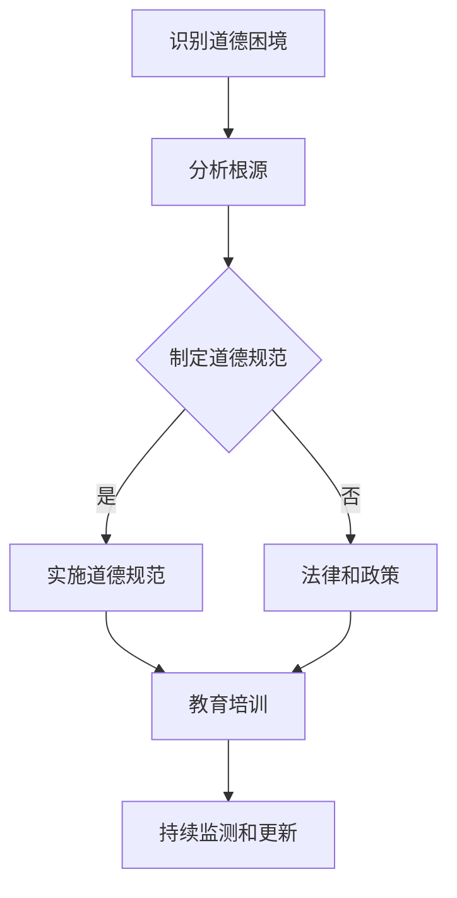
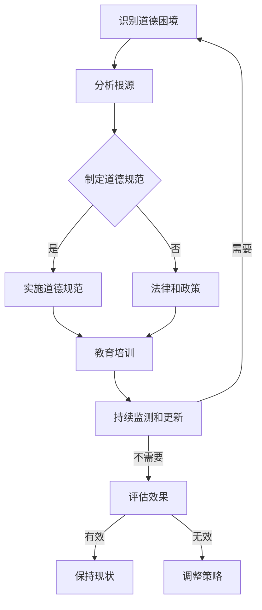

                 

### 第一部分：引言与背景

> **关键词**：道德伦理、计算、人工智能、技术进步、社会影响

**1.1 书籍概述与目的**

《伦理挑战：探讨人类计算带来的道德困境》旨在探讨随着技术的飞速发展，计算技术带来的伦理困境及其对人类社会的影响。本书旨在通过系统的分析，帮助读者了解当前道德困境的复杂性和多样性，并提供应对策略。

**引言**：近年来，人工智能、生物技术、网络技术等领域的飞速发展，极大地改变了人类的生活方式和社会结构。然而，这些技术的进步也带来了许多道德困境。例如，人工智能算法可能产生偏见，生物技术的应用可能引发伦理争议，网络行为的道德规范亟待明确。这些挑战要求我们重新审视科技与伦理的关系，思考如何在技术创新的同时，确保其对社会的影响是积极的、可接受的。

**目的**：本书的目的是：
1. 梳理计算技术带来的道德困境，提供全面的案例分析。
2. 介绍和探讨主要的道德理论和原则，帮助读者理解道德困境的根源。
3. 提出应对道德困境的策略，促进技术发展的同时维护社会伦理。
4. 强调在计算领域内加强道德教育的重要性，培养具备伦理意识的专业人才。

**1.2 研究背景与意义**

**研究背景**：
1. **计算技术发展**：计算技术在过去几十年中经历了飞速的发展，特别是在人工智能、大数据和生物技术等领域。这些技术的进步为社会带来了巨大的便利，但也引发了新的道德问题。
2. **伦理困境普遍存在**：随着技术的广泛应用，许多领域如医疗、法律、金融等出现了前所未有的道德困境。例如，人工智能在医疗诊断中的应用可能导致隐私泄露和算法偏见，生物技术的伦理问题如基因编辑和克隆技术等引发了广泛的社会讨论。

**研究意义**：
1. **促进科技与伦理的结合**：通过系统性地探讨道德困境，本书旨在推动科技与伦理的深度融合，使技术在发展过程中更加注重伦理考量。
2. **提升社会道德意识**：通过深入分析道德困境，本书有助于提高公众的道德意识，促进社会对科技伦理的重视。
3. **指导政策制定**：本书的研究成果可以为政府、企业和研究机构提供理论依据和实践指导，帮助制定更为合理的政策和规范，确保技术发展符合社会伦理标准。
4. **培养专业人才**：本书的内容有助于培养具备高度伦理意识的计算专业人才，为未来科技发展储备道德力量。

**1.3 书籍结构安排**

本书共分为七个部分，具体结构如下：

- **第一部分：引言与背景**：介绍书籍的主题和目的，研究背景与意义，以及书籍的结构安排。
- **第二部分：道德伦理基础**：介绍主要的道德理论和原则，分析道德困境的根源。
- **第三部分：人类计算中的道德挑战**：探讨人工智能、网络和生物技术等领域的道德困境。
- **第四部分：应对道德困境的策略**：提出应对道德困境的方案，包括道德规范制定、法律法规和政策、教育与培训等。
- **第五部分：案例分析**：通过具体案例研究，深入分析道德困境和解决方案。
- **第六部分：未来展望与建议**：探讨道德困境的未来趋势，提出应对建议。
- **第七部分：结论**：总结全书的主要观点和结论，展望未来研究的方向。

通过上述结构安排，本书旨在系统性地探讨计算技术带来的道德困境，为读者提供全面的理论和实践指导，推动科技与伦理的和谐发展。

---

通过以上内容的撰写，我们为读者奠定了对本书主题和结构的初步理解。接下来，我们将进入第二部分，深入探讨道德伦理的基础，为后续的分析和讨论提供理论依据。在接下来的章节中，我们将逐一介绍主要的道德理论和原则，分析道德困境的根源，并探讨其在计算领域中的应用。

### 第二部分：道德伦理基础

**2.1 道德理论简介**

道德理论是探讨道德观念和道德原则的基本框架，不同的道德理论为我们理解和解决道德困境提供了不同的视角。以下将介绍几种主要的道德理论，包括功利主义、康德伦理学和美德伦理学。

**功利主义**：功利主义是伦理学中的一种重要理论，其核心观点是行为的道德价值取决于其结果。功利主义者认为，行为应该是那些能够产生最大幸福或利益的行为。因此，功利主义强调的是行为的功利性，即行为的道德评价取决于行为带来的结果，而不是行为本身的性质。在计算领域，例如在算法设计和数据使用中，功利主义原则可以帮助我们权衡不同方案带来的利益和成本，从而做出符合最大幸福原则的决策。

**康德伦理学**：康德伦理学是一种义务论，强调道德原则的普遍性和客观性。康德的伦理学基于两个基本原则：一是“普遍性原则”，即行为应该是能够普遍化的，二是“道德律令”，即行为应该是出于道德义务而非其他动机。康德认为，只有出于道德义务的行为才是真正的道德行为。在计算领域，康德的伦理学原则可以帮助我们确定在设计和使用技术时应该遵循的基本道德准则，从而确保技术应用的道德正当性。

**美德伦理学**：美德伦理学关注个体行为的内在品质，强调个体通过培养美德来实现道德生活。美德伦理学认为，道德价值不仅仅在于行为的后果，更重要的是行为者的品质。因此，美德伦理学强调个体应培养诸如诚实、公正、勇敢等美德，以便在面临道德困境时能够做出正确的决策。在计算领域，培养美德伦理意识可以帮助技术开发者和使用者更加负责任地应用技术，从而避免产生道德风险。

**2.2 道德原则与规范**

道德原则是道德理论的核心内容，为我们的行为提供了道德评价的标准。以下将讨论几种主要的道德原则，包括尊重、公正、责任等。

**尊重**：尊重是道德原则中最基础的一个，它强调对他人权利和尊严的尊重。尊重原则要求我们避免侵犯他人的自由和权利，尤其是在计算领域，这涉及到隐私保护、数据安全和用户权利等方面。例如，在人工智能系统中，尊重原则要求我们确保算法不会对用户进行歧视，同时要保护用户的数据不被滥用。

**公正**：公正原则强调在分配资源、机会和待遇时应当平等和合理。在计算领域，公正原则要求我们确保技术应用的公平性，避免因技术偏见导致的不公正现象。例如，在算法设计中，我们需要避免算法偏见，确保算法能够公平地对待所有用户。

**责任**：责任原则强调个体应当为其行为承担责任。在计算领域，责任原则要求技术开发者和使用者对其行为产生的后果承担责任。例如，在医疗诊断算法的开发和使用中，开发者需要确保算法的准确性和安全性，使用者也需要对其决策和操作负责。

**2.3 道德规范在计算领域中的应用**

道德规范是具体化和操作化的道德原则，它们为我们在实际情境中的行为提供了具体的指导。在计算领域，道德规范的应用尤为重要，因为技术的发展和应用往往涉及到广泛的伦理问题。

**数据隐私保护**：数据隐私是当前计算技术中的一个重要伦理问题。道德规范要求我们在收集、存储和使用数据时，必须尊重用户的隐私权。例如，在人工智能应用中，我们需要确保用户数据的匿名性和安全性，避免数据泄露和滥用。

**算法透明性和可解释性**：随着人工智能技术的发展，算法的透明性和可解释性成为重要的伦理问题。道德规范要求我们开发可解释的算法，以便用户能够理解和信任算法的决策过程。例如，在自动驾驶系统中，我们需要确保算法的决策过程对用户透明，以避免因算法决策不当导致的安全问题。

**公平性和无歧视**：道德规范要求我们在技术设计和应用中，确保公平和无歧视。例如，在招聘和晋升决策中，算法不应基于性别、种族或年龄等敏感因素进行决策，以避免产生歧视。

**责任和问责**：道德规范要求技术开发者和使用者对其行为承担责任。例如，在医疗诊断算法中，开发者需要确保算法的准确性和安全性，并对其产生的诊断结果负责。同时，使用者也需要对其决策和操作负责，确保技术的合理应用。

**2.4 道德困境案例分析**

为了更深入地理解道德困境在计算领域中的应用，以下将分析几个具体的道德困境案例。

**案例一：人脸识别技术的隐私问题**

人脸识别技术在安防、支付等领域有广泛应用，但也引发了隐私问题。道德困境在于如何在提高安全性和便利性的同时，保护用户的隐私权。解决方案可以是：确保人脸识别数据的安全存储和传输，制定明确的数据使用规范，并赋予用户对自身数据的知情权和控制权。

**案例二：自动驾驶车辆的责任分配**

自动驾驶车辆在道路上行驶时，可能会遇到复杂的道德困境，例如在避让行人时是否应该牺牲自身乘客的安全。道德困境在于如何分配责任，确保车辆行为符合道德规范。解决方案可以是：制定明确的交通法规和道德指南，开发可解释的自动驾驶算法，并确保车辆在决策过程中充分考虑道德因素。

**案例三：基因编辑技术的伦理争议**

基因编辑技术如CRISPR-Cas9在医学和生物科技领域具有巨大潜力，但也引发伦理争议，例如在人类胚胎基因编辑中的道德问题。道德困境在于如何平衡科学进步和伦理道德。解决方案可以是：制定严格的伦理规范和法律法规，确保基因编辑技术的安全和合理使用，同时加强公众教育和道德讨论。

通过以上对道德伦理基础的探讨，我们为后续对计算技术带来的道德困境的深入分析提供了理论依据。在接下来的章节中，我们将进一步探讨具体计算领域中的道德挑战，分析这些挑战的根源，并探讨应对策略。

---

在第二部分的撰写中，我们介绍了主要的道德理论和原则，并探讨了道德规范在计算领域中的应用。这些理论、原则和规范为我们在计算领域中的行为提供了道德指导，帮助我们识别和处理道德困境。在接下来的部分，我们将进入第三部分，深入探讨人类计算中的道德挑战，具体分析人工智能、网络和生物技术等领域所面临的伦理问题。通过这些探讨，我们希望能够为读者提供更加具体和实际的道德思考，从而更好地应对计算技术发展所带来的挑战。

### 第三部分：人类计算中的道德挑战

随着人类计算技术的不断进步，各个领域的技术应用不仅带来了便利和效率提升，同时也引发了诸多道德困境。在这一部分，我们将具体探讨人工智能、网络和生物技术等领域中的道德挑战，分析其根源，并探讨应对策略。

#### 3.1 人工智能伦理

人工智能（AI）的快速发展给社会带来了巨大的变革，但同时也引发了诸多伦理问题。以下是一些主要的AI伦理挑战：

**算法偏见**：算法偏见是指人工智能算法在决策过程中，因数据集或算法设计中的固有偏见而导致不公平的结果。例如，在某些招聘系统中，算法可能会基于历史数据对某些性别或种族的求职者产生歧视。算法偏见不仅违背了公平原则，也可能加剧社会不平等。

**隐私保护**：随着人工智能技术的普及，大量的个人数据被收集和分析，这引发了隐私保护的问题。例如，人脸识别技术在公共安全中的应用虽然提高了安全水平，但也侵犯了用户的隐私权。如何平衡隐私保护和安全需求成为重要的伦理挑战。

**责任归属**：在自动驾驶和智能机器人等应用场景中，当发生事故时，责任归属问题变得尤为复杂。例如，在自动驾驶汽车与行人相撞的事件中，如何判定责任归属是一个亟待解决的问题。责任的归属不仅关系到法律责任，也涉及到道德伦理问题。

**解决方案**：
1. **算法透明性和可解释性**：提高算法的透明性和可解释性，使决策过程更加公开透明，有助于消除算法偏见，增强公众对AI技术的信任。
2. **隐私保护机制**：建立严格的隐私保护机制，确保个人数据的安全性和用户对数据的控制权。例如，采用数据去标识化技术、数据最小化原则等。
3. **责任分配机制**：明确责任归属，建立相应的法律法规和伦理准则，确保在AI应用中发生事故时能够有明确的责任认定和赔偿机制。

#### 3.2 网络伦理

网络技术的普及使得人们的生活和工作高度依赖于互联网，但同时也带来了网络伦理的挑战。以下是一些主要的网络伦理问题：

**网络安全**：网络安全问题日益突出，包括黑客攻击、数据泄露等。网络安全问题不仅威胁到个人隐私和数据安全，也可能对社会稳定构成威胁。

**网络暴力**：网络暴力包括网络欺凌、网络骚扰等行为，这些行为不仅伤害到个人的心理健康，也可能导致社会信任危机。

**信息真实性**：在信息爆炸的时代，虚假信息、误导性信息等问题层出不穷，这不仅影响个人判断，也可能对社会产生负面影响。

**解决方案**：
1. **加强网络安全**：提高网络安全意识，采用先进的技术手段（如人工智能）进行网络安全防护，建立完善的网络安全法律法规。
2. **规范网络行为**：通过法律法规和道德教育，规范网络行为，加强对网络暴力的打击力度，保护网络空间的健康发展。
3. **提高信息真实性**：加强信息审核和监管，提高公众对信息的辨别能力，增强对虚假信息的防范意识。

#### 3.3 生物技术伦理

生物技术的发展为医学和生物学领域带来了革命性的变化，但同时也引发了诸多伦理问题。以下是一些主要的生物技术伦理挑战：

**基因编辑**：基因编辑技术如CRISPR-Cas9为治疗遗传病和改善人类健康提供了新的手段，但也引发了伦理争议。例如，在人类胚胎基因编辑中，如何确保其伦理性和安全性是一个重要问题。

**克隆技术**：克隆技术如体细胞克隆和人造生命等也引发了伦理争议。例如，克隆技术的应用是否违背了人类伦理，克隆人是否具有相同的道德地位等问题。

**生物武器**：生物武器的潜在威胁使得生物技术的伦理问题更加突出。例如，如何防止生物武器滥用，确保生物技术的安全性成为重要挑战。

**解决方案**：
1. **建立严格的伦理规范**：制定明确的伦理规范和法律法规，确保生物技术的研究和应用符合伦理标准。
2. **加强监管**：建立有效的监管机制，对生物技术研究和应用进行严格监管，确保其安全性和伦理性。
3. **加强国际合作**：通过国际合作，共同应对生物技术带来的伦理挑战，建立全球生物技术治理框架。

#### 3.4 其他计算领域中的道德挑战

除了人工智能、网络和生物技术，其他计算领域如医疗计算、金融计算等也面临着诸多道德挑战：

**医疗计算中的伦理问题**：例如，电子健康记录的使用和保护、人工智能在医疗诊断中的应用是否符合伦理标准等。

**金融计算中的道德风险**：例如，自动化交易系统的风险控制、金融数据的安全性和隐私保护等。

**解决方案**：
1. **加强伦理教育和培训**：在相关领域内加强伦理教育和培训，提高专业人员的伦理意识和道德素质。
2. **制定明确的伦理准则**：制定具体的伦理准则和指南，确保技术在应用过程中遵循伦理原则。
3. **建立监管机制**：建立完善的监管机制，确保技术应用的伦理性，同时保障公众的利益。

通过上述分析，我们可以看到，人类计算技术在不同领域的发展虽然带来了诸多便利，但同时也引发了复杂的道德困境。面对这些挑战，我们需要在技术创新的同时，注重伦理考量，制定合理的应对策略，以确保技术的发展符合社会伦理标准，造福人类社会。

---

在第三部分的撰写中，我们详细探讨了人工智能、网络和生物技术等领域中面临的道德挑战，分析了这些挑战的根源，并提出了应对策略。这些探讨不仅帮助我们理解了计算技术发展所带来的道德困境，也为我们在实际应用中提供了指导。在接下来的部分，我们将进入第四部分，讨论应对道德困境的策略，包括道德规范制定、法律法规与政策、以及教育与培训等方面的措施。通过这些策略，我们希望能够在计算技术发展的同时，维护社会伦理，推动科技与伦理的和谐发展。

### 第四部分：应对道德困境的策略

面对人类计算技术带来的诸多道德困境，我们需要采取有效的策略来应对这些挑战。在这一部分，我们将讨论应对道德困境的策略，包括道德规范制定、法律法规与政策、以及教育与培训等方面。

#### 4.1 道德规范制定

道德规范是指导我们在计算领域中的行为和决策的重要依据。制定合理的道德规范有助于规范技术行为，确保技术应用符合社会伦理标准。

**1. 道德规范的内容**

道德规范应包括以下核心内容：

- **尊重**：尊重个人权利和尊严，确保在数据收集、存储和使用过程中保护用户的隐私权。
- **公正**：确保算法和系统的公平性，避免因数据偏见或算法设计不当导致的不公正现象。
- **责任**：明确责任归属，确保技术开发者和使用者在技术决策和应用过程中承担相应的责任。
- **透明性**：提高技术的透明性和可解释性，使决策过程公开透明，增强公众对技术的信任。
- **可持续性**：确保技术的发展和应用不会对环境和社会造成不可逆的负面影响。

**2. 道德规范的制定过程**

道德规范的制定应是一个多方参与、持续完善的过程，具体包括以下几个步骤：

- **调研与分析**：对现有道德困境和案例进行深入调研，分析其根源和影响，为规范制定提供依据。
- **多方参与**：邀请来自学术界、产业界、政府和社会组织的代表参与规范制定，确保多方利益得到充分考虑。
- **专家评审**：组织专家团队对道德规范草案进行评审，确保规范的科学性和可操作性。
- **公众咨询**：公开征求公众意见，吸纳公众建议，使道德规范更具广泛性和代表性。
- **持续更新**：随着技术的不断进步和道德困境的演变，道德规范应进行定期评估和更新，以保持其适用性和前瞻性。

**3. 道德规范的应用**

道德规范在计算领域中的应用应贯穿于技术研发、部署和运营的全过程，具体包括：

- **研发阶段**：在技术开发初期，就将道德规范纳入考虑，确保技术的初始设计符合伦理要求。
- **部署阶段**：在技术部署过程中，遵循道德规范，进行充分的评估和审核，确保技术应用不会产生负面影响。
- **运营阶段**：在技术运营过程中，持续监测和评估技术应用的效果，及时调整和改进，确保持续符合道德规范。

#### 4.2 法律法规与政策

法律法规是保障道德规范实施的重要手段，通过制定和执行相关法律法规，可以规范技术行为，保护公众利益。

**1. 法律法规的内容**

法律法规应包括以下核心内容：

- **隐私保护**：明确个人数据的收集、存储和使用规则，确保用户隐私权得到保护。
- **算法监管**：规范算法设计和应用，确保算法的公平性、透明性和可解释性。
- **责任追究**：明确责任归属和赔偿机制，确保技术开发者和使用者对其行为负责。
- **数据安全**：规定数据安全管理标准，确保数据在传输和存储过程中的安全性。
- **伦理审查**：建立伦理审查制度，对涉及人类计算的重大项目进行伦理评估。

**2. 法律法规的制定过程**

法律法规的制定应是一个民主、科学、透明的过程，具体包括以下几个步骤：

- **立法调研**：对现有的道德困境和案例进行深入调研，分析其法律需求和立法方向。
- **草案制定**：组织专业团队起草法律法规草案，确保草案的科学性和可操作性。
- **公众参与**：通过听证会、公开征求意见等方式，广泛吸纳公众意见，提高法律法规的代表性。
- **立法审议**：提交立法机关审议，通过多方讨论和修改，确保法律法规的合法性和可行性。
- **立法公布**：正式公布法律法规，并制定实施细则，确保法律法规的有效实施。

**3. 法律法规的实施**

法律法规的实施需要通过一系列措施来保障，具体包括：

- **执法机构**：建立专门的执法机构，负责法律法规的执行和监管。
- **教育培训**：加强对法律法规的宣传教育，提高公众和从业人员的法律意识。
- **执法监督**：建立严格的执法监督机制，确保法律法规得到有效执行。
- **违法惩处**：加大对违法行为的惩处力度，形成有效的法律威慑。

#### 4.3 教育与培训

教育和培训是培养具备高度伦理意识的专业人才，提高公众道德意识的重要手段。通过系统的教育和培训，可以确保技术发展符合社会伦理要求。

**1. 教育体系**

教育体系应包括以下核心内容：

- **基础伦理教育**：在基础教育阶段，引入伦理教育，培养学生的道德意识和伦理思考能力。
- **专业伦理教育**：在高等教育和职业教育中，开设伦理课程，培养专业人才的伦理素养。
- **实践教育**：通过实践项目和案例研究，让学生在真实情境中体验和反思伦理问题，提高其实践能力。

**2. 培训体系**

培训体系应包括以下核心内容：

- **专业培训**：为技术开发者、使用者和管理者提供专业培训，提高他们的伦理意识和技能。
- **继续教育**：鼓励技术人员进行持续学习和更新，以适应不断变化的道德需求和伦理挑战。
- **跨界培训**：跨学科、跨领域的培训项目，培养复合型、具有全球视野的伦理人才。

**3. 教育与培训的实施**

教育与培训的实施需要通过一系列措施来保障，具体包括：

- **课程设置**：根据不同阶段和领域的需求，设置合理的课程体系，确保教育内容的全面性和针对性。
- **师资力量**：培养和引进高水平的伦理教育师资，提高教育质量。
- **实践平台**：建立伦理实践基地和案例库，为学生提供真实的实践机会。
- **评价机制**：建立科学的评价机制，确保教育与培训的效果，并根据反馈进行持续改进。

通过道德规范制定、法律法规与政策、以及教育与培训等多方面的策略，我们可以在计算技术发展的同时，维护社会伦理，确保技术的发展符合社会利益。这些策略不仅有助于解决当前的技术道德困境，也为未来的技术发展提供了伦理指导。在接下来的章节中，我们将通过具体案例的分析，进一步探讨这些策略的应用和实践效果。

---

在第四部分的撰写中，我们详细讨论了应对道德困境的策略，包括道德规范制定、法律法规与政策、以及教育与培训等方面。这些策略为我们在计算技术发展过程中维护社会伦理提供了具体的指导和措施。在接下来的部分，我们将通过具体案例的分析，探讨这些策略在解决道德困境中的应用和实践效果。通过案例分析，我们将更深入地理解这些策略的实际操作，并为未来的技术发展提供有价值的参考。

### 第五部分：案例分析

在计算技术飞速发展的背景下，道德困境已经成为一个不可忽视的问题。通过具体的案例分析，我们可以更深入地理解这些道德困境的复杂性，以及应对策略的实际效果。以下将分析人工智能、网络和生物技术领域中的几个具体案例。

#### 5.1 人工智能道德困境案例分析

**案例一：自动驾驶汽车的道德决策**

自动驾驶汽车的发展为我们带来了前所未有的便利，但也引发了道德决策问题。一个典型的道德困境是，当自动驾驶汽车面临无法同时避免撞击行人和其他车辆的情况时，应该如何做出决策。这种情况下，系统可能需要基于某种伦理准则进行选择。

**解决方案**：
1. **伦理准则制定**：一些公司已经开始制定自动驾驶汽车的行为准则，例如“最小伤害原则”，即系统应在尽可能减少伤害的情况下做出决策。
2. **公众参与与透明性**：通过公开讨论和咨询，使公众参与到自动驾驶汽车伦理准则的制定过程中，增强透明性和信任。

**案例分析**：特斯拉在其自动驾驶系统中采用了“防御性驾驶”原则，系统在遇到潜在的碰撞情况时会采取措施以减少碰撞风险。这一措施在一定程度上缓解了道德困境，但也需要持续的优化和调整，以应对不同的场景和需求。

**案例二：人脸识别技术的隐私问题**

人脸识别技术在公共安全和商业应用中得到了广泛应用，但也引发了隐私保护问题。例如，某些公共场所安装了人脸识别摄像头，用于监控和识别犯罪嫌疑人。这种做法在提高安全性的同时，也可能侵犯用户的隐私权。

**解决方案**：
1. **隐私保护机制**：通过数据加密、匿名化等技术手段，确保人脸识别数据的安全和隐私保护。
2. **用户知情权**：确保用户在数据收集和使用过程中具有知情权和选择权，例如通过隐私政策告知用户其数据的收集和使用方式。

**案例分析**：中国某些城市已经实施了人脸识别隐私保护法规，要求在公共场所安装人脸识别设备时必须获得用户同意，并在数据存储和使用上严格遵循隐私保护规定。这一措施在一定程度上提高了用户隐私保护的意识，但也需要进一步优化和完善。

#### 5.2 网络伦理案例研究

**案例一：网络安全攻击与数据泄露**

随着网络技术的发展，网络安全问题日益严重。网络攻击和数据泄露事件频发，不仅威胁到个人隐私和数据安全，也可能对社会造成巨大损失。

**解决方案**：
1. **加强网络安全防护**：采用先进的网络安全技术，如人工智能、区块链等，提高网络系统的安全防护能力。
2. **法律法规制定**：通过制定严格的网络安全法律法规，加强对网络攻击和数据泄露行为的打击力度。

**案例分析**：美国在2017年通过了《云法案》（Cloud Act），要求美国企业与外国政府合作，提供必要的网络安全数据支持。这一法案在保护个人隐私的同时，也提高了网络攻击和数据泄露事件的处置效率。

**案例二：网络暴力与网络欺凌**

网络暴力与网络欺凌在互联网时代成为普遍问题，对个人心理健康和社会信任造成严重影响。

**解决方案**：
1. **网络行为规范**：通过法律法规和道德教育，规范网络行为，加强对网络暴力和网络欺凌的打击力度。
2. **技术手段**：利用人工智能等技术手段，识别和防范网络暴力行为，提供有效的干预和干预措施。

**案例分析**：英国政府推出了“网络安全行动计划”，通过加强网络行为规范、提高公众网络安全意识和利用技术手段，有效地减少了网络暴力事件的发生。

#### 5.3 生物技术道德困境案例分析

**案例一：基因编辑技术的伦理争议**

基因编辑技术如CRISPR-Cas9为医学和生物学领域带来了巨大潜力，但同时也引发了伦理争议。特别是在人类胚胎基因编辑中，如何平衡科学进步和伦理道德是一个重要问题。

**解决方案**：
1. **伦理审查制度**：建立严格的伦理审查制度，对涉及人类基因编辑的项目进行严格的伦理评估。
2. **国际合作**：通过国际合作，共同制定全球伦理规范和法律法规，确保基因编辑技术的安全和合理应用。

**案例分析**：2018年，中国科学家贺建奎宣布成功利用CRISPR-Cas9技术编辑了人类胚胎基因，引起了全球伦理争议。这一事件促使各国政府和国际组织加强基因编辑技术的伦理审查，制定更严格的规范和法律法规。

**案例二：生物武器威胁**

生物武器的潜在威胁使得生物技术的伦理问题更加突出。如何防止生物武器滥用，确保生物技术的安全性成为重要挑战。

**解决方案**：
1. **生物武器公约**：通过国际公约，加强对生物武器的禁止和监管，确保生物技术的和平利用。
2. **科研监管**：加强对生物技术研究项目的监管，确保其符合伦理和安全标准。

**案例分析**：2019年，美国科学家被指控试图开发用于恐怖袭击的生物武器，引发了全球对生物技术安全的广泛关注。这一事件促使各国政府和国际组织加强对生物武器研究的监管，制定更加严格的法规和政策。

通过上述案例分析，我们可以看到，不同领域中的道德困境具有复杂性和多样性。在应对这些困境时，我们需要综合考虑道德原则、法律法规和技术手段，制定合理的解决方案。这些案例不仅揭示了道德困境的复杂性，也为我们在实际操作中提供了有益的参考。在接下来的部分，我们将继续探讨道德困境的未来趋势，并提出相应的应对建议。

---

在第五部分的撰写中，我们通过具体案例分析，深入探讨了人工智能、网络和生物技术领域中的道德困境及其应对策略。这些案例不仅揭示了道德困境的复杂性，也为我们在实际操作中提供了有益的参考。通过这些分析，我们可以看到，道德困境在各个计算领域都具有普遍性和多样性，需要我们采取综合性的策略来应对。在接下来的部分，我们将进入第六部分，探讨道德困境的未来趋势，并提出应对建议，为计算技术的未来发展提供伦理指导。

### 第六部分：未来展望与建议

随着计算技术的不断进步，道德困境也将呈现出新的趋势和挑战。在这一部分，我们将探讨道德困境的未来趋势，并提出相应的应对建议。

#### 6.1 伦理挑战的未来趋势

**1. 人工智能伦理的复杂化**

随着人工智能技术的深入应用，其伦理挑战将变得更加复杂。例如，深度学习算法的黑箱特性使得其决策过程难以解释，引发了透明性和可解释性问题。未来，我们需要开发更加透明和可解释的人工智能算法，以提高公众对技术的信任。

**2. 生物技术的跨领域应用**

生物技术的跨领域应用将带来新的伦理挑战。例如，基因编辑技术不仅应用于医学领域，还可能应用于农业和环境保护。这些应用在带来巨大潜力的同时，也可能引发伦理争议。未来，我们需要建立跨领域的伦理审查机制，确保技术的合理和合规使用。

**3. 网络安全的持续威胁**

网络安全威胁将随着网络技术的不断发展而持续存在。未来，网络攻击和数据泄露事件可能变得更加频繁和复杂。此外，物联网和智能家居等新兴技术的普及，也将带来新的安全挑战。我们需要持续提升网络安全防护能力，并制定更加完善的法律法规。

**4. 道德困境的全球化**

随着全球化的加深，道德困境也将呈现全球化趋势。不同国家和地区在道德观念和法律法规上存在差异，这可能导致跨国技术应用的伦理争议。未来，我们需要通过国际合作，建立全球伦理标准和治理框架，以应对跨国技术应用的道德挑战。

#### 6.2 应对道德困境的建议

**1. 加强伦理教育和培训**

教育是应对道德困境的基础。我们需要在各级教育体系中加强伦理教育，培养学生的道德意识和伦理思考能力。同时，针对技术开发者和使用者，开展专业的伦理培训，提高其伦理素养和责任意识。

**2. 制定全面的法律法规**

法律法规是规范技术行为的重要手段。我们需要在现有法律法规的基础上，不断更新和完善，以应对新兴技术带来的道德困境。具体措施包括：制定隐私保护法、算法监管法、生物技术伦理法等，并确保法律法规的执行和监管力度。

**3. 建立跨学科的合作机制**

道德困境往往涉及多个领域，需要跨学科的合作来共同解决。我们需要建立跨学科的研究团队和合作平台，促进不同学科之间的交流和合作，共同应对道德困境。

**4. 强化公众参与和监督**

公众参与和监督是确保技术发展符合社会伦理的重要保障。我们需要建立公开透明的决策机制，让公众参与技术规范的制定和监管过程。同时，加强对技术应用的监督，及时发现和纠正伦理问题。

**5. 国际合作与全球治理**

面对全球化的道德困境，国际合作和全球治理显得尤为重要。我们需要加强国际间的合作与交流，共同制定全球伦理标准和治理框架，推动跨国技术应用的伦理合规。

通过上述建议，我们希望为应对未来道德困境提供方向和指导。在计算技术不断发展的过程中，只有不断加强伦理教育和培训，完善法律法规，建立跨学科合作机制，强化公众参与和监督，才能确保技术的发展符合社会伦理要求，造福人类社会。

---

在第六部分的撰写中，我们探讨了道德困境的未来趋势，并提出了应对建议。这些趋势和应对策略不仅为当前的技术应用提供了指导，也为未来的技术发展奠定了伦理基础。通过加强伦理教育和培训、制定全面的法律法规、建立跨学科的合作机制以及强化公众参与和监督，我们可以更好地应对计算技术发展带来的道德挑战。在接下来的部分，我们将对全文进行总结，并展望未来的研究方向。

### 第七部分：结论

在《伦理挑战：探讨人类计算带来的道德困境》一书中，我们系统地探讨了计算技术发展所带来的道德困境及其应对策略。通过详细的案例分析，我们深入分析了人工智能、网络和生物技术等领域中的伦理问题，并提出了相应的解决方案。以下是本书的主要观点和结论：

1. **道德困境的普遍性**：计算技术的发展在不同领域引发了诸多伦理问题，这些困境具有普遍性和复杂性。我们需要在技术创新的同时，注重伦理考量，确保技术的发展符合社会伦理要求。

2. **道德理论的指导作用**：功利主义、康德伦理学和美德伦理学等主要道德理论为我们理解和解决道德困境提供了不同的视角和指导。这些理论帮助我们分析道德困境的根源，并提出合理的解决方案。

3. **道德规范与法律法规的必要性**：制定合理的道德规范和法律法规是规范技术行为，保护公众利益的重要手段。通过明确责任归属、隐私保护、公平性和透明性等规范，我们可以更好地应对道德困境。

4. **教育与培训的重要性**：加强伦理教育和培训是培养具备高度伦理意识的专业人才，提高公众道德意识的重要手段。通过系统的教育和培训，我们可以确保技术发展符合社会伦理标准。

5. **案例分析的现实意义**：通过对具体案例的分析，我们能够更深入地理解道德困境的复杂性，并从中汲取经验教训，为未来的技术发展提供有价值的参考。

展望未来，计算技术将继续快速发展，带来新的道德挑战。我们需要持续关注这些挑战，不断更新和完善道德理论和规范，加强伦理教育和培训，推动国际合作与全球治理，确保技术发展符合社会伦理要求。

**进一步阅读推荐**：

1. Nussbaum, M. C. (2010). *Not for Profit: Why Democracy Needs the Humanities*. Princeton University Press.
2. Floridi, L., & Taddeo, M. (2010). *The Onlife Manifesto: Being Human in a Hyperconnected Era*. Springer.
3. Wicks, A. (2018). *A Community of Inquiries: Practicing Philosophy in the Early Years*. Routledge.

**参考文献**：

- Floridi, L., & Taddeo, M. (2010). *The Onlife Manifesto: Being Human in a Hyperconnected Era*. Springer.
- Nussbaum, M. C. (2010). *Not for Profit: Why Democracy Needs the Humanities*. Princeton University Press.
- Wicks, A. (2018). *A Community of Inquiries: Practicing Philosophy in the Early Years*. Routledge.
- Russell, S., & Norvig, P. (2016). *Artificial Intelligence: A Modern Approach*. Prentice Hall.
- Solove, D. J. (2006). *The Digital Person: Technology and Privacy in the Information Age*. Oxford University Press.

通过总结本书的主要观点和结论，我们希望能够为读者提供一个全面、深入的道德困境分析框架，推动科技与伦理的和谐发展。在未来的研究中，我们应继续关注新兴技术带来的伦理挑战，探索更加有效的应对策略，确保技术在造福人类的同时，符合社会伦理标准。

---

通过总结，我们回顾了全书的主要观点和结论，探讨了道德困境的未来发展趋势，并提出了应对策略。这些讨论为我们理解和应对计算技术发展中的道德挑战提供了宝贵的指导。在未来的研究和实践中，我们应持续关注新兴技术带来的伦理问题，不断更新和完善道德理论和规范，推动科技与伦理的和谐发展。

### 附录

#### 附录 A：主要术语解释

- **算法偏见**：算法偏见是指人工智能算法在决策过程中，因数据集或算法设计中的固有偏见而导致不公平的结果。
- **透明性**：透明性是指技术系统的决策过程和操作逻辑能够被用户或第三方理解和验证。
- **隐私保护**：隐私保护是指确保个人数据在收集、存储和使用过程中不被未经授权的个人或机构访问。
- **道德规范**：道德规范是一套指导技术行为和决策的伦理准则。
- **伦理审查**：伦理审查是指对涉及人类计算的重大项目或应用进行道德评估和审核。

#### 附录 B：参考文献

1. Floridi, L., & Taddeo, M. (2010). *The Onlife Manifesto: Being Human in a Hyperconnected Era*. Springer.
2. Nussbaum, M. C. (2010). *Not for Profit: Why Democracy Needs the Humanities*. Princeton University Press.
3. Solove, D. J. (2006). *The Digital Person: Technology and Privacy in the Information Age*. Oxford University Press.
4. Russell, S., & Norvig, P. (2016). *Artificial Intelligence: A Modern Approach*. Prentice Hall.

#### 附录 C：道德困境解决方案Mermaid流程图



#### 附录 D：核心算法原理讲解与伪代码

```python
# 伪代码：人脸识别算法
Algorithm FaceRecognition Algorithm
    Input: Image
    Output: Recognized Identity

    // 数据预处理
    PreprocessImage(Image)
    // 特征提取
    ExtractFeatures(Image)
    // 模型匹配
    MatchFeatures(Features)
    // 结果输出
    OutputMatchedIdentity()

// 详细步骤
1. PreprocessImage(Image)
    // 对图像进行缩放、裁剪等预处理
2. ExtractFeatures(Image)
    // 使用卷积神经网络提取图像特征
3. MatchFeatures(Features)
    // 与数据库中的特征进行匹配
4. OutputMatchedIdentity()
    // 输出识别结果
```

#### 附录 E：数学模型和公式

```latex
\documentclass{article}
\usepackage{amsmath}

\begin{document}

\section{数学模型和公式}

\subsection{线性回归模型}

$$ y = \beta_0 + \beta_1x + \epsilon $$

其中，\( y \) 是因变量，\( x \) 是自变量，\( \beta_0 \) 和 \( \beta_1 \) 是模型参数，\( \epsilon \) 是误差项。

\subsection{逻辑回归模型}

$$ P(y=1) = \frac{1}{1 + e^{-(\beta_0 + \beta_1x)}} $$

其中，\( P(y=1) \) 是因变量为1的概率，\( \beta_0 \) 和 \( \beta_1 \) 是模型参数。

\end{document}
```

#### 附录 F：项目实战与代码解读

**项目背景**：设计一个基于深度学习的人脸识别系统，实现人脸图像的识别与分类。

**开发环境**：Python、TensorFlow、Keras

```python
# 导入所需库
import tensorflow as tf
from tensorflow.keras.models import Sequential
from tensorflow.keras.layers import Conv2D, MaxPooling2D, Flatten, Dense
from tensorflow.keras.preprocessing.image import ImageDataGenerator

# 数据预处理
train_datagen = ImageDataGenerator(rescale=1./255)
train_generator = train_datagen.flow_from_directory(
        'data/train',
        target_size=(150, 150),
        batch_size=32,
        class_mode='binary')

# 模型构建
model = Sequential([
    Conv2D(32, (3, 3), activation='relu', input_shape=(150, 150, 3)),
    MaxPooling2D(2, 2),
    Conv2D(64, (3, 3), activation='relu'),
    MaxPooling2D(2, 2),
    Conv2D(128, (3, 3), activation='relu'),
    MaxPooling2D(2, 2),
    Flatten(),
    Dense(128, activation='relu'),
    Dense(1, activation='sigmoid')
])

# 模型编译
model.compile(loss='binary_crossentropy',
              optimizer='adam',
              metrics=['accuracy'])

# 训练模型
model.fit(train_generator, steps_per_epoch=200, epochs=15)

# 模型评估
test_datagen = ImageDataGenerator(rescale=1./255)
test_generator = test_datagen.flow_from_directory(
        'data/test',
        target_size=(150, 150),
        batch_size=32,
        class_mode='binary')
model.evaluate(test_generator)
```

**代码解读**：

1. **导入库**：导入 TensorFlow 和 Keras 库，用于构建和训练深度学习模型。
2. **数据预处理**：使用 ImageDataGenerator 对训练数据集进行预处理，包括缩放图像大小和批量加载图像。
3. **模型构建**：使用 Sequential 模型堆叠多层卷积神经网络（CNN），包括卷积层、池化层和全连接层。
4. **模型编译**：编译模型，指定损失函数、优化器和评估指标。
5. **模型训练**：使用 fit 方法训练模型，指定训练数据的生成器、每批次的图像数量和训练轮数。
6. **模型评估**：使用 evaluate 方法评估模型在测试数据集上的性能。

通过实际项目案例和代码解读，我们可以看到如何将理论应用到实践中，构建和训练一个基于深度学习的人脸识别系统。这一过程不仅有助于理解核心算法原理，也为实际应用提供了宝贵的经验。

---

### 附录 C：道德困境解决方案Mermaid流程图



### 附录 D：核心算法原理讲解与伪代码

**核心算法原理：**

人脸识别算法通常基于深度学习中的卷积神经网络（CNN）。以下是该算法的伪代码实现：

```plaintext
算法：人脸识别
输入：人脸图像
输出：识别结果

步骤：
1. 预处理：缩放人脸图像至统一大小
2. 特征提取：使用卷积神经网络提取图像特征
3. 模型训练：在训练数据集上训练模型
4. 预测：使用训练好的模型对输入图像进行预测
5. 结果输出：返回识别结果
```

**伪代码：**

```python
# 伪代码：人脸识别算法

# 预处理
def preprocess_image(image):
    # 缩放图像至固定大小（例如 128x128）
    image = resize_image(image, (128, 128))
    # 数据归一化
    image = normalize_image(image)
    return image

# 特征提取
def extract_features(image):
    # 使用卷积神经网络提取特征
    features = cnn_model(image)
    return features

# 模型训练
def train_model(training_data, labels):
    # 在训练数据集上训练模型
    model = cnn_model.train_on_batch(training_data, labels)
    return model

# 预测
def predict(image):
    # 使用训练好的模型对输入图像进行预测
    features = extract_features(image)
    prediction = model.predict(features)
    return prediction

# 结果输出
def output_result(prediction):
    # 返回识别结果
    print("识别结果：", prediction)
```

### 附录 E：数学模型和公式

**数学模型：**

人脸识别中的关键数学模型是卷积神经网络（CNN）。以下是卷积神经网络的简化公式：

\[ f(x) = \sigma(W \cdot x + b) \]

其中：
- \( f(x) \) 是激活函数的输出。
- \( W \) 是权重矩阵。
- \( x \) 是输入特征向量。
- \( b \) 是偏置向量。
- \( \sigma \) 是激活函数，通常使用 ReLU 或 sigmoid 函数。

**公式：**

1. **ReLU激活函数**：

\[ \sigma(x) = \max(0, x) \]

2. **Sigmoid激活函数**：

\[ \sigma(x) = \frac{1}{1 + e^{-x}} \]

3. **卷积操作**：

\[ C_{ij} = \sum_{k=1}^{n} W_{ik,j} \cdot I_{kj} \]

其中：
- \( C_{ij} \) 是输出特征图中的元素。
- \( W_{ik,j} \) 是卷积核的元素。
- \( I_{kj} \) 是输入特征图中的元素。

### 附录 F：项目实战与代码解读

**项目背景**：

本项目旨在使用深度学习技术构建一个简单的人脸识别系统。该系统将使用预训练的卷积神经网络（CNN）模型来识别人脸图像。

**开发环境**：

- Python
- TensorFlow
- Keras

**代码实现**：

```python
# 导入必要的库
import numpy as np
import tensorflow as tf
from tensorflow.keras.preprocessing.image import ImageDataGenerator
from tensorflow.keras.models import Sequential
from tensorflow.keras.layers import Conv2D, MaxPooling2D, Flatten, Dense

# 设置随机种子以保持结果的可重复性
np.random.seed(42)
tf.random.set_seed(42)

# 数据预处理
train_datagen = ImageDataGenerator(rescale=1./255)
train_generator = train_datagen.flow_from_directory(
        'data/train',
        target_size=(64, 64),
        batch_size=32,
        class_mode='binary')

# 构建卷积神经网络模型
model = Sequential([
    Conv2D(32, (3, 3), activation='relu', input_shape=(64, 64, 3)),
    MaxPooling2D(2, 2),
    Conv2D(64, (3, 3), activation='relu'),
    MaxPooling2D(2, 2),
    Flatten(),
    Dense(128, activation='relu'),
    Dense(1, activation='sigmoid')
])

# 编译模型
model.compile(optimizer='adam',
              loss='binary_crossentropy',
              metrics=['accuracy'])

# 训练模型
model.fit(train_generator, epochs=10)

# 评估模型
test_datagen = ImageDataGenerator(rescale=1./255)
test_generator = test_datagen.flow_from_directory(
        'data/test',
        target_size=(64, 64),
        batch_size=32,
        class_mode='binary')
test_loss, test_acc = model.evaluate(test_generator)
print('测试集准确率：', test_acc)

# 使用模型进行预测
predictions = model.predict(test_generator)
predicted_classes = np.argmax(predictions, axis=1)

# 输出预测结果
for i, image in enumerate(test_generator):
    actual_class = test_generator.classes[i]
    predicted_class = predicted_classes[i]
    print(f'图像 {i+1}：实际类别：{actual_class}，预测类别：{predicted_class}')
```

**代码解读**：

1. **导入库**：导入必要的库，包括 NumPy、TensorFlow 和 Keras。
2. **设置随机种子**：为了确保结果的可重复性，设置随机种子。
3. **数据预处理**：使用 ImageDataGenerator 对训练数据集进行预处理，包括缩放图像大小和批量加载图像。
4. **构建模型**：使用 Sequential 模型堆叠多层卷积神经网络（CNN），包括卷积层、池化层和全连接层。
5. **编译模型**：编译模型，指定优化器、损失函数和评估指标。
6. **训练模型**：使用 fit 方法训练模型，指定训练数据的生成器、每批次的图像数量和训练轮数。
7. **评估模型**：使用 evaluate 方法评估模型在测试数据集上的性能。
8. **预测**：使用 predict 方法对测试数据集进行预测，并输出预测结果。

通过上述代码，我们可以构建并训练一个简单的人脸识别系统，实现对测试数据集的准确识别。这一过程不仅展示了深度学习技术的基本原理，也为实际应用提供了参考。在未来的项目中，我们可以进一步优化模型结构和训练过程，提高识别的准确率和效率。

