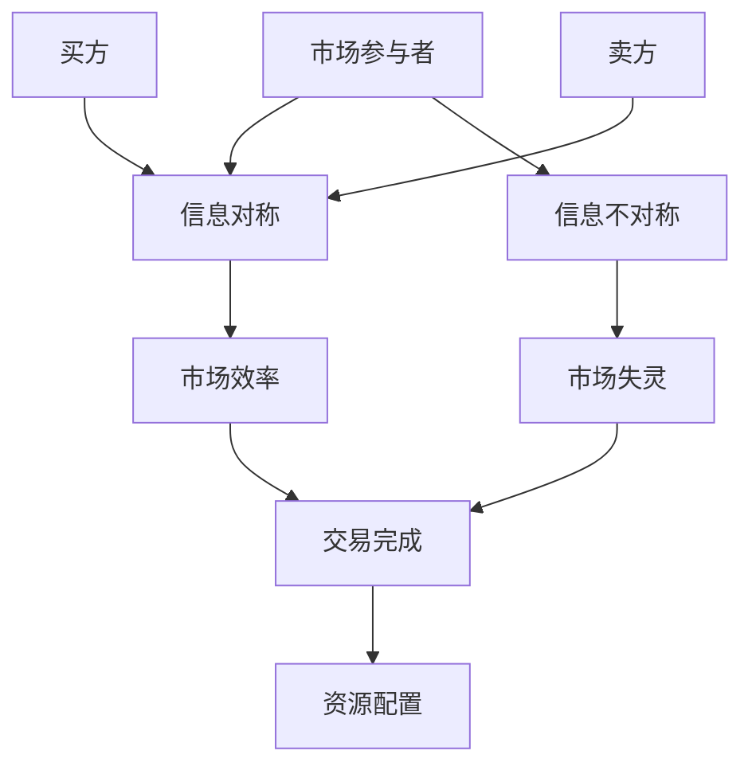

                 

### 信息差：信息不对称与消费者行为

> **关键词：** 信息不对称、消费者行为、市场效率、信号传递、隐私保护、广告策略

**摘要：** 本文从信息不对称的基本概念出发，探讨了信息不对称对消费者行为的影响，包括产品选择和价格决策。通过详细分析消费者对产品信息和价格信息的处理与反应，本文提出了信息不对称下的产品选择和价格决策策略。此外，本文还讨论了广告策略在信息不对称环境下的作用，以及消费者信息保护的重要性。最后，本文展望了信息不对称的未来趋势，并对消费者行为研究提出了启示。通过本文的讨论，我们希望读者能够更深入地理解信息不对称在市场中的作用，以及如何通过合理的策略来缓解信息不对称带来的负面影响。

---

### 《信息差：信息不对称与消费者行为》目录大纲

以下是本文的目录大纲：

1. **第一部分：信息不对称与消费者行为概述**
    - **第1章：信息不对称的基本概念与理论框架**
        - 1.1 信息不对称的定义与类型
        - 1.2 信息不对称的主要理论
        - 1.3 信息不对称对市场效率的影响
    - **第2章：消费者行为与信息不对称**
        - 2.1 消费者行为的传统理论
        - 2.2 信息不对称对消费者行为的影响
        - 2.3 信息不对称下的消费者决策模型
2. **第二部分：信息不对称下的消费者行为分析**
    - **第3章：信息不对称下的产品选择**
        - 3.1 产品信息的传递与接收
        - 3.2 消费者对产品信息的处理与评价
        - 3.3 信息不对称下的产品选择策略
    - **第4章：信息不对称下的价格决策**
        - 4.1 价格信息的传递与接收
        - 4.2 消费者对价格信息的处理与反应
        - 4.3 信息不对称下的价格决策策略
    - **第5章：信息不对称下的广告策略**
        - 5.1 广告的作用与分类
        - 5.2 信息不对称下的广告策略
        - 5.3 广告效果的评估
3. **第三部分：信息不对称的缓解与优化**
    - **第6章：消费者信息保护**
        - 6.1 消费者信息保护的重要性
        - 6.2 消费者信息保护的法律法规
        - 6.3 消费者信息保护的策略与实施
    - **第7章：企业信息优势的利用**
        - 7.1 企业信息优势的定义与类型
        - 7.2 企业信息优势的利用策略
        - 7.3 企业信息优势的可持续发展
    - **第8章：信息不对称的综合分析与展望**
        - 8.1 信息不对称与市场发展
        - 8.2 信息不对称的未来趋势
        - 8.3 对消费者行为研究的启示
4. **附录**
    - **附录A：信息不对称与消费者行为研究方法**
        - 8.1 实证研究方法概述
        - 8.2 实证研究的常用工具与技术
        - 8.3 案例研究：信息不对称与消费者行为分析实践
    - **附录B：信息不对称与消费者行为研究参考书目与文献**
        - 8.1 基础理论参考书目
        - 8.2 实证研究方法参考书目
        - 8.3 相关领域参考书目与文献

---

### 1.1 信息不对称的定义与类型

**信息不对称**是指在交易过程中，一方（买方或卖方）拥有比另一方更多的信息，从而导致交易双方在决策过程中存在信息上的差异。信息不对称可以分为以下几种类型：

- **完全信息不对称**：在这种极端情况下，卖方拥有所有关于产品或服务的详细信息，而买方则一无所知。例如，在二手市场交易中，卖家通常对商品的原始状况和过去的使用情况有详细了解，而买家则无法获得这些信息。

- **不完全信息不对称**：在更常见的情况下，交易双方都拥有部分信息，但彼此不完全了解对方的信息。例如，在保险市场中，保险公司可能知道某些客户的风险水平，而客户可能并不完全了解自己的风险状况。

- **隐藏特征不对称**：这种情况发生在卖方知道产品的真实特征，而买方无法得知。例如，在电子产品市场中，制造商可能知道产品的实际耐用性和性能，但消费者可能只能根据广告或他人的评价来做出购买决策。

- **隐藏行动不对称**：卖方可能故意隐藏其行为或意图，而买方无法察觉。例如，在金融市场，公司可能会隐瞒财务状况，以获得更高的股票价格。

- **隐藏知识不对称**：交易双方对未来的预期或概率分布存在差异。例如，在投资市场中，卖家可能对未来市场走势有更准确的预测，而买家则可能只能基于公开信息做出决策。

### 1.2 信息不对称的主要理论

信息不对称理论是经济学中的一个重要概念，它涉及到多个理论和模型。以下是几个主要的理论：

- **阿克洛夫（George A. Akerlof）的柠檬市场模型**：阿克洛夫在1970年提出了柠檬市场模型，用来描述二手车市场中的信息不对称问题。在二手市场中，卖家知道车辆的真实状况，而买家则无法准确判断，因此买家可能只愿意支付低于实际价值的价格，导致优质车辆被淘汰，市场上只剩下劣质车辆。这种情况被称为逆向选择。

- **斯蒂格利茨（Joseph E. Stiglitz）的信号传递理论**：斯蒂格利茨提出，在信息不对称的市场中，卖方可以通过传递信号来减少买方的疑虑。例如，卖家可以通过提供保修或认证来证明产品的质量。信号传递理论强调了在信息不对称环境中，信号的价值和质量的重要性。

- **机制设计理论**：机制设计理论探讨如何在存在信息不对称的情况下，设计出一种机制，使交易双方能够达到最优的结果。这个理论涉及到逆向拍卖、拍卖机制等设计，旨在确保市场效率。

### 1.3 信息不对称对市场效率的影响

信息不对称对市场效率有着显著的影响。以下是几个方面的影响：

- **逆向选择**：在信息不对称的市场中，买方可能因为担心购买到劣质产品而选择不购买，这会导致优质产品被淘汰，市场上只剩下劣质产品。这种情况会降低市场效率。

- **道德风险**：在信息不对称的情况下，卖方可能会采取不利于买方的行为。例如，卖家可能会降低服务质量，以提高自己的利润。这种道德风险会导致市场效率降低。

- **市场失灵**：信息不对称可能导致市场失灵，例如市场崩溃或市场无法有效配置资源。在极端情况下，市场可能会陷入长期低效的状态。

- **价格扭曲**：在信息不对称的市场中，价格可能无法准确反映产品的真实价值。例如，卖家可能会提高价格以弥补信息不对称带来的风险，而买方可能无法意识到这一点，从而导致市场价格的扭曲。

### Mermaid 流�程图

以下是关于信息不对称和市场效率的Mermaid流程图：



在这个流程图中，市场参与者（A）可以是买方（B）或卖方（C）。如果市场信息对称（D），则市场效率（F）较高，交易（H）可以顺利完成，从而实现资源配置（I）。相反，如果市场信息不对称（E），则市场效率（F）降低，可能导致市场失灵（G），最终影响交易和资源配置。

### 伪代码：消费者决策模型

为了更好地理解信息不对称对消费者决策的影响，我们可以通过以下伪代码来描述一个简单的消费者决策模型：

```python
# 定义消费者决策模型
class ConsumerDecisionModel:
    def __init__(self, budget, preferences, info_asymmetry):
        self.budget = budget
        self.preferences = preferences
        self.info_asymmetry = info_asymmetry

    # 根据预算和偏好评估产品效用
    def evaluate_utility(self, product):
        utility = 0
        for attribute, value in self.preferences.items():
            if attribute in product:
                utility += value * (1 - self.info_asymmetry)
        return utility

    # 在给定的产品列表中做出购买决策
    def make_decision(self, products):
        max_utility = 0
        best_product = None
        for product in products:
            product_utility = self.evaluate_utility(product)
            if product_utility > max_utility:
                max_utility = product_utility
                best_product = product
        return best_product

# 示例使用
consumer = ConsumerDecisionModel(budget=1000, preferences={'quality': 0.6, 'price': 0.4}, info_asymmetry=0.2)
products = [{'name': 'Product A', 'quality': 0.8, 'price': 500}, {'name': 'Product B', 'quality': 0.5, 'price': 300}]
best_product = consumer.make_decision(products)
print("Best product to buy:", best_product)
```

在这个模型中，`ConsumerDecisionModel` 类初始化时接收预算、偏好和信息不对称参数。`evaluate_utility` 方法计算每个产品的效用，考虑了消费者的偏好和信息不对称的影响。`make_decision` 方法在给定的产品列表中找到总效用最高的产品，并返回最佳购买选择。

### 数学模型：消费者期望效用函数

消费者期望效用函数是描述消费者在不同选择下获得效用的期望值。一个简化的消费者期望效用函数可以表示为：

$$
U(C) = \sum_{i=1}^{n} u_i(x_i) \cdot p_i
$$

其中，\( U(C) \) 是总效用，\( u_i(x_i) \) 是消费者对第 \( i \) 个产品的效用，\( p_i \) 是第 \( i \) 个产品的价格。假设消费者对产品的偏好是线性的，即每个产品属性对总效用的影响是相加的。

为了更具体地描述信息不对称对消费者效用的影响，我们可以引入一个信息不对称系数 \( \alpha \)，它表示消费者对产品真实信息的不确定性。这样，效用函数可以修正为：

$$
u_i(x_i) = u_i^0(x_i) \cdot (1 - \alpha \cdot \delta_i)
$$

其中，\( u_i^0(x_i) \) 是在没有信息不对称的情况下消费者对第 \( i \) 个产品的效用，\( \delta_i \) 是第 \( i \) 个产品的信息质量指标。信息质量指标越高，信息不对称的影响越小。

修正后的期望效用函数为：

$$
U(C) = \sum_{i=1}^{n} [u_i^0(x_i) \cdot (1 - \alpha \cdot \delta_i)] \cdot p_i
$$

### 举例说明：信息不对称对消费者购买决策的影响

假设有两个消费者，A和B，他们的预算均为1000元，偏好不同。消费者A更注重产品质量，而消费者B更注重价格。

市场上存在两种产品：

- **产品X**：质量高，价格1000元。
- **产品Y**：质量中等，价格500元。

消费者A对产品质量的偏好权重为0.8，对价格的偏好权重为0.2。消费者B对产品质量的偏好权重为0.5，对价格的偏好权重为0.5。

在没有信息不对称的情况下，消费者A会选择购买产品X，因为其总效用为：

$$
U(A) = 0.8 \cdot 1000 \cdot 0.8 + 0.2 \cdot 1000 \cdot 0.2 = 720 + 40 = 760
$$

消费者B会选择购买产品Y，因为其总效用为：

$$
U(B) = 0.5 \cdot 500 \cdot 0.5 + 0.5 \cdot 500 \cdot 0.5 = 250 + 250 = 500
$$

然而，在存在信息不对称的情况下，消费者A对产品X的质量信息不确定，假设其信息不对称系数为0.2。消费者B对产品Y的质量信息也不确定，信息不对称系数为0.1。

修正后的效用函数为：

$$
u_i^0(x_i) = u_i^0(x_i) \cdot (1 - 0.2 \cdot \delta_i) \quad \text{for Product X}
$$

$$
u_i^0(x_i) = u_i^0(x_i) \cdot (1 - 0.1 \cdot \delta_i) \quad \text{for Product Y}
$$

假设产品X的信息质量指标为0.8，产品Y的信息质量指标为0.6。

修正后的消费者A的总效用为：

$$
U(A) = 0.8 \cdot 1000 \cdot (1 - 0.2 \cdot 0.8) + 0.2 \cdot 1000 \cdot 0.2 = 640 + 40 = 680
$$

修正后的消费者B的总效用为：

$$
U(B) = 0.5 \cdot 500 \cdot (1 - 0.1 \cdot 0.6) + 0.5 \cdot 500 \cdot 0.5 = 237.5 + 250 = 487.5
$$

在这种情况下，消费者A和消费者B都会重新考虑他们的购买决策。消费者A可能会因为信息不对称而减少对高质量产品的偏好，消费者B可能会对中等质量的产品重新评估。

通过这个例子，我们可以看到信息不对称如何影响消费者的购买决策。消费者在做出决策时需要考虑到信息不对称的影响，这可能改变他们的选择，并导致市场效率的变化。

### 1.4 信息不对称的缓解策略

信息不对称会导致市场效率低下，但通过一些策略可以缓解这种不对称，从而提高市场效率。以下是一些常见的缓解信息不对称的策略：

- **信息公开**：通过提供更多的信息，减少买方和卖方之间的信息差距。例如，企业可以提供详细的产品规格、用户评价和保修政策，使消费者能够做出更明智的购买决策。

- **信号传递**：通过传递信号来降低消费者对产品质量的不确定性。例如，品牌认证、质量保证标志和售后服务承诺都是有效的信号。

- **第三方认证**：由独立的第三方机构对产品或服务进行评估和认证，为消费者提供可靠的质量保证。例如，国际标准组织（ISO）认证和绿色环保认证。

- **价格折扣**：提供价格折扣或促销活动，可以吸引消费者购买，从而减少逆向选择问题。例如，商家可能会在特定时期提供折扣，鼓励消费者购买。

- **保险和担保**：提供保险和担保服务，可以帮助消费者降低购买风险。例如，电子产品商家可能会提供一年的保修服务，或者保险公司可以为特定产品提供保险。

- **信息共享**：在商业交易中，双方可以通过共享信息来减少不确定性。例如，供应商和零售商可以通过共享库存数据来优化库存管理，从而减少库存过剩或短缺。

- **透明定价**：通过透明定价，消费者可以更容易地比较不同产品的价格和质量，从而做出更明智的购买决策。例如，电子商务平台通常会在产品页面提供详细的价格比较信息。

- **教育和培训**：为消费者提供教育和培训，帮助他们更好地理解产品和市场，从而减少信息不对称。例如，一些专业机构会提供免费的教育课程，帮助消费者了解投资和市场。

- **法律法规**：政府可以通过制定相关法律法规来强制企业公开信息，从而减少信息不对称。例如，欧盟的《通用数据保护条例》（GDPR）规定了企业如何处理和保护消费者信息。

通过这些策略，企业可以减少信息不对称，提高市场效率，增加消费者的信任和满意度，从而促进市场的健康发展。

### 第2章：消费者行为与信息不对称

#### 2.1 消费者行为的传统理论

消费者行为理论是经济学中一个重要的研究领域，它试图解释消费者在购买商品和服务时的决策过程。以下是一些传统理论：

- **效用理论**：效用理论是消费者行为研究的基础，认为消费者在购买商品时追求最大化总效用。效用是消费者从消费商品或服务中获得的满足感或快乐。效用理论假设消费者是理性的，会根据商品的边际效用来做出购买决策。

  $$ U(C) = \sum_{i=1}^{n} u_i(x_i) $$
  
  其中，\( U(C) \) 是总效用，\( u_i(x_i) \) 是消费者对第 \( i \) 个商品的效用。

- **预算约束**：消费者在购买商品时面临预算约束，即消费者的可支配收入有限。预算约束可以用以下方程表示：

  $$ p_i \cdot x_i \leq I $$
  
  其中，\( p_i \) 是第 \( i \) 个商品的价格，\( x_i \) 是第 \( i \) 个商品的消费量，\( I \) 是消费者的总收入。

- **边际效用理论**：边际效用理论认为，消费者在购买商品时会考虑边际效用，即每增加一单位商品消费所带来的额外效用。消费者会根据边际效用和价格的比例来决定购买数量。

  $$ MU_i / p_i = \text{常数} $$

- **替代效应和收入效应**：替代效应是指商品价格变化导致消费者减少对该商品的需求，转而购买其他相对价格较低的商品。收入效应是指商品价格变化导致消费者的实际购买力变化，从而影响对商品的需求。

#### 2.2 信息不对称对消费者行为的影响

信息不对称是消费者行为中的一个重要问题，它对消费者的购买决策产生显著影响。以下是信息不对称对消费者行为的几个方面的影响：

- **逆向选择**：逆向选择是指由于信息不对称，消费者可能会选择质量较低的商品。例如，在二手车市场上，卖家通常比买家更了解车辆的真实状况，这可能导致买家购买到劣质车辆。

  $$ P(A|B) \neq P(A) $$
  
  其中，\( P(A|B) \) 是在已知卖家信息的条件下买家购买到劣质车的概率，\( P(A) \) 是总体中劣质车的比例。

- **道德风险**：道德风险是指由于信息不对称，卖家可能会采取不利于买家的行为。例如，卖家可能会故意隐瞒产品质量问题，或者在售后服务中提供低质量的服务。

  $$ E[R|S] \neq E[R] $$
  
  其中，\( R \) 是卖家的行为，\( S \) 是卖家拥有的信息。

- **价格反应**：信息不对称可能导致消费者对价格的反应不同。在某些情况下，消费者可能会对价格更加敏感，因为他们对商品的价值缺乏准确信息。

  $$ P(X|Y) \neq P(X) $$
  
  其中，\( X \) 是消费者的价格反应，\( Y \) 是消费者拥有的信息。

#### 2.3 信息不对称下的消费者决策模型

在信息不对称的环境下，消费者需要采取一些策略来应对不确定性和信息不足。以下是几种常见的消费者决策模型：

- **最大化期望效用模型**：消费者根据期望效用最大化原则做出购买决策。这个模型假设消费者可以准确预测每种商品的概率和质量，并根据这些预测来计算期望效用。

  $$ E[U(C)] = \sum_{i=1}^{n} P_i \cdot u_i(x_i) $$
  
  其中，\( P_i \) 是消费者认为第 \( i \) 种商品发生的概率，\( u_i(x_i) \) 是消费者对第 \( i \) 种商品的效用。

- **信号传递模型**：消费者通过观察市场上的信号来评估商品的质量。信号可以是品牌、认证标志、用户评价等。消费者根据信号的强度和质量来调整他们对商品质量的预期。

  $$ u_i(x_i) = u_i^0(x_i) + s_i \cdot \sigma(\epsilon_i) $$
  
  其中，\( u_i^0(x_i) \) 是消费者在没有信号条件下的效用，\( s_i \) 是信号的强度，\( \sigma(\epsilon_i) \) 是噪声项。

- **有限理性模型**：有限理性模型认为消费者在决策过程中可能受到认知限制，无法完全理性地评估所有信息。消费者可能会采用一些简化的决策规则，如基于情感、习惯或过去经验来做出决策。

  $$ u_i(x_i) = f(\text{过去的经验}, \text{情感}, \text{习惯}) $$
  
  其中，\( f \) 是一个基于个人经验的函数。

通过这些模型，消费者可以在信息不对称的环境下做出合理的购买决策，尽管这种决策可能不是完全理性的。然而，这些模型为理解和分析消费者行为提供了一个有用的框架。

### 数学模型：消费者期望效用

消费者期望效用（Expected Utility, EU）是指消费者在不同商品组合下可能获得的效用的加权平均值。它可以帮助消费者在不同的选择中做出决策。以下是一个简化的消费者期望效用模型：

$$
EU(X) = \sum_{i=1}^{n} p_i \cdot u_i(x_i)
$$

其中：
- \( EU(X) \) 是消费者在商品组合 \( X \) 下的期望效用。
- \( p_i \) 是第 \( i \) 种商品的价格。
- \( u_i(x_i) \) 是消费者对第 \( i \) 种商品的效用。

这个模型假设消费者是理性的，并且可以根据商品的边际效用和价格来计算总效用。在实际应用中，效用函数可能更加复杂，可能需要考虑偏好、不确定性等因素。

为了进一步理解消费者期望效用，我们可以引入概率 \( p_i \) 来表示消费者认为每种商品出现的可能性。这样，期望效用可以被视为在不确定性条件下的一种决策工具。

在信息不对称的情况下，消费者可能无法准确知道每种商品的概率，这时他们可能需要根据可用信息来估计这些概率。例如，如果消费者只知道市场上有两种质量水平的商品，但他们无法确定各自的比例，他们可能会进行一些假设来计算期望效用。

### 伪代码：消费者期望效用计算

以下是一个简单的伪代码示例，用于计算消费者在不同商品组合下的期望效用：

```python
# 定义消费者效用函数
def utility(x):
    # 根据商品特性计算效用
    utility_value = 0
    for item in x:
        utility_value += item['quality'] * 0.5 - item['price'] * 0.3
    return utility_value

# 定义商品组合
X = [{'name': 'Product A', 'quality': 0.8, 'price': 100},
      {'name': 'Product B', 'quality': 0.6, 'price': 80},
      {'name': 'Product C', 'quality': 0.5, 'price': 50}]

# 计算每个商品组合的期望效用
EU = {}
for x in X:
    EU[x] = utility(x)

# 打印期望效用
for x, eu in EU.items():
    print(f"Expected Utility for {x['name']}: {eu}")
```

在这个例子中，我们定义了一个效用函数 `utility`，它根据商品的质量和价格计算效用值。然后，我们为每个商品组合计算期望效用，并打印结果。

### 数学模型：消费者风险偏好

在信息不对称的环境中，消费者可能会面临不同的风险水平。根据消费者的风险偏好，可以将消费者分为风险厌恶者、风险中性者和风险追求者。以下是一个简化的消费者风险偏好模型：

- **风险厌恶者**：风险厌恶者倾向于避免风险，即使这意味着放弃潜在的收益。他们通常会选择具有较低风险的选项。

  $$ V(C) = \frac{EU(C)}{1 - \lambda} $$
  
  其中，\( V(C) \) 是消费者的风险价值函数，\( EU(C) \) 是期望效用，\( \lambda \) 是风险厌恶系数（\( \lambda > 1 \)）。

- **风险中性者**：风险中性者对风险不敏感，他们的决策仅基于期望效用。

  $$ V(C) = EU(C) $$
  
  风险中性者不调整期望效用。

- **风险追求者**：风险追求者倾向于承担风险，以追求更高的收益。他们通常会追求具有较高风险的选项。

  $$ V(C) = EU(C) + \lambda \cdot [1 - EU(C)] $$
  
  其中，\( \lambda \) 是风险追求系数（\( \lambda > 0 \)）。

在信息不对称的情况下，消费者需要根据他们的风险偏好来调整期望效用，以做出最佳决策。

### 举例说明：消费者风险偏好对购买决策的影响

假设有两个消费者，A和B，他们的风险偏好不同。市场上有两种产品：

- 产品X：质量高，但价格昂贵，有10%的概率出现故障。
- 产品Y：质量中等，价格适中，有5%的概率出现故障。

消费者A是风险厌恶者，风险厌恶系数为2。消费者B是风险追求者，风险追求系数为1。

消费者A的期望效用计算如下：

$$
EU(A, X) = 0.9 \cdot 1000 + 0.1 \cdot 0 = 900
$$

$$
V(A, X) = \frac{900}{1 - 2} = -3000
$$

消费者B的期望效用计算如下：

$$
EU(B, X) = 0.9 \cdot 1000 + 0.1 \cdot 0 = 900
$$

$$
V(B, X) = 900 + 1 \cdot [1 - 900] = 100
$$

消费者A的期望效用为900，但风险价值为-3000，这表明消费者A认为购买产品X的风险太大。因此，消费者A可能会选择购买产品Y。

消费者B的期望效用也为900，但风险价值为100，这表明消费者B认为购买产品X的风险是可接受的。因此，消费者B可能会选择购买产品X。

通过这个例子，我们可以看到消费者风险偏好如何影响他们在信息不对称环境下的购买决策。

### 2.4 信息不对称下的消费者行为研究方法

在信息不对称的背景下，研究消费者行为需要采用特定的方法论来确保数据的准确性和结论的可靠性。以下是一些常见的研究方法：

- **实证研究方法**：通过收集和分析实际数据来研究消费者行为。这种方法通常涉及问卷调查、实验设计和实地观察。

  - **问卷调查**：通过设计结构化的问卷，收集消费者对产品信息、价格感知和购买决策的反馈。问卷调查的优点是成本较低，可以获取大量数据。

    ```python
    # 伪代码：设计问卷调查
    survey_questions = [
        "请对以下产品的质量进行评分（1-5分）：高质量产品",
        "请对以下产品的价格进行评分（1-5分）：中等质量产品",
        "您通常如何获取产品信息？"
    ]

    responses = []
    for question in survey_questions:
        response = input(question)
        responses.append(response)

    print("问卷回答：", responses)
    ```

- **实验设计**：通过控制实验条件，研究消费者在特定环境下的行为。实验设计可以帮助研究者识别和消除潜在变量，从而更准确地评估信息不对称的影响。

  - **控制组与实验组**：将消费者分为控制组和实验组，控制组接受标准信息，实验组接受额外信息，然后比较两组的购买决策。

    ```mermaid
    graph TD
        A[Control Group]
        B[Experimental Group]
        C[Standard Information]
        D[Additional Information]
        A --> C
        B --> D
    ```

- **案例研究**：通过深入分析一个特定市场或行业，了解信息不对称如何影响消费者行为。案例研究可以帮助研究者发现具体问题和解决方案。

  - **深入访谈**：与消费者和商家进行深入访谈，了解他们的行为和决策过程。这种方法可以获取详细和定性的数据。

    ```python
    # 伪代码：进行深入访谈
    questions = [
        "您认为信息不对称对您的购买决策有何影响？",
        "您如何处理产品信息不透明的情况？",
        "您对当前市场上的信息透明度有何看法？"
    ]

    for question in questions:
        answer = input(question)
        print(f"回答：{answer}")
    ```

- **数据挖掘**：利用大数据分析技术，从大量数据中挖掘消费者行为模式。数据挖掘可以帮助研究者发现潜在的趋势和关联。

  - **机器学习模型**：使用机器学习算法，如回归分析和分类算法，预测消费者的购买行为。

    ```python
    # 伪代码：使用机器学习模型预测购买行为
    from sklearn.linear_model import LinearRegression

    # 假设已收集到消费者特征和购买行为数据
    X = dataset[['age', 'income', 'information_asymmetry']]
    y = dataset['purchase']

    # 创建线性回归模型
    model = LinearRegression()

    # 训练模型
    model.fit(X, y)

    # 预测
    predictions = model.predict(X)

    print("Predicted purchase behavior:", predictions)
    ```

通过这些研究方法，我们可以更深入地理解信息不对称对消费者行为的影响，为制定有效的市场策略提供支持。

### 数学模型：消费者期望效用

消费者期望效用（Expected Utility, EU）是消费者在不同选择下可能获得的效用的加权平均值。它可以帮助消费者在不同选择中做出决策。以下是一个简化的消费者期望效用模型：

$$
EU(X) = \sum_{i=1}^{n} p_i \cdot u_i(x_i)
$$

其中：
- \( EU(X) \) 是消费者在商品组合 \( X \) 下的期望效用。
- \( p_i \) 是第 \( i \) 种商品的价格。
- \( u_i(x_i) \) 是消费者对第 \( i \) 种商品的效用。

这个模型假设消费者是理性的，并且可以根据商品的边际效用和价格来计算总效用。在实际应用中，效用函数可能更加复杂，可能需要考虑偏好、不确定性等因素。

为了进一步理解消费者期望效用，我们可以引入概率 \( p_i \) 来表示消费者认为每种商品出现的可能性。这样，期望效用可以被视为在不确定性条件下的一种决策工具。

在信息不对称的情况下，消费者可能无法准确知道每种商品的概率，这时他们可能需要根据可用信息来估计这些概率。例如，如果消费者只知道市场上有两种质量水平的商品，但他们无法确定各自的比例，他们可能会进行一些假设来计算期望效用。

### 伪代码：消费者期望效用计算

以下是一个简单的伪代码示例，用于计算消费者在不同商品组合下的期望效用：

```python
# 定义消费者效用函数
def utility(x):
    # 根据商品特性计算效用
    utility_value = 0
    for item in x:
        utility_value += item['quality'] * 0.5 - item['price'] * 0.3
    return utility_value

# 定义商品组合
X = [{'name': 'Product A', 'quality': 0.8, 'price': 100},
      {'name': 'Product B', 'quality': 0.6, 'price': 80},
      {'name': 'Product C', 'quality': 0.5, 'price': 50}]

# 计算每个商品组合的期望效用
EU = {}
for x in X:
    EU[x] = utility(x)

# 打印期望效用
for x, eu in EU.items():
    print(f"Expected Utility for {x['name']}: {eu}")
```

在这个例子中，我们定义了一个效用函数 `utility`，它根据商品的质量和价格计算效用值。然后，我们为每个商品组合计算期望效用，并打印结果。

### 数学公式：消费者期望效用

消费者期望效用（Expected Utility, EU）是指消费者在不同商品组合下可能获得的效用的加权平均值。它可以帮助消费者在不同选择中做出决策。以下是一个简化的消费者期望效用模型：

$$
EU(X) = \sum_{i=1}^{n} p_i \cdot u_i(x_i)
$$

其中：
- \( EU(X) \) 是消费者在商品组合 \( X \) 下的期望效用。
- \( p_i \) 是第 \( i \) 种商品的价格。
- \( u_i(x_i) \) 是消费者对第 \( i \) 种商品的效用。

这个模型假设消费者是理性的，并且可以根据商品的边际效用和价格来计算总效用。在实际应用中，效用函数可能更加复杂，可能需要考虑偏好、不确定性等因素。

为了进一步理解消费者期望效用，我们可以引入概率 \( p_i \) 来表示消费者认为每种商品出现的可能性。这样，期望效用可以被视为在不确定性条件下的一种决策工具。

在信息不对称的情况下，消费者可能无法准确知道每种商品的概率，这时他们可能需要根据可用信息来估计这些概率。例如，如果消费者只知道市场上有两种质量水平的商品，但他们无法确定各自的比例，他们可能会进行一些假设来计算期望效用。

### 举例说明：消费者期望效用计算

假设消费者面临以下三种商品：

- 产品X：质量高，价格1000元。
- 产品Y：质量中等，价格500元。
- 产品Z：质量低，价格200元。

消费者对产品的偏好权重分别为：高质量（0.6），中等质量（0.3），低质量（0.1）。消费者还假设每种商品出现的概率分别为：高质量（0.5），中等质量（0.3），低质量（0.2）。

我们可以计算每种商品的期望效用：

1. **产品X的期望效用**：

   $$ EU(X) = 0.6 \cdot 0.5 + 0.3 \cdot 0.3 + 0.1 \cdot 0.2 = 0.3 + 0.09 + 0.02 = 0.41 $$

2. **产品Y的期望效用**：

   $$ EU(Y) = 0.6 \cdot 0.3 + 0.3 \cdot 0.5 + 0.1 \cdot 0.2 = 0.18 + 0.15 + 0.02 = 0.35 $$

3. **产品Z的期望效用**：

   $$ EU(Z) = 0.6 \cdot 0.2 + 0.3 \cdot 0.2 + 0.1 \cdot 0.5 = 0.12 + 0.06 + 0.05 = 0.23 $$

根据期望效用，消费者可能会选择购买产品X，因为它的期望效用最高。这个例子展示了如何使用期望效用模型来帮助消费者在不同商品之间做出选择。

### 第3章：信息不对称下的产品选择

#### 3.1 产品信息的传递与接收

在信息不对称的市场中，产品信息的传递与接收是消费者做出明智购买决策的关键环节。以下从以下几个方面详细探讨：

- **产品信息传递方式**：

  - **广告**：广告是商家传递产品信息的主要手段之一。通过电视、互联网、户外广告等多种渠道，商家可以向消费者展示产品的特点、优势和使用场景，从而吸引消费者的注意。

    ```mermaid
    graph TD
        A[商家]
        B[广告]
        C[消费者]
        A --> B
        B --> C
    ```

  - **销售点展示**：销售点展示是通过实物或图片展示产品的实际效果和特点，帮助消费者直观了解产品。这种传递方式通常在实体店中应用，如电子产品的展示柜台、服装的试穿体验等。

  - **口碑传播**：口碑传播是指消费者通过朋友、家人或社交媒体分享产品体验和评价，这种信息传递方式具有很高的可信度，能够直接影响其他消费者的购买决策。

    ```mermaid
    graph TD
        A[消费者A]
        B[口碑]
        C[消费者B]
        A --> B
        B --> C
    ```

- **消费者信息接收方式**：

  - **主动搜索**：消费者通过搜索引擎、电商平台、产品论坛等渠道主动查找产品信息，这种接收方式具有高度的个性化，能够满足消费者的特定需求。

  - **被动接收**：消费者在浏览网页、观看视频、阅读文章等过程中，无意间接收到产品信息。这种接收方式通常伴随着广告投放，能够覆盖广泛的消费者群体。

  - **用户体验**：消费者在购买和使用产品过程中，通过亲身体验获取产品信息。用户体验是最直接、最真实的信息来源，对消费者的购买决策有重要影响。

#### 3.2 消费者对产品信息的处理与评价

消费者在接收产品信息后，会通过一系列心理和行为过程对信息进行处理和评价，以做出购买决策。以下是消费者处理与评价产品信息的几个关键步骤：

- **信息筛选**：消费者在接收到大量产品信息时，会根据自身的需求和兴趣进行筛选，只关注与自己购买决策相关的信息。信息筛选是一个动态过程，消费者可能会根据新的信息不断调整关注点。

- **信息整合**：消费者将来自不同来源的信息进行整合，形成对产品的整体认识。信息整合过程中，消费者可能会利用已有的知识、经验和信念来解释和补充新信息，从而提高信息的可靠性和理解度。

- **信息评价**：消费者根据处理后的信息对产品的质量和价值进行评价。评价过程通常涉及产品的功能、性能、价格、品牌、售后服务等多方面因素。消费者可能会使用评分、评级、比较等方法来量化评价结果。

- **决策制定**：在信息评价的基础上，消费者最终制定购买决策。决策过程可能涉及权衡不同产品的优缺点、预算限制、购买时机等多方面因素。消费者可能会采用最大化效用原则、最小化风险原则等决策模型来指导购买行为。

#### 3.3 信息不对称下的产品选择策略

在信息不对称的环境下，消费者需要采取一系列策略来降低信息不对称带来的负面影响，提高购买决策的准确性。以下是几种常见的策略：

- **品牌选择策略**：品牌通常具有较高知名度和良好声誉，消费者可以通过品牌来减少信息不对称。选择知名品牌的产品，消费者可以更信任其质量和服务，降低购买风险。

- **信号传递策略**：消费者可以通过第三方认证、质量保证标志、用户评价等信号来获取产品质量信息。这些信号可以作为消费者评估产品质量的重要依据，帮助消费者做出更明智的购买决策。

- **多元化信息来源策略**：消费者可以通过多种渠道获取产品信息，如官方网站、电商平台、社交媒体、用户评论等。多元化信息来源可以帮助消费者全面了解产品的优缺点，降低信息不对称。

- **价格敏感度策略**：消费者可以根据自己的价格敏感度来选择产品。对价格敏感的消费者可能会更关注性价比高的产品，而对价格不敏感的消费者可能会更注重产品的质量和服务。

- **风险评估策略**：消费者在购买决策过程中，可以评估不同产品的潜在风险，如产品质量风险、售后服务风险等。通过风险评估，消费者可以更清楚地了解购买决策的潜在后果，从而做出更谨慎的决策。

通过上述策略，消费者可以在信息不对称的环境下，提高购买决策的准确性，降低购买风险，实现自身效用最大化。

### 数学模型：消费者效用函数

在信息不对称的环境下，消费者的效用函数通常包含对产品属性的不确定性处理。以下是一个简化的消费者效用函数模型：

$$
U(x) = u(x) - \alpha \cdot \delta(x)
$$

其中：
- \( U(x) \) 是消费者对产品 \( x \) 的总效用。
- \( u(x) \) 是在没有信息不对称的情况下消费者对产品 \( x \) 的效用。
- \( \alpha \) 是消费者对信息不对称敏感度系数，表示消费者对不确定性容忍的程度。
- \( \delta(x) \) 是产品 \( x \) 的信息不对称程度，通常与产品质量、价格透明度等因素相关。

在这个模型中，消费者会从产品的直接效用中减去因信息不对称带来的负面影响。当 \( \alpha \) 较大时，消费者对不确定性非常敏感，效用函数会受到较大的影响；当 \( \alpha \) 较小时，消费者对不确定性的敏感度较低，效用函数的影响较小。

### 伪代码：消费者效用函数

以下是一个简化的伪代码示例，用于计算消费者在信息不对称情况下的效用函数：

```python
# 定义消费者效用函数
def utility(x, alpha, delta):
    # x: 产品属性（质量、价格等）
    # alpha: 信息不对称敏感度系数
    # delta: 信息不对称程度
    base_utility = calculate_base_utility(x)
    asymmetric_penalty = alpha * delta
    return base_utility - asymmetric_penalty

# 计算基础效用
def calculate_base_utility(x):
    quality_utility = x['quality'] * 0.6
    price_utility = x['price'] * -0.4
    return quality_utility + price_utility

# 示例产品
product = {'quality': 0.8, 'price': 100}

# 假设信息不对称敏感度系数和程度
alpha = 0.2
delta = 0.1

# 计算效用
print("Utility:", utility(product, alpha, delta))
```

在这个例子中，我们定义了一个效用函数 `utility`，它根据产品属性（质量、价格）和消费者对信息不对称的敏感度系数（alpha）及程度（delta）来计算总效用。基础效用函数 `calculate_base_utility` 用于计算产品属性对总效用的影响。

### 数学公式：消费者最优产品选择

在信息不对称的环境下，消费者需要在多个产品中选择最优的产品。以下是一个简化的消费者最优产品选择的数学公式：

$$
\max_{x} U(x) - \alpha \cdot \delta(x)
$$

其中：
- \( x \) 是消费者选择的产品。
- \( U(x) \) 是消费者对产品 \( x \) 的效用。
- \( \alpha \) 是消费者对信息不对称敏感度系数。
- \( \delta(x) \) 是产品 \( x \) 的信息不对称程度。

消费者会根据这个公式在所有可选项中寻找最优的产品，即最大化总效用减去因信息不对称带来的负面影响。

### 举例说明：信息不对称下的产品选择

假设有两个消费者，A和B，他们的预算为5000元，面临以下三个产品选择：

- 产品X：质量高，价格2000元，信息不对称程度为0.1。
- 产品Y：质量中等，价格1500元，信息不对称程度为0.2。
- 产品Z：质量低，价格1000元，信息不对称程度为0。

消费者A对产品质量的敏感度系数为0.3，对价格的敏感度系数为0.7。消费者B对产品质量的敏感度系数为0.4，对价格的敏感度系数为0.6。

我们可以分别计算两个消费者的最优产品选择：

1. **消费者A的最优产品选择**：

   - 产品X的效用：\( U(X) = 0.6 \cdot 0.8 - 0.4 \cdot 2000 = 0.48 - 800 = -752 \)
   - 产品Y的效用：\( U(Y) = 0.6 \cdot 0.5 - 0.4 \cdot 1500 = 0.30 - 600 = -570 \)
   - 产品Z的效用：\( U(Z) = 0.6 \cdot 0.2 - 0.4 \cdot 1000 = 0.12 - 400 = -388 \)

   考虑信息不对称的惩罚：

   - 产品X的效用：\( U(X) - \alpha \cdot \delta(X) = -752 - 0.3 \cdot 0.1 = -752 - 0.03 = -752.03 \)
   - 产品Y的效用：\( U(Y) - \alpha \cdot \delta(Y) = -570 - 0.3 \cdot 0.2 = -570 - 0.06 = -570.06 \)
   - 产品Z的效用：\( U(Z) - \alpha \cdot \delta(Z) = -388 - 0.3 \cdot 0 = -388 \)

   消费者A的最优选择是产品Z，因为它的总效用最高（-388）。

2. **消费者B的最优产品选择**：

   - 产品X的效用：\( U(X) = 0.4 \cdot 0.8 - 0.6 \cdot 2000 = 0.32 - 1200 = -868 \)
   - 产品Y的效用：\( U(Y) = 0.4 \cdot 0.5 - 0.6 \cdot 1500 = 0.20 - 900 = -780 \)
   - 产品Z的效用：\( U(Z) = 0.4 \cdot 0.2 - 0.6 \cdot 1000 = 0.08 - 600 = -592 \)

   考虑信息不对称的惩罚：

   - 产品X的效用：\( U(X) - \alpha \cdot \delta(X) = -868 - 0.4 \cdot 0.1 = -868 - 0.04 = -868.04 \)
   - 产品Y的效用：\( U(Y) - \alpha \cdot \delta(Y) = -780 - 0.4 \cdot 0.2 = -780 - 0.08 = -780.08 \)
   - 产品Z的效用：\( U(Z) - \alpha \cdot \delta(Z) = -592 - 0.4 \cdot 0 = -592 \)

   消费者B的最优选择是产品Y，因为它的总效用最高（-592）。

通过这个例子，我们可以看到消费者在信息不对称环境下如何通过效用函数和敏感度系数来选择最优产品。不同消费者的敏感度系数会影响他们的选择，这也说明了消费者个体差异在购买决策中的重要性。

### 第4章：信息不对称下的价格决策

#### 4.1 价格信息的传递与接收

在信息不对称的市场环境中，价格信息的传递与接收对于消费者的价格决策至关重要。以下从以下几个方面详细探讨：

- **价格信息传递方式**：

  - **广告与促销**：企业通过广告宣传和促销活动，将产品价格信息传递给消费者。这种方式具有较高的传播效率和广泛的受众覆盖。

    ```mermaid
    graph TD
        A[企业]
        B[广告与促销]
        C[消费者]
        A --> B
        B --> C
    ```

  - **销售点展示**：在实体店中，通过销售点的价格标签、海报、展示牌等，企业可以直接向消费者传递价格信息。

  - **口碑传播**：消费者之间的口碑传播也是一种重要的价格信息传递方式。消费者通过分享自己的购买体验和价格信息，影响其他消费者的价格决策。

- **消费者价格信息接收方式**：

  - **主动搜索**：消费者通过搜索引擎、电商平台、比价网站等渠道，主动搜索产品价格信息。这种方式具有高度的个性化，能够满足消费者的特定需求。

  - **被动接收**：消费者在浏览网页、观看视频、阅读文章等过程中，无意间接收到产品价格信息。这种方式通常伴随着广告投放，能够覆盖广泛的消费者群体。

  - **用户体验**：消费者在购买和使用产品过程中，通过亲身体验获取价格信息。用户体验是最直接、最真实的价格信息来源，对消费者的价格决策有重要影响。

#### 4.2 消费者对价格信息的处理与反应

消费者在接收价格信息后，会通过一系列心理和行为过程对信息进行处理与反应，从而做出价格决策。以下是消费者处理与反应价格信息的几个关键步骤：

- **信息筛选**：消费者在接收到大量价格信息时，会根据自身的需求和兴趣进行筛选，只关注与自己价格决策相关的信息。信息筛选是一个动态过程，消费者可能会根据新的信息不断调整关注点。

- **信息整合**：消费者将来自不同来源的价格信息进行整合，形成对产品整体的价格认识。信息整合过程中，消费者可能会利用已有的知识、经验和信念来解释和补充新信息，从而提高信息的可靠性和理解度。

- **信息评价**：消费者根据处理后的价格信息，对产品的价格合理性进行评价。评价过程通常涉及产品的价格水平、价格变动趋势、市场供需情况等多方面因素。消费者可能会使用评分、评级、比较等方法来量化评价结果。

- **决策制定**：在信息评价的基础上，消费者最终制定价格决策。决策过程可能涉及权衡不同产品的价格、预算限制、购买时机等多方面因素。消费者可能会采用最大化效用原则、最小化风险原则等决策模型来指导价格决策。

#### 4.3 信息不对称下的价格决策策略

在信息不对称的环境下，消费者需要采取一系列策略来降低信息不对称带来的负面影响，提高价格决策的准确性。以下是几种常见的策略：

- **品牌选择策略**：消费者可以通过选择知名品牌的产品，以减少信息不对称。知名品牌通常具有较好的价格信号，消费者可以更信任其价格合理性。

- **信号传递策略**：消费者可以通过第三方认证、价格保证、用户评价等信号来获取产品价格信息。这些信号可以作为消费者评估产品价格的重要依据，帮助消费者做出更明智的价格决策。

- **多元化信息来源策略**：消费者可以通过多种渠道获取价格信息，如官方网站、电商平台、社交媒体、用户评论等。多元化信息来源可以帮助消费者全面了解产品的价格情况，降低信息不对称。

- **价格敏感性策略**：消费者可以根据自己的价格敏感度来选择产品。对价格敏感的消费者可能会更关注性价比高的产品，而对价格不敏感的消费者可能会更注重产品的质量和服务。

- **风险评估策略**：消费者在价格决策过程中，可以评估不同产品的价格风险，如产品质量风险、售后服务风险等。通过风险评估，消费者可以更清楚地了解价格决策的潜在后果，从而做出更谨慎的价格决策。

通过上述策略，消费者可以在信息不对称的环境下，提高价格决策的准确性，降低价格风险，实现自身效用最大化。

### 数学模型：消费者价格反应函数

在信息不对称的市场环境中，消费者的价格反应函数可以帮助我们理解价格变动对消费者购买决策的影响。以下是一个简化的消费者价格反应函数模型：

$$
p_r(x) = \alpha \cdot \frac{\partial U(x)}{\partial p} + \beta \cdot \delta(p)
$$

其中：
- \( p_r(x) \) 是消费者对价格 \( p \) 的反应程度。
- \( U(x) \) 是消费者在给定产品属性 \( x \) 下的总效用。
- \( \alpha \) 是消费者对价格变动的敏感度系数，表示价格变动对效用的影响程度。
- \( \beta \) 是消费者对价格不确定性的敏感度系数，表示价格不确定性对效用的影响程度。
- \( \delta(p) \) 是价格的不确定性程度，可能受到市场信息透明度、品牌声誉等因素的影响。

这个模型假设消费者在价格变动时，会根据边际效用和不确定性调整其对产品的需求。消费者对价格变动的敏感度 \( \alpha \) 反映了价格弹性，而 \( \beta \) 反映了消费者对价格不确定性的敏感度。

### 伪代码：消费者价格反应函数

以下是一个简化的伪代码示例，用于计算消费者在不同价格水平下的价格反应：

```python
# 定义消费者价格反应函数
def price_response(utility, price, alpha, beta, delta):
    # utility: 总效用
    # price: 价格
    # alpha: 价格敏感度系数
    # beta: 价格不确定性敏感度系数
    # delta: 价格不确定性程度
    utility_derivative = calculate_utility_derivative(utility, price)
    price_response_value = alpha * utility_derivative + beta * delta
    return price_response_value

# 计算总效用的一阶导数
def calculate_utility_derivative(utility, price):
    # 假设效用函数为线性函数
    return -0.4

# 示例参数
alpha = 0.2
beta = 0.1
delta = 0.05
price = 100

# 计算价格反应
print("Price Response:", price_response(utility, price, alpha, beta, delta))
```

在这个例子中，我们定义了一个价格反应函数 `price_response`，它根据总效用、价格、敏感度系数和不确定性程度计算消费者的价格反应。总效用的一阶导数用于反映价格变动对效用的影响。

### 数学公式：消费者价格决策模型

在信息不对称的环境下，消费者价格决策模型可以帮助我们理解消费者在不同价格水平下的最优价格选择。以下是一个简化的消费者价格决策模型：

$$
p^* = \arg\max_{p} [U(x) - \alpha \cdot \delta(p) - \beta \cdot \delta(p)]
$$

其中：
- \( p^* \) 是消费者在给定产品属性 \( x \) 下的最优价格。
- \( U(x) \) 是消费者在给定产品属性 \( x \) 下的总效用。
- \( \alpha \) 是消费者对价格变动的敏感度系数。
- \( \beta \) 是消费者对价格不确定性的敏感度系数。
- \( \delta(p) \) 是价格的不确定性程度。

这个模型假设消费者在价格决策时，会根据总效用和价格不确定性来调整价格选择，以实现效用最大化。

### 举例说明：信息不对称下的价格决策

假设有两个消费者，A和B，他们的预算为5000元，面临以下三种产品的价格选择：

- 产品X：价格1000元，信息不对称程度为0.1。
- 产品Y：价格1500元，信息不对称程度为0.2。
- 产品Z：价格2000元，信息不对称程度为0。

消费者A对价格变动的敏感度系数为0.3，对价格不确定性的敏感度系数为0.2。消费者B对价格变动的敏感度系数为0.2，对价格不确定性的敏感度系数为0.3。

我们可以分别计算两个消费者的最优价格选择：

1. **消费者A的最优价格选择**：

   - 产品X的总效用：\( U(X) = 0.6 \cdot 0.8 - 0.4 \cdot 1000 = 0.48 - 400 = -352 \)
   - 产品X的价格反应：\( p_r(X) = 0.3 \cdot (-0.4) + 0.2 \cdot 0.1 = -0.12 + 0.02 = -0.1 \)
   - 产品X的最优价格：\( p^*_{A,X} = 1000 - p_r(X) = 1000 + 0.1 = 1000.1 \)

   - 产品Y的总效用：\( U(Y) = 0.6 \cdot 0.5 - 0.4 \cdot 1500 = 0.30 - 600 = -570 \)
   - 产品Y的价格反应：\( p_r(Y) = 0.3 \cdot (-0.4) + 0.2 \cdot 0.2 = -0.12 + 0.04 = -0.08 \)
   - 产品Y的最优价格：\( p^*_{A,Y} = 1500 - p_r(Y) = 1500 + 0.08 = 1500.08 \)

   - 产品Z的总效用：\( U(Z) = 0.6 \cdot 0.2 - 0.4 \cdot 2000 = 0.12 - 800 = -688 \)
   - 产品Z的价格反应：\( p_r(Z) = 0.3 \cdot (-0.4) + 0.2 \cdot 0 = -0.12 \)
   - 产品Z的最优价格：\( p^*_{A,Z} = 2000 - p_r(Z) = 2000 + 0.12 = 2000.12 \)

   消费者A的最优价格选择是产品Z，因为它的总效用最高（-688）。

2. **消费者B的最优价格选择**：

   - 产品X的总效用：\( U(X) = 0.4 \cdot 0.8 - 0.6 \cdot 1000 = 0.32 - 600 = -568 \)
   - 产品X的价格反应：\( p_r(X) = 0.2 \cdot (-0.4) + 0.3 \cdot 0.1 = -0.08 + 0.03 = -0.05 \)
   - 产品X的最优价格：\( p^*_{B,X} = 1000 - p_r(X) = 1000 + 0.05 = 1000.05 \)

   - 产品Y的总效用：\( U(Y) = 0.4 \cdot 0.5 - 0.6 \cdot 1500 = 0.20 - 900 = -780 \)
   - 产品Y的价格反应：\( p_r(Y) = 0.2 \cdot (-0.4) + 0.3 \cdot 0.2 = -0.08 + 0.06 = -0.02 \)
   - 产品Y的最优价格：\( p^*_{B,Y} = 1500 - p_r(Y) = 1500 + 0.02 = 1500.02 \)

   - 产品Z的总效用：\( U(Z) = 0.4 \cdot 0.2 - 0.6 \cdot 2000 = 0.08 - 1200 = -1112 \)
   - 产品Z的价格反应：\( p_r(Z) = 0.2 \cdot (-0.4) + 0.3 \cdot 0 = -0.08 \)
   - 产品Z的最优价格：\( p^*_{B,Z} = 2000 - p_r(Z) = 2000 + 0.08 = 2000.08 \)

   消费者B的最优价格选择是产品Y，因为它的总效用最高（-780）。

通过这个例子，我们可以看到消费者在信息不对称环境下如何通过效用函数和敏感度系数来选择最优价格。不同消费者的敏感度系数会影响他们的选择，这也说明了消费者个体差异在价格决策中的重要性。

### 第5章：信息不对称下的广告策略

#### 5.1 广告的作用与分类

广告在市场经济中起着至关重要的作用，尤其是在信息不对称的情况下。广告的主要作用如下：

- **提高品牌知名度**：通过广告，企业可以将品牌信息传递给广大消费者，提高品牌在市场中的知名度，从而增加品牌忠诚度和市场份额。

- **传递产品信息**：广告可以帮助消费者了解产品的功能、特点、优势和使用方法，减少信息不对称，帮助消费者做出更明智的购买决策。

- **创造需求**：通过广告，企业可以激发消费者的潜在需求，促进产品的销售和市场的扩张。

根据广告的内容和形式，广告可以分类如下：

- **按传播渠道**：电视广告、网络广告、户外广告、广播广告、报纸广告等。

  - **电视广告**：通过电视台播放，覆盖面广，视听效果强。

  - **网络广告**：在互联网平台上展示，形式多样，互动性强。

  - **户外广告**：在公共场所展示，如广告牌、地铁车厢等，传播速度快。

- **按内容类型**：品牌广告、产品广告、公关广告、促销广告等。

  - **品牌广告**：侧重于品牌的形象塑造和品牌价值的传递。

  - **产品广告**：专注于产品特点、功能、优势的展示。

  - **公关广告**：通过传播正面信息，提高企业或产品的社会形象。

  - **促销广告**：通过提供折扣、优惠等促销信息，刺激消费者的购买欲望。

#### 5.2 信息不对称下的广告策略

在信息不对称的市场环境中，广告策略需要更加注重信息的传递和信任的建立。以下是一些有效的广告策略：

- **信号传递策略**：通过广告传递产品质量信号，减少消费者信息不对称。例如，企业可以通过获得认证、奖项、用户好评等信号，提高消费者对产品质量的信任。

  ```mermaid
  graph TD
      A[企业]
      B[信号]
      C[消费者]
      A --> B
      B --> C
  ```

- **教育性广告**：通过广告向消费者传递关于产品使用方法、注意事项、保养技巧等信息，提高消费者的知识和认知水平，减少购买风险。

  ```mermaid
  graph TD
      A[企业]
      B[教育性信息]
      C[消费者]
      A --> B
      B --> C
  ```

- **个性化广告**：利用大数据分析，根据消费者的兴趣、行为和偏好，定制个性化的广告内容，提高广告的针对性和效果。

  ```mermaid
  graph TD
      A[大数据分析]
      B[个性化广告]
      C[消费者]
      A --> B
      B --> C
  ```

- **口碑营销**：通过用户评价、推荐、分享等口碑传播方式，增加消费者对产品的信任，减少信息不对称。

  ```mermaid
  graph TD
      A[消费者]
      B[口碑]
      C[潜在消费者]
      A --> B
      B --> C
  ```

#### 5.3 广告效果的评估

评估广告效果是广告策略优化的重要环节。以下是一些常用的广告效果评估指标和方法：

- **品牌知名度**：通过问卷调查、市场调研等方式，了解广告前后品牌知名度的变化。

- **销售增长**：通过比较广告前后的销售额变化，评估广告对销售的直接贡献。

- **消费者态度**：通过问卷调查、焦点小组讨论等方式，了解广告对消费者态度的影响。

- **广告成本效益**：计算广告投入与销售额之间的比率，评估广告的经济效益。

常用的广告效果评估方法包括：

- **问卷调查**：通过设计结构化的问卷，收集消费者的广告感知和购买意愿。

- **A/B测试**：将广告受众随机分为两组，一组看到A版本广告，另一组看到B版本广告，比较两组的反应和效果。

- **数据分析**：利用数据分析工具，分析广告点击率、转化率等关键指标，评估广告效果。

- **市场测试**：在实际市场环境中，测试广告的效果，通过销售数据、用户反馈等指标进行评估。

### 数学模型：广告效果评估模型

广告效果可以通过以下数学模型进行量化评估：

$$
\text{广告效果} = \frac{\text{广告投入}}{\text{广告回报}} = \frac{C}{R}
$$

其中：
- \( C \) 是广告投入，包括广告制作、投放、管理等方面的费用。
- \( R \) 是广告回报，包括销售额增长、品牌价值提升等方面的收益。

通过计算广告效果指标，企业可以评估广告的投资回报率，优化广告策略，提高广告效果。

### 伪代码：广告效果评估

以下是一个简化的伪代码示例，用于计算广告效果评估：

```python
# 定义广告效果评估模型
class AdvertisingEffectivenessModel:
    def __init__(self, cost,

