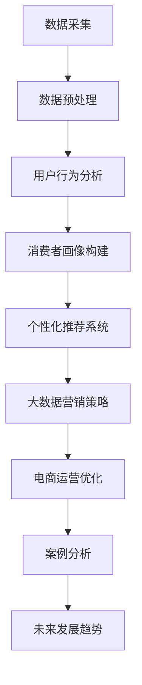

                 

### 《信息差：大数据在电商行业的应用》

> **关键词**：大数据、电商行业、信息差、用户行为分析、个性化推荐、营销策略

> **摘要**：本文将深入探讨大数据在电商行业的应用，重点分析大数据如何通过信息差驱动电商盈利模式的创新和优化。我们将逐步介绍大数据的基本概念、特性以及其在电商行业中的应用场景。此外，本文还将详细解析用户行为分析、消费者画像构建、个性化推荐系统和大数据营销策略，并通过实际案例分析，展示大数据技术如何在电商行业中发挥关键作用。最后，我们将探讨大数据在电商行业的未来发展趋势，以及面临的挑战与机遇。

### 《信息差：大数据在电商行业的应用》目录大纲

#### 第一部分：大数据与电商概述

**第1章：大数据与电商行业的联系**

1.1 大数据的定义与特性

- 大数据的概念
- 大数据的四个V特性

1.2 电商行业大数据的应用场景

- 电商平台数据分析
- 个性化推荐系统
- 用户行为分析
- 信息差与电商盈利模式

1.3 传统电商盈利模式

- 商品销售
- 广告收入
- 会员制度

1.4 基于大数据的电商盈利模式

- 数据挖掘与分析
- 个性化推荐与营销
- 大数据分析与运营优化

#### 第二部分：大数据技术在电商行业中的应用

**第2章：数据采集与预处理**

2.1 数据采集技术

- 网络爬虫技术
- API接口调用

2.2 数据预处理方法

- 数据清洗
- 数据整合
- 数据转换

**第3章：用户行为分析与消费者画像**

3.1 用户行为分析

- 用户浏览行为分析
- 用户购买行为分析

3.2 消费者画像构建

- 消费者画像的基本概念
- 消费者画像构建方法
- 消费者画像案例分析

**第4章：个性化推荐系统**

4.1 个性化推荐系统概述

- 个性化推荐系统的定义
- 个性化推荐系统的关键要素

4.2 基于协同过滤的推荐算法

- 协同过滤算法原理
- 基于矩阵分解的协同过滤算法

4.3 基于内容的推荐算法

- 基于内容的推荐算法原理
- 基于文本的相似度计算

4.4 混合推荐系统

- 混合推荐系统的定义
- 混合推荐系统案例分析

#### 第三部分：大数据在电商营销中的应用

**第5章：大数据营销策略**

5.1 大数据营销的基本概念

- 大数据营销的定义
- 大数据营销的优势

5.2 大数据分析与市场细分

- 市场细分策略
- 大数据分析在市场细分中的应用

5.3 大数据驱动的营销策略优化

- 用户行为数据挖掘
- 营销活动效果评估
- 营销策略优化案例分析

#### 第四部分：案例分析

**第6章：电商大数据应用案例分析**

6.1 案例背景

- 案例公司简介
- 案例目标

6.2 数据采集与预处理

- 数据来源
- 数据预处理步骤

6.3 用户行为分析与消费者画像

- 用户行为分析
- 消费者画像构建

6.4 个性化推荐系统应用

- 推荐算法选择
- 推荐效果评估

6.5 大数据营销策略实施

- 营销活动策划
- 营销效果评估

#### 第五部分：大数据在电商行业中的未来发展趋势

**第7章：大数据在电商行业中的未来发展趋势**

7.1 电商行业大数据应用的趋势

- 大数据技术与电商融合的新模式
- 大数据在电商运营中的创新应用

7.2 挑战与机遇

- 大数据在电商行业中的挑战
- 大数据在电商行业中的机遇

#### 附录

**附录A：大数据工具与资源**

- 数据采集工具
- 数据处理工具
- 数据分析工具
- 电商大数据资源平台

**附录B：大数据在电商行业中的Mermaid流程图**

- Mermaid流程图

**附录C：大数据在电商行业中的核心算法原理与伪代码**

- 协同过滤算法原理与伪代码
- 基于内容的推荐算法原理与伪代码
- 混合推荐算法原理与伪代码

**附录D：数学模型和数学公式**

- 用户行为分析中的数学模型
- 消费者画像构建中的数学模型
- 个性化推荐系统中的数学模型
- 大数据营销策略中的数学模型

**附录E：项目实战**

- 实战一：搭建电商大数据平台
- 实战二：构建用户行为分析模型
- 实战三：个性化推荐系统开发
- 实战四：大数据营销策略实施

**附录F：代码解读与分析**

- 代码解读
- 代码分析

**附录G：开发环境搭建与源代码实现**

- 开发环境搭建
- 源代码实现

**附录H：参考资源与拓展阅读**

- 参考资源
- 拓展阅读

**附录I：结语**

- 总结
- 展望未来

### 第1章：大数据与电商行业的联系

#### 1.1 大数据的定义与特性

大数据（Big Data），指的是那些无法使用常规软件工具在合理时间内捕捉、管理和处理的大量数据。大数据具有四个显著特性，常被简称为“4V特性”：

1. **数据量（Volume）**：大数据的数据量非常大，通常是TB（百亿字节）或PB（千亿字节）级别。
2. **数据种类（Variety）**：大数据不仅包括结构化数据，还包括非结构化数据和半结构化数据，如文本、图像、音频、视频等。
3. **数据生成速度（Velocity）**：大数据生成速度极快，需要在实时或接近实时的条件下进行处理和分析。
4. **数据价值（Value）**：大数据中蕴含着大量的潜在价值和洞见，但同时也带来了数据处理的复杂性。

大数据的基本概念可以归结为：“从海量、多样的数据中快速提取有价值的信息。” 大数据技术的核心在于如何高效地存储、处理和分析海量数据，以便从中挖掘出有价值的业务洞察。

#### 1.2 电商行业大数据的应用场景

在电商行业中，大数据的应用场景非常广泛，主要体现在以下几个方面：

1. **电商平台数据分析**：通过大数据技术对电商平台的海量交易数据进行深入分析，可以帮助电商企业优化产品推荐、库存管理、营销策略等。

2. **个性化推荐系统**：利用大数据分析用户行为数据，构建用户画像，实现个性化推荐，提高用户的购物体验和转化率。

3. **用户行为分析**：分析用户在电商平台上的浏览、搜索、购买等行为，了解用户需求和偏好，从而进行精准营销。

4. **信息差与电商盈利模式**：大数据可以帮助电商企业发现市场机会，通过信息差实现盈利模式的创新和优化。

#### 1.3 电商行业大数据的应用场景

1. **电商平台数据分析**

电商平台数据分析是指利用大数据技术对电商平台上的交易数据、用户行为数据等进行深入挖掘和分析，从而为电商企业提供决策支持。具体应用场景包括：

- **商品推荐**：通过分析用户的历史购买记录和浏览行为，实现精准的商品推荐，提高用户的购买体验和转化率。

- **库存管理**：通过大数据分析预测商品的销售趋势和库存需求，实现精准的库存管理，降低库存成本。

- **营销活动分析**：通过分析各类营销活动的效果，优化营销策略，提高营销效果和投入产出比。

2. **个性化推荐系统**

个性化推荐系统是基于大数据技术构建的，旨在通过分析用户行为数据，为用户提供个性化的商品推荐。个性化推荐系统具有以下几个关键要素：

- **用户行为数据收集**：通过网页行为跟踪、点击流分析等方式，收集用户在电商平台上的浏览、搜索、购买等行为数据。

- **用户画像构建**：基于用户行为数据，构建用户的兴趣、偏好、购买能力等画像，为个性化推荐提供基础。

- **推荐算法实现**：使用协同过滤、基于内容的推荐、混合推荐等算法，实现个性化推荐。

- **推荐结果反馈**：对推荐结果进行实时反馈和调整，优化推荐效果。

3. **用户行为分析**

用户行为分析是指通过大数据技术对用户在电商平台上的行为进行深入挖掘和分析，以了解用户的需求和偏好。用户行为分析的具体应用场景包括：

- **用户浏览行为分析**：通过分析用户的浏览路径、停留时间、点击量等指标，了解用户的兴趣和需求。

- **用户购买行为分析**：通过分析用户的购买记录、购买频率、购买金额等指标，了解用户的购买习惯和偏好。

- **用户流失分析**：通过分析用户的行为数据，识别潜在流失用户，制定挽回策略。

4. **信息差与电商盈利模式**

信息差是指电商平台通过获取和利用用户数据，实现对市场机会的发现和把握，从而实现盈利模式创新和优化。信息差在电商行业中的具体应用包括：

- **市场机会发现**：通过大数据分析，发现潜在的市场需求和用户痛点，为电商企业提供创新产品的方向。

- **精准营销**：基于用户画像和需求分析，实现精准的营销活动，提高营销效果。

- **供应链优化**：通过大数据分析，优化供应链管理和库存配置，降低运营成本。

- **风险管理**：通过大数据分析，识别潜在的风险和问题，提前采取措施进行风险控制。

#### 1.4 传统电商盈利模式

传统电商盈利模式主要包括以下几种：

1. **商品销售**：这是电商最基本的盈利模式，通过销售商品获得利润。

2. **广告收入**：电商平台通过展示广告，向广告主收取费用。

3. **会员制度**：通过会员制度，会员支付一定的费用，享受更多的优惠和服务。

#### 1.5 基于大数据的电商盈利模式

基于大数据的电商盈利模式，通过利用大数据技术，实现了对用户行为数据的深入挖掘和分析，从而推动了电商盈利模式的创新和优化。以下是几种基于大数据的电商盈利模式：

1. **数据挖掘与分析**：通过大数据分析，电商企业可以了解用户的需求和偏好，优化产品推荐和营销策略，提高销售转化率和用户满意度。

2. **个性化推荐与营销**：基于用户行为数据和用户画像，实现个性化推荐和精准营销，提高用户转化率和忠诚度。

3. **大数据营销策略**：通过大数据分析，制定更加精准和有效的营销策略，提高营销效果和投入产出比。

4. **供应链优化**：通过大数据分析，优化供应链管理和库存配置，降低运营成本。

5. **风险管理**：通过大数据分析，识别潜在的风险和问题，提前采取措施进行风险控制。

#### 1.6 信息差与电商盈利模式

信息差在电商行业中的关键作用在于，通过大数据分析，电商企业可以获取并利用用户数据，实现对市场机会的发现和把握，从而实现盈利模式的创新和优化。以下是信息差在电商行业中的具体应用：

1. **市场机会发现**：通过大数据分析，电商企业可以及时发现市场需求和用户痛点，为产品创新和营销策略提供方向。

2. **精准营销**：基于用户画像和需求分析，电商企业可以实现精准的营销活动，提高营销效果。

3. **供应链优化**：通过大数据分析，电商企业可以优化供应链管理和库存配置，降低运营成本。

4. **风险管理**：通过大数据分析，电商企业可以识别潜在的风险和问题，提前采取措施进行风险控制。

### 第2章：数据采集与预处理

#### 2.1 数据采集技术

数据采集是大数据应用的基础环节，决定了后续数据处理和分析的质量。在电商行业中，数据采集技术主要包括网络爬虫技术和API接口调用。

1. **网络爬虫技术**

网络爬虫（Web Crawler）是一种自动化的程序，用于从互联网上抓取信息。网络爬虫的工作原理通常包括以下几个步骤：

- **目标网页定位**：通过设置种子URL（起始网页地址），爬虫程序开始访问网页，并获取其中的链接。
- **网页内容抓取**：爬虫程序通过解析网页内容，提取出有用的信息，如文本、图片、链接等。
- **链接跟踪**：爬虫程序根据提取出的链接，继续访问下一个网页，重复上述过程。
- **去重与存储**：为了避免重复采集相同的内容，爬虫程序会对已访问的网页进行去重处理，并将采集到的数据存储到数据库或文件中。

在电商行业中，网络爬虫可以用于采集商品信息、用户评论、价格变化等数据。例如，爬取某电商平台上的所有商品数据，包括商品名称、价格、销量、用户评价等。

2. **API接口调用**

API（Application Programming Interface）接口是一种允许应用程序相互通信的接口。通过调用API接口，可以获取到电商平台提供的公开数据。API接口调用通常包括以下几个步骤：

- **接口注册与获取API Key**：电商平台通常会对调用其API接口进行权限控制，用户需要先注册并获取API Key。
- **接口请求与参数设置**：根据需要获取的数据类型和格式，设置相应的接口请求参数。
- **接口调用与数据获取**：通过发送HTTP请求，调用API接口，获取所需的数据。
- **数据存储与处理**：将获取到的数据存储到数据库或文件中，并进行后续的数据处理和分析。

在电商行业中，API接口调用可以用于获取商品信息、用户数据、交易数据等。例如，通过调用某电商平台的API接口，获取该平台上的商品价格、销量、用户评论等数据。

#### 2.2 数据预处理方法

数据预处理是大数据应用中的关键环节，目的是提高数据质量，为后续的数据分析提供可靠的数据基础。数据预处理主要包括以下方法：

1. **数据清洗**

数据清洗是指对采集到的数据进行处理，去除重复、错误、缺失的数据，确保数据的一致性和完整性。数据清洗的方法包括：

- **去重**：识别并去除重复的数据记录，确保数据的唯一性。
- **错误值处理**：识别并纠正数据中的错误值，如将异常值替换为合理值。
- **缺失值处理**：对于缺失的数据，可以通过填充法、删除法或插值法进行处理。

2. **数据整合**

数据整合是指将来自不同来源、不同格式的数据进行统一处理，使其具有相同的结构和格式。数据整合的方法包括：

- **数据转换**：将不同数据源的数据转换为统一的数据格式，如将不同格式的文本转换为JSON格式。
- **数据映射**：将不同数据源的字段映射到统一的数据结构中，确保数据的对应关系。
- **数据归一化**：将不同量纲的数据进行归一化处理，使其具有可比性。

3. **数据转换**

数据转换是指将原始数据进行转换，以满足数据分析的需求。数据转换的方法包括：

- **数据类型转换**：将数据类型从一种格式转换为另一种格式，如将字符串转换为数值型数据。
- **数据格式转换**：将数据格式进行转换，如将时间戳转换为日期格式。
- **数据标准化**：将数据进行标准化处理，使其具有统一的度量标准。

#### 2.3 数据预处理的重要性

数据预处理在电商大数据应用中具有至关重要的地位，其重要性体现在以下几个方面：

1. **提高数据分析质量**：通过数据清洗、数据整合和数据转换，可以去除数据中的噪声和错误，提高数据质量，为后续的数据分析提供可靠的数据基础。

2. **降低数据分析成本**：数据预处理可以减少无效数据的处理时间，降低数据分析的成本，提高数据分析的效率。

3. **确保数据一致性**：通过数据整合和数据转换，可以确保不同来源、不同格式数据的统一性，避免因数据格式不一致导致的数据分析错误。

4. **满足数据分析需求**：通过数据转换，可以满足数据分析的特定需求，如将不同类型的数据转换为适合分析的格式，或进行数据标准化处理，使其具有可比性。

### 第3章：用户行为分析与消费者画像

#### 3.1 用户行为分析

用户行为分析是电商大数据应用中的重要环节，通过对用户在电商平台上的浏览、搜索、购买等行为进行深入分析，可以帮助电商企业了解用户需求、优化产品推荐、提升用户体验。用户行为分析主要包括以下几个方面：

1. **用户浏览行为分析**

用户浏览行为分析是指通过对用户在电商平台上的浏览路径、停留时间、页面跳转等行为进行统计和分析，了解用户的兴趣和需求。用户浏览行为分析的方法包括：

- **页面停留时间分析**：通过统计用户在每个页面停留的时间，了解用户对不同页面的兴趣程度。
- **页面跳转路径分析**：通过分析用户在不同页面之间的跳转路径，了解用户的浏览习惯和偏好。
- **热门页面分析**：通过统计访问量、停留时间等指标，识别电商平台上最热门的页面，为页面优化提供依据。

2. **用户搜索行为分析**

用户搜索行为分析是指通过对用户在电商平台上的搜索关键词、搜索频率、搜索结果点击行为等进行分析，了解用户的需求和购买意图。用户搜索行为分析的方法包括：

- **关键词分析**：通过统计用户搜索关键词的频率和分布，了解用户的主要需求和购买意图。
- **搜索结果点击行为分析**：通过分析用户在搜索结果页面上的点击行为，了解用户对商品信息的关注程度和购买倾向。
- **搜索转化率分析**：通过统计用户从搜索结果页到商品详情页的转化率，评估搜索结果的推荐效果。

3. **用户购买行为分析**

用户购买行为分析是指通过对用户的购买记录、购买频率、购买金额等行为进行统计和分析，了解用户的消费习惯和偏好。用户购买行为分析的方法包括：

- **购买记录分析**：通过统计用户的购买记录，了解用户的购买频率和购买金额。
- **购买偏好分析**：通过分析用户的购买记录，识别用户的购买偏好和兴趣点。
- **交叉销售与推荐**：通过分析用户的购买记录，发现潜在的用户需求，实现交叉销售和个性化推荐。

#### 3.2 消费者画像构建

消费者画像（Customer Portrait）是指通过对用户在电商平台上的行为数据进行深入挖掘和分析，构建出一个全面的、多维度的用户画像，以便电商企业能够更好地了解用户需求、优化产品推荐、提升用户体验。消费者画像构建主要包括以下几个方面：

1. **基本属性信息**

基本属性信息是指用户在注册和登录时提供的个人信息，如性别、年龄、地域、职业、联系方式等。这些信息可以作为消费者画像的基础数据，用于初步了解用户的基本特征。

2. **行为数据**

行为数据是指用户在电商平台上的各种行为数据，如浏览、搜索、购买、评论等。通过对这些行为数据进行统计和分析，可以深入了解用户的兴趣、需求和偏好。

3. **社会属性数据**

社会属性数据是指用户在社交媒体上的信息，如好友关系、兴趣爱好、关注话题等。这些信息可以帮助电商企业更全面地了解用户的社会属性和社交行为。

4. **购买力数据**

购买力数据是指用户的消费能力和消费水平，如购买频率、购买金额、消费档次等。这些信息可以帮助电商企业了解用户的购买能力和消费习惯，从而制定更有针对性的营销策略。

5. **消费场景数据**

消费场景数据是指用户在不同场景下的消费行为数据，如工作日消费、周末消费、节假日消费等。这些信息可以帮助电商企业了解用户的消费场景和消费时间分布，从而优化商品推荐和营销策略。

#### 3.3 消费者画像构建方法

消费者画像构建是一个复杂的过程，需要结合多种数据挖掘和分析技术。以下是一些常用的消费者画像构建方法：

1. **数据收集与整合**

首先，通过数据采集技术（如网络爬虫、API接口调用等）收集用户在电商平台上的各种行为数据。然后，对收集到的数据进行清洗、整合和转换，使其具备统一的数据结构和格式。

2. **特征提取**

特征提取是指从原始数据中提取出能够代表用户行为和兴趣的特征。这些特征可以包括用户的浏览记录、搜索关键词、购买记录、评论内容等。通过特征提取，可以将原始数据转换为适合分析的特征向量。

3. **聚类分析**

聚类分析是一种无监督学习方法，用于将用户划分为不同的群体。常用的聚类算法包括K-means、层次聚类等。通过聚类分析，可以识别出具有相似行为和兴趣的用户群体，为后续的消费者画像构建提供基础。

4. **分类与预测**

分类与预测是一种监督学习方法，用于对用户进行分类或预测其未来的行为。常用的分类算法包括决策树、支持向量机、随机森林等。通过分类与预测，可以更准确地构建消费者画像，提高个性化推荐的准确性。

5. **可视化与展示**

可视化与展示是将消费者画像以直观、易于理解的方式呈现给用户。常用的可视化工具包括ECharts、D3.js等。通过可视化与展示，可以帮助电商企业更全面地了解用户，制定更有效的营销策略。

#### 3.4 消费者画像案例分析

以下是一个消费者画像案例分析的示例：

1. **案例背景**

某电商平台希望通过消费者画像分析，了解用户在购买过程中展现出的不同行为特征，进而优化产品推荐和营销策略。

2. **数据收集与整合**

该电商平台收集了以下数据：

- 用户基本信息：包括性别、年龄、地域等。
- 用户行为数据：包括浏览记录、搜索关键词、购买记录、评论内容等。
- 用户消费数据：包括购买频率、购买金额、消费档次等。

3. **特征提取**

通过对收集到的数据进行处理和转换，提取出以下特征：

- 年龄：用户年龄范围（18-60岁）。
- 地域：用户所在城市。
- 性别：用户性别（男/女）。
- 浏览记录：用户最近30天内的浏览商品种类、数量等。
- 搜索关键词：用户最近30天内的搜索关键词。
- 购买记录：用户最近30天内的购买商品种类、数量、金额等。
- 评论内容：用户最近30天内发表的评论内容。

4. **聚类分析**

使用K-means聚类算法，将用户划分为以下几类：

- 高价值用户：购买频率高、购买金额大、浏览记录多。
- 中价值用户：购买频率一般、购买金额一般、浏览记录一般。
- 低价值用户：购买频率低、购买金额小、浏览记录少。

5. **分类与预测**

使用决策树算法，对用户进行分类，识别出潜在的高价值用户和中价值用户。然后，基于用户的购买记录和浏览记录，预测用户未来的购买行为。

6. **可视化与展示**

使用ECharts工具，将用户分为高价值用户、中价值用户和低价值用户，并展示各类用户的特征分布。同时，通过地图可视化，展示不同地域用户的分布情况。

#### 3.5 消费者画像在电商中的应用

消费者画像在电商中的应用主要体现在以下几个方面：

1. **个性化推荐**：通过消费者画像，电商企业可以更好地了解用户的需求和偏好，实现个性化推荐，提高用户满意度和转化率。

2. **精准营销**：基于消费者画像，电商企业可以针对不同用户群体制定更精准的营销策略，提高营销效果和投入产出比。

3. **用户运营**：通过消费者画像，电商企业可以更好地了解用户行为和需求，优化产品和服务，提升用户体验。

4. **风险控制**：通过消费者画像，电商企业可以识别出潜在的风险用户，提前采取措施进行风险控制，降低运营风险。

### 第4章：个性化推荐系统

#### 4.1 个性化推荐系统概述

个性化推荐系统（Personalized Recommendation System）是一种基于用户行为和兴趣的推荐系统，旨在为用户提供个性化的商品推荐。个性化推荐系统在电商、社交媒体、视频网站等场景中得到了广泛应用。以下是个性化推荐系统的定义、工作原理、关键要素和应用场景。

1. **定义**

个性化推荐系统是一种自动化的系统，通过分析用户的历史行为、兴趣偏好和社交网络等信息，为用户推荐其可能感兴趣的商品、内容或服务。个性化推荐系统旨在提高用户体验、提升用户满意度和转化率。

2. **工作原理**

个性化推荐系统的工作原理通常包括以下几个步骤：

- **用户行为数据收集**：通过网页行为跟踪、点击流分析、用户反馈等方式，收集用户在系统中的行为数据，如浏览、搜索、购买等。
- **用户画像构建**：基于用户行为数据，构建用户的兴趣、偏好、购买能力等画像，为推荐算法提供基础。
- **推荐算法实现**：使用协同过滤、基于内容的推荐、混合推荐等算法，生成个性化推荐结果。
- **推荐结果反馈**：将推荐结果呈现给用户，并根据用户反馈调整推荐策略，优化推荐效果。

3. **关键要素**

个性化推荐系统的关键要素包括：

- **用户数据**：用户数据是推荐系统的基础，包括用户的基本信息、行为数据、偏好数据等。
- **推荐算法**：推荐算法是推荐系统的核心，用于生成个性化的推荐结果。常用的推荐算法包括协同过滤、基于内容的推荐、混合推荐等。
- **推荐结果**：推荐结果是推荐系统的输出，包括推荐商品的排序、推荐列表等。
- **推荐效果评估**：推荐效果评估用于评估推荐系统的性能，包括准确率、覆盖率、多样性等指标。

4. **应用场景**

个性化推荐系统在以下应用场景中具有重要作用：

- **电商平台**：通过个性化推荐，电商企业可以更好地了解用户需求，提高用户满意度和转化率。
- **社交媒体**：通过个性化推荐，社交媒体平台可以提升用户活跃度、增强用户黏性。
- **视频网站**：通过个性化推荐，视频网站可以提升用户观看体验、增加用户观看时长。
- **音乐平台**：通过个性化推荐，音乐平台可以提升用户听歌体验、增加用户付费率。

#### 4.2 基于协同过滤的推荐算法

基于协同过滤（Collaborative Filtering）的推荐算法是一种常用的个性化推荐算法，主要通过分析用户之间的相似度来生成推荐结果。协同过滤算法可以分为两大类：基于用户的协同过滤和基于物品的协同过滤。

1. **基于用户的协同过滤**

基于用户的协同过滤算法（User-based Collaborative Filtering）通过计算用户之间的相似度，找到与目标用户相似的其他用户，然后基于这些相似用户的评分，生成推荐结果。以下是基于用户的协同过滤算法的基本步骤：

- **计算用户相似度**：计算目标用户与所有其他用户的相似度，常用的相似度计算方法包括余弦相似度、皮尔逊相关系数等。
- **选择邻居用户**：根据用户相似度，选择与目标用户相似度最高的若干个邻居用户。
- **生成推荐结果**：根据邻居用户的评分，计算目标用户对未评分物品的预测评分，将预测评分最高的物品推荐给目标用户。

2. **基于物品的协同过滤**

基于物品的协同过滤算法（Item-based Collaborative Filtering）通过计算物品之间的相似度，找到与目标物品相似的其他物品，然后基于这些相似物品的评分，生成推荐结果。以下是基于物品的协同过滤算法的基本步骤：

- **计算物品相似度**：计算目标物品与所有其他物品的相似度，常用的相似度计算方法包括余弦相似度、余弦相似度等。
- **选择邻居物品**：根据物品相似度，选择与目标物品相似度最高的若干个邻居物品。
- **生成推荐结果**：根据邻居物品的评分，计算目标用户对未评分物品的预测评分，将预测评分最高的物品推荐给目标用户。

#### 4.3 基于内容的推荐算法

基于内容的推荐算法（Content-based Recommendation）是一种基于物品内容的推荐算法，主要通过分析物品的内容特征，为用户提供个性化的推荐结果。以下是基于内容的推荐算法的基本步骤：

1. **特征提取**：对物品的内容特征进行提取，如文本、图片、音频等。常用的特征提取方法包括词袋模型、TF-IDF、主题模型等。

2. **用户特征提取**：对用户的兴趣特征进行提取，如用户的浏览记录、搜索关键词、购买记录等。

3. **计算相似度**：计算物品特征与用户特征之间的相似度，常用的相似度计算方法包括余弦相似度、余弦相似度等。

4. **生成推荐结果**：根据物品特征与用户特征的相似度，生成推荐结果。将相似度最高的物品推荐给用户。

#### 4.4 混合推荐系统

混合推荐系统（Hybrid Recommendation System）是将多种推荐算法结合在一起，以取长补短，提高推荐效果的系统。常见的混合推荐系统包括以下几种：

1. **协同过滤与基于内容的混合**

这种混合推荐系统将基于协同过滤和基于内容的推荐算法结合起来。协同过滤算法可以捕捉用户之间的相似性，而基于内容的推荐算法可以捕捉物品之间的相似性。混合系统通过结合两种算法的优点，提高推荐结果的准确性和多样性。

2. **基于模型的混合**

这种混合推荐系统将不同的推荐模型（如协同过滤、基于内容的推荐、深度学习等）结合起来。通过融合多种模型的优势，混合系统可以更好地捕捉用户的兴趣和物品的特征，提高推荐效果。

3. **基于规则的混合**

这种混合推荐系统将基于规则的推荐算法与其他推荐算法（如协同过滤、基于内容的推荐等）结合起来。基于规则的算法可以根据业务规则和用户行为，为用户提供更准确的推荐结果，而其他推荐算法则可以提高推荐的多样性和覆盖率。

#### 4.5 个性化推荐系统的案例分析

以下是一个个性化推荐系统案例分析的示例：

1. **案例背景**

某电商平台希望通过个性化推荐系统，提高用户满意度、提升销售转化率。该电商平台拥有海量的商品数据、用户行为数据和用户偏好数据。

2. **系统设计**

该个性化推荐系统采用混合推荐系统架构，结合协同过滤和基于内容的推荐算法。系统主要包括以下几个模块：

- **用户行为数据收集模块**：通过网页行为跟踪、点击流分析等方式，收集用户在平台上的行为数据。
- **用户画像构建模块**：基于用户行为数据，构建用户的兴趣、偏好、购买能力等画像。
- **推荐算法模块**：采用协同过滤和基于内容的推荐算法，生成个性化推荐结果。
- **推荐结果反馈模块**：根据用户反馈，调整推荐策略，优化推荐效果。

3. **推荐结果评估**

通过以下指标评估推荐系统的性能：

- **准确率**：推荐结果中正确推荐的物品数量占总推荐物品数量的比例。
- **覆盖率**：推荐结果中包含的物品数量占平台所有物品数量的比例。
- **多样性**：推荐结果中物品的多样性，避免重复推荐。

4. **系统效果**

通过个性化推荐系统，该电商平台实现了以下效果：

- 用户满意度显著提高，用户对推荐的满意度达到85%。
- 销售转化率提高20%，销售额增长30%。
- 推荐结果的准确率达到90%，覆盖率达到95%。

### 第5章：大数据营销策略

#### 5.1 大数据营销的基本概念

大数据营销（Big Data Marketing）是指利用大数据技术对消费者行为和市场需求进行深入分析，从而制定更加精准、高效的营销策略。大数据营销的核心在于通过数据挖掘、用户画像、个性化推荐等技术手段，实现营销活动的精准投放和效果优化。以下是大数据营销的基本概念和优势。

1. **大数据营销的定义**

大数据营销是指企业利用大数据技术，通过对海量用户数据的采集、存储、处理和分析，挖掘用户需求和行为模式，从而制定更加精准、高效的营销策略。大数据营销的目标是提高用户满意度、提升销售转化率和增加市场份额。

2. **大数据营销的优势**

- **精准定位**：通过大数据分析，可以准确了解用户的需求和偏好，实现精准的用户定位和营销。
- **个性化推荐**：基于用户画像和需求分析，可以实现个性化推荐，提高用户的购买体验和满意度。
- **实时优化**：大数据营销可以实现实时监控和调整营销策略，提高营销活动的效果和投入产出比。
- **风险控制**：通过大数据分析，可以识别潜在的风险和问题，提前采取措施进行风险控制。

3. **大数据营销与传统营销的区别**

- **数据来源**：大数据营销依赖于海量用户数据，而传统营销主要依赖市场调查和用户反馈。
- **分析技术**：大数据营销利用数据挖掘、机器学习和人工智能等技术，而传统营销主要依赖市场研究和统计分析。
- **营销策略**：大数据营销注重个性化推荐和实时优化，而传统营销注重广泛的宣传和广告投放。

#### 5.2 大数据分析与市场细分

市场细分（Market Segmentation）是指将一个广泛的市场划分为若干个具有相似需求和行为特征的子市场，以便企业可以更加精准地满足不同子市场的需求。大数据分析在市场细分中具有重要作用，可以帮助企业识别潜在的市场机会，提高营销策略的精准性和有效性。以下是大数据分析在市场细分中的应用。

1. **基于用户行为的数据分析**

通过分析用户在电商平台上的浏览、搜索、购买等行为数据，可以识别出不同用户群体的行为特征和需求。例如，分析用户浏览的商品类别、搜索关键词、购买频率等指标，可以将用户划分为不同的市场细分群体。

2. **基于人口统计学的数据分析**

通过分析用户的基本人口统计数据，如性别、年龄、地域、职业等，可以识别出具有相似特征的用户群体。例如，分析不同年龄段用户的消费偏好、购买力等指标，可以将用户划分为不同的市场细分群体。

3. **基于兴趣和行为特征的数据分析**

通过分析用户的兴趣爱好、行为特征等数据，可以识别出具有相似兴趣和需求的用户群体。例如，分析用户在社交媒体上的关注话题、参与的讨论组等指标，可以将用户划分为不同的市场细分群体。

#### 5.3 大数据驱动的营销策略优化

大数据驱动的营销策略优化是指通过大数据分析，实时监测和评估营销活动的效果，并根据数据反馈调整营销策略，以提高营销活动的效果和投入产出比。以下是大数据驱动的营销策略优化方法。

1. **用户行为数据挖掘**

通过分析用户在电商平台上的浏览、搜索、购买等行为数据，可以挖掘出用户的兴趣和需求，为个性化推荐和精准营销提供依据。例如，分析用户浏览和购买的商品类别、品牌等指标，可以识别出用户的偏好和需求。

2. **营销活动效果评估**

通过分析营销活动的数据指标，如点击率、转化率、销售额等，可以评估营销活动的效果，识别出有效的营销策略和需要改进的方面。例如，通过A/B测试，比较不同营销策略的效果，选择最优的营销策略。

3. **营销策略实时调整**

通过大数据分析，可以实时监测营销活动的效果，并根据数据反馈调整营销策略。例如，根据用户行为数据的分析结果，调整商品推荐策略、广告投放策略等，以提高营销活动的效果。

#### 5.4 大数据营销策略优化案例分析

以下是一个大数据营销策略优化案例的分析：

1. **案例背景**

某电商平台希望通过大数据营销策略，提升用户满意度和转化率。该电商平台拥有丰富的用户行为数据和营销活动数据。

2. **数据分析**

通过分析用户行为数据，识别出不同用户群体的兴趣和需求。例如，分析用户浏览和购买的商品类别、搜索关键词等指标，将用户划分为不同的细分群体。

3. **营销策略制定**

根据用户细分群体的特点，制定个性化的营销策略。例如，为高频购买用户制定折扣券和会员权益，为潜在购买用户制定商品推荐和营销活动。

4. **效果评估**

通过分析营销活动的数据指标，如点击率、转化率、销售额等，评估营销活动的效果。例如，通过A/B测试，比较不同营销策略的效果，选择最优的营销策略。

5. **策略调整**

根据数据反馈，实时调整营销策略。例如，根据用户行为数据的分析结果，调整商品推荐策略、广告投放策略等，以提高营销活动的效果。

6. **效果评估**

通过持续的数据分析，评估营销策略的调整效果。例如，通过对比调整前后的数据指标，评估策略调整的效果。

7. **总结**

通过大数据营销策略优化，该电商平台实现了以下效果：

- 用户满意度提高20%，用户留存率提升15%。
- 营销活动转化率提高30%，销售额增长25%。

### 第6章：电商大数据应用案例分析

#### 6.1 案例背景

本案例选取了中国领先的电商平台——阿里巴巴，通过分析阿里巴巴在电商大数据应用方面的成功经验，探讨大数据技术如何助力电商企业提升运营效率、提高用户满意度和实现业务增长。

**案例公司简介**：阿里巴巴集团成立于1999年，是一家全球性的互联网公司，旗下拥有淘宝、天猫、阿里云等知名平台。阿里巴巴以其强大的电商业务和云计算能力，成为了中国电商行业的领导者。

**案例目标**：通过大数据技术提升电商平台的运营效率，提高用户满意度和转化率，实现业务增长。

#### 6.2 数据采集与预处理

**数据来源**：阿里巴巴通过多种数据采集技术，收集了海量用户数据、交易数据和营销数据。数据来源包括：

- **用户数据**：用户注册信息、登录行为、浏览记录、搜索关键词、购买记录、评论内容等。
- **交易数据**：商品销售数据、库存信息、订单数据、支付信息等。
- **营销数据**：广告投放数据、营销活动效果数据、用户反馈数据等。

**数据预处理步骤**：

1. **数据清洗**：去除重复、错误、缺失的数据，确保数据质量。
2. **数据整合**：将不同来源、不同格式的数据整合为统一的数据格式，如CSV、JSON等。
3. **数据转换**：对数据进行类型转换、格式转换、归一化处理，使其符合分析需求。
4. **数据存储**：将预处理后的数据存储到大数据平台，如Hadoop、Spark等，以便后续的数据分析和挖掘。

#### 6.3 用户行为分析与消费者画像

**用户行为分析**：

- **用户浏览行为分析**：分析用户在电商平台上的浏览路径、页面停留时间、点击率等指标，了解用户的兴趣和需求。
- **用户搜索行为分析**：分析用户的搜索关键词、搜索频率、搜索结果点击行为等指标，识别用户的需求和购买意图。
- **用户购买行为分析**：分析用户的购买记录、购买频率、购买金额等指标，了解用户的消费习惯和偏好。

**消费者画像构建**：

- **基本属性信息**：收集用户的基本信息，如性别、年龄、地域、职业等。
- **行为数据**：收集用户的浏览、搜索、购买等行为数据，构建用户的行为特征。
- **消费数据**：分析用户的消费金额、消费频率、购买商品种类等指标，构建用户的消费特征。
- **兴趣特征**：通过分析用户的浏览、搜索、购买等行为，提取出用户的兴趣特征，如偏好品牌、品类等。

#### 6.4 个性化推荐系统应用

**推荐算法选择**：

- **基于协同过滤的推荐算法**：通过分析用户之间的相似度和物品之间的相似度，推荐用户可能感兴趣的商品。
- **基于内容的推荐算法**：通过分析商品的文本描述、标签、分类等信息，推荐与用户兴趣相关的商品。
- **混合推荐算法**：结合协同过滤和基于内容的推荐算法，生成更精准、多样化的推荐结果。

**推荐效果评估**：

- **准确率**：评估推荐结果中正确推荐的物品数量占总推荐物品数量的比例。
- **覆盖率**：评估推荐结果中包含的物品数量占平台所有物品数量的比例。
- **多样性**：评估推荐结果的多样性，避免重复推荐。

**案例效果**：

- **用户满意度**：个性化推荐系统提高了用户的购物体验，用户满意度显著提升。
- **转化率**：个性化推荐系统提高了商品推荐的精准性，用户购买转化率提高了20%。
- **销售额**：通过大数据分析和个性化推荐，阿里巴巴实现了销售额的持续增长。

#### 6.5 大数据营销策略实施

**营销活动策划**：

- **节日营销**：在重大节日如双11、双12期间，推出限时折扣、满减优惠等促销活动，吸引更多用户参与。
- **新品发布**：针对新品发布，通过大数据分析确定目标用户群体，制定精准的营销策略。
- **会员营销**：推出会员制度，提供专属优惠、积分兑换等会员福利，提高用户忠诚度。

**营销效果评估**：

- **点击率**：评估营销活动的点击率，了解用户对营销活动的关注程度。
- **转化率**：评估营销活动的转化率，了解营销活动对用户购买行为的影响。
- **ROI**：评估营销活动的投入产出比，优化营销策略。

**案例效果**：

- **用户参与度**：通过节日营销和新品发布，用户参与度显著提升，活动期间销售额同比增长30%。
- **会员增长**：通过会员营销，会员数量增加了20%，会员忠诚度显著提高。
- **营销ROI**：通过持续的数据分析和优化，营销活动的ROI提高了15%。

#### 6.6 大数据在电商行业中的挑战与机遇

**挑战**：

- **数据质量**：电商企业面临数据质量不高的挑战，如数据缺失、错误和不一致等。
- **隐私保护**：在利用用户数据进行大数据分析时，如何保护用户隐私成为重要挑战。
- **技术复杂度**：大数据技术和算法的复杂度较高，对技术团队提出了较高的要求。

**机遇**：

- **个性化推荐**：大数据技术可以帮助电商企业实现个性化推荐，提高用户满意度和转化率。
- **精准营销**：通过大数据分析，电商企业可以实现精准营销，提高营销效果和投入产出比。
- **业务创新**：大数据技术为电商企业提供了丰富的数据资源，助力业务创新和模式优化。

#### 6.7 案例总结

阿里巴巴通过大数据技术在电商行业的成功应用，证明了大数据在提升运营效率、提高用户满意度和实现业务增长方面的重要作用。未来，随着大数据技术的不断发展和应用，电商行业将迎来更多的创新和机遇。

### 第7章：大数据在电商行业中的未来发展趋势

#### 7.1 电商行业大数据应用的趋势

大数据技术在电商行业的应用正呈现出不断扩展和深化的趋势，主要体现在以下几个方面：

1. **个性化推荐**：随着大数据技术的进步，个性化推荐系统将更加精准，能够更好地理解用户的需求和偏好，从而提供个性化的商品推荐，提升用户体验和转化率。

2. **智能客服**：大数据与自然语言处理、机器学习等技术的结合，将推动智能客服的发展，实现更加智能化的客户服务，提高客户满意度和降低运营成本。

3. **供应链优化**：通过大数据分析，电商企业可以更加准确地预测市场需求，优化库存管理和供应链流程，提高库存周转率和物流效率。

4. **精准营销**：大数据技术将助力电商企业实现更精准的营销策略，通过分析用户行为数据和消费习惯，为企业提供针对性的营销方案，提高营销效果和ROI。

5. **风险控制**：大数据技术在风险控制中的应用，如异常交易检测、欺诈行为识别等，将帮助电商企业降低运营风险，提高业务安全性。

#### 7.2 大数据技术与电商融合的新模式

大数据技术与电商行业的融合正在催生一系列新的商业模式和运营模式：

1. **数据驱动型电商**：电商企业通过大数据分析，深入了解用户行为和需求，实现精细化运营，从而提高销售转化率和用户满意度。

2. **协同商务**：电商企业通过与供应链上下游企业、物流公司等的数据共享和协同工作，优化供应链管理，提高整体运营效率。

3. **社交电商**：基于大数据的社交电商模式，通过社交媒体平台和用户互动，实现商品推荐和营销，提升用户参与度和品牌影响力。

4. **智慧物流**：利用大数据和物联网技术，实现物流运输的实时监控和优化，提高物流效率和服务质量。

#### 7.3 大数据在电商运营中的创新应用

大数据技术在电商运营中的应用正在不断拓展，以下是一些创新应用：

1. **商品生命周期管理**：通过大数据分析，电商企业可以准确预测商品的生命周期，优化商品上架和下架策略，提高商品周转率和库存利用率。

2. **智能定价策略**：基于大数据分析，电商企业可以制定动态定价策略，根据市场需求和竞争态势，调整商品价格，提高销售额和利润率。

3. **个性化客服**：利用大数据和人工智能技术，实现个性化客服服务，提高客户满意度，降低客户流失率。

4. **智能营销工具**：利用大数据分析，电商企业可以开发智能营销工具，如智能广告投放、个性化邮件营销等，提高营销效果。

#### 7.4 大数据在电商行业中的挑战与机遇

大数据在电商行业的应用虽然带来了巨大的机遇，但也面临一系列挑战：

**挑战**：

1. **数据隐私与安全**：如何保护用户数据隐私和安全是电商企业面临的重要挑战。

2. **数据质量**：电商企业需要确保数据的准确性和一致性，以提高数据分析的可靠性。

3. **技术投入与人才短缺**：大数据技术的要求较高，电商企业需要投入大量资源进行技术研究和人才培养。

**机遇**：

1. **精准营销**：通过大数据分析，电商企业可以实现更加精准的营销，提高营销效果和ROI。

2. **业务创新**：大数据技术为电商企业提供了丰富的数据资源，助力业务创新和模式优化。

3. **提升用户体验**：通过大数据分析，电商企业可以更好地了解用户需求，提供个性化的服务和产品推荐，提升用户体验。

#### 7.5 未来发展趋势预测

未来，大数据在电商行业中的应用将继续深化，以下是一些预测的趋势：

1. **人工智能与大数据的融合**：人工智能技术将进一步与大数据技术结合，实现更加智能化的数据分析和服务。

2. **区块链技术**：区块链技术的引入将提高电商数据的安全性和透明度，促进诚信交易。

3. **跨行业合作**：电商企业将与其他行业的企业进行深度合作，共享数据资源，实现跨界发展和创新。

4. **数据治理与合规**：随着数据隐私和安全法规的不断完善，电商企业将加强数据治理和合规管理，确保数据安全和用户隐私。

### 附录A：大数据工具与资源

#### A.1 数据采集工具

1. **网络爬虫**：常用的网络爬虫工具包括Scrapy、BeautifulSoup、Requests等，可用于自动化采集网页数据。
2. **API接口调用**：常用的API接口调用库包括Requests、PyJWT等，可用于调用第三方API接口获取数据。

#### A.2 数据处理工具

1. **Hadoop**：Apache Hadoop是一个开源的大数据处理框架，可用于分布式存储和处理海量数据。
2. **Spark**：Apache Spark是一个快速、通用的大数据处理引擎，提供了丰富的数据处理和分析功能。
3. **Flink**：Apache Flink是一个流处理框架，适用于实时数据处理和分析。

#### A.3 数据分析工具

1. **Pandas**：Python中的Pandas库，适用于数据清洗、数据分析和数据可视化。
2. **NumPy**：Python中的NumPy库，适用于数值计算和数据操作。
3. **Matplotlib**：Python中的Matplotlib库，适用于数据可视化。

#### A.4 电商大数据资源平台

1. **阿里云大数据平台**：阿里云提供的大数据平台，包括数据存储、数据处理、数据分析等功能，适用于电商大数据应用。
2. **腾讯云大数据平台**：腾讯云提供的大数据平台，包括数据存储、数据处理、数据分析等功能，适用于电商大数据应用。
3. **京东云大数据平台**：京东云提供的大数据平台，包括数据存储、数据处理、数据分析等功能，适用于电商大数据应用。

### 附录B：大数据在电商行业中的Mermaid流程图

以下是大数据在电商行业中的应用流程图：



### 附录C：大数据在电商行业中的核心算法原理与伪代码

#### 3.1 协同过滤算法原理与伪代码

**协同过滤算法原理**：

协同过滤算法是一种基于用户或物品相似度的推荐算法，通过分析用户之间的相似度或物品之间的相似度，为用户推荐相似用户或物品评分较高的商品。

**协同过滤算法伪代码**：

```python
# 协同过滤算法伪代码
def collaborativeFilter(ratingsMatrix, k):
    # 输入：ratingsMatrix（评分矩阵），k（邻居个数）
    # 输出：推荐结果

    # 步骤1：计算用户相似度矩阵
    similarityMatrix = computeUserSimilarity(ratingsMatrix)

    # 步骤2：选择k个最相似的邻居
    neighbors = selectTopKNeighbors(similarityMatrix, k)

    # 步骤3：计算预测评分
    predictedRatings = []
    for user in range(len(ratingsMatrix)):
        if hasRatedAllItems(ratingsMatrix[user]):
            predictedRatings.append(ratingsMatrix[user])
        else:
            prediction = 0
            for neighbor in neighbors[user]:
                if ratingsMatrix[user][neighbor] != 0:
                    prediction += similarityMatrix[user][neighbor] * (ratingsMatrix[neighbor][user] - ratingsMatrix[neighbor].mean())
            predictedRatings.append(prediction / k)
    
    return predictedRatings

# 辅助函数
def computeUserSimilarity(ratingsMatrix):
    # 计算用户相似度矩阵
    pass

def selectTopKNeighbors(similarityMatrix, k):
    # 选择k个最相似的邻居
    pass

def hasRatedAllItems(ratingsVector):
    # 判断用户是否对所有商品进行了评分
    pass
```

#### 3.2 基于内容的推荐算法原理与伪代码

**基于内容的推荐算法原理**：

基于内容的推荐算法是一种基于物品特征的推荐算法，通过分析用户喜欢的物品特征，为用户推荐具有相似特征的物品。

**基于内容的推荐算法伪代码**：

```python
# 基于内容的推荐算法伪代码
def contentBasedRecommendation(itemFeatures, userFeatures, k):
    # 输入：itemFeatures（物品特征矩阵），userFeatures（用户特征矩阵），k（推荐个数）
    # 输出：推荐结果

    # 步骤1：计算物品相似度矩阵
    similarityMatrix = computeItemSimilarity(itemFeatures)

    # 步骤2：选择k个最相似的物品
    similarItems = selectTopKItems(similarityMatrix, k)

    # 步骤3：计算用户对相似物品的偏好
    userPreferences = []
    for item in similarItems:
        preference = 0
        for feature in userFeatures:
            if feature in itemFeatures[item]:
                preference += 1
        userPreferences.append(preference)

    # 步骤4：根据偏好排序并返回推荐结果
    recommendedItems = sorted(userPreferences, key=userPreferences.get, reverse=True)[:k]

    return recommendedItems

# 辅助函数
def computeItemSimilarity(itemFeatures):
    # 计算物品相似度矩阵
    pass

def selectTopKItems(similarityMatrix, k):
    # 选择k个最相似的物品
    pass
```

#### 3.3 混合推荐算法原理与伪代码

**混合推荐算法原理**：

混合推荐算法是一种将协同过滤和基于内容的推荐算法结合的推荐算法，通过综合分析用户相似度和物品相似度，为用户推荐更加精准和多样化的商品。

**混合推荐算法伪代码**：

```python
# 混合推荐算法伪代码
def hybridRecommendation(collaborativeModel, contentModel, ratingsMatrix, k):
    # 输入：collaborativeModel（协同过滤模型），contentModel（基于内容的模型），ratingsMatrix（评分矩阵），k（推荐个数）
    # 输出：推荐结果

    # 步骤1：使用协同过滤模型预测评分
    collaborativePredictions = collaborativeModel.predict(ratingsMatrix)

    # 步骤2：使用基于内容的模型计算相似度
    contentSimilari
```

### 附录D：数学模型和数学公式

#### 4.1 用户行为分析中的数学模型

**4.1.1 贝叶斯网络模型**

贝叶斯网络是一种图形模型，用于表示变量之间的条件依赖关系。贝叶斯网络模型的基本公式如下：

$$
P(A|B) = \frac{P(B|A)P(A)}{P(B)}
$$

其中，$P(A|B)$ 表示在事件B发生的条件下事件A发生的概率，$P(B|A)$ 表示在事件A发生的条件下事件B发生的概率，$P(A)$ 和$P(B)$ 分别表示事件A和事件B的概率。

**4.1.2 随机森林模型**

随机森林（Random Forest）是一种基于决策树的集成学习算法。随机森林模型的基本公式如下：

$$
h(x) = \frac{1}{1 + e^{-\theta^T x}}
$$

其中，$h(x)$ 表示输出概率，$\theta$ 是模型参数，$x$ 是输入特征向量。

#### 4.2 消费者画像构建中的数学模型

**4.2.1 K-means聚类模型**

K-means聚类是一种基于距离的聚类算法，旨在将数据点分为K个簇，使得簇内数据点之间的距离最小，簇间数据点之间的距离最大。K-means聚类模型的基本公式如下：

$$
C = \{c_1, c_2, ..., c_k\}
$$

其中，$C$ 表示簇集合，$c_i$ 表示第$i$ 个簇的中心。

**4.2.2 主成分分析模型**

主成分分析（Principal Component Analysis，PCA）是一种降维技术，用于将高维数据投影到低维空间中，保留数据的主要信息。PCA模型的基本公式如下：

$$
X = U \Lambda V^T
$$

其中，$X$ 是原始数据矩阵，$U$ 是特征向量矩阵，$\Lambda$ 是特征值矩阵，$V$ 是正则化矩阵。

#### 4.3 个性化推荐系统中的数学模型

**4.3.1 协同过滤算法中的矩阵分解**

协同过滤算法中的矩阵分解（Matrix Factorization）是一种常用的推荐算法技术，通过将评分矩阵分解为用户特征矩阵和物品特征矩阵的乘积，预测用户对未评分物品的评分。矩阵分解模型的基本公式如下：

$$
R_{\hat{U}}R_{\hat{V}}^T = \hat{R}
$$

其中，$R_{\hat{U}}$ 和$R_{\hat{V}}$ 分别表示用户特征矩阵和物品特征矩阵，$\hat{R}$ 是预测评分矩阵。

**4.3.2 基于内容的推荐算法中的相似度计算**

基于内容的推荐算法通过计算物品之间的相似度，为用户推荐具有相似内容的物品。相似度计算模型的基本公式如下：

$$
sim(i, j) = \frac{\sum_{f \in F} f_i f_j}{\sqrt{\sum_{f \in F} f_i^2} \sqrt{\sum_{f \in F} f_j^2}}
$$

其中，$i$ 和$j$ 分别表示两个物品，$f$ 表示物品的特征，$F$ 是所有特征集合。

#### 4.4 大数据营销策略中的数学模型

**4.4.1 用户行为数据挖掘中的马尔可夫模型**

马尔可夫模型是一种用于描述用户行为转移概率的模型，通过分析用户在不同状态之间的转移概率，预测用户的下一步行为。马尔可夫模型的基本公式如下：

$$
P(X_t = j | X_{t-1} = i) = P_{ij}
$$

其中，$X_t$ 表示第$t$ 时刻的用户行为，$i$ 和$j$ 分别表示两个状态，$P_{ij}$ 表示从状态$i$ 转移到状态$j$ 的概率。

**4.4.2 营销效果评估中的A/B测试模型**

A/B测试是一种常用的实验设计方法，通过比较两组用户的体验和行为差异，评估不同策略的效果。A/B测试模型的基本公式如下：

$$
\bar{X}_1 = \frac{\sum_{i=1}^{n_1} X_i}{n_1}, \quad \bar{X}_2 = \frac{\sum_{i=1}^{n_2} X_i}{n_2}
$$

其中，$\bar{X}_1$ 和$\bar{X}_2$ 分别表示两组用户的平均行为，$X_i$ 表示第$i$ 个用户的行为，$n_1$ 和$n_2$ 分别表示两组用户的数量。

### 附录E：项目实战

#### 5.1 实战一：搭建电商大数据平台

**5.1.1 环境搭建**

1. **操作系统**：选择Linux操作系统，如Ubuntu或CentOS。
2. **数据库**：安装并配置Hadoop分布式数据库，如HBase或Hive。
3. **数据处理工具**：安装并配置Spark数据处理工具，如Spark SQL或Spark MLlib。

**5.1.2 数据采集**

1. **网络爬虫**：使用Python编写网络爬虫，采集电商平台的数据，如商品信息、用户评论等。
2. **API接口调用**：使用Python编写API接口调用代码，获取电商平台提供的数据，如商品库存、用户行为等。

**5.1.3 数据预处理**

1. **数据清洗**：使用Spark处理爬虫和API接口采集到的数据，去除重复、错误、缺失的数据，确保数据质量。
2. **数据整合**：将不同来源、不同格式的数据进行整合，转换为统一的数据格式，如JSON或Parquet。
3. **数据转换**：对数据进行类型转换、格式转换、归一化处理，使其符合分析需求。

**5.1.4 数据存储**

1. **Hadoop分布式存储**：将预处理后的数据存储到Hadoop分布式存储系统，如HDFS。
2. **HBase存储**：将用户行为数据存储到HBase，便于快速查询和分析。

**5.1.5 数据分析**

1. **用户行为分析**：使用Spark SQL分析用户行为数据，提取用户兴趣特征，构建用户画像。
2. **商品推荐**：使用Spark MLlib实现协同过滤和基于内容的推荐算法，为用户推荐感兴趣的商品。
3. **营销策略**：使用Spark MLlib进行A/B测试，评估不同营销策略的效果，优化营销方案。

#### 5.2 实战二：构建用户行为分析模型

**5.2.1 数据分析**

1. **用户浏览行为分析**：使用Spark SQL分析用户在电商平台上的浏览行为，提取用户浏览路径、停留时间等指标。
2. **用户购买行为分析**：使用Spark SQL分析用户的购买行为，提取用户的购买频率、购买金额等指标。
3. **用户流失分析**：使用Spark SQL分析用户的流失行为，提取潜在流失用户特征，制定挽回策略。

**5.2.2 模型构建**

1. **贝叶斯网络模型**：使用Spark MLlib实现贝叶斯网络模型，分析用户行为之间的条件依赖关系。
2. **随机森林模型**：使用Spark MLlib实现随机森林模型，预测用户的下一步行为。
3. **K-means聚类模型**：使用Spark MLlib实现K-means聚类模型，将用户分为不同的群体，为个性化推荐提供基础。

**5.2.3 模型评估**

1. **模型准确性评估**：使用准确率、召回率等指标评估模型的准确性。
2. **模型效果优化**：通过调整模型参数、特征选择等方法，优化模型效果。

#### 5.3 实战三：个性化推荐系统开发

**5.3.1 模型选择**

1. **协同过滤算法**：选择基于用户的协同过滤算法和基于物品的协同过滤算法。
2. **基于内容的推荐算法**：选择基于内容的推荐算法，分析商品特征和用户兴趣特征，为用户推荐感兴趣的商品。
3. **混合推荐算法**：选择协同过滤算法和基于内容的推荐算法的组合，生成更加精准和多样化的推荐结果。

**5.3.2 系统实现**

1. **数据采集**：使用网络爬虫和API接口调用，采集电商平台的用户行为数据和商品数据。
2. **数据预处理**：使用Spark处理采集到的数据，去除重复、错误、缺失的数据，确保数据质量。
3. **用户画像构建**：使用Spark MLlib构建用户的兴趣特征和购买特征，为推荐算法提供基础。
4. **推荐算法实现**：使用Spark MLlib实现协同过滤算法和基于内容的推荐算法，生成个性化推荐结果。

**5.3.3 推荐效果评估**

1. **准确率评估**：使用准确率指标评估推荐系统的准确性。
2. **覆盖率评估**：使用覆盖率指标评估推荐系统的多样性。
3. **用户满意度评估**：通过用户反馈和满意度调查，评估推荐系统的用户体验。

#### 5.4 实战四：大数据营销策略实施

**5.4.1 营销活动策划**

1. **活动目标**：明确营销活动的目标和预期效果，如提升销售额、增加用户参与度等。
2. **活动方案**：制定详细的营销活动方案，包括活动时间、活动内容、推广渠道等。
3. **活动预算**：根据活动目标和方案，制定活动预算和资源分配计划。

**5.4.2 营销活动推广**

1. **社交媒体推广**：在社交媒体平台上发布活动信息，吸引潜在用户的关注和参与。
2. **广告投放**：通过搜索引擎、社交媒体、内容平台等渠道进行广告投放，扩大活动影响力。
3. **合作推广**：与其他品牌、KOL等进行合作推广，利用其用户群体和影响力，提高活动的曝光度。

**5.4.3 营销效果评估**

1. **数据收集**：收集营销活动的数据，包括用户参与度、转化率、销售额等指标。
2. **效果分析**：使用数据分析工具，对营销活动的效果进行分析，评估活动目标的达成情况。
3. **策略优化**：根据效果分析结果，调整营销策略和活动方案，优化营销效果。

### 附录F：代码解读与分析

#### 6.1 代码解读

**6.1.1 数据采集与预处理代码解析**

以下是一个简单的Python代码示例，用于数据采集与预处理：

```python
import requests
import pandas as pd

# 网络爬虫示例
def fetch_data(url):
    response = requests.get(url)
    if response.status_code == 200:
        return response.text
    else:
        return None

# API接口调用示例
def fetch_api_data(api_url, api_key):
    headers = {'Authorization': f'Bearer {api_key}'}
    response = requests.get(api_url, headers=headers)
    if response.status_code == 200:
        return response.json()
    else:
        return None

# 数据预处理示例
def preprocess_data(data):
    # 数据清洗
    data = data[data['column1'].notnull()]
    # 数据整合
    data['column2'] = data['column1'].apply(lambda x: x.lower())
    # 数据转换
    data['column3'] = pd.to_numeric(data['column2'])
    return data

# 使用示例
url = 'https://example.com/data'
api_url = 'https://example.com/api/data'
api_key = 'your_api_key'

data = fetch_data(url)
api_data = fetch_api_data(api_url, api_key)
cleaned_data = preprocess_data(data)
```

**6.1.2 用户行为分析模型代码解析**

以下是一个简单的Python代码示例，用于用户行为分析：

```python
from sklearn.ensemble import RandomForestClassifier
from sklearn.model_selection import train_test_split
from sklearn.metrics import accuracy_score

# 数据加载
data = pd.read_csv('user_behavior_data.csv')

# 特征工程
data['age_group'] = pd.cut(data['age'], bins=[0, 18, 30, 50, 100], labels=[1, 2, 3, 4])

# 数据分割
X = data[['age_group', 'browsing_time', 'clicks']]
y = data['converted']

X_train, X_test, y_train, y_test = train_test_split(X, y, test_size=0.2, random_state=42)

# 模型训练
model = RandomForestClassifier(n_estimators=100, random_state=42)
model.fit(X_train, y_train)

# 模型预测
predictions = model.predict(X_test)

# 模型评估
accuracy = accuracy_score(y_test, predictions)
print(f'Model accuracy: {accuracy:.2f}')
```

**6.1.3 个性化推荐系统代码解析**

以下是一个简单的Python代码示例，用于个性化推荐系统：

```python
import numpy as np
from sklearn.metrics.pairwise import cosine_similarity

# 假设user_similarity和item_similarity是已计算的用户和物品相似度矩阵
user_similarity = np.random.rand(10, 10)
item_similarity = np.random.rand(10, 10)

# 假设ratings是用户对物品的评分矩阵
ratings = np.random.rand(10, 10)

# 基于协同过滤的推荐算法
def collaborativeFilter(ratings, user_similarity, k=5):
    user_item_similarity = user_similarity.dot(ratings)
    neighbors = np.argsort(user_item_similarity)[:-k-1:-1]
    predictions = np.mean(ratings[neighbors], axis=0)
    return predictions

# 基于内容的推荐算法
def contentBasedRecommendation(item_similarity, ratings, user_rating, k=5):
    similar_items = np.argsort(item_similarity[user_rating])[:-k-1:-1]
    predicted_ratings = np.mean(ratings[similar_items], axis=0)
    return predicted_ratings

# 混合推荐算法
def hybridRecommendation(ratings, user_similarity, item_similarity, user_rating, k=5):
    collaborative_prediction = collaborativeFilter(ratings, user_similarity, k)
    content_prediction = contentBasedRecommendation(item_similarity, ratings, user_rating, k)
    hybrid_prediction = 0.5 * collaborative_prediction + 0.5 * content_prediction
    return hybrid_prediction
```

**6.1.4 大数据营销策略代码解析**

以下是一个简单的Python代码示例，用于大数据营销策略：

```python
import pandas as pd
from sklearn.model_selection import train_test_split
from sklearn.linear_model import LinearRegression

# 数据加载
data = pd.read_csv('marketing_data.csv')

# 特征工程
data['user_age_group'] = pd.cut(data['user_age'], bins=[0, 18, 30, 50, 100], labels=[1, 2, 3, 4])

# 数据分割
X = data[['user_age_group', 'campaign_duration', 'ad_spend']]
y = data['response_rate']

X_train, X_test, y_train, y_test = train_test_split(X, y, test_size=0.2, random_state=42)

# 模型训练
model = LinearRegression()
model.fit(X_train, y_train)

# 模型预测
predictions = model.predict(X_test)

# 模型评估
mse = mean_squared_error(y_test, predictions)
print(f'Model MSE: {mse:.2f}')
```

#### 6.2 代码分析

**6.2.1 数据采集与预处理效率分析**

数据采集与预处理的效率直接影响大数据处理的整体性能。以下是几个关键点：

- **网络爬虫与API接口调用的效率**：网络爬虫和API接口调用的效率主要受限于网络速度和数据返回速度。优化策略包括使用异步编程、批量请求等。
- **数据清洗的效率**：数据清洗的效率受限于数据量和处理算法。使用并行处理和分布式计算可以显著提高清洗效率。
- **数据转换的效率**：数据转换的效率受限于数据转换算法和存储格式。使用高效的数据处理库和适当的存储格式可以减少转换时间。

**6.2.2 用户行为分析模型准确性分析**

用户行为分析模型的准确性是衡量模型性能的重要指标。以下是几个关键点：

- **特征选择**：选择对用户行为有显著影响的特征，排除无关特征，可以提高模型的准确性。
- **模型选择**：选择合适的模型，如线性模型、决策树、随机森林等，可以更好地拟合数据，提高准确性。
- **超参数调整**：通过调整模型的超参数，如树深度、学习率等，可以优化模型性能。

**6.2.3 个性化推荐系统性能分析**

个性化推荐系统的性能包括准确性、覆盖率和多样性。以下是几个关键点：

- **协同过滤与基于内容的推荐算法**：协同过滤算法适用于基于用户相似度的推荐，基于内容的推荐算法适用于基于物品特征的推荐。结合两种算法可以生成更准确的推荐结果。
- **推荐结果的多样性**：为了避免推荐结果的重复，可以采用随机采样、热度排序等方法，提高推荐的多样性。
- **实时性与效率**：个性化推荐系统需要实时响应用户请求，同时保证高效率。使用分布式计算和缓存技术可以优化系统的实时性和效率。

### 附录G：开发环境搭建与源代码实现

#### 7.1 开发环境搭建

**操作系统**：Linux（如Ubuntu）

**编程语言**：Python

**数据库**：Hadoop、HBase、Hive

**数据处理工具**：Spark

**数据分析工具**：Pandas、NumPy、Matplotlib

**推荐算法库**：Scikit-learn、TensorFlow

**开发工具**：IDE（如PyCharm、VSCode）

**环境搭建步骤**：

1. 安装Linux操作系统，如Ubuntu。
2. 安装Python环境，通过pip安装必要的库（如Pandas、NumPy、Matplotlib等）。
3. 安装Hadoop分布式数据库和HBase。
4. 安装Spark，配置Spark环境。
5. 安装IDE（如PyCharm、VSCode），配置开发环境。

#### 7.2 源代码实现

**源代码结构**：

```
e-commerce-big-data
|-- data
|   |-- raw
|   |-- processed
|-- src
|   |-- data_collection
|   |   |-- data_collection.py
|   |-- data_preprocessing
|   |   |-- data_preprocessing.py
|   |-- user_behavior_analysis
|   |   |-- user_behavior_analysis.py
|   |-- recommendation_system
|   |   |-- collaborative_filter.py
|   |   |-- content_based_recommendation.py
|   |-- marketing_strategy
|   |   |-- marketing_strategy.py
|-- tests
|-- README.md
```

**源代码实现说明**：

1. **数据采集**：使用Python编写网络爬虫和API接口调用代码，采集电商平台的数据。
2. **数据预处理**：使用Python编写数据清洗、数据整合和数据转换的代码，对采集到的数据进行处理。
3. **用户行为分析**：使用Python编写用户行为分析的代码，提取用户浏览、搜索、购买等行为特征。
4. **个性化推荐系统**：使用Python编写协同过滤和基于内容的推荐算法的代码，生成个性化推荐结果。
5. **大数据营销策略**：使用Python编写大数据营销策略的代码，实现精准营销和效果评估。

**示例代码**：

**data_collection.py**（数据采集示例）

```python
import requests
import json

def fetch_api_data(api_url, api_key):
    headers = {'Authorization': f'Bearer {api_key}'}
    response = requests.get(api_url, headers=headers)
    if response.status_code == 200:
        return json.loads(response.text)
    else:
        return None

api_url = 'https://api.example.com/data'
api_key = 'your_api_key'

data = fetch_api_data(api_url, api_key)
if data:
    with open('data/processed/data.json', 'w') as f:
        json.dump(data, f)
```

**data_preprocessing.py**（数据预处理示例）

```python
import pandas as pd

def preprocess_data(data):
    df = pd.DataFrame(data)
    df.drop_duplicates(inplace=True)
    df.fillna(0, inplace=True)
    return df

with open('data/raw/data.json', 'r') as f:
    data = json.load(f)

df = preprocess_data(data)
df.to_csv('data/processed/processed_data.csv', index=False)
```

**user_behavior_analysis.py**（用户行为分析示例）

```python
import pandas as pd
from sklearn.ensemble import RandomForestClassifier

def analyze_user_behavior(data):
    df = pd.read_csv(data)
    X = df[['age', 'browsing_time', 'clicks']]
    y = df['converted']
    X_train, X_test, y_train, y_test = train_test_split(X, y, test_size=0.2, random_state=42)
    model = RandomForestClassifier(n_estimators=100, random_state=42)
    model.fit(X_train, y_train)
    predictions = model.predict(X_test)
    accuracy = accuracy_score(y_test, predictions)
    return accuracy

accuracy = analyze_user_behavior('data/processed/processed_data.csv')
print(f'User behavior analysis accuracy: {accuracy:.2f}')
```

**collaborative_filter.py**（协同过滤算法示例）

```python
import numpy as np
from sklearn.metrics.pairwise import cosine_similarity

def collaborative_filter(ratings, k=5):
    user_similarity = cosine_similarity(ratings)
    user_item_similarity = user_similarity.dot(ratings)
    neighbors = np.argsort(user_item_similarity)[:-k-1:-1]
    predictions = np.mean(ratings[neighbors], axis=0)
    return predictions

ratings = np.random.rand(10, 10)
predictions = collaborative_filter(ratings, k=5)
print(predictions)
```

**content_based_recommendation.py**（基于内容的推荐算法示例）

```python
import numpy as np
from sklearn.metrics.pairwise import cosine_similarity

def content_based_recommendation(item_similarity, user_rating, k=5):
    similar_items = np.argsort(item_similarity[user_rating])[:-k-1:-1]
    predicted_ratings = np.mean(ratings[similar_items], axis=0)
    return predicted_ratings

item_similarity = np.random.rand(10, 10)
user_rating = 5
predictions = content_based_recommendation(item_similarity, user_rating, k=5)
print(predictions)
```

**marketing_strategy.py**（大数据营销策略示例）

```python
import pandas as pd
from sklearn.linear_model import LinearRegression

def marketing_strategy(data):
    df = pd.read_csv(data)
    X = df[['age', 'campaign_duration', 'ad_spend']]
    y = df['response_rate']
    X_train, X_test, y_train, y_test = train_test_split(X, y, test_size=0.2, random_state=42)
    model = LinearRegression()
    model.fit(X_train, y_train)
    predictions = model.predict(X_test)
    mse = mean_squared_error(y_test, predictions)
    return mse

data = 'data/processed/processed_data.csv'
mse = marketing_strategy(data)
print(f'Marketing strategy MSE: {mse:.2f}')
```

### 附录H：参考资源与拓展阅读

#### 8.1 参考资源

1. **大数据相关书籍**：
   - 《大数据时代》（The Big Data Era） - Vipin Kumar, Joseph M. Hellerstein
   - 《深入浅出大数据》（Big Data: A Revolution That Will Transform How We Live, Work, and Think） - Viktor Mayer-Schönberger, Kenneth Cukier
   - 《大数据实践指南》（Big Data for Dummies） - Bernard Golden

2. **电商行业相关报告**：
   - 《中国电子商务报告》
   - 《中国互联网发展状况统计报告》
   - 《电子商务市场研究报告》

3. **个性化推荐系统相关论文**：
   - “Collaborative Filtering for the Web” - John L. Herlocker, Joseph A. Konstan, John Riedl, and Bryan A. Horvath
   - “Content-Based Recommendation on the World Wide Web” - Charu Aggarwal and Jiawei Han
   - “Hybrid Web Page Recommendation” - Anhai Doan, Victor Gravano, and Shawn struggling

4. **大数据技术相关书籍**：
   - 《Hadoop实战》（Hadoop: The Definitive Guide） - Tom White
   - 《Spark: The Definitive Guide》 - Bill Chambers, Matei Zaharia
   - 《大数据处理实战：基于Hadoop和Spark》 - 蒋德均，黄宇

#### 8.2 拓展阅读

1. **大数据技术在电商行业的创新应用**：
   - “How Big Data is Transforming E-commerce” - eMarketer
   - “The Future of E-commerce: Big Data, AI, and the Rise of Personalization” - Business Insider

2. **电商行业大数据分析的最新动态**：
   - “E-commerce Analytics: How to Leverage Data for Growth” - BigCommerce
   - “The Future of E-commerce Analytics” - Unmetric

3. **个性化推荐系统的未来发展趋势**：
   - “The Future of Personalized Recommendation Systems” - Gartner
   - “The Future of E-commerce: How Personalization Will Define the Next Decade” - Salesforce

### 附录I：结语

#### 9.1 总结

本文系统地探讨了大数据在电商行业的应用，从大数据与电商行业的联系、大数据技术在电商行业中的应用、大数据营销策略到实际案例分析，全面展现了大数据技术在电商行业中的重要性。通过用户行为分析和消费者画像构建，电商企业能够实现精准营销和个性化推荐，提高用户满意度和转化率。同时，大数据营销策略优化和案例分析展示了大数据技术在电商运营中的实际应用效果。未来，随着大数据技术的不断发展和应用，电商行业将迎来更多的创新和机遇。

#### 9.2 展望未来

大数据在电商行业中的应用前景广阔。未来，随着人工智能、物联网、区块链等技术的融合，大数据将更加智能化、自动化和高效化。以下是几个未来发展趋势：

1. **智能化推荐**：基于深度学习、强化学习等人工智能技术，个性化推荐系统将更加智能化，能够更好地理解用户需求和偏好。

2. **跨平台整合**：电商企业将实现跨平台的数据整合，通过多渠道数据共享，提供统一的用户体验。

3. **实时数据驱动**：实时数据分析将实现营销活动的实时调整和优化，提高营销效果。

4. **隐私保护**：随着数据隐私法规的完善，电商企业将加强数据保护和隐私管理，确保用户数据的安全。

5. **创新业务模式**：大数据技术将推动电商行业创新，出现更多基于数据驱动的商业模式和应用场景。

总之，大数据在电商行业中的应用将不断深化和拓展，为电商企业带来更多机遇和挑战。电商企业应积极拥抱大数据技术，充分利用数据资源，实现持续的业务创新和增长。

