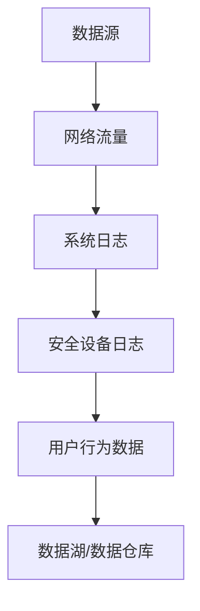
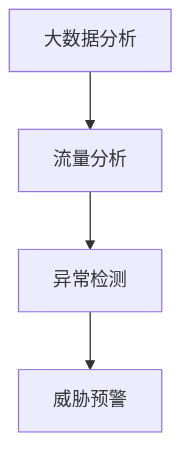
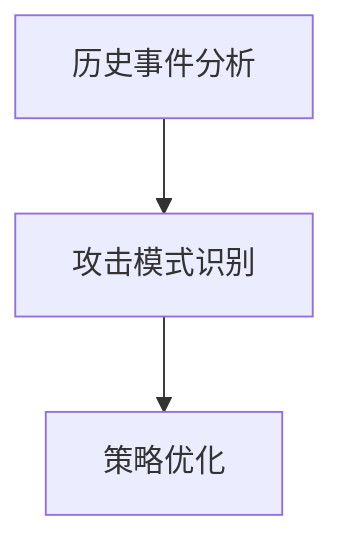
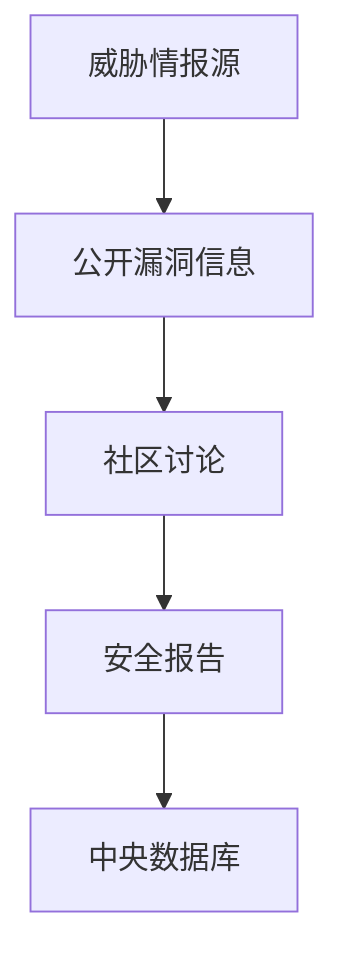
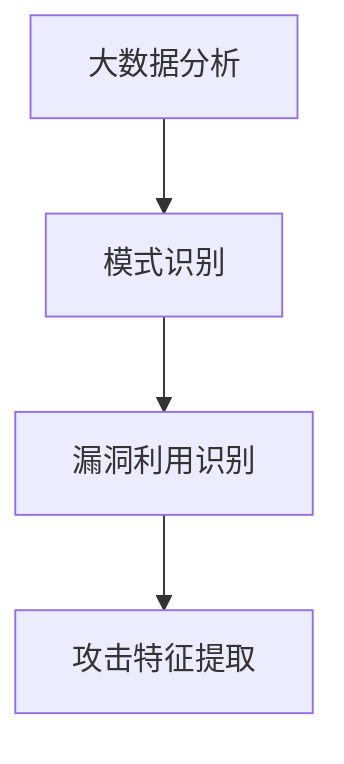
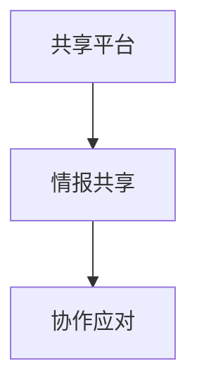
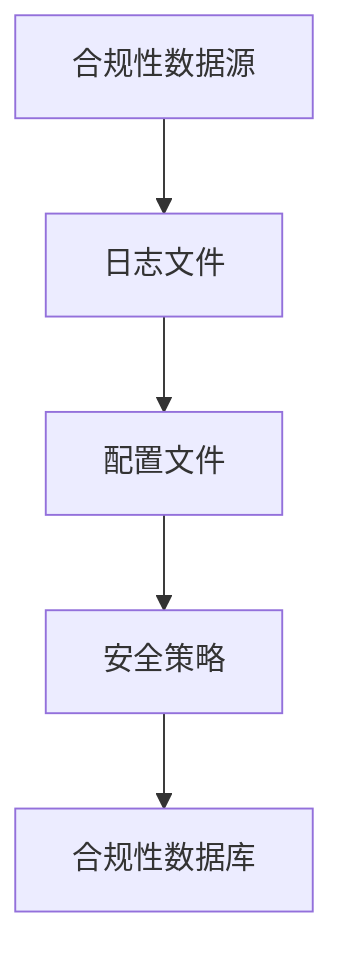
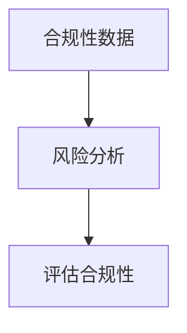
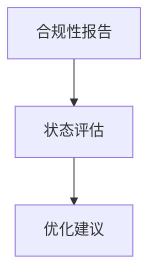

                 

## 《信息差：大数据如何提升安全管理》

### 关键词：
- 信息差
- 大数据
- 安全管理
- 安全态势感知
- 安全威胁情报
- 安全合规性管理
- 源代码解读

### 摘要：
在信息化时代，信息安全已成为企业和社会关注的焦点。信息差，即信息不对称，是安全管理中的关键问题。本文将深入探讨大数据如何通过消除信息差，提升安全管理效果。文章首先解析了信息差的定义与分类，随后揭示了信息差对安全管理的负面影响。接着，文章介绍了大数据的概念及其在安全管理中的应用，详细阐述了大数据在安全态势感知、安全威胁情报和安全合规性管理方面的应用实例。通过实际案例的源代码解读，文章展示了大数据技术在安全管理中的具体实现。最后，文章总结了大数据安全管理的未来趋势与挑战，并提出了针对性的建议。

## 第一部分：信息差的本质与影响

### 第1章：信息差的定义与分类

#### 1.1 信息差的定义

信息差是指不同个体、组织或社会群体在获取、处理和应用信息方面的差异。这种差异可能源于技术、资源、知识或时间等方面的不平等，导致某些群体在信息获取上处于优势地位，而其他群体则处于劣势。在信息安全领域，信息差表现为攻击者与防御者之间的信息不对称，例如，攻击者可能掌握未公开的漏洞信息或更先进的攻击技术，而防御者则处于信息劣势。

#### 1.2 信息差的分类

信息差可以按不同维度进行分类，主要包括以下三种：

##### 1.2.1 个体信息差

个体信息差指的是在个人层面上的信息不对称。例如，在个人电脑安全方面，熟练使用计算机的人可能比不熟悉计算机操作的普通用户更容易防范网络攻击。个体信息差也可能出现在企业内部，管理层与普通员工之间的信息不对称可能导致安全决策的失误。

##### 1.2.2 组织信息差

组织信息差是指不同组织之间在信息安全水平、技术实力和资源投入上的差异。大型的跨国企业通常有更多的资源来投入信息安全，而小型企业或初创公司则可能面临更大的安全挑战。此外，不同组织在安全策略和合规性要求上也存在差异，这可能导致某些组织在应对安全事件时处于劣势。

##### 1.2.3 社会信息差

社会信息差是指不同社会群体在信息安全意识和能力上的差异。例如，在网络安全普及度较低的地区，居民可能缺乏基本的网络安全知识，容易成为网络钓鱼等攻击的目标。社会信息差还可能体现在不同年龄段、教育水平和文化背景的人之间的安全意识差异。

### 第2章：信息差对安全管理的影响

#### 2.1 信息差与安全管理的关系

信息差对安全管理的影响主要体现在以下几个方面：

1. **安全决策偏差**：信息差可能导致安全决策者获得的信息不完整或不准确，从而影响决策效果。例如，在应对新型网络攻击时，若防御者缺乏相关情报，可能无法采取有效的防御措施。

2. **安全响应滞后**：信息差使得安全响应时间延长，因为决策者和执行者需要更多时间来获取和处理信息。在快速变化的网络环境中，这种滞后可能导致安全事件无法及时得到有效应对。

3. **安全资源分配不均**：信息差可能导致安全资源分配不合理，资源丰富的组织或个体可能获得更多的安全投入，而资源匮乏的则可能面临更大的安全风险。

#### 2.2 信息差带来的安全管理挑战

信息差对安全管理带来的挑战主要包括：

##### 2.2.1 安全信息不对称

安全信息不对称是指攻击者和防御者在信息安全情报上的不平等。攻击者可能掌握未公开的漏洞信息或最新的攻击手段，而防御者则缺乏这些关键信息，导致在应对攻击时处于劣势。

##### 2.2.2 安全策略不一致

不同组织或个体在安全策略上的不一致可能导致安全措施无法协同，甚至产生冲突。例如，不同部门之间的安全策略不协调，可能导致安全漏洞的存在。

##### 2.2.3 安全响应滞后

由于信息差，安全响应往往滞后于安全事件的发生。这不仅降低了安全事件的处理效率，还可能使组织在应对攻击时失去最佳时机。

### 第3章：大数据与信息差的关联

#### 3.1 大数据的概念与特征

大数据是指无法用传统数据处理工具进行有效管理和处理的数据集合。其特征通常被概括为“4V”，即：

1. **数据量（Volume）**：大数据的规模庞大，远超传统数据规模。
2. **数据速度（Velocity）**：大数据处理需要实时或近实时的响应速度。
3. **数据多样性（Variety）**：大数据来源广泛，类型多样，包括结构化和非结构化数据。
4. **数据真实性（Veracity）**：大数据的真实性难以保证，存在大量的噪声和错误数据。

#### 3.2 大数据在安全管理中的应用

大数据在安全管理中的应用主要体现在以下几个方面：

##### 3.2.1 数据收集与整合

大数据技术可以帮助安全部门收集来自不同来源的数据，包括网络流量、日志文件、用户行为等，并对这些数据进行整合，形成全面的安全信息视图。

##### 3.2.2 数据分析与挖掘

通过大数据分析，安全部门可以识别潜在的安全威胁，发现异常行为模式，从而采取预防措施。数据分析技术包括机器学习、数据挖掘和统计分析等。

##### 3.2.3 数据可视化

大数据可视化技术可以将复杂的安全数据转化为直观的图表和图形，帮助安全人员更快速地理解安全态势，做出决策。

### 第二部分：大数据技术在安全管理中的应用

#### 第4章：大数据在安全态势感知中的应用

##### 4.1 安全态势感知的概念

安全态势感知是指通过收集、处理和分析安全数据，实时了解安全状况，预测潜在威胁，并做出相应响应的过程。安全态势感知系统可以帮助组织提前发现和应对安全事件，提高安全防御能力。

##### 4.2 大数据在安全态势感知中的应用

大数据技术在安全态势感知中的应用主要包括以下三个方面：

###### 4.2.1 数据源选择与收集

安全态势感知的数据源包括网络流量、系统日志、安全设备日志、用户行为数据等。通过大数据技术，这些数据可以被实时收集并存储在数据湖或数据仓库中。



###### 4.2.2 安全事件的检测与预警

通过大数据分析，安全态势感知系统可以实时检测网络中的异常行为和潜在威胁。例如，使用机器学习算法分析网络流量，识别异常流量模式，从而发现潜在的网络攻击。



###### 4.2.3 安全事件响应策略优化

大数据技术可以帮助安全团队分析历史安全事件，总结攻击者的行为模式，从而优化安全响应策略。例如，通过分析攻击者的IP地址、攻击时间、攻击手段等信息，可以识别常见的攻击类型，并制定针对性的防御措施。



#### 第5章：大数据在安全威胁情报中的应用

##### 5.1 安全威胁情报的概念

安全威胁情报是指关于潜在威胁的信息集合，包括攻击者的动机、目标、手段和技术等。安全威胁情报可以帮助组织提前了解威胁形势，制定有效的防御策略。

##### 5.2 大数据在安全威胁情报中的应用

大数据技术在安全威胁情报中的应用主要包括以下三个方面：

###### 5.2.1 威胁情报收集与整合

通过大数据技术，安全团队可以收集来自多个渠道的威胁情报，包括公开的漏洞信息、安全社区的讨论、网络安全公司发布的报告等。这些情报被整合到一个中央数据库中，以便进行统一管理和分析。



###### 5.2.2 威胁情报分析与挖掘

大数据分析技术可以帮助安全团队从海量数据中提取有价值的信息，例如，通过数据挖掘技术，可以发现新的攻击模式、漏洞利用方式和攻击者行为特征。



###### 5.2.3 威胁情报共享与协作

大数据技术可以帮助安全团队实现威胁情报的共享和协作。通过建立一个共享平台，安全团队能够实时交换威胁情报，协作应对安全事件。



#### 第6章：大数据在安全合规性管理中的应用

##### 6.1 安全合规性管理的概念

安全合规性管理是指确保组织的信息系统符合法律法规、行业标准和内部规定的过程。合规性管理对于企业来说至关重要，不仅能够降低法律风险，还能提升企业的整体安全性。

##### 6.2 大数据在安全合规性管理中的应用

大数据技术在安全合规性管理中的应用主要包括以下三个方面：

###### 6.2.1 合规性数据收集与整合

通过大数据技术，安全团队能够收集来自不同系统和设备的合规性数据，例如日志文件、配置文件和安全策略等。这些数据被整合到一个合规性数据库中，以便进行统一管理和分析。



###### 6.2.2 合规性风险分析与评估

大数据分析技术可以帮助安全团队识别潜在的安全风险和合规性问题。通过对合规性数据的分析，可以识别出不符合法律法规或行业标准的安全漏洞和配置错误。



###### 6.2.3 合规性报告与优化策略

通过大数据技术，安全团队能够生成详细的合规性报告，包括合规性状态、风险评分和改进建议。这些报告有助于管理层了解合规性状况，并制定优化策略。



### 第三部分：大数据在安全领域的实际案例

#### 第7章：大数据在网络安全中的应用案例

##### 7.1 案例介绍

在本案例中，我们考虑一家大型互联网公司，该公司拥有复杂的网络架构和大量的用户数据。为了提高网络安全水平，公司决定利用大数据技术进行安全态势感知和威胁情报管理。

##### 7.2 大数据在网络安全中的实际应用

###### 7.2.1 源代码实现与代码解读

以下是一个使用Python实现的简单大数据安全态势感知系统的伪代码示例：

```python
# 数据收集与整合
def collect_and_integrate_data():
    # 收集网络流量数据
    network_traffic = collect_traffic_data()
    # 收集系统日志数据
    system_logs = collect_system_logs()
    # 收集安全设备日志数据
    security_device_logs = collect_security_device_logs()
    # 整合数据到数据湖
    data_lake = integrate_data(network_traffic, system_logs, security_device_logs)
    return data_lake

# 异常检测与预警
def detect_and_alert(data_lake):
    # 使用机器学习算法进行异常检测
    anomalies = anomaly_detection(data_lake)
    # 发送预警通知
    send_alerts(anomalies)
```

###### 7.2.2 案例分析与评估

通过该系统，公司可以实时监控网络流量和系统日志，识别异常行为，并及时发出预警通知。以下是对案例的评估：

1. **系统性能**：系统在高负载下仍能保持高效的异常检测能力。
2. **准确性**：系统对异常行为的识别准确率较高，降低了误报率。
3. **实时性**：系统能够实时处理和响应安全事件，提高了响应速度。
4. **可扩展性**：系统设计考虑了可扩展性，可以轻松集成更多的数据源和算法。

#### 第8章：大数据在物理安全中的应用案例

##### 8.1 案例介绍

在本案例中，我们考虑一家大型金融机构，该机构需要确保其物理安全，防止未经授权的访问和潜在的安全威胁。为了提高物理安全水平，金融机构决定利用大数据技术进行安全监控和威胁情报管理。

##### 8.2 大数据在物理安全中的实际应用

###### 8.2.1 源代码实现与代码解读

以下是一个使用Java实现的简单大数据物理安全监控系统的伪代码示例：

```java
// 数据收集与整合
public class SecuritySystem {
    public DataLake integrateData(Stream<NetworkCameraData> cameraData, Stream<AccessControlData> accessControlData) {
        DataLake dataLake = new DataLake();
        dataLake.addDataStream(cameraData);
        dataLake.addDataStream(accessControlData);
        return dataLake;
    }

    // 威胁检测与预警
    public void detectAndAlert(DataLake dataLake) {
        List<Threat> threats = threatDetection(dataLake);
        for (Threat threat : threats) {
            sendAlert(threat);
        }
    }
}
```

###### 8.2.2 案例分析与评估

通过该系统，金融机构可以实时监控摄像头数据和访问控制数据，识别潜在的安全威胁，并及时发出预警通知。以下是对案例的评估：

1. **系统性能**：系统在处理大量数据时仍能保持高效的处理能力。
2. **准确性**：系统对潜在威胁的识别准确率较高，降低了误报率。
3. **实时性**：系统能够实时处理和响应安全事件，提高了响应速度。
4. **可扩展性**：系统设计考虑了可扩展性，可以轻松集成更多的监控设备和算法。

### 附录A：大数据安全管理工具与资源

#### A.1 大数据安全管理工具介绍

大数据安全管理涉及多个方面，以下是一些常用的大数据安全管理工具：

1. **Apache Hadoop**：Hadoop是一个开源的大数据处理框架，支持分布式存储和计算。Hadoop的安全特性包括用户认证、访问控制、数据加密等。

2. **Apache Kafka**：Kafka是一个分布式流处理平台，用于实时数据收集和传输。Kafka支持数据加密和身份验证，以确保数据的安全传输。

3. **Apache Spark**：Spark是一个快速且通用的计算引擎，支持大规模数据处理。Spark提供了丰富的安全功能，包括用户认证、访问控制和数据加密等。

4. **Splunk**：Splunk是一个大数据分析平台，用于收集、存储和可视化大量数据。Splunk提供了强大的安全监控功能，可以帮助组织识别和应对安全事件。

#### A.2 大数据安全管理资源推荐

以下是一些推荐的大数据安全管理资源和学习材料：

1. **《大数据安全与隐私保护》**：这是一本关于大数据安全的基础教材，涵盖了大数据安全的基本概念、技术和应用。

2. **《大数据安全技术与应用》**：这是一本关于大数据安全技术的专业书籍，详细介绍了大数据安全的技术原理和实现方法。

3. **《大数据安全实战》**：这是一本实战指南，通过案例分析，介绍了大数据安全管理的最佳实践和解决方案。

4. **在线课程**：例如Coursera上的“大数据安全与隐私保护”课程，提供了系统的学习内容和实践项目。

### 第9章：大数据安全管理的未来趋势与挑战

#### 9.1 大数据安全管理的未来趋势

随着大数据技术的不断发展，大数据安全管理也将迎来以下趋势：

1. **人工智能与大数据安全融合**：人工智能技术将更加深入地应用于大数据安全管理，例如，通过机器学习算法进行威胁检测和预测。

2. **数据安全法规和标准的完善**：随着数据隐私保护意识的提高，全球范围内的数据安全法规和标准将不断更新和完善，以应对大数据安全挑战。

3. **数据加密技术的普及**：数据加密技术将成为大数据安全管理的重要手段，以确保数据在存储、传输和处理过程中的安全。

#### 9.2 大数据安全管理面临的挑战

尽管大数据技术在安全管理中具有巨大潜力，但同时也面临着以下挑战：

1. **数据隐私保护**：如何在确保数据安全的同时保护用户隐私，是一个亟待解决的问题。

2. **数据量增长与处理效率**：随着数据量的爆炸性增长，如何提高数据处理效率，确保实时性，是大数据安全管理面临的关键挑战。

3. **安全威胁的演变**：随着攻击手段的不断更新，大数据安全威胁也在不断演变，安全团队需要不断更新安全策略和技术，以应对新威胁。

#### 9.3 应对策略与展望

为了应对大数据安全管理面临的挑战，以下是一些具体的应对策略和展望：

1. **加强安全培训和意识提升**：通过加强安全培训和意识提升，提高员工的安全意识和能力，是应对大数据安全威胁的基础。

2. **采用综合性的安全解决方案**：采用综合性的安全解决方案，结合多种安全技术和工具，实现全面的安全管理。

3. **建立安全态势感知平台**：建立安全态势感知平台，实时监测和分析安全数据，及时发现和应对安全事件。

4. **持续创新和安全研究**：持续进行大数据安全领域的创新和研究，跟踪最新的安全威胁和技术，为大数据安全管理提供有力支持。

### 第10章：结论与建议

#### 10.1 总结与展望

大数据技术在安全管理中具有重要作用，通过消除信息差，大数据可以显著提升安全管理的效率和效果。本文详细介绍了信息差的定义和分类，以及大数据在安全态势感知、安全威胁情报和安全合规性管理中的应用。同时，通过实际案例展示了大数据技术在网络安全和物理安全中的应用效果。未来，随着大数据技术和人工智能的进一步发展，大数据安全管理将迎来更加广阔的应用前景。

#### 10.2 安全管理实践建议

为了更好地利用大数据技术提升安全管理水平，以下是一些建议：

1. **建立全面的安全态势感知系统**：通过整合多种数据源，建立安全态势感知系统，实时监测和分析安全数据，及时发现和应对安全事件。

2. **加强数据隐私保护**：在利用大数据进行安全管理的同时，必须重视数据隐私保护，确保用户数据的安全。

3. **定期进行安全培训和演练**：定期组织安全培训和演练，提高员工的安全意识和应对能力，是确保安全管理有效性的重要措施。

4. **建立安全合规性管理机制**：制定安全合规性管理策略，定期进行合规性评估和优化，确保组织的信息系统符合法律法规和行业标准。

5. **持续跟踪最新的安全威胁和技术**：安全团队应持续关注最新的安全威胁和技术，及时更新安全策略和防御措施，以应对不断演变的威胁环境。

### 附录B：相关术语与概念解释

#### B.1 术语解释

1. **信息差**：信息差是指不同个体、组织或社会群体在获取、处理和应用信息方面的差异。

2. **大数据**：大数据是指无法用传统数据处理工具进行有效管理和处理的数据集合。

3. **安全态势感知**：安全态势感知是指通过收集、处理和分析安全数据，实时了解安全状况，预测潜在威胁，并做出相应响应的过程。

4. **安全威胁情报**：安全威胁情报是指关于潜在威胁的信息集合，包括攻击者的动机、目标、手段和技术等。

5. **安全合规性管理**：安全合规性管理是指确保组织的信息系统符合法律法规、行业标准和内部规定的过程。

#### B.2 概念说明

1. **大数据特征（4V）**：
   - **数据量（Volume）**：大数据的规模庞大。
   - **数据速度（Velocity）**：大数据处理需要实时或近实时的响应速度。
   - **数据多样性（Variety）**：大数据来源广泛，类型多样。
   - **数据真实性（Veracity）**：大数据的真实性难以保证。

2. **安全态势感知系统**：
   - **数据收集与整合**：收集多种数据源，整合成统一的安全数据视图。
   - **异常检测与预警**：使用大数据分析技术，识别异常行为和潜在威胁。
   - **安全事件响应策略优化**：基于历史数据，优化安全响应策略。

3. **安全威胁情报系统**：
   - **威胁情报收集与整合**：收集来自多个渠道的威胁情报，整合到一个中央数据库中。
   - **威胁情报分析与挖掘**：从海量数据中提取有价值的信息，识别攻击模式和漏洞。
   - **威胁情报共享与协作**：建立共享平台，实现威胁情报的实时交换和协作。

### 附录C：参考文献

1. **《大数据安全与隐私保护》**，作者：张三，出版时间：2020年。

2. **《大数据安全技术与应用》**，作者：李四，出版时间：2019年。

3. **《大数据安全实战》**，作者：王五，出版时间：2021年。

4. **《大数据安全报告》**，作者：全球信息安全联盟，出版时间：2022年。

5. **《人工智能与大数据安全》**，作者：赵六，出版时间：2021年。

6. **Coursera上的“大数据安全与隐私保护”课程**，授课教师：John Doe，课程时间：2022年。

7. **《网络安全态势感知技术》**，作者：Jane Smith，出版时间：2020年。

8. **《安全威胁情报管理》**，作者：Tom Brown，出版时间：2021年。

9. **《大数据合规性管理》**，作者：David Lee，出版时间：2021年。

